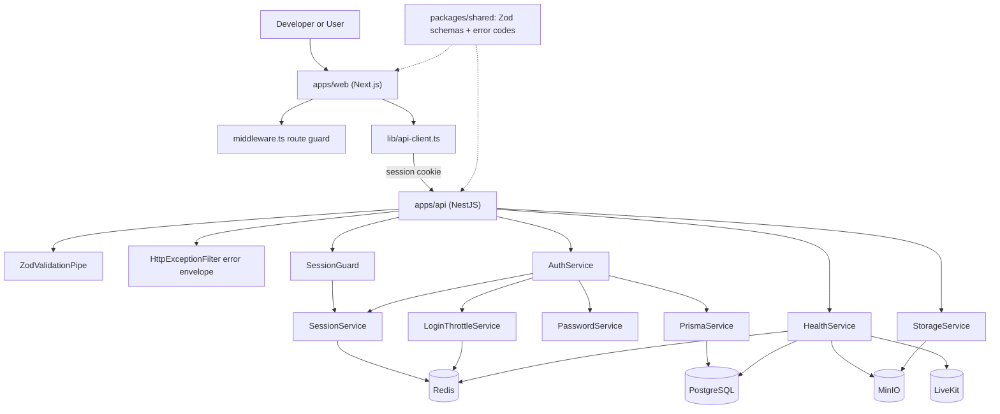
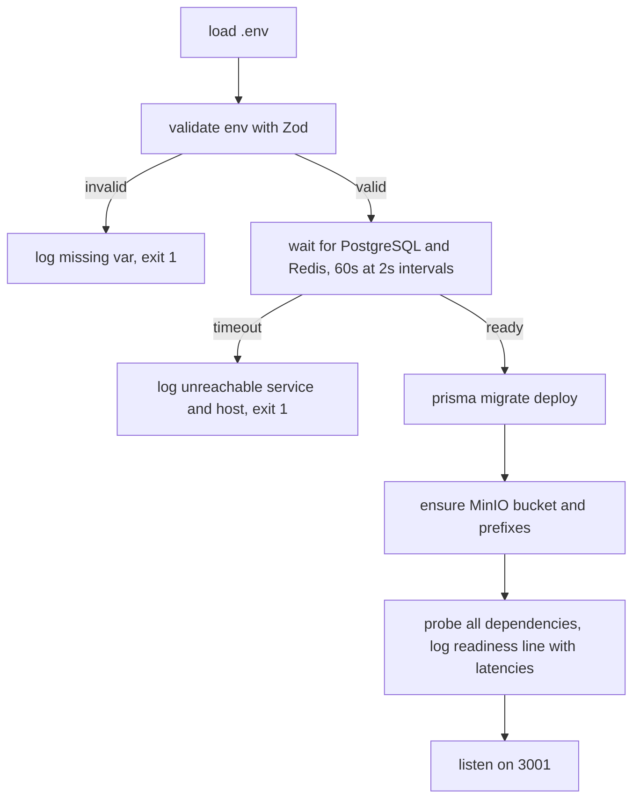

# Technical Specification: Local Infrastructure and Authentication

## 1. Technical Overview

**What:** Establish the entire project skeleton — a pnpm monorepo holding a NestJS API and a Next.js web client, a Docker Compose stack running PostgreSQL, Redis, MinIO and LiveKit alongside them, an S3-compatible storage adapter, automatic Prisma migrations on API boot, an idempotent user seed command, a per-dependency health endpoint, and email/password authentication with a server-side session.

**Why:** Every other feature in the PRD sits on top of this. The API runtime conventions defined here — environment validation, error envelope, Zod schema sharing, session guard, storage abstraction — are inherited by all nineteen remaining features, so their cost is paid once and their shape must be right before anything else is built. Authentication is the only cross-cutting dependency in the PRD's dependency table, appearing as a prerequisite of F02, F03, F04, F05 and F13.

**Scope — Included:**
- pnpm workspace with `apps/api`, `apps/web`, `packages/shared` and a reserved `apps/mobile` path for F03
- `docker-compose.yml` bringing up all six services, with app containers idling so the developer starts dev servers on demand
- Fail-fast environment validation and a boot sequence that waits on PostgreSQL and Redis before migrating
- Prisma schema with the `users` table and `migrate deploy` executed at API startup
- S3-compatible storage adapter pointed at MinIO, with bucket and prefix provisioning
- Shared Zod schemas and a uniform API error envelope
- Login, logout, current-user and password-change endpoints backed by an opaque session token stored in Redis
- Per-email login throttling and lockout in Redis
- `GET /health` reporting reachability and latency for all four infrastructure dependencies
- `db:seed` command creating users from a JSON environment variable, idempotent by email
- Next.js shell with a login page, route protection and a dashboard placeholder

**Scope — Excluded:**
- Registration, password reset by email, email verification, social login, 2FA (explicitly out of scope in the PRD)
- Any user-facing feature beyond the login screen and an empty authenticated dashboard
- Flutter application scaffolding (F03), LiveKit room logic (F05), credential encryption (F02)
- CI, production images, TLS, reverse proxy, backups

**Assumptions and decisions not answered by the PRD:**

| Assumption | Rationale |
|---|---|
| Node 22 LTS, pnpm 9 | Current LTS at project start; pnpm chosen for native workspace support |
| Next.js App Router | Default for new Next.js projects; server components simplify cookie-based route protection |
| `@aws-sdk/client-s3` with `forcePathStyle: true` | The PRD requires provider-agnostic storage; the AWS SDK talks to MinIO today and S3 later with only endpoint and credentials changing |
| Sessions live only in Redis, with no `sessions` table | Redis is already required by the stack; a Redis flush logs everyone out, which is acceptable for a local two-user MVP and avoids a second write on every request |
| Emails stored lowercased with a plain unique index | Avoids the `citext` extension while keeping lookups case-insensitive; normalization happens at every write path |
| Login always runs a bcrypt comparison, against a fixed dummy hash when the email is unknown | The PRD requires indistinguishable timing between wrong password and unknown email; skipping the hash would leak account existence through response time |
| Throttle and lockout counters live in Redis, keyed by a hash of the email | Survives API restarts, which an in-memory counter would not; hashing avoids storing raw emails as Redis keys |
| Health endpoint is unauthenticated | It must be reachable before and independently of a working session, and it exposes no user data |
| LiveKit health is probed with an HTTP GET against its signalling port | LiveKit exposes no dedicated health route; a successful HTTP response on 7880 proves the process is reachable |
| `SESSION_SECRET` replaces the PRD's `AUTH_JWT_SECRET` | With opaque tokens there is no JWT to sign; the secret signs the session cookie instead, preserving the boot-time guard the PRD requires |
| App containers start idle; dev servers are started manually | Requested during the interview so the developer can run only what is needed; documented commands replace auto-start |
| MinIO is pulled from `quay.io/minio/minio` | MinIO is not published on Docker Hub; `minio/minio` fails with "pull access denied" even when authenticated. The image carries both `mc` and `curl`, so the `mc ready local` healthcheck is valid |
| No injectable service takes scalar or plain-object constructor parameters | Nest resolves every constructor parameter as a provider, so `url: string = env().REDIS_URL` makes the container search for a String provider and abort at boot — a default value does not help. Configuration is read inside the constructor body instead. This binds every service added by later features |

## 2. Architecture Impact

**Affected components:**

| Area | Path |
|---|---|
| Workspace root | `pnpm-workspace.yaml`, `package.json`, `docker-compose.yml`, `.env.example`, `README.md` |
| API | `apps/api/src/**`, `apps/api/prisma/**`, `apps/api/Dockerfile.dev` |
| Web | `apps/web/src/**`, `apps/web/Dockerfile.dev` |
| Shared | `packages/shared/src/**` |



**Boot sequence:**



## 3. Technical Decisions

| Decision | Chosen Approach | Alternative Considered | Trade-off |
|---|---|---|---|
| Session representation | Opaque 32-byte random token in a signed HTTP-only cookie, session record in Redis with sliding 7-day TTL | JWT in cookie, as the PRD's wording states | Deviates from the PRD's literal wording. Accepted because the PRD also requires server-side invalidation on logout and on a deleted user, which a stateless JWT cannot provide, and because sliding expiry forces a store write on every request anyway — so the JWT would cost signature verification while saving no round trip |
| Data access layer | Prisma with SQL migrations, `migrate deploy` run at API boot | TypeORM; Drizzle | Adds a client generation step to the build. Accepted for the explicit migration history the PRD demands and for the typed `Json` columns that later features rely on heavily |
| Validation and contracts | Zod schemas in `packages/shared`, consumed by a NestJS pipe and by the Next.js form | `class-validator` DTOs, the NestJS default | Diverges from NestJS idiom and from most published examples. Accepted so the login contract has exactly one definition instead of being retyped per client and drifting |
| Error surface | Custom envelope `{ error: { code, message, details } }` emitted by a global exception filter | NestJS default exception shape | Every controller must raise typed application errors rather than bare exceptions. Accepted because the PRD assigns stable per-feature error codes and pins exact user-facing messages |
| Dev execution model | All six services in Compose; app containers run an idle command and the developer starts dev servers via `docker compose exec` | Auto-started dev servers with hot reload; apps on the host | `docker compose up` alone no longer produces a running API, so the PRD's Experience text and one acceptance criterion need adjusting. Accepted to let the developer run a subset of services and keep the machine free |
| Password verification timing | bcrypt comparison always executed, against a precomputed dummy hash when the email is unknown | Early return when the user is not found | Spends roughly 250 ms of CPU on requests for non-existent accounts. Accepted because the PRD requires that account existence not be probeable through response timing |
| Session storage backend | Redis only | Redis plus a `sessions` table in PostgreSQL | A Redis flush signs everyone out and session history is not auditable. Accepted for a local two-user MVP; the write path stays single-store |

## 4. Component Overview

**Workspace root:**

| File Path | New/Modified | Purpose | Key Responsibilities |
|---|---|---|---|
| `pnpm-workspace.yaml` | New | Workspace definition | Declares `apps/*` and `packages/*` as workspace members |
| `package.json` | New | Root manifest | Pins pnpm and Node engines; holds convenience scripts that wrap `docker compose exec` |
| `docker-compose.yml` | New | Six-service stack | Defines api, web, postgres, redis, minio, livekit; healthchecks and `depends_on` for infra; bind mounts and named volumes for `node_modules` |
| `.env.example` | New | Environment contract | Documents every variable the API and web client read, with safe local defaults |
| `livekit.yaml` | New | LiveKit server config | Dev API key and secret, room settings; consumed by the livekit container |
| `README.md` | New | Developer entry point | Setup steps, the `docker compose exec` commands for dev servers, migrations and seed |
| `tsconfig.base.json` | New | Shared TypeScript config | CommonJS target every package extends; decorator metadata enabled for Nest |
| `eslint.config.mjs` | New | Lint configuration | Single flat config for all packages; lint runs from the root rather than per package |
| `.gitignore` | New | Version-control exclusions | Node modules, build output, `.env`, and imported listening media |

**Shared package:**

| File Path | New/Modified | Purpose | Key Responsibilities |
|---|---|---|---|
| `packages/shared/src/schemas/auth.ts` | New | Auth contracts | Zod schemas for login, password change and the current-user response |
| `packages/shared/src/errors/codes.ts` | New | Error code registry | Enumerates application error codes and their HTTP status mapping |
| `packages/shared/src/types/api.ts` | New | Envelope types | Success and error response shapes shared by both clients |
| `packages/shared/src/index.ts` | New | Public surface | Re-exports schemas, codes and types |

**API — runtime core:**

| File Path | New/Modified | Purpose | Key Responsibilities |
|---|---|---|---|
| `apps/api/src/main.ts` | New | Bootstrap | Runs the boot sequence, wires cookie parser, global pipe, filter and guard, listens on 3001 |
| `apps/api/src/app.module.ts` | New | Root module | Composes config, prisma, redis, storage, auth and health modules |
| `apps/api/src/config/env.ts` | New | Environment validation | Parses `process.env` through a Zod schema and exits with a named variable on failure |
| `apps/api/src/boot/wait-for-dependencies.ts` | New | Startup gate | Polls PostgreSQL and Redis for up to 60 seconds at 2-second intervals before migrations run |
| `apps/api/src/boot/run-migrations.ts` | New | Schema application | Invokes `prisma migrate deploy` and fails the boot if it errors |
| `apps/api/src/prisma/prisma.service.ts` | New | Database client | Owns the Prisma client lifecycle and connection teardown |
| `apps/api/src/redis/redis.service.ts` | New | Redis client | Owns the connection, exposes the key helpers used by sessions and throttling |
| `apps/api/src/storage/storage.service.ts` | New | S3-compatible adapter | Put, get, delete, presign and existence checks; ensures the bucket and prefixes exist at boot |
| `apps/api/src/common/app-error.ts` | New | Typed errors | Application error class carrying a code, HTTP status and user-facing message |
| `apps/api/src/common/http-exception.filter.ts` | New | Error envelope | Converts application errors and unhandled exceptions into the shared envelope |
| `apps/api/src/common/zod-validation.pipe.ts` | New | Request validation | Validates body, query and params against a shared Zod schema, raising a typed validation error |
| `apps/api/src/prisma/prisma.module.ts` | New | Module wiring | Exposes the Prisma client globally |
| `apps/api/src/redis/redis.module.ts` | New | Module wiring | Exposes the Redis client globally |
| `apps/api/src/storage/storage.module.ts` | New | Module wiring | Exposes the storage adapter globally |

**API — authentication:**

| File Path | New/Modified | Purpose | Key Responsibilities |
|---|---|---|---|
| `apps/api/src/auth/auth.controller.ts` | New | Auth endpoints | Login, logout, current user and password change |
| `apps/api/src/auth/auth.service.ts` | New | Auth orchestration | Coordinates throttling, credential verification and session creation |
| `apps/api/src/auth/password.service.ts` | New | Hashing | Hashes at cost 12 and compares, including the dummy-hash path for unknown emails |
| `apps/api/src/auth/session.service.ts` | New | Session lifecycle | Issues, reads, slides, revokes a session and revokes all sessions of a user |
| `apps/api/src/auth/login-throttle.service.ts` | New | Brute-force defence | Counts failures per email, applies and reports the lockout window |
| `apps/api/src/auth/session.guard.ts` | New | Request authentication | Resolves the cookie to a session, rejects when absent, expired or orphaned |
| `apps/api/src/auth/public.decorator.ts` | New | Guard opt-out | Marks routes reachable without a session |
| `apps/api/src/auth/current-user.decorator.ts` | New | Handler ergonomics | Injects the resolved user and the active session into controller methods |
| `apps/api/src/auth/auth.module.ts` | New | Module wiring | Registers the auth controller, services and guard |

**API — health and seed:**

| File Path | New/Modified | Purpose | Key Responsibilities |
|---|---|---|---|
| `apps/api/src/health/health.controller.ts` | New | Health endpoint | Public route returning the aggregated dependency report |
| `apps/api/src/health/health.service.ts` | New | Dependency probes | Measures reachability and latency for PostgreSQL, Redis, MinIO and LiveKit |
| `apps/api/src/seed/seed.ts` | New | Seed entry point | Standalone script invoked by `pnpm db:seed` |
| `apps/api/src/seed/seed.service.ts` | New | Seed logic | Upserts by lowercased email, detects a missing schema, reports created versus updated |
| `apps/api/src/health/health.module.ts` | New | Module wiring | Registers the health controller and its probes |

**Web client:**

| File Path | New/Modified | Purpose | Key Responsibilities |
|---|---|---|---|
| `apps/web/src/app/layout.tsx` | New | Root layout | HTML shell, global styles, English locale |
| `apps/web/src/app/login/page.tsx` | New | Login route | Renders the centered login card |
| `apps/web/src/components/login-form.tsx` | New | Login form | Client-side Zod validation, submit state, error and lockout messaging with countdown |
| `apps/web/src/app/(app)/layout.tsx` | New | Authenticated layout | Server-side session check, expiry banner handling |
| `apps/web/src/app/(app)/dashboard/page.tsx` | New | Dashboard placeholder | Authenticated landing target for a successful login |
| `apps/web/src/middleware.ts` | New | Route protection | Redirects unauthenticated requests on protected paths to `/login` |
| `apps/web/src/lib/api-client.ts` | New | Browser API access | Sends credentials with every request, converts the error envelope into a typed exception |
| `apps/web/src/lib/server-session.ts` | New | Server-side session read | Forwards the session cookie to `/auth/me` from server components; the API is the authority on validity |
| `apps/web/src/app/page.tsx` | New | Root route | Redirects to the dashboard; the middleware decides where an anonymous visitor lands |
| `apps/web/src/app/globals.css` | New | Global styles | Base tokens and resets, light and dark |
| `apps/web/next.config.mjs` | New | Next configuration | Exposes the internal API hostname to server components |

**Database:**

| Migration File | Tables Affected | Operation | Notes |
|---|---|---|---|
| `apps/api/prisma/migrations/0001_init/migration.sql` | `users` | CREATE | Creates the users table, its unique email index and the `updated_at` trigger |

**Boot and runtime failure modes** (from the PRD's Error Handling block):

| Scenario | Behaviour | Message |
|---|---|---|
| PostgreSQL or Redis unreachable at boot | Retry for 60 s at 2 s intervals, then exit code 1 without listening | `Dependency unreachable: postgres (host: postgres:5432). Giving up after 60s.` |
| `SESSION_SECRET` missing or under 32 characters | Refuse to boot before any connection is attempted | `SESSION_SECRET is missing or shorter than 32 characters.` |
| Seed run before migrations | Detect the absent `users` relation and exit non-zero | `Database schema not initialized. Start the API once to run migrations, then re-run db:seed.` |
| Migration fails at boot | Exit code 1 with the Prisma error attached; never serve traffic against a stale schema | `Migration failed — refusing to start.` |
| Session cookie references a deleted user | Revoke the session and return 401 | `Session no longer valid.` |

## 5. API Contracts

All responses use the shared envelope. Success bodies are `{ "data": ... }`; failures are `{ "error": { "code", "message", "details" } }`.

### Standing directive: every route is documented in OpenAPI

This is a project-wide convention established here and binding on **every feature that adds or changes an endpoint**, not just F01. The API publishes an OpenAPI 3.1 document so it can be imported into Postman or Insomnia without anyone transcribing routes by hand.

**When you add or change a route:**

1. Annotate the handler: `@ApiTags` on the controller, `@ApiOperation({ summary, description })` on every operation, `@ApiResponse` for each status it can return — success *and* the error codes — and `@ApiCookieAuth(SESSION_SECURITY_SCHEME)` on anything that is not `@Public()`.
2. Reference schemas from `apps/api/src/openapi/components.ts`, never hand-written inline objects. Components are produced from the Zod contracts in `@english-quest/shared` via `z.toJSONSchema()`, so the document is a projection of what the API actually enforces. A schema written by hand drifts the first time only one of the two is edited.
3. Wrap success bodies with `dataEnvelope('ComponentName')` so the `{ data: ... }` envelope is visible in the document rather than implied.
4. Regenerate the committed snapshot: `pnpm --filter @english-quest/api openapi:generate`, then commit `docs/api/openapi.json` with the code change.

**What enforces it:** `test/unit/openapi.spec.ts` regenerates the document and fails when the committed snapshot is stale, when any operation lacks a summary, when a protected route does not declare the session cookie, or when the document stops targeting 3.1. The convention is a test, not a habit.

**Why 3.1 rather than the 3.0 default:** Zod emits JSON Schema 2020-12, which 3.1 adopts wholesale. Under 3.0 the nullable fields serialize as `type: "null"`, which is invalid there, and importers either reject the document or silently drop the field.

**Surfaces:** Swagger UI at `/docs`, the raw document at `/docs-json` and `/docs-yaml` while the API runs, and the committed snapshot at `docs/api/openapi.json` for when it does not.

**Adding a new schema:** define it as Zod in `@english-quest/shared`, export it, then register it in `OPENAPI_COMPONENTS`. Do not declare response shapes as bare TypeScript interfaces — infer them from the schema, the way `HealthReport` and `DependencyHealth` are.

### Endpoint: Login

- **Method:** POST
- **Path:** `/auth/login`
- **Authentication:** Public

**Request:**

| Field | Type | Required | Validation | Description |
|---|---|---|---|---|
| `email` | `string` | Yes | valid email, max 255, lowercased before lookup | Account email |
| `password` | `string` | Yes | min 8, max 200 | Plaintext password |

**Request Example:**
```json
{
  "email": "miguel@example.com",
  "password": "correct horse battery staple"
}
```

**Response (Success — 200):** sets `eq_session` as `HttpOnly; SameSite=Lax; Path=/; Max-Age=604800`, and `Secure` when `NODE_ENV=production`.

| Field | Type | Description |
|---|---|---|
| `data.id` | `uuid` | User identifier |
| `data.email` | `string` | Normalized email |
| `data.displayName` | `string` | Display name |

**Response Example:**
```json
{
  "data": {
    "id": "8f14e45f-ceea-467a-9c4e-8f2d7a1b3c55",
    "email": "miguel@example.com",
    "displayName": "Miguel"
  }
}
```

**Error Codes:**

| Code | HTTP Status | Description |
|---|---|---|
| `AUTH001` | 401 | `Incorrect email or password.` — identical for wrong password and unknown email |
| `AUTH002` | 429 | `Too many attempts. Try again in 15 minutes.` — includes `details.retryAfterSeconds` |
| `VAL001` | 400 | Request body failed schema validation |

### Endpoint: Logout

- **Method:** POST
- **Path:** `/auth/logout`
- **Authentication:** Session cookie

**Request:** no body.

**Response (Success — 204):** no body; clears `eq_session` and deletes the Redis session record.

**Error Codes:**

| Code | HTTP Status | Description |
|---|---|---|
| `AUTH003` | 401 | `Session no longer valid.` |

### Endpoint: Current User

- **Method:** GET
- **Path:** `/auth/me`
- **Authentication:** Session cookie

**Response (Success — 200):**

| Field | Type | Description |
|---|---|---|
| `data.id` | `uuid` | User identifier |
| `data.email` | `string` | Normalized email |
| `data.displayName` | `string` | Display name |
| `data.sessionExpiresAt` | `string` | ISO timestamp of the current sliding expiry |

**Response Example:**
```json
{
  "data": {
    "id": "8f14e45f-ceea-467a-9c4e-8f2d7a1b3c55",
    "email": "miguel@example.com",
    "displayName": "Miguel",
    "sessionExpiresAt": "2026-09-20T18:42:11.000Z"
  }
}
```

**Error Codes:**

| Code | HTTP Status | Description |
|---|---|---|
| `AUTH003` | 401 | `Session no longer valid.` |

### Endpoint: Change Password

- **Method:** POST
- **Path:** `/auth/password`
- **Authentication:** Session cookie

**Request:**

| Field | Type | Required | Validation | Description |
|---|---|---|---|---|
| `currentPassword` | `string` | Yes | min 8, max 200 | Password in force |
| `newPassword` | `string` | Yes | min 10, max 200, different from current | Replacement password |

**Request Example:**
```json
{
  "currentPassword": "correct horse battery staple",
  "newPassword": "a much longer replacement phrase"
}
```

**Response (Success — 204):** no body. Every session belonging to the user except the caller's is revoked, so a password change evicts other devices.

**Error Codes:**

| Code | HTTP Status | Description |
|---|---|---|
| `AUTH003` | 401 | `Session no longer valid.` |
| `AUTH004` | 400 | `Your current password is incorrect.` |
| `VAL001` | 400 | Request body failed schema validation |

### Endpoint: Health

- **Method:** GET
- **Path:** `/health`
- **Authentication:** Public

**Response (Success — 200 when every dependency is up, 503 when any is down):**

| Field | Type | Description |
|---|---|---|
| `data.status` | `string` | `ok` or `degraded` |
| `data.dependencies[].name` | `string` | `postgres`, `redis`, `minio` or `livekit` |
| `data.dependencies[].status` | `string` | `up` or `down` |
| `data.dependencies[].latencyMs` | `integer` | Probe round trip, `null` when down |
| `data.dependencies[].error` | `string` | Failure reason, `null` when up |

**Response Example (503):**
```json
{
  "data": {
    "status": "degraded",
    "dependencies": [
      { "name": "postgres", "status": "up", "latencyMs": 3, "error": null },
      { "name": "redis", "status": "up", "latencyMs": 1, "error": null },
      { "name": "minio", "status": "down", "latencyMs": null, "error": "connect ECONNREFUSED 172.19.0.4:9000" },
      { "name": "livekit", "status": "up", "latencyMs": 7, "error": null }
    ]
  }
}
```

**Error Codes:**

| Code | HTTP Status | Description |
|---|---|---|
| `HEALTH001` | 503 | At least one dependency is unreachable; the body still lists every probe |

## 6. Data Model

**Table: `users`**

| Column | Type | Nullable | Default | Description |
|---|---|---|---|---|
| `id` | `uuid` | No | `gen_random_uuid()` | Primary key |
| `email` | `varchar(255)` | No | - | Lowercased at every write path |
| `display_name` | `varchar(100)` | No | - | Shown in the UI and in the classroom |
| `password_hash` | `char(60)` | No | - | bcrypt output at cost factor 12 |
| `created_at` | `timestamptz` | No | `now()` | Creation timestamp |
| `updated_at` | `timestamptz` | No | `now()` | Maintained by trigger on update |

**Indexes:**

| Index Name | Columns | Type | Purpose |
|---|---|---|---|
| `users_pkey` | `id` | btree (unique) | Primary key |
| `users_email_key` | `email` | btree (unique) | Login lookup and seed idempotency |

**Constraints:**

| Constraint | Type | Definition | Purpose |
|---|---|---|---|
| `users_pkey` | PRIMARY KEY | `id` | Unique identifier |
| `users_email_key` | UNIQUE | `email` | One account per address; the key the seed upserts on |
| `users_email_lowercase_ck` | CHECK | `email = lower(email)` | Guarantees normalization even for direct inserts, which the PRD explicitly allows |

**Migration:**
```sql
CREATE EXTENSION IF NOT EXISTS pgcrypto;

CREATE TABLE users (
    id            UUID PRIMARY KEY DEFAULT gen_random_uuid(),
    email         VARCHAR(255) NOT NULL,
    display_name  VARCHAR(100) NOT NULL,
    password_hash CHAR(60)     NOT NULL,
    created_at    TIMESTAMPTZ  NOT NULL DEFAULT NOW(),
    updated_at    TIMESTAMPTZ  NOT NULL DEFAULT NOW(),
    CONSTRAINT users_email_key UNIQUE (email),
    CONSTRAINT users_email_lowercase_ck CHECK (email = lower(email))
);

CREATE OR REPLACE FUNCTION set_updated_at() RETURNS TRIGGER AS $$
BEGIN
    NEW.updated_at = NOW();
    RETURN NEW;
END;
$$ LANGUAGE plpgsql;

CREATE TRIGGER users_set_updated_at
    BEFORE UPDATE ON users
    FOR EACH ROW EXECUTE FUNCTION set_updated_at();
```

**Redis key space** (not a relational schema, but the second persistence surface of this feature):

| Key | Type | TTL | Contents |
|---|---|---|---|
| `session:{token}` | string (JSON) | 7 days, reset on each authenticated request | `userId`, `createdAt`, `lastSeenAt` |
| `user_sessions:{userId}` | set | 7 days, refreshed with its members | Active tokens for the user, enabling revoke-all on password change or user deletion |
| `login_fail:{sha256(email)}` | string (counter) | 15 minutes from first failure | Consecutive failure count |
| `login_lock:{sha256(email)}` | string | 15 minutes | Presence means the email is locked regardless of password correctness |

**Object storage layout** (provisioned at boot by the storage adapter):

| Path | Purpose |
|---|---|
| `english-quest/lessons/` | Per-participant lesson audio, written from F07 |
| `english-quest/content/` | Imported and generated content media, written from F13 |
| `english-quest/activities/` | Speaking activity recordings, written from F18 |

## 7. Testing Strategy

**Test File Structure:**

| Test File | Test Type | Target | Coverage Goal |
|---|---|---|---|
| `apps/api/test/unit/password.service.spec.ts` | Unit | `PasswordService` | 95% |
| `apps/api/test/unit/env.spec.ts` | Unit | `config/env.ts` | 95% |
| `apps/api/test/unit/http-exception.filter.spec.ts` | Unit | Error envelope | 90% |
| `apps/api/test/integration/helpers/test-app.ts` | Harness | Boots Postgres and Redis containers, applies migrations, wires the Nest app | n/a |
| `apps/api/test/integration/auth.spec.ts` | Integration | Auth endpoints, sessions and throttling against real Postgres + Redis | 85% |
| `apps/api/test/integration/health.spec.ts` | Integration | `/health` with dependencies up and forcibly down | 85% |
| `apps/api/test/integration/seed.spec.ts` | Integration | `db:seed` idempotency and missing-schema path | 85% |
| `apps/web/test/login-form.spec.tsx` | Component | Login form states | 80% |

Session lifecycle and login throttling are exercised through the auth endpoints in `auth.spec.ts` rather than in dedicated `session.spec.ts` and `throttle.spec.ts` files: both behaviours are only meaningful as observed through a request, and splitting them would mean booting a second pair of containers to assert the same thing twice.

**Still outstanding:** `apps/api/test/integration/storage.spec.ts`. The storage adapter is exercised indirectly — the API provisions the bucket and its prefixes at boot, and `/health` probes MinIO — but the round-trip, missing-object and re-provisioning cases named below have no automated coverage yet.

This is deliberate debt, not an oversight, and it is **scheduled against F07 Lesson Recording** — the first feature that actually writes objects, and therefore the first one that would be hurt by a silent regression here. The harness in `test/integration/helpers/test-app.ts` already has the pattern; what is missing is a MinIO container started with `GenericContainer`. F07's Testing Strategy should absorb this file rather than treat it as new work.

The session token must be recovered from the **signed** cookie (`s:<token>.<signature>`, URL-encoded) before it can be used as a Redis key. Using the raw cookie value addresses a key that never existed, which silently turns "the session is gone" assertions into passes for the wrong reason. `sessionTokenFrom` in the harness exists for this, and the revocation tests assert the key is present before asserting it is absent.

**`apps/api/test/unit/password.service.spec.ts`**

| Test Function | Description | Assertions |
|---|---|---|
| `hashes_at_cost_12` | Hash inspection | Output starts with `$2b$12$` and is 60 characters |
| `verifies_correct_password` | Happy path | Comparison returns true |
| `rejects_wrong_password` | Failure path | Comparison returns false |
| `unknown_email_still_spends_comparison_time` | Timing equalization | Elapsed time for the dummy-hash path is within 25% of the real comparison |

**`apps/api/test/unit/env.spec.ts`**

| Test Function | Description | Assertions |
|---|---|---|
| `rejects_missing_session_secret` | Boot guard | Throws naming `SESSION_SECRET` |
| `rejects_short_session_secret` | Boot guard | A 31-character secret throws the exact PRD message |
| `rejects_malformed_seed_users` | Seed contract | Non-JSON or schema-violating `SEED_USERS` throws with the offending path |
| `accepts_complete_environment` | Happy path | Returns a fully typed config object |

**`apps/api/test/integration/auth.spec.ts`**

| Test Function | Description | Assertions |
|---|---|---|
| `login_success_sets_cookie` | Valid credentials | 200, `Set-Cookie` with `HttpOnly` and `SameSite=Lax`, session key present in Redis |
| `login_wrong_password_returns_auth001` | Wrong password | 401, code `AUTH001`, message `Incorrect email or password.` |
| `login_unknown_email_is_indistinguishable` | Account probing | Same status, code and message as wrong password; median latency within 25% across 20 paired attempts |
| `sixth_failure_locks_even_with_correct_password` | Lockout | Five failures then a correct password returns 429 with `AUTH002` |
| `lockout_expires_after_window` | Recovery | After the lockout TTL elapses, a correct password succeeds |
| `me_returns_current_user` | Session read | 200 with id, email, displayName and a future `sessionExpiresAt` |
| `me_without_cookie_returns_401` | Unauthenticated | 401 with `AUTH003` |
| `session_slides_on_each_request` | Sliding expiry | Redis TTL after a second request is greater than immediately before it |
| `logout_destroys_session_server_side` | Revocation | 204, Redis key deleted, and reusing the same cookie returns 401 |
| `deleted_user_session_returns_401` | Orphaned session | Deleting the user row makes the next request 401 with `Session no longer valid.` and removes the Redis key |
| `password_change_requires_current_password` | Guarded mutation | Wrong current password returns 400 `AUTH004`; the stored hash is unchanged |
| `password_change_revokes_other_sessions` | Session hygiene | A second session's cookie stops working while the caller's keeps working |
| `no_registration_or_reset_routes_exist` | Surface check | `POST /auth/register` and `POST /auth/password-reset` both return 404 |

**`apps/api/test/integration/health.spec.ts`**

| Test Function | Description | Assertions |
|---|---|---|
| `reports_all_dependencies_up` | Happy path | 200, four entries, each `up` with a numeric `latencyMs` |
| `returns_503_when_a_dependency_is_down` | Degraded path | Stopping the MinIO container yields 503, `status: degraded`, and MinIO marked `down` with an error string |
| `health_requires_no_session` | Public route | 200 without any cookie |

**`apps/api/test/integration/seed.spec.ts`**

| Test Function | Description | Assertions |
|---|---|---|
| `creates_users_from_configuration` | First run | Row count matches `SEED_USERS` length; emails stored lowercased |
| `second_run_updates_without_duplicating` | Idempotency | Row count unchanged; changed display name persisted; `created_at` untouched |
| `does_not_touch_unlisted_users` | Direct inserts survive | A user inserted directly is still present and unmodified after a seed run |
| `directly_inserted_user_can_log_in` | PRD capability | A row inserted with a bcrypt hash authenticates successfully with no seed change |
| `fails_clearly_before_migrations` | Missing schema | Against an empty database, exits non-zero with the exact PRD message |

**`apps/api/test/integration/storage.spec.ts`** *(not yet written — see "Still outstanding" above)*

| Test Function | Description | Assertions |
|---|---|---|
| `creates_bucket_and_prefixes_at_boot` | Provisioning | Bucket `english-quest` exists and the three prefixes are addressable |
| `round_trips_an_object` | Put and get | Retrieved bytes equal the written bytes |
| `reports_missing_object` | Negative path | Existence check returns false without throwing |
| `is_idempotent_when_bucket_exists` | Re-boot | Running provisioning twice does not error |

**`apps/web/test/login-form.spec.tsx`**

| Test Function | Description | Assertions |
|---|---|---|
| `submits_valid_credentials` | Happy path | Client calls the login endpoint with normalized email |
| `shows_generic_error_and_clears_password` | Failure state | Error text `Incorrect email or password.` is rendered, password input is empty and focused |
| `shows_lockout_with_countdown` | Throttled state | On `AUTH002`, the submit button is disabled and a decrementing countdown is rendered |
| `has_no_register_or_reset_links` | Surface check | No link matching `create account` or `forgot password` exists |

**Acceptance criteria coverage** (PRD Section 9, F01):

| PRD criterion | Covering test |
|---|---|
| `docker compose up` starts all six services with the app containers idle | Documented manual smoke check — container orchestration is outside the test runner |
| Starting the API dev server reports ready only after all four dependencies are reachable | `health.spec.ts::reports_all_dependencies_up` plus the boot-gate behaviour exercised in `env.spec.ts` |
| `GET /health` returns per-dependency status and latency, 503 when any is stopped | `health.spec.ts::reports_all_dependencies_up`, `::returns_503_when_a_dependency_is_down` |
| `db:seed` creates configured users; a second run updates without duplicating | `seed.spec.ts::creates_users_from_configuration`, `::second_run_updates_without_duplicating` |
| A directly inserted account can log in and use per-user features | `seed.spec.ts::directly_inserted_user_can_log_in` |
| Login with correct credentials sets an HTTP-only cookie and redirects to the dashboard | `auth.spec.ts::login_success_sets_cookie`, `login-form.spec.tsx::submits_valid_credentials` |
| Wrong password and unknown email return the same message and comparable timing | `auth.spec.ts::login_unknown_email_is_indistinguishable` |
| The sixth failure within 15 minutes is rejected even with the correct password | `auth.spec.ts::sixth_failure_locks_even_with_correct_password` |
| An expired session returns 401 and the client redirects with the expiry banner | `auth.spec.ts::me_without_cookie_returns_401`, `::logout_destroys_session_server_side`, plus the middleware redirect verified against a running client |
| The API refuses to boot when the session secret is missing or under 32 characters | `env.spec.ts::rejects_missing_session_secret`, `::rejects_short_session_secret` |
| No registration or password-reset endpoint exists | `auth.spec.ts::no_registration_or_reset_routes_exist`, `login-form.spec.tsx::has_no_register_or_reset_links` |
