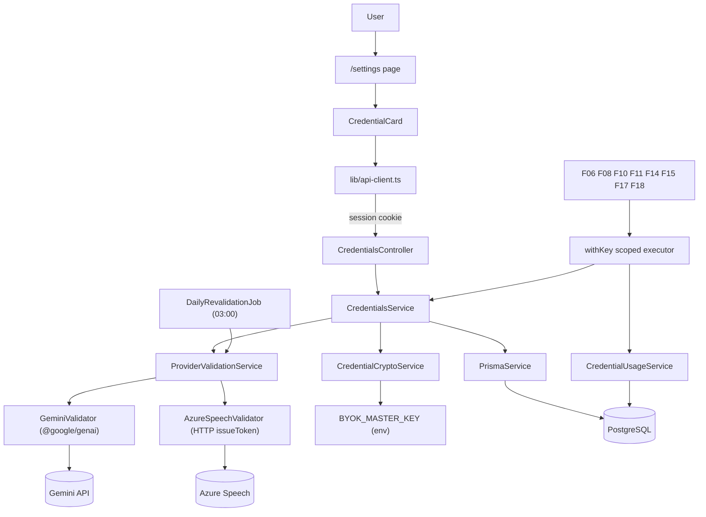
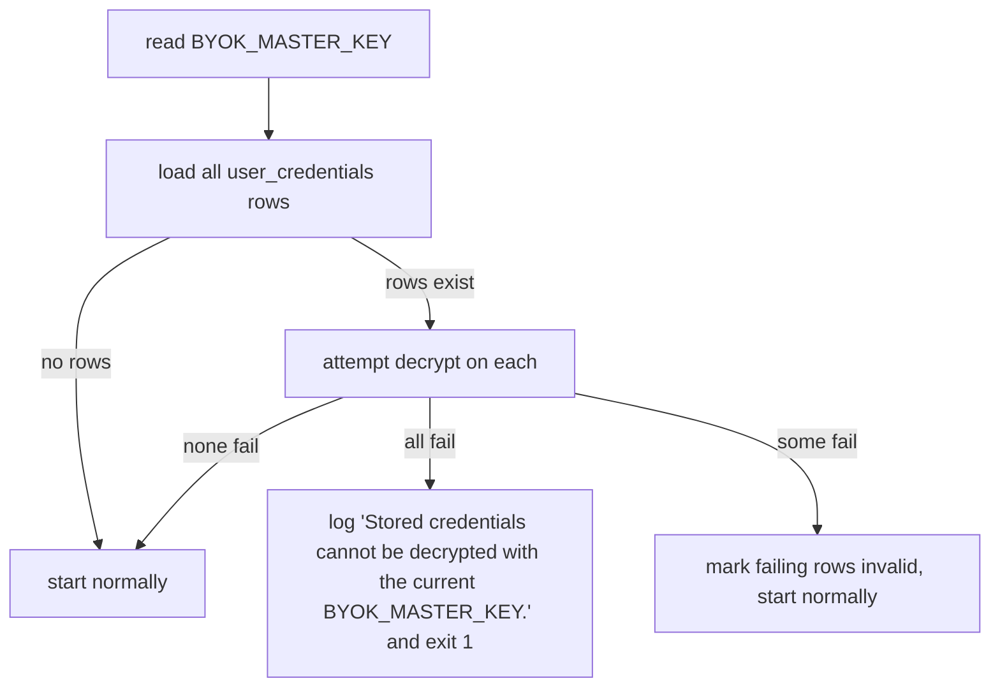

# Technical Specification: BYOK Credential Vault

## 1. Technical Overview

**What:** A per-user vault holding one Gemini API key and one Azure Speech key (with its region), encrypted at rest with AES-256-GCM, validated against the provider the moment they are saved, re-validated daily, and handed to consuming features through a scoped executor that audits every use.

**Why:** Seven later features cannot run without a key from this vault, and it is the only place in the codebase that will ever hold third-party credentials. Building it now, while the codebase is small, fixes the handling pattern — encrypt at rest, never log the plaintext, never return it over the wire — before eight consumers exist to copy or diverge from it. It is also the feature that makes the PRD's cost model real: with the key on the user's own account, consumption is attributable per person.

**Scope — Included:**
- `user_credentials` table with one row per user and provider, storing ciphertext, IV and auth tag separately
- AES-256-GCM encryption keyed by `BYOK_MASTER_KEY`, plus a boot-time decryptability probe
- Provider validation on save: `@google/genai` model listing for Gemini, token issuance for Azure Speech, both under a 5-second budget
- Status lifecycle across `valid`, `invalid`, `unverified` and `missing`
- REST surface to list, save, delete and re-validate credentials, returning only masked material
- `withKey` scoped executor — the contract the other seven features consume — with automatic audit and automatic invalidation on provider rejection
- `credential_usage` audit table, written on every key use
- Daily re-validation at 03:00 via `@nestjs/schedule`
- Web settings screen with the two provider cards and the add/replace/delete flows
- OpenAPI annotations and a regenerated snapshot, per the standing directive in F01's spec

**Scope — Excluded:**
- The mobile settings screen. The PRD's Experience says the screen exists on both clients, but the dependency table does not link F02 to F03, and the Flutter shell does not exist. **The mobile credentials screen is reassigned to F03**, where it becomes that feature's first real screen instead of empty scaffolding. The PRD is updated to record this.
- Master key rotation. Losing or changing `BYOK_MASTER_KEY` with credentials stored is recovered manually — documented in the README, not automated.
- Any provider beyond Gemini and Azure Speech.
- Actually calling Gemini for generation, or Azure for speech work. F02 proves a key works; it never does the work.

**Assumptions and decisions not answered by the PRD:**

| Assumption | Rationale |
|---|---|
| One `user_credentials` row per provider, unique on `(user_id, provider)` | A third provider later is a new row, not a migration adding six columns to `users`; keeps ciphertext isolated in a table that can carry its own access rules |
| Consumers call `withKey(userId, provider, feature, fn)` rather than a plain getter | The PRD requires an audit record on **every** use. A wrapper writes it around the call, so using a key without auditing is not expressible, and the plaintext cannot outlive the callback |
| `credential_usage` is retained indefinitely | At two users the volume is trivial, and the table answers a question the PRD raises but never resolves: how much each person consumed from each provider this month |
| `BYOK_MASTER_KEY` is 32 raw bytes, base64-encoded, used directly as the AES key | No derivation parameters to become part of the format and silently break later. Generated with `openssl rand -base64 32` |
| Boot probe distinguishes a changed master key from a corrupted row by **how many** rows fail | The PRD demands opposite responses to the two cases without saying how to tell them apart. If every stored credential fails to decrypt, the secret changed — refuse to boot. If some decrypt and others do not, those rows are corrupt — mark them `invalid` and start normally |
| `@nestjs/schedule` for the daily job | New dependency, official, and the size of the problem: one in-process cron on a single local instance. BullMQ arrives with F08's pipeline queues and belongs to that feature |
| `@google/genai` for Gemini validation; Azure by plain HTTP | One door to Gemini from the start, ready for F04. The cost is that F02 carries a generation SDK to make one listing call, and Azure has no SDK for token issuance so it stays HTTP either way |
| `last_four` is stored as a plain column | The settings screen renders the masked key on every load; decrypting for display would put plaintext in memory for a purely cosmetic reason |
| Azure region is accepted as any lowercase alphanumeric token, not an enum | A hard-coded region list goes stale whenever Azure adds one. The `issueToken` call is the real validator: a wrong region fails to resolve and lands the credential in `unverified` or `invalid` |
| The daily job re-validates every stored credential regardless of current status | `valid` can be revoked upstream, `unverified` may now be reachable, and `invalid` may have been re-enabled. Only `missing` has nothing to check |
| Saving a key replaces any existing one for that provider | The PRD allows at most one key per provider and says replacement is the only path after storage |

## 2. Architecture Impact

**Affected components:**

| Area | Path |
|---|---|
| Shared contracts | `packages/shared/src/schemas/credentials.ts`, `errors/codes.ts` |
| API — vault | `apps/api/src/credentials/**` |
| API — config and boot | `apps/api/src/config/env.ts`, `apps/api/src/main.ts`, `apps/api/src/app.module.ts` |
| API — OpenAPI | `apps/api/src/openapi/components.ts` |
| Database | `apps/api/prisma/schema.prisma`, new migration |
| Web | `apps/web/src/app/(app)/settings/**`, `apps/web/src/components/credential-card.tsx` |



**Boot-time probe:**



## 3. Technical Decisions

| Decision | Chosen Approach | Alternative Considered | Trade-off |
|---|---|---|---|
| Consumption contract | Scoped executor `withKey(userId, provider, feature, fn)` that decrypts, runs the callback, audits the outcome and invalidates on rejection | A getter returning the plaintext, with each caller auditing | Callers must express their work as a callback and pass a feature identifier. Accepted because the audit requirement then cannot be forgotten, and the decrypted key cannot be captured into a longer-lived variable |
| Credential storage | Dedicated `user_credentials` table, one row per provider | Provider columns on `users` | One extra query on the settings screen. Accepted because `users` stays free of fourteen nullable columns and a third provider costs a row rather than a migration |
| Boot failure discrimination | All-rows-fail means the master key changed; partial failure means row corruption | Refuse to boot on any decryption failure | A single corrupt row on a fresh install could, in principle, look like an empty-set edge case. Accepted because the alternative lets one bad row block the whole platform, which contradicts the PRD's own split between the two scenarios |
| Gemini access | `@google/genai` SDK from F02 onward | Raw HTTP probe, SDK deferred to F04 | F02 pulls in a generation SDK to make a single listing call, and its bundle cost lands earlier than needed. Accepted for a single client surface that F04 inherits rather than two ways of reaching the same provider |
| Scheduling | `@nestjs/schedule` in-process cron | BullMQ repeatable job on the existing Redis | The job does not survive a restart that spans 03:00, and a second API instance would run it twice. Accepted because neither condition exists in a local single-instance deployment, and importing the queue stack here would put F08's infrastructure inside F02 |
| Audit retention | Indefinite | Pruned at 90 days | Unbounded growth, at roughly tens of thousands of rows per year for two users. Accepted because that is negligible and year-over-year consumption comparison is exactly the horizon that makes cost trends visible |
| Region validation | Format check only, provider call is the authority | Enum of known Azure regions | A typo that happens to look like a region reaches the provider before it is caught. Accepted because a hard-coded list goes stale silently, which fails in the more confusing direction |

## 4. Component Overview

**Shared:**

| File Path | New/Modified | Purpose | Key Responsibilities |
|---|---|---|---|
| `packages/shared/src/schemas/credentials.ts` | New | Credential contracts | Save-credential request, masked credential response, provider and status enums |
| `packages/shared/src/errors/codes.ts` | Modified | Error registry | Adds `CRED001`, `CRED002`, `CRED003` with statuses and messages |
| `packages/shared/src/index.ts` | Modified | Public surface | Re-exports the credential schemas and types |

**API:**

| File Path | New/Modified | Purpose | Key Responsibilities |
|---|---|---|---|
| `apps/api/src/credentials/credential-crypto.service.ts` | New | Encryption | AES-256-GCM encrypt and decrypt; derives nothing, uses the configured key directly; exposes a probe used at boot |
| `apps/api/src/credentials/credentials.service.ts` | New | Vault lifecycle | Save with validation, read masked, delete, re-validate; owns the status transitions |
| `apps/api/src/credentials/credential-executor.service.ts` | New | Consumption contract | `withKey` — resolves and decrypts, blocks on missing or invalid, runs the callback, records the audit, marks invalid on provider rejection |
| `apps/api/src/credentials/credential-usage.service.ts` | New | Audit writer | Appends one `credential_usage` row per use; never touches key material |
| `apps/api/src/credentials/validation/gemini.validator.ts` | New | Gemini probe | Lists models through `@google/genai` under a 5s budget; classifies rejection versus unreachable |
| `apps/api/src/credentials/validation/azure-speech.validator.ts` | New | Azure probe | Issues a token against the region endpoint under a 5s budget; same classification |
| `apps/api/src/credentials/validation/provider-validation.service.ts` | New | Probe dispatch | Routes to the right validator and normalizes the outcome and provider message |
| `apps/api/src/credentials/credentials.controller.ts` | New | REST surface | List, save, delete and re-validate; OpenAPI-annotated per the standing directive |
| `apps/api/src/credentials/daily-revalidation.job.ts` | New | Scheduled job | `@Cron` at 03:00 re-validating every stored credential |
| `apps/api/src/credentials/credentials.module.ts` | New | Module wiring | Registers the controller, services, validators and job |
| `apps/api/src/boot/verify-credential-decryptability.ts` | New | Boot probe | Decrypt-probes stored rows; refuses boot on total failure, marks partial failures invalid |
| `apps/api/src/config/env.ts` | Modified | Environment | Adds `BYOK_MASTER_KEY` with a 32-byte base64 check |
| `apps/api/src/main.ts` | Modified | Bootstrap | Runs the decryptability probe after migrations, before listening |
| `apps/api/src/app.module.ts` | Modified | Root module | Imports `CredentialsModule` and `ScheduleModule` |
| `apps/api/src/openapi/components.ts` | Modified | OpenAPI components | Registers the credential schemas |

**Web:**

| File Path | New/Modified | Purpose | Key Responsibilities |
|---|---|---|---|
| `apps/web/src/app/(app)/settings/page.tsx` | New | Settings route | Server-renders both provider cards from the credential list |
| `apps/web/src/components/credential-card.tsx` | New | Provider card | Status badge, masked key, relative last-validated time, add/replace/delete/re-validate actions |
| `apps/web/src/components/credential-form.tsx` | New | Save form | Masked input, region select for Azure, validating state, verbatim provider error |
| `apps/web/src/lib/credentials.ts` | New | Client calls | Typed wrappers over the credential endpoints |

**Database:**

| Migration File | Tables Affected | Operation | Notes |
|---|---|---|---|
| `apps/api/prisma/migrations/0002_credentials/migration.sql` | `user_credentials`, `credential_usage` | CREATE | Vault rows and the audit trail, with the uniqueness and aggregation indexes |

**Failure modes** (from the PRD's Error Handling block):

| Scenario | Behaviour | Message |
|---|---|---|
| Provider unreachable during validation | Key is stored with status `unverified`; the daily job retries it | `Could not reach {provider} to verify this key. It was saved and will be retried.` |
| Provider rejects the key | Nothing is written; any previously stored key is untouched | `{Provider} rejected this key.` with the provider's own text in `details` |
| Master secret changed or missing, credentials stored | Every row fails the boot probe; the API exits before listening | `Stored credentials cannot be decrypted with the current BYOK_MASTER_KEY.` |
| One row fails to decrypt while others succeed | That row is marked `invalid`; the API starts normally | `This stored key could not be read. Please enter it again.` |
| Key revoked upstream, discovered during use | `withKey` marks the credential `invalid`, records the audit outcome, and raises a blocking error the consuming stage surfaces as resumable | `No usable {provider} key.` |

## 5. API Contracts

All routes sit behind the global session guard. Responses use the shared envelope.

### Endpoint: List credentials

- **Method:** GET · **Path:** `/credentials` · **Auth:** session cookie

**Response (200):**

| Field | Type | Description |
|---|---|---|
| `data[].provider` | `string` | `gemini` or `azure_speech` |
| `data[].status` | `string` | `valid`, `invalid`, `unverified` or `missing` |
| `data[].maskedKey` | `string` | `null` when missing; otherwise `••••` plus the last 4 characters |
| `data[].region` | `string` | Azure only; `null` otherwise |
| `data[].lastValidatedAt` | `string` | ISO timestamp, `null` when never validated |

```json
{
  "data": [
    {
      "provider": "gemini",
      "status": "valid",
      "maskedKey": "••••f4Qa",
      "region": null,
      "lastValidatedAt": "2026-09-14T03:00:11.000Z"
    },
    { "provider": "azure_speech", "status": "missing", "maskedKey": null, "region": null, "lastValidatedAt": null }
  ]
}
```

Both providers are always present in the list, so the UI renders two cards without special-casing absence.

### Endpoint: Save or replace a credential

- **Method:** PUT · **Path:** `/credentials/{provider}` · **Auth:** session cookie

**Request:**

| Field | Type | Required | Validation | Description |
|---|---|---|---|---|
| `key` | `string` | Yes | 20–400 chars, trimmed, not blank | The provider API key |
| `region` | `string` | Azure only | lowercase alphanumeric, 2–40 chars | Azure Speech region |

```json
{ "key": "AIzaSyD-example-key-value-f4Qa", "region": null }
```

**Response (200):** the saved credential in the same shape as the list entry. Status is `valid` when the provider accepted it, `unverified` when the provider could not be reached.

**Error Codes:**

| Code | HTTP | Description |
|---|---|---|
| `CRED001` | 400 | Provider rejected the key; nothing was stored. `details.providerMessage` carries the provider's own text |
| `VAL001` | 400 | Request body failed schema validation |

### Endpoint: Delete a credential

- **Method:** DELETE · **Path:** `/credentials/{provider}` · **Auth:** session cookie
- **Response (204):** no body. The row is removed and the provider returns to `missing`.

### Endpoint: Re-validate on demand

- **Method:** POST · **Path:** `/credentials/{provider}/revalidate` · **Auth:** session cookie
- **Response (200):** the credential with a refreshed status and `lastValidatedAt`.

**Error Codes:**

| Code | HTTP | Description |
|---|---|---|
| `CRED002` | 409 | No credential stored for that provider |
| `CRED003` | 500 | The stored credential could not be decrypted; it has been marked `invalid` |

### Internal contract: `withKey`

Not an HTTP route — the interface the other seven features consume.

| Parameter | Type | Description |
|---|---|---|
| `userId` | `uuid` | Whose key to use |
| `provider` | `string` | `gemini` or `azure_speech` |
| `feature` | `string` | Audit label, e.g. `F11_lesson_analysis` |
| `fn` | `callback` | Receives the decrypted key, and the region for Azure |

Raises `CRED002` when the credential is missing or already `invalid`, and `CRED003` when the stored row cannot be decrypted. When the callback throws an authentication error from the provider, the credential is marked `invalid` before the error propagates, so the next attempt blocks instead of burning quota.

## 6. Data Model

**Table: `user_credentials`**

| Column | Type | Nullable | Default | Description |
|---|---|---|---|---|
| `id` | `uuid` | No | `gen_random_uuid()` | Primary key |
| `user_id` | `uuid` | No | - | Owner |
| `provider` | `varchar(32)` | No | - | `gemini` or `azure_speech` |
| `ciphertext` | `bytea` | No | - | AES-256-GCM ciphertext |
| `iv` | `bytea` | No | - | 12-byte initialization vector, unique per write |
| `auth_tag` | `bytea` | No | - | 16-byte GCM authentication tag |
| `last_four` | `char(4)` | No | - | Plain, for display only |
| `region` | `varchar(40)` | Yes | - | Azure only |
| `status` | `varchar(16)` | No | `'unverified'` | `valid`, `invalid`, `unverified` |
| `last_validated_at` | `timestamptz` | Yes | - | Last successful or failed probe |
| `created_at` | `timestamptz` | No | `now()` | |
| `updated_at` | `timestamptz` | No | `now()` | Trigger-maintained |

`missing` is not a stored value — it is the absence of a row, surfaced by the read model so the UI has one vocabulary.

**Indexes and constraints:**

| Name | Type | Definition | Purpose |
|---|---|---|---|
| `user_credentials_pkey` | PRIMARY KEY | `id` | |
| `user_credentials_user_provider_key` | UNIQUE | `(user_id, provider)` | At most one key per user per provider |
| `user_credentials_user_id_fkey` | FOREIGN KEY | `user_id REFERENCES users(id) ON DELETE CASCADE` | Deleting a user takes their credentials with them |
| `user_credentials_provider_ck` | CHECK | `provider IN ('gemini','azure_speech')` | |
| `user_credentials_status_ck` | CHECK | `status IN ('valid','invalid','unverified')` | |
| `user_credentials_region_ck` | CHECK | `provider <> 'azure_speech' OR region IS NOT NULL` | Azure is unusable without a region, so the database refuses the combination |

**Table: `credential_usage`**

| Column | Type | Nullable | Default | Description |
|---|---|---|---|---|
| `id` | `uuid` | No | `gen_random_uuid()` | Primary key |
| `user_id` | `uuid` | No | - | Whose key was used |
| `provider` | `varchar(32)` | No | - | Which provider |
| `feature` | `varchar(64)` | No | - | Audit label from the caller |
| `outcome` | `varchar(24)` | No | - | `ok`, `provider_error`, `blocked` |
| `error_code` | `varchar(64)` | Yes | - | Provider error identifier when it failed |
| `occurred_at` | `timestamptz` | No | `now()` | |

| Name | Type | Definition | Purpose |
|---|---|---|---|
| `credential_usage_pkey` | PRIMARY KEY | `id` | |
| `ix_credential_usage_user_provider_time` | btree | `(user_id, provider, occurred_at DESC)` | Per-user consumption aggregation |
| `credential_usage_user_id_fkey` | FOREIGN KEY | `user_id REFERENCES users(id) ON DELETE CASCADE` | |

The audit table deliberately has no column that could carry key material.

**Migration:**
```sql
CREATE TABLE "user_credentials" (
    "id"                UUID PRIMARY KEY DEFAULT gen_random_uuid(),
    "user_id"           UUID NOT NULL REFERENCES "users"("id") ON DELETE CASCADE,
    "provider"          VARCHAR(32) NOT NULL,
    "ciphertext"        BYTEA NOT NULL,
    "iv"                BYTEA NOT NULL,
    "auth_tag"          BYTEA NOT NULL,
    "last_four"         CHAR(4) NOT NULL,
    "region"            VARCHAR(40),
    "status"            VARCHAR(16) NOT NULL DEFAULT 'unverified',
    "last_validated_at" TIMESTAMPTZ(6),
    "created_at"        TIMESTAMPTZ(6) NOT NULL DEFAULT NOW(),
    "updated_at"        TIMESTAMPTZ(6) NOT NULL DEFAULT NOW(),
    CONSTRAINT "user_credentials_user_provider_key" UNIQUE ("user_id", "provider"),
    CONSTRAINT "user_credentials_provider_ck" CHECK ("provider" IN ('gemini','azure_speech')),
    CONSTRAINT "user_credentials_status_ck" CHECK ("status" IN ('valid','invalid','unverified')),
    CONSTRAINT "user_credentials_region_ck" CHECK ("provider" <> 'azure_speech' OR "region" IS NOT NULL)
);

CREATE TRIGGER user_credentials_set_updated_at
    BEFORE UPDATE ON "user_credentials"
    FOR EACH ROW EXECUTE FUNCTION set_updated_at();

CREATE TABLE "credential_usage" (
    "id"          UUID PRIMARY KEY DEFAULT gen_random_uuid(),
    "user_id"     UUID NOT NULL REFERENCES "users"("id") ON DELETE CASCADE,
    "provider"    VARCHAR(32) NOT NULL,
    "feature"     VARCHAR(64) NOT NULL,
    "outcome"     VARCHAR(24) NOT NULL,
    "error_code"  VARCHAR(64),
    "occurred_at" TIMESTAMPTZ(6) NOT NULL DEFAULT NOW()
);

CREATE INDEX "ix_credential_usage_user_provider_time"
    ON "credential_usage" ("user_id", "provider", "occurred_at" DESC);
```

`set_updated_at()` already exists from F01's migration.

## 7. Testing Strategy

| Test File | Test Type | Target | Coverage Goal |
|---|---|---|---|
| `apps/api/test/unit/credential-crypto.service.spec.ts` | Unit | `CredentialCryptoService` | 95% |
| `apps/api/test/unit/gemini.validator.spec.ts` | Unit | Gemini probe classification | 90% |
| `apps/api/test/unit/azure-speech.validator.spec.ts` | Unit | Azure probe classification | 90% |
| `apps/api/test/integration/credentials.spec.ts` | Integration | Endpoints and lifecycle against real Postgres + Redis | 85% |
| `apps/api/test/integration/credential-executor.spec.ts` | Integration | `withKey` and the audit trail | 90% |
| `apps/api/test/integration/credential-boot-probe.spec.ts` | Integration | Boot behaviour on master-key mismatch and row corruption | 85% |
| `apps/web/test/credential-card.spec.tsx` | Component | Card states and the save form | 80% |

**`credential-crypto.service.spec.ts`**

| Test Function | Description | Assertions |
|---|---|---|
| `round_trips_a_key` | Encrypt then decrypt | Recovered plaintext equals the original |
| `produces_a_unique_iv_per_write` | IV reuse check | Encrypting the same key twice yields different IV and ciphertext |
| `rejects_a_tampered_ciphertext` | Integrity | Flipping one ciphertext byte makes decryption throw, not return garbage |
| `rejects_a_tampered_auth_tag` | Integrity | Altering the tag makes decryption throw |
| `fails_with_a_different_master_key` | Key binding | Decrypting with another key throws |
| `rejects_a_master_key_of_the_wrong_length` | Config guard | A 16-byte key is refused at construction |

**`gemini.validator.spec.ts` / `azure-speech.validator.spec.ts`**

| Test Function | Description | Assertions |
|---|---|---|
| `classifies_a_rejection_as_invalid` | Provider says no | Outcome `invalid`, provider message preserved verbatim |
| `classifies_a_timeout_as_unverified` | Provider silent | Outcome `unverified` after the 5s budget, no exception escapes |
| `classifies_a_network_failure_as_unverified` | Host unreachable | Outcome `unverified` |
| `classifies_success_as_valid` | Happy path | Outcome `valid` |
| `never_includes_the_key_in_the_outcome` | Leak guard | Serialized outcome does not contain the key |

**`credentials.spec.ts`**

| Test Function | Description | Assertions |
|---|---|---|
| `saving_a_valid_key_stores_it_and_reports_valid` | Happy path | 200, status `valid`, `lastValidatedAt` set, row present |
| `saving_a_rejected_key_stores_nothing` | Rejection | 400 `CRED001`, provider message in `details`, no row written |
| `rejection_leaves_a_previously_valid_key_untouched` | Non-destructive failure | Existing ciphertext and status unchanged after a failed save |
| `provider_timeout_stores_as_unverified` | Degraded save | 200, status `unverified`, row present |
| `list_returns_both_providers_always` | Read model | Two entries, `missing` for the absent one |
| `no_response_ever_contains_the_plaintext_key` | Leak guard | Serialized list and save responses contain neither the key nor anything but the last four characters |
| `stored_row_is_unreadable_without_the_master_key` | At-rest guard | Raw SQL read yields bytes that do not contain the key; ciphertext, IV and tag are separate columns |
| `deleting_returns_the_provider_to_missing` | Deletion | 204, row gone, list reports `missing` |
| `saving_twice_replaces_rather_than_duplicates` | Uniqueness | One row remains, `last_four` reflects the newer key |
| `azure_requires_a_region` | Constraint | Saving Azure without a region is rejected |
| `revalidate_refreshes_status_and_timestamp` | On-demand probe | 200, `lastValidatedAt` advanced |
| `revalidate_without_a_stored_key_returns_cred002` | Missing | 409 |
| `credentials_are_scoped_to_their_owner` | Isolation | A second user's list is unaffected by the first user's keys |

**`credential-executor.spec.ts`**

| Test Function | Description | Assertions |
|---|---|---|
| `passes_the_decrypted_key_to_the_callback` | Contract | Callback receives the original key, and the region for Azure |
| `writes_an_audit_row_on_success` | Audit | One `credential_usage` row with outcome `ok` and the feature label |
| `writes_an_audit_row_on_provider_error` | Audit | Outcome `provider_error` with the error code; the original error still propagates |
| `blocks_and_audits_when_the_credential_is_missing` | Blocking | Raises `CRED002`, writes an audit row with outcome `blocked`, never calls the callback |
| `blocks_when_the_credential_is_already_invalid` | Blocking | Raises `CRED002` without contacting the provider |
| `marks_the_credential_invalid_on_an_auth_error` | Self-healing | After a provider authentication failure the stored status is `invalid`, so the next call blocks |
| `audit_rows_never_contain_key_material` | Leak guard | No column of any written row contains the key |

**`credential-boot-probe.spec.ts`**

| Test Function | Description | Assertions |
|---|---|---|
| `starts_normally_when_every_row_decrypts` | Happy path | Probe resolves, no row is modified |
| `refuses_to_start_when_every_row_fails` | Master key changed | Probe throws carrying the exact PRD message |
| `marks_only_the_corrupt_row_invalid_when_some_decrypt` | Partial corruption | The good row keeps its status, the corrupt row becomes `invalid`, probe resolves |
| `starts_normally_with_no_credentials_stored` | Fresh install | Probe resolves against an empty table |

**`credential-card.spec.tsx`**

| Test Function | Description | Assertions |
|---|---|---|
| `renders_each_status_with_its_badge` | States | `Valid`, `Invalid`, `Not verified`, `Missing` each render |
| `shows_the_missing_state_explanation_per_provider` | Copy | Gemini and Azure show their distinct PRD-pinned sentences |
| `surfaces_the_provider_message_verbatim_on_rejection` | Error path | The provider's own text is rendered beneath the plain-language line, and the form stays open |
| `shows_validating_state_while_saving` | Feedback | Form disabled and `Validating…` shown during submission |
| `requires_a_region_for_azure_only` | Conditional field | Region select appears for Azure and not for Gemini |
| `never_renders_more_than_the_last_four_characters` | Leak guard | No element exposes a full key, and no reveal control exists |

**Acceptance criteria coverage** (PRD Section 9, F02):

| PRD criterion | Covering test |
|---|---|
| Saving a valid Gemini key stores it and shows `Valid` with the timestamp | `credentials.spec.ts::saving_a_valid_key_stores_it_and_reports_valid` |
| Saving an invalid key does not persist it and shows the rejection inline | `::saving_a_rejected_key_stores_nothing`, `credential-card.spec.tsx::surfaces_the_provider_message_verbatim_on_rejection` |
| No response, log or error contains a decrypted key; reads return only the last four | `::no_response_ever_contains_the_plaintext_key`, `credential-executor.spec.ts::audit_rows_never_contain_key_material`, `credential-card.spec.tsx::never_renders_more_than_the_last_four_characters` |
| Stored keys unreadable without the master secret; ciphertext, IV and tag stored separately | `::stored_row_is_unreadable_without_the_master_key`, `credential-crypto.service.spec.ts::fails_with_a_different_master_key` |
| A provider timeout stores as `Not verified` and is retried by the daily job | `::provider_timeout_stores_as_unverified`, plus the daily job asserted to cover every stored row |
| Deleting an Azure key blocks that user's stages without affecting anyone else | `::deleting_returns_the_provider_to_missing`, `credential-executor.spec.ts::blocks_and_audits_when_the_credential_is_missing`, `::credentials_are_scoped_to_their_owner` |
| The API refuses to boot when the master key cannot decrypt stored credentials | `credential-boot-probe.spec.ts::refuses_to_start_when_every_row_fails` |

**Cross-feature integration** — F02 has no `Consumes` block, so it generates no inbound integration criteria. Its `Provides` blocks are exercised by `credential-executor.spec.ts`, which is the contract F06, F08, F10, F11, F14, F15, F17 and F18 will each call. Those features' own specs assert that the key they receive is the one their owner stored.

**Live verification required before F02 is considered done:** the `valid` path cannot be proven with fake credentials. A real Gemini key (free from AI Studio) and a real Azure Speech key (F0 tier) must be exercised once against the running stack. Without them, every test above still passes — they cover crypto, storage, masking, blocking and every failure path — but the happy path stays unverified, and the spec should not be reported as fully satisfied.
