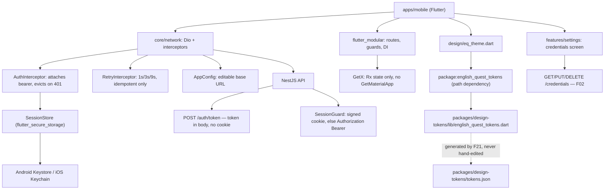

# Technical Specification: Mobile Application Shell

## 1. Technical Overview

**What:** A Flutter application at `apps/mobile` targeting Android 8.0 (API 26) and iOS 14, portrait only, carrying: bottom navigation across five destinations (Today, Plan, Profile, Lessons, Settings); a session token held in Android Keystore / iOS Keychain; an HTTP client that attaches the session, retries idempotent requests on 5xx and network failure with 1s/3s/9s backoff, and surfaces one consolidated failure; a runtime-editable API base URL; a 16 kHz mono 16-bit WAV recorder; and the credentials screen from F02 as the shell's first real screen.

It also carries three changes outside Flutter that the shell cannot exist without: a bearer-token authentication path on the API, the packaging of F21's generated Dart theme as a consumable pub package, and the shared contract for the token response.

**Why:** Nine downstream features (F16, F17, F18, F19, F20, and the mobile halves of F06/F12/F15) mount on this shell. Every one of them assumes navigation, an authenticated API client, secure session storage and the three page states already exist. Building them first would mean each re-inventing the transport and the error vocabulary.

The credentials screen is deliberately part of the shell rather than deferred. Empty scaffolding proves nothing: a screen that lists two providers, shows real masked keys from the API, and performs add/replace/delete/re-validate exercises navigation, the bearer flow, the retry policy, the error envelope and all three page states against a real endpoint. It is the smallest thing that makes the shell verifiable.

**The blocking problem this feature had to solve.** The API issues its session *only* as a signed HTTP-only cookie (`auth.controller.ts` sets it with `signed: true`; `session.guard.ts` reads only `request.signedCookies`), and the login response body never contains the token. F03's capability — "session token stored in platform secure storage" — is therefore not implementable against the API as it stands. The PRD states both facts and never reconciles them. This spec resolves it with an **additive** change: a dedicated `POST /auth/token` route that returns the token in the body and sets no cookie, plus a `SessionGuard` that falls back to `Authorization: Bearer` when no cookie is present. The web client's httpOnly guarantee is untouched — no response a browser receives gains the token.

**Scope — Included:**
- The Flutter application, its module graph, navigation, and the five destinations (four as placeholders honouring the three page states, Settings as the real screen)
- Secure session storage, login/logout, session restoration across restart, and 401-driven eviction
- The Dio-based API client with the bearer interceptor, the retry interceptor and the error-envelope mapping
- Editable API base URL, reachable from the login screen before authenticating and from Settings after
- Microphone permission and the WAV recorder, exposed as a service for F18 to consume — not wired to any recording UI in this feature
- Connectivity detection and the explicit `No connection` state
- The mobile credentials screen mirroring F02
- A Flutter mirror of F21's component vocabulary: the same four button variants, five badge statuses and three page states, rendered natively over the generated theme
- **API changes:** `POST /auth/token`, bearer support in `SessionGuard`, the OpenAPI security scheme and regenerated `docs/api/openapi.json`
- **Shared package:** the token-response schema
- **design-tokens changes:** a `pubspec.yaml`, the Dart emitter's output moved under `lib/`, and the drift guard updated

**Scope — Excluded:**
- The live classroom. It is web-only by capability; it must be absent from mobile navigation, which is an acceptance criterion rather than an omission.
- Offline mode, caching and background sync. No connectivity means an explicit state, never stale content presented as current.
- Any activity execution, lesson history or progress screen — those are F16–F20 mounting on this shell.
- Recording UI or upload. This feature ships the recorder service; F18 gives it a screen.
- Push notifications, deep links, biometric unlock, app-store packaging and release signing.
- iOS build verification. The project is configured for iOS 14 correctly, but this machine is Windows and cannot produce or run an iOS build. See Decisions.

**Complexity:** complex.

---

## 2. Architecture Impact

**Affected components:**

- `apps/api/src/auth/session.guard.ts` — modified; bearer fallback when no signed cookie is present
- `apps/api/src/auth/auth.controller.ts` — modified; new `POST /auth/token` route, OpenAPI decorators
- `apps/api/src/openapi/setup.ts` — modified; bearer security scheme registered alongside the cookie scheme
- `docs/api/openapi.json` — regenerated (the project's standing OpenAPI directive)
- `packages/shared/src/schemas/auth.ts` — modified; `sessionTokenSchema` added and exported
- `packages/design-tokens/` — modified; `pubspec.yaml` added, Dart output relocated to `lib/`, drift guard and npm `files` updated
- `apps/mobile/` — new; the entire Flutter application
- `docker-compose.yml` — unchanged. Flutter builds on the host, not in a container; the app reaches the API over the host's LAN address.



**Control flow in one sentence:** Modular resolves a route and its guard consults the session; the guard's decision is backed by a token read from Keystore at boot; every request leaves through Dio carrying that token as a bearer; a 401 anywhere clears the store and the guard redirects to login on the next navigation.

---

## 3. Technical Decisions

| Decision | Chosen Approach | Alternative Considered | Trade-off |
|----------|----------------|----------------------|-----------|
| Mobile authentication | `POST /auth/token` returns the token in the body and sets no cookie; `SessionGuard` accepts `Authorization: Bearer` as a fallback to the signed cookie | Returning the token from the existing `/auth/login`; a Dio cookie jar replaying the signed cookie | Both new surfaces delegate to the same `AuthService.login`, so lockout and timing-safety are identical and untested code paths are not introduced. The web's httpOnly guarantee stays literally intact. We accept one extra route and one extra OpenAPI security scheme |
| Routing and DI | `flutter_modular`, current `createModule(register:)` API, with `c.route(..., guards: [...])` and `inject<T>()` | `go_router` + Riverpod; Navigator 2.0 by hand | User's choice. Route-less modules are root-owned, which maps cleanly onto "the session and API client live for the whole app". We accept a package whose API changed shape recently, so older tutorials describe a `class X extends Module` form this spec does not use |
| State management | `GetX` for reactivity **only** — `.obs`, `Obx`, `GetxController`. No `GetMaterialApp`, no `Get.put`/`Get.find`, no GetX routing or snackbars | Using GetX's DI and routing too | User's choice, scoped to the division that does not fight itself: GetX's own docs state `GetMaterialApp` is optional when only state management is used. Both packages ship a DI container; using two would make "where is this instance registered" ambiguous. **Modular owns DI and routing; GetX owns rebuilds.** We accept that a reader must know this boundary is deliberate |
| Design token delivery | `packages/design-tokens` gains a `pubspec.yaml`; the Dart emitter writes to `packages/design-tokens/lib/english_quest_tokens.dart`; Flutter declares a `path:` dependency | A second generator output written directly into `apps/mobile/lib/` | User's choice. A real package boundary means the Flutter analyzer treats the theme as an external import that cannot accidentally import app code. We accept that one directory now carries both `package.json` and `pubspec.yaml`, and that the Dart output path moves — which is a change to F21's generator and its drift guard, not a copy |
| HTTP client | `dio` with two interceptors | `http` with a hand-rolled wrapper | Interceptors are exactly the shape of "attach a token" and "retry with backoff"; `http` would mean re-implementing both around every call site. We accept a heavier dependency |
| Retry policy placement | A `RetryInterceptor` that retries **only** idempotent methods (GET, PUT, DELETE, HEAD) and only on 5xx, timeout or connection error | Retrying everything; retrying in each repository | `PUT /credentials/{provider}` is idempotent by design and safe to retry; a future `POST` that charges a provider is not. Method-based gating encodes the rule once. We accept that a non-idempotent endpoint needing retry must opt in explicitly |
| Session restoration | Read the token at boot, then call `GET /auth/me` before deciding the start route | Trusting the stored token's presence | A token can be revoked server-side (F01 supports immediate logout and password-change eviction), so presence proves nothing. One request at boot is the difference between landing on Today and landing on a screen that 401s immediately. We accept a brief splash state |
| Audio recorder | `record` with `AudioEncoder.pcm16bits`, `sampleRate: 16000`, `numChannels: 1`, written as `.wav` | `flutter_sound` | Directly expresses the PRD's format; `flutter_sound` is larger and its WAV path is less direct. Permission is requested through `record`'s own `hasPermission()` rather than adding `permission_handler` |
| Connectivity | `connectivity_plus` for the transport signal, but the `No connection` state is driven by the request failure, not by the listener | Gating requests on the connectivity listener | `connectivity_plus` reports link state, not reachability — a device on Wi-Fi with no route to the LAN API reports "connected". Letting the failed request decide keeps the state honest. We accept that the listener is advisory only |
| iOS verification | Project configured for iOS 14 (deployment target, `NSMicrophoneUsageDescription`), build and run **not** verified | Dropping iOS from the MVP; leaving iOS unconfigured | User's choice. This machine is Windows; an iOS build is structurally impossible here. Configuring it now means the first Mac build is a build, not a discovery session. We accept that half of one acceptance criterion is a standing soft-fail until a Mac exists, recorded rather than quietly ticked |

---

## 4. Component Overview

### API changes

| File Path | New/Modified | Purpose | Key Responsibilities |
|-----------|--------------|---------|---------------------|
| `apps/api/src/auth/session.guard.ts` | Modified | Accept both transports | Read the signed cookie; when absent, read `Authorization: Bearer <token>`; everything after token extraction is unchanged |
| `apps/api/src/auth/auth.controller.ts` | Modified | Mobile login | `POST /auth/token` — public, delegates to the same `AuthService.login`, returns `{ token, expiresAt, user }`, sets no cookie; full OpenAPI decorators per the project directive |
| `apps/api/src/openapi/setup.ts` | Modified | Document the second scheme | Register a `bearer` HTTP security scheme alongside the existing cookie scheme |
| `docs/api/openapi.json` | Regenerated | Committed snapshot | Grows from 9 to 10 operations; the drift guard in `test/unit/openapi.spec.ts` enforces it |

### Shared contracts

| File Path | New/Modified | Purpose | Key Responsibilities |
|-----------|--------------|---------|---------------------|
| `packages/shared/src/schemas/auth.ts` | Modified | Token response contract | `sessionTokenSchema` — `token`, `expiresAt` (ISO), `user` (the existing `publicUserSchema`) |
| `packages/shared/src/index.ts` | Modified | Export surface | Re-export `sessionTokenSchema` and `SessionTokenResponse` |

### Design tokens packaging

| File Path | New/Modified | Purpose | Key Responsibilities |
|-----------|--------------|---------|---------------------|
| `packages/design-tokens/pubspec.yaml` | New | Pub package manifest | Declares `english_quest_tokens`, the Dart SDK constraint and the Flutter dependency the generated theme needs |
| `packages/design-tokens/lib/english_quest_tokens.dart` | New (generated, committed) | The Dart target's new home | Same content the emitter already produces; relocated because a pub package's source must live under `lib/` |
| `packages/design-tokens/generated/tokens.dart` | Deleted | Replaced by the `lib/` output | — |
| `packages/design-tokens/src/build.ts` | Modified | Output path | Writes the Dart artifact to `lib/` |
| `packages/design-tokens/test/tokens.spec.ts` | Modified | Drift guard | Compares against the new path |
| `packages/design-tokens/analysis_options.yaml` | New | Analyzer scope | Excludes `node_modules/`, `dist/` and `test/` so the Dart analyzer does not walk the npm tree |
| `packages/design-tokens/.pubignore` | New | Publish hygiene | Keeps npm artifacts out of the pub package view |

### Flutter — application root

| File Path | New/Modified | Purpose | Key Responsibilities |
|-----------|--------------|---------|---------------------|
| `apps/mobile/pubspec.yaml` | New | Manifest | Dependencies, the `english_quest_tokens` path dependency, portrait-only asset/config declarations |
| `apps/mobile/analysis_options.yaml` | New | Lints | `flutter_lints` plus the stricter rules this repo's TypeScript side already implies |
| `apps/mobile/lib/main.dart` | New | Entry point | Locks portrait orientation, boots the root module, runs `ModularApp` |
| `apps/mobile/lib/app_module.dart` | New | Root module | Route-less core registrations (config, storage, Dio, session, connectivity, audio) plus the child modules for auth, shell and settings |
| `apps/mobile/lib/app_widget.dart` | New | App widget | `MaterialApp.router` wired to `ModularApp.routerConfigOf(context)`, themed from the generated tokens |

### Flutter — core

| File Path | New/Modified | Purpose | Key Responsibilities |
|-----------|--------------|---------|---------------------|
| `apps/mobile/lib/core/config/app_config.dart` | New | Base URL | Reads, validates and persists the API base URL; exposes it as an `Rx<String>` so a change re-targets Dio without restart |
| `apps/mobile/lib/core/network/api_client.dart` | New | Dio factory | Builds the client, installs both interceptors, rebinds `baseUrl` when config changes |
| `apps/mobile/lib/core/network/auth_interceptor.dart` | New | Session transport | Attaches `Authorization: Bearer`; on 401 clears the store and signals the session controller |
| `apps/mobile/lib/core/network/retry_interceptor.dart` | New | Retry policy | Three attempts at 1s/3s/9s for idempotent methods on 5xx, timeout and connection error; emits one consolidated failure |
| `apps/mobile/lib/core/network/api_exception.dart` | New | Error vocabulary | Maps the `{error:{code,message,details}}` envelope onto a typed exception carrying the code; classifies `noConnection`, `serverUnavailable`, `sessionExpired` |
| `apps/mobile/lib/core/session/session_store.dart` | New | Secure persistence | `flutter_secure_storage` wrapper — read, write and clear the token; Keystore/Keychain only, never shared preferences |
| `apps/mobile/lib/core/session/session_controller.dart` | New | Session state | `GetxController` holding `Rx<SessionState>`; login, logout, boot-time restore via `GET /auth/me` |
| `apps/mobile/lib/core/connectivity/connectivity_service.dart` | New | Link awareness | Advisory `connectivity_plus` stream consumed by page states for copy, not for gating |
| `apps/mobile/lib/core/audio/audio_recorder_service.dart` | New | Recorder | Permission check, start/stop, 16 kHz mono 16-bit WAV to a temp path; consumed by F18 |

### Flutter — design system mirror

| File Path | New/Modified | Purpose | Key Responsibilities |
|-----------|--------------|---------|---------------------|
| `apps/mobile/lib/design/eq_theme.dart` | New | Theme binding | Builds `ThemeData` from `eqLightTheme()`/`eqDarkTheme()` in the tokens package; light is the default, matching F21 |
| `apps/mobile/lib/design/widgets/eq_button.dart` | New | Button | The same four variants (primary, secondary, neutral, destructive) and three sizes as web, with loading and disabled |
| `apps/mobile/lib/design/widgets/eq_badge.dart` | New | Badge | The same five statuses (success, warning, info, danger, neutral); always renders text, never colour alone |
| `apps/mobile/lib/design/widgets/eq_card.dart` | New | Card | 2px outline and the offset-shadow treatment, reading `EqElevation` from the tokens package |
| `apps/mobile/lib/design/widgets/eq_page_state.dart` | New | The three states | `EqLoading` (skeleton shaped like the content), `EqEmpty` (what is missing + one action), `EqError` (named cause + required retry) |

### Flutter — features

| File Path | New/Modified | Purpose | Key Responsibilities |
|-----------|--------------|---------|---------------------|
| `apps/mobile/lib/features/auth/auth_module.dart` | New | Auth routes | `/login`, with the base-URL affordance reachable before authentication |
| `apps/mobile/lib/features/auth/login_page.dart` | New | Login screen | Email, password, submit, error copy, base-URL entry point |
| `apps/mobile/lib/features/auth/login_controller.dart` | New | Login state | Validation, submission, lockout copy from `AUTH002`, failure mapping |
| `apps/mobile/lib/features/shell/shell_module.dart` | New | Authenticated routes | Guarded parent route; children for the five destinations |
| `apps/mobile/lib/features/shell/shell_page.dart` | New | Bottom navigation | Five destinations; preserves per-tab scroll and in-progress state across tab switches; the classroom is absent |
| `apps/mobile/lib/features/today/today_page.dart` | New | Placeholder | Honours the three page states and pull-to-refresh; content arrives with F15/F16 |
| `apps/mobile/lib/features/plan/plan_page.dart` | New | Placeholder | As above; content arrives with F15 |
| `apps/mobile/lib/features/profile/profile_page.dart` | New | Placeholder | As above; content arrives with F12 |
| `apps/mobile/lib/features/lessons/lessons_page.dart` | New | Placeholder | As above; content arrives with F19 |
| `apps/mobile/lib/features/settings/settings_module.dart` | New | Settings routes | Settings root carrying credentials and the base-URL field |
| `apps/mobile/lib/features/settings/settings_page.dart` | New | Settings screen | Base URL, sign-out, and the credentials section |
| `apps/mobile/lib/features/settings/credentials_controller.dart` | New | Credentials state | Loads the masked list; add, replace, delete, re-validate; maps `CREDENTIAL_REJECTED` detail to provider copy |
| `apps/mobile/lib/features/settings/credential_card.dart` | New | Provider card | Status badge, masked key, region, last-checked; the four actions |
| `apps/mobile/lib/features/settings/credential_form.dart` | New | Key entry | Secure text field, paste enabled, autocorrect disabled; region required for Azure only |
| `apps/mobile/lib/features/settings/api_base_url_field.dart` | New | Base URL control | Shared by login and settings; validates and persists |

### Flutter — platform configuration

| File Path | New/Modified | Purpose | Notes |
|-----------|--------------|---------|-------|
| `apps/mobile/android/app/build.gradle.kts` | New | Android target | `minSdk 26` (Android 8.0) |
| `apps/mobile/android/app/src/main/AndroidManifest.xml` | New | Permissions | `RECORD_AUDIO`, `INTERNET`; cleartext permitted for the LAN base URL in debug only |
| `apps/mobile/ios/Runner/Info.plist` | New | iOS config | `NSMicrophoneUsageDescription`, portrait-only orientation |
| `apps/mobile/ios/Podfile` | New | iOS target | `platform :ios, '14.0'` |

**Database:** none. This feature adds no table and no migration.

---

## 5. API Contracts

### New: mobile session issuance

**Endpoint: Issue a session token**
- **Method:** POST
- **Path:** `/auth/token`
- **Authentication:** none (public)

**Request:**

| Field | Type | Required | Validation | Description |
|-------|------|----------|------------|-------------|
| `email` | `string` | Yes | trimmed, lowercased, valid email — the existing `loginSchema` | Account email |
| `password` | `string` | Yes | the existing `loginSchema` rules | Account password |

**Request Example:**
```json
{ "email": "learner@example.com", "password": "a good password" }
```

**Response (Success — 200):**

| Field | Type | Description |
|-------|------|-------------|
| `data.token` | `string` | The opaque session token, base64url, to be stored in Keystore/Keychain |
| `data.expiresAt` | `string` | ISO timestamp; slides on every authenticated request |
| `data.user.id` | `uuid` | The signed-in user |
| `data.user.email` | `string` | |
| `data.user.displayName` | `string` | |

**Response Example:**
```json
{
  "data": {
    "token": "M2Q4YjJmNGE5ZTdjMWQ2ODMwNWY0YjhhOWMyZTFkN2Y",
    "expiresAt": "2026-09-22T03:14:07.000Z",
    "user": {
      "id": "fb667b4f-7f66-4119-bdfe-8ad86c39d1d2",
      "email": "learner@example.com",
      "displayName": "Learner"
    }
  }
}
```

**Error Codes:**

| Code | HTTP Status | Description |
|------|-------------|-------------|
| — | 400 | Payload failed validation |
| `AUTH001` | 401 | Wrong credentials — identical body and comparable timing to an unknown email |
| `AUTH002` | 429 | Locked out; `details.retryAfterSeconds` carries the remaining lockout |

**Explicitly: this route sets no cookie.** A browser calling it gains nothing it could not already obtain, and the web client never calls it.

### Modified: authentication on every guarded route

`SessionGuard` resolves the token in this order:

1. `request.signedCookies['eq_session']` — the web path, unchanged
2. `Authorization: Bearer <token>` — the mobile path, new

Everything after extraction is identical: Redis lookup, sliding expiry, the deleted-user check and `AUTH003` on failure. A request carrying both uses the cookie.

OpenAPI gains a second security scheme; guarded operations document both.

### Consumed contracts (existing, unchanged)

| Operation | Used for | Notes |
|-----------|----------|-------|
| `GET /auth/me` | Boot-time session restoration | Distinguishes "token present" from "token still valid" |
| `POST /auth/logout` | Sign out | Revokes server-side; the mobile client clears Keystore regardless of the response |
| `GET /credentials` | Credentials screen load | Always returns both providers, `missing` included |
| `PUT /credentials/{provider}` | Add and replace | Idempotent — inside the retry policy |
| `DELETE /credentials/{provider}` | Delete | Idempotent — inside the retry policy |
| `POST /credentials/{provider}/revalidate` | Re-check | **Not** retried: it spends a provider call |

### Error envelope mapping

The client maps `{error:{code,message,details}}` onto the failure copy the PRD's Experience section names:

| Condition | Rendered cause |
|-----------|----------------|
| `DioExceptionType.connectionError`, `connectionTimeout`, or a socket failure | `No connection` |
| HTTP 5xx after all retry attempts | `Server unavailable` |
| `AUTH003`, or any 401 | `Session expired` |
| Any other `{error}` body | The API's own `message`, verbatim |

---

## 6. Data Model

No database table. This feature's persisted state is three keys and one file location.

### Secure storage (`flutter_secure_storage` → Keystore / Keychain)

| Key | Type | Written when | Cleared when |
|-----|------|--------------|--------------|
| `eq.session.token` | `string` | `POST /auth/token` succeeds | Logout, any 401, or a failed boot-time `GET /auth/me` |
| `eq.session.expiresAt` | ISO string | Same | Same |

**Never** written to `SharedPreferences` / `NSUserDefaults` — asserted by a test that inspects the shared-preferences store after login and finds no token-shaped value.

### Ordinary preferences (`SharedPreferences`)

| Key | Type | Default | Description |
|-----|------|---------|-------------|
| `eq.api.baseUrl` | `string` | `http://10.0.2.2:3001` | The API base URL. The default is the Android emulator's alias for the host machine, which is the first thing a developer needs and the only value that works without editing |

The base URL is not a secret and does not belong in Keystore; keeping it in plain preferences is deliberate, so a developer can inspect and change it easily.

### Recorder output

| Property | Value |
|----------|-------|
| Container | WAV |
| Encoding | 16-bit PCM (`AudioEncoder.pcm16bits`) |
| Sample rate | 16 000 Hz |
| Channels | 1 (mono) |
| Location | Platform temp directory, one file per recording |

### Session state machine

The value `SessionController` exposes as `Rx<SessionState>`:

| State | Meaning | Start route |
|-------|---------|-------------|
| `restoring` | Boot-time `GET /auth/me` in flight | Splash |
| `authenticated(user)` | Token present and confirmed valid | `/app/today` |
| `unauthenticated` | No token, or the token was rejected | `/login` |

Modular's route guard reads this state through `inject<SessionController>()`; a guard returning a non-null path performs an absolute redirect.

### Navigation structure

| Route | Module | Guarded | Destination |
|-------|--------|---------|-------------|
| `/login` | auth | No | Login |
| `/app/today` | shell | Yes | Today |
| `/app/plan` | shell | Yes | Plan |
| `/app/profile` | shell | Yes | Profile |
| `/app/lessons` | shell | Yes | Lessons |
| `/app/settings` | settings | Yes | Settings and credentials |

There is no classroom route. Its absence is asserted by a test over the registered route table, not by inspection.

---

## 7. Testing Strategy

| Test File | Test Type | Target | Coverage Goal |
|-----------|-----------|--------|---------------|
| `apps/api/test/integration/auth.spec.ts` | Integration (existing, extended) | `/auth/token` and bearer auth | The new route and transport |
| `apps/api/test/unit/openapi.spec.ts` | Unit (existing) | Committed snapshot | Drift guard covers 10 operations |
| `packages/design-tokens/test/tokens.spec.ts` | Unit (existing, modified) | Dart output path | Drift guard follows the file to `lib/` |
| `apps/mobile/test/core/retry_interceptor_test.dart` | Unit | Retry policy | 95% |
| `apps/mobile/test/core/auth_interceptor_test.dart` | Unit | Bearer + 401 eviction | 95% |
| `apps/mobile/test/core/session_controller_test.dart` | Unit | Session lifecycle | 90% |
| `apps/mobile/test/core/api_exception_test.dart` | Unit | Envelope mapping | 95% |
| `apps/mobile/test/core/session_store_test.dart` | Unit | Secure storage isolation | 90% |
| `apps/mobile/test/features/login_page_test.dart` | Widget | Login screen | 85% |
| `apps/mobile/test/features/credentials_test.dart` | Widget | Credentials screen | 85% |
| `apps/mobile/test/features/navigation_test.dart` | Widget | Route table and guards | 90% |
| `apps/mobile/test/design/page_state_test.dart` | Widget | The three states | 90% |

### `apps/api/test/integration/auth.spec.ts` (extended)

| Test Function | Description | Assertions |
|---------------|-------------|------------|
| `token_route_returns_the_token_without_setting_a_cookie` | The mobile path | 200 with `data.token` and `data.expiresAt`; no `Set-Cookie` header on the response |
| `bearer_token_authenticates_a_guarded_route` | The transport works | `GET /auth/me` with `Authorization: Bearer <token>` returns the user |
| `bearer_and_cookie_resolve_to_the_same_session` | One session model | A token issued by `/auth/token` is revoked by `POST /auth/logout` sent with that bearer, and stops working afterwards |
| `an_invalid_bearer_token_returns_auth003` | Failure parity | Garbage bearer yields the same error code as a garbage cookie |
| `token_route_enforces_the_same_lockout` | No bypass | Six failures through `/auth/token` produce `AUTH002`, and `/auth/login` is locked for the same account |
| `login_route_still_sets_the_cookie_and_omits_the_token` | Web untouched | `/auth/login` sets `Set-Cookie` and its body has no `token` field |

### `apps/mobile/test/core/retry_interceptor_test.dart`

| Test Function | Description | Assertions |
|---------------|-------------|------------|
| `retries_idempotent_requests_three_times_with_expected_backoff` | The core policy | A GET failing with 503 is attempted 4 times total; recorded delays are 1s, 3s, 9s |
| `does_not_retry_non_idempotent_requests` | Safety | A POST failing with 503 is attempted once |
| `does_not_retry_client_errors` | Correctness | A 400 and a 401 are attempted once each |
| `surfaces_a_single_consolidated_failure` | The PRD's wording | The caller receives exactly one exception, not one per attempt |
| `stops_retrying_once_a_retry_succeeds` | No over-retry | A GET failing twice then succeeding returns the success and makes exactly 3 attempts |

### `apps/mobile/test/core/auth_interceptor_test.dart`

| Test Function | Description | Assertions |
|---------------|-------------|------------|
| `attaches_the_bearer_token_when_a_session_exists` | Transport | Outgoing request carries `Authorization: Bearer <token>` |
| `sends_no_authorization_header_when_signed_out` | No ghost header | Header absent rather than `Bearer null` |
| `a_401_clears_the_stored_session` | Acceptance criterion | After a 401, the secure store read returns null |
| `a_401_moves_the_session_state_to_unauthenticated` | Redirect trigger | The controller's state becomes `unauthenticated`, which the guard consumes |

### `apps/mobile/test/core/session_controller_test.dart`

| Test Function | Description | Assertions |
|---------------|-------------|------------|
| `restores_a_valid_session_on_boot` | Persistence across restart | With a token in the store and `GET /auth/me` succeeding, state becomes `authenticated` |
| `discards_a_token_the_server_rejects` | Revocation respected | With a token in the store and `/auth/me` returning 401, the store is cleared and state is `unauthenticated` |
| `login_persists_the_token_and_expiry` | Write path | Both keys present after a successful `/auth/token` |
| `logout_clears_the_store_even_when_the_request_fails` | Local truth | With the logout call failing, the store is still empty and state is `unauthenticated` |

### `apps/mobile/test/core/session_store_test.dart`

| Test Function | Description | Assertions |
|---------------|-------------|------------|
| `the_token_is_absent_from_shared_preferences` | Acceptance criterion | After a login, every `SharedPreferences` value is inspected and none equals the token |
| `clear_removes_both_keys` | No partial state | Token and expiry both read back null |

### `apps/mobile/test/core/api_exception_test.dart`

| Test Function | Description | Assertions |
|---------------|-------------|------------|
| `maps_connection_failure_to_no_connection` | Named cause | A `connectionError` yields the `No connection` cause |
| `maps_exhausted_5xx_to_server_unavailable` | Named cause | A 503 after retries yields `Server unavailable` |
| `maps_401_to_session_expired` | Named cause | Yields `Session expired` |
| `preserves_the_api_message_for_other_errors` | Verbatim copy | A `CREDENTIAL_REJECTED` body surfaces the API's own message and `details.providerMessage` |

### `apps/mobile/test/features/navigation_test.dart`

| Test Function | Description | Assertions |
|---------------|-------------|------------|
| `the_shell_exposes_exactly_five_destinations` | Navigation shape | Today, Plan, Profile, Lessons, Settings |
| `the_live_classroom_is_absent_from_navigation` | Acceptance criterion | No registered route and no destination matches `/classroom` or its label |
| `an_unauthenticated_user_is_redirected_to_login` | Guard | Navigating to `/app/today` while unauthenticated lands on `/login` |
| `an_authenticated_user_reaching_login_is_sent_to_today` | Reverse guard | No way to sit on the login screen with a live session |
| `switching_tabs_preserves_scroll_position` | Experience | A scrolled list returns to its offset after leaving and re-entering the tab |

### `apps/mobile/test/features/login_page_test.dart`

| Test Function | Description | Assertions |
|---------------|-------------|------------|
| `submits_valid_credentials` | Happy path | The client calls `/auth/token` with the normalized email |
| `shows_the_named_cause_on_failure` | Error copy | An offline failure renders `No connection` and a retry affordance |
| `shows_lockout_copy_with_the_retry_window` | `AUTH002` | The remaining time from `details.retryAfterSeconds` is rendered |
| `the_base_url_is_editable_before_authenticating` | Acceptance criterion | The field is reachable from login and a saved value is used by the next request |
| `has_no_register_or_reset_affordance` | Parity with web | Neither exists, because neither endpoint does |

### `apps/mobile/test/features/credentials_test.dart`

| Test Function | Description | Assertions |
|---------------|-------------|------------|
| `renders_both_providers_with_their_status` | Cross-feature criterion | Gemini and Azure Speech, each with the status vocabulary the web screen uses |
| `renders_each_status_with_its_badge` | Vocabulary parity | `valid`, `invalid`, `unverified`, `missing` map to the same badge statuses as web |
| `never_renders_more_than_the_masked_key` | Cross-feature criterion | No key material anywhere in the widget tree; no reveal affordance exists |
| `requires_a_region_for_azure_only` | Validation parity | The region field appears for Azure and not for Gemini |
| `surfaces_the_provider_message_on_rejection` | Error fidelity | `details.providerMessage` renders verbatim beneath the plain-language line |
| `deleting_returns_the_card_to_its_missing_state` | Lifecycle | The card shows the missing-state copy afterwards |
| `shows_no_connection_with_retry_when_offline` | Acceptance criterion | The error state names the cause and the retry re-issues the request |

### `apps/mobile/test/design/page_state_test.dart`

| Test Function | Description | Assertions |
|---------------|-------------|------------|
| `loading_renders_a_skeleton_not_a_spinner` | Parity with F21 | Skeleton blocks present; no `CircularProgressIndicator` |
| `empty_states_the_missing_thing_and_one_action` | Parity with F21 | At most one action button |
| `error_names_the_cause_and_offers_a_retry` | Parity with F21 | The retry callback is required by the widget's constructor |

### Acceptance criteria mapping

| PRD acceptance criterion | Covering test |
|--------------------------|---------------|
| The app builds and runs on Android 8.0 and iOS 14 | `flutter build apk` gate for Android; **iOS unverifiable on this machine** — see Decisions |
| Login persists across restarts; session in Keystore/Keychain, absent from shared preferences | `restores_a_valid_session_on_boot`, `the_token_is_absent_from_shared_preferences` |
| A 401 clears the session and returns to login | `a_401_clears_the_stored_session`, `a_401_moves_the_session_state_to_unauthenticated`, `an_unauthenticated_user_is_redirected_to_login` |
| Offline shows `No connection` with retry, never stale content | `maps_connection_failure_to_no_connection`, `shows_no_connection_with_retry_when_offline` |
| API base URL editable in settings, effective without reinstall | `the_base_url_is_editable_before_authenticating` plus the settings-screen equivalent |
| The live classroom is absent from navigation | `the_live_classroom_is_absent_from_navigation` |
| Idempotent requests retry 3 times with 1s/3s/9s before one failure | `retries_idempotent_requests_three_times_with_expected_backoff`, `surfaces_a_single_consolidated_failure` |

**Cross-Feature Integration.** PRD Section 9 carries one criterion naming F03: *"The masked credential list from the vault (F02) renders on the mobile credentials screen (F03) with the same statuses the web screen shows, and no key material reaches the device."* Covered by `renders_both_providers_with_their_status`, `renders_each_status_with_its_badge` and `never_renders_more_than_the_masked_key`, plus a manual run against the live API confirming the same two providers and statuses appear on both clients.

---

## 8. Decisions and Assumptions

**Interview decisions:**
1. **Mobile auth:** a dedicated `POST /auth/token` returning the token in the body with no cookie, plus an additive `Authorization: Bearer` fallback in `SessionGuard`.
2. **State and navigation:** **GetX + Flutter Modular**, with a deliberate division of responsibility — Modular owns routing and dependency injection; GetX is used *only* for reactivity (`.obs`, `Obx`, `GetxController`). No `GetMaterialApp`, no `Get.put`/`Get.find`. GetX's own documentation confirms `GetMaterialApp` is optional when only state management is used, and this boundary is what keeps two DI containers from competing.
3. **Design tokens:** `packages/design-tokens` becomes a hybrid npm + pub package with a `path:` dependency from Flutter.
4. **iOS:** configured correctly, verification deferred; the iOS half of the first acceptance criterion is a standing, recorded soft-fail.

**Assumptions taken without asking, and why:**
- **Flutter Modular's current API** (`createModule(register:)`, `c.route(...)`, `inject<T>()`, `ModularApp.routerConfigOf`) is used, not the older `class X extends Module` form that most tutorials still show. Confirmed against the package's current documentation.
- **The Dart emitter's output path moves** from `generated/tokens.dart` to `lib/english_quest_tokens.dart`, because a pub package's library code must live under `lib/`. This is the change that makes the user's chosen packaging possible; it also touches F21's drift guard.
- **`GET /auth/me` runs at boot** before routing decides anything, since a stored token proves nothing about server-side validity.
- **`POST /credentials/{provider}/revalidate` is excluded from the retry policy** despite being a POST that is semantically safe to repeat: each call spends a real provider request against the user's own quota.
- **The default base URL is `http://10.0.2.2:3001`**, the Android emulator's host alias — the only default that works without editing on the most likely first run.
- **`connectivity_plus` is advisory.** Reachability is decided by request failure, because link state does not imply a route to a LAN address.
- **Cleartext HTTP is permitted in debug builds only**, since the local stack is plain HTTP over LAN; a release build keeps the platform default.
- **Version constraints are caret ranges resolved at implementation time** by `flutter pub add`, rather than pinned here, so the spec does not encode a version that is stale before the first build.

**PRD corrections this spec requires** (to be applied to `docs/prd.md` so the PRD and the implementation do not disagree):
1. **F01's capability describes the session as living only in a signed HTTP-only cookie.** With F03, the same opaque token is additionally obtainable through `POST /auth/token` and presentable as `Authorization: Bearer`. The session model is unchanged — one opaque token, one Redis record, immediate revocation — only the transport is now two-valued. F01's capability should say so, and note that the token-issuing route sets no cookie, so the web client's httpOnly property is preserved.
2. **F03's first acceptance criterion pairs Android and iOS in a single line.** It should be split, so the Android half can be honestly ticked while the iOS half is recorded as unverified pending Mac hardware — rather than one criterion that can never be fully marked.
