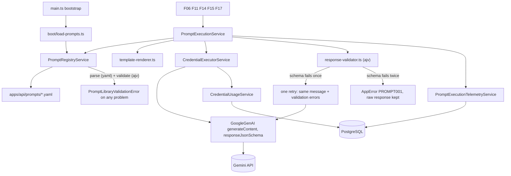
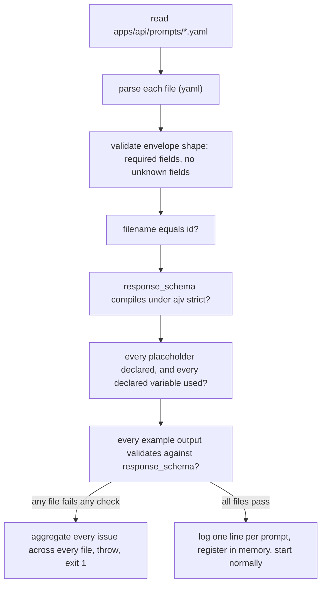

# Technical Specification: Prompt Library

## 1. Technical Overview

**What:** A boot-validated, versioned YAML prompt registry that renders templates, calls Gemini for structured output, validates the response against a declared JSON Schema with exactly one correction retry, and records execution telemetry — the single door every AI-consuming feature calls instead of reaching the model directly.

**Why:** Five later features (F06, F11, F14, F15, F17) generate structured content from Gemini. Without F04 each would parse its own YAML, retry its own way, and validate its own output — five divergent implementations of the same contract, with five different ways to silently accept malformed model output. Building the loader, the schema-validated execution path and the version-stamping discipline once, while only nine prompts exist, is what lets a regression later be traced to "the exact file revision that caused it" instead of a guess across five codepaths.

**Scope — Included:**
- `apps/api/prompts/*.yaml` — nine MVP prompt files, one per PRD-listed id
- Boot-time parsing, structural validation and an aggregated failure report naming every offending file and field, refusing to start the process on any problem
- `{{variable}}` template rendering with a required/empty check at render time and an undeclared-variable check at boot time
- Few-shot `examples` rendering into the request, and `constraints` rendering into the instruction text
- Gemini execution via `@google/genai`, requesting structured output constrained by `response_schema`, with a 90-second timeout
- Exactly one retry on schema-validation failure, with the validation errors appended to the same user message; a second failure raises a hard error with the raw response retained
- Execution telemetry (`prompt_execution` table): prompt id, version, model, temperature, token counts, latency, outcome, and the raw response when the hard-error path is hit
- An injectable registry (`PromptRegistryService`) and execution service (`PromptExecutionService`) that F06/F11/F14/F15/F17 call directly — no HTTP surface, per the PRD's "no user interface" statement

**Scope — Excluded:**
- The deterministic post-generation gate (word count, sentence length, type-token ratio, banned-terms, target-structure presence) described in `docs/context.md` and specified by F14's acceptance criteria. F04 carries `banned_phrases` as data on the loaded prompt object; running the gate is each consuming feature's own job.
- **F14's regeneration retry.** F14's criteria include "a failing item is regenerated exactly once with the failed checks appended to the prompt" — that is a *gate* retry at the consumer layer, distinct from and stacked on top of F04's *schema* retry. F04 implements only the schema retry. An item can therefore be attempted up to four times overall (2 schema attempts × 2 gate attempts); conflating the two mechanisms would silently halve or double that budget.
- Retrying a timeout. The PRD is explicit that a timeout "is retried once by the caller's job, not the library" — F04 raises immediately on timeout, once, and never re-issues the request itself.
- Any prompt beyond the nine MVP ids. Adding a tenth prompt later is a new YAML file, not a code change.
- A difficulty-calibration feedback loop tied to prompt version (`docs/context.md`) — it consumes F04's version stamp but is not part of this feature.

**Assumptions and decisions not answered by the PRD:**

| Assumption | Rationale |
|---|---|
| `prompts/` lives at `apps/api/prompts/`, sibling to `apps/api/prisma/` | Matches the repo's convention of scoping non-source resources to the service that owns them; only the API loads these files |
| Variable placeholders use `{{variable_name}}` | Plain flat substitution is all the PRD asks for (no loops/conditionals); easy to statically scan for the boot-time undeclared-variable check |
| Filename (without extension) must equal the YAML's own `id` | A typo that names the file wrong would otherwise load silently under a mismatched key; enforced at boot alongside every other structural check |
| `examples` entries are `{ user: string, output: <JSON matching response_schema> }`, rendered as a text block appended after the real user message rather than as fake conversation turns | The PRD doesn't specify example structure or delivery; single-turn concatenation keeps the retry logic uniform — a retry only ever has one user message to append the correction to, never a variable-length fake history to replay |
| Each example's `output` is itself validated against the file's `response_schema` at boot | A malformed example teaches the model the wrong shape, which surfaces as a mysterious runtime schema failure. The validator is already compiled at boot for this file; running it over the examples is nearly free and catches the error where every other structural error is caught |
| Retry resend is a fresh single-turn call: same system + rendered user message (with examples and constraints), plus the validation errors appended as a correction instruction. The invalid response itself is not replayed as conversation history | Reads directly off the PRD's own wording — "validation errors appended to the user message" describes one message growing, not a new turn |
| `constraints` are rendered into the instruction text; `banned_phrases` are not sent to the model | Constraints are generation instructions and only do anything if the model reads them. Banned phrases are a post-generation check list (F14's gate) — naming forbidden terms to a model measurably raises their likelihood, so they stay out of the request and are exposed as data for the consumer's gate |
| `response_schema` is authored as **standard JSON Schema with lowercase type names**, sent via `config.responseJsonSchema`, and compiled by Ajv in its default strict mode | See the Technical Decisions table — this is the single highest-risk decision in the feature and the reason for the Stage 1 spike |
| Ajv (v8, default draft-07 export) is the JSON Schema validator | The only viable option in this stack — Zod validates in the opposite direction (Zod → JSON Schema) and cannot validate an arbitrary JSON Schema against arbitrary JSON |
| `yaml` (not `js-yaml`) is the parser | TypeScript-first, and keeps line/column position on parse errors, which the boot-fail message benefits from |
| Boot validation aggregates every problem across every file into one thrown error, rather than failing on the first | Mirrors `EnvValidationError`'s philosophy exactly ("fixing a fresh `.env` does not become a guess-one-variable-at-a-time loop") — a curator fixing prompts after a bad edit sees every issue in one boot attempt |
| No new environment variables (no `PROMPTS_DIR`, no configurable timeout) | The prompts directory is a fixed, versioned path inside this repo, not something that varies per deployment; the 90-second timeout is stated by the PRD as a fixed capability, not "configuration" the way `LESSON_MAX_PARTICIPANTS` explicitly is for F05. Both are constants in code |
| Prompts directory resolves via `path.join(process.cwd(), 'prompts')` | Consistent with existing precedent: `boot/run-migrations.ts` already defaults `cwd` to `process.cwd()` and requires it to be `apps/api` for Prisma to find its schema. F04 adds no new assumption — it inherits one the boot sequence already depends on |
| The timeout uses the existing `withTimeout(promise, ms)` helper from `credentials/validation/validation-outcome.ts`, called with `90_000` | Already parameterized (F02 passes its own 5s probe budget). Writing a second timeout wrapper would leave two racing implementations to keep in sync |
| Execution goes through `CredentialExecutorService.withKey(userId, 'gemini', 'F04_<promptId>', ...)` rather than fetching the key directly | Reuses F02's mandated contract so every prompt execution is audited in `credential_usage` exactly like every other Gemini consumer, with no separate code path to keep in sync |
| No queue/Redis involvement in the retry | F02's own spec defers BullMQ to F08's pipeline queues; the single in-process retry this feature needs doesn't warrant reaching for infrastructure that doesn't exist yet |
| `PromptsModule` is `@Global()`, and `PromptRegistryService.get()` throws if `loadAll()` has not run | Same global precedent as `CredentialsModule`. The guard matters because the registry is populated by an explicit `main.ts` call, not by construction — without it, a consumer that reached `get()` too early would see "prompt not found" rather than "registry not loaded", which points at the wrong file |
| Token counts are **summed across both attempts** when a retry happens | A retried execution really did spend two prompts' worth of tokens. Recording only the successful attempt would under-report cost on exactly the executions that cost the most, defeating the PRD's per-person consumption tracking |
| `temperature` is stored as `Float` (Postgres `real`) in telemetry, not `Decimal` | It's a descriptive metric on an audit row, not a value used in arithmetic that needs exact precision |
| `raw_response` is truncated to 10,000 characters before storage | The PRD wants the response "retained for inspection"; a runaway malformed response is still diagnosable from its first 10k characters, and the cap keeps one bad execution from writing megabytes into an audit table |

## 2. Architecture Impact

**Affected components:**

| Area | Path |
|---|---|
| Shared contracts | `packages/shared/src/errors/codes.ts` |
| API — prompt files | `apps/api/prompts/*.yaml` |
| API — prompt library | `apps/api/src/prompts/**` |
| API — config and boot | `apps/api/src/main.ts`, `apps/api/src/app.module.ts`, `apps/api/src/boot/load-prompts.ts` |
| Database | `apps/api/prisma/schema.prisma`, new migration |



**Boot-time validation:**



## 3. Technical Decisions

| Decision | Chosen Approach | Alternative Considered | Trade-off |
|---|---|---|---|
| Schema dialect and transport | Curators author **standard JSON Schema with lowercase type names** (`"string"`, `"object"`); the same object is passed to Gemini as `config.responseJsonSchema` and compiled by Ajv for response validation | `config.responseSchema`, which takes the SDK's OpenAPI-style `Schema` with the uppercase `Type` enum (`Type.STRING` → `"STRING"`) | The uppercase OpenAPI dialect is **not valid JSON Schema** — Ajv rejects it — so that path would force a translation layer between what the curator writes and what Ajv validates, i.e. real code with its own bugs sitting between the declared contract and the enforced one. Accepted: one object, two consumers, no translation. The risk is that `responseJsonSchema` behaves differently than documented against the pinned SDK version, which is exactly what the Stage 1 spike exists to settle before nine files are written |
| Ajv strictness | Left at Ajv's default `strict: true`, so an unknown keyword throws at compile time | `strict: false`, tolerating unknown keywords | Gemini-only keywords such as `propertyOrdering` cannot appear in a `response_schema` — they would fail the boot. Accepted deliberately: strict mode is what turns a typo like `requried` into a named boot failure instead of a silently unenforced constraint, which is precisely the PRD's stated philosophy. Property order is not semantically meaningful to any consumer here |
| Boot failure reporting | Aggregate every problem across every prompt file into one thrown error, listing each as `<file>: <issue>` | Fail fast on the first malformed file | Slightly more code (a collector instead of an early throw). Accepted because a curator who breaks two files in one edit gets both problems in one boot attempt instead of a fix-rerun-fix loop |
| Retry transport | Fresh single-turn call reusing the same system + user content, with validation errors appended as text | Multi-turn history replaying the model's invalid response, then a correction turn | Slightly less "native" few-shot-style correction. Accepted because it keeps exactly one code path for "build the request" regardless of whether this is attempt 1 or 2, and matches the PRD's literal wording |
| Timeout vs. retry | Timeout is a distinct, immediate failure — never retried by this library | Treat timeout as just another failure eligible for the one retry | The PRD explicitly separates the two ("timeouts... retried once by the caller's job, not the library"); conflating them would silently double the effective retry budget on slow responses |
| Empty or blocked response | Its own terminal outcome (`empty_response`), raised immediately without a retry | Fold it into `provider_error`, or treat it as a schema failure and retry | A safety block is largely deterministic for a given prompt, so retrying mostly burns quota to fail again. Giving it a distinct outcome means a prompt that starts tripping safety filters is visible in telemetry as itself, not buried among transport errors |
| Telemetry granularity | One `prompt_execution` row per `execute()` call (covering the whole attempt-then-maybe-retry sequence), with token counts summed across attempts | One row per HTTP call to Gemini | A retried-and-recovered execution produces one `validation_failed_retried_ok` row rather than two rows that each look like a distinct execution. Accepted because the PRD's phrasing ("every execution records...") describes the caller-visible unit of work, and comparing two prompt *versions* — the stated use case — wants one row per real invocation |
| Key access | Every Gemini call goes through `CredentialExecutorService.withKey` | A direct `CredentialsService.resolveDecrypted` call, auditing separately | None meaningful — this is the existing contract and F04 has no reason to diverge from it |

## 4. Component Overview

**Shared:**

| File Path | New/Modified | Purpose | Key Responsibilities |
|---|---|---|---|
| `packages/shared/src/errors/codes.ts` | Modified | Error registry | Adds `PROMPT001` (hard schema failure), `PROMPT002` (unknown prompt id), `PROMPT003` (timeout), `PROMPT004` (empty or blocked response) |

**API — prompt files:**

| File Path | New/Modified | Purpose | Output shape derived from |
|---|---|---|---|
| `apps/api/prompts/scenario-situation.yaml` | New | Shared lesson situation (F06) | F06 criteria: setting, premise, one role label per participant with relationships, vocabulary domain, 3–5 discussion hooks |
| `apps/api/prompts/scenario-role-card.yaml` | New | Private role card (F06) | F06 criteria: background, exactly one private objective, one constraint, a register, 6–10 target expressions |
| `apps/api/prompts/lesson-analysis.yaml` | New | Post-lesson analysis (F11) | F11 criteria: five competency scores with justifications, 3–5 strengths, tagged errors (each with verbatim quote, taxonomy tag, correction, explanation, severity), scenario-fit block, 3–6 topics to practice |
| `apps/api/prompts/reading-generate.yaml` | New | Reading item (F14) | F14 criteria: a reading body plus exactly 5 questions, each with exactly one correct answer |
| `apps/api/prompts/vocabulary-generate.yaml` | New | Vocabulary item (F14) | F14 criteria: same item envelope with target tags |
| `apps/api/prompts/grammar-generate.yaml` | New | Grammar item (F14) | F14 criteria: same item envelope with a required target structure |
| `apps/api/prompts/error-review-generate.yaml` | New | Error-review item (F14) | F14 criteria: same item envelope, sourced from ledger errors |
| `apps/api/prompts/writing-correct.yaml` | New | Writing correction (F17) | F17 criteria: overall comment, four scores, tagged errors with quote/correction/explanation, a revised version |
| `apps/api/prompts/study-plan-compose.yaml` | New | Study plan composition (F15) | F15 criteria: 7 daily sessions of 2–4 activities, referencing item ids only |

These `response_schema` definitions are **not invented by F04** — each consuming feature's PRD acceptance criteria already state the required output shape, and the table above cites the source for each. This matters beyond tidiness: F11's criterion "an error tag outside the taxonomy fails schema validation and triggers the library retry" means the taxonomy must be expressed as an `enum` inside `lesson-analysis.yaml`'s `response_schema`, and that F04's retry is the mechanism F11 is relying on. Wording inside `system` and `user_template` is refined by whichever feature consumes each prompt; the schema is a contract fixed here.

**API — prompt library:**

| File Path | New/Modified | Purpose | Key Responsibilities |
|---|---|---|---|
| `apps/api/src/prompts/prompt-types.ts` | New | Shared types | `PromptDefinition`, `LoadedPrompt`, `PromptVariable`, `PromptExample`, `ExecutionOutcome` |
| `apps/api/src/prompts/prompt-envelope.schema.ts` | New | Envelope validator | Ajv schema describing the YAML envelope itself (required/optional top-level fields, variable/example shapes); rejects unknown top-level keys |
| `apps/api/src/prompts/prompt-file-loader.ts` | New | Single-file loader | Reads and parses one YAML file; validates it against the envelope schema; checks filename === id; compiles `response_schema` with Ajv to confirm it is valid; cross-checks declared `variables` against `{{...}}` placeholders in both directions; validates each example's `output` against `response_schema`. Returns a `LoadedPrompt` or a list of issue strings — never throws per-file, so the registry can aggregate |
| `apps/api/src/prompts/prompt-registry.service.ts` | New | In-memory registry | `loadAll()` reads `apps/api/prompts/*.yaml`, loads each, aggregates every issue into one `PromptLibraryValidationError` if any exist, otherwise logs one line per prompt and stores the result in a `Map<id, LoadedPrompt>`; `get(id)` throws a distinct not-loaded error before `loadAll()` has run, and `AppError.promptNotFound` for an unknown id afterwards |
| `apps/api/src/prompts/template-renderer.ts` | New | Rendering | Substitutes `{{variable}}` into `user_template`; throws naming the variable when a required one is absent or empty; renders `constraints` into the instruction text and `examples` into a trailing block; builds the correction-retry variant by appending validation errors to the same rendered message |
| `apps/api/src/prompts/response-validator.ts` | New | Output validation | Compiles and caches one Ajv validator per prompt's `response_schema`; validates a parsed Gemini response and returns `{ valid, errors }` with human-readable Ajv error paths |
| `apps/api/src/prompts/prompt-execution.service.ts` | New | Orchestration | `execute(userId, promptId, variables)`: renders the message, calls Gemini inside `CredentialExecutorService.withKey` under `withTimeout(..., 90_000)`, validates the response, retries once on schema failure, sums token counts across attempts, classifies the outcome, hands off to telemetry, and returns the validated output plus `{ promptId, promptVersion, model }` for the caller to stamp |
| `apps/api/src/prompts/prompt-execution-telemetry.service.ts` | New | Telemetry writer | Appends one `prompt_execution` row per `execute()` call, truncating `raw_response` at 10k characters; swallows write failures behind a log line, same non-blocking contract as `CredentialUsageService` |
| `apps/api/src/prompts/prompts.module.ts` | New | Module wiring | `@Global()`; registers the registry, execution and telemetry services; exports `PromptRegistryService` and `PromptExecutionService` |
| `apps/api/src/boot/load-prompts.ts` | New | Boot step | Thin wrapper calling `PromptRegistryService.loadAll()`, following the same `{ log }`-callback shape as `verify-credential-decryptability.ts` |
| `apps/api/src/main.ts` | Modified | Bootstrap | Calls `loadPrompts` after `NestFactory.create`, before `app.listen`; an uncaught `PromptLibraryValidationError` reaches the existing `bootstrap().catch(...)` and exits 1 |
| `apps/api/src/app.module.ts` | Modified | Root module | Imports `PromptsModule` |
| `apps/api/package.json` | Modified | Dependencies | Adds `yaml` and `ajv` |

**Database:**

| Migration File | Tables Affected | Operation | Notes |
|---|---|---|---|
| `apps/api/prisma/migrations/0003_prompt_execution/migration.sql` | `prompt_execution` | CREATE | Telemetry table. `0003` is the next free number — the repo currently holds `0001_init` and `0002_credentials` |

**Failure modes:**

| Scenario | Behaviour | Surfaced as |
|---|---|---|
| Any prompt file malformed at boot | Every issue across every file is aggregated; the process exits before listening | `PromptLibraryValidationError`, exit 1 |
| Required variable missing or empty at render time | Raises before any Gemini call is made | Plain `Error` naming the variable — a caller bug, not a runtime condition to branch on |
| Response fails schema validation once | Exactly one retry with validation errors appended | Outcome `validation_failed_retried_ok` when the retry succeeds |
| Response fails schema validation twice | Hard error, raw response retained (truncated at 10k) | `AppError` `PROMPT001`, outcome `validation_failed_hard_error` |
| Either attempt exceeds 90 seconds | Immediate failure, never retried by this library | `AppError` `PROMPT003`, outcome `timeout` |
| Model returns no candidate or is blocked by a safety filter | Immediate failure, not retried | `AppError` `PROMPT004`, outcome `empty_response` |
| No usable Gemini key for this user | `withKey` blocks before any request is issued | `CRED002` / `CRED003`, propagated unchanged |

## 5. Internal Contracts

F04 has no HTTP surface — the PRD is explicit that "the prompt library has no user interface." Every contract below is a TypeScript interface consumed via dependency injection by later Nest modules, not a REST route.

### `PromptExecutionService.execute`

| Parameter | Type | Description |
|---|---|---|
| `userId` | `string` (uuid) | Whose Gemini key to use — threaded straight into `CredentialExecutorService.withKey` |
| `promptId` | `string` | One of the nine MVP ids |
| `variables` | `Record<string, string>` | Values for the prompt's declared `variables` |

**Returns:**

| Field | Type | Description |
|---|---|---|
| `data` | `unknown` | The Gemini response, already validated against `response_schema` |
| `promptId` | `string` | Echoes the input, for convenience when stamping artifacts |
| `promptVersion` | `string` | The loaded prompt's `version` at execution time |
| `model` | `string` | The model actually used |
| `retried` | `boolean` | Whether the one correction retry was needed |

**Raises:** `PROMPT001` (schema failure after the retry, with `details.rawResponse`), `PROMPT002` (unknown prompt id), `PROMPT003` (timeout), `PROMPT004` (empty or blocked response), plus whatever `withKey` raises for an unusable credential (`CRED002` / `CRED003`).

### `PromptRegistryService.get`

`get(promptId: string): LoadedPrompt` — synchronous, reads the in-memory map populated at boot. Raises a distinct not-loaded error when called before `loadAll()`, and `AppError.promptNotFound` (`PROMPT002`) for an unknown id. Exposed so a consumer that only needs metadata (for example the current version for a display) does not have to execute.

## 6. Data Model

**Table: `prompt_execution`**

| Column | Type | Nullable | Default | Description |
|---|---|---|---|---|
| `id` | `uuid` | No | `gen_random_uuid()` | Primary key |
| `user_id` | `uuid` | No | - | Whose Gemini key was used |
| `prompt_id` | `varchar(64)` | No | - | e.g. `reading-generate` |
| `prompt_version` | `varchar(16)` | No | - | The loaded prompt's `version` at execution time |
| `model` | `varchar(64)` | No | - | e.g. `gemini-2.5-pro` |
| `temperature` | `real` | No | - | As configured on the prompt |
| `input_tokens` | `integer` | Yes | - | Summed across attempts; null when no response was ever received |
| `output_tokens` | `integer` | Yes | - | Same summing and nullability |
| `latency_ms` | `integer` | No | - | Wall-clock time for the whole `execute()` call, including a retry if one happened |
| `outcome` | `varchar(32)` | No | - | `ok`, `validation_failed_retried_ok`, `validation_failed_hard_error`, `timeout`, `empty_response`, `provider_error` |
| `raw_response` | `text` | Yes | - | Populated only for `validation_failed_hard_error`, truncated at 10,000 characters |
| `occurred_at` | `timestamptz` | No | `now()` | |

**Indexes and constraints:**

| Name | Type | Definition | Purpose |
|---|---|---|---|
| `prompt_execution_pkey` | PRIMARY KEY | `id` | |
| `ix_prompt_execution_prompt_version_time` | btree | `(prompt_id, prompt_version, occurred_at DESC)` | Serves the PRD's stated use case directly: "comparing the output of two prompt versions is a database query" |
| `prompt_execution_user_id_fkey` | FOREIGN KEY | `user_id REFERENCES users(id) ON DELETE CASCADE` | |
| `prompt_execution_outcome_ck` | CHECK | `outcome IN ('ok','validation_failed_retried_ok','validation_failed_hard_error','timeout','empty_response','provider_error')` | |

**Migration:**
```sql
CREATE TABLE "prompt_execution" (
    "id"              UUID PRIMARY KEY DEFAULT gen_random_uuid(),
    "user_id"         UUID NOT NULL REFERENCES "users"("id") ON DELETE CASCADE,
    "prompt_id"       VARCHAR(64) NOT NULL,
    "prompt_version"  VARCHAR(16) NOT NULL,
    "model"           VARCHAR(64) NOT NULL,
    "temperature"     REAL NOT NULL,
    "input_tokens"    INTEGER,
    "output_tokens"   INTEGER,
    "latency_ms"      INTEGER NOT NULL,
    "outcome"         VARCHAR(32) NOT NULL,
    "raw_response"    TEXT,
    "occurred_at"     TIMESTAMPTZ(6) NOT NULL DEFAULT NOW(),
    CONSTRAINT "prompt_execution_outcome_ck" CHECK ("outcome" IN
        ('ok','validation_failed_retried_ok','validation_failed_hard_error',
         'timeout','empty_response','provider_error'))
);

CREATE INDEX "ix_prompt_execution_prompt_version_time"
    ON "prompt_execution" ("prompt_id", "prompt_version", "occurred_at" DESC);
```

The table is append-only and has no `updated_at`, so it needs no `set_updated_at()` trigger. The corresponding Prisma model adds a `promptExecution PromptExecution[]` relation on `User`, matching the existing `credentialUsage` relation.

## 7. Testing Strategy

| Test File | Test Type | Target | Coverage Goal |
|---|---|---|---|
| `apps/api/test/unit/prompt-file-loader.spec.ts` | Unit | Single-file parsing and structural validation | 95% |
| `apps/api/test/unit/template-renderer.spec.ts` | Unit | Substitution, constraints, examples, retry-message construction | 90% |
| `apps/api/test/unit/response-validator.spec.ts` | Unit | Ajv validation against `response_schema` | 90% |
| `apps/api/test/unit/prompt-execution.service.spec.ts` | Unit | Retry, timeout, empty-response, hard-error and outcome classification, with a mocked `@google/genai` | 90% |
| `apps/api/test/integration/prompt-boot.spec.ts` | Integration | Boot against a real fixture directory | 85% |
| `apps/api/test/integration/prompt-execution-telemetry.spec.ts` | Integration | `execute()` against real Postgres, mocked Gemini | 85% |

Malformed fixtures live under `apps/api/test/fixtures/prompts/`, one file per failure mode the loader is expected to catch.

**`prompt-file-loader.spec.ts`**

| Test Function | Description | Assertions |
|---|---|---|
| `loads_a_well_formed_prompt` | Happy path | Returns a `LoadedPrompt` with every field mapped correctly |
| `rejects_a_filename_that_does_not_match_its_id` | Guard | Issue names both the file and the mismatched id |
| `rejects_an_unknown_top_level_field` | Structural | Issue names the file and the offending field |
| `rejects_a_missing_required_field` | Structural | Issue names the file and the missing field, for each required field in turn |
| `rejects_an_invalid_response_schema` | Structural | A schema that fails `ajv.compile` produces an issue naming the file |
| `rejects_an_uppercase_openapi_type_name` | Dialect guard | `type: STRING` is rejected, pinning the lowercase-JSON-Schema decision so a future edit cannot silently reintroduce the OpenAPI dialect |
| `rejects_a_gemini_only_keyword` | Dialect guard | `propertyOrdering` fails Ajv strict compile and surfaces as a named issue |
| `rejects_a_user_template_variable_not_declared_in_variables` | Cross-check | `{{unknown_var}}` with no matching `variables` entry is an issue |
| `rejects_a_declared_variable_never_used_in_the_template` | Cross-check | A `variables` entry with no matching placeholder is an issue |
| `rejects_an_example_whose_output_violates_the_response_schema` | Example guard | A bad example is caught at load time, not at first execution |
| `never_throws_for_a_single_file_load` | Aggregation contract | Returns an issues array instead of throwing, so the registry can collect across files |

**`template-renderer.spec.ts`**

| Test Function | Description | Assertions |
|---|---|---|
| `substitutes_every_declared_variable` | Happy path | Every `{{var}}` is replaced with its provided value |
| `throws_when_a_required_variable_is_absent_or_empty` | Guard | Both a missing key and an empty-string value raise, naming the variable |
| `optional_variables_default_to_an_empty_substitution` | Optional handling | A non-required absent variable renders as empty rather than throwing |
| `renders_constraints_into_the_instruction_text` | Constraints | Every declared constraint appears in the outgoing message |
| `never_sends_banned_phrases_to_the_model` | Leak guard | No banned phrase appears anywhere in the rendered request |
| `appends_examples_as_a_trailing_text_block` | Few-shot | Every example's user/output pair appears after the real template |
| `builds_the_retry_message_by_appending_validation_errors_to_the_same_content` | Retry | The retry message equals the first plus the correction instruction, not an independent second message |

**`response-validator.spec.ts`**

| Test Function | Description | Assertions |
|---|---|---|
| `valid_response_passes` | Happy path | `{ valid: true, errors: [] }` |
| `invalid_response_reports_every_violated_field` | Failure detail | `errors` names each violated path, not just the first |
| `an_enum_violation_is_reported_as_a_schema_failure` | F11 dependency | A value outside a declared `enum` fails, which is the mechanism F11 relies on for its error taxonomy |
| `caches_the_compiled_validator_per_prompt` | Perf | A second validation of the same prompt id does not recompile the schema |

**`prompt-execution.service.spec.ts`** (mocks `@google/genai` and `CredentialExecutorService`)

| Test Function | Description | Assertions |
|---|---|---|
| `succeeds_on_the_first_attempt` | Happy path | Outcome `ok`, one Gemini call, telemetry recorded once |
| `retries_once_and_recovers` | Recovery | First response fails validation, second succeeds; outcome `validation_failed_retried_ok`; the retry request carries the appended validation errors |
| `hard_fails_after_a_second_invalid_response` | Hard error | Two failed validations raise `PROMPT001`; telemetry outcome `validation_failed_hard_error` with `raw_response` populated |
| `sums_token_counts_across_both_attempts` | Cost accuracy | A retried execution records the total of both attempts, not just the successful one |
| `never_retries_on_timeout` | Timeout boundary | A 90s-exceeding call raises `PROMPT003` after exactly one Gemini call, never two |
| `never_retries_on_an_empty_or_blocked_response` | Safety boundary | A response with no usable candidate raises `PROMPT004` after exactly one call |
| `calls_gemini_inside_withkey_with_the_f04_feature_label` | Key threading | `withKey` is invoked with `userId`, `'gemini'`, and a feature label prefixed `F04_` |
| `raises_prompt002_for_an_unknown_prompt_id` | Guard | No Gemini call is attempted |
| `stamps_the_returned_prompt_version_from_the_registry_at_call_time` | Contract | Returned `promptVersion` matches the loaded prompt, not a hardcoded value |

**`prompt-boot.spec.ts`**

| Test Function | Description | Assertions |
|---|---|---|
| `loads_all_nine_mvp_prompts_with_one_log_line_each` | Happy path | Log output contains one line per prompt in the PRD's exact format |
| `refuses_to_start_on_any_malformed_file` | Boot guard | A fixture directory with one bad file throws before the app would listen |
| `aggregates_issues_from_multiple_bad_files_into_one_error` | Aggregation | The thrown error names problems from every bad fixture, not just the first |
| `get_before_load_all_fails_distinctly_from_an_unknown_id` | Ordering guard | The two errors are distinguishable, so a boot-order mistake does not read as a missing prompt |

**`prompt-execution-telemetry.spec.ts`**

| Test Function | Description | Assertions |
|---|---|---|
| `writes_one_row_per_execution` | Happy path | Exactly one `prompt_execution` row after a successful `execute()` |
| `records_token_counts_and_latency` | Metrics | `input_tokens`/`output_tokens`/`latency_ms` populated and plausible |
| `records_raw_response_only_on_hard_error` | Inspection support | Null on `ok` and `validation_failed_retried_ok`; populated on `validation_failed_hard_error` |
| `truncates_an_oversized_raw_response` | Storage guard | A 50k-character response is stored at 10k |
| `also_writes_a_credential_usage_audit_row` | Cross-feature | One `credential_usage` row alongside the `prompt_execution` row |
| `a_telemetry_write_failure_does_not_fail_the_execution` | Non-blocking contract | Forcing the insert to reject still returns the validated result to the caller |

**Acceptance criteria coverage** (PRD Section 9, F04):

| PRD criterion | Covering test |
|---|---|
| All nine MVP prompts load at boot with one log line each naming id, version, model and schema status | `prompt-boot.spec.ts::loads_all_nine_mvp_prompts_with_one_log_line_each` |
| A malformed YAML file, a missing required field or an invalid `response_schema` prevents API startup with the file and path named | `prompt-boot.spec.ts::refuses_to_start_on_any_malformed_file`, `prompt-file-loader.spec.ts::rejects_a_missing_required_field`, `::rejects_an_invalid_response_schema` |
| Rendering fails loudly when a required variable is absent or empty | `template-renderer.spec.ts::throws_when_a_required_variable_is_absent_or_empty` |
| Model output violating `response_schema` triggers exactly one retry with the validation errors appended | `prompt-execution.service.spec.ts::retries_once_and_recovers` |
| A second schema violation raises a hard error to the caller and retains the raw response | `prompt-execution.service.spec.ts::hard_fails_after_a_second_invalid_response`, `prompt-execution-telemetry.spec.ts::records_raw_response_only_on_hard_error` |
| Every execution records prompt id, version, model, token counts, latency and outcome | `prompt-execution-telemetry.spec.ts::records_token_counts_and_latency` |
| Every artifact produced by a prompt stores that prompt's id and version | `prompt-execution.service.spec.ts::stamps_the_returned_prompt_version_from_the_registry_at_call_time` — F04 guarantees the caller receives the right id and version; each consuming feature's own spec asserts it is persisted on their artifact |

**Cross-feature integration** — F04 has no `Consumes` block, so it generates no inbound integration criteria. Its `Provides` block is exercised by `prompt-execution.service.spec.ts` and `prompt-execution-telemetry.spec.ts`, which together are the contract F06, F11, F14, F15 and F17 each call. The PRD's cross-feature criterion — "Prompt execution through the library (F04) stamps its prompt id and version onto the scenario artifacts (F06), the analysis (F11), generated items (F14), plan composition (F15) and writing corrections (F17)" — is split across specs: F04 proves the stamp is correct and available on every return value; each consumer proves it persists that stamp on its own row.

**Live verification required before F04 is considered done:** the retry, timeout and hard-error paths are fully exercisable with a mocked client, but two things are not. First, that Gemini actually honours `responseJsonSchema` for a schema authored in this dialect and returns parseable structured output — this is settled early by the Stage 1 spike rather than discovered at the end. Second, that all nine prompts do so. Both require a real Gemini key, already available through F02's vault. Without them every test above still passes — they cover parsing, validation, retry, timeout and telemetry — but the real-model path stays unverified, and the feature should not be reported as fully satisfied on tests alone.
