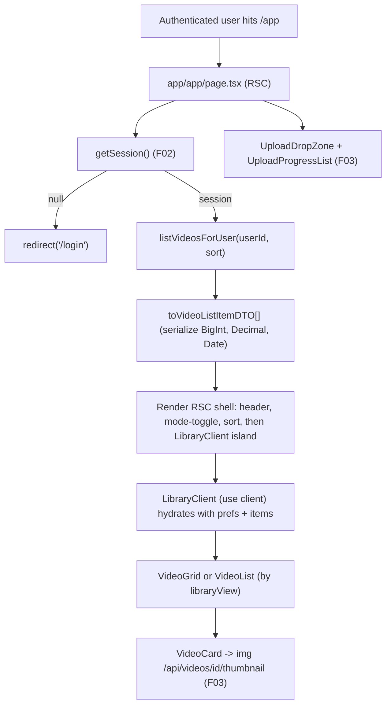
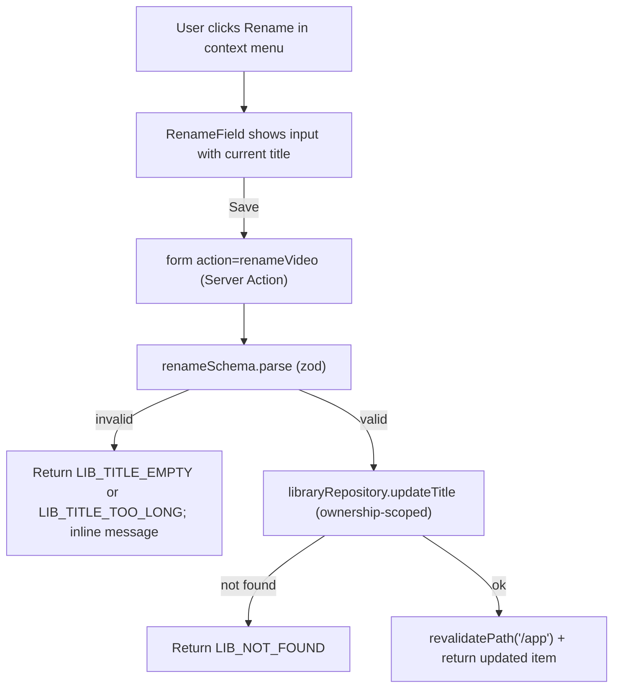
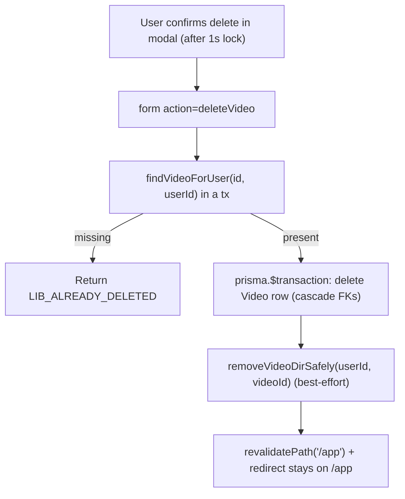
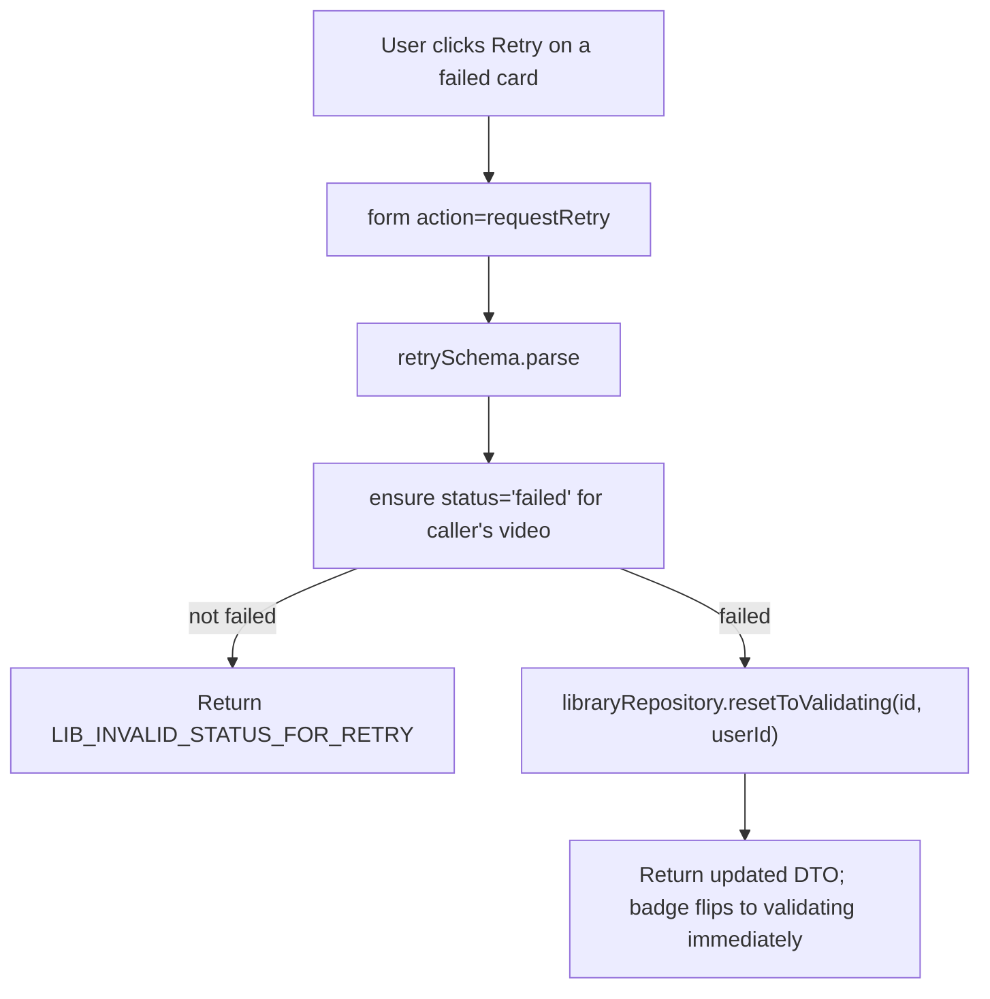

# F04. Video Library — Technical Specification

**Scope tag:** full scope — no Core/Full split (PRD has neither a `Core Scope` block nor a `Full Scope additions` block for F04, so the entire feature definition is in scope)

**Complexity:** medium

---

## 1. Technical Overview

**What:** Implement the authenticated library view at `/app` that replaces F03's placeholder shell with a real listing of every video owned by the current user. The page ships two viewing modes (grid of thumbnails with a duration overlay, status badge, and truncated title; compact list with thumbnail, title, duration, upload date, and status badge), a view-mode toggle whose choice is persisted per user, sort controls (most recent, oldest, title A–Z), and a per-card context menu that exposes Open, Rename, Edit description, Delete, and Retry (retry is enabled only when `status = 'failed'`). Renaming uses an inline editable title field (1–200 chars, trimmed, no empty titles); editing the description opens a modal with a textarea bounded to 2000 characters; deletion opens a confirmation modal whose Delete button is disabled for 1 second after it opens and, on confirm, removes the `video` row, the on-disk source file, the thumbnail, and (when F05/F06/F07 ship) the folder/tag associations and any transcription/summary records. The upload drop zone and progress list from F03 remain on the page at all times; when the library is empty the dedicated empty state renders an illustration and the headline "Upload your first video to get started" directly above the drop zone.

**Why:** F04 is the "app home" surface of the product. It is the page F03's `UploadDropZone` and `UploadProgressList` already render into, the page every authenticated route links back to, and the consumer of the `VideoDTO`, thumbnail Route Handler, and `status` column that F03 established. Because F07 (pipeline), F08 (player), F11 (notifications), and F12 (admin) are downstream consumers of the same status and identity model, F04 must consume that model without re-inventing it — it reuses `getSession()`, `findVideoForUser`, the `VideoDTO` shape, the thumbnail URL scheme, and the `VideoStatus` enum from F03 verbatim. F04 also introduces a small library-preferences primitive (stored on the existing `user` row via a new `libraryView` column, migrated in this feature) so the grid/list choice and the sort mode persist across sessions without adding a separate preferences table. Server Actions remain the convention for the non-binary mutations (rename, edit description, delete, retry-request, set view preference); Route Handlers keep the binary concerns (F03's upload, thumbnail). Where F07 will later own the retry action's actual pipeline re-entry, F04 ships a thin "request retry" Server Action that resets the `status` back to `'validating'` so F03's `ix_video_status` index + F07's future worker pick it up without any other handoff change.

**Scope:**

Included:
- New `/app` library page that replaces F03's placeholder listing with a real grid or list of the current user's videos, sorted by the user's saved preference (default: most recent)
- Server-side rendering of the first paint: the RSC reads the session and queries Prisma directly so the library shows up without a client round-trip, then hydrates a single `<LibraryClient />` island that handles view-mode toggling, sorting, optimistic rename, description edit, delete confirmation, and retry
- Grid mode: responsive column count (4 cols wide, 3 cols medium, 2 cols narrow), each card shows thumbnail with `` (F03), a duration overlay when `durationSeconds` is known, a status badge, the truncated title, and the context-menu trigger
- List mode: compact rows with thumbnail (small), title, duration, upload date, file size, status badge, and the context-menu trigger
- Status badge component shared between modes: one color per `VideoStatus` value (`validating | transcribing | summarizing` = neutral/in-progress; `ready` = success; `failed` = error); neutral states also expose a subtle spinner until F11 arrives
- View-mode toggle (grid/list icons); the selection is saved via a Server Action and mirrored onto a new `user.library_view` column so the next visit renders the correct mode server-side
- Sort selector (Most recent / Oldest / Title A–Z); selection persists via `user.library_sort` and round-trips through the same Server Action so the next visit sorts identically
- Context menu exposing Open, Rename, Edit description, Delete, Retry (hidden unless `status = 'failed'`)
- Open navigates to `/app/videos/{id}`; that detail page is owned by F08 but F04 introduces a minimal placeholder route so links resolve today (the placeholder shows the current status for still-processing videos and an "F08 will land here" note for `ready` videos — swappable by F08 without breaking the link)
- Rename: inline editable title replaces the card's static title; Save posts a `rename` Server Action; client-side validation rejects empty/whitespace strings inline; server validation enforces 1–200 chars and trims; on success the DTO is updated optimistically via `useActionState`
- Edit description: modal with a `<textarea>` (max 2000 characters live counter), Save posts an `editDescription` Server Action; server validation truncates to 2000 chars max and trims trailing whitespace but allows empty string (treated as no description)
- Delete: confirmation modal with the text "Delete '{title}'? This cannot be undone.", Cancel and Delete buttons; Delete is disabled for the first 1 second after the modal opens; confirm posts a `deleteVideo` Server Action that (inside a Prisma transaction) deletes the row and cascades; after the transaction commits the server best-effort removes the on-disk video directory (source + thumbnail) via F03's `removeVideoDir` and swallows filesystem errors (the row is gone so the user never sees it again, and the server logs a warning for out-of-band cleanup)
- Retry: enabled only on `failed` rows; posts a `requestRetry` Server Action that resets `status = 'validating'`, clears any prior `failure_reason` (if/when F07 adds one) and returns the updated DTO so the UI flips the badge immediately
- Empty state (zero rows for the user): illustration + headline "Upload your first video to get started"; the F03 drop zone continues to render above so the user can drop a file without extra clicks
- Persistence migration: add `library_view`, `library_sort` columns to the existing `user` table with safe defaults so no backfill is needed and existing F02 users continue to work without any app-layer branching
- Shared `VideoListItemDTO` shape extending F03's `VideoDTO` with the fields F04's grid/list cards need (`uploadDateISO`, `sizeBytesFormatted` is a UI concern — we keep the raw `sizeBytes` and format in the client)
- Delete idempotency: if two tabs confirm the same delete, the second call sees the row is gone and returns a typed `LIB_ALREADY_DELETED` error so the UI can show "This video has already been deleted" without surfacing a 500
- Rename idempotency: renaming to the current value succeeds silently with no DB write
- Unit tests for every Server Action's happy and error paths, unit/component tests for the client islands (card, context menu, rename field, description modal, delete modal), and integration tests for the list-building query and each Server Action against `testcontainers` Postgres

Excluded (owned by other features or out of scope per PRD Section 7):
- The actual video detail page with player, transcription panel, and summary — F08 (F04 ships only a placeholder at `/app/videos/[id]`)
- Folder filters and the folder sidebar entry — F05 (F04 renders the library unsegmented; the header reserves layout space so F05 can slot in without a reflow)
- Tag chips on cards, tag filter pills, "Manage tags" — F06
- Pipeline execution, retry actual re-entry, stage transitions — F07; F04 only toggles status back to `'validating'`
- Notification panel — F11; F04 does not need to push events, it only reads the current `status` column
- Admin actions — F12
- Pagination (PRD does not specify a cap; users can have unlimited videos but no filter/search yet); F04 renders the full list server-side and relies on the browser's virtualized scroll — documented in Assumptions
- Bulk selection, multi-delete, bulk rename — not in PRD
- Drag-to-reorder — not in PRD
- Download source video / transcription — PRD Section 7 excludes it

---

## 2. Architecture Impact

**Affected components:**

| Path | Role |
|------|------|
| `prisma/schema.prisma` | Modified — add `libraryView`, `librarySort` columns to the existing `User` model; no new model |
| `prisma/migrations/<timestamp>_add_user_library_prefs/migration.sql` | New — `ALTER TABLE user ADD COLUMN library_view / library_sort` with defaults + CHECK constraint |
| `app/app/page.tsx` | Modified — replace F03's placeholder text with the server-rendered library; embed `<LibraryClient />`; keep F03's `<UploadDropZone />` + `<UploadProgressList />` |
| `app/app/videos/[id]/page.tsx` | New (placeholder for F08) — renders status + title for still-processing videos and a "Video detail coming soon" note for `ready` videos so links from the library resolve today |
| `app/_components/library/LibraryClient.tsx` | New — `"use client"` island that composes the toggle, sort selector, the grid/list, and the modals; owns the optimistic state around rename/description/delete/retry |
| `app/_components/library/LibraryHeader.tsx` | New — view-mode toggle + sort selector, each wired to a Server Action via a form |
| `app/_components/library/VideoGrid.tsx` | New — responsive grid layout that renders one `<VideoCard />` per item |
| `app/_components/library/VideoList.tsx` | New — list layout that renders one `<VideoRow />` per item |
| `app/_components/library/VideoCard.tsx` | New — presentational card for grid mode (thumbnail + duration overlay + status badge + title + context menu trigger) |
| `app/_components/library/VideoRow.tsx` | New — presentational row for list mode (thumbnail + title + duration + upload date + size + status badge + context menu trigger) |
| `app/_components/library/ContextMenu.tsx` | New — popover menu used by card and row; exposes Open, Rename, Edit description, Delete, Retry (Retry hidden unless `status = 'failed'`) |
| `app/_components/library/StatusBadge.tsx` | New — color-coded badge for `VideoStatus`; pure presentation |
| `app/_components/library/RenameField.tsx` | New — inline editable title field; switches between label and `<input>`; wires to `rename` Server Action via `useActionState` |
| `app/_components/library/DescriptionModal.tsx` | New — dialog with `<textarea>` (live counter, max 2000); wires to `editDescription` Server Action |
| `app/_components/library/DeleteConfirmModal.tsx` | New — dialog with the warning copy; Delete button disabled for 1000 ms after open; wires to `deleteVideo` Server Action |
| `app/_components/library/EmptyState.tsx` | New — illustration + headline for the zero-videos state |
| `app/_components/library/DurationOverlay.tsx` | New — formats `durationSeconds` as `MM:SS` or `HH:MM:SS`; used by `<VideoCard />` |
| `app/_lib/videos/library.ts` | New — server-side library query (`listVideosForUser`) + DTO mapper (`toVideoListItemDTO`) + sort dispatch |
| `app/_lib/videos/actions.ts` | New — Server Actions: `renameVideo`, `editVideoDescription`, `deleteVideo`, `requestRetry`, `setLibraryPreferences` |
| `app/_lib/videos/libraryErrors.ts` | New — typed error codes `LIB_NOT_FOUND`, `LIB_FORBIDDEN`, `LIB_ALREADY_DELETED`, `LIB_TITLE_EMPTY`, `LIB_TITLE_TOO_LONG`, `LIB_DESCRIPTION_TOO_LONG`, `LIB_INVALID_STATUS_FOR_RETRY`, `LIB_INVALID_VIEW`, `LIB_INVALID_SORT` |
| `app/_lib/videos/libraryValidation.ts` | New — zod schemas for each Server Action's input (`renameSchema`, `editDescriptionSchema`, `deleteSchema`, `retrySchema`, `setPreferencesSchema`) |
| `app/_lib/videos/libraryRepository.ts` | New — Prisma accessors that F04 owns: `listByUser(userId, sort)`, `updateTitle`, `updateDescription`, `deleteOwnedVideo`, `resetToValidating`, `updateLibraryPreferences` |
| `app/_lib/videos/repository.ts` | Modified — extend existing F03 module with a `deleteVideoTransactional(videoId, userId)` helper that cascades via Prisma transaction; re-exported for F12 later |
| `app/_lib/videos/status.ts` | Re-used (no change) — `VideoStatus`, `isVideoStatus` |
| `app/_lib/videos/storage.ts` | Re-used + extended — add `removeVideoDirSafely(userId, videoId)` that wraps F03's `removeVideoDir` in a try/catch and returns `{ ok: true }` / `{ ok: false, reason }` so the delete action never throws on filesystem weirdness |
| `app/_lib/session.ts` | Re-used (no change) |
| `app/_lib/videos/formatting.ts` | New — pure helpers `formatDuration`, `formatFileSize`, `formatUploadDate`; used by card/row/list components and covered by unit tests |
| `app/_components/library/__tests__/*` | New — component tests per Testing Strategy |
| `app/_lib/videos/__tests__/library.test.ts` / `.integration.test.ts` / `actions.integration.test.ts` / `libraryValidation.test.ts` / `formatting.test.ts` / `libraryRepository.integration.test.ts` | New — unit + integration tests |
| `e2e/library.spec.ts` | New — single Playwright spec that exercises the user-visible flows listed in PRD Section 9 (view mode persists, rename to empty rejected, delete confirmation 1 s lock, empty state renders) |
| `public/empty-library.svg` | New — illustration for the empty state |

**Data flow — first paint of `/app`:**



**Data flow — rename:**



**Data flow — delete:**



**Data flow — request retry:**



---

## 3. Technical Decisions

| Decision | Chosen Approach | Alternative Considered | Trade-off |
|----------|-----------------|------------------------|-----------|
| Data fetching for the library | Server component queries Prisma directly and passes a serialized `VideoListItemDTO[]` into a single client island | Client-side `fetch('/api/videos')` on mount | SSR-first matches F02/F03 conventions and avoids a flash-of-empty-list; the one client island still owns interactive concerns. No `/api/videos?list` endpoint is introduced (keeping the API surface small) |
| Mutation style | Next.js App Router **Server Actions** for rename, edit description, delete, retry request, set preferences | Route Handlers under `/api/videos/[id]/*` | Consistent with F02's auth actions; Server Actions get CSRF for free and `revalidatePath('/app')` is a one-liner. Route Handlers are reserved for binary transfer (F03) |
| Preferences storage | Two new columns on the existing `user` table: `library_view varchar(4)` (`grid` / `list`) and `library_sort varchar(16)` (`recent` / `oldest` / `title_asc`) | Separate `user_preferences` table | One migration, one join-free query. Preferences are read every page load with the user anyway via `getSession()` — adding them to `user` avoids a second lookup. Documented in Assumptions |
| Default view mode | `grid` | `list` | Matches PRD F04 Experience: "Library loads with grid view by default on the first visit" |
| Default sort | `recent` (= most recent first) | `title_asc` | Matches PRD F04 Capabilities: "Sort options: most recent (default)" |
| View toggle UX | Icon-only buttons wrapped in a form posting to `setLibraryPreferences`; the server re-renders `/app` with the new preference | Local state only | Persisting across sessions is a PRD requirement ("per-user persistent choice"). Doing it via Server Action keeps the server as the source of truth |
| Status badge colors | Single shared component; colors live on `app/globals.css` tokens so they can be reused by F11's notification panel without duplication | Per-state bespoke components | Consistency and future reuse |
| Delete cascade | Prisma transaction that deletes the `Video` row; FK cascades handle `Session`-adjacent tables as they ship (F05 folder assoc, F06 tag assoc, F07 transcription/summary). On-disk cleanup runs AFTER the transaction commits and is best-effort | Delete files first, then DB | PRD F04 Error Handling: "Delete succeeds but file removal fails: mark the record as deleted regardless so the user does not see it again." Commit-then-clean matches that; a leaked dir is a silent alert, not a user-visible error |
| Delete button 1-second lock | Client-side timer in `<DeleteConfirmModal />` that enables the Delete button only after 1000 ms | Server-side enforced delay | PRD F04 Experience: the UX requirement is about accidental-click prevention on the modal, not about rate-limiting the server |
| Retry semantics | Server Action resets `status = 'validating'` and returns the updated row. F07 will pick it up on its next scan | Call an F07 entry-point directly | F07 is Wave 3 alongside F04 and may not exist yet when F04 is implemented; decoupling via the status column lets either feature ship first |
| Detail route placeholder | `app/app/videos/[id]/page.tsx` as an RSC that reads the video and renders either "This video is still processing — <status>" or "Playable detail coming in F08" | No placeholder; 404 on `/app/videos/:id` until F08 lands | Library cards link into this route today; a 404 would make F04's links visibly broken. F08 replaces the body without changing the path |
| Title validation | `z.string().trim().min(1, 'LIB_TITLE_EMPTY').max(200, 'LIB_TITLE_TOO_LONG')` | Allow empty; store null | PRD: "Rename: inline editable title field, 1–200 characters, cannot be empty" |
| Description validation | `z.string().trim().max(2000, 'LIB_DESCRIPTION_TOO_LONG')`; empty string is allowed and stored as `''` to match F03's default | Allow null | F03 defaults `description = ''`; keeping `NOT NULL` avoids null-handling in all render paths |
| Sort implementation | Dispatch in `listByUser` that picks `orderBy` per sort key; `title_asc` uses `LOWER(title)` collation via Prisma's `mode: 'insensitive'`-equivalent (raw SQL `ORDER BY LOWER(title)`) | Client-side sort after fetching | The server query uses the existing `ix_video_user_id_created_at` index for the two date sorts; title sort is a table scan for the user's rows (acceptable at MVP scale; documented in Assumptions) |
| Optimistic UI | `useActionState` + `useOptimistic` for rename and description; delete uses a hard reload via `revalidatePath` (no optimistic removal so the user sees the confirmation result) | Full optimistic UX on delete too | Delete is destructive; accepting a small perceived delay is better than showing a phantom-deleted row that then reappears on error |
| Empty state trigger | Zero rows for the user (regardless of sort/view) | Zero visible rows after a filter | No filters exist yet in F04; the only zero-row state is a truly empty library |
| Idempotent deletes | `deleteVideo` Server Action reads the row first, returns `LIB_ALREADY_DELETED` if absent (no `throw`) | Rely on Prisma's `P2025` record-not-found error | PRD: "Concurrent delete (same user clicks twice): second click shows 'This video has already been deleted'" — explicit state is clearer than error-parsing |
| Image element | Native `` with `loading="lazy"` and an explicit aspect box | `next/image` | Thumbnails are served by F03's Route Handler, not static; `next/image` optimization would require exposing the thumbnail file through the Next image pipeline and lose the private-by-default auth. Native `` keeps the auth flow simple |
| Duration format | `MM:SS` for < 1 hour, `HH:MM:SS` otherwise; `--:--` when `durationSeconds` is null | Always `HH:MM:SS` | PRD does not specify; this matches YouTube-style UX and is shortest for the common case |
| File size format | Binary units (`KB`, `MB`, `GB`), two decimals when size < 10, one decimal otherwise | Decimal (MB = 1_000_000) | Consistent with F03's `UploadProgressCard.formatBytes` (extracted into the shared `formatting.ts`) |
| Upload date format | `YYYY-MM-DD` for the list view; `X days ago` relative (< 7 days) + absolute date fallback | Locale-formatted only | Stable test output (no locale flakes) and predictable UX at this scale |
| Context menu behavior | Native `<dialog>`-less popover implemented with a controlled `open` state + outside-click handler; keyboard support (Escape closes, Enter activates focused item) | Radix UI `DropdownMenu` | Avoid adding a dependency; the popover is ~40 LOC. PRD does not require a complex a11y tree |
| Optimistic rename conflict | If the server rejects (e.g., row deleted in another tab), the UI reverts to the pre-edit title and shows the typed error | Silent swallow | Matches PRD's "This video has already been deleted" pattern |
| Route organization | `app/app/` for the authenticated app; `app/app/page.tsx` for the library; `app/app/videos/[id]/page.tsx` for the detail placeholder; client islands under `app/_components/library/` | `app/(app)/...` route group | F02/F03 already use `app/app/...`; continue the pattern |
| SSR payload size | For the MVP, return all user videos (no pagination). At the PRD's expected scale (personal archives) this is a few hundred rows at most | Pagination with cursor | Adding pagination without a PRD trigger adds API surface and client complexity; documented as a known deferral in Assumptions |

---

## 4. Component Overview

**Frontend (App Router):**

| File Path | New/Modified | Purpose | Key Responsibilities |
|-----------|--------------|---------|----------------------|
| `app/app/page.tsx` | Modified | Library RSC shell | Calls `getSession()`; calls `listVideosForUser(userId, sort)`; serializes DTOs; renders `<LibraryHeader />`, `<LibraryClient items prefs />`, F03's `<UploadDropZone />` + `<UploadProgressList />`; server-side redirect to `/login` when unauthenticated |
| `app/app/videos/[id]/page.tsx` | New | Detail placeholder (F08 swap point) | RSC that loads the video via `findVideoForUser`; renders status for still-processing rows and a placeholder for `ready` rows; 404 when the row does not belong to the caller |
| `app/_components/library/LibraryClient.tsx` | New | Main client island | `"use client"`; owns `items`, `view`, `sort`, modal open-state; receives initial data from the RSC; delegates to `<VideoGrid />` or `<VideoList />` based on `view`; hosts the modals; wires up `useOptimistic` for rename/description |
| `app/_components/library/LibraryHeader.tsx` | New | Toggle + sort | Two forms: one with icon buttons posting `setLibraryPreferences({ view })`, one with `<select>` posting `setLibraryPreferences({ sort })`; no client state — the RSC reflects the new value |
| `app/_components/library/VideoGrid.tsx` | New | Grid layout | Wraps children in a responsive CSS grid; renders `<VideoCard />` per item; handles keyboard arrow navigation between cards (a11y affordance) |
| `app/_components/library/VideoList.tsx` | New | List layout | Wraps children in a `<ul>` with semantic rows; renders `<VideoRow />` per item |
| `app/_components/library/VideoCard.tsx` | New | Grid card | Presentational; renders thumbnail, duration overlay (via `<DurationOverlay />`), status badge, truncated title, context-menu trigger; click on thumbnail navigates to `/app/videos/{id}`; no data-fetching |
| `app/_components/library/VideoRow.tsx` | New | List row | Presentational; same data as the card plus upload date and size; same click behavior and context menu |
| `app/_components/library/ContextMenu.tsx` | New | Popover menu | Controlled open state; items Open, Rename, Edit description, Delete, Retry (Retry rendered only when `status === 'failed'`); keyboard handling (Escape, Enter, arrow up/down) |
| `app/_components/library/StatusBadge.tsx` | New | Status pill | Receives `VideoStatus`; renders the correct color + label; a11y `<span role="status">` |
| `app/_components/library/RenameField.tsx` | New | Inline title editor | Switches between read-only span and `<input>` on activation; Save button posts `renameVideo`; Escape cancels; `useActionState` surfaces `LIB_TITLE_EMPTY` / `LIB_TITLE_TOO_LONG` inline |
| `app/_components/library/DescriptionModal.tsx` | New | Description editor dialog | `<dialog>`-based modal with `<textarea>` (value, maxLength 2000, live counter); Save posts `editVideoDescription`; focus trapping + Escape to close |
| `app/_components/library/DeleteConfirmModal.tsx` | New | Delete confirmation | `<dialog>` with the PRD copy; Delete button disabled for 1000 ms after open (via `useEffect` timer); posts `deleteVideo`; on `LIB_ALREADY_DELETED` shows the "already deleted" message then closes |
| `app/_components/library/EmptyState.tsx` | New | Zero-videos screen | Renders `/empty-library.svg` + copy; always paired with F03's `<UploadDropZone />` |
| `app/_components/library/DurationOverlay.tsx` | New | Duration badge | Receives `durationSeconds: number | null`; uses `formatDuration` helper |

**Backend (server-side modules + Server Actions):**

| File Path | New/Modified | Purpose | Key Responsibilities |
|-----------|--------------|---------|----------------------|
| `app/_lib/videos/library.ts` | New | Library query + DTO mapper | `listVideosForUser(userId, sort): Promise<VideoListItemDTO[]>` — uses `libraryRepository.listByUser` and maps via `toVideoListItemDTO` (serializes `BigInt`, `Decimal`, `Date`); exports `SortKey` union |
| `app/_lib/videos/actions.ts` | New | Server Actions | `"use server"`; five actions: `renameVideo`, `editVideoDescription`, `deleteVideo`, `requestRetry`, `setLibraryPreferences`. Each reads the session, validates input with zod, calls the repository, calls `revalidatePath('/app')`, returns a typed state. Delete additionally calls `removeVideoDirSafely` post-commit |
| `app/_lib/videos/libraryRepository.ts` | New | Ownership-scoped Prisma accessors | `listByUser(userId, sort)`, `updateTitle(id, userId, title)`, `updateDescription(id, userId, description)`, `deleteOwnedVideo(id, userId)` (transactional), `resetToValidating(id, userId)`, `updateLibraryPreferences(userId, partial)`. Each returns `null` on non-ownership so the action can return `LIB_NOT_FOUND` without leaking existence |
| `app/_lib/videos/repository.ts` | Modified | F03 module extended | Add `deleteVideoTransactional(videoId: string, userId: string, tx?)` that performs the ownership check and delete inside a transaction; re-used by F04's delete action and later by F12 |
| `app/_lib/videos/libraryValidation.ts` | New | zod input schemas | `renameSchema`, `editDescriptionSchema`, `deleteSchema`, `retrySchema`, `setPreferencesSchema`; shared with tests |
| `app/_lib/videos/libraryErrors.ts` | New | Typed error codes | Exports `LibraryError` and `LibraryErrorCode` so actions and components agree on identifiers |
| `app/_lib/videos/storage.ts` | Modified | Add safe-delete wrapper | `removeVideoDirSafely(userId, videoId)` wraps `removeVideoDir` in a try/catch and returns `{ ok, reason? }`; never throws |
| `app/_lib/videos/formatting.ts` | New | Pure UI helpers | `formatDuration`, `formatFileSize`, `formatUploadDate`; pure functions, 100% unit coverage |
| `app/_lib/videos/status.ts` | Re-used | Status enum | No change |
| `app/_lib/session.ts` | Re-used | Session reader | No change |

**Database:**

| Migration File | Tables Affected | Operation | Notes |
|----------------|-----------------|-----------|-------|
| `prisma/migrations/<timestamp>_add_user_library_prefs/migration.sql` | `user` | ALTER | `ADD COLUMN library_view varchar(4) NOT NULL DEFAULT 'grid'`; `ADD COLUMN library_sort varchar(16) NOT NULL DEFAULT 'recent'`; add CHECK constraints for both columns |

**Static assets:**

| File Path | New/Modified | Purpose |
|-----------|--------------|---------|
| `public/empty-library.svg` | New | Illustration for the zero-videos empty state |

---

## 5. API Contracts

F04 ships no HTTP endpoints of its own. All mutations are App Router Server Actions, which are invoked by forms inside the library page's client islands and do not expose a public REST interface. The following lists describe each Server Action's signature in the same shape as a REST endpoint table so implementation, test, and UI code agree on input/output.

### Server Action: `renameVideo`

- **Module:** `app/_lib/videos/actions.ts`
- **Form invocation:** `<form action={renameVideo}>` inside `<RenameField />`
- **Authentication:** `getSession()` guard; no session → returns `{ ok: false, code: 'LIB_FORBIDDEN' }`

**Input (from `FormData`):**

| Field | Type | Required | Validation | Description |
|-------|------|----------|------------|-------------|
| `id` | `string` (cuid) | Yes | Valid cuid, 20–32 chars | Target video id |
| `title` | `string` | Yes | Trimmed, 1–200 chars | New display title |

**Response State (returned to the form):**

| Field | Type | Description |
|-------|------|-------------|
| `ok` | `boolean` | `true` on success |
| `code` | `string?` | Error code when `ok === false` |
| `item` | `VideoListItemDTO?` | Updated item on success |
| `fieldErrors` | `Record<string, string[]>?` | Per-field errors; keyed as `{ title: [...] }` |

**Example success:**

```json
{
  "ok": true,
  "item": {
    "id": "clv...",
    "title": "Morning standup — 2026-04-18",
    "description": "",
    "durationSeconds": 1823.4,
    "sizeBytes": 524288000,
    "containerFormat": "mp4",
    "status": "ready",
    "thumbnailUrl": "/api/videos/clv.../thumbnail",
    "hasCustomThumbnail": true,
    "createdAt": "2026-04-18T14:20:31.420Z"
  }
}
```

**Error codes:**

| Code | Meaning |
|------|---------|
| `LIB_FORBIDDEN` | No session |
| `LIB_NOT_FOUND` | Row does not exist or does not belong to the caller |
| `LIB_TITLE_EMPTY` | Title is empty or whitespace-only |
| `LIB_TITLE_TOO_LONG` | Title exceeds 200 chars after trim |

### Server Action: `editVideoDescription`

- **Module:** `app/_lib/videos/actions.ts`
- **Form invocation:** `<form action={editVideoDescription}>` inside `<DescriptionModal />`

**Input:**

| Field | Type | Required | Validation | Description |
|-------|------|----------|------------|-------------|
| `id` | `string` | Yes | Valid cuid | Target video id |
| `description` | `string` | Yes | Trimmed, 0–2000 chars | New description (empty string allowed) |

**Error codes:** `LIB_FORBIDDEN`, `LIB_NOT_FOUND`, `LIB_DESCRIPTION_TOO_LONG`.

### Server Action: `deleteVideo`

- **Module:** `app/_lib/videos/actions.ts`
- **Form invocation:** `<form action={deleteVideo}>` inside `<DeleteConfirmModal />`

**Input:**

| Field | Type | Required | Validation | Description |
|-------|------|----------|------------|-------------|
| `id` | `string` | Yes | Valid cuid | Target video id |

**Response State:**

| Field | Type | Description |
|-------|------|-------------|
| `ok` | `boolean` | `true` on success |
| `code` | `string?` | `LIB_ALREADY_DELETED` when the row was already gone, `LIB_NOT_FOUND` for non-ownership |
| `filesystemWarning` | `string?` | Present when the row was deleted but the on-disk cleanup failed (silent server-side alert; the UI treats this as success) |

**Error codes:** `LIB_FORBIDDEN`, `LIB_NOT_FOUND`, `LIB_ALREADY_DELETED`.

### Server Action: `requestRetry`

- **Module:** `app/_lib/videos/actions.ts`
- **Form invocation:** `<form action={requestRetry}>` from the context menu

**Input:**

| Field | Type | Required | Validation | Description |
|-------|------|----------|------------|-------------|
| `id` | `string` | Yes | Valid cuid | Target video id |

**Behaviour:**
- Reads the row, returns `LIB_NOT_FOUND` for non-ownership
- Returns `LIB_INVALID_STATUS_FOR_RETRY` when the row's `status` is not `'failed'`
- On success: updates `status = 'validating'`, returns the updated `VideoListItemDTO`; F07 (when present) picks it up from the `ix_video_status` index

**Error codes:** `LIB_FORBIDDEN`, `LIB_NOT_FOUND`, `LIB_INVALID_STATUS_FOR_RETRY`.

### Server Action: `setLibraryPreferences`

- **Module:** `app/_lib/videos/actions.ts`
- **Form invocation:** view-toggle form or sort-select form in `<LibraryHeader />`

**Input:**

| Field | Type | Required | Validation | Description |
|-------|------|----------|------------|-------------|
| `view` | `string?` | No | One of `grid`, `list` | Updated view preference |
| `sort` | `string?` | No | One of `recent`, `oldest`, `title_asc` | Updated sort preference |

At least one of `view` or `sort` must be provided.

**Error codes:** `LIB_FORBIDDEN`, `LIB_INVALID_VIEW`, `LIB_INVALID_SORT`.

### Data shape consumed by the client: `VideoListItemDTO`

Extends F03's `VideoDTO` with fields useful for grid/list display.

| Field | Type | Description |
|-------|------|-------------|
| `id` | `string` | cuid |
| `title` | `string` | Current title |
| `description` | `string` | Current description (empty string if unset) |
| `originalFilename` | `string` | Original upload filename |
| `sizeBytes` | `number` | Size in bytes |
| `durationSeconds` | `number \| null` | Duration in seconds; null when probe failed |
| `containerFormat` | `string` | Lowercased extension |
| `status` | `VideoStatus` | One of `validating`, `transcribing`, `summarizing`, `ready`, `failed` |
| `thumbnailUrl` | `string` | `/api/videos/{id}/thumbnail` (always; server falls back to placeholder) |
| `hasCustomThumbnail` | `boolean` | `false` when the row uses the placeholder |
| `createdAt` | `string (ISO 8601)` | Upload timestamp |

---

## 6. Data Model

F04 does not add a new table. It extends the existing `user` table (F02) with two columns storing library preferences, and relies on the existing `video` table (F03) for every listing/mutation. The existing indexes on `video` already satisfy F04's common queries:

- `ix_video_user_id_created_at` (from F03) covers "Most recent" and "Oldest" sort as a range scan
- `ix_video_status` (from F03) covers the badge-color logic and is also what F07 will use when it ships

### Table: `user` (MODIFIED — new columns only)

| Column | Type | Nullable | Default | Description |
|--------|------|----------|---------|-------------|
| `library_view` | `varchar(4)` | No | `'grid'` | One of `grid`, `list`. Saved preference for the F04 view toggle |
| `library_sort` | `varchar(16)` | No | `'recent'` | One of `recent`, `oldest`, `title_asc`. Saved preference for the F04 sort selector |

**New Constraints:**

| Constraint | Type | Definition | Purpose |
|------------|------|------------|---------|
| `ck_user_library_view` | CHECK | `library_view IN ('grid','list')` | Defensive; matches the UI allowlist |
| `ck_user_library_sort` | CHECK | `library_sort IN ('recent','oldest','title_asc')` | Defensive; matches the UI allowlist |

**Migration (`prisma/migrations/<timestamp>_add_user_library_prefs/migration.sql`):**

```sql
ALTER TABLE "user"
  ADD COLUMN "library_view" VARCHAR(4) NOT NULL DEFAULT 'grid',
  ADD COLUMN "library_sort" VARCHAR(16) NOT NULL DEFAULT 'recent';

ALTER TABLE "user"
  ADD CONSTRAINT "ck_user_library_view"
  CHECK ("library_view" IN ('grid','list'));

ALTER TABLE "user"
  ADD CONSTRAINT "ck_user_library_sort"
  CHECK ("library_sort" IN ('recent','oldest','title_asc'));
```

**Prisma schema changes (appended to `User` model):**

```prisma
model User {
  // ...existing fields from F02...
  libraryView  String   @default("grid")   @map("library_view")  @db.VarChar(4)
  librarySort  String   @default("recent") @map("library_sort")  @db.VarChar(16)
}
```

### Table: `video` (UNCHANGED — reused from F03)

No schema changes. F04 reads every column and writes to `title`, `description`, `status`, and (indirectly via delete) the whole row. The existing indexes are sufficient for the MVP-scale listing.

**Cross-Database Notes:**
- Both new columns are `varchar` + CHECK rather than native Postgres `ENUM` — matches F03's decision for `video.status` so adding a new sort key or view mode is an application change only.
- Defaults are safe for existing users; no backfill needed.

---

## 7. Testing Strategy

F04 re-uses the Vitest + React Testing Library + `testcontainers` Postgres harness established by F02 and extended by F03. Server Actions are tested by calling them directly with a mocked session (the F02/F03 harness already exposes a helper for this). The Playwright spec boots the dev server against the same `DATABASE_URL` and exercises the user-visible PRD acceptance criteria.

**Test File Structure:**

| Test File | Test Type | Target | Coverage Goal |
|-----------|-----------|--------|---------------|
| `app/_lib/videos/__tests__/formatting.test.ts` | Unit | `formatDuration`, `formatFileSize`, `formatUploadDate` | 100% branches |
| `app/_lib/videos/__tests__/libraryValidation.test.ts` | Unit | All zod schemas | 100% branches |
| `app/_lib/videos/__tests__/library.test.ts` | Unit | `toVideoListItemDTO` mapper, sort dispatch | All branches |
| `app/_lib/videos/__tests__/libraryRepository.integration.test.ts` | Integration (Postgres) | `listByUser`, `updateTitle`, `updateDescription`, `deleteOwnedVideo`, `resetToValidating`, `updateLibraryPreferences` | All branches (success + ownership-scoped failure) |
| `app/_lib/videos/__tests__/actions.integration.test.ts` | Integration (Postgres + session mock) | Every Server Action | Every PRD Section 9 F04 acceptance criterion + error matrix |
| `app/_components/library/__tests__/VideoCard.test.tsx` | Unit (component) | Grid card render | Happy + all status variants + null duration |
| `app/_components/library/__tests__/VideoRow.test.tsx` | Unit (component) | List row render | Happy + all status variants |
| `app/_components/library/__tests__/StatusBadge.test.tsx` | Unit (component) | All five status colors + aria | All branches |
| `app/_components/library/__tests__/ContextMenu.test.tsx` | Unit (component) | Menu items, Retry gating, keyboard support | All branches |
| `app/_components/library/__tests__/RenameField.test.tsx` | Unit (component) | Inline edit, empty rejection, 200-char limit, Escape cancel | All branches |
| `app/_components/library/__tests__/DescriptionModal.test.tsx` | Unit (component) | Counter, save, Escape, focus trap | All branches |
| `app/_components/library/__tests__/DeleteConfirmModal.test.tsx` | Unit (component) | 1-second lock, confirm, cancel, already-deleted path | All branches |
| `app/_components/library/__tests__/EmptyState.test.tsx` | Unit (component) | Illustration + copy render | Happy path |
| `app/_components/library/__tests__/LibraryHeader.test.tsx` | Unit (component) | Toggle + sort select render, form submit wiring | All branches |
| `app/_components/library/__tests__/LibraryClient.test.tsx` | Unit (component) | Switches grid/list by `view` prop, passes sort, opens each modal from the context menu | All branches |
| `app/app/__tests__/libraryPage.integration.test.tsx` | Integration | `/app` RSC renders correct DTO shape for a seeded user; empty-state branch; authenticated redirect | All branches |
| `e2e/library.spec.ts` | E2E (Playwright) | User visible flows: view mode persists across reload; rename to empty is rejected; delete modal 1-second lock; empty state renders when the user has no videos | PRD Section 9 F04 user-visible criteria |

**Per-file test functions:**

`app/_lib/videos/__tests__/formatting.test.ts`

| Test Function | Description | Assertions |
|---------------|-------------|------------|
| `format_duration_null_returns_em_dash` | `formatDuration(null)` | `'--:--'` |
| `format_duration_under_an_hour_returns_mmss` | `formatDuration(125.7)` | `'02:05'` |
| `format_duration_over_an_hour_returns_hhmmss` | `formatDuration(3725)` | `'01:02:05'` |
| `format_file_size_bytes_to_kb_to_mb_to_gb` | Table-driven across boundaries | Matches the F03 `formatBytes` output (shared source of truth) |
| `format_upload_date_recent_uses_relative` | Date 2 days ago | `'2 days ago'` |
| `format_upload_date_old_uses_iso` | Date 30 days ago | `'YYYY-MM-DD'` |

`app/_lib/videos/__tests__/libraryValidation.test.ts`

| Test Function | Description | Assertions |
|---------------|-------------|------------|
| `rename_rejects_empty_string_with_LIB_TITLE_EMPTY` | `{ id, title: '' }` | zod issue code `LIB_TITLE_EMPTY` |
| `rename_rejects_whitespace_only_with_LIB_TITLE_EMPTY` | `{ id, title: '   ' }` | Same |
| `rename_trims_and_accepts_200_char_title` | 200-char title | Parses ok |
| `rename_rejects_201_char_title_with_LIB_TITLE_TOO_LONG` | 201-char title | Error code |
| `description_accepts_empty_string` | `{ id, description: '' }` | Ok |
| `description_rejects_2001_char_with_LIB_DESCRIPTION_TOO_LONG` | 2001 chars | Error code |
| `preferences_rejects_unknown_view` | `{ view: 'cards' }` | `LIB_INVALID_VIEW` |
| `preferences_rejects_unknown_sort` | `{ sort: 'random' }` | `LIB_INVALID_SORT` |

`app/_lib/videos/__tests__/library.test.ts`

| Test Function | Description | Assertions |
|---------------|-------------|------------|
| `to_video_list_item_dto_serializes_bigint_and_decimal` | Prisma row with `BigInt` size and `Decimal` duration | DTO returns `number` for both |
| `to_video_list_item_dto_sets_thumbnail_url` | Any row | `thumbnailUrl === '/api/videos/{id}/thumbnail'` |
| `to_video_list_item_dto_flags_custom_thumbnail` | `thumbnailPath` null vs set | `hasCustomThumbnail` matches |
| `sort_dispatch_recent_uses_created_at_desc` | `recent` | Prisma `orderBy` contains `createdAt: desc` |
| `sort_dispatch_oldest_uses_created_at_asc` | `oldest` | `createdAt: asc` |
| `sort_dispatch_title_asc_uses_lowered_title` | `title_asc` | Query uses a case-insensitive title order |

`app/_lib/videos/__tests__/libraryRepository.integration.test.ts`

| Test Function | Description | Assertions |
|---------------|-------------|------------|
| `list_by_user_returns_only_owner_rows` | Seed two users, each with videos | Returned rows all have `userId === targetUserId` |
| `list_by_user_sort_recent_is_default_and_newest_first` | Seed 3 videos with different `createdAt` | Order matches |
| `list_by_user_sort_title_asc_is_case_insensitive` | `'banana'`, `'Apple'`, `'cherry'` | Order: Apple, banana, cherry |
| `update_title_returns_null_for_non_owner` | Other-user video | Repo returns null; DB unchanged |
| `update_title_persists_trimmed_value` | `'  Hello  '` | DB shows `'Hello'` |
| `update_description_persists_empty_string_as_empty` | `''` | DB shows `''`, not null |
| `delete_owned_video_removes_row_and_cascades_sessions` | Seeded row + associations | Row gone, no orphans |
| `delete_owned_video_returns_null_for_non_owner` | Other-user video | Repo returns null; row intact |
| `reset_to_validating_flips_status_from_failed` | Failed row | `status === 'validating'` |
| `reset_to_validating_returns_null_when_status_is_not_failed` | Ready row | Null |
| `update_library_preferences_persists_both_view_and_sort` | Partial updates | Each persists independently |
| `update_library_preferences_rejects_unknown_values_at_db_level` | Raw SQL write | CHECK constraint fires |

`app/_lib/videos/__tests__/actions.integration.test.ts`

| Test Function | Description | Assertions |
|---------------|-------------|------------|
| `rename_happy_path_returns_updated_item` | Valid payload | `{ ok: true, item }` with new title; DB persisted |
| `rename_empty_title_returns_LIB_TITLE_EMPTY` | Empty title | `{ ok: false, code: 'LIB_TITLE_EMPTY' }`; DB unchanged |
| `rename_non_owner_returns_LIB_NOT_FOUND` | Other user's row | `{ ok: false, code: 'LIB_NOT_FOUND' }` |
| `rename_no_session_returns_LIB_FORBIDDEN` | No cookie | `{ ok: false, code: 'LIB_FORBIDDEN' }` |
| `edit_description_happy_path` | Valid 500-char desc | Persisted |
| `edit_description_rejects_2001_chars` | Oversized | Code `LIB_DESCRIPTION_TOO_LONG` |
| `delete_happy_path_removes_row_and_fs_dir` | Seeded row with on-disk dir | Row gone; dir gone; `ok: true` |
| `delete_twice_returns_LIB_ALREADY_DELETED_on_second_call` | Two deletes in a row | First ok; second `LIB_ALREADY_DELETED` |
| `delete_filesystem_failure_still_returns_ok_with_warning` | Stub `removeVideoDirSafely` to fail | `{ ok: true, filesystemWarning }` |
| `request_retry_happy_path_flips_failed_to_validating` | Failed row | Status is `validating` |
| `request_retry_rejects_when_status_is_ready` | Ready row | `LIB_INVALID_STATUS_FOR_RETRY` |
| `set_preferences_persists_grid_list_toggle` | Call with `view=list` | User row has `library_view='list'` |
| `set_preferences_persists_sort` | Call with `sort=oldest` | User row has `library_sort='oldest'` |
| `set_preferences_rejects_unknown_view` | `view='cards'` | `LIB_INVALID_VIEW` |
| `set_preferences_rejects_unknown_sort` | `sort='random'` | `LIB_INVALID_SORT` |

`app/_components/library/__tests__/VideoCard.test.tsx`

| Test Function | Description | Assertions |
|---------------|-------------|------------|
| `card_renders_thumbnail_title_duration_badge` | Ready DTO | All fields visible |
| `card_shows_status_badge_for_each_status` | Table-driven | Badge label matches |
| `card_shows_duration_em_dash_when_null` | Null duration | `--:--` visible |
| `card_opens_context_menu_on_trigger_click` | Click trigger | Menu appears |
| `card_navigates_to_detail_on_thumbnail_click` | Click thumbnail | `href === /app/videos/{id}` |

`app/_components/library/__tests__/VideoRow.test.tsx`

| Test Function | Description | Assertions |
|---------------|-------------|------------|
| `row_renders_all_columns` | List DTO | Title, duration, upload date, file size present |
| `row_status_badge_matches_status` | All statuses | Badge label matches |
| `row_shows_context_menu_trigger` | Any row | Trigger present |

`app/_components/library/__tests__/StatusBadge.test.tsx`

| Test Function | Description | Assertions |
|---------------|-------------|------------|
| `badge_renders_correct_label_and_color_for_each_status` | Table-driven over 5 statuses | Text and `data-status` attribute match |
| `badge_has_role_status_for_screen_readers` | Any status | `role='status'` present |

`app/_components/library/__tests__/ContextMenu.test.tsx`

| Test Function | Description | Assertions |
|---------------|-------------|------------|
| `menu_renders_all_items_for_failed_video` | Failed | Open, Rename, Edit description, Delete, Retry |
| `menu_hides_retry_for_non_failed_video` | Ready | Retry absent |
| `menu_closes_on_escape` | Open then Escape | Menu dismissed |
| `menu_closes_on_outside_click` | Open then click outside | Menu dismissed |
| `menu_items_keyboard_navigable_with_arrow_keys` | Open then arrow down | Focus advances |

`app/_components/library/__tests__/RenameField.test.tsx`

| Test Function | Description | Assertions |
|---------------|-------------|------------|
| `field_enters_edit_mode_on_activation` | Activate | Input visible with current value |
| `field_rejects_empty_submission_inline` | Save with `""` | "Title cannot be empty" visible |
| `field_rejects_201_char_submission_inline` | Save with 201 chars | Error visible |
| `field_cancels_on_escape` | Edit + Escape | Value reverts |
| `field_posts_rename_action_on_save` | Valid save | `renameVideo` action invoked with `{ id, title }` |

`app/_components/library/__tests__/DescriptionModal.test.tsx`

| Test Function | Description | Assertions |
|---------------|-------------|------------|
| `modal_opens_and_closes_on_backdrop_and_escape` | Any | Proper open/close |
| `textarea_shows_live_character_counter` | Type 500 chars | Counter reads `500 / 2000` |
| `textarea_enforces_maxlength_2000` | Paste > 2000 | Input truncated or rejected |
| `save_submits_editVideoDescription` | Valid submit | Action invoked |

`app/_components/library/__tests__/DeleteConfirmModal.test.tsx`

| Test Function | Description | Assertions |
|---------------|-------------|------------|
| `modal_shows_title_in_confirmation_copy` | Title `"X"` | Copy reads `Delete 'X'?` |
| `delete_button_is_disabled_for_1_second_after_open` | Open + 500ms | Button still disabled |
| `delete_button_becomes_enabled_after_1_second` | Open + 1100ms | Button enabled |
| `confirm_invokes_deleteVideo_action` | Confirm | Action invoked |
| `already_deleted_code_shows_message_and_closes` | Action returns `LIB_ALREADY_DELETED` | Shows "This video has already been deleted"; modal closes |

`app/_components/library/__tests__/LibraryHeader.test.tsx`

| Test Function | Description | Assertions |
|---------------|-------------|------------|
| `toggle_posts_setLibraryPreferences_with_view_list` | Click list icon | Form posts `view=list` |
| `sort_posts_setLibraryPreferences_with_sort_title_asc` | Select `title_asc` | Form posts `sort=title_asc` |
| `current_view_is_highlighted` | Prop `view=grid` | Grid button is active |

`app/_components/library/__tests__/LibraryClient.test.tsx`

| Test Function | Description | Assertions |
|---------------|-------------|------------|
| `renders_video_grid_when_view_is_grid` | Prop `view=grid` | `<VideoGrid />` rendered |
| `renders_video_list_when_view_is_list` | Prop `view=list` | `<VideoList />` rendered |
| `opens_rename_field_from_context_menu` | Click Rename | Rename input appears |
| `opens_description_modal_from_context_menu` | Click Edit description | Modal opens |
| `opens_delete_modal_from_context_menu` | Click Delete | Delete modal opens |
| `retry_only_visible_on_failed_videos` | Table-driven | Retry hidden unless failed |

`app/app/__tests__/libraryPage.integration.test.tsx`

| Test Function | Description | Assertions |
|---------------|-------------|------------|
| `library_rsc_renders_empty_state_when_no_videos` | Seed user with zero videos | Empty state visible; drop zone still visible |
| `library_rsc_renders_dto_for_owner_only` | Seed two users | Only the session user's videos are rendered |
| `library_rsc_redirects_to_login_when_unauthenticated` | No session | Redirect to `/login` |
| `library_rsc_respects_saved_sort_preference` | User with `library_sort=title_asc` | Order matches |
| `library_rsc_respects_saved_view_preference` | User with `library_view=list` | List mode rendered on first paint |

**E2E (Playwright) — `e2e/library.spec.ts`:**

| Test Function | Description | Assertions |
|---------------|-------------|------------|
| `view_mode_persists_across_reload` | Register + upload → switch to list → reload | List mode still active |
| `rename_to_empty_is_rejected_inline` | Rename with empty string | Inline message "Title cannot be empty"; title unchanged |
| `delete_modal_enforces_1_second_lock_before_confirm` | Open modal; try to click Delete immediately | Button reports disabled; after 1 s it enables |
| `empty_state_renders_for_new_user` | Fresh user | Illustration + "Upload your first video to get started" + drop zone |
| `list_view_shows_duration_and_upload_date` | Upload + switch to list | Row shows duration and date |

**Mapping to PRD Section 9 acceptance criteria (F04):**

| PRD Acceptance Criterion | Covered By |
|---|---|
| Library at `/app` lists every video owned by the authenticated user | `library_rsc_renders_dto_for_owner_only` + `list_by_user_returns_only_owner_rows` |
| User can switch between grid and list view; the choice persists across sessions | `renders_video_grid_when_view_is_grid` + `renders_video_list_when_view_is_list` + `set_preferences_persists_grid_list_toggle` + `view_mode_persists_across_reload` (E2E) |
| Each card shows the current processing status | `card_shows_status_badge_for_each_status` + `badge_renders_correct_label_and_color_for_each_status` |
| User can rename a video's title to any non-empty string of 1–200 characters | `rename_happy_path_returns_updated_item` + `field_posts_rename_action_on_save` + `rename_trims_and_accepts_200_char_title` |
| User can edit a video's description up to 2000 characters | `edit_description_happy_path` + `textarea_shows_live_character_counter` |
| Renaming to an empty string is rejected inline | `rename_empty_title_returns_LIB_TITLE_EMPTY` + `field_rejects_empty_submission_inline` + `rename_to_empty_is_rejected_inline` (E2E) |
| Deleting a video opens a confirmation modal whose Delete button is disabled for 1 second after opening | `delete_button_is_disabled_for_1_second_after_open` + `delete_modal_enforces_1_second_lock_before_confirm` (E2E) |
| Confirming deletion permanently removes the video file, thumbnail, transcription, summary, and any folder or tag associations | `delete_happy_path_removes_row_and_fs_dir` + `delete_owned_video_removes_row_and_cascades_sessions` (rows) + `delete_filesystem_failure_still_returns_ok_with_warning` (PRD error path) |
| Empty library shows an illustration and the upload zone | `library_rsc_renders_empty_state_when_no_videos` + `empty_state_renders_for_new_user` (E2E) |

**Mapping to PRD Section 6 (F04) Error Handling:**

| PRD Error Handling rule | Covered By |
|---|---|
| Delete succeeds but file removal fails: mark the record as deleted regardless | `delete_filesystem_failure_still_returns_ok_with_warning` |
| Rename to an empty string or whitespace: reject with "Title cannot be empty" | `rename_empty_title_returns_LIB_TITLE_EMPTY` + `rename_rejects_whitespace_only_with_LIB_TITLE_EMPTY` |
| Concurrent delete (same user clicks twice): second click shows "This video has already been deleted" | `delete_twice_returns_LIB_ALREADY_DELETED_on_second_call` + `already_deleted_code_shows_message_and_closes` |

**Cross-Feature Integration criteria (PRD Section 9) where F04 is the consumer:**

| PRD Cross-Feature Integration Criterion | Covered By F04 |
|---|---|
| Video metadata and thumbnail provided by upload (F03) render correctly in the library grid and list views (F04) | `card_renders_thumbnail_title_duration_badge` + `row_renders_all_columns` + `library_rsc_renders_dto_for_owner_only` |
| Videos produced by upload (F03) are automatically picked up and processed by the pipeline (F07) | Validated indirectly at F04 level via `request_retry_happy_path_flips_failed_to_validating`: F04 never blocks F07's trigger index |

---

## 8. Assumptions / Decisions (Auto-Accept)

Because F04 was generated in Batch Mode without an interactive interview, the following decisions were auto-resolved using the spec-writer's Auto-Accept Policy. Each is flagged so the user can review and override.

| # | Decision | Auto-Accept rationale | Policy row |
|---|----------|-----------------------|------------|
| 1 | Mutations use App Router **Server Actions**, not Route Handlers | Matches F02's auth convention; non-binary mutations (rename, description, delete, retry, preferences) do not need a public API. Binary transfer in F03 stays in Route Handlers | "Technical decisions with a clear recommendation" |
| 2 | Library preferences are two columns on the existing `user` table (not a separate `user_preferences` table) | One migration, no join, preferences are already co-located with the user row read on every authenticated request | "Description too vague" — applied best practice |
| 3 | Default view is `grid`; default sort is `recent` | Explicit PRD requirement ("Library loads with grid view by default on the first visit"; "most recent (default)") | Explicit PRD requirement |
| 4 | View-mode and sort enums stored as `varchar` + CHECK, not Postgres native ENUM | Matches F03's decision for `video.status` so a future value addition is an app change only | Consistent with codebase patterns |
| 5 | View-toggle and sort update through a single `setLibraryPreferences` Server Action that accepts either field | Fewer actions; validation is trivial to share | "Description too vague" — best practice |
| 6 | Library renders the full user row set server-side on first paint; no pagination in MVP | PRD does not specify a filter/search or a cap; personal libraries are small. Pagination is documented as a known deferral | "Partial PRD specifications" |
| 7 | Title sort uses `LOWER(title)` / case-insensitive collation (PRD: "Title A–Z") | Users expect `Apple` and `banana` to interleave correctly | "Description too vague" — best practice |
| 8 | Delete cascade: Prisma transaction deletes `video` row; on-disk cleanup happens after commit and is best-effort | PRD F04 Error Handling: "mark the record as deleted regardless" | Explicit PRD requirement |
| 9 | Delete button's 1-second lock is implemented client-side in `<DeleteConfirmModal />` | The requirement is a UX guard against accidental confirmation, not a server rate limit | Explicit PRD requirement |
| 10 | `requestRetry` resets `status` to `'validating'` and lets F07 pick up on its next scan; it does not call F07 directly | F07 may not exist yet (same wave); decoupling via `status` column keeps F04 shippable independently | "Description too vague" — best practice |
| 11 | `requestRetry` is only valid on `failed` rows; any other status returns `LIB_INVALID_STATUS_FOR_RETRY` | PRD: "Video card actions via context menu: … retry (only when `failed`)" | Explicit PRD requirement |
| 12 | `` tag is used for thumbnails (not `next/image`) | Thumbnails are streamed through F03's authenticated Route Handler; routing them through `next/image` would lose the auth guarantee | "Technical decisions with a clear recommendation" |
| 13 | Duration format: `MM:SS` under 1 hour, `HH:MM:SS` otherwise; `--:--` when null | PRD does not specify; common UX convention | "Partial PRD specifications" |
| 14 | File size format: binary units, same function as F03 (moved to `app/_lib/videos/formatting.ts`) | Consistency with the F03 `UploadProgressCard` display | "Description too vague" — best practice |
| 15 | Upload date format: relative for < 7 days, `YYYY-MM-DD` otherwise | Stable test output; PRD does not specify | "Partial PRD specifications" |
| 16 | Rename posts a Server Action and triggers `revalidatePath('/app')` | Standard App Router pattern; matches F02 | Consistent with codebase patterns |
| 17 | Rename is idempotent: setting the current title is a no-op at the DB layer | Avoids useless writes; simpler than surfacing a "no changes" UI state | "Description too vague" — best practice |
| 18 | Description is stored as `''` (not NULL) when empty | Matches F03's `description` default; simplifies rendering | "Partial PRD specifications" |
| 19 | Title max length is 200 chars (matches F03) and description max is 2000 (matches PRD) | Explicit PRD requirement | Explicit PRD requirement |
| 20 | A minimal detail placeholder route at `/app/videos/[id]` ships with F04 so context-menu "Open" links resolve today | Without it, every card's Open link 404s until F08 ships | "Description too vague" — best practice |
| 21 | The detail placeholder renders the current pipeline stage for still-processing videos | Matches PRD F04 Capabilities: "clicking a still-processing card also opens the detail page, which shows the current stage instead of the player" | Explicit PRD requirement |
| 22 | Context menu is implemented in-house (no Radix / Headless UI dependency) | Popover needs are small (~40 LOC); adding a UI library for one component is overkill at MVP | "Feature requires new technology not present in the codebase" — declined; applied best practice |
| 23 | Empty-state illustration is a lightweight SVG committed at `public/empty-library.svg` | PRD: "illustration with the text 'Upload your first video to get started'" | Explicit PRD requirement |
| 24 | `deleteVideo` Server Action returns `{ ok: true, filesystemWarning }` when the on-disk cleanup fails; the UI treats it as success but surfaces a subtle toast | PRD: "surface a silent server-side alert for cleanup" — we keep the server log + expose a soft warning client-side for telemetry without blocking the UX | Explicit PRD requirement |
| 25 | The library page always renders F03's `<UploadDropZone />` and `<UploadProgressList />`, empty state or not | PRD Experience: the upload surface is the always-available entry point; in the empty state it is the primary call-to-action | Explicit PRD requirement |
| 26 | The `ix_video_user_id_created_at` index from F03 is sufficient for the two date-sort queries; no new index is added for title sort | Title sort scans the user's rows only (personal-library scale); PRD does not require an index | "Description too vague" — applied best practice |
| 27 | Ownership scoping: every Server Action reads the current session and filters by `userId`; if the row is not owned the action returns `LIB_NOT_FOUND` (not `LIB_FORBIDDEN`) to avoid disclosure | Matches F12/F03 precedent of returning 404-style codes on non-ownership | Consistent with codebase patterns |
| 28 | `setLibraryPreferences` accepts a partial payload (either `view` or `sort` or both); at least one must be set | UX: the two selectors post independently | "Description too vague" — best practice |
| 29 | Tests follow F02/F03's split: `*.test.ts` for unit, `*.integration.test.ts` for Postgres-backed | Matches the existing Vitest project configuration | Consistent with codebase patterns |
| 30 | A single Playwright spec covers the user-visible PRD criteria that require DOM behavior; pure API/DB criteria are covered by integration tests | Matches CLAUDE.md's testing policy ("E2E required when an acceptance criterion depends on DOM, navigation, forms, or visual behavior") | CLAUDE.md project instruction |

**Traceability — which PRD blocks informed which parts of the spec:**

| PRD block | Where it landed in the spec |
|-----------|-----------------------------|
| Section 5 user stories for F04 (library listing, grid/list toggle, status visible, rename, description, delete w/ confirmation) | Technical Overview (What) + Component Overview + Testing Strategy |
| Section 6 F04 Consumes (F03 video metadata, thumbnail, duration, upload timestamp, file size, processing status) | Data Model (reused `video` columns) + `VideoListItemDTO` shape + `/api/videos/{id}/thumbnail` reuse |
| Section 6 F04 Capabilities (grid + list, per-user persistent choice, sort options, status badge, context menu actions, rename bounds, description bounds, delete cascade & copy) | Technical Decisions + Component Overview + API Contracts + Data Model (`library_view`/`library_sort`) |
| Section 6 F04 Experience (default grid on first visit, responsive columns, shimmer, status colors, 1-second delete lock, empty-state copy) | Component Overview (modals, badge, empty state, duration overlay) + Assumptions #3, #9, #13–15, #23 |
| Section 6 F04 Error Handling (delete + fs fail, rename empty, concurrent delete) | Error code matrix in API Contracts + Testing Strategy mapping table |
| Section 7 Out of Scope (no pagination, no bulk, no download) | Technical Overview (Scope → Excluded) + Assumptions #6 |
| Section 8 Dependencies (F04 depends on F02, F03; F05, F06, F07, F08, F11, F12 depend on or integrate with F04) | Technical Overview (Why) + Cross-Feature Integration test mapping |
| Section 9 F04 per-feature acceptance criteria | Testing Strategy — direct mapping table |
| Section 9 Cross-Feature Integration criteria referencing F04 (as the consumer of F03; as the integration point for F05/F06/F07/F08/F11/F12) | Testing Strategy — second mapping table + placeholder detail route |
| F02's `getSession()`, cookie machinery, and `User` model | Authn on every Server Action + two new `user` columns |
| F03's `VideoDTO`, `findVideoForUser`, `removeVideoDir`, thumbnail Route Handler, `VideoStatus` enum | `VideoListItemDTO` extension + `removeVideoDirSafely` + `StatusBadge` + `` |
| Project CLAUDE.md instructions (Docker Postgres, `.env.example` → `.env.local`, test policy split, Playwright for DOM-dependent criteria) | Testing Strategy + Assumptions #29, #30 |
