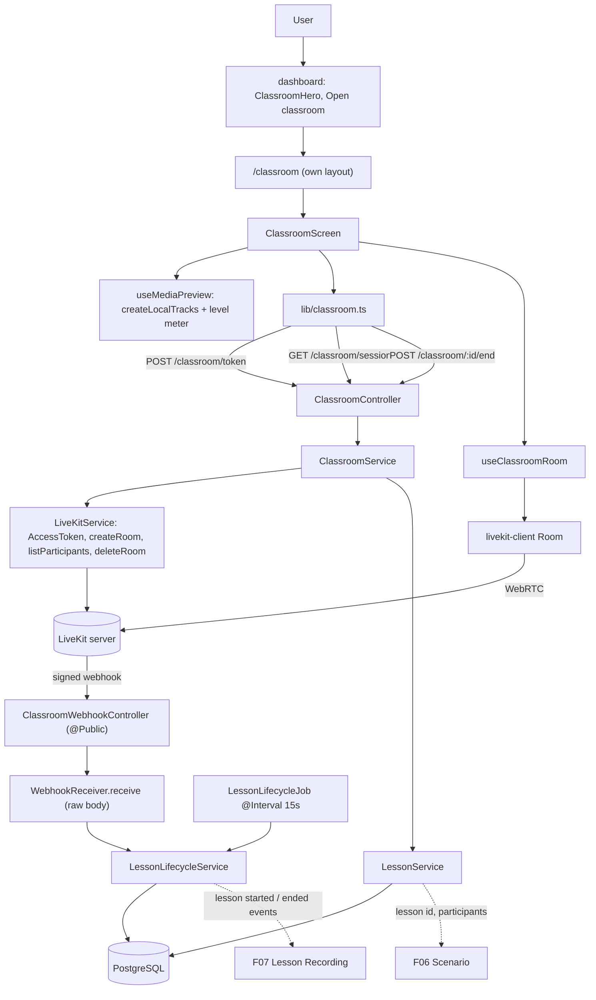
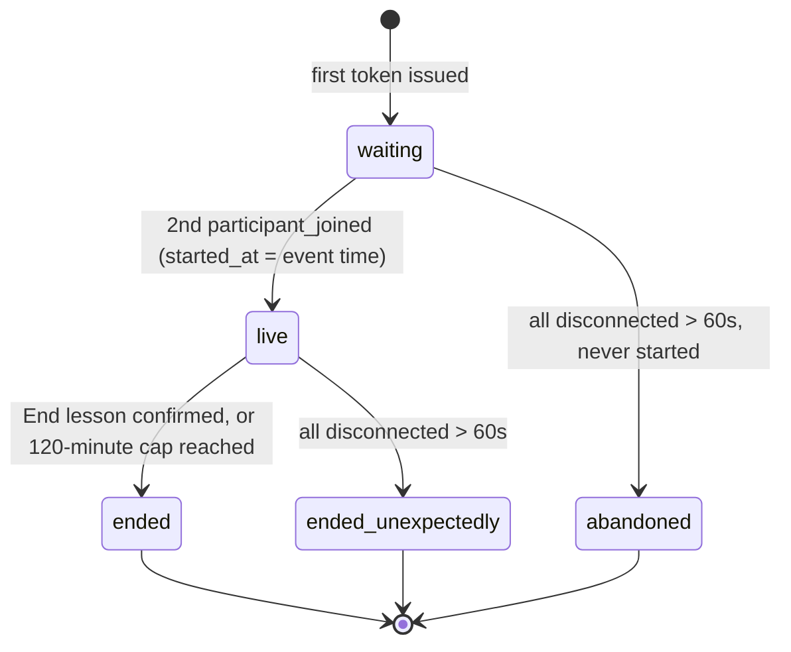
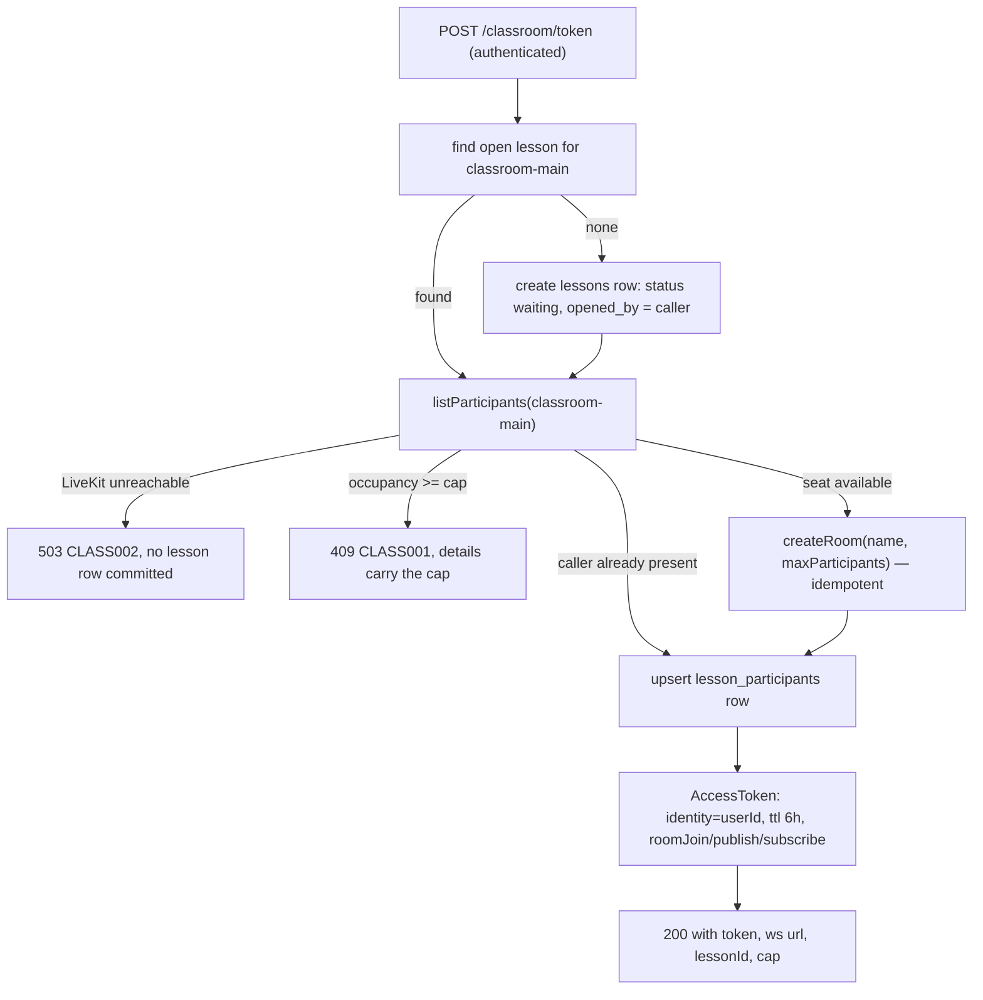

# Technical Specification: Live Classroom

## 1. Technical Overview

**What:** A single persistent LiveKit room (`classroom-main`) with server-issued access tokens, a participant cap enforced before a token exists, a web classroom screen built from F21 primitives that publishes and subscribes audio and video, and the `lessons` / `lesson_participants` records that carry room identity, participant identities and the lesson's start and end events for F06 and F07 to attach to.

**Why:** F05 is the first feature in the product that owns real-time state. Everything downstream — the scenario (F06), the recording (F07), and through it the entire per-participant pipeline — keys off two facts this feature produces: *which lesson is open right now* and *when did it start, for whom*. Those facts have to be true even when the browser that produced them is gone, which is why the lifecycle is driven by LiveKit's signed webhooks and a server-side sweeper rather than by client callbacks. It is also the first screen where the participant cap stops being a documented intention and becomes an enforced number: the PRD's claim that raising `LESSON_MAX_PARTICIPANTS` to 3 admits a third learner "with no schema change and no pipeline change" is only credible if nothing in this feature is written for exactly two.

**Scope — Included (Core Scope + Full Scope additions):**

Core Scope:
- Joining the persistent room: token issuance scoped to the room with publish and subscribe grants, identified by user id, valid for 6 hours
- Publishing and subscribing audio and video; microphone on join, camera on by default and toggleable; video is live-only and never recorded
- Presence and waiting state: `Waiting for {names} to join` with a live local preview and level meter
- Microphone mute and camera toggle, with a persistent badge mirrored to every other participant's view
- Explicit lesson end with a confirmation dialog naming the consequence
- The `lessons` and `lesson_participants` tables, the room-occupancy cap enforced before token issuance, and the lesson start timestamp taken at the moment the second participant connects

Full Scope additions:
- Input and output device selection (microphone, camera, speaker) in the pre-join preview and from the in-call control bar
- Connection quality indicator per participant as a three-bar icon, plus the `Your connection is unstable.` banner
- Automatic reconnection for 30 seconds on a network drop, with a blocking `Reconnecting…` overlay and countdown; beyond the window the participant is treated as having left

Also included, because they are this feature's own infrastructure or were assigned to it by name:
- LiveKit lifecycle webhooks (`participant_joined`, `participant_left`, `room_finished`) received on a signature-verified public route
- A `@nestjs/schedule` sweeper enforcing the 60-second all-disconnected rule and the 120-minute maximum duration
- The dashboard hero banner region, which `design/README.md` records as `deferred | F05`, carrying the `Open classroom` primary action
- `livekit.yaml` webhook configuration and UDP media transport published from `docker-compose.yml` — the compose file already reserves this for "F05 onward"

**Scope — Excluded:**
- **Track egress and any recording.** F07 owns starting egress on the lesson-start event this feature emits, the `recording_status` / `pipeline_status` columns, the object keys and byte sizes, the `Recording` indicator in the classroom header and the `too_short` / `recording_failed` / `recording_partial` states. F05 leaves a slot in the header component and emits the event; it writes nothing about recording.
- **The scenario.** F06 owns situation and role-card generation, the waiting-area scenario panel and the in-call collapsible panel. F05 renders a labelled placeholder region in the waiting area and a control-bar toggle that is present but disabled, so F06 mounts into a layout that already exists rather than reflowing one.
- **Lesson history.** F19 owns the lesson list, per-lesson detail and stage-level retry. F05's `GET /classroom/session` answers only "is a lesson open right now", not "what happened before".
- **Video layout beyond two tiles.** Per PRD Section 7, above the default cap remote participants render in a uniform grid with the local tile inset, and nothing further is tuned.
- **Simultaneous lessons and multiple rooms.** One room, one open lesson at a time, enforced by a partial unique index.
- **Mobile.** The classroom is web-only (F03's bottom navigation deliberately has no classroom destination).
- **The module-cards section of the dashboard mockup.** It stays `deferred` in `design/README.md`: of its five cards one is dropped outright and the other four belong to F06, F15 and F18, so a section header with no cards under it would be an empty frame, not fidelity to the mockup.

**Assumptions and decisions not answered by the PRD:**

| Assumption | Rationale |
|---|---|
| The lesson row is created on the **first** token issuance with status `waiting`, not when the second participant connects | F06 generates the situation and every role card in the waiting area, with up to 3 rerolls, all before the lesson starts — it needs a stable `lesson_id` to attach them to. It also needs "the participant who opened the room", which is naturally `lessons.opened_by` on that first row |
| A partial unique index allows at most one lesson per room in a non-terminal state | "One room and one lesson at a time" is a product rule (PRD Section 7). Enforcing it in the database rather than in service code means a race between two simultaneous `POST /classroom/token` calls resolves to one lesson, not two |
| A `waiting` lesson whose participants have all been disconnected for 60 seconds is closed as `abandoned` with `end_reason = 'abandoned_before_start'`, and no pipeline is ever enqueued for it | The PRD defines the 60-second rule for a lesson in progress but is silent about one that never started. Without this, a single user who opens the room and closes the tab leaves an open row that the partial unique index would let block every future lesson. `abandoned` is deliberately distinct from `ended_unexpectedly`, which means a real lesson lost its participants |
| LiveKit **webhooks** are the source of truth for join, leave and room end; the client never reports lifecycle | The start timestamp and the 60-second abandonment rule have to hold when a browser tab is closed, crashes or loses power. F07 also needs to start egress from a server-side event, not from a client callback |
| `started_at` is taken from the webhook event's own `createdAt`, not from the API's receipt time | The criterion is "recorded at the moment the second participant connects". Receipt time folds in webhook delivery latency, which would put `started_at` after the first audio F07 records |
| The participant cap is checked against LiveKit's live `listParticipants`, not against the database rows | The database rows are webhook-fed and can lag by one delivery. The PRD requires the refusal to happen "before a token is issued", so the check has to read the same authority that will accept the connection. A caller already present in the list is re-issuing their own token and is not counted against the cap |
| `createRoom` is called on every token issuance, with `maxParticipants` set from configuration | `livekit.yaml` sets `auto_create: false`, so a room that does not exist rejects the connection even with a valid token. `createRoom` is idempotent for an existing room. Passing the cap gives LiveKit itself a second line of enforcement behind the API's |
| The browser-facing LiveKit URL is returned in the token response body rather than read from a `NEXT_PUBLIC_` variable in the web client | The API already holds `LIVEKIT_URL` as an internal container address (`http://livekit:7880`), which a browser cannot reach. A second variable on the web side would be a second place for the same fact to drift. A new `LIVEKIT_WS_URL` is added to the API's environment contract and handed to the client with the token |
| The media transport switches from the `rtc.port_range_start/end` range to a single muxed `rtc.udp_port: 7882` | Publishing a 100-port UDP range through Docker Desktop is slow to start and unreliable on Windows hosts, which is the development environment this stack targets. A single muxed UDP port is LiveKit's documented Docker configuration and is what makes `docker compose up` still start in seconds |
| The LiveKit participant `identity` is the user id, and is stored on `lesson_participants` explicitly rather than being assumed equal to `user_id` | F07 correlates egress tracks back to participants by identity. Storing it means F07 joins on a recorded fact instead of re-deriving an assumption that would break the day identity gains a suffix |
| Any connected participant may end the lesson; a user who is not a participant of that lesson gets 403 | The PRD says "either participant clicks `End lesson`" — the action is symmetric. Restricting it to `opened_by` would strand a lesson whose opener already dropped |
| Ending disconnects everyone via `deleteRoom`, and the resulting `room_finished` webhook is idempotent against an already-finalized lesson | One authoritative path closes the lesson (the `end` route), and the webhook that follows must not overwrite `end_reason` with a second interpretation of the same event |
| Reconnection uses a custom `reconnectPolicy` that returns `null` once 30 seconds have elapsed, so the SDK surfaces `Disconnected` at the boundary | livekit-client's default policy keeps retrying well past 30 seconds. The PRD's rule is a product decision, not the SDK default |
| The `Reconnecting…` countdown is driven by a local timer started on `RoomEvent.Reconnecting` | The SDK exposes the retry attempts, not a remaining-time value; the countdown is presentation over our own 30-second budget |
| The waiting state lists **every other user account that is not currently connected**, capped at the remaining seats, rather than a hard-coded partner | `Waiting for {names} to join` has to keep saying something true when a third account is added to the database, which F01 guarantees is possible without a code change |
| The classroom lives at `/classroom` under its own authenticated layout, without the app shell's nav pill | The nav pill invites leaving a live call mid-lesson, and the PRD describes the classroom's own header (elapsed time, recording indicator, per-participant quality) as the header for this screen |
| New icons (microphone, camera, hang-up, three-bar signal, verified) are added under `components/ui/icons/` and registered in the design-system page's icon section | F21 owns the icon set; F05 extends it in place rather than inlining SVG at the call site, which the no-raw-value rule forbids anyway |
| No new design token is introduced | The classroom composes from the existing palette, badge statuses and page-state components. A live-call surface that needed its own colour vocabulary would be a second visual language, which PRD Section 7 excludes |
| The 6-hour token TTL is a constant; only `LESSON_MAX_PARTICIPANTS` becomes configuration | The PRD names the cap as configuration explicitly and by variable name; it states the TTL as a fixed capability. This mirrors F04's reading of the same distinction |
| The sweeper runs on a 15-second interval | The two rules it enforces have 60-second and 120-minute budgets; a 15-second tick keeps the worst-case lateness at a quarter of the tighter budget without polling the database four times a second |

## 2. Architecture Impact

**Affected components:**

| Area | Path |
|---|---|
| Shared contracts | `packages/shared/src/schemas/classroom.ts`, `packages/shared/src/errors/codes.ts`, `packages/shared/src/index.ts` |
| API — classroom module | `apps/api/src/classroom/**` |
| API — config, boot and docs | `apps/api/src/config/env.ts`, `apps/api/src/main.ts`, `apps/api/src/app.module.ts`, `apps/api/src/openapi/components.ts`, `apps/api/src/openapi/setup.ts` |
| Database | `apps/api/prisma/schema.prisma`, `apps/api/prisma/migrations/0004_lessons/migration.sql` |
| Web — classroom screen | `apps/web/src/app/classroom/**`, `apps/web/src/components/classroom/**` |
| Web — dashboard hero | `apps/web/src/components/dashboard/classroom-hero.tsx`, `apps/web/src/app/(app)/dashboard/page.tsx` |
| Web — shared client | `apps/web/src/lib/classroom.ts`, `apps/web/src/components/ui/icons/**` |
| Infrastructure | `livekit.yaml`, `docker-compose.yml`, `.env.example` |
| Design reference | `design/README.md` |



**Lesson state machine:**



**Token issuance:**



## 3. Technical Decisions

| Decision | Chosen Approach | Alternative Considered | Trade-off |
|---|---|---|---|
| Source of truth for lifecycle events | LiveKit **webhooks** on a `@Public()`, signature-verified route; `started_at`, `ended_at` and disconnection tracking are all derived server-side | Client-reported events (`/classroom/joined`, `/classroom/left`) driven by SDK callbacks in the browser | Requires configuring `livekit.yaml`, exposing an unauthenticated route, and handling the raw request body. Accepted because a closed tab, a crashed browser or a dead battery must not leave a lesson permanently open — and because F07 has to start egress from a server-side event to record the lesson it was told started |
| Webhook body parsing | A dedicated `express.raw` middleware mounted on the webhook path in `main.ts`, with the controller reading the `Buffer` and passing its string form to `WebhookReceiver.receive` | Nest's `rawBody: true` option on `NestFactory.create` | `rawBody: true` only populates the raw body for the parsers Nest registers by default, and LiveKit sends `Content-Type: application/webhook+json`, which none of them match — the handler would receive an empty body and every signature check would fail. Accepted: one explicit middleware line, and the signature is verified against exactly the bytes LiveKit signed |
| Auto-end timers | A `@Interval(15_000)` sweeper in `@nestjs/schedule` over lessons in `waiting` / `live`, with `all_disconnected_since` and `started_at` as the inputs | Redis keys with TTL and keyspace notifications; BullMQ delayed jobs | Up to 15 seconds of lateness on a 60-second rule. Accepted because it reuses the exact pattern already in `daily-revalidation.job.ts`, adds no infrastructure, and keeps the decision state in Postgres — so an API restart mid-lesson loses no timer, which both alternatives would have to re-establish |
| Web SDK surface | `livekit-client` only, wrapped in a `useClassroomRoom` hook; every pixel is composed from F21 primitives | `@livekit/components-react` with its prebuilt `VideoConference` / `ControlBar` and its stylesheet, themed via CSS variable overrides | More UI code to write and test. Accepted because the library ships its own token layer and component vocabulary, which would sit beside F21's as a second visual language — something PRD Section 7 excludes outright — and because the mockup's 2px outline with hard offset shadow and mechanical press is not an override the library exposes |
| Occupancy source for the cap check | LiveKit's `listParticipants` at token time | The `lesson_participants` rows maintained by webhooks | One extra round trip per token request, and the check fails closed with 503 when LiveKit is unreachable. Accepted because the rows lag by one webhook delivery, and refusing a token based on stale state would either admit a participant past the cap or refuse one who has a seat |
| Lesson row creation point | On the first token issuance, status `waiting` | On the second participant's connection, when the lesson genuinely starts | A lesson row can exist for a lesson that never happens, which is why `abandoned` exists as a terminal state. Accepted because F06 attaches the situation and every role card during the waiting period and needs a stable id to attach them to — and because the alternative would park the scenario in Redis and migrate it later, adding a second storage location for the same artifact |
| One-lesson-at-a-time enforcement | Partial unique index on `lessons(room) WHERE status IN ('waiting','live')` | A service-level check before insert | An insert that loses the race surfaces as a unique-violation the service has to catch and translate into "join the existing lesson". Accepted because a service-level check is a read-then-write with a window between the two, and two people clicking `Open classroom` at the same instant is the expected usage, not an edge case |
| Reconnection window | A custom `reconnectPolicy` that stops retrying at 30 seconds, so the SDK emits `Disconnected` at the product's boundary | Leave the SDK default and run a parallel 30-second timer that force-disconnects | The policy is one small object instead of a timer racing the SDK's own retry loop. Accepted because two mechanisms deciding when to give up is exactly how a client ends up showing "Reconnecting…" over a room it already left |
| Media transport in Docker | Single muxed `rtc.udp_port: 7882`, published as `7882/udp` | Publishing the existing `50000-50100` range | Loses the (unused at this scale) benefit of a port per connection. Accepted because publishing 100 UDP ports through Docker Desktop on Windows measurably slows `docker compose up` and is a documented source of flakiness, and this stack is explicitly local-development-first |
| Classroom route placement | `/classroom` with its own authenticated layout, outside the `(app)` group | Inside `(app)`, under the shared header with the nav pill | Duplicates the session check the `(app)` layout already performs. Accepted because stacking the global nav above the classroom's own header halves the vertical space available to video tiles and puts a "leave this page" affordance on screen during a live call |
| Dashboard hero scope | Build the hero banner region; leave the module-cards section `deferred` | Build both regions now, seeding the module grid with a single classroom card | `design/README.md` keeps one open row against F05. Accepted because the mockup's grid holds five cards, one of which is dropped and four of which belong to F06, F15 and F18 — a five-column frame holding one card is a worse approximation of the mockup than no frame at all |

## 4. Component Overview

**Shared:**

| File Path | New/Modified | Purpose | Key Responsibilities |
|---|---|---|---|
| `packages/shared/src/schemas/classroom.ts` | New | The classroom contract both clients read | `lessonStatusSchema`, `classroomTokenSchema`, `classroomSessionSchema`, `classroomParticipantSchema`, `endReasonSchema` |
| `packages/shared/src/errors/codes.ts` | Modified | Error vocabulary | Adds `CLASS001`–`CLASS004` with their statuses and pinned messages |
| `packages/shared/src/index.ts` | Modified | Barrel | Re-exports the classroom schemas and types |

**Backend:**

| File Path | New/Modified | Purpose | Key Responsibilities |
|---|---|---|---|
| `apps/api/src/classroom/classroom.module.ts` | New | Wiring | Registers the controllers, services and the lifecycle job; imports Prisma |
| `apps/api/src/classroom/classroom.controller.ts` | New | Authenticated HTTP surface | `POST /classroom/token`, `GET /classroom/session`, `POST /classroom/:lessonId/end`; OpenAPI decorators on every route |
| `apps/api/src/classroom/classroom-webhook.controller.ts` | New | LiveKit callback surface | `@Public()` `POST /classroom/livekit-webhook`; verifies the signature over the raw body, dispatches to the lifecycle service, answers 401 on any verification failure |
| `apps/api/src/classroom/classroom.service.ts` | New | Join and end orchestration | Resolves or creates the open lesson, enforces the cap against live occupancy, ensures the room exists, issues the token, ends a lesson on request |
| `apps/api/src/classroom/livekit.service.ts` | New | The only place that talks to LiveKit | `createRoom`, `listParticipants`, `deleteRoom`, `issueAccessToken`, `verifyWebhook`; wraps every call so an unreachable server becomes `CLASS002` rather than a raw SDK error |
| `apps/api/src/classroom/lesson.service.ts` | New | Lesson read and write model | Opens a lesson, upserts participants, reads the session projection, finalizes a lesson with a reason and computes `duration_seconds` |
| `apps/api/src/classroom/lesson-lifecycle.service.ts` | New | Event application | Applies `participant_joined` / `participant_left` / `room_finished`; sets `started_at` on the second simultaneous connection; maintains `all_disconnected_since`; idempotent against replayed or late events |
| `apps/api/src/classroom/lesson-lifecycle.job.ts` | New | Auto-end sweeper | `@Interval(15_000)`: closes lessons all-disconnected past 60s, closes lessons past the 120-minute cap, abandons `waiting` lessons past 60s |
| `apps/api/src/classroom/classroom.constants.ts` | New | Fixed values | Room name, token TTL, the sweeper's thresholds — one file so a threshold is never re-spelled at a second call site |
| `apps/api/src/common/app-error.ts` | Modified | Typed failures | `AppError.classroomFull(cap)`, `.classroomUnavailable(reason)`, `.lessonNotActive()`, `.notAParticipant()` |
| `apps/api/src/config/env.ts` | Modified | Environment contract | Adds `LESSON_MAX_PARTICIPANTS` (int, 2–4, default 2) and `LIVEKIT_WS_URL` (url) |
| `apps/api/src/main.ts` | Modified | Bootstrap | Mounts the raw-body middleware on the webhook path before the Nest router |
| `apps/api/src/app.module.ts` | Modified | Root module | Imports `ClassroomModule` |
| `apps/api/src/openapi/components.ts` | Modified | Document components | Registers `ClassroomToken`, `ClassroomSession` from the Zod contracts |
| `apps/api/src/openapi/setup.ts` | Modified | Document metadata | Adds the `classroom` tag |

**Frontend:**

| File Path | New/Modified | Purpose | Key Responsibilities |
|---|---|---|---|
| `apps/web/src/app/classroom/layout.tsx` | New | Full-bleed authenticated layout | Resolves the session server-side, redirects to `/login?expired=1`, renders without the nav header |
| `apps/web/src/app/classroom/page.tsx` | New | Route entry | Server component passing the current user into the client screen |
| `apps/web/src/components/classroom/classroom-screen.tsx` | New | Phase orchestration | Owns the `permission → preview → waiting → live → ended` machine, the API calls and the error surfaces |
| `apps/web/src/components/classroom/use-classroom-room.ts` | New | LiveKit state | Wraps a `Room`; exposes participants, track publications, mute state, connection quality and the reconnection phase; installs the 30-second reconnect policy and the 5-hour token refresh |
| `apps/web/src/components/classroom/use-media-preview.ts` | New | Pre-join devices | `createLocalTracks`, device enumeration and switching, and an `AnalyserNode`-driven level meter; classifies permission denial per device |
| `apps/web/src/components/classroom/device-preview.tsx` | New | Pre-join surface | Local video tile, level meter and the three device selects |
| `apps/web/src/components/classroom/device-select.tsx` | New | Device picker | A `Field`-composed select for one `MediaDeviceKind`, shared by the preview and the in-call settings |
| `apps/web/src/components/classroom/waiting-panel.tsx` | New | Waiting state | `Waiting for {names} to join`, plus the labelled region F06 mounts its scenario into |
| `apps/web/src/components/classroom/classroom-header.tsx` | New | In-call header | Elapsed time, per-participant connection quality, and the slot F07 fills with the recording indicator |
| `apps/web/src/components/classroom/participant-tile.tsx` | New | One participant | Attaches the video track or renders initials, shows the mute badge and the name, applies the local/remote size variants |
| `apps/web/src/components/classroom/participant-grid.tsx` | New | Layout | Two-tile layout at the default cap; uniform grid with an inset local tile above it |
| `apps/web/src/components/classroom/control-bar.tsx` | New | Controls | Microphone, camera, device settings, the disabled scenario toggle reserved for F06, and `End lesson` |
| `apps/web/src/components/classroom/end-lesson-dialog.tsx` | New | Confirmation | Names the consequence, confirms or cancels, disables while the request is in flight |
| `apps/web/src/components/classroom/reconnecting-overlay.tsx` | New | Drop handling | Blocking overlay with the 30-second countdown |
| `apps/web/src/components/classroom/connection-quality.tsx` | New | Quality display | Three-bar icon plus its text label, and the `Your connection is unstable.` banner |
| `apps/web/src/components/dashboard/classroom-hero.tsx` | New | Dashboard hero | The mockup's hero banner with the `Open classroom` primary action and the live-lesson affordance |
| `apps/web/src/app/(app)/dashboard/page.tsx` | Modified | Dashboard | Renders the hero above the existing copy |
| `apps/web/src/lib/classroom.ts` | New | API client | `requestClassroomToken`, `fetchClassroomSession`, `endLesson`, typed against the shared schemas |
| `apps/web/src/components/ui/icons/*.tsx`, `index.ts` | Modified | Icon set | Adds microphone, microphone-off, camera, camera-off, hang-up, three-bar signal and verified icons |
| `apps/web/src/app/(dev)/design-system/sections/icon-section.tsx` | Modified | Documentation | Renders the new icons alongside the existing set |

**Infrastructure and documentation:**

| File Path | New/Modified | Purpose | Key Responsibilities |
|---|---|---|---|
| `livekit.yaml` | Modified | LiveKit config | Adds the `webhook` block pointing at the API; replaces the UDP range with a single muxed `udp_port` |
| `docker-compose.yml` | Modified | Local stack | Publishes `7882/udp` on the livekit service |
| `.env.example` | Modified | Environment template | Documents `LESSON_MAX_PARTICIPANTS` and `LIVEKIT_WS_URL` |
| `design/README.md` | Modified | Design reference | Flips the dashboard hero row to `implemented`, leaves the module-cards row `deferred` |
| `docs/api/openapi.json` | Regenerated | API document | Regenerated by `pnpm --filter @english-quest/api openapi:generate` after the routes land |

**Database:**

| Migration File | Tables Affected | Operation | Notes |
|---|---|---|---|
| `apps/api/prisma/migrations/0004_lessons/migration.sql` | `lessons`, `lesson_participants` | CREATE | Two tables, one partial unique index enforcing one open lesson per room, and the lookup indexes F07 and F19 will read through |

## 5. API Contracts

All routes are under `/classroom`. Authentication follows F01's two transports (`eq_session` cookie or `Authorization: Bearer`) and is enforced by the global `SessionGuard`, except the webhook route, which is `@Public()` and authenticated by LiveKit's own signature.

---

### Endpoint: Request a classroom token

- **Method:** POST
- **Path:** `/classroom/token`
- **Authentication:** Session cookie or bearer token

**Request:** no body.

**Response (200):**

| Field | Type | Description |
|---|---|---|
| `data.lessonId` | `uuid` | The open lesson this token joins |
| `data.roomName` | `string` | Always `classroom-main` in the MVP |
| `data.url` | `string` | Browser-reachable LiveKit WebSocket URL |
| `data.token` | `string` | Signed LiveKit access token, TTL 6 hours |
| `data.identity` | `string` | The participant identity carried in the token (the user id) |
| `data.expiresAt` | `string` | ISO timestamp the token stops being valid |
| `data.maxParticipants` | `integer` | The configured cap, so the client can render the full message and choose its layout |
| `data.status` | `string` | `waiting` or `live` at issuance time |

**Response Example:**
```json
{
  "data": {
    "lessonId": "9f1c4d7e-3b2a-4f51-9d0c-7a6b5e4c3d21",
    "roomName": "classroom-main",
    "url": "ws://localhost:7880",
    "token": "eyJhbGciOiJIUzI1NiIsInR5cCI6IkpXVCJ9...",
    "identity": "3f8b1a20-5c6d-4e7f-8a91-2b3c4d5e6f70",
    "expiresAt": "2026-09-15T20:14:00.000Z",
    "maxParticipants": 2,
    "status": "waiting"
  }
}
```

**Error Codes:**

| Code | HTTP Status | Description |
|---|---|---|
| `CLASS001` | 409 | The room is at the configured cap; `details.maxParticipants` carries the cap so the client can render `This classroom is full (2 participants).` |
| `CLASS002` | 503 | LiveKit could not be reached; `details.reason` carries `LiveKit server not reachable`. No lesson row is committed |
| `AUTH003` | 401 | No valid session |

---

### Endpoint: Read the open classroom session

- **Method:** GET
- **Path:** `/classroom/session`
- **Authentication:** Session cookie or bearer token

**Response (200):**

| Field | Type | Description |
|---|---|---|
| `data` | `object \| null` | `null` when no lesson is open |
| `data.lessonId` | `uuid` | Open lesson id |
| `data.status` | `string` | `waiting` or `live` |
| `data.openedBy` | `uuid` | The user who opened the room — F06 reads this to decide who generates the situation |
| `data.startedAt` | `string \| null` | Set at the moment the second participant connected |
| `data.maxParticipants` | `integer` | The configured cap |
| `data.participants[].userId` | `uuid` | Participant |
| `data.participants[].displayName` | `string` | For the tile label and the waiting copy |
| `data.participants[].connected` | `boolean` | Current presence |
| `data.participants[].joinedAt` | `string` | That participant's own first join — F07 records a late arrival from this timestamp |
| `data.awaiting[].userId` | `uuid` | An account with a seat available that is not connected |
| `data.awaiting[].displayName` | `string` | Used to compose `Waiting for {names} to join` |

**Response Example:**
```json
{
  "data": {
    "lessonId": "9f1c4d7e-3b2a-4f51-9d0c-7a6b5e4c3d21",
    "status": "waiting",
    "openedBy": "3f8b1a20-5c6d-4e7f-8a91-2b3c4d5e6f70",
    "startedAt": null,
    "maxParticipants": 2,
    "participants": [
      {
        "userId": "3f8b1a20-5c6d-4e7f-8a91-2b3c4d5e6f70",
        "displayName": "Miguel",
        "connected": true,
        "joinedAt": "2026-09-15T14:10:03.000Z"
      }
    ],
    "awaiting": [
      { "userId": "b21e9a44-7f30-4c18-9e55-1d2c3b4a5e6f", "displayName": "Ana" }
    ]
  }
}
```

---

### Endpoint: End the lesson

- **Method:** POST
- **Path:** `/classroom/:lessonId/end`
- **Authentication:** Session cookie or bearer token

**Request:**

| Field | Type | Required | Validation | Description |
|---|---|---|---|---|
| `lessonId` | `uuid` | Yes | path param, valid UUID | The lesson to end |

**Response (200):**

| Field | Type | Description |
|---|---|---|
| `data.lessonId` | `uuid` | The ended lesson |
| `data.status` | `string` | `ended` |
| `data.endedAt` | `string` | ISO timestamp |
| `data.durationSeconds` | `integer \| null` | `null` when the lesson never started |

**Response Example:**
```json
{
  "data": {
    "lessonId": "9f1c4d7e-3b2a-4f51-9d0c-7a6b5e4c3d21",
    "status": "ended",
    "endedAt": "2026-09-15T15:12:44.000Z",
    "durationSeconds": 3761
  }
}
```

**Error Codes:**

| Code | HTTP Status | Description |
|---|---|---|
| `CLASS003` | 409 | The lesson is already in a terminal state |
| `CLASS004` | 403 | The caller is not a participant of that lesson |
| `VAL001` | 400 | `lessonId` is not a valid UUID |

---

### Endpoint: LiveKit lifecycle webhook

- **Method:** POST
- **Path:** `/classroom/livekit-webhook`
- **Authentication:** `@Public()` to the session guard; authenticated by LiveKit's `Authorization` signature over a SHA-256 checksum of the raw body, verified with `WebhookReceiver`

**Request:** the raw LiveKit `WebhookEvent` body, `Content-Type: application/webhook+json`. Handled events:

| Event | Effect |
|---|---|
| `participant_joined` | Upserts the `lesson_participants` row, sets `connected = true`, clears `all_disconnected_since`. If the connected count reaches 2 and `started_at` is null, sets `started_at` to the event's own timestamp and the lesson to `live` |
| `participant_left` | Sets `connected = false` and `last_disconnected_at`; when no participant remains connected, stamps `all_disconnected_since` |
| `room_finished` | Finalizes any still-open lesson for that room; a no-op against an already-terminal lesson |

Every other event type is acknowledged and ignored, so enabling additional LiveKit events later never returns an error to the server.

**Response (200):**
```json
{ "data": { "received": true } }
```

**Error Codes:**

| Code | HTTP Status | Description |
|---|---|---|
| `AUTH003` | 401 | Missing, malformed or invalid signature; no state is changed |

## 6. Data Model

### Table: `lessons`

| Column | Type | Nullable | Default | Description |
|---|---|---|---|---|
| `id` | `uuid` | No | `gen_random_uuid()` | Primary key; the id F06 and F07 attach to |
| `room` | `varchar(64)` | No | - | LiveKit room name; always `classroom-main` in the MVP |
| `status` | `varchar(24)` | No | `'waiting'` | `waiting`, `live`, `ended`, `ended_unexpectedly`, `abandoned` |
| `opened_by` | `uuid` | No | - | The user whose token created the lesson; F06 reads this to pick who generates the situation |
| `opened_at` | `timestamptz` | No | `now()` | First token issuance |
| `started_at` | `timestamptz` | Yes | - | The moment the second participant connected, from the webhook event's own timestamp |
| `ended_at` | `timestamptz` | Yes | - | Terminal transition |
| `duration_seconds` | `integer` | Yes | - | `ended_at − started_at`; null when the lesson never started |
| `end_reason` | `varchar(32)` | Yes | - | `ended_by_participant`, `all_disconnected`, `max_duration`, `abandoned_before_start` |
| `ended_by` | `uuid` | Yes | - | Set only for `ended_by_participant` |
| `all_disconnected_since` | `timestamptz` | Yes | - | Stamped when the last connected participant leaves; cleared on any join. The sweeper's only input for the 60-second rule |
| `max_participants` | `smallint` | No | - | The cap in force when the lesson was opened, recorded so a later configuration change does not rewrite history |
| `created_at` | `timestamptz` | No | `now()` | Audit |
| `updated_at` | `timestamptz` | No | `now()` | Audit |

**Indexes:**

| Index Name | Columns | Type | Purpose |
|---|---|---|---|
| `ux_lessons_open_room` | `room` where `status IN ('waiting','live')` | partial unique btree | One open lesson per room; resolves the two-people-click-at-once race in the database |
| `ix_lessons_status_opened` | `status`, `opened_at DESC` | btree | The sweeper's scan over non-terminal lessons, and F19's history listing |

**Constraints:**

| Constraint | Type | Definition | Purpose |
|---|---|---|---|
| `pk_lessons` | PRIMARY KEY | `id` | Identity |
| `fk_lessons_opened_by` | FOREIGN KEY | `opened_by REFERENCES users(id) ON DELETE RESTRICT` | A lesson's opener must exist; `RESTRICT` because deleting a user must not silently erase lesson history |
| `fk_lessons_ended_by` | FOREIGN KEY | `ended_by REFERENCES users(id) ON DELETE SET NULL` | Who ended it is useful but not load-bearing |
| `ck_lessons_status` | CHECK | `status IN ('waiting','live','ended','ended_unexpectedly','abandoned')` | The vocabulary is enforced where it is stored, matching the `varchar` enum pattern F01 and F02 already use |
| `ck_lessons_end_reason` | CHECK | `end_reason IS NULL OR end_reason IN ('ended_by_participant','all_disconnected','max_duration','abandoned_before_start')` | Same |
| `ck_lessons_terminal` | CHECK | `(status IN ('ended','ended_unexpectedly','abandoned')) = (ended_at IS NOT NULL)` | A terminal lesson always has an end timestamp, and a non-terminal one never does |

### Table: `lesson_participants`

| Column | Type | Nullable | Default | Description |
|---|---|---|---|---|
| `id` | `uuid` | No | `gen_random_uuid()` | Primary key |
| `lesson_id` | `uuid` | No | - | Owning lesson |
| `user_id` | `uuid` | No | - | Participant |
| `identity` | `varchar(64)` | No | - | The LiveKit participant identity; F07 joins egress tracks on this rather than re-deriving it |
| `joined_at` | `timestamptz` | No | - | This participant's own first connection — what F07 uses to record a late arrival from their own timestamp |
| `left_at` | `timestamptz` | Yes | - | Set when the lesson finalizes, or on a final disconnect |
| `last_connected_at` | `timestamptz` | Yes | - | Most recent join, including a reconnection |
| `last_disconnected_at` | `timestamptz` | Yes | - | Most recent leave |
| `connected` | `boolean` | No | `false` | Current presence, maintained by the webhook |
| `created_at` | `timestamptz` | No | `now()` | Audit |
| `updated_at` | `timestamptz` | No | `now()` | Audit |

**Indexes:**

| Index Name | Columns | Type | Purpose |
|---|---|---|---|
| `ux_lesson_participants_lesson_user` | `lesson_id`, `user_id` | unique btree | One row per participant per lesson; the upsert target for `participant_joined` |
| `ix_lesson_participants_user_joined` | `user_id`, `joined_at DESC` | btree | F06's "no domain repeated in this participant's last 5 lessons" and F19's per-user history |

**Constraints:**

| Constraint | Type | Definition | Purpose |
|---|---|---|---|
| `pk_lesson_participants` | PRIMARY KEY | `id` | Identity |
| `fk_lesson_participants_lesson` | FOREIGN KEY | `lesson_id REFERENCES lessons(id) ON DELETE CASCADE` | A deleted lesson takes its participation rows with it |
| `fk_lesson_participants_user` | FOREIGN KEY | `user_id REFERENCES users(id) ON DELETE CASCADE` | Matches the cascade every other per-user table in this schema already uses |

**Migration (`0004_lessons/migration.sql`):**

```sql
CREATE TABLE lessons (
    id                     UUID PRIMARY KEY DEFAULT gen_random_uuid(),
    room                   VARCHAR(64)  NOT NULL,
    status                 VARCHAR(24)  NOT NULL DEFAULT 'waiting',
    opened_by              UUID         NOT NULL REFERENCES users(id) ON DELETE RESTRICT,
    opened_at              TIMESTAMPTZ  NOT NULL DEFAULT NOW(),
    started_at             TIMESTAMPTZ,
    ended_at               TIMESTAMPTZ,
    duration_seconds       INTEGER,
    end_reason             VARCHAR(32),
    ended_by               UUID         REFERENCES users(id) ON DELETE SET NULL,
    all_disconnected_since TIMESTAMPTZ,
    max_participants       SMALLINT     NOT NULL,
    created_at             TIMESTAMPTZ  NOT NULL DEFAULT NOW(),
    updated_at             TIMESTAMPTZ  NOT NULL DEFAULT NOW(),
    CONSTRAINT ck_lessons_status
        CHECK (status IN ('waiting','live','ended','ended_unexpectedly','abandoned')),
    CONSTRAINT ck_lessons_end_reason
        CHECK (end_reason IS NULL OR end_reason IN
               ('ended_by_participant','all_disconnected','max_duration','abandoned_before_start')),
    CONSTRAINT ck_lessons_terminal
        CHECK ((status IN ('ended','ended_unexpectedly','abandoned')) = (ended_at IS NOT NULL))
);

CREATE UNIQUE INDEX ux_lessons_open_room
    ON lessons (room)
    WHERE status IN ('waiting','live');

CREATE INDEX ix_lessons_status_opened ON lessons (status, opened_at DESC);

CREATE TABLE lesson_participants (
    id                    UUID PRIMARY KEY DEFAULT gen_random_uuid(),
    lesson_id             UUID        NOT NULL REFERENCES lessons(id) ON DELETE CASCADE,
    user_id               UUID        NOT NULL REFERENCES users(id)   ON DELETE CASCADE,
    identity              VARCHAR(64) NOT NULL,
    joined_at             TIMESTAMPTZ NOT NULL,
    left_at               TIMESTAMPTZ,
    last_connected_at     TIMESTAMPTZ,
    last_disconnected_at  TIMESTAMPTZ,
    connected             BOOLEAN     NOT NULL DEFAULT FALSE,
    created_at            TIMESTAMPTZ NOT NULL DEFAULT NOW(),
    updated_at            TIMESTAMPTZ NOT NULL DEFAULT NOW()
);

CREATE UNIQUE INDEX ux_lesson_participants_lesson_user
    ON lesson_participants (lesson_id, user_id);

CREATE INDEX ix_lesson_participants_user_joined
    ON lesson_participants (user_id, joined_at DESC);
```

**Notes for later features:** F07 adds recording columns (`recording_status`, `pipeline_status`, per-participant object key and byte size) in its own migration. The `status` vocabulary above is the live-session lifecycle only; F07's `too_short`, `recording_failed`, `recording_partial` and `storage_unavailable` belong to a separate recording-status column, not to this one — a lesson that ended normally and a lesson whose recording failed are two independent facts.

## 7. Testing Strategy

**Test File Structure:**

| Test File | Test Type | Target | Coverage Goal |
|---|---|---|---|
| `apps/api/test/integration/classroom.spec.ts` | Integration | Token, session and end routes | 85% |
| `apps/api/test/integration/classroom-webhook.spec.ts` | Integration | Webhook signature and state machine | 90% |
| `apps/api/test/unit/livekit.service.spec.ts` | Unit | Token grants, room options, error translation | 90% |
| `apps/api/test/unit/lesson-lifecycle.job.spec.ts` | Unit | Auto-end sweeper | 95% |
| `apps/api/test/unit/env.spec.ts` | Unit (extend) | New environment variables | — |
| `apps/web/test/classroom-room.spec.tsx` | Unit | `useClassroomRoom` against a fake `Room` | 85% |
| `apps/web/test/classroom-screen.spec.tsx` | Unit | Phase machine, permissions, end dialog | 80% |
| `apps/web/test/classroom-tiles.spec.tsx` | Unit | Tile, mute badge, quality icon, grid | 85% |
| `apps/web/test/classroom-hero.spec.tsx` | Unit | Dashboard hero | 90% |
| `apps/web/test/design-reference.spec.ts` | Unit (existing guard) | Completeness of `design/README.md` | — |

LiveKit is stubbed at the `LiveKitService` boundary in API tests — the SDK's transport is LiveKit's code, not ours, and the risk this feature carries is in the state machine. Webhook tests sign their payloads with the test `WebhookReceiver` key pair so signature verification runs for real. Testcontainers Postgres and Redis follow the existing `test/integration/helpers/test-app.ts` harness.

**`apps/api/test/integration/classroom.spec.ts`**

| Test Function | Description | Assertions |
|---|---|---|
| `issues a token and opens a waiting lesson` | First token request in an empty room | 200; `lessons` row exists with `status='waiting'`, `opened_by` = caller, `started_at` null; a `lesson_participants` row exists; response carries `url`, `token`, `lessonId`, `maxParticipants` |
| `reuses the open lesson for a second participant` | Second user requests a token | Same `lessonId` returned; exactly one `lessons` row; two `lesson_participants` rows |
| `re-issuing a token for an already-present participant does not count against the cap` | Caller is already in `listParticipants` | 200 rather than `CLASS001`; no duplicate participant row |
| `refuses a token beyond the configured cap` | Third participant with cap 2 | 409 `CLASS001`; `details.maxParticipants` is 2; no third participant row created |
| `admits a third participant when the cap is raised to 3` | `LESSON_MAX_PARTICIPANTS=3` (PRD criterion) | 200; three `lesson_participants` rows; no schema or code branch differs from the two-participant path |
| `returns 503 when LiveKit is unreachable` | `LiveKitService` throws on `listParticipants` | 503 `CLASS002` with `details.reason`; **no** `lessons` row committed |
| `calls createRoom with the configured cap` | Any successful issuance | `createRoom` received `maxParticipants` from the environment |
| `session returns null when nothing is open` | No lesson | 200 with `data: null` |
| `session lists participants and awaiting accounts` | One connected participant, two accounts seeded | `participants` has the connected user with their `joinedAt`; `awaiting` names the other account |
| `ends a lesson on request` | Connected participant ends | 200; `status='ended'`, `end_reason='ended_by_participant'`, `ended_by` = caller, `duration_seconds` computed; `deleteRoom` called |
| `rejects end from a non-participant` | Third account calls end | 403 `CLASS004`; lesson unchanged |
| `rejects end on an already-terminal lesson` | Second end call | 409 `CLASS003` |
| `rejects a malformed lessonId` | Non-UUID path param | 400 `VAL001` |
| `requires authentication on every classroom route` | No session | 401 `AUTH003` on token, session and end |

**`apps/api/test/integration/classroom-webhook.spec.ts`**

| Test Function | Description | Assertions |
|---|---|---|
| `rejects an unsigned body` | No `Authorization` header | 401; no row changed |
| `rejects a tampered body` | Valid signature over different bytes | 401; no row changed |
| `participant_joined marks the participant connected` | First join | `connected=true`, `joined_at` and `last_connected_at` set from the event timestamp |
| `the second simultaneous join starts the lesson` | Two participants connected (PRD criterion) | `status='live'`; `started_at` equals the event's own timestamp, not the request's receipt time |
| `a late join does not move started_at` | Third-party join after start (PRD criterion) | `started_at` unchanged; the late participant's `joined_at` is their own connection time |
| `a rejoin clears all_disconnected_since` | Leave then join | `all_disconnected_since` is null again; `started_at` unchanged |
| `participant_left of the last participant stamps all_disconnected_since` | Everyone leaves | `connected=false` for all; `all_disconnected_since` set from the event |
| `room_finished finalizes an open lesson` | Room closed externally | `status='ended_unexpectedly'`, `end_reason='all_disconnected'`, `ended_at` set |
| `room_finished is a no-op on a terminal lesson` | Event replayed after an explicit end | `end_reason` stays `ended_by_participant`; `ended_at` unchanged |
| `an unknown event type is acknowledged` | `track_published` | 200; no row changed |

**`apps/api/test/unit/livekit.service.spec.ts`**

| Test Function | Description | Assertions |
|---|---|---|
| `issues a token with room join, publish and subscribe grants` | Decode the JWT | `video.roomJoin`, `video.room`, `canPublish`, `canSubscribe` all set; `sub` is the user id |
| `issues a token with a 6-hour TTL` | Decode the JWT | `exp − iat` is 21600 seconds |
| `carries the display name` | Decode the JWT | `name` matches the user's display name |
| `translates a transport failure into CLASS002` | SDK rejects | Throws `AppError` with `CLASS002` and the reason in details, never the raw SDK message |

**`apps/api/test/unit/lesson-lifecycle.job.spec.ts`**

| Test Function | Description | Assertions |
|---|---|---|
| `ends a live lesson all-disconnected for over 60 seconds` | `all_disconnected_since` 61s ago | `status='ended_unexpectedly'`, `end_reason='all_disconnected'` |
| `leaves a live lesson with someone connected alone` | `all_disconnected_since` null | Unchanged |
| `leaves a lesson disconnected for under 60 seconds alone` | 30s ago | Unchanged |
| `ends a lesson at the 120-minute cap` | `started_at` 121 minutes ago (PRD criterion) | `status='ended'`, `end_reason='max_duration'`, `deleteRoom` called |
| `abandons a waiting lesson disconnected for over 60 seconds` | Never started | `status='abandoned'`, `end_reason='abandoned_before_start'`, `duration_seconds` null |
| `never touches a terminal lesson` | Already ended | Unchanged; no `deleteRoom` |

**`apps/web/test/classroom-room.spec.tsx`**

| Test Function | Description | Assertions |
|---|---|---|
| `shows the reconnecting overlay on a drop and dismisses it on recovery` | Fake `Room` emits `Reconnecting` then `Reconnected` (PRD criterion, 10-second drop) | Overlay with the countdown appears, then disappears; the room state returns to `live` and the session id is unchanged |
| `treats a drop past the window as having left` | `Reconnecting` then `Disconnected` (PRD criterion, >30 seconds) | Phase becomes `ended`; the user is returned to the dashboard route |
| `stops retrying after 30 seconds` | Exercise the configured reconnect policy | The policy returns `null` once the elapsed budget is exhausted |
| `surfaces per-participant connection quality` | `ConnectionQualityChanged` | The quality value for that identity updates |
| `refreshes the token at the five-hour mark` | Fake timers | A second `POST /classroom/token` is issued before the 6-hour expiry |

**`apps/web/test/classroom-screen.spec.tsx`**

| Test Function | Description | Assertions |
|---|---|---|
| `blocks connection when the microphone is denied` | Preview throws `PermissionDenied` for audio (PRD criterion) | `English Quest needs microphone access to run a lesson.` is shown with a retry action; no token is requested |
| `starts audio-only when the camera is denied` | Video denied, audio granted (PRD criterion) | Connection proceeds; the local tile shows initials; the camera control reads as off |
| `shows the waiting state with the local preview` | One participant (PRD criterion) | `Waiting for {names} to join` names the other account; the preview tile and the level meter render |
| `shows the classroom-full message with the cap` | Token route returns `CLASS001` | `This classroom is full (2 participants).` |
| `shows the unavailable message with the underlying reason` | Token route returns `CLASS002` | `The classroom is unavailable right now.` with `LiveKit server not reachable` in the details line and a retry action |
| `confirms before ending and names the consequence` | Click `End lesson` (PRD criterion) | Dialog reads `End the lesson for everyone? Processing will start and results will be ready in about 30 minutes.`; cancelling leaves the room connected; confirming calls the end route and disconnects |
| `renders the disabled scenario toggle` | Live phase | The control exists with an accessible name and is disabled, reserving F06's slot |

**`apps/web/test/classroom-tiles.spec.tsx`**

| Test Function | Description | Assertions |
|---|---|---|
| `shows a mute badge on a muted remote participant` | `TrackMuted` on a remote (PRD criterion) | The badge renders on that participant's tile with text, not colour alone |
| `shows a mute badge on the local tile when self-muted` | Local mute | Badge present on the local tile |
| `replaces the tile with initials when the camera is off` | No video publication | Initials render; no `<video>` element attached |
| `renders two tiles at the default cap` | Two participants | Remote large, local small |
| `renders a uniform grid above the default cap` | Three participants | Grid layout with the local tile inset |
| `pairs the quality icon with a text label` | Each quality level | Never colour-only, per F21's accessibility rule |

**`apps/web/test/classroom-hero.spec.tsx`**

| Test Function | Description | Assertions |
|---|---|---|
| `renders the primary action linking to the classroom` | No open lesson | `Open classroom` is present and targets `/classroom` |
| `surfaces an open lesson` | Session route reports `live` | The hero reflects that a lesson is in progress rather than offering a fresh start as if nothing were happening |
| `composes only from design tokens` | Rendered markup | No raw hex or pixel value in the class list |

**Cross-feature integration (PRD Section 9):**

| Test Function | Description | Assertions |
|---|---|---|
| `the open session is the one F06 will attach its scenario to` | `apps/api/test/integration/classroom.spec.ts` | `GET /classroom/session` returns the same `lessonId` that `POST /classroom/token` issued, with `participants` matching the identities carried in the tokens — the contract F06's scenario attaches against |
| `the lesson record carries the start timestamp and identities F07 will use` | `apps/api/test/integration/classroom-webhook.spec.ts` | After the second join, `lessons.started_at` and every `lesson_participants.identity` / `joined_at` are populated and match the token identities, so F07 can name and attribute its audio objects from this row alone |
| `every classroom surface composes from the design system` | `apps/web/test/classroom-*.spec.tsx` | Loading, empty and error paths use F21's `LoadingState`, `EmptyState` and `ErrorState`; no raw colour or spacing value appears |

**Manual verification checklist (recorded in `progress.md`):** real two-browser join on the local stack; mute and camera toggles observed from the other browser; device switching mid-call; a simulated network drop via the browser's offline toggle showing the overlay and recovering; ending the lesson from each side; and a confirmation that no video track is ever requested for recording.
