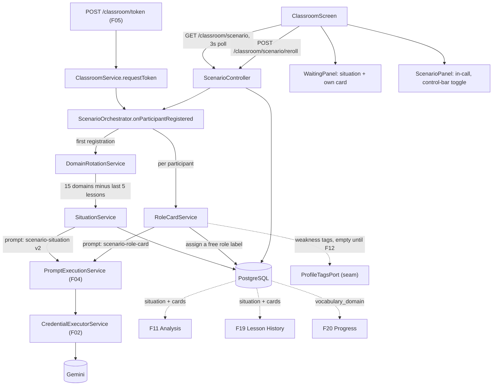
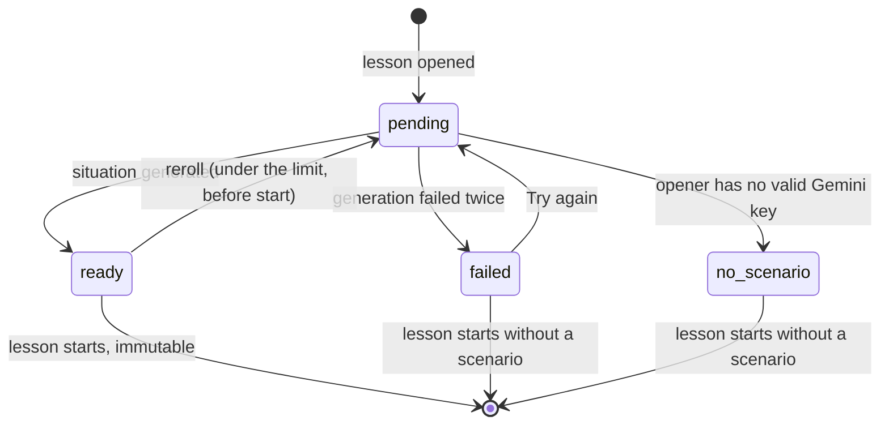
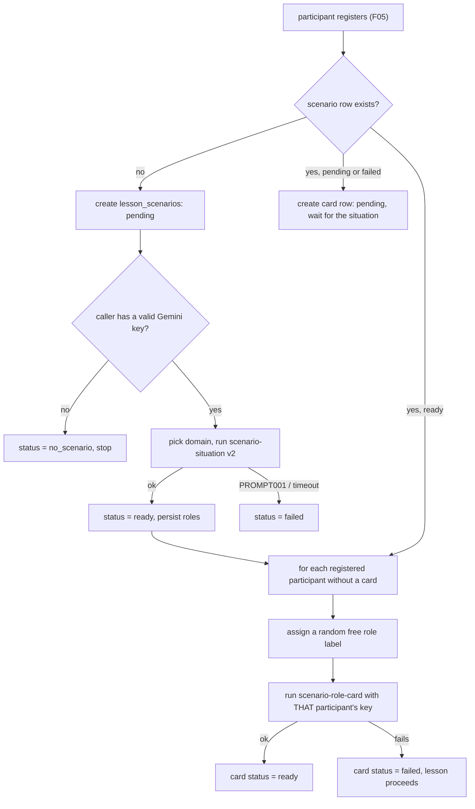

# Technical Specification: Lesson Scenario and Role Cards

## 1. Technical Overview

**What:** Two AI-generated artifacts attached to every lesson F05 opens, with deliberately different visibility. A **shared situation** — setting, premise, one named role per seat with the relationships between them, a vocabulary domain, and 3–5 discussion hooks — generated once by whoever opened the room, with that person's own Gemini key, from no profile data of anyone. And a **private role card** per participant — background, one objective, one constraint, a register, and 6–10 target expressions — generated with that participant's own key, visible only to them. Both render in the classroom's waiting area and collapse into an in-call panel F05 already reserved a control-bar toggle for.

**Why:** F06 is the first feature that makes the BYOK boundary structural rather than declarative. Up to now each key was used on its owner's own request; here one lesson produces `1 + N` calls across `1 + N` different keys, and the shared artifact has to be generated from zero profile data precisely so that one participant's key never processes another participant's history. It is also the first feature whose output is read by three later features it cannot see — F11 assesses against the scenario, F19 renders it in lesson detail, F20 counts its vocabulary domains — so the storage shape here is a contract, not an implementation detail. And it is the feature that closes F04's loop: the `scenario-situation` and `scenario-role-card` prompts have existed, loaded and validated at boot, since F04 shipped, with nothing calling them.

**Scope — Included (Core Scope + Full Scope additions):**

Core Scope:
- Shared situation generation with one named role per participant and the relationships between them
- A private role card per participant, generated with that participant's own key
- Display in the waiting area and during the lesson (the collapsible in-call panel)

Full Scope additions:
- Weakness-targeted expressions on the role card drawn from the profile
- Situation reroll, up to 3 times, before the lesson starts
- Vocabulary domain rotation across the PRD's 15 domains, with no domain repeated within a participant's last 5 lessons

Also included, because it is this feature's own infrastructure or was assigned to it by name:
- A second version of `apps/api/prompts/scenario-situation.yaml`, taking the vocabulary domain as an input variable instead of letting the model invent one (see Technical Decisions)
- The dashboard's recommended-scenario card, which `design/README.md` records as `deferred | F06`
- Background generation orchestration and its polling surface, so the waiting area can show `Preparing today's scenario…` without blocking F05's token response

**Scope — Excluded:**
- **The analysis.** F11 owns reading the situation and the viewer's own card into its prompt input, and the scenario-fit block that refers to target expressions. F06 writes the rows and stops.
- **Lesson history rendering.** F19 owns the per-lesson detail view that shows the scenario alongside transcript and scores. F06 renders only inside the live classroom.
- **Domain coverage reporting.** F20 owns the coverage view. F06 records `vocabulary_domain` on a controlled vocabulary so those counts can be exact, and does not aggregate anything itself.
- **The learning profile.** F12 owns recurring weakness tags. F06 reads them through a seam that returns an empty list until F12 exists (see Assumptions), so the "no profile yet" path in the PRD is the only path that actually runs today.
- **A standalone "Scenarios & Practice" destination and the module-cards section.** `design/README.md` assigns both to F06, but nothing in F06's Capabilities or Experience describes a scenario screen outside the classroom — the scenario exists only as a panel inside F05's room. Building a destination the PRD never specifies would constrain whichever feature eventually owns it. Both rows stay `deferred`.
- **Expression chips dimming as they are used.** The PRD's Experience section excludes this from the MVP by name.
- **Mobile.** The classroom is web-only (F05), so its scenario panel is too.

**Assumptions and decisions not answered by the PRD:**

| Assumption | Rationale |
|---|---|
| The situation is generated for `lessons.max_participants` roles, not for the number of people currently registered | Generation starts when the opener registers, when the registered count is 1 — a situation with one role would be useless. `max_participants` is already recorded on the lesson row by F05 and is stable for the lesson's life, so it is the only count available at generation time that matches the PRD's "one role label per participant". With the default cap of 2 and two participants, every role is used; if a seat goes unfilled its role simply goes unplayed |
| Role labels are assigned to participants on a first-come, random-free-label basis, not pre-assigned to seats | The PRD requires randomized assignment so "neither participant always plays the same side", and participants register at different times. Drawing a random unassigned label at registration satisfies both without needing to know who will arrive |
| The vocabulary domain is chosen **server-side** from the PRD's 15 and passed into the prompt, which is why `scenario-situation` gets a v2 | The shipped v1 prompt lets the model invent `vocabulary_domain` as free text. "No domain repeated within a participant's last 5 lessons" is an acceptance criterion and F20 counts domain coverage — neither is enforceable against a string the model paraphrases differently each time. Choosing server-side makes rotation deterministic and F20's counts exact |
| Domain exclusion is computed over the union of every participant **registered at generation time**, not just the opener | The PRD says "a participant's last 5 lessons", which reads as a per-participant guarantee. In practice generation starts when only the opener is registered, so the union is usually just theirs; the union is the correct generalization and costs one query either way. The situation is not regenerated when a later participant's history would have excluded the chosen domain — it is already visible to the opener by then, and the PRD makes the situation stable once shown |
| When the opener has no valid Gemini key, the lesson is flagged `no_scenario` immediately, with no offer to another participant | The PRD's Error Handling describes offering generation to someone else, but the only acceptance criterion about missing keys is that the lesson still starts and is flagged `no_scenario`. Per product direction, every user is expected to hold their own key, making the offer a path that should not occur. **This is a deliberate, recorded deviation from the PRD's Error Handling prose** — the consent-gated offer can be added later without changing the data model, since `no_scenario` is already a scenario status rather than an absence of a row |
| A reroll regenerates every registered participant's card immediately, server-side, each with its own owner's key | The same thing already happens unattended in the normal flow: a participant's card is generated with their key when they register, without them clicking anything. Deferring regeneration until each owner's browser polls would leave a card unstarted whenever its owner's tab is closed |
| A `lesson_scenarios` row is created at the same moment the lesson is opened, before any model call | It is what makes `pending`, `failed` and `no_scenario` representable as states rather than as an absent row, which is what the polling surface reports and what F11 reads to be told explicitly that no scenario was in play |
| Every generation is fire-and-forget from the request that triggers it | `POST /classroom/token` must keep answering in the time F05 already established; the PRD's own Experience text ("`Preparing today's scenario…` — typically under 15 seconds") describes a wait the client observes, not one the request blocks on. `PromptExecutionService` already budgets 90s per call |
| The role card's SQL column is `constraint_text`, not `constraint` | `CONSTRAINT` is a reserved word in PostgreSQL. The API and client contracts keep the PRD's `constraint` name; only the column is renamed |
| Weakness tags are read through a seam that returns an empty list until F12 lands | F06 does not depend on F12 (PRD Section 8), and the `weakness_tags` prompt variable is already declared `required: false`. The seam keeps the AC "once a profile exists, target expressions include at least one weakness tag" implementable by F12 without reopening this feature |
| `GET /classroom/scenario` returns the situation plus **only the caller's own** card | The AC is absolute: a role card is never rendered, returned by any endpoint, or exported to anyone but its owner. Scoping at the endpoint rather than filtering in the client makes the guarantee structural — there is no response shape in which another participant's card exists |
| The in-call panel reads the scenario once and caches it rather than continuing to poll | The scenario is immutable after the lesson starts, so polling it during the call would be a request per 3 seconds that can never return anything new |
| Visual fidelity is held to two different standards depending on whether a mockup exists | The recommended-scenario card has a mockup in `design/english_quest_dashboard`, so it mirrors that mockup's layout, spacing and composition closely — minus the `+75 XP` chip, which `design/README.md` drops under the Social-and-comparison clause. The classroom's scenario region and in-call panel have **no** mockup (no classroom screen was ever mocked), so they compose strictly from F21's tokens and primitives rather than inventing a second visual language. Building a region the product will not have is as much a fidelity failure as approximating one it will |

## 2. Architecture Impact

**Affected components:**

| Area | Path |
|---|---|
| Shared contracts | `packages/shared/src/schemas/scenario.ts`, `packages/shared/src/errors/codes.ts`, `packages/shared/src/index.ts` |
| Prompts | `apps/api/prompts/scenario-situation.yaml` (v2) |
| API — scenario module | `apps/api/src/scenario/**` |
| API — classroom integration | `apps/api/src/classroom/classroom.service.ts`, `apps/api/src/classroom/classroom.module.ts` |
| API — config, docs | `apps/api/src/app.module.ts`, `apps/api/src/openapi/components.ts`, `apps/api/src/openapi/setup.ts` |
| Database | `apps/api/prisma/schema.prisma`, `apps/api/prisma/migrations/0005_lesson_scenarios/migration.sql` |
| Web — classroom panel | `apps/web/src/components/classroom/**` |
| Web — dashboard | `apps/web/src/components/dashboard/recommended-scenario-card.tsx`, `apps/web/src/app/(app)/dashboard/page.tsx` |
| Web — client | `apps/web/src/lib/scenario.ts`, `apps/web/src/lib/server-session.ts` |
| Design reference | `design/README.md`, `apps/web/test/design-reference.spec.ts` |



**Scenario state machine:**



**Generation fan-out:**



## 3. Technical Decisions

| Decision | Chosen Approach | Alternative Considered | Trade-off |
|---|---|---|---|
| Where the vocabulary domain comes from | The server holds the PRD's 15 domains, excludes those used in the participants' last 5 lessons, picks one, and passes it into a **v2** of `scenario-situation.yaml` as a new required variable | Leave the shipped v1 prompt alone and store whatever free-text domain the model invents | Modifies a prompt file F04 owns and bumps its version, so `prompt_version` stamps change. Accepted because "no domain repeated within a participant's last 5 lessons" is an acceptance criterion and F20 counts domain coverage — neither survives the model paraphrasing "travel" as "travel and tourism" on the next lesson. The response schema keeps `vocabulary_domain` so the model echoes it back, but the server's chosen value is the one persisted |
| How the client learns the scenario is ready | Generation is kicked off server-side, fire-and-forget, when a participant registers; the client polls `GET /classroom/scenario` on the 3-second cadence F05's session poll already uses | Have the client POST to start generation once it holds a token | One extra endpoint either way, but auto-triggering means the situation is already being generated while the browser is still negotiating WebRTC, which is most of the PRD's "typically under 15 seconds" |
| Reroll's effect on other participants' cards | The reroll request regenerates every registered participant's card inline, each with its own owner's key | Invalidate the cards and let each owner's client notice on its next poll and regenerate its own | One request does `1 + N` model calls and takes correspondingly longer. Accepted because it mirrors what already happens unattended at registration, and because the alternative leaves a card unstarted whenever its owner's tab is closed — which is exactly when the opener is most likely to be rerolling |
| Missing Gemini key on the opener | Flag the scenario `no_scenario` immediately | Offer generation to another participant, as the PRD's Error Handling prose describes | Loses a graceful path the PRD spells out. Accepted per product direction that every user holds their own key, making the offer unreachable in practice; `no_scenario` is a status on a row that already exists, so the offer can be added later without a migration |
| Role card storage shape | One row per participant per lesson, with the model's arrays (`target_expressions`) as `jsonb` and every scalar as its own column | A single `jsonb` blob per card | `jsonb` for arrays that are never queried element-wise, real columns for everything F11 and F19 read by name. Accepted as the same split F05 used for `lessons` — queryable facts get columns, opaque payloads get `jsonb` |
| Situation immutability | Enforced server-side by reading `lessons.started_at`, not by hiding the reroll button | Rely on the client disabling the control once the lesson starts | One extra read per reroll. Accepted because the PRD requires the rejection to be server-side: the analysis must assess against exactly what was on screen, and a stale tab must not be able to rewrite it |
| Scenario visibility scoping | `GET /classroom/scenario` returns the situation plus only the caller's own card; other participants' cards have no representation in any response shape | Return all cards and let the client render only the viewer's | Accepted without reservation: "never returned by any endpoint" is an acceptance criterion, and a filter in the client is one refactor away from leaking |

## 4. Component Overview

**Shared:**

| File Path | New/Modified | Purpose | Key Responsibilities |
|---|---|---|---|
| `packages/shared/src/schemas/scenario.ts` | New | The scenario contract both clients read | `vocabularyDomainSchema` (the 15), `scenarioStatusSchema`, `roleSchema`, `sharedSituationSchema`, `roleCardSchema`, `scenarioViewSchema` |
| `packages/shared/src/errors/codes.ts` | Modified | Error vocabulary | Adds `SCEN001`–`SCEN003` with statuses and pinned messages |
| `packages/shared/src/index.ts` | Modified | Barrel | Re-exports the scenario schemas and types |

**Prompts:**

| File Path | New/Modified | Purpose | Key Responsibilities |
|---|---|---|---|
| `apps/api/prompts/scenario-situation.yaml` | Modified (v2) | Shared situation prompt | Declares `vocabulary_domain` as a second required variable and takes it as an input instead of inventing one; `version` bumped to `"2"`; response schema unchanged |

**Backend:**

| File Path | New/Modified | Purpose | Key Responsibilities |
|---|---|---|---|
| `apps/api/src/scenario/scenario.module.ts` | New | Wiring | Registers the controller and services; imported by `AppModule` |
| `apps/api/src/scenario/scenario.controller.ts` | New | Authenticated HTTP surface | `GET /classroom/scenario`, `POST /classroom/scenario/reroll`, `POST /classroom/scenario/retry`; OpenAPI decorators on every route |
| `apps/api/src/scenario/scenario-orchestrator.service.ts` | New | Generation fan-out | `onParticipantRegistered`, `reroll`, `retry`; owns the order in which the situation and the cards are produced, and the fire-and-forget boundary |
| `apps/api/src/scenario/situation.service.ts` | New | Shared situation | Creates the scenario row, runs `scenario-situation` v2 with the opener's key, persists roles and the chosen domain, records `no_scenario` and `failed` |
| `apps/api/src/scenario/role-card.service.ts` | New | Private role cards | Assigns a random free role label, runs `scenario-role-card` with that participant's key, persists the card; reads weakness tags through the seam |
| `apps/api/src/scenario/domain-rotation.service.ts` | New | Vocabulary domain choice | Holds the 15 domains, reads the domains used in the participants' last 5 lessons, returns an unused one |
| `apps/api/src/scenario/profile-tags.port.ts` | New | F12 seam | Returns a participant's recurring weakness tags; returns an empty list until F12 exists |
| `apps/api/src/scenario/scenario.constants.ts` | New | Fixed values | The 15 domains, the reroll ceiling, the history window |
| `apps/api/src/classroom/classroom.service.ts` | Modified | Join orchestration | Notifies the orchestrator after a participant is registered |
| `apps/api/src/classroom/classroom.module.ts` | Modified | Wiring | Imports `ScenarioModule` |
| `apps/api/src/common/app-error.ts` | Modified | Typed failures | `AppError.rerollLimitReached(limit)`, `.scenarioLocked()`, `.notTheOpener()` |
| `apps/api/src/app.module.ts` | Modified | Root module | Imports `ScenarioModule` |
| `apps/api/src/openapi/components.ts` | Modified | Document components | Registers `ScenarioView` from the Zod contract |
| `apps/api/src/openapi/setup.ts` | Modified | Document metadata | Adds the `scenario` tag |

**Frontend:**

| File Path | New/Modified | Purpose | Key Responsibilities |
|---|---|---|---|
| `apps/web/src/lib/scenario.ts` | New | API client | `fetchScenario`, `rerollSituation`, `retrySituation`, typed against the shared schemas |
| `apps/web/src/components/classroom/use-scenario.ts` | New | Scenario state | Polls while waiting, stops once the lesson starts, exposes situation, own card, statuses and the remaining rerolls |
| `apps/web/src/components/classroom/situation-card.tsx` | New | Shared situation | Setting and premise as prose, roles as chips with the relationship line, the domain as a label, hooks as a list |
| `apps/web/src/components/classroom/role-card-panel.tsx` | New | Private card | The `Only you can see this` briefing; expressions as chips; the per-card failure message |
| `apps/web/src/components/classroom/scenario-region.tsx` | New | Waiting-area composition | Loading, ready, failed and `no_scenario` states, plus `New situation` with the remaining rerolls |
| `apps/web/src/components/classroom/scenario-panel.tsx` | New | In-call panel | The collapsible overlay holding the situation and the viewer's card, toggled from the control bar |
| `apps/web/src/components/classroom/waiting-panel.tsx` | Modified | Waiting state | Renders `ScenarioRegion` into the labelled region F05 reserved for it |
| `apps/web/src/components/classroom/control-bar.tsx` | Modified | Controls | Enables the `Scenario` toggle F05 left present but disabled |
| `apps/web/src/components/classroom/classroom-screen.tsx` | Modified | Phase orchestration | Owns the scenario hook and the panel's open state |
| `apps/web/src/components/dashboard/recommended-scenario-card.tsx` | New | Dashboard card | The mockup's recommended-scenario card, linking into the classroom |
| `apps/web/src/app/(app)/dashboard/page.tsx` | Modified | Dashboard | Renders the card below the hero |
| `apps/web/src/lib/server-session.ts` | Modified | Server-side reads | Adds the server-side scenario read the dashboard card needs |

**Design reference and documentation:**

| File Path | New/Modified | Purpose | Key Responsibilities |
|---|---|---|---|
| `design/README.md` | Modified | Design reference | Flips the recommended-scenario card row to `implemented`, noting its XP chip is dropped under the Social-and-comparison clause; leaves the nav destination and module-card rows `deferred` |
| `apps/web/test/design-reference.spec.ts` | Modified | Completeness guard | `the_deferred_dashboard_regions_are_all_present` hardcodes `Recommended-scenario card` among the still-deferred regions; it must assert the row is `implemented` instead, the same correction F05 made for the hero banner |
| `docs/api/openapi.json` | Regenerated | API document | Regenerated by `pnpm --filter @english-quest/api openapi:generate` after the routes land |

**Database:**

| Migration File | Tables Affected | Operation | Notes |
|---|---|---|---|
| `apps/api/prisma/migrations/0005_lesson_scenarios/migration.sql` | `lesson_scenarios`, `lesson_role_cards` | CREATE | Two tables, one unique index per lesson, one unique index per participant per lesson, and the domain index F20 reads through |

## 5. API Contracts

All routes are under `/classroom/scenario`, enforced by the global `SessionGuard` exactly as F05's classroom routes are.

---

### Endpoint: Read the current scenario

- **Method:** GET
- **Path:** `/classroom/scenario`
- **Authentication:** Session cookie or bearer token

**Request:** no body. The lesson is resolved server-side as the open lesson for `classroom-main`, the same way `GET /classroom/session` resolves it.

**Response (200):**

| Field | Type | Description |
|---|---|---|
| `data` | `object \| null` | `null` when no lesson is open |
| `data.lessonId` | `uuid` | The lesson this scenario belongs to |
| `data.status` | `string` | `pending`, `ready`, `failed` or `no_scenario` |
| `data.situation` | `object \| null` | Present only when `status` is `ready` |
| `data.situation.setting` | `string` | Where and when |
| `data.situation.premise` | `string` | Why these people are talking |
| `data.situation.roles[].label` | `string` | One per seat |
| `data.situation.roles[].relationship` | `string` | How this role relates to the others |
| `data.situation.vocabularyDomain` | `string` | One of the 15 |
| `data.situation.discussionHooks` | `string[]` | 3–5 open questions |
| `data.rerollsRemaining` | `integer` | Counts down from 3 |
| `data.canReroll` | `boolean` | False once the lesson starts, or for a non-opener, or at the limit |
| `data.myRoleLabel` | `string \| null` | The caller's assigned role, set before their card exists |
| `data.myCard` | `object \| null` | **Only ever the caller's own card** |
| `data.myCard.status` | `string` | `pending`, `ready` or `failed` |
| `data.myCard.background` | `string` | 2–3 sentences |
| `data.myCard.objective` | `string` | Exactly one |
| `data.myCard.constraint` | `string` | Exactly one |
| `data.myCard.register` | `string` | `formal`, `neutral` or `informal` |
| `data.myCard.targetExpressions` | `string[]` | 6–10 |

**Response Example:**
```json
{
  "data": {
    "lessonId": "9f1c4d7e-3b2a-4f51-9d0c-7a6b5e4c3d21",
    "status": "ready",
    "situation": {
      "setting": "A co-working space in Lisbon, late afternoon.",
      "premise": "Two freelancers who share a desk are deciding whether to split a client project.",
      "roles": [
        { "label": "The cautious one", "relationship": "Peer freelancer weighing the same offer" },
        { "label": "The eager one", "relationship": "Peer freelancer weighing the same offer" }
      ],
      "vocabularyDomain": "workplace negotiation",
      "discussionHooks": [
        "Is splitting the fee fair if the workload isn't equal?",
        "What happens if the client wants changes after the deadline?",
        "Should either of them involve a third freelancer?"
      ]
    },
    "rerollsRemaining": 2,
    "canReroll": true,
    "myRoleLabel": "The cautious one",
    "myCard": {
      "status": "ready",
      "background": "You've been burned before by an uneven split on a joint project.",
      "objective": "Get a written agreement on hours before committing to anything.",
      "constraint": "You don't want to sound like you distrust your co-worker.",
      "register": "neutral",
      "targetExpressions": [
        "to be on the safe side",
        "I'd feel more comfortable if...",
        "let's put that in writing",
        "no offense, but",
        "what's your take on...",
        "before we commit to anything"
      ]
    }
  }
}
```

**Error Codes:**

| Code | HTTP Status | Description |
|---|---|---|
| `AUTH003` | 401 | No valid session |

---

### Endpoint: Reroll the situation

- **Method:** POST
- **Path:** `/classroom/scenario/reroll`
- **Authentication:** Session cookie or bearer token

**Request:** no body. Only the participant who opened the room may call it.

**Response (200):** the same shape as `GET /classroom/scenario`, with `status` back to `pending` and `rerollsRemaining` decremented. The client keeps polling until the new situation is `ready`.

**Response Example:**
```json
{
  "data": {
    "lessonId": "9f1c4d7e-3b2a-4f51-9d0c-7a6b5e4c3d21",
    "status": "pending",
    "situation": null,
    "rerollsRemaining": 1,
    "canReroll": true,
    "myRoleLabel": null,
    "myCard": null
  }
}
```

**Error Codes:**

| Code | HTTP Status | Description |
|---|---|---|
| `SCEN001` | 409 | All 3 rerolls used; `details.limit` carries the ceiling so the client can render `You have used all 3 rerolls for this lesson.` |
| `SCEN002` | 409 | The lesson has already started; the scenario is immutable |
| `SCEN003` | 403 | The caller did not open the room |
| `CLASS003` | 409 | No lesson is open |
| `AUTH003` | 401 | No valid session |

---

### Endpoint: Retry a failed situation

- **Method:** POST
- **Path:** `/classroom/scenario/retry`
- **Authentication:** Session cookie or bearer token

**Request:** no body. Backs the `Try again` action the waiting area shows when generation failed. Does **not** consume a reroll — a failed generation produced no situation to replace.

**Response (200):** the same shape as `GET /classroom/scenario`, with `status` back to `pending`.

**Error Codes:**

| Code | HTTP Status | Description |
|---|---|---|
| `SCEN002` | 409 | The lesson has already started |
| `SCEN003` | 403 | The caller did not open the room |
| `CLASS003` | 409 | No lesson is open |
| `AUTH003` | 401 | No valid session |

---

### Prompt contract change: `scenario-situation` v2

| Variable | Required | Change | Description |
|---|---|---|---|
| `participant_count` | Yes | Unchanged | How many roles to produce |
| `vocabulary_domain` | Yes | **New** | The domain the server chose; the template instructs the model to draw the conversation from it rather than inventing one |

The `response_schema` is unchanged, including `vocabulary_domain` — the model echoes it back, but the persisted value is the one the server chose, so a paraphrase in the response cannot corrupt rotation or F20's counts.

## 6. Data Model

### Table: `lesson_scenarios`

| Column | Type | Nullable | Default | Description |
|---|---|---|---|---|
| `id` | `uuid` | No | `gen_random_uuid()` | Primary key |
| `lesson_id` | `uuid` | No | - | Owning lesson; one scenario per lesson |
| `status` | `varchar(16)` | No | `'pending'` | `pending`, `ready`, `failed`, `no_scenario` |
| `setting` | `text` | Yes | - | Where and when; null until `ready` |
| `premise` | `text` | Yes | - | The tension to work through; null until `ready` |
| `vocabulary_domain` | `varchar(48)` | Yes | - | One of the 15, chosen server-side; F20 counts this |
| `roles` | `jsonb` | Yes | - | `[{ label, relationship }]`, one per seat |
| `discussion_hooks` | `jsonb` | Yes | - | 3–5 strings |
| `reroll_count` | `smallint` | No | `0` | Bounded at 3 by a check constraint |
| `generated_by` | `uuid` | Yes | - | Whose key produced it — the opener |
| `prompt_id` | `varchar(64)` | Yes | - | Stamped from F04's execution result |
| `prompt_version` | `varchar(16)` | Yes | - | `"2"` for every situation generated by this feature |
| `created_at` | `timestamptz` | No | `now()` | Audit |
| `updated_at` | `timestamptz` | No | `now()` | Audit |

**Indexes:**

| Index Name | Columns | Type | Purpose |
|---|---|---|---|
| `ux_lesson_scenarios_lesson` | `lesson_id` | unique btree | One scenario per lesson; the upsert target |
| `ix_lesson_scenarios_domain` | `vocabulary_domain` | btree | Domain rotation's lookback and F20's coverage counts |

**Constraints:**

| Constraint | Type | Definition | Purpose |
|---|---|---|---|
| `pk_lesson_scenarios` | PRIMARY KEY | `id` | Identity |
| `fk_lesson_scenarios_lesson` | FOREIGN KEY | `lesson_id REFERENCES lessons(id) ON DELETE CASCADE` | A deleted lesson takes its scenario with it |
| `fk_lesson_scenarios_generated_by` | FOREIGN KEY | `generated_by REFERENCES users(id) ON DELETE SET NULL` | Useful but not load-bearing |
| `ck_lesson_scenarios_status` | CHECK | `status IN ('pending','ready','failed','no_scenario')` | The `varchar` enum pattern F01, F02 and F05 already use |
| `ck_lesson_scenarios_rerolls` | CHECK | `reroll_count BETWEEN 0 AND 3` | The ceiling is a product rule, enforced where it is stored |
| `ck_lesson_scenarios_ready` | CHECK | `status <> 'ready' OR (setting IS NOT NULL AND premise IS NOT NULL AND vocabulary_domain IS NOT NULL AND roles IS NOT NULL)` | A `ready` scenario is never half-populated |

### Table: `lesson_role_cards`

| Column | Type | Nullable | Default | Description |
|---|---|---|---|---|
| `id` | `uuid` | No | `gen_random_uuid()` | Primary key |
| `lesson_id` | `uuid` | No | - | Owning lesson |
| `user_id` | `uuid` | No | - | The only person who may ever read this row |
| `role_label` | `varchar(120)` | Yes | - | Assigned from the situation's roles; null while the situation is still pending |
| `status` | `varchar(16)` | No | `'pending'` | `pending`, `ready`, `failed` |
| `background` | `text` | Yes | - | 2–3 sentences |
| `objective` | `text` | Yes | - | Exactly one |
| `constraint_text` | `text` | Yes | - | Exactly one; named `_text` because `CONSTRAINT` is reserved in PostgreSQL |
| `register` | `varchar(16)` | Yes | - | `formal`, `neutral`, `informal` |
| `target_expressions` | `jsonb` | Yes | - | 6–10 strings |
| `prompt_id` | `varchar(64)` | Yes | - | Stamped from F04's execution result |
| `prompt_version` | `varchar(16)` | Yes | - | Stamped from F04's execution result |
| `created_at` | `timestamptz` | No | `now()` | Audit |
| `updated_at` | `timestamptz` | No | `now()` | Audit |

**Indexes:**

| Index Name | Columns | Type | Purpose |
|---|---|---|---|
| `ux_lesson_role_cards_lesson_user` | `lesson_id`, `user_id` | unique btree | One card per participant per lesson; the upsert target for generation and reroll |

**Constraints:**

| Constraint | Type | Definition | Purpose |
|---|---|---|---|
| `pk_lesson_role_cards` | PRIMARY KEY | `id` | Identity |
| `fk_lesson_role_cards_lesson` | FOREIGN KEY | `lesson_id REFERENCES lessons(id) ON DELETE CASCADE` | A deleted lesson takes its cards with it |
| `fk_lesson_role_cards_user` | FOREIGN KEY | `user_id REFERENCES users(id) ON DELETE CASCADE` | Matches every other per-user table in this schema |
| `ck_lesson_role_cards_status` | CHECK | `status IN ('pending','ready','failed')` | Same vocabulary pattern |
| `ck_lesson_role_cards_register` | CHECK | `register IS NULL OR register IN ('formal','neutral','informal')` | Mirrors the prompt's own enum |
| `ck_lesson_role_cards_ready` | CHECK | `status <> 'ready' OR (background IS NOT NULL AND objective IS NOT NULL AND constraint_text IS NOT NULL AND register IS NOT NULL AND target_expressions IS NOT NULL)` | A `ready` card is never half-populated |

**Migration (`0005_lesson_scenarios/migration.sql`):**

```sql
CREATE TABLE lesson_scenarios (
    id                uuid PRIMARY KEY DEFAULT gen_random_uuid(),
    lesson_id         uuid         NOT NULL REFERENCES lessons(id) ON DELETE CASCADE,
    status            varchar(16)  NOT NULL DEFAULT 'pending',
    setting           text,
    premise           text,
    vocabulary_domain varchar(48),
    roles             jsonb,
    discussion_hooks  jsonb,
    reroll_count      smallint     NOT NULL DEFAULT 0,
    generated_by      uuid         REFERENCES users(id) ON DELETE SET NULL,
    prompt_id         varchar(64),
    prompt_version    varchar(16),
    created_at        timestamptz  NOT NULL DEFAULT NOW(),
    updated_at        timestamptz  NOT NULL DEFAULT NOW(),
    CONSTRAINT ck_lesson_scenarios_status
        CHECK (status IN ('pending','ready','failed','no_scenario')),
    CONSTRAINT ck_lesson_scenarios_rerolls
        CHECK (reroll_count BETWEEN 0 AND 3),
    CONSTRAINT ck_lesson_scenarios_ready
        CHECK (status <> 'ready' OR (setting IS NOT NULL AND premise IS NOT NULL
               AND vocabulary_domain IS NOT NULL AND roles IS NOT NULL))
);

CREATE UNIQUE INDEX ux_lesson_scenarios_lesson ON lesson_scenarios (lesson_id);
CREATE INDEX ix_lesson_scenarios_domain ON lesson_scenarios (vocabulary_domain);

CREATE TABLE lesson_role_cards (
    id                 uuid PRIMARY KEY DEFAULT gen_random_uuid(),
    lesson_id          uuid         NOT NULL REFERENCES lessons(id) ON DELETE CASCADE,
    user_id            uuid         NOT NULL REFERENCES users(id)   ON DELETE CASCADE,
    role_label         varchar(120),
    status             varchar(16)  NOT NULL DEFAULT 'pending',
    background         text,
    objective          text,
    constraint_text    text,
    register           varchar(16),
    target_expressions jsonb,
    prompt_id          varchar(64),
    prompt_version     varchar(16),
    created_at         timestamptz  NOT NULL DEFAULT NOW(),
    updated_at         timestamptz  NOT NULL DEFAULT NOW(),
    CONSTRAINT ck_lesson_role_cards_status
        CHECK (status IN ('pending','ready','failed')),
    CONSTRAINT ck_lesson_role_cards_register
        CHECK (register IS NULL OR register IN ('formal','neutral','informal')),
    CONSTRAINT ck_lesson_role_cards_ready
        CHECK (status <> 'ready' OR (background IS NOT NULL AND objective IS NOT NULL
               AND constraint_text IS NOT NULL AND register IS NOT NULL
               AND target_expressions IS NOT NULL))
);

CREATE UNIQUE INDEX ux_lesson_role_cards_lesson_user
    ON lesson_role_cards (lesson_id, user_id);
```

**Notes for later features:** F11 reads `lesson_scenarios` and the analysed participant's own `lesson_role_cards` row; a `no_scenario` or `failed` status is what tells it explicitly that no scenario was in play rather than leaving it to infer one. F19 reads both for its lesson detail. F20 aggregates `vocabulary_domain`, which is why it is a controlled value rather than free text. No later feature should read another participant's `lesson_role_cards` row — the visibility rule is a product invariant, not a UI concern.

## 7. Testing Strategy

**Test File Structure:**

| Test File | Test Type | Target | Coverage Goal |
|---|---|---|---|
| `apps/api/test/integration/scenario.spec.ts` | Integration | Scenario read, reroll and retry routes, and the visibility rule | 85% |
| `apps/api/test/integration/scenario-generation.spec.ts` | Integration | The generation fan-out and its failure paths | 85% |
| `apps/api/test/unit/domain-rotation.service.spec.ts` | Unit | Domain rotation | 95% |
| `apps/api/test/unit/prompt-file-loader.spec.ts` | Unit (existing) | The v2 prompt still loads and validates | — |
| `apps/web/test/scenario-panel.spec.tsx` | Unit | Waiting-area region, situation card, role card, reroll control | 85% |
| `apps/web/test/scenario-visibility.spec.tsx` | Unit | The client never renders a card it does not own | 90% |
| `apps/web/test/recommended-scenario-card.spec.tsx` | Unit | Dashboard card | 90% |
| `apps/web/test/design-reference.spec.ts` | Unit (existing guard) | Completeness of `design/README.md` | — |

Gemini is stubbed at the `PromptExecutionService` boundary in API tests, the same way F05 stubbed `LiveKitService` — the model's transport is F04's concern, already covered by its own suite, and the risk this feature carries is in the fan-out and the visibility rule. Testcontainers Postgres and Redis follow the existing `test/integration/helpers/test-app.ts` harness.

**`apps/api/test/integration/scenario.spec.ts`**

| Test Function | Description | Assertions |
|---|---|---|
| `returns_null_when_no_lesson_is_open` | No lesson | 200 with `data: null` |
| `reports_pending_while_the_situation_is_generating` | Generation in flight | `status='pending'`, `situation` null |
| `returns_the_situation_once_ready` | Generation succeeded | `setting`, `premise`, `roles`, `vocabularyDomain`, `discussionHooks` all present; `roles` has one entry per seat |
| `never_returns_another_participants_card` | Two participants, both cards ready (PRD criterion) | Each caller's response contains only their own card; the other participant's `background`, `objective` and expressions appear nowhere in the serialized body |
| `carries_the_role_label_before_the_card_exists` | Card still pending | `myRoleLabel` is set, `myCard.status` is `pending` |
| `reroll_regenerates_the_situation_and_every_card` | Opener rerolls with two participants registered (PRD criterion) | `reroll_count` incremented; a new situation row content; both cards regenerated with their own owners' keys |
| `reroll_is_blocked_at_the_limit` | Fourth reroll (PRD criterion) | 409 `SCEN001`; `details.limit` is 3; `reroll_count` unchanged |
| `reroll_is_rejected_after_the_lesson_started` | `started_at` set (PRD criterion) | 409 `SCEN002`; the situation is byte-for-byte unchanged |
| `reroll_is_rejected_for_a_non_opener` | Second participant calls reroll | 403 `SCEN003` |
| `retry_does_not_consume_a_reroll` | Retry after a failed generation | `reroll_count` unchanged; `status` back to `pending` |
| `requires_authentication_on_every_scenario_route` | No session | 401 `AUTH003` on read, reroll and retry |

**`apps/api/test/integration/scenario-generation.spec.ts`**

| Test Function | Description | Assertions |
|---|---|---|
| `opening_a_lesson_starts_the_situation` | Opener registers | A `lesson_scenarios` row exists; the situation prompt was executed with the opener's id |
| `the_situation_has_one_role_per_seat` | Cap 2, then cap 3 (PRD criterion) | `roles` length matches `lessons.max_participants`; the prompt received the same `participant_count`, with no change to the prompt file between the two |
| `each_card_is_generated_with_its_own_owners_key` | Two participants (PRD criterion) | `PromptExecutionService.execute` received each participant's own user id for their own card, and never another's |
| `the_situation_request_carries_no_profile_data` | Any generation (PRD criterion) | The rendered situation message contains no user id, display name, email or weakness tag |
| `the_role_card_prompt_receives_only_the_other_roles_labels` | Two participants (PRD criterion) | The rendered card message contains the other role's `label` and not its `relationship`, and no part of the other participant's card |
| `every_card_elaborates_a_role_from_the_situation` | Two participants (PRD criterion) | Each card's `role_label` is one of the situation's `roles[].label`, and each label is used at most once |
| `role_assignment_varies_across_lessons` | Same pair, several lessons (PRD criterion) | The same user is not assigned the same role index every time |
| `a_missing_gemini_key_flags_no_scenario` | Opener has no valid key (PRD criterion) | `status='no_scenario'`; no prompt executed; the lesson is still startable |
| `a_failed_situation_leaves_the_lesson_startable` | Prompt fails twice (PRD criterion) | `status='failed'`; the lesson can still start; retry is offered |
| `a_failed_card_does_not_block_the_lesson` | One card fails, the situation succeeded (PRD criterion) | That card's `status='failed'`; the situation is unaffected; the other participant's card is `ready` |
| `generation_stamps_the_prompt_id_and_version` | Any success (PRD criterion) | `prompt_id` and `prompt_version` persisted on both the scenario and the cards; the situation's version is `"2"` |
| `weakness_tags_are_absent_until_a_profile_exists` | No profile (PRD criterion) | The card prompt's `weakness_tags` variable is empty; the card is still generated |

**`apps/api/test/unit/domain-rotation.service.spec.ts`**

| Test Function | Description | Assertions |
|---|---|---|
| `picks_from_the_fifteen_domains` | No history | The chosen domain is one of the PRD's 15 |
| `excludes_domains_from_the_last_five_lessons` | History of 5 (PRD criterion) | None of those 5 domains is returned, across repeated calls |
| `considers_every_registered_participants_history` | Two participants with different histories | Neither participant's recent domains are returned |
| `ignores_lessons_beyond_the_window` | History of 7 | The 2 oldest domains are eligible again |
| `falls_back_when_every_domain_is_excluded` | Contrived history covering all 15 | Returns a domain rather than throwing, preferring the least recently used |

**`apps/web/test/scenario-visibility.spec.tsx`**

| Test Function | Description | Assertions |
|---|---|---|
| `renders_only_the_viewers_own_card` | Scenario response with `myCard` (PRD criterion) | The card is marked `Only you can see this`; no other participant's card content is in the DOM |
| `shows_the_role_label_when_the_card_failed` | `myCard.status='failed'` (PRD criterion) | `Your role card could not be generated. You can still play this role.` with the assigned role label visible |

**`apps/web/test/scenario-panel.spec.tsx`**

| Test Function | Description | Assertions |
|---|---|---|
| `shows_the_preparing_state_while_pending` | `status='pending'` | `Preparing today's scenario…` renders through F21's page-state convention |
| `renders_the_situation_as_the_mockup_describes` | `status='ready'` | Setting and premise as prose; roles as chips with the relationship line; domain as a label; hooks as a list |
| `shows_the_remaining_rerolls` | `rerollsRemaining=2` | `2 rerolls left` beside `New situation` |
| `disables_the_reroll_at_the_limit` | `rerollsRemaining=0` (PRD criterion) | The control is disabled with `You have used all 3 rerolls for this lesson.` |
| `offers_try_again_when_generation_failed` | `status='failed'` (PRD criterion) | `We could not build a situation for today.` with a `Try again` action |
| `lets_the_lesson_start_without_a_scenario` | `status='no_scenario'` (PRD criterion) | The waiting area still renders and nothing blocks joining |
| `opens_the_in_call_panel_from_the_control_bar` | Live phase | The `Scenario` toggle F05 left disabled is now enabled and opens the panel |
| `composes_only_from_design_tokens` | Rendered markup | No raw hex or pixel value in any class list |

**`apps/web/test/recommended-scenario-card.spec.tsx`**

| Test Function | Description | Assertions |
|---|---|---|
| `links_into_the_classroom` | Rendered | The action targets `/classroom` |
| `carries_no_xp_chip` | Rendered | No XP text anywhere, per the Social-and-comparison exclusion the design reference cites |
| `composes_only_from_design_tokens` | Rendered markup | No raw colour or spacing value |

**Cross-feature integration (PRD Section 9):**

| Test Function | Description | Assertions |
|---|---|---|
| `the_scenario_attaches_to_the_open_classroom_session` | `apps/api/test/integration/scenario.spec.ts` | The scenario's `lesson_id` is the same lesson `GET /classroom/session` reports, and its role cards' user ids match that session's participant identities |
| `the_situation_role_labels_are_what_the_card_prompt_receives` | `apps/api/test/integration/scenario-generation.spec.ts` | Each card's `role_label` came from the situation's `roles[].label`, the card prompt received the other labels only, and each card's persisted content is consistent with the situation it was generated from |
| `prompt_execution_stamps_its_id_and_version_on_both_artifacts` | `apps/api/test/integration/scenario-generation.spec.ts` | `prompt_id` and `prompt_version` are populated on `lesson_scenarios` and on every `lesson_role_cards` row |
| `only_the_owners_gemini_key_is_used_for_their_own_card` | `apps/api/test/integration/scenario-generation.spec.ts` | Every `credential_usage` row written during a lesson's generation names the card's own owner, and the situation's row names the opener |
| `the_vocabulary_domain_is_one_f20_can_count` | `apps/api/test/integration/scenario-generation.spec.ts` | The persisted `vocabulary_domain` is exactly one of the 15, regardless of what the model echoed back |
| `every_scenario_surface_composes_from_the_design_system` | `apps/web/test/scenario-*.spec.tsx` | Loading, empty and error paths use F21's `LoadingState`, `EmptyState` and `ErrorState`; no raw colour or spacing value appears |

**Manual verification checklist (recorded in `progress.md`):** a real two-browser lesson on the local stack with both accounts holding valid Gemini keys — the situation appearing in both waiting areas, each participant seeing a different role and their own card only, a reroll from the opener visibly changing both participants' cards, the in-call panel opening over live video without interrupting it, and a confirmation that the second participant's card content never appears in the first participant's network responses.
