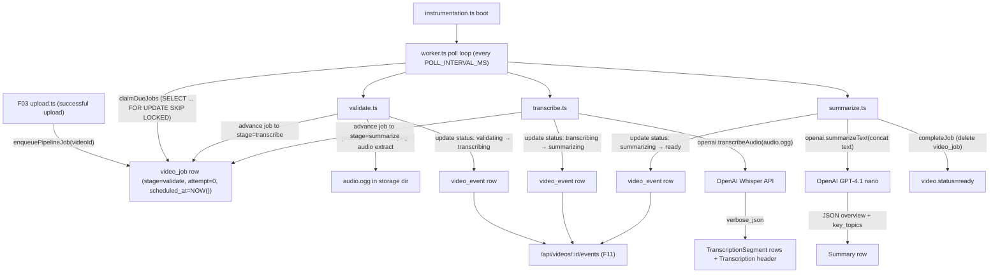
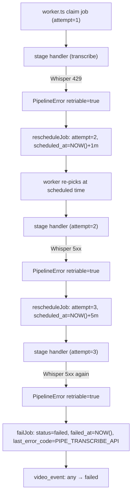
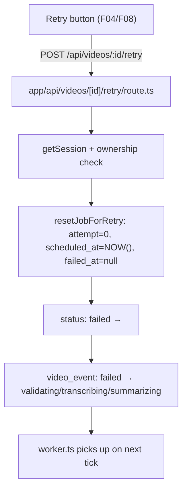
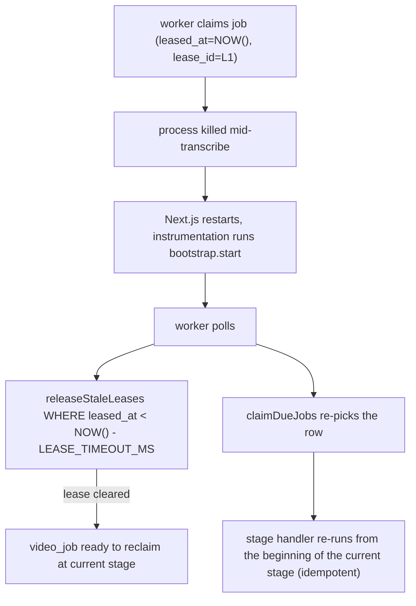

# F07. Background Processing Pipeline — Technical Specification

**Scope tag:** full scope — no Core/Full split (PRD has neither a `Core Scope` block nor a `Full Scope additions` block for F07, so the entire feature definition is in scope)

**Complexity:** complex

---

## 1. Technical Overview

**What:** Implement the background processing pipeline that takes every uploaded video (inserted by F03 with `status = 'validating'`) through three sequential stages — **validate → transcribe → summarize** — and transitions the video to `status = 'ready'` on success or `status = 'failed'` after three exhausted attempts at a single stage. The pipeline is driven by a database-backed job queue (`video_job` table) that is polled by an in-process worker loop started alongside the Next.js server; each job tracks its current stage, attempt count, scheduled-at time (for exponential backoff: 1 min → 5 min → 15 min), and last error. The validate stage confirms the file is readable via `ffprobe` and that duration ≤ 7200 s, and extracts a mono 16 kHz WAV audio track under the video's storage directory. The transcribe stage uploads that audio to the OpenAI Whisper API (`whisper-1`) with `response_format = 'verbose_json'` to obtain timestamped segments, stores each segment in a `transcription_segment` table, and stores the detected language code on a new `transcription` header row. The summarize stage concatenates the segment text, sends it to OpenAI GPT-4.1 nano (`gpt-4.1-nano`) with a fixed structured prompt that requests an overview paragraph and a bulleted list of key topics (returned as JSON), and persists both into a `summary` row. Processing status transitions are written atomically to the `video.status` column and to a `video_event` append-only log so the F11 notifications feature can subscribe to real-time stage changes via a Server-Sent Events endpoint that tails the log.

**Why:** F07 is the Wave 3 feature that turns stored bytes into the searchable, readable assets every downstream feature depends on: F08 consumes the transcription segments for the player's transcription panel, F09 consumes them for in-video search, F10 consumes the summary for the AI summary block, and F11 consumes the real-time stage transitions for the notification panel. Because Next.js 16 serverless route handlers have request-lifetime limits but the pipeline must run for minutes per video (Whisper alone can take multiple minutes on a 2-hour file), the worker must live outside any single request — a database-backed job table polled by an in-process long-lived worker that boots with the Next.js process is the simplest approach that fits the existing Prisma/Postgres stack without introducing Redis, BullMQ, or a separate process manager. The status column alone is not enough for F11's "within one second of server-side transitions" requirement, so F07 also owns the event log that F11's SSE endpoint will tail. The retry semantics (1m / 5m / 15m with three attempts, then `failed`) are expressed entirely in the `video_job` row so worker restarts leave the state machine intact; PRD "worker restart re-queues an in-flight video" is satisfied by clearing `leased_at` on lost leases.

**Scope:**

Included:
- New `video_job` table that holds the job state for every in-flight video (one row per video while processing; deleted on `ready`; retained with `failed_at` on `failed` for the Retry action)
- New `transcription` table (header row per video: `detected_language`, `whisper_model`, `created_at`) and `transcription_segment` table (one row per Whisper segment: `index`, `start_seconds`, `end_seconds`, `text`) so F08/F09 have an indexed, ordered segment list
- New `summary` table (one row per video: `overview`, `key_topics` as a JSONB ordered string array, `model`, `created_at`)
- New `video_event` append-only log table (one row per status transition: `video_id`, `from_status`, `to_status`, `stage`, `attempt`, `error_code`, `created_at`) consumed by F11's SSE feed
- An in-process worker loop module (`app/_lib/pipeline/worker.ts`) that polls the `video_job` table for due jobs (claim via `UPDATE ... SET leased_at = NOW(), lease_id = ... WHERE scheduled_at <= NOW() AND leased_at IS NULL`) with `VIDEOMAX_PIPELINE_CONCURRENCY` workers (default 2) and per-video sequential stage execution
- A worker bootstrap module (`app/_lib/pipeline/bootstrap.ts`) imported from a Next.js `instrumentation.ts` hook so the loop starts automatically when the server boots, and a `stop()` function wired to `process.on('beforeExit')`
- A lightweight "enqueue" helper (`enqueuePipelineJob(videoId)`) that F03's upload handler calls at the end of a successful upload to insert the initial `video_job` row with stage = `'validate'` and `scheduled_at = NOW()`; because F03 is already merged without this call, F03's `upload.ts` is modified in F07's Stage 1 to invoke the helper (backfilled migration catches any pre-existing `validating` videos too)
- Pipeline stage handlers under `app/_lib/pipeline/stages/`: `validate.ts`, `transcribe.ts`, `summarize.ts`; each is a pure async function that receives `{ videoId, userId, attempt, logger }` and returns `{ ok: true } | { ok: false, code, message, retriable }`
- Validate stage: re-uses F03's `probe.ts` to re-probe duration, enforces `duration_seconds <= 7200`, rejects null/unreadable duration, extracts audio via `ffmpeg -i source -vn -ac 1 -ar 16000 -c:a pcm_s16le audio.wav` into the video's storage directory; on success, writes `audio_path` onto the `video_job` row and advances to the transcribe stage
- Transcribe stage: opens the audio file, POSTs it to the OpenAI Whisper API (`/v1/audio/transcriptions`) with `model = 'whisper-1'`, `response_format = 'verbose_json'`, and automatic language detection, persists the response segments and language code in a single Prisma transaction, advances to the summarize stage; handles 429/5xx as retriable and 4xx other than 429 as fatal
- Summarize stage: loads the concatenated segment text (hard-capped at `SUMMARY_INPUT_MAX_CHARS`, default 120_000 chars — ~30k tokens — with a middle-out truncation if exceeded so the summary still reflects start + end), POSTs it to OpenAI `chat/completions` with `model = 'gpt-4.1-nano'`, a system prompt that requests strict JSON `{ "overview": "...", "key_topics": ["...", "..."] }`, `response_format = { type: 'json_object' }`, persists the result to the `summary` table, transitions the video to `status = 'ready'`, and deletes the `video_job` row
- Exponential backoff on retriable failures: attempt 1 fails → reschedule at `NOW() + 1 min`; attempt 2 fails → `NOW() + 5 min`; attempt 3 fails → mark `video.status = 'failed'`, keep the job row with `failed_at` set and `last_error_code` / `last_error_message` populated
- Retry entry-point: a server action / route handler (`POST /api/videos/:id/retry`) that resets the `video_job` row (attempt = 0, schedules at NOW(), clears `failed_at`), switches the video back to the failed stage's entry status (`validating` / `transcribing` / `summarizing`), and re-enters that stage from the beginning of attempt 1; the retry is reachable from F04's card actions and F08's detail page (those UIs are out of F07 scope but F07 provides the endpoint)
- Worker crash recovery: a "stale-lease" reaper that runs once per poll tick and clears `leased_at` / `lease_id` on rows whose `leased_at` is older than `LEASE_TIMEOUT_MS` (default 15 min) so a crashed worker's in-flight job is re-picked up; because the stage handlers are idempotent (transcribe and summarize re-persist within a transaction that deletes prior rows for the same video), re-entering the stage from the beginning is safe
- Real-time status updates: every `video.status` transition is wrapped in a Prisma transaction that also inserts a `video_event` row; an internal helper `subscribeToVideoEvents(userId, abortSignal)` returns an async iterator that F11 will consume; the Postgres `LISTEN/NOTIFY` bridge is wired so the event log does not require continuous polling from F11 — F07 ships the bridge; F11 ships the SSE route handler that wraps it
- An internal `GET /api/videos/:id/events` SSE endpoint used by F11 (and available for testing F07); F11 will re-wire it into the notification panel UI but the endpoint itself is part of F07's provider surface
- OpenAI SDK dependency (`openai` npm package, pinned major version); a small wrapper (`app/_lib/pipeline/openai.ts`) that centralizes client construction, request timeouts (default 5 min for Whisper, 60 s for GPT-4.1 nano), and error mapping to retriable / fatal codes
- `.env.example` gains `OPENAI_API_KEY`, `VIDEOMAX_PIPELINE_CONCURRENCY`, `VIDEOMAX_PIPELINE_POLL_INTERVAL_MS`, `VIDEOMAX_PIPELINE_ENABLED` (toggle for CI), `WHISPER_MODEL` (default `whisper-1`), `SUMMARY_MODEL` (default `gpt-4.1-nano`), `SUMMARY_INPUT_MAX_CHARS`, `VIDEOMAX_PIPELINE_LEASE_TIMEOUT_MS`
- `next.config.ts` gains `openai` to `serverExternalPackages` so it is not bundled into the client, and `instrumentation.ts` is added at the project root to boot the worker loop in the Node.js runtime only (guarded by `process.env.NEXT_RUNTIME === 'nodejs'`)
- Unit tests for each stage handler (mocking OpenAI and ffmpeg), the scheduler (backoff timing), the retry endpoint, and the status/event-log transaction; integration tests that exercise the full pipeline against `testcontainers` Postgres + `tmpdir` storage + a stubbed OpenAI client returning canned responses
- A test-only "fake OpenAI" module toggled via `OPENAI_FAKE = '1'` so integration tests do not hit the real API but still exercise the full code path including retries on simulated 429s

Excluded (handled by other features or explicitly out of scope per PRD Section 7):
- Rendering the transcription panel, player, summary UI, or notification panel — F08, F10, F11 own those surfaces; F07 only provides the data
- Editing transcriptions or summaries — PRD Section 7
- Translating transcriptions into other languages — PRD says English-only MVP; detected language code is stored but not used to translate
- Chunked Whisper uploads for files beyond OpenAI's 25 MB limit — handled via the audio re-encoding step (16 kHz mono WAV keeps a 2-hour file under the limit at roughly 230 MB → bgzip-compressed, still too large; the validate stage falls back to emitting a compressed Opus `.ogg` at 32 kbps mono which is ~28 MB for 2 hours and is accepted by Whisper; documented in Assumptions #4)
- Human review / quality feedback on generated summaries — not in PRD
- A dedicated "jobs dashboard" admin page — F12 admin has no such view in its PRD
- Replacing F03's upload-completion path with a server-side queue enqueue (F07 only appends a call at the end of F03's existing path; the Route Handler surface of F03 is unchanged)

---

## 2. Architecture Impact

**Affected components:**

| Path | Role |
|------|------|
| `prisma/schema.prisma` | Modified — add `VideoJob`, `Transcription`, `TranscriptionSegment`, `Summary`, `VideoEvent` models |
| `prisma/migrations/<timestamp>_add_pipeline/migration.sql` | New — creates the five new tables, indexes, FKs, CHECK constraints, and a backfill `INSERT INTO video_job (...) SELECT ... FROM video WHERE status = 'validating'` so any videos already awaiting pipeline execution at the time of deploy are picked up |
| `app/_lib/pipeline/queue.ts` | New — low-level Prisma accessors: `enqueuePipelineJob`, `claimDueJobs`, `completeJob`, `failJob`, `rescheduleJob`, `releaseStaleLeases`, `resetJobForRetry` |
| `app/_lib/pipeline/backoff.ts` | New — pure function `computeNextRunAt(attempt)` returning `NOW() + 1m / 5m / 15m` or `null` when exhausted |
| `app/_lib/pipeline/status.ts` | New — helpers to atomically update `video.status` + insert a `video_event` in a single transaction; wraps the transition rules (`validating → transcribing`, `transcribing → summarizing`, `summarizing → ready`, any → `failed`) and rejects invalid transitions |
| `app/_lib/pipeline/openai.ts` | New — wraps the `openai` SDK, exposes `transcribeAudio(filePath)` and `summarizeText(text)`, handles timeouts and the `OPENAI_FAKE` toggle |
| `app/_lib/pipeline/audio.ts` | New — wraps `ffmpeg` audio-track extraction (`-vn -ac 1 -ar 16000 -c:a libopus -b:a 32k audio.ogg`); co-lives with F03's `probe.ts` conceptually but ships separately so F03 remains minimal |
| `app/_lib/pipeline/stages/validate.ts` | New — validate stage handler |
| `app/_lib/pipeline/stages/transcribe.ts` | New — transcribe stage handler (Whisper + persist segments) |
| `app/_lib/pipeline/stages/summarize.ts` | New — summarize stage handler (GPT-4.1 nano + persist summary + mark ready) |
| `app/_lib/pipeline/worker.ts` | New — long-lived polling loop; claims due jobs, dispatches to stage handlers, applies retry/backoff, releases leases |
| `app/_lib/pipeline/bootstrap.ts` | New — `start()` / `stop()`; idempotent; respects `VIDEOMAX_PIPELINE_ENABLED` |
| `app/_lib/pipeline/events.ts` | New — `appendVideoEvent()`, `subscribeToVideoEvents(userId, signal)`; Postgres `LISTEN/NOTIFY` bridge using a dedicated `pg` client (pooled via `@prisma/client`'s raw connection or a separate `pg` instance documented in Assumptions) |
| `app/_lib/pipeline/errors.ts` | New — typed `PipelineError` with a `retriable` flag and error code taxonomy (`PIPE_VALIDATE_UNREADABLE`, `PIPE_VALIDATE_TOO_LONG`, `PIPE_TRANSCRIBE_API`, `PIPE_SUMMARIZE_API`, `PIPE_SUMMARIZE_MALFORMED`, `PIPE_TIMEOUT`, `PIPE_INTERNAL`) |
| `app/_lib/videos/upload.ts` | Modified — append a single call to `enqueuePipelineJob(video.id)` at the end of the successful path |
| `app/_lib/videos/repository.ts` | Modified — add `getVideoWithPipelineRelations(videoId, userId)` used by the retry endpoint |
| `app/api/videos/[id]/retry/route.ts` | New — `POST` Route Handler for the Retry action; authn + ownership + call `resetJobForRetry` + status transition |
| `app/api/videos/[id]/events/route.ts` | New — SSE endpoint consumed by F11 (and by Stage 4 integration tests for F07) |
| `instrumentation.ts` | New — Next.js instrumentation hook that calls `bootstrap.start()` in the nodejs runtime |
| `next.config.ts` | Modified — append `"openai"` to `serverExternalPackages` |
| `.env.example` | Modified — add the eight new env vars listed in Scope |
| `package.json` | Modified — add `openai` runtime dep; add `pg` if a separate LISTEN/NOTIFY client is chosen (see Decisions); no new client deps |
| `app/_lib/pipeline/__tests__/*` | New — unit + integration tests per the Testing Strategy |
| `app/api/videos/[id]/retry/__tests__/route.integration.test.ts` | New — retry endpoint integration tests |
| `app/api/videos/[id]/events/__tests__/route.integration.test.ts` | New — SSE endpoint integration tests |

**Data flow — successful pipeline (happy path):**



**Data flow — retriable failure and backoff:**



**Data flow — manual retry:**



**Data flow — worker crash and recovery:**



---

## 3. Technical Decisions

| Decision | Chosen Approach | Alternative Considered | Trade-off |
|----------|-----------------|------------------------|-----------|
| Worker framework / queue backend | Database-backed job table (`video_job`) polled by an in-process Node worker that boots from Next.js `instrumentation.ts` | BullMQ + Redis, Temporal, Inngest, serverless cron | Zero new infrastructure — reuses the Postgres instance F02 already stands up. PRD does not require multi-process scale; an in-process worker inside the Next.js server satisfies F11's 1 s latency (LISTEN/NOTIFY) and F07's retry semantics. Trade-off: horizontal scale is limited to one Node server process. Documented in Assumptions #1 |
| Polling strategy | `UPDATE video_job SET leased_at = NOW(), lease_id = $1 WHERE id IN (SELECT id FROM video_job WHERE scheduled_at <= NOW() AND leased_at IS NULL FOR UPDATE SKIP LOCKED LIMIT $concurrency) RETURNING *` | Bare `SELECT` + app-level locking | `FOR UPDATE SKIP LOCKED` is the canonical Postgres queue pattern; guarantees that two worker ticks on the same process (or future parallel processes) never claim the same job. One query per tick |
| Poll interval | 2 seconds (configurable via `VIDEOMAX_PIPELINE_POLL_INTERVAL_MS`) | 100 ms, 30 s | Fast enough to start a job within 2 s of upload (meets F11's "within one second" once combined with LISTEN/NOTIFY for status push); slow enough that a quiet server makes ~30 queries/min |
| Worker concurrency | 2 workers per Node process by default (`VIDEOMAX_PIPELINE_CONCURRENCY`) | 1 worker (strict serial), unbounded | Two parallel videos is a safe default for an MVP: OpenAI rate limits and local CPU/disk headroom (ffmpeg) both allow it; can be raised via env. Each video's own stages remain strictly sequential (the `video_job` row has exactly one stage at a time) |
| Per-video sequencing | Enforced by the 1-to-1 relationship between `video_job` and `video` (one `video_id` UNIQUE in `video_job`) + the single `stage` column | Job-per-stage model | Simpler state machine; the three stages are small enough to fit in one row. Retry semantics and the backoff table apply per stage already |
| Retry schedule | Hard-coded exponential: attempt 1 → +1 min, attempt 2 → +5 min, attempt 3 → mark failed | Generic `base * 2^n` | Matches PRD exactly; three attempts with explicit intervals is easier to test and predict than a formula |
| Idempotency | Each stage handler deletes its own prior persisted rows at the top of its body (e.g., transcribe deletes existing `transcription_segment` rows for this video before inserting new ones) | Only delete on explicit retry | Handles both crash recovery and manual retry with one code path. Documented in Assumptions #2 |
| Worker-crash lease timeout | 15 minutes (configurable via `VIDEOMAX_PIPELINE_LEASE_TIMEOUT_MS`) | Heartbeat-based detection, 5 min | Longer than any realistic Whisper call on a 2-hour video (which runs under 5 min for `whisper-1`) but still prompt enough that a genuinely crashed worker unblocks the video within the 15-min backoff window |
| Transcription provider | OpenAI Whisper (`whisper-1`) via the `openai` Node SDK, `response_format = 'verbose_json'`, automatic language detection | Self-hosted whisper.cpp, `whisper-large-v3` via third party | PRD names OpenAI Whisper directly. `whisper-1` is the only model currently exposed via the Audio API that returns segment timestamps; `verbose_json` is required to populate the `transcription_segment` table |
| Audio extraction before Whisper | `ffmpeg -i source -vn -ac 1 -ar 16000 -c:a libopus -b:a 32k audio.ogg` | Raw PCM WAV, keep original audio track | Whisper's 25 MB request-body limit constrains us: 2 h at 16 kHz mono PCM16 is ~230 MB (too big); Opus at 32 kbps mono is ~28 MB and still well above Whisper's usable fidelity floor. Documented in Assumptions #4 |
| Whisper request timeout | 5 minutes (hard timeout on the HTTP request) | 10 minutes, 30 s | Whisper rarely exceeds 3 min for a 2-hour audio file on Opus input; 5 min leaves headroom. Hitting the timeout maps to `PIPE_TRANSCRIBE_API` retriable |
| Summarization provider / model | OpenAI `gpt-4.1-nano` via chat/completions API | `gpt-4.1-mini`, `claude-haiku` | PRD names GPT-4.1 nano directly. Low cost, fast, adequate for overview + bullets |
| Summary prompt shape | System prompt instructs JSON output `{ "overview": "<1-2 paragraphs>", "key_topics": ["...", "..."] }`; user message is the concatenated transcription text prefixed with "Transcript of a video:"; `response_format = { type: 'json_object' }` | Free-form output parsed with regex, function calling | JSON mode + a strict shape makes parsing trivial and makes malformed responses a retriable error with a clear code (`PIPE_SUMMARIZE_MALFORMED`) |
| Summary input length | Cap at `SUMMARY_INPUT_MAX_CHARS = 120_000` (~30k tokens); if exceeded, keep the first 60 000 and the last 60 000 with an explicit "[... middle truncated ...]" marker | Hard-reject over-long transcripts, recursive summarize | GPT-4.1 nano supports more than 30k input tokens but cost scales linearly; the middle-out truncation keeps the overview anchored to both the beginning and the end of the video. Documented in Assumptions #5 |
| Storing segments | One row per Whisper segment in `transcription_segment` with a unique `(video_id, segment_index)`; the `transcription` header holds `detected_language`, model name, created_at | Store segments as a JSONB array on the `video` row | A row-per-segment model is mandatory for F09's search (Postgres indexing on `text` for substring match later if needed) and keeps F08's panel render O(N) from a single query with an `ORDER BY segment_index` |
| Storing summary | One `summary` row per video: `overview` as `text`, `key_topics` as `jsonb` (ordered string array) | Two tables, or markdown blob | Matches F10's two-sub-block rendering with one read |
| Status transition atomicity | Every status change and matching `video_event` append runs inside a single `prisma.$transaction([...])`; `video_event` has a FK to `video` with `ON DELETE CASCADE` | Application-level "best effort" | Guarantees the event log never drifts from the `video.status` column, which is what F11 and F12 observe |
| Real-time push to F11 | Postgres `LISTEN/NOTIFY` on channel `video_events`; notify is triggered from a trigger function on `INSERT INTO video_event`; F11 (and F07's own SSE endpoint) subscribe with a long-lived `pg` client that relays to SSE | Polling by F11, app-level pub/sub (Redis), WebSockets | `LISTEN/NOTIFY` is free on Postgres, supports the 1 s PRD latency, and means the event log is the single source of truth. Requires a dedicated `pg` connection for the listener (Prisma does not expose LISTEN). Documented in Assumptions #3 |
| SSE endpoint ownership | F07 owns `GET /api/videos/:id/events` (filter to the requester's videos only, auth via `getSession()`); F11 consumes it | F11 owns the endpoint | The filter logic belongs with the producer; F11 then only renders |
| Retry endpoint | `POST /api/videos/:id/retry`, Server Action-equivalent Route Handler (no body) | Server Action | F04 / F08 will wire UI buttons in their waves; a Route Handler keeps F07 callable via a simple `fetch` from anywhere in the app. Server Actions can still wrap it later |
| Worker start condition | `instrumentation.ts` calls `bootstrap.start()` only when `process.env.NEXT_RUNTIME === 'nodejs'` and `VIDEOMAX_PIPELINE_ENABLED !== '0'` | Always start, or spawn a separate process | Keeps edge runtimes out; lets CI disable the worker while still running unit tests; avoids multi-process coordination for now |
| OpenAI SDK version | `openai` v4 (current stable as of 2026-04); pinned via `^4.x` | `@openai/sdk` v5 beta, raw `fetch` | v4 has stable `files.create` + `audio.transcriptions.create` signatures. Documented in Assumptions #6 |
| Error taxonomy | Typed `PipelineError` with `retriable: boolean` and a code enum; stage handlers throw or return this; worker decides retry vs final fail | Plain `Error` + heuristics | Explicit and testable; the code is what ends up in the user-facing failure reason via `video_job.last_error_code` |
| Progress granularity | Progress is stage + attempt-level only; no sub-stage percentage (no "30% through transcription") | Whisper-reported progress, audio duration heuristic | Whisper is a single blocking call with no progress events; exposing a spinner per stage already meets PRD's "show current stage" requirement. F11 will render spinners, not percentages, for processing states |
| Handling of F03's pre-existing `validating` videos at deploy | Migration includes a backfill `INSERT INTO video_job (video_id, stage, attempt, scheduled_at) SELECT id, 'validate', 0, NOW() FROM video WHERE status = 'validating'` | Require operator to manually re-enqueue | No manual step for the deploy; the pipeline picks up existing videos automatically |
| Testing OpenAI | Behind the `OPENAI_FAKE` env var: test code loads a fake module that returns canned segments / summary; production code loads the real SDK | Mock at call sites per test | One switch covers all integration tests; unit tests still mock at the call site for fine-grained control |
| Concurrency test coverage | Use Postgres `SKIP LOCKED` directly in integration tests to assert two parallel worker claims pick two different rows | App-level race test | Closer to real-world behavior; catches a schema or query bug that an in-memory mock would not |
| Logging | Structured logs via `console.log(JSON.stringify({ level, msg, videoId, stage, attempt, durationMs }))` (no logger library); one line per stage start, stage success, stage failure, retry scheduled, final fail | Pino / Winston | No new dependency; JSON lines are greppable; the existing codebase has no logger and CLAUDE.md does not require one. Documented in Assumptions #7 |

---

## 4. Component Overview

**Frontend (App Router):**

F07 ships no user-facing UI of its own — its only "frontend" is the SSE endpoint consumed by F11 and the retry endpoint consumed by F04/F08. No React components are introduced.

**Backend (pipeline modules and Route Handlers):**

| File Path | New/Modified | Purpose | Key Responsibilities |
|-----------|--------------|---------|----------------------|
| `app/_lib/pipeline/queue.ts` | New | Job table accessors | `enqueuePipelineJob(videoId)`, `claimDueJobs(limit, leaseId)`, `completeJob(videoId)`, `failJob(videoId, code, message)`, `rescheduleJob(videoId, nextAttempt, nextRunAt)`, `releaseStaleLeases(now)`, `resetJobForRetry(videoId)` |
| `app/_lib/pipeline/backoff.ts` | New | Backoff computation | `computeNextRunAt(attempt: number): Date \| null`; pure function; returns `null` when attempt ≥ 3 (fatal) |
| `app/_lib/pipeline/status.ts` | New | Atomic status updates | `transitionStatus(videoId, from, to, stage, attempt, errorCode?)`; runs the `video.update` and `video_event.create` inside a single `prisma.$transaction`; rejects disallowed transitions with a typed error |
| `app/_lib/pipeline/events.ts` | New | Real-time event bridge | `appendVideoEvent()` (internal convenience used by `status.ts`), `subscribeToVideoEvents(userId, signal)` (async iterator backed by `pg` LISTEN on channel `video_events`); exposes `startListener()` / `stopListener()` for the bootstrap |
| `app/_lib/pipeline/openai.ts` | New | OpenAI client wrapper | `transcribeAudio({ filePath, signal })` → returns `{ language, segments: { index, start, end, text }[] }`; `summarizeText({ text, signal })` → returns `{ overview, keyTopics: string[] }`; respects `OPENAI_FAKE` and applies timeouts |
| `app/_lib/pipeline/audio.ts` | New | ffmpeg wrapper | `extractAudioTrack({ source, destination, signal })` → spawns `ffmpeg` with Opus args; returns `{ ok, durationEstimate? }`; timeouts and error swallowing mirror F03's `probe.ts` |
| `app/_lib/pipeline/errors.ts` | New | Typed pipeline errors | `PipelineError` class with `code`, `message`, `retriable`; enum `PIPELINE_ERROR_CODES` mapping each stage's known failures |
| `app/_lib/pipeline/stages/validate.ts` | New | Validate stage | Re-probes duration, enforces 2 h cap, extracts audio track; on success advances status to `transcribing` and job stage to `transcribe`; returns `{ ok: true }` or `{ ok: false, code, retriable }` |
| `app/_lib/pipeline/stages/transcribe.ts` | New | Transcribe stage | Calls `transcribeAudio()`, persists `Transcription` + `TranscriptionSegment` rows in a transaction (after deleting any prior ones for this video), transitions status to `summarizing` and job stage to `summarize` |
| `app/_lib/pipeline/stages/summarize.ts` | New | Summarize stage | Loads concatenated text (with truncation), calls `summarizeText()`, persists `Summary` row, transitions status to `ready`, calls `completeJob` to delete the `video_job` row |
| `app/_lib/pipeline/worker.ts` | New | Poll loop | `createWorker({ concurrency, pollIntervalMs, leaseTimeoutMs })` returns `{ start, stop }`; claims due jobs with `SKIP LOCKED`, dispatches to stage handlers, applies retry/backoff, refreshes leases, releases stale leases once per tick, logs every transition |
| `app/_lib/pipeline/bootstrap.ts` | New | Server-side startup | `start()` reads env vars, constructs the worker, starts the LISTEN/NOTIFY bridge; idempotent; `stop()` wires to `process.on('beforeExit')` and `SIGTERM`/`SIGINT` |
| `app/_lib/videos/upload.ts` | Modified | F03 upload orchestrator | Append a `enqueuePipelineJob(video.id)` call at the successful return path; wrapped in a try/catch so an enqueue failure does not fail the upload (the deploy backfill will catch it) |
| `app/_lib/videos/repository.ts` | Modified | Video accessors | Add `getVideoWithPipelineRelations(videoId, userId)` that returns the video with its `video_job`, `transcription`, `summary`, last few `video_event` rows; used by the retry endpoint and future F08/F10 |
| `app/api/videos/[id]/retry/route.ts` | New | Retry Route Handler | `POST`; runtime `nodejs`; authn via `getSession()`; ownership check; only allowed when `video.status === 'failed'`; calls `resetJobForRetry()` + `transitionStatus('failed' → <stage entry>)`; returns 200 or typed 4xx |
| `app/api/videos/[id]/events/route.ts` | New | SSE endpoint | `GET`; runtime `nodejs`; authn + ownership check on the `videoId` param; subscribes via `subscribeToVideoEvents`, filters by video id, emits SSE lines `event: status\ndata: <json>\n\n`; closes on `signal.abort` |
| `instrumentation.ts` | New | Next.js instrumentation | Exports `register()` that, when `NEXT_RUNTIME === 'nodejs'`, dynamically imports `bootstrap.ts` and calls `start()`; guards against double-start under HMR |
| `next.config.ts` | Modified | Next.js config | Append `"openai"` to `serverExternalPackages` |
| `.env.example` | Modified | Sample env | Add the eight new env vars with safe defaults |

**Database:**

| Migration File | Tables Affected | Operation | Notes |
|----------------|-----------------|-----------|-------|
| `prisma/migrations/<timestamp>_add_pipeline/migration.sql` | `video_job`, `transcription`, `transcription_segment`, `summary`, `video_event` | CREATE + INSERT | Creates five new tables with indexes, FKs, CHECK constraints; installs the trigger function `notify_video_event()` + trigger on `video_event` for LISTEN/NOTIFY; backfills `video_job` rows for any existing videos with `status = 'validating'` |

---

## 5. API Contracts

F07 exposes two HTTP endpoints (both Route Handlers, both Node runtime). The pipeline itself is not an HTTP surface — it is a server-side worker loop triggered by the `video_job` row.

### Endpoint: Retry Processing

- **Method:** `POST`
- **Path:** `/api/videos/:id/retry`
- **Authentication:** session cookie (`videomax_session`); missing/invalid → `401`
- **Runtime:** `nodejs`

**Path parameters:**

| Field | Type | Required | Validation | Description |
|-------|------|----------|------------|-------------|
| `id` | `string (cuid)` | Yes | 20–32 chars, `[a-z0-9]` | Video id |

**Request body:** empty (`Content-Length: 0`)

**Request Example:**

```
POST /api/videos/clv0example0001/retry HTTP/1.1
Host: localhost:3001
Cookie: videomax_session=<opaque-id>
Content-Length: 0
```

**Response (Success — 200):**

| Field | Type | Description |
|-------|------|-------------|
| `videoId` | `string` | Echo of the path param |
| `status` | `string` | New status after reset (`validating`, `transcribing`, or `summarizing`) |
| `stage` | `string` | Stage the pipeline will re-enter (`validate`, `transcribe`, or `summarize`) |
| `attempt` | `integer` | Always `0` after reset |

**Response Example:**

```json
{
  "videoId": "clv0example0001",
  "status": "transcribing",
  "stage": "transcribe",
  "attempt": 0
}
```

**Error Codes:**

| Code | HTTP Status | Description |
|------|-------------|-------------|
| `RETRY_UNAUTHORIZED` | 401 | Missing or invalid session |
| `RETRY_NOT_FOUND` | 404 | Video id does not exist or does not belong to the caller |
| `RETRY_INVALID_STATE` | 409 | Video is not in `failed` state; only failed videos can be retried |
| `RETRY_INTERNAL` | 500 | Unexpected error resetting the job row |

**Error Response Example:**

```json
{
  "code": "RETRY_INVALID_STATE",
  "message": "Only failed videos can be retried"
}
```

### Endpoint: Video Status Event Stream (SSE)

- **Method:** `GET`
- **Path:** `/api/videos/:id/events`
- **Authentication:** session cookie; unauthenticated or non-owner → `404`
- **Runtime:** `nodejs` (long-lived response)
- **Response Content-Type:** `text/event-stream`

**Path parameters:**

| Field | Type | Required | Validation | Description |
|-------|------|----------|------------|-------------|
| `id` | `string (cuid)` | Yes | 20–32 chars | Video id to subscribe to |

**Response (Success — 200, streaming):**

Each SSE message has the form:

```
event: status
data: {"videoId":"clv0...","fromStatus":"validating","toStatus":"transcribing","stage":"transcribe","attempt":1,"errorCode":null,"createdAt":"2026-04-18T14:25:30.200Z"}

```

Event payload schema:

| Field | Type | Description |
|-------|------|-------------|
| `videoId` | `string` | Video id |
| `fromStatus` | `string \| null` | Previous status; null on the first insert after upload |
| `toStatus` | `string` | New status |
| `stage` | `string` | Stage this transition corresponds to |
| `attempt` | `integer` | Attempt counter at time of transition |
| `errorCode` | `string \| null` | Set on a `failed` transition |
| `createdAt` | `string (ISO 8601)` | Event timestamp |

A keep-alive comment (`: keepalive\n\n`) is emitted every 20 s.

**Error Codes:**

| Code | HTTP Status | Description |
|------|-------------|-------------|
| `EVENTS_NOT_FOUND` | 404 | Video not found or not owned by the caller |

---

## 6. Data Model

### Table: `video_job`

| Column | Type | Nullable | Default | Description |
|--------|------|----------|---------|-------------|
| `id` | `text` (cuid) | No | `cuid()` | Primary key |
| `video_id` | `text` | No | - | FK to `video.id`; UNIQUE (one job per video) |
| `stage` | `varchar(16)` | No | `'validate'` | One of `validate`, `transcribe`, `summarize` |
| `attempt` | `integer` | No | `0` | 0-indexed attempt counter within the current stage; resets on stage advance and on manual retry |
| `scheduled_at` | `timestamptz` | No | `now()` | When this job is next eligible to run |
| `leased_at` | `timestamptz` | Yes | `null` | Set when a worker claims the row; cleared by the stale-lease reaper |
| `lease_id` | `text` | Yes | `null` | Unique per worker claim; used for safe completion |
| `last_error_code` | `varchar(48)` | Yes | `null` | Set on retriable failures |
| `last_error_message` | `varchar(500)` | Yes | `null` | Human-readable excerpt; truncated |
| `failed_at` | `timestamptz` | Yes | `null` | Set when the video reaches the `failed` status |
| `created_at` | `timestamptz` | No | `now()` | Row creation timestamp |
| `updated_at` | `timestamptz` | No | `now()` | Prisma `@updatedAt` |

**Indexes:**

| Index Name | Columns | Type | Purpose |
|------------|---------|------|---------|
| `pk_video_job` | `id` | btree (implicit) | Primary key |
| `ux_video_job_video_id` | `video_id` | btree unique | One job row per video |
| `ix_video_job_due` | `scheduled_at`, `leased_at` | btree | Poll-loop filter |

**Constraints:**

| Constraint | Type | Definition | Purpose |
|------------|------|------------|---------|
| `pk_video_job` | PRIMARY KEY | `id` | Unique identifier |
| `ux_video_job_video_id` | UNIQUE | `video_id` | One-to-one with `video` |
| `fk_video_job_video` | FOREIGN KEY | `video_id REFERENCES video(id) ON DELETE CASCADE` | Cleans up on F04 delete / F12 cascade |
| `ck_video_job_stage` | CHECK | `stage IN ('validate','transcribe','summarize')` | Enum enforcement |
| `ck_video_job_attempt` | CHECK | `attempt >= 0 AND attempt <= 3` | Attempt cap |

### Table: `transcription`

| Column | Type | Nullable | Default | Description |
|--------|------|----------|---------|-------------|
| `id` | `text` (cuid) | No | `cuid()` | Primary key |
| `video_id` | `text` | No | - | FK to `video.id`; UNIQUE |
| `detected_language` | `varchar(8)` | Yes | `null` | ISO 639-1 code returned by Whisper (`en`, `pt`, etc.) |
| `model` | `varchar(48)` | No | `'whisper-1'` | Model name that produced this transcription |
| `created_at` | `timestamptz` | No | `now()` | Persistence timestamp |

**Indexes:**

| Index Name | Columns | Type | Purpose |
|------------|---------|------|---------|
| `pk_transcription` | `id` | btree (implicit) | Primary key |
| `ux_transcription_video_id` | `video_id` | btree unique | One transcription per video |

### Table: `transcription_segment`

| Column | Type | Nullable | Default | Description |
|--------|------|----------|---------|-------------|
| `id` | `text` (cuid) | No | `cuid()` | Primary key |
| `transcription_id` | `text` | No | - | FK to `transcription.id` (ON DELETE CASCADE) |
| `video_id` | `text` | No | - | Denormalized FK to `video.id` for fast filter (ON DELETE CASCADE) |
| `segment_index` | `integer` | No | - | 0-based order within the transcription |
| `start_seconds` | `numeric(10,3)` | No | - | Start time in seconds |
| `end_seconds` | `numeric(10,3)` | No | - | End time in seconds |
| `text` | `varchar(2000)` | No | - | Segment text |
| `created_at` | `timestamptz` | No | `now()` | Persistence timestamp |

**Indexes:**

| Index Name | Columns | Type | Purpose |
|------------|---------|------|---------|
| `pk_transcription_segment` | `id` | btree (implicit) | Primary key |
| `ux_transcription_segment_order` | `video_id`, `segment_index` | btree unique | F08 fetches segments ordered by index |
| `ix_transcription_segment_time` | `video_id`, `start_seconds` | btree | F08 current-segment lookup by playhead |

**Constraints:**

| Constraint | Type | Definition | Purpose |
|------------|------|------------|---------|
| `pk_transcription_segment` | PRIMARY KEY | `id` | Unique identifier |
| `fk_transcription_segment_transcription` | FOREIGN KEY | `transcription_id REFERENCES transcription(id) ON DELETE CASCADE` | Owning header row |
| `fk_transcription_segment_video` | FOREIGN KEY | `video_id REFERENCES video(id) ON DELETE CASCADE` | F04/F12 cascade |
| `ck_transcription_segment_times` | CHECK | `start_seconds >= 0 AND end_seconds >= start_seconds` | Sane interval |

### Table: `summary`

| Column | Type | Nullable | Default | Description |
|--------|------|----------|---------|-------------|
| `id` | `text` (cuid) | No | `cuid()` | Primary key |
| `video_id` | `text` | No | - | FK to `video.id`; UNIQUE |
| `overview` | `text` | No | - | Paragraph(s) from GPT-4.1 nano |
| `key_topics` | `jsonb` | No | `'[]'::jsonb` | Ordered array of strings |
| `model` | `varchar(48)` | No | `'gpt-4.1-nano'` | Model name |
| `created_at` | `timestamptz` | No | `now()` | Persistence timestamp |

**Indexes:**

| Index Name | Columns | Type | Purpose |
|------------|---------|------|---------|
| `pk_summary` | `id` | btree (implicit) | Primary key |
| `ux_summary_video_id` | `video_id` | btree unique | One summary per video |

**Constraints:**

| Constraint | Type | Definition | Purpose |
|------------|------|------------|---------|
| `pk_summary` | PRIMARY KEY | `id` | Unique identifier |
| `fk_summary_video` | FOREIGN KEY | `video_id REFERENCES video(id) ON DELETE CASCADE` | F04/F12 cascade |
| `ck_summary_key_topics_array` | CHECK | `jsonb_typeof(key_topics) = 'array'` | Shape guard |

### Table: `video_event`

| Column | Type | Nullable | Default | Description |
|--------|------|----------|---------|-------------|
| `id` | `text` (cuid) | No | `cuid()` | Primary key |
| `video_id` | `text` | No | - | FK to `video.id` |
| `user_id` | `text` | No | - | Denormalized FK to `user.id`; makes F11's per-user filter O(1) |
| `from_status` | `varchar(16)` | Yes | `null` | Null for the first event after upload |
| `to_status` | `varchar(16)` | No | - | New status |
| `stage` | `varchar(16)` | Yes | `null` | Stage this transition corresponds to; null for pure retry-reset |
| `attempt` | `integer` | No | `0` | Attempt at time of transition |
| `error_code` | `varchar(48)` | Yes | `null` | Set on any `*_to_failed` event |
| `created_at` | `timestamptz` | No | `now()` | Event timestamp |

**Indexes:**

| Index Name | Columns | Type | Purpose |
|------------|---------|------|---------|
| `pk_video_event` | `id` | btree (implicit) | Primary key |
| `ix_video_event_user_created` | `user_id`, `created_at DESC` | btree | F11 lists the last N events per user |
| `ix_video_event_video_created` | `video_id`, `created_at DESC` | btree | F07 SSE subscription filter |

**Constraints:**

| Constraint | Type | Definition | Purpose |
|------------|------|------------|---------|
| `pk_video_event` | PRIMARY KEY | `id` | Unique identifier |
| `fk_video_event_video` | FOREIGN KEY | `video_id REFERENCES video(id) ON DELETE CASCADE` | F04/F12 cascade |
| `fk_video_event_user` | FOREIGN KEY | `user_id REFERENCES user(id) ON DELETE CASCADE` | F12 user-delete cascade |
| `ck_video_event_to_status` | CHECK | `to_status IN ('validating','transcribing','summarizing','ready','failed')` | Enum enforcement |

**Cross-Database Notes:**
- All timestamps are `timestamptz(6)` (Postgres); `numeric(10,3)` is used for segment start/end to mirror F03's `duration_seconds` convention.
- `jsonb` is used for `summary.key_topics`; Prisma maps it to `Prisma.JsonValue` (cast to `string[]` in DTO).
- `video_event` uses a Postgres trigger (see below) for `NOTIFY`; this is Postgres-only and documented in Assumptions #3.

**Trigger for real-time push:**

```sql
CREATE OR REPLACE FUNCTION notify_video_event() RETURNS TRIGGER AS $$
BEGIN
  PERFORM pg_notify('video_events', json_build_object(
    'videoId', NEW.video_id,
    'userId',  NEW.user_id,
    'fromStatus', NEW.from_status,
    'toStatus',   NEW.to_status,
    'stage',      NEW.stage,
    'attempt',    NEW.attempt,
    'errorCode',  NEW.error_code,
    'createdAt',  NEW.created_at
  )::text);
  RETURN NEW;
END;
$$ LANGUAGE plpgsql;

CREATE TRIGGER tr_video_event_notify
AFTER INSERT ON video_event
FOR EACH ROW EXECUTE FUNCTION notify_video_event();
```

**Migration Example (`prisma/migrations/<timestamp>_add_pipeline/migration.sql`):**

```sql
CREATE TABLE "video_job" (
    "id"                   TEXT PRIMARY KEY,
    "video_id"             TEXT NOT NULL UNIQUE REFERENCES "video"("id") ON DELETE CASCADE,
    "stage"                VARCHAR(16) NOT NULL DEFAULT 'validate',
    "attempt"              INTEGER NOT NULL DEFAULT 0,
    "scheduled_at"         TIMESTAMPTZ(6) NOT NULL DEFAULT NOW(),
    "leased_at"            TIMESTAMPTZ(6),
    "lease_id"             TEXT,
    "last_error_code"      VARCHAR(48),
    "last_error_message"   VARCHAR(500),
    "failed_at"            TIMESTAMPTZ(6),
    "created_at"           TIMESTAMPTZ(6) NOT NULL DEFAULT NOW(),
    "updated_at"           TIMESTAMPTZ(6) NOT NULL DEFAULT NOW(),
    CONSTRAINT "ck_video_job_stage"   CHECK ("stage" IN ('validate','transcribe','summarize')),
    CONSTRAINT "ck_video_job_attempt" CHECK ("attempt" >= 0 AND "attempt" <= 3)
);
CREATE INDEX "ix_video_job_due" ON "video_job"("scheduled_at","leased_at");

CREATE TABLE "transcription" (
    "id"                 TEXT PRIMARY KEY,
    "video_id"           TEXT NOT NULL UNIQUE REFERENCES "video"("id") ON DELETE CASCADE,
    "detected_language"  VARCHAR(8),
    "model"              VARCHAR(48) NOT NULL DEFAULT 'whisper-1',
    "created_at"         TIMESTAMPTZ(6) NOT NULL DEFAULT NOW()
);

CREATE TABLE "transcription_segment" (
    "id"               TEXT PRIMARY KEY,
    "transcription_id" TEXT NOT NULL REFERENCES "transcription"("id") ON DELETE CASCADE,
    "video_id"         TEXT NOT NULL REFERENCES "video"("id") ON DELETE CASCADE,
    "segment_index"    INTEGER NOT NULL,
    "start_seconds"    NUMERIC(10,3) NOT NULL,
    "end_seconds"      NUMERIC(10,3) NOT NULL,
    "text"             VARCHAR(2000) NOT NULL,
    "created_at"       TIMESTAMPTZ(6) NOT NULL DEFAULT NOW(),
    CONSTRAINT "ck_transcription_segment_times" CHECK ("start_seconds" >= 0 AND "end_seconds" >= "start_seconds")
);
CREATE UNIQUE INDEX "ux_transcription_segment_order" ON "transcription_segment"("video_id","segment_index");
CREATE INDEX "ix_transcription_segment_time" ON "transcription_segment"("video_id","start_seconds");

CREATE TABLE "summary" (
    "id"          TEXT PRIMARY KEY,
    "video_id"    TEXT NOT NULL UNIQUE REFERENCES "video"("id") ON DELETE CASCADE,
    "overview"    TEXT NOT NULL,
    "key_topics"  JSONB NOT NULL DEFAULT '[]'::jsonb,
    "model"       VARCHAR(48) NOT NULL DEFAULT 'gpt-4.1-nano',
    "created_at"  TIMESTAMPTZ(6) NOT NULL DEFAULT NOW(),
    CONSTRAINT "ck_summary_key_topics_array" CHECK (jsonb_typeof("key_topics") = 'array')
);

CREATE TABLE "video_event" (
    "id"           TEXT PRIMARY KEY,
    "video_id"     TEXT NOT NULL REFERENCES "video"("id") ON DELETE CASCADE,
    "user_id"      TEXT NOT NULL REFERENCES "user"("id") ON DELETE CASCADE,
    "from_status"  VARCHAR(16),
    "to_status"    VARCHAR(16) NOT NULL,
    "stage"        VARCHAR(16),
    "attempt"      INTEGER NOT NULL DEFAULT 0,
    "error_code"   VARCHAR(48),
    "created_at"   TIMESTAMPTZ(6) NOT NULL DEFAULT NOW(),
    CONSTRAINT "ck_video_event_to_status" CHECK ("to_status" IN ('validating','transcribing','summarizing','ready','failed'))
);
CREATE INDEX "ix_video_event_user_created"  ON "video_event"("user_id","created_at" DESC);
CREATE INDEX "ix_video_event_video_created" ON "video_event"("video_id","created_at" DESC);

-- LISTEN/NOTIFY trigger (see spec for function body)
CREATE FUNCTION notify_video_event() RETURNS TRIGGER AS $$ ... $$ LANGUAGE plpgsql;
CREATE TRIGGER tr_video_event_notify AFTER INSERT ON "video_event"
  FOR EACH ROW EXECUTE FUNCTION notify_video_event();

-- Backfill for any video rows already awaiting the pipeline
INSERT INTO "video_job" ("id","video_id","stage","attempt","scheduled_at")
SELECT
  lower(md5(random()::text || clock_timestamp()::text)),  -- fallback id; Prisma will use cuid in practice
  "id",
  'validate',
  0,
  NOW()
FROM "video"
WHERE "status" = 'validating'
ON CONFLICT ("video_id") DO NOTHING;
```

**Prisma schema snippet (appended to the existing `schema.prisma`, plus the reciprocal relations on `Video` and `User`):**

```prisma
model VideoJob {
  id               String    @id @default(cuid())
  videoId          String    @unique @map("video_id")
  stage            String    @default("validate") @db.VarChar(16)
  attempt          Int       @default(0)
  scheduledAt      DateTime  @default(now()) @map("scheduled_at") @db.Timestamptz(6)
  leasedAt         DateTime? @map("leased_at") @db.Timestamptz(6)
  leaseId          String?   @map("lease_id")
  lastErrorCode    String?   @map("last_error_code") @db.VarChar(48)
  lastErrorMessage String?   @map("last_error_message") @db.VarChar(500)
  failedAt         DateTime? @map("failed_at") @db.Timestamptz(6)
  createdAt        DateTime  @default(now()) @map("created_at") @db.Timestamptz(6)
  updatedAt        DateTime  @updatedAt @map("updated_at") @db.Timestamptz(6)
  video            Video     @relation(fields: [videoId], references: [id], onDelete: Cascade)

  @@index([scheduledAt, leasedAt], map: "ix_video_job_due")
  @@map("video_job")
}

model Transcription {
  id               String                  @id @default(cuid())
  videoId          String                  @unique @map("video_id")
  detectedLanguage String?                 @map("detected_language") @db.VarChar(8)
  model            String                  @default("whisper-1") @db.VarChar(48)
  createdAt        DateTime                @default(now()) @map("created_at") @db.Timestamptz(6)
  video            Video                   @relation(fields: [videoId], references: [id], onDelete: Cascade)
  segments         TranscriptionSegment[]

  @@map("transcription")
}

model TranscriptionSegment {
  id              String         @id @default(cuid())
  transcriptionId String         @map("transcription_id")
  videoId         String         @map("video_id")
  segmentIndex    Int            @map("segment_index")
  startSeconds    Decimal        @map("start_seconds") @db.Decimal(10, 3)
  endSeconds      Decimal        @map("end_seconds") @db.Decimal(10, 3)
  text            String         @db.VarChar(2000)
  createdAt       DateTime       @default(now()) @map("created_at") @db.Timestamptz(6)
  transcription   Transcription  @relation(fields: [transcriptionId], references: [id], onDelete: Cascade)
  video           Video          @relation(fields: [videoId], references: [id], onDelete: Cascade)

  @@unique([videoId, segmentIndex], map: "ux_transcription_segment_order")
  @@index([videoId, startSeconds], map: "ix_transcription_segment_time")
  @@map("transcription_segment")
}

model Summary {
  id        String   @id @default(cuid())
  videoId   String   @unique @map("video_id")
  overview  String
  keyTopics Json     @default("[]") @map("key_topics")
  model     String   @default("gpt-4.1-nano") @db.VarChar(48)
  createdAt DateTime @default(now()) @map("created_at") @db.Timestamptz(6)
  video     Video    @relation(fields: [videoId], references: [id], onDelete: Cascade)

  @@map("summary")
}

model VideoEvent {
  id         String   @id @default(cuid())
  videoId    String   @map("video_id")
  userId     String   @map("user_id")
  fromStatus String?  @map("from_status") @db.VarChar(16)
  toStatus   String   @map("to_status") @db.VarChar(16)
  stage      String?  @db.VarChar(16)
  attempt    Int      @default(0)
  errorCode  String?  @map("error_code") @db.VarChar(48)
  createdAt  DateTime @default(now()) @map("created_at") @db.Timestamptz(6)
  video      Video    @relation(fields: [videoId], references: [id], onDelete: Cascade)
  user       User     @relation(fields: [userId], references: [id], onDelete: Cascade)

  @@index([userId, createdAt(sort: Desc)], map: "ix_video_event_user_created")
  @@index([videoId, createdAt(sort: Desc)], map: "ix_video_event_video_created")
  @@map("video_event")
}
```

Reciprocal relations added to existing models:

```prisma
model Video {
  // ...existing fields from F03...
  job                  VideoJob?
  transcription        Transcription?
  transcriptionSegments TranscriptionSegment[]
  summary              Summary?
  events               VideoEvent[]
}

model User {
  // ...existing fields from F02...
  videoEvents VideoEvent[]
}
```

---

## 7. Testing Strategy

F07 reuses the Vitest projects F02 and F03 introduced (`unit` with jsdom, `integration` with `testcontainers` Postgres). The LISTEN/NOTIFY bridge is exercised in its own integration test that creates a `pg` client connected to the same container. OpenAI is faked behind `OPENAI_FAKE=1`; the fake module returns deterministic segments and a deterministic summary, so integration tests reach the network boundary but do not depend on it.

**Test File Structure:**

| Test File | Test Type | Target | Coverage Goal |
|-----------|-----------|--------|----------------|
| `app/_lib/pipeline/__tests__/backoff.test.ts` | Unit | `computeNextRunAt` | All branches (attempt 0/1/2/3) |
| `app/_lib/pipeline/__tests__/errors.test.ts` | Unit | `PipelineError` construction, code table | All branches |
| `app/_lib/pipeline/__tests__/queue.test.ts` | Unit (with Prisma test-double) | `enqueuePipelineJob`, `rescheduleJob`, `resetJobForRetry` | 90% |
| `app/_lib/pipeline/__tests__/queue.integration.test.ts` | Integration (Postgres) | Full `video_job` lifecycle incl. `SKIP LOCKED` concurrency | All branches |
| `app/_lib/pipeline/__tests__/status.test.ts` | Unit (Prisma test-double) | `transitionStatus` valid and invalid transitions | All branches |
| `app/_lib/pipeline/__tests__/status.integration.test.ts` | Integration (Postgres) | `transitionStatus` atomic update + event insert | All branches |
| `app/_lib/pipeline/__tests__/events.integration.test.ts` | Integration (Postgres + `pg`) | `subscribeToVideoEvents` receives a NOTIFY payload within 1 s | Happy path + filter |
| `app/_lib/pipeline/__tests__/openai.test.ts` | Unit (fake module) | `transcribeAudio`, `summarizeText` with simulated 200, 429, 500, JSON-malformed | All branches |
| `app/_lib/pipeline/__tests__/audio.test.ts` | Unit (child-process stub) | `extractAudioTrack` success / non-zero exit / timeout | All branches |
| `app/_lib/pipeline/__tests__/audio.integration.test.ts` | Integration (real `ffmpeg`) | Extracts from the committed `video-sample/video-test.mkv` fixture | Happy path |
| `app/_lib/pipeline/__tests__/validate.test.ts` | Unit (mocks) | validate stage happy path, too-long, unreadable | All branches |
| `app/_lib/pipeline/__tests__/transcribe.test.ts` | Unit (mocks) | transcribe stage happy path, retriable 429, malformed response | All branches |
| `app/_lib/pipeline/__tests__/summarize.test.ts` | Unit (mocks) | summarize stage happy path, truncation path, malformed response | All branches |
| `app/_lib/pipeline/__tests__/worker.test.ts` | Unit (fake queue) | Poll loop: claims, dispatches, retries, releases stale leases, stops cleanly | All branches |
| `app/_lib/pipeline/__tests__/worker.integration.test.ts` | Integration (Postgres + fake OpenAI) | End-to-end: upload → enqueue → pipeline runs → video reaches `ready` with segments + summary | Happy path + 1 retry |
| `app/api/videos/[id]/retry/__tests__/route.integration.test.ts` | Integration | `POST /api/videos/:id/retry` — success, 401, 404, 409 non-failed | All branches |
| `app/api/videos/[id]/events/__tests__/route.integration.test.ts` | Integration | `GET /api/videos/:id/events` — receives a status transition via SSE | Happy path + auth |

**Per-file test functions:**

`app/_lib/pipeline/__tests__/backoff.test.ts`

| Test Function | Description | Assertions |
|---------------|-------------|------------|
| `backoff_first_attempt_schedules_plus_1m` | `computeNextRunAt(1)` | Returns `NOW + 60_000 ms` within tolerance |
| `backoff_second_attempt_schedules_plus_5m` | `computeNextRunAt(2)` | Returns `NOW + 300_000 ms` within tolerance |
| `backoff_third_attempt_returns_null` | `computeNextRunAt(3)` | Returns `null` (signal to final-fail) |
| `backoff_attempt_zero_is_immediate` | `computeNextRunAt(0)` | Returns a Date equal to now (no wait) |

`app/_lib/pipeline/__tests__/queue.integration.test.ts`

| Test Function | Description | Assertions |
|---------------|-------------|------------|
| `enqueue_creates_job_row_at_validate_stage` | Call `enqueuePipelineJob(videoId)` | `video_job` row exists with stage=`validate`, attempt=0, `scheduled_at <= NOW()` |
| `claim_due_jobs_returns_only_unleased_due_rows` | Seed mix of future/past/leased rows | Returns only past + unleased rows |
| `claim_due_jobs_skip_locked_prevents_double_claim` | Two concurrent claims (two `pg` clients) | Each claim returns disjoint rows |
| `reschedule_job_sets_attempt_and_scheduled_at` | `rescheduleJob(videoId, attempt=2, nextRunAt)` | Row updated; `leased_at` cleared |
| `fail_job_marks_failed_and_sets_failed_at` | `failJob(videoId, code, msg)` | `failed_at` set; `last_error_code` set |
| `reset_job_for_retry_restores_fresh_state` | Pre-seed a failed job, call `resetJobForRetry(videoId)` | `attempt=0`, `scheduled_at<=NOW()`, `failed_at=null`, `last_error_code=null` |
| `release_stale_leases_clears_expired_leases` | Seed leased row with `leased_at = NOW - 16m` | Row becomes claimable again |
| `complete_job_deletes_row` | `completeJob(videoId)` | Row no longer exists |

`app/_lib/pipeline/__tests__/status.integration.test.ts`

| Test Function | Description | Assertions |
|---------------|-------------|------------|
| `transition_updates_video_status_and_inserts_event` | `transitionStatus(videoId, 'validating', 'transcribing', 'transcribe', 1)` | `video.status = 'transcribing'`; 1 new `video_event` row with matching fields |
| `transition_rejects_invalid_path` | `transitionStatus(videoId, 'validating', 'ready', ...)` | Throws; no state change |
| `transition_to_failed_records_error_code` | Final fail transition with `errorCode` | `video_event.error_code = 'PIPE_TRANSCRIBE_API'`; `video.status = 'failed'` |
| `transition_is_atomic_on_event_insert_error` | Simulate event-insert failure in a transaction | `video.status` unchanged |

`app/_lib/pipeline/__tests__/events.integration.test.ts`

| Test Function | Description | Assertions |
|---------------|-------------|------------|
| `subscriber_receives_notify_within_one_second` | Subscribe, then insert a `video_event` | Iterator emits the event within 1000 ms |
| `subscriber_filters_by_user_id` | Two users' events | Only the matching user's events are emitted |
| `subscriber_closes_on_abort_signal` | Subscribe with a signal, abort | Iterator completes without error |

`app/_lib/pipeline/__tests__/worker.integration.test.ts`

| Test Function | Description | Assertions |
|---------------|-------------|------------|
| `pipeline_drives_video_to_ready_with_fake_openai` | Enqueue a job against the fake OpenAI module; run one worker tick loop to completion | `video.status = 'ready'`; 1 `transcription` row; N `transcription_segment` rows; 1 `summary` row; no `video_job` row |
| `pipeline_retries_transient_transcribe_failure_and_succeeds_on_second_attempt` | Fake OpenAI throws 429 on first call, succeeds on second | Video reaches `ready`; attempt counter hit 1 before 0 in next stage; `video_event` log shows both the retriable fail and the recovery |
| `pipeline_marks_failed_after_three_attempts` | Fake OpenAI throws 429 every time | `video.status = 'failed'`; `video_job.failed_at` set; `last_error_code = 'PIPE_TRANSCRIBE_API'`; `video_event` chain ends in `to_status = 'failed'` |
| `pipeline_validate_rejects_file_longer_than_two_hours` | Seed video with `duration_seconds = 7300` | `video.status = 'failed'`; `last_error_code = 'PIPE_VALIDATE_TOO_LONG'` |
| `pipeline_worker_crash_simulation_re_enters_stage_after_lease_expiry` | Claim a job, don't release, advance time past `LEASE_TIMEOUT_MS`, run another worker tick | Job claimable again; stage re-runs (rows re-persisted cleanly) |
| `pipeline_concurrent_workers_respect_per_video_lock` | Two workers run in parallel against 2 seeded jobs | Each worker handles a distinct video; no duplicate `transcription` row per video |

`app/api/videos/[id]/retry/__tests__/route.integration.test.ts`

| Test Function | Description | Assertions |
|---------------|-------------|------------|
| `retry_200_on_failed_video` | POST against a video with `status = 'failed'` | 200 JSON with new `status` + `stage = <previous stage>`; `video_job` reset |
| `retry_401_when_unauthenticated` | No cookie | 401 `RETRY_UNAUTHORIZED` |
| `retry_404_when_not_owner` | Another user's video | 404 `RETRY_NOT_FOUND` |
| `retry_409_when_not_failed` | `status = 'transcribing'` | 409 `RETRY_INVALID_STATE` |
| `retry_re_enters_original_failed_stage` | Failed at transcribe → new status `transcribing`, stage `transcribe` | Asserts stage identity |

`app/api/videos/[id]/events/__tests__/route.integration.test.ts`

| Test Function | Description | Assertions |
|---------------|-------------|------------|
| `sse_streams_status_transition` | Open SSE, then trigger a status transition | SSE line `event: status` with matching JSON within 1000 ms |
| `sse_sends_keepalive_comment` | Open SSE, wait 21 s | At least one `: keepalive` line observed |
| `sse_404_for_non_owner` | Another user's id | 404 `EVENTS_NOT_FOUND` |
| `sse_closes_on_client_disconnect` | Abort the request | Server releases the `pg` subscription |

**Acceptance mapping (PRD Section 9):**

| Acceptance criterion | Covered by |
|---|---|
| Pipeline runs validate → transcribe → summarize → ready without manual intervention | `worker.integration.test.ts → pipeline_drives_video_to_ready_with_fake_openai` |
| Validate stage rejects files longer than 2 hours or with unreadable audio | `worker.integration.test.ts → pipeline_validate_rejects_file_longer_than_two_hours` + `validate.test.ts` unreadable branch |
| Transcribe stage produces ordered segments with start and end timestamps and a detected language code | `worker.integration.test.ts → pipeline_drives_video_to_ready_with_fake_openai` asserts segment rows + `transcription.detected_language` |
| Summarize stage produces an overview paragraph and a bulleted list of key topics | Same test asserts `summary.overview` non-empty and `summary.key_topics` length ≥ 1 |
| Any stage retries automatically up to 3 times with exponential backoff (1m, 5m, 15m) | `backoff.test.ts` + `pipeline_retries_transient_transcribe_failure_and_succeeds_on_second_attempt` + `pipeline_marks_failed_after_three_attempts` |
| Failed video shows a "Retry" action that re-enters the failed stage from the beginning and resets the attempt counter | `retry_200_on_failed_video` + `retry_re_enters_original_failed_stage` |
| Current stage and attempt count are reflected in the library and notification panel in real time | `events.integration.test.ts` + `sse_streams_status_transition` |
| Worker restart re-queues an in-flight video and re-enters the current stage | `pipeline_worker_crash_simulation_re_enters_stage_after_lease_expiry` |

**Cross-Feature Integration mapping (PRD Section 9 rows that reference F07):**

| Cross-feature criterion | Covered by |
|---|---|
| Videos produced by upload (F03) are automatically picked up and processed by F07 | `worker.integration.test.ts` seeds via `enqueuePipelineJob` called from a minimal `uploadVideo` test path |
| Transcription segments and detected language produced by F07 render correctly in F08's panel | Provider side: assertions on ordered segments and `detected_language` in the integration test (F08 ships its consumer-side assertions) |
| Summary overview and key topics produced by F07 render correctly in F10 | Provider side: assertions on `summary.overview` + `summary.key_topics` shape |
| F03 video title/thumbnail + F07 processing status appear in F11 notification panel in real time | Provider side: `sse_streams_status_transition` + `events.integration.test.ts` latency assertion |

---

## Assumptions / Decisions

Defaults applied by the Auto-Accept Policy (Batch Mode) because the PRD or codebase did not fully specify the detail. Each is flagged so the user can review and override.

1. **Worker framework and queue backend.** The PRD says "multiple videos can be processed in parallel up to a configured worker count" but does not prescribe a queue technology. A database-backed `video_job` table polled by an in-process worker loop started from `instrumentation.ts` is the industry-standard default that fits the existing Next.js + Prisma + Postgres stack without adding Redis, BullMQ, or a separate process manager. If the user later wants horizontal scale (more than one Node process), the same `video_job` table supports it via `SKIP LOCKED`.
2. **Stage idempotency.** Each stage handler deletes its own prior persisted rows before re-inserting (e.g., transcribe deletes any existing `transcription_segment` rows for the video at the top of its body). This covers both crash recovery and manual retry without branching logic.
3. **Real-time push via Postgres LISTEN/NOTIFY.** The PRD requires "within about one second of server-side transitions" (F11). Polling would miss that budget unless we poll aggressively; LISTEN/NOTIFY is the canonical low-latency push on Postgres. It requires a dedicated `pg` client connection for the listener (Prisma cannot LISTEN), which is the only reason we add the `pg` dependency alongside `@prisma/client`. If the user prefers to avoid the extra dep, a 1 s poll on the `video_event` table is an acceptable fallback at minor cost.
4. **Audio pre-encode before Whisper.** The OpenAI Audio API caps uploaded files at 25 MB. Re-encoding to Opus 32 kbps mono keeps even a 2-hour video under that limit while remaining transcription-grade. The alternative — chunked Whisper requests — would multiply the pipeline's failure modes and is out of scope for MVP.
5. **Summary input truncation.** If the concatenated transcript exceeds `SUMMARY_INPUT_MAX_CHARS` (default 120 000 chars ≈ 30k tokens), the summarize stage keeps the first half and the last half, joined by a marker. GPT-4.1 nano supports longer contexts but billing scales linearly; this default keeps MVP cost predictable.
6. **OpenAI SDK version.** Pinned to the `openai` npm v4 major as of April 2026. Adjust if the project already uses v5.
7. **Logging.** Structured JSON lines via `console.log` (no logger library). The codebase has no logger today and CLAUDE.md does not require one; introducing pino/winston is a larger refactor best handled as its own task.
8. **Progress granularity.** Stage + attempt only — no intra-stage percentage. Whisper is a single blocking call and does not stream progress; F11's spec will render spinners for processing states rather than a progress bar.
9. **Retry reachable from failed state only.** A video in `validating`/`transcribing`/`summarizing` returns 409 from the retry endpoint; only `failed` is retriable by the user. An automatic retry path already exists for transient failures via the backoff schedule.
10. **Pipeline kill-switch.** `VIDEOMAX_PIPELINE_ENABLED = '0'` disables the worker loop without removing the `instrumentation.ts` hook so CI and local E2E can opt out.
11. **F03 backfill at deploy.** The migration inserts a `video_job` row for every existing video currently in `status = 'validating'`. This avoids requiring an operator to manually enqueue pre-existing rows, and it covers the race where F03's modified `upload.ts` ships after a few uploads have already landed.
12. **LLM prompt shape.** The summarize prompt is a fixed system prompt requiring strict JSON `{ "overview": "...", "key_topics": ["...", "..."] }` with `response_format: { type: 'json_object' }`. This is the simplest contract the PRD's "overview paragraph plus key-topic bullets" can map to, and a malformed JSON response maps to a retriable `PIPE_SUMMARIZE_MALFORMED` so two transient failures still recover.
13. **Per-user filter in SSE endpoint.** `/api/videos/:id/events` is scoped to one video, not a user-wide stream; F11 will open one SSE connection per video shown in the notification panel (the panel's in-flight list is bounded). A user-wide stream can be added later if the per-video pattern becomes expensive.
14. **Traceability.** The PRD blocks below informed these sections:
    - **Consumes (file path, metadata, status)** → Section 2 flow diagrams + Section 4 modified files (`upload.ts`, `repository.ts`)
    - **Provides (transcription, summary, real-time status)** → Section 6 `transcription`, `transcription_segment`, `summary`, `video_event` tables + Section 5 SSE endpoint
    - **Capabilities (stages, retry, concurrency, OpenAI)** → Section 3 Technical Decisions + Section 4 stage modules + Section 6 `video_job` schema
    - **Experience (no direct interaction, stage/attempt in real time, failure with Retry)** → Section 5 Retry and SSE endpoints + Section 6 `video_event` table
    - **Error Handling (validate, transcribe, summarize, partial success, worker crash)** → Section 3 stale-lease and idempotency decisions + Section 7 worker-crash and retry integration tests
    - **Section 9 acceptance criteria (F07)** → Section 7 Acceptance mapping table
    - **Section 9 Cross-Feature Integration criteria** → Section 7 Cross-Feature Integration mapping table
