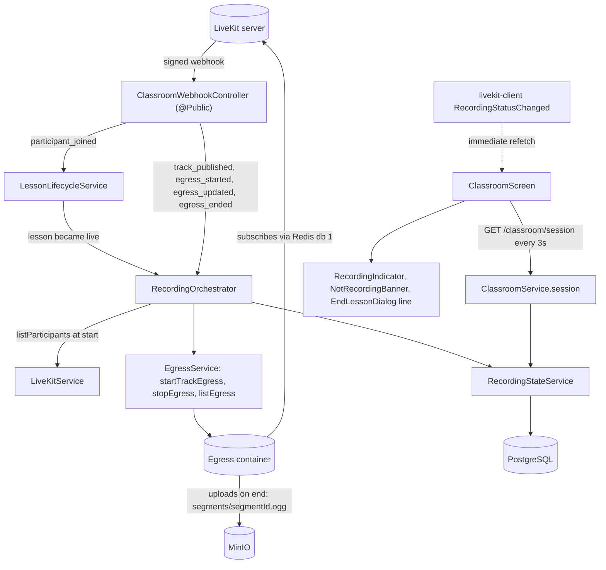
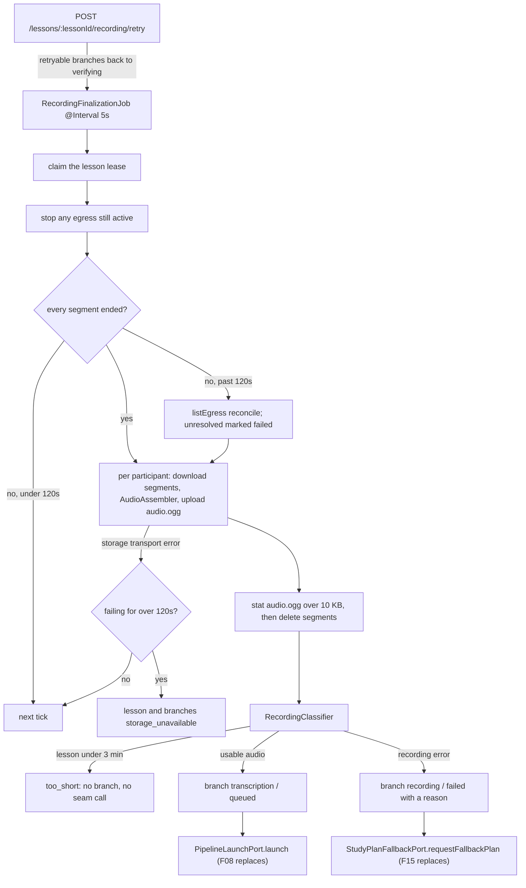
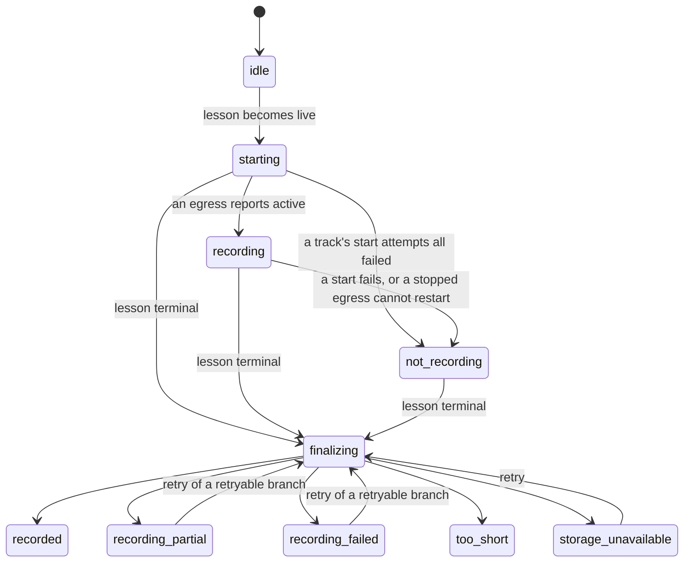

# Technical Specification: Lesson Recording

## 1. Technical Overview

**What:** One LiveKit track egress per published microphone track, started when the lesson F05 opened becomes live. Each egress writes an Ogg/Opus segment into MinIO. When the lesson ends, a durable finalization pass waits for every egress to finish uploading and assembles each participant's segments into a single continuous `lessons/{lessonId}/{userId}/audio.ogg`. It then verifies that object exists and exceeds 10 KB, and opens one independent pipeline branch per participant. A participant whose recording is unusable because of an error gets a failed branch with a reason and a request for a fallback study plan built from their existing profile, while every other participant proceeds. In the classroom, the live stage's top bar shows `Recording` or `Not recording`, the end dialog states how much audio was captured, and a lesson closed by the 2-hour cap says so.

**Why:** F07 is where the per-participant fork stops being a principle and becomes a filesystem fact: N participants produce N objects and N branches, and nothing downstream ever has to work out who spoke. It is also the first feature whose output is an audio file other features read by offset. F08 turns seconds in the file into utterance timestamps, and F10 slices excerpts out of the same file by those timestamps. Both assume that second N of the file is a known wall-clock moment. Egress alone does not guarantee that. A reconnect or a `Rejoin classroom` publishes a new track and starts a new egress, and a muted microphone leaves gaps in the stream. So the assembly step is what turns "the audio LiveKit happened to write" into the contract F08 and F10 need. Finally, F07 is the first feature that writes real objects to storage, which is why the storage adapter's missing test from F01 is paid off here.

**Scope — Included (the PRD gives F07 no Core/Full split, so the whole feature is in scope):**
- Track egress per published audio track, started when the lesson goes live and for every audio publication afterwards (late joiners, reconnects, rejoins). Video is never requested.
- The lesson record's recording and pipeline state: per-participant object key, byte size, captured duration and timeline origin; a lesson-level recording status; and one pipeline branch row per participant
- The 3-minute minimum (`too_short`), the 10 KB verification, `recording_failed`, `recording_partial`, `storage_unavailable` with its 2-minute retry window, and a manual retry that re-runs verification
- The recording indicator, the `Not recording` state and its dismissible banner, visible to every participant
- `Lesson ended automatically after 2 hours.` shown to every participant when the cap closes the lesson
- Recordings retained indefinitely, with the byte sizes the lesson list will report

Also included, because they are this feature's own infrastructure or were assigned to it by name:
- The `livekit/egress` container, its `egress.yaml`, and the `redis` block `livekit.yaml` needs before egress can reach the server
- The `track_published` and `egress_started` / `egress_updated` / `egress_ended` webhook events on F05's existing signed route
- An `egress` entry in `/health`, because F01's health story is "tells me which container is the problem" and this feature adds a container
- Assembly with ffmpeg, which F10 also needs, so F07 is the feature that introduces it
- `apps/api/test/integration/storage.spec.ts`, the storage adapter debt F01 scheduled against this feature
- Two regions `design/README.md` records as `deferred | F07`: the live stage's top-bar recording indicator, and `24m 18s audio recorded safely` in the end dialog
- **The trigger for a fallback study plan (a product decision made while writing this spec).** When a participant's branch ends in an error at the recording stage, F07 asks for a plan built from that participant's existing profile, so nobody is left without study activities because a recording broke. F07 only fires the request through a seam. F15 builds the plan (see Assumptions and Excluded)

**Scope — Excluded:**
- **Transcription and the job queue.** F08 owns the Redis-backed queue, its retry policy, and the consumer that picks up a `queued` branch. F07 records the branch and calls a seam (`PipelineLaunchPort`) whose default implementation does nothing more than log.
- **Composing the fallback plan.** F15 owns plan composition. F07 fires `StudyPlanFallbackPort.requestFallbackPlan` and records that it did. Until F15 exists the default implementation only logs, so the request stays visible on the branch row.
- **The lesson history surface on both clients.** F19 owns the lesson list, the `Processing` / `Too short to analyze (minimum 3 minutes)` rendering, storage usage on the list, the captured duration of a partial recording, and the retry button. F07 exposes all of it through `GET /lessons/:lessonId/recording` and `POST /lessons/:lessonId/recording/retry`. Neither client renders them yet.
- **Video recording and any replay.** Section 7, Lesson experience.
- **Mobile.** The classroom is web-only (F05). The recording state reaches mobile through F19's history.
- **Keeping uploads that fail while MinIO is down.** Egress can move a failed upload to a `backup_storage` location, but only inside its own container, where nothing in this stack could recover it. An upload lost to a storage outage surfaces as a missing object at verification. This is recorded as a known limitation, not handled.

**Assumptions and decisions not answered by the PRD:**

| Assumption | Rationale |
|---|---|
| Each egress writes a **segment** to `lessons/{lessonId}/{userId}/segments/{segmentId}.ogg`. At finalization, a participant's segments are assembled into one `audio.ogg` and deleted once the assembled object is verified. *(Decided in the spec interview.)* | A reconnect that falls back to a full rejoin, or the dashboard's `Rejoin classroom`, publishes a new track, and each new track needs its own egress. Writing every egress to `audio.ogg` would make the later egress overwrite the earlier audio. Assembly keeps the PRD's one-object-per-participant path and the criterion "exactly one audio object per participant" |
| The assembled file's second 0 is that participant's **first segment start**, stored as `lesson_participants.recording_started_at`. Gaps between segments and gaps inside a segment (a muted microphone) are filled with silence | F08 maps an utterance offset to wall-clock time as `recording_started_at + offset`, and F10 slices by the same offsets. Both only work on a continuous timeline. The timeline is not padded back to the lesson's `started_at`: Azure bills audio duration, and a late joiner would pay for the minutes before they arrived |
| When a track's egress fails to start, the failure is **per participant**, not lesson-wide. Every participant sees `Not recording` immediately. At finalization, only that participant's branch fails and the others proceed. The lesson is `recording_failed` only when no participant has usable audio. *(Decided in the spec interview. The PRD's F07 Error Handling originally finalized the whole lesson without a pipeline when any track failed to start. It and `docs/context.md` were updated to this rule in the same change.)* | The root `AGENTS.md` rule that one participant's failure never blocks another's holds for every feature. The change only affects what happens after the lesson. The live behaviour the PRD asks for, an immediate `Not recording` for everyone so the group can choose to restart, is unchanged |
| A branch that ends at the recording stage with `recording_failed_to_start`, `recording_missing`, `recording_too_short` or `recording_assembly_failed` calls `StudyPlanFallbackPort.requestFallbackPlan` once. `too_short` lessons and `storage_unavailable` do not. *(Decided in the spec interview.)* | The PRD generates a plan only after analysis and the profile update complete. A broken recording would leave that participant with no new activities. A lesson under 3 minutes is not an error, and a storage outage is recoverable by retry, so neither consumes a plan. If a retry later recovers a failed recording, the branch launches normally and F15's "newest completed lesson produces the active plan" rule replaces the fallback |
| The 3-minute minimum applies **twice**. Once to the lesson (`duration_seconds < 180` gives `too_short`: no branches, no seam called), and once to each participant's own captured audio (under 180 s, with the lesson itself long enough, gives a failed branch with `recording_too_short`) | The PRD states the lesson rule, and states the per-recording rule for partial audio ("runs on the partial audio if it exceeds 3 minutes"). A late joiner with 40 seconds of audio is the same case as a partial recording, and an analysis of 40 seconds is not a diagnosis |
| Egress starts only when the lesson becomes `live`. At that moment, the audio tracks already published are read from `listParticipants`. Every later audio publication while the lesson is live is started from its `track_published` event | The PRD starts recording "when the lesson starts". `participant_joined` usually arrives before `track_published`, so reading the room at the start moment covers tracks published during the waiting period, and the event covers everything after |
| Only tracks of type `AUDIO` with source `MICROPHONE` get an egress | "No video object is created for any lesson" is a criterion. Filtering at the one place egress is requested makes it structural |
| A failed start is retried once, one second later. An egress that ends with `FAILED`, `ABORTED` or `LIMIT_REACHED` while the lesson is live and its track is still published is restarted once as a new segment. That participant is marked partial either way | One retry absorbs a transient hiccup in the egress container without looping on a real outage. A restart turns "the rest of the lesson is lost" into "a few seconds are missing", and the partial flag still tells the truth |
| `Not recording` is **sticky** for the rest of the lesson once any track's egress has failed to start, or has stopped and could not be restarted | At that point the lesson's recording is incomplete for good. Returning to `Recording` would hide that the group might want to restart |
| Segments are track egress output, meaning Opus passed through into Ogg with no transcoding. The assembled file is mono, 48 kHz Opus in Ogg at 48 kbps, re-encoded once | Passthrough keeps the egress container's per-track cost at its lowest during the call. One re-encode at assembly is unavoidable once silence is inserted, and 48 kbps mono keeps speech quality above what F08 and F10 need |
| "Exceed 10 KB" means strictly more than 10,240 bytes | The PRD's wording. A binary kilobyte is the conservative reading of "empty" |
| Finalization is driven by a `@Interval(5_000)` job over lessons whose recording is not finalized, with a lease on the lesson row. `egress_ended` webhooks are progress signals, not the trigger | The job survives an API restart mid-lesson, which is the pattern `LessonLifecycleJob` already established. The lease keeps two ticks, or a tick and a retry, from assembling the same lesson twice |
| Egress gets 120 seconds after the lesson ends to report every segment as ended. After that, `listEgress` reconciles the stragglers, and one still unresolved is marked failed | Egress uploads on completion, so an object only exists after `egress_ended`. A crashed egress container never sends that event, and waiting forever would stall every branch |
| The PRD's 2-minute MinIO window starts at the first storage transport error of a finalization pass | "Verification retries for 2 minutes" has to be counted from something, and the first failure is the only moment the outage is known to exist |
| `StorageService` distinguishes a missing object (`null`) from an unreachable store (a thrown `StorageUnavailableError`) | The PRD gives these two cases different outcomes: a missing object fails one branch, while an unreachable store puts the whole lesson in `storage_unavailable`. The existing `objectExists` turns every error into `false`, which cannot tell them apart |
| The retry route re-runs verification for **every** retryable branch of the lesson, and its response describes only the caller's own branch | Verification uses no participant's credentials and exposes nothing. The PRD's retry for `storage_unavailable` is lesson-wide ("enqueues the pipeline if the objects are found"). The response stays scoped to the caller, like every other response |
| The PRD's single "pipeline status" field is represented by one `lesson_pipeline_branches` row per participant. Any lesson-level pipeline status is derived by the reader (F19), not stored | A stored summary would be a second copy of facts the branch rows already hold, and would drift the first time a later stage updated one without the other |
| F07 introduces no job queue. It writes the branch row and calls `PipelineLaunchPort.launch`, a seam F08 replaces with its queue | `.env.example` already assigns the job queues to F08 onward. Enqueuing into a queue with no consumer would pick F08's retry and backoff semantics before F08 is designed. The `queued` rows are also what F08 can drain at boot for lessons recorded before it shipped |
| The live indicator is driven by server state read through `GET /classroom/session`, which the live screen already polls every 3 seconds. LiveKit's `RoomEvent.RecordingStatusChanged` triggers an immediate refetch | The server is the only place that knows about a failed start. The pushed LiveKit event is what keeps the indicator within the 3-second criterion without shortening the poll. `Recording` is only shown once an egress is actually active, never optimistically |
| `24m 18s audio recorded safely` shows the **caller's own** captured audio, advancing locally between polls | The dialog is personal, and every figure a response carries belongs to its caller |
| `Lesson ended automatically after 2 hours.` is shown in the classroom before returning to the dashboard. The client reads the end reason from `GET /lessons/:lessonId/recording` when LiveKit disconnects it | Once the lesson has ended, `GET /classroom/session` returns `null` and can no longer say why. The recording view already carries the lesson's end reason |
| LiveKit and the egress container use Redis database `1` | Once `livekit.yaml` gains a `redis` block, the server keeps room state in Redis. A separate database index keeps that keyspace away from sessions and login throttling, which use database `0` |
| Egress uploads with S3 credentials passed per request from the API's own `S3_*` variables. The endpoint can be overridden by an optional `EGRESS_S3_ENDPOINT` | This keeps one source of truth for storage configuration. In Compose, `S3_ENDPOINT` is already `http://minio:9000`, which the egress container can reach. The override only matters when the API runs on the host |
| ffmpeg comes from the `ffmpeg-static` npm package, not the image's package manager | Integration tests run on the Windows host, not in the container. A binary shipped for both platforms by the dependency itself is what makes the assembly tests run in both places |
| Recording thresholds (3 minutes, 10 KB, 120 s settle, 2-minute storage window, one retry, one restart) are constants in `recording.constants.ts`, not configuration | The PRD states them as fixed capabilities. This mirrors F05's reading, where only `LESSON_MAX_PARTICIPANTS` is configuration |
| The egress container's `file_output_max_duration` is 150 minutes | It is a safety ceiling above the 120-minute lesson cap, so the cap, not the egress limit, is what ends a long lesson |
| No new design token. The indicator composes the existing `Badge`: `danger` for `Recording`, `warning` for `Not recording`, `neutral` for `Starting recording…`. The dialog line adds one icon to F21's set | The PRD's red and amber map onto statuses the design system already defines. PRD Section 7 excludes a second visual language |

## 2. Architecture Impact

**Affected components:**

| Area | Path |
|---|---|
| Shared contracts | `packages/shared/src/schemas/recording.ts`, `packages/shared/src/schemas/classroom.ts`, `packages/shared/src/schemas/api.ts`, `packages/shared/src/errors/codes.ts`, `packages/shared/src/index.ts` |
| API — recording module | `apps/api/src/recording/**` |
| API — classroom integration | `apps/api/src/classroom/classroom-webhook.controller.ts`, `lesson-lifecycle.service.ts`, `lesson.service.ts`, `classroom.service.ts`, `classroom.controller.ts`, `classroom.module.ts` |
| API — storage, health, config, docs | `apps/api/src/storage/storage.service.ts`, `apps/api/src/health/health.service.ts`, `apps/api/src/config/env.ts`, `apps/api/src/common/app-error.ts`, `apps/api/src/openapi/components.ts`, `apps/api/src/openapi/setup.ts`, `apps/api/package.json` |
| Database | `apps/api/prisma/schema.prisma`, `apps/api/prisma/migrations/0007_lesson_recording/migration.sql` |
| Web — classroom | `apps/web/src/components/classroom/**`, `apps/web/src/lib/recording.ts`, `apps/web/src/components/ui/icons/**` |
| Infrastructure | `docker-compose.yml`, `egress.yaml`, `livekit.yaml`, `.env.example` |
| Design reference | `design/README.md` |

**Recording during the lesson:**



**Finalization and hand-off:**



**Lesson recording status:**



A lesson abandoned before it started never leaves `idle`. `recorded` means every participant's branch launched. `recording_partial` means at least one launched while another failed or was interrupted. `recording_failed` means none launched.

## 3. Technical Decisions

| Decision | Chosen Approach | Alternative Considered | Trade-off |
|---|---|---|---|
| One object per participant across reconnects, rejoins and mutes | Egress writes segments, and finalization assembles them with ffmpeg into one continuous `audio.ogg`, filling gaps with silence | (a) Every egress writes `audio.ogg` directly. (b) The segment list becomes the contract, and F08 and F10 offset each segment themselves | Adds an assembly step, a re-encode and the ffmpeg dependency. Accepted because (a) silently overwrites earlier audio on the first full reconnect, and (b) pushes timeline arithmetic into every consumer and breaks the PRD's object path. F10 needs ffmpeg regardless |
| Egress mode | Track egress (Opus passthrough into Ogg) per microphone track | Track composite or participant egress, audio-only, which transcodes live and follows a participant's tracks | Passthrough preserves timestamp gaps that assembly then has to fill. Accepted because the PRD names track egress, passthrough costs the least in the egress container during a call, and participant egress still ends when a participant leaves, so rejoins produce segments anyway |
| What drives finalization | A 5-second `@Interval` job over Postgres state, with a lease column, using `egress_ended` as a progress signal | A fire-and-forget promise started by the end route; or BullMQ introduced now | Up to 5 seconds of extra latency after the last upload. Accepted because a promise dies with an API restart and leaves a lesson stuck, and a queue is F08's decision. The job is the same pattern F05's sweeper already uses |
| Handing branches to the rest of the pipeline | A `lesson_pipeline_branches` row per participant, plus two seams (`PipelineLaunchPort` for F08, `StudyPlanFallbackPort` for F15) whose defaults only log | Enqueue BullMQ jobs with no consumer yet | Nothing processes a `queued` branch until F08 lands. Accepted because the rows are durable, readable by F19, and drainable by F08 at boot. A job sitting in Redis would fix F08's retry and payload shape before F08's spec exists |
| Scope of an egress start failure | Per participant: lesson-wide `Not recording` live, a failed branch for that participant only after the lesson | The PRD's original rule: any track failing to start finalizes the lesson as `recording_failed` with no pipeline for anyone | A lesson whose recording is incomplete can still produce results for some participants, so `recording_partial` covers more cases. Accepted per the interview, because the original rule makes one participant's egress failure cost every other participant their diagnosis. The PRD was updated to match |
| Source of the live indicator | Server state in `GET /classroom/session`, with LiveKit's `RecordingStatusChanged` as an immediate-refetch trigger | `room.isRecording` alone; or polling faster than 3 seconds | One extra request when LiveKit's flag flips. Accepted because `isRecording` is room-wide (true while any egress runs, so blind to one participant's failed start), and a faster poll costs a request per second for the whole call to shave a latency the push already removes |
| Where egress uploads | Per-request S3 upload built from the API's `S3_*` variables | A `storage.s3` block in `egress.yaml` | S3 credentials travel in each egress request over the internal network. Accepted because a second copy of the storage configuration in a YAML file is exactly the drift `.env` exists to prevent |
| How ffmpeg is provided | `ffmpeg-static` as an API dependency | `apt-get install ffmpeg` in `Dockerfile.dev` | A larger `node_modules`. Accepted because integration tests run on the Windows host, where an image package does not exist, and the same binary version then runs in both places |

## 4. Component Overview

**Shared:**

| File Path | New/Modified | Purpose | Key Responsibilities |
|---|---|---|---|
| `packages/shared/src/schemas/recording.ts` | New | The recording contract | `lessonRecordingStatusSchema`, `participantRecordingStatusSchema`, `liveRecordingStatusSchema`, `pipelineBranchStageSchema`, `pipelineBranchStatusSchema`, `recordingFailureCodeSchema`, `liveRecordingSchema`, `lessonRecordingViewSchema` |
| `packages/shared/src/schemas/classroom.ts` | Modified | Session projection | `classroomSessionSchema` gains `recording` (a `liveRecordingSchema`) |
| `packages/shared/src/schemas/api.ts` | Modified | Health contract | `dependencyHealthSchema.name` gains `egress` |
| `packages/shared/src/errors/codes.ts` | Modified | Error vocabulary | Adds `REC001` and `REC002` with their statuses and messages |
| `packages/shared/src/index.ts` | Modified | Barrel | Re-exports the recording schemas and types |

**Backend:**

| File Path | New/Modified | Purpose | Key Responsibilities |
|---|---|---|---|
| `apps/api/src/recording/recording.module.ts` | New | Wiring | Registers the controller, services, job and both seams, and exports `RecordingOrchestrator` and `RecordingStateService` to `ClassroomModule` |
| `apps/api/src/recording/recording.constants.ts` | New | Fixed values | Thresholds, the settle and storage windows, retry counts, the job interval, the lease length, the assembled codec parameters and the object key builders |
| `apps/api/src/recording/egress.service.ts` | New | The only place that talks to the LiveKit egress API | `startTrackEgress` (Ogg output, per-request S3 upload with `forcePathStyle`), `stopEgress`, `listEgress`. Translates transport failures into typed errors, never raw SDK messages |
| `apps/api/src/recording/recording-state.service.ts` | New | Owns every recording write | Segment rows, per-participant recording columns, the lesson's recording columns, the lease, branch rows, and the live projection for the session read |
| `apps/api/src/recording/recording-orchestrator.service.ts` | New | Live behaviour | `onLessonStarted`, `onTrackPublished`, `onEgressUpdated`, `onEgressEnded`: start with one retry, restart once on an unexpected end, audio-only filtering, idempotency against replayed events |
| `apps/api/src/recording/audio-assembler.service.ts` | New | ffmpeg | Assembles a participant's downloaded segments into one continuous mono Opus file from their offsets, filling gaps with silence. Reports the output duration. Cleans up temporary files in every outcome |
| `apps/api/src/recording/recording-classifier.ts` | New | Pure rules | Maps a lesson's duration and each participant's segments and verified object to a participant outcome, a failure code with its user-facing reason, and the lesson-level status |
| `apps/api/src/recording/recording-finalizer.service.ts` | New | Finalization pass | Stops leftover egress, waits for or reconciles segments, assembles, verifies, deletes segments, classifies, writes branches, calls the seams exactly once per branch, applies the storage window |
| `apps/api/src/recording/recording-finalization.job.ts` | New | Driver | `@Interval(5_000)` over lessons needing finalization. One lesson failing never stops the sweep |
| `apps/api/src/recording/pipeline-launch.port.ts` | New | F08's seam | `launch(branch)` with the verified object key, `recording_started_at` and duration. The default implementation logs |
| `apps/api/src/recording/study-plan-fallback.port.ts` | New | F15's seam | `requestFallbackPlan({ lessonId, userId, failureCode })`. The default implementation logs |
| `apps/api/src/recording/recording.service.ts` | New | Route logic | Builds the caller-scoped recording view and applies the retry rules |
| `apps/api/src/recording/recording.controller.ts` | New | Authenticated HTTP surface | `GET /lessons/:lessonId/recording`, `POST /lessons/:lessonId/recording/retry`, with OpenAPI decorators on both |
| `apps/api/src/classroom/classroom-webhook.controller.ts` | Modified | Event dispatch | Routes `track_published` and the three `egress_*` events to the orchestrator. Every other unknown event is still acknowledged and ignored |
| `apps/api/src/classroom/lesson-lifecycle.service.ts` | Modified | Start hook | Calls `RecordingOrchestrator.onLessonStarted` only when this event is the one that moved the lesson to `live` |
| `apps/api/src/classroom/lesson.service.ts` | Modified | Start transition | `startLesson` reports whether it transitioned, so a replayed join never starts recording twice |
| `apps/api/src/classroom/classroom.service.ts`, `classroom.controller.ts` | Modified | Session read | `session` takes the caller and adds the live recording projection |
| `apps/api/src/classroom/classroom.module.ts` | Modified | Wiring | Imports `RecordingModule` |
| `apps/api/src/storage/storage.service.ts` | Modified | Storage adapter | `statObject` (size or `null`, throwing `StorageUnavailableError` on transport failure), `uploadFile`, `downloadToFile`, `deleteObjects` |
| `apps/api/src/health/health.service.ts` | Modified | Health | Probes the egress container's health port |
| `apps/api/src/common/app-error.ts` | Modified | Typed failures | `AppError.recordingNotRetryable(state)`, `AppError.recordingFinalizing()` |
| `apps/api/src/config/env.ts` | Modified | Environment contract | `EGRESS_S3_ENDPOINT` (optional URL, falls back to `S3_ENDPOINT`), `LIVEKIT_EGRESS_HEALTH_URL` (URL, default `http://localhost:8080`) |
| `apps/api/src/openapi/components.ts`, `setup.ts` | Modified | Document | Registers `LessonRecordingView`, updates `ClassroomSession` and `HealthReport`, adds the `recording` tag |
| `apps/api/package.json` | Modified | Dependencies | Adds `ffmpeg-static` |

**Frontend:**

| File Path | New/Modified | Purpose | Key Responsibilities |
|---|---|---|---|
| `apps/web/src/components/classroom/recording-indicator.tsx` | New | Top-bar indicator | `Recording` (danger badge with a pulsing dot), `Not recording` (warning), `Starting recording…` (neutral). Always text, never colour alone |
| `apps/web/src/components/classroom/not-recording-banner.tsx` | New | Failure banner | `This lesson is not being recorded. End and restart to try again.`, dismissible for the rest of the session |
| `apps/web/src/components/classroom/lesson-ended-notice.tsx` | New | Cap notice | `Lesson ended automatically after 2 hours.` with a way back to the dashboard, composed from F21's page-state conventions |
| `apps/web/src/components/classroom/live-stage.tsx` | Modified | Top bar | Mounts the indicator in the reserved `recording-indicator` slot and the banner under the top bar |
| `apps/web/src/components/classroom/end-lesson-dialog.tsx` | Modified | Dialog footer | `{m}m {s}s audio recorded safely` from the caller's own captured seconds, or `This lesson is not being recorded.`, omitted before the lesson starts |
| `apps/web/src/components/classroom/classroom-screen.tsx` | Modified | Orchestration | Passes the live recording projection down, refetches the session on the room's recording signal, and shows the cap notice when the lesson ended for `max_duration` |
| `apps/web/src/components/classroom/use-classroom-room.ts` | Modified | LiveKit state | Exposes a counter bumped on `RoomEvent.RecordingStatusChanged` |
| `apps/web/src/lib/recording.ts` | New | API client | `fetchLessonRecording(lessonId)`, typed against the shared contract |
| `apps/web/src/components/ui/icons/*.tsx`, `index.ts` | Modified | Icon set | Adds the cloud-check icon the dialog line uses |
| `apps/web/src/app/(dev)/design-system/sections/icon-section.tsx` | Modified | Documentation | Renders the new icon |

**Infrastructure and documentation:**

| File Path | New/Modified | Purpose | Key Responsibilities |
|---|---|---|---|
| `egress.yaml` | New | Egress config | Dev key pair, `ws_url: ws://livekit:7880`, `redis` at `redis:6379` database `1`, `health_port: 8080`, `file_output_max_duration: 150m` |
| `livekit.yaml` | Modified | LiveKit config | Adds the `redis` block (database `1`) that lets the server dispatch egress requests |
| `docker-compose.yml` | Modified | Local stack | Adds the `egress` service (`livekit/egress`, depends on Redis and LiveKit), makes `livekit` depend on Redis, and gives `api` `EGRESS_S3_ENDPOINT` and `LIVEKIT_EGRESS_HEALTH_URL` |
| `.env.example` | Modified | Environment template | Documents the two new variables |
| `design/README.md` | Modified | Design reference | Flips the top-bar recording indicator and `audio recorded safely` rows to `implemented` |
| `docs/api/openapi.json` | Regenerated | API document | After the routes land |

**Database:**

| Migration File | Tables Affected | Operation | Notes |
|---|---|---|---|
| `apps/api/prisma/migrations/0007_lesson_recording/migration.sql` | `lessons`, `lesson_participants` | ALTER | Recording columns, every one either defaulted or nullable so F05/F06 rows stay valid |
| same | `lesson_recording_segments`, `lesson_pipeline_branches` | CREATE | One row per egress; one row per participant's pipeline branch |

## 5. API Contracts

Authentication follows F01's two transports (`eq_session` cookie or `Authorization: Bearer`) through the global `SessionGuard`. The webhook route stays `@Public()` and is authenticated by LiveKit's signature, as F05 defined it.

---

### Endpoint: Read the open classroom session (modified)

- **Method:** GET
- **Path:** `/classroom/session`
- **Authentication:** Session cookie or bearer token

Every field F05 defined is unchanged. The response gains one object:

| Field | Type | Description |
|---|---|---|
| `data.recording.status` | `string` | `idle` (waiting), `starting`, `recording`, `not_recording` — lesson-wide, the same for every participant |
| `data.recording.since` | `string \| null` | When the first egress of this lesson became active |
| `data.recording.mine.status` | `string` | The caller's own: `not_started`, `recording`, `stopped`, `failed_to_start` |
| `data.recording.mine.capturedSeconds` | `integer` | The caller's own captured audio so far: closed segments plus the active one's elapsed time |

**Response Example:**
```json
{
  "data": {
    "lessonId": "9f1c4d7e-3b2a-4f51-9d0c-7a6b5e4c3d21",
    "status": "live",
    "openedBy": "3f8b1a20-5c6d-4e7f-8a91-2b3c4d5e6f70",
    "startedAt": "2026-09-23T14:10:03.000Z",
    "maxParticipants": 2,
    "participants": [
      { "userId": "3f8b1a20-5c6d-4e7f-8a91-2b3c4d5e6f70", "displayName": "Miguel", "connected": true, "joinedAt": "2026-09-23T14:09:41.000Z" },
      { "userId": "b21e9a44-7f30-4c18-9e55-1d2c3b4a5e6f", "displayName": "Ana", "connected": true, "joinedAt": "2026-09-23T14:10:03.000Z" }
    ],
    "awaiting": [],
    "recording": {
      "status": "recording",
      "since": "2026-09-23T14:10:04.812Z",
      "mine": { "status": "recording", "capturedSeconds": 1458 }
    }
  }
}
```

---

### Endpoint: Read a lesson's recording

- **Method:** GET
- **Path:** `/lessons/:lessonId/recording`
- **Authentication:** Session cookie or bearer token

**Request:**

| Field | Type | Required | Validation | Description |
|---|---|---|---|---|
| `lessonId` | `uuid` | Yes | path param, valid UUID | The lesson |

**Response (200):**

| Field | Type | Description |
|---|---|---|
| `data.lessonId` | `uuid` | The lesson |
| `data.lessonStatus` | `string` | F05's lifecycle status |
| `data.endReason` | `string \| null` | F05's end reason; `max_duration` drives the cap notice |
| `data.startedAt` / `data.endedAt` | `string \| null` | F05's timestamps |
| `data.durationSeconds` | `integer \| null` | F05's duration; the 3-minute rule reads it |
| `data.recordingStatus` | `string` | `idle`, `starting`, `recording`, `not_recording`, `finalizing`, `recorded`, `recording_partial`, `recording_failed`, `too_short`, `storage_unavailable` |
| `data.storageBytes` | `integer` | Sum of every participant's verified `audio.ogg`, the figure F19's list reports. Carries no individual breakdown |
| `data.mine.recordingStatus` | `string` | `not_started`, `recording`, `stopped`, `failed_to_start`, `complete`, `partial`, `missing` |
| `data.mine.audioBytes` | `integer \| null` | The caller's verified object size |
| `data.mine.capturedSeconds` | `integer \| null` | Audio actually captured, excluding filled gaps — the "captured duration" of a partial recording |
| `data.mine.audioDurationSeconds` | `integer \| null` | Length of the assembled file, including filled gaps |
| `data.mine.recordingStartedAt` | `string \| null` | Second 0 of the caller's `audio.ogg` |
| `data.mine.branch` | `object \| null` | `null` for a `too_short` lesson, or a lesson not yet finalized |
| `data.mine.branch.stage` | `string` | `recording` or `transcription` (later features extend it) |
| `data.mine.branch.status` | `string` | `verifying`, `queued`, `failed`, `storage_unavailable` |
| `data.mine.branch.failureCode` | `string \| null` | `recording_failed_to_start`, `recording_missing`, `recording_too_short`, `recording_assembly_failed` — clients switch on this |
| `data.mine.branch.failureReason` | `string \| null` | The user-facing sentence, e.g. `Recording is empty or missing.` |
| `data.mine.branch.retryable` | `boolean` | Whether `retry` would re-verify this branch |
| `data.mine.branch.fallbackPlanRequested` | `boolean` | Whether a fallback study plan was requested for this branch |

The object key is never returned: nothing on either client plays lesson audio (Section 7 excludes replay), and a key is an internal address.

**Response Example (a missing object for the caller, the other participant proceeding):**
```json
{
  "data": {
    "lessonId": "9f1c4d7e-3b2a-4f51-9d0c-7a6b5e4c3d21",
    "lessonStatus": "ended",
    "endReason": "ended_by_participant",
    "startedAt": "2026-09-23T14:10:03.000Z",
    "endedAt": "2026-09-23T15:12:44.000Z",
    "durationSeconds": 3761,
    "recordingStatus": "recording_partial",
    "storageBytes": 21874113,
    "mine": {
      "recordingStatus": "missing",
      "audioBytes": null,
      "capturedSeconds": null,
      "audioDurationSeconds": null,
      "recordingStartedAt": null,
      "branch": {
        "stage": "recording",
        "status": "failed",
        "failureCode": "recording_missing",
        "failureReason": "Recording is empty or missing.",
        "retryable": true,
        "fallbackPlanRequested": true
      }
    }
  }
}
```

**Error Codes:**

| Code | HTTP Status | Description |
|---|---|---|
| `CLASS004` | 403 | The caller is not a participant of that lesson (also returned for an unknown id, following F05's precedent) |
| `VAL001` | 400 | `lessonId` is not a valid UUID |
| `AUTH003` | 401 | No valid session |

---

### Endpoint: Retry recording verification

- **Method:** POST
- **Path:** `/lessons/:lessonId/recording/retry`
- **Authentication:** Session cookie or bearer token

**Request:** no body; `lessonId` as above.

Moves every retryable branch of the lesson (`recording_missing`, `recording_assembly_failed`, `storage_unavailable`) back to `verifying` and the lesson back to `finalizing`, skipping the egress settle wait. The next finalization tick re-verifies them. `recording_failed_to_start` and `recording_too_short` are not retryable: no audio exists that another pass could find.

**Response (202):** the caller's recording view, identical in shape to the read above, with `recordingStatus: "finalizing"` and the caller's branch (if retryable) at `status: "verifying"`.

**Error Codes:**

| Code | HTTP Status | Description |
|---|---|---|
| `REC001` | 409 | Nothing in this lesson's recording is retryable; `details.recordingStatus` carries the current state |
| `REC002` | 409 | The recording is still being captured or finalized, so there is nothing to retry yet |
| `CLASS004` | 403 | The caller is not a participant of that lesson |
| `VAL001` | 400 | `lessonId` is not a valid UUID |
| `AUTH003` | 401 | No valid session |

---

### Endpoint: LiveKit lifecycle webhook (modified)

- **Method:** POST
- **Path:** `/classroom/livekit-webhook`
- **Authentication:** unchanged from F05

Additional handled events:

| Event | Effect |
|---|---|
| `track_published` | For an `AUDIO` / `MICROPHONE` track while the lesson is `live`: creates a segment row and starts a track egress for it. Ignored otherwise, including every video track |
| `egress_started`, `egress_updated` | Updates the segment by `egressId`; on `EGRESS_ACTIVE`, records the file's start time and moves the lesson from `starting` to `recording` |
| `egress_ended` | Records the segment's end, duration and size. `EGRESS_COMPLETE` ends it normally. `EGRESS_FAILED`, `EGRESS_ABORTED` and `EGRESS_LIMIT_REACHED` while the lesson is live and the track is still published mark it unexpected and trigger the single restart |

Egress events are matched by `egressId` to their segment row, never by room name. The room may already be deleted when `egress_ended` arrives. An event for an unknown `egressId` is acknowledged and ignored.

---

### Endpoint: Health (modified)

- **Method:** GET
- **Path:** `/health`

`dependencies[]` gains `{ "name": "egress", "status": "up" | "down", "latencyMs": …, "error": … }`, probed at `LIVEKIT_EGRESS_HEALTH_URL`.

---

### Internal contracts (seams)

| Seam | Called when | Payload | Replaced by |
|---|---|---|---|
| `PipelineLaunchPort.launch` | A branch reaches `transcription` / `queued`; exactly once per branch per successful verification | `lessonId`, `userId`, `audioObjectKey`, `recordingStartedAt`, `audioDurationMs`, `capturedMs` | F08, with its queue; F08 also drains `queued` branches that exist before it ships |
| `StudyPlanFallbackPort.requestFallbackPlan` | A branch fails at the `recording` stage with any failure code; at most once per branch | `lessonId`, `userId`, `failureCode` | F15, which composes a plan from the existing profile; F15 also drains branches with `fallback_requested_at` set before it ships |

**Egress request shape** (`EgressService.startTrackEgress`): room `classroom-main`, the track's `sid`, a direct file output of type Ogg at `lessons/{lessonId}/{userId}/segments/{segmentId}.ogg`, with an S3 upload carrying `S3_ACCESS_KEY`, `S3_SECRET_KEY`, `S3_REGION`, `S3_BUCKET`, the endpoint `EGRESS_S3_ENDPOINT ?? S3_ENDPOINT`, and `forcePathStyle: true`.

## 6. Data Model

### Table: `lessons` (altered)

| Column | Type | Nullable | Default | Description |
|---|---|---|---|---|
| `recording_status` | `varchar(24)` | No | `'idle'` | See the state diagram |
| `recording_started_at` | `timestamptz` | Yes | - | First egress of the lesson active; the indicator's `since` |
| `recording_finalizing_since` | `timestamptz` | Yes | - | When finalization began; the 120-second settle window counts from here |
| `storage_unavailable_since` | `timestamptz` | Yes | - | First storage transport error of the current pass; the 2-minute window counts from here; cleared on a successful pass or a retry |
| `recording_finalized_at` | `timestamptz` | Yes | - | When the lesson reached a final recording status |
| `recording_lease_until` | `timestamptz` | Yes | - | Finalization lease; a pass claims the row only when this is null or past |

### Table: `lesson_participants` (altered)

| Column | Type | Nullable | Default | Description |
|---|---|---|---|---|
| `recording_status` | `varchar(24)` | No | `'not_started'` | `not_started`, `recording`, `stopped`, `failed_to_start`, `complete`, `partial`, `missing` |
| `audio_object_key` | `varchar(255)` | Yes | - | `lessons/{lessonId}/{userId}/audio.ogg` once verified; what F08 and F10 read |
| `audio_bytes` | `bigint` | Yes | - | Verified size |
| `recording_started_at` | `timestamptz` | Yes | - | Second 0 of `audio.ogg` |
| `audio_duration_ms` | `integer` | Yes | - | Assembled file length, filled gaps included |
| `captured_ms` | `integer` | Yes | - | Sum of segment durations; the per-participant 3-minute rule reads this |

### Table: `lesson_recording_segments`

| Column | Type | Nullable | Default | Description |
|---|---|---|---|---|
| `id` | `uuid` | No | `gen_random_uuid()` | Primary key; also the segment's file name, known before egress is requested |
| `lesson_id` | `uuid` | No | - | Owning lesson |
| `user_id` | `uuid` | No | - | Publisher, resolved from the track's participant identity through `lesson_participants.identity` |
| `track_sid` | `varchar(64)` | No | - | LiveKit track sid |
| `egress_id` | `varchar(64)` | Yes | - | Null until LiveKit accepted the request; stays null for a start that never succeeded |
| `object_key` | `varchar(255)` | No | - | `lessons/{lessonId}/{userId}/segments/{id}.ogg` |
| `status` | `varchar(16)` | No | `'requested'` | `requested`, `starting`, `active`, `ending`, `complete`, `failed` |
| `attempt` | `smallint` | No | `1` | Start attempt number for this track |
| `unexpected` | `boolean` | No | `false` | Ended abnormally while the lesson was live |
| `error` | `varchar(500)` | Yes | - | LiveKit's error for a failed start or end; never shown to users |
| `file_started_at` | `timestamptz` | Yes | - | From the egress file result; the segment's offset in assembly |
| `file_ended_at` | `timestamptz` | Yes | - | Same |
| `duration_ms` | `integer` | Yes | - | Same |
| `size_bytes` | `bigint` | Yes | - | Same, as reported by egress (verification re-reads storage) |
| `created_at` | `timestamptz` | No | `now()` | Audit |
| `updated_at` | `timestamptz` | No | `now()` | Audit |

### Table: `lesson_pipeline_branches`

| Column | Type | Nullable | Default | Description |
|---|---|---|---|---|
| `id` | `uuid` | No | `gen_random_uuid()` | Primary key |
| `lesson_id` | `uuid` | No | - | Lesson |
| `user_id` | `uuid` | No | - | Owner — every later stage runs under this user's own credentials |
| `stage` | `varchar(24)` | No | `'recording'` | `recording`, `transcription`; later features widen the check |
| `status` | `varchar(24)` | No | `'verifying'` | `verifying`, `queued`, `failed`, `storage_unavailable`; later features widen the check |
| `failure_code` | `varchar(40)` | Yes | - | Set exactly when `status = 'failed'` |
| `failure_reason` | `varchar(200)` | Yes | - | User-facing sentence for that code |
| `attempts` | `smallint` | No | `1` | Verification passes, incremented by each retry |
| `launched_at` | `timestamptz` | Yes | - | When `PipelineLaunchPort.launch` was called; guards against a second call |
| `fallback_requested_at` | `timestamptz` | Yes | - | When `StudyPlanFallbackPort.requestFallbackPlan` was called; guards against a second call |
| `created_at` | `timestamptz` | No | `now()` | Audit |
| `updated_at` | `timestamptz` | No | `now()` | Audit |

**Failure codes and reasons:**

| Code | Reason | Retryable | Fallback plan |
|---|---|---|---|
| `recording_failed_to_start` | `Recording failed to start.` | No | Yes |
| `recording_missing` | `Recording is empty or missing.` | Yes | Yes |
| `recording_too_short` | `Recording is shorter than 3 minutes, which is too short to analyze.` | No | Yes |
| `recording_assembly_failed` | `Recording could not be processed.` | Yes | Yes |

**Indexes:**

| Index Name | Columns | Type | Purpose |
|---|---|---|---|
| `ix_lessons_recording_pending` | `recording_status` where `recording_status IN ('starting','recording','not_recording','finalizing')` | partial btree | The finalization job's scan |
| `ix_segments_lesson_user_started` | `lesson_id`, `user_id`, `file_started_at` | btree | Assembly order per participant |
| `ux_segments_egress` | `egress_id` | unique btree | Egress events resolve to exactly one segment |
| `ux_segments_open_track` | `track_sid` where `status IN ('requested','starting','active','ending')` | partial unique btree | The lesson-start read and `track_published` racing for the same track produce one egress, not two |
| `ux_branches_lesson_user` | `lesson_id`, `user_id` | unique btree | One branch per participant per lesson |
| `ix_branches_stage_status` | `stage`, `status` | btree | F08 draining `queued`, F15 draining fallback requests |
| `ix_branches_user_created` | `user_id`, `created_at DESC` | btree | F19's per-user history |

**Constraints:**

| Constraint | Type | Definition | Purpose |
|---|---|---|---|
| `ck_lessons_recording_status` | CHECK | `recording_status IN ('idle','starting','recording','not_recording','finalizing','recorded','recording_partial','recording_failed','too_short','storage_unavailable')` | Vocabulary enforced where stored |
| `ck_lesson_participants_recording_status` | CHECK | `recording_status IN ('not_started','recording','stopped','failed_to_start','complete','partial','missing')` | Same |
| `ck_lesson_participants_audio` | CHECK | `(audio_object_key IS NULL) = (audio_bytes IS NULL) AND (audio_bytes IS NULL OR audio_bytes > 10240)` | A key is only ever recorded with a size that passed verification |
| `ck_segments_status` | CHECK | `status IN ('requested','starting','active','ending','complete','failed')` | Vocabulary |
| `fk_segments_lesson` | FOREIGN KEY | `lesson_id REFERENCES lessons(id) ON DELETE CASCADE` | Segments go with their lesson |
| `fk_segments_user` | FOREIGN KEY | `user_id REFERENCES users(id) ON DELETE CASCADE` | Matches every per-user table |
| `ck_branches_stage` | CHECK | `stage IN ('recording','transcription')` | Vocabulary; widened by later migrations |
| `ck_branches_status` | CHECK | `status IN ('verifying','queued','failed','storage_unavailable')` | Same |
| `ck_branches_failure` | CHECK | `(status = 'failed') = (failure_code IS NOT NULL)` | A failure always carries its code, and nothing else does |
| `ck_branches_failure_code` | CHECK | `failure_code IS NULL OR failure_code IN ('recording_failed_to_start','recording_missing','recording_too_short','recording_assembly_failed')` | Vocabulary; later stages add theirs |
| `fk_branches_lesson` | FOREIGN KEY | `lesson_id REFERENCES lessons(id) ON DELETE CASCADE` | Same as segments |
| `fk_branches_user` | FOREIGN KEY | `user_id REFERENCES users(id) ON DELETE CASCADE` | Same |

**Migration (`0007_lesson_recording/migration.sql`):**

```sql
-- F07 Lesson Recording: per-track egress segments, the assembled
-- per-participant audio object, and one pipeline branch per participant.
-- Every column added to an existing table is defaulted or nullable, so
-- lessons written by F05 and F06 stay valid (they read as never recorded).

ALTER TABLE lessons
    ADD COLUMN recording_status           VARCHAR(24) NOT NULL DEFAULT 'idle',
    ADD COLUMN recording_started_at       TIMESTAMPTZ,
    ADD COLUMN recording_finalizing_since TIMESTAMPTZ,
    ADD COLUMN storage_unavailable_since  TIMESTAMPTZ,
    ADD COLUMN recording_finalized_at     TIMESTAMPTZ,
    ADD COLUMN recording_lease_until      TIMESTAMPTZ,
    ADD CONSTRAINT ck_lessons_recording_status CHECK (recording_status IN
        ('idle','starting','recording','not_recording','finalizing','recorded',
         'recording_partial','recording_failed','too_short','storage_unavailable'));

CREATE INDEX ix_lessons_recording_pending ON lessons (recording_status)
    WHERE recording_status IN ('starting','recording','not_recording','finalizing');

ALTER TABLE lesson_participants
    ADD COLUMN recording_status     VARCHAR(24)  NOT NULL DEFAULT 'not_started',
    ADD COLUMN audio_object_key     VARCHAR(255),
    ADD COLUMN audio_bytes          BIGINT,
    ADD COLUMN recording_started_at TIMESTAMPTZ,
    ADD COLUMN audio_duration_ms    INTEGER,
    ADD COLUMN captured_ms          INTEGER,
    ADD CONSTRAINT ck_lesson_participants_recording_status CHECK (recording_status IN
        ('not_started','recording','stopped','failed_to_start','complete','partial','missing')),
    ADD CONSTRAINT ck_lesson_participants_audio CHECK (
        (audio_object_key IS NULL) = (audio_bytes IS NULL)
        AND (audio_bytes IS NULL OR audio_bytes > 10240));

CREATE TABLE lesson_recording_segments (
    id              UUID PRIMARY KEY DEFAULT gen_random_uuid(),
    lesson_id       UUID         NOT NULL REFERENCES lessons(id) ON DELETE CASCADE,
    user_id         UUID         NOT NULL REFERENCES users(id)   ON DELETE CASCADE,
    track_sid       VARCHAR(64)  NOT NULL,
    egress_id       VARCHAR(64),
    object_key      VARCHAR(255) NOT NULL,
    status          VARCHAR(16)  NOT NULL DEFAULT 'requested',
    attempt         SMALLINT     NOT NULL DEFAULT 1,
    unexpected      BOOLEAN      NOT NULL DEFAULT FALSE,
    error           VARCHAR(500),
    file_started_at TIMESTAMPTZ,
    file_ended_at   TIMESTAMPTZ,
    duration_ms     INTEGER,
    size_bytes      BIGINT,
    created_at      TIMESTAMPTZ  NOT NULL DEFAULT NOW(),
    updated_at      TIMESTAMPTZ  NOT NULL DEFAULT NOW(),
    CONSTRAINT ck_segments_status
        CHECK (status IN ('requested','starting','active','ending','complete','failed'))
);

CREATE UNIQUE INDEX ux_segments_egress ON lesson_recording_segments (egress_id);
CREATE UNIQUE INDEX ux_segments_open_track ON lesson_recording_segments (track_sid)
    WHERE status IN ('requested','starting','active','ending');
CREATE INDEX ix_segments_lesson_user_started
    ON lesson_recording_segments (lesson_id, user_id, file_started_at);

CREATE TABLE lesson_pipeline_branches (
    id                    UUID PRIMARY KEY DEFAULT gen_random_uuid(),
    lesson_id             UUID         NOT NULL REFERENCES lessons(id) ON DELETE CASCADE,
    user_id               UUID         NOT NULL REFERENCES users(id)   ON DELETE CASCADE,
    stage                 VARCHAR(24)  NOT NULL DEFAULT 'recording',
    status                VARCHAR(24)  NOT NULL DEFAULT 'verifying',
    failure_code          VARCHAR(40),
    failure_reason        VARCHAR(200),
    attempts              SMALLINT     NOT NULL DEFAULT 1,
    launched_at           TIMESTAMPTZ,
    fallback_requested_at TIMESTAMPTZ,
    created_at            TIMESTAMPTZ  NOT NULL DEFAULT NOW(),
    updated_at            TIMESTAMPTZ  NOT NULL DEFAULT NOW(),
    CONSTRAINT ck_branches_stage  CHECK (stage IN ('recording','transcription')),
    CONSTRAINT ck_branches_status CHECK (status IN ('verifying','queued','failed','storage_unavailable')),
    CONSTRAINT ck_branches_failure CHECK ((status = 'failed') = (failure_code IS NOT NULL)),
    CONSTRAINT ck_branches_failure_code CHECK (failure_code IS NULL OR failure_code IN
        ('recording_failed_to_start','recording_missing','recording_too_short','recording_assembly_failed'))
);

CREATE UNIQUE INDEX ux_branches_lesson_user ON lesson_pipeline_branches (lesson_id, user_id);
CREATE INDEX ix_branches_stage_status ON lesson_pipeline_branches (stage, status);
CREATE INDEX ix_branches_user_created ON lesson_pipeline_branches (user_id, created_at DESC);
```

**Who gets a branch:** every participant who was connected at any moment after `started_at`. A participant who registered a token but was never in the live lesson gets none. One who was present but has no segment at all (never published a microphone) gets a failed `recording_missing` branch.

**Notes for later features:**
- F08 reads `audio_object_key`, `recording_started_at` and `audio_duration_ms` from `lesson_participants` and widens `ck_branches_stage`, `ck_branches_status` and `ck_branches_failure_code` in its own migration. Its merged transcript places an utterance at `recording_started_at + offset`.
- F10 slices `audio.ogg` by the same offsets. The timeline is continuous by construction.
- F15 implements `StudyPlanFallbackPort` and should read `fallback_requested_at` for branches recorded before it ships. The PRD's F15 Capabilities, Experience and acceptance criteria, and `docs/context.md`'s "Plano de estudos", describe the fallback plan. The PRD's dependency graph lists F07 among F15's dependencies for this reason.
- F19 renders `recording_status`, the caller's branch and `storageBytes`, and calls the retry route.

## 7. Testing Strategy

**Test File Structure:**

| Test File | Test Type | Target | Coverage Goal |
|---|---|---|---|
| `apps/api/test/integration/storage.spec.ts` | Integration (MinIO container) | `StorageService` — F01's scheduled debt plus the new methods | 90% |
| `apps/api/test/integration/recording-egress.spec.ts` | Integration | Webhook-driven recording during the lesson | 90% |
| `apps/api/test/integration/recording-finalization.spec.ts` | Integration (MinIO container, real ffmpeg) | Settle, assemble, verify, classify, branches, seams | 90% |
| `apps/api/test/integration/recording-routes.spec.ts` | Integration | The view and retry routes, the session projection | 85% |
| `apps/api/test/unit/audio-assembler.spec.ts` | Unit (real ffmpeg) | Assembly timeline | 90% |
| `apps/api/test/unit/recording-classifier.spec.ts` | Unit | Classification table | 100% |
| `apps/api/test/unit/egress.service.spec.ts` | Unit | Request shape and error translation | 90% |
| `apps/api/test/unit/env.spec.ts` | Unit (extend) | New variables | — |
| `apps/api/test/integration/health.spec.ts` | Integration (extend) | The `egress` entry | — |
| `apps/web/test/recording-indicator.spec.tsx` | Unit | Indicator and banner | 90% |
| `apps/web/test/classroom-screen.spec.tsx` | Unit (extend) | Refetch signal, cap notice, dialog line | — |
| `apps/web/test/design-reference.spec.ts` | Unit (existing guard) | The two flipped rows | — |

LiveKit is stubbed at `LiveKitService` and `EgressService` in API integration tests, as in F05. Webhooks are signed with the test key pair so signature verification runs for real. The finalization suite runs a real MinIO container (`quay.io/minio/minio` through `GenericContainer`, the harness gap F01 recorded) and the real `ffmpeg-static` binary. Segment fixtures are Ogg/Opus files the suite generates with ffmpeg and uploads to the container, standing in for what egress would have uploaded. Time-dependent rules (settle window, storage window) take the job's `now` argument, following `LessonLifecycleJob`.

**`apps/api/test/integration/storage.spec.ts`**

| Test Function | Description | Assertions |
|---|---|---|
| `round_trips_an_object` | put then get | Same bytes back |
| `stat_returns_the_size_of_an_existing_object` | put then stat | Size matches |
| `stat_returns_null_for_a_missing_object` | stat of an absent key | `null`, no throw |
| `stat_throws_storage_unavailable_when_the_store_is_unreachable` | Adapter pointed at a closed port | `StorageUnavailableError`, distinct from a missing object |
| `uploads_and_downloads_a_file_by_stream` | `uploadFile` then `downloadToFile` | Byte-identical file |
| `deletes_objects` | put two, delete both | Both stat `null` |
| `ensure_bucket_is_idempotent_on_a_second_boot` | Call twice | No error; prefix markers present |

**`apps/api/test/integration/recording-egress.spec.ts`**

| Test Function | Description | Assertions |
|---|---|---|
| `starting_a_lesson_starts_one_egress_per_published_microphone` | Two participants with audio and video published; second `participant_joined` | Two `startTrackEgress` calls, both for audio sids, file type Ogg, keys under each user's `segments/`; lesson `starting` |
| `never_requests_egress_for_a_video_track` | `track_published` for a camera track while live (PRD criterion) | No `startTrackEgress`; no segment row |
| `does_not_record_before_the_lesson_starts` | `track_published` while `waiting` | No egress; lesson `idle` |
| `a_late_join_starts_its_own_egress` | Third-party `track_published` after start (F05 criterion) | One new segment for that user; others unchanged |
| `a_replayed_start_does_not_double_the_egress` | Same `participant_joined` twice, and the start read racing `track_published` for one sid | Exactly one open segment per sid |
| `an_active_egress_moves_the_lesson_to_recording` | `egress_updated` with `EGRESS_ACTIVE` | Lesson `recording`, `recording_started_at` set; participant `recording` |
| `a_failed_start_is_retried_once_then_marks_not_recording` | `startTrackEgress` throws twice (PRD criterion) | Two attempts; a `failed` segment with its error; lesson `not_recording` |
| `a_single_start_failure_recovers_on_retry` | Throws once, succeeds once | Lesson reaches `recording`; not `not_recording` |
| `not_recording_is_sticky_for_the_rest_of_the_lesson` | A failure then another track going active | Status stays `not_recording` |
| `an_unexpected_end_restarts_once_and_marks_partial` | `egress_ended` `EGRESS_FAILED` with the track still published | Segment `unexpected=true`; a second segment for the same sid; lesson stays `recording` |
| `a_normal_end_after_unpublish_is_not_unexpected` | `egress_ended` `EGRESS_COMPLETE` after the participant left | `unexpected=false`; no restart; participant `stopped` |
| `an_egress_event_for_an_unknown_id_is_acknowledged` | Unmatched `egressId` | 200; nothing changed |

**`apps/api/test/integration/recording-finalization.spec.ts`**

| Test Function | Description | Assertions |
|---|---|---|
| `produces_exactly_one_audio_object_per_participant` | Two participants, one segment each, lesson 5 min (PRD criterion) | `lessons/{lessonId}/{userId}/audio.ogg` exists for each; `segments/` emptied; no other object under the lesson prefix |
| `creates_no_video_object` | Any finalized lesson (PRD criterion) | Every object under `lessons/{lessonId}/` is an `.ogg` audio file |
| `assembles_a_rejoin_into_one_continuous_file` | Two segments for one user with a 90 s gap | One `audio.ogg`; duration ≈ first start to last end; `captured_ms` excludes the gap |
| `waits_for_every_egress_before_verifying` | One segment still `active` | No branch yet; next tick after `egress_ended` finalizes |
| `reconciles_a_segment_that_never_reports_ended` | 121 s past end with a segment `active`; `listEgress` reports nothing | Segment `failed`; finalization proceeds |
| `verifies_each_object_exceeds_10_kb_before_enqueueing` | Assembled output of 10,240 bytes or less (PRD criterion) | That branch `failed` / `recording_missing`; `launch` not called for it |
| `a_short_lesson_is_too_short_and_enqueues_nothing` | `duration_seconds` 170 (PRD criterion) | Lesson `too_short`; no branch rows; neither seam called; `audio.ogg` still stored |
| `one_missing_track_fails_only_that_branch` | Participant B has no segment (PRD criterion) | B `failed` / `Recording is empty or missing.`; A `transcription` / `queued`; `launch` called for A only; lesson `recording_partial` |
| `a_failed_recording_requests_a_fallback_plan_for_that_participant_only` | B failed to start | `requestFallbackPlan` called once with B and `recording_failed_to_start`; never for A; B's `fallback_requested_at` set |
| `a_participant_under_three_minutes_fails_with_too_short` | Lesson 20 min, late joiner captured 100 s | That branch `recording_too_short`; fallback requested; others queued |
| `a_partial_recording_over_three_minutes_still_launches` | Unexpected segment then a restarted one, 10 min captured (PRD Error Handling) | Participant `partial`; branch queued; lesson `recording_partial` |
| `no_usable_audio_is_recording_failed` | Every participant failed to start | Lesson `recording_failed`; no `launch`; a fallback per participant |
| `retries_storage_for_two_minutes_then_marks_storage_unavailable` | MinIO container stopped at lesson end (PRD criterion) | Before 120 s: lesson still `finalizing`, no branch final; after: lesson and branches `storage_unavailable`; no fallback requested |
| `a_retry_after_storage_returns_enqueues_the_pipeline` | Container restarted, retry route called | Branches `queued`; `launch` called once each |
| `a_recovered_retry_launches_after_a_fallback` | `recording_missing` with fallback requested, object then appears, retry | Branch `queued`; `launch` called; fallback not requested again |
| `a_second_tick_never_calls_a_seam_twice` | Run the job repeatedly after finalization | Each seam called once per branch |
| `the_lease_keeps_two_passes_from_assembling_the_same_lesson` | Two concurrent job runs | One assembly per participant |
| `three_participants_produce_three_tracks_and_three_branches` | `LESSON_MAX_PARTICIPANTS=3` (F05 criterion, pipeline half) | Three objects, three branches, three `launch` calls, no code path specific to three |

**`apps/api/test/integration/recording-routes.spec.ts`**

| Test Function | Description | Assertions |
|---|---|---|
| `session_reports_the_live_recording_state` | Lesson live with an active egress | `recording.status='recording'`, `since` set, `mine.capturedSeconds` counts only the caller's segments |
| `session_reports_not_recording_to_every_participant` | One participant's start failed (PRD criterion) | Both callers see `not_recording`; each `mine` differs |
| `the_view_carries_only_the_callers_own_recording` | Two participants, different outcomes | Neither response contains the other's bytes, branch, status or any object key |
| `the_view_exposes_the_end_reason` | Lesson ended by the cap | `endReason='max_duration'` |
| `rejects_a_non_participant` | Third account reads and retries | 403 `CLASS004` on both |
| `retry_is_accepted_for_a_retryable_branch` | `recording_missing` | 202; lesson `finalizing`; branch `verifying`; `attempts` incremented |
| `retry_is_rejected_when_nothing_is_retryable` | Only `recording_failed_to_start` and `too_short` | 409 `REC001` with `details.recordingStatus` |
| `retry_is_rejected_while_recording_or_finalizing` | Lesson live, then `finalizing` | 409 `REC002` |
| `rejects_a_malformed_lesson_id` | Non-UUID | 400 `VAL001` |
| `requires_authentication` | No session | 401 `AUTH003` on both routes |

**`apps/api/test/unit/audio-assembler.spec.ts`**

| Test Function | Description | Assertions |
|---|---|---|
| `assembles_a_single_segment` | One 10 s segment | Output duration ≈ 10 s, mono, 48 kHz, Opus |
| `fills_the_gap_between_segments_with_silence` | 0–10 s and 40–50 s | Output ≈ 50 s; the 10–40 s range is silent |
| `fills_a_timestamp_gap_inside_a_segment` | Fixture with a 20 s timestamp jump, standing in for a mute | Output length follows timestamps, not packet count |
| `offsets_map_to_wall_clock` | Known start times | A tone placed at second 30 of segment 2 is found at `segment2.start − first.start + 30` (the alignment F08 and F10 rely on) |
| `fails_cleanly_on_a_corrupt_segment` | Truncated input | Typed assembly error; temporary files removed |

**`apps/api/test/unit/recording-classifier.spec.ts`**

| Test Function | Description | Assertions |
|---|---|---|
| `classifies_every_participant_outcome` | Table: complete, partial ≥ 3 min, partial < 3 min, failed to start, no segments, object ≤ 10 KB, assembly error | Expected participant status, failure code and reason, retryable flag, fallback flag |
| `derives_the_lesson_status_from_its_branches` | All queued, some failed, none queued, lesson < 180 s, storage past window | `recorded`, `recording_partial`, `recording_failed`, `too_short`, `storage_unavailable` |

**`apps/api/test/unit/egress.service.spec.ts`**

| Test Function | Description | Assertions |
|---|---|---|
| `requests_an_ogg_file_at_the_segment_key` | Start one egress | Direct file output, Ogg, the exact key |
| `uploads_to_the_configured_store_with_path_style` | Default env | S3 upload carries the bucket, credentials and `forcePathStyle` |
| `prefers_the_egress_s3_endpoint_when_set` | `EGRESS_S3_ENDPOINT` present | Its value, not `S3_ENDPOINT` |
| `translates_a_transport_failure` | SDK rejects | A typed error without the raw SDK message |

**`apps/web/test/recording-indicator.spec.tsx`**

| Test Function | Description | Assertions |
|---|---|---|
| `shows_recording_as_text_and_status` | `recording` | `Recording` text in a danger badge |
| `shows_not_recording_with_the_banner` | `not_recording` (PRD criterion) | `Not recording` badge and the banner copy |
| `the_banner_can_be_dismissed` | Click dismiss | Banner gone; badge stays |
| `shows_starting_without_claiming_to_record` | `starting` | `Starting recording…`; no `Recording` text |
| `composes_only_from_design_tokens` | Rendered markup | No raw colour or spacing value |

**`apps/web/test/classroom-screen.spec.tsx`** (extended)

| Test Function | Description | Assertions |
|---|---|---|
| `refetches_the_session_when_the_room_recording_status_changes` | Fake `Room` emits `RecordingStatusChanged` (PRD criterion, within 3 seconds) | A session request is issued immediately, not on the next 3-second tick; the indicator updates |
| `shows_the_cap_notice_when_the_lesson_ended_at_two_hours` | Disconnect, view reports `max_duration` | `Lesson ended automatically after 2 hours.`; no immediate redirect |
| `returns_to_the_dashboard_for_any_other_ending` | View reports `ended_by_participant` | Redirect as before |
| `the_end_dialog_states_the_callers_captured_audio` | `mine.capturedSeconds` 1458 | `24m 18s audio recorded safely` |
| `the_end_dialog_states_when_nothing_is_recorded` | `not_recording` | `This lesson is not being recorded.` |

**Acceptance criteria (PRD Section 9, F07) → tests:**

| Criterion | Test |
|---|---|
| Starting a lesson produces exactly one audio object per participant at `lessons/{lessonId}/{userId}/audio.ogg` | `produces_exactly_one_audio_object_per_participant`, `assembles_a_rejoin_into_one_continuous_file` |
| No video object is created for any lesson | `never_requests_egress_for_a_video_track`, `creates_no_video_object` |
| The recording indicator appears within 3 seconds of the lesson starting and stays visible to every participant | `refetches_the_session_when_the_room_recording_status_changes`, `session_reports_the_live_recording_state`; timing measured in the manual run |
| Egress failing to start shows the `Not recording` state immediately; only the affected participant's branch fails with `Recording failed to start.`, and the lesson is finalized with status `recording_failed` when no participant has usable audio | `a_failed_start_is_retried_once_then_marks_not_recording`, `shows_not_recording_with_the_banner`, `a_failed_recording_requests_a_fallback_plan_for_that_participant_only`, `no_usable_audio_is_recording_failed` |
| A lesson under 3 minutes is stored with status `too_short` and enqueues no pipeline job | `a_short_lesson_is_too_short_and_enqueues_nothing` |
| Every participant's object is verified to exist and exceed 10 KB before the pipeline is enqueued | `verifies_each_object_exceeds_10_kb_before_enqueueing`, `waits_for_every_egress_before_verifying` |
| One participant's missing track marks only that branch failed while the other branches proceed to completion | `one_missing_track_fails_only_that_branch` (completion beyond `queued` belongs to F08 onward) |
| MinIO being unreachable at lesson end retries verification for 2 minutes and then offers a manual retry | `retries_storage_for_two_minutes_then_marks_storage_unavailable`, `a_retry_after_storage_returns_enqueues_the_pipeline` |
| A participant whose recording fails because of an error has a fallback study plan requested for them only, and a lesson under 3 minutes requests none | `a_failed_recording_requests_a_fallback_plan_for_that_participant_only`, `a_participant_under_three_minutes_fails_with_too_short`, `a_short_lesson_is_too_short_and_enqueues_nothing` |

**Cross-feature integration (PRD Section 9, the parts F07 owns):**

| Test Function | Location | Assertions |
|---|---|---|
| `the_lesson_record_names_and_attributes_the_audio_objects` | `recording-finalization.spec.ts` | Object keys use `lessons.id` and each `lesson_participants.user_id`, resolved from the egress track's identity; `recording_started_at` is at or after `lessons.started_at` |
| `the_launch_port_receives_the_verified_object_key_per_participant` | `recording-finalization.spec.ts` | `launch` receives, per participant, the exact key and `recording_started_at` stored on that participant's row — the key F08 transcribes with that participant's own Azure key |
| `offsets_map_to_wall_clock` | `audio-assembler.spec.ts` | The continuous timeline F10's excerpt slices depend on |
| `three_participants_produce_three_tracks_and_three_branches` | `recording-finalization.spec.ts` | F05's "raising the cap to 3" criterion, recording and branch half |
| `a_failed_recording_requests_a_fallback_plan_for_that_participant_only` | `recording-finalization.spec.ts` | The F07 half of the fallback-plan criterion: the request carries that participant and their failure code, and no other participant's branch changes. The composed plan is F15's half |
| `a_late_join_starts_its_own_egress` | `recording-egress.spec.ts` | F05's late-joiner criterion, "independent pipeline branch" half |

**Manual verification checklist (recorded in `progress.md`):** on the local stack, using the user's Chrome in two windows or on two machines (the embedded pane cannot run WebRTC):
- Hold a lesson of at least 4 minutes and time the indicator from the second join.
- Mute for 30 seconds mid-lesson, then check that `audio.ogg`'s length matches the lesson span.
- Rejoin mid-lesson through the dashboard, then check there is still one `audio.ogg` for that participant.
- Stop the `egress` container mid-lesson and confirm `Not recording` appears for both participants.
- End a lesson under 3 minutes and confirm `too_short` and no branch.
- Stop MinIO at lesson end, then confirm `storage_unavailable` after 2 minutes and a successful retry once MinIO is back.
- Open the MinIO console and confirm only `.ogg` audio exists under each lesson.
