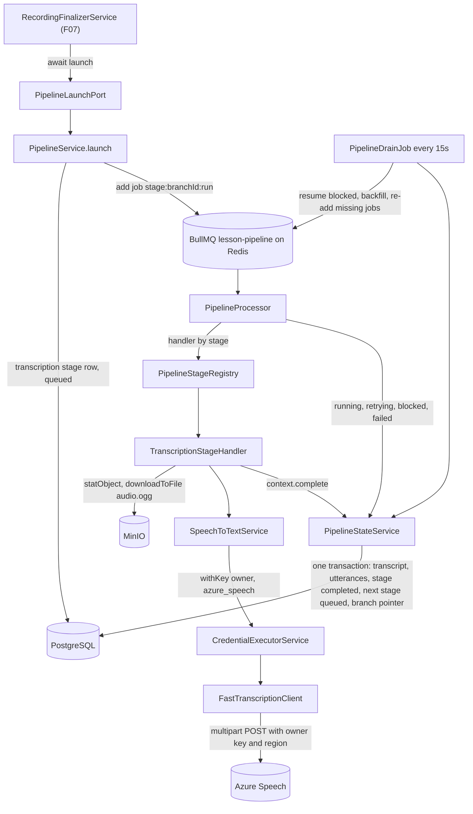
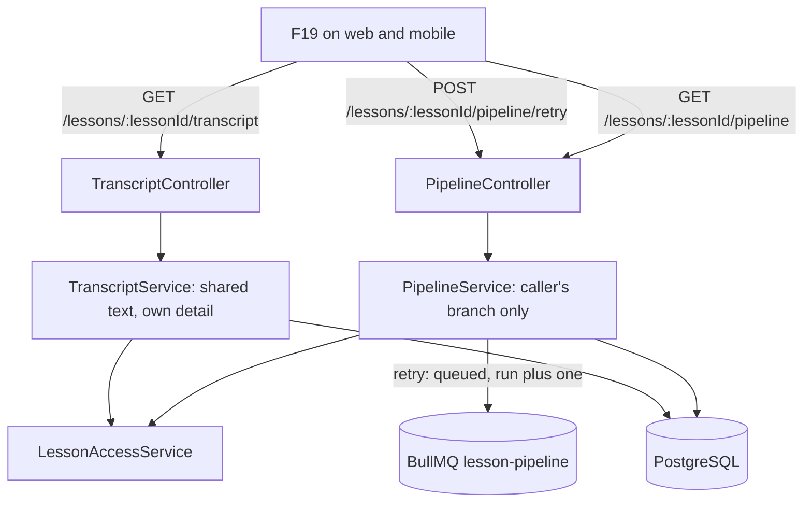
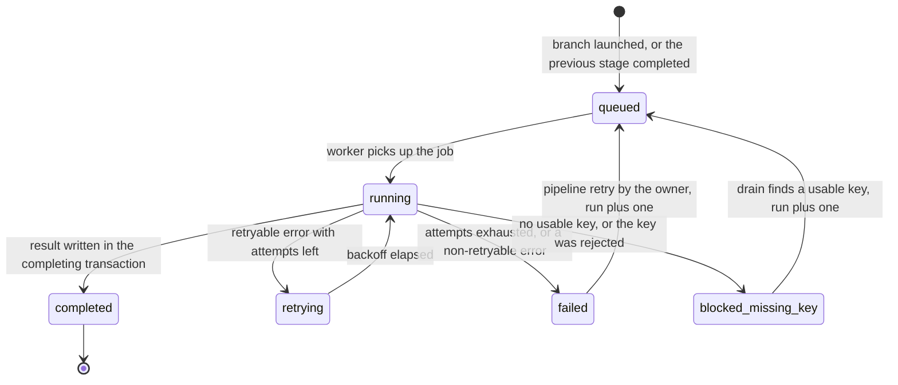

# Technical Specification: Speech-to-Text Transcription

## 1. Technical Overview

**What:** Every verified per-participant recording becomes a stored transcript. When F07's finalizer launches a branch, F08 writes a `transcription` stage row for it and adds one job to a Redis-backed BullMQ queue. The job downloads that participant's `audio.ogg` and sends it to Azure Speech fast transcription under that participant's own key and region. It then writes the returned phrases as ordered utterances in a single transaction: offsets in ms within the file, text, recognition confidence, and words with their timings. The same transaction advances the branch to `excerpt_selection`, where it waits for F09. A participant with no usable Azure key is parked in `blocked_missing_key` instead of failing, and a sweeper resumes them within 60 seconds of a usable key appearing. Transient service errors retry at 30 s, 2 min and 8 min. An authentication error marks the key invalid and blocks the stage without retrying.

Around that one stage, F08 builds the generic pipeline runner every later stage plugs into: stage rows, a handler registry, one queue, a drain-and-resume job, and caller-scoped status and retry routes. It also adds a merged transcript route that knows who is asking, and an internal single-clip transcription capability for F18.

**Why:** F08 is the first stage that runs on a user's own provider key after the lesson. It is also the first that has to survive hours of waiting (a missing key, a quota window, a service outage) without losing the branch. F07 deliberately stopped at a `queued` branch row and a logging seam, so that the queue and its retry semantics would be decided here. They are decided once, generically. F09 to F15 each add a handler and a stage row instead of inventing their own job, blocked state and retry route, and F19 reads one status surface. The transcript is also the first artifact with two audiences. The conversation is shared, but the recognition confidence and word timings beneath it feed pronunciation assessment, which is private. So the read shape is split by owner.

**Scope — Included (the PRD gives F08 no Core/Full split, so the whole feature is in scope):**
- Transcription of each launched branch's `audio.ogg` with the owner's Azure Speech key and region. The recognition locale is configured per deployment.
- Ordered utterances per participant (lesson id, user id, index, start and end ms, text, recognition confidence, words with text, start and duration), with no diarization, because one track is one speaker.
- The merged chronological lesson transcript, exposed to every participant
- The Redis-backed queue with one job per lesson, participant and stage, and the 30 s / 2 min / 8 min retry schedule
- `blocked_missing_key` with automatic resume within 60 seconds of a usable key, the invalid-key path with no retry, the quota path, the unreadable-storage path, the no-speech path, and all-or-nothing writes
- The single-clip transcription capability F18 consumes (internal service, no route)

Also included, because it is this feature's own infrastructure:
- **The generic pipeline runner:** the `lesson_pipeline_stages` table, `PipelineStageRegistry`, the `lesson-pipeline` queue and its processor, `PipelineDrainJob`, and `GET /lessons/:lessonId/pipeline` and `POST /lessons/:lessonId/pipeline/retry`. *(The stage table, the queue library and the generic routes were decided in the spec interview.)*
- Replacing the default implementation of F07's `PipelineLaunchPort` with the real launch, and draining branches F07 left `queued`
- Widening F07's branch vocabularies (stage, status, failure code) in the database and in the shared contract
- Aligning the PRD's F08 Capabilities and F09 confidence rules with the fact that the provider returns confidence per phrase, not per word (see Assumptions)

**Scope — Excluded:**
- **Every client surface.** The `Transcribing` stage with its elapsed time, the `Blocked — add your Azure Speech key to continue.` state with its settings link, and the transcript in the lesson detail are rendered by F19 on both clients from the routes below. *(Decided in the spec interview. This follows F07's precedent, and `./design` has no lesson-detail mockup.)* Web and mobile ship nothing in F08.
- **Excerpt selection.** F08 leaves each completed branch at `excerpt_selection` / `queued`. F09 registers the handler that picks it up.
- **A fallback study plan for a failed transcription.** F15's fallback covers recording errors only (PRD F15, `docs/context.md` "Plano de estudos"). A blocked or failed transcription is recovered by a key or a retry.
- **A lesson-level processing status.** F19 derives it from the branches, as F07 decided.
- **Other participants' stage states.** Both routes are caller-scoped. The transcript's per-speaker status (`available`, `pending`, `unavailable`) is the only shared signal. Whether the status area shows other participants' stages is F19's decision.
- **Dart models for the new contracts.** No mobile code consumes them until F19, which adds them in its own change.
- **Live captions.** Already recorded as `dropped` in `design/README.md`.

**PRD traceability:**

| PRD block | Where it lands |
|---|---|
| Consumes (F02 key and region, F07 object key and timings) | Scope; Internal contracts; `PipelineLaunchPort` |
| Provides (utterances for F09/F11/F19; clip capability for F18) | Data Model; `GET /lessons/:lessonId/transcript`; `SpeechToTextService` |
| Capabilities | Assumptions; Data Model; Technical Decisions |
| Experience | Pipeline view (`startedAt`, `serverTime`, blocked reason, `blockedProvider`); transcript readable before later stages finish |
| Error Handling | Reason codes table; stage state diagram |
| Section 9, F08 | Testing Strategy, acceptance mapping |
| Section 9, Cross-Feature (F07→F08, F02→F08, F08→F09/F18) | Testing Strategy, cross-feature table |

**Assumptions and decisions not answered by the PRD:**

| Assumption | Rationale |
|---|---|
| Azure Speech **fast transcription** (`POST https://{region}.api.cognitive.microsoft.com/speechtotext/transcriptions:transcribe?api-version=2025-10-15`, multipart `audio` + `definition`) transcribes the whole `audio.ogg` in one synchronous request. *(Decided in the spec interview.)* | It runs faster than real time, which is the only way to meet the criterion "a 60-minute track completes transcription within 10 minutes". It accepts Ogg/Opus directly, so there is no decode step, and it is a plain `fetch` like F02's `AzureSpeechValidator`, with no SDK. Batch transcription needs the audio at a URL Azure can fetch, which a local MinIO is not. The real-time SDK processes at roughly 1× speed, and parallel chunks would hit the free tier's single-concurrent-request limit. The regional host is built from the region the vault already stores. Stage 5 confirms it live against the user's own resource. |
| **Words carry `confidence: null`.** Each utterance carries the phrase's recognition confidence. *(Decided in the spec interview.)* | Fast transcription reports confidence per phrase only. Writing the phrase value onto every word would make F09's word-level thresholds look measured when they are not. F09 reads utterance confidence wherever word confidence is null. The PRD's F08 sentence ("words each with … confidence") and F09's two confidence rules are aligned with this in Stage 1. |
| One Azure phrase is one utterance. Phrases whose text is empty after trimming are dropped. `idx` is 0-based in offset order. Text is stored as returned, in display form, so punctuation stays attached to words (for example `afternoon.`). | Phrases are the service's own sentence segmentation, and they carry the timing F09's 3–30 s window applies to. F09 normalizes tokens for its filler rule. |
| The request `definition` sends `locales: [TRANSCRIPTION_LOCALE]` and `profanityFilterMode: "None"`, and sends no `diarization`, no `channels` and no `phraseList`. | F11 quotes errors verbatim, and the default `Masked` mode replaces words with asterisks. Diarization is never needed, because one track is one speaker. A phrase list built from the role card's target expressions would bias recognition toward the words the learner was supposed to say, hiding the mispronunciations F09 exists to find. |
| `TRANSCRIPTION_LOCALE` (default `en-US`) is an environment variable, and each transcript stores the locale it used | The PRD's "configurable per deployment". Storing it keeps old transcripts interpretable after a change |
| The stage model is a **`lesson_pipeline_stages` row per branch per stage**. The branch's `stage` / `status` stays as the "where it is now" pointer and is written in the same transaction. *(Decided in the spec interview.)* | F19 must show every stage's state, duration, reason and retry, and the F08 Experience asks for the active stage's elapsed time. The duration of a completed stage has nowhere to live on a single pointer row. |
| The queue is **BullMQ through `@nestjs/bullmq`**: one queue `lesson-pipeline` on Redis database `0` (the application's), with the default `bull:` key prefix. Job id is `{stage}-{branchId}-{run}` (BullMQ refuses `:` in custom ids; corrected during implementation), and the payload is `{ branchId, stage, run }` only. *(Decided in the spec interview.)* | The PRD names a Redis-backed queue with backoff, and `.env.example` reserved Redis "for the job queues, from F08 onward". Postgres stays the source of truth: the job only says "run this stage for this branch", and everything else is read fresh from the database, so a delayed retry never acts on stale data. The deterministic id makes enqueueing idempotent. Redis already runs with `appendonly`, so delayed jobs survive a container restart. |
| The worker runs inside the API process with concurrency 4 | 4 is the supported participant ceiling (F05), so one lesson's branches all run at once. The work is one outbound HTTP request per job. |
| Each stage handler registers its own retry policy. Transcription gets 4 attempts (1 + 3 retries) with delays of 30 s, 120 s and 480 s. Credential, authentication, storage, rejected-audio, unsupported-region and no-speech outcomes are never retried automatically. | This is the PRD's schedule. *(Implementation note: the processor schedules each retry itself — it marks the stage `retrying` and moves the same job to delayed with the stage's own delay — rather than using BullMQ's `attempts`/`backoff`, so the schedule comes from the injected registry the integration suites can shorten. Non-retryable outcomes are recorded and the job returns normally, so no `UnrecoverableError` is needed.)* F11 has a different one (1, 5 and 15 minutes), so the policy belongs to the stage, not to the queue. |
| A **blocked stage is resumed by `PipelineDrainJob` every 15 s.** A `blocked_missing_key` row goes back to `queued` with `run + 1` once its user has a credential for the blocked provider with status `valid` or `unverified`. | This covers a key saved from either client and a key the daily revalidation re-enables, without coupling the credentials module to the pipeline. 15 s plus pickup is well inside the 60-second criterion. |
| Blocked reasons are `credential_missing` (no stored key), `credential_rejected` (the stored key is `invalid`, or the provider answered 401/403 during this call), and `credential_unreadable` (`CRED003`). The provider's message is kept on the stage row, scrubbed of the key. | The PRD shows a different sentence for a missing key and for a rejected one. `CredentialExecutorService.withKey` already marks the key `invalid` on a 401/403, and the typed error carries the HTTP status so that detection fires. |
| Failure codes beyond the three the PRD pins: `transcription_service_error` (5xx, network or timeout after the last retry), `transcription_audio_rejected` (400/413/415/422), `transcription_region_unsupported` (404), and `internal_error` (anything unclassified, after the last retry) | The PRD pins the quota, storage and no-speech sentences. The others still need a truthful reason the user can act on. A 404 from a region without fast transcription is the one BYOK-specific failure a new key fixes. |
| The audio is downloaded **before** `withKey`. A missing object and an unreachable store both fail the stage at once with `Recording could not be read from storage.` and no automatic retry. | The PRD says the job "fails immediately … and offers retry". Downloading outside `withKey` keeps a storage fault from being audited as a provider error against the user's key. |
| The transcript is written in **one transaction**. It deletes any earlier transcript for that lesson and user, inserts the transcript and its utterances, marks the stage `completed`, creates or resets the next stage row, and moves the branch pointer. It commits only if the stage row is still `running` with the job's `run`. | "A partial transcript is never persisted and the retry starts clean". The `run` guard also makes a stalled job that BullMQ re-delivers commit nothing the second time. |
| Zero utterances after dropping empty phrases gives `transcription_no_speech`, which is not retried automatically. The PRD's "for a track longer than 3 minutes" always holds, because F07 launches only branches with at least 180 s captured. | The provider's answer for the same audio is deterministic, so retrying automatically would just spend quota. A manual retry is still offered. |
| Completing transcription advances the branch to `excerpt_selection` / `queued` and creates that stage row. With no handler registered, the row waits, and F09's handler is picked up by the drain. | This replaces F07's one-logging-seam-per-stage pattern. The next feature only registers a handler and never edits this one. |
| F07's `PipelineLaunchPort.launch` becomes async and delegates to `PipelineService.launch`, which F07's finalizer awaits before `markBranchLaunched`. **It never throws** *(corrected during implementation)*: the stage row is created if absent and the job added; any failure is logged and recovered by the drain | By the time the launch runs, F07 has already deleted the participant's segment objects. A throw would send the lesson back through assembly, where the good recording would read as `recording_missing` and could not be retried back. The drain's backfill and job check recover a failed launch within one tick instead |
| The drain also creates the stage row for every **launched** branch (`launched_at` set, status `queued`, at `recording` or `transcription`) that has none. These are branches recorded before F08 shipped, and any launch whose own write failed. F07's code leaves a verified branch at `recording`/`queued`, not the `transcription`/`queued` its spec describes. The drain re-adds the job for a pending row whose job is missing or `completed`. **But a row whose job `failed` while the row was `running`/`retrying` is failed as `internal_error` instead of re-run** *(both corrected during implementation)* | Keying on `launched_at` also keeps the drain off a branch whose launch is still in flight. A job that dies mid-run means the runner could not record an outcome, and re-running it automatically would repeat the provider call on every tick |
| There is no progress percentage. The stage view carries `startedAt`, `lastAttemptAt`, `nextAttemptAt` and `attempts`, and the response carries `serverTime`. *(Follows from the interview's API choice.)* | One synchronous request has no honest intermediate progress. `serverTime` lets clients render elapsed time without trusting the device clock |
| Each attempt has a 10-minute HTTP timeout. A timeout counts as a transient error. | This is the PRD's throughput budget for a 60-minute track. An attempt that takes longer has already failed the target. |
| The merged transcript reports times in ms **relative to the lesson's `started_at`**: `(participant.recording_started_at − lesson.started_at) + start_ms`. It is ordered by that value, then by user id, then by `idx`. | Each file's second 0 is its participant's first segment (F07), so raw offsets from two files are not comparable. The lesson's start is the one clock every speaker shares. |
| Other participants' utterances carry id, speaker, times and text only. The caller's own also carry `confidence` and `words`. *(Decided in the spec interview.)* | The conversation is shared (PRD F11, F19). Recognition confidence and word timing are the raw material of pronunciation selection, which is private. |
| The pipeline view and the retry route are **caller-scoped**, like F07's recording view. The retry covers stages from `transcription` onward. A branch failed at `recording` gets `PIPE002`, which names F07's route. *(The generic routes were decided in the spec interview.)* | Every figure a response carries belongs to its caller. Recording retry is lesson-wide, because it uses no credentials, while stage retry runs on the caller's key and so can only be the caller's. |
| The pipeline view's `recording` entry is derived from F07's branch and lesson columns, not stored as a stage row | F07 owns recording state, and a second copy would drift the first time one side changed |
| Words are stored as JSONB on the utterance row | They are always read with their utterance and never queried on their own. A 60-minute track holds roughly 8,000–10,000 words |
| Each transcript stores provider, API version, locale, reported audio duration and provider latency | This parallels "every generated artifact stores the prompt id and version". Comparing results across API versions needs to know which one produced them, and latency is the evidence for the 10-minute target |
| Credential usage is audited as `F08_lesson_transcription`. The clip capability takes the caller's label (F18 passes its own) | This follows `F04_${promptId}`. The audit row names the feature that spent the user's quota |
| No new design token, no screen, no design reference change | No client surface is built (see Excluded) |

## 2. Architecture Impact

**Affected components:**

| Area | Path |
|---|---|
| Shared contracts | `packages/shared/src/schemas/pipeline.ts`, `packages/shared/src/schemas/transcript.ts`, `packages/shared/src/schemas/recording.ts`, `packages/shared/src/errors/codes.ts`, `packages/shared/src/index.ts` |
| API — pipeline runner | `apps/api/src/pipeline/**` |
| API — Azure speech | `apps/api/src/speech/**` |
| API — transcription stage and transcript read | `apps/api/src/transcription/**` |
| API — recording hand-off | `apps/api/src/recording/pipeline-launch.port.ts`, `recording-finalizer.service.ts`, `recording.module.ts`, `recording.service.ts` |
| API — wiring, config, errors, docs | `apps/api/src/app.module.ts`, `apps/api/src/config/env.ts`, `apps/api/src/common/app-error.ts`, `apps/api/src/openapi/components.ts`, `apps/api/src/openapi/setup.ts`, `apps/api/package.json` |
| Database | `apps/api/prisma/schema.prisma`, `apps/api/prisma/migrations/0008_speech_transcription/migration.sql` |
| Configuration and docs | `.env.example`, `docs/prd.md` (F08 Capabilities, F09 confidence rules), `docs/api/openapi.json` |

**Launch and execution:**



**Reads and retry:**



**Stage lifecycle (every stage from `transcription` onward):**



`attempts` counts handler executions across every run, and is never reset. `run` counts starts of the stage: the first launch, each resume from blocked and each manual retry. `startedAt` is the first attempt of the current run, so elapsed time restarts with a retry but not with a backoff wait.

## 3. Technical Decisions

| Decision | Chosen Approach | Alternative Considered | Trade-off |
|---|---|---|---|
| Azure API | Fast transcription, one synchronous multipart request per track | (a) Speech SDK real-time continuous recognition over decoded PCM. (b) Batch transcription | Confidence is per phrase only, and there is no intermediate progress. Accepted because (a) runs at about 1× real time, missing the 10-minute criterion unless chunked in parallel, which the free tier's concurrency of 1 forbids. (b) needs an Azure-reachable audio URL, which the local-only stack cannot provide |
| Where stage state lives | A `lesson_pipeline_stages` row per branch per stage, plus the branch's existing pointer | Timing and attempt columns added to `lesson_pipeline_branches` | One more table, and a pointer written alongside it. Accepted because only per-stage rows can give F19 each stage's duration, and later stages add a row instead of more columns |
| How work runs | BullMQ via `@nestjs/bullmq`, with Postgres as the source of truth and the job carrying only ids | Extending F07's `@Interval`-over-Postgres pattern with `next_attempt_at` and leases | Two new dependencies and state split across two stores. Accepted because the PRD names a Redis-backed queue, and delays, retries, concurrency and stalled-job recovery are what BullMQ already does. The drain job closes the gap between the two stores |
| How later stages plug in | A generic `PipelineProcessor` that looks handlers up in `PipelineStageRegistry`. The handler owns only its work and hands its writes to `context.complete` | One seam per stage, as F07 did (`ExcerptSelectionLaunchPort`, …), each feature bringing its own job and retry route | F08 carries more infrastructure than its one stage needs. Accepted because every stage from F08 to F15 needs the same blocked, retry, backoff and status machinery. Written once, F19 gets one uniform status surface and one retry button |
| Resuming a blocked stage | A 15-second drain job checks the blocked provider's credential status | `CredentialsService.save` calls into the pipeline directly | Up to 15 s of extra latency. Accepted because the job also catches a key re-enabled by the daily revalidation, survives a restart, and keeps the credentials module free of pipeline knowledge |
| What the shared transcript reveals | Text and timing for everyone. Confidence and word timings only on the caller's own utterances | Every utterance with full detail | Two utterance shapes in one response. Accepted because recognition confidence is what pronunciation selection runs on, and pronunciation data is private |
| Storing words | JSONB array on the utterance | A `lesson_utterance_words` table | Words cannot be indexed individually. Accepted because nothing reads a word without its utterance, and a 60-minute track would otherwise be about 10,000 rows per participant per lesson |

## 4. Component Overview

**Shared:**

| File Path | New/Modified | Purpose | Key Responsibilities |
|---|---|---|---|
| `packages/shared/src/schemas/pipeline.ts` | New | The pipeline contract | `pipelineStageSchema` (`recording`, `transcription`, `excerpt_selection`), `pipelineStageStatusSchema`, `blockedReasonCodeSchema`, `transcriptionFailureCodeSchema`, `pipelineReasonCodeSchema`, `pipelineStageViewSchema`, `lessonPipelineViewSchema` |
| `packages/shared/src/schemas/transcript.ts` | New | The transcript contract | `transcriptWordSchema`, `transcriptUtteranceSchema` (`confidence` and `words` optional, present only on the caller's own), `transcriptSpeakerSchema`, `lessonTranscriptViewSchema` |
| `packages/shared/src/schemas/recording.ts` | Modified | Branch vocabulary | `pipelineBranchStageSchema` and `pipelineBranchStatusSchema` widened. `pipelineBranchViewSchema.failureCode` accepts recording and transcription codes |
| `packages/shared/src/errors/codes.ts` | Modified | Error vocabulary | Adds `PIPE001` and `PIPE002` with statuses and messages |
| `packages/shared/src/index.ts` | Modified | Barrel | Re-exports the new schemas and types |

**Backend — pipeline runner (`apps/api/src/pipeline/`):**

| File Path | New/Modified | Purpose | Key Responsibilities |
|---|---|---|---|
| `pipeline.module.ts` | New | Wiring | Registers the `lesson-pipeline` queue, the processor, the registry, the state, queue, drain and access services, and the controller. Exports `PipelineService`, `PipelineStageRegistry`, `PipelineStateService` and `LessonAccessService` |
| `pipeline.constants.ts` | New | Fixed values | Queue name, stage order, worker concurrency, drain interval, job id builder, and the job retention for completed and failed jobs |
| `pipeline-stage.handler.ts` | New | The handler contract | Handler interface (stage, credential provider, retry policy, `run(context)`), the run context (`branchId`, `lessonId`, `userId`, `run`, `attempt`, `complete(write)`), and the typed outcomes `StageBlockedError`, `StageRetryableError`, `StageFailedError` |
| `pipeline-stage.registry.ts` | New | Handler lookup | `register(handler)` at module init, `get(stage)`, `has(stage)`, and the retry policy per stage, which the backoff strategy reads. Provided through a token integration suites can override with millisecond delays |
| `pipeline-state.service.ts` | New | Owns every stage write | Creates or resets a stage row, `markRunning`, `markRetrying`, `markBlocked`, `markFailed`, `complete` (the guarded transaction that runs the handler's writes, completes the stage, queues the next one and moves the branch pointer), `resume`, `requeueForRetry` |
| `pipeline-queue.service.ts` | New | Queue access | `enqueue(branchId, stage, run)` with the deterministic job id, and `ensureJob`, which re-adds a job that is absent or terminal |
| `pipeline.processor.ts` | New | The worker | `@Processor('lesson-pipeline')` extending `WorkerHost` with concurrency 4. It loads the stage row, skips stale runs, calls the handler, maps typed outcomes to stage states, throws `UnrecoverableError` for non-retryable ones, and applies the stage's backoff |
| `pipeline-drain.job.ts` | New | Driver | `@Interval` every 15 s: backfill branches without a stage row, resume blocked rows whose provider key is now usable, and ensure every non-terminal row with a registered handler has a live job. One row failing never stops the sweep |
| `pipeline.service.ts` | New | Launch and route logic | `launch(payload)` (F07's hand-off), the caller-scoped pipeline view with the derived `recording` entry, and the retry rules |
| `pipeline.controller.ts` | New | HTTP surface | `GET /lessons/:lessonId/pipeline`, `POST /lessons/:lessonId/pipeline/retry`, with OpenAPI decorators |
| `lesson-access.service.ts` | New | Participant check | `requireParticipant(lessonId, userId)` returning the lesson, `CLASS004` for both unknown and foreign lessons (F05/F07 precedent). Shared by the pipeline and transcript services |

**Backend — Azure speech (`apps/api/src/speech/`):**

| File Path | New/Modified | Purpose | Key Responsibilities |
|---|---|---|---|
| `speech.module.ts` | New | Wiring | Provides the client and `SpeechToTextService`, and exports the service (F18 imports it). F10 adds pronunciation assessment here |
| `speech.constants.ts` | New | Fixed values | Fast transcription API version, request timeout, and the regional host template |
| `fast-transcription.client.ts` | New | The only place that calls fast transcription | Builds the regional URL, sends the multipart body from a file blob with the `Ocp-Apim-Subscription-Key` header and the `definition` described above, and applies the timeout. Maps HTTP outcomes to typed errors that carry the status, scrubbing the key from every message |
| `fast-transcription.response.ts` | New | Provider response contract | A Zod schema of the response, and the mapper from phrases to ordered utterances (ms offsets, `end = offset + duration`, empty phrases dropped, word confidence `null`). A response that fails the schema is a service error |
| `speech-errors.ts` | New | Typed failures | `SpeechAuthRejectedError` (status 401/403), `SpeechThrottledError`, `SpeechServiceError`, `SpeechAudioRejectedError`, `SpeechRegionUnsupportedError`, each with a scrubbed provider message |
| `speech-to-text.service.ts` | New | The capability | `transcribeFile(userId, filePath, feature)` returns utterances plus provenance. `transcribeClip(userId, filePath, feature)` returns text, confidence and words for F18. Both run inside `CredentialExecutorService.withKey(userId, 'azure_speech', feature, …)` |

**Backend — transcription stage (`apps/api/src/transcription/`):**

| File Path | New/Modified | Purpose | Key Responsibilities |
|---|---|---|---|
| `transcription.module.ts` | New | Wiring | Imports the pipeline, speech and storage modules, and registers the handler with the registry at module init |
| `transcription.constants.ts` | New | Fixed values | The retry policy, the credential-usage label, and the reason codes with their user-facing sentences |
| `transcription-stage.handler.ts` | New | The `transcription` stage | Reads the participant's verified object key, downloads it (a missing object or unreachable store fails at once), transcribes, maps provider and credential errors to blocked, retryable or failed outcomes, rejects an empty result, and hands the write to `context.complete`. Cleans up temporary files in every outcome |
| `transcript-writer.service.ts` | New | Transcript persistence | Inside the completing transaction: deletes an earlier transcript for that lesson and user, inserts the transcript with provenance and counts, and bulk-inserts the utterances |
| `transcript-merge.ts` | New | Pure rules | Shifts each participant's offsets to lesson time, orders the result, and projects confidence and words only for the caller |
| `transcript.service.ts` | New | Route logic | Builds the caller-aware merged view and each speaker's coarse status |
| `transcript.controller.ts` | New | HTTP surface | `GET /lessons/:lessonId/transcript`, with OpenAPI decorators |

**Backend — modified:**

| File Path | New/Modified | Purpose | Key Responsibilities |
|---|---|---|---|
| `apps/api/src/recording/pipeline-launch.port.ts` | Modified | F07's seam, now real | `launch` becomes async and delegates to `PipelineService.launch` |
| `apps/api/src/recording/recording-finalizer.service.ts` | Modified | Hand-off | Awaits `launch` before `markBranchLaunched` |
| `apps/api/src/recording/recording.module.ts` | Modified | Wiring | Imports `PipelineModule` |
| `apps/api/src/recording/recording.service.ts` | Modified | Recording view | Accepts the widened branch vocabulary. `retryable` stays recording-only |
| `apps/api/src/app.module.ts` | Modified | Root | `BullModule.forRootAsync` with a connection built from `REDIS_URL` and `maxRetriesPerRequest: null` (required by BullMQ workers), imports `TranscriptionModule` and `PipelineModule`. The async factory keeps OpenAPI preview generation free of any Redis connection |
| `apps/api/src/config/env.ts` | Modified | Environment contract | `TRANSCRIPTION_LOCALE`: a locale such as `en-US`, default `en-US` |
| `apps/api/src/common/app-error.ts` | Modified | Typed failures | `AppError.pipelineNotRetryable(stage, status)`, `AppError.pipelineRetryRecording(lessonId)` |
| `apps/api/src/openapi/components.ts`, `setup.ts` | Modified | Document | Registers `LessonPipelineView` and `LessonTranscriptView`, updates `LessonRecordingView`, adds the `pipeline` and `transcript` tags |
| `apps/api/package.json` | Modified | Dependencies | Adds `bullmq` and `@nestjs/bullmq` |

**Database:**

| Migration File | Tables Affected | Operation | Notes |
|---|---|---|---|
| `apps/api/prisma/migrations/0008_speech_transcription/migration.sql` | `lesson_pipeline_stages`, `lesson_transcripts`, `lesson_utterances` | CREATE | Stage rows, one transcript header per participant per lesson, ordered utterances |
| same | `lesson_pipeline_branches` | ALTER | Widens `ck_branches_stage`, `ck_branches_status` and `ck_branches_failure_code`. No column changes |

**Configuration and documentation:**

| File Path | New/Modified | Purpose | Key Responsibilities |
|---|---|---|---|
| `.env.example` | Modified | Environment template | Documents `TRANSCRIPTION_LOCALE`. `docker-compose.yml` is unchanged: the default is right in Docker, following F07's `EGRESS_S3_ENDPOINT` precedent |
| `docs/prd.md` | Modified | Product definition | F08 Capabilities: words carry timing, and confidence where the provider reports it. F09: the low-confidence exclusion and the confidence ranking use utterance confidence when word confidence is absent |
| `docs/api/openapi.json` | Regenerated | API document | After the routes land |

## 5. API Contracts

Authentication follows F01's two transports (`eq_session` cookie or `Authorization: Bearer`) through the global `SessionGuard`. Every route returns `CLASS004` for a lesson the caller did not take part in, and for an unknown id.

---

### Endpoint: Read the caller's pipeline

- **Method:** GET
- **Path:** `/lessons/:lessonId/pipeline`
- **Authentication:** Session cookie or bearer token

**Request:**

| Field | Type | Required | Validation | Description |
|---|---|---|---|---|
| `lessonId` | `uuid` | Yes | path param, valid UUID | The lesson |

**Response (200):**

| Field | Type | Description |
|---|---|---|
| `data.lessonId` | `uuid` | The lesson |
| `data.serverTime` | `string` | Server clock, for rendering elapsed time |
| `data.branch` | `object \| null` | `null` when the lesson produced no branch for the caller (`too_short`, not yet finalized) |
| `data.branch.stage` | `string` | Where the branch is now: `recording`, `transcription`, `excerpt_selection` |
| `data.branch.status` | `string` | The current stage's status |
| `data.branch.stages[]` | `array` | Every stage reached so far, in pipeline order |
| `…stages[].stage` | `string` | Stage name |
| `…stages[].status` | `string` | `queued`, `running`, `retrying`, `blocked_missing_key`, `failed`, `completed` |
| `…stages[].startedAt` | `string \| null` | First attempt of the current run. Elapsed time is `serverTime − startedAt` |
| `…stages[].finishedAt` | `string \| null` | Set for `completed` and `failed`. Duration is `finishedAt − startedAt` |
| `…stages[].lastAttemptAt` | `string \| null` | The PRD's "time of the last attempt" |
| `…stages[].nextAttemptAt` | `string \| null` | Set only while `retrying` |
| `…stages[].attempts` | `integer` | Executions across every run |
| `…stages[].reasonCode` | `string \| null` | For `blocked_missing_key` and `failed` (and the last error while `retrying`). Clients switch on this |
| `…stages[].reason` | `string \| null` | The user-facing sentence |
| `…stages[].providerMessage` | `string \| null` | The provider's own wording, scrubbed |
| `…stages[].blockedProvider` | `string \| null` | `azure_speech` or `gemini`, which is the settings entry the client links to |
| `…stages[].retryable` | `boolean` | Whether `POST …/pipeline/retry` would re-run it |

The `recording` entry is derived from F07's data: `completed` once the branch launched (`startedAt` = lesson start, `finishedAt` = `recording_finalized_at`), `failed` with F07's `failureCode` / `failureReason` when the branch failed at recording, and `running` while `verifying`. F07's `storage_unavailable` status shows as `failed` with reason code `storage_unavailable`. Retrying any `recording` failure is F07's route, so the entry is never `retryable` here.

**Response Example (the caller blocked on a missing key):**
```json
{
  "data": {
    "lessonId": "9f1c4d7e-3b2a-4f51-9d0c-7a6b5e4c3d21",
    "serverTime": "2026-09-24T15:20:31.000Z",
    "branch": {
      "stage": "transcription",
      "status": "blocked_missing_key",
      "stages": [
        {
          "stage": "recording",
          "status": "completed",
          "startedAt": "2026-09-24T14:10:03.000Z",
          "finishedAt": "2026-09-24T15:13:02.000Z",
          "lastAttemptAt": "2026-09-24T15:13:02.000Z",
          "nextAttemptAt": null,
          "attempts": 1,
          "reasonCode": null,
          "reason": null,
          "providerMessage": null,
          "blockedProvider": null,
          "retryable": false
        },
        {
          "stage": "transcription",
          "status": "blocked_missing_key",
          "startedAt": "2026-09-24T15:13:07.000Z",
          "finishedAt": null,
          "lastAttemptAt": "2026-09-24T15:13:07.000Z",
          "nextAttemptAt": null,
          "attempts": 1,
          "reasonCode": "credential_missing",
          "reason": "Blocked — add your Azure Speech key to continue.",
          "providerMessage": null,
          "blockedProvider": "azure_speech",
          "retryable": false
        }
      ]
    }
  }
}
```

**Error Codes:**

| Code | HTTP Status | Description |
|---|---|---|
| `CLASS004` | 403 | Not a participant, or unknown lesson |
| `VAL001` | 400 | `lessonId` is not a valid UUID |
| `AUTH003` | 401 | No valid session |

---

### Endpoint: Retry the caller's failed stage

- **Method:** POST
- **Path:** `/lessons/:lessonId/pipeline/retry`
- **Authentication:** Session cookie or bearer token

**Request:** no body. `lessonId` as above.

This route acts only on the caller's own branch. If its current stage is `failed` and has a registered handler, the stage goes back to `queued` with `run + 1`. Its reason fields, `startedAt` and `finishedAt` are cleared, `attempts` is kept, the branch pointer and its `failure_code` follow, and the job is added. Downstream stages re-run as the branch advances, while upstream results are reused (PRD F19). A `blocked_missing_key` stage is not retryable: it resumes by itself when a key is saved.

**Response (202):** the caller's pipeline view, same shape as above, with the retried stage `queued`.

**Error Codes:**

| Code | HTTP Status | Description |
|---|---|---|
| `PIPE001` | 409 | Nothing to retry: no branch, or the current stage is not `failed`. `details.stage` and `details.status` carry the current state |
| `PIPE002` | 409 | The branch failed at `recording`. `details.retryRoute` is `/lessons/{lessonId}/recording/retry` |
| `CLASS004` | 403 | Not a participant |
| `VAL001` | 400 | `lessonId` is not a valid UUID |
| `AUTH003` | 401 | No valid session |

---

### Endpoint: Read the merged lesson transcript

- **Method:** GET
- **Path:** `/lessons/:lessonId/transcript`
- **Authentication:** Session cookie or bearer token

**Response (200):**

| Field | Type | Description |
|---|---|---|
| `data.lessonId` | `uuid` | The lesson |
| `data.lessonStartedAt` | `string \| null` | Time 0 of every `startMs` below |
| `data.speakers[]` | `array` | Every participant who got a branch, plus the caller |
| `…speakers[].userId` | `uuid` | Participant |
| `…speakers[].displayName` | `string` | Speaker label |
| `…speakers[].isMe` | `boolean` | The caller |
| `…speakers[].status` | `string` | `available` (transcript stored), `pending` (branch at or before transcription and not failed, blocked included), `unavailable` (failed at recording or transcription, or no branch). No reason is ever given for another participant |
| `data.utterances[]` | `array` | Every stored utterance of every participant, ordered by lesson time |
| `…utterances[].id` | `uuid` | Utterance id (F09 and F19 reference it) |
| `…utterances[].userId` | `uuid` | Speaker, by construction the track's owner |
| `…utterances[].startMs` / `endMs` | `integer` | Milliseconds from `lessonStartedAt` |
| `…utterances[].text` | `string` | What was said, as recognized |
| `…utterances[].confidence` | `number \| null` | **Caller's own utterances only**, and the key is absent otherwise |
| `…utterances[].words[]` | `array` | **Caller's own utterances only**: `text`, `startMs` (lesson time), `durationMs`, `confidence` (`null` from fast transcription) |

**Response Example (read by Miguel; Ana's detail withheld):**
```json
{
  "data": {
    "lessonId": "9f1c4d7e-3b2a-4f51-9d0c-7a6b5e4c3d21",
    "lessonStartedAt": "2026-09-24T14:10:03.000Z",
    "speakers": [
      { "userId": "3f8b1a20-5c6d-4e7f-8a91-2b3c4d5e6f70", "displayName": "Miguel", "isMe": true, "status": "available" },
      { "userId": "b21e9a44-7f30-4c18-9e55-1d2c3b4a5e6f", "displayName": "Ana", "isMe": false, "status": "available" }
    ],
    "utterances": [
      {
        "id": "0c2d4e6f-8a1b-4c3d-9e5f-7a6b5c4d3e21",
        "userId": "3f8b1a20-5c6d-4e7f-8a91-2b3c4d5e6f70",
        "startMs": 4120,
        "endMs": 7480,
        "text": "I'd like to change my flight to Thursday.",
        "confidence": 0.9123,
        "words": [
          { "text": "I'd", "startMs": 4120, "durationMs": 240, "confidence": null },
          { "text": "like", "startMs": 4360, "durationMs": 200, "confidence": null }
        ]
      },
      {
        "id": "5e7f9a1b-2c3d-4e5f-8a9b-0c1d2e3f4a5b",
        "userId": "b21e9a44-7f30-4c18-9e55-1d2c3b4a5e6f",
        "startMs": 8010,
        "endMs": 10950,
        "text": "Unfortunately that fare can't be changed."
      }
    ]
  }
}
```
(The `words` array is abbreviated.)

**Error Codes:**

| Code | HTTP Status | Description |
|---|---|---|
| `CLASS004` | 403 | Not a participant, or unknown lesson |
| `VAL001` | 400 | `lessonId` is not a valid UUID |
| `AUTH003` | 401 | No valid session |

---

### Endpoint: Read a lesson's recording (modified)

`GET /lessons/:lessonId/recording` and its retry are unchanged in behaviour. `data.mine.branch.stage`, `.status` and `.failureCode` now use the widened vocabularies, so a branch that moved on to transcription reads truthfully there too. `retryable` still refers only to F07's recording retry.

---

### Internal contracts

| Contract | Shape | Used by |
|---|---|---|
| `PipelineLaunchPort.launch` (async) | `lessonId`, `userId`, `audioObjectKey`, `recordingStartedAt`, `audioDurationMs`, `capturedMs` → creates the `transcription` stage row and adds its job | F07's finalizer |
| Stage handler | `stage`, `provider` (`azure_speech` / `gemini` / none), `retryPolicy` (`attempts`, `delaysMs[]`), `run(context)`. It throws `StageBlockedError(reasonCode, reason, providerMessage?)`, `StageRetryableError(…)` or `StageFailedError(…)`, and calls `context.complete(write)` to commit | F08; F09–F15 register theirs |
| Job payload | `{ branchId, stage, run }`, job id `{stage}-{branchId}-{run}` | Queue and processor |
| `SpeechToTextService.transcribeFile` | `(userId, filePath, feature)` → `{ utterances[{ startMs, endMs, text, confidence, words[{ text, startMs, durationMs, confidence }] }], audioDurationMs, apiVersion, locale, latencyMs }` | F08; F10 if it re-transcribes |
| `SpeechToTextService.transcribeClip` | `(userId, filePath, feature)` → `{ text, confidence, words[] }` (phrases joined) | F18 open response |
| Errors from both | `CRED002` / `CRED003` (`AppError`, from the vault), `SpeechAuthRejectedError`, `SpeechThrottledError`, `SpeechServiceError`, `SpeechAudioRejectedError`, `SpeechRegionUnsupportedError` | Each caller maps them to its own outcome |

**Fast transcription request** (`FastTranscriptionClient`): `POST https://{region}.api.cognitive.microsoft.com/speechtotext/transcriptions:transcribe?api-version=2025-10-15`, header `Ocp-Apim-Subscription-Key: <owner's key>`, multipart form with `audio` (the file, `audio/ogg`) and `definition` = `{"locales":["<TRANSCRIPTION_LOCALE>"],"profanityFilterMode":"None"}`. Timeout 10 minutes.

**HTTP outcome → typed error → stage outcome:**

| Provider outcome | Typed error | Stage outcome |
|---|---|---|
| 200 with phrases | — | `completed` (or `failed` / `transcription_no_speech` when none has text) |
| 200 failing the response schema | `SpeechServiceError` | retry, then `failed` / `transcription_service_error` |
| 401, 403 | `SpeechAuthRejectedError` (`status` set, so the vault marks the key `invalid`) | `blocked_missing_key` / `credential_rejected`, no retry |
| 429 | `SpeechThrottledError` | retry, then `failed` / `transcription_quota_exceeded` |
| 5xx, network error, timeout | `SpeechServiceError` | retry, then `failed` / `transcription_service_error` |
| 400, 413, 415, 422 | `SpeechAudioRejectedError` | `failed` / `transcription_audio_rejected`, no retry |
| 404 | `SpeechRegionUnsupportedError` | `failed` / `transcription_region_unsupported`, no retry |
| `CRED002` (no row) | — | `blocked_missing_key` / `credential_missing` |
| `CRED002` (row `invalid`) | — | `blocked_missing_key` / `credential_rejected` |
| `CRED003` | — | `blocked_missing_key` / `credential_unreadable` |
| Object missing, or `StorageUnavailableError` | — | `failed` / `transcription_storage_unreadable`, no retry |

## 6. Data Model

### Table: `lesson_pipeline_stages`

| Column | Type | Nullable | Default | Description |
|---|---|---|---|---|
| `id` | `uuid` | No | `gen_random_uuid()` | Primary key |
| `branch_id` | `uuid` | No | - | The participant's branch |
| `stage` | `varchar(24)` | No | - | `transcription`, `excerpt_selection`, widened by later stages |
| `status` | `varchar(24)` | No | `'queued'` | See the state diagram |
| `run` | `smallint` | No | `1` | Starts of this stage (launch, resume, manual retry); part of the job id |
| `attempts` | `smallint` | No | `0` | Handler executions across all runs |
| `queued_at` | `timestamptz` | No | `now()` | When the current run was queued |
| `started_at` | `timestamptz` | Yes | - | First attempt of the current run |
| `last_attempt_at` | `timestamptz` | Yes | - | Latest attempt |
| `next_attempt_at` | `timestamptz` | Yes | - | Scheduled retry, only while `retrying` |
| `finished_at` | `timestamptz` | Yes | - | Set for `completed` and `failed` |
| `reason_code` | `varchar(40)` | Yes | - | See the reason table |
| `reason` | `varchar(200)` | Yes | - | User-facing sentence |
| `provider_message` | `varchar(500)` | Yes | - | Provider's own wording, scrubbed of the key |
| `blocked_provider` | `varchar(32)` | Yes | - | `azure_speech` or `gemini`, only while blocked |
| `created_at` | `timestamptz` | No | `now()` | Audit |
| `updated_at` | `timestamptz` | No | `now()` | Audit |

### Table: `lesson_transcripts`

| Column | Type | Nullable | Default | Description |
|---|---|---|---|---|
| `id` | `uuid` | No | `gen_random_uuid()` | Primary key |
| `lesson_id` | `uuid` | No | - | Lesson |
| `user_id` | `uuid` | No | - | Owner of the track |
| `provider` | `varchar(40)` | No | - | `azure_fast_transcription` |
| `api_version` | `varchar(16)` | No | - | e.g. `2025-10-15` |
| `locale` | `varchar(16)` | No | - | `TRANSCRIPTION_LOCALE` at the time |
| `audio_duration_ms` | `integer` | Yes | - | Duration the provider reported |
| `latency_ms` | `integer` | No | - | Wall time of the successful request |
| `utterance_count` | `integer` | No | - | Always at least 1 |
| `word_count` | `integer` | No | - | Sum of word array lengths |
| `created_at` | `timestamptz` | No | `now()` | When the transcript was written |

### Table: `lesson_utterances`

| Column | Type | Nullable | Default | Description |
|---|---|---|---|---|
| `id` | `uuid` | No | `gen_random_uuid()` | Primary key |
| `transcript_id` | `uuid` | No | - | Owning transcript; a rewrite replaces them all |
| `lesson_id` | `uuid` | No | - | Denormalized for the merged read |
| `user_id` | `uuid` | No | - | Speaker; always the transcript's owner |
| `idx` | `integer` | No | - | 0-based order within the participant's track |
| `start_ms` | `integer` | No | - | Offset in the participant's `audio.ogg` (what F10 slices by) |
| `end_ms` | `integer` | No | - | Same |
| `text` | `text` | No | - | Recognized text, display form |
| `confidence` | `real` | Yes | - | Phrase recognition confidence, 0–1 |
| `words` | `jsonb` | No | - | `[{ "text", "startMs", "durationMs", "confidence" }]`, offsets in the file, `confidence` null from fast transcription |
| `created_at` | `timestamptz` | No | `now()` | Audit |

### Table: `lesson_pipeline_branches` (constraints widened, no column change)

| Constraint | New definition |
|---|---|
| `ck_branches_stage` | `stage IN ('recording','transcription','excerpt_selection')` |
| `ck_branches_status` | `status IN ('verifying','queued','running','retrying','blocked_missing_key','failed','storage_unavailable')` |
| `ck_branches_failure_code` | F07's four codes plus the transcription failure codes and `internal_error` |

The branch pointer mirrors its current stage row. `failed` copies the stage's `reason_code` / `reason` into `failure_code` / `failure_reason` (F07's `ck_branches_failure` still holds). `blocked_missing_key` leaves them null.

**Reason codes:**

| Code | Status | Reason (user-facing) | Retried automatically | `retryable` via route |
|---|---|---|---|---|
| `credential_missing` | `blocked_missing_key` | `Blocked — add your Azure Speech key to continue.` | — (resumes on a key) | No |
| `credential_rejected` | `blocked_missing_key` | `Your Azure Speech key was rejected. Update it in settings to resume.` | — (resumes on a key) | No |
| `credential_unreadable` | `blocked_missing_key` | `Your stored Azure Speech key could not be read. Enter it again in settings to resume.` | — (resumes on a key) | No |
| `transcription_quota_exceeded` | `failed` | `Azure Speech quota exceeded.` | Yes, 3 times | Yes |
| `transcription_service_error` | `failed` | `Azure Speech could not transcribe this recording.` | Yes, 3 times | Yes |
| `transcription_storage_unreadable` | `failed` | `Recording could not be read from storage.` | No | Yes |
| `transcription_no_speech` | `failed` | `No speech detected in this recording.` | No | Yes |
| `transcription_audio_rejected` | `failed` | `Azure Speech could not process this recording's audio.` | No | Yes |
| `transcription_region_unsupported` | `failed` | `Fast transcription is not available in your Azure Speech region.` | No | Yes |
| `internal_error` | `failed` | `Something went wrong while processing this stage.` | Yes, per stage policy | Yes |

The three `credential_*` sentences are this stage's wording. F11 stores its own Gemini wording under the same codes, since the reason text is stored per row.

**Indexes:**

| Index Name | Columns | Type | Purpose |
|---|---|---|---|
| `ux_stages_branch_stage` | `branch_id`, `stage` | unique btree | One row per stage per branch |
| `ix_stages_pending` | `status` where `status IN ('queued','running','retrying','blocked_missing_key')` | partial btree | The drain's scan |
| `ux_transcripts_lesson_user` | `lesson_id`, `user_id` | unique btree | One transcript per participant per lesson |
| `ux_utterances_lesson_user_idx` | `lesson_id`, `user_id`, `idx` | unique btree | Order within a track; also serves the merged read by lesson |
| `ix_utterances_transcript` | `transcript_id` | btree | Rewrite deletes |

**Constraints:**

| Constraint | Type | Definition | Purpose |
|---|---|---|---|
| `fk_stages_branch` | FOREIGN KEY | `branch_id REFERENCES lesson_pipeline_branches(id) ON DELETE CASCADE` | Stages go with their branch |
| `ck_stages_stage` | CHECK | `stage IN ('transcription','excerpt_selection')` | Vocabulary, widened by later stages |
| `ck_stages_status` | CHECK | `status IN ('queued','running','retrying','blocked_missing_key','failed','completed')` | Vocabulary |
| `ck_stages_reason` | CHECK | `(status IN ('failed','blocked_missing_key') AND reason_code IS NOT NULL) OR status = 'retrying' OR (status IN ('queued','running','completed') AND reason_code IS NULL)` | A failure or block always says why. A healthy stage carries no stale reason |
| `ck_stages_reason_code` | CHECK | `reason_code IS NULL OR reason_code IN (…the reason table…)` | Vocabulary |
| `ck_stages_blocked_provider` | CHECK | `(status = 'blocked_missing_key') = (blocked_provider IS NOT NULL) AND (blocked_provider IS NULL OR blocked_provider IN ('azure_speech','gemini'))` | The drain always knows which key to look for |
| `ck_stages_next_attempt` | CHECK | `(status = 'retrying') = (next_attempt_at IS NOT NULL)` | A retry is always scheduled |
| `ck_stages_finished` | CHECK | `(status IN ('completed','failed')) = (finished_at IS NOT NULL)` | Duration exists exactly for finished stages |
| `fk_transcripts_lesson` / `fk_transcripts_user` | FOREIGN KEY | `ON DELETE CASCADE` | Matches every per-user table |
| `ck_transcripts_counts` | CHECK | `utterance_count > 0 AND word_count >= 0` | An empty transcript is never stored; it fails the stage instead |
| `fk_utterances_transcript` | FOREIGN KEY | `transcript_id REFERENCES lesson_transcripts(id) ON DELETE CASCADE` | Rewrite by deleting the header |
| `fk_utterances_lesson` / `fk_utterances_user` | FOREIGN KEY | `ON DELETE CASCADE` | Same |
| `ck_utterances_timing` | CHECK | `start_ms >= 0 AND end_ms >= start_ms` | Offsets are well-formed |
| `ck_utterances_confidence` | CHECK | `confidence IS NULL OR (confidence >= 0 AND confidence <= 1)` | Range |
| `ck_utterances_words` | CHECK | `jsonb_typeof(words) = 'array'` | Shape at the storage boundary; element shape is validated by Zod before insert |

**Migration (`0008_speech_transcription/migration.sql`):**

```sql
-- F08 Speech-to-Text Transcription: the generic per-stage pipeline state
-- every stage from transcription onward writes, and the per-participant
-- transcript. F07's branch vocabularies widen here; no existing column
-- changes, so branches written by F07 stay valid.

ALTER TABLE lesson_pipeline_branches
    DROP CONSTRAINT ck_branches_stage,
    DROP CONSTRAINT ck_branches_status,
    DROP CONSTRAINT ck_branches_failure_code;

ALTER TABLE lesson_pipeline_branches
    ADD CONSTRAINT ck_branches_stage CHECK (stage IN
        ('recording','transcription','excerpt_selection')),
    ADD CONSTRAINT ck_branches_status CHECK (status IN
        ('verifying','queued','running','retrying','blocked_missing_key','failed','storage_unavailable')),
    ADD CONSTRAINT ck_branches_failure_code CHECK (failure_code IS NULL OR failure_code IN
        ('recording_failed_to_start','recording_missing','recording_too_short','recording_assembly_failed',
         'transcription_quota_exceeded','transcription_service_error','transcription_storage_unreadable',
         'transcription_no_speech','transcription_audio_rejected','transcription_region_unsupported',
         'internal_error'));

CREATE TABLE lesson_pipeline_stages (
    id               UUID PRIMARY KEY DEFAULT gen_random_uuid(),
    branch_id        UUID         NOT NULL REFERENCES lesson_pipeline_branches(id) ON DELETE CASCADE,
    stage            VARCHAR(24)  NOT NULL,
    status           VARCHAR(24)  NOT NULL DEFAULT 'queued',
    run              SMALLINT     NOT NULL DEFAULT 1,
    attempts         SMALLINT     NOT NULL DEFAULT 0,
    queued_at        TIMESTAMPTZ  NOT NULL DEFAULT NOW(),
    started_at       TIMESTAMPTZ,
    last_attempt_at  TIMESTAMPTZ,
    next_attempt_at  TIMESTAMPTZ,
    finished_at      TIMESTAMPTZ,
    reason_code      VARCHAR(40),
    reason           VARCHAR(200),
    provider_message VARCHAR(500),
    blocked_provider VARCHAR(32),
    created_at       TIMESTAMPTZ  NOT NULL DEFAULT NOW(),
    updated_at       TIMESTAMPTZ  NOT NULL DEFAULT NOW(),
    CONSTRAINT ck_stages_stage  CHECK (stage IN ('transcription','excerpt_selection')),
    CONSTRAINT ck_stages_status CHECK (status IN
        ('queued','running','retrying','blocked_missing_key','failed','completed')),
    CONSTRAINT ck_stages_reason CHECK (
        (status IN ('failed','blocked_missing_key') AND reason_code IS NOT NULL)
        OR status = 'retrying'
        OR (status IN ('queued','running','completed') AND reason_code IS NULL)),
    CONSTRAINT ck_stages_reason_code CHECK (reason_code IS NULL OR reason_code IN
        ('credential_missing','credential_rejected','credential_unreadable',
         'transcription_quota_exceeded','transcription_service_error','transcription_storage_unreadable',
         'transcription_no_speech','transcription_audio_rejected','transcription_region_unsupported',
         'internal_error')),
    CONSTRAINT ck_stages_blocked_provider CHECK (
        (status = 'blocked_missing_key') = (blocked_provider IS NOT NULL)
        AND (blocked_provider IS NULL OR blocked_provider IN ('azure_speech','gemini'))),
    CONSTRAINT ck_stages_next_attempt CHECK ((status = 'retrying') = (next_attempt_at IS NOT NULL)),
    CONSTRAINT ck_stages_finished CHECK ((status IN ('completed','failed')) = (finished_at IS NOT NULL))
);

CREATE UNIQUE INDEX ux_stages_branch_stage ON lesson_pipeline_stages (branch_id, stage);
CREATE INDEX ix_stages_pending ON lesson_pipeline_stages (status)
    WHERE status IN ('queued','running','retrying','blocked_missing_key');

CREATE TABLE lesson_transcripts (
    id                UUID PRIMARY KEY DEFAULT gen_random_uuid(),
    lesson_id         UUID         NOT NULL REFERENCES lessons(id) ON DELETE CASCADE,
    user_id           UUID         NOT NULL REFERENCES users(id)   ON DELETE CASCADE,
    provider          VARCHAR(40)  NOT NULL,
    api_version       VARCHAR(16)  NOT NULL,
    locale            VARCHAR(16)  NOT NULL,
    audio_duration_ms INTEGER,
    latency_ms        INTEGER      NOT NULL,
    utterance_count   INTEGER      NOT NULL,
    word_count        INTEGER      NOT NULL,
    created_at        TIMESTAMPTZ  NOT NULL DEFAULT NOW(),
    CONSTRAINT ck_transcripts_counts CHECK (utterance_count > 0 AND word_count >= 0)
);

CREATE UNIQUE INDEX ux_transcripts_lesson_user ON lesson_transcripts (lesson_id, user_id);

CREATE TABLE lesson_utterances (
    id            UUID PRIMARY KEY DEFAULT gen_random_uuid(),
    transcript_id UUID         NOT NULL REFERENCES lesson_transcripts(id) ON DELETE CASCADE,
    lesson_id     UUID         NOT NULL REFERENCES lessons(id) ON DELETE CASCADE,
    user_id       UUID         NOT NULL REFERENCES users(id)   ON DELETE CASCADE,
    idx           INTEGER      NOT NULL,
    start_ms      INTEGER      NOT NULL,
    end_ms        INTEGER      NOT NULL,
    text          TEXT         NOT NULL,
    confidence    REAL,
    words         JSONB        NOT NULL,
    created_at    TIMESTAMPTZ  NOT NULL DEFAULT NOW(),
    CONSTRAINT ck_utterances_timing CHECK (start_ms >= 0 AND end_ms >= start_ms),
    CONSTRAINT ck_utterances_confidence CHECK (confidence IS NULL OR (confidence >= 0 AND confidence <= 1)),
    CONSTRAINT ck_utterances_words CHECK (jsonb_typeof(words) = 'array')
);

CREATE UNIQUE INDEX ux_utterances_lesson_user_idx ON lesson_utterances (lesson_id, user_id, idx);
CREATE INDEX ix_utterances_transcript ON lesson_utterances (transcript_id);
```

`ix_stages_pending` is a partial index Prisma's DSL cannot express. As with F07's `ix_lessons_recording_pending`, it exists only in SQL and is documented with a `///` comment on the model.

**Notes for later features:**
- **F09** registers the `excerpt_selection` handler, and the drain picks up every branch already waiting there. It reads `lesson_utterances` for one owner. `confidence` is per utterance, and word `confidence` is null from fast transcription, so the low-confidence exclusion and the ranking use utterance confidence (PRD aligned in this feature). Excerpts that reference `lesson_utterances.id` should cascade on delete, because a transcription retry rewrites the utterances and re-runs every downstream stage. **Live finding (implementation, 2026-09-24):** against the user's real Azure resource, every phrase in a response carried the *same* confidence value (0.826 for all four phrases of a 17-second sample). The documentation's example shows the same pattern: one value per internal chunk, repeated across phrases. So utterance confidence barely separates the utterances within a stretch of speech. F09's spec has to pick another selection signal, or accept a coarse one.
- **F10** slices `audio.ogg` by `start_ms` / `end_ms` (file offsets, not lesson time). F10 adds its stage to `ck_stages_stage` / `ck_branches_stage`, and its codes to both reason vocabularies, in its own migration. Its handler declares `provider: 'azure_speech'` to get blocked and resumed for free.
- **F11** declares `provider: 'gemini'` and its own retry policy (1, 5 and 15 minutes). It reads other participants' utterances as context through the service layer, not through the caller-scoped route.
- **F18** calls `SpeechToTextService.transcribeClip` with its own feature label and applies its own 10-word minimum.
- **F19** renders `GET /lessons/:lessonId/pipeline` as the stepper, links `blockedProvider` to settings, shows `reason` / `providerMessage` and the retry button for `retryable`, and renders `GET /lessons/:lessonId/transcript`. It adds the Dart models for both views.

## 7. Testing Strategy

**Test File Structure:**

| Test File | Test Type | Target | Coverage Goal |
|---|---|---|---|
| `apps/api/test/unit/fast-transcription.client.spec.ts` | Unit (`fetch` stubbed) | Request shape and error mapping | 95% |
| `apps/api/test/unit/fast-transcription.response.spec.ts` | Unit | Phrases → utterances | 100% |
| `apps/api/test/unit/pipeline-backoff.spec.ts` | Unit | Retry policy and backoff strategy | 100% |
| `apps/api/test/unit/transcript-merge.spec.ts` | Unit | Lesson-time shift, order, per-caller projection | 100% |
| `apps/api/test/unit/env.spec.ts` | Unit (extend) | `TRANSCRIPTION_LOCALE` | — |
| `apps/api/test/integration/transcription-pipeline.spec.ts` | Integration (Postgres, Redis, MinIO, real worker) | Launch → job → transcript → advance | 90% |
| `apps/api/test/integration/pipeline-drain.spec.ts` | Integration | Backfill, resume, orphan recovery | 90% |
| `apps/api/test/integration/pipeline-routes.spec.ts` | Integration | Pipeline view and retry | 90% |
| `apps/api/test/integration/transcript-routes.spec.ts` | Integration | Merged transcript and its privacy | 90% |
| `apps/api/test/integration/speech-to-text.spec.ts` | Integration | Clip capability, key routing, audit | 85% |
| `apps/api/test/integration/recording-to-transcription.spec.ts` | Integration (MinIO, F07's real finalizer) | The hand-off, end to end. *(Implementation: a new file, because F07's finalization suite replaces the launch seam with a mock by design.)* | — |
| `apps/api/test/unit/openapi.spec.ts` | Unit (existing guard) | Snapshot freshness | — |

**Harness:**
- Azure is faked at the `FastTranscriptionClient` boundary (`test/integration/helpers/fake-speech.ts`), the same way F04 fakes Gemini at the SDK boundary, so `CredentialExecutorService`, the vault, invalid-key marking and credential-usage auditing all run for real.
- The fake records every call's key, region, definition and uploaded byte length, and returns a scripted sequence per key: responses, HTTP statuses, delays. That record is how the BYOK tests prove routing.
- The worker runs for real against the Testcontainers Redis. Integration suites override the retry-policy token with millisecond delays. `pipeline-backoff.spec.ts` pins the production 30 s / 120 s / 480 s.
- Audio objects are small Ogg/Opus fixtures generated with `ffmpeg-static` and uploaded to the MinIO container (`helpers/minio.ts`, `helpers/segment-fixtures.ts`). The bytes do not have to contain speech, because the fake decides what Azure "heard".
- Time-dependent drain rules take the job's `now`, following `LessonLifecycleJob`. A `waitForStage(branchId, status)` helper polls Postgres for the worker's asynchronous result.

**`apps/api/test/unit/fast-transcription.client.spec.ts`**

| Test Function | Description | Assertions |
|---|---|---|
| `posts_multipart_to_the_regional_endpoint` | Region `eastus2` | URL `https://eastus2.api.cognitive.microsoft.com/speechtotext/transcriptions:transcribe?api-version=2025-10-15`; `Ocp-Apim-Subscription-Key` header; form parts `audio` and `definition` |
| `sends_a_verbatim_single_speaker_definition` | Default locale | `locales: ["en-US"]`, `profanityFilterMode: "None"`, no `diarization`, `channels` or `phraseList` |
| `uses_the_configured_locale` | `TRANSCRIPTION_LOCALE=en-GB` | `locales: ["en-GB"]` |
| `maps_401_and_403_to_auth_rejected_with_status` | Provider JSON error body | `SpeechAuthRejectedError`, `status` 401/403, provider's human message |
| `maps_429_to_throttled` | 429 | `SpeechThrottledError` |
| `maps_5xx_network_and_timeout_to_service_error` | 503, a rejected `fetch`, a timeout | `SpeechServiceError` in each case |
| `maps_rejected_audio_statuses` | 400, 413, 415, 422 | `SpeechAudioRejectedError` |
| `maps_404_to_region_unsupported` | 404 | `SpeechRegionUnsupportedError` |
| `never_leaks_the_key_in_an_error` | Body echoing the key | No error message or provider message contains it |

**`apps/api/test/unit/fast-transcription.response.spec.ts`**

| Test Function | Description | Assertions |
|---|---|---|
| `maps_phrases_to_ordered_utterances` | Three phrases out of offset order | `idx` 0..2 by offset; `startMs = offsetMilliseconds`, `endMs = offset + duration` |
| `drops_phrases_with_no_text` | One phrase is whitespace | Not in the output |
| `words_carry_timing_and_null_confidence` | Phrase with words | Each word `text`, `startMs`, `durationMs`, `confidence: null` |
| `keeps_phrase_confidence_on_the_utterance` | `confidence` 0.9361 | Same value; absent confidence maps to `null` |
| `a_response_without_phrases_yields_no_utterances` | `phrases: []` | Empty list (the handler turns it into `transcription_no_speech`) |
| `rejects_a_malformed_response` | Missing `phrases` | `SpeechServiceError` |

**`apps/api/test/unit/pipeline-backoff.spec.ts`**

| Test Function | Description | Assertions |
|---|---|---|
| `transcription_backoff_is_30s_2m_8m` | Attempts made 1, 2, 3 (PRD criterion) | 30,000, 120,000 and 480,000 ms |
| `transcription_allows_three_retries` | Policy | 4 attempts in total |
| `the_backoff_reads_the_policy_of_the_jobs_stage` | Two stages with different policies | Each job gets its own stage's delays |

**`apps/api/test/unit/transcript-merge.spec.ts`**

| Test Function | Description | Assertions |
|---|---|---|
| `offsets_each_track_by_its_recording_start` | A starts at lesson +0 s, B at +40 s | B's `startMs` = 40,000 + file offset |
| `orders_by_lesson_time_then_speaker_then_index` | Interleaved and tied starts | Stable chronological order |
| `projects_detail_only_for_the_caller` | Caller A | A's utterances have `confidence` and `words`; B's have neither key |

**`apps/api/test/integration/transcription-pipeline.spec.ts`**

| Test Function | Description | Assertions |
|---|---|---|
| `each_track_is_transcribed_with_its_owners_key_and_region` | Two participants, different Azure keys and regions (PRD criterion) | One call per track; each call carried that track owner's key and region and that owner's audio length; no call carried the other's key |
| `stores_ordered_utterances_with_timings_confidence_and_words` | Fake returns phrases including an empty one (PRD criterion) | Utterances with `idx`, `start_ms`, `end_ms`, text, confidence and words; transcript row with provider, API version, locale, latency and counts |
| `every_utterance_belongs_to_the_track_owner_without_diarization` | PRD criterion | Every utterance's `user_id` is the branch owner; no request asked for diarization |
| `completion_advances_the_branch_to_excerpt_selection` | Successful run | Transcription `completed` with `started_at` and `finished_at`; `excerpt_selection` row `queued`; branch pointer `excerpt_selection` / `queued`; no job added for it (no handler) |
| `a_missing_key_blocks_rather_than_fails` | B has no Azure key (PRD criterion) | B `blocked_missing_key` / `credential_missing` with the PRD sentence and `blocked_provider = azure_speech`; no Azure call for B; A completes |
| `an_authentication_error_marks_the_key_invalid_and_does_not_retry` | Fake answers 401 (PRD criterion) | Exactly one call; the credential is `invalid`; stage `blocked_missing_key` / `credential_rejected`; provider message kept, key absent |
| `a_transient_error_retries_three_times_then_fails` | 503 four times (PRD criterion) | Four calls; the stage passes through `retrying` with `next_attempt_at`; ends `failed` / `transcription_service_error`, `attempts = 4` |
| `quota_errors_fail_with_quota_exceeded` | 429 four times (PRD Error Handling) | `failed` / `Azure Speech quota exceeded.`; branch `failure_code` mirrors it |
| `a_transient_error_that_recovers_completes` | 503 once, then 200 | `completed`, `attempts = 2` |
| `an_unreadable_recording_fails_immediately_without_retry` | Object deleted before the job (PRD Error Handling) | No Azure call; `failed` / `Recording could not be read from storage.`; no utterances; no retry scheduled |
| `a_track_with_no_speech_fails_with_no_speech_detected` | Fake returns no phrases (PRD criterion) | `failed` / `No speech detected in this recording.`; no transcript row; no `excerpt_selection` row |
| `a_failure_mid_write_persists_no_partial_transcript` | The writer throws after inserting part of the utterances (PRD Error Handling) | No transcript and no utterances persisted; the stage is not `completed`; the next attempt writes the full set once |
| `a_stale_run_commits_nothing` | The same job delivered twice, the second after the stage completed | One set of utterances; the second commit is refused by the run guard |
| `three_participants_transcribe_independently` | `LESSON_MAX_PARTICIPANTS=3`, one blocked | Two transcripts, one blocked branch, three keys, no pair-specific path |
| `records_credential_usage_per_owner` | Two owners, one without a key | `credential_usage` rows `F08_lesson_transcription`: `ok` for each owner who was transcribed, `blocked` for the one without a key, every row under its own user |

**`apps/api/test/integration/pipeline-drain.spec.ts`**

| Test Function | Description | Assertions |
|---|---|---|
| `saving_a_valid_key_resumes_the_blocked_stage` | Blocked; key saved through `PUT` credentials (validator faked `valid`); one drain tick (PRD criterion) | Stage `queued` with `run = 2` on that tick, then `completed`; blocked fields cleared |
| `an_unverified_key_also_resumes` | Key saved while the probe is unreachable | Resumed |
| `a_still_invalid_key_stays_blocked` | Credential row `invalid` | Still blocked; no job |
| `drains_branches_queued_before_f08` | Branch at `transcription` / `queued` with no stage row | Row created, job added, transcript written |
| `re_enqueues_a_queued_stage_whose_job_is_missing` | Job removed from Redis | Re-added under the same id; completes once |
| `ignores_stages_without_a_registered_handler` | `excerpt_selection` / `queued` | No job added |
| `a_second_drain_never_duplicates_a_job` | Two ticks back to back | One job per id; one transcript |

**`apps/api/test/integration/pipeline-routes.spec.ts`**

| Test Function | Description | Assertions |
|---|---|---|
| `returns_the_callers_branch_with_every_stage` | Branch at `excerpt_selection` | `recording` derived as `completed`, `transcription` `completed` with times, `excerpt_selection` `queued`; `serverTime` present |
| `the_view_never_carries_another_participants_branch` | A blocked, B failed | Neither response contains the other's status, reason, provider message or user id |
| `a_lesson_without_branches_returns_null` | `too_short` lesson | `branch: null` |
| `a_recording_failure_is_derived_from_f07` | Branch failed `recording_missing` | `recording` entry `failed` with F07's reason, `retryable: false` |
| `retry_requeues_a_failed_transcription` | `transcription_quota_exceeded` | 202; stage `queued`, `run + 1`, reason and times cleared, `attempts` kept; branch pointer follows; job added; completes |
| `retry_reruns_downstream_stages` | Retried transcription completes | `excerpt_selection` row reset to `queued` |
| `retry_is_rejected_when_nothing_failed` | Running, blocked, completed, no branch | 409 `PIPE001` with `details.stage` and `details.status` |
| `retry_of_a_recording_failure_points_to_the_recording_route` | Branch failed at `recording` | 409 `PIPE002` with `details.retryRoute` |
| `retry_touches_only_the_callers_branch` | A and B both failed; A retries | B unchanged |
| `rejects_a_non_participant` | Third account | 403 `CLASS004` on both routes |
| `rejects_a_malformed_lesson_id` | Non-UUID | 400 `VAL001` |
| `requires_authentication` | No session | 401 `AUTH003` on both routes |

**`apps/api/test/integration/transcript-routes.spec.ts`**

| Test Function | Description | Assertions |
|---|---|---|
| `merges_all_participants_chronologically_by_wall_clock` | Two tracks with different `recording_started_at`, interleaved speech (PRD criterion) | Utterances ordered by lesson time; `startMs` includes each track's shift |
| `other_participants_utterances_carry_no_confidence_or_words` | A reads | No `confidence` or `words` key on any of B's utterances; the same holds when B reads A's |
| `the_callers_own_utterances_carry_confidence_and_words` | A reads | A's utterances have both, words in lesson time |
| `a_transcript_is_readable_before_later_stages_finish` | Branch at `excerpt_selection` / `queued` (PRD Experience) | 200 with the utterances |
| `reports_each_speakers_coarse_status` | A transcribed, B blocked, C recording failed | `available`, `pending`, `unavailable`; no reason, code or provider field for anyone |
| `rejects_a_non_participant` | Third account | 403 `CLASS004` |
| `rejects_a_malformed_lesson_id` | Non-UUID | 400 `VAL001` |
| `requires_authentication` | No session | 401 `AUTH003` |

**`apps/api/test/integration/speech-to-text.spec.ts`**

| Test Function | Description | Assertions |
|---|---|---|
| `transcribes_a_clip_with_the_callers_key` | Short WAV clip (the F18 shape) | Fake saw the caller's key; returns text, confidence and words |
| `a_clip_without_a_key_raises_credential_unavailable` | No Azure key | `CRED002`; no call |
| `audits_the_callers_feature_label` | Label `F18_open_response` | One `credential_usage` row with that label, for that user |

**`apps/api/test/integration/recording-to-transcription.spec.ts`** (implemented as a new file; see the table above)

| Test Function | Description | Assertions |
|---|---|---|
| `a_failed_launch_never_costs_the_recording` | Even the stage row cannot be written during the launch | F07 still finalizes: branch launched at `recording`/`queued`, participant `complete`, `audio.ogg` present, no Azure call; once writes work again, the drain's backfill transcribes it |
| `a_finalized_recording_is_transcribed_from_that_exact_object` | Real finalization with MinIO segments, then the real worker with the fake client | Each call's uploaded byte length equals that participant's verified `audio_bytes`, and it used that participant's key |
| `a_redis_failure_at_launch_is_recovered_by_the_drain` | Queue add rejected once | Branch launched; stage row `queued`; next drain adds the job |

**Acceptance criteria (PRD Section 9, F08) → tests:**

| Criterion | Test |
|---|---|
| Each participant's track is transcribed with that participant's own Azure key and region | `each_track_is_transcribed_with_its_owners_key_and_region`, `records_credential_usage_per_owner` |
| Utterances are stored with start and end timestamps, text, recognition confidence and per-word timings | `stores_ordered_utterances_with_timings_confidence_and_words`, `words_carry_timing_and_null_confidence` |
| Every utterance is attributed to exactly one participant with no diarization step involved | `every_utterance_belongs_to_the_track_owner_without_diarization`, `sends_a_verbatim_single_speaker_definition` |
| The merged chronological transcript orders all participants' utterances correctly by timestamp | `merges_all_participants_chronologically_by_wall_clock`, `offsets_each_track_by_its_recording_start` |
| A user with no valid Azure key sees the stage as `Blocked` rather than `Failed`, with a link to settings | `a_missing_key_blocks_rather_than_fails` (API half: `blocked_missing_key` plus `blockedProvider` for the link). The rendering is F19's |
| Saving a valid key resumes the blocked branch within 60 seconds without further user action | `saving_a_valid_key_resumes_the_blocked_stage`; timing measured in the live check |
| A transient service error retries 3 times at 30s, 2m and 8m before failing the stage | `transcription_backoff_is_30s_2m_8m`, `a_transient_error_retries_three_times_then_fails` |
| An authentication error marks the credential invalid and does not retry | `an_authentication_error_marks_the_key_invalid_and_does_not_retry` |
| A track with no recognized speech fails the stage with `No speech detected` instead of producing an empty analysis | `a_track_with_no_speech_fails_with_no_speech_detected` |
| A 60-minute track completes transcription within 10 minutes | Live check (below) |

**Cross-feature integration (PRD Section 9, the parts F08 owns):**

| Criterion | Test | F08's half |
|---|---|---|
| The per-participant audio object keys written by recording (F07) are read by transcription (F08) and each track is transcribed with that same participant's Azure key from the vault (F02) | `a_finalized_recording_is_transcribed_from_that_exact_object` | Whole criterion |
| Gemini and Azure credentials from the vault (F02) are the only credentials used by … F08 …, and each is used exclusively on its own owner's data | `each_track_is_transcribed_with_its_owners_key_and_region`, `records_credential_usage_per_owner`, `transcribes_a_clip_with_the_callers_key` | Azure half, for F08 |
| Utterances produced by transcription (F08) with their confidence values and word timings are the exact input excerpt selection (F09) filters and ranks over | `completion_advances_the_branch_to_excerpt_selection` | Utterances stored and the branch waiting at `excerpt_selection`. F09 proves it reads them |
| The transcription capability provided by F08 transcribes an open-response recording (F18) and that transcript becomes the reference text for its assessment | `transcribes_a_clip_with_the_callers_key` | The capability. F18 proves the hand-off |
| Scenario (F06), transcript (F08) … all render in the same lesson detail (F19) | `a_transcript_is_readable_before_later_stages_finish` | The route. F19 renders it |

**Live verification checklist (recorded in `progress.md`):** runs on the local stack with the user's own Azure key (`TEST_AZURE_SPEECH_*` in `.env`), through throwaway scripts that are never committed:
- Run the real `FastTranscriptionClient` on a short Ogg/Opus speech sample. Confirm the regional endpoint accepts the user's AI Services resource and region, the response carries phrase `confidence`, and the words carry none. Record the latency.
- Build a 60-minute Ogg/Opus track by looping a real speech recording with ffmpeg (no TTS), place it as a seeded participant's `audio.ogg` with a launched branch, and time the `transcription` stage. `finished_at − started_at` must be at most 10 minutes. This spends about an hour of the user's Azure quota, so confirm with the user first.
- Delete one seeded user's Azure key, launch their branch, and read `GET /lessons/:lessonId/pipeline` (`blocked_missing_key`). Save the key through the settings screen, then time until the stage leaves `blocked` (at most 60 s).
- Stop MinIO before a job runs. Confirm `Recording could not be read from storage.` with no retry, then a successful `POST …/pipeline/retry` once MinIO is back.
- Optional, if the user can hold one: a real two-window lesson of at least 4 minutes in the user's Chrome, then confirm both transcripts, and that each participant's `GET …/transcript` carries confidence and words only on their own utterances.
