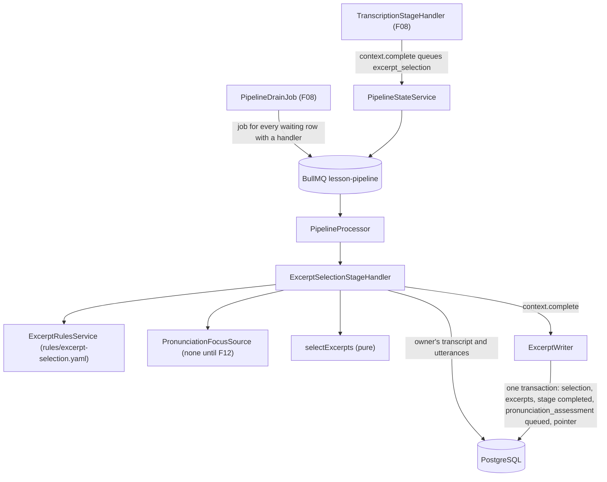
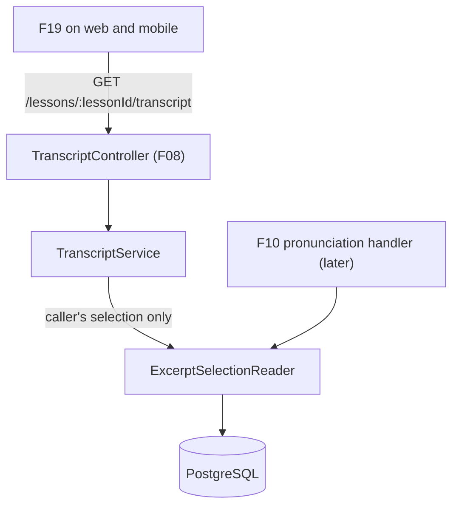

# Technical Specification: Excerpt Selection

## 1. Technical Overview

**What:** When F08 completes a participant's transcription, the branch waits at `excerpt_selection` / `queued`. F09 registers the handler for that stage with F08's pipeline runner. For one branch, the handler reads that participant's stored utterances and applies eligibility filters and a ranking from a versioned rules file. It then picks up to 12 excerpts, with no more than 3 starting inside any 5-minute window. It writes a selection header and the excerpt rows in the stage's completing transaction, and the branch moves on to `pronunciation_assessment` / `queued`, where it waits for F10. The stage calls no model and no provider and uses no key, so it cannot be blocked. It is pure computation over rows already in Postgres, and it finishes in well under 2 seconds. The caller's own selected utterances carry an `excerpt` object on the existing transcript route, which is what F19's badge renders.

**Why:** F10 spends each participant's own Azure quota on pronunciation assessment. F09 is what bounds that cost (12 × 30 s = 6 minutes per participant per lesson, whatever the lesson's length) and points it at the utterances most likely to be informative. Determinism is the other half. With the same utterances, the same pronunciation targets and the same rule version, the output is identical. Every result records the rule version, a fingerprint of the thresholds and a snapshot of them, so results from before and after a curator retunes the thresholds stay comparable. Two facts shape the design:
- **The confidence signal is coarse.** F08's live check found that Azure fast transcription repeats one confidence value across every phrase of an internal chunk. The confidence-first ranking therefore picks the worst-recognized *stretches* of the lesson, and duration decides within a stretch.
- **The second ranking key has no data yet.** It counts words matching the participant's unmastered pronunciation tags, and the error ledger that holds those tags is F12's. F09 defines the port and ships an empty source, which F12 replaces.

**Scope — Included (the PRD gives F09 no Core/Full split, so the whole feature is in scope):**
- The `excerpt_selection` stage handler on F08's runner: no provider, its own short retry policy, and the drain picks up branches already waiting at this stage.
- Deterministic eligibility: duration 3–30 s, at least 8 words, filler share at most 40%, recognition confidence at least 0.40 (the word-level rule where word confidence exists, the utterance-level rule otherwise).
- Deterministic ranking: lowest confidence, then most words matching the participant's unmastered pronunciation tags, then longest duration, then transcript order as the final tie-break.
- Selection: a cap of 12 per participant per lesson, and no more than 3 excerpts in any 5-minute window.
- The `sparse_pronunciation_sample` flag, the per-excerpt `selection_rule_version`, and a stored, structured reason for every selection.
- The versioned rules file `apps/api/rules/excerpt-selection.yaml`, validated at boot, with a unit test that pins each version's fingerprint. *(Decided in the spec interview.)*
- The `PronunciationFocusSource` port with a default source that returns no tags. *(Decided in the spec interview.)*
- The internal reader F10 consumes: exactly the stored excerpts, with reference text and time ranges.
- The caller-only `excerpt` object on the utterances of `GET /lessons/:lessonId/transcript`, and a caller-only `myExcerptSelection` summary. *(Decided in the spec interview.)*
- Adding `pronunciation_assessment` to the stage vocabulary, so that a branch leaving F09 has a stage to wait in (the same thing F08 did for `excerpt_selection`)
- Adapting the F08 suites and fixtures that used `excerpt_selection` as the stage with no handler, since it now has one
- PRD alignment: the sparse flag's trigger and the badge example's wording (see Assumptions)

**Scope — Excluded:**
- **Every client surface.** F19 renders, on both clients, the badge on the transcript line (hover on web, tap on mobile), the `Selecting excerpts` stage in the processing view, and the Dart models for the new fields. *(Decided in the spec interview; this follows F08's precedent, and `./design` has no lesson-detail mockup.)* Web and mobile ship nothing in F09.
- **The real pronunciation-focus source and word-to-phoneme matching.** F12 owns the ledger and the taxonomy (`phoneme:/θ/`, `stress:word-level`…). It replaces the default source and decides how a word is matched to a tag, through a pronunciation lexicon or through the phonemes F10 observes per word. Until then the second ranking key is 0 for every utterance.
- **Pronunciation assessment itself:** audio slicing, padding the slice, normalizing the reference text for Azure, the `4 of 12 excerpts` counter and the sparse note. All of that belongs to F10.
- **A route of its own.** The badge lives on the transcript line, so its data rides on the transcript route.
- **Multi-word fillers** (`you know`, `I mean`) and ambiguous single words (`like`, `well`, `so`). Rule version 1 matches single tokens only. Adding either is a version bump.
- **The pointer at the end of the pipeline.** See "Notes for later features".

**PRD traceability:**

| PRD block | Where it lands |
|---|---|
| Consumes (F08 utterances: timestamps, text, confidence, word timings) | Scope; the handler's input; Data Model (`transcript_id`, `utterance_id`) |
| Provides (excerpts with utterance id, timestamps, reference text, rule version, for F10) | Data Model `lesson_excerpts`; `ExcerptSelectionReader` in Internal contracts |
| Capabilities | Selection rules (section 2); rules file; Technical Decisions; Assumptions |
| Experience (invisible, under 2 s, `Selecting excerpts`, badge with reason) | Stage timing test; pipeline view (F08, unchanged); `excerpt` on the transcript route |
| Error Handling (none in the PRD for F09) | Failure behaviour (section 2) |
| Section 9, F09 | Testing Strategy, acceptance mapping |
| Section 9, Cross-Feature (F08→F09, F09→F10) | Testing Strategy, cross-feature table |

**Assumptions and decisions not answered by the PRD:**

| Assumption | Rationale |
|---|---|
| **The ranking keeps the PRD's order on the coarse confidence**: the confidence value ascending (unknown last), then focus-word count descending, then duration descending, then `idx` ascending. There are no bands and no proxy signal. *(Decided in the spec interview.)* | Chunk-level confidence still says where recognition struggled most, which is the most likely sign of unclear pronunciation. Within a chunk, longer utterances give Azure more phonemes and better prosody and fluency readings. The spacing rule already forces coverage of the whole lesson. A proxy (speech rate, pauses) is speculative without real data, and every excerpt stores the metrics it was ranked on, so a later version can be calibrated from evidence. |
| The confidence rule applies **at word level only when every word of the utterance carries a confidence**: at most 25% of words below 0.40, and ranked by the mean word confidence. Otherwise the utterance's own confidence applies: at least 0.40, ranked by that value. An utterance with neither passes the confidence filter and ranks after every known value. | Fast transcription never reports word confidence (F08), so today the utterance rule always applies. A mixed array is treated as absent, so a partial signal never looks measured. A missing value is not evidence of unusable audio, but it cannot outrank a measured low one. |
| **Tokens** come from the utterance's `words[].text`. If `words` is empty, they come from splitting `text` on whitespace. Normalizing lowercases the token, turns curly apostrophes into straight ones, and strips leading and trailing characters that are not letters or digits. Internal apostrophes and hyphens are kept (`I'd`, `uh-huh`). A token that is empty afterwards is dropped. Word count is the number of tokens left. | F08 stores display text, so punctuation is attached to words (`afternoon.`). Using the provider's tokenization keeps word count and filler share consistent with the timings F10 will align against. |
| **Filler share** = tokens found in the rules file's filler lexicon ÷ word count. Version 1's lexicon: `uh`, `um`, `er`, `erm`, `ah`, `eh`, `hmm`, `hm`, `mm`, `mhm`, `mmm`, `uh-huh`, `huh`, `oh`, `yeah`, `yep`, `yup`, `right`, `okay`, `ok`. | These are the PRD's list "and equivalents", as single tokens. Azure's display form probably drops most hesitations, so in practice the rule mostly catches backchannel turns (`yeah, right, okay`). The live check records how often it fires. |
| Duration bounds are **inclusive**: `3000 ≤ end_ms − start_ms ≤ 30000` | "Between 3 and 30 seconds". The acceptance tests pin both edges. |
| **Spacing is a sliding window over excerpt starts.** No half-open 5-minute interval `[t, t + 300000)` may contain the `start_ms` of more than 3 selected excerpts. Selection is greedy in rank order: a candidate is skipped if accepting it would break the window rule, and selection stops at the cap. | This is the strict reading of "no more than 3 selected excerpts fall within the same contiguous 5-minute window". Fixed 5-minute buckets would allow 6 within 5 minutes across a bucket boundary. Starts are file offsets, and F07's assembled file is a continuous wall-clock timeline (gaps filled with silence), so file time is lesson time for spacing purposes. |
| **`sparse_pronunciation_sample` is set whenever fewer than 4 excerpts are selected.** That includes the PRD's case of fewer than 4 eligible, and the case where the spacing rule caps a short lesson (a 4-minute lesson can yield at most 3 excerpts). The PRD's Capability sentence is aligned. | An aggregate from 3 excerpts is equally unreliable whatever the reason. The PRD's criterion "a lesson yielding fewer than 4 eligible utterances is flagged" still holds. F10 shows the note from this flag. |
| **Zero eligible utterances complete the stage** with an empty selection and the sparse flag. The branch moves on to `pronunciation_assessment`. *(Decided in the spec interview.)* | Selection is deterministic, so a retry would return the same empty set. Failing here would block the analysis, the profile and the plan over a problem that only concerns pronunciation. F10 decides how "no pronunciation sample" reads (see Notes). |
| **The rules live in `apps/api/rules/excerpt-selection.yaml`** (snake_case keys, like the prompt files). The file is loaded and validated with Zod when the module initializes. An invalid file stops the API from booting, with every issue listed. *(Decided in the spec interview.)* | "Every threshold is configuration." A file in git gives the curator a diff for every change, and follows the "prompts are files" precedent. Like prompts, rules are read only at boot, and AGENTS.md's gotcha says so. |
| **Every selection stores `rule_version`, `rule_fingerprint`** (sha256 of the canonical JSON of the thresholds plus the sorted lexicon, version excluded) **and the full `rules` snapshot.** `unit/excerpt-rules.spec.ts` pins a fingerprint for every version it knows. | The pinned test makes "changed a threshold, forgot the version" fail CI. The stored fingerprint and snapshot keep results distinguishable even if that guard is ever bypassed. |
| The rules schema enforces `max_excerpts × max_duration_ms ≤ 360000`. It also enforces `min_duration_ms < max_duration_ms`, shares within 0–1, `max_per_window ≥ 1`, and a lexicon that is non-empty, lowercase, normalized and free of duplicates. | The 6-minute bound is what F10's criterion "total audio submitted … never exceeds 6 minutes" relies on. Tuning must never be able to break it. |
| **`PronunciationFocusSource.forUser(userId)`** returns `{ source, tags, matchesWord(token) }`. It is bound to the `PRONUNCIATION_FOCUS_SOURCE` token, and the default `NoPronunciationFocus` returns `{ source: 'none', tags: [], matchesWord: () => false }`. F12 replaces the default provider, as F08 replaced F07's `PipelineLaunchPort`. *(The port was decided in the spec interview.)* | The ranking key exists and is tested today against a fake source. The matching rule, whether a lexicon or F10's observed phonemes, belongs with the taxonomy it matches against. Each selection stores `focus_source` and `focus_tags`, because they are inputs to "the same input": the output is reproducible given them. |
| The focus source reads only the branch owner's data. If it throws, the stage retries on its policy and then fails. It never falls back to an empty focus. | Silently dropping the key would change the ranking without a trace. The stored `focus_source` has to be the truth. |
| **Excerpt time range = the source utterance's `start_ms` / `end_ms`, as file offsets.** Reference text = the utterance's `text`, verbatim. Both are copied onto the excerpt row. | F10 slices `audio.ogg` by file offsets (F08's note). Copies make an excerpt self-contained, and F10's criterion "no excerpt added or dropped" is checked against these rows. Padding and text normalization for Azure are F10's decisions. |
| `rank` is the 1-based order in which the greedy pass accepted each excerpt | It records the selection order exactly. Downstream consumers can still sort by time. |
| **The reason sentence is built at write time and stored**: `Selected: recognition confidence 0.62, 14 words`, followed by `, 3 words with sounds you're practicing` when the focus count is above 0 (singular for 1). Without a confidence value: `Selected: 14 words, 6.2 seconds`. The confidence is shown to 2 decimals. The PRD's example is aligned. | The PRD's `low recognition confidence (0.62)` reads wrongly when the lowest value in a stretch is 0.93, because confidence is relative. A server-built sentence keeps web and mobile identical, like the stage `reason` in F08. The structured metrics ship next to it, so F19 can present them differently if it wants. |
| The handler declares **`provider: null`** and **retry policy of 3 attempts at 5 s and 30 s** | No key means it is never blocked. The only transient faults are database ones. |
| A branch at `excerpt_selection` whose transcript is missing **fails at once as `internal_error`** (`StageFailedError`, logged, no automatic retry). No new failure code is added. | It is unreachable in practice: F08 queues this stage in the same transaction that writes the transcript, and deleting a lesson or user cascades the branch too. Retrying cannot make a transcript appear, and a dedicated code would widen two vocabularies for a state no user reaches. |
| **Completing the stage queues `pronunciation_assessment`**, which F09 adds to `PIPELINE_STAGE_ORDER`, `pipelineStageSchema` and both stage checks. With no handler registered, the row waits, and the drain picks up F10's handler later. | Without a next stage, `PipelineStateService.complete` would leave the branch pointer at `excerpt_selection` / `running`, because it only moves the pointer when there is a next stage. This mirrors how F08 left branches waiting for F09. |
| The selection is written by **replacing** any earlier selection for that lesson and user, inside the completing transaction. The header references the transcript it was computed from (`ON DELETE CASCADE`), and every excerpt references its utterance (`ON DELETE CASCADE`). | A re-run (manual retry, or a stalled job re-delivered) never leaves two selections. A transcript rewrite takes its excerpts with it, as F08's note asked. |
| **Privacy:** `excerpt` appears only on the caller's own utterances, and `myExcerptSelection` is only the caller's. Other participants' utterances never carry the key, and their selection is never summarized. | Excerpt choice derives from recognition confidence and pronunciation targets, both private (F08's projection rule, `docs/context.md`). |
| No new environment variable, no new dependency (`yaml` is already an API dependency), no design token, no screen, no design reference change | Nothing is rendered in this feature |

## 2. Architecture Impact

**Affected components:**

| Area | Path |
|---|---|
| Shared contracts | `packages/shared/src/schemas/pipeline.ts`, `packages/shared/src/schemas/excerpt.ts`, `packages/shared/src/schemas/transcript.ts`, `packages/shared/src/index.ts` |
| API — excerpt selection | `apps/api/src/excerpts/**`, `apps/api/rules/excerpt-selection.yaml` |
| API — pipeline order | `apps/api/src/pipeline/pipeline.constants.ts` |
| API — transcript read | `apps/api/src/transcription/transcript.service.ts`, `transcript-merge.ts`, `transcription.module.ts` |
| API — wiring | `apps/api/src/app.module.ts` |
| Database | `apps/api/prisma/schema.prisma`, `apps/api/prisma/migrations/0009_excerpt_selection/migration.sql` |
| Tests adapted from F08 | `apps/api/test/integration/transcription-pipeline.spec.ts`, `pipeline-drain.spec.ts`, `pipeline-routes.spec.ts`, `transcript-routes.spec.ts`, `helpers/pipeline-fixtures.ts` |
| Docs | `docs/prd.md` (F09 sparse trigger, badge example), `docs/api/openapi.json`, `AGENTS.md` (boot-time YAML gotcha), `docs/F08-speech-to-text-transcription/progress.md` (dated follow-up note) |

**Stage execution:**



**Reads:**



**Selection rules (`selectExcerpts`, a pure function, no I/O, no clock):**

1. **Tokenize** each utterance (see Assumptions) into normalized tokens, and compute its word count, filler share, duration (`end_ms − start_ms`), confidence mode (word-level or utterance-level) and ranking confidence, and its focus-word count (`focus.matchesWord`).
2. **Filter.** Keep an utterance only if its duration is within `[min_duration_ms, max_duration_ms]`, its word count is at least `min_words`, its filler share is at most `max_filler_share`, and it passes its confidence rule.
3. **Rank** the eligible utterances by ranking confidence ascending (nulls last), then focus-word count descending, then duration descending, then `idx` ascending.
4. **Select greedily** in rank order. Accept a candidate unless the cap `max_excerpts` is reached (stop) or its start would put more than `max_per_window` starts inside some window of `spacing_window_ms` (skip). Assign `rank` in acceptance order.
5. **Summarize:** utterances considered, eligible count, selected count, the selected audio's total duration, and `sparse = selected < sparse_below`. Every selected excerpt gets its reason sentence.

**Failure behaviour (the PRD has no Error Handling block for F09):**

| Situation | Outcome |
|---|---|
| No eligible utterance | `completed`, empty selection, `sparse_sample = true`, and the branch moves on to `pronunciation_assessment` |
| Transcript missing for the branch owner | `failed` / `internal_error` at once, logged. The owner's retry route re-runs it. |
| Database error, or the focus source throwing | The runner's `internal_error` path: retried at 5 s and 30 s, then `failed` and retryable through `POST /lessons/:lessonId/pipeline/retry` |
| Invalid or missing rules file | The API does not boot. The error lists every schema issue, as the prompt loader's does. |
| A stalled job re-delivered, or two runs racing | F08's run guard: the second commit is refused and nothing is duplicated |

## 3. Technical Decisions

| Decision | Chosen Approach | Alternative Considered | Trade-off |
|---|---|---|---|
| The confidence signal | The PRD's ranking over the coarse confidence, with deterministic tie-breaks. The metrics are stored on every excerpt for later calibration. | (a) Confidence bands (e.g. 0.05) so duration weighs more. (b) A proxy from word timings (speech rate, internal pauses) | Within a chunk, confidence does not separate utterances, and duration decides. Accepted because (a) adds a knob with no evidence to tune it, and (b) invents an unvalidated signal and changes the PRD. The stored metrics and the rule version make a data-driven v2 cheap |
| The unmastered-tags ranking key | A `PronunciationFocusSource` port, tested with a fake, and an empty default until F12 | (a) Build word→phoneme matching now with CMUdict and an ARPAbet→IPA map. (b) Drop the key and reintroduce it later | The key contributes nothing until F12. Accepted because (a) fixes the tag format before F12 defines the taxonomy and adds a 3.6 MB lexicon that may not be the matching F12 wants, and (b) changes the PRD rule and needs a version bump anyway |
| Zero eligible utterances | Complete with an empty, sparse selection | Fail with a dedicated code | F10 must handle an empty input. Accepted because a deterministic stage's retry changes nothing, and failing would block analysis, profile and plan over a pronunciation-only gap |
| Where thresholds live and how their version stays honest | A YAML file validated at boot, a fingerprint pinned per version in a unit test, and the snapshot stored per selection | (a) A typed TypeScript constant. (b) One environment variable per threshold, plus a version variable | A loader and a boot failure mode to maintain. Accepted because the file reads as configuration and diffs cleanly for a curator, follows the prompt-file precedent, and the pinned fingerprint catches a forgotten bump, which (b) cannot do |
| How the badge data reaches the clients | Caller-only `excerpt` on the transcript route's utterances, plus a `myExcerptSelection` summary | (a) A separate `GET /lessons/:lessonId/excerpts`. (b) Render the badge now in both clients | The transcript module now reads F09's data through its reader. Accepted because the badge sits on the transcript line, so clients need no join, and it reuses F08's caller projection. (b) has no screen to hang it on until F19 |
| Where a branch rests after selection | Add `pronunciation_assessment` to the stage vocabulary now | A terminal `completed` branch status | F10's stage name is fixed a feature early. Accepted because it is the pattern F08 set for `excerpt_selection`, and the terminal status is only needed by whichever stage ends the pipeline |
| Spacing rule semantics | A sliding window over excerpt starts, applied greedily in rank order | Fixed 5-minute buckets | Slightly more code, and a lower-ranked candidate can be picked over a higher one it would crowd. Accepted because buckets can put 6 excerpts inside 5 minutes across a boundary, which breaks the acceptance criterion as written |

## 4. Component Overview

**Shared:**

| File Path | New/Modified | Purpose | Key Responsibilities |
|---|---|---|---|
| `packages/shared/src/schemas/pipeline.ts` | Modified | Stage vocabulary | `pipelineStageSchema` gains `pronunciation_assessment` |
| `packages/shared/src/schemas/excerpt.ts` | New | The excerpt contract the clients see | `transcriptExcerptSchema` (`rank`, `reason`, `confidence`, `wordCount`, `durationMs`, `focusWordCount`, `ruleVersion`), `excerptSelectionSummarySchema` (`ruleVersion`, `utteranceCount`, `eligibleCount`, `selectedCount`, `selectedAudioMs`, `sparsePronunciationSample`), and their types |
| `packages/shared/src/schemas/transcript.ts` | Modified | Transcript view | `transcriptUtteranceSchema.excerpt` (optional; the caller's own selected utterances only), `lessonTranscriptViewSchema.myExcerptSelection` (summary or `null`) |
| `packages/shared/src/index.ts` | Modified | Barrel | Re-exports the new schemas and types |

**Backend — excerpt selection (`apps/api/src/excerpts/`):**

| File Path | New/Modified | Purpose | Key Responsibilities |
|---|---|---|---|
| `excerpt-selection.module.ts` | New | Wiring | Imports `PipelineModule`. Provides the rules service, the handler, the writer, the reader, and `PRONUNCIATION_FOCUS_SOURCE` bound to `NoPronunciationFocus`. Exports the reader |
| `excerpt-selection.constants.ts` | New | Fixed values | The retry policy (3 attempts, 5 s and 30 s) and the rules file path (`rules/excerpt-selection.yaml` under `process.cwd()`, as prompts are found) |
| `excerpt-rules.ts` | New | The rules contract | The Zod schema of the file, with its invariants (the 6-minute bound, min < max, shares in 0–1, a normalized lexicon), the typed rules, and `ruleFingerprint(rules)`: sha256 over canonical JSON, version excluded, lexicon sorted |
| `excerpt-rules.service.ts` | New | Loads the rules | Reads and validates the YAML on `onModuleInit`, throws a readable error listing every issue, and exposes `current()` → `{ version, fingerprint, rules }` |
| `excerpt-selector.ts` | New | The deterministic rules | `normalizeTokens`, per-utterance metrics, eligibility, ranking, the greedy windowed selection, the summary, and `excerptReason(metrics)`. Pure: no I/O, no clock, no randomness |
| `pronunciation-focus.port.ts` | New | The seam F12 fills | The `PRONUNCIATION_FOCUS_SOURCE` token, the `PronunciationFocusSource` and `PronunciationFocus` interfaces, and the default `NoPronunciationFocus` |
| `excerpt-writer.service.ts` | New | Persistence | Inside the completing transaction: deletes an earlier selection for that lesson and user, inserts the header with version, fingerprint, snapshot, focus and counts, and bulk-inserts the excerpts |
| `excerpt-selection-stage.handler.ts` | New | The `excerpt_selection` stage | Registers with `PipelineStageRegistry` at module init. Loads the owner's transcript and utterances in `idx` order (a missing transcript fails as `internal_error`), asks the focus source for that owner, runs the selector, and commits through `context.complete` |
| `excerpt-selection.reader.ts` | New | The read side, for F10 and the transcript | `forParticipant(lessonId, userId)` → the header and its excerpts in `rank` order, or `null` when selection has not run |

**Backend — modified:**

| File Path | New/Modified | Purpose | Key Responsibilities |
|---|---|---|---|
| `apps/api/src/pipeline/pipeline.constants.ts` | Modified | Stage order | `PIPELINE_STAGE_ORDER` appends `pronunciation_assessment` |
| `apps/api/src/transcription/transcript.service.ts` | Modified | Transcript view | Reads the caller's selection through the reader, and passes a `utteranceId → excerpt` map for the caller and the `myExcerptSelection` summary into the view |
| `apps/api/src/transcription/transcript-merge.ts` | Modified | Projection | Adds `excerpt` to the caller's own utterances only, next to `confidence` and `words` |
| `apps/api/src/transcription/transcription.module.ts` | Modified | Wiring | Imports `ExcerptSelectionModule` for the reader. There is no cycle: excerpts imports only the pipeline |
| `apps/api/src/app.module.ts` | Modified | Root | Imports `ExcerptSelectionModule` |
| `apps/api/src/openapi/components.ts` | Unchanged | Document | `LessonTranscriptView` and `LessonPipelineView` are generated from the shared schemas, so they pick up the new fields and the stage by regeneration |

**Configuration and documentation:**

| File Path | New/Modified | Purpose | Key Responsibilities |
|---|---|---|---|
| `apps/api/rules/excerpt-selection.yaml` | New | Rule version 1 | A header comment saying that changing a value requires a version bump. `version: "1"`, `eligibility`, `selection`, `fillers` (values in Section 6) |
| `AGENTS.md` | Modified | Agent gotchas | "Prompt YAML is only read when the API boots" becomes prompt **and rule** YAML (`apps/api/prompts`, `apps/api/rules`) |
| `docs/prd.md` | Modified | Product definition | F09 Capabilities: the sparse flag also covers a selection the spacing rule leaves under 4. F09 Experience: the badge example becomes `Selected: recognition confidence 0.62, 14 words` |
| `docs/api/openapi.json` | Regenerated | API document | The transcript view's new fields, and the widened stage enum |
| `docs/F08-speech-to-text-transcription/progress.md` | Modified (appended) | Follow-up record | A dated note: the F08 tests that used `excerpt_selection` as the stage without a handler now use `pronunciation_assessment` |

**Database:**

| Migration File | Tables Affected | Operation | Notes |
|---|---|---|---|
| `apps/api/prisma/migrations/0009_excerpt_selection/migration.sql` | `lesson_excerpt_selections`, `lesson_excerpts` | CREATE | One selection header per participant per lesson, and its ordered excerpts |
| same | `lesson_pipeline_branches`, `lesson_pipeline_stages` | ALTER | `ck_branches_stage` and `ck_stages_stage` gain `pronunciation_assessment`. No column changes, and no reason-code change |

## 5. API Contracts

No new route. F08's routes are unchanged in authentication, parameters and error codes. Two responses change.

---

### Endpoint: Read the merged lesson transcript (modified)

- **Method:** GET
- **Path:** `/lessons/:lessonId/transcript`
- **Authentication:** Session cookie or bearer token

**Request:** unchanged (`lessonId`, path, UUID).

**Response (200), added fields:**

| Field | Type | Description |
|---|---|---|
| `data.myExcerptSelection` | `object \| null` | The caller's own selection summary. `null` until the caller's selection has run, or when the caller has no branch |
| `…myExcerptSelection.ruleVersion` | `string` | `selection_rule_version` in force when it ran |
| `…myExcerptSelection.utteranceCount` | `integer` | Utterances considered |
| `…myExcerptSelection.eligibleCount` | `integer` | Utterances that passed every filter |
| `…myExcerptSelection.selectedCount` | `integer` | Excerpts chosen, 0–12 |
| `…myExcerptSelection.selectedAudioMs` | `integer` | Total selected audio, at most 360,000 |
| `…myExcerptSelection.sparsePronunciationSample` | `boolean` | Fewer than 4 excerpts were selected |
| `data.utterances[].excerpt` | `object` | **The caller's own selected utterances only.** The key is absent on every other utterance |
| `…excerpt.rank` | `integer` | 1-based selection order |
| `…excerpt.reason` | `string` | The badge sentence |
| `…excerpt.confidence` | `number \| null` | The confidence it was ranked on |
| `…excerpt.wordCount` | `integer` | Normalized tokens |
| `…excerpt.durationMs` | `integer` | `endMs − startMs` |
| `…excerpt.focusWordCount` | `integer` | Words matching the caller's unmastered pronunciation tags (0 until F12) |
| `…excerpt.ruleVersion` | `string` | The excerpt's `selection_rule_version` |

**Response Example (read by Miguel; Ana's utterance carries neither detail nor excerpt):**
```json
{
  "data": {
    "lessonId": "9f1c4d7e-3b2a-4f51-9d0c-7a6b5e4c3d21",
    "lessonStartedAt": "2026-09-24T14:10:03.000Z",
    "speakers": [
      { "userId": "3f8b1a20-5c6d-4e7f-8a91-2b3c4d5e6f70", "displayName": "Miguel", "isMe": true, "status": "available" },
      { "userId": "b21e9a44-7f30-4c18-9e55-1d2c3b4a5e6f", "displayName": "Ana", "isMe": false, "status": "available" }
    ],
    "myExcerptSelection": {
      "ruleVersion": "1",
      "utteranceCount": 214,
      "eligibleCount": 57,
      "selectedCount": 12,
      "selectedAudioMs": 171340,
      "sparsePronunciationSample": false
    },
    "utterances": [
      {
        "id": "0c2d4e6f-8a1b-4c3d-9e5f-7a6b5c4d3e21",
        "userId": "3f8b1a20-5c6d-4e7f-8a91-2b3c4d5e6f70",
        "startMs": 412030,
        "endMs": 426410,
        "text": "I'd rather we postponed the whole thing until the budget is actually signed off.",
        "confidence": 0.6214,
        "words": [
          { "text": "I'd", "startMs": 412030, "durationMs": 240, "confidence": null }
        ],
        "excerpt": {
          "rank": 1,
          "reason": "Selected: recognition confidence 0.62, 14 words",
          "confidence": 0.6214,
          "wordCount": 14,
          "durationMs": 14380,
          "focusWordCount": 0,
          "ruleVersion": "1"
        }
      },
      {
        "id": "5e7f9a1b-2c3d-4e5f-8a9b-0c1d2e3f4a5b",
        "userId": "b21e9a44-7f30-4c18-9e55-1d2c3b4a5e6f",
        "startMs": 427020,
        "endMs": 431950,
        "text": "That seems a bit drastic, doesn't it?"
      }
    ]
  }
}
```
(The `words` array is abbreviated.)

**Error Codes:** unchanged (`CLASS004` 403, `VAL001` 400, `AUTH003` 401).

---

### Endpoint: Read the caller's pipeline (modified vocabulary only)

`GET /lessons/:lessonId/pipeline` and its retry are unchanged in behaviour. `branch.stage` and `stages[].stage` can now read `pronunciation_assessment`. After F09, a branch's stages list shows `excerpt_selection` as `completed` and `pronunciation_assessment` as `queued` until F10 ships. `excerpt_selection` failed as `internal_error` is `retryable: true`, because it has a registered handler.

---

### Internal contracts

| Contract | Shape | Used by |
|---|---|---|
| Stage handler | `stage: 'excerpt_selection'`, `provider: null`, `retryPolicy: { attempts: 3, delaysMs: [5000, 30000] }`, `run(context)` → `context.complete(writer.replace…)` | F08's runner |
| `selectExcerpts(utterances, rules, focus)` | `utterances[{ id, idx, startMs, endMs, text, confidence, words[] }]` → `{ utteranceCount, eligibleCount, selected[{ utteranceId, rank, startMs, endMs, referenceText, confidence, wordCount, fillerShare, focusWordCount, durationMs, reason }], selectedAudioMs, sparse }` | The handler; the unit suite |
| `PronunciationFocusSource.forUser(userId)` | → `{ source: string, tags: string[], matchesWord(token: string): boolean }`, where `token` is already normalized. Default `{ source: 'none', tags: [], matchesWord: () => false }` | The handler. F12 replaces the default provider |
| `ExcerptRulesService.current()` | → `{ version, fingerprint, rules }` | The handler, the writer |
| `ExcerptSelectionReader.forParticipant(lessonId, userId)` | → `{ selection: { id, transcriptId, ruleVersion, ruleFingerprint, focusSource, focusTags, utteranceCount, eligibleCount, selectedCount, selectedAudioMs, sparsePronunciationSample }, excerpts[{ id, utteranceId, rank, startMs, endMs, referenceText, selectionRuleVersion, confidence, wordCount, fillerShare, focusWordCount, reason }] }` or `null`. `startMs`/`endMs` are file offsets in the participant's `audio.ogg` | `TranscriptService`; F10 |

## 6. Data Model

### Rules file: `apps/api/rules/excerpt-selection.yaml` (version 1)

| Key | Value | PRD source |
|---|---|---|
| `version` | `"1"` | "every excerpt records the `selection_rule_version`" |
| `eligibility.min_duration_ms` | `3000` | "duration between 3 and 30 seconds" |
| `eligibility.max_duration_ms` | `30000` | same |
| `eligibility.min_words` | `8` | "at least 8 words" |
| `eligibility.max_filler_share` | `0.40` | "at most 40% of tokens classified as filler or backchannel" |
| `eligibility.min_confidence` | `0.40` | "recognition confidence of at least 0.40" |
| `eligibility.max_low_confidence_word_share` | `0.25` | "no more than 25% of words below 0.40 where word confidence exists" |
| `selection.max_excerpts` | `12` | "cap of 12 excerpts per participant per lesson" |
| `selection.spacing_window_ms` | `300000` | "the same contiguous 5-minute window" |
| `selection.max_per_window` | `3` | "no more than 3 excerpts" |
| `selection.sparse_below` | `4` | "fewer than 4" |
| `fillers` | the version 1 lexicon (Assumptions) | "`uh`, `um`, `yeah`, `right`, `okay`, `hmm` and equivalents" |

### Table: `lesson_excerpt_selections`

| Column | Type | Nullable | Default | Description |
|---|---|---|---|---|
| `id` | `uuid` | No | `gen_random_uuid()` | Primary key |
| `lesson_id` | `uuid` | No | - | Lesson |
| `user_id` | `uuid` | No | - | Owner, the branch's participant |
| `transcript_id` | `uuid` | No | - | The transcript it was computed from |
| `rule_version` | `varchar(32)` | No | - | `version` from the rules file |
| `rule_fingerprint` | `char(64)` | No | - | sha256 hex of the thresholds and lexicon |
| `rules` | `jsonb` | No | - | Snapshot of the rules in force |
| `focus_source` | `varchar(40)` | No | - | `none` until F12's source |
| `focus_tags` | `jsonb` | No | - | The unmastered pronunciation tags used as input; `[]` today |
| `utterance_count` | `integer` | No | - | Utterances considered |
| `eligible_count` | `integer` | No | - | Passed every filter |
| `selected_count` | `integer` | No | - | Excerpts written |
| `selected_audio_ms` | `integer` | No | - | Sum of the excerpts' durations |
| `sparse_sample` | `boolean` | No | - | `sparse_pronunciation_sample` |
| `created_at` | `timestamptz` | No | `now()` | When it was selected |

### Table: `lesson_excerpts`

| Column | Type | Nullable | Default | Description |
|---|---|---|---|---|
| `id` | `uuid` | No | `gen_random_uuid()` | Primary key |
| `selection_id` | `uuid` | No | - | Owning selection. A re-run replaces them all |
| `lesson_id` | `uuid` | No | - | Denormalized, for owner-scoped reads |
| `user_id` | `uuid` | No | - | Owner; always the selection's |
| `utterance_id` | `uuid` | No | - | Source utterance |
| `rank` | `smallint` | No | - | 1-based acceptance order |
| `start_ms` | `integer` | No | - | File offset in `audio.ogg`, copied from the utterance (what F10 slices by) |
| `end_ms` | `integer` | No | - | Same |
| `reference_text` | `text` | No | - | The utterance's text, verbatim |
| `selection_rule_version` | `varchar(32)` | No | - | The PRD's per-excerpt version; always the selection's |
| `confidence` | `real` | Yes | - | The ranking confidence; `null` when unknown |
| `word_count` | `smallint` | No | - | Normalized tokens |
| `filler_share` | `real` | No | - | 0–1 |
| `focus_word_count` | `smallint` | No | - | Tokens matching the focus |
| `reason` | `varchar(200)` | No | - | The badge sentence |
| `created_at` | `timestamptz` | No | `now()` | Audit |

**Indexes:**

| Index Name | Columns | Type | Purpose |
|---|---|---|---|
| `ux_excerpt_selections_lesson_user` | `lesson_id`, `user_id` | unique btree | One selection per participant per lesson; the reader's lookup |
| `ix_excerpt_selections_transcript` | `transcript_id` | btree | Cascades from a transcript rewrite |
| `ux_excerpts_selection_rank` | `selection_id`, `rank` | unique btree | Order within a selection; the reader's scan |
| `ux_excerpts_utterance` | `utterance_id` | unique btree | An utterance is selected at most once; cascades from utterance deletes |
| `ix_excerpts_lesson_user` | `lesson_id`, `user_id` | btree | Owner-scoped reads and cascades by lesson |

**Constraints:**

| Constraint | Type | Definition | Purpose |
|---|---|---|---|
| `fk_excerpt_selections_lesson` / `_user` | FOREIGN KEY | `ON DELETE CASCADE` | Matches every per-user table |
| `fk_excerpt_selections_transcript` | FOREIGN KEY | `transcript_id REFERENCES lesson_transcripts(id) ON DELETE CASCADE` | A rewritten transcript takes its selection with it |
| `ck_excerpt_selections_counts` | CHECK | `selected_count >= 0 AND selected_count <= eligible_count AND eligible_count <= utterance_count` | Counts are coherent |
| `ck_excerpt_selections_audio` | CHECK | `selected_audio_ms >= 0` | Range. The 6-minute bound is enforced on the rules, not here, because it is configuration |
| `ck_excerpt_selections_json` | CHECK | `jsonb_typeof(rules) = 'object' AND jsonb_typeof(focus_tags) = 'array'` | Shape at the storage boundary |
| `fk_excerpts_selection` | FOREIGN KEY | `selection_id REFERENCES lesson_excerpt_selections(id) ON DELETE CASCADE` | Replace by deleting the header |
| `fk_excerpts_utterance` | FOREIGN KEY | `utterance_id REFERENCES lesson_utterances(id) ON DELETE CASCADE` | F08's note: a transcription re-run rewrites utterances |
| `fk_excerpts_lesson` / `_user` | FOREIGN KEY | `ON DELETE CASCADE` | Same as every per-user table |
| `ck_excerpts_timing` | CHECK | `start_ms >= 0 AND end_ms > start_ms` | Well-formed range |
| `ck_excerpts_rank` | CHECK | `rank >= 1` | 1-based |
| `ck_excerpts_confidence` | CHECK | `confidence IS NULL OR (confidence >= 0 AND confidence <= 1)` | Range |
| `ck_excerpts_filler_share` | CHECK | `filler_share >= 0 AND filler_share <= 1` | Range |
| `ck_excerpts_counts` | CHECK | `word_count > 0 AND focus_word_count >= 0 AND focus_word_count <= word_count` | Coherent |

**Migration (`0009_excerpt_selection/migration.sql`):**

```sql
-- F09 Excerpt Selection: the per-participant selection of utterances that
-- pronunciation assessment (F10) will spend the owner's Azure quota on.
-- The stage vocabulary gains pronunciation_assessment so a selected branch
-- has somewhere to wait for F10; no existing column or reason code changes.

ALTER TABLE lesson_pipeline_branches DROP CONSTRAINT ck_branches_stage;
ALTER TABLE lesson_pipeline_branches
    ADD CONSTRAINT ck_branches_stage CHECK (stage IN
        ('recording','transcription','excerpt_selection','pronunciation_assessment'));

ALTER TABLE lesson_pipeline_stages DROP CONSTRAINT ck_stages_stage;
ALTER TABLE lesson_pipeline_stages
    ADD CONSTRAINT ck_stages_stage CHECK (stage IN
        ('transcription','excerpt_selection','pronunciation_assessment'));

CREATE TABLE lesson_excerpt_selections (
    id                UUID PRIMARY KEY DEFAULT gen_random_uuid(),
    lesson_id         UUID         NOT NULL REFERENCES lessons(id) ON DELETE CASCADE,
    user_id           UUID         NOT NULL REFERENCES users(id)   ON DELETE CASCADE,
    transcript_id     UUID         NOT NULL REFERENCES lesson_transcripts(id) ON DELETE CASCADE,
    rule_version      VARCHAR(32)  NOT NULL,
    rule_fingerprint  CHAR(64)     NOT NULL,
    rules             JSONB        NOT NULL,
    focus_source      VARCHAR(40)  NOT NULL,
    focus_tags        JSONB        NOT NULL,
    utterance_count   INTEGER      NOT NULL,
    eligible_count    INTEGER      NOT NULL,
    selected_count    INTEGER      NOT NULL,
    selected_audio_ms INTEGER      NOT NULL,
    sparse_sample     BOOLEAN      NOT NULL,
    created_at        TIMESTAMPTZ  NOT NULL DEFAULT NOW(),
    CONSTRAINT ck_excerpt_selections_counts CHECK (
        selected_count >= 0 AND selected_count <= eligible_count AND eligible_count <= utterance_count),
    CONSTRAINT ck_excerpt_selections_audio CHECK (selected_audio_ms >= 0),
    CONSTRAINT ck_excerpt_selections_json CHECK (
        jsonb_typeof(rules) = 'object' AND jsonb_typeof(focus_tags) = 'array')
);

CREATE UNIQUE INDEX ux_excerpt_selections_lesson_user ON lesson_excerpt_selections (lesson_id, user_id);
CREATE INDEX ix_excerpt_selections_transcript ON lesson_excerpt_selections (transcript_id);

CREATE TABLE lesson_excerpts (
    id                     UUID PRIMARY KEY DEFAULT gen_random_uuid(),
    selection_id           UUID         NOT NULL REFERENCES lesson_excerpt_selections(id) ON DELETE CASCADE,
    lesson_id              UUID         NOT NULL REFERENCES lessons(id) ON DELETE CASCADE,
    user_id                UUID         NOT NULL REFERENCES users(id)   ON DELETE CASCADE,
    utterance_id           UUID         NOT NULL REFERENCES lesson_utterances(id) ON DELETE CASCADE,
    rank                   SMALLINT     NOT NULL,
    start_ms               INTEGER      NOT NULL,
    end_ms                 INTEGER      NOT NULL,
    reference_text         TEXT         NOT NULL,
    selection_rule_version VARCHAR(32)  NOT NULL,
    confidence             REAL,
    word_count             SMALLINT     NOT NULL,
    filler_share           REAL         NOT NULL,
    focus_word_count       SMALLINT     NOT NULL,
    reason                 VARCHAR(200) NOT NULL,
    created_at             TIMESTAMPTZ  NOT NULL DEFAULT NOW(),
    CONSTRAINT ck_excerpts_timing CHECK (start_ms >= 0 AND end_ms > start_ms),
    CONSTRAINT ck_excerpts_rank CHECK (rank >= 1),
    CONSTRAINT ck_excerpts_confidence CHECK (confidence IS NULL OR (confidence >= 0 AND confidence <= 1)),
    CONSTRAINT ck_excerpts_filler_share CHECK (filler_share >= 0 AND filler_share <= 1),
    CONSTRAINT ck_excerpts_counts CHECK (
        word_count > 0 AND focus_word_count >= 0 AND focus_word_count <= word_count)
);

CREATE UNIQUE INDEX ux_excerpts_selection_rank ON lesson_excerpts (selection_id, rank);
CREATE UNIQUE INDEX ux_excerpts_utterance ON lesson_excerpts (utterance_id);
CREATE INDEX ix_excerpts_lesson_user ON lesson_excerpts (lesson_id, user_id);
```

**Notes for later features:**
- **F10** registers the `pronunciation_assessment` handler (`provider: 'azure_speech'`). Every branch F09 finished is already waiting at that stage, and the drain picks it up. F10 reads `ExcerptSelectionReader.forParticipant`. It slices `audio.ogg` by the excerpts' `start_ms` / `end_ms`, which are file offsets. It uses `reference_text` as the reference, normalized for Azure if it needs to be. It shows its sparse note from `sparsePronunciationSample` and `selectedCount`, and its `N of M excerpts` counter from `selectedCount`. **A selection with zero excerpts must complete F10's stage without an aggregate, not fail it**, so the branch still reaches analysis. F10 adds its reason codes to `ck_stages_reason_code` and `ck_branches_failure_code` in its own migration. The stage name is fixed here.
- **F12** replaces the default provider of `PRONUNCIATION_FOCUS_SOURCE` with one that returns the owner's unmastered pronunciation tags from the ledger, and a `matchesWord` that maps a normalized token to those tags. It chooses the mapping: a pronunciation lexicon, or the per-word phonemes F10 observed. Its `source` string should carry the matcher's version (for example `ledger@1`), so stored selections stay reproducible. Changing the focus source changes an input, not the rules, so no rule-version bump is needed.
- **F19** renders `utterances[].excerpt.reason` as the badge on the caller's own lines (hover on web, tap on mobile), labels the `excerpt_selection` stage `Selecting excerpts`, and adds Dart models for `excerpt` and `myExcerptSelection`.
- **Whichever feature adds the pipeline's final stage:** `PipelineStateService.complete` moves the branch pointer only when there is a next stage. When the last stage completes, the pointer would stay at `<stage>` / `running`. That feature must add a terminal branch status (and widen `ck_branches_status` and the shared schema) and move the pointer onto it.

## 7. Testing Strategy

**Test File Structure:**

| Test File | Test Type | Target | Coverage Goal |
|---|---|---|---|
| `apps/api/test/unit/excerpt-selector.spec.ts` | Unit | Tokenizing, eligibility, ranking, spacing, sparse, reasons, determinism | 100% |
| `apps/api/test/unit/excerpt-rules.spec.ts` | Unit | The committed file, schema invariants, fingerprint pinning | 100% |
| `apps/api/test/unit/transcript-merge.spec.ts` | Unit (extend) | Excerpt projection | — |
| `apps/api/test/unit/pipeline-backoff.spec.ts` | Unit (extend) | The stage's retry policy | — |
| `apps/api/test/integration/excerpt-selection-pipeline.spec.ts` | Integration (Postgres, Redis, MinIO, real worker, Azure faked at F08's client) | Transcription → selection → waiting at `pronunciation_assessment` | 90% |
| `apps/api/test/integration/transcript-routes.spec.ts` | Integration (extend) | `excerpt` and `myExcerptSelection`, and their privacy | — |
| F08 suites (`transcription-pipeline`, `pipeline-drain`, `pipeline-routes`, `transcript-routes`) and `helpers/pipeline-fixtures.ts` | Integration (adapted) | Resting points and the stage without a handler move to `pronunciation_assessment` | — |
| `apps/api/test/unit/openapi.spec.ts` | Unit (existing guard) | Snapshot freshness | — |

**Harness:**
- The selector is exercised directly with hand-built utterances, which is how every rule gets its boundary tests. There is no database.
- The integration suite boots `AppModule` like F08's suites, so the real `ExcerptRulesService` loads the committed YAML. `PRONUNCIATION_FOCUS_SOURCE` is overridden only in the test that proves the focus key, with a fake that records the `userId` it was asked about.
- Utterances reach the database two ways. The cross-feature test runs F08's real transcription stage, with `helpers/fake-speech.ts` scripting the phrases Azure "heard". The other tests write a transcript and utterances directly through a new `seedTranscript(lessonId, userId, utterances)` helper in `helpers/pipeline-fixtures.ts`, then queue the branch at `excerpt_selection`.
- `PIPELINE_RETRY_OVERRIDES` shortens this stage's policy to milliseconds, as F08's suites do. `waitForStage(branchId, stage, status)` polls Postgres.
- **Adapting F08's suites:** fixtures that park a branch at a stage with no handler use `pronunciation_assessment`. `completion_advances_the_branch_to_excerpt_selection` now waits for the branch to rest at `pronunciation_assessment` / `queued`. `ignores_stages_without_a_registered_handler` targets `pronunciation_assessment`. Pipeline-route fixtures whose branch "completed through" `excerpt_selection` seed its selection too, so the running drain cannot turn them into a live selection mid-assertion.

**`apps/api/test/unit/excerpt-selector.spec.ts`**

| Test Function | Description | Assertions |
|---|---|---|
| `excludes_utterances_outside_3_to_30_seconds` | Durations 2999, 3000, 30000, 30001 ms, all otherwise eligible (PRD criterion) | Only 3000 and 30000 are eligible |
| `excludes_utterances_with_fewer_than_8_words` | 7 and 8 normalized tokens (PRD criterion) | 7 excluded, 8 eligible |
| `counts_words_from_normalized_tokens` | `"Well, afternoon."`, a lone `"—"` token, `"I’d"` | Punctuation-only tokens are dropped, the trailing period is stripped, and the curly apostrophe is normalized |
| `falls_back_to_the_text_when_words_are_empty` | `words: []` | Tokens come from `text` |
| `excludes_utterances_with_more_than_40_percent_fillers` | 4 of 10 and 5 of 10 fillers, mixed case and punctuation (`"Yeah,"`, `"UM"`) (PRD criterion) | 40% eligible, 50% excluded |
| `excludes_utterance_confidence_below_0_40` | 0.39 and 0.40 | 0.39 excluded, 0.40 eligible |
| `uses_word_confidence_when_every_word_has_it` | 8 words, 2 below 0.40 (25%) and 3 below (37.5%) | 25% eligible, 37.5% excluded; ranked by the mean word confidence, not the utterance's |
| `a_partial_word_confidence_falls_back_to_the_utterance` | Some words `null` | Utterance rule and value used |
| `an_utterance_without_any_confidence_stays_eligible_and_ranks_last` | Utterance and words `null` | Eligible; ranked after every measured one |
| `ranks_lower_confidence_before_higher` | 0.91, 0.62, 0.78 (PRD criterion) | Ranks 1, 2, 3 go to 0.62, 0.78, 0.91 |
| `breaks_confidence_ties_by_focus_words_then_duration_then_index` | Equal confidence (the chunk case) | More focus words first; then longer; then lower `idx` |
| `never_selects_more_than_12` | 60 eligible, spread over 60 minutes (PRD criterion) | 12 selected |
| `never_places_more_than_3_in_any_5_minute_window` | 100 eligible packed into 20 minutes (PRD criterion) | For every selected start `t`, at most 3 selected starts fall in `[t, t + 300000)` |
| `a_short_lesson_selects_at_most_3` | 10 eligible within 4 minutes | 3 selected; sparse |
| `selects_every_eligible_utterance_when_fewer_than_4` | 3 eligible of 40 (PRD Capability) | All 3 selected; `sparse = true` |
| `flags_sparse_when_spacing_leaves_fewer_than_4` | 6 eligible within one window | 3 selected; `sparse = true` |
| `zero_eligible_yields_an_empty_sparse_selection` | Every utterance fails a filter | No excerpts; `eligibleCount 0`; `sparse = true` |
| `four_or_more_selected_is_not_sparse` | 4 eligible, spaced out | `sparse = false` |
| `is_deterministic_for_the_same_input_and_rules` | The same set in 5 shuffled orders, run twice each (PRD criterion) | Deep-equal outputs |
| `total_selected_audio_stays_within_6_minutes` | 50 eligible of 30 s each over 60 minutes | `selectedAudioMs ≤ 360000` |
| `copies_the_utterance_range_and_text_verbatim` | Selected utterance | `startMs`, `endMs`, `referenceText` equal the input's |
| `writes_the_reason_sentence` | Confidence 0.6214 and 14 words; with 1 and with 3 focus words; with `null` confidence | `Selected: recognition confidence 0.62, 14 words`; `…, 1 word with sounds you're practicing`; `…, 3 words with sounds you're practicing`; `Selected: 14 words, 6.2 seconds` |
| `selects_a_60_minute_transcript_quickly` | 1,000 utterances (PRD Experience: under 2 s) | Completes in under 100 ms |

**`apps/api/test/unit/excerpt-rules.spec.ts`**

| Test Function | Description | Assertions |
|---|---|---|
| `the_committed_rules_file_is_valid` | Parse `rules/excerpt-selection.yaml` | Valid, version `"1"`, values as in Section 6 |
| `the_rule_fingerprint_is_pinned_to_its_version` | The known-versions map | The fingerprint of the committed file equals the pin for its version. A missing version fails with a message saying to bump the version and add the pin |
| `the_fingerprint_changes_with_any_threshold_or_filler` | Change each value in turn | Every change gives a different fingerprint; reordering the lexicon does not |
| `rejects_rules_that_could_exceed_6_minutes_of_audio` | `max_excerpts 13` with `max_duration_ms 30000` | Schema error naming the bound |
| `rejects_incoherent_thresholds` | `min ≥ max` duration, share `1.2`, `max_per_window 0` | One issue each |
| `rejects_an_unnormalized_or_duplicated_lexicon` | `"Um"`, `"um"` twice, `"uh."` | Issues listed |
| `a_broken_file_stops_the_service_with_every_issue` | `ExcerptRulesService` pointed at a fixture with 3 errors | Throws, listing all 3 |

**`apps/api/test/unit/transcript-merge.spec.ts`** (extend)

| Test Function | Description | Assertions |
|---|---|---|
| `projects_the_excerpt_only_onto_the_callers_utterances` | The caller's map holds one of their utterances; the other speaker's utterance id is also passed in the map | Only the caller's selected utterance carries `excerpt`; the other speaker's never does |

**`apps/api/test/unit/pipeline-backoff.spec.ts`** (extend)

| Test Function | Description | Assertions |
|---|---|---|
| `excerpt_selection_retries_at_5s_and_30s` | The registered handler's policy | 3 attempts; delays 5,000 and 30,000 ms |

**`apps/api/test/integration/excerpt-selection-pipeline.spec.ts`**

| Test Function | Description | Assertions |
|---|---|---|
| `selects_from_exactly_the_owners_stored_utterances` | Two participants run through F08's real transcription (fake Azure phrases with distinct confidences), then F09 (cross-feature F08→F09) | Every excerpt's `utterance_id` belongs to its owner's transcript; `start_ms`, `end_ms`, `reference_text` and `confidence` equal the utterance's; the low-confidence utterance ranks first; no excerpt references another participant's utterance |
| `completion_advances_the_branch_to_pronunciation_assessment` | Seeded transcript | `excerpt_selection` `completed`, with `finished_at − started_at` under 2 s; a `pronunciation_assessment` row `queued`; the pointer at `pronunciation_assessment` / `queued`; no job for it (no handler) |
| `every_excerpt_stores_its_selection_rule_version` | (PRD criterion) | Every row has `selection_rule_version = "1"`; the header has the version, the pinned fingerprint and a `rules` snapshot equal to the file |
| `runs_without_any_provider_call_or_credential` | The owner has no Azure or Gemini key (PRD criterion) | The stage completes; the fake speech and Gemini clients saw no call from F09; no `credential_usage` row was written by the stage |
| `a_lesson_with_fewer_than_4_eligible_is_flagged_sparse` | 3 eligible utterances (PRD criterion) | 3 excerpts; `sparse_sample = true` |
| `no_eligible_utterance_completes_with_an_empty_selection` | Only short turns | Stage `completed`; header with `selected_count 0` and `sparse_sample = true`; no excerpts; branch at `pronunciation_assessment` |
| `participants_select_independently` | `LESSON_MAX_PARTICIPANTS=3`: A and C transcribed, B failed at transcription | A and C each get their own selection; B's branch untouched; no pair-specific path |
| `a_rerun_replaces_the_previous_selection` | Complete, then re-queue the stage with `run + 1` | One header and one set of excerpts, identical to the first |
| `a_stale_run_commits_nothing` | The same job delivered after completion | One selection; the second commit is refused by the run guard |
| `a_transcript_rewrite_takes_its_selection_with_it` | Delete the transcript header | Selection and excerpts gone |
| `a_missing_transcript_fails_without_retry` | Branch queued at `excerpt_selection`, no transcript | `failed` / `internal_error`, `attempts = 1`, `retryable: true` on the pipeline view |
| `ranks_with_the_owners_pronunciation_focus` | Focus source overridden: `matchesWord` true for `think`/`through`; equal confidences | The utterance with more matches ranks first; the source was asked only for the owner; `focus_source` and `focus_tags` stored |
| `drains_branches_already_waiting_at_excerpt_selection` | A branch left at `excerpt_selection` / `queued` with a transcript, no job (the pre-F09 state) | The drain adds the job and the stage completes |
| `the_reader_returns_exactly_the_stored_excerpts` | Completed selection (cross-feature F09→F10) | `forParticipant` returns every row in `rank` order with file-offset ranges, reference text and rule version; `null` for a participant with no selection |

**`apps/api/test/integration/transcript-routes.spec.ts`** (extend)

| Test Function | Description | Assertions |
|---|---|---|
| `marks_the_callers_selected_utterances_with_their_excerpt` | A's selection completed | A's selected utterances carry `excerpt` with rank, reason and metrics; A's unselected ones have no `excerpt` key; `myExcerptSelection` matches the header |
| `never_exposes_another_participants_excerpts_or_selection` | A and B both selected; A reads, then B reads | No `excerpt` key on the other's utterances; each `myExcerptSelection` is the reader's own, and neither response contains the other's counts |
| `my_excerpt_selection_is_null_until_selection_runs` | The caller's transcript is stored, but their `excerpt_selection` stage failed, so there is no selection row. A fixture state, so the running drain cannot race it | `myExcerptSelection: null`; no `excerpt` keys; `confidence` and `words` still present on the caller's own utterances |

**Acceptance criteria (PRD, F09) → tests:**

| Criterion | Test |
|---|---|
| Selection requires no LLM call and produces identical output for the same input and rule version | `runs_without_any_provider_call_or_credential`, `is_deterministic_for_the_same_input_and_rules`, `a_rerun_replaces_the_previous_selection` |
| Utterances shorter than 3 seconds, longer than 30 seconds, or with fewer than 8 words are never selected | `excludes_utterances_outside_3_to_30_seconds`, `excludes_utterances_with_fewer_than_8_words` |
| Utterances with more than 40% filler tokens are excluded | `excludes_utterances_with_more_than_40_percent_fillers` |
| No more than 12 excerpts are selected per participant per lesson | `never_selects_more_than_12`, `total_selected_audio_stays_within_6_minutes`, `rejects_rules_that_could_exceed_6_minutes_of_audio` |
| No more than 3 selected excerpts fall within the same contiguous 5-minute window | `never_places_more_than_3_in_any_5_minute_window`, `a_short_lesson_selects_at_most_3` |
| Among eligible utterances, lower recognition confidence is selected before higher | `ranks_lower_confidence_before_higher`, `selects_from_exactly_the_owners_stored_utterances` |
| A lesson yielding fewer than 4 eligible utterances is flagged `sparse_pronunciation_sample` | `selects_every_eligible_utterance_when_fewer_than_4`, `a_lesson_with_fewer_than_4_eligible_is_flagged_sparse` |
| Every excerpt stores its `selection_rule_version` | `every_excerpt_stores_its_selection_rule_version`, `the_rule_fingerprint_is_pinned_to_its_version` |

**Cross-feature integration (the parts F09 owns):**

| Criterion | Test | F09's half |
|---|---|---|
| Utterances produced by transcription (F08) with their confidence values and word timings are the exact input excerpt selection (F09) filters and ranks over | `selects_from_exactly_the_owners_stored_utterances` | The whole criterion. F08's real stage writes the utterances and F09 selects from exactly them |
| Excerpts selected by F09, with their reference text and time ranges, are the exact set submitted by pronunciation assessment (F10), with no excerpt added or dropped between the stages | `the_reader_returns_exactly_the_stored_excerpts` | The reader returns exactly the stored set. F10 proves that it submits that set |
| Gemini and Azure credentials from the vault (F02) are the only credentials used … | `runs_without_any_provider_call_or_credential` | F09 uses no credential at all |

**Live verification checklist (recorded in `progress.md`):** runs on the real local stack through throwaway scripts that are never committed:
- Before the F09 dev server first starts, list the branches waiting at `excerpt_selection` / `queued` in the local database, because the first drain tick selects them all. This costs nothing, since no provider is called. Afterwards, confirm each one is at `pronunciation_assessment` / `queued` with a selection.
- Seed a scratch lesson for both seeded users with transcripts that exercise every rule: both duration edges, 7 and 8 words, filler shares of 40% and 50%, confidence 0.39 and 0.40, a dense 5-minute stretch, and one participant with only short turns. Leave both branches at `excerpt_selection` / `queued`. Confirm the drain processes both within one tick, each stage takes under 2 s, the chosen excerpts match what the selector predicts, and one participant is sparse.
- Read `GET /lessons/:lessonId/transcript` as each user with a bearer token. Confirm that each sees `excerpt` only on their own utterances, gets their own `myExcerptSelection`, and never sees the other's. Confirm `GET …/pipeline` shows `excerpt_selection` as `completed` and `pronunciation_assessment` as `queued`.
- Optional, with the user's go-ahead because it spends about 10 minutes of their Azure quota: transcribe a real 5–10-minute English speech recording (not TTS) through F08 with the user's key. Record the distinct confidence values, how many phrases share each one, and what F09 selects from them. This is the evidence for calibrating rule version 2.
- Optional, if the user can hold one: a real two-window lesson in the user's Chrome, then confirm both selections and the transcript privacy above.
- Delete every scratch lesson and its objects afterwards.
