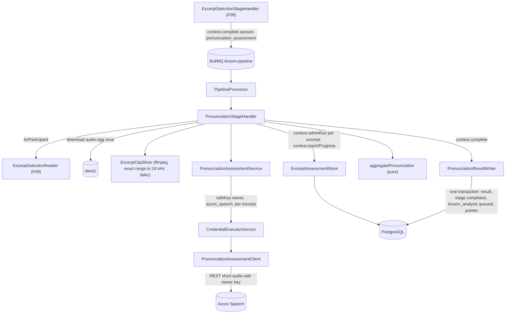
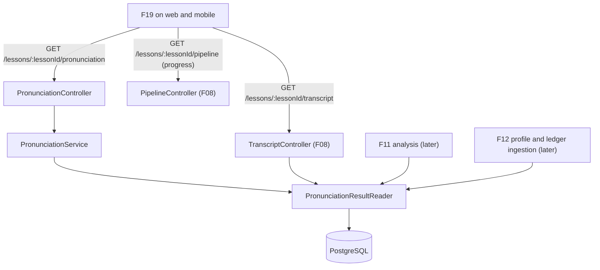

# Technical Specification: Pronunciation Assessment

## 1. Technical Overview

**What:** When F09 completes, a participant's branch waits at `pronunciation_assessment` / `queued`. F10 registers that stage's handler with F08's pipeline runner. For one branch, the handler does the following:
- Reads the owner's excerpts through F09's `ExcerptSelectionReader` and downloads their `audio.ogg` once.
- For each excerpt, cuts that exact time range into a 16 kHz mono WAV with ffmpeg and submits it to Azure Speech Pronunciation Assessment, through the REST API for short audio, under the owner's own key. The request asks for phoneme granularity, prosody and miscue detection, with the excerpt's reference text.
- Records each excerpt's outcome as it lands: five scores, word-level detail with error types, and phoneme-level scores. Records survive a blocked key, a retry or a crash, so a later run reprocesses only what is not yet assessed, and the processing view can count `4 of 12 excerpts`.
- Once every excerpt is settled, applies the 60% rule and writes the per-lesson result in the stage's completing transaction. The result holds duration-weighted means, the 5 worst phonemes, the 10 worst words, the `partial_assessment` / `sparse` / quota flags, and the `phoneme:` tags the error ledger (F12) will ingest.
- Leaves the branch waiting at `lesson_analysis` for F11.

F10 also provides the single-clip capability F18 needs, a caller-only `GET /lessons/:lessonId/pronunciation`, the assessed scores on the transcript's excerpt badges, and a generic `progress` counter on the pipeline view.

**Why:** Pronunciation is the one skill the learner cannot judge themselves. It is also the only stage whose cost grows with the number of calls rather than with one request per track: up to 12 requests per participant per lesson, each of which can fail on its own. So F10 is the first stage that cannot be all-or-nothing. The PRD asks for partial success, per-excerpt retries, a retry that "reprocesses only the failed excerpts", and a visible counter. All of that needs per-excerpt state that outlives a single run. F10 adds it without bending the runner: excerpt rows are written under the run's ownership, and the aggregate still commits atomically with the stage. The result is also the first artifact three later features read (F11's analysis input, F12's pronunciation dimension and ledger, F19's result page). Its tags therefore arrive in the ledger's own vocabulary, and its reader is the single contract they share.

**Scope — Included (the PRD gives F10 no Core/Full split, so the whole feature is in scope):**
- The `pronunciation_assessment` stage handler on F08's runner, with `provider: 'azure_speech'`, so it gets blocked-and-resumed behaviour for free.
- A local ffmpeg cut of each excerpt's exact range from the participant's `audio.ogg` into temporary WAV clips, deleted after use.
- Azure Pronunciation Assessment per excerpt with the owner's key: reference text = the excerpt's text, phoneme granularity, prosody, miscue, the IPA alphabet, and the 0–100 scale.
- Per-excerpt storage of the five scores, words (accuracy, error types, timings) and phonemes (accuracy, timings).
- Per-excerpt retries (2), exclusion after the last retry, and the 60% threshold with `partial_assessment`. Below 60% the stage fails, and its retry reprocesses only unassessed excerpts.
- The PRD's Error Handling: a rejected key blocks and keeps completed work; quota exhaustion abandons the rest; ffmpeg failure drops that excerpt; every slice failing fails the stage.
- The per-lesson result: duration-weighted means, 5 worst phonemes, 10 worst words (each with counts and an example), flags and notes, and the `phoneme:/…/` tags handed to F12. *(How the tags reach the ledger was decided in the spec interview.)*
- `PronunciationAssessmentService.assessClip`, the single-clip capability F18 consumes (internal, no route).
- `PronunciationResultReader`, the internal read contract for F11, F12 and F19.
- `GET /lessons/:lessonId/pronunciation` (caller only), the assessed scores on the caller's own excerpt badges in `GET /lessons/:lessonId/transcript`, and `progress { done, total }` on the pipeline view's stages. *(Decided in the spec interview.)*
- A generic extension to F08's runner so any stage can report progress and write under its run's ownership.
- Adding `lesson_analysis` to the stage vocabulary, so a branch leaving F10 has a stage to wait in (the pattern F08 and F09 followed).
- A PRD alignment of the ledger sentence (see Assumptions).

**Scope — Excluded:**
- **Every client surface.** The `Assessing pronunciation` stage with its counter, the pronunciation section (meters, phoneme list, word list linking to the transcript) and its notes are rendered by F19 on both clients from the routes below. F19 also adds the Dart models. *(Decided in the spec interview; this follows the F08/F09 precedent, and `./design` has no lesson-result mockup.)*
- **Writing the ledger.** F10 stores the `phoneme:` tags with occurrence counts and example words on its result. F12, which owns the ledger, the taxonomy and idempotent per-source ingestion, reads them when it updates the profile from the lesson, and can backfill lessons processed before it existed. *(Decided in the spec interview.)*
- **Filtering tags against the taxonomy.** F10 emits a tag for every failing IPA phoneme. F12 rejects and logs tags outside its taxonomy, which its own Error Handling already specifies.
- **The profile's pronunciation dimension.** F12 computes it from this result.
- **Speaking-activity clips.** F18 records them, transcribes them (F08's `transcribeClip`) and calls `assessClip`.
- **Padding clips beyond the excerpt's range.** See Assumptions.

**PRD traceability:**

| PRD block | Where it lands |
|---|---|
| Consumes (F02 key and region, F07 object key, F09 excerpts) | Scope; the handler's inputs; Internal contracts |
| Provides (aggregates and per-excerpt scores for F11/F12/F19; clip capability for F18) | Data Model; `PronunciationResultReader`; `PronunciationAssessmentService.assessClip`; `GET /lessons/:lessonId/pronunciation` |
| Capabilities | Assessment flow (section 2); Aggregation rules; Technical Decisions; Assumptions |
| Experience (counter, pronunciation section, notes) | Pipeline `progress`; pronunciation view with `notes`; transcript badge scores |
| Error Handling (5 cases) | Outcome table (section 2); reason codes (section 6) |
| Section 9, F10 | Testing Strategy, acceptance mapping |
| Section 9, Cross-Feature (F07→F10, F09→F10, F02, F10→F11, F10→F12, F10→F18, F10→F19) | Testing Strategy, cross-feature table |

**Assumptions and decisions not answered by the PRD:**

| Assumption | Rationale |
|---|---|
| **Azure's REST API for short audio**: `POST https://{region}.stt.speech.microsoft.com/speech/recognition/conversation/cognitiveservices/v1?language={TRANSCRIPTION_LOCALE}&format=detailed`, with the `Ocp-Apim-Subscription-Key` header, `Content-Type: audio/wav; codecs=audio/pcm; samplerate=16000`, and `Pronunciation-Assessment` = base64 of `{"ReferenceText", "GradingSystem":"HundredMark", "Granularity":"Phoneme", "Dimension":"Comprehensive", "EnableMiscue":true, "EnableProsodyAssessment":true, "PhonemeAlphabet":"IPA"}`. There is no Speech SDK. | This matches F08's plain-`fetch` client and adds no dependency. The REST API caps pronunciation assessment at 30 s per request, which is exactly F09's `max_duration_ms`, so every excerpt fits. Prosody (and with it `UnexpectedBreak`, `MissingBreak` and `Monotone`) and miscue (`Omission`, `Insertion`) cover every error type the PRD lists. |
| **`PhonemeAlphabet: IPA` over REST is verified live in stage 2.** Microsoft documents it for the SDKs' JSON config, which is the same parameter object the REST header carries. If the live call shows SAPI symbols instead, the response mapper translates the en-US SAPI set to IPA through a fixed table. | The ledger's tags are IPA (`phoneme:/θ/`, PRD F12). Either way the stored phonemes are IPA. The live check decides which path the code takes, and the progress log records it. |
| **Clips are cut to exactly `[start_ms, end_ms]`** of the excerpt (file offsets), transcoded to 16 kHz mono 16-bit PCM WAV, with no padding. | The cross-feature criterion says "each slice's time range matches the excerpt's timestamps". WAV PCM 16 kHz is the API's canonical input. Padding could also push a 30 s excerpt over the REST cap. The live check reports the completeness scores, in case clipped word edges turn out to matter. |
| **One `withKey` call per excerpt**, audited as `F10_lesson_pronunciation`. `assessClip` takes the caller's label (F18 passes its own). | Every use of the owner's quota leaves one audit row, and a key rejected mid-stage is marked `invalid` by the vault on that very call, as in F08. |
| **Excerpts are assessed sequentially** within a branch, in `rank` order. Different participants' branches still run in parallel (worker concurrency 4). | Each participant's resource has its own rate limits, and the free tier allows little concurrency. Sequential calls also make the counter monotonic. |
| **Per-excerpt retries run inline:** up to 2 more attempts, 2 s and then 8 s apart, for a service error (5xx, network, timeout), a rejected audio request (400/413/415) or a recognition with no usable result (`RecognitionStatus` other than `Success`). After the last one, the excerpt is `failed` with its code and the loop moves on. | The PRD says "retried twice, then marked failed and excluded" and "the stage continues". Short inline delays keep a transient blip inside one run instead of re-queuing the whole stage. |
| **A 429 abandons the rest.** The throttled excerpt and every excerpt not yet attempted in this run become `abandoned` / `quota_exhausted`, and the 60% rule decides the outcome. At or above 60%, the stage completes and the result carries `quota_exhausted = true`, which becomes a note. Below 60%, it fails with `Azure Speech quota was exhausted during assessment.` | The PRD: "remaining excerpts are abandoned rather than retried… the user sees `Azure Speech quota was exhausted during assessment.`" Retrying against an exhausted quota only burns more of it. |
| **A rejected, missing or unreadable key blocks the stage** (`credential_missing`, `credential_rejected`, `credential_unreadable`, with F08's Azure sentences) **and keeps every excerpt already assessed.** The excerpt in flight stays `pending`. Resuming with run + 1 assesses only what is left. | The PRD: "matching transcription's behavior. No retries against a rejected key." Keeping completed excerpts means nobody pays for them twice. |
| **A slice that fails, or produces a clip under 1 KB or with zero duration, drops that excerpt** (`dropped` / `slice_failed`, with ffmpeg's first line logged), and the loop continues. Dropped excerpts count as unassessed for the 60% rule. **If no excerpt could be sliced**, the stage fails with `Audio could not be processed for assessment.` | This is the PRD's ffmpeg case, stated as a rule the tests can pin. |
| **The 60% rule's denominator is the number of selected excerpts.** `assessed / selected ≥ 0.6` completes the stage, and `partial_assessment` is set whenever `assessed < selected`. Below 0.6, the stage fails with `Too few excerpts could be assessed (N of M).`, with the counts in the stored reason. | The PRD's own examples: 8 of 12 is partial (0.67), and 5 of 12 fails. 7 of 12 (0.58) fails too. |
| **A manual retry, or a resume from blocked, reprocesses every excerpt that is not `assessed`** (`pending`, `failed`, `dropped`, `abandoned`), with that excerpt's `attempts` kept and its failure fields cleared. | This is the PRD's "a retry that reprocesses only the failed excerpts". Dropped and abandoned excerpts were never assessed either. |
| **Excerpt rows are written as each excerpt settles, outside the completing transaction, but under the run's ownership.** Each write happens in a transaction that first checks that the stage row is still `running` with this job's `run`. Otherwise it throws F08's `StaleRunError`. The per-lesson result, the stage completion and the next stage are still one transaction. | Per-excerpt progress has to survive the run, and a stalled duplicate still commits nothing. This is the one deliberate departure from F08's "the handler writes only in `complete`", and it is added to the runner as a generic `context.withinRun`. |
| **The counter lives on the stage row** (`progress_done`, `progress_total`, both nullable) through a generic `context.reportProgress(done, total)`. The pipeline view shows `progress` as an object, or `null` for stages that never report. `done` counts settled excerpts: assessed, failed, dropped or abandoned. | "4 of 12 excerpts" reads as progress through the list. The columns are generic, so F11 or F15 can report progress without another migration. They reset when the stage is re-queued. |
| **The cost bound is checked, not assumed.** Before any request, the handler checks that the excerpt set's total clip duration is at most 360 000 ms. It fails with `internal_error` if not, which F09's rules schema already makes impossible. The criterion "total audio submitted … never exceeds 6 minutes" is read as **distinct audio**: an excerpt is assessed successfully at most once, and only failed requests are resent. | The bound belongs to the selection (F09 rules, `max_excerpts × max_duration_ms ≤ 360000`). F10 guards it and never assesses the same excerpt twice. |
| **A phoneme instance fails when its accuracy is below 60.** Each failing IPA phoneme `p` becomes a tag `phoneme:/p/`, whose `occurrences` counts its failing instances in the lesson, with up to 5 distinct example words and the mean accuracy of those instances. | 60 is the boundary Azure itself uses for a word's `Mispronunciation`. The tag format is the ledger's (PRD F12). |
| **Worst phonemes** group every phoneme instance of the assessed excerpts, need at least 2 occurrences, and are ranked by mean accuracy ascending, then occurrences descending, then symbol. The top 5 are kept, each with its example word, excerpt and utterance taken from its lowest-scoring instance. **Worst words** group by the normalized word (F09's `normalizeToken`), exclude `Omission` and `Insertion`, and are ranked by mean accuracy ascending, then occurrences descending, then word. The top 10 are kept, each with its error types, and its example taken from its lowest-scoring instance. | In unscripted assessment the reference text is the recognizer's own reading of the same audio, so omissions and insertions are mostly alignment artifacts and would crowd out real mispronunciations. A phoneme heard once is noise. The utterance id is what lets F19 link a word to its place in the transcript. |
| **Scores are duration-weighted means** over assessed excerpts, weighted by clip duration. `prosody` is nullable, because Azure only reports it for `en-US`, and its mean covers the excerpts that report it. | These are the PRD's duration-weighted means. `TRANSCRIPTION_LOCALE` is configurable (F08), and the scores must not claim a prosody value that was never measured. |
| **An empty selection** (F09 found 0 eligible) **completes at once**, with a result of `status = 'no_sample'`, null scores and no call. | F09's decision: pronunciation-only gaps never block analysis, the profile or the plan. F11 and F12 read `no_sample` as "no pronunciation measurement for this lesson". |
| **Notes are server-built sentences** stored nowhere and derived in the view: `Based on only N excerpts — this score is less reliable than usual.` (sparse, N = assessed), `Based on N of M excerpts; some could not be assessed.` (partial) and `Azure Speech quota was exhausted during assessment.` (quota). The flags are sent too. | These are the PRD's sentences. Building them on the server keeps web and mobile identical, like the stage `reason`. |
| **Retry policy for the stage itself** (unclassified errors only): 3 attempts, 60 s then 300 s. Every classified outcome is decided inside the run. | A database fault or a crash mid-run is worth a delayed retry, and completed excerpts are never redone. |
| The downloaded track and the clips live under a per-run temp directory (`mkdtemp` under `PRONUNCIATION_WORK_ROOT`, default `os.tmpdir()`). Each clip is deleted right after its request, and the directory is removed in every outcome. | "Temporary sliced audio clips are deleted after assessment." The injectable root is what lets a test assert that it is empty afterwards. |
| **Completing F10 queues `lesson_analysis`**, which F10 adds to `PIPELINE_STAGE_ORDER`, `pipelineStageSchema` and both stage checks. With no handler registered, the branch waits there for F11. | This is the pattern F08 and F09 followed. Without a next stage, the runner would leave the pointer at `pronunciation_assessment` / `running` (see F09's note on the final stage). |
| **Privacy:** the pronunciation route, the badge scores and the reader's callers see only the caller's own data. No route returns another participant's scores, excerpts or tags. | Pronunciation results belong to their owner (`AGENTS.md`, PRD F11/F19). |
| **PRD alignment:** F10's ledger sentence becomes "Phoneme-level failures (below 60) are recorded as pronunciation tags (for example `phoneme:/θ/`) on the lesson's result, which the error ledger (F12) ingests…". The criterion "Phoneme failures are written to the ledger as `phoneme:` tags" keeps its wording. F10 proves the tags it produces, and F12 proves the ingestion. | F12 owns the ledger and is built two waves later. |
| No new environment variable (the locale is F08's `TRANSCRIPTION_LOCALE`), no new dependency (`ffmpeg-static` is already in use), no design token, no screen | Nothing is rendered in this feature |

## 2. Architecture Impact

**Affected components:**

| Area | Path |
|---|---|
| Shared contracts | `packages/shared/src/schemas/pipeline.ts`, `packages/shared/src/schemas/excerpt.ts`, `packages/shared/src/schemas/pronunciation.ts`, `packages/shared/src/index.ts` |
| API — Azure pronunciation capability | `apps/api/src/speech/**` |
| API — pronunciation stage, result and route | `apps/api/src/pronunciation/**` |
| API — runner extension | `apps/api/src/pipeline/pipeline-stage.handler.ts`, `pipeline-state.service.ts`, `pipeline.processor.ts`, `pipeline.constants.ts`, `pipeline.service.ts` |
| API — transcript badge | `apps/api/src/transcription/transcript.service.ts`, `transcription.module.ts` |
| API — wiring and docs | `apps/api/src/app.module.ts`, `apps/api/src/openapi/components.ts`, `apps/api/src/openapi/setup.ts` |
| Database | `apps/api/prisma/schema.prisma`, `apps/api/prisma/migrations/0010_pronunciation_assessment/migration.sql` |
| Docs | `docs/prd.md` (F10 ledger sentence), `docs/api/openapi.json` |

**Stage execution:**



**Reads:**



**Per-branch flow (`PronunciationStageHandler.run`):**

1. Read the owner's selection. If there is none, fail as `internal_error`, which is unreachable in practice. If the selection is empty, complete with `no_sample`.
2. Check the cost bound (the clip durations sum to at most 360 000 ms).
3. Ensure one `lesson_excerpt_assessments` row per excerpt (created `pending`, existing rows kept). Rows not `assessed` go back to `pending`. Report progress.
4. Download `audio.ogg` into the run's temp directory. A missing object or an unreachable store fails at once with `pronunciation_storage_unreadable`.
5. For each excerpt that is not `assessed`, in `rank` order: slice, then assess with inline retries, then record the outcome under `withinRun`, delete the clip and report progress. A credential outcome throws `StageBlockedError`. A 429 abandons the rest and leaves the loop. A 404 throws `StageFailedError(pronunciation_region_unsupported)`.
6. Settle with the rules below. On success, `context.complete` writes the result and queues `lesson_analysis`.
7. Remove the temp directory in every outcome.

**Outcome table:**

| Situation | Excerpt status / code | Stage outcome |
|---|---|---|
| 200, `RecognitionStatus: Success` with an `NBest` assessment | `assessed` | — |
| 5xx, network, timeout, 400/413/415, or a status other than `Success` | Retried 2× inline, then `failed` / `service_error`, `audio_rejected` or `no_speech_recognized` | Loop continues |
| ffmpeg error, clip under 1 KB or zero duration | `dropped` / `slice_failed` (logged) | Loop continues |
| 429 | This excerpt and all not yet attempted: `abandoned` / `quota_exhausted` | Loop ends. ≥ 60%: `completed` + `quota_exhausted`. < 60%: `failed` / `pronunciation_quota_exhausted` |
| 401/403, `CRED002`, `CRED003` | Excerpt in flight stays `pending`; assessed ones kept | `blocked_missing_key` / `credential_*`, resumed by F08's drain |
| 404 | In-flight excerpt stays `pending` | `failed` / `pronunciation_region_unsupported`, no retry |
| `audio.ogg` missing or storage unreachable | — | `failed` / `pronunciation_storage_unreadable`, no retry |
| Every excerpt dropped | — | `failed` / `pronunciation_audio_unprocessable` |
| Loop done, `assessed / selected < 0.6` | — | `failed` / `pronunciation_too_few_assessed` ("… (N of M).") |
| Loop done, `≥ 0.6` | — | `completed`; `partial_assessment` when `assessed < selected` |
| Empty selection | — | `completed`, result `no_sample`, no call |
| Anything unclassified (DB fault, crash) | Rows as last written | Runner retry at 60 s and 300 s, then `failed` / `internal_error` |

## 3. Technical Decisions

| Decision | Chosen Approach | Alternative Considered | Trade-off |
|---|---|---|---|
| How excerpts reach the ledger | Tags stored on the per-lesson result in the ledger's format. F12 ingests them with the aggregate | (a) A push port F10 calls on completion, no-op until F12. (b) A minimal ledger table now | The criterion's "written to the ledger" half lands with F12. Accepted because F12 already consumes F10's aggregates with idempotent per-source ingestion, so (a) would create a second ingestion path for the same lesson, and (b) would fix the ledger's shape before its taxonomy exists. Stored tags also let F12 backfill |
| Azure interface | REST API for short audio, one request per excerpt | Speech SDK (`microsoft-cognitiveservices-speech-sdk`) with `PronunciationAssessmentConfig` over WebSocket | IPA over REST needs a live check (with a SAPI→IPA table as the fallback). Accepted because it matches F08's dependency-free client and error mapping, fits the 30 s cap exactly, and the SDK adds a large dependency and a streaming model for 12 short clips |
| Where per-excerpt state lives | `lesson_excerpt_assessments` rows written as each excerpt settles, under a run-ownership check | Everything in the completing transaction, as F08 and F09 do | Partial state is visible between runs. Accepted because the PRD's per-excerpt retry, "reprocess only the failed excerpts", blocked-then-resumed without paying twice, and the live counter are all impossible otherwise. The aggregate still commits atomically |
| How the counter is exposed | Generic nullable `progress_done` / `progress_total` on stage rows, reported through the run context | A count derived from F10's own table inside `PipelineService` | Two columns on F08's table. Accepted because the pipeline service stays unaware of any stage's internals, and later stages get progress for free |
| Clip boundaries | The excerpt's exact range, no padding | 100–200 ms of padding on each side | A word edge might be clipped by a tight phrase offset. Accepted because the cross-feature criterion requires ranges that match, and padding can push a 30 s excerpt past the REST cap. The live check reports completeness |
| Worst-words ranking | Excludes `Omission` and `Insertion`, and ranks by mean accuracy | Every word, with omissions scored 0 | Real omissions are not listed as "worst words". Accepted because with the learner's own transcript as the reference, miscues are mostly alignment noise, and they are still stored per excerpt for F12 or F19 to use |
| API surface | A caller-only pronunciation route, scores on the transcript's excerpt badge, and progress on the pipeline view | Everything inside the transcript response | One more route. Accepted because the result is its own section of the lesson page, the badge only needs the excerpt's five scores, and the transcript stays one concern |

## 4. Component Overview

**Shared:**

| File Path | New/Modified | Purpose | Key Responsibilities |
|---|---|---|---|
| `packages/shared/src/schemas/pipeline.ts` | Modified | Pipeline vocabulary | `pipelineStageSchema` gains `lesson_analysis`. New `pronunciationFailureCodeSchema`, folded into `stageFailureCodeSchema`. `pipelineStageViewSchema.progress` (`{ done, total }` or `null`) |
| `packages/shared/src/schemas/pronunciation.ts` | New | The pronunciation contract | `pronunciationScoresSchema` (five 0–100 scores, `prosody` nullable), `excerptPronunciationSchema` (`status`: `pending` / `assessed` / `not_assessed`, `scores` or null), `worstPhonemeSchema`, `worstWordSchema`, `pronunciationExcerptViewSchema`, `lessonPronunciationViewSchema` |
| `packages/shared/src/schemas/excerpt.ts` | Modified | Badge | `transcriptExcerptSchema.pronunciation` (`excerptPronunciationSchema`) |
| `packages/shared/src/index.ts` | Modified | Barrel | Re-exports |

**Backend — Azure pronunciation capability (`apps/api/src/speech/`):**

| File Path | New/Modified | Purpose | Key Responsibilities |
|---|---|---|---|
| `speech.constants.ts` | Modified | Fixed values | `PRONUNCIATION_PROVIDER` (`azure_pronunciation_assessment`), `pronunciationAssessmentUrl(region, locale)`, the 60 s request timeout, and the parameter object (HundredMark, Phoneme, Comprehensive, miscue, prosody, IPA) |
| `pronunciation-assessment.client.ts` | New | The only place that calls the API | Builds the URL, the base64 `Pronunciation-Assessment` header and the WAV body. Maps HTTP outcomes to F08's typed errors (`SpeechAuthRejectedError` with status, `SpeechThrottledError`, `SpeechServiceError`, `SpeechAudioRejectedError`, `SpeechRegionUnsupportedError`), plus `SpeechNoRecognitionError` for a status other than `Success`. Scrubs the key from every message |
| `pronunciation-assessment.response.ts` | New | Provider response contract | A Zod schema of the detailed REST result and its mapper: `NBest[0]` scores, words with accuracy, `ErrorType` merged with prosody feedback error types (`None` dropped), phonemes with accuracy, and offsets and durations turned from 100 ns ticks into ms relative to the clip. SAPI→IPA mapping applies only if the live check requires it. A schema failure is a `SpeechServiceError` |
| `speech-errors.ts` | Modified | Typed failures | Adds `SpeechNoRecognitionError` |
| `pronunciation-assessment.service.ts` | New | The capability | `assessClip(userId, filePath, referenceText, feature, contentType = 'audio/wav')` → `{ scores, words[{ word, accuracy, errorTypes, offsetMs, durationMs, phonemes[{ phoneme, accuracy, offsetMs, durationMs }] }], recognizedText, latencyMs, locale, phonemeAlphabet }`, inside `CredentialExecutorService.withKey(userId, 'azure_speech', feature, …)` |
| `speech.module.ts` | Modified | Wiring | Provides and exports the service and the client |

**Backend — pronunciation stage and result (`apps/api/src/pronunciation/`):**

| File Path | New/Modified | Purpose | Key Responsibilities |
|---|---|---|---|
| `pronunciation.module.ts` | New | Wiring | Imports the pipeline, speech, excerpt-selection and storage modules. Provides the slicer, the store, the writer, the reader, the handler, the service and the controller, plus `PRONUNCIATION_WORK_ROOT`. Exports the reader |
| `pronunciation.constants.ts` | New | Fixed values | The stage retry policy (3 attempts, 60 s and 300 s), the per-excerpt retry delays (2 s, 8 s), the thresholds (60% rule, phoneme failure below 60, ≥ 2 occurrences, top 5 and top 10, 1 KB minimum clip), the usage label, the reason sentences and the note templates |
| `excerpt-clip.slicer.ts` | New | ffmpeg | `slice(sourcePath, startMs, endMs, outPath)` → an exact-range 16 kHz mono PCM WAV. Throws `ClipSliceError` on an ffmpeg failure or an empty or too-small output |
| `excerpt-assessment.store.ts` | New | Per-excerpt state | `ensureRows(selection)`, `resetUnassessed`, `recordAssessed`, `recordFailed` (`failed`, `dropped`, `abandoned`) and `counts`. Every write goes through `context.withinRun` |
| `pronunciation-aggregate.ts` | New | Pure aggregation | Duration-weighted means, worst phonemes, worst words, `phoneme:` tags, the 60% decision and the partial flag. No I/O |
| `pronunciation-result.writer.ts` | New | Result persistence | Inside the completing transaction: replaces the lesson's result for that participant with the aggregate, flags, tags and provenance |
| `pronunciation-stage.handler.ts` | New | The `pronunciation_assessment` stage | The flow in section 2. Registers with the registry at module init |
| `pronunciation-result.reader.ts` | New | The read contract for F11, F12, F19 and the routes | `forParticipant(lessonId, userId)` → the result (or null) and every excerpt's assessment, joined to its excerpt (utterance id, rank, file-offset range, reference text) |
| `pronunciation.service.ts` | New | Route logic | Caller-scoped view: status derived from the caller's branch and stage, the result, notes and per-excerpt scores |
| `pronunciation.controller.ts` | New | HTTP surface | `GET /lessons/:lessonId/pronunciation`, with OpenAPI decorators |

**Backend — modified:**

| File Path | New/Modified | Purpose | Key Responsibilities |
|---|---|---|---|
| `apps/api/src/pipeline/pipeline-stage.handler.ts` | Modified | Handler contract | `StageRunContext.withinRun(write)` and `StageRunContext.reportProgress(done, total)` |
| `apps/api/src/pipeline/pipeline-state.service.ts` | Modified | Stage writes | `withinRun(row, write)` (a transaction that checks `run` and `running`, or throws `StaleRunError`), `setProgress(row, done, total)`, and progress cleared by `queueStage` and `requeue` |
| `apps/api/src/pipeline/pipeline.processor.ts` | Modified | Worker | Wires the two new context methods to the claimed row |
| `apps/api/src/pipeline/pipeline.constants.ts` | Modified | Stage order | Appends `lesson_analysis` |
| `apps/api/src/pipeline/pipeline.service.ts` | Modified | Pipeline view | `progress` on each stage entry (`null` when never reported, and on the derived `recording` entry) |
| `apps/api/src/transcription/transcript.service.ts` | Modified | Badge | Adds each caller-selected excerpt's `pronunciation` status and scores from `PronunciationResultReader` |
| `apps/api/src/transcription/transcription.module.ts` | Modified | Wiring | Imports `PronunciationModule` for the reader |
| `apps/api/src/app.module.ts` | Modified | Root | Imports `PronunciationModule` |
| `apps/api/src/openapi/components.ts`, `setup.ts` | Modified | Document | Registers `LessonPronunciationView` and the `pronunciation` tag |

**Database:**

| Migration File | Tables Affected | Operation | Notes |
|---|---|---|---|
| `apps/api/prisma/migrations/0010_pronunciation_assessment/migration.sql` | `lesson_excerpt_assessments`, `lesson_pronunciation_results` | CREATE | Per-excerpt state and scores; per-lesson result |
| same | `lesson_pipeline_stages` | ALTER | Adds `progress_done`, `progress_total`. Widens `ck_stages_stage` (`lesson_analysis`) and `ck_stages_reason_code` (pronunciation codes) |
| same | `lesson_pipeline_branches` | ALTER | Widens `ck_branches_stage` and `ck_branches_failure_code` |

**Documentation:**

| File Path | New/Modified | Purpose | Key Responsibilities |
|---|---|---|---|
| `docs/prd.md` | Modified | Product definition | The F10 ledger sentence (see Assumptions) |
| `docs/api/openapi.json` | Regenerated | API document | The new route and component, the pipeline `progress`, the badge's `pronunciation` |

## 5. API Contracts

Authentication follows F01's two transports through the global `SessionGuard`. Every route returns `CLASS004` for a lesson the caller did not take part in, and for an unknown id.

---

### Endpoint: Read the caller's pronunciation result

- **Method:** GET
- **Path:** `/lessons/:lessonId/pronunciation`
- **Authentication:** Session cookie or bearer token

**Request:**

| Field | Type | Required | Validation | Description |
|---|---|---|---|---|
| `lessonId` | `uuid` | Yes | path param, valid UUID | The lesson |

**Response (200):**

| Field | Type | Description |
|---|---|---|
| `data.lessonId` | `uuid` | The lesson |
| `data.status` | `string` | The caller's own state: `pending` (their branch has not settled F10: queued, running, retrying, blocked, or still upstream), `assessed`, `no_sample` (F09 selected nothing), `failed` (F10 failed; the reason and retry are on the pipeline view), `unavailable` (no branch, or the branch failed before F10) |
| `data.result` | `object \| null` | Set for `assessed` only |
| `…result.scores` | `object` | `pronunciation`, `accuracy`, `fluency`, `completeness` (0–100) and `prosody` (0–100 or `null`) |
| `…result.excerptCount` | `integer` | Excerpts selected |
| `…result.assessedCount` | `integer` | Excerpts assessed |
| `…result.partialAssessment` | `boolean` | `assessedCount < excerptCount` |
| `…result.sparsePronunciationSample` | `boolean` | From F09 |
| `…result.quotaExhausted` | `boolean` | Azure throttled mid-stage |
| `…result.notes[]` | `string[]` | The PRD's explanatory sentences, in this order: sparse, partial, quota |
| `…result.worstPhonemes[]` | `array` | Up to 5: `phoneme` (IPA), `meanAccuracy`, `occurrences`, `exampleWord`, `exampleUtteranceId` |
| `…result.worstWords[]` | `array` | Up to 10: `word`, `meanAccuracy`, `occurrences`, `errorTypes[]`, `exampleUtteranceId` |
| `data.excerpts[]` | `array` | Every selected excerpt of the caller's, in `rank` order, including while `pending` |
| `…excerpts[].excerptId` | `uuid` | F09's excerpt |
| `…excerpts[].utteranceId` | `uuid` | For the link into the transcript |
| `…excerpts[].rank` | `integer` | F09's rank |
| `…excerpts[].referenceText` | `string` | What was assessed against |
| `…excerpts[].durationMs` | `integer` | Clip length |
| `…excerpts[].pronunciation` | `object` | `status` (`pending`, `assessed`, `not_assessed`) and `scores` (or `null`). The same object appears on the transcript badge |

**Response Example (a partial assessment):**
```json
{
  "data": {
    "lessonId": "9f1c4d7e-3b2a-4f51-9d0c-7a6b5e4c3d21",
    "status": "assessed",
    "result": {
      "scores": { "pronunciation": 78.4, "accuracy": 81.2, "fluency": 74.9, "prosody": 69.3, "completeness": 96.1 },
      "excerptCount": 12,
      "assessedCount": 8,
      "partialAssessment": true,
      "sparsePronunciationSample": false,
      "quotaExhausted": false,
      "notes": ["Based on 8 of 12 excerpts; some could not be assessed."],
      "worstPhonemes": [
        { "phoneme": "θ", "meanAccuracy": 41.5, "occurrences": 6, "exampleWord": "through", "exampleUtteranceId": "0c2d4e6f-8a1b-4c3d-9e5f-7a6b5c4d3e21" }
      ],
      "worstWords": [
        { "word": "thoroughly", "meanAccuracy": 38.0, "occurrences": 1, "errorTypes": ["Mispronunciation"], "exampleUtteranceId": "0c2d4e6f-8a1b-4c3d-9e5f-7a6b5c4d3e21" }
      ]
    },
    "excerpts": [
      {
        "excerptId": "6a1b2c3d-4e5f-4a6b-8c7d-9e0f1a2b3c4d",
        "utteranceId": "0c2d4e6f-8a1b-4c3d-9e5f-7a6b5c4d3e21",
        "rank": 1,
        "referenceText": "I'd rather we postponed the whole thing until the budget is actually signed off.",
        "durationMs": 14380,
        "pronunciation": {
          "status": "assessed",
          "scores": { "pronunciation": 71.0, "accuracy": 74.5, "fluency": 70.2, "prosody": 66.8, "completeness": 100.0 }
        }
      }
    ]
  }
}
```
(Lists abbreviated.)

**Error Codes:**

| Code | HTTP Status | Description |
|---|---|---|
| `CLASS004` | 403 | Not a participant, or unknown lesson |
| `VAL001` | 400 | `lessonId` is not a valid UUID |
| `AUTH003` | 401 | No valid session |

---

### Endpoint: Read the merged lesson transcript (modified)

The caller's own selected utterances carry `excerpt.pronunciation`: `{ "status": "pending" | "assessed" | "not_assessed", "scores": { …five scores… } | null }`. It is the same object, with the same values, as `excerpts[].pronunciation` on the pronunciation route, so the badge and the section cannot disagree (the F19 criterion). Other participants' utterances are unchanged: no `excerpt` key at all.

---

### Endpoint: Read the caller's pipeline (modified)

Every stage entry gains `progress`: `{ "done": 4, "total": 12 }` while F10 runs and after it settles, and `null` for stages that never report (including the derived `recording` entry). The stage vocabulary gains `lesson_analysis`, and the reason vocabulary gains the pronunciation codes in section 6. `POST …/pipeline/retry` on a failed `pronunciation_assessment` stage re-queues it with run + 1. The next run reprocesses only unassessed excerpts.

---

### Internal contracts

| Contract | Shape | Used by |
|---|---|---|
| Stage handler | `stage: 'pronunciation_assessment'`, `provider: 'azure_speech'`, `retryPolicy: { attempts: 3, delaysMs: [60000, 300000] }` | F08's runner |
| `StageRunContext.withinRun(write)` | `(tx) => Promise<T>` runs in a transaction only while the stage row is `running` with this run, and throws `StaleRunError` otherwise | F10; any later stage |
| `StageRunContext.reportProgress(done, total)` | Sets `progress_done` / `progress_total` under the same guard | F10; any later stage |
| `PronunciationAssessmentService.assessClip` | `(userId, filePath, referenceText, feature, contentType?)` → `{ scores, words[], recognizedText, latencyMs, locale, phonemeAlphabet }`. Throws the vault's `CRED002` / `CRED003` and the typed `Speech*Error`s | F10 (per excerpt); F18 (activity clips) |
| `PronunciationResultReader.forParticipant(lessonId, userId)` | → `{ result: { status, scores, excerptCount, assessedCount, partialAssessment, sparse, quotaExhausted, assessedAudioMs, worstPhonemes[], worstWords[], phonemeTags[{ tag, phoneme, occurrences, meanAccuracy, exampleWords[] }], selectionRuleVersion } \| null, excerpts[{ excerptId, utteranceId, rank, startMs, endMs, referenceText, status, attempts, failureCode, scores, words }] }`. `startMs` / `endMs` are file offsets | F11 (aggregate as analysis input), F12 (dimension and ledger tags), F19 (via the routes), the transcript badge |

**Pronunciation request (`PronunciationAssessmentClient`):** `POST https://{region}.stt.speech.microsoft.com/speech/recognition/conversation/cognitiveservices/v1?language={locale}&format=detailed`. Headers: `Ocp-Apim-Subscription-Key: <owner's key>`, `Content-Type: audio/wav; codecs=audio/pcm; samplerate=16000`, `Accept: application/json`, `Pronunciation-Assessment: base64({"ReferenceText":"…","GradingSystem":"HundredMark","Granularity":"Phoneme","Dimension":"Comprehensive","EnableMiscue":true,"EnableProsodyAssessment":true,"PhonemeAlphabet":"IPA"})`. Body: the WAV clip. Timeout 60 s.

## 6. Data Model

### Table: `lesson_excerpt_assessments`

| Column | Type | Nullable | Default | Description |
|---|---|---|---|---|
| `id` | `uuid` | No | `gen_random_uuid()` | Primary key |
| `excerpt_id` | `uuid` | No | - | F09's excerpt (one assessment row each) |
| `lesson_id` | `uuid` | No | - | Denormalized, for owner-scoped reads |
| `user_id` | `uuid` | No | - | Owner |
| `status` | `varchar(16)` | No | `'pending'` | `pending`, `assessed`, `failed`, `dropped`, `abandoned` |
| `attempts` | `smallint` | No | `0` | Requests sent, across every run |
| `failure_code` | `varchar(32)` | Yes | - | `service_error`, `audio_rejected`, `no_speech_recognized`, `slice_failed`, `quota_exhausted` |
| `failure_message` | `varchar(500)` | Yes | - | Provider or ffmpeg wording, scrubbed |
| `clip_start_ms` | `integer` | Yes | - | Range actually cut (file offsets); equals the excerpt's |
| `clip_end_ms` | `integer` | Yes | - | Same |
| `pronunciation` | `real` | Yes | - | 0–100 |
| `accuracy` | `real` | Yes | - | 0–100 |
| `fluency` | `real` | Yes | - | 0–100 |
| `prosody` | `real` | Yes | - | 0–100; null where the locale has no prosody |
| `completeness` | `real` | Yes | - | 0–100 |
| `words` | `jsonb` | Yes | - | `[{ word, accuracy, errorTypes[], offsetMs, durationMs, phonemes[{ phoneme, accuracy, offsetMs, durationMs }] }]`, offsets relative to the clip |
| `recognized_text` | `text` | Yes | - | Azure's `Display` |
| `latency_ms` | `integer` | Yes | - | The successful request |
| `assessed_at` | `timestamptz` | Yes | - | When it was assessed |
| `created_at` | `timestamptz` | No | `now()` | Audit |
| `updated_at` | `timestamptz` | No | `now()` | Audit |

### Table: `lesson_pronunciation_results`

| Column | Type | Nullable | Default | Description |
|---|---|---|---|---|
| `id` | `uuid` | No | `gen_random_uuid()` | Primary key |
| `lesson_id` | `uuid` | No | - | Lesson |
| `user_id` | `uuid` | No | - | Owner |
| `selection_id` | `uuid` | No | - | F09's selection it was computed from |
| `status` | `varchar(16)` | No | - | `assessed` or `no_sample` |
| `excerpt_count` | `smallint` | No | - | Selected |
| `assessed_count` | `smallint` | No | - | Assessed |
| `partial_assessment` | `boolean` | No | - | `assessed_count < excerpt_count` |
| `sparse_sample` | `boolean` | No | - | Copied from the selection |
| `quota_exhausted` | `boolean` | No | - | Throttled mid-stage |
| `pronunciation` | `real` | Yes | - | Duration-weighted mean; null for `no_sample` |
| `accuracy` | `real` | Yes | - | Same |
| `fluency` | `real` | Yes | - | Same |
| `prosody` | `real` | Yes | - | Same; null when no excerpt reported prosody |
| `completeness` | `real` | Yes | - | Same |
| `assessed_audio_ms` | `integer` | No | - | Sum of assessed clips |
| `worst_phonemes` | `jsonb` | No | - | `[{ phoneme, meanAccuracy, occurrences, exampleWord, exampleExcerptId, exampleUtteranceId }]` |
| `worst_words` | `jsonb` | No | - | `[{ word, meanAccuracy, occurrences, errorTypes[], exampleExcerptId, exampleUtteranceId }]` |
| `phoneme_tags` | `jsonb` | No | - | `[{ tag: "phoneme:/θ/", phoneme, occurrences, meanAccuracy, exampleWords[] }]`, what F12 ingests |
| `provider` | `varchar(40)` | No | - | `azure_pronunciation_assessment` |
| `locale` | `varchar(16)` | No | - | `TRANSCRIPTION_LOCALE` at the time |
| `phoneme_alphabet` | `varchar(8)` | No | - | `IPA` |
| `created_at` | `timestamptz` | No | `now()` | When it was written |

### Table: `lesson_pipeline_stages` (two columns added)

| Column | Type | Nullable | Default | Description |
|---|---|---|---|---|
| `progress_done` | `smallint` | Yes | - | Settled units of work; null for stages that never report |
| `progress_total` | `smallint` | Yes | - | Units of work in this run |

**Reason codes added** (to `ck_stages_reason_code` and `ck_branches_failure_code`):

| Code | Status | Reason (user-facing) | Retried automatically | `retryable` via route |
|---|---|---|---|---|
| `pronunciation_too_few_assessed` | `failed` | `Too few excerpts could be assessed (N of M).` | No (the excerpts were already retried) | Yes: reprocesses unassessed excerpts |
| `pronunciation_quota_exhausted` | `failed` | `Azure Speech quota was exhausted during assessment.` | No | Yes |
| `pronunciation_audio_unprocessable` | `failed` | `Audio could not be processed for assessment.` | No | Yes |
| `pronunciation_storage_unreadable` | `failed` | `Recording could not be read from storage.` | No | Yes |
| `pronunciation_region_unsupported` | `failed` | `Pronunciation assessment is not available in your Azure Speech region.` | No | Yes |

The blocked reasons (`credential_missing`, `credential_rejected`, `credential_unreadable`) and `internal_error` are F08's, and use F08's Azure sentences.

**Indexes:**

| Index Name | Columns | Type | Purpose |
|---|---|---|---|
| `ux_excerpt_assessments_excerpt` | `excerpt_id` | unique btree | One assessment per excerpt; cascades from an excerpt rewrite |
| `ix_excerpt_assessments_lesson_user` | `lesson_id`, `user_id` | btree | The reader and the store's counts |
| `ux_pronunciation_results_lesson_user` | `lesson_id`, `user_id` | unique btree | One result per participant per lesson |
| `ix_pronunciation_results_selection` | `selection_id` | btree | Cascades from a selection rewrite |

**Constraints:**

| Constraint | Type | Definition | Purpose |
|---|---|---|---|
| `fk_excerpt_assessments_excerpt` | FOREIGN KEY | `excerpt_id REFERENCES lesson_excerpts(id) ON DELETE CASCADE` | A re-selection (after a transcription retry) takes the old assessments with it |
| `fk_excerpt_assessments_lesson` / `_user` | FOREIGN KEY | `ON DELETE CASCADE` | Every per-user table |
| `ck_excerpt_assessments_status` | CHECK | `status IN ('pending','assessed','failed','dropped','abandoned')` | Vocabulary |
| `ck_excerpt_assessments_failure` | CHECK | `(status IN ('failed','dropped','abandoned')) = (failure_code IS NOT NULL)` | A failure always says why; a pending or assessed row carries no stale reason |
| `ck_excerpt_assessments_failure_code` | CHECK | `failure_code IS NULL OR failure_code IN ('service_error','audio_rejected','no_speech_recognized','slice_failed','quota_exhausted')` | Vocabulary |
| `ck_excerpt_assessments_assessed` | CHECK | `status <> 'assessed' OR (pronunciation IS NOT NULL AND accuracy IS NOT NULL AND fluency IS NOT NULL AND completeness IS NOT NULL AND words IS NOT NULL AND assessed_at IS NOT NULL AND clip_start_ms IS NOT NULL)` | An assessed row is complete |
| `ck_excerpt_assessments_scores` | CHECK | Each score `IS NULL OR BETWEEN 0 AND 100` | Range |
| `ck_excerpt_assessments_clip` | CHECK | `clip_start_ms IS NULL OR (clip_start_ms >= 0 AND clip_end_ms > clip_start_ms)` | Well-formed range |
| `ck_excerpt_assessments_words` | CHECK | `words IS NULL OR jsonb_typeof(words) = 'array'` | Shape at the boundary |
| `fk_pronunciation_results_selection` | FOREIGN KEY | `selection_id REFERENCES lesson_excerpt_selections(id) ON DELETE CASCADE` | A re-selection invalidates the result |
| `fk_pronunciation_results_lesson` / `_user` | FOREIGN KEY | `ON DELETE CASCADE` | Every per-user table |
| `ck_pronunciation_results_status` | CHECK | `status IN ('assessed','no_sample')` | Vocabulary |
| `ck_pronunciation_results_counts` | CHECK | `assessed_count >= 0 AND assessed_count <= excerpt_count AND partial_assessment = (assessed_count < excerpt_count)` | Coherent |
| `ck_pronunciation_results_shape` | CHECK | `(status = 'no_sample' AND excerpt_count = 0 AND pronunciation IS NULL AND accuracy IS NULL AND fluency IS NULL AND completeness IS NULL) OR (status = 'assessed' AND assessed_count > 0 AND pronunciation IS NOT NULL AND accuracy IS NOT NULL AND fluency IS NOT NULL AND completeness IS NOT NULL)` | A result is either measured or explicitly empty |
| `ck_pronunciation_results_scores` | CHECK | Each score `IS NULL OR BETWEEN 0 AND 100` | Range |
| `ck_pronunciation_results_json` | CHECK | `jsonb_typeof` of the three lists is `array` | Shape |
| `ck_stages_progress` | CHECK | `(progress_done IS NULL AND progress_total IS NULL) OR (progress_total >= 0 AND progress_done BETWEEN 0 AND progress_total)` | A coherent counter |

**Migration (`0010_pronunciation_assessment/migration.sql`):**

```sql
-- F10 Pronunciation Assessment: per-excerpt assessments written as each
-- excerpt settles (so a retry reprocesses only what failed), the per-lesson
-- result F11, F12 and F19 read, and a generic progress counter on stage rows.
-- The stage vocabulary gains lesson_analysis so an assessed branch has
-- somewhere to wait for F11.

ALTER TABLE lesson_pipeline_stages
    ADD COLUMN progress_done  SMALLINT,
    ADD COLUMN progress_total SMALLINT,
    ADD CONSTRAINT ck_stages_progress CHECK (
        (progress_done IS NULL AND progress_total IS NULL)
        OR (progress_total >= 0 AND progress_done BETWEEN 0 AND progress_total));

ALTER TABLE lesson_pipeline_stages
    DROP CONSTRAINT ck_stages_stage,
    DROP CONSTRAINT ck_stages_reason_code;
ALTER TABLE lesson_pipeline_stages
    ADD CONSTRAINT ck_stages_stage CHECK (stage IN
        ('transcription','excerpt_selection','pronunciation_assessment','lesson_analysis')),
    ADD CONSTRAINT ck_stages_reason_code CHECK (reason_code IS NULL OR reason_code IN
        ('credential_missing','credential_rejected','credential_unreadable',
         'transcription_quota_exceeded','transcription_service_error','transcription_storage_unreadable',
         'transcription_no_speech','transcription_audio_rejected','transcription_region_unsupported',
         'pronunciation_too_few_assessed','pronunciation_quota_exhausted','pronunciation_audio_unprocessable',
         'pronunciation_storage_unreadable','pronunciation_region_unsupported',
         'internal_error'));

ALTER TABLE lesson_pipeline_branches
    DROP CONSTRAINT ck_branches_stage,
    DROP CONSTRAINT ck_branches_failure_code;
ALTER TABLE lesson_pipeline_branches
    ADD CONSTRAINT ck_branches_stage CHECK (stage IN
        ('recording','transcription','excerpt_selection','pronunciation_assessment','lesson_analysis')),
    ADD CONSTRAINT ck_branches_failure_code CHECK (failure_code IS NULL OR failure_code IN
        ('recording_failed_to_start','recording_missing','recording_too_short','recording_assembly_failed',
         'transcription_quota_exceeded','transcription_service_error','transcription_storage_unreadable',
         'transcription_no_speech','transcription_audio_rejected','transcription_region_unsupported',
         'pronunciation_too_few_assessed','pronunciation_quota_exhausted','pronunciation_audio_unprocessable',
         'pronunciation_storage_unreadable','pronunciation_region_unsupported',
         'internal_error'));

CREATE TABLE lesson_excerpt_assessments (
    id              UUID PRIMARY KEY DEFAULT gen_random_uuid(),
    excerpt_id      UUID         NOT NULL REFERENCES lesson_excerpts(id) ON DELETE CASCADE,
    lesson_id       UUID         NOT NULL REFERENCES lessons(id) ON DELETE CASCADE,
    user_id         UUID         NOT NULL REFERENCES users(id)   ON DELETE CASCADE,
    status          VARCHAR(16)  NOT NULL DEFAULT 'pending',
    attempts        SMALLINT     NOT NULL DEFAULT 0,
    failure_code    VARCHAR(32),
    failure_message VARCHAR(500),
    clip_start_ms   INTEGER,
    clip_end_ms     INTEGER,
    pronunciation   REAL,
    accuracy        REAL,
    fluency         REAL,
    prosody         REAL,
    completeness    REAL,
    words           JSONB,
    recognized_text TEXT,
    latency_ms      INTEGER,
    assessed_at     TIMESTAMPTZ,
    created_at      TIMESTAMPTZ  NOT NULL DEFAULT NOW(),
    updated_at      TIMESTAMPTZ  NOT NULL DEFAULT NOW(),
    CONSTRAINT ck_excerpt_assessments_status CHECK (status IN ('pending','assessed','failed','dropped','abandoned')),
    CONSTRAINT ck_excerpt_assessments_failure CHECK ((status IN ('failed','dropped','abandoned')) = (failure_code IS NOT NULL)),
    CONSTRAINT ck_excerpt_assessments_failure_code CHECK (failure_code IS NULL OR failure_code IN
        ('service_error','audio_rejected','no_speech_recognized','slice_failed','quota_exhausted')),
    CONSTRAINT ck_excerpt_assessments_assessed CHECK (status <> 'assessed' OR (
        pronunciation IS NOT NULL AND accuracy IS NOT NULL AND fluency IS NOT NULL AND completeness IS NOT NULL
        AND words IS NOT NULL AND assessed_at IS NOT NULL AND clip_start_ms IS NOT NULL)),
    CONSTRAINT ck_excerpt_assessments_scores CHECK (
        (pronunciation IS NULL OR pronunciation BETWEEN 0 AND 100) AND (accuracy IS NULL OR accuracy BETWEEN 0 AND 100)
        AND (fluency IS NULL OR fluency BETWEEN 0 AND 100) AND (prosody IS NULL OR prosody BETWEEN 0 AND 100)
        AND (completeness IS NULL OR completeness BETWEEN 0 AND 100)),
    CONSTRAINT ck_excerpt_assessments_clip CHECK (clip_start_ms IS NULL OR (clip_start_ms >= 0 AND clip_end_ms > clip_start_ms)),
    CONSTRAINT ck_excerpt_assessments_words CHECK (words IS NULL OR jsonb_typeof(words) = 'array')
);

CREATE UNIQUE INDEX ux_excerpt_assessments_excerpt ON lesson_excerpt_assessments (excerpt_id);
CREATE INDEX ix_excerpt_assessments_lesson_user ON lesson_excerpt_assessments (lesson_id, user_id);

CREATE TABLE lesson_pronunciation_results (
    id                 UUID PRIMARY KEY DEFAULT gen_random_uuid(),
    lesson_id          UUID         NOT NULL REFERENCES lessons(id) ON DELETE CASCADE,
    user_id            UUID         NOT NULL REFERENCES users(id)   ON DELETE CASCADE,
    selection_id       UUID         NOT NULL REFERENCES lesson_excerpt_selections(id) ON DELETE CASCADE,
    status             VARCHAR(16)  NOT NULL,
    excerpt_count      SMALLINT     NOT NULL,
    assessed_count     SMALLINT     NOT NULL,
    partial_assessment BOOLEAN      NOT NULL,
    sparse_sample      BOOLEAN      NOT NULL,
    quota_exhausted    BOOLEAN      NOT NULL,
    pronunciation      REAL,
    accuracy           REAL,
    fluency            REAL,
    prosody            REAL,
    completeness       REAL,
    assessed_audio_ms  INTEGER      NOT NULL,
    worst_phonemes     JSONB        NOT NULL,
    worst_words        JSONB        NOT NULL,
    phoneme_tags       JSONB        NOT NULL,
    provider           VARCHAR(40)  NOT NULL,
    locale             VARCHAR(16)  NOT NULL,
    phoneme_alphabet   VARCHAR(8)   NOT NULL,
    created_at         TIMESTAMPTZ  NOT NULL DEFAULT NOW(),
    CONSTRAINT ck_pronunciation_results_status CHECK (status IN ('assessed','no_sample')),
    CONSTRAINT ck_pronunciation_results_counts CHECK (
        assessed_count >= 0 AND assessed_count <= excerpt_count
        AND partial_assessment = (assessed_count < excerpt_count)),
    CONSTRAINT ck_pronunciation_results_shape CHECK (
        (status = 'no_sample' AND excerpt_count = 0 AND pronunciation IS NULL AND accuracy IS NULL
            AND fluency IS NULL AND completeness IS NULL)
        OR (status = 'assessed' AND assessed_count > 0 AND pronunciation IS NOT NULL AND accuracy IS NOT NULL
            AND fluency IS NOT NULL AND completeness IS NOT NULL)),
    CONSTRAINT ck_pronunciation_results_scores CHECK (
        (pronunciation IS NULL OR pronunciation BETWEEN 0 AND 100) AND (accuracy IS NULL OR accuracy BETWEEN 0 AND 100)
        AND (fluency IS NULL OR fluency BETWEEN 0 AND 100) AND (prosody IS NULL OR prosody BETWEEN 0 AND 100)
        AND (completeness IS NULL OR completeness BETWEEN 0 AND 100)),
    CONSTRAINT ck_pronunciation_results_json CHECK (
        jsonb_typeof(worst_phonemes) = 'array' AND jsonb_typeof(worst_words) = 'array'
        AND jsonb_typeof(phoneme_tags) = 'array')
);

CREATE UNIQUE INDEX ux_pronunciation_results_lesson_user ON lesson_pronunciation_results (lesson_id, user_id);
CREATE INDEX ix_pronunciation_results_selection ON lesson_pronunciation_results (selection_id);
```

**Notes for later features:**
- **F11** registers the `lesson_analysis` handler (`provider: 'gemini'`). Every branch F10 settled is already waiting there. It reads `PronunciationResultReader.forParticipant` for the analysis input: `status` (`assessed` / `no_sample`), the five scores, and the worst phonemes and words. A `no_sample` lesson is analysed without pronunciation data, never with invented data. F11 adds its stage after `lesson_analysis`, one stage early, or the terminal branch status if it is the last stage.
- **F12** reads the same result for the pronunciation dimension (with `accuracy` and `prosody` as sub-scores) and ingests `phoneme_tags` into the ledger, idempotent per lesson source. It can backfill every `lesson_pronunciation_results` row written before it existed, and it rejects and logs tags outside its taxonomy. F12 can also build F09's `PronunciationFocusPort` matcher from the per-word phonemes stored in `lesson_excerpt_assessments.words`.
- **F18** calls `PronunciationAssessmentService.assessClip` with its own feature label, on the 16 kHz WAV F03's recorder produces. It gets the same score set and word and phoneme detail.
- **F19** renders `GET /lessons/:lessonId/pronunciation` (meters, notes, worst phonemes, worst words linked through `exampleUtteranceId`), shows `progress` as `N of M excerpts` on the `Assessing pronunciation` step, and shows `excerpt.pronunciation` on the transcript badge. It adds the Dart models for the view, the badge field and `progress`.

## 7. Testing Strategy

**Test File Structure:**

| Test File | Test Type | Target | Coverage Goal |
|---|---|---|---|
| `apps/api/test/unit/pronunciation-assessment.client.spec.ts` | Unit (`fetch` stubbed) | Request shape and error mapping | 95% |
| `apps/api/test/unit/pronunciation-assessment.response.spec.ts` | Unit | Detailed REST result → scores, words and phonemes | 100% |
| `apps/api/test/unit/pronunciation-aggregate.spec.ts` | Unit | Means, rankings, tags, the 60% rule, notes | 100% |
| `apps/api/test/unit/excerpt-clip.slicer.spec.ts` | Unit (real `ffmpeg-static`) | Exact-range WAV, failure on bad input | 95% |
| `apps/api/test/unit/pipeline-backoff.spec.ts` | Unit (extend) | The stage's retry policy | — |
| `apps/api/test/integration/pronunciation-pipeline.spec.ts` | Integration (Postgres, Redis, MinIO, real worker, Azure faked at the client) | Selection → assessment → result → waiting at `lesson_analysis` | 90% |
| `apps/api/test/integration/pronunciation-routes.spec.ts` | Integration | The pronunciation view, the badge and progress | 90% |
| `apps/api/test/integration/speech-to-text.spec.ts` | Integration (extend) | `assessClip` for F18 | — |
| F09 suites and `helpers/pipeline-fixtures.ts` | Integration (adapted) | Resting points move from `pronunciation_assessment` to `lesson_analysis` | — |
| `apps/api/test/unit/openapi.spec.ts` | Unit (existing guard) | Snapshot freshness | — |

**Harness:**
- Azure is faked at `PronunciationAssessmentClient` (`helpers/fake-pronunciation.ts`), the way F08 fakes fast transcription, so the vault, invalid-key marking and credential-usage auditing run for real. The fake records each call's key, region, locale, reference text, decoded parameter JSON and the uploaded WAV's duration (read from its header). It answers from a script per key and per reference text: results, statuses, `NoMatch`, delays.
- Excerpts come from F09's real handler: `makeTranscribedLesson` plus `startSelection`, over a real `audio.ogg` uploaded to MinIO with `uploadAudio` (a tone long enough to cover every excerpt's range). Every range is therefore sliced by the real ffmpeg.
- `PIPELINE_RETRY_OVERRIDES` shortens the stage's policy, and a `PRONUNCIATION_EXCERPT_RETRY_DELAYS` override shortens the inline 2 s / 8 s to milliseconds. `PRONUNCIATION_WORK_ROOT` points at a per-suite temp directory the tests inspect.
- **Adapting F09's suites:** the assertions that a branch rests at `pronunciation_assessment` / `queued` now expect `lesson_analysis` / `queued` once F10 completes. For branches whose F10 run would need audio, fixtures assert right after selection completes, or upload the audio. `helpers/pipeline-fixtures.ts` gains the F10 retry overrides and the work root.

**`apps/api/test/unit/pronunciation-assessment.client.spec.ts`**

| Test Function | Description | Assertions |
|---|---|---|
| `posts_the_clip_to_the_regional_short_audio_endpoint` | Region `eastus2`, locale `en-US` | URL `https://eastus2.stt.speech.microsoft.com/speech/recognition/conversation/cognitiveservices/v1?language=en-US&format=detailed`; key header; WAV content type; body bytes = file |
| `sends_phoneme_prosody_miscue_and_ipa_parameters` | Decode the header | `ReferenceText` verbatim, `HundredMark`, `Phoneme`, `Comprehensive`, `EnableMiscue`, `EnableProsodyAssessment`, `PhonemeAlphabet: IPA` |
| `maps_401_and_403_to_auth_rejected_with_status` | | `SpeechAuthRejectedError`, `status` set |
| `maps_429_to_throttled` | | `SpeechThrottledError` |
| `maps_5xx_network_and_timeout_to_service_error` | | `SpeechServiceError` |
| `maps_rejected_audio_statuses` | 400, 413, 415 | `SpeechAudioRejectedError` |
| `maps_404_to_region_unsupported` | | `SpeechRegionUnsupportedError` |
| `a_status_other_than_success_is_no_recognition` | `RecognitionStatus: NoMatch` | `SpeechNoRecognitionError` |
| `never_leaks_the_key_in_an_error` | Body echoing the key | No message contains it |

**`apps/api/test/unit/pronunciation-assessment.response.spec.ts`**

| Test Function | Description | Assertions |
|---|---|---|
| `reads_the_five_scores_from_the_best_result` | Detailed body | `PronScore`, `AccuracyScore`, `FluencyScore`, `ProsodyScore`, `CompletenessScore` → the five scores |
| `maps_words_with_error_types_and_phonemes` | `Mispronunciation` word with phonemes | Word accuracy; `errorTypes: ['Mispronunciation']`; phonemes with accuracy |
| `merges_prosody_feedback_into_error_types` | `Break.ErrorTypes: ['MissingBreak']`, `Intonation.ErrorTypes: ['Monotone']` | `errorTypes` contains both; `None` dropped |
| `keeps_omission_and_insertion_words` | Miscue words | Stored with their type |
| `turns_ticks_into_clip_relative_ms` | Offset 7 500 000 | `offsetMs: 750` |
| `prosody_absent_maps_to_null` | Body without `ProsodyScore` | `prosody: null` |
| `rejects_a_malformed_result` | Missing `NBest` | `SpeechServiceError` |

**`apps/api/test/unit/pronunciation-aggregate.spec.ts`**

| Test Function | Description | Assertions |
|---|---|---|
| `scores_are_duration_weighted_means` | 10 s at 90, 30 s at 50 (PRD criterion) | 60, not 70 |
| `prosody_mean_covers_only_excerpts_that_report_it` | One excerpt with null prosody | Mean of the rest; all null → null |
| `ranks_the_five_worst_phonemes_with_counts_and_examples` | 8 phonemes, one seen once (PRD criterion) | 5 listed, the single-occurrence one excluded, ascending mean, example from the lowest instance |
| `ranks_the_ten_worst_words_without_miscues` | 14 words incl. an `Omission` at 0 (PRD criterion) | 10 listed, no omission or insertion, normalized grouping (`Through,` = `through`) |
| `emits_phoneme_tags_for_failures_below_60` | /θ/ at 40, 55, 80; /æ/ at 70 | `phoneme:/θ/` with occurrences 2 and its example words; no tag for /æ/ |
| `eight_of_twelve_is_partial` | (PRD criterion) | Completes; `partialAssessment = true`; note `Based on 8 of 12 excerpts; some could not be assessed.` |
| `seven_of_twelve_fails_with_the_count` | | Decision `fail` with reason `Too few excerpts could be assessed (7 of 12).` |
| `all_assessed_is_not_partial` | 12 of 12 | No partial flag, no partial note |
| `sparse_and_quota_notes` | Sparse with 3 assessed; quota at ≥ 60% | `Based on only 3 excerpts — this score is less reliable than usual.`; `Azure Speech quota was exhausted during assessment.`; note order |
| `is_deterministic` | Shuffled inputs | Equal outputs |

**`apps/api/test/unit/excerpt-clip.slicer.spec.ts`**

| Test Function | Description | Assertions |
|---|---|---|
| `cuts_the_exact_range_as_16k_mono_wav` | 12 s tone, cut 3 000–8 500 ms | WAV header: 16 000 Hz, 1 channel, 16-bit; duration 5.5 s ± 20 ms |
| `a_corrupt_source_raises_a_slice_error` | Garbage bytes | `ClipSliceError` |
| `a_range_past_the_end_raises_a_slice_error` | Start beyond the file | `ClipSliceError` (empty output) |

**`apps/api/test/integration/pronunciation-pipeline.spec.ts`**

| Test Function | Description | Assertions |
|---|---|---|
| `each_excerpt_is_assessed_against_its_own_reference_text` | 4 excerpts (PRD criterion) | One call per excerpt; each call's `ReferenceText` equals that excerpt's `reference_text` |
| `submits_exactly_the_selected_excerpts_cut_from_the_owners_object` | F09's real selection, real `audio.ogg` (cross-feature F07/F09→F10) | The set of submitted excerpts equals the selection (none added or dropped); each clip's recorded duration equals `end_ms − start_ms` ± 20 ms; `clip_start_ms` / `clip_end_ms` equal the excerpt's |
| `stores_scores_words_and_phonemes_per_excerpt` | (PRD criterion) | Five scores; words with error types; phonemes with accuracy |
| `the_result_is_duration_weighted_with_worst_phonemes_and_words` | (PRD criterion) | Scores equal the weighted means; 5 phonemes; up to 10 words; examples reference assessed excerpts and utterances |
| `submitted_audio_never_exceeds_six_minutes` | 12 excerpts of 30 s, one failing once (PRD criterion) | Distinct submitted audio ≤ 360 000 ms; no excerpt assessed successfully twice |
| `a_failing_excerpt_is_retried_twice_then_excluded` | One excerpt answers 503 three times (PRD criterion) | 3 calls for it; status `failed` / `service_error`; the rest assessed; stage `completed`, partial |
| `eight_of_twelve_is_partial_with_the_count` | 4 excerpts fail (PRD criterion) | `completed`; result `assessed_count 8`, `partial_assessment`; route note shows 8 of 12 |
| `under_sixty_percent_fails_and_retry_reprocesses_only_failed` | 7 of 12 fail, then the owner retries with a healthy fake (PRD criterion) | `failed` with `Too few excerpts could be assessed (5 of 12).`; retry: 7 new calls, none for the 5 assessed; `completed` |
| `quota_exhaustion_abandons_the_rest` | 429 on excerpt 9 of 12, then on excerpt 4 of 12 (PRD Error Handling) | First: 8 assessed, 4 abandoned, `completed` with `quota_exhausted`; second: `failed` / `pronunciation_quota_exhausted`; no call after the 429 in either |
| `a_rejected_key_blocks_and_keeps_completed_excerpts` | 401 on excerpt 5, then a valid key is saved (PRD Error Handling) | `blocked_missing_key` / `credential_rejected`; the key is `invalid`; 4 stay assessed; resume at run 2 assesses only the remaining 8 |
| `a_missing_key_blocks_without_any_call` | No Azure key | Blocked `credential_missing`; zero calls |
| `a_failed_slice_drops_only_that_excerpt` | One excerpt's range outside the file | `dropped` / `slice_failed`; the others assessed |
| `every_slice_failing_fails_the_stage` | Corrupt `audio.ogg` | `failed` / `Audio could not be processed for assessment.`; zero calls |
| `an_unreadable_recording_fails_without_retry` | Object deleted | `failed` / `pronunciation_storage_unreadable`; zero calls; no credential usage |
| `an_empty_selection_completes_without_an_aggregate` | F09 selected nothing | `completed`; result `no_sample`; zero calls; branch at `lesson_analysis` |
| `temporary_clips_are_deleted` | Success and failure runs (PRD criterion) | The work root is empty after each |
| `phoneme_failures_are_recorded_as_ledger_tags` | Fake phonemes below 60 (PRD criterion) | `phoneme_tags` hold `phoneme:/θ/` with occurrences and examples |
| `progress_counts_settled_excerpts` | Slow fake | The stage row shows `progress_done` rising 0→12 over `progress_total` 12; retained after completion |
| `each_participant_is_assessed_with_their_own_key` | Two participants, different keys and regions (cross-feature F02) | Every call for A used A's key and region, same for B; `credential_usage` rows `F10_lesson_pronunciation` per owner |
| `completion_advances_to_lesson_analysis` | | Stage `completed`; `lesson_analysis` row `queued`; pointer `lesson_analysis` / `queued`; no job (no handler) |
| `a_stale_run_writes_nothing` | A re-delivered job after completion, and an excerpt write under an old run | `stale`; `withinRun` throws `StaleRunError`; rows unchanged |
| `the_reader_returns_the_aggregate_for_analysis` | Completed result (cross-feature F10→F11/F12) | `forParticipant` returns the five scores, worst lists, tags and every excerpt's assessment; null for a participant without a result |

**`apps/api/test/integration/pronunciation-routes.spec.ts`**

| Test Function | Description | Assertions |
|---|---|---|
| `returns_the_callers_result_with_notes_and_excerpts` | Partial, sparse | `status: assessed`, scores, flags, notes in order, worst lists with utterance ids, every excerpt with its status |
| `reports_each_status_truthfully` | Pending, blocked (reads `pending`), failed, `no_sample`, no branch | `pending`, `pending`, `failed`, `no_sample`, `unavailable`; `result` null except `assessed` |
| `never_returns_another_participants_pronunciation` | A and B assessed | Neither response contains the other's scores, excerpt ids or utterance ids |
| `badges_carry_the_same_scores_as_the_section` | (cross-feature F10→F19) | For each of the caller's excerpts, the transcript's `excerpt.pronunciation` deep-equals the route's `excerpts[].pronunciation` |
| `the_pipeline_view_shows_progress` | Mid-run and completed | `progress { done, total }` on `pronunciation_assessment`; `null` on the others |
| `retry_of_a_failed_assessment_requeues_it` | Stage failed as too few | 202; `run + 1`; progress reset; completes |
| `rejects_a_non_participant` | | 403 `CLASS004` |
| `rejects_a_malformed_lesson_id` | | 400 `VAL001` |
| `requires_authentication` | | 401 `AUTH003` |

**`apps/api/test/integration/speech-to-text.spec.ts`** (extend)

| Test Function | Description | Assertions |
|---|---|---|
| `assesses_a_clip_with_the_callers_key` | A 16 kHz WAV and a reference text (the F18 shape) | The fake saw the caller's key and region and the reference; the same score set and word and phoneme detail as an excerpt |
| `audits_the_callers_feature_label_for_a_clip` | Label `F18_speaking` | One `credential_usage` row with that label for that user |

**Acceptance criteria (PRD, F10) → tests:**

| Criterion | Test |
|---|---|
| Each selected excerpt is assessed against its own transcribed text as the reference | `each_excerpt_is_assessed_against_its_own_reference_text`, `sends_phoneme_prosody_miscue_and_ipa_parameters` |
| Pronunciation, accuracy, fluency, prosody and completeness are stored per excerpt, with word-level and phoneme-level detail | `stores_scores_words_and_phonemes_per_excerpt`, `maps_words_with_error_types_and_phonemes` |
| Lesson aggregates are duration-weighted means and include the 5 worst phonemes and 10 worst words | `scores_are_duration_weighted_means`, `ranks_the_five_worst_phonemes_with_counts_and_examples`, `ranks_the_ten_worst_words_without_miscues`, `the_result_is_duration_weighted_with_worst_phonemes_and_words` |
| Total audio submitted per participant per lesson never exceeds 6 minutes regardless of lesson length | `submitted_audio_never_exceeds_six_minutes` (plus F09's `rejects_rules_that_could_exceed_6_minutes_of_audio`) |
| A single failing excerpt is retried twice, then excluded, and the stage continues | `a_failing_excerpt_is_retried_twice_then_excluded` |
| With 8 of 12 excerpts succeeding, the aggregate is computed and flagged `partial_assessment` with the count shown | `eight_of_twelve_is_partial`, `eight_of_twelve_is_partial_with_the_count`, `returns_the_callers_result_with_notes_and_excerpts` |
| With fewer than 60% of excerpts succeeding, the stage fails and offers a retry of only the failed excerpts | `seven_of_twelve_fails_with_the_count`, `under_sixty_percent_fails_and_retry_reprocesses_only_failed`, `retry_of_a_failed_assessment_requeues_it` |
| Phoneme failures are written to the ledger as `phoneme:` tags | `emits_phoneme_tags_for_failures_below_60`, `phoneme_failures_are_recorded_as_ledger_tags` (F10's half; F12 proves the ingestion) |
| Temporary sliced audio clips are deleted after assessment | `temporary_clips_are_deleted` |

**Cross-feature integration (the parts F10 owns):**

| Criterion | Test | F10's half |
|---|---|---|
| The same audio object keys from recording (F07) are used by pronunciation assessment (F10) to slice excerpt audio, and each slice's time range matches the excerpt's timestamps | `submits_exactly_the_selected_excerpts_cut_from_the_owners_object` | The whole criterion |
| Excerpts selected by F09, with their reference text and time ranges, are the exact set submitted by pronunciation assessment (F10), with no excerpt added or dropped between the stages | `submits_exactly_the_selected_excerpts_cut_from_the_owners_object`, `each_excerpt_is_assessed_against_its_own_reference_text` | The submission half (F09 proved its reader) |
| Gemini and Azure credentials from the vault (F02) are the only credentials used by … F10 …, and each is used exclusively on its own owner's data | `each_participant_is_assessed_with_their_own_key`, `assesses_a_clip_with_the_callers_key` | Azure, for F10 |
| Transcript utterances (F08), pronunciation aggregates (F10) … all appear in the analysis input (F11) | `the_reader_returns_the_aggregate_for_analysis` | The reader. F11 proves its input |
| Pronunciation aggregates (F10) update the profile's pronunciation dimension … (F12) | `the_reader_returns_the_aggregate_for_analysis` | The reader. F12 proves the update |
| The pronunciation assessment capability provided by F10 returns the same score set for a speaking activity clip (F18) as it does for a lesson excerpt, and both write `phoneme:` tags to the same ledger | `assesses_a_clip_with_the_callers_key` | The capability and its shape. F18 and F12 prove the rest |
| Scenario (F06), transcript (F08), excerpt scores (F10) and analysis (F11) all render in the same lesson detail (F19), and the excerpt badges in the transcript match the scores shown in the pronunciation section | `badges_carry_the_same_scores_as_the_section` | The data. F19 renders it |

**Live verification checklist (recorded in `progress.md`):** runs on the local stack with the user's own Azure key (`TEST_AZURE_SPEECH_*` in `.env`), through throwaway scripts that are never committed. Each call spends seconds of quota:
- Run the real `PronunciationAssessmentClient` on a short 16 kHz speech clip with a matching reference text. Confirm the regional short-audio endpoint accepts the user's resource and region, the phonemes come back in IPA (`θ`, `ɛ`, not SAPI `th`, `eh`) or that the SAPI fallback is needed, the five scores (prosody included) and the prosody error types are present, and the ticks are 100 ns. Record the latency.
- End to end on the real stack: a scratch lesson whose `audio.ogg` is a real speech recording (a TTS clip is acceptable here, as in F08, because it tests the endpoint rather than the learner), taken through F09's real selection and F10's real stage with the user's key. Then read `GET …/pronunciation`, `GET …/transcript` and `GET …/pipeline` as that user. Record the scores, the completeness of the edge words, and the stage duration.
- Blocked, then resumed: flip the user's credential to `invalid` in SQL mid-lesson (the F08 precedent). Confirm the stage blocks, keeps the assessed excerpts, and on restore assesses only the rest.
- Delete every scratch lesson and its objects afterwards.
- Optional, with the user's go-ahead: a real two-window lesson in the user's Chrome.
