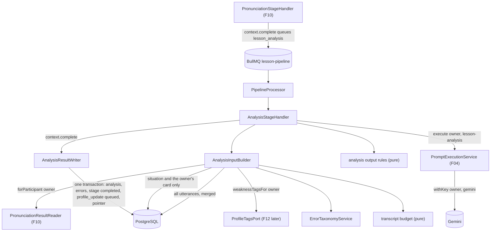
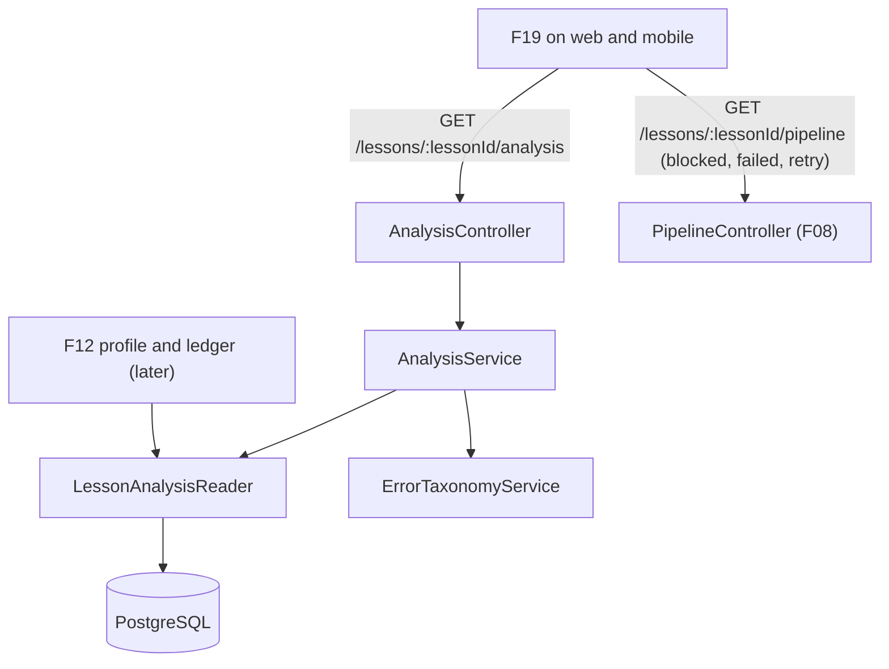

# Technical Specification: AI Lesson Analysis

## 1. Technical Overview

**What:** When F10 completes, a participant's branch waits at `lesson_analysis` / `queued`. F11 registers that stage's handler with F08's pipeline runner. For one branch, the handler does the following:
- Reads the lesson's transcript (every participant's utterances, merged on the lesson clock), the owner's pronunciation result through F10's `PronunciationResultReader`, the shared situation, the owner's **own** role card (never another participant's), the owner's recurring weakness tags through the profile port, and the error taxonomy.
- Renders the `lesson-analysis` prompt's input. The owner's turns are labelled `YOU`, the others' `OTHER 1…N` (never names or ids). The transcript is capped at 12 000 estimated tokens, dropping the other participants' oldest turns first and the owner's oldest turns only after that, and the prompt is told where it was cut.
- Runs the prompt once through `PromptExecutionService.execute` under the owner's Gemini key. The library validates against the schema, whose error `tag` is an `enum` of the taxonomy, and retries once.
- Post-processes the output in code: every error quote must be found verbatim in the owner's own utterances (the utterance id is stored; an unmatched error is discarded and counted). Recurring tags are limited to the kept errors and the owner's profile tags. The scenario-fit expressions are partitioned from the owner's own card, so nothing off the card can appear.
- Writes the analysis and its errors in the stage's completing transaction, stamped with the prompt id and version, model, token usage and latency, and leaves the branch waiting at `profile_update` for F12.

F11 also ships the versioned error taxonomy (`apps/api/rules/error-taxonomy.yaml`, with the grammar, vocabulary and discourse families), rewrites `lesson-analysis.yaml` to version 2, adds a caller-only `GET /lessons/:lessonId/analysis`, and exposes `LessonAnalysisReader` for F12 and F19.

**Why:** This is the stage that turns a recorded conversation into something a learner can act on, and the first artifact whose *content* comes from a model rather than from a measurement. Everything downstream counts it: F12 ingests its tags into the ledger and its five scores into the profile, F19 renders it, F15 builds a plan from both. So the feature's weight is in what the schema and the code refuse, not in the prompt text:
- a tag outside the taxonomy cannot be counted, so it fails validation;
- a quote the owner never said would put someone else's words, or an invention, on their record, so it is discarded;
- an expression that is not on the owner's card would score them against a role they did not play, so it cannot appear.

It is also the first stage that runs on Gemini instead of Azure. F08's runner already made the stage generic (provider, retry policy, blocked-and-resumed), so F11 is a handler plus its input and output rules, not a new pipeline.

**Scope — Included (the PRD gives F11 no Core/Full split, so the whole feature is in scope):**
- The `lesson_analysis` stage handler on F08's runner, with `provider: 'gemini'` and the PRD's 1 / 5 / 15-minute retry policy.
- The input builder: merged transcript rendering with anonymous speaker labels, the 12 000-token budget with the owner-first truncation order and the truncation note *(decided in the spec interview)*, the pronunciation summary, the scenario block (full, situation only, or none), the taxonomy listing and the recurring weakness tags.
- `lesson-analysis.yaml` version 2: five 0–100 competencies (Grammar, Vocabulary, Fluency, Interaction, Comprehension) with justifications, 3–5 strengths, errors tagged from the taxonomy `enum`, recurring tags, the nullable scenario-fit block, and 3–6 topics.
- The error taxonomy, v1 *(decided in the spec interview)*: `apps/api/rules/error-taxonomy.yaml`, loaded and validated at boot with a pinned fingerprint. It holds 36 tags in the grammar, vocabulary and discourse families, each with a human-readable label. A boot check refuses to start when the prompt's `enum` and the taxonomy disagree.
- Output rules in code: verbatim quote matching against the owner's own utterances, where unmatched errors are discarded and counted *(decided in the spec interview)*; recurring-tag filtering; the scenario-fit partition; and the curator flags (zero errors on a lesson over 10 minutes, a scenario-fit block missing when one was due).
- Persistence: `lesson_analyses` and `lesson_analysis_errors`, one analysis per participant per lesson, replaced on every re-run.
- `GET /lessons/:lessonId/analysis` (caller only), with a truthful status, the competency deltas against the caller's previous analysed lesson, taxonomy labels, severity ordering and server-built notes.
- `LessonAnalysisReader`, the internal read contract for F12 and F19.
- The PRD's Error Handling: a missing or rejected key blocks and resumes, quota and timeouts retry and then fail, two schema failures fail with the raw response retained, and zero errors is flagged for the curator.
- Appending `profile_update` to the stage vocabulary so an analysed branch has somewhere to wait *(decided in the spec interview)*.
- An additive extension of F04's `PromptExecutionResult` (token usage and latency), and moving F06's `ProfileTagsPort` to a neutral `profile/` module so F06 and F11 share the one seam F12 replaces.
- A PRD alignment of the F11 retry wording (see Assumptions).

**Scope — Excluded:**
- **Every client surface.** The `Analyzing` step, the result section (meters with deltas, errors grouped by severity with tag chips, recurrence badges, the scenario-fit block, topics) and the blocked state are rendered by F19 on both clients, from the route below and the pipeline view. F19 also adds the Dart models. *(Decided in the spec interview; this follows the F10 precedent, and `./design` has no lesson-result mockup.)*
- **The ledger, recurrence counts and the `4th time` badge.** F12 owns the ledger. F11 stores tagged errors with their quotes and utterance ids for F12 to ingest, and F19 reads the count from F12.
- **The taxonomy's pronunciation family** (`phoneme:`, `stress:`). F12 adds it when it builds ingestion of F10's tags. The analysis never writes pronunciation tags (see Assumptions).
- **The profile update and the terminal branch status.** F12 registers `profile_update`. The terminal status belongs to whichever feature adds the pipeline's last stage.
- **Emphasising the changed portion of a correction.** F19 derives it from the quote and the correction.
- **Pronunciation scoring by the model.** Azure measures it (F10), and F12 takes the pronunciation dimension from F10.

**PRD traceability:**

| PRD block | Where it lands |
|---|---|
| Consumes (F02 Gemini key; F04 execution; F06 situation and own card; F08 utterances; F10 aggregates) | Scope; the handler's inputs (section 2); Internal contracts |
| Capabilities | Input rules, output rules, outcome table (section 2); prompt contract; Technical Decisions; Assumptions |
| Experience (`Analyzing`, `Ready`, meters with deltas, errors by severity, scenario fit, topics, blocked state) | Analysis route (section 5); status derivation; notes for F19 |
| Error Handling (5 cases) | Outcome table (section 2); reason codes (section 6) |
| Section 9, F11 | Testing Strategy, acceptance mapping |
| Section 9, Cross-Feature (F08/F10/F06→F11, F06 fit, F04 stamp, F02 keys, F11→F12, F11→F19, F05's third participant) | Testing Strategy, cross-feature table |

**Assumptions and decisions not answered by the PRD:**

| Assumption | Rationale |
|---|---|
| **The taxonomy lives in `apps/api/rules/error-taxonomy.yaml`**, like F09's rules: a quoted `version`, `families[]` (`id`, `label`, `analysis: true/false`) and `tags[]` (`tag`, `label`, `family`, `description`). The file is parsed with Zod, fingerprinted, logged at boot, and its fingerprint is pinned per version in a unit test. Tags are `family:kebab-slug`, unique, and belong to a declared family. v1 declares `grammar`, `vocab` and `discourse`, all `analysis: true`, with the 36 tags listed below. | The PRD calls the taxonomy "versioned in the repository" and the curator's to tune. F12 extends the same file with the pronunciation family (`analysis: false`) rather than a second vocabulary. The API returns each tag's label with the tag, so no client needs a copy. |
| **The prompt's `enum` duplicates the analysis tags, and a boot step checks them.** `lesson-analysis.yaml` lists the analysis-family tags as the `enum` of `errors[].tag` and `recurring_tags[]`. After the prompts load, `boot/verify-analysis-prompt.ts` compares that `enum` with the taxonomy's analysis tags and refuses to boot, naming each missing or extra tag. | F04 fixed that the taxonomy is an `enum` inside `response_schema` ("the mechanism F11 relies on"). The prompt library has no templating inside schemas. The check makes it impossible to ship one without the other. |
| **The model never writes pronunciation tags.** The analysis families exclude `phoneme:` and `stress:`, and the prompt says pronunciation is measured separately. | A quote from a transcript is what the recognizer heard, so it cannot evidence a mispronunciation. F10 already measures phonemes and emits `phoneme:` tags, and F12 takes the pronunciation dimension from Azure. |
| **Prompt v2 output schema:** `competencies` is an object with five required keys (`grammar`, `vocabulary`, `fluency`, `interaction`, `comprehension`), each `{ score: integer 0–100, justification: string }`. `strengths` has 3–5 strings. `errors` has 0–25 entries of `{ quote, tag, correction, explanation, severity }`. `recurring_tags` is an array of taxonomy tags. `scenario_fit` is `null` or `{ register_matched: boolean, register_comment: string, expressions_attempted: string[] }`. `topics_to_practice` has 3–6 strings. `max_output_tokens` is 8 192, the model stays `gemini-3.6-flash`, and the version becomes `"2"`. | The PRD's shape and scale (v1 had 1–5 scores and the wrong five competencies). A keyed object guarantees exactly one of each competency, which an array with `minItems: 5` cannot. 25 errors bound the output, and at roughly 90 tokens each they fit with room for thinking tokens. `expressions_missed` is dropped from the model's output, because code derives it from the card. |
| **The nullable `scenario_fit` uses `type: ["object", "null"]`, as v1 already does, and the stage-2 live check confirms Gemini accepts it.** If Gemini refuses it, the schema switches to `anyOf` with a `null` branch, and the progress log records which form shipped. | Loading at boot does not prove the model API accepts the form. |
| **The prompt's instructions live in the YAML, and code renders only data.** Code builds four data blocks: the transcript lines, the situation block, the role-card block, and the pronunciation and taxonomy listings. v2's variables are `transcript` (required), `truncation_note` (optional), `scenario_status` (required, one fixed sentence per context), `situation` (optional), `role_card` (optional), `pronunciation` (required), `taxonomy` (required) and `recurring_weakness_tags` (optional). | "Prompts are files" (`AGENTS.md`): every instruction a curator may tune stays in the versioned YAML. |
| **Transcript rendering:** one line per utterance, `[mm:ss] YOU: text` or `[mm:ss] OTHER n: text`, in F08's merged order and on the lesson clock (`mergeTranscript`'s shift). Minutes run past 59 (`[95:12]`). `OTHER n` is numbered by each other participant's first utterance. | No display name, user id or role label of another participant ever reaches the owner's key. Another participant's role label lives on their private card row, which F06 forbids reading. The shared situation already lists every role for context. |
| **The token budget is estimated locally**: `ceil(characters / 4)` per rendered transcript line, against 12 000, with no counting call to Gemini. The estimate and Gemini's reported input tokens are both stored, so the curator can calibrate the divisor. | This is deterministic and testable, costs no extra call on the owner's quota, and has no failure mode of its own. Four characters per token is the usual English average for Gemini's tokenizer. |
| **Truncation order** *(interview)*: drop the other participants' turns oldest-first until the transcript fits. Only if no other turn remains, drop the owner's own turns oldest-first. The note states each cut point in `mm:ss` and tells the model the start is missing, not silent. In a two-person lesson the budget is reached only past about 60 minutes. | This is the PRD read literally: "oldest utterances are dropped first" and "own utterances are preserved ahead of the others' context". |
| **Scenario context** is derived, never guessed. It is `full` when `lesson_scenarios.status = 'ready'` and the owner's card is `ready`. It is `situation_only` when the situation is `ready` but the owner's card is `pending` or `failed`: the situation and the owner's role label are sent, the prompt is told there is no card, and the fit block is always omitted. It is `none` for `failed`, `no_scenario`, `pending` or a missing row: the prompt says no scenario was in play, and the fit block is always omitted. | The PRD's `no_scenario` rule, extended to the other two ways a scenario can be absent. Register and target expressions exist only on the card, so without it there is nothing to score the fit against. |
| **The fit block is enforced in code.** Any block returned for `situation_only` or `none` is ignored. For `full`, `expressions_attempted` is matched (with the quote normalization below) against the card's `target_expressions`. `expressionsUsed` holds the card's matched expressions in card order and `expressionsNotUsed` holds the rest, so the two partition the card exactly. Model strings not on the card are dropped and logged. `registerExpected` and `roleLabel` come from the card. A `null` block when `full` stores no fit and raises the curator flag `scenario_fit_missing`. | This is the cross-feature criterion "refers only to target expressions that appear on that participant's own role card". Failing the whole analysis for one missing sub-block would cost the owner the analysis. |
| **Verbatim quotes** *(interview)*: quotes are normalized (NFKC, lowercase, curly quotes and dashes straightened, punctuation other than apostrophes removed, whitespace collapsed). A quote matches when it is a substring of one of the owner's own utterances, or of two consecutive ones, since the recognizer may split a sentence. A quote elided with `...` or `…` matches when its fragments appear in order within that span. The first match's utterance id is stored. Unmatched errors are discarded, counted in `discarded_error_count` and logged. Duplicate `(quote, tag)` pairs are collapsed. | This protects "each identified error quoted verbatim… so that I can see what I actually said". Matching only the owner's utterances also stops another participant's words from becoming the owner's error. The utterance id lets F12 and F19 link an error to its moment. |
| **Recurring tags** are de-duplicated and kept only when the tag belongs to a kept error *and* appears in the owner's recurring weakness tags from the profile port. Today the port returns `[]`, so the list is empty until F12. | The PRD sends the profile "so the analysis can mark an error as a recurrence rather than a first sighting". The model cannot claim a recurrence the data does not support. |
| **The profile seam is F06's `ProfileTagsPort`, moved to `apps/api/src/profile/profile-tags.port.ts` in a small exported `ProfileModule`.** F06 and F11 both import it, and F12 replaces its implementation once. | There is one seam and one replacement. Leaving it inside `ScenarioModule` would make F11 import the whole classroom graph, or F12 replace it twice. |
| **Pronunciation input:** for `assessed`, the five scores (`prosody` shown as "not measured" when null), the counts and the sparse or partial flags, the worst phonemes (IPA, mean, occurrences, example word) and the worst words. For `no_sample`: "No pronunciation sample was assessed for this lesson." The model uses it as context for fluency and topics, never as a score. | This is the PRD's input list. F10's note: "a `no_sample` lesson is analysed without pronunciation data, never with invented data". |
| **The curator flag `no_errors_long_lesson` is raised when zero errors are *kept*** (after discards) and `lessons.duration_seconds > 600`. The analysis is still stored and the stage completes. Every flag is logged as a warning with lesson and user ids, never content. | PRD Error Handling. Counting after discards also catches a run whose every quote was invented. |
| **Retry policy: 4 attempts, 60 s, 300 s and 900 s**, for quota (429 / `RESOURCE_EXHAUSTED`), timeouts (`PROMPT003`, F04's 90 s budget) and service errors (5xx, network, `PROMPT004` empty response). Exhausting it fails with that outcome's sentence. The PRD's "after the third failure" and "three timeouts" are aligned to "after the third retry" in `docs/prd.md`. | F08 read the identical "retries 3 times at 30s, 2m and 8m" as 1 + 3 attempts. Three delays mean three retries. |
| **Two schema failures (`PROMPT001`) fail at once** with `analysis_invalid_output` and no automatic retry. The raw response stays where F04 already keeps it (`prompt_execution.raw_response`, the `validation_failed_hard_error` row). A manual retry re-runs the stage. | PRD: "marked failed… the raw response is retained for the curator, and a manual retry is offered". F04 already retains it, so a second copy would add nothing. |
| **Other 4xx responses** (a 400 that is not an invalid key, or a 404 model) fail at once with `analysis_request_rejected`. An auth failure (401/403, or a message matching `API_KEY_INVALID`) blocks with `credential_rejected`, and the vault has already marked the key `invalid`. `CRED002` blocks as `credential_missing` or `credential_rejected` according to the stored status, and `CRED003` as `credential_unreadable`. F11 reuses the executor's `isAuthenticationFailure`, now exported. | These are F08's blocked semantics with Gemini wording. Resending a request the provider rejected would change nothing. |
| **One execution per attempt, no progress counter.** The stage writes only in `complete`, and never calls `withinRun` or `reportProgress`. | One call per participant per lesson (PRD objective). The pipeline view's `progress` stays `null`. |
| **Deltas are computed by the route**: for each competency, the current score minus the caller's analysis on their most recent earlier lesson (by `lessons.started_at`) that has one, or `null` when there is none. | The PRD's `+4`, `−2`, `—`. Building it on the server keeps web and mobile identical, like F10's notes. |
| **Notes are server-built sentences** derived in the view: `The opening of this lesson was left out of the analysis because the transcript was too long.` when truncated, and `Your role card was not available, so scenario fit was not assessed.` for `situation_only`. | Same pattern as F10's notes. |
| **Completing F11 queues `profile_update`** *(interview)*, which F11 adds to `PIPELINE_STAGE_ORDER`, `pipelineStageSchema` and the stage checks. With no handler registered, the branch waits there for F12. The terminal branch status stays open for the final stage's feature. | This is the pattern F08, F09 and F10 followed. The PRD's plan (F15) waits for "analysis and profile update". |
| **Credential usage keeps F04's label** (`F04_lesson-analysis`) and is not relabelled. | `execute` owns the `withKey` call. The label already names the prompt, and F06 audits the same way. |
| **Token usage and latency** come from an additive change to `PromptExecutionResult`: `inputTokens` and `outputTokens` (summed over both attempts, `null` when unreported) and `latencyMs`. | PRD: "Each analysis stores the prompt id and version, model, token usage and latency". Every other consumer ignores the new fields. |
| **Privacy:** the route, the reader and the input builder are scoped to one owner. No response carries another participant's scores, errors or card. Another participant's card row is never read. | `AGENTS.md`, PRD F11 and F19, F06's invariant. |
| No new environment variable, no new dependency, no design token, no screen. | Nothing is rendered in this feature. |

**Taxonomy v1 (`error-taxonomy.yaml`), all `analysis: true`:**

| Family | Tags |
|---|---|
| `grammar` (22) | `subject-verb-agreement`, `present-simple-continuous`, `present-perfect`, `past-simple`, `past-perfect`, `future-forms`, `conditional-2`, `conditional-3`, `conditional-mixed`, `modal-verb`, `passive-voice`, `reported-speech`, `relative-clause`, `article-definite`, `article-indefinite`, `preposition`, `word-order`, `question-form`, `gerund-infinitive`, `countable-uncountable`, `comparison`, `pronoun` |
| `vocab` (8) | `collocation`, `phrasal-verb`, `idiom`, `word-choice`, `word-form`, `false-friend`, `register`, `domain-term` |
| `discourse` (6) | `connector`, `cohesion`, `turn-taking`, `hedging`, `clarification`, `politeness` |

Each carries a label (`grammar:conditional-3` → `Third conditional`) and a one-line description the prompt receives. F12 adds the pronunciation family and bumps the version.

## 2. Architecture Impact

**Affected components:**

| Area | Path |
|---|---|
| Shared contracts | `packages/shared/src/schemas/pipeline.ts`, `packages/shared/src/schemas/analysis.ts`, `packages/shared/src/index.ts` |
| API: taxonomy | `apps/api/rules/error-taxonomy.yaml`, `apps/api/src/taxonomy/**` |
| API: analysis stage, result and route | `apps/api/src/analysis/**` |
| API: prompt | `apps/api/prompts/lesson-analysis.yaml`, `apps/api/src/prompts/prompt-types.ts`, `prompt-execution.service.ts`, `apps/api/src/boot/verify-analysis-prompt.ts`, `apps/api/src/main.ts` |
| API: profile seam | `apps/api/src/profile/**`, `apps/api/src/scenario/scenario.module.ts`, `role-card.service.ts` |
| API: pipeline and credentials | `apps/api/src/pipeline/pipeline.constants.ts`, `apps/api/src/credentials/credential-executor.service.ts` |
| API: wiring and docs | `apps/api/src/app.module.ts`, `apps/api/src/openapi/components.ts`, `setup.ts`, `apps/api/AGENTS.md` |
| Database | `apps/api/prisma/schema.prisma`, `apps/api/prisma/migrations/0011_lesson_analysis/migration.sql` |
| Docs | `docs/prd.md` (F11 retry wording), `docs/api/openapi.json` |

**Stage execution:**



**Reads:**



**Per-branch flow (`AnalysisStageHandler.run`):**

1. Load the lesson (`started_at`, `duration_seconds`), every participant's transcript and utterances, the owner's pronunciation result, the scenario row and the owner's own card row. If the owner has no transcript, or no pronunciation result, fail as `internal_error`. Both are unreachable, since F08 fails a no-speech track and F10 always writes a result before completing.
2. Derive the scenario context (`full`, `situation_only`, `none`), read the recurring weakness tags from the port and the taxonomy in force.
3. Build the variables: render and budget the transcript (with the note if truncated), then the situation and card blocks, the pronunciation summary, the taxonomy listing and the tags.
4. `execute(userId, 'lesson-analysis', variables)`. Classify any throw with the outcome table.
5. Apply the output rules: quotes matched and discards counted, recurring tags filtered, the fit partitioned or omitted, curator flags set. Log each flag and each discard count.
6. `context.complete`, which replaces the owner's analysis and errors and queues `profile_update`.

**Outcome table:**

| Situation | Stage outcome | Reason code |
|---|---|---|
| Valid output (first try, or after the library's one schema retry) | `completed`, branch at `profile_update` / `queued` | — |
| `CRED002` with no stored key | `blocked_missing_key`, resumed by F08's drain | `credential_missing` |
| `CRED002` with a stored key marked `invalid` | `blocked_missing_key` | `credential_rejected` |
| `CRED003` | `blocked_missing_key` | `credential_unreadable` |
| Gemini auth failure (401/403, `API_KEY_INVALID`): the vault marks the key `invalid` | `blocked_missing_key`, with the provider message | `credential_rejected` |
| 429 or `RESOURCE_EXHAUSTED` | `retrying` at 1, 5 and 15 minutes; then `failed` | `analysis_quota_exceeded` |
| `PROMPT003` (90 s timeout) | Same schedule; then `failed` | `analysis_timeout` |
| 5xx, network error, `PROMPT004` (empty response) | Same schedule; then `failed` | `analysis_service_error` |
| `PROMPT001` (schema violated twice; raw kept in `prompt_execution`) | `failed`, no automatic retry | `analysis_invalid_output` |
| Any other 4xx (a 400 that is not a key error, 404 model) | `failed`, no automatic retry | `analysis_request_rejected` |
| No error kept (none returned, or every quote discarded), lesson over 10 minutes | `completed`, curator flag `no_errors_long_lesson` | — |
| Anything unclassified (a DB fault, a crash) | Runner retry on the same schedule, then `failed` | `internal_error` |

## 3. Technical Decisions

| Decision | Chosen Approach | Alternative Considered | Trade-off |
|---|---|---|---|
| Where the taxonomy lives *(interview)* | `apps/api/rules/error-taxonomy.yaml` (grammar, vocabulary and discourse families), boot-validated, and duplicated as the prompt's `enum` under a boot check | (a) The full taxonomy with the pronunciation family now. (b) A TypeScript constant in `packages/shared`, mirrored in Dart | The enum is written twice. Accepted because F04 fixed the enum inside the YAML, the boot check makes the two impossible to diverge, and the pronunciation family is F12's to shape around F10's tags. Labels travel with the API response, so no client mirror is needed |
| Quotes the owner never said *(interview)* | Discarded, counted and logged | (a) Kept with a `quote_unverified` flag. (b) The whole stage failed | A partly good analysis loses those errors. Accepted because a fabricated or misattributed quote on someone's record is worse than a shorter list, and failing the stage for one paraphrase costs the whole analysis |
| Truncation order *(interview)* | The others' turns oldest-first, then the owner's oldest-first, with both cut points in the note | (a) One time cut for everyone. (b) A reserved floor of recent context | Very long lessons dominated by the owner lose most context. Accepted because it is the PRD's literal rule and only lessons past about 60 minutes are affected |
| Next stage *(interview)* | Append `profile_update` for F12 | Make `lesson_analysis` terminal now | The pipeline still has no terminal status. Accepted because every earlier stage followed the one-feature-early pattern, and F15 waits for "analysis and profile update" |
| Token estimation | `ceil(chars / 4)` per rendered line, with Gemini's reported input tokens stored beside it | `countTokens` under the owner's key | The estimate can be off by a few percent. Accepted because it adds no call, latency or failure mode, and the stored pair lets the curator calibrate |
| Scenario-fit expressions | The model reports only what was attempted, and code partitions the card's own list | The model reports attempted and missed, taken as given | The model's phrasing must match a card expression after normalization. Accepted because this is what makes "refers only to target expressions on the owner's own card" true by construction |
| Profile seam | Move F06's `ProfileTagsPort` to `profile/`, shared by F06 and F11 | A second port inside `analysis/` | Two F06 files change. Accepted because F12 replaces one implementation instead of two |
| Error storage | `lesson_analysis_errors` rows (tag, quote, utterance id, severity) beside a `lesson_analyses` row | One `jsonb` array on the analysis | One more table. Accepted because F12 ingests by tag and F20 counts by tag, and F06 set the rule that queryable facts get columns |

## 4. Component Overview

**Shared:**

| File Path | New/Modified | Purpose | Key Responsibilities |
|---|---|---|---|
| `packages/shared/src/schemas/pipeline.ts` | Modified | Pipeline vocabulary | `pipelineStageSchema` gains `profile_update`. New `analysisFailureCodeSchema` (`analysis_quota_exceeded`, `analysis_timeout`, `analysis_service_error`, `analysis_invalid_output`, `analysis_request_rejected`), folded into `stageFailureCodeSchema` |
| `packages/shared/src/schemas/analysis.ts` | New | The analysis contract | `analysisCompetencySchema` (five values, in the PRD's order), `errorSeveritySchema`, `scenarioContextSchema`, `analysisCompetencyViewSchema` (`score`, `justification`, `delta`), `analysisErrorViewSchema`, `scenarioFitViewSchema`, `lessonAnalysisViewSchema` |
| `packages/shared/src/index.ts` | Modified | Barrel | Re-exports |

**Backend: taxonomy (`apps/api/src/taxonomy/`, `apps/api/rules/`):**

| File Path | New/Modified | Purpose | Key Responsibilities |
|---|---|---|---|
| `apps/api/rules/error-taxonomy.yaml` | New | The taxonomy, v1 | Header comment (edit rules, bump the version, restart the API), families, and the 36 tags with labels and descriptions |
| `error-taxonomy.ts` | New | File contract | Zod file schema (tag format, unique tags, declared families, non-empty labels), `loadErrorTaxonomyFile(path)` → `{ version, fingerprint, families, tags, analysisTags }`, where the fingerprint is a SHA-256 of the canonical content |
| `error-taxonomy.service.ts` | New | Holds the taxonomy in force | Loads it at module init (an invalid file stops boot, with every issue listed), `current()`, `labelOf(tag)` (falls back to the tag itself for a retired tag), `isAnalysisTag(tag)` |
| `taxonomy.module.ts` | New | Wiring | Provides and exports the service. F12, F14 and F17 import it later |

**Backend: analysis (`apps/api/src/analysis/`):**

| File Path | New/Modified | Purpose | Key Responsibilities |
|---|---|---|---|
| `analysis.module.ts` | New | Wiring | Imports the pipeline, prompts, pronunciation, taxonomy and profile modules. Provides the builder, writer, reader, handler, service and controller. Exports the reader |
| `analysis.constants.ts` | New | Fixed values | The retry policy (4 attempts: 60 s, 300 s, 900 s), the 12 000-token budget and the 4-characters divisor, the 600 s curator threshold, the reason sentences, the note sentences and the `scenario_status` sentences |
| `analysis-transcript.ts` | New | Pure rendering and budget | `renderTranscript(lines, ownerId)` → labelled `[mm:ss]` lines. `fitToBudget(lines, budget)` → kept lines plus `{ truncated, othersOmittedBeforeMs, ownOmittedBeforeMs, droppedOthers, droppedOwn, estimatedTokens }` and the note text. No I/O |
| `analysis-input.builder.ts` | New | Reads and renders the input | Loads the data in the flow's step 1, never another participant's card row. Derives the scenario context and returns the prompt variables plus the metadata the writer stores |
| `analysis-output.ts` | New | Pure output rules | `normalizeForMatch`, quote matching against the owner's utterances (single, consecutive pair, ellipsis fragments), de-duplication, the recurring-tag filter, the fit partition or omission, and the curator flags. No I/O |
| `analysis-outcome.ts` | New | Error classification | Maps a thrown error to blocked, retryable or failed, using the vault's stored status and `isAuthenticationFailure` |
| `analysis-result.writer.ts` | New | Persistence | Inside the completing transaction: deletes the owner's previous analysis for the lesson (its errors cascade), then inserts the analysis and its errors |
| `analysis-stage.handler.ts` | New | The `lesson_analysis` stage | The flow in section 2. `provider: 'gemini'`. Registers with the registry at module init |
| `analysis-result.reader.ts` | New | Read contract for F12, F19 and the route | `forParticipant(lessonId, userId)` and `previousFor(userId, lessonStartedAt)` → the stored analysis, or null |
| `analysis.service.ts` | New | Route logic | Caller-scoped view: status from the caller's branch and stage row, competencies with deltas, errors ordered by severity with labels, fit, topics and notes |
| `analysis.controller.ts` | New | HTTP surface | `GET /lessons/:lessonId/analysis`, with OpenAPI decorators |

**Backend: prompt, profile seam and wiring:**

| File Path | New/Modified | Purpose | Key Responsibilities |
|---|---|---|---|
| `apps/api/prompts/lesson-analysis.yaml` | Modified | Prompt v2 | The system text, template, variables, schema, constraints and one example described in section 1, with `version: "2"` |
| `apps/api/src/prompts/prompt-types.ts`, `prompt-execution.service.ts` | Modified | Usage on the result | `PromptExecutionResult` gains `inputTokens`, `outputTokens` and `latencyMs`, the same values the telemetry row records |
| `apps/api/src/boot/verify-analysis-prompt.ts` | New | Boot check | Compares `lesson-analysis`'s `enum`s with the taxonomy's analysis tags. Throws, naming each missing or extra tag |
| `apps/api/src/main.ts` | Modified | Boot order | Runs the check right after `loadPrompts` |
| `apps/api/src/profile/profile-tags.port.ts`, `profile.module.ts` | New (moved) | The profile seam | F06's port, unchanged in behaviour, exported by `ProfileModule` |
| `apps/api/src/scenario/scenario.module.ts`, `role-card.service.ts` | Modified | Seam import | Import the port from `ProfileModule`. Delete `scenario/profile-tags.port.ts` |
| `apps/api/src/credentials/credential-executor.service.ts` | Modified | Shared predicate | Exports `isAuthenticationFailure` |
| `apps/api/src/pipeline/pipeline.constants.ts` | Modified | Stage order | Appends `profile_update` and updates the comment |
| `apps/api/src/app.module.ts` | Modified | Root | Imports `TaxonomyModule`, `ProfileModule` and `AnalysisModule` |
| `apps/api/src/openapi/components.ts`, `setup.ts` | Modified | Document | Registers `LessonAnalysisView` and the `analysis` tag |
| `apps/api/AGENTS.md` | Modified | Conventions | The port example path becomes `profile/profile-tags.port.ts` |

**Database:**

| Migration File | Tables Affected | Operation | Notes |
|---|---|---|---|
| `apps/api/prisma/migrations/0011_lesson_analysis/migration.sql` | `lesson_analyses`, `lesson_analysis_errors` | CREATE | One analysis per participant per lesson, and its tagged errors |
| same | `lesson_pipeline_stages` | ALTER | Widens `ck_stages_stage` (`profile_update`) and `ck_stages_reason_code` (analysis codes) |
| same | `lesson_pipeline_branches` | ALTER | Widens `ck_branches_stage` and `ck_branches_failure_code` |

**Documentation:**

| File Path | New/Modified | Purpose | Key Responsibilities |
|---|---|---|---|
| `docs/prd.md` | Modified | Product definition | F11 Error Handling: "after the third retry fails", and "a timeout on the third retry fails the stage" |
| `docs/api/openapi.json` | Regenerated | API document | The new route and component, and the widened stage and reason vocabularies |

## 5. API Contracts

Authentication follows F01's two transports through the global `SessionGuard`. The route returns `CLASS004` for a lesson the caller did not take part in, and for an unknown id.

---

### Endpoint: Read the caller's lesson analysis

- **Method:** GET
- **Path:** `/lessons/:lessonId/analysis`
- **Authentication:** Session cookie or bearer token

**Request:**

| Field | Type | Required | Validation | Description |
|---|---|---|---|---|
| `lessonId` | `uuid` | Yes | path param, valid UUID | The lesson |

**Response (200):**

| Field | Type | Description |
|---|---|---|
| `data.lessonId` | `uuid` | The lesson |
| `data.status` | `string` | The caller's own state. `pending`: their branch has not settled F11 yet (upstream, queued, running, retrying or blocked; the pipeline view says which). `ready`. `failed`: F11 failed, and the reason and retry are on the pipeline view. `unavailable`: no branch, or the branch failed before reaching F11 |
| `data.analysis` | `object \| null` | Set for `ready` only |
| `…analysis.competencies[]` | `array` | Always five, in the order Grammar, Vocabulary, Fluency, Interaction, Comprehension: `competency`, `score` (0–100), `justification`, `delta` (integer, or `null` on the caller's first analysed lesson) |
| `…analysis.strengths[]` | `string[]` | 3–5 |
| `…analysis.errors[]` | `array` | Ordered major, then moderate, then minor, then as returned: `quote`, `correction`, `explanation`, `severity`, `tag`, `tagLabel`, `recurring` (boolean), `utteranceId` (the owner's utterance, or `null` if the transcript was since replaced) |
| `…analysis.recurringTags[]` | `string[]` | Tags flagged as recurring |
| `…analysis.scenarioContext` | `string` | `full`, `situation_only` or `none` |
| `…analysis.scenarioFit` | `object \| null` | Only when `full`: `roleLabel`, `registerExpected` (`formal`, `neutral`, `informal`), `registerMatched` (boolean), `registerComment`, `expressionsUsed[]`, `expressionsNotUsed[]` (together, exactly the card's list) |
| `…analysis.topicsToPractice[]` | `string[]` | 3–6 |
| `…analysis.notes[]` | `string[]` | Server-built sentences: truncation, then missing card |
| `…analysis.analyzedAt` | `datetime` | When it was written |

**Response Example (ready, second lesson, full scenario):**
```json
{
  "data": {
    "lessonId": "9f1c4d7e-3b2a-4f51-9d0c-7a6b5e4c3d21",
    "status": "ready",
    "analysis": {
      "competencies": [
        { "competency": "grammar", "score": 68, "justification": "Frequent tense slips such as \"I have seen him yesterday\".", "delta": 4 },
        { "competency": "vocabulary", "score": 74, "justification": "Good range in the travel domain, with some imprecise verbs.", "delta": -2 },
        { "competency": "fluency", "score": 71, "justification": "Long turns with few hesitations once the topic settled.", "delta": 0 },
        { "competency": "interaction", "score": 77, "justification": "Picked up on the other speaker's objections and asked follow-ups.", "delta": 3 },
        { "competency": "comprehension", "score": 80, "justification": "Responded accurately to every question put to them.", "delta": 1 }
      ],
      "strengths": [
        "Kept the negotiation moving with concrete proposals.",
        "Used hedging to disagree politely.",
        "Recovered quickly after misunderstanding a question."
      ],
      "errors": [
        {
          "quote": "if I would have known, I would have booked earlier",
          "correction": "if I had known, I would have booked earlier",
          "explanation": "The if-clause of a third conditional takes the past perfect, not 'would have'.",
          "severity": "major",
          "tag": "grammar:conditional-3",
          "tagLabel": "Third conditional",
          "recurring": false,
          "utteranceId": "0c2d4e6f-8a1b-4c3d-9e5f-7a6b5c4d3e21"
        }
      ],
      "recurringTags": [],
      "scenarioContext": "full",
      "scenarioFit": {
        "roleLabel": "The Traveler",
        "registerExpected": "neutral",
        "registerMatched": true,
        "registerComment": "Polite but firm throughout, which suits a passenger asking for an exception.",
        "expressionsUsed": ["to be on the safe side", "with all due respect"],
        "expressionsNotUsed": ["I would feel more comfortable if", "let us be realistic", "the bottom line is", "no offense, but"]
      },
      "topicsToPractice": [
        "Third conditional in spoken hypotheticals",
        "Present perfect vs. past simple with time markers",
        "Negotiation phrases for conceding a point"
      ],
      "notes": [],
      "analyzedAt": "2026-09-24T14:32:10.000Z"
    }
  }
}
```
(Lists abbreviated.)

**Error Codes:**

| Code | HTTP Status | Description |
|---|---|---|
| `CLASS004` | 403 | Not a participant, or unknown lesson |
| `VAL001` | 400 | `lessonId` is not a valid UUID |
| `AUTH003` | 401 | No valid session |

---

### Endpoint: Read the caller's pipeline (modified)

The stage vocabulary gains `profile_update`, and the reason vocabulary gains the analysis codes in section 6. A blocked `lesson_analysis` entry carries `blockedProvider: "gemini"` and F11's Gemini sentence. `POST …/pipeline/retry` on a failed `lesson_analysis` re-queues it with run + 1 and re-runs it in full. `progress` stays `null` for `lesson_analysis`.

---

### Internal contracts

| Contract | Shape | Used by |
|---|---|---|
| Stage handler | `stage: 'lesson_analysis'`, `provider: 'gemini'`, `retryPolicy: { attempts: 4, delaysMs: [60000, 300000, 900000] }` | F08's runner |
| `PromptExecutionResult` (extended) | `{ data, promptId, promptVersion, model, retried, inputTokens: number \| null, outputTokens: number \| null, latencyMs: number }` | F11; every other consumer unchanged |
| `ErrorTaxonomyService` | `current()` → `{ version, fingerprint, tags[{ tag, label, family, description }], analysisTags }`; `labelOf(tag)`; `isAnalysisTag(tag)` | F11 (prompt, route); F12, F14, F17 later |
| `ProfileTagsPort.weaknessTagsFor(userId)` | → `string[]` (`[]` until F12) | F06 (cards), F11 (input and recurring filter) |
| `LessonAnalysisReader.forParticipant(lessonId, userId)` | → `{ id, scores{ grammar, vocabulary, fluency, interaction, comprehension }, justifications, strengths[], errors[{ idx, quote, tag, correction, explanation, severity, utteranceId }], recurringTags[], scenarioContext, scenarioFit, topics[], pronunciationContext, transcriptTruncated, taxonomyVersion, promptId, promptVersion, model, createdAt } \| null` | F12 (five competencies at weight 0.35; errors into the ledger), F19 (via the route) |
| `LessonAnalysisReader.previousFor(userId, lessonStartedAt)` | → the same shape for the owner's most recent earlier analysed lesson, or null | The route's deltas |

**Prompt contract (`lesson-analysis` v2):**

| Variable | Required | Content |
|---|---|---|
| `transcript` | Yes | The budgeted `[mm:ss] YOU:` / `OTHER n:` lines |
| `truncation_note` | No | Both cut points, and that the start is missing rather than silent |
| `scenario_status` | Yes | One fixed sentence for `full`, `situation_only` or `none` |
| `situation` | No | Title, setting, premise, the roles with their relationships, and the vocabulary domain (`full`, `situation_only`) |
| `role_card` | No | The owner's role label, background, objective, constraint, register and numbered target expressions (`full`), or the role label alone (`situation_only`) |
| `pronunciation` | Yes | The assessed summary, or the `no_sample` sentence |
| `taxonomy` | Yes | `tag — label: description` for every analysis tag |
| `recurring_weakness_tags` | No | The profile port's tags, comma-separated |

Constraints (rendered by the library): assess only the `YOU` turns, and treat the others as context; quote errors exactly as they appear in the `YOU` turns, never another speaker's; use only listed tags; do not score pronunciation; set `scenario_fit` to null when told no scenario or no card was in play; treat an omitted opening as missing text; never speculate about another participant's role card or private objective.

## 6. Data Model

### Table: `lesson_analyses`

| Column | Type | Nullable | Default | Description |
|---|---|---|---|---|
| `id` | `uuid` | No | `gen_random_uuid()` | Primary key |
| `lesson_id` | `uuid` | No | - | Lesson |
| `user_id` | `uuid` | No | - | Owner, the only reader |
| `grammar` | `smallint` | No | - | 0–100 |
| `vocabulary` | `smallint` | No | - | 0–100 |
| `fluency` | `smallint` | No | - | 0–100 |
| `interaction` | `smallint` | No | - | 0–100 |
| `comprehension` | `smallint` | No | - | 0–100 |
| `justifications` | `jsonb` | No | - | `{ grammar, vocabulary, fluency, interaction, comprehension }`: one sentence each |
| `strengths` | `jsonb` | No | - | 3–5 strings |
| `recurring_tags` | `jsonb` | No | - | Filtered tags |
| `topics` | `jsonb` | No | - | 3–6 strings |
| `scenario_context` | `varchar(16)` | No | - | `full`, `situation_only`, `none` |
| `scenario_fit` | `jsonb` | Yes | - | `{ roleLabel, registerExpected, registerMatched, registerComment, expressionsUsed[], expressionsNotUsed[] }`, only for `full` |
| `pronunciation_context` | `varchar(16)` | No | - | `assessed` or `no_sample` (F10's result) |
| `transcript_tokens_estimated` | `integer` | No | - | The kept transcript's estimate |
| `transcript_truncated` | `boolean` | No | - | Whether any turn was dropped |
| `truncation` | `jsonb` | Yes | - | `{ othersOmittedBeforeMs, ownOmittedBeforeMs, droppedOthers, droppedOwn }` when truncated |
| `profile_tag_count` | `smallint` | No | `0` | Weakness tags sent from the profile port |
| `discarded_error_count` | `smallint` | No | `0` | Errors whose quote was not in the owner's utterances |
| `curator_flags` | `jsonb` | No | `'[]'` | `no_errors_long_lesson`, `scenario_fit_missing` |
| `taxonomy_version` | `varchar(32)` | No | - | The taxonomy in force |
| `prompt_id` | `varchar(64)` | No | - | `lesson-analysis` |
| `prompt_version` | `varchar(16)` | No | - | `2` |
| `model` | `varchar(64)` | No | - | From the prompt |
| `input_tokens` | `integer` | Yes | - | Gemini-reported, summed over both attempts |
| `output_tokens` | `integer` | Yes | - | Same, thinking tokens included |
| `latency_ms` | `integer` | No | - | The whole execution |
| `schema_retried` | `boolean` | No | - | The library's retry was needed |
| `created_at` | `timestamptz` | No | `now()` | When it was written |

### Table: `lesson_analysis_errors`

| Column | Type | Nullable | Default | Description |
|---|---|---|---|---|
| `id` | `uuid` | No | `gen_random_uuid()` | Primary key |
| `analysis_id` | `uuid` | No | - | The analysis |
| `lesson_id` | `uuid` | No | - | Denormalized, for owner-scoped reads |
| `user_id` | `uuid` | No | - | Owner |
| `idx` | `smallint` | No | - | Order as returned, after discards |
| `quote` | `text` | No | - | Verbatim, as the model returned it |
| `tag` | `varchar(64)` | No | - | A taxonomy tag |
| `correction` | `text` | No | - | Corrected version |
| `explanation` | `text` | No | - | Plain explanation |
| `severity` | `varchar(8)` | No | - | `minor`, `moderate`, `major` |
| `utterance_id` | `uuid` | Yes | - | The owner's matched utterance; null once the transcript is replaced |
| `created_at` | `timestamptz` | No | `now()` | Audit |

### Reason codes added (to `ck_stages_reason_code` and `ck_branches_failure_code`)

| Code | Status | Reason (user-facing) | Retried automatically | `retryable` via route |
|---|---|---|---|---|
| `analysis_quota_exceeded` | `failed` | `Gemini quota exceeded.` | Yes: 1, 5 and 15 minutes | Yes |
| `analysis_timeout` | `failed` | `The analysis request timed out.` | Yes: same schedule | Yes |
| `analysis_service_error` | `failed` | `Gemini could not analyze this lesson.` | Yes: same schedule | Yes |
| `analysis_invalid_output` | `failed` | `The analysis came back in an unexpected format.` | No | Yes |
| `analysis_request_rejected` | `failed` | `Gemini rejected the analysis request.` | No | Yes |

The blocked codes are F08's, stored with F11's Gemini sentences:
- `credential_missing`: `Blocked — add your Gemini key to analyze this lesson.`
- `credential_rejected`: `Your Gemini key was rejected. Update it in settings to resume.`
- `credential_unreadable`: `Your stored Gemini key could not be read. Enter it again in settings to resume.`

**Indexes:**

| Index Name | Columns | Type | Purpose |
|---|---|---|---|
| `ux_lesson_analyses_lesson_user` | `lesson_id`, `user_id` | unique btree | One analysis per participant per lesson |
| `ix_lesson_analyses_user_created` | `user_id`, `created_at DESC` | btree | The previous-lesson lookup for deltas, and F12's backfill |
| `ux_analysis_errors_analysis_idx` | `analysis_id`, `idx` | unique btree | Stable order |
| `ix_analysis_errors_user_tag` | `user_id`, `tag` | btree | F12's ledger ingestion and backfill by tag |

**Constraints:**

| Constraint | Type | Definition | Purpose |
|---|---|---|---|
| `fk_lesson_analyses_lesson` / `_user` | FOREIGN KEY | `ON DELETE CASCADE` | Every per-user table |
| `ck_lesson_analyses_scores` | CHECK | Each of the five `BETWEEN 0 AND 100` | Range |
| `ck_lesson_analyses_scenario_context` | CHECK | `scenario_context IN ('full','situation_only','none')` | Vocabulary |
| `ck_lesson_analyses_fit` | CHECK | `scenario_fit IS NULL OR (scenario_context = 'full' AND jsonb_typeof(scenario_fit) = 'object')` | A fit is never invented without a scenario and a card |
| `ck_lesson_analyses_pronunciation_context` | CHECK | `pronunciation_context IN ('assessed','no_sample')` | Vocabulary |
| `ck_lesson_analyses_truncation` | CHECK | `transcript_truncated = (truncation IS NOT NULL)` | Coherent |
| `ck_lesson_analyses_json` | CHECK | `justifications` is an object; `strengths` is an array of 3–5; `topics` is an array of 3–6; `recurring_tags` and `curator_flags` are arrays | Shape at the boundary |
| `fk_analysis_errors_analysis` | FOREIGN KEY | `analysis_id REFERENCES lesson_analyses(id) ON DELETE CASCADE` | Errors are replaced with their analysis |
| `fk_analysis_errors_lesson` / `_user` | FOREIGN KEY | `ON DELETE CASCADE` | Every per-user table |
| `fk_analysis_errors_utterance` | FOREIGN KEY | `utterance_id REFERENCES lesson_utterances(id) ON DELETE SET NULL` | A transcript rewrite keeps the error (the re-run replaces it anyway) |
| `ck_analysis_errors_severity` | CHECK | `severity IN ('minor','moderate','major')` | Vocabulary |
| `ck_analysis_errors_tag` | CHECK | `tag ~ '^[a-z]+:[a-z0-9-]+$'` | Format. Membership is checked against the versioned taxonomy in code |

**Migration (`0011_lesson_analysis/migration.sql`):**

```sql
-- F11 AI Lesson Analysis: one analysis per participant per lesson, written by
-- the lesson_analysis stage with its tagged errors (what F12's ledger ingests),
-- and profile_update added to the stage vocabulary so an analysed branch has
-- somewhere to wait for F12.

ALTER TABLE lesson_pipeline_stages
    DROP CONSTRAINT ck_stages_stage,
    DROP CONSTRAINT ck_stages_reason_code;
ALTER TABLE lesson_pipeline_stages
    ADD CONSTRAINT ck_stages_stage CHECK (stage IN
        ('transcription','excerpt_selection','pronunciation_assessment','lesson_analysis','profile_update')),
    ADD CONSTRAINT ck_stages_reason_code CHECK (reason_code IS NULL OR reason_code IN
        ('credential_missing','credential_rejected','credential_unreadable',
         'transcription_quota_exceeded','transcription_service_error','transcription_storage_unreadable',
         'transcription_no_speech','transcription_audio_rejected','transcription_region_unsupported',
         'pronunciation_too_few_assessed','pronunciation_quota_exhausted','pronunciation_audio_unprocessable',
         'pronunciation_storage_unreadable','pronunciation_region_unsupported',
         'analysis_quota_exceeded','analysis_timeout','analysis_service_error',
         'analysis_invalid_output','analysis_request_rejected',
         'internal_error'));

ALTER TABLE lesson_pipeline_branches
    DROP CONSTRAINT ck_branches_stage,
    DROP CONSTRAINT ck_branches_failure_code;
ALTER TABLE lesson_pipeline_branches
    ADD CONSTRAINT ck_branches_stage CHECK (stage IN
        ('recording','transcription','excerpt_selection','pronunciation_assessment','lesson_analysis','profile_update')),
    ADD CONSTRAINT ck_branches_failure_code CHECK (failure_code IS NULL OR failure_code IN
        ('recording_failed_to_start','recording_missing','recording_too_short','recording_assembly_failed',
         'transcription_quota_exceeded','transcription_service_error','transcription_storage_unreadable',
         'transcription_no_speech','transcription_audio_rejected','transcription_region_unsupported',
         'pronunciation_too_few_assessed','pronunciation_quota_exhausted','pronunciation_audio_unprocessable',
         'pronunciation_storage_unreadable','pronunciation_region_unsupported',
         'analysis_quota_exceeded','analysis_timeout','analysis_service_error',
         'analysis_invalid_output','analysis_request_rejected',
         'internal_error'));

CREATE TABLE lesson_analyses (
    id                          UUID PRIMARY KEY DEFAULT gen_random_uuid(),
    lesson_id                   UUID         NOT NULL REFERENCES lessons(id) ON DELETE CASCADE,
    user_id                     UUID         NOT NULL REFERENCES users(id)   ON DELETE CASCADE,
    grammar                     SMALLINT     NOT NULL,
    vocabulary                  SMALLINT     NOT NULL,
    fluency                     SMALLINT     NOT NULL,
    interaction                 SMALLINT     NOT NULL,
    comprehension               SMALLINT     NOT NULL,
    justifications              JSONB        NOT NULL,
    strengths                   JSONB        NOT NULL,
    recurring_tags              JSONB        NOT NULL,
    topics                      JSONB        NOT NULL,
    scenario_context            VARCHAR(16)  NOT NULL,
    scenario_fit                JSONB,
    pronunciation_context       VARCHAR(16)  NOT NULL,
    transcript_tokens_estimated INTEGER      NOT NULL,
    transcript_truncated        BOOLEAN      NOT NULL,
    truncation                  JSONB,
    profile_tag_count           SMALLINT     NOT NULL DEFAULT 0,
    discarded_error_count       SMALLINT     NOT NULL DEFAULT 0,
    curator_flags               JSONB        NOT NULL DEFAULT '[]',
    taxonomy_version            VARCHAR(32)  NOT NULL,
    prompt_id                   VARCHAR(64)  NOT NULL,
    prompt_version              VARCHAR(16)  NOT NULL,
    model                       VARCHAR(64)  NOT NULL,
    input_tokens                INTEGER,
    output_tokens               INTEGER,
    latency_ms                  INTEGER      NOT NULL,
    schema_retried              BOOLEAN      NOT NULL,
    created_at                  TIMESTAMPTZ  NOT NULL DEFAULT NOW(),
    CONSTRAINT ck_lesson_analyses_scores CHECK (
        grammar BETWEEN 0 AND 100 AND vocabulary BETWEEN 0 AND 100 AND fluency BETWEEN 0 AND 100
        AND interaction BETWEEN 0 AND 100 AND comprehension BETWEEN 0 AND 100),
    CONSTRAINT ck_lesson_analyses_scenario_context CHECK (scenario_context IN ('full','situation_only','none')),
    CONSTRAINT ck_lesson_analyses_fit CHECK (
        scenario_fit IS NULL OR (scenario_context = 'full' AND jsonb_typeof(scenario_fit) = 'object')),
    CONSTRAINT ck_lesson_analyses_pronunciation_context CHECK (pronunciation_context IN ('assessed','no_sample')),
    CONSTRAINT ck_lesson_analyses_truncation CHECK (transcript_truncated = (truncation IS NOT NULL)),
    CONSTRAINT ck_lesson_analyses_json CHECK (
        jsonb_typeof(justifications) = 'object'
        AND jsonb_typeof(strengths) = 'array' AND jsonb_array_length(strengths) BETWEEN 3 AND 5
        AND jsonb_typeof(topics) = 'array' AND jsonb_array_length(topics) BETWEEN 3 AND 6
        AND jsonb_typeof(recurring_tags) = 'array' AND jsonb_typeof(curator_flags) = 'array')
);

CREATE UNIQUE INDEX ux_lesson_analyses_lesson_user ON lesson_analyses (lesson_id, user_id);
CREATE INDEX ix_lesson_analyses_user_created ON lesson_analyses (user_id, created_at DESC);

CREATE TABLE lesson_analysis_errors (
    id           UUID PRIMARY KEY DEFAULT gen_random_uuid(),
    analysis_id  UUID         NOT NULL REFERENCES lesson_analyses(id) ON DELETE CASCADE,
    lesson_id    UUID         NOT NULL REFERENCES lessons(id) ON DELETE CASCADE,
    user_id      UUID         NOT NULL REFERENCES users(id)   ON DELETE CASCADE,
    idx          SMALLINT     NOT NULL,
    quote        TEXT         NOT NULL,
    tag          VARCHAR(64)  NOT NULL,
    correction   TEXT         NOT NULL,
    explanation  TEXT         NOT NULL,
    severity     VARCHAR(8)   NOT NULL,
    utterance_id UUID         REFERENCES lesson_utterances(id) ON DELETE SET NULL,
    created_at   TIMESTAMPTZ  NOT NULL DEFAULT NOW(),
    CONSTRAINT ck_analysis_errors_severity CHECK (severity IN ('minor','moderate','major')),
    CONSTRAINT ck_analysis_errors_tag CHECK (tag ~ '^[a-z]+:[a-z0-9-]+$')
);

CREATE UNIQUE INDEX ux_analysis_errors_analysis_idx ON lesson_analysis_errors (analysis_id, idx);
CREATE INDEX ix_analysis_errors_user_tag ON lesson_analysis_errors (user_id, tag);
```

(The implementer confirms that the constraint names match `0010`'s before dropping them, and names the foreign keys to the `fk_*` convention in the tables above.)

**Notes for later features:**
- **F12:**
  - Registers the `profile_update` handler (no provider; the update is deterministic). Every branch F11 settled is already waiting there.
  - Reads `LessonAnalysisReader.forParticipant` for the five competencies (weight 0.35) and ingests `lesson_analysis_errors` into the ledger by tag with their quotes and utterance ids, idempotent per lesson source, and can backfill every analysis written before it existed.
  - Replaces `ProfileTagsPort` in `apps/api/src/profile/`. A richer compact summary may widen the port, and prompt v2's `recurring_weakness_tags` takes free text.
  - Adds the pronunciation family to `error-taxonomy.yaml` (`analysis: false`) and bumps its version.
  - Must decide how a branch reaches `profile_update` when analysis is blocked: the PRD's F12 wants the pronunciation dimension updated anyway, and the linear pipeline alone will not get there.
- **F15:** the same linear-pipeline question applies to "a missing Gemini key still produces a deterministically composed plan". The pipeline's terminal branch status is still open for whichever feature adds the last stage.
- **F19:**
  - Renders `GET /lessons/:lessonId/analysis`: meters with `delta` (`—` for `null`), justifications, strengths, errors grouped by severity with `tagLabel` as the chip, the correction's changed portion emphasized (derived client-side from `quote` and `correction`), the fit's used and not-used groups, topics and notes.
  - Takes the `Nth time` badge count from F12's ledger.
  - Shows the blocked state from the pipeline view's `lesson_analysis` entry, and links errors to the transcript through `utteranceId`.
  - Adds the Dart models.

## 7. Testing Strategy

**Test File Structure:**

| Test File | Test Type | Target | Coverage Goal |
|---|---|---|---|
| `apps/api/test/unit/error-taxonomy.spec.ts` | Unit | File contract, fingerprint, prompt `enum` parity, boot check | 100% |
| `apps/api/test/unit/analysis-transcript.spec.ts` | Unit | Rendering, token estimate, truncation order, note | 100% |
| `apps/api/test/unit/analysis-output.spec.ts` | Unit | Quote matching, discards, recurring filter, fit partition, curator flags | 100% |
| `apps/api/test/unit/analysis-outcome.spec.ts` | Unit | Error classification | 100% |
| `apps/api/test/unit/prompt-execution.service.spec.ts` | Unit (extend) | Usage and latency on the result | — |
| `apps/api/test/unit/pipeline-backoff.spec.ts` | Unit (extend) | The stage's retry policy | — |
| `apps/api/test/unit/prompt-file-loader.spec.ts` | Unit (existing) | v2 loads, and its example validates | — |
| `apps/api/test/integration/analysis-pipeline.spec.ts` | Integration (Postgres, Redis, MinIO, real worker, Gemini faked at the SDK) | Pronunciation → analysis → result → waiting at `profile_update` | 90% |
| `apps/api/test/integration/analysis-routes.spec.ts` | Integration | The analysis view, deltas, statuses, privacy, pipeline view | 90% |
| F08, F09 and F10 suites; `helpers/pipeline-fixtures.ts`; `helpers/fake-gemini.ts` | Integration (adapted) | Resting points move past `lesson_analysis`; fixtures load prompts; the fake answers analyses | — |
| `apps/api/test/unit/openapi.spec.ts` | Unit (existing guard) | Snapshot freshness | — |

**Harness:**
- Gemini is faked at the SDK (`helpers/fake-gemini.ts`, `vi.mock('@google/genai')`), so the vault, the schema retry, telemetry, `credential_usage` and invalid-key marking all run for real. The fake gains an `analysis` call kind, recognised by `competencies` in the response schema. It records each call's API key and full message, and answers from a script per key: a valid output built from the message's own `YOU` lines (so quotes are verbatim), a given output, schema-invalid output, an out-of-taxonomy tag, errors with a given `status` (401, 429, 500, 404), an empty `text`, or a delay.
- Pipeline fixtures load the prompt registry from the real `prompts/` folder (as `scenario-fixtures.ts` does) and use the real taxonomy. Lessons reach F11 through the real F08→F10 stages: `makeRecordedLesson` with scripted utterances, and a `no_sample` selection where audio is irrelevant. Gemini keys are seeded per user with the scenario fixtures' helper. Scenarios and cards are seeded as rows (`ready`, `failed`, `no_scenario`).
- `PIPELINE_RETRY_OVERRIDES` shortens `lesson_analysis`'s policy to milliseconds. The 90 s library timeout is covered by the classification unit test, and the retry path it shares with quota errors by the integration suite.
- **Adapting earlier suites:** fixture users have no Gemini key, so where F08, F09 and F10 suites asserted a branch resting at `lesson_analysis` / `queued`, they now assert `lesson_analysis` / `blocked_missing_key` / `credential_missing`, which calls nothing. `helpers/pipeline-fixtures.ts` gains the registry load and the F11 retry override.

**`apps/api/test/unit/error-taxonomy.spec.ts`**

| Test Function | Description | Assertions |
|---|---|---|
| `loads_the_committed_taxonomy` | The repository file | v1; 36 tags; three families, all `analysis: true`; every tag labelled |
| `pins_the_fingerprint_of_each_version` | | A content change without a version bump fails |
| `rejects_duplicate_tags` | | Issue names the tag |
| `rejects_a_tag_outside_a_declared_family` | `idiom:x` | Issue names the path |
| `rejects_a_malformed_tag` | `Grammar:Third_Conditional` | Issue names the path |
| `the_prompt_enum_matches_the_analysis_tags` | The committed prompt and taxonomy | `errors[].tag.enum` and `recurring_tags[].enum` equal `analysisTags` |
| `boot_check_names_missing_and_extra_tags` | A taxonomy with one tag added and one removed | Throws, naming both |

**`apps/api/test/unit/analysis-transcript.spec.ts`**

| Test Function | Description | Assertions |
|---|---|---|
| `labels_the_owner_and_others_without_names_or_ids` | Three speakers | `YOU`, `OTHER 1`, `OTHER 2` by first utterance; no display name or id in the output |
| `timestamps_are_on_the_lesson_clock` | A late joiner | `[mm:ss]` shifted like `mergeTranscript`; minutes past 59 |
| `under_budget_keeps_everything` | | No note; `truncated = false`; the estimate equals the sum of `ceil(len / 4)` |
| `drops_others_oldest_first_before_any_own_turn` | Over budget, enough others (PRD criterion) | Only others' earliest lines dropped; every `YOU` line kept; the note names the cut |
| `drops_own_oldest_only_after_every_other_turn` | The owner's lines alone exceed the budget | No `OTHER` line left; the owner's earliest lines dropped; both cut points in the note |
| `the_note_says_the_start_is_missing_not_silent` | | Note wording |

**`apps/api/test/unit/analysis-output.spec.ts`**

| Test Function | Description | Assertions |
|---|---|---|
| `keeps_verbatim_quotes_with_their_utterance` | | Kept; `utteranceId` of the first match |
| `normalizes_case_punctuation_and_curly_quotes` | `“I’ve went there,”` vs `i've went there` | Matched |
| `matches_across_two_consecutive_own_utterances` | A quote split by the recognizer | Matched to the first |
| `matches_ellipsis_fragments_in_order` | `if I would have … booked` | Matched; out-of-order fragments do not match |
| `discards_quotes_not_in_the_owners_utterances` | A paraphrase, and another participant's exact words | Both discarded; `discardedErrors = 2` |
| `collapses_duplicate_quote_and_tag_pairs` | | One kept |
| `recurring_tags_need_a_kept_error_and_a_profile_tag` | | Tags outside either set are dropped; empty profile → empty list |
| `partitions_the_cards_expressions_into_used_and_not_used` | 6 card expressions, 2 attempted plus 1 off the card (PRD criterion) | Used = 2 in card order; not used = 4; the off-card one dropped; union = the card |
| `fit_is_null_without_a_full_scenario` | `situation_only` and `none` with a returned block | `scenarioFit` null |
| `a_missing_fit_with_a_full_scenario_is_flagged` | | `null`; flag `scenario_fit_missing` |
| `zero_errors_on_a_long_lesson_is_flagged` | 0 kept, 11 minutes | Flag `no_errors_long_lesson` |
| `zero_errors_on_a_short_lesson_is_not_flagged` | 0 kept, 9 minutes | No flag |

**`apps/api/test/unit/analysis-outcome.spec.ts`**

| Test Function | Description | Assertions |
|---|---|---|
| `a_missing_key_blocks_as_missing` | `CRED002`, no stored key | Blocked `credential_missing`, Gemini sentence |
| `an_invalid_key_blocks_as_rejected` | `CRED002` with an `invalid` key; a 401; a 400 `API_KEY_INVALID` | Blocked `credential_rejected` |
| `an_unreadable_key_blocks_as_unreadable` | `CRED003` | Blocked `credential_unreadable` |
| `quota_is_retryable` | 429; `RESOURCE_EXHAUSTED` | Retryable `analysis_quota_exceeded` |
| `a_timeout_is_retryable` | `PROMPT003` | Retryable `analysis_timeout`, `The analysis request timed out.` |
| `service_errors_and_empty_responses_are_retryable` | 500, network, `PROMPT004` | Retryable `analysis_service_error` |
| `two_schema_failures_fail_now` | `PROMPT001` | Failed `analysis_invalid_output` |
| `other_client_errors_fail_now` | 400 (not a key error), 404 | Failed `analysis_request_rejected` |

**Extensions:** `prompt-execution.service.spec.ts` gains `returns_token_usage_and_latency` (sums across the schema retry, `null` when unreported). `pipeline-backoff.spec.ts` gains `lesson_analysis_retries_at_1m_5m_15m` (4 attempts; 60 000, 300 000, 900 000; then `null`).

**`apps/api/test/integration/analysis-pipeline.spec.ts`**

| Test Function | Description | Assertions |
|---|---|---|
| `one_analysis_per_participant_with_their_own_key` | Two participants, different Gemini keys (PRD criterion; cross-feature F02) | One call per participant, each with its owner's key; one row each; `credential_usage` rows `F04_lesson-analysis` per owner |
| `output_is_stored_with_every_block` | (PRD criteria) | Five scores and justifications, 3–5 strengths, errors with quote, tag, correction, explanation and severity, fit, 3–6 topics |
| `an_unknown_tag_triggers_the_library_retry` | First answer tagged `grammar:made-up` (PRD criterion) | Two calls; the second message carries the validation errors; stored; `schema_retried` |
| `the_input_carries_the_situation_and_only_the_owners_card` | Distinct marker strings on A's and B's cards (PRD criterion; cross-feature F06) | A's message has the situation and A's card markers and none of B's; the same holds for B |
| `the_input_carries_transcript_and_pronunciation` | An assessed F10 result, then `no_sample` (cross-feature F08/F10) | Every kept utterance's text is present; scores and worst phonemes are present; the `no_sample` sentence otherwise |
| `quotes_are_matched_to_the_owners_utterances` | The fake returns a verbatim quote, a paraphrase and the other participant's words (cross-feature) | One stored with its `utterance_id`; `discarded_error_count = 2` |
| `scenario_fit_lists_used_and_not_used_from_the_owners_card` | (PRD criterion; cross-feature F06) | Used and not used partition the owner's `target_expressions`; register fields stored |
| `no_scenario_omits_the_fit_and_invents_nothing` | Scenario `no_scenario`, the fake returns a fit anyway (PRD criterion) | The message has the no-scenario sentence and no setting; `scenario_fit` null; context `none` |
| `a_failed_card_analyses_with_the_situation_only` | Situation `ready`, card `failed` | Context `situation_only`; the situation and role label in the message; no fit |
| `a_long_transcript_is_truncated_with_the_note` | Over 12 000 estimated tokens (PRD criterion) | Others' oldest lines absent, every `YOU` line present, the note present; `transcript_truncated`, `truncation` stored |
| `a_missing_key_blocks_only_analysis` | No Gemini key (PRD criterion) | `blocked_missing_key` / `credential_missing`; zero calls; the transcript and pronunciation routes still return the owner's data |
| `a_rejected_key_blocks_and_marks_the_credential_invalid` | The fake answers 401 | Blocked `credential_rejected` with the provider message; the key is `invalid`; no retry |
| `saving_a_key_resumes_the_blocked_analysis` | Then a valid key is saved | The drain resumes at run 2; `completed` |
| `two_schema_failures_fail_with_the_raw_response_retained` | Invalid twice, then the owner retries with a healthy fake (PRD criterion) | `failed` / `analysis_invalid_output`; `prompt_execution.raw_response` holds the second answer; `retryable`; the retry completes |
| `quota_retries_then_fails` | 429 on every attempt (PRD Error Handling) | 4 attempts; `failed` / `Gemini quota exceeded.` |
| `service_errors_retry_then_recover` | 500, then valid | `retrying`, then `completed` |
| `one_participants_failure_does_not_block_the_other` | A invalid twice, B valid (PRD criterion) | A `failed`, B `completed` and at `profile_update` |
| `a_third_participant_gets_their_own_analysis` | `LESSON_MAX_PARTICIPANTS = 3` (cross-feature F05) | Three analyses, each with its own key; `OTHER 1` and `OTHER 2` in each message |
| `completion_advances_to_profile_update` | | Stage `completed`; `profile_update` row `queued`; pointer `profile_update` / `queued`; no job (no handler) |
| `a_rerun_replaces_the_analysis_without_duplicating` | Retry after completion (via upstream re-run) | One row per participant; errors replaced |
| `the_analysis_stamps_prompt_id_version_model_and_usage` | (cross-feature F04) | `lesson-analysis`, `2`, the model, tokens, latency |
| `zero_errors_on_a_long_lesson_is_stored_and_flagged` | 11-minute lesson, no errors (PRD Error Handling) | `completed`; `curator_flags` has `no_errors_long_lesson` |
| `the_reader_returns_the_analysis_for_the_profile` | (cross-feature F11→F12) | Five scores, errors with tags, quotes and utterance ids; null for a participant without one |

**`apps/api/test/integration/analysis-routes.spec.ts`**

| Test Function | Description | Assertions |
|---|---|---|
| `returns_the_callers_analysis_with_labels_and_ordering` | | `ready`; five competencies in order; errors major-first with `tagLabel` and `recurring`; fit; topics; notes |
| `deltas_compare_with_the_callers_previous_lesson` | Two analysed lessons, and a first one | Deltas equal the differences; `null` on the first |
| `reports_each_status_truthfully` | Upstream, blocked, failed, ready, no branch | `pending`, `pending`, `failed`, `ready`, `unavailable`; `analysis` null except `ready` |
| `never_returns_another_participants_analysis` | A and B analysed (PRD criterion) | Neither response contains the other's scores, quotes, error ids, card content or utterance ids |
| `the_pipeline_view_shows_the_blocked_gemini_state` | No key | `lesson_analysis` `blocked_missing_key`, `blockedProvider: gemini`, the Gemini sentence |
| `retry_of_a_failed_analysis_requeues_it` | Failed as invalid output | 202; run + 1; completes |
| `rejects_a_non_participant` | | 403 `CLASS004` |
| `rejects_a_malformed_lesson_id` | | 400 `VAL001` |
| `requires_authentication` | | 401 `AUTH003` |

**Acceptance criteria (PRD, F11) → tests:**

| Criterion | Test |
|---|---|
| One analysis is produced per participant per lesson using that participant's own Gemini key | `one_analysis_per_participant_with_their_own_key`, `a_rerun_replaces_the_analysis_without_duplicating` |
| Output contains five competency scores with justifications, 3 to 5 strengths, tagged errors, a scenario-fit block and 3 to 6 topics to practice | `output_is_stored_with_every_block`, `loads_the_committed_taxonomy` (schema via `prompt-file-loader.spec.ts`) |
| Every error entry contains a verbatim quote, a taxonomy tag, a correction, an explanation and a severity | `output_is_stored_with_every_block`, `quotes_are_matched_to_the_owners_utterances`, `keeps_verbatim_quotes_with_their_utterance` |
| An error tag outside the taxonomy fails schema validation and triggers the library retry | `an_unknown_tag_triggers_the_library_retry`, `the_prompt_enum_matches_the_analysis_tags` |
| The analysis input contains the shared situation and the participant's own role card, and never another participant's card | `the_input_carries_the_situation_and_only_the_owners_card` |
| The scenario-fit block reports register appropriateness and lists which target expressions were and were not attempted | `scenario_fit_lists_used_and_not_used_from_the_owners_card`, `partitions_the_cards_expressions_into_used_and_not_used` |
| A lesson flagged `no_scenario` produces an analysis with the scenario-fit block omitted and no invented scenario | `no_scenario_omits_the_fit_and_invents_nothing`, `fit_is_null_without_a_full_scenario` |
| Transcript input is capped at 12,000 tokens, dropping the oldest utterances first and telling the model it was truncated | `a_long_transcript_is_truncated_with_the_note`, `drops_others_oldest_first_before_any_own_turn`, `drops_own_oldest_only_after_every_other_turn` |
| A participant cannot access the other participant's analysis through any view, endpoint or export | `never_returns_another_participants_analysis` |
| A missing Gemini key blocks only the analysis stage; transcript and pronunciation results remain available | `a_missing_key_blocks_only_analysis`, `the_pipeline_view_shows_the_blocked_gemini_state` |
| Two consecutive schema failures mark the stage failed with the raw response retained and a retry offered | `two_schema_failures_fail_with_the_raw_response_retained`, `retry_of_a_failed_analysis_requeues_it` |
| One participant's analysis failing does not prevent the other's from completing | `one_participants_failure_does_not_block_the_other` |

**Cross-feature integration (the parts F11 owns):**

| Criterion | Test | F11's half |
|---|---|---|
| Transcript utterances (F08), pronunciation aggregates (F10) and the scenario with the participant's own role card (F06) all appear in the analysis input (F11), and the analysis quotes errors verbatim from those utterances | `the_input_carries_transcript_and_pronunciation`, `the_input_carries_the_situation_and_only_the_owners_card`, `quotes_are_matched_to_the_owners_utterances` | The whole criterion |
| The scenario-fit block in the analysis (F11) refers only to target expressions that appear on that participant's own role card (F06) | `scenario_fit_lists_used_and_not_used_from_the_owners_card`, `partitions_the_cards_expressions_into_used_and_not_used` | The whole criterion |
| Prompt execution through the library (F04) stamps its prompt id and version onto … the analysis (F11) … | `the_analysis_stamps_prompt_id_version_model_and_usage` | The analysis's persistence of the stamp |
| Gemini and Azure credentials from the vault (F02) are the only credentials used by … F11 …, and each is used exclusively on its own owner's data | `one_analysis_per_participant_with_their_own_key`, `a_third_participant_gets_their_own_analysis` | Gemini, for F11 |
| Pronunciation aggregates (F10) update the profile's pronunciation dimension and LLM scores (F11) update the other five (F12) … | `the_reader_returns_the_analysis_for_the_profile` | The reader. F12 proves the update |
| Tagged errors from the analysis (F11) appear in the ledger (F12) with their quotes … | `the_reader_returns_the_analysis_for_the_profile` | Errors with tags, quotes and utterance ids. F12 proves the ingestion |
| Scenario (F06), transcript (F08), excerpt scores (F10) and analysis (F11) all render in the same lesson detail (F19) … | `returns_the_callers_analysis_with_labels_and_ordering` | The data. F19 renders it |
| Raising `LESSON_MAX_PARTICIPANTS` to 3 admits a third participant … and that participant receives … analysis … (F05) | `a_third_participant_gets_their_own_analysis` | The analysis branch |

**Live verification checklist (recorded in `progress.md`):** runs on the local stack with the user's own keys (`TEST_GEMINI_API_KEY`, and the stored Azure key for the end-to-end run), through throwaway scripts that are never committed:
- Run prompt v2 through the real `PromptExecutionService` on a realistic two-speaker transcript, with a full scenario and an assessed pronunciation summary. Confirm that:
  - Gemini accepts the schema: the nullable `scenario_fit` form (switch to `anyOf` if not) and the 36-value `enum`;
  - the output validates, first try or after the retry;
  - the scores are in range;
  - the kept-quote rate after matching is acceptable (record the discards);
  - the fit's expressions map onto the card.

  Record the tokens (and the estimate vs the reported count), the latency and the outcome.
- Run the same check with `no_scenario` and with a truncated transcript, and confirm that no fit is invented and that the note is honoured.
- End to end on the real stack: a scratch lesson with the user's own keys, taken through real transcription, selection, assessment and analysis. Read `GET …/analysis` and `GET …/pipeline` as that user, and confirm the branch rests at `profile_update` / `queued`.
- Blocked, then resumed: flip the user's Gemini credential to `invalid` in SQL before F11 runs (the F08 precedent). Confirm `blocked_missing_key` with the Gemini sentence. Restore the key and confirm it resumes within the drain interval and completes.
- Delete every scratch lesson, its objects and its analysis afterwards.
- Optional, with the user's go-ahead: a real two-window lesson in the user's Chrome.
