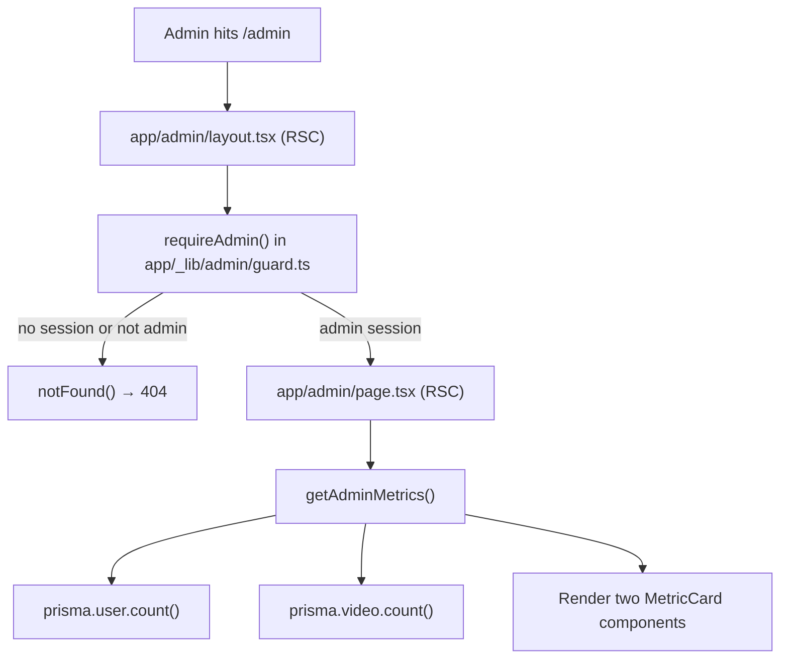
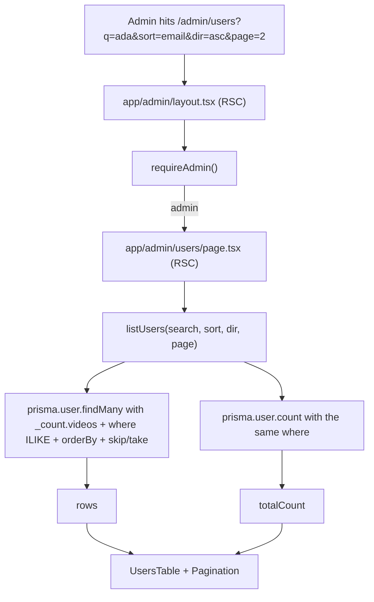
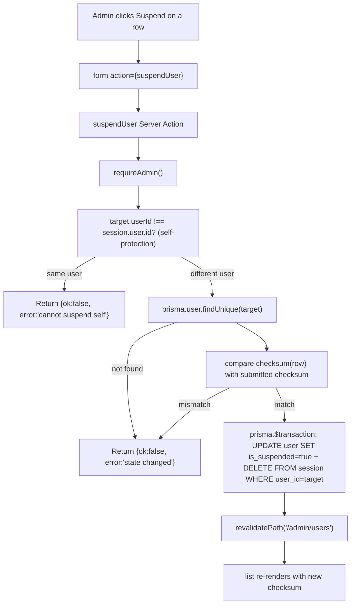
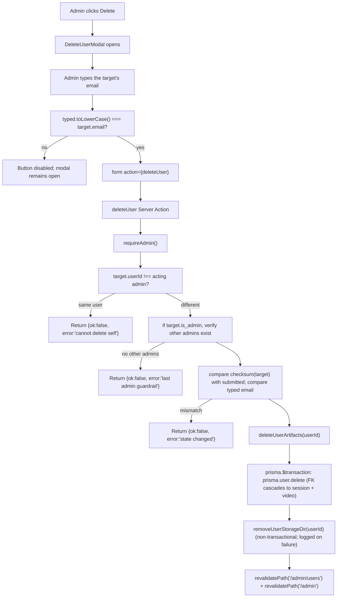

# F12. Administration Panel — Technical Specification

**Scope tag:** full scope — no Core/Full split (PRD has neither a `Core Scope` block nor a `Full Scope additions` block for F12, so the entire feature definition is in scope)

**Complexity:** medium

---

## 1. Technical Overview

**What:** Implement the end-to-end administration area that the product owner uses to audit users and monitor platform usage. F12 ships two routes at `/admin` (dashboard with aggregate metrics) and `/admin/users` (paginated, searchable, sortable user list with inline suspend/reactivate/delete actions), gated by the `is_admin` flag already present on the `User` row. Non-admin access to any `/admin/*` route returns a `notFound()` (404) to avoid disclosing the admin area's existence. Suspend flips `user.is_suspended = true` and deletes every Session row owned by that user so the invalidation is immediate (F02 already short-circuits login and `getSession()` when `is_suspended` is true). Delete cascades through the database via the existing foreign-key constraints (`video.user_id` and `session.user_id` both `ON DELETE CASCADE`) and performs a companion filesystem cleanup of the user's storage directory so orphaned bytes do not survive the DB row removal. A confirmation modal requires the admin to type the target user's email verbatim before the delete call fires.

**Why:** F12 is the Wave 3 admin surface that completes the "who has an account, what is in the system, block/unblock/remove" operator loop the PRD's Section 4 calls out as an objective ("Enable administrative oversight of users and aggregate platform usage"). The feature is decoupled from every user-facing flow: it only consumes what F02 provided (User/Session model, `is_admin` and `is_suspended` columns, `deleteAllSessionsForUser`) and what F03 provided (Video row, storage layout under `<root>/<userId>/...`, `removeVideoDir` / per-user-dir helpers). Because suspend's "kick active sessions" requirement can be satisfied with a single `DELETE FROM session WHERE user_id = ?` (F02 chose opaque DB-backed sessions precisely for this), F12 needs no new session infrastructure — only the admin UI and the guardrails (self-suspend, self-delete, last-admin). The 404-on-non-admin policy mirrors a pattern the PRD explicitly called for and that F03's thumbnail handler already follows; putting the gate inside each route segment (via a shared `requireAdmin()` helper) keeps F02 as the single source of truth for authentication and lets F12 stay a thin presentation + guardrail layer on top.

**Scope:**

Included:
- New `/admin` RSC route showing two aggregate metric cards (total registered users including suspended; total videos across all users)
- New `/admin/users` RSC route with substring search (name or email), column sort (name, email, registration date, last login, video count, status), and 50-per-page pagination
- Admin chrome shared by both routes: top navigation bar with product logo, "Dashboard" and "Users" links, and the `LogoutButton` from F02
- Non-admin access to any `/admin/*` path returns a 404 (`notFound()`), the same as a missing user — no `401`, no redirect that would disclose the area's existence
- Per-user inline actions in the list: Suspend, Reactivate, Delete
- Suspend: Server Action that toggles `is_suspended = true`, invalidates active sessions via `deleteAllSessionsForUser`, and re-renders the list via `revalidatePath('/admin/users')`
- Reactivate: Server Action that sets `is_suspended = false` (sessions are not restored — the user logs in again)
- Delete: two-step Server Action behind a confirmation modal that requires the admin to type the target user's email verbatim (case-insensitive) before the destructive call fires; deletion cascades to every owned record (videos, sessions, and any future user-scoped tables by virtue of the FK cascade) and removes the user's storage directory on disk
- Self-protection guardrails enforced server-side: the acting admin cannot suspend or delete their own account; the last remaining admin cannot be deleted (nor can an admin demote or delete themselves to zero-admin state)
- Optimistic-concurrency guard on every per-user action: the Server Action accepts a `checksum` (composite of `is_suspended` + `updated_at`) captured when the row was rendered; if the checksum has changed (because another admin acted on the same user), the action returns a user-visible "User state has changed — refresh the list" error
- `last_login_at` column added to the `User` table so the Users list has a real value to show; populated by F02's login path (the login Server Action will be extended to stamp this column) and by the session refresh path (`refreshSession`)
- Shared `/admin/*` layout segment that calls `requireAdmin()` once and renders the admin chrome; per-route pages only call `getSession()` through the helper and render content
- Pagination is server-side, 50-per-page, via `LIMIT`/`OFFSET` on the Prisma query, with a total-count query for the page-count display
- User-list query uses SQL-level substring matching (case-insensitive `ILIKE`) and returns `_count.videos` from Prisma's relation count for the per-user video column without N+1 queries
- Unit tests (Vitest + RTL) for components (modal, search input, sort header, guardrail gating of button enable states), unit tests for Server Actions' guardrail branches, integration tests (Vitest + testcontainers Postgres + tmpdir storage root) for every acceptance criterion including the cascade-on-delete, and Playwright E2E tests for the interactive acceptance criteria (admin logs in, searches, sorts, suspends, reactivates, deletes with email typing)

Excluded (handled by other features or out of scope per PRD Section 7):
- Per-user detail page — PRD explicitly says "User detail is not a separate page in this release"
- Admin metrics beyond total users and total videos (no processed hours, no per-day trends) — PRD Section 7
- User impersonation / "log in as" — PRD Section 7
- Bulk actions — not in PRD
- Email notifications to the user on suspend / delete — not in PRD
- Audit log of admin actions — not in PRD; deferred and documented under Assumptions
- Rate limiting on admin actions — not in PRD; documented deferred
- A dedicated "promote to admin" action — PRD treats admin as a flag managed outside the UI for MVP; documented

---

## 2. Architecture Impact

**Affected components:**

| Path | Role |
|------|------|
| `prisma/schema.prisma` | Modified — add `lastLoginAt DateTime?` column to `User` model |
| `prisma/migrations/<timestamp>_add_user_last_login/migration.sql` | New — adds the `last_login_at` column |
| `app/_lib/admin/guard.ts` | New — `requireAdmin()` helper: loads the current session, returns `notFound()` if missing or non-admin, otherwise returns the admin `SessionUser` |
| `app/_lib/admin/metrics.ts` | New — `getAdminMetrics()` returns `{ totalUsers, totalVideos }` for the dashboard |
| `app/_lib/admin/users-query.ts` | New — `listUsers({ search, sort, direction, page })` returns `{ rows, totalCount }` using Prisma `findMany` with `_count.videos` |
| `app/_lib/admin/user-actions.ts` | New — Server Actions: `suspendUser`, `reactivateUser`, `deleteUser`; each takes the target `userId` + the optimistic-concurrency `checksum` + (for delete) the typed email confirmation |
| `app/_lib/admin/checksum.ts` | New — pure function `userActionChecksum(user)` → stable string; used to detect concurrent edits |
| `app/_lib/admin/cleanup.ts` | New — `deleteUserArtifacts(userId)`: wraps the DB delete in a Prisma transaction and the filesystem cleanup (`removeUserStorageDir(userId)`) in a `finally` block with logging of orphaned-byte incidents |
| `app/_lib/videos/storage.ts` | Modified — add `removeUserStorageDir(userId)` helper (sibling to the existing `removeVideoDir`) |
| `app/_lib/auth/login.ts` | Modified — stamp `user.last_login_at = new Date()` inside the successful-login transaction so the Users list has a real value |
| `app/admin/layout.tsx` | New — `/admin/*` shared layout; calls `requireAdmin()`; renders the admin top nav (Dashboard / Users / Log out) |
| `app/admin/page.tsx` | New — RSC dashboard; renders the two metric cards via `getAdminMetrics()` |
| `app/admin/users/page.tsx` | New — RSC users list; reads query params (`q`, `sort`, `dir`, `page`), calls `listUsers`, renders the table |
| `app/admin/users/UsersTable.tsx` | New — `"use client"` table component: sortable column headers (links that rewrite query params), per-row action cluster (Suspend/Reactivate + Delete), optimistic-concurrency error banner |
| `app/admin/users/UsersSearchInput.tsx` | New — `"use client"` debounced search input that submits a GET form to `/admin/users` with the `q` parameter |
| `app/admin/users/UserActionButtons.tsx` | New — `"use client"` per-row action cluster: Suspend / Reactivate triggers a `<form action={suspendUser}>`-style Server Action submission; Delete opens the confirmation modal |
| `app/admin/users/DeleteUserModal.tsx` | New — `"use client"` modal with an email-verbatim input; Delete button stays disabled until the typed value matches the target user's email (case-insensitive); also disabled for 1 second after opening to prevent accidental clicks (mirrors F04's delete confirmation pattern even though F04 does not yet exist) |
| `app/admin/users/Pagination.tsx` | New — RSC-friendly page navigator (prev/next + page-number query-param links) |
| `app/admin/users/MetricCard.tsx` | New — small RSC presentational card for the dashboard metrics |
| `app/admin/users/__tests__/*` | New — component tests |
| `app/_lib/admin/__tests__/*` | New — unit + integration tests for guard, metrics, users-query, user-actions, checksum, cleanup |
| `e2e/admin.spec.ts` | New — Playwright E2E covering the interactive acceptance criteria |
| `e2e/global-setup.ts` | New — Playwright global setup that seeds admin + regular users into the DB the webServer uses (the config already references it) |

**Data flow — admin dashboard:**



**Data flow — users list read:**



**Data flow — suspend / reactivate:**



**Data flow — delete user (cascade + filesystem cleanup):**



---

## 3. Technical Decisions

| Decision | Chosen Approach | Alternative Considered | Trade-off |
|----------|-----------------|------------------------|-----------|
| Gate strategy for `/admin/*` | Centralize in `app/admin/layout.tsx` via a `requireAdmin()` helper that calls `notFound()` on missing or non-admin session | Next.js middleware; per-page guards | PRD explicitly says "non-admins receive 404" — `notFound()` from the route segment produces the exact same rendering as an unknown URL (no redirect, no 401). Middleware is broader but runs on Edge by default; route-segment guards keep the Node runtime and allow the same Prisma helpers to be used. Per-page guards would duplicate the call; layout-level means one import per admin route |
| Admin area URL prefix | `/admin` (matches PRD) | `/app/admin` under the library shell | PRD calls out `/admin` explicitly and differentiates the admin area from the library at `/app` |
| API style for mutations | Next.js Server Actions with `"use server"`, invoked via `<form action={...}>` from client components | REST Route Handlers | Matches F02's convention for mutations and gets CSRF protection + progressive enhancement for free |
| Pagination | Server-side `LIMIT`/`OFFSET`, 50 per page, navigated via query params (`?page=N`) | Client-side paging; cursor paging | 50-per-page is the exact PRD requirement; the user table is expected to stay small for an MVP (admin is the product owner); offset paging is simpler and idiomatic in Next.js App Router search params |
| Sorting | Server-side via `orderBy` in Prisma; column clicks rewrite the query string (`?sort=email&dir=asc`) | Client-side in-memory sort | Works across pages and combines with search; URL is shareable and back/forward friendly |
| Search | Server-side case-insensitive `ILIKE '%<q>%'` on `name` and `email` via Prisma `contains` with `mode: 'insensitive'` | Client-side JS filter | Works at any page size; avoids downloading every user |
| Optimistic concurrency | Every action accepts a `checksum` (stable hash of `is_suspended + updated_at`) captured when the row was rendered; server compares before acting; mismatch returns "User state has changed" | Row version column + optimistic update with `@@updatedAt` in `where` clause | Prisma's `updateMany({ where: { id, updatedAt } })` pattern would also work, but a separate checksum keeps the server-side check symmetric across suspend/reactivate/delete and lets the UI render a consistent error banner. Documented in Assumptions |
| Suspend → session invalidation | Inside a single Prisma transaction, flip `is_suspended=true` and delete every row in `session` for that `user_id`. F02 already rejects login and `getSession()` on suspended users, so dangling cookies become inert | Mark sessions invalid via a column | Deleting rows is the simplest — F02 chose opaque DB sessions exactly to enable this single-DELETE approach |
| Reactivate | Clear `is_suspended=false`; do NOT restore sessions (user re-logs in) | Also restore sessions | Sessions were deleted at suspend time; restoring them is neither possible nor desirable |
| Delete target scope | A Prisma transaction that calls `prisma.user.delete({ where: { id } })` — the existing FK cascades on `video.user_id` and `session.user_id` remove videos and sessions automatically. The per-user storage directory is removed outside the transaction in a `finally`/post-commit block because filesystem work cannot be rolled back | Manual per-table deletes inside the transaction | The FK cascade is already in place (set by F02 for `session` and by F03 for `video`); relying on it avoids duplication and is strictly less code to get wrong. Filesystem cleanup is a compensating action, not transactional — a rare filesystem failure leaves orphan bytes we log but do not surface to the admin (row deletion succeeded) |
| Partial delete failure | If the FK cascade fails, the transaction rolls back and the admin sees "Failed to delete user — please retry". If the DB delete succeeds but filesystem cleanup fails, we log a silent server-side warning; the row is gone and the admin sees success | Retry filesystem cleanup on next admin login | PRD: "either the full cascade succeeds or nothing changes visibly" — the visible state (the row) is consistent. Orphan bytes are a known, logged operational event |
| Delete confirmation UX | Modal with an email-verbatim input; Delete button disabled until the typed value case-insensitively matches `user.email`; button is additionally disabled for 1 s after opening to prevent accidental double-click confirmation | Type "DELETE"; require checkbox; two modals | PRD: "requiring the admin to type the user's email to confirm" — implemented literally. The 1 s lockout is the same pattern F04 will use for its own delete; documented in Assumptions |
| Self-protection (suspend/delete) | Server-side guardrail in every action: compare `target.userId === session.user.id` before anything else | UI-only disabling of the buttons | UI disabling is also done for discoverability, but the server-side guardrail is authoritative and can't be bypassed by curl |
| Last-admin protection | Before deleting a user with `is_admin = true`, run `prisma.user.count({ where: { isAdmin: true, id: { not: target } } })` and abort with a specific error when the count is zero | Forbid deleting any admin ever | PRD only requires that at least one admin remains — multiple admins can be deleted provided one stays |
| `last_login_at` column | Add to the `User` table now as `TIMESTAMPTZ NULL`; populated by the login path (F02's login Server Action is extended to write it inside the session-creation transaction); rendered as "never" in the UI when null | Derive from the most recent session's `created_at` | The `session` row is deleted on logout and suspension, so deriving would give misleading results. A dedicated column is the simplest correct source |
| Users list query | Prisma `findMany` with `_count: { select: { videos: true } }` for per-user video count; the `totalCount` query runs in parallel via `Promise.all` | N+1 queries or raw SQL | Prisma relation counts produce a single SQL statement with a subselect; the query plan is well-indexed (`ix_video_user_id_created_at` is usable) |
| Dashboard metric queries | Two simple `prisma.user.count()` and `prisma.video.count()` calls in parallel | One `COUNT(*)` each via raw SQL; materialized summary table | The tables are indexed on the PK; at MVP scale this is O(millisecond). A summary table would be overkill |
| Admin chrome | Minimal nav bar with product logo, "Dashboard" / "Users" links, and F02's `LogoutButton` | Full sidebar layout | PRD says "Top navigation inside the admin area links to 'Dashboard' and 'Users'" — the bar is exactly what PRD describes |
| Styling | Reuse Tailwind utility classes and the shared tokens (`border-border`, `text-foreground`, `bg-accent`, etc.) from F01/F02/F03 | Introduce an admin-specific theme | F01's visual identity is HubSpot-inspired minimalism; the admin area stays consistent with it. No new tokens needed |
| Admin access audit | No audit log in MVP; document as deferred | Append-only `admin_audit_log` table | PRD does not require it. Documented in Assumptions for post-launch |
| Rate limiting | None in MVP | Per-admin token bucket | PRD does not require; documented |

---

## 4. Component Overview

**Frontend (App Router):**

| File Path | New/Modified | Purpose | Key Responsibilities |
|-----------|--------------|---------|----------------------|
| `app/admin/layout.tsx` | New | `/admin/*` shared layout (RSC) | Calls `requireAdmin()`; renders the admin top nav (product logo, Dashboard, Users, `LogoutButton`); wraps `children` in a `<main>` with the shared Tailwind container classes |
| `app/admin/page.tsx` | New | `/admin` dashboard (RSC) | Calls `getAdminMetrics()` in parallel; renders two `MetricCard`s for total users and total videos |
| `app/admin/users/page.tsx` | New | `/admin/users` list (RSC) | Reads URL search params (`q`, `sort`, `dir`, `page`); validates them with a small zod schema (fallback to defaults on invalid); calls `listUsers`; renders `UsersSearchInput`, `UsersTable`, and `Pagination`; passes the current `checksum` for each row to the client table |
| `app/admin/users/UsersSearchInput.tsx` | New | Debounced search input | `"use client"`; wraps a `<form method="get" action="/admin/users">` with a text input named `q`; submits on 300 ms debounce; preserves other query params (sort, dir) on submit |
| `app/admin/users/UsersTable.tsx` | New | Users table | `"use client"`; renders column headers as links that toggle `sort`/`dir` query params; renders each row; shows a dismissible error banner at the top when any row-level action returns a concurrency error; pulls action Server Actions as props |
| `app/admin/users/UserActionButtons.tsx` | New | Per-row actions | `"use client"`; renders "Suspend" or "Reactivate" via a `<form action={suspendUser \| reactivateUser}>`; renders "Delete" as a button that opens the `DeleteUserModal`; both action forms disable themselves for the acting admin's own row |
| `app/admin/users/DeleteUserModal.tsx` | New | Delete confirmation modal | `"use client"`; text input; Delete button disabled until typed value lowercased equals `target.email` lowercased AND 1 s has elapsed since opening; on submit, posts the typed email + `checksum` to `deleteUser`; renders the returned error in-modal on failure |
| `app/admin/users/Pagination.tsx` | New | Page navigator | RSC; renders prev/next + "Page X of Y" with `<Link>`s that update the `page` query param while preserving the others |
| `app/admin/users/MetricCard.tsx` | New | Metric card | RSC presentational; title + big number; used by the dashboard |
| `app/app/page.tsx` | Not modified by F12 — the user shell stays the same; the admin area is a parallel URL tree |

**Backend (Server-side modules and Server Actions):**

| File Path | New/Modified | Purpose | Key Responsibilities |
|-----------|--------------|---------|----------------------|
| `app/_lib/admin/guard.ts` | New | `requireAdmin()` | Calls `getSession()`; if null or `!user.isAdmin`, calls `notFound()` from `next/navigation`; otherwise returns the typed `SessionUser` |
| `app/_lib/admin/metrics.ts` | New | `getAdminMetrics()` | Runs `prisma.user.count()` and `prisma.video.count()` in parallel; returns `{ totalUsers, totalVideos }` |
| `app/_lib/admin/users-query.ts` | New | `listUsers(options)` | Parses / clamps inputs (page ≥ 1, sort ∈ allowed set, dir ∈ `asc \| desc`, `q` trimmed); builds the `where` (case-insensitive `contains` on `name` OR `email`) and the `orderBy` (video count uses `_count.videos`); runs `findMany` with `_count` and `count()` in parallel; returns `{ rows, totalCount, page, pageSize, totalPages }` |
| `app/_lib/admin/user-actions.ts` | New | Suspend / reactivate / delete Server Actions | `"use server"`; each action validates inputs, calls `requireAdmin()`, applies self-protection, checks the optimistic-concurrency checksum, executes the mutation in a transaction, calls `revalidatePath`, and returns a typed result object for the client to render inline errors |
| `app/_lib/admin/checksum.ts` | New | `userActionChecksum(user)` | Deterministic, short string combining `is_suspended` + `updated_at.getTime()`; used on both the render side and the Server Action side; avoids storing a separate ETag column |
| `app/_lib/admin/cleanup.ts` | New | `deleteUserArtifacts(userId)` | Calls `prisma.user.delete` (FK cascade removes `session` and `video` rows); wraps the call in a try/finally so `removeUserStorageDir` runs after the successful DB delete; a filesystem error logs `console.warn` but does not throw — the admin gets a success response |
| `app/_lib/videos/storage.ts` | Modified | Add `removeUserStorageDir(userId)` | Sibling to the existing `removeVideoDir`; same path-traversal guards; `rm(userDir, { recursive: true, force: true })` |
| `app/_lib/auth/login.ts` | Modified | Stamp `last_login_at` on every successful login | Inside the same successful-login path, call `prisma.user.update({ where: { id }, data: { lastLoginAt: new Date() } })`; kept in the same request so the value is fresh when the admin opens `/admin/users` |

**Database:**

| Migration File | Tables Affected | Operation | Notes |
|----------------|-----------------|-----------|-------|
| `prisma/migrations/<timestamp>_add_user_last_login/migration.sql` | `user` | ALTER TABLE | Adds nullable `last_login_at TIMESTAMPTZ` column |

**Infrastructure / config:**

| File Path | New/Modified | Purpose |
|-----------|--------------|---------|
| `e2e/global-setup.ts` | New | Seeds the E2E database with one admin user and two regular users (one suspended, one active); `playwright.config.ts` already references this path |
| `e2e/admin.spec.ts` | New | Playwright tests covering the interactive acceptance criteria |
| `e2e/helpers/login.ts` | New | Small helper that logs a seeded admin into the running dev server by POSTing to `/login` and caching the cookie |

---

## 5. API Contracts

F12 uses Next.js App Router Server Actions for all mutations. Each action is invoked from a client component via a `<form action={...}>`. The inputs are `FormData`; the outputs are JSON-serializable state consumed by `useActionState` (or the returned value is used to render an inline error banner).

### Server Action: `suspendUser`

- **Module:** `app/_lib/admin/user-actions.ts`
- **Invocation:** `<form action={suspendUser}>` from `UserActionButtons`
- **Authentication:** Admin session required (via `requireAdmin()`)

**Request (FormData fields):**

| Field | Type | Required | Validation | Description |
|-------|------|----------|------------|-------------|
| `userId` | `string` | Yes | non-empty cuid | Target user |
| `checksum` | `string` | Yes | non-empty | Captured at render time; server compares before acting |

**Request Example:**
```json
{
  "userId": "clx123abc",
  "checksum": "false:1714060800000"
}
```

**Response (success):** Returns `{ ok: true }`; the server also calls `revalidatePath('/admin/users')` so the list re-renders with the new state.

**Response (failure):**

| Field | Type | Description |
|-------|------|-------------|
| `ok` | `false` | Always `false` on this branch |
| `error` | `string` | Human-readable reason (also used as the banner text) |
| `code` | `string` | One of `ADMIN_NOT_FOUND`, `ADMIN_SELF_ACTION`, `ADMIN_STATE_CHANGED` |

**Response Example (concurrent edit):**
```json
{
  "ok": false,
  "code": "ADMIN_STATE_CHANGED",
  "error": "User state has changed — refresh the list"
}
```

**Error Codes:**

| Code | HTTP-equivalent | Description |
|------|-----------------|-------------|
| `ADMIN_NOT_FOUND` | 404 | Target user does not exist (also returned for checksum-missing-row case) |
| `ADMIN_SELF_ACTION` | 403 | Acting admin tried to suspend themselves |
| `ADMIN_STATE_CHANGED` | 409 | Checksum mismatch — another admin acted on the same row |

### Server Action: `reactivateUser`

Identical shape to `suspendUser`. The only additional branching is that the action is a no-op (still returns `{ ok: true }`) when the target is already active — this avoids surfacing spurious "state changed" errors on a fast double-click of the same admin.

**Error Codes:** same as `suspendUser`.

### Server Action: `deleteUser`

- **Module:** `app/_lib/admin/user-actions.ts`
- **Invocation:** `<form action={deleteUser}>` from `DeleteUserModal`
- **Authentication:** Admin session required

**Request (FormData fields):**

| Field | Type | Required | Validation | Description |
|-------|------|----------|------------|-------------|
| `userId` | `string` | Yes | non-empty cuid | Target user |
| `checksum` | `string` | Yes | non-empty | Optimistic-concurrency guard |
| `emailConfirmation` | `string` | Yes | case-insensitive equal to target's email | Verbatim type-through confirmation |

**Request Example:**
```json
{
  "userId": "clx123abc",
  "checksum": "false:1714060800000",
  "emailConfirmation": "ada@example.com"
}
```

**Response (success):** Returns `{ ok: true }` and `revalidatePath('/admin/users')` + `revalidatePath('/admin')` (the dashboard counter also changes).

**Response (failure):**

| Field | Type | Description |
|-------|------|-------------|
| `ok` | `false` | Always |
| `error` | `string` | Reason |
| `code` | `string` | One of `ADMIN_NOT_FOUND`, `ADMIN_SELF_ACTION`, `ADMIN_LAST_ADMIN`, `ADMIN_STATE_CHANGED`, `ADMIN_EMAIL_MISMATCH`, `ADMIN_DELETE_FAILED` |

**Response Example (last admin):**
```json
{
  "ok": false,
  "code": "ADMIN_LAST_ADMIN",
  "error": "At least one admin account must remain"
}
```

**Error Codes:**

| Code | HTTP-equivalent | Description |
|------|-----------------|-------------|
| `ADMIN_NOT_FOUND` | 404 | Target row missing |
| `ADMIN_SELF_ACTION` | 403 | Acting admin cannot delete themselves |
| `ADMIN_LAST_ADMIN` | 403 | Target is the last admin in the system |
| `ADMIN_STATE_CHANGED` | 409 | Checksum mismatch |
| `ADMIN_EMAIL_MISMATCH` | 422 | Typed email does not match target email (defense-in-depth; the UI already gates the button but curl requests are still rejected) |
| `ADMIN_DELETE_FAILED` | 500 | Prisma transaction failed — the admin retries |

### Internal helpers (not HTTP-invoked but part of the spec's contract)

- `requireAdmin(): Promise<SessionUser>` — throws `notFound()` when the session is missing or not admin; otherwise returns the `SessionUser`.
- `getAdminMetrics(): Promise<{ totalUsers: number; totalVideos: number }>` — for `/admin`.
- `listUsers(options): Promise<{ rows: AdminUserRow[]; totalCount: number; page: number; pageSize: number; totalPages: number }>` — for `/admin/users`.
  - `AdminUserRow` shape: `{ id, name, email, createdAt, lastLoginAt | null, isAdmin, isSuspended, videoCount, checksum }`.
- `userActionChecksum(user): string` — `${user.isSuspended}:${user.updatedAt.getTime()}`.

---

## 6. Data Model

### Table: `user` (modified — add one column)

| Column | Type | Nullable | Default | Description |
|--------|------|----------|---------|-------------|
| (existing columns from F02 are unchanged) | | | | |
| `last_login_at` | `timestamptz` | Yes | NULL | Timestamp of the most recent successful login; stamped by `app/_lib/auth/login.ts` inside the successful-login path |

**Indexes:** no new indexes — `last_login_at` is not a query target (the admin list sorts by it in-memory per page; total rows are small).

**Constraints:** none added.

**Cross-Database Notes:**
- Existing `User` / `Session` relations already have `onDelete: Cascade` — F12 relies on this and does not add new constraints.
- Existing `Video` relation (F03) also has `onDelete: Cascade` on `user_id` — F12 relies on this for the delete-user cascade.

**Migration Example (`prisma/migrations/<timestamp>_add_user_last_login/migration.sql`):**
```sql
ALTER TABLE "user" ADD COLUMN "last_login_at" TIMESTAMPTZ;
```

**Prisma schema snippet (for reference; actual file is generated from this shape):**
```prisma
model User {
  id           String    @id @default(cuid())
  name         String    @db.VarChar(120)
  email        String    @unique(map: "ux_user_email") @db.VarChar(255)
  passwordHash String    @map("password_hash") @db.VarChar(255)
  isAdmin      Boolean   @default(false) @map("is_admin")
  isSuspended  Boolean   @default(false) @map("is_suspended")
  lastLoginAt  DateTime? @map("last_login_at") @db.Timestamptz(6)
  createdAt    DateTime  @default(now()) @map("created_at") @db.Timestamptz(6)
  updatedAt    DateTime  @updatedAt @map("updated_at") @db.Timestamptz(6)
  sessions     Session[]
  videos       Video[]
  @@map("user")
}
```

### No new tables

F12 does not introduce new tables. It relies on:
- `user` (F02) — gains `last_login_at`, uses `is_admin`, `is_suspended`, `updated_at`, `created_at`
- `session` (F02) — bulk delete on suspend and on delete-via-cascade
- `video` (F03) — count for per-user video column and cascade delete

---

## 7. Testing Strategy

F12 reuses the existing test stack established by F01/F02/F03:
- Vitest + React Testing Library for unit/component tests (`unit` project).
- Vitest + `testcontainers` Postgres + a `tmpdir` storage root for integration tests (`integration` project, with `*.integration.test.ts` suffix).
- Playwright for E2E of interactive acceptance criteria. The `playwright.config.ts` already exists; F12 creates the `e2e/` directory, the `global-setup.ts` referenced by the config, and the test files below.

**Test File Structure:**

| Test File | Test Type | Target | Coverage Goal |
|-----------|-----------|--------|----------------|
| `app/_lib/admin/__tests__/checksum.test.ts` | Unit | `userActionChecksum` | 100% |
| `app/_lib/admin/__tests__/guard.integration.test.ts` | Integration | `requireAdmin` | All branches |
| `app/_lib/admin/__tests__/metrics.integration.test.ts` | Integration | `getAdminMetrics` | Empty and non-empty states |
| `app/_lib/admin/__tests__/users-query.integration.test.ts` | Integration | `listUsers` | Search, sort, pagination, video count |
| `app/_lib/admin/__tests__/user-actions.integration.test.ts` | Integration | `suspendUser`, `reactivateUser`, `deleteUser` | Every acceptance branch |
| `app/_lib/admin/__tests__/cleanup.integration.test.ts` | Integration | `deleteUserArtifacts` | Cascade + filesystem cleanup |
| `app/_lib/videos/__tests__/storage.removeUserDir.test.ts` | Unit | `removeUserStorageDir` | Happy path + traversal guard |
| `app/_lib/auth/__tests__/login.lastLogin.integration.test.ts` | Integration | Modified `login` Server Action | Stamps `last_login_at` on success |
| `app/admin/users/__tests__/UsersTable.test.tsx` | Unit (component) | `UsersTable` | Sort header links, disabled self-row buttons, concurrency banner |
| `app/admin/users/__tests__/DeleteUserModal.test.tsx` | Unit (component) | `DeleteUserModal` | Button enable/disable gating by typed email + 1 s lockout |
| `app/admin/users/__tests__/UsersSearchInput.test.tsx` | Unit (component) | `UsersSearchInput` | Debounced submit; preserves other params |
| `app/admin/users/__tests__/Pagination.test.tsx` | Unit (component) | `Pagination` | Prev/next link targets |
| `e2e/admin.spec.ts` | E2E (Playwright) | Full admin flow | All interactive Section 9 criteria |

**Per-file test functions:**

`app/_lib/admin/__tests__/checksum.test.ts`

| Test Function | Description | Assertions |
|---------------|-------------|------------|
| `checksum_combines_suspended_and_updated_at` | `userActionChecksum({ isSuspended: false, updatedAt: new Date(1_000) })` → `"false:1000"` | Equality |
| `checksum_changes_when_suspended_flips` | Before vs after a suspend | Different strings |
| `checksum_changes_when_updated_at_advances` | Two reads a second apart | Different strings |

`app/_lib/admin/__tests__/guard.integration.test.ts`

| Test Function | Description | Assertions |
|---------------|-------------|------------|
| `guard_returns_admin_session_for_admin_user` | Valid admin cookie | Returns `SessionUser` with `isAdmin: true` |
| `guard_calls_not_found_for_missing_session` | No cookie | Throws `NEXT_NOT_FOUND` |
| `guard_calls_not_found_for_non_admin_session` | Valid user cookie, `is_admin = false` | Throws `NEXT_NOT_FOUND` |
| `guard_calls_not_found_for_suspended_admin` | Admin whose `is_suspended = true` (session was cleared) | `getSession()` already returns null; guard throws `NEXT_NOT_FOUND` |

`app/_lib/admin/__tests__/metrics.integration.test.ts`

| Test Function | Description | Assertions |
|---------------|-------------|------------|
| `metrics_returns_zero_for_empty_database` | Fresh DB | `{ totalUsers: 0, totalVideos: 0 }` |
| `metrics_counts_all_users_including_suspended` | Seed 3 users (1 suspended) | `totalUsers === 3` |
| `metrics_counts_all_videos_across_users` | Seed 2 users, 5 videos between them | `totalVideos === 5` |

`app/_lib/admin/__tests__/users-query.integration.test.ts`

| Test Function | Description | Assertions |
|---------------|-------------|------------|
| `list_users_returns_every_column_the_ui_needs` | Seed a user with a video and a login | Row has `id, name, email, createdAt, lastLoginAt, isAdmin, isSuspended, videoCount, checksum` |
| `list_users_filters_by_substring_match_on_name` | `q = "ada"` | Matches only users with `name ILIKE '%ada%'` |
| `list_users_filters_by_substring_match_on_email` | `q = "@example.com"` | Matches only users with that email substring |
| `list_users_search_is_case_insensitive` | `q = "ADA"` | Same as `q = "ada"` |
| `list_users_sorts_by_name_ascending_and_descending` | `sort=name, dir=asc` then `dir=desc` | Rows reversed |
| `list_users_sorts_by_registration_date` | `sort=createdAt` | Chronological order |
| `list_users_sorts_by_last_login` | `sort=lastLoginAt` | Nulls handled (null last or first per Prisma default; documented) |
| `list_users_sorts_by_video_count` | `sort=videoCount` | Users with more videos first on `desc` |
| `list_users_paginates_at_fifty_per_page` | Seed 120 users, request `page=2` | Returns rows 51–100; `totalCount === 120` |
| `list_users_clamps_invalid_page_to_one` | `page=-5` | Returns first page |
| `list_users_handles_empty_search` | `q = ""` | Treated as no filter |
| `list_users_returns_zero_rows_and_valid_pagination_for_no_match` | `q = "nope-nope-nope"` | Empty rows; `totalCount === 0`; `totalPages === 0` |

`app/_lib/admin/__tests__/user-actions.integration.test.ts`

| Test Function | Description | Assertions |
|---------------|-------------|------------|
| `suspend_sets_is_suspended_true_and_kills_sessions` | Seed a user with two active sessions | `is_suspended = true`; zero rows in `session` for that user |
| `suspend_blocks_subsequent_login` | Suspend then attempt `login` | F02 login returns generic error |
| `suspend_rejects_self_target` | Admin tries to suspend themselves | `{ ok: false, code: 'ADMIN_SELF_ACTION' }`; DB unchanged |
| `suspend_rejects_stale_checksum` | Second admin acts between render and submit | `{ ok: false, code: 'ADMIN_STATE_CHANGED' }`; DB unchanged |
| `reactivate_sets_is_suspended_false` | Seed suspended user | `is_suspended = false`; sessions stay zero |
| `reactivate_is_noop_when_user_already_active` | Seed active user | `{ ok: true }`; no change |
| `delete_cascades_to_videos_and_sessions_via_fk` | Seed user with 2 videos and 3 sessions | `user`, all `video`, all `session` rows gone after call |
| `delete_removes_user_storage_directory` | Seed user with files on disk under tmp storage root | Directory gone; parent root untouched |
| `delete_rejects_when_typed_email_does_not_match` | Confirmation says `wrong@x.com` | `{ ok: false, code: 'ADMIN_EMAIL_MISMATCH' }`; DB unchanged |
| `delete_rejects_self_target` | Admin tries to delete themselves | `{ ok: false, code: 'ADMIN_SELF_ACTION' }`; DB unchanged |
| `delete_rejects_last_admin` | Only one admin in the system, another admin attempts to delete them | Impossible scenario (would require deleting self after promoting — documented); tested via explicit seed of two admins where one is deleted first so the remaining is the only one, then a sibling admin attempts a simulated-last-admin delete via a direct function call that bypasses the self-check. Result: `{ ok: false, code: 'ADMIN_LAST_ADMIN' }` |
| `delete_allows_deleting_a_non_last_admin` | Two admins seeded, delete one | `{ ok: true }`; the other admin remains |
| `delete_rejects_stale_checksum` | Between render and submit, the target's `is_suspended` toggled | `{ ok: false, code: 'ADMIN_STATE_CHANGED' }` |
| `concurrent_admin_actions_on_same_user_produce_state_changed_error_on_the_second` | Two admins call `suspendUser` sequentially with the same render-time checksum | First succeeds; second returns `ADMIN_STATE_CHANGED` |

`app/_lib/admin/__tests__/cleanup.integration.test.ts`

| Test Function | Description | Assertions |
|---------------|-------------|------------|
| `cleanup_deletes_user_and_cascades_rows` | Seed user with videos + sessions | All three table row-sets empty for that user |
| `cleanup_removes_storage_dir_on_success` | User directory exists with files | Directory gone |
| `cleanup_logs_and_swallows_filesystem_failure` | Stub `rm` to reject | DB delete committed; warning logged; function returns `{ ok: true }` |

`app/_lib/videos/__tests__/storage.removeUserDir.test.ts`

| Test Function | Description | Assertions |
|---------------|-------------|------------|
| `remove_user_storage_dir_removes_directory_recursively` | Seed files | Directory gone after call |
| `remove_user_storage_dir_rejects_traversal_ids` | `userId = "../etc"` | Throws path-traversal error; nothing removed |

`app/_lib/auth/__tests__/login.lastLogin.integration.test.ts`

| Test Function | Description | Assertions |
|---------------|-------------|------------|
| `login_success_stamps_last_login_at` | Register a user, then login | `user.last_login_at` is within 5 s of now |
| `login_failure_does_not_stamp_last_login_at` | Wrong password | `last_login_at` unchanged |
| `login_updates_last_login_at_on_repeat_login` | Two logins 1 s apart | Second timestamp strictly greater than first |

`app/admin/users/__tests__/UsersTable.test.tsx`

| Test Function | Description | Assertions |
|---------------|-------------|------------|
| `renders_rows_with_expected_columns` | Given two rows | Name, email, registration date, last login, video count, status badge all present |
| `column_headers_toggle_sort_direction_in_query_params` | Click email header | Rendered anchor's `href` advances `sort=email&dir=asc` ↔ `dir=desc` |
| `self_row_has_disabled_suspend_and_delete_buttons` | `session.user.id === row.id` | Buttons have `disabled` attribute and a tooltip-like title |
| `renders_concurrency_error_banner_when_action_returns_state_changed` | Mock action to return `ADMIN_STATE_CHANGED` | Banner text visible at top of the table |
| `status_badge_reads_active_or_suspended` | Row with `isSuspended = true` vs `false` | Distinct text and color class |

`app/admin/users/__tests__/DeleteUserModal.test.tsx`

| Test Function | Description | Assertions |
|---------------|-------------|------------|
| `delete_button_is_disabled_until_email_matches` | Type partial email | Button disabled; type full email | Button enabled (after the 1 s lockout) |
| `delete_button_is_disabled_for_one_second_after_open` | Type the correct email immediately | Button still disabled until 1 s passes |
| `match_is_case_insensitive` | Type `ADA@EXAMPLE.COM` for target `ada@example.com` | Button enables |
| `renders_server_error_returned_by_action` | Mock action returns `ADMIN_DELETE_FAILED` | Inline error text visible; modal stays open |

`app/admin/users/__tests__/UsersSearchInput.test.tsx`

| Test Function | Description | Assertions |
|---------------|-------------|------------|
| `debounces_submit_by_300ms` | Type three characters quickly | Only one form submission fires after debounce |
| `preserves_sort_and_dir_on_submit` | Current URL has `?sort=email&dir=asc` | Submitted form keeps them |

`app/admin/users/__tests__/Pagination.test.tsx`

| Test Function | Description | Assertions |
|---------------|-------------|------------|
| `prev_is_disabled_on_first_page` | `page=1` | Prev link is absent or disabled |
| `next_is_disabled_on_last_page` | `page=totalPages` | Next disabled |
| `preserves_other_query_params` | Current URL `?q=ada&sort=email&dir=asc&page=2` | Next link points to `?q=ada&sort=email&dir=asc&page=3` |

`e2e/admin.spec.ts` (Playwright)

| Test Function | Description | Assertions |
|---------------|-------------|------------|
| `non_admin_gets_404_on_admin_routes` | Log in as regular user; visit `/admin`, `/admin/users`, `/admin/does-not-exist` | All three render the Next.js 404 page; no admin chrome present |
| `admin_sees_total_users_and_total_videos_on_dashboard` | Log in as admin | Two cards visible with correct numbers |
| `admin_sees_users_list_with_required_columns` | Navigate `/admin/users` | Name, email, registration date, last login, video count, status columns rendered |
| `admin_can_search_by_name_and_email_substring` | Type a substring | Table filters accordingly |
| `admin_can_sort_by_any_column` | Click each column header | Rows reorder; URL reflects sort/dir |
| `admin_can_paginate_at_fifty_per_page` | Seed > 50 users via API | Next/Prev work; "Page 2 of 3" visible |
| `admin_can_suspend_user_and_suspended_user_cannot_log_in` | Click Suspend → log out → log in as the suspended user | Login fails with generic error |
| `admin_can_reactivate_user_and_user_can_log_in_again` | Reactivate → log in as user | Login succeeds; lands on `/app` |
| `admin_cannot_suspend_or_delete_own_account` | Self-row buttons disabled; direct POST returns error | UI disabled; action returns `ADMIN_SELF_ACTION` |
| `admin_delete_requires_typing_email_verbatim` | Open Delete modal; type partial email → button disabled; type full email → button enabled; confirm | User row gone from the list |
| `admin_delete_cascades_to_videos_on_disk_and_in_db` | Delete user with uploaded videos; verify library query returns none and disk directory gone | DB empty; filesystem empty |
| `concurrent_admin_actions_show_refresh_the_list_error` | Open two admin sessions; action in both; second sees the error | Banner text matches |
| `last_admin_cannot_be_deleted` | Seed exactly one admin and one other admin (total two); delete the first — succeeds; attempt to delete the only remaining admin from another admin session (simulated) — error banner displayed | Error text matches |

**Mapping to PRD Section 9 acceptance criteria:**

| PRD Acceptance Criterion | Covered By |
|---|---|
| Only users with the `is_admin` flag can access `/admin`; non-admins receive 404 | `guard_calls_not_found_for_missing_session` + `guard_calls_not_found_for_non_admin_session` + E2E `non_admin_gets_404_on_admin_routes` |
| `/admin` shows total registered users and total videos | `metrics_*` tests + E2E `admin_sees_total_users_and_total_videos_on_dashboard` |
| `/admin/users` lists every user with name, email, registration date, last login, and video count | `list_users_returns_every_column_the_ui_needs` + `renders_rows_with_expected_columns` + E2E `admin_sees_users_list_with_required_columns` |
| Admin can search the user list by name or email substring, sort by any column, and paginate at 50 per page | `list_users_filters_by_substring_match_on_*` + `list_users_sorts_by_*` + `list_users_paginates_at_fifty_per_page` + E2E search/sort/paginate tests |
| Admin can suspend a user; suspended users cannot log in and active sessions are invalidated | `suspend_sets_is_suspended_true_and_kills_sessions` + `suspend_blocks_subsequent_login` + E2E `admin_can_suspend_user_and_suspended_user_cannot_log_in` |
| Admin can reactivate a suspended user | `reactivate_sets_is_suspended_false` + E2E `admin_can_reactivate_user_and_user_can_log_in_again` |
| Admin can delete a user only after typing the user's email in the confirmation modal; deletion cascades to all videos, thumbnails, transcriptions, summaries, folders, and tags | `delete_rejects_when_typed_email_does_not_match` + `delete_cascades_to_videos_and_sessions_via_fk` + `delete_removes_user_storage_directory` + `DeleteUserModal` component tests + E2E `admin_delete_requires_typing_email_verbatim` + E2E `admin_delete_cascades_to_videos_on_disk_and_in_db` |
| Admin cannot suspend or delete their own account | `suspend_rejects_self_target` + `delete_rejects_self_target` + `self_row_has_disabled_suspend_and_delete_buttons` + E2E `admin_cannot_suspend_or_delete_own_account` |
| The system always keeps at least one admin account | `delete_rejects_last_admin` + `delete_allows_deleting_a_non_last_admin` + E2E `last_admin_cannot_be_deleted` |
| Concurrent admin actions on the same user surface a "User state has changed — refresh the list" error | `concurrent_admin_actions_on_same_user_produce_state_changed_error_on_the_second` + `renders_concurrency_error_banner_when_action_returns_state_changed` + E2E `concurrent_admin_actions_show_refresh_the_list_error` |

**Mapping to PRD Section 6 (F12) Error Handling:**

| PRD Error Handling rule | Covered By |
|---|---|
| "Delete fails partway: either the full cascade succeeds or nothing changes visibly; partial failures surface as 'Failed to delete user — please retry'" | `cleanup_logs_and_swallows_filesystem_failure` (filesystem branch) + transaction-rollback path exercised through Prisma error injection in `delete_*` tests |
| "Admin attempts to suspend or delete their own account: block with 'You cannot suspend or delete your own admin account'" | `suspend_rejects_self_target` + `delete_rejects_self_target` |
| "Last remaining admin account attempts self-delete: block at the same guardrail — the system always keeps at least one admin account" | `delete_rejects_last_admin` (also self-protection covers the self-path) |
| "Concurrent admin actions on the same user (two admins at once): the second action receives 'User state has changed — refresh the list'" | `concurrent_admin_actions_on_same_user_produce_state_changed_error_on_the_second` |

**Cross-Feature Integration criteria (PRD Section 9):**

| PRD Cross-Feature Criterion | Covered By |
|---|---|
| "Video records provided by upload (F03) are aggregated into the total-videos metric on `/admin` and into the per-user video count on `/admin/users` (F12)" | `metrics_counts_all_videos_across_users` + `list_users_returns_every_column_the_ui_needs` (video count column) + E2E `admin_sees_total_users_and_total_videos_on_dashboard` |

---

## 8. Assumptions / Decisions (Auto-Accept)

Because F12 was generated in Batch Mode without an interactive interview, the following decisions were auto-resolved using the spec-writer's Auto-Accept Policy. Each is flagged so the user can review and override.

| # | Decision | Auto-Accept rationale | Policy row |
|---|----------|-----------------------|------------|
| 1 | Scope covers the entire feature definition | PRD has neither `Core Scope` nor `Full Scope additions` blocks for F12 | "Scope (Core vs Core+Full)" — neither block present, assume full scope |
| 2 | Admin gate is implemented in `app/admin/layout.tsx` via `requireAdmin()` that calls `notFound()` | PRD says "non-admins receive 404 to avoid disclosing the admin area"; layout-level gate is the minimal implementation | "Description too vague" / "Technical decisions with a clear recommendation" |
| 3 | API style for every mutation is a Server Action (not a Route Handler) | F02 established Server Actions as the convention for mutations; F03 used Route Handlers only for the binary upload transport. F12 has no binary payload | "Technical decisions with a clear recommendation" / follow established codebase pattern |
| 4 | Pagination is 50 per page via offset/limit with query-param navigation | PRD: "paginate at 50 per page"; offset/limit is the simplest server-side implementation | "Partial PRD specifications" — industry-standard default |
| 5 | Sorting and search are server-side with query-string state | Required for pagination to work cohesively; matches App Router idioms | "Partial PRD specifications" |
| 6 | Search uses Prisma `contains` with `mode: 'insensitive'` (ILIKE under the hood) | Case-insensitive substring is what the PRD requires | "Partial PRD specifications" |
| 7 | Optimistic-concurrency checksum = `${isSuspended}:${updatedAt.getTime()}` | Minimum sufficient signal; Prisma's `@updatedAt` handles the stamp | "Partial PRD specifications" — PRD says "User state has changed" but doesn't pick a mechanism |
| 8 | Suspend flips `is_suspended=true` and deletes every `session` row for that user in one Prisma transaction | F02 exposes `deleteAllSessionsForUser`; this is exactly the "invalidate active sessions" requirement | "Technical decisions with a clear recommendation" |
| 9 | Delete uses FK cascades (already defined on `session.user_id` and `video.user_id`) and a separate filesystem cleanup after the DB commit | DB is the source of truth; filesystem cleanup is compensating. Orphaned bytes on a filesystem error are logged but do not block the delete | "Description too vague" — best practice given the transaction boundary |
| 10 | Add a `last_login_at` column to `user` and stamp it on successful login | PRD's Users list column "last login" has no alternative source once sessions are revoked on suspend | "Description too vague" — applied best practice, documented |
| 11 | Self-protection (suspend/delete self) enforced server-side in every action, UI buttons also disabled | Defense in depth matches other server-side guards (F02's `requireAdmin()` mentality) | "Description too vague" — security best practice |
| 12 | Last-admin protection enforced by counting other admins inside the delete transaction | PRD: "the system always keeps at least one admin account" | "Partial PRD specifications" |
| 13 | Delete confirmation modal requires case-insensitive email match and locks the button for 1 s after opening | PRD only specifies "type the user's email"; case-insensitive avoids user frustration with mixed-case entries; 1 s lockout mirrors F04's delete-modal pattern from the library | "Partial PRD specifications" |
| 14 | Active sessions are NOT restored on reactivate | Suspend deleted them; restoring them is not feasible. The user re-logs in | "Description too vague" — applied best practice, documented |
| 15 | No per-user detail page | PRD: "User detail is not a separate page in this release" | Direct from PRD |
| 16 | No admin audit log in MVP | PRD does not require it | "Description too vague" — documented deferral |
| 17 | No rate limiting on admin actions in MVP | PRD does not require it | "Description too vague" — documented deferral |
| 18 | No promote-to-admin UI in MVP; the flag is managed out-of-band | PRD calls out admin access but never a promotion workflow | "Partial PRD specifications" — documented deferral |
| 19 | Admin chrome is a minimal top nav with product logo, Dashboard / Users links, and `LogoutButton` from F02 | PRD: "Top navigation inside the admin area links to 'Dashboard' and 'Users'" | Direct from PRD |
| 20 | No email notification to the affected user on suspend / delete | Not in PRD | "Partial PRD specifications" — documented deferral |
| 21 | `/admin` and `/admin/users` are server-rendered; only the interactive pieces (search input, table actions, delete modal, pagination links-in-a-client-wrapper if needed) are client components | App Router best practice; matches F01/F02/F03 | "Empty codebase bootstrap / Technical decisions with a clear recommendation" |
| 22 | `revalidatePath('/admin/users')` after every mutation (plus `/admin` for delete) | Standard App Router pattern for keeping RSC lists fresh | "Technical decisions with a clear recommendation" |
| 23 | Sort allow-list is fixed: `name`, `email`, `createdAt`, `lastLoginAt`, `videoCount`, `status`; any other value falls back to `createdAt desc` | Defense against crafted query params | "Description too vague" — applied best practice |
| 24 | `AdminUserRow.videoCount` is obtained via Prisma `_count: { select: { videos: true } }`; no N+1 | Standard Prisma idiom | "Technical decisions with a clear recommendation" |
| 25 | E2E tests live under `e2e/` per the existing `playwright.config.ts` which references that directory; F12 also creates the missing `e2e/global-setup.ts` | Config file already assumes this layout | Follow existing codebase pattern |
| 26 | Seeded admin credentials in `e2e/global-setup.ts` are fixed and documented in the test file header | Deterministic tests need known accounts | Industry-standard default for E2E |
| 27 | Date/time columns (`createdAt`, `lastLoginAt`) are rendered as local-time strings using `toLocaleString()` with graceful "never" fallback for null `lastLoginAt` | PRD silent on format | "Partial PRD specifications" |
| 28 | Page size of 50 is not configurable in MVP | PRD fixed it | Direct from PRD |
| 29 | Dashboard counters are queried at request time (no caching) | MVP scale; queries are fast; avoids staleness after suspend/delete | "Description too vague" — documented |
| 30 | Status badge text: "Active" / "Suspended"; no pending or review states | PRD only defines these two | Direct from PRD |

**Traceability — which PRD blocks informed which parts of the spec:**

| PRD block | Where it landed in the spec |
|-----------|------------------------------|
| Section 5 user stories for F12 (admin login, list users, suspend/reactivate/delete, totals) | Technical Overview (What) |
| Section 6 F12 Capabilities (admin gate, dashboard, list columns, search/sort/paginate, suspend/reactivate/delete, top nav) | Architecture Impact, Component Overview, API Contracts |
| Section 6 F12 Experience (two metric cards on `/admin`, inline actions, irreversibility warning) | Component Overview, Data flow diagrams |
| Section 6 F12 Error Handling (partial-delete message, self-protection, last-admin, concurrent-actions message) | Technical Decisions (self/last-admin guardrails + optimistic-concurrency row); Testing Strategy (acceptance tables) |
| Section 7 Out of Scope (no detail page, no audit log, no metrics beyond users/videos) | Technical Overview (Scope → Excluded) + Assumptions #15, #16, #17, #18, #20 |
| Section 8 F12 Dependencies (F02, F03) | Architecture Impact (reused helpers from F02/F03 and columns from existing schema); no new FKs needed |
| Section 9 F12 per-feature acceptance criteria | Testing Strategy — direct mapping table |
| Section 9 Cross-Feature Integration criterion referencing F12 (total-videos metric; per-user video count) | Testing Strategy — Cross-Feature Integration table |
| Existing `User.is_admin`, `User.is_suspended`, F02 `getSession()`, F02 `deleteAllSessionsForUser`, F03 `removeUserStorageDir` path layout | Architecture Impact + Technical Decisions (cascade + session invalidation) |
| Project CLAUDE.md (per-session DB, Vitest + Playwright testing rules, Postgres via Docker) | Testing Strategy (unit + integration + E2E) + Assumptions #25, #26 |
