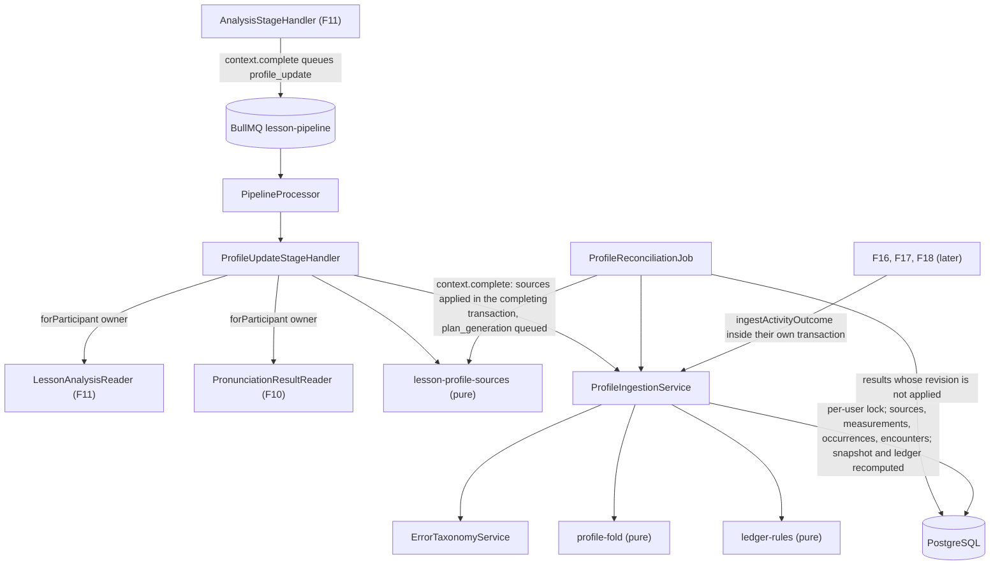
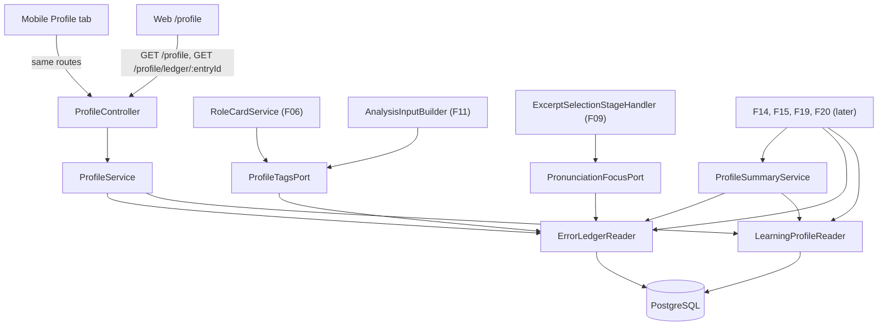

# Technical Specification: Learning Profile and Error Ledger

## 1. Technical Overview

**What:** When F11 completes, a participant's branch waits at `profile_update` / `queued`. F12 registers that stage's handler with F08's pipeline runner and builds the per-user learning profile behind it. For one branch, the handler does the following:
- Reads the owner's pronunciation result through F10's `PronunciationResultReader` and the owner's analysis through F11's `LessonAnalysisReader`.
- Maps each into a **profile source**: a lesson's pronunciation source carries one Pronunciation measurement (with Accuracy and Prosody sub-scores) and one occurrence per `phoneme:` tag; a lesson's analysis source carries the five LLM measurements and one occurrence per tagged error, with its quote.
- Applies both sources through `ProfileIngestionService` inside the stage's completing transaction, under a per-user lock. A source already applied at the same revision is skipped, so a pipeline retry never inflates anything. Tags outside the taxonomy are rejected and logged, and the rest are ingested.
- Recomputes the affected competency scores as an exponentially weighted fold over the owner's ordered measurement log (lesson weight 0.35, activity weight 0.15), and the affected ledger records from the owner's occurrence log.
- Leaves the branch waiting at `plan_generation` for F15.

The same ingestion service is the **outcome ingestion contract** F16, F17 and F18 call synchronously, inside their own submission transactions, so an activity's measurements, error occurrences and correct encounters land in the profile before the request returns. A reconciliation job ingests any pronunciation result the stage has not reached yet, which is how the pronunciation dimension still updates when the analysis is blocked on a missing Gemini key, and how lessons processed before F12 existed are backfilled.

F12 also ships version 2 of the error taxonomy (the `phoneme` family), a compact profile summary for prompts capped at 1,500 tokens, real implementations of the seams other features left for it (`ProfileTagsPort` for F06 and F11, `PronunciationFocusPort` for F09, and `ErrorLedgerPort` for F19's recurrence badge), three caller-only routes (`GET /profile`, `GET /profile/ledger`, `GET /profile/ledger/:entryId`), and the profile screen on web and mobile.

**Why:** Every stage so far produces a per-lesson artifact. F12 is the first component with memory: it is what turns ten lessons into one picture, and what separates a slip from a systematic gap. Everything the product does next reads it. F14 generates against its unmastered tags, F15 composes the plan from its summary, F16–F18 write back into it, and F19 and F20 display it. So the weight of the feature is in three guarantees rather than in the screen:
- **The numbers are a pure function of the evidence.** Scores are a fold over an ordered measurement log, and ledger records are aggregates over an occurrence log. Re-running, replacing or reordering a source cannot leave a stale or double-counted value behind, which is what makes the PRD's idempotency and concurrency rules hold by construction.
- **The ledger speaks one vocabulary.** Every tag it holds is in the versioned taxonomy, including the phoneme tags F10 already emits.
- **Nothing leaves its owner.** Each read, each seam and each summary is scoped to one user, and the summary is only ever rendered for a prompt that runs under that same user's key.

**Scope — Included (Core Scope; the Auto-Accept Policy picked Core only):**
- Six competency scores on a 0–100 scale: Grammar, Vocabulary, Fluency, Interaction and Comprehension from F11's analysis, and Pronunciation from F10's aggregate with Accuracy and Prosody as sub-scores.
- Weighted smoothing: lesson measurements at 0.35, activity measurements at 0.15, never an overwrite. The `Warming up` state under 3 measurements, the change since the previous measurement, and a trend that excludes warming-up competencies.
- The error ledger: one record per tag per user with occurrence count, first and last seen, sources, up to 5 examples, the lifecycle `state` column and the `due_at` column (see the Core-only lifecycle decision below).
- The fixed taxonomy, version 2: the `phoneme` family added to F11's grammar, vocabulary and discourse families, with a widened tag format and retired-tag handling.
- Recurring weaknesses: unmastered tags with at least 3 occurrences in the last 30 days, ranked, each with a 30-day trend.
- The compact profile summary for prompts, capped at 1,500 estimated tokens.
- Ingestion from lessons (the `profile_update` stage, plus the reconciliation job) and from activities (the in-process outcome ingestion contract), idempotent per source, serialized per user.
- The PRD's Error Handling: unknown tags rejected and logged; duplicate ingestion skipped; a pronunciation-only update with a partial-update note when the analysis is blocked or failed; per-user serialization; retired tags kept as read-only history.
- The profile screen on both clients: six meters with deltas and the warming-up marker, Pronunciation expanding to Accuracy and Prosody, the recurring weaknesses list, and a detail sheet with the tag's examples and sources.
- Integrated from earlier features' follow-ups:
  - the real `ProfileTagsPort` (F06's role cards and F11's analysis input);
  - `PronunciationFocusPort` moved to `profile/` and implemented from the ledger (F09's second ranking key);
  - ingestion of F10's `phoneme_tags` and F11's `lesson_analysis_errors`, including backfill of lessons processed before F12;
  - an answer to F11's open question of how the pronunciation dimension updates when the analysis is blocked;
  - appending `plan_generation` so a profiled branch has somewhere to wait.

**Scope — Deferred (Full Scope additions, not built by this spec):**
- **The mastery lifecycle with multi-day confirmation:** `mastered` after 3 consecutive correct encounters across at least 2 distinct days, and a new occurrence returning a mastered tag to `practicing` with its streak reset.
- **The spaced re-presentation schedule:** due dates at 1, 3, 7, 16 and 35 days after each correct encounter.
- **Recent-improvements detection:** tags mastered in the last 30 days, and competencies that gained at least 5 points across their last 3 measurements, on the snapshot, in the summary and on both screens.

How the Core-only data model behaves for the lifecycle fields that F12's Provides block promises to F14, F15 and F20 is recorded as decision A2 below, flagged for review.

**Scope — Excluded:**
- **Wiring any activity.** F16, F17 and F18 are not built. F12 specifies and tests the contract they will call, with no route and no caller in production code yet.
- **A `stress:` or prosody tag family.** No stage measures lexical stress, so there is nothing to ingest (A14).
- **The lesson result's recurrence badge (`4th time`) and the lesson-detail screen.** F19 renders them from F12's readers.
- **The progress dashboard, its measurement-history chart and its routes.** F20 builds them on `LearningProfileReader.measurementHistory` and the ledger route.
- **Content generation and plan composition** (F14, F15). They consume the summary and the readers.
- **The pipeline's terminal branch status.** F12 appends `plan_generation` one feature early (A11), and F15 adds the terminal status with the last stage.
- **Changing F11's prompt.** `lesson-analysis` stays at version 2 and keeps receiving tags through `ProfileTagsPort`, not the summary.
- **Visual regression baselines for the profile page.** The page is data-dependent, and F21's visual suite covers the primitives it composes.
- **Any view comparing participants.** Excluded by PRD Section 7.

**PRD traceability:**

| PRD block | Where it lands |
|---|---|
| Consumes (F10 pronunciation aggregates; F11 per-participant analysis) | Scope; lesson source mapping (section 2); Internal contracts |
| Provides (profile snapshot for F14, F15, F20; error ledger for F14, F15, F20; taxonomy and outcome ingestion contract for F16, F17, F18) | Scope; API Contracts (routes and internal contracts); decision A2 for the lifecycle fields |
| Core Scope | Scope — Included |
| Full Scope additions | Scope — Deferred |
| Capabilities | Section 2 rules; Technical Decisions; Assumptions A3–A27 |
| Experience | Web and mobile components (section 4); the profile view (section 5); UX notes in section 2 |
| Error Handling (5 cases) | Outcome table (section 2); A10, A16, A17, A25 |
| Acceptance criteria for F12 | Testing Strategy, acceptance mapping |
| Cross-Feature Integration criteria (F10/F11→F12, F11→F12 ledger, F12→F14, F12→F15, F16–F18→F12, F10→F18 ledger, F12/F15→F20) | Testing Strategy, cross-feature table |

**Assumptions and decisions not answered by the PRD (Batch Mode, every row flagged for user review):**

| # | Decision or assumption | Rationale | Auto-Accept row |
|---|---|---|---|
| A1 | **Core only.** The three Full Scope additions are deferred (see Scope). | The Batch Mode default. | Scope (Core vs Core+Full) |
| A2 | **Core-only lifecycle fields exist now with a simple default behaviour.** `error_ledger_entries.state` is created with a CHECK allowing `new`, `practicing` and `mastered`, but Core only ever writes `new` and `practicing` (A3). `due_at` is created nullable and Core never sets it: null means "not scheduled". `ErrorLedgerReader.dueEntries` therefore returns an empty list, and `unmasteredTags` returns every non-retired tag in the ledger. Correct encounters sent through the activity contract are **recorded from day one** (`error_ledger_encounters`), so the Full scope can compute streaks, distinct days, mastery and due dates retroactively from real evidence. The Full scope adds its own columns (streak, interval step, mastery date, encounters needed) in its own migration. | The Provides contract's shape (a state and a due date per record) is stable for F14, F15 and F20 from the start, and no evidence is lost while the lifecycle engine waits. Consequences for consumers: F14 and F15 see no tag as mastered and none as due, so review quotas are empty until the Full scope lands (F15's review scheduling is itself F15's Full scope), and F20's state chip shows only `New` and `Practicing`. Since correct encounters come only from activities (F16–F18, not built yet), no tag could reach `mastered` before those ship anyway. | Scope (Core vs Core+Full), flagged at the orchestrator's request |
| A3 | **`new` → `practicing` in Core:** a ledger record is `new` while all its evidence comes from lessons. It becomes `practicing` once any activity-sourced occurrence or correct encounter exists for that tag and user. | The PRD names the three states but not the first transition. "Practicing" reads naturally as "the learner has started working on it", and F16 counts correct answers only "on a `practicing` tag". | Partial PRD specifications |
| A4 | **Scores are a fold over the ordered measurement log**, recomputed for each affected competency on every ingestion: the first measurement seeds the score (`s₁ = x₁`), and each later one applies `sₖ = (1 − wₖ)·sₖ₋₁ + wₖ·xₖ`, where `wₖ` is 0.35 for a lesson and 0.15 for an activity. The log is ordered by `measured_at`, then `created_at`, then `id`. A lesson's `measured_at` is `lessons.started_at` (or `opened_at` when null); an activity's is the caller's `occurredAt`. Each measurement row stores the smoothed value after it (`score_after`), which the chart in F20 plots. | This is what the PRD's "moves a score by a weighted average… never overwriting it" means on in-order arrivals. It also stays correct when a source is replaced (an upstream re-run) or arrives out of order (a lesson resumed from a blocked key after a later one finished), which an incremental update cannot guarantee. The log holds tens to hundreds of rows per user, so a refold costs nothing. | Technical decision with a clear recommendation |
| A5 | **Rounding:** scores are stored as `real`. Views round half up to integers. `delta = round(sₙ) − round(sₙ₋₁)`, `null` on the first measurement. | The displayed number and its delta always add up on both clients. | Partial PRD specifications |
| A6 | **Pronunciation = Azure's `pronunciation` (PronScore) from F10's aggregate**, with `accuracy` and `prosody` folded as sub-scores at the same weight. A null prosody (a locale Azure has no prosody for) is skipped in the prosody fold. Azure's `fluency` and `completeness` are not profile numbers: Fluency is the LLM's (F11). | The PRD and F11 fix Fluency as an LLM competency, and the PRD names Accuracy and Prosody as the retained sub-scores. `docs/context.md` lists "accuracy, fluency, prosody" as the Azure numbers behind pronunciation. It is read here as the inputs Azure measures, not as a seventh profile score. Azure's fluency stays visible on F10's result, which F19 renders. | Partial PRD specifications (PRD vs `context.md` reading) |
| A7 | **A `no_sample` pronunciation result produces no measurement and no occurrence**, but its source row is still recorded, so the reconciliation job does not revisit it. Sparse and partial results are ordinary measurements at 0.35. | F10 and F11 read `no_sample` as "no pronunciation measurement for this lesson". The PRD fixes lesson weight at 0.35 and gives no lower-confidence weight. | Partial PRD specifications |
| A8 | **Idempotency is per source and revision.** A source is keyed by `(user, kind, source_key)`. Its revision is the F11 analysis row id, the F10 result row id, or, for an activity, the caller's revision (the attempt id by default). The same revision is skipped with nothing written. A new revision for the same key **replaces** that source: its old measurements, occurrences and encounters cascade away, and the affected scores and records are recomputed. | This keeps the PRD rule literal ("detected by source id and skipped") and truthful after an upstream re-run: F10 and F11 delete and recreate their rows, so a new analysis of the same lesson replaces the old one instead of adding to it or being ignored. F18 can key a source by activity with the best attempt as its revision, so only the best attempt counts. | Technical decision with a clear recommendation |
| A9 | **What one occurrence is:** one per tagged error in F11's analysis (each carries its quote); **one per `phoneme:` tag per lesson** for F10's tags, with F10's failing-instance count stored as `instances` and its example words; one per entry the activity caller sends (F16: one per incorrect question per target tag). | F10 already aggregates failing instances within a lesson. Counting each instance would let phoneme tags, with dozens of instances per lesson, drown grammar tags in the "ranked by occurrence count" list that F15's plan draws from. One sighting per lesson keeps the two families comparable. | Partial PRD specifications |
| A10 | **The pronunciation dimension updates without the analysis** through `ProfileReconciliationJob`. Every 15 seconds it ingests any `lesson_pronunciation_results` row whose revision the owner's profile has not applied yet, at most 50 per tick, oldest lesson first. It covers analysis blocked or failed, crash recovery, and lessons processed before F12. The `profile_update` stage ingests both sources itself (pronunciation first), so the normal path never waits for the job. The partial-update note is derived at read time: when the owner's most recent lesson source is a pronunciation source with no analysis source, and that lesson's `lesson_analysis` stage is `blocked_missing_key` or `failed`, the view carries a note. | F11 left this open: the linear pipeline never reaches `profile_update` while the analysis is blocked. An interval job follows the codebase's own idiom (`PipelineDrainJob`, `LessonLifecycleJob`) without bending the runner. Backfill needs the same sweep anyway. | Technical decision with a clear recommendation |
| A11 | **F12 appends `plan_generation` to the stage vocabulary**, one feature early, instead of adding a terminal branch status. A profiled branch waits at `plan_generation` / `queued` until F15 registers its handler, and F15 adds the terminal status with the last stage. | F09, F10 and F11 each appended the next feature's stage, and `pipeline.constants.ts` documents the pattern. Without a next stage, `PipelineStateService.complete` would leave the pointer at `profile_update` / `running`. The name is the one F19's status stepper uses ("plan generated"). The alternative, a terminal status now that F15 then moves, is recorded in section 3. | Multiple conflicting patterns (most frequent) |
| A12 | **The `profile_update` stage has `provider: null`** (it calls no provider), a retry policy of 3 attempts at 5 s and 30 s for unclassified faults, and no new reason codes. A missing analysis or pronunciation result on a branch at this stage is unreachable and fails as `internal_error`. | The update is deterministic, so only a database fault can make it fail, and the owner can retry through F08's route. | Technical decision with a clear recommendation |
| A13 | **Taxonomy version 2 adds the `phoneme` family** (`analysis: false`, `format: ipa`) with **one tag per phoneme in Azure's en-US IPA inventory: 41 tags** (17 vowels and diphthongs, 24 consonants; listed below). Each has a human-readable label (`/θ/ as in "think"`) and a description. The taxonomy grows from 36 to 77 tags, beyond the PRD's "approximately 40". The PRD's taxonomy sentence is aligned in `docs/prd.md`. The exact code points (for example `g` or `ɡ`, and `ɝ`) are confirmed in stage 1 against the phonemes already stored in the local `lesson_excerpt_assessments.words` and Microsoft's en-US phone set. A symbol F10 emits that the file lacks is rejected and logged (A17), never silently dropped. | F10 emits a tag for every failing phoneme Azure reports. A partial phoneme list would silently discard measured failures ("unknown tags are rejected"), and the ledger's point is to track what was measured. | Partial PRD specifications |
| A14 | **No `stress:` family.** The PRD's example `stress:word-level` has no producer: Azure's short-audio assessment reports no lexical stress, and F10 emits only `phoneme:` tags. | A tag no stage can write would be dead vocabulary. | Partial PRD specifications |
| A15 | **Tag format:** a family declares `format: slug` (the default, `family:kebab-slug`) or `format: ipa` (`family:/symbol/`, 1–4 non-space, non-slash characters). The loader validates each tag against its family's format. The ledger tables' CHECK accepts both shapes. F11's `ck_analysis_errors_tag` stays slug-only. | The existing pattern (`^[a-z]+:[a-z0-9-]+$`) rejects `phoneme:/θ/`, which F10 already writes and which the taxonomy's own header comment cites. | Technical decision with a clear recommendation |
| A16 | **Retired tags** are computed at read time: a ledger record whose tag is not in the taxonomy in force is `retired`. It is returned read-only, excluded from recurring weaknesses, the summary, `unmasteredTags` and both seams, and never deleted. Each record stores a `label` snapshot, refreshed on every write, so a retired tag keeps its human-readable name. | PRD: removed tags are "retained as read-only history and excluded from weakness ranking". Ingestion already rejects unknown tags, so nothing new can reach a retired record. | Partial PRD specifications |
| A17 | **Rejected tags are recorded on the source row** (`profile_sources.rejected_tags`), and a warning is logged with the user id, source kind, key and tags, never quotes. | "Logged for the curator": the log line is visible now, and the column is queryable later. | Partial PRD specifications |
| A18 | **Competency trend:** with at least 3 measurements, `Δ = sₙ − sₙ₋₂` (the change across the last three measurements): `up` when Δ ≥ 2, `down` when Δ ≤ −2, and `flat` otherwise. With fewer than 3, `null` ("excluded from trend calculations"). | The PRD requires a trend but gives no definition. A 2-point dead band keeps rounding noise from reading as movement. | Partial PRD specifications |
| A19 | **Tag trend:** occurrences in the last 30 days compared with the 30 days before: `rising` when more, `falling` when fewer, `flat` when equal. Computed against the server's clock. F20 reuses the same value from the reader, so the two views cannot diverge. | F20 defines its arrow as "the last 30 days against the previous 30". The profile screen needs the same arrow. | Partial PRD specifications |
| A20 | **Recurring weaknesses:** non-retired, unmastered records with at least 3 occurrences whose `occurred_at` is within the last 30 days, ranked by total occurrence count (descending), then last seen (most recent first), then tag. The view returns all of them; the summary and `ProfileTagsPort` take the first 10. | "Ranked by occurrence count then recency" read against the record's own count, which is the number the row displays. | Partial PRD specifications |
| A21 | **The compact summary** is plain English text in four blocks: the six scores (with measurement count, trend, or "warming up"; Pronunciation with its sub-scores), up to 10 recurring weaknesses (`tag (label): N occurrences, M in the last 30 days`), up to 6 examples (one per recurring tag in rank order: its most recent quote, or its example words for a phoneme tag, each quote cut to 160 characters), and, for the Full scope, recent improvements (omitted in Core). Tokens are estimated as `ceil(characters / 4)`, F11's estimator, which its live check found within 4% of Gemini's count. If the text still exceeded 1,500, examples would be dropped from the end, then weaknesses; the caps make that unreachable, and a unit test pins it with maximal inputs. | The PRD fixes the caps and the budget but not the format. Plain text keeps it readable in any prompt F14 and F15 write. | Partial PRD specifications |
| A22 | **`ProfileTagsPort.weaknessTagsFor(userId)`** returns the owner's first 10 recurring weaknesses from the `analysis: true` families only (grammar, vocabulary, discourse). | Its consumers are F06's role-card expressions and F11's recurrence marking. A phoneme is neither an expression to use nor a tag F11's schema accepts. Keeping the port's `string[]` shape means neither prompt changes. | Technical decision with a clear recommendation |
| A23 | **`PronunciationFocusPort` moves to `apps/api/src/profile/`** (as F11 moved `ProfileTagsPort`) and becomes ledger-backed. `tags` are the owner's non-retired, unmastered `phoneme:` records. `matchesWord(token)` is true when the IPA phonemes Azure aligned to that normalized word, in any of the owner's own assessed excerpts (`lesson_excerpt_assessments.words`, `status = 'assessed'`), intersect those tags. `source` is `ledger@1`. A word the owner was never assessed on does not match. | This is F09's and F10's hand-off. It adds no lexicon dependency, and it reads only the owner's data. The key is F09's second tiebreaker, so an unmatched word costs precision, not correctness. | Partial PRD specifications |
| A24 | **The activity contract is in-process:** `ProfileIngestionService.ingestActivityOutcome(outcome, tx?)`, with a Zod-validated input and an optional caller transaction so the attempt and its profile writes commit atomically. It runs synchronously and has no HTTP route. The weight comes from the source kind and is never supplied by the caller. | "Within 5 seconds of an activity completing" is met by construction when the write happens inside the submission. There is no client that should write profile data directly. | Technical decision with a clear recommendation |
| A25 | **Per-user serialization** takes `SELECT … FOR UPDATE` on the user's `learning_profiles` row (created on first use with `INSERT … ON CONFLICT DO NOTHING`) at the start of every ingestion transaction. | `apps/api/AGENTS.md`: "serialize them with `SELECT … FOR UPDATE` inside `prisma.$transaction`". It is the PRD's "serialized per user in a transaction". | Multiple conflicting patterns (the codebase's documented idiom) |
| A26 | **Routes:** `GET /profile`, `GET /profile/ledger` (optional `tag` filter) and `GET /profile/ledger/:entryId`. The detail is addressed by entry id, because tags contain `/` and non-ASCII characters that proxies may normalize in a path. Another user's entry id, or an unknown one, returns 404 `PROF001`, never 403, so existence does not leak. Each view carries `serverTime` for relative dates. | The profile screen needs the snapshot and the detail sheet. The list route is the ledger's HTTP face for F19's tag chips and F20. | Technical decision with a clear recommendation |
| A27 | **Examples** are the 5 most recent occurrences that carry a quote or example words. A lesson example links to F19's lesson-detail route (`/lessons/{lessonId}` on web, `/app/lessons/{lessonId}` on mobile). If F19 has not shipped that route when F12 is implemented, the source renders as plain text and the link is recorded as an F19 follow-up. Activity examples render unlinked until F16–F18 provide a route. | PRD: "each linking to the lesson or activity it came from". F19 is in the same wave and owns lesson detail. | Partial PRD specifications |
| A28 | **Web navigation gains a `Profile` pill** through `AppHeader`'s documented extension point. With F19's `Lessons` pill (same wave) the order is Dashboard, Profile, Lessons, Settings, mirroring the mobile shell's Today, Plan, Profile, Lessons, Settings; whichever of F12 and F19 lands second inserts its pill into that order. F22's criterion "exactly Dashboard and Settings" described the destinations of its time, so a dated note is appended to F22's progress, and the pill-navigation rows of `design/README.md` are updated. The screen has **no mockup** on either client: it composes from existing primitives (Meter, Badge, Chip, Card, the page states), per `apps/web/AGENTS.md` and the `mobile-ui` skill. Generating a Stitch mockup is suggested to the user. | The mobile shell already has a Profile tab (F03), so the web mirror keeps client parity. | No codebase patterns found (design), plus the PRD's client-parity rule |
| A29 | **Mobile gains `EqMeter` and `EqChip`**, mirroring the web's `Meter` (value, delta including F19's null → `—`, warming-up state) and `Chip`, with the same prop and tone names. Both clients get one relative-time formatter, shared with F19 (web `lib/relative-time.ts`, mobile `core/format/relative_time.dart`), with these bands: under a minute `Just now`; under an hour `N minutes ago`; the same calendar day `N hours ago`; the previous calendar day `Yesterday`; 2–6 days `N days ago`; otherwise `12 Mar` in the current year and `12 Mar 2025` before it. It formats on the client, in the viewer's timezone, against the view's `serverTime` when the view carries one and the device clock otherwise. **F12 and F19 are in the same wave: whichever lands first creates these primitives and the formatter, and the other reuses them.** | The `mobile-ui` skill: "When a screen needs one that doesn't exist yet… add `Eq<Name>`". The bands were reconciled with F19's A19 when both specs were written, so the profile's "last seen" and the lesson list read the same way. | Technical decision with a clear recommendation (cross-spec reconciliation) |
| A30 | **Competency order** is F11's five (Grammar, Vocabulary, Fluency, Interaction, Comprehension), then Pronunciation, so its expansion never pushes other meters. The warming-up display uses F21's `Meter` unchanged, which shows `Warming up` in place of the number. | This is F11's established order. F21 defined the warming-up state, and "displays `Warming up`" is its criterion's wording. | Partial PRD specifications |
| A31 | **Recent improvements are absent from the Core contract and screens** (no always-empty field, no always-empty region). The Full scope adds the field and the region additively. | An always-empty "Recent improvements" region would mislead. An added field is backwards-compatible for Zod and the hand-written Dart models, which ignore unknown keys. | Scope (Core vs Core+Full) |
| A32 | **Weights, thresholds, windows and caps are code constants** in `profile.constants.ts`: 0.35, 0.15, 3 measurements, a 2-point trend band, 3 occurrences in 30 days, 5 examples, 10 tags and 6 quotes in the summary, a 1,500-token budget, and a 15 s reconciliation interval. There is no new environment variable, no new dependency, no prompt change and no design token. | Every value is fixed by the PRD or by this spec, not by the deployment. | Technical decision with a clear recommendation |

**Taxonomy v2 additions (`error-taxonomy.yaml`, family `phoneme`, `analysis: false`, `format: ipa`), to be confirmed against Azure's live symbols in stage 1:**

| Group | Tags (`phoneme:/…/`) |
|---|---|
| Vowels and diphthongs (17) | `i` (see), `ɪ` (sit), `eɪ` (say), `ɛ` (bed), `æ` (cat), `ɑ` (father), `ɔ` (thought), `oʊ` (go), `ʊ` (book), `u` (food), `ʌ` (cup), `ə` (about), `ɚ` (butter), `ɝ` (bird), `aɪ` (time), `aʊ` (now), `ɔɪ` (boy) |
| Consonants (24) | `p`, `b`, `t`, `d`, `k`, `g`, `f`, `v`, `θ` (think), `ð` (this), `s`, `z`, `ʃ` (she), `ʒ` (measure), `h`, `tʃ` (church), `dʒ` (judge), `m`, `n`, `ŋ` (sing), `l`, `ɹ` (red), `w`, `j` (yes) |

**Implementation note (2026-09-26):** the live checks found that Azure's en-US alignment also returns eight compound units the table above lacks: the r-coloured vowels `ɛɹ` (air), `ɪɹ` (ear), `ʊɹ` (sure), `ɑɹ` (car), `ɔɹ` (four), `aɪɹ` (fire), `aʊɹ` (hour), and `ju` (few). They were added to v2 before it left the branch, so the family has 49 tags and the taxonomy 85 (see `progress.md`, stage 7).

The file's `version` becomes `"2"` and its fingerprint is pinned. The three analysis families are unchanged, so F11's prompt `enum` and boot check are unaffected.

## 2. Architecture Impact

**Affected components:**

| Area | Path |
|---|---|
| Shared contracts | `packages/shared/src/schemas/profile.ts`, `packages/shared/src/schemas/pipeline.ts`, `packages/shared/src/errors/codes.ts`, `packages/shared/src/index.ts` |
| API: taxonomy | `apps/api/rules/error-taxonomy.yaml`, `apps/api/src/taxonomy/**` |
| API: profile engine, readers, seams, routes | `apps/api/src/profile/**` |
| API: lesson ingestion stage and reconciliation | `apps/api/src/profile-update/**` |
| API: pipeline and seam wiring | `apps/api/src/pipeline/pipeline.constants.ts`, `apps/api/src/excerpts/**` (the focus port moves out), `apps/api/src/app.module.ts` |
| API: document | `apps/api/src/openapi/components.ts`, `apps/api/src/openapi/setup.ts` |
| Database | `apps/api/prisma/schema.prisma`, `apps/api/prisma/migrations/0012_learning_profile/migration.sql` |
| Web | `apps/web/src/app/(app)/profile/**`, `apps/web/src/components/profile/**`, `apps/web/src/components/app-header.tsx`, `apps/web/src/lib/**` |
| Mobile | `apps/mobile/lib/features/profile/**`, `apps/mobile/lib/design/widgets/**`, `apps/mobile/lib/core/format/**` |
| Docs | `docs/prd.md` (taxonomy sentence), `docs/api/openapi.json`, `design/README.md` (pill navigation rows) |

**Lesson and activity ingestion:**



**Reads and seams:**



**Lesson source mapping (`lesson-profile-sources.ts`, pure):**

| Source | Key / revision | Measurements (weight 0.35) | Occurrences |
|---|---|---|---|
| `lesson_pronunciation` | lesson id / `lesson_pronunciation_results.id` | `assessed`: one `pronunciation` measurement (value = `pronunciation`, sub-scores `accuracy`, `prosody`). `no_sample`: none | One per `phonemeTags[]` entry: tag, `instances = occurrences`, `example_words` (up to 5). No quote |
| `lesson_analysis` | lesson id / `lesson_analyses.id` | Five: `grammar`, `vocabulary`, `fluency`, `interaction`, `comprehension` | One per analysis error: tag, quote, correction, severity, `analysis_error_id`, `utterance_id` |

Both carry `occurred_at` = `lessons.started_at` (or `opened_at` when null), `lesson_id`, and the taxonomy version in force.

**Applying one source (`ProfileIngestionService.applySource`, inside one transaction):**
1. Validate the input. Take the weight from the kind: 0.35 for either lesson kind, 0.15 for `activity`.
2. Ensure the owner's `learning_profiles` row exists, then lock it `FOR UPDATE`.
3. Look up the source by `(user, kind, source_key)`. The same revision returns `skipped`, with nothing written. A different revision deletes the old row, which cascades to its measurements, occurrences and encounters, and remembers the competencies and tags they touched.
4. Split tags into known (in the taxonomy in force) and rejected. Log rejected tags as a warning.
5. Insert the source row (with `rejected_tags` and counts), its measurements, occurrences and correct encounters.
6. Refold every affected competency (old ∪ new) from the full ordered log: rewrite `score_after`, `accuracy_after` and `prosody_after` on each measurement, then upsert `profile_competencies` (score, previous score, count, trend, sub-scores). A competency left with no measurement loses its row.
7. Recompute every affected ledger record (old ∪ new) from its occurrences and encounters: count, first and last seen, state (A3), label snapshot and taxonomy version. A tag left with no occurrence loses its record. Encounters on a tag with no record create none.
8. Touch `learning_profiles.updated_at`, and return `{ outcome: ingested | replaced | skipped, rejectedTags }`.

**Per-branch flow (`ProfileUpdateStageHandler.run`):**
1. Read the owner's pronunciation result and analysis. If either is missing, throw; both are unreachable, and the runner fails the stage as `internal_error` after its retries.
2. Map both into sources.
3. `context.complete(tx => applySources(tx, [pronunciation, analysis]))`, which applies both and marks the stage completed. The runner queues `plan_generation` in the same transaction.
4. Log the outcome per source (ingested, replaced or skipped) and any rejected tags, never content.

**Outcome table (PRD Error Handling):**

| Situation | Behaviour | Where |
|---|---|---|
| Analysis carries tags outside the taxonomy (for example after a taxonomy change, on a backfilled analysis) | Unknown tags rejected, stored on the source and logged; known tags ingested; the stage completes | Step 4 |
| F10 emits a `phoneme:` symbol the taxonomy lacks | Same | Step 4 |
| The same lesson or activity is ingested again (pipeline retry, double submission, job and stage racing) | Same revision: `skipped`, counts unchanged | Step 3 |
| An upstream re-run produced a new analysis or result for the lesson | New revision: the old source is replaced, nothing is added on top | Step 3 |
| Pronunciation present, analysis blocked or failed | The reconciliation job applies the pronunciation source; the other five competencies stay untouched; the view carries the partial-update note | A10 |
| A lesson and an activity finish at the same moment | Serialized on the per-user lock; each refold reads the committed log | Step 2 |
| The taxonomy loses a tag | Existing records kept, `retired: true`, excluded from ranking, summary and seams | A16 |
| A database fault mid-update | The whole transaction rolls back (stage completion included); the runner retries at 5 s and 30 s, then fails `internal_error`, retryable by the owner | A12 |
| A lesson deleted by hand (no product flow deletes lessons) | Its sources and evidence cascade away; `rebuild(userId)` refreshes the materialized snapshot and ledger from what remains | Component overview |

**UX notes (both clients, no mockup):**
- The heading is `Learning profile`, with the line `Smoothed across your recent lessons and activities.`
- Any server-built notes come first, as an info card.
- A `Competencies` card holds six meters. Each shows the current value, its delta, or `Warming up`. Pronunciation has a disclosure control (`Show accuracy and prosody`, `aria-expanded`) that reveals two sub-meters. A null prosody reads `Prosody: not measured for this language`.
- A `Recurring weaknesses` card holds one row per tag: the human-readable label (never the raw tag), `N times`, `last seen` as relative time, a state badge (`New` as `info`, `Practicing` as `warning`; `Mastered` as `success` arrives with the Full scope), and a trend written as arrow plus word (`▲ Rising`, `▼ Falling`, `▶ Steady`), so it is never carried by colour alone. Each row is one control whose accessible name reads the whole row.
- Its empty state reads `No recurring weaknesses yet. A tag appears here once it occurs 3 times within 30 days.`
- Tapping a row opens the detail sheet: a dialog on web (Escape closes it and focus returns to the row), a bottom sheet on mobile. It shows the label, `Seen N times · first seen … · last seen …`, the state, up to 5 examples, and the sources list. Each example is a quote in quotation marks with its correction beneath, or `Words: "think", "three"` with the failing-instance count, followed by its source (`Lesson · 3 days ago`, linked per A27).
- With no data at all, the empty state reads `No profile yet. Your competencies appear after your first analysed lesson.` On web it offers `Open classroom`. On mobile it has no action, because the live lesson is web-only.
- Loading is a skeleton shaped like the meters and rows. An error says `Your profile could not be loaded.` and offers `Retry`.

## 3. Technical Decisions

| Decision | Chosen Approach | Alternative Considered | Trade-off |
|---|---|---|---|
| Score computation | Recompute a fold over the ordered measurement log on every ingestion (A4) | Incremental EWMA on the stored score | Each ingestion rereads a few hundred rows. Accepted because replacement and out-of-order arrival are real (upstream re-runs, blocked keys resumed later), and only a fold stays exact under both |
| Ledger records | Materialized aggregates over an occurrence log, recomputed per affected tag | Counters incremented in place | One more table and one more write per ingestion. Accepted because the 30-day window, examples and sources need per-occurrence rows anyway, and counters cannot be un-incremented on replacement |
| Idempotency | Per `(user, kind, key)` with a revision: skip or replace (A8) | Skip by source id only (first write wins) | A replaced analysis changes counts. Accepted because a first-write-wins ledger would disagree with the analysis F19 shows after a re-run |
| Pronunciation without the analysis | An interval reconciliation job plus both sources in the stage (A10) | (a) A completion-listener extension to the runner. (b) Reordering stages so the profile updates before the analysis | Up to 15 s of latency in the blocked case. Accepted because the job also delivers backfill and crash recovery, and needs no runner change. (b) would split the stage the PRD and F19 name once |
| End of the known pipeline | Append `plan_generation` one feature early (A11) | Add a terminal branch status now, which F15 then moves | Branches rest at `plan_generation` / `queued` until F15, and F19 shows that stage as waiting. Accepted because it is the pattern three features followed and `pipeline.constants.ts` documents. Flagged for review |
| Lifecycle under Core | Columns exist, Core writes `new` / `practicing` and no due date, and correct encounters are recorded (A2) | (a) Add the lifecycle columns only with the Full scope. (b) Build the full lifecycle now | Two columns carry a reduced meaning for a while. Accepted because the Provides shape is stable for three consumers and no evidence is lost. (b) is outside the Core scope the batch selected |
| Taxonomy coverage for phonemes | The full en-US inventory, 41 tags (A13) | A curated subset of phonemes hard for Portuguese speakers | 77 tags instead of about 40. Accepted because a subset silently drops measured failures, and ranking already surfaces what recurs |
| Module layout | `ProfileModule` (engine, readers, seams, routes) and a separate `ProfileUpdateModule` (stage, lesson mapping, job) | One `ProfileModule` | Two modules for one domain. Accepted because `AnalysisModule` imports `ProfileModule` for `ProfileTagsPort`, so the stage that reads `LessonAnalysisReader` cannot live in it without an import cycle |
| Activity contract transport | An in-process service with an optional caller transaction (A24) | An HTTP route the clients call after an activity | Callers must be server-side features. Accepted because only the API may write the profile, and atomicity with the attempt is what makes deduplication and "within 5 seconds" hold |
| Detail addressing | Entry id in the path, tag as a list filter (A26) | The tag in the path | One extra lookup for callers that start from a tag. Accepted because `phoneme:/θ/` in a path segment is fragile across proxies |
| Focus matcher | The owner's own observed word phonemes from F10 (A23) | A pronunciation lexicon (CMUdict with an ARPAbet-to-IPA map) | Unseen words never match. Accepted because it needs no new data file, reads only the owner's data, and the key is a tiebreaker |

## 4. Component Overview

**Shared:**

| File Path | New/Modified | Purpose | Key Responsibilities |
|---|---|---|---|
| `packages/shared/src/schemas/profile.ts` | New | The profile contract | `profileCompetencySchema` (F11's five plus `pronunciation`, in A30's order), `competencyTrendSchema` (`up`, `down`, `flat`), `competencySnapshotViewSchema`, `ledgerStateSchema` (`new`, `practicing`, `mastered`), `tagTrendSchema` (`rising`, `falling`, `flat`), `ledgerEntryViewSchema`, `learningProfileViewSchema`, `ledgerEntryListViewSchema`, `ledgerExampleViewSchema`, `ledgerSourceViewSchema`, `ledgerEntryDetailViewSchema` |
| `packages/shared/src/schemas/pipeline.ts` | Modified | Stage vocabulary | `pipelineStageSchema` gains `plan_generation` |
| `packages/shared/src/errors/codes.ts` | Modified | Error codes | `PROFILE_LEDGER_ENTRY_NOT_FOUND: 'PROF001'`, 404, `This error record could not be found.` |
| `packages/shared/src/index.ts` | Modified | Barrel | Re-exports |

**Backend: taxonomy (`apps/api/src/taxonomy/`, `apps/api/rules/`):**

| File Path | New/Modified | Purpose | Key Responsibilities |
|---|---|---|---|
| `apps/api/rules/error-taxonomy.yaml` | Modified | Taxonomy v2 | The `phoneme` family (`analysis: false`, `format: ipa`) and its 41 labelled tags. `version: "2"`. The header comment updated |
| `error-taxonomy.ts` | Modified | File contract | The optional family `format` (`slug` or `ipa`), per-family tag validation (A15), and `familyOf` in the loaded result |
| `error-taxonomy.service.ts` | Modified | Lookups | `has(tag)`, `familyOf(tag)`, `tagsInFamily(family)`. `labelOf` is unchanged, and still falls back to the tag for a retired one |

**Backend: profile (`apps/api/src/profile/`, `ProfileModule`; imports Prisma and Taxonomy only):**

| File Path | New/Modified | Purpose | Key Responsibilities |
|---|---|---|---|
| `profile.module.ts` | Modified | Wiring | Provides and exports the ingestion service, both readers, the summary service and the three ports. Provides the service and controller |
| `error-ledger.port.ts` | Modified (new if F19 has not landed) | F19 seam | `occurrencesThrough(userId, lessonId, tags)` → `Map<tag, count>`: the user's occurrences of each tag from sources up to and including that lesson, sources ordered by lesson `started_at` and activity completion. Replaces the empty-map default F19 registers, so F19's `Nth time` badge appears with no F19 change |
| `profile.constants.ts` | New | Fixed values | The A32 constants, the note sentences, and the source kinds |
| `profile-fold.ts` | New | Pure scoring | `foldCompetency(measurements)` → per-measurement `scoreAfter` (plus sub-scores), then the current score, previous score, count and trend (A4, A5, A18). No I/O |
| `ledger-rules.ts` | New | Pure ledger rules | `aggregateEntry(occurrences, encounters)` → count, first and last seen, state (A3). `tagTrend(occurrences, now)` (A19). `selectRecurring(entries, now, isRetired)` → ranked (A20). No I/O |
| `profile-summary.ts` | New | Pure rendering | `renderCompactSummary(snapshot, weaknesses, examples)` → `{ text, estimatedTokens, tagsIncluded, examplesIncluded }` within the budget (A21). No I/O |
| `profile-ingestion.contract.ts` | New | Input contracts | Zod schemas and types for `ProfileSourceInput` (internal) and `ActivityOutcome` (section 5) |
| `profile-ingestion.service.ts` | New | The engine | `applySource(tx, input)` and `applySources(tx, inputs)` as section 2 describes; `ingestActivityOutcome(outcome, tx?)`, which opens its own transaction when none is passed; and `rebuild(userId)`, which refolds every competency and re-aggregates every ledger record from the logs under the same lock (for data removed by hand, and for the Full scope's backfill) |
| `learning-profile.reader.ts` | New | Snapshot and history | `snapshotFor(userId, now)` → six competencies (missing ones as empty), recurring weaknesses, notes and `updatedAt`. `measurementHistory(userId, { competency?, since?, limit? })` for F20. Derives the partial-update note (A10) |
| `error-ledger.reader.ts` | New | Ledger reads | `entriesFor(userId, { tags?, includeRetired? })`, `detailFor(userId, entryId)` (examples and sources), `unmasteredTags(userId)`, `dueEntries(userId, now)` (`[]` in Core), `recurringFor(userId, now)` |
| `profile-summary.service.ts` | New | The prompt summary | `compactSummaryFor(userId, now)` loads the snapshot, the recurring weaknesses and their latest examples, then renders them |
| `profile-tags.port.ts` | Modified | F06 and F11 seam | `weaknessTagsFor(userId)` returns the recurring analysis-family tags, top 10 (A22) |
| `pronunciation-focus.port.ts` | New (moved from `excerpts/`) | F09 seam | The same `PronunciationFocus` interface and `NO_PRONUNCIATION_FOCUS`, plus the ledger-backed `focusFor(userId)` (A23) |
| `profile.service.ts` | New | Route logic | Maps reader output to the three views: rounding, labels, `retired`, `serverTime`. Throws `AppError.ledgerEntryNotFound` for an unknown or foreign id |
| `profile.controller.ts` | New | HTTP surface | The three `GET` routes with OpenAPI decorators, and tag `profile` |

**Backend: lesson ingestion (`apps/api/src/profile-update/`, `ProfileUpdateModule`; imports Pipeline, Analysis, Pronunciation and Profile):**

| File Path | New/Modified | Purpose | Key Responsibilities |
|---|---|---|---|
| `profile-update.module.ts` | New | Wiring | Provides the handler and the job, and registers the handler at module init |
| `lesson-profile-sources.ts` | New | Pure mapping | `pronunciationSource(lesson, result)` and `analysisSource(lesson, analysis)` → `ProfileSourceInput`, per the section 2 table. No I/O |
| `profile-update-stage.handler.ts` | New | The `profile_update` stage | The flow in section 2. `provider: null`, and the A12 retry policy |
| `profile-reconciliation.job.ts` | New | Pronunciation-only and backfill sweep | `@Interval` every 15 s, and `run(now)` callable directly in tests. It finds results whose revision is not applied (at most 50, oldest lesson first) and applies each in its own transaction. One failure never stops the sweep (`LessonLifecycleJob`'s idiom) |

**Backend: wiring and neighbours:**

| File Path | New/Modified | Purpose | Key Responsibilities |
|---|---|---|---|
| `apps/api/src/pipeline/pipeline.constants.ts` | Modified | Stage order | Appends `plan_generation`, and extends the comment's one-feature-early list |
| `apps/api/src/excerpts/excerpt-selection.module.ts`, `excerpt-selection-stage.handler.ts` | Modified | Seam import | Import `PronunciationFocusPort` from `ProfileModule`. Delete `excerpts/pronunciation-focus.port.ts` |
| `apps/api/src/common/app-error.ts` | Modified | Factory | `ledgerEntryNotFound()` → `PROF001` |
| `apps/api/src/app.module.ts` | Modified | Root | Imports `ProfileUpdateModule` |
| `apps/api/src/openapi/components.ts`, `setup.ts` | Modified | Document | Registers `LearningProfileView`, `LedgerEntryListView` and `LedgerEntryDetailView`, and the `profile` tag |

**Database:**

| Migration File | Tables Affected | Operation | Notes |
|---|---|---|---|
| `apps/api/prisma/migrations/0012_learning_profile/migration.sql` | `learning_profiles`, `profile_sources`, `profile_measurements`, `profile_competencies`, `error_ledger_entries`, `error_ledger_occurrences`, `error_ledger_encounters` | CREATE | The profile, its logs and its materialized snapshot and ledger |
| same | `lesson_pipeline_stages`, `lesson_pipeline_branches` | ALTER | Widen `ck_stages_stage` and `ck_branches_stage` with `plan_generation`. No reason code is added |

**Web (`apps/web/src/`):**

| File Path | New/Modified | Purpose | Key Responsibilities |
|---|---|---|---|
| `app/(app)/profile/page.tsx` | New | Route | Server component. Reads the view through `getProfileView()` (`cache: 'no-store'`) and renders `ProfileScreen`. Metadata title `Profile · English Quest`. Accepts `?tag=`: the screen resolves the entry through `GET /profile/ledger?tag=` and opens its detail dialog, which is how F19's error-card tag chip lands |
| `lib/server-session.ts` | Modified | Server reads | `getProfileView()` over the internal URL, returning null on failure |
| `lib/profile.ts` | New | Browser reads | `fetchLedgerEntry(entryId)` and `fetchProfile()` (the retry path) |
| `lib/relative-time.ts` | New (reused if F19 landed first) | Formatting | A29's bands, shared with F19 |
| `components/profile/profile-screen.tsx` | New | Screen | Loading, empty, error (with `Retry`) and ready states. Notes, competencies and recurring weaknesses |
| `components/profile/competency-meters.tsx` | New | Meters | Six `Meter`s in A30's order, and the Pronunciation disclosure with the two sub-meters and the not-measured line |
| `components/profile/recurring-weaknesses.tsx` | New | Rows | One button per weakness: label, count, relative last seen, `Badge` state, trend word. Empty state |
| `components/profile/ledger-entry-sheet.tsx` | New | Detail dialog | Fetches the detail and renders its loading and error states, examples (linked per A27) and sources. Focus is managed as in `EndLessonDialog` |
| `components/app-header.tsx` | Modified | Navigation | Adds `{ href: '/profile', label: 'Profile' }` after Dashboard. With F19's `Lessons` the order is Dashboard, Profile, Lessons, Settings, the mobile tab order (A28) |
| `components/lessons/error-card.tsx` (F19) | Modified, if F19 has landed | Tag chip | The chip becomes a link to `/profile?tag={tag}`. If F19 has not landed, this is recorded as an F19 follow-up instead |

**Mobile (`apps/mobile/lib/`):**

| File Path | New/Modified | Purpose | Key Responsibilities |
|---|---|---|---|
| `design/widgets/eq_meter.dart` | New (reused if F19 landed first) | Primitive | Mirrors the web `Meter`: value, delta (null → `—`, F19's A25), `warmingUp` state, semantics label |
| `design/widgets/eq_chip.dart` | New (reused if F19 landed first) | Primitive | Mirrors the web `Chip` tones and `count` |
| `core/format/relative_time.dart` | New (reused if F19 landed first) | Formatting | The same bands as `lib/relative-time.ts` |
| `features/lessons/widgets/error_card.dart` (F19) | Modified, if F19 has landed | Tag chip | The chip resolves the entry through `GET /profile/ledger?tag=` and opens `LedgerEntrySheet`. If F19 has not landed, this is recorded as an F19 follow-up instead |
| `features/profile/profile_models.dart` | New | Contract mirror | Hand-written models for the three views, mirroring `profile.ts` |
| `features/profile/profile_controller.dart` | New | State | `GetxController` holding the view, the load error, and the detail load per entry. Built with `inject<Dio>()` as `SettingsPage` builds its controller |
| `features/profile/profile_page.dart` | Modified | Screen | Replaces the placeholder. `EqLoading`, `EqEmpty` and `EqError` states. A scrolling list of notes, competencies (with an expandable Pronunciation tile) and recurring weakness rows |
| `features/profile/ledger_entry_sheet.dart` | New | Detail | A bottom sheet with examples and sources |

The shell's `/app/profile` route already exists (F03). `app_module.dart` and `app_config.dart`, which hold unrelated uncommitted work, are not touched.

**Documentation:**

| File Path | New/Modified | Purpose | Key Responsibilities |
|---|---|---|---|
| `docs/prd.md` | Modified | Product definition | F12's taxonomy sentence: the grammar, vocabulary and discourse tags plus one `phoneme:` tag per en-US phoneme Azure reports, and no `stress:` example (A13, A14) |
| `design/README.md` | Modified | Design reference | Pill-navigation rows read "Dashboard, Profile and Settings" (A28) |
| `docs/api/openapi.json` | Regenerated | API document | Three routes, three components, and the widened stage vocabulary |

## 5. API Contracts

Authentication follows F01's two transports through the global `SessionGuard`. Every route is scoped to the caller: there is no user id parameter, and no response can carry another user's data.

---

### Endpoint: Read the caller's learning profile

- **Method:** GET
- **Path:** `/profile`
- **Authentication:** Session cookie or bearer token

**Request:** none.

**Response (200):**

| Field | Type | Description |
|---|---|---|
| `data.serverTime` | `datetime` | For relative dates |
| `data.updatedAt` | `datetime \| null` | The last applied source; null when nothing has been ingested |
| `data.empty` | `boolean` | No measurement and no ledger record |
| `data.competencies[]` | `array` | Always six, in A30's order. See the rows below |
| `…competencies[].competency` | `string` | `grammar`, `vocabulary`, `fluency`, `interaction`, `comprehension`, `pronunciation` |
| `…competencies[].score` | `integer \| null` | Rounded 0–100; null with no measurement |
| `…competencies[].delta` | `integer \| null` | Against the previous measurement; null with fewer than 2 |
| `…competencies[].measurementCount` | `integer` | |
| `…competencies[].warmingUp` | `boolean` | `measurementCount < 3` |
| `…competencies[].trend` | `string \| null` | `up`, `down`, `flat`; null while warming up |
| `…competencies[].lastMeasuredAt` | `datetime \| null` | |
| `…competencies[].subScores` | `object \| null` | Pronunciation only: `{ accuracy: integer, prosody: integer \| null }` |
| `data.recurringWeaknesses[]` | `array` | Ranked (A20), `ledgerEntryView` shape (see the list route) |
| `data.notes[]` | `string[]` | Server-built: the partial-update note (A10) |

**Response Example (a few lessons in, the latest analysis blocked):**
```json
{
  "data": {
    "serverTime": "2026-09-25T10:00:00.000Z",
    "updatedAt": "2026-09-24T19:12:04.000Z",
    "empty": false,
    "competencies": [
      { "competency": "grammar", "score": 68, "delta": 3, "measurementCount": 4, "warmingUp": false, "trend": "up", "lastMeasuredAt": "2026-09-20T18:00:00.000Z", "subScores": null },
      { "competency": "vocabulary", "score": 74, "delta": -1, "measurementCount": 4, "warmingUp": false, "trend": "flat", "lastMeasuredAt": "2026-09-20T18:00:00.000Z", "subScores": null },
      { "competency": "fluency", "score": 71, "delta": 0, "measurementCount": 4, "warmingUp": false, "trend": "flat", "lastMeasuredAt": "2026-09-20T18:00:00.000Z", "subScores": null },
      { "competency": "interaction", "score": 77, "delta": 2, "measurementCount": 2, "warmingUp": true, "trend": null, "lastMeasuredAt": "2026-09-20T18:00:00.000Z", "subScores": null },
      { "competency": "comprehension", "score": 80, "delta": 1, "measurementCount": 4, "warmingUp": false, "trend": "flat", "lastMeasuredAt": "2026-09-20T18:00:00.000Z", "subScores": null },
      { "competency": "pronunciation", "score": 72, "delta": 2, "measurementCount": 5, "warmingUp": false, "trend": "up", "lastMeasuredAt": "2026-09-24T18:00:00.000Z", "subScores": { "accuracy": 81, "prosody": 66 } }
    ],
    "recurringWeaknesses": [
      {
        "id": "2b7f0c1e-5d4a-4c3b-9a8e-1f2d3c4b5a60",
        "tag": "grammar:conditional-3",
        "label": "Third conditional",
        "family": "grammar",
        "occurrenceCount": 6,
        "recentOccurrenceCount": 4,
        "firstSeenAt": "2026-09-02T18:00:00.000Z",
        "lastSeenAt": "2026-09-20T18:00:00.000Z",
        "state": "new",
        "dueAt": null,
        "trend": "rising",
        "retired": false
      }
    ],
    "notes": [
      "Only Pronunciation was updated from your latest lesson. Add your Gemini key to update the other five competencies."
    ]
  }
}
```
(Lists abbreviated.) The failed-analysis variant of the note reads `Only Pronunciation was updated from your latest lesson because its analysis failed. You can retry it from that lesson's status.`

**Error Codes:**

| Code | HTTP Status | Description |
|---|---|---|
| `AUTH003` | 401 | No valid session |

---

### Endpoint: List the caller's error ledger

- **Method:** GET
- **Path:** `/profile/ledger`
- **Authentication:** Session cookie or bearer token

**Request (query):**

| Field | Type | Required | Validation | Description |
|---|---|---|---|---|
| `tag` | `string` | No | 3–64 characters | Returns only that tag's record (0 or 1 entries). How F19 turns a tag chip into an entry id |

**Response (200):**

| Field | Type | Description |
|---|---|---|
| `data.serverTime` | `datetime` | |
| `data.entries[]` | `array` | Non-retired records first, then retired ones, each group by `lastSeenAt` descending |
| `…entries[].id` | `uuid` | The entry id the detail route takes |
| `…entries[].tag` / `label` / `family` | `string` | `label` comes from the taxonomy in force, or the stored snapshot when retired |
| `…entries[].occurrenceCount` | `integer` | All time |
| `…entries[].recentOccurrenceCount` | `integer` | Last 30 days |
| `…entries[].firstSeenAt` / `lastSeenAt` | `datetime` | |
| `…entries[].state` | `string` | `new`, `practicing` (and `mastered` once the Full scope lands) |
| `…entries[].dueAt` | `datetime \| null` | Always null in Core (A2) |
| `…entries[].trend` | `string` | `rising`, `falling`, `flat` (A19) |
| `…entries[].retired` | `boolean` | The tag is no longer in the taxonomy |

**Response Example:**
```json
{
  "data": {
    "serverTime": "2026-09-25T10:00:00.000Z",
    "entries": [
      {
        "id": "7c1d2e3f-4a5b-4c6d-8e9f-0a1b2c3d4e5f",
        "tag": "phoneme:/θ/",
        "label": "/θ/ as in \"think\"",
        "family": "phoneme",
        "occurrenceCount": 3,
        "recentOccurrenceCount": 3,
        "firstSeenAt": "2026-09-10T18:00:00.000Z",
        "lastSeenAt": "2026-09-24T18:00:00.000Z",
        "state": "new",
        "dueAt": null,
        "trend": "rising",
        "retired": false
      }
    ]
  }
}
```

**Error Codes:**

| Code | HTTP Status | Description |
|---|---|---|
| `VAL001` | 400 | `tag` outside 3–64 characters |
| `AUTH003` | 401 | No valid session |

---

### Endpoint: Read one ledger record with its examples

- **Method:** GET
- **Path:** `/profile/ledger/:entryId`
- **Authentication:** Session cookie or bearer token

**Request:**

| Field | Type | Required | Validation | Description |
|---|---|---|---|---|
| `entryId` | `uuid` | Yes | path param, valid UUID | One of the caller's own records |

**Response (200):**

| Field | Type | Description |
|---|---|---|
| `data.serverTime` | `datetime` | |
| `data.entry` | `object` | The `ledgerEntryView` above |
| `data.examples[]` | `array` | Up to 5, most recent first (A27): `sourceKind` (`lesson`, `activity`), `lessonId`, `activityId`, `occurredAt`, `quote` (or null), `correction` (or null), `exampleWords[]`, `instances` |
| `data.sources[]` | `array` | Every lesson or activity with an occurrence of this tag, most recent first: `sourceKind`, `lessonId`, `activityId`, `occurredAt`, `occurrences` |

**Response Example:**
```json
{
  "data": {
    "serverTime": "2026-09-25T10:00:00.000Z",
    "entry": {
      "id": "2b7f0c1e-5d4a-4c3b-9a8e-1f2d3c4b5a60",
      "tag": "grammar:conditional-3",
      "label": "Third conditional",
      "family": "grammar",
      "occurrenceCount": 6,
      "recentOccurrenceCount": 4,
      "firstSeenAt": "2026-09-02T18:00:00.000Z",
      "lastSeenAt": "2026-09-20T18:00:00.000Z",
      "state": "new",
      "dueAt": null,
      "trend": "rising",
      "retired": false
    },
    "examples": [
      {
        "sourceKind": "lesson",
        "lessonId": "9f1c4d7e-3b2a-4f51-9d0c-7a6b5e4c3d21",
        "activityId": null,
        "occurredAt": "2026-09-20T18:00:00.000Z",
        "quote": "if I would have known, I would have booked earlier",
        "correction": "if I had known, I would have booked earlier",
        "exampleWords": [],
        "instances": 1
      }
    ],
    "sources": [
      { "sourceKind": "lesson", "lessonId": "9f1c4d7e-3b2a-4f51-9d0c-7a6b5e4c3d21", "activityId": null, "occurredAt": "2026-09-20T18:00:00.000Z", "occurrences": 2 },
      { "sourceKind": "lesson", "lessonId": "1a2b3c4d-5e6f-4a7b-8c9d-0e1f2a3b4c5d", "activityId": null, "occurredAt": "2026-09-02T18:00:00.000Z", "occurrences": 4 }
    ]
  }
}
```

**Error Codes:**

| Code | HTTP Status | Description |
|---|---|---|
| `PROF001` | 404 | No such record for the caller, including another user's entry id |
| `VAL001` | 400 | `entryId` is not a valid UUID |
| `AUTH003` | 401 | No valid session |

---

### Endpoint: Read the caller's pipeline (modified)

The stage vocabulary gains `plan_generation`. A profiled branch shows `profile_update` as `completed` and `plan_generation` as `queued` (no handler until F15). `profile_update` reports no progress (`progress: null`) and no blocked state (`provider: null`). A failed `profile_update` (`internal_error`) is retryable through `POST …/pipeline/retry`, and the re-run skips any source already applied.

---

### Internal contracts

| Contract | Shape | Used by |
|---|---|---|
| Stage handler | `stage: 'profile_update'`, `provider: null`, `retryPolicy: { attempts: 3, delaysMs: [5000, 30000] }` | F08's runner |
| `ProfileIngestionService.ingestActivityOutcome(outcome, tx?)` | `ActivityOutcome` below → `{ outcome: 'ingested' \| 'replaced' \| 'skipped', rejectedTags: string[] }`. Synchronous. Joins `tx` when given, otherwise opens its own transaction | F16, F17, F18 |
| `ProfileIngestionService.applySource(tx, input)` / `applySources(tx, inputs)` | `ProfileSourceInput` → the same result | The stage, the reconciliation job |
| `ProfileIngestionService.rebuild(userId)` | Refolds and re-aggregates the user's whole profile from the logs | Maintenance, the Full scope's backfill |
| `LearningProfileReader.snapshotFor(userId, now)` | → `{ updatedAt, competencies[6]{ competency, score, previousScore, measurementCount, warmingUp, trend, lastMeasuredAt, accuracy, prosody }, recurringWeaknesses[], notes[] }` (unrounded; the route rounds) | The route, F14, F15, F20 |
| `LearningProfileReader.measurementHistory(userId, { competency?, since?, limit? })` | → `[{ competency, sourceKind, value, scoreAfter, accuracy, prosody, accuracyAfter, prosodyAfter, measuredAt, lessonId, activityId }]` ordered by `measuredAt` | F20's chart |
| `ErrorLedgerReader.entriesFor(userId, { tags?, includeRetired? })` | → ledger entries with counts, state, `dueAt`, trend and `retired` | The routes, F20 |
| `ErrorLedgerReader.unmasteredTags(userId)` | → every non-retired tag not `mastered` (in Core, every non-retired tag) | F14, F15 guardrails |
| `ErrorLedgerReader.dueEntries(userId, now)` | → records with `dueAt ≤ now` and not mastered (`[]` in Core) | F14, F15 |
| `ProfileSummaryService.compactSummaryFor(userId, now)` | → `{ text, estimatedTokens, tagsIncluded[], examplesIncluded }`, with `estimatedTokens ≤ 1500` | F14, F15. Only ever passed to a prompt executed with the same `userId` |
| `ProfileTagsPort.weaknessTagsFor(userId)` | → `string[]`, up to 10 recurring analysis-family tags | F06, F11 |
| `PronunciationFocusPort.focusFor(userId)` | → `{ source: 'ledger@1', tags, matchesWord(token) }` | F09 |
| `ErrorLedgerPort.occurrencesThrough(userId, lessonId, tags)` | → `Map<string, number>`: per tag, the occurrences in that user's ledger from sources up to and including this lesson; an absent tag means unknown. The contract F19 defined; F12 replaces its empty-map default | F19 (the `Nth time` recurrence badge). A count up to the lesson, not the current total, keeps an old lesson's badge stable as later lessons add occurrences |
| `ErrorTaxonomyService` (extended) | `has(tag)`, `familyOf(tag)`, `tagsInFamily(family)`, and the existing methods | F12, F14, F17, F18 |

**`ActivityOutcome` (Zod, `profile-ingestion.contract.ts`):**

| Field | Type | Required | Validation | Description |
|---|---|---|---|---|
| `userId` | `uuid` | Yes | | The activity's owner, the only user written |
| `activityId` | `uuid` | Yes | | For linking examples and sources |
| `sourceKey` | `uuid` | Yes | | Idempotency key, normally the attempt id |
| `revision` | `string` | No | 1–64 chars; defaults to `sourceKey` | A new revision replaces the source (A8) |
| `activityType` | `string` | Yes | 1–32 chars | Logged and stored for the curator, for example `grammar` or `writing` |
| `occurredAt` | `datetime` | Yes | not in the future by more than 1 minute | Orders the fold and the 30-day window |
| `measurements[]` | `array` | Yes (may be empty) | ≤ 6, unique `competency` | `{ competency, value: 0–100, accuracy?: 0–100, prosody?: 0–100 \| null }`. Sub-scores only for `pronunciation` |
| `errorOccurrences[]` | `array` | Yes (may be empty) | ≤ 50 | `{ tag, quote?: ≤ 500 chars, correction?: ≤ 500 chars, exampleWords?: ≤ 5 strings, instances?: ≥ 1 }` |
| `correctEncounters[]` | `array` | Yes (may be empty) | ≤ 50, unique `tag` | `{ tag }`. Correct answers on a tag, recorded for the lifecycle (A2) |

**Example (F16, a grammar item with two wrong answers on one target tag and one right on another):**
```json
{
  "userId": "4e5f6a7b-8c9d-4e0f-a1b2-c3d4e5f6a7b8",
  "activityId": "0f1e2d3c-4b5a-4968-8776-5a4b3c2d1e0f",
  "sourceKey": "a1b2c3d4-e5f6-4a7b-8c9d-0e1f2a3b4c5d",
  "activityType": "grammar",
  "occurredAt": "2026-09-25T09:58:41.000Z",
  "measurements": [{ "competency": "grammar", "value": 60 }],
  "errorOccurrences": [
    { "tag": "grammar:conditional-3", "quote": "If she would have called, I would have come." },
    { "tag": "grammar:conditional-3", "quote": "If we would have left earlier, we would have made it." }
  ],
  "correctEncounters": [{ "tag": "grammar:past-perfect" }]
}
```

## 6. Data Model

### Table: `learning_profiles`

| Column | Type | Nullable | Default | Description |
|---|---|---|---|---|
| `user_id` | `uuid` | No | - | Primary key; the per-user lock anchor (A25) |
| `created_at` | `timestamptz` | No | `now()` | |
| `updated_at` | `timestamptz` | No | `now()` | The last applied source |

### Table: `profile_sources`

| Column | Type | Nullable | Default | Description |
|---|---|---|---|---|
| `id` | `uuid` | No | `gen_random_uuid()` | Primary key |
| `user_id` | `uuid` | No | - | Owner |
| `kind` | `varchar(24)` | No | - | `lesson_analysis`, `lesson_pronunciation`, `activity` |
| `source_key` | `uuid` | No | - | The lesson id, or the activity's key |
| `revision` | `varchar(64)` | No | - | The F11 or F10 row id, or the activity revision (A8) |
| `lesson_id` | `uuid` | Yes | - | Set for the lesson kinds (equals `source_key`) |
| `activity_id` | `uuid` | Yes | - | Set for `activity`. No foreign key: F16–F18's tables do not exist yet |
| `occurred_at` | `timestamptz` | No | - | A4 |
| `taxonomy_version` | `varchar(32)` | No | - | The taxonomy in force at ingestion |
| `measurement_count` | `smallint` | No | `0` | |
| `occurrence_count` | `smallint` | No | `0` | |
| `encounter_count` | `smallint` | No | `0` | |
| `rejected_tags` | `jsonb` | No | `'[]'` | Tags the taxonomy rejected (A17) |
| `ingested_at` | `timestamptz` | No | `now()` | |

### Table: `profile_measurements`

| Column | Type | Nullable | Default | Description |
|---|---|---|---|---|
| `id` | `uuid` | No | `gen_random_uuid()` | Primary key |
| `user_id` | `uuid` | No | - | Owner |
| `source_id` | `uuid` | No | - | The source; cascades |
| `competency` | `varchar(16)` | No | - | One of the six |
| `source_kind` | `varchar(8)` | No | - | `lesson` or `activity`, for F20's chart |
| `weight` | `real` | No | - | 0.35 or 0.15, from the kind |
| `value` | `real` | No | - | The raw measurement, 0–100 |
| `accuracy`, `prosody` | `real` | Yes | - | Raw sub-scores, pronunciation only (`prosody` may be null) |
| `measured_at` | `timestamptz` | No | - | Fold order |
| `score_after` | `real` | No | - | The smoothed score after this measurement, rewritten on every refold |
| `accuracy_after`, `prosody_after` | `real` | Yes | - | The same for the sub-scores |
| `created_at` | `timestamptz` | No | `now()` | Tiebreak in the fold order |

### Table: `profile_competencies`

| Column | Type | Nullable | Default | Description |
|---|---|---|---|---|
| `user_id` | `uuid` | No | - | Primary key, part 1 |
| `competency` | `varchar(16)` | No | - | Primary key, part 2 |
| `score` | `real` | No | - | The current smoothed score |
| `previous_score` | `real` | Yes | - | Before the last measurement; null for the first |
| `measurement_count` | `integer` | No | - | At least 1 |
| `trend` | `varchar(8)` | Yes | - | `up`, `down`, `flat`; set exactly when the count is at least 3 |
| `accuracy`, `prosody` | `real` | Yes | - | Current smoothed sub-scores, pronunciation only |
| `prosody_count` | `integer` | No | `0` | Measurements that reported prosody |
| `last_measured_at` | `timestamptz` | No | - | |
| `updated_at` | `timestamptz` | No | `now()` | |

### Table: `error_ledger_entries`

| Column | Type | Nullable | Default | Description |
|---|---|---|---|---|
| `id` | `uuid` | No | `gen_random_uuid()` | Primary key; the detail route's id |
| `user_id` | `uuid` | No | - | Owner |
| `tag` | `varchar(64)` | No | - | A taxonomy tag |
| `family` | `varchar(16)` | No | - | The tag's prefix |
| `label` | `varchar(120)` | No | - | Label snapshot, refreshed on every write (A16) |
| `occurrence_count` | `integer` | No | - | Occurrence rows, at least 1 |
| `first_seen_at`, `last_seen_at` | `timestamptz` | No | - | Earliest and latest `occurred_at` |
| `state` | `varchar(12)` | No | `'new'` | `new`, `practicing`, `mastered` (Core writes the first two, A2 and A3) |
| `due_at` | `timestamptz` | Yes | - | Null (not scheduled) throughout Core (A2) |
| `taxonomy_version` | `varchar(32)` | No | - | The version in force at the last write |
| `created_at`, `updated_at` | `timestamptz` | No | `now()` | |

### Table: `error_ledger_occurrences`

| Column | Type | Nullable | Default | Description |
|---|---|---|---|---|
| `id` | `uuid` | No | `gen_random_uuid()` | Primary key |
| `user_id` | `uuid` | No | - | Owner |
| `source_id` | `uuid` | No | - | The source; cascades |
| `tag` | `varchar(64)` | No | - | |
| `lesson_id` | `uuid` | Yes | - | Set for lesson sources |
| `activity_id` | `uuid` | Yes | - | Set for activity sources |
| `quote` | `text` | Yes | - | Verbatim quote (analysis, writing, objective answers) |
| `correction` | `text` | Yes | - | |
| `severity` | `varchar(8)` | Yes | - | F11's `minor`, `moderate`, `major` |
| `example_words` | `jsonb` | No | `'[]'` | Up to 5 words (pronunciation) |
| `instances` | `smallint` | No | `1` | Failing instances behind a phoneme occurrence (A9) |
| `analysis_error_id` | `uuid` | Yes | - | F11's error row. No foreign key, because F11 replaces its rows on re-run |
| `utterance_id` | `uuid` | Yes | - | The owner's utterance, for F19's link |
| `occurred_at` | `timestamptz` | No | - | The source's time |
| `created_at` | `timestamptz` | No | `now()` | |

### Table: `error_ledger_encounters`

Correct encounters only. Incorrect ones are occurrences.

| Column | Type | Nullable | Default | Description |
|---|---|---|---|---|
| `id` | `uuid` | No | `gen_random_uuid()` | Primary key |
| `user_id` | `uuid` | No | - | Owner |
| `source_id` | `uuid` | No | - | The activity source; cascades |
| `tag` | `varchar(64)` | No | - | |
| `activity_id` | `uuid` | No | - | |
| `occurred_at` | `timestamptz` | No | - | |
| `created_at` | `timestamptz` | No | `now()` | |

**Indexes:**

| Index Name | Columns | Type | Purpose |
|---|---|---|---|
| `ux_profile_sources_user_kind_key` | `user_id`, `kind`, `source_key` | unique btree | One row per source (A8) |
| `ix_profile_sources_user_occurred` | `user_id`, `occurred_at DESC` | btree | The latest-lesson note, and the history |
| `ix_profile_sources_lesson` | `lesson_id` | btree | The reconciliation job's anti-join |
| `ux_profile_measurements_source_competency` | `source_id`, `competency` | unique btree | One measurement per competency per source |
| `ix_profile_measurements_user_competency_time` | `user_id`, `competency`, `measured_at`, `created_at` | btree | The fold and F20's history |
| `ux_ledger_entries_user_tag` | `user_id`, `tag` | unique btree | One record per tag per user |
| `ix_ledger_entries_user_last_seen` | `user_id`, `last_seen_at DESC` | btree | The list |
| `ix_ledger_occurrences_user_tag_time` | `user_id`, `tag`, `occurred_at DESC` | btree | Aggregates, 30-day windows, examples |
| `ix_ledger_occurrences_source` | `source_id` | btree | Cascades and replacement |
| `ux_ledger_encounters_source_tag` | `source_id`, `tag` | unique btree | One encounter per tag per source |
| `ix_ledger_encounters_user_tag_time` | `user_id`, `tag`, `occurred_at` | btree | The Full scope's streak reads |

**Constraints:**

| Constraint | Type | Definition | Purpose |
|---|---|---|---|
| `fk_*_user` on every table | FOREIGN KEY | `user_id REFERENCES users(id) ON DELETE CASCADE` | Every per-user table |
| `fk_*_source` on measurements, occurrences, encounters | FOREIGN KEY | `source_id REFERENCES profile_sources(id) ON DELETE CASCADE` | Replacement removes a source's evidence |
| `fk_profile_sources_lesson`, `fk_ledger_occurrences_lesson` | FOREIGN KEY | `lesson_id REFERENCES lessons(id) ON DELETE CASCADE` | |
| `fk_ledger_occurrences_utterance` | FOREIGN KEY | `utterance_id REFERENCES lesson_utterances(id) ON DELETE SET NULL` | A transcript rewrite keeps the occurrence |
| `ck_profile_sources_kind` | CHECK | `kind IN ('lesson_analysis','lesson_pronunciation','activity')` | Vocabulary |
| `ck_profile_sources_links` | CHECK | `(kind = 'activity' AND activity_id IS NOT NULL AND lesson_id IS NULL) OR (kind <> 'activity' AND lesson_id = source_key AND activity_id IS NULL)` | Coherent origin |
| `ck_profile_measurements_competency` / `ck_profile_competencies_competency` | CHECK | `competency IN ('grammar','vocabulary','fluency','interaction','comprehension','pronunciation')` | The six |
| `ck_profile_measurements_range` | CHECK | Value, sub-scores and `score_after` within 0–100; `weight > 0 AND weight <= 1`; `source_kind IN ('lesson','activity')` | Range |
| `ck_profile_measurements_subscores`, `ck_profile_competencies_subscores` | CHECK | Sub-score columns null unless `competency = 'pronunciation'` | Sub-scores belong to Pronunciation |
| `ck_profile_competencies_trend` | CHECK | `(measurement_count >= 3) = (trend IS NOT NULL) AND (trend IS NULL OR trend IN ('up','down','flat'))` | Warming-up competencies have no trend |
| `ck_profile_competencies_first` | CHECK | `(measurement_count = 1) = (previous_score IS NULL)` | Delta coherence |
| `ck_ledger_*_tag` (entries, occurrences, encounters) | CHECK | `tag ~ '^[a-z]+:([a-z0-9-]+\|/[^/[:space:]]{1,4}/)$'` | Format (A15). Membership is checked against the taxonomy in code |
| `ck_ledger_entries_family` | CHECK | `split_part(tag, ':', 1) = family` | Coherent |
| `ck_ledger_entries_count` / `_seen` / `_state` | CHECK | `occurrence_count >= 1`; `first_seen_at <= last_seen_at`; `state IN ('new','practicing','mastered')` | Invariants |
| `ck_ledger_occurrences_origin` | CHECK | `(lesson_id IS NULL) <> (activity_id IS NULL)` | Exactly one origin |
| `ck_ledger_occurrences_detail` | CHECK | `severity` null or in F11's three; `instances >= 1`; `example_words` is an array of at most 5 | Shape |

**Migration (`0012_learning_profile/migration.sql`):**

```sql
-- F12 Learning Profile and Error Ledger: the per-user learning profile (six
-- competency scores folded from an ordered measurement log), the error ledger
-- (one record per tag, aggregated from an occurrence log), the correct
-- encounters the mastery lifecycle will read, and plan_generation appended to
-- the stage vocabulary so a profiled branch has somewhere to wait for F15.

ALTER TABLE lesson_pipeline_stages DROP CONSTRAINT ck_stages_stage;
ALTER TABLE lesson_pipeline_stages ADD CONSTRAINT ck_stages_stage CHECK (stage IN
    ('transcription','excerpt_selection','pronunciation_assessment','lesson_analysis','profile_update','plan_generation'));

ALTER TABLE lesson_pipeline_branches DROP CONSTRAINT ck_branches_stage;
ALTER TABLE lesson_pipeline_branches ADD CONSTRAINT ck_branches_stage CHECK (stage IN
    ('recording','transcription','excerpt_selection','pronunciation_assessment','lesson_analysis','profile_update','plan_generation'));

CREATE TABLE learning_profiles (
    user_id    UUID PRIMARY KEY REFERENCES users(id) ON DELETE CASCADE,
    created_at TIMESTAMPTZ NOT NULL DEFAULT NOW(),
    updated_at TIMESTAMPTZ NOT NULL DEFAULT NOW()
);

CREATE TABLE profile_sources (
    id                UUID PRIMARY KEY DEFAULT gen_random_uuid(),
    user_id           UUID        NOT NULL REFERENCES users(id)   ON DELETE CASCADE,
    kind              VARCHAR(24) NOT NULL,
    source_key        UUID        NOT NULL,
    revision          VARCHAR(64) NOT NULL,
    lesson_id         UUID                 REFERENCES lessons(id) ON DELETE CASCADE,
    activity_id       UUID,
    occurred_at       TIMESTAMPTZ NOT NULL,
    taxonomy_version  VARCHAR(32) NOT NULL,
    measurement_count SMALLINT    NOT NULL DEFAULT 0,
    occurrence_count  SMALLINT    NOT NULL DEFAULT 0,
    encounter_count   SMALLINT    NOT NULL DEFAULT 0,
    rejected_tags     JSONB       NOT NULL DEFAULT '[]',
    ingested_at       TIMESTAMPTZ NOT NULL DEFAULT NOW(),
    CONSTRAINT ck_profile_sources_kind CHECK (kind IN ('lesson_analysis','lesson_pronunciation','activity')),
    CONSTRAINT ck_profile_sources_links CHECK (
        (kind = 'activity' AND activity_id IS NOT NULL AND lesson_id IS NULL)
        OR (kind <> 'activity' AND lesson_id = source_key AND activity_id IS NULL)),
    CONSTRAINT ck_profile_sources_rejected CHECK (jsonb_typeof(rejected_tags) = 'array')
);
CREATE UNIQUE INDEX ux_profile_sources_user_kind_key ON profile_sources (user_id, kind, source_key);
CREATE INDEX ix_profile_sources_user_occurred ON profile_sources (user_id, occurred_at DESC);
CREATE INDEX ix_profile_sources_lesson ON profile_sources (lesson_id);

CREATE TABLE profile_measurements (
    id             UUID PRIMARY KEY DEFAULT gen_random_uuid(),
    user_id        UUID        NOT NULL REFERENCES users(id)           ON DELETE CASCADE,
    source_id      UUID        NOT NULL REFERENCES profile_sources(id) ON DELETE CASCADE,
    competency     VARCHAR(16) NOT NULL,
    source_kind    VARCHAR(8)  NOT NULL,
    weight         REAL        NOT NULL,
    value          REAL        NOT NULL,
    accuracy       REAL,
    prosody        REAL,
    measured_at    TIMESTAMPTZ NOT NULL,
    score_after    REAL        NOT NULL,
    accuracy_after REAL,
    prosody_after  REAL,
    created_at     TIMESTAMPTZ NOT NULL DEFAULT NOW(),
    CONSTRAINT ck_profile_measurements_competency CHECK (competency IN
        ('grammar','vocabulary','fluency','interaction','comprehension','pronunciation')),
    CONSTRAINT ck_profile_measurements_range CHECK (
        source_kind IN ('lesson','activity') AND weight > 0 AND weight <= 1
        AND value BETWEEN 0 AND 100 AND score_after BETWEEN 0 AND 100
        AND (accuracy IS NULL OR accuracy BETWEEN 0 AND 100)
        AND (prosody IS NULL OR prosody BETWEEN 0 AND 100)
        AND (accuracy_after IS NULL OR accuracy_after BETWEEN 0 AND 100)
        AND (prosody_after IS NULL OR prosody_after BETWEEN 0 AND 100)),
    CONSTRAINT ck_profile_measurements_subscores CHECK (competency = 'pronunciation'
        OR (accuracy IS NULL AND prosody IS NULL AND accuracy_after IS NULL AND prosody_after IS NULL))
);
CREATE UNIQUE INDEX ux_profile_measurements_source_competency ON profile_measurements (source_id, competency);
CREATE INDEX ix_profile_measurements_user_competency_time
    ON profile_measurements (user_id, competency, measured_at, created_at);

CREATE TABLE profile_competencies (
    user_id           UUID        NOT NULL REFERENCES users(id) ON DELETE CASCADE,
    competency        VARCHAR(16) NOT NULL,
    score             REAL        NOT NULL,
    previous_score    REAL,
    measurement_count INTEGER     NOT NULL,
    trend             VARCHAR(8),
    accuracy          REAL,
    prosody           REAL,
    prosody_count     INTEGER     NOT NULL DEFAULT 0,
    last_measured_at  TIMESTAMPTZ NOT NULL,
    updated_at        TIMESTAMPTZ NOT NULL DEFAULT NOW(),
    PRIMARY KEY (user_id, competency),
    CONSTRAINT ck_profile_competencies_competency CHECK (competency IN
        ('grammar','vocabulary','fluency','interaction','comprehension','pronunciation')),
    CONSTRAINT ck_profile_competencies_count CHECK (measurement_count >= 1 AND score BETWEEN 0 AND 100),
    CONSTRAINT ck_profile_competencies_trend CHECK (
        (measurement_count >= 3) = (trend IS NOT NULL) AND (trend IS NULL OR trend IN ('up','down','flat'))),
    CONSTRAINT ck_profile_competencies_first CHECK ((measurement_count = 1) = (previous_score IS NULL)),
    CONSTRAINT ck_profile_competencies_subscores CHECK (competency = 'pronunciation'
        OR (accuracy IS NULL AND prosody IS NULL AND prosody_count = 0))
);

CREATE TABLE error_ledger_entries (
    id               UUID PRIMARY KEY DEFAULT gen_random_uuid(),
    user_id          UUID         NOT NULL REFERENCES users(id) ON DELETE CASCADE,
    tag              VARCHAR(64)  NOT NULL,
    family           VARCHAR(16)  NOT NULL,
    label            VARCHAR(120) NOT NULL,
    occurrence_count INTEGER      NOT NULL,
    first_seen_at    TIMESTAMPTZ  NOT NULL,
    last_seen_at     TIMESTAMPTZ  NOT NULL,
    state            VARCHAR(12)  NOT NULL DEFAULT 'new',
    due_at           TIMESTAMPTZ,
    taxonomy_version VARCHAR(32)  NOT NULL,
    created_at       TIMESTAMPTZ  NOT NULL DEFAULT NOW(),
    updated_at       TIMESTAMPTZ  NOT NULL DEFAULT NOW(),
    CONSTRAINT ck_ledger_entries_tag CHECK (tag ~ '^[a-z]+:([a-z0-9-]+|/[^/[:space:]]{1,4}/)$'),
    CONSTRAINT ck_ledger_entries_family CHECK (split_part(tag, ':', 1) = family),
    CONSTRAINT ck_ledger_entries_count CHECK (occurrence_count >= 1),
    CONSTRAINT ck_ledger_entries_seen CHECK (first_seen_at <= last_seen_at),
    CONSTRAINT ck_ledger_entries_state CHECK (state IN ('new','practicing','mastered'))
);
CREATE UNIQUE INDEX ux_ledger_entries_user_tag ON error_ledger_entries (user_id, tag);
CREATE INDEX ix_ledger_entries_user_last_seen ON error_ledger_entries (user_id, last_seen_at DESC);

CREATE TABLE error_ledger_occurrences (
    id                UUID PRIMARY KEY DEFAULT gen_random_uuid(),
    user_id           UUID        NOT NULL REFERENCES users(id)             ON DELETE CASCADE,
    source_id         UUID        NOT NULL REFERENCES profile_sources(id)   ON DELETE CASCADE,
    tag               VARCHAR(64) NOT NULL,
    lesson_id         UUID                 REFERENCES lessons(id)           ON DELETE CASCADE,
    activity_id       UUID,
    quote             TEXT,
    correction        TEXT,
    severity          VARCHAR(8),
    example_words     JSONB       NOT NULL DEFAULT '[]',
    instances         SMALLINT    NOT NULL DEFAULT 1,
    analysis_error_id UUID,
    utterance_id      UUID                 REFERENCES lesson_utterances(id) ON DELETE SET NULL,
    occurred_at       TIMESTAMPTZ NOT NULL,
    created_at        TIMESTAMPTZ NOT NULL DEFAULT NOW(),
    CONSTRAINT ck_ledger_occurrences_tag CHECK (tag ~ '^[a-z]+:([a-z0-9-]+|/[^/[:space:]]{1,4}/)$'),
    CONSTRAINT ck_ledger_occurrences_origin CHECK ((lesson_id IS NULL) <> (activity_id IS NULL)),
    CONSTRAINT ck_ledger_occurrences_detail CHECK (
        (severity IS NULL OR severity IN ('minor','moderate','major'))
        AND instances >= 1
        AND jsonb_typeof(example_words) = 'array' AND jsonb_array_length(example_words) <= 5)
);
CREATE INDEX ix_ledger_occurrences_user_tag_time ON error_ledger_occurrences (user_id, tag, occurred_at DESC);
CREATE INDEX ix_ledger_occurrences_source ON error_ledger_occurrences (source_id);

CREATE TABLE error_ledger_encounters (
    id          UUID PRIMARY KEY DEFAULT gen_random_uuid(),
    user_id     UUID        NOT NULL REFERENCES users(id)           ON DELETE CASCADE,
    source_id   UUID        NOT NULL REFERENCES profile_sources(id) ON DELETE CASCADE,
    tag         VARCHAR(64) NOT NULL,
    activity_id UUID        NOT NULL,
    occurred_at TIMESTAMPTZ NOT NULL,
    created_at  TIMESTAMPTZ NOT NULL DEFAULT NOW(),
    CONSTRAINT ck_ledger_encounters_tag CHECK (tag ~ '^[a-z]+:([a-z0-9-]+|/[^/[:space:]]{1,4}/)$')
);
CREATE UNIQUE INDEX ux_ledger_encounters_source_tag ON error_ledger_encounters (source_id, tag);
CREATE INDEX ix_ledger_encounters_user_tag_time ON error_ledger_encounters (user_id, tag, occurred_at);
```

(Before dropping the two stage checks, the implementer confirms their names against `0011`, and names the foreign keys to the `fk_*` convention above. `schema.prisma` gains the seven models, back-relations on `User`, `Lesson` and `LessonUtterance`, and nothing else.)

**Notes for later features:**
- **F12 Full scope:**
  - The lifecycle engine derives streaks from the time-ordered merge of occurrences and `error_ledger_encounters`, with the distinct-day rule. It sets `mastered`, adds its own columns (streak, interval step, mastery date, encounters needed) and `due_at` on the 1/3/7/16/35 schedule, and backfills from the recorded encounters.
  - Recent improvements join the snapshot, the summary, both screens and `ProfileTagsPort`'s exclusion list.
- **F14:** reads `unmasteredTags`, `dueEntries` (empty in Core) and `compactSummaryFor`, only for the user whose key runs the prompt.
- **F15:**
  - Registers the `plan_generation` handler, where every profiled branch already waits, and adds the terminal branch status.
  - Still owns the linear-pipeline question for a missing Gemini key: the branch rests at a blocked `lesson_analysis`, but the pronunciation dimension has already been updated through F12's reconciliation job.
  - Reads the same readers and summary as F14.
- **F16:** calls `ingestActivityOutcome` inside its submission transaction, keyed by the attempt id. Each incorrect answer becomes one `errorOccurrences` entry per target tag (with the item's sentence as the quote where it has one). Each correct answer becomes a `correctEncounters` entry per target tag. A skipped activity sends nothing.
- **F17:** sends Grammar and Vocabulary, and Coherence as `interaction`, as measurements. Task Achievement is not a profile competency. Tagged errors go in with their quote and correction.
- **F18:** sends one `pronunciation` measurement (with accuracy and prosody), and one `phoneme:` occurrence per phoneme failing below 60 in `assessClip`'s detail, the same rule as F10's aggregate. If only the best attempt counts, it uses `sourceKey = activityId` and `revision = bestAttemptId`, so a better attempt replaces the earlier one.
- **F19:**
  - Reads the `Nth time` badge count through `ErrorLedgerPort.occurrencesThrough(userId, lessonId, tags)`, the seam F19 defines and F12 implements. F19's badge then appears with no F19 change.
  - The error-card tag chip opens the ledger detail: on web a link to `/profile?tag={tag}`, on mobile the detail sheet after resolving the entry through `GET /profile/ledger?tag=`. Whichever feature lands second wires it.
  - Owns the stage labels (`pipelineStageLabels`): `profile_update` reads `Profile updated`, and `plan_generation`, which F12 appends (A11), reads `Plan generated` and stays `Queued` until F15. If F19 has landed first, F12 adds the `plan_generation` label on both clients, since the `Record` type requires it.
  - Owns the lesson-detail routes that F12's examples link to (A27).
  - Shares `EqMeter`, `EqChip` and the relative-time formatter with F12 (A29), and the header pill order (A28).
- **F20:** reads `measurementHistory` for the chart (`scoreAfter` and `sourceKind` per point), `snapshotFor` and the ledger route. It reuses the tag trend exactly as F12 computes it, so the two views cannot diverge.

## 7. Testing Strategy

**Test File Structure:**

| Test File | Test Type | Target | Coverage Goal |
|---|---|---|---|
| `apps/api/test/unit/profile-fold.spec.ts` | Unit | Fold, deltas, trends, sub-scores | 100% |
| `apps/api/test/unit/ledger-rules.spec.ts` | Unit | Aggregates, state, tag trend, recurring selection | 100% |
| `apps/api/test/unit/profile-summary.spec.ts` | Unit | Rendering, caps, budget | 100% |
| `apps/api/test/unit/profile-ingestion.contract.spec.ts` | Unit | `ActivityOutcome` validation | 100% |
| `apps/api/test/unit/lesson-profile-sources.spec.ts` | Unit | Mapping F10 and F11 output to sources | 100% |
| `apps/api/test/unit/error-taxonomy.spec.ts` | Unit (extend) | v2, phoneme family, formats, fingerprint pins | — |
| `apps/api/test/unit/pipeline-backoff.spec.ts` | Unit (extend) | The `profile_update` policy | — |
| `apps/api/test/integration/profile-ingestion.spec.ts` | Integration (Postgres) | The engine: weights, idempotency, replacement, rejection, serialization, activity contract | 90% |
| `apps/api/test/integration/profile-pipeline.spec.ts` | Integration (Postgres, Redis, worker) | The stage, the reconciliation job, backfill, pipeline order | 90% |
| `apps/api/test/integration/profile-seams.spec.ts` | Integration (Gemini faked at the SDK) | `ProfileTagsPort` in F06 and F11 inputs, `PronunciationFocusPort` in F09's ranking, `ErrorLedgerPort` for F19's badge | 90% |
| `apps/api/test/integration/profile-routes.spec.ts` | Integration | The three views, privacy, notes, errors | 90% |
| `analysis-pipeline.spec.ts`, `pipeline-drain.spec.ts`, `excerpt-selection-pipeline.spec.ts`; `helpers/pipeline-fixtures.ts` | Integration (adapted) | Resting points move to `plan_generation`; the focus port's import path; fixtures gain profile helpers | — |
| `apps/api/test/unit/openapi.spec.ts` | Unit (existing guard) | Snapshot freshness | — |
| `apps/web/test/profile-screen.spec.tsx` | Component | Screen states and content | 90% |
| `apps/web/test/ledger-entry-sheet.spec.tsx` | Component | Detail dialog | 90% |
| `apps/web/test/relative-time.spec.ts` | Unit | Bands | 100% |
| `apps/web/test/app-shell.spec.tsx` | Component (extend) | The Profile destination | — |
| `apps/web/test/no-raw-values.spec.ts`, `token-resolution.spec.ts`, `design-reference.spec.ts` | Existing guards | New components use tokens only; the README stays complete | — |
| `apps/mobile/test/design/eq_meter_test.dart`, `eq_chip_test.dart` | Widget | New primitives | 100% |
| `apps/mobile/test/core/relative_time_test.dart` | Unit | Bands, identical to the web's | 100% |
| `apps/mobile/test/features/profile_models_test.dart` | Unit | JSON parsing of the three views | 100% |
| `apps/mobile/test/features/profile_page_test.dart` | Widget | States, layout on a small phone and at 1.3× text, detail sheet | 90% |

**Harness:**
- The engine suites call `ProfileIngestionService` directly with sources built by `helpers/pipeline-fixtures.ts`'s new `seedProfileSource` and `makeProfiledLesson` helpers. Lessons for the stage suite reach `profile_update` through F11's `makeAnalysisReadyLesson` and the real analysis stage (Gemini faked at the SDK), or directly with an analysis row, a pronunciation result and a branch at `profile_update` / `queued`, following F11's direct-construction idiom.
- The reconciliation job and the drain are invoked through `run(now)`, never by waiting for the interval. `PIPELINE_RETRY_OVERRIDES` shortens `profile_update`'s policy to milliseconds.
- The taxonomy suites load the real `rules/error-taxonomy.yaml`, and a temporary file for the version-change cases.
- Privacy is proven by asserting what a response does not contain, for every response shape (`apps/api/AGENTS.md`).
- Web tests fake `fetch` at `apiFetch`. Mobile tests fake HTTP with a scripted `HttpClientAdapter` on the real `Dio`, and pump pages at 360×690 dp and at 1.3× text scale (the `mobile-ui` snippet).

**`apps/api/test/unit/profile-fold.spec.ts`**

| Test Function | Description | Assertions |
|---|---|---|
| `the_first_measurement_seeds_the_score` | One lesson at 70 | Score 70, previous null, delta null, count 1 |
| `a_lesson_measurement_moves_the_score_at_0_35` | 70, then lesson 90 (PRD criterion) | 77, never 90 |
| `an_activity_measurement_moves_the_score_at_0_15` | 70, then activity 90 (PRD criterion) | 73 |
| `the_fold_follows_measured_at_not_arrival` | Two lessons applied out of order | Same final score as in order; `scoreAfter` per row in time order |
| `delta_is_the_difference_of_rounded_scores` | | `round(sₙ) − round(sₙ₋₁)` |
| `fewer_than_three_measurements_have_no_trend` | Counts 1 and 2 (PRD criterion) | `trend` null |
| `trend_uses_a_two_point_band_over_the_last_three` | Δ = +2, −2, +1.9 | `up`, `down`, `flat` |
| `pronunciation_sub_scores_fold_at_the_same_weight` | | Accuracy and prosody folded; prosody skips nulls, and its count excludes them |

**`apps/api/test/unit/ledger-rules.spec.ts`**

| Test Function | Description | Assertions |
|---|---|---|
| `aggregates_count_and_first_last_seen` | | Count = rows; min and max `occurredAt` |
| `lesson_only_evidence_is_new` | | `new` |
| `activity_evidence_makes_it_practicing` | An activity occurrence; separately, a correct encounter | `practicing` both times |
| `core_never_writes_mastered_or_a_due_date` | Many correct encounters over several days | `practicing`; `dueAt` null |
| `recurring_needs_three_occurrences_in_thirty_days` | 3 in 30 days; 3 with one at day 31; 2 (PRD criterion) | Only the first qualifies |
| `recurring_excludes_mastered_and_retired_tags` | A `mastered` fixture row; a tag missing from the taxonomy (PRD criterion) | Both excluded |
| `recurring_ranks_by_count_then_recency_then_tag` | | Order as specified |
| `tag_trend_compares_the_last_thirty_days_with_the_thirty_before` | | `rising`, `falling`, `flat` |

**`apps/api/test/unit/profile-summary.spec.ts`**

| Test Function | Description | Assertions |
|---|---|---|
| `renders_six_scores_with_counts_and_warming_up` | | Every competency line present; warming-up wording; Pronunciation sub-scores |
| `caps_weaknesses_at_ten_and_examples_at_six` | 14 recurring tags with quotes | 10 listed; 6 examples in rank order |
| `never_exceeds_1500_estimated_tokens` | Maximal input: 120-character labels, 500-character quotes, 77 tags (PRD criterion) | `estimatedTokens ≤ 1500`; each quote cut to 160 characters |
| `drops_examples_before_weaknesses_when_over_budget` | Budget forced low | Examples removed first, then weaknesses |
| `an_empty_profile_renders_a_minimal_summary` | | Readable text; no weakness block |
| `never_contains_raw_history` | | No text beyond the capped blocks (no transcript line, no example past six) |

**`apps/api/test/unit/profile-ingestion.contract.spec.ts`**

| Test Function | Description | Assertions |
|---|---|---|
| `accepts_a_valid_outcome` | The section 5 example | Parses; `revision` defaults to `sourceKey` |
| `rejects_duplicate_competencies_and_out_of_range_values` | | Issues name the path |
| `rejects_sub_scores_outside_pronunciation` | | Issue |
| `rejects_oversized_lists_and_quotes` | 51 occurrences; a 501-character quote | Issues |

**`apps/api/test/unit/lesson-profile-sources.spec.ts`**

| Test Function | Description | Assertions |
|---|---|---|
| `an_analysis_maps_to_five_measurements_and_one_occurrence_per_error` | | Revision = analysis id; quotes, corrections, severity and utterance ids carried |
| `an_assessed_result_maps_to_pronunciation_and_phoneme_occurrences` | | One measurement with sub-scores; one occurrence per tag with `instances` and up to 5 words |
| `a_no_sample_result_maps_to_an_empty_source` | | No measurement, no occurrence, a source still produced |
| `measured_at_is_the_lesson_start` | `started_at` null | Falls back to `opened_at` |

**`apps/api/test/unit/error-taxonomy.spec.ts` (extensions)**

| Test Function | Description | Assertions |
|---|---|---|
| `loads_taxonomy_v2_with_the_phoneme_family` | The committed file | v2; 77 tags; `phoneme` is `analysis: false`, `format: ipa`, with 41 labelled tags |
| `pins_the_fingerprint_of_each_version` (extended) | | v2 pinned; a change without a bump fails |
| `accepts_ipa_tags_only_in_ipa_families` | `grammar:/θ/`; `phoneme:theta` | Both rejected, with their paths |
| `the_analysis_tags_are_unchanged_by_v2` | | `analysisTags` equals v1's 36, so F11's prompt `enum` still matches |

**`apps/api/test/integration/profile-ingestion.spec.ts`**

| Test Function | Description | Assertions |
|---|---|---|
| `six_competencies_come_from_their_own_sources` | A pronunciation source and an analysis source (PRD criterion) | Pronunciation from F10's number, the other five from F11's; each weight 0.35 |
| `a_lesson_moves_scores_at_0_35_and_an_activity_at_0_15` | (PRD criteria) | Stored scores and `score_after` per row |
| `each_tag_has_one_record_with_counts_seen_sources_and_examples` | Two lessons and an activity on one tag (PRD criterion) | One row; count 3; first and last seen; three sources; examples ≤ 5, most recent first |
| `reapplying_the_same_revision_changes_nothing` | (PRD criterion) | `skipped`; every count, score and row count identical |
| `a_new_revision_replaces_the_source` | A new analysis row for the same lesson | `replaced`; old occurrences gone; counts reflect only the new analysis |
| `unknown_tags_are_rejected_and_logged_while_known_ones_are_ingested` | One unknown and two known (PRD criterion) | Two ingested; `rejected_tags` holds the unknown; a warning is logged without quote text |
| `concurrent_lesson_and_activity_updates_are_serialized` | Both applied in parallel transactions (PRD Error Handling) | Final score equals the ordered fold; both sources present; no lost update |
| `activity_outcomes_update_scores_and_ledger_synchronously` | `ingestActivityOutcome` (cross-feature F16–F18) | On return, the snapshot and ledger reflect it; elapsed under 5 s |
| `an_activity_joins_the_callers_transaction` | Caller's transaction rolled back | Nothing persisted |
| `a_duplicate_activity_submission_writes_nothing_twice` | The same `sourceKey` twice | `skipped`; occurrence count unchanged |
| `correct_encounters_are_recorded_and_move_a_tag_to_practicing` | | Encounter rows; state `practicing`; never `mastered` |
| `activity_phoneme_tags_join_the_lesson_ledger_record` | A lesson `phoneme:/θ/`, then an activity `phoneme:/θ/` (cross-feature F10→F18) | One record; count 2; both sources |
| `a_retired_tag_keeps_its_record_as_history` | Record written under v2, then the taxonomy reloaded without it (PRD Error Handling) | Record retained with its label; `retired`; excluded from recurring and `unmasteredTags` |
| `another_users_data_is_never_touched` | Two users | Each ingestion writes only its own rows |
| `rebuild_matches_incremental_ingestion` | Several sources applied, then `rebuild(userId)`; then a lesson deleted and rebuilt | Identical snapshot and ledger after the first rebuild; the deleted lesson's evidence gone after the second |

**`apps/api/test/integration/profile-pipeline.spec.ts`**

| Test Function | Description | Assertions |
|---|---|---|
| `the_stage_ingests_the_lesson_and_waits_at_plan_generation` | Branch at `profile_update` / `queued` | Stage `completed`; both sources; pointer `plan_generation` / `queued`; no job (no handler) |
| `lesson_scores_update_the_six_competencies_from_their_own_sources` | Through F10 and F11 fixtures (cross-feature F10/F11→F12) | Pronunciation from F10, five from F11, each at its weight |
| `analysis_errors_reach_the_ledger_with_their_quotes` | (cross-feature F11→F12) | One occurrence per kept error, with quote, correction and utterance id |
| `counts_increment_across_consecutive_lessons_carrying_the_same_tag` | Two lessons with `grammar:conditional-3` (cross-feature) | Count grows by each lesson's errors; last seen moves |
| `rerunning_the_profile_update_does_not_change_any_occurrence_count` | Re-queue at run + 1 (PRD criterion) | Every count unchanged |
| `phoneme_tags_from_f10_reach_the_ledger` | (F10's criterion, F12's half) | `phoneme:` records, one occurrence per tag per lesson, with instances and words |
| `pronunciation_updates_when_the_analysis_is_blocked` | Keyless user, branch blocked at `lesson_analysis`; the job runs (PRD Error Handling) | Pronunciation measured; the other five untouched; the view carries the blocked note |
| `pronunciation_updates_when_the_analysis_failed` | Analysis failed as invalid output | Same, with the failed note |
| `the_job_backfills_lessons_processed_before_f12` | Results and analyses written before the handler ran | Job ingests pronunciation; the drain runs every waiting `profile_update`; one source per kind per lesson |
| `the_job_and_the_stage_racing_ingest_once` | Both apply the same pronunciation revision | One source; one measurement |
| `profile_update_calls_no_provider` | (cross-feature F02) | No Gemini or Azure call; no `credential_usage` row |
| `each_participant_is_profiled_independently` | Two participants, one analysis blocked | One fully updated, the other pronunciation-only |
| `a_database_fault_fails_the_stage_as_internal_error_and_retries_clean` | Fault injected once, then removed | `retrying`; then `completed`; no partial rows from the failed attempt |

**`apps/api/test/integration/profile-seams.spec.ts`**

| Test Function | Description | Assertions |
|---|---|---|
| `the_tags_port_returns_recurring_analysis_family_tags` | Recurring grammar tag and recurring phoneme tag | Grammar tag only; at most 10; the owner's only |
| `the_role_card_request_carries_the_owners_weakness_tags` | Distinct recurring tags for A and B (F06's criterion, F12's half) | A's card message lists A's tags and none of B's |
| `the_analysis_input_carries_the_owners_recurring_tags` | | F11's message carries them; a matching kept error is marked recurring |
| `the_focus_port_returns_unmastered_phoneme_tags_and_a_matcher` | The owner's assessed words include "think" with `θ` | `source` is `ledger@1`; `matchesWord('think')` true; an unseen word false; another user's words never used |
| `excerpt_selection_ranks_focus_words_on_ties` | Two equal-confidence utterances, one containing a focus word (F09's ranking key) | The focus utterance ranks first; `focus_source` and `focus_tags` stored |
| `the_ledger_port_counts_occurrences_up_to_and_including_the_lesson` | The same tag in three of A's lessons, then an activity; `occurrencesThrough` for the second lesson | 2 for the second lesson; 3 for the third; B's occurrences never counted; an unrecorded tag absent from the map (F19's recurrence badge) |

**`apps/api/test/integration/profile-routes.spec.ts`**

| Test Function | Description | Assertions |
|---|---|---|
| `returns_six_competencies_in_order_with_rounding_and_deltas` | | A30 order; integers; deltas; `warmingUp` and `trend` coherent |
| `a_new_user_gets_an_empty_profile` | | `empty`; six null scores; no weaknesses; 200 |
| `warming_up_competencies_carry_no_trend` | (PRD criterion) | `warmingUp: true`, `trend: null` under 3 |
| `recurring_weaknesses_list_exactly_the_qualifying_tags` | (PRD criterion) | Exactly the unmastered, non-retired tags with ≥ 3 in 30 days, ranked |
| `the_ledger_list_filters_by_tag` | `?tag=phoneme:/θ/` URL-encoded | One entry; an unknown tag gives an empty list |
| `the_detail_returns_up_to_five_examples_and_every_source` | 7 occurrences over 3 lessons | 5 examples, newest first; 3 sources with counts |
| `the_profile_view_and_the_reader_agree` | (cross-feature F12/F20) | View values equal `snapshotFor` rounded |
| `never_returns_another_users_profile_or_ledger` | A and B profiled | No response contains the other's scores, tags, quotes, entry ids or lesson ids |
| `another_users_entry_is_not_found` | A requests B's entry id | 404 `PROF001` |
| `rejects_a_malformed_entry_id_and_tag` | | 400 `VAL001` |
| `requires_authentication` | All three routes | 401 `AUTH003` |

**`apps/web/test/profile-screen.spec.tsx`**

| Test Function | Description | Assertions |
|---|---|---|
| `renders_six_meters_in_order_with_deltas` | | Six meters by name; values and deltas |
| `warming_up_competencies_show_the_marker` | (PRD criterion) | `Warming up` text and its accessible name |
| `pronunciation_expands_to_accuracy_and_prosody` | | Disclosure `aria-expanded` toggles; two sub-meters |
| `prosody_not_measured_reads_as_such` | `prosody: null` | Not-measured line |
| `recurring_rows_show_label_count_last_seen_state_and_trend` | | Human label (not the tag), `N times`, relative date, badge, trend word |
| `renders_the_partial_update_note` | | Note card |
| `an_empty_profile_shows_the_empty_state_with_open_classroom` | | Empty copy; link to `/classroom` |
| `a_failed_load_shows_the_error_with_retry` | | `Retry` refetches |
| `opening_a_row_opens_the_detail_sheet` | | Dialog labelled by the tag's label |

**`apps/web/test/ledger-entry-sheet.spec.tsx`**

| Test Function | Description | Assertions |
|---|---|---|
| `shows_examples_and_sources` | | Quotes in quotation marks, corrections, sources with dates |
| `lesson_examples_link_to_the_lesson` | | Link to `/lessons/{id}` (A27) |
| `phoneme_examples_show_their_words` | | `Words:` line with the instance count |
| `shows_loading_then_error_with_retry` | | Skeleton, then error, then success on retry |
| `closes_on_escape_and_returns_focus_to_the_row` | | Focus restored |

**Other client tests:** `relative-time.spec.ts` and `relative_time_test.dart` share the case table `formats_each_band_against_server_time`. `app-shell.spec.tsx` gains `the_header_carries_the_profile_destination`. `eq_meter_test.dart` covers `shows_value_and_signed_delta` and `warming_up_hides_the_value_and_announces_it`; `eq_chip_test.dart` covers `renders_each_tone_with_its_label`. `profile_models_test.dart` covers `parses_the_profile_view`, `parses_the_ledger_detail` and `ignores_unknown_fields`. `profile_page_test.dart` covers `renders_competencies_and_weaknesses_on_a_small_phone`, `survives_text_scaled_to_1_3`, `shows_the_empty_state_without_an_action`, `shows_the_error_state_with_retry`, `pronunciation_tile_expands` and `tapping_a_row_opens_the_detail_sheet`.

**Acceptance criteria (PRD, F12) → tests:**

| Criterion | Test |
|---|---|
| Six competency scores are maintained, with pronunciation sourced from Azure and the other five from LLM analysis | `six_competencies_come_from_their_own_sources`, `lesson_scores_update_the_six_competencies_from_their_own_sources`, `returns_six_competencies_in_order_with_rounding_and_deltas` |
| A new lesson measurement moves a score by a weighted average at 0.35, never overwriting it | `a_lesson_measurement_moves_the_score_at_0_35`, `a_lesson_moves_scores_at_0_35_and_an_activity_at_0_15` |
| An activity-sourced measurement moves a score at weight 0.15 | `an_activity_measurement_moves_the_score_at_0_15`, `a_lesson_moves_scores_at_0_35_and_an_activity_at_0_15` |
| A competency with fewer than 3 measurements displays `Warming up` and is excluded from trends | `fewer_than_three_measurements_have_no_trend`, `warming_up_competencies_carry_no_trend`, `warming_up_competencies_show_the_marker`, `warming_up_hides_the_value_and_announces_it` |
| Each error tag has one ledger record per user with occurrence count, first and last seen, sources and up to 5 example quotes | `each_tag_has_one_record_with_counts_seen_sources_and_examples`, `the_detail_returns_up_to_five_examples_and_every_source` |
| A tag reaches `mastered` only after 3 consecutive correct encounters across at least 2 distinct days | **Deferred (Full scope).** Core proves the evidence is kept and nothing is mastered early: `correct_encounters_are_recorded_and_move_a_tag_to_practicing`, `core_never_writes_mastered_or_a_due_date` |
| A new occurrence returns a mastered tag to `practicing` and resets its streak | **Deferred (Full scope).** No tag is mastered in Core |
| Due dates follow the 1, 3, 7, 16 and 35 day intervals | **Deferred (Full scope).** Core: `core_never_writes_mastered_or_a_due_date` (`dueAt` null) |
| Recurring weaknesses list exactly the unmastered tags with at least 3 occurrences in the last 30 days | `recurring_needs_three_occurrences_in_thirty_days`, `recurring_excludes_mastered_and_retired_tags`, `recurring_weaknesses_list_exactly_the_qualifying_tags` |
| The compact profile summary rendered for prompts never exceeds 1,500 tokens | `never_exceeds_1500_estimated_tokens` |
| Re-running a lesson's profile update does not change any occurrence count | `rerunning_the_profile_update_does_not_change_any_occurrence_count`, `reapplying_the_same_revision_changes_nothing` |
| Unknown tags in an analysis are rejected and logged while known tags are still ingested | `unknown_tags_are_rejected_and_logged_while_known_ones_are_ingested` |

**Cross-feature integration (the parts F12 owns):**

| Criterion | Test | F12's half |
|---|---|---|
| Pronunciation aggregates (F10) update the profile's pronunciation dimension and LLM scores (F11) update the other five (F12), with each source respecting its own weight | `lesson_scores_update_the_six_competencies_from_their_own_sources`, `six_competencies_come_from_their_own_sources` | The whole criterion |
| Tagged errors from the analysis (F11) appear in the ledger (F12) with their quotes, and recurrence counts increment across consecutive lessons carrying the same tag | `analysis_errors_reach_the_ledger_with_their_quotes`, `counts_increment_across_consecutive_lessons_carrying_the_same_tag` | The whole criterion |
| The profile snapshot and due ledger records (F12) determine the target tags of generated content (F14) … | `recurring_weaknesses_list_exactly_the_qualifying_tags`, `a_retired_tag_keeps_its_record_as_history` (`unmasteredTags`) | The readers F14 consumes. F14 proves the targeting |
| The profile snapshot and due ledger records (F12) reach plan composition (F15) as the compact summary and review-tag list … | `never_exceeds_1500_estimated_tokens`, `core_never_writes_mastered_or_a_due_date` (`dueEntries` empty in Core) | The summary and the due list. F15 proves the composition |
| Activity outcomes recorded through the ingestion contract (F12) from objective activities (F16), writing (F17) and speaking (F18) all update the same competency scores and ledger records within 5 seconds | `activity_outcomes_update_scores_and_ledger_synchronously`, `an_activity_joins_the_callers_transaction`, `a_duplicate_activity_submission_writes_nothing_twice` | The contract. F16–F18 prove their calls |
| The pronunciation assessment capability provided by F10 … both write `phoneme:` tags to the same ledger | `phoneme_tags_from_f10_reach_the_ledger`, `activity_phoneme_tags_join_the_lesson_ledger_record` | The ledger side |
| Profile snapshot and ledger records (F12) plus plan completion history (F15) render consistent values in the dashboard (F20) and in the profile screen … | `the_profile_view_and_the_reader_agree` | One reader behind both. F20 proves its view |
| Gemini and Azure credentials from the vault (F02) are the only credentials used … | `profile_update_calls_no_provider` | F12 uses none |
| (F06) Once a profile exists, a card's target expressions include at least one of that participant's recurring weakness tags | `the_role_card_request_carries_the_owners_weakness_tags` | The tags reach the card prompt. Whether the model uses one is a live check |

**Live verification checklist (recorded in `progress.md`):** runs on the local stack against the seeded user's already-stored keys, with throwaway scripts never committed:
- **Taxonomy symbols:** list the distinct phoneme symbols in the local `lesson_excerpt_assessments.words`, and confirm every one is a v2 tag (A13). Record any mismatch and fix the file before stage 2.
- **Backfill:** boot F12 against the dev database. Confirm the drain runs every branch waiting at `profile_update`, the job ingests pronunciation results for blocked branches, and `GET /profile` shows the result. Record the counts before and after.
- **End to end:** a scratch lesson through real transcription, selection, assessment and analysis. Confirm `profile_update` completes, the branch rests at `plan_generation` / `queued`, and `GET /profile` and `GET /profile/ledger/:entryId` show the lesson's scores and quotes as that user.
- **Blocked analysis:** flip the user's Gemini credential to `invalid` in SQL before a second scratch lesson (the F08 precedent). Confirm the pronunciation-only update within one job interval and the blocked note. Restore the key, and confirm the analysis and the profile complete.
- **Role card:** with a recurring weakness present, generate a scenario with the real Gemini key. Confirm the tags reach the card request, and record whether an expression targets one.
- **Web:** open `/profile` in the preview pane in light and dark. Walk the empty state, the ready state, the Pronunciation disclosure and the detail dialog by keyboard.
- **Mobile:** `flutter analyze`, `flutter test` and `flutter build apk --debug`. The user reviews the screen on their device.
- Delete every scratch lesson and its objects afterwards (its profile evidence cascades), then run `rebuild(userId)` for the user and confirm the snapshot and ledger match the remaining evidence.
