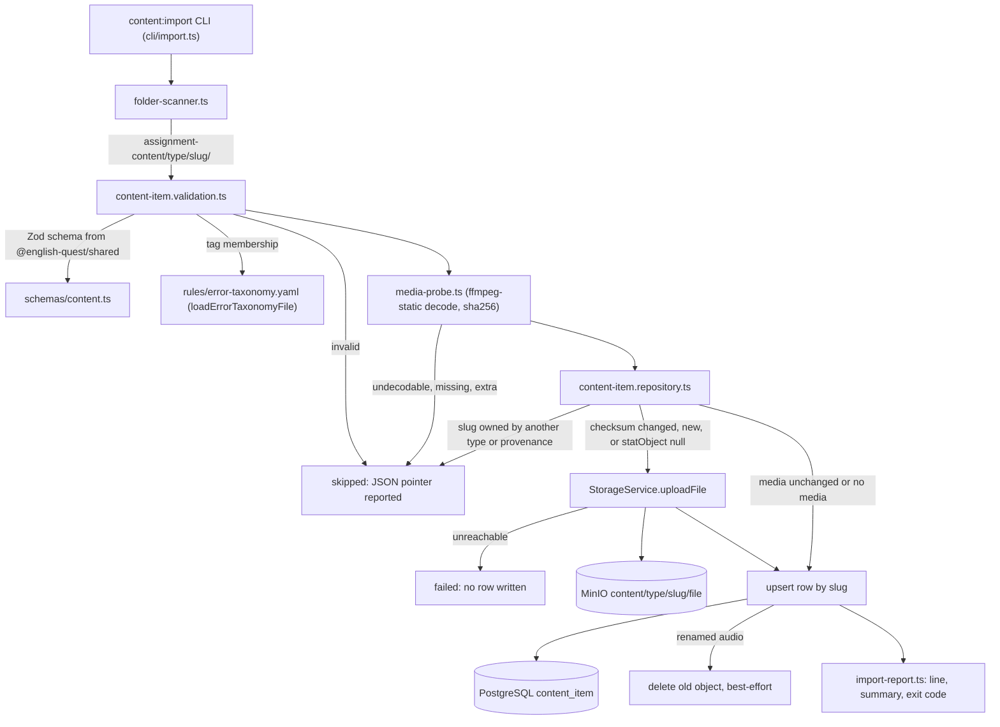
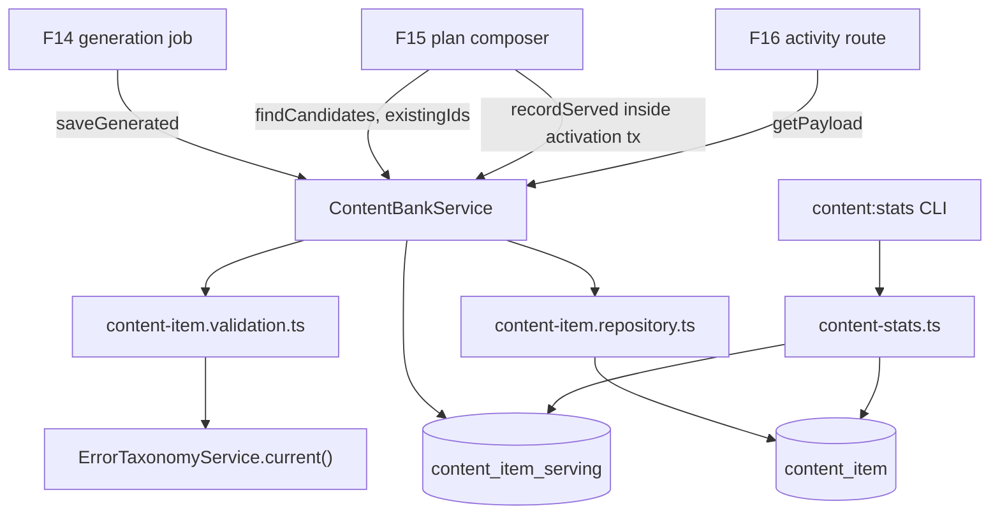

# Technical Specification: Content Bank and Curated Import

## 1. Technical Overview

**What:** A single `content_item` table that backs every activity type, a `content:import` CLI that turns `assignment-content/<type>/<slug>/` folders into validated bank rows (uploading listening audio to MinIO and keeping only the object key), an internal `ContentBankService` that is the one door F14, F15 and F16 use to write and read the bank, a per-user serving log that powers the 30-day recently-served exclusion, and a `content:stats` CLI that reports inventory, the PRD's corpus target and usage.

**Why:** Three later features meet at this table. F14 writes generated items into it, F15 selects candidates from it by metadata alone, and F16 resolves full payloads from it at activity time. If each of them read and wrote rows its own way, the item shape would drift three times. That drift is costly because a malformed answer key "produces an activity that can never be answered correctly and is invisible until a user hits it". F13 fixes the contract once and enforces it at every entry point: the Zod schema at import, the same schema at `saveGenerated`, and `CHECK` constraints in PostgreSQL for anything inserted directly. It also makes the curator's filesystem the source of truth for authentic audio, without audio ever entering git.

**Scope — Included (Core):**
- The content item schema: one table for `listening`, `reading`, `vocabulary`, `grammar` and `error_review`, with provenance, generated-only fields and media fields enforced by constraints
- The `content:import` CLI for listening items: per-item validation that never aborts the batch, idempotency by slug, and re-upload only when the SHA-256 checksum changes
- Media upload to MinIO under `content/{type}/{slug}/{filename}` through the existing `StorageService`, with only the key, checksum and byte size stored
- The query API as an internal, globally injectable service: candidate metadata (F15), full payload (F16), persistence keyed by slug (F14), plus an existence check for F15's guardrails
- All four question formats F16 runs (`multiple_choice`, `fill_blank`, `ordering`, `matching`), each with its own answer-key consistency check

**Scope — Included (Full Scope additions):**
- Recently-served exclusion: a `content_item_serving` log, written by F15 when a plan is activated and read by the candidate query to exclude items served to the requesting user in the last 30 days
- Curated import of `reading`, `vocabulary` and `grammar` items, which have no media. This goes beyond the PRD's "listening + reading" so that F14's fallback has a curated source for every type it generates
- A content usage statistics CLI (`content:stats`): inventory by type, CEFR level, difficulty, accent and provenance; the PRD's MVP corpus target check; serve counts per item; and never-served items

**Scope — Included (additions from the interview):**
- `--dry-run`, and a positional filter (`listening` or `listening/<slug>`) on `content:import`
- Audio duration measured by decoding the file with `ffmpeg-static`, which F10 already made an API dependency, instead of being declared by the curator. As a side effect, undecodable files are rejected at import
- `target_tags` validated for membership in the error taxonomy in force (`apps/api/rules/error-taxonomy.yaml`, shipped by F11 and being extended by F12), at both entry points
- Generated `meta.schema.json` files, one per importable type, so the curator's editor autocompletes and flags `meta.json` while drafting, including an `enum` of the taxonomy's tags. A snapshot test keeps them in sync with the Zod source and the taxonomy file

**Scope — Excluded:**
- Any HTTP route. The PRD states that content items "have no browsing interface in either client". F16 owns the activity route that exposes a payload to a client, and with it the decision to strip `answer` and `explanation` before submission and how to deliver media (a presigned URL or a proxy). No change to `docs/api/openapi.json`
- Changing the storage adapter or its tests. F07 already paid F01's `storage.spec.ts` debt and added the MinIO test harness (`test/integration/helpers/minio.ts`), `uploadFile`, `statObject` and `StorageUnavailableError`. F13 uses all four unchanged
- Changing the error taxonomy. F13 reads the file in force; F11 and F12 own its content
- Generating content (F14), composing plans or deciding what to place in them (F15), and difficulty ratings (F16). `content:stats` reports only data F13 owns
- Sourcing the initial corpus (at least 20 listening items across at least 3 accents and difficulty 3–5). That is curator work. `content:stats` tells the curator whether the target is met, but the implementation is complete without it
- Deleting or retiring items. The importer never deletes a row, because a plan may still reference it. Items whose folder disappeared are reported and left untouched

**Interview decisions:**

| Decision | Choice |
|---|---|
| Scope | Core + Full Scope additions |
| Schema source of truth | Zod in `@english-quest/shared`; JSON Schema files generated from it |
| Question formats | All four F16 formats as a discriminated union on `format` |
| `target_tags` validation | Membership in the taxonomy in force, now. *Revised after syncing with `main`:* the interview chose "shape only, membership left to F12" on the premise that no taxonomy existed. F11 has since shipped it |
| Importable types | `listening`, `reading`, `vocabulary`, `grammar` (not `error_review`) |
| Query API surface | Internal `ContentBankService`, no HTTP |
| `storage.spec.ts` debt | Nothing to do. *Revised:* the interview chose to pay it in F13, but F07 had already paid it on `main` |
| Usage statistics | `content:stats` CLI over F13-owned data |
| What "served" means | Placed into an activated plan (F15 calls `recordServed`) |
| Audio duration | Measured by decoding with `ffmpeg-static`. *Revised:* the interview chose `music-metadata` on the premise that ffmpeg would only arrive with F10. It had already arrived, so measuring costs no new dependency |
| CLI extras | `--dry-run` plus a positional type or type/slug filter |

**Assumptions and decisions not answered by the PRD:**

| Assumption | Rationale |
|---|---|
| `skipped` means rejected before any side effect (invalid JSON, schema or answer-key violation, missing or extra audio, undecodable audio, slug collision, bad folder name). `failed` means attempted and failed at runtime (storage upload or database write) | Reads directly off the PRD's Error Handling: an invalid `meta.json` or a missing audio file "is skipped", and MinIO being unreachable "aborts" the item. Both count toward the non-zero exit, per "a run containing any failure exits with a non-zero code" |
| An item whose metadata and media are both unchanged still reports as `updated` (`↻ slug (updated, media unchanged)`) | The PRD's own output example uses exactly this line, and its four counters leave no room for a fifth "unchanged" state |
| `type` and `slug` come from the folder path and never appear in `meta.json`. `provenance` is always `curated` for imported items | One source for each fact. A `meta.json` that also declared its type could contradict its folder, and that contradiction would need its own error |
| Slug format is `^[a-z0-9]+(-[a-z0-9]+)*$`, at most 80 characters, and globally unique across types and provenances | The slug is the idempotency key for both the importer and `saveGenerated`, so it must not collide silently across types (PRD Error Handling) or across provenance |
| The `meta.json` objects are strict: an unknown key is a validation error | A typo such as `dificulty` would otherwise import with the real field defaulted or missing. The strictness mirrors F04's envelope, which rejects unknown top-level fields |
| `meta.json` keys are `snake_case`; TypeScript contracts returned by `ContentBankService` are `camelCase` | `meta.json` is a file format that mirrors the PRD's column names and the prompt outputs (`target_tags`). Service DTOs follow the code convention already used by `MaskedCredential` (`lastValidatedAt`) |
| Every question carries its key in a field named `answer` and nothing else, plus a required non-empty `explanation` | F16 needs "the explanation stored with the item" for every question. A uniform key field means F16's client projection is "drop `answer` and `explanation`" regardless of format |
| Exactly 5 questions per item | F16: "Each item carries exactly 5 questions." Enforced in Zod and by a `CHECK` on `jsonb_array_length` |
| `multiple_choice`: exactly 4 options, unique after trimming and ignoring case, and `answer` equal to one of them | F16 specifies "multiple choice with 4 options". The PRD's own error example pins the message: `/questions/2/answer must be one of /questions/2/options`. Duplicate options are rejected because they would make a text answer ambiguous |
| `fill_blank`: the prompt contains exactly one blank marker (a run of 3 or more underscores), and `answer` lists 1–5 accepted variants | F16 matches case-insensitively and tolerant of surrounding whitespace. Variants cover legitimate alternatives (`hadn't` / `had not`) |
| `ordering`: `segments` (3–8, unique) shown in authored order; `answer` is a permutation of their indexes and must not be the identity | A question whose displayed order is already correct cannot be answered wrong |
| `matching`: `left` and `right` (3–6 each, same length, unique within each side); `answer[i]` is the index in `right` matched to `left[i]`, a permutation that must not be the identity | This is the "complete pairs" rule: every left item has exactly one right item and no right item is used twice |
| `accent` is required for listening and forbidden otherwise. It is a controlled vocabulary: `american`, `british`, `australian`, `canadian`, `irish`, `scottish`, `new_zealand`, `south_african`, `indian`, `other` | The corpus target counts distinct accents, which free text would fragment (`UK` / `British` / `british`). `snake_case` values follow the codebase's existing enum style (`azure_speech`, `error_review`) |
| `skills` is 1–4 unique values from `listening`, `reading`, `vocabulary`, `grammar`, and must include the item's own type skill for those four types | These are the skills a content item can train. Speaking and writing are F17/F18 tasks, not bank items |
| `cefr_level` is one of `A1`–`C2`; `difficulty` is an integer from 1 to 5 | The PRD's column list and range |
| `body` is required for listening (the transcript) and reading; optional for curated vocabulary and grammar; required for every generated item. Maximum 20,000 characters | F16 reveals the listening transcript after submission and keeps the reading text visible. Curated vocabulary and grammar can be pure question sets. The generation prompts always produce a body |
| `source` is `{ name, url? }` and required for curated items; it is stored as `source_name` and `source_url` | Authentic audio comes from external sites, so attribution is kept. Two plain columns query more simply than JSONB |
| `word_count` is computed in code from `body` at persist time (whitespace tokenization) and stored | F15 estimates reading time at 180 words per minute but receives "metadata only — never full bodies". Without a stored count it would have to load bodies to estimate |
| `duration_seconds` is measured by fully decoding the first audio stream with `ffmpeg-static`: `-nostdin -hide_banner -v error -i <file> -map 0:a:0 -f null -progress pipe:1 -nostats -`. The value is the last `out_time_us` reported, rounded to the nearest second. It is set only for listening | Revised interview decision. A full decode yields the true duration even for VBR MP3s without a Xing header, and proves the whole file plays, not just its header. `-progress` output is `key=value`, so nothing parses human-oriented log text. The invocation follows F07's `audio-assembler` and F10's `excerpt-clip.slicer` (`execFile` on the `ffmpeg-static` path). A non-zero exit, no audio stream, or a missing or zero `out_time_us` means undecodable. Warnings on stderr do not reject the file, because real-world MP3s often carry harmless frame glitches. No lower or upper duration bound is imposed, because the PRD sets none |
| Allowed audio extensions are `.mp3`, `.m4a`, `.wav`, `.ogg` (case-insensitive), exactly one per listening folder, at most 100 MB, non-empty. The file name must match `^[A-Za-z0-9._-]+$` | These are the four extensions `.gitignore` already excludes. One file per item keeps the object key unambiguous. The name rule keeps object keys URL-safe. The 100 MB cap bounds memory, since `StorageService.uploadFile` buffers the whole file (F07 kept it buffered on purpose) |
| Content type is mapped from the extension: `audio/mpeg`, `audio/mp4`, `audio/wav`, `audio/ogg` | So that F16 can serve the object with a correct `Content-Type` |
| An audio file in a non-listening folder is a validation error | Silently ignoring it would leave the curator believing the audio was imported |
| Per-item order: validate everything, check collision, upload if needed, then write the row, then delete a replaced object best-effort | This satisfies "the import aborts before writing any database rows for that item" when MinIO is down. The reverse race (upload succeeded, DB write failed) leaves an orphan object; a re-run heals it, because the stored checksum still differs |
| When the checksum is unchanged, the importer calls `statObject` on the stored key. `null` (missing) triggers a re-upload; `StorageUnavailableError` fails the item | A wiped MinIO volume would otherwise leave every row pointing at nothing, while the checksum comparison insists nothing changed. `statObject` is the call F07 added precisely to tell "missing" from "unreachable", which `objectExists` cannot do |
| When the audio file is renamed, the new object is uploaded, the row is updated, and the old object is deleted best-effort after commit (a warning line on failure) | Keeps storage free of orphans without risking a row that points at a deleted object |
| Curated items in the bank whose folder is absent on disk (within the current filter) are listed on one warning line and left untouched. This does not affect the exit code | Deleting would break plans that reference the item. Reporting keeps the difference between disk and bank visible |
| An unknown type folder (a typo like `listenning/`) reports each item inside it as skipped | Ignoring the folder would silently drop a batch the curator believes was imported |
| The content root resolves to `path.resolve(process.cwd(), '../../assignment-content')`, run from `apps/api` | This follows F04's `process.cwd()` precedent and `db:seed`'s working directory. Inside the container `.` is mounted at `/workspace`, so the folder is visible without a new volume. Tests pass the root explicitly |
| The CLIs are standalone scripts (not Nest), following `seed.ts`: `loadEnv()`, a direct `PrismaClient`, and `new StorageService()` | Importing must not require booting the HTTP server. `StorageService` already has no constructor parameters for exactly this reason |
| The CLIs refuse to run before migrations with `Database schema not initialized. Start the API once to run migrations, then re-run content:import.` (or `content:stats`) | Mirrors `db:seed`'s `SchemaNotInitializedError` guard, so a fresh checkout gets guidance instead of a Prisma stack trace |
| `recordServed` accepts an optional transaction client, and F15 is expected to call it inside its plan-activation transaction | A failed activation must not leave phantom serving rows that would hide items from the next attempt |
| The recently-served window is a named constant (`RECENTLY_SERVED_WINDOW_DAYS = 30`), overridable per query (`excludeServedWithinDays`, where `0` disables the exclusion) | The PRD fixes 30 days as a rule, not configuration. The parameter exists for tests and for a later feature to relax the window deliberately rather than by editing the constant |
| `saveGenerated` rejects `listening` and requires `promptId`, `promptVersion` and a non-empty `gateMetrics` object | "Listening is never generated" (F14), and every generated item carries its prompt stamp and gate metrics (F14 criteria). The DB constraint enforces the same rules |
| `gate_metrics` is opaque JSONB owned by F14 | F13 stores and returns it but does not interpret it; F14 defines the keys |
| Two new error codes: `CONTENT001` (item not found, 404) and `CONTENT002` (slug already used by another type or provenance, 409). Input that fails schema validation in `saveGenerated` reuses `VAL001` | These follow F04's precedent of registering codes for an internal-only library, so that F16's route and F14's job can branch on the code |
| `target_tags` is checked against the taxonomy **in force**: every tag must be listed in `apps/api/rules/error-taxonomy.yaml` as loaded at run time. The shared Zod schema checks only 1–10 unique non-empty strings of at most 64 characters | The taxonomy file is the authority, and its tag spelling differs by family (`family:kebab-slug`, or `family:/symbol/` for F12's `phoneme` family), so a second regex in the shared package would duplicate and eventually contradict it. Any family counts, including `phoneme`, because a listening item can legitimately target a sound |
| The CLI loads the taxonomy with `loadErrorTaxonomyFile(ERROR_TAXONOMY_PATH)`. The Nest service reads `ErrorTaxonomyService.current()`, so `ContentModule` imports `TaxonomyModule`. Both hand the loaded taxonomy to the same validation chokepoint | These are the two entry points F11 already provides. The CLI runs from `apps/api`, the working directory `ERROR_TAXONOMY_PATH` assumes. A malformed taxonomy file aborts the CLI with F11's own `ErrorTaxonomyValidationError` message |
| An unknown tag is a validation issue at its pointer: `/target_tags/1 "vocab:foo" is not in the error taxonomy (v<version>)` | Same shape as every other issue. The version tells the curator which file revision rejected it |
| Items already in the bank are not re-validated when the taxonomy changes. `content:stats` lists items carrying tags that are no longer in force; curated ones fail their next re-import until retagged | A retired tag is history, not corruption (F12's stance on the ledger). Generated items cannot be re-imported, so the report is where the curator sees them |
| The generated `meta.schema.json` files carry an `enum` of the current taxonomy's tags on `target_tags.items`, injected by the generator | Gives the curator autocompletion on exactly the tags that will pass. The snapshot test couples the files to the taxonomy, so a taxonomy change without regenerating fails CI and names the command |
| No new dependencies and no new environment variables | `ffmpeg-static`, `yaml` and `zod` are already API dependencies. The content root is a fixed repository path, the 30-day window is a product rule, and storage settings already exist |

**Traceability (PRD block → spec section):**

| PRD block | Where it lands |
|---|---|
| Provides (candidate metadata → F15) | §5 `findCandidates`, `ContentItemCandidate` |
| Provides (full payload → F16) | §5 `getPayload`, `ContentItemPayload` |
| Provides (persistence keyed by slug → F14) | §5 `saveGenerated` |
| Core Scope | §1 Included (Core), §4, §6 |
| Full Scope additions | §1 Included (Full), §5 `recordServed` and `content:stats`, §6 `content_item_serving` |
| Capabilities | §3, §5 (CLI and `meta.json` contracts), §6 constraints |
| Experience | §5 CLI output contract |
| Error Handling | §4 Failure modes, §5 CLI outcome table |
| F13 acceptance criteria | §7 acceptance coverage table |
| Cross-feature integration criteria (F13 ↔ F14, F15, F16) | §7 cross-feature table |

## 2. Architecture Impact

**Affected components:**

| Area | Path |
|---|---|
| Shared contracts | `packages/shared/src/schemas/content.ts`, `packages/shared/src/index.ts`, `packages/shared/src/errors/codes.ts` |
| API — content module | `apps/api/src/content/**` |
| API — errors and wiring | `apps/api/src/common/app-error.ts`, `apps/api/src/app.module.ts` |
| Database | `apps/api/prisma/schema.prisma`, `apps/api/prisma/migrations/0013_content_bank/migration.sql` |
| Curator workspace | `assignment-content/README.md`, `assignment-content/<type>/meta.schema.json` |
| Tooling and docs | `apps/api/package.json`, root `package.json`, `README.md` |
| Tests | `apps/api/test/unit/content-*.spec.ts`, `apps/api/test/integration/content-*.spec.ts`, `apps/api/test/integration/helpers/content-fixtures.ts` |
| Reused unchanged | `apps/api/src/storage/storage.service.ts`, `apps/api/src/taxonomy/**`, `apps/api/rules/error-taxonomy.yaml`, `apps/api/test/integration/helpers/minio.ts` |

**Import flow (one item):**



**Runtime consumers:**



## 3. Technical Decisions

| Decision | Chosen Approach | Alternative Considered | Trade-off |
|---|---|---|---|
| Schema source of truth | One Zod module in `@english-quest/shared` defines the curated `meta.json` shape per type, the generated-item input and the question union. `z.toJSONSchema` emits a `meta.schema.json` per type for the curator's editor | A hand-written `item.schema.json` validated by Ajv, as for F04's YAML | Cross-field rules (answer among options, permutations, type-dependent fields) are `superRefine` checks, which JSON Schema cannot express. The generated files therefore flag shape errors in the editor but not answer-key errors, which only the importer catches. Accepted: one definition yields the TypeScript types F14, F15 and F16 need and the validator the importer runs, with nothing to keep in sync by hand, the same philosophy as `openapi/components.ts` |
| Where validation lives in the API | One chokepoint, `content-item.validation.ts`, runs the shared schemas and the taxonomy membership check for both entry points (import and `saveGenerated`) and formats issues as JSON pointers | Each entry point validates on its own | A little indirection. In exchange, an item cannot enter the bank by a less-validated door, and the check that depends on the API-side taxonomy lives in one place |
| Tag validation | Membership in the taxonomy loaded at run time; the shared schema checks only count, uniqueness and length | A tag regex in the shared Zod schema, or shape-only validation | The shared schema alone cannot fully validate a `meta.json`: the importer must load the taxonomy file. Accepted because the taxonomy's spelling rules are per family and owned by F11/F12. A second regex would drift from them, and shape-only would let `vocab:colocation` through to fail silently in F15's tag matching |
| Constraints in the database | Type-, provenance- and media-dependent rules are duplicated as `CHECK` constraints | Application-layer validation only | The rules live in two places. Accepted because the product explicitly supports direct database inserts (F01), and the answer-key defect class is "invisible until a user hits it". The Zod layer gives good messages; the constraints guarantee the invariants |
| Query API surface | Internal `@Global()` `ContentBankService`, no routes | `GET /content/items` and `GET /content/items/:id` | F16 has to build its own route. Accepted: an HTTP surface would expose answer keys and a browsing capability the PRD says does not exist. The service contract is also what F14 and F15 call from server-side jobs anyway |
| Question storage | One `questions` JSONB array; each element carries its format fields, `answer` and `explanation` | Parallel `questions`, `answers` and `explanations` columns, as the PRD's column list could be read | Stripping answers for a client becomes a projection F16 performs rather than a column it leaves out. Accepted because parallel arrays can fall out of step (answer 3 belongs to question 3 only by position), which is precisely the corrupted-answer-key defect the PRD warns about |
| Audio duration | Measured by fully decoding the file with `ffmpeg-static` and reading `-progress` output | Declared in `meta.json`, or read from headers with `music-metadata` | A full decode takes a second or two per file on every run that probes it. Accepted: no new dependency (F10 already ships `ffmpeg-static`), the curator cannot mistype a duration, and a file that does not decode end to end fails at import instead of in F16's player. Header-only parsing proves neither |
| Change detection | SHA-256 of the file bytes compared with the stored `media_checksum`, plus `statObject` on the stored key when unchanged | Compare modification time or size, or trust the checksum alone | Hashes every audio file on every run (a few MB each, negligible at corpus scale). Timestamps change on git checkout and copies, and size alone misses re-encodes. `statObject` catches a wiped bucket and distinguishes it from an unreachable store |
| Recently-served exclusion | A dedicated `content_item_serving` log with a `NOT EXISTS` filter expressed through Prisma's relation filter (`servings: { none: … }`) | Derive "served" from F15's plan tables | F15's tables do not exist yet, and F13's acceptance criterion needs the exclusion now. The log also gives `content:stats` its usage data. F15 has to call `recordServed`, which is a documented obligation |
| Question formats | All four as a discriminated union on `format`, now | Only the multiple-choice format the F04 prompts emit | Validation code for two formats that no producer emits yet. Accepted: it is pure validation with no migration cost, and F16 Full does not need to reopen F13's contract |
| CLI shape | A standalone script via `node --env-file-if-exists=../../.env --import tsx`, like `db:seed` | A Nest standalone application context | No DI container in the CLI. The repository, probe and validation chokepoint are therefore plain classes and functions taking a `PrismaClient`, a `StorageService` and a loaded taxonomy, and the Nest service wraps the same pieces |

## 4. Component Overview

**Shared:**

| File Path | New/Modified | Purpose | Key Responsibilities |
|---|---|---|---|
| `packages/shared/src/schemas/content.ts` | New | Content contract | Enums (`contentItemType`, `importableContentType`, `provenance`, `cefrLevel`, `accent`, `contentSkill`); `targetTagsField` (1–10 unique non-empty strings, max 64 each; membership is checked API-side against the taxonomy); `questionSchema`, a discriminated union on `format` with per-format refinements; `questionsField` (exactly 5); `curatedItemMetaSchemaFor(type)`, strict and snake_case with type-dependent rules for `accent`, `body` and `skills`; `generatedItemInputSchema` (camelCase); inferred types `CuratedItemMeta`, `GeneratedItemInput`, `Question`, `ContentItemCandidate`, `ContentItemPayload`. Custom messages produce the PRD-pinned wording |
| `packages/shared/src/index.ts` | Modified | Barrel | Exports the above |
| `packages/shared/src/errors/codes.ts` | Modified | Error registry | Adds `CONTENT001` (`Content item not found.`, 404) and `CONTENT002` (`This slug is already used by another content item.`, 409) |

**API — content module:**

| File Path | New/Modified | Purpose | Key Responsibilities |
|---|---|---|---|
| `apps/api/src/content/content-constants.ts` | New | Named constants | `RECENTLY_SERVED_WINDOW_DAYS = 30`, `MAX_AUDIO_BYTES`, `AUDIO_EXTENSIONS` and their content types, `DEFAULT_CANDIDATE_LIMIT = 200`, `MAX_CANDIDATE_LIMIT = 500` |
| `apps/api/src/content/content-item.validation.ts` | New | Validation chokepoint | `validateCuratedMeta(type, raw, taxonomy)` and `validateGeneratedInput(raw, taxonomy)` run the shared schemas, then check every tag against the given `LoadedErrorTaxonomy`, and return typed data or issues formatted as `<json-pointer> <message>` (root reported as `(root)`). Both entry points go through it |
| `apps/api/src/content/content-item.repository.ts` | New | Persistence | Plain class over a `PrismaClient` (usable from the CLI and from Nest): `findBySlug`; `upsertCurated` and `upsertGenerated`, which detect collisions (different type, or different provenance) before writing; derives `word_count`; maps the validated input to a row; lists curated slugs for the orphan report |
| `apps/api/src/content/content-bank.service.ts` | New | Query API | `@Injectable()` over `PrismaService` and `ErrorTaxonomyService`: `findCandidates`, `getPayload`, `existingIds`, `saveGenerated`, `recordServed` (see §5); raises `CONTENT001` and `CONTENT002` |
| `apps/api/src/content/content.module.ts` | New | Module wiring | `@Global()`; imports `TaxonomyModule` (not global); provides and exports `ContentBankService`, matching the `PromptsModule` and `CredentialsModule` precedent |
| `apps/api/src/content/import/folder-scanner.ts` | New | Discovery | Walks `<root>/<type>/<slug>/`, applies the positional filter, reports unknown type folders and non-slug folder names per item, and classifies each folder's files (`meta.json`, audio by extension, other files ignored); ignores top-level files and `meta.schema.json` |
| `apps/api/src/content/import/media-probe.ts` | New | Media inspection | Size and empty checks, SHA-256, full decode and duration via `ffmpeg-static` (`execFile`, same pattern as `excerpt-clip.slicer.ts`), content type from the extension; returns a typed result or a skip reason |
| `apps/api/src/content/import/content-importer.ts` | New | Orchestration | `runImport({ root, filter, dryRun, prisma, storage, taxonomy })`: the per-item pipeline in the order stated in §1 (validate, probe, collision, upload, upsert, clean up the replaced object), then the orphan report; returns a structured report and never throws for a per-item problem |
| `apps/api/src/content/import/import-report.ts` | New | Output | Renders each outcome line in the PRD's shape, the summary line and the dry-run banner; computes the exit code (`1` when `skipped + failed > 0`) |
| `apps/api/src/content/content-stats.ts` | New | Usage statistics | Aggregate queries: inventory by type × provenance, CEFR, difficulty and accent; stored media bytes; the corpus-target evaluation; per-item serve counts, distinct users and last served; never-served items; items carrying tags no longer in the taxonomy |
| `apps/api/src/content/cli/import.ts` | New | CLI entry | Parses `[--dry-run] [<type>[/<slug>]]`, runs the schema-initialized guard, loads the taxonomy, wires `PrismaClient` and `StorageService`, streams lines, sets the exit code; a fatal error prints its message and exits 1 |
| `apps/api/src/content/cli/stats.ts` | New | CLI entry | Runs the guard, loads the taxonomy and `content-stats.ts`, prints the report, exits 0 (1 on a fatal error) |
| `apps/api/src/content/cli/schema.ts` | New | Schema generator | Writes `assignment-content/<type>/meta.schema.json` for the four importable types from the shared Zod schemas, injecting the current taxonomy's tags as the `enum` of `target_tags.items` |
| `apps/api/src/common/app-error.ts` | Modified | Error factories | `contentItemNotFound(id)`, `contentSlugConflict(slug, existingType, existingProvenance)` |
| `apps/api/src/app.module.ts` | Modified | Root module | Imports `ContentModule` |
| `apps/api/package.json` | Modified | Scripts | `content:import`, `content:stats`, `content:schema` (same `node --env-file-if-exists --import tsx` shape as `db:seed`). No new dependency |

**Reused unchanged:**

| File Path | Used for |
|---|---|
| `apps/api/src/storage/storage.service.ts` | `uploadFile` (buffered, from the local path), `statObject` (missing vs unreachable), `deleteObject` (replaced object). `StorageUnavailableError` becomes a `failed` outcome. No provider-specific call is added outside the adapter |
| `apps/api/src/taxonomy/error-taxonomy.ts`, `error-taxonomy.service.ts`, `error-taxonomy.constants.ts` | `loadErrorTaxonomyFile(ERROR_TAXONOMY_PATH)` in the CLIs, `ErrorTaxonomyService.current()` in Nest. Membership is read from the loaded taxonomy's `tags`, or F12's `has()` once F12 lands |
| `apps/api/test/integration/helpers/minio.ts` | Real MinIO for the import suite (written by F07) |

**Database:**

| Migration File | Tables Affected | Operation | Notes |
|---|---|---|---|
| `apps/api/prisma/migrations/0013_content_bank/migration.sql` | `content_item`, `content_item_serving` | CREATE | `main` holds `0001`–`0011`, and F12, in flight in its own worktree, has claimed `0012_learning_profile`. Use whichever number is next free when F13 is implemented. Includes the `set_updated_at` trigger on `content_item` |

**Curator workspace, tooling and docs:**

| File Path | New/Modified | Purpose |
|---|---|---|
| `assignment-content/README.md` | New | Curator guide: folder layout, `meta.json` fields per type, the four question formats with one example each, the `$schema` reference, and the commands |
| `assignment-content/{listening,reading,vocabulary,grammar}/meta.schema.json` | New (generated) | Editor validation and autocompletion for `meta.json` |
| `package.json` (root) | Modified | `content:import` and `content:stats` shortcuts, mirroring `db:seed` |
| `README.md` | Modified | "Common commands" rows for import, dry run and stats |

**Failure modes:**

| Scenario | Behaviour | Surfaced as |
|---|---|---|
| `meta.json` absent, not JSON, or failing the schema | Item skipped, batch continues | `✗ slug (meta.json: <pointer> <message>)`, remaining issues indented beneath |
| Answer not among options | Skipped at validation | `✗ slug (meta.json: /questions/2/answer must be one of /questions/2/options)` |
| Tag not in the taxonomy in force | Skipped at validation | `✗ slug (meta.json: /target_tags/1 "vocab:foo" is not in the error taxonomy (v<version>))` |
| Taxonomy file malformed or missing | Nothing runs, exit 1 | F11's `ErrorTaxonomyValidationError` message, listing every issue |
| Storage unreachable while checking an unchanged object | Item failed; row untouched | `✗ slug (storage unavailable: <reason>)` |
| Listening folder without an audio file | Skipped; no row, no upload | `✗ slug (audio file not found in folder)` |
| More than one audio file, audio in a non-listening folder, empty, over 100 MB, bad file name, undecodable | Skipped | `✗ slug (<specific reason>)` |
| Slug used by another type or by a generated item | Skipped; existing row untouched | `✗ slug (slug already used by a listening item)` / `(slug already used by a generated item)` |
| Unknown type folder or non-slug folder name | Each item skipped | `✗ listenning/foo (unknown content type folder "listenning")` |
| MinIO unreachable during upload | Item failed; no row written; batch continues (media-less items still import) | `✗ slug (upload failed: <reason>)` |
| Database write fails after a successful upload | Item failed; the orphan object is overwritten or re-uploaded on the next run | `✗ slug (database write failed: <reason>)` |
| Replaced object cannot be deleted | Item still counts as updated | Warning line naming the orphaned key |
| Schema not migrated | Nothing runs, exit 1 | `Database schema not initialized. Start the API once to run migrations, then re-run content:import.` |
| Filter matches no folder | Nothing runs, exit 1 | `Nothing to import at assignment-content/<filter>.` |
| `getPayload` on an unknown id | Raised to the caller | `AppError` `CONTENT001` |
| `saveGenerated` on a curated slug or a different type's slug | Raised; nothing written | `AppError` `CONTENT002` |
| `saveGenerated` with an invalid shape | Raised; nothing written | `AppError` `VAL001` with pointer details |

## 5. Internal Contracts

F13 exposes no HTTP route. Its contracts are the `meta.json` file format, the two CLIs, and a TypeScript service consumed through dependency injection.

### `meta.json` (curated input)

| Field | Type | Required | Validation | Description |
|---|---|---|---|---|
| `$schema` | `string` | No | Ignored | Points the editor at `../meta.schema.json` |
| `title` | `string` | Yes | 1–200 chars, trimmed | Display title |
| `cefr_level` | `string` | Yes | `A1`–`C2` | |
| `topic` | `string` | Yes | 1–80 chars | Free topic label, e.g. `climate policy` |
| `accent` | `string` | Listening only | Controlled vocabulary (see §1); forbidden for other types | |
| `skills` | `string[]` | Yes | 1–4 unique of `listening`, `reading`, `vocabulary`, `grammar`; must include the folder type | |
| `difficulty` | `integer` | Yes | 1–5 | |
| `source` | `object` | Yes | `name` 1–200 chars; optional `url` (valid URL, max 2048) | Attribution |
| `body` | `string` | Listening and reading | 1–20,000 chars | Transcript for listening, text for reading |
| `questions` | `Question[]` | Yes | Exactly 5; see the formats below | |
| `target_tags` | `string[]` | Yes | 1–10 unique, max 64 chars each; every tag must be in `apps/api/rules/error-taxonomy.yaml` as loaded at run time | e.g. `grammar:conditional-3`, `vocab:collocation`, `phoneme:/θ/` once F12 lands |

Derived, never written by the curator: `type` and `slug` (folder path), `provenance` (`curated`), `duration_seconds` (measured), media key, checksum and bytes (computed), `word_count` (from `body`).

**Listening example** (`assignment-content/listening/bbc-climate-debate/meta.json`):

```json
{
  "$schema": "../meta.schema.json",
  "title": "Who pays for the energy transition?",
  "cefr_level": "C1",
  "topic": "climate policy",
  "accent": "british",
  "skills": ["listening", "vocabulary"],
  "difficulty": 4,
  "source": { "name": "BBC Radio 4 — Analysis", "url": "https://www.bbc.co.uk/programmes/example" },
  "body": "Presenter: Tonight we ask a question that most governments would rather avoid…",
  "questions": [
    {
      "format": "multiple_choice",
      "prompt": "What is the presenter's main concern?",
      "options": ["The cost of solar panels", "Who bears the cost of the transition", "The speed of wind farm approvals", "Consumer energy habits"],
      "answer": "Who bears the cost of the transition",
      "explanation": "In the opening minute he frames the programme around the distribution of costs, not the technology."
    },
    {
      "format": "fill_blank",
      "prompt": "The economist argues that the burden has been ___ onto households.",
      "answer": ["shifted", "offloaded"],
      "explanation": "She says 'shifted onto households' at 04:12; 'offloaded' is an accepted synonym."
    },
    {
      "format": "ordering",
      "prompt": "Put the arguments in the order they are made.",
      "segments": ["Carbon taxes are regressive", "Subsidies favour homeowners", "Grid upgrades are unavoidable"],
      "answer": [2, 0, 1],
      "explanation": "The grid point opens the debate, the tax point follows, and subsidies close it."
    },
    {
      "format": "matching",
      "prompt": "Match each speaker to their position.",
      "left": ["Economist", "Minister", "Campaigner"],
      "right": ["Delay is costlier than action", "Households need protection", "The timetable is realistic"],
      "answer": [1, 2, 0],
      "explanation": "The economist defends households, the minister the timetable, and the campaigner urgency."
    },
    {
      "format": "multiple_choice",
      "prompt": "What does 'kick the can down the road' mean in context?",
      "options": ["Postpone a hard decision", "Reduce spending", "Blame a predecessor", "Change policy direction"],
      "answer": "Postpone a hard decision",
      "explanation": "Used at 11:30 to criticise repeatedly deferring the funding question."
    }
  ],
  "target_tags": ["vocab:collocation", "discourse:connector"]
}
```

**Question formats:**

| `format` | Fields | Answer-key rule | Error message (pointer + message) |
|---|---|---|---|
| `multiple_choice` | `prompt`, `options` (4 strings), `answer` (string), `explanation` | `options` unique (trimmed, case-insensitive); `answer` equals one option | `/questions/N/answer must be one of /questions/N/options`; `/questions/N/options must not contain duplicates` |
| `fill_blank` | `prompt` (exactly one `___` run), `answer` (1–5 unique non-empty strings), `explanation` | Exactly one blank marker | `/questions/N/prompt must contain exactly one blank (___)` |
| `ordering` | `prompt`, `segments` (3–8 unique), `answer` (integer[]), `explanation` | `answer` is a permutation of `0..len-1` and not the identity | `/questions/N/answer must be a permutation of the indexes of /questions/N/segments`; `/questions/N/answer must differ from the displayed order` |
| `matching` | `prompt`, `left` and `right` (3–6 each, equal length, unique per side), `answer` (integer[]), `explanation` | `answer` is a permutation of `right`'s indexes and not the identity | `/questions/N/answer must pair every left item with exactly one right item`; `/questions/N/answer must differ from the displayed order` |

Every question requires a non-empty `explanation` (1–1,000 chars) and a `prompt` (1–500 chars).

### `content:import` CLI

**Usage:** `pnpm content:import [--dry-run] [<type>[/<slug>]]`, run from `apps/api`. The root shortcut and README row pass arguments through.

| Argument | Description |
|---|---|
| `--dry-run` | Runs every check, including decoding, the collision lookup and the checksum comparison, and prints the same lines with `would import` / `would update`. Writes nothing to the database or MinIO. Same exit code |
| `<type>` | Restricts the run to one type folder |
| `<type>/<slug>` | Restricts the run to one item |

**Output lines and counters:**

| Outcome | Counter | Line |
|---|---|---|
| New item with media | imported | `✓ bbc-climate-debate (imported, 4.2 MB uploaded)` |
| New item without media | imported | `✓ tech-ethics-op-ed (imported)` |
| Existing item, media unchanged | updated | `↻ ted-urban-design (updated, media unchanged)` |
| Existing item, media changed | updated | `↻ ted-urban-design (updated, 4.1 MB re-uploaded)` |
| Existing item, object missing in storage | updated | `↻ ted-urban-design (updated, 4.1 MB re-uploaded — object was missing)` |
| Existing item without media | updated | `↻ tech-ethics-op-ed (updated)` |
| Validation or collision failure | skipped | `✗ npr-housing (meta.json: /questions/2/answer must be one of /questions/2/options)` |
| Upload or database failure | failed | `✗ npr-housing (upload failed: connect ECONNREFUSED minio:9000)` |

Final lines:

```
! 2 curated items have no folder on disk and were left untouched: old-interview, radio-4-farming
3 imported, 1 updated, 1 skipped, 0 failed.
```

With `--dry-run`, the summary is prefixed with `Dry run — nothing was written.`. Exit code: `0` when `skipped + failed = 0`, otherwise `1`; `1` for a fatal error.

### `content:stats` CLI

**Usage:** `pnpm content:stats`. Read-only. Exit code `0`, or `1` for a fatal error.

| Section | Content |
|---|---|
| Inventory | Item counts by type × provenance, by CEFR level, by difficulty, and by accent (listening); total stored media bytes and object count |
| Corpus target | Three pass/fail lines from PRD F13: at least 20 listening items; at least 3 distinct accents; at least one listening item at each of difficulty 3, 4 and 5 |
| Usage | Per served item: slug, type, serving count, distinct users, last served (relative); then the never-served count and slugs |
| Taxonomy drift | Items whose `target_tags` include a tag not in the taxonomy in force, with the offending tags and provenance; omitted when there are none |

### `ContentBankService`

**`findCandidates(query): Promise<ContentItemCandidate[]>`** (F15)

| Parameter | Type | Required | Description |
|---|---|---|---|
| `userId` | `uuid` | Yes | Whose serving log applies |
| `types` | `ContentItemType[]` | No | Any-of |
| `cefrLevels` | `CefrLevel[]` | No | Any-of |
| `skills` | `ContentSkill[]` | No | Array overlap (`hasSome`) |
| `targetTags` | `string[]` | No | Array overlap (`hasSome`) |
| `provenance` | `'curated' \| 'generated'` | No | |
| `excludeServedWithinDays` | `integer ≥ 0` | No | Default 30; `0` disables the exclusion |
| `limit` | `integer 1–500` | No | Default 200 |

Ordering is deterministic (`created_at DESC, id`). Ranking belongs to F15.

```json
[
  {
    "id": "5f0c6a8e-3b7a-4f3e-9d51-0c2e8d7b1a10",
    "slug": "bbc-climate-debate",
    "type": "listening",
    "provenance": "curated",
    "cefrLevel": "C1",
    "title": "Who pays for the energy transition?",
    "topic": "climate policy",
    "accent": "british",
    "durationSeconds": 312,
    "wordCount": 861,
    "skills": ["listening", "vocabulary"],
    "difficulty": 4,
    "targetTags": ["vocab:collocation", "discourse:connector"]
  }
]
```

Metadata only: no `body`, `questions`, source or media fields, satisfying F15's "never full bodies".

**`getPayload(itemId): Promise<ContentItemPayload>`** (F16). Raises `CONTENT001` when absent.

```json
{
  "id": "5f0c6a8e-3b7a-4f3e-9d51-0c2e8d7b1a10",
  "slug": "bbc-climate-debate",
  "type": "listening",
  "provenance": "curated",
  "cefrLevel": "C1",
  "title": "Who pays for the energy transition?",
  "topic": "climate policy",
  "accent": "british",
  "durationSeconds": 312,
  "wordCount": 861,
  "skills": ["listening", "vocabulary"],
  "difficulty": 4,
  "targetTags": ["vocab:collocation", "discourse:connector"],
  "body": "Presenter: Tonight we ask a question that most governments would rather avoid…",
  "questions": [
    {
      "format": "multiple_choice",
      "prompt": "What is the presenter's main concern?",
      "options": ["The cost of solar panels", "Who bears the cost of the transition", "The speed of wind farm approvals", "Consumer energy habits"],
      "answer": "Who bears the cost of the transition",
      "explanation": "In the opening minute he frames the programme around the distribution of costs, not the technology."
    }
  ],
  "mediaObjectKey": "content/listening/bbc-climate-debate/audio.mp3",
  "mediaContentType": "audio/mpeg",
  "sourceName": "BBC Radio 4 — Analysis",
  "sourceUrl": "https://www.bbc.co.uk/programmes/example",
  "promptId": null,
  "promptVersion": null
}
```

(`questions` is truncated to one entry here; a real payload always carries 5.) `mediaContentType` is derived from the key's extension, not stored. `promptId` and `promptVersion` are present so F16 can store a difficulty rating "against the item's prompt version". `gateMetrics` is not part of the payload; it is curator data.

**`existingIds(ids): Promise<Set<string>>`** (F15 guardrails) returns the subset of `ids` that exist. It lets F15 reject invented ids without loading payloads.

**`saveGenerated(input): Promise<{ id: string; slug: string; action: 'created' | 'updated' }>`** (F14)

| Field | Type | Required | Validation |
|---|---|---|---|
| `slug` | `string` | Yes | Slug format, ≤ 80 |
| `type` | `string` | Yes | `reading`, `vocabulary`, `grammar`, `error_review` (never `listening`) |
| `cefrLevel` | `string` | Yes | `A1`–`C2` |
| `title`, `topic` | `string` | Yes | As in `meta.json` |
| `skills` | `string[]` | Yes | As in `meta.json` |
| `difficulty` | `integer` | Yes | 1–5 |
| `body` | `string` | Yes | 1–20,000 |
| `questions` | `Question[]` | Yes | Same union and rules as `meta.json`, exactly 5 |
| `targetTags` | `string[]` | Yes | Same count, length and taxonomy-membership rules |
| `promptId`, `promptVersion` | `string` | Yes | ≤ 64 and ≤ 16 chars |
| `gateMetrics` | `object` | Yes | Non-empty JSON object, opaque to F13 |

```json
{
  "slug": "gen-reading-7c1e2a",
  "type": "reading",
  "cefrLevel": "C1",
  "title": "The Case Against Convenience",
  "topic": "technology ethics",
  "skills": ["reading", "grammar"],
  "difficulty": 4,
  "body": "Had the first smart speakers shipped with a warning label…",
  "questions": ["…five questions in any of the four formats…"],
  "targetTags": ["grammar:conditional-3"],
  "promptId": "reading-generate",
  "promptVersion": "3",
  "gateMetrics": { "word_count": 612, "mean_sentence_length": 21.4, "out_of_frequency_ratio": 0.141 }
}
```

It is idempotent by slug. `CONTENT002` is raised when the slug belongs to a curated item or to a different type; `VAL001` when the input fails the schema.

**`recordServed(userId, itemIds, tx?): Promise<void>`** (F15) appends one `content_item_serving` row per item at `now()`. When given a Prisma transaction client, it writes inside that transaction.

**Error codes:**

| Code | HTTP Status | Description |
|---|---|---|
| `CONTENT001` | 404 | Content item not found |
| `CONTENT002` | 409 | Slug already used by another type or provenance |
| `VAL001` | 400 | `saveGenerated` input failed schema validation (existing code) |

### Downstream notes (obligations this contract places on later features)

| Feature | Note |
|---|---|
| F11 / F12 | Any change to `error-taxonomy.yaml` (F12's v2 adds the `phoneme` family) makes `content-meta-schema-snapshot.spec.ts` fail until `pnpm content:schema` regenerates the curator schema files. Retiring a tag makes curated items carrying it fail re-import until retagged, and `content:stats` lists every item, curated or generated, whose tags left the taxonomy. If F13 lands before F12, F12's taxonomy change regenerates the files as part of its own diff |
| F14 | The four `*-generate.yaml` prompts currently emit `correct_option_index`, no `format`, no `explanation`, and non-namespaced tags (`remote-work`). `saveGenerated` rejects all of that. F14 must bump those prompts (new `version`) to emit `format`, `answer` as option text, a non-empty `explanation`, and taxonomy tags, or map them before calling `saveGenerated` |
| F15 | Call `recordServed` for every item of a plan inside the plan-activation transaction. Carry-over references items directly and must not go through `findCandidates`, which would exclude them as recently served |
| F16 | Strip `answer` and `explanation` from every question before a client sees an unsubmitted activity. Deliver audio from `mediaObjectKey` through its own route (presigned URL or proxy) |

## 6. Data Model

**Table: `content_item`**

| Column | Type | Nullable | Default | Description |
|---|---|---|---|---|
| `id` | `uuid` | No | `gen_random_uuid()` | Primary key |
| `slug` | `varchar(80)` | No | - | Idempotency key, globally unique |
| `type` | `varchar(16)` | No | - | `listening`, `reading`, `vocabulary`, `grammar`, `error_review` |
| `provenance` | `varchar(16)` | No | - | `curated`, `generated` |
| `cefr_level` | `varchar(2)` | No | - | `A1`–`C2` |
| `title` | `varchar(200)` | No | - | |
| `topic` | `varchar(80)` | No | - | |
| `accent` | `varchar(24)` | Yes | - | Listening only |
| `duration_seconds` | `integer` | Yes | - | Listening only, measured |
| `word_count` | `integer` | Yes | - | From `body`; null when `body` is null |
| `skills` | `text[]` | No | - | 1+ of the four content skills |
| `difficulty` | `smallint` | No | - | 1–5 |
| `source_name` | `varchar(200)` | Yes | - | Required for curated |
| `source_url` | `varchar(2048)` | Yes | - | |
| `body` | `text` | Yes | - | Transcript (listening) or text |
| `questions` | `jsonb` | No | - | Array of exactly 5 question objects |
| `target_tags` | `text[]` | No | - | 1–10 tags |
| `media_object_key` | `varchar(512)` | Yes | - | `content/{type}/{slug}/{filename}` |
| `media_checksum` | `char(64)` | Yes | - | SHA-256 hex of the uploaded file |
| `media_bytes` | `integer` | Yes | - | Uploaded size (≤ 100 MB) |
| `prompt_id` | `varchar(64)` | Yes | - | Generated only; same width as `prompt_execution.prompt_id` |
| `prompt_version` | `varchar(16)` | Yes | - | Generated only |
| `gate_metrics` | `jsonb` | Yes | - | Generated only; opaque |
| `created_at` | `timestamptz` | No | `now()` | |
| `updated_at` | `timestamptz` | No | `now()` | Maintained by `set_updated_at()` |

**Table: `content_item_serving`**

| Column | Type | Nullable | Default | Description |
|---|---|---|---|---|
| `id` | `uuid` | No | `gen_random_uuid()` | Primary key |
| `user_id` | `uuid` | No | - | Who was served |
| `content_item_id` | `uuid` | No | - | What was served |
| `served_at` | `timestamptz` | No | `now()` | When the plan containing it was activated |

**Indexes:**

| Index Name | Columns | Type | Purpose |
|---|---|---|---|
| `content_item_slug_key` | `slug` | unique btree | Idempotency and collision detection |
| `ix_content_item_type_level` | `(type, cefr_level)` | btree | The two filters F15 always applies |
| `ix_content_item_target_tags` | `target_tags` | GIN | Array-overlap filter |
| `ix_content_item_serving_user_item_time` | `(user_id, content_item_id, served_at DESC)` | btree | The `NOT EXISTS` recently-served probe |
| `ix_content_item_serving_item` | `content_item_id` | btree | Per-item usage statistics |

**Constraints:**

| Constraint | Type | Definition | Purpose |
|---|---|---|---|
| `content_item_slug_format_ck` | CHECK | `slug ~ '^[a-z0-9]+(-[a-z0-9]+)*$'` | Holds for direct inserts; also makes the `LIKE` in the key check safe |
| `content_item_type_ck` / `_provenance_ck` / `_cefr_level_ck` | CHECK | Enumerated values | varchar + CHECK, the codebase's enum style |
| `content_item_accent_ck` | CHECK | `accent IS NULL OR accent IN (…)` | Controlled vocabulary |
| `content_item_difficulty_ck` | CHECK | `difficulty BETWEEN 1 AND 5` | |
| `content_item_skills_ck` | CHECK | Non-empty and `<@` the four skills | |
| `content_item_target_tags_ck` | CHECK | `cardinality BETWEEN 1 AND 10` | |
| `content_item_questions_ck` | CHECK | JSON array of length 5 | Last line of defence for the "exactly 5 questions" rule |
| `content_item_provenance_fields_ck` | CHECK | Generated ⇒ prompt id, version and gate metrics present; curated ⇒ all three absent and `source_name` present | Provenance consistency |
| `content_item_media_all_or_none_ck` | CHECK | Key, checksum and bytes are all null or all set | No half-described media |
| `content_item_listening_only_fields_ck` | CHECK | Media, `accent` and `duration_seconds` only on listening | |
| `content_item_listening_ck` | CHECK | Listening ⇒ curated, with media, duration, accent and body | "Listening is never generated"; authentic audio is required |
| `content_item_media_key_ck` | CHECK | Key starts with `content/{type}/{slug}/` | Pins the PRD's storage layout |
| `content_item_reading_body_ck` | CHECK | Reading ⇒ body present | |
| `content_item_error_review_ck` | CHECK | `error_review` ⇒ generated | Not importable; only F14 produces it |
| `content_item_serving_user_id_fkey` | FOREIGN KEY | `user_id REFERENCES users(id) ON DELETE CASCADE` | |
| `content_item_serving_content_item_id_fkey` | FOREIGN KEY | `content_item_id REFERENCES content_item(id) ON DELETE CASCADE` | |

**Migration** (opens with a comment saying why it exists, per `.claude/rules/prisma-migrations.md`):

```sql
-- F13: the content bank. One table backs every activity type (curated
-- listening audio imported from disk, and later F14's generated items), and
-- a serving log lets plan composition skip what a user saw in the last 30
-- days. The CHECK constraints repeat the importer's rules so a direct
-- insert cannot create an item F16 could never answer correctly.
CREATE TABLE "content_item" (
    "id"               UUID PRIMARY KEY DEFAULT gen_random_uuid(),
    "slug"             VARCHAR(80)   NOT NULL,
    "type"             VARCHAR(16)   NOT NULL,
    "provenance"       VARCHAR(16)   NOT NULL,
    "cefr_level"       VARCHAR(2)    NOT NULL,
    "title"            VARCHAR(200)  NOT NULL,
    "topic"            VARCHAR(80)   NOT NULL,
    "accent"           VARCHAR(24),
    "duration_seconds" INTEGER,
    "word_count"       INTEGER,
    "skills"           TEXT[]        NOT NULL,
    "difficulty"       SMALLINT      NOT NULL,
    "source_name"      VARCHAR(200),
    "source_url"       VARCHAR(2048),
    "body"             TEXT,
    "questions"        JSONB         NOT NULL,
    "target_tags"      TEXT[]        NOT NULL,
    "media_object_key" VARCHAR(512),
    "media_checksum"   CHAR(64),
    "media_bytes"      INTEGER,
    "prompt_id"        VARCHAR(64),
    "prompt_version"   VARCHAR(16),
    "gate_metrics"     JSONB,
    "created_at"       TIMESTAMPTZ(6) NOT NULL DEFAULT NOW(),
    "updated_at"       TIMESTAMPTZ(6) NOT NULL DEFAULT NOW(),
    CONSTRAINT "content_item_slug_key" UNIQUE ("slug"),
    CONSTRAINT "content_item_slug_format_ck" CHECK ("slug" ~ '^[a-z0-9]+(-[a-z0-9]+)*$'),
    CONSTRAINT "content_item_type_ck" CHECK ("type" IN ('listening','reading','vocabulary','grammar','error_review')),
    CONSTRAINT "content_item_provenance_ck" CHECK ("provenance" IN ('curated','generated')),
    CONSTRAINT "content_item_cefr_level_ck" CHECK ("cefr_level" IN ('A1','A2','B1','B2','C1','C2')),
    CONSTRAINT "content_item_accent_ck" CHECK ("accent" IS NULL OR "accent" IN
        ('american','british','australian','canadian','irish','scottish','new_zealand','south_african','indian','other')),
    CONSTRAINT "content_item_difficulty_ck" CHECK ("difficulty" BETWEEN 1 AND 5),
    CONSTRAINT "content_item_skills_ck" CHECK (cardinality("skills") >= 1
        AND "skills" <@ ARRAY['listening','reading','vocabulary','grammar']::TEXT[]),
    CONSTRAINT "content_item_target_tags_ck" CHECK (cardinality("target_tags") BETWEEN 1 AND 10),
    CONSTRAINT "content_item_questions_ck" CHECK (jsonb_typeof("questions") = 'array'
        AND jsonb_array_length("questions") = 5),
    CONSTRAINT "content_item_duration_ck" CHECK ("duration_seconds" IS NULL OR "duration_seconds" > 0),
    CONSTRAINT "content_item_word_count_ck" CHECK ("word_count" IS NULL OR "word_count" >= 0),
    CONSTRAINT "content_item_provenance_fields_ck" CHECK (
        ("provenance" = 'generated' AND "prompt_id" IS NOT NULL AND "prompt_version" IS NOT NULL
            AND "gate_metrics" IS NOT NULL)
     OR ("provenance" = 'curated' AND "prompt_id" IS NULL AND "prompt_version" IS NULL
            AND "gate_metrics" IS NULL AND "source_name" IS NOT NULL)),
    CONSTRAINT "content_item_media_all_or_none_ck" CHECK (
        ("media_object_key" IS NULL) = ("media_checksum" IS NULL)
        AND ("media_object_key" IS NULL) = ("media_bytes" IS NULL)),
    CONSTRAINT "content_item_listening_only_fields_ck" CHECK ("type" = 'listening'
        OR ("media_object_key" IS NULL AND "accent" IS NULL AND "duration_seconds" IS NULL)),
    CONSTRAINT "content_item_listening_ck" CHECK ("type" <> 'listening'
        OR ("provenance" = 'curated' AND "media_object_key" IS NOT NULL AND "duration_seconds" IS NOT NULL
            AND "accent" IS NOT NULL AND "body" IS NOT NULL)),
    CONSTRAINT "content_item_media_key_ck" CHECK ("media_object_key" IS NULL
        OR "media_object_key" LIKE 'content/' || "type" || '/' || "slug" || '/%'),
    CONSTRAINT "content_item_reading_body_ck" CHECK ("type" <> 'reading' OR "body" IS NOT NULL),
    CONSTRAINT "content_item_error_review_ck" CHECK ("type" <> 'error_review' OR "provenance" = 'generated')
);

CREATE INDEX "ix_content_item_type_level" ON "content_item" ("type", "cefr_level");
CREATE INDEX "ix_content_item_target_tags" ON "content_item" USING GIN ("target_tags");

CREATE TRIGGER content_item_set_updated_at
    BEFORE UPDATE ON "content_item"
    FOR EACH ROW EXECUTE FUNCTION set_updated_at();

CREATE TABLE "content_item_serving" (
    "id"              UUID PRIMARY KEY DEFAULT gen_random_uuid(),
    "user_id"         UUID NOT NULL REFERENCES "users"("id") ON DELETE CASCADE,
    "content_item_id" UUID NOT NULL REFERENCES "content_item"("id") ON DELETE CASCADE,
    "served_at"       TIMESTAMPTZ(6) NOT NULL DEFAULT NOW()
);

CREATE INDEX "ix_content_item_serving_user_item_time"
    ON "content_item_serving" ("user_id", "content_item_id", "served_at" DESC);
CREATE INDEX "ix_content_item_serving_item" ON "content_item_serving" ("content_item_id");
```

**Prisma:** `ContentItem` (`@@map("content_item")`) with `String[]` for `skills` and `targetTags`, `Json` for `questions` and `gateMetrics`, and a `servings ContentItemServing[]` relation. `ContentItemServing` (`@@map("content_item_serving")`). `User` gains `contentServings ContentItemServing[]`, matching the existing `promptExecutions` relation. Constraint and index names are pinned with `map:` where Prisma models them. CHECK constraints live only in the SQL, as in `0002_credentials`.

## 7. Testing Strategy

| Test File | Test Type | Target | Coverage Goal |
|---|---|---|---|
| `apps/api/test/unit/content-item-schema.spec.ts` | Unit | Shared Zod schemas (curated per type, generated, question union) | 95% |
| `apps/api/test/unit/content-item-validation.spec.ts` | Unit | Validation chokepoint and pointer formatting | 95% |
| `apps/api/test/unit/content-folder-scanner.spec.ts` | Unit | Discovery, filter, classification (temporary directory) | 90% |
| `apps/api/test/unit/content-media-probe.spec.ts` | Unit | Duration, decode failure, checksum, size | 90% |
| `apps/api/test/unit/content-import-report.spec.ts` | Unit | Lines, summary, exit code, dry-run banner | 95% |
| `apps/api/test/unit/content-meta-schema-snapshot.spec.ts` | Unit | Committed `meta.schema.json` files match the Zod source and the taxonomy | — |
| `apps/api/test/integration/content-import.spec.ts` | Integration | `runImport` against real PostgreSQL + MinIO | 85% |
| `apps/api/test/integration/content-bank.service.spec.ts` | Integration | `ContentBankService` via the Nest test context; DB constraints | 90% |
| `apps/api/test/integration/content-stats.spec.ts` | Integration | Aggregates against real PostgreSQL | 85% |

**Harness:** the import suite reuses F07's `startMinio()` from `test/integration/helpers/minio.ts` and constructs `StorageService` against it after setting the `S3_*` variables and calling `resetEnvCache()`, the way `storage.spec.ts` does. A new `test/integration/helpers/content-fixtures.ts` provides:
- `makeWav(seconds)`: 8 kHz mono 16-bit PCM silence with a valid RIFF header, so no binary is committed and ffmpeg decodes a real duration
- a writer for item folders in a temporary content root
- a small fixture taxonomy built with F11's `parseErrorTaxonomy`, so membership tests do not depend on the live file's contents

`media-probe` tests run the real `ffmpeg-static` binary, as F10's slicer tests do.

**`content-item-schema.spec.ts`**

| Test Function | Description | Assertions |
|---|---|---|
| `accepts_a_valid_listening_meta` | Happy path | Parses; output typed |
| `accepts_each_question_format` | Union coverage | One valid question per format parses |
| `rejects_a_multiple_choice_answer_not_among_options` | PRD-pinned rule | Issue at `questions.2.answer` with message `must be one of /questions/2/options` |
| `rejects_duplicate_multiple_choice_options` | Ambiguity guard | Case- and whitespace-insensitive duplicates rejected |
| `rejects_other_than_exactly_five_questions` | F16 rule | 4 and 6 both rejected |
| `rejects_a_fill_blank_prompt_without_exactly_one_blank` | Format rule | Zero and two blanks rejected |
| `rejects_an_ordering_answer_that_is_not_a_permutation` | Answer key | Missing, repeated and out-of-range indexes rejected |
| `rejects_an_ordering_or_matching_answer_equal_to_the_displayed_order` | Answer key | Identity permutation rejected for both formats |
| `rejects_a_matching_answer_that_is_not_a_bijection` | Complete pairs | A right index used twice is rejected |
| `rejects_an_empty_explanation` | F16 dependency | Missing or blank explanation rejected in every format |
| `requires_accent_for_listening_and_forbids_it_elsewhere` | Type rule | Both directions |
| `requires_body_for_listening_and_reading_only` | Type rule | Vocabulary and grammar without body accepted |
| `requires_the_type_skill_in_skills` | Type rule | A listening item without `listening` is rejected |
| `rejects_empty_duplicate_or_too_many_target_tags` | Tag count and shape | Empty list, a repeated tag, 11 tags and a 65-character tag each rejected |
| `rejects_unknown_keys` | Strictness | `dificulty` is reported by name |
| `generated_schema_rejects_listening` | F14 rule | Type `listening` rejected |
| `generated_schema_requires_prompt_stamp_and_gate_metrics` | F14 rule | Each missing field reported |

**`content-item-validation.spec.ts`**

| Test Function | Description | Assertions |
|---|---|---|
| `formats_issue_paths_as_json_pointers` | Output format | `questions.2.answer` renders as `/questions/2/answer`; root as `(root)` |
| `reports_every_issue_not_just_the_first` | Completeness | Three violations yield three issues |
| `reports_invalid_json_with_the_parser_message` | Parse failure | Issue starts with `invalid JSON` |
| `ignores_the_dollar_schema_key` | Editor support | `$schema` does not trip strictness |
| `generated_input_goes_through_the_same_question_rules` | Single chokepoint | An answer-key violation in `saveGenerated` input is caught |
| `rejects_a_tag_not_in_the_taxonomy` | Membership | `remote-work` and `vocab:colocation` rejected at `/target_tags/N`, naming the taxonomy version |
| `accepts_tags_from_every_family_in_force` | Membership | A `grammar`, a `vocab` and a `discourse` tag from the fixture taxonomy all pass, and an `ipa`-format tag passes when the fixture declares it |
| `membership_applies_to_generated_input_too` | Single chokepoint | `validateGeneratedInput` rejects the same unknown tag |

**`content-folder-scanner.spec.ts`**

| Test Function | Description | Assertions |
|---|---|---|
| `derives_type_and_slug_from_the_folder_layout` | Discovery | `listening/bbc-climate-debate` → type and slug |
| `reports_items_under_an_unknown_type_folder` | Typo guard | Each item under `listenning/` is reported, none dropped silently |
| `rejects_folder_names_that_are_not_slugs` | Slug rule | `BBC Debate` and `foo_bar` reported |
| `flags_a_missing_meta_json` | Required file | Reason `meta.json not found in folder` |
| `applies_type_and_slug_filters` | Filter | Only the selected folders are returned |
| `classifies_audio_by_extension_case_insensitively` | Media discovery | `AUDIO.MP3` is audio; `notes.txt` is ignored |
| `ignores_top_level_files_and_meta_schema_json` | Noise | `README.md` and `meta.schema.json` never become items |

**`content-media-probe.spec.ts`**

| Test Function | Description | Assertions |
|---|---|---|
| `measures_the_duration_of_a_generated_wav` | Happy path | 3-second WAV → `duration_seconds` 3, read from ffmpeg's `out_time_us` |
| `rejects_a_file_that_is_not_decodable_audio` | Decode guard | Random bytes named `.mp3` → skip reason `audio file could not be decoded` |
| `rejects_a_file_without_an_audio_stream` | Decode guard | A truncated WAV header with no samples → rejected, not reported as zero seconds |
| `rejects_an_empty_or_oversized_file` | Size guard | 0 bytes and above the cap both rejected with their reasons |
| `computes_sha256_and_size` | Change detection | Hex digest and byte count match `node:crypto` on the same bytes |
| `maps_extension_to_content_type` | Serving support | All four extensions map correctly |

**`content-import-report.spec.ts`**

| Test Function | Description | Assertions |
|---|---|---|
| `formats_each_outcome_line_in_the_prd_shape` | PRD Experience | Lines match `✓ … (imported, 4.2 MB uploaded)`, `↻ … (updated, media unchanged)` and `✗ … (meta.json: …)` exactly |
| `summary_prints_all_four_counts` | PRD criterion | `imported, updated, skipped, failed` all present, including zeros |
| `exit_code_is_nonzero_when_anything_is_skipped_or_failed` | PRD criterion | 0 only when both are zero |
| `dry_run_labels_output_as_not_written` | Dry run | Banner present; verbs `would import` / `would update` |

**`content-meta-schema-snapshot.spec.ts`**

| Test Function | Description | Assertions |
|---|---|---|
| `committed_meta_schemas_are_up_to_date` | Drift guard | Regenerating in memory from the Zod source and the live taxonomy file equals each committed `meta.schema.json`; the failure message names `pnpm content:schema` |
| `target_tags_enum_mirrors_the_taxonomy_in_force` | Coupling | The `enum` in each file lists exactly the taxonomy's tags |

**`content-import.spec.ts`** (real PostgreSQL + MinIO, temporary content root)

| Test Function | Description | Assertions |
|---|---|---|
| `imports_a_listening_item_from_media_and_valid_meta` | Happy path | One row with provenance `curated`; object at `content/listening/<slug>/audio.wav`; `media_checksum`, `media_bytes` and `duration_seconds` stored; no audio bytes in any column |
| `reimport_updates_in_place_without_duplicating` | Idempotency | Edited title updated; row count and `id` unchanged; `created_at` unchanged, `updated_at` advanced |
| `reuploads_media_only_when_the_checksum_changes` | Change detection | An unchanged file performs no `PutObject`; changed bytes re-upload and update the checksum |
| `restores_media_missing_from_storage` | Wiped bucket | Delete the object, re-run → `statObject` returns null, re-uploaded, line says `object was missing` |
| `renamed_audio_replaces_the_object_and_deletes_the_old_one` | Rename | New key stored; old key absent |
| `invalid_meta_is_skipped_with_its_path_and_the_batch_continues` | Per-item validation | The invalid item is absent from the DB, its line names the pointer, and the other items imported |
| `answer_not_among_options_is_rejected` | Answer key | Exact PRD message; no row |
| `tag_outside_the_taxonomy_is_rejected` | Membership | Item skipped with the pointer and the taxonomy version; no row |
| `missing_audio_file_writes_no_row_and_uploads_nothing` | Media required | `audio file not found in folder`; no row, no object |
| `slug_used_by_another_type_is_rejected` | Collision | `slug already used by a listening item`; original row untouched |
| `slug_used_by_a_generated_item_is_rejected` | Collision | `slug already used by a generated item` |
| `storage_unreachable_fails_the_item_before_any_row` | PRD error handling | With storage pointed at a closed port: listening item `failed`, zero rows for it; a reading item in the same batch still imports |
| `any_skip_or_failure_exits_nonzero_with_all_four_counts` | Summary | Exit code 1; summary line carries all four counts |
| `imports_curated_reading_vocabulary_and_grammar_without_media` | Full scope | Rows with null media fields and computed `word_count` |
| `rejects_audio_in_a_non_listening_folder` | Media rule | Reading folder with `audio.mp3` is skipped |
| `dry_run_writes_nothing_and_reports_the_same_outcomes` | Dry run | Row count, object list and exit code as predicted; nothing written |
| `folders_missing_from_disk_are_reported_and_left_untouched` | Orphans | Warning lists the slug; row still present; exit code unaffected |
| `refuses_to_run_before_migrations` | Guard | Fresh database → the schema-not-initialized message |

**`content-bank.service.spec.ts`** (Nest test context, real PostgreSQL)

| Test Function | Description | Assertions |
|---|---|---|
| `filters_candidates_by_type_level_skills_tags_and_provenance` | Query | Each filter narrows correctly; tag and skill filters use overlap |
| `candidates_carry_metadata_only` | F15 contract | No `body`, `questions`, source or media fields on any candidate |
| `excludes_items_served_to_the_user_within_30_days` | PRD criterion | Served 29 days ago → excluded |
| `includes_items_served_more_than_30_days_ago` | Window edge | Served 31 days ago → included |
| `serving_to_another_user_does_not_exclude` | Per-user rule | User B still sees an item served to user A |
| `exclusion_can_be_disabled_per_query` | Override | `excludeServedWithinDays: 0` returns the served item |
| `record_served_joins_a_caller_transaction` | Atomicity | Rolled-back transaction leaves no serving row |
| `get_payload_returns_questions_answers_explanations_and_media_key` | F16 contract | Every question has `answer` and `explanation`; `mediaObjectKey` and `mediaContentType` set for listening |
| `get_payload_raises_content001_for_an_unknown_id` | Error | `AppError` code `CONTENT001` |
| `save_generated_persists_with_provenance_generated_and_prompt_stamp` | F14 contract | Row has `generated`, target tags, gate metrics, prompt id and version |
| `save_generated_is_idempotent_by_slug` | F14 contract | Second call → `updated`, same `id` |
| `save_generated_refuses_a_curated_or_other_type_slug` | Collision | `CONTENT002`; existing row untouched |
| `save_generated_rejects_invalid_input_with_val001` | Validation | Pointer details returned for a shape violation and for an unknown tag; nothing written |
| `existing_ids_returns_only_ids_that_exist` | F15 guardrail | Invented ids absent from the result |
| `database_rejects_inconsistent_direct_inserts` | Constraints | Raw inserts of listening without media, generated without prompt id, and a media key outside `content/{type}/{slug}/` each fail |
| `content_bank_service_is_injectable_from_any_module` | Wiring | Resolvable from the root context without importing `ContentModule` |

**`content-stats.spec.ts`**

| Test Function | Description | Assertions |
|---|---|---|
| `reports_inventory_by_type_provenance_level_difficulty_and_accent` | Inventory | Counts match seeded rows |
| `evaluates_the_listening_corpus_target` | PRD target | 19 items → fail; 20 items across 3 accents and difficulties 3–5 → all pass |
| `reports_serve_counts_distinct_users_and_never_served_items` | Usage | Counts, distinct users, last-served time and the never-served list match seeded servings |
| `lists_items_whose_tags_left_the_taxonomy` | Taxonomy drift | A seeded row carrying a tag absent from the fixture taxonomy is listed with that tag and its provenance |

**Acceptance criteria coverage** (the PRD's F13 acceptance criteria, by wording):

| PRD criterion | Covering test |
|---|---|
| `content:import` imports a listening item from a folder containing a media file and a valid `meta.json` | `content-import.spec.ts::imports_a_listening_item_from_media_and_valid_meta` |
| Re-running the import for the same slug updates the item and creates no duplicate | `content-import.spec.ts::reimport_updates_in_place_without_duplicating` |
| Media is re-uploaded only when its checksum changed | `content-import.spec.ts::reuploads_media_only_when_the_checksum_changes` |
| An item with an invalid `meta.json` is skipped with the failing JSON Schema path reported, and the remaining items still import | `content-import.spec.ts::invalid_meta_is_skipped_with_its_path_and_the_batch_continues`, `content-item-validation.spec.ts::formats_issue_paths_as_json_pointers` |
| A run containing any failure exits with a non-zero code and prints the imported, updated, skipped and failed counts | `content-import.spec.ts::any_skip_or_failure_exits_nonzero_with_all_four_counts`, `content-import-report.spec.ts::exit_code_is_nonzero_when_anything_is_skipped_or_failed` |
| Media lives in MinIO under `content/{type}/{slug}/{filename}` and the database stores only the object key | `content-import.spec.ts::imports_a_listening_item_from_media_and_valid_meta`, `content-bank.service.spec.ts::database_rejects_inconsistent_direct_inserts` |
| An item whose correct answer is not among its options is rejected at validation | `content-item-schema.spec.ts::rejects_a_multiple_choice_answer_not_among_options`, `content-import.spec.ts::answer_not_among_options_is_rejected` |
| A slug already used by another type is rejected rather than overwriting | `content-import.spec.ts::slug_used_by_another_type_is_rejected` |
| MinIO being unreachable aborts that item before any database row is written | `content-import.spec.ts::storage_unreachable_fails_the_item_before_any_row` |
| The query API excludes items served to the requesting user within the last 30 days | `content-bank.service.spec.ts::excludes_items_served_to_the_user_within_30_days`, `::includes_items_served_more_than_30_days_ago`, `::serving_to_another_user_does_not_exclude` |

**Cross-feature integration** (the PRD's cross-feature criteria that reference F13). F13 proves its side of each contract; the consumer's spec proves the other side.

| PRD criterion | F13 side, covered by |
|---|---|
| Generated items are persisted through the content bank's persistence contract (F13) with provenance `generated`, and are then retrievable as candidates by the plan composer (F15) | `content-bank.service.spec.ts::save_generated_persists_with_provenance_generated_and_prompt_stamp`, plus a follow-up `findCandidates` assertion in the same test that the item is returned with `provenance: 'generated'` |
| Candidate metadata from the bank (F13) and generated items (F14) are both drawn on by plan composition (F15), and every activity in the resulting plan references a content item id that exists | `::filters_candidates_by_type_level_skills_tags_and_provenance` (curated and generated both returned), `::existing_ids_returns_only_ids_that_exist` |
| Plan activity entries (F15) resolve to full item payloads from the bank (F13) when opened in the activity runner (F16), including questions, answers, explanations and the listening media object key | `::get_payload_returns_questions_answers_explanations_and_media_key` |

**Live verification required before F13 is considered done.** The suites run against real PostgreSQL and MinIO containers but use generated WAV audio. On the running Docker stack, with at least one real MP3 and one real M4A sourced by the curator:

1. Import a real listening item and confirm the object in the MinIO console under `content/listening/<slug>/`, and the row in PostgreSQL.
2. Re-run and see `media unchanged`; edit the metadata and see `updated`; replace the audio and see a re-upload.
3. Stop the `minio` container, re-run, and confirm the item fails with no new row while a reading item still imports.
4. Run `--dry-run` and a filtered run.
5. Run `content:stats` and read the corpus-target lines.

This is what proves `ffmpeg-static` decodes real MP3 and M4A files and measures their duration (the tests only exercise WAV), that the taxonomy loads from the CLI's working directory, and that the container's `S3_ENDPOINT` override reaches the CLI. It also confirms `docs/api/openapi.json` is unchanged, since F13 adds no route.
