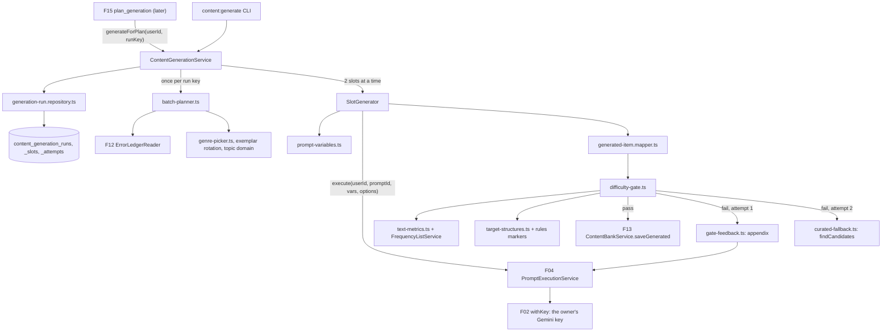
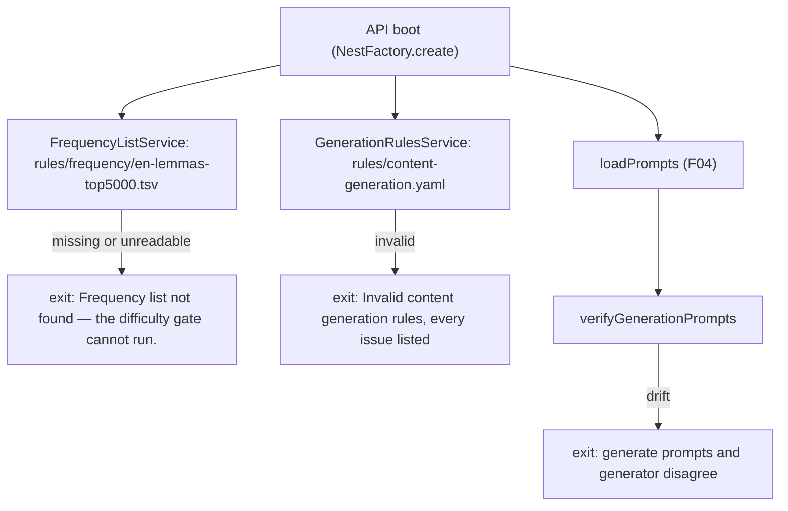

# Technical Specification: AI Content Generation with Difficulty Gate

## 1. Technical Overview

**What:** An internal generation service, `ContentGenerationService`, that F15 calls once per study plan. It turns a user's unmastered error tags into at most 12 `reading`, `vocabulary`, `grammar` and `error_review` items, each written by that user's own Gemini key through the prompt library. Each item is checked by a deterministic difficulty gate in code, and a failing item is regenerated once with the failed checks appended. Every item that passes is persisted into the content bank through F13's `saveGenerated`. A slot that fails twice is replaced by a curated bank item of the same type, or dropped when none exists. Around that core sit the reference data the gate reads (a versioned top-5,000 English lemma list built from wordfreq, and a versioned rules file with thresholds, genres, banned phrases and structure markers), three tables that record every run, slot and attempt, version 2 of the four `*-generate.yaml` prompts, a small optional extension to F04's `execute`, a `content:generate` CLI and a Generation section in `content:stats`.

**Why:** Asking a model for "C1" produces average text with slightly formal vocabulary (`docs/context.md`, "Prompts e controle de dificuldade"). The product's claim that level is measured rather than requested only holds if the measurement lives in code, runs on every item before anyone sees it, and leaves a record the curator can query per prompt version. Three constraints shape the design. First, every call runs on the learner's key and costs their quota, so the batch is bounded (12 items, 2 attempts each), resumable (a retried plan stage must not pay twice) and abandoned on quota exhaustion. Second, generated items go into a bank shared across participants, so nothing the owner said may leak into an item another participant can be served. Third, F15 does not exist yet, so the feature has to be exercisable on its own, through a CLI that calls the same service F15 will call.

**Scope — Included (Core):**
- Generation of `reading`, `vocabulary` and `grammar` items against the user's unmastered tags, batched once per study plan, capped at 12 items per run, on the user's own Gemini key. `listening` is never generated
- The deterministic difficulty gate in code, with no additional AI call: word count, mean sentence length, type-token ratio, out-of-frequency ratio against the top-3,000 lemmas, required target structures (at least 3 occurrences, spread across the text), zero banned phrases, exactly 5 questions each with exactly one correct answer, and every answer traceable to a span of the text
- Exactly one regeneration of a failing item, with the specific failed checks appended to the prompt as correction instructions
- Fallback to a curated bank item of the same type when an item fails twice, and a dropped slot when no curated item of that type exists
- Persistence of every passing item into the bank with provenance `generated`, its target tags, its gate metrics and the prompt id and version
- The top-5,000 English lemma frequency list, versioned in the repository, and the boot refusal when it is missing or unreadable
- Anti-formulaic constraints: a genre drawn per reading from the rotating list of 10, the thesis-or-tension requirement, the listicle ban, concrete specifics, the banned-phrase list, and two to three short authentic style exemplars in each prompt

**Scope — Included (Full Scope additions):**
- `error_review` item generation from the ledger records due for review. While F12's lifecycle is Core-only (`dueEntries` returns `[]`), it falls back to the user's recurring weaknesses that carry an example quote (decision A7)
- The genre no-repeat window: no genre repeats within the user's last 5 generated readings
- Style exemplar rotation: one of each prompt's exemplars per generation, rotating per user, which needs an optional example selection on F04's `execute`

**Scope — Included (additions from the interview):**
- Curator surfaces: `content:generate <email>`, which runs a real batch through the service F15 will call, or plans it without calling the model (`--dry-run`), and a Generation section in `content:stats` with pass rates per prompt version, the checks that fail most, and mean metrics
- A privacy check in the gate: an item that reproduces 6 or more consecutive words of a learner quote or correction sent in its prompt fails, so items stay reusable across participants
- A versioned rules file (`apps/api/rules/content-generation.yaml`) holding every threshold, the genres, the banned phrases, the batch mix and the structure markers, whose fingerprint is pinned per version like F09's excerpt rules

**Scope — Excluded:**
- Deciding what goes into a plan, recording servings, the `plan_generation` stage handler, the `Preparing your plan…` screen and the plan's notes UI. That is F15. F14 returns a result F15 composes from, plus `onProgress` for the progress count
- Any HTTP route and any client surface. The PRD says generation "is invisible to the user", and F13 already decided that content items have no browsing interface. `docs/api/openapi.json` does not change
- Changing F13's contract. F14 honours it: prompts move to version 2 and a mapper produces exactly what `saveGenerated` accepts (F13 "Downstream notes")
- Changing F12. F14 reads `unmasteredTags`, `recurringFor`, `dueEntries`, `entriesFor`, `detailFor` and `latestExamples` as they are
- `ordering` and `matching` questions in generated items. F13 validates them, but F16 runs them only in its Full scope, so generated items use `multiple_choice` and `fill_blank` (decision A10). A later prompt version can widen this
- Automatic prompt tuning (PRD section 7). The curator tunes prompts and rules by hand, from the gate records and F16's ratings
- Pronunciation content. `phoneme:` tags are never generation targets. F18 owns read-aloud texts

**Interview decisions:**

| Decision | Choice |
|---|---|
| Scope | Core + Full Scope additions |
| Frequency list source | wordfreq (CC BY-SA 4.0, mixed written and spoken sources), lemmatised with `wink-lemmatizer`, built by a committed script into a committed TSV with an attribution header |
| Target-structure verification | Hybrid: the model lists every occurrence as `{tag, quote}`. The gate checks each quote is verbatim in the body, counts distinct non-overlapping occurrences, requires them in at least 2 of the text's 3 thirds, and, for tags with a reliable surface form, requires each quote to match a marker regex from the rules file |
| Batch composition | F14 owns a deterministic planner with a fixed mix (3 reading, 3 grammar, 3 vocabulary, 3 error review). Tags are ranked due → recurring → other unmastered and assigned by family compatibility, at most 2 items per tag per run. F15 can only lower `maxItems` |
| Thresholds for non-reading types | The same per-token thresholds as readings (mean sentence length 18–26, TTR ≥ 0.45, ≥ 12% beyond the top-3,000), with a shorter length of 250–450 words |
| Curator surfaces | `content:generate` CLI (real run and `--dry-run`) plus a Generation section in `content:stats` |
| Privacy of shared items | Minimal prompt input plus a gate check. Reading, grammar and vocabulary prompts receive only the target tags' labels and descriptions, never the compact summary. Error review receives the tag's own quotes and corrections, and the gate fails any item that reproduces 6 or more consecutive words of them |

**Assumptions and decisions not answered by the PRD:**

| # | Assumption | Rationale |
|---|---|---|
| A1 | **One model call produces one item.** A run is up to 12 slots. Each slot has at most 2 attempts (the original and the one regeneration), and each attempt is one `execute` call, which F04 may retry once on a schema failure. That makes at most 4 model calls per slot and 48 per run | Twelve 450–700-word readings do not fit one structured response, and a per-item call is what makes "regenerate that item once" meaningful. F04's spec already fixes the 2 × 2 stacking |
| A2 | **Slots run 2 at a time** (`SLOT_CONCURRENCY = 2`) | Keeps a typical run (12 slots of about 20–40 s each) within "a few minutes" without bursting a free-tier Gemini rate limit on the user's key |
| A3 | **A run is idempotent per `(user, runKey)`.** The caller supplies an opaque `runKey`, 1–128 characters of `[A-Za-z0-9:._-]`. A second call with a completed run's key returns the stored result without calling the model. A call with a running run's key resumes it: the plan is fixed at creation, slots are claimed atomically, and a slot whose claim is older than `SLOT_LEASE_MS` (10 minutes) may be reclaimed. The claim continues from its recorded attempts, so a crash never grants a third attempt | "Happens once per study plan" has to survive F15's stage retries and a crashed worker. Ten minutes is above a slot's worst case (2 attempts × 2 calls × 90 s) |
| A4 | **Error classification per attempt** follows F11's `classifyAnalysisError`. Run-ending: `CRED002`/`CRED003` (`credential_missing`), an authentication failure (`credential_rejected`, and the vault has already marked the key invalid), and quota (HTTP 429 or `RESOURCE_EXHAUSTED`, `quota_exhausted`). Attempt-ending, which consumes the attempt: `PROMPT001` (`invalid_output`), `PROMPT003` (`timeout`), `PROMPT004` (`empty_response`), 5xx or no status (`service_error`), any other 4xx (`request_rejected`) | The PRD abandons the rest of the batch on quota and skips generation on a missing or rejected key. F04 says timeouts are retried once "by the caller's job", and the slot's second attempt is that retry. No extra backoff layer: the next slot is the next chance |
| A5 | **Abandoned and failed slots still resolve.** When a run is abandoned, slots already in flight finish their current call, no new call starts, and every slot without a generated item gets a curated fallback (or is dropped), with the abandon reason. With no usable Gemini key at the start, the run is planned, no model call is made, and every slot is resolved the same way, with the note `Some activities use existing material because your Gemini key is missing.` | F15 then has one shape to read in every case, and the PRD's "the plan falls back to the bank for the rest" is done where the slot's tags are known |
| A6 | **Curated fallback selection:** `findCandidates({ userId, types: [slot.type], provenance: 'curated' })` with F13's default 30-day served exclusion. Candidates are ranked by the count of slot tags they carry, then whether they carry any of the user's unmastered tags, then CEFR distance from C1, then distance from difficulty 4, then F13's own order. An item already used as a fallback in the run is skipped. No candidate means the slot is `dropped`. `error_review` can never have a curated item (F13's `content_item_error_review_ck`), so a failed error-review slot is always dropped | The PRD asks for "a curated bank item of the same type" and says "if no curated fallback exists for that type, the slot is dropped". The recently-served exclusion is kept because F15 fills a dropped slot from the whole bank anyway |
| A7 | **Error-review targets:** due entries first. When there are none (always, under F12 Core), recurring weaknesses that have at least one quoted example. The prompt receives up to 5 of that tag's examples (`quote → correction`) from `ErrorLedgerReader.detailFor` | The PRD sources error review from "records due for review". F12 Core never sets `due_at` (its decision A2), so without this fallback the Full scope would never produce an error-review item until F12 Full ships |
| A8 | **Tag ranking:** tier 0 is due entries (by `dueAt`, then tag), tier 1 is recurring weaknesses (F12's order), tier 2 is the remaining unmastered tags (occurrence count descending, last seen descending, tag). Only non-retired tags of families with `analysis: true` (grammar, vocab, discourse) are eligible, never `phoneme:` | "Generates … against the user's unmastered tags", with due and recurring first because those are what the plan most needs. Phoneme weaknesses are F18's read-aloud material, not text items |
| A9 | **Slot allocation:** types are assigned round-robin in the order reading, grammar, vocabulary, error_review, up to each type's mix count and `maxItems`. A slot takes the compatible tag that minimises (uses in this run, rank). Grammar takes a `grammar:` tag, vocabulary a `vocab:` tag, reading any family, and error review a tag with a quoted example. A reading takes a second tag, preferring another family. A grammar, vocabulary or error-review slot with no compatible tag becomes a reading. When no tag has uses left, planning stops early. With no eligible tag at all, the run has zero slots | Round-robin keeps a smaller `maxItems` balanced. "Fewest uses first" spreads a run across the learner's weaknesses instead of stacking one tag. Planning fewer slots than the maximum is the PRD's "generation returns fewer items than requested" |
| A10 | **Generated question formats are `multiple_choice` and `fill_blank` only** | F16 Core runs exactly these two. An `ordering` or `matching` item would sit in the bank unrunnable until F16 Full. The formats are an `enum` in each prompt's schema, and a boot check keeps it that way |
| A11 | **The prompt's response schema is flat** (`format`, `prompt`, `options`, `answer`, `accepted_answers`, `explanation`, `evidence` on each question), and `generated-item.mapper.ts` converts it to F13's discriminated union. `evidence` and `target_occurrences` are gate inputs. They are stripped from the questions and kept in `gate_metrics` | F13's question objects are strict, so extra keys would fail `saveGenerated`. A flat object is the most portable shape for Gemini's structured output. Keeping the evidence in the metrics lets the curator see why an answer counted as traceable |
| A12 | **The item's `target_tags` are the slot's tags, never the model's.** `cefr_level` is `C1`, `difficulty` comes from the rules file (4 for every type), `skills` is the type's own skill plus `grammar`/`vocabulary` for tag families present (and `reading` for grammar, vocabulary and error review), and `title` and `topic` come from the model | Determinism where the profile decides (the cross-feature criterion is about tags), and F13's rule that `skills` includes the type skill. Generation always targets C1, and F16's ratings tune the prompts rather than a per-user difficulty |
| A13 | **Slug:** `gen-<type with - for _>-<first 12 hex characters of the slot id>`, for example `gen-error-review-3f2a9c1e0b7d` | Makes `saveGenerated` idempotent per slot, so a resumed slot updates its own item instead of creating a second one. It fits F13's slug pattern and 80-character limit |
| A14 | **Variation seed:** every slot draws a `topic_domain` from F06's 15 vocabulary domains (`vocabularyDomainSchema`), distinct within the run | `docs/context.md` lists "seed de variação por geração" among the anti-formulaic layers. A drawn subject area is a variation seed the model can act on, and it reuses a list the product already has |
| A15 | **Genre draw:** uniform over the 10 genres, minus the genres of the user's 5 most recently completed generated readings and those already drawn in this run. If nothing is left (only possible if the mix is raised above 5 readings), the least recently used genre is taken. The RNG is injected, so tests can seed it | The PRD fixes the list of 10 and the 5-reading window. The fallback keeps a tuned mix from failing the plan |
| A16 | **Exemplar rotation:** each prompt carries 3 exemplars. A slot's exemplar index is the count of the user's earlier slots of that type, plus its position among this run's slots of that type, modulo the exemplar count. Both attempts of a slot use the same exemplar | The PRD asks for 2–3 exemplars per prompt, and rotation (Full) so consecutive generations do not converge on one style. Keeping the exemplar across the regeneration isolates the correction notes as the only change |
| A17 | **Exemplars are short (at most 150 words), authentic and openly licensed**, for example from The Conversation (CC BY-ND 4.0, verbatim reuse with attribution) or public-domain texts, with author, title, year and licence in a YAML comment. Each is a complete, schema-valid output, and its `user` line says it demonstrates register only | The PRD asks for "authentic style exemplars … of register, not of content". F04 validates every example against the response schema at boot. An openly licensed source keeps the repository clean |
| A18 | **Thresholds reach the prompt as variables rendered from the rules file** (`word_range`, `sentence_length_range`, `min_type_token_ratio`, `min_out_of_frequency_percent`, `min_occurrences`) | One source for the numbers the prompt asks for and the gate checks. Every item stores both the prompt version and the rules version, so a threshold change stays traceable even though it did not bump the prompt |
| A19 | **Text measurement rules** (`text-metrics.ts`): a word is a run of letters or digits with internal `'`, `’`, `-` or `.`. The word count counts all words. Sentences end at `.`, `!`, `?` or `…` (optionally followed by closing quotes or brackets) followed by whitespace and an uppercase letter, digit or opening quote, and at every blank-line paragraph break. Abbreviations (`Mr`, `Mrs`, `Ms`, `Dr`, `Prof`, `St`, `vs`, `etc`, `e.g`, `i.e`, `No`), single-letter initials and decimals do not end a sentence. Mean sentence length is words ÷ sentences. TTR is distinct lowercase alphabetic words ÷ alphabetic words. For the out-of-frequency ratio and the bands, a word's rank is the best list rank among the word itself and its `wink-lemmatizer` noun, verb and adjective lemmas. A contraction is looked up by its stem (`don't` → `do`). A hyphenated compound is in the list only when every part is. Words with digits, all-caps acronyms, and capitalised non-sentence-initial words that are absent from the whole list (names) are excluded from the ratio's numerator and denominator | The PRD fixes the measures, not their tokenisation. These rules are deterministic, testable and documented, so a curator can reproduce a number. Excluding names keeps a text about "Halden & Cole" from passing on its proper nouns |
| A20 | **Distribution:** a required tag's counted occurrences must start in at least 2 of the body's 3 equal-length thirds (by character offset) | The PRD asks for occurrences "distributed across the text rather than clustered" without a measure. Thirds are the simplest rule a curator can check by eye |
| A21 | **Verbatim matching** normalises both sides: NFKC, curly quotes to straight, en and em dashes to `-`, whitespace collapsed, lowercase, and leading and trailing punctuation of the quote trimmed. An occurrence quote needs 2–40 words, and an evidence quote 4–60 words | Models routinely swap quote styles. The minimum length stops a one-word "evidence" such as `the` from matching trivially |
| A22 | **Banned phrases** are the union of the rules file's shared list and the prompt's own `banned_phrases`. They are matched on the normalised title and body at word boundaries, and each found phrase is reported with its count | One maintained list instead of four copies. F04 keeps banned phrases out of the request, and naming one in a regeneration's correction notes is the exception: it is the specific failed check the PRD says to append |
| A23 | **Failed attempts keep metrics, not text.** Each attempt row stores the prompt id and version, outcome, failed checks, measured metrics (when there was output), a truncated provider message and latency. The failure is also logged at `warn` with prompt version and metrics, never with item text or learner quotes | The PRD asks to "log the failure with the prompt version and the measured values". Not keeping the text of a failed error-review item means a learner quote that leaked into it is not stored anywhere |
| A24 | **Tables are plural** (`content_generation_runs`, `_slots`, `_attempts`) with F12's `ck_`/`ux_`/`ix_` naming | Plural is the majority convention in the schema (`users`, `lessons`, `learning_profiles`). F13's singular `content_item` is the exception |
| A25 | **The `content:generate` CLI runs from the compiled output** (`node dist/generation/cli/generate.js`) through a minimal Nest application context. In the container the dev server's watch build keeps `dist` current. On the host, `pnpm build` comes first | It needs Nest DI (vault, prompt library, readers). `tsx` (esbuild) does not reliably emit decorator metadata, the gap F10 recorded for `openapi:generate`. A new SWC runner is a project-wide tooling decision |
| A26 | **New dependencies:** `wink-lemmatizer` (MIT, runtime; no type definitions, so a local `.d.ts` is added) and `@msgpack/msgpack` (ISC, dev only, for the list builder). No new environment variable | The lemmatiser is what makes a lemma list usable on running text. wordfreq's data is msgpack. Every threshold is in a versioned file, not the environment |
| A27 | **No new error code.** An invalid `generateForPlan` request (a bad UUID, `maxItems` outside 1–12, a malformed `runKey`) raises `VAL001`. Expected states (no key, quota, gate failure) are data in the result, never exceptions | F14 has no route, and a caller that passes 13 items has a bug. F13 set the same precedent for its internal service. With no code added, the OpenAPI snapshot stays unchanged |

**Traceability (PRD block → spec section):**

| PRD block | Where it lands |
|---|---|
| Consumes (F02 Gemini key) | §5 `generateForPlan` credential check, A4, A5 |
| Consumes (F04 prompt execution) | §3, §5 `PromptExecutionService.execute` options, prompts v2 |
| Consumes (F12 snapshot, compact summary, due records) | §1 privacy decision (the summary is deliberately not sent), A7, A8, §5 planner inputs |
| Consumes (F13 persistence by slug) | §5 mapper and `saveGenerated`, A11–A13, A6 |
| Provides (generated items for F15) | §5 `GenerationRunResult`, "Downstream notes" |
| Core Scope | §1 Included (Core), §4, §6 |
| Full Scope additions | §1 Included (Full), A7, A15, A16 |
| Capabilities | §3, §5 (rules file, frequency list, gate checks, prompts) |
| Experience | §5 `onProgress`, the CLI and the Generation section of `content:stats` |
| Error Handling | §4 Failure modes, A4, A5 |
| F14 acceptance criteria | §7 acceptance coverage table |
| Cross-feature integration criteria (F12→F14, F04→F14, F02→F14, F14→F13→F15) | §7 cross-feature table |

## 2. Architecture Impact

**Affected components:**

| Area | Path |
|---|---|
| API — generation module | `apps/api/src/generation/**` |
| API — prompt library (extension) | `apps/api/src/prompts/prompt-execution.service.ts`, `template-renderer.ts`, `prompt-types.ts` |
| API — boot | `apps/api/src/boot/verify-generation-prompts.ts`, `apps/api/src/main.ts`, `apps/api/src/app.module.ts` |
| API — content statistics | `apps/api/src/content/cli/stats.ts` |
| Prompts | `apps/api/prompts/{reading,vocabulary,grammar,error-review}-generate.yaml` (version 2) |
| Rules and reference data | `apps/api/rules/content-generation.yaml`, `apps/api/rules/frequency/en-lemmas-top5000.tsv`, `apps/api/rules/frequency/README.md` |
| Database | `apps/api/prisma/schema.prisma`, `apps/api/prisma/migrations/0014_content_generation/migration.sql` |
| Tooling and docs | `apps/api/package.json`, root `package.json`, `README.md`, `.claude/rules/prompts.md`, `docs/F04-prompt-library/progress.md` |
| Tests | `apps/api/test/unit/*generation*`, `text-metrics`, `frequency-list*`, `difficulty-gate`, `target-structures`, `batch-planner`, `genre-picker`; `apps/api/test/integration/content-generation.spec.ts`, `generation-boot.spec.ts`, `generation-stats.spec.ts`; `helpers/fake-gemini.ts`, `helpers/generation-fixtures.ts`, `test/fixtures/generation/` |
| Reused unchanged | `ContentBankService` and `validateGeneratedInput` (F13), `ErrorLedgerReader` (F12), `ErrorTaxonomyService` (F11/F12), `CredentialsService` and `CredentialExecutorService` (F02), `vocabularyDomainSchema` (F06), `isAuthenticationFailure` (F02) |

**One run:**



**Boot:**



## 3. Technical Decisions

| Decision | Chosen Approach | Alternative Considered | Trade-off |
|---|---|---|---|
| Frequency reference | wordfreq's English data, lemmatised with `wink-lemmatizer` into a top-5,000 lemma TSV by a committed builder script, with the source commit, licence and attribution in the file header. At run time a word is ranked by its best lemma | SUBTLEX-US from npm (subtitles only), or a list the curator supplies | CC BY-SA 4.0 requires the attribution header and share-alike on the derived file. Build-time lemma assignment is approximate for ambiguous forms (`saw`), which is negligible at a 3,000-rank cutoff. In exchange the list reflects written English, which is what the gate measures, and a spoken-only list would count `however` or `policy` as rare and make the gate easier to pass |
| Target structures | Model-listed occurrences verified verbatim, counted distinct and non-overlapping, spread over 2 of 3 thirds, and matched against a marker regex where the tag has a reliable surface form | Verbatim only (trust the model's labelling), or regex detectors only | Tags without a marker (collocation, word choice, register, cohesion, …) still rely on the model's labelling. Markers are a necessary condition, not proof. Accepted: a third conditional without `had` or `would have` is caught in code, and every tag in the taxonomy can still be a target |
| Where thresholds live | `apps/api/rules/content-generation.yaml`, versioned and fingerprinted, read at boot, rendered into the prompts as variables, and its version stored on every item | Constants in code, or numbers written into each prompt | The curator tunes the gate without code, and the prompt and gate cannot disagree. A threshold change does not bump the prompt version, which is why the rules version is stored alongside it |
| Regeneration mechanics | An optional `options` argument on F04's `execute`: `appendix` (text appended after the rendered message and kept by the schema retry) and `exampleIndexes` (which examples to render) | An optional `{{gate_feedback}}` variable in each template, with exemplars moved to a separate file | A change to a finished feature's public method, optional and backward compatible, recorded in F04's progress. A variable would put the correction before the constraints and examples, and a separate exemplar file contradicts "exemplars live in each YAML prompt" |
| Idempotency and resumption | A run keyed by `(user_id, run_key)`, slots planned once at creation and claimed with an atomic conditional update and a lease, attempts counted from rows | Rely on F15 never retrying, or regenerate from scratch on retry | Three tables and a lease rule. In exchange, a crashed or retried plan stage never pays for a second batch, and the one-regeneration rule holds across crashes |
| Privacy of shared items | Minimal prompt input (tag labels and descriptions; quotes only for error review) plus the `learner_quotes` gate check | Send F12's compact summary to every prompt, or make error-review items owner-only | The compact summary F12 built "for prompts" goes unused here. Accepted: nothing tag-level generation needs is in it that the tags do not carry, and an owner-only item would need an owner column and a new filter in F13 |
| Recording outcomes | `content_generation_runs`, `_slots` and `_attempts` tables, and the item's `gate_metrics` for the version that passed | Logs only, or everything as JSON on the content item | Three tables for a feature with no screen. They make "compare two prompt versions" and the PRD's "95% pass within one regeneration" objective a query, and they hold the genre history the no-repeat window reads |
| Concurrency inside a run | 2 slots in flight, claimed from the database | Sequential, or one call per slot all at once | A quota error may arrive while a second call is in flight. That call finishes and its item is kept, which matches "already-generated items are kept" |

## 4. Component Overview

**API — generation module:**

| File Path | New/Modified | Purpose | Key Responsibilities |
|---|---|---|---|
| `apps/api/src/generation/generation.module.ts` | New | Wiring | Imports `TaxonomyModule` and `ProfileModule` (Prompts, Credentials, Content and Prisma are global). Provides the services below and exports `ContentGenerationService`, `GenerationRulesService` and `FrequencyListService` |
| `apps/api/src/generation/generation.constants.ts` | New | Named constants | `MAX_ITEMS_PER_RUN = 12`, `MAX_ATTEMPTS_PER_SLOT = 2`, `SLOT_CONCURRENCY = 2`, `SLOT_LEASE_MS = 600_000`, `GENRE_WINDOW_READINGS = 5`, `GENERATED_CEFR_LEVEL = 'C1'`, `GENERATION_RULES_PATH`, `FREQUENCY_LIST_PATH`, `GENERATION_PROMPT_IDS` per type, the note codes and their texts (A5) |
| `apps/api/src/generation/generation.contract.ts` | New | Service contract | Zod schema for `GenerationRequest`; types `GenerationRunResult`, `GenerationSlotResult`, `GenerationNote`, `PlannedSlot`, `SlotOutcome`, `AttemptOutcome`, `GateReport` |
| `apps/api/src/generation/rules/generation-rules.ts` | New | Rules file | Strict Zod schema of `content-generation.yaml`, cross-field checks (min < max, ratios in 0–1, exactly 10 unique genres, mix sum ≤ 12, marker tags exist in the taxonomy and are not `phoneme:`, every marker compiles after lexicon expansion), camelCase mapping, `rulesFingerprint`, `loadGenerationRulesFile` that throws `GenerationRulesValidationError` with every issue. Follows `excerpts/excerpt-rules.ts` |
| `apps/api/src/generation/generation-rules.service.ts` | New | Rules in force | `OnModuleInit` load, `current()`. An invalid file stops the boot, and the log line names version and fingerprint. Follows `ExcerptRulesService` |
| `apps/api/src/generation/text/frequency-list.ts` | New | Reference data | Parses the TSV (comment header, `rank lemma zipf` rows), validates it (at least 3,000 contiguous ranks, unique lowercase lemmas, 5,000 expected), and returns `{ version, size, rankOf(word) }`, where `rankOf` takes the best rank among the word and its lemmas. A missing or unreadable file throws `FrequencyListUnavailableError` with exactly `Frequency list not found — the difficulty gate cannot run.`. A malformed file throws `Frequency list is invalid — the difficulty gate cannot run:` followed by every issue |
| `apps/api/src/generation/frequency-list.service.ts` | New | List in force | `OnModuleInit` load, `current()`. The boot log names size and version |
| `apps/api/src/generation/text/lemmas.ts` | New | Lemmatiser wrapper | `lemmaCandidates(word)` returns the word plus `wink-lemmatizer`'s noun, verb and adjective lemmas, de-duplicated. Also used by the builder |
| `apps/api/src/generation/text/wink-lemmatizer.d.ts` | New | Types | Module declaration for the untyped package |
| `apps/api/src/generation/text/text-metrics.ts` | New | Measurement | `normalizeForMatch`, `words`, `sentences`, `measureText(body, list, cutoff)` → word count, sentence count, mean sentence length, TTR, out-of-frequency ratio and the band shares `k1`, `k2`, `k3`, `k4_5`, `off_list`, following A19. Pure |
| `apps/api/src/generation/gate/target-structures.ts` | New | Occurrence check | Given the body, the required tags, the model's occurrences and the compiled markers: verbatim location, distinct non-overlapping spans, marker match, thirds covered; per tag `{ occurrences, thirds, rejected: [{ quote, reason }] }`. Pure |
| `apps/api/src/generation/gate/difficulty-gate.ts` | New | The gate | `evaluateGate(candidate, context)` runs every check in §5 and returns `{ passed, failedChecks, metrics }` with all checks reported, never only the first. Uses F13's `validateGeneratedInput` for the question and item-shape checks. Pure |
| `apps/api/src/generation/gate/gate-feedback.ts` | New | Correction notes | Renders failed checks as the regeneration appendix, each with measured and required values (§5). Never includes item text or learner quotes |
| `apps/api/src/generation/generated-item.mapper.ts` | New | Output → bank input | Maps the flat model output to F13's `GeneratedItemInput` (A11–A13) and returns the stripped evidence and occurrences separately. Shape problems become `questions` or `item_shape` issues rather than exceptions |
| `apps/api/src/generation/planning/tag-ranking.ts` | New | Target tags | Ranks eligible tags into tiers 0–2 (A8) from F12's readers, with each tag's source and rank for the record |
| `apps/api/src/generation/planning/batch-planner.ts` | New | Slot plan | `planBatch({ ranked, examplesByTag, maxItems, mix, maxPerTag })` → ordered slots with type and target tags (A9). Pure and deterministic |
| `apps/api/src/generation/planning/genre-picker.ts` | New | Genre draw | `pickGenres(count, recent, genres, rng)` (A15). Pure |
| `apps/api/src/generation/planning/slot-decorations.ts` | New | Variation | Assigns topic domains (A14) and exemplar indexes (A16) to planned slots, given the user's per-type slot counts and an injected RNG |
| `apps/api/src/generation/prompt-variables.ts` | New | Prompt input | Builds each type's variables from the slot, the rules and the taxonomy's labels and descriptions. For error review it adds `learner_errors` from `ErrorLedgerReader.detailFor` (up to 5 `quote → correction` lines) and returns those strings as the gate's learner quotes |
| `apps/api/src/generation/generation-error.ts` | New | Classification | `classifyGenerationError(error)` → `{ scope: 'run' \| 'attempt', outcome, detail }` (A4), reusing `isAuthenticationFailure` and F04's codes |
| `apps/api/src/generation/curated-fallback.ts` | New | Fallback | `selectCuratedFallback(bank, userId, slot, unmastered, usedIds)` (A6) |
| `apps/api/src/generation/generation-run.repository.ts` | New | Persistence | Create run and slots in one transaction (a unique violation re-reads the existing run); `claimNextSlot(runId, now)` as one conditional `UPDATE … RETURNING` (pending, or running with an expired lease); `recordAttempt`; `completeSlot`; `finishRun`; `recentReadingGenres(userId, 5)`; `slotCountsByType(userId)`; `resultFor(runId)` |
| `apps/api/src/generation/slot-generator.service.ts` | New | One slot | Loops attempts from the recorded count: variables, `execute` with `{ exampleIndexes: [slot.exemplarIndex], appendix }`, map, gate, then on pass `saveGenerated` followed by the slot update, on fail an attempt row and a `warn` log. Stops on a run-scope error, and on exhaustion resolves the fallback |
| `apps/api/src/generation/content-generation.service.ts` | New | Public entry | `generateForPlan(request)`, `previewPlan(userId, options)` and `resultFor(userId, runKey)` (§5). Validates the request, reuses or creates the run, checks the Gemini status first (`CredentialsService.list`), runs slots with `SLOT_CONCURRENCY`, calls `onProgress(done, total)` after each terminal slot, sets notes and finishes the run |
| `apps/api/src/generation/generation-stats.ts` | New | Curator statistics | `collectGenerationStats(prisma)` and `renderGenerationStats(stats)`: per prompt id and version, slots, first-attempt pass rate, pass rate within one regeneration, discards, the most frequent failed checks, and mean metrics of passing items; runs and abandon reasons |
| `apps/api/src/generation/cli/generation-cli.module.ts` | New | CLI container | Minimal module (Prisma, Credentials, Prompts, Taxonomy, Profile, Content, Generation), with no BullMQ, no scheduler and no HTTP |
| `apps/api/src/generation/cli/generate.ts` | New | CLI entry | `content:generate <email> [--max N] [--run-key K] [--dry-run]`: the schema guard, application context, `loadPrompts`, `verifyGenerationPrompts`, user lookup by email, then preview or run, streamed lines and exit code |
| `apps/api/src/generation/cli/generate-report.ts` | New | CLI output | Line per slot, summary and dry-run listing (§5). Pure |
| `apps/api/src/generation/cli/build-frequency-list.ts` | New | List builder | `frequency:build [--source <path or url>]`: reads wordfreq's `large_en.msgpack.gz` (default: the pinned-commit URL), decodes the cBpack buckets, keeps lowercase alphabetic words, assigns each to one lemma, sums frequencies, ranks, writes the top 5,000 with the header. Deterministic for the same source |

**API — elsewhere:**

| File Path | New/Modified | Purpose | Key Responsibilities |
|---|---|---|---|
| `apps/api/src/prompts/prompt-types.ts` | Modified | F04 types | Adds `PromptExecutionOptions { appendix?: string; exampleIndexes?: readonly number[] }` |
| `apps/api/src/prompts/template-renderer.ts` | Modified | F04 rendering | `renderUserMessage(prompt, variables, options?)`: renders only the selected examples in the given order (an out-of-range index is a programming error), then appends `appendix` after constraints and examples. Without options the output is byte-identical to today's |
| `apps/api/src/prompts/prompt-execution.service.ts` | Modified | F04 execution | `execute(userId, promptId, variables, options?)` passes options to rendering. The schema retry builds on the message that already carries the appendix. Telemetry unchanged |
| `apps/api/src/boot/verify-generation-prompts.ts` | New | Boot check | For each of the four prompts: 2–3 examples; a question `format` enum within `multiple_choice`/`fill_blank`; `evidence` and `target_occurrences` present in the schema; declared variables equal to the set `prompt-variables.ts` renders for that type. Throws `GenerationPromptMismatchError` listing every issue. Mirrors `verify-analysis-prompt.ts` |
| `apps/api/src/main.ts` | Modified | Boot order | Calls `verifyGenerationPrompts` right after `verifyAnalysisPrompt` |
| `apps/api/src/app.module.ts` | Modified | Root module | Imports `GenerationModule` |
| `apps/api/src/content/cli/stats.ts` | Modified | `content:stats` | Appends the Generation section from `generation-stats.ts`, omitted when no run exists |

**Prompts, rules and reference data:**

| File Path | New/Modified | Purpose |
|---|---|---|
| `apps/api/prompts/reading-generate.yaml` | Modified (version `"2"`) | §5 variables and response schema; system and constraints carry the genre, thesis-or-tension, no-listicle, concrete-specifics, ≥ 2 idiomatic or figurative expressions, abstract or argumentative register, and the evidence and occurrence instructions; 3 exemplars (A17); `banned_phrases` for reading-specific filler |
| `apps/api/prompts/vocabulary-generate.yaml` | Modified (version `"2"`) | Same envelope. At least 3 of 5 questions test meaning from context |
| `apps/api/prompts/grammar-generate.yaml` | Modified (version `"2"`) | Same envelope. At least 2 of 5 questions test the target structure directly, `fill_blank` preferred |
| `apps/api/prompts/error-review-generate.yaml` | Modified (version `"2"`) | Adds `learner_errors`. Models the correct forms in new sentences, forbids reusing the learner's sentences, at least 2 questions on the mistaken pattern. Exemplars carry invented illustrative errors, never real learner data |
| `apps/api/rules/content-generation.yaml` | New | §5 rules file, version `"1"` |
| `apps/api/rules/frequency/en-lemmas-top5000.tsv` | New (generated) | §5 frequency list |
| `apps/api/rules/frequency/README.md` | New | Provenance, licence and attribution (CC BY-SA 4.0), how to rebuild, and what changing the file means (bump the rules version) |

**Tooling and docs:**

| File Path | New/Modified | Purpose |
|---|---|---|
| `apps/api/package.json` | Modified | `content:generate` (`node --env-file-if-exists=../../.env dist/generation/cli/generate.js`), `frequency:build` (`node --import tsx src/generation/cli/build-frequency-list.ts`); dependency `wink-lemmatizer`; dev dependency `@msgpack/msgpack` |
| `package.json` (root) | Modified | `content:generate` shortcut through `docker compose exec -w /workspace/apps/api api`, as F13's shortcuts do |
| `README.md` | Modified | Command rows for `content:generate` (dry run and real run) and `frequency:build` |
| `.claude/rules/prompts.md` | Modified | One bullet: the `*-generate` prompts take their difficulty numbers as variables from `rules/content-generation.yaml`, and a boot check pins their variables and question formats |
| `docs/F04-prompt-library/progress.md` | Modified | A dated follow-up note recording the optional `options` argument F14 added to `execute` |

**Database:**

| Migration File | Tables Affected | Operation | Notes |
|---|---|---|---|
| `apps/api/prisma/migrations/0014_content_generation/migration.sql` | `content_generation_runs`, `content_generation_slots`, `content_generation_attempts` | CREATE | `main` holds `0001`–`0013`. Use the next free number if another feature lands first |

**Failure modes:**

| Scenario | Behaviour | Surfaced as |
|---|---|---|
| Frequency list missing or unreadable at boot | The API refuses to start | `Frequency list not found — the difficulty gate cannot run.` |
| Frequency list malformed | The API refuses to start | `Frequency list is invalid — the difficulty gate cannot run:` plus every issue |
| Rules file invalid (bad threshold, unknown marker tag, bad regex, not 10 genres) | The API refuses to start | `Invalid content generation rules:` plus every issue |
| A `*-generate` prompt drifts from the generator (variables, formats, exemplar count) | The API refuses to start | `Generation prompts and generator disagree:` plus every issue |
| No usable Gemini key at the start | No model call. Slots are planned and resolved to curated fallbacks or dropped | Run `abandonReason: credential_missing`; note `Some activities use existing material because your Gemini key is missing.` |
| Key rejected mid-run | The vault marks it `invalid`, items already generated are kept, and the other slots are resolved without calls | `abandonReason: credential_rejected`; the same note |
| Quota exhausted mid-run | The in-flight call finishes, no new call starts, generated items are kept, the rest fall back | `abandonReason: quota_exhausted`; note `Some activities use existing material because your Gemini quota ran out.` |
| Gate failure on attempt 1 | Attempt row with metrics and failed checks; the second attempt carries the appendix | Attempt `gate_failed` |
| Timeout, empty response, schema failure twice, or provider 5xx on an attempt | The attempt is consumed; the slot moves to its next attempt or its fallback | Attempt `timeout` / `empty_response` / `invalid_output` / `service_error` |
| Two failed attempts | Item discarded, `warn` log with prompt version and metrics, curated fallback of the same type | Slot `fallback` (`gate_failed_twice` or `generation_failed`) |
| No curated item of that type (always for error review) | Slot dropped | Slot `dropped` with its reason |
| An item reproduces a learner quote or correction | Fails `learner_quotes`, regenerated once, never persisted if it fails again | Attempt `gate_failed` with `learner_quotes` |
| `saveGenerated` raises (the database is down) | Treated as unclassified: the error propagates to the caller, the slot stays `running`, and the lease lets a retried call resume it with the same slug | Error from the service; F15's stage retry |
| No eligible tags (empty ledger, or only `phoneme:` weaknesses) | Zero slots, no call | `counts.planned: 0` |
| Same `runKey` again | Completed: the stored result with no call. Running: resumed | Same `runId` |
| `maxItems` outside 1–12, bad `userId` or `runKey` | Rejected before anything is written | `AppError` `VAL001` |

## 5. Internal Contracts

F14 adds no HTTP route and no error code. Its contracts are a TypeScript service consumed through dependency injection, an optional argument on F04's `execute`, two versioned files the curator edits, the prompts' variables and schema, the `gate_metrics` object stored on each item, and two CLIs.

### `ContentGenerationService`

**`generateForPlan(request): Promise<GenerationRunResult>`** (F15, the CLI)

| Field | Type | Required | Validation | Description |
|---|---|---|---|---|
| `userId` | `uuid` | Yes | UUID | The owner. The only key used and the only ledger read |
| `runKey` | `string` | Yes | 1–128 chars, `^[A-Za-z0-9:._-]+$` | Idempotency key, unique per user. F15 chooses it (see "Downstream notes") |
| `maxItems` | `integer` | No | 1–12, default 12 | Upper bound on planned slots |
| `now` | `Date` | No | | For tests; defaults to now |
| `onProgress` | `(done, total) => void \| Promise<void>` | No | | Called after each slot reaches a terminal state. A thrown error is logged and ignored |

```json
{ "userId": "8b0f5c2e-4a51-4d7e-9a3b-2f6c1d0e9a77", "runKey": "lesson:1c9e7a40-2d3b-4f5e-8a61-0b2c3d4e5f60", "maxItems": 12 }
```

**`GenerationRunResult`:**

| Field | Type | Description |
|---|---|---|
| `runId` | `uuid` | |
| `runKey` | `string` | |
| `abandonReason` | `null \| 'credential_missing' \| 'credential_rejected' \| 'quota_exhausted'` | Why generation stopped early, if it did |
| `slots[]` | `GenerationSlotResult[]` | In plan order |
| `slots[].position` | `integer` | 1–12 |
| `slots[].type` | `'reading' \| 'vocabulary' \| 'grammar' \| 'error_review'` | The planned type |
| `slots[].targetTags` | `string[]` | 1–2 tags, all unmastered for the user when planned |
| `slots[].outcome` | `'generated' \| 'fallback' \| 'dropped'` | |
| `slots[].contentItemId` | `uuid \| null` | The generated item, or the curated fallback; null when dropped |
| `slots[].reason` | `null \| 'gate_failed_twice' \| 'generation_failed' \| 'quota_exhausted' \| 'credential_rejected' \| 'credential_missing'` | Why the slot did not generate |
| `slots[].attempts` | `integer` | 0–2 |
| `slots[].genre` | `string \| null` | Readings only |
| `slots[].tagSources` | `Array<{ tag, source: 'due' \| 'recurring' \| 'unmastered', rank }>` | Why each tag was chosen, for F15's rationale |
| `counts` | `{ planned, generated, fallback, dropped }` | |
| `notes[]` | `Array<{ code: 'gemini_key_missing' \| 'gemini_quota_exhausted', text }>` | Texts from `generation.constants.ts`. The first is the PRD's wording |

```json
{
  "runId": "2d7c1b90-5e4f-4a3b-9c21-7f6e5d4c3b2a",
  "runKey": "lesson:1c9e7a40-2d3b-4f5e-8a61-0b2c3d4e5f60",
  "abandonReason": "quota_exhausted",
  "slots": [
    {
      "position": 1,
      "type": "reading",
      "targetTags": ["grammar:conditional-3", "discourse:hedging"],
      "outcome": "generated",
      "contentItemId": "5a1e2f3c-7b8d-4e9f-a0b1-c2d3e4f5a6b7",
      "reason": null,
      "attempts": 1,
      "genre": "letter to the editor",
      "tagSources": [
        { "tag": "grammar:conditional-3", "source": "recurring", "rank": 1 },
        { "tag": "discourse:hedging", "source": "unmastered", "rank": 6 }
      ]
    },
    {
      "position": 2,
      "type": "grammar",
      "targetTags": ["grammar:passive-voice"],
      "outcome": "fallback",
      "contentItemId": "9c8b7a6f-5e4d-4c3b-2a19-08f7e6d5c4b3",
      "reason": "gate_failed_twice",
      "attempts": 2,
      "genre": null,
      "tagSources": [{ "tag": "grammar:passive-voice", "source": "recurring", "rank": 2 }]
    },
    {
      "position": 4,
      "type": "error_review",
      "targetTags": ["grammar:article-definite"],
      "outcome": "dropped",
      "contentItemId": null,
      "reason": "quota_exhausted",
      "attempts": 0,
      "genre": null,
      "tagSources": [{ "tag": "grammar:article-definite", "source": "recurring", "rank": 3 }]
    }
  ],
  "counts": { "planned": 12, "generated": 5, "fallback": 5, "dropped": 2 },
  "notes": [
    { "code": "gemini_quota_exhausted", "text": "Some activities use existing material because your Gemini quota ran out." }
  ]
}
```

(`slots` is truncated to three entries here.)

**`previewPlan(userId, { maxItems?, now? }): Promise<PlannedSlot[]>`** plans the batch exactly as a run would, genres and exemplars included, without persisting anything or calling the model. Used by `--dry-run`.

**`resultFor(userId, runKey): Promise<GenerationRunResult | null>`** reads a run without running it.

### `PromptExecutionService.execute` — optional options (F04 extension)

`execute(userId, promptId, variables, options?)`, with every existing call unchanged.

| Option | Type | Behaviour |
|---|---|---|
| `appendix` | `string` | Appended after the rendered template, constraints and examples, separated by a blank line. The schema retry's correction is appended after it, so both reach the model |
| `exampleIndexes` | `readonly number[]` | Only these examples are rendered, in this order (`[]` renders none). An index outside the prompt's examples throws a programming error before any call |

**Regeneration appendix** (rendered by `gate-feedback.ts`):

```
Correction needed: your previous draft failed these checks. Write a complete new version that fixes every one of them, keeping the same genre, topic domain and target structures.
- out_of_frequency_ratio: 10.8% of counted words are outside the 3,000 most frequent English lemmas; at least 12% is required.
- target_structures: grammar:conditional-3 has 2 verified occurrences (1 rejected: its quote is not in the text); at least 3 are required, in at least 2 of the text's thirds.
- banned_phrases: remove "delve into" (1) and "in today's fast-paced world" (1).
```

### Prompts, version 2

| Prompt | Variables |
|---|---|
| `reading-generate` | `genre`, `topic_domain`, `target_structures`, `word_range`, `sentence_length_range`, `min_type_token_ratio`, `min_out_of_frequency_percent`, `min_occurrences` |
| `vocabulary-generate`, `grammar-generate` | the same, without `genre` |
| `error-review-generate` | the same as vocabulary, plus `learner_errors` |

`target_structures` renders one line per tag from the taxonomy: `- grammar:conditional-3 (Third conditional): Malformed or misused hypothetical past conditional.`, which the template frames as patterns to model correctly. `learner_errors` renders up to 5 lines, `- "<quote>" → "<correction>"`. No other learner data enters any prompt.

**Response schema (shared shape across the four):**

| Field | Type | Rules |
|---|---|---|
| `title` | `string` | 1–200 |
| `topic` | `string` | 1–80 |
| `body` | `string` | Paragraphs separated by blank lines; no headings or bullets |
| `questions` | `array` | Exactly 5 |
| `questions[].format` | `string` | `enum: [multiple_choice, fill_blank]` |
| `questions[].prompt` | `string` | For `fill_blank`, exactly one `___` |
| `questions[].options` | `string[]` | `multiple_choice`: exactly 4 |
| `questions[].answer` | `string` | `multiple_choice`: the correct option's exact text |
| `questions[].accepted_answers` | `string[]` | `fill_blank`: 1–5 accepted forms |
| `questions[].explanation` | `string` | Required |
| `questions[].evidence` | `string` | Required: an exact quote from `body` that supports the answer |
| `target_occurrences` | `array` of `{ tag, quote }` | Every use of each target structure, `quote` copied exactly from `body` |

### Gate checks

Every check runs on every attempt, and the report lists all of them.

| Check | Passes when | Source of the limit |
|---|---|---|
| `word_count` | `words.min ≤ count ≤ words.max` (reading 450–700, others 250–450) | Rules, per type |
| `mean_sentence_length` | `min ≤ mean ≤ max` (18–26) | Rules, per type |
| `type_token_ratio` | `≥ 0.45` | Rules, per type |
| `out_of_frequency_ratio` | Share of counted words ranked beyond 3,000 `≥ 0.12` | Rules (`frequency_rank_cutoff`, per-type minimum) |
| `target_structures` | Every slot tag has `≥ 3` verified occurrences in `≥ 2` thirds (A20), each matching the tag's markers when it has any | Rules |
| `banned_phrases` | No phrase from the rules list or the prompt's list in the title or body (A22) | Rules + prompt |
| `questions` | Exactly 5; formats within the allowed two; each with exactly one correct answer (F13's schema and `answerKeyIssues`: unique options with the answer among them, one blank with 1–5 accepted forms) | Rules (`questions.count`, `questions.formats`) + F13 |
| `answer_evidence` | Every `evidence` is 4–60 words and verbatim in the body, and a `fill_blank` question's evidence contains one of its accepted answers | Code |
| `item_shape` | No other `validateGeneratedInput` issue (title, topic, body length, skills, tags) | F13 |
| `learner_quotes` | No run of `learner_quote_run_words` (6) consecutive words from a learner quote or correction sent in the prompt appears in title, body, questions, options, answers or explanations. Trivially passes when none were sent | Rules |

### `gate_metrics` (stored on the content item for the passing attempt, and on every attempt row)

```json
{
  "rules_version": "1",
  "frequency_list": "en-lemmas-top5000@9f2c4e1a0b7d",
  "attempt": 2,
  "genre": "letter to the editor",
  "topic_domain": "housing",
  "exemplar_index": 1,
  "word_count": 612,
  "sentence_count": 27,
  "mean_sentence_length": 22.67,
  "type_token_ratio": 0.513,
  "out_of_frequency_ratio": 0.141,
  "frequency_bands": { "k1": 0.712, "k2": 0.088, "k3": 0.059, "k4_5": 0.052, "off_list": 0.089 },
  "target_structures": {
    "grammar:conditional-3": { "occurrences": 4, "thirds": [1, 2, 3], "rejected": 0 },
    "discourse:hedging": { "occurrences": 3, "thirds": [1, 3], "rejected": 1 }
  },
  "banned_phrases_found": [],
  "questions": 5,
  "answer_evidence": [
    "Had the first smart speakers shipped with a warning label",
    "the council would almost certainly have approved it"
  ],
  "checks": {
    "word_count": "pass", "mean_sentence_length": "pass", "type_token_ratio": "pass",
    "out_of_frequency_ratio": "pass", "target_structures": "pass", "banned_phrases": "pass",
    "questions": "pass", "answer_evidence": "pass", "item_shape": "pass", "learner_quotes": "pass"
  }
}
```

(`answer_evidence` is truncated to two entries here. A real record carries one per question.) Ratios are stored as fractions and rendered as percentages. `out_of_frequency_ratio` is `k4_5 + off_list`. A failed attempt's metrics use the same keys, with `"fail"` in `checks`.

### Rules file: `apps/api/rules/content-generation.yaml`

| Section | Content |
|---|---|
| `version` | Quoted string. Bump on any change. The fingerprint of each version is pinned by `generation-rules.spec.ts` |
| `item_types.<type>` | `words {min,max}`, `mean_sentence_length {min,max}`, `min_type_token_ratio`, `min_out_of_frequency_ratio`, `min_structure_occurrences`, `target_tags {min,max}` (reading 1–2, the others 1–1), `difficulty` |
| `frequency_rank_cutoff` | `3000` |
| `min_occurrence_thirds` | `2` |
| `learner_quote_run_words` | `6` |
| `questions` | `count: 5`, `formats: [multiple_choice, fill_blank]` |
| `batch` | `mix: {reading: 3, grammar: 3, vocabulary: 3, error_review: 3}` (sum ≤ 12), `max_items_per_tag: 2` |
| `genres` | Exactly 10 unique: opinion column, book review, interview excerpt, letter to the editor, popular-science explainer, obituary, product teardown, travel dispatch, conference talk transcript, historical vignette |
| `banned_phrases` | The shared list of generated-prose filler, lowercase and unique (for example `delve into`, `tapestry`, `in today's fast-paced world`, `it's important to note`, `a testament to`, `navigate the complexities`, `ever-evolving`, `plays a crucial role`, `unlock the potential`, `in conclusion`, `at the end of the day`, `a rich tapestry`, `stands as a`, `fostering a sense of`), about 40 entries |
| `lexicons` | Named word lists markers can reference as `{name}`: `participle` (irregular past participles), `particle`, `connector`, `hedge`, `reporting_verb`, `modal` |
| `structure_markers` | Tag → list of case-insensitive regexes. A quote must match at least one |

```yaml
# Content generation rules (F14). Read only when the API boots.
# Every item stores the version it was checked under. Bump it with any change.
version: "1"

item_types:
  reading:
    words: { min: 450, max: 700 }
    mean_sentence_length: { min: 18, max: 26 }
    min_type_token_ratio: 0.45
    min_out_of_frequency_ratio: 0.12
    min_structure_occurrences: 3
    target_tags: { min: 1, max: 2 }
    difficulty: 4
  grammar:
    words: { min: 250, max: 450 }
    # … the same per-token thresholds, target_tags 1–1, difficulty 4
```

**Tags with markers in version 1** (the condition is necessary, not sufficient):

| Tag | A verified quote must contain |
|---|---|
| `grammar:conditional-2` | A conditional trigger (`if`, `unless`, `suppose`, `were … to`) and `would`/`could`/`might` not followed by `have` |
| `grammar:conditional-3` | `had` + past participle (or inverted `Had …`) and `would`/`could`/`might` (`not`) `have` |
| `grammar:conditional-mixed` | `had` + past participle with `would`/`could`/`might` not followed by `have`, or a past or `were` clause with `would have` |
| `grammar:present-perfect` | `have`/`has`/`'ve`/`'s` + past participle |
| `grammar:past-perfect` | `had`/`'d` + past participle |
| `grammar:passive-voice` | A form of `be` or `get` + past participle |
| `grammar:modal-verb` | A modal from `{modal}` |
| `grammar:future-forms` | `will`, `'ll`, `shall`, `going to`, `about to` or `due to` + verb |
| `grammar:reported-speech` | A `{reporting_verb}` followed by `that`, `if`, `whether`, a wh-word or `to` |
| `grammar:relative-clause` | `who`, `whom`, `whose`, `which`, `that`, `where` or `when` |
| `grammar:gerund-infinitive` | An `-ing` form or `to` + verb |
| `grammar:comparison` | `more`/`less` … `than`, `-er than`, `as … as`, `the most`/`least`, or `-est` |
| `grammar:article-definite` | `the` |
| `grammar:article-indefinite` | `a` or `an` |
| `grammar:question-form` | A question mark |
| `vocab:phrasal-verb` | A verb followed by a `{particle}` |
| `discourse:connector` | A `{connector}` |
| `discourse:hedging` | A `{hedge}` |

The other non-phoneme tags have no marker in version 1 and are verified verbatim only.

### Frequency list: `apps/api/rules/frequency/en-lemmas-top5000.tsv`

```
# English lemma frequency list, top 5,000 — reference data for the F14 difficulty gate.
# Source: wordfreq "large_en" by Robyn Speer et al., https://github.com/rspeer/wordfreq, commit <sha>.
# Licence: CC BY-SA 4.0 (https://creativecommons.org/licenses/by-sa/4.0/). This derived list is shared under the same licence.
# Lemmatised with wink-lemmatizer <version>. Generated by `pnpm frequency:build` on <date>. Do not edit by hand.
rank	lemma	zipf
1	the	7.73
2	be	7.64
3	and	7.38
```

The version recorded on items is `en-lemmas-top5000@` plus the first 12 hex characters of the file's SHA-256. Changing the file changes the gate, so the rules version is bumped with it.

### `content:generate` CLI

**Usage:** `pnpm content:generate <email> [--max N] [--run-key K] [--dry-run]`, from `apps/api`, after a build. `--run-key` defaults to `cli:<ISO timestamp>`, so a repeat with an explicit key exercises idempotency.

```
Generating up to 12 items for ana@example.com (Gemini key: valid), run cli:2026-09-27T14:03:11Z
✓  1 reading       grammar:conditional-3, discourse:hedging  passed on attempt 1 · 612 words · OOF 14.1% · gen-reading-3f2a9c1e0b7d
↻  2 grammar       grammar:passive-voice                     passed on attempt 2 (attempt 1: out_of_frequency_ratio 10.8% < 12%) · gen-grammar-8e1d…
✗  3 vocabulary    vocab:collocation                         failed twice (target_structures; banned_phrases) → curated ted-urban-vocab
–  4 error_review  grammar:article-definite                  failed twice (answer_evidence) → dropped: no curated error_review item
12 planned: 9 generated, 2 fallback, 1 dropped. Notes: none.
```

`--dry-run` prints `Dry run — nothing was generated or written.` and one line per planned slot: position, type, tags with their source, genre, topic domain and exemplar. Exit code `0` when the run completes (with or without fallbacks); `1` for a fatal error: unknown email (`No user with email <email>.`), schema not migrated (F13's guard message, naming `content:generate`), or a boot-time refusal.

### `frequency:build` CLI

`pnpm frequency:build [--source <path or url>]` rewrites the TSV. It is a dev tool and is never run by the API.

### `content:stats` — Generation section

```
Generation by prompt version (last 90 days)
prompt                  ver  slots  1st pass  ≤1 regen  discarded  most failed checks
reading-generate        2    18     61%       94%       1          out_of_frequency_ratio 5, target_structures 3
grammar-generate        2    15     73%       100%      0          mean_sentence_length 2
Passing means: reading-generate v2 — 598 words, MSL 21.3, TTR 0.52, OOF 13.9%
Runs: 7 (abandoned: 1 credential, 1 quota)
```

"≤1 regen" is slots generated on attempt 1 or 2 over slots whose attempts ran to a gate verdict. It is the PRD objective "at least 95% of generated items pass the difficulty gate within one regeneration". Slots abandoned before any attempt are excluded.

### Error codes

| Code | HTTP Status | Description |
|---|---|---|
| `VAL001` | 400 | `generateForPlan` request failed validation (existing code) |

### Downstream notes (obligations this contract places on later features)

| Feature | Note |
|---|---|
| F15 | Call `generateForPlan` inside the `plan_generation` handler and on the failed-recording path, one call per plan, serialized per user. Choose a `runKey` that is unique per plan: `lesson:<lessonId>` for the pipeline and `fallback:<lessonId>` for a failed recording, adding the stage run number only if an explicit user retry should regenerate. Pass `reportProgress` as `onProgress`. Treat `generated` and `fallback` item ids as candidates, fill `dropped` slots and the rest of the quotas from `findCandidates`, and use `tagSources` for the rationale. Show `notes` (`gemini_key_missing` carries the PRD text; F15's own missing-key note may supersede it). Call `recordServed` for every item the plan activates. A typical run takes minutes, and the worst case is about 36 minutes (48 calls × 90 s ÷ 2), so the stage's retry policy should expect that. A retried call resumes and never pays twice |
| F16 | Generated items carry only `multiple_choice` and `fill_blank`. Their payload's `promptVersion` is what a difficulty rating is stored against. `gate_metrics` is curator data and never reaches a client |
| F12 Full | Once the lifecycle sets `due_at`, `dueEntries` becomes tier 0 of the ranking and the source of error-review targets, with no F14 change |
| F20 | The rating distribution tells the curator whether items land at the right level. `content:stats` shows the gate side of the same question |
| Curator | Tune a prompt by bumping its `version`, and a threshold by bumping the rules `version`. Try the change with `content:generate --dry-run`, then a real run, and read the result with `content:stats` |

## 6. Data Model

**Table: `content_generation_runs`**

| Column | Type | Nullable | Default | Description |
|---|---|---|---|---|
| `id` | `uuid` | No | `gen_random_uuid()` | Primary key |
| `user_id` | `uuid` | No | - | Owner; FK `users` ON DELETE CASCADE |
| `run_key` | `varchar(128)` | No | - | Caller's idempotency key |
| `status` | `varchar(16)` | No | `'running'` | `running`, `completed` |
| `abandon_reason` | `varchar(32)` | Yes | - | `credential_missing`, `credential_rejected`, `quota_exhausted` |
| `max_items` | `smallint` | No | - | 1–12 |
| `rules_version` | `varchar(32)` | No | - | Rules in force at creation |
| `rules_fingerprint` | `char(64)` | No | - | |
| `frequency_list_version` | `varchar(80)` | No | - | |
| `taxonomy_version` | `varchar(16)` | No | - | |
| `notes` | `jsonb` | No | `'[]'` | `[{ code, text }]` |
| `started_at` | `timestamptz` | No | `now()` | |
| `finished_at` | `timestamptz` | Yes | - | Set when `completed` |

**Table: `content_generation_slots`**

| Column | Type | Nullable | Default | Description |
|---|---|---|---|---|
| `id` | `uuid` | No | `gen_random_uuid()` | Primary key; its hex prefix names the item's slug |
| `run_id` | `uuid` | No | - | FK runs ON DELETE CASCADE |
| `user_id` | `uuid` | No | - | Denormalised owner, for the genre and exemplar history; FK `users` ON DELETE CASCADE |
| `position` | `smallint` | No | - | 1–12, plan order |
| `type` | `varchar(16)` | No | - | `reading`, `vocabulary`, `grammar`, `error_review` |
| `target_tags` | `text[]` | No | - | 1–2 tags |
| `tag_sources` | `jsonb` | No | - | `[{ tag, source, rank }]` |
| `genre` | `varchar(40)` | Yes | - | Readings only |
| `topic_domain` | `varchar(40)` | No | - | F06 domain drawn for the slot |
| `exemplar_index` | `smallint` | No | - | 0-based |
| `status` | `varchar(16)` | No | `'pending'` | `pending`, `running`, `generated`, `fallback`, `dropped` |
| `reason` | `varchar(32)` | Yes | - | Set for `fallback` and `dropped` |
| `content_item_id` | `uuid` | Yes | - | Generated item or curated fallback; FK `content_item` |
| `attempt_count` | `smallint` | No | `0` | 0–2 |
| `claimed_at` | `timestamptz` | Yes | - | Lease start while `running` |
| `completed_at` | `timestamptz` | Yes | - | Set in a terminal status |

**Table: `content_generation_attempts`**

| Column | Type | Nullable | Default | Description |
|---|---|---|---|---|
| `id` | `uuid` | No | `gen_random_uuid()` | Primary key |
| `slot_id` | `uuid` | No | - | FK slots ON DELETE CASCADE |
| `attempt` | `smallint` | No | - | 1 or 2 |
| `prompt_id` | `varchar(64)` | No | - | Same width as `prompt_execution.prompt_id` |
| `prompt_version` | `varchar(16)` | No | - | |
| `outcome` | `varchar(24)` | No | - | `passed`, `gate_failed`, `invalid_output`, `timeout`, `empty_response`, `service_error`, `request_rejected`, `quota_exhausted`, `credential_rejected`, `credential_missing` |
| `failed_checks` | `text[]` | No | `'{}'` | Non-empty exactly when `gate_failed` |
| `gate_metrics` | `jsonb` | Yes | - | Present exactly when the gate ran (`passed`, `gate_failed`) |
| `error_detail` | `varchar(500)` | Yes | - | Provider message, truncated; never key material |
| `latency_ms` | `integer` | Yes | - | Wall time of the `execute` call |
| `created_at` | `timestamptz` | No | `now()` | |

**Indexes:**

| Index Name | Columns | Type | Purpose |
|---|---|---|---|
| `ux_generation_runs_user_key` | `(user_id, run_key)` | unique btree | Idempotency per plan |
| `ix_generation_runs_user_started` | `(user_id, started_at DESC)` | btree | Statistics and history |
| `ux_generation_slots_run_position` | `(run_id, position)` | unique btree | One slot per position |
| `ix_generation_slots_run_status` | `(run_id, status)` | btree | Claiming the next slot |
| `ix_generation_slots_user_type_completed` | `(user_id, type, completed_at DESC)` WHERE `status = 'generated'` | partial btree | Genre window and exemplar rotation |
| `ux_generation_attempts_slot_attempt` | `(slot_id, attempt)` | unique btree | At most one row per attempt number |
| `ix_generation_attempts_prompt_time` | `(prompt_id, prompt_version, created_at DESC)` | btree | Statistics per prompt version |

**Constraints:**

| Constraint | Type | Definition | Purpose |
|---|---|---|---|
| `ck_generation_runs_status` | CHECK | `status IN ('running','completed')` | |
| `ck_generation_runs_abandon_reason` | CHECK | Null or one of the three reasons | |
| `ck_generation_runs_max_items` | CHECK | `max_items BETWEEN 1 AND 12` | The PRD's cap, in the database |
| `ck_generation_runs_finished` | CHECK | `(status = 'completed') = (finished_at IS NOT NULL)` | |
| `ck_generation_slots_type` | CHECK | The four generated types | "Listening is never generated" |
| `ck_generation_slots_status` / `_reason` | CHECK | Enumerated values | |
| `ck_generation_slots_position` | CHECK | `position BETWEEN 1 AND 12` | |
| `ck_generation_slots_tags` | CHECK | `cardinality(target_tags) BETWEEN 1 AND 2` | |
| `ck_generation_slots_attempts` | CHECK | `attempt_count BETWEEN 0 AND 2` | One regeneration at most |
| `ck_generation_slots_genre` | CHECK | `(type = 'reading') = (genre IS NOT NULL)` | |
| `ck_generation_slots_item` | CHECK | `(status IN ('generated','fallback')) = (content_item_id IS NOT NULL)` | |
| `ck_generation_slots_terminal` | CHECK | `(status IN ('generated','fallback','dropped')) = (completed_at IS NOT NULL)` and `(status IN ('fallback','dropped')) = (reason IS NOT NULL)` | |
| `ck_generation_attempts_attempt` | CHECK | `attempt IN (1, 2)` | |
| `ck_generation_attempts_outcome` | CHECK | Enumerated values | |
| `ck_generation_attempts_gate` | CHECK | `(outcome IN ('passed','gate_failed')) = (gate_metrics IS NOT NULL)` and `(outcome = 'gate_failed') = (cardinality(failed_checks) > 0)` | Metrics exist exactly when the gate judged output |

**Migration** (opens with a comment saying why it exists, per `.claude/rules/prisma-migrations.md`):

```sql
-- F14 AI Content Generation: one run per study plan, keyed by the caller's
-- run key so a retried plan stage resumes instead of paying for a second
-- batch; one slot per planned item; one attempt row per model call the
-- difficulty gate judged or that failed. The attempts are the curator's
-- record of why an item passed or was discarded, per prompt version.
CREATE TABLE content_generation_runs (
    id                     UUID PRIMARY KEY DEFAULT gen_random_uuid(),
    user_id                UUID         NOT NULL REFERENCES users(id) ON DELETE CASCADE,
    run_key                VARCHAR(128) NOT NULL,
    status                 VARCHAR(16)  NOT NULL DEFAULT 'running',
    abandon_reason         VARCHAR(32),
    max_items              SMALLINT     NOT NULL,
    rules_version          VARCHAR(32)  NOT NULL,
    rules_fingerprint      CHAR(64)     NOT NULL,
    frequency_list_version VARCHAR(80)  NOT NULL,
    taxonomy_version       VARCHAR(16)  NOT NULL,
    notes                  JSONB        NOT NULL DEFAULT '[]',
    started_at             TIMESTAMPTZ  NOT NULL DEFAULT NOW(),
    finished_at            TIMESTAMPTZ,
    CONSTRAINT ck_generation_runs_status CHECK (status IN ('running','completed')),
    CONSTRAINT ck_generation_runs_abandon_reason CHECK (abandon_reason IS NULL
        OR abandon_reason IN ('credential_missing','credential_rejected','quota_exhausted')),
    CONSTRAINT ck_generation_runs_max_items CHECK (max_items BETWEEN 1 AND 12),
    CONSTRAINT ck_generation_runs_finished CHECK ((status = 'completed') = (finished_at IS NOT NULL)),
    CONSTRAINT ck_generation_runs_notes CHECK (jsonb_typeof(notes) = 'array')
);
CREATE UNIQUE INDEX ux_generation_runs_user_key ON content_generation_runs (user_id, run_key);
CREATE INDEX ix_generation_runs_user_started ON content_generation_runs (user_id, started_at DESC);

CREATE TABLE content_generation_slots (
    id              UUID PRIMARY KEY DEFAULT gen_random_uuid(),
    run_id          UUID        NOT NULL REFERENCES content_generation_runs(id) ON DELETE CASCADE,
    user_id         UUID        NOT NULL REFERENCES users(id) ON DELETE CASCADE,
    position        SMALLINT    NOT NULL,
    type            VARCHAR(16) NOT NULL,
    target_tags     TEXT[]      NOT NULL,
    tag_sources     JSONB       NOT NULL,
    genre           VARCHAR(40),
    topic_domain    VARCHAR(40) NOT NULL,
    exemplar_index  SMALLINT    NOT NULL,
    status          VARCHAR(16) NOT NULL DEFAULT 'pending',
    reason          VARCHAR(32),
    content_item_id UUID                 REFERENCES content_item(id),
    attempt_count   SMALLINT    NOT NULL DEFAULT 0,
    claimed_at      TIMESTAMPTZ,
    completed_at    TIMESTAMPTZ,
    CONSTRAINT ck_generation_slots_type CHECK (type IN ('reading','vocabulary','grammar','error_review')),
    CONSTRAINT ck_generation_slots_status CHECK (status IN ('pending','running','generated','fallback','dropped')),
    CONSTRAINT ck_generation_slots_reason CHECK (reason IS NULL OR reason IN
        ('gate_failed_twice','generation_failed','quota_exhausted','credential_rejected','credential_missing')),
    CONSTRAINT ck_generation_slots_position CHECK (position BETWEEN 1 AND 12),
    CONSTRAINT ck_generation_slots_tags CHECK (cardinality(target_tags) BETWEEN 1 AND 2),
    CONSTRAINT ck_generation_slots_attempts CHECK (attempt_count BETWEEN 0 AND 2),
    CONSTRAINT ck_generation_slots_exemplar CHECK (exemplar_index >= 0),
    CONSTRAINT ck_generation_slots_genre CHECK ((type = 'reading') = (genre IS NOT NULL)),
    CONSTRAINT ck_generation_slots_item CHECK ((status IN ('generated','fallback')) = (content_item_id IS NOT NULL)),
    CONSTRAINT ck_generation_slots_terminal CHECK (
        (status IN ('generated','fallback','dropped')) = (completed_at IS NOT NULL)
        AND (status IN ('fallback','dropped')) = (reason IS NOT NULL))
);
CREATE UNIQUE INDEX ux_generation_slots_run_position ON content_generation_slots (run_id, position);
CREATE INDEX ix_generation_slots_run_status ON content_generation_slots (run_id, status);
CREATE INDEX ix_generation_slots_user_type_completed ON content_generation_slots (user_id, type, completed_at DESC)
    WHERE status = 'generated';

CREATE TABLE content_generation_attempts (
    id             UUID PRIMARY KEY DEFAULT gen_random_uuid(),
    slot_id        UUID        NOT NULL REFERENCES content_generation_slots(id) ON DELETE CASCADE,
    attempt        SMALLINT    NOT NULL,
    prompt_id      VARCHAR(64) NOT NULL,
    prompt_version VARCHAR(16) NOT NULL,
    outcome        VARCHAR(24) NOT NULL,
    failed_checks  TEXT[]      NOT NULL DEFAULT '{}',
    gate_metrics   JSONB,
    error_detail   VARCHAR(500),
    latency_ms     INTEGER,
    created_at     TIMESTAMPTZ NOT NULL DEFAULT NOW(),
    CONSTRAINT ck_generation_attempts_attempt CHECK (attempt IN (1, 2)),
    CONSTRAINT ck_generation_attempts_outcome CHECK (outcome IN ('passed','gate_failed','invalid_output','timeout',
        'empty_response','service_error','request_rejected','quota_exhausted','credential_rejected','credential_missing')),
    CONSTRAINT ck_generation_attempts_gate CHECK (
        (outcome IN ('passed','gate_failed')) = (gate_metrics IS NOT NULL)
        AND (outcome = 'gate_failed') = (cardinality(failed_checks) > 0))
);
CREATE UNIQUE INDEX ux_generation_attempts_slot_attempt ON content_generation_attempts (slot_id, attempt);
CREATE INDEX ix_generation_attempts_prompt_time
    ON content_generation_attempts (prompt_id, prompt_version, created_at DESC);
```

**Prisma:** `ContentGenerationRun`, `ContentGenerationSlot` and `ContentGenerationAttempt` (`@@map` to the three tables), with `String[]` for the tag and check arrays and `Json` for `notes`, `tagSources` and `gateMetrics`. `User` gains `generationRuns` and `generationSlots`, and `ContentItem` gains `generationSlots`. Index names are pinned with `map:` where Prisma models them. The CHECK constraints and the partial index live only in the SQL, as in `0012` and `0013`.

## 7. Testing Strategy

| Test File | Test Type | Target | Coverage Goal |
|---|---|---|---|
| `apps/api/test/unit/generation-rules.spec.ts` | Unit | Rules parsing, invariants, fingerprints | 95% |
| `apps/api/test/unit/frequency-list.spec.ts` | Unit | Loader, boot messages, lemma lookup, committed file | 95% |
| `apps/api/test/unit/frequency-list-builder.spec.ts` | Unit | cBpack decoding, lemma aggregation, output | 90% |
| `apps/api/test/unit/text-metrics.spec.ts` | Unit | Tokenisation, sentences, ratios, normalisation | 95% |
| `apps/api/test/unit/target-structures.spec.ts` | Unit | Occurrence verification | 95% |
| `apps/api/test/unit/difficulty-gate.spec.ts` | Unit | Every check against fixture passages and the committed list | 95% |
| `apps/api/test/unit/gate-feedback.spec.ts` | Unit | The regeneration appendix | 95% |
| `apps/api/test/unit/generated-item.mapper.spec.ts` | Unit | Output → bank input | 95% |
| `apps/api/test/unit/batch-planner.spec.ts` | Unit | Ranking, mix, compatibility, caps | 95% |
| `apps/api/test/unit/genre-picker.spec.ts` | Unit | Window, run uniqueness, exhaustion | 100% |
| `apps/api/test/unit/generation-error.spec.ts` | Unit | Error classification | 100% |
| `apps/api/test/unit/generation-prompts.spec.ts` | Unit | The four v2 prompt files and the boot verifier | 90% |
| `apps/api/test/unit/generate-report.spec.ts` | Unit | CLI lines, summary, dry run | 95% |
| `apps/api/test/unit/template-renderer.spec.ts` | Unit (modified) | Appendix and example selection | 95% |
| `apps/api/test/unit/prompt-execution.service.spec.ts` | Unit (modified) | Options pass-through and retry | 95% |
| `apps/api/test/integration/content-generation.spec.ts` | Integration | `ContentGenerationService` end to end: real PostgreSQL, the real vault and prompt library, fake Gemini at the SDK boundary | 85% |
| `apps/api/test/integration/generation-boot.spec.ts` | Integration | Module initialisation refusals | 90% |
| `apps/api/test/integration/generation-stats.spec.ts` | Integration | Statistics aggregation | 85% |

**Harness:**
- `test/integration/helpers/fake-gemini.ts` (modified): new call kinds `reading`, `vocabulary`, `grammar` and `error_review`, recognised from the rendered message, each with scripted steps per API key (`ok` with a response, `gate_fail` variants, `invalid`, `status`, `network`, `empty`), recording the key and the full message so tests can read the appendix and assert what the prompt contained.
- `test/integration/helpers/generation-fixtures.ts` (new): `createGenerationTestContext()` (loads the prompt registry, as `createScenarioTestContext()` does), ledger seeding through F12's `ProfileIngestionService`, curated items through F13's `content-fixtures.ts`, and builders that turn a fixture passage into a model response for a given slot's tags.
- `test/fixtures/generation/` (new): hand-written passages (two readings of about 550 words, one of about 320 words per short type), each with 5 questions, evidence and occurrences, that pass the gate against the committed frequency list. Failing variants are derived in code (trimmed, padded, a banned phrase inserted, an occurrence removed). `fixture_metrics_are_pinned` asserts their measured values, so a change to the list or the tokeniser that moves them is visible.

**`generation-rules.spec.ts`**

| Test Function | Description | Assertions |
|---|---|---|
| `loads_the_committed_rules_file` | Happy path | Parses; version `"1"`; four item types |
| `reading_thresholds_match_the_prd` | PRD values | 450–700 words, 18–26, 0.45, 0.12, cutoff 3000, 3 occurrences |
| `rejects_a_min_above_its_max` | Invariant | Issue names the path |
| `requires_exactly_ten_unique_genres` | PRD list | 9, 11 and a duplicate each rejected |
| `rejects_a_batch_mix_above_twelve_items` | PRD cap | Sum 13 rejected |
| `rejects_a_marker_for_an_unknown_or_phoneme_tag` | Taxonomy coupling | Both rejected with the tag named |
| `rejects_a_marker_that_does_not_compile` | Boot safety | The bad pattern is named |
| `expands_lexicon_references_in_markers` | `{participle}` | The expanded regex matches `had been` and `had written` |
| `fingerprint_of_each_version_is_pinned` | Drift guard | The committed file's fingerprint equals the pinned value for its version |

**`frequency-list.spec.ts`**

| Test Function | Description | Assertions |
|---|---|---|
| `refuses_a_missing_file_with_the_prd_message` | PRD Error Handling | Message is exactly `Frequency list not found — the difficulty gate cannot run.` |
| `refuses_an_unreadable_file_with_the_same_message` | PRD Error Handling | A directory in place of the file gives the same message |
| `refuses_a_malformed_list_listing_every_issue` | Validation | A rank gap, a duplicate lemma, an uppercase lemma and fewer than 3,000 rows are all reported |
| `committed_list_has_5000_ranked_lemmas_and_attribution` | Reference data | 5,000 rows; ranks 1–5000; the header names wordfreq, the commit and CC BY-SA 4.0 |
| `rank_lookup_uses_lemma_candidates` | Lemmatisation | `running`, `women` and `better` resolve to the ranks of `run`, `woman` and `good` |
| `version_is_derived_from_the_file_content` | Traceability | A one-byte change changes the version |

**`frequency-list-builder.spec.ts`**

| Test Function | Description | Assertions |
|---|---|---|
| `decodes_a_cbpack_fixture` | Source format | A tiny msgpack built in the test yields the expected words and frequencies |
| `aggregates_inflected_forms_under_their_lemma` | Lemmas | `runs`, `ran` and `running` add to `run` |
| `drops_non_alphabetic_tokens_and_contractions` | Filtering | Digits, symbols and `don't` are absent |
| `ranks_by_aggregated_frequency_then_alphabetically` | Determinism | Ties ordered alphabetically; two builds are byte-identical |
| `emits_the_attribution_header` | Licence | Source, commit, licence and generator lines present |

**`text-metrics.spec.ts`**

| Test Function | Description | Assertions |
|---|---|---|
| `counts_words_with_internal_apostrophes_hyphens_and_decimals_as_one` | Word rule | `don't`, `well-known`, `3.5` count one each |
| `splits_sentences_on_terminal_punctuation_and_paragraph_breaks` | Sentence rule | Three sentences across two paragraphs, one of them without a final period |
| `does_not_split_after_abbreviations_initials_or_decimals` | Sentence rule | `Dr. Smith`, `J. K. Rowling` and `3.5 million` stay whole |
| `mean_sentence_length_is_words_over_sentences` | Measure | Exact value on a fixture |
| `type_token_ratio_is_case_insensitive_over_alphabetic_words` | Measure | `The the` counts one type |
| `out_of_frequency_ratio_counts_words_ranked_beyond_the_cutoff` | Measure | Known fractions on a controlled text |
| `excludes_numbers_acronyms_and_mid_sentence_names_from_the_ratio` | A19 | `NATO`, `2019` and `Halden` change neither side of the ratio |
| `looks_up_contractions_by_their_stem` | A19 | `wouldn't` counts as `would` |
| `a_hyphenated_compound_is_outside_when_any_part_is` | A19 | `well-known` in; `ultra-granular` out |
| `band_shares_sum_to_one` | Metrics | `k1 + k2 + k3 + k4_5 + off_list = 1` |
| `normalizes_quotes_dashes_and_whitespace_for_matching` | A21 | Curly and straight forms compare equal |

**`target-structures.spec.ts`**

| Test Function | Description | Assertions |
|---|---|---|
| `counts_distinct_verbatim_occurrences` | Happy path | Three quotes found → 3 |
| `rejects_quotes_not_found_in_the_body` | Verbatim | Paraphrased quote rejected with reason `not in the text` |
| `overlapping_or_repeated_quotes_count_once` | Distinctness | A repeated quote and an overlapping pair count once each |
| `requires_a_marker_match_when_the_tag_has_markers` | Hybrid | A `grammar:conditional-3` quote without `had … have` is rejected with reason `no marker match` |
| `tags_without_markers_rely_on_verbatim_presence` | Hybrid | Three `vocab:collocation` quotes present → 3 |
| `occurrences_must_span_two_thirds_of_the_text` | A20 | All in the first third → fails; spread → passes |
| `ignores_occurrences_for_tags_that_were_not_required` | Scope | An extra tag changes nothing |

**`difficulty-gate.spec.ts`**

| Test Function | Description | Assertions |
|---|---|---|
| `a_valid_reading_passes_every_check` | Happy path | `passed`; all ten checks `pass` |
| `reading_word_count_boundaries` | PRD criterion | 449 fails, 450 passes, 700 passes, 701 fails |
| `reading_mean_sentence_length_boundaries` | PRD criterion | 17.9 fails, 18 passes, 26 passes, 26.1 fails |
| `fails_below_12_percent_outside_the_top_3000` | PRD criterion | 11.9% fails `out_of_frequency_ratio`; 12% passes |
| `fails_below_the_type_token_ratio` | Gate | 0.44 fails |
| `fails_on_a_banned_phrase_from_the_rules_or_the_prompt` | PRD criterion | Each source fails; curly apostrophes and extra spaces still match; `delved` alone does not match `delve into` |
| `fails_with_fewer_than_three_occurrences_of_a_required_structure` | PRD criterion | 2 fails `target_structures`; 3 passes |
| `fails_when_questions_are_not_exactly_five` | PRD criterion | 4 and 6 both fail `questions` |
| `fails_when_a_question_has_no_single_correct_answer` | PRD criterion | Answer not among options, and duplicate options, both fail `questions` |
| `fails_a_format_outside_multiple_choice_and_fill_blank` | A10 | `ordering` fails `questions` |
| `fails_when_evidence_is_not_in_the_text_or_too_short` | Traceability | Invented and three-word evidence both fail `answer_evidence` |
| `fails_a_fill_blank_whose_evidence_lacks_an_accepted_answer` | Traceability | Fails `answer_evidence` |
| `fails_when_a_learner_quote_or_correction_is_reproduced` | Privacy | A 6-word run from a quote fails `learner_quotes`; a 5-word run passes; a correction counts too |
| `short_item_types_use_their_own_word_range` | Rules per type | A 320-word grammar item passes; a 460-word one fails |
| `reports_every_failed_check_not_just_the_first` | Completeness | Three violations → three failed checks |
| `records_metrics_even_when_the_gate_fails` | Curator data | Metrics complete on a failing report |
| `fixture_metrics_are_pinned` | Drift guard | Each fixture's measured values equal the pinned ones |

**`gate-feedback.spec.ts`**

| Test Function | Description | Assertions |
|---|---|---|
| `lists_each_failed_check_with_measured_and_required_values` | Appendix | One line per failed check, numbers included |
| `names_the_banned_phrases_found` | Appendix | Each phrase with its count |
| `omits_passed_checks` | Appendix | No line for a passing check |
| `never_contains_item_text_or_learner_quotes` | Privacy | Neither the body nor any learner quote appears |

**`generated-item.mapper.spec.ts`**

| Test Function | Description | Assertions |
|---|---|---|
| `maps_multiple_choice_and_fill_blank_to_the_bank_question_union` | Contract | `answer` for multiple choice; `accepted_answers` → `answer` for fill-blank |
| `strips_evidence_and_occurrences_from_questions` | F13 strictness | Output passes `validateGeneratedInput` |
| `target_tags_come_from_the_slot_not_the_model` | A12 | A model-invented tag never appears |
| `derives_skills_from_type_and_tag_families` | A12 | Reading with a grammar tag → `reading, grammar`; error review with a vocab tag → `vocabulary, reading` |
| `slug_is_derived_from_the_slot_id` | A13 | `gen-error-review-<12 hex>`; valid slug |
| `reports_a_multiple_choice_without_options_as_a_question_issue` | Robustness | No exception; a `questions` issue |
| `stamps_cefr_level_difficulty_and_prompt_version` | A12 | `C1`, rules difficulty, and the result's prompt id and version |

**`batch-planner.spec.ts`**

| Test Function | Description | Assertions |
|---|---|---|
| `never_plans_more_than_twelve_slots` | PRD criterion | 12 with a large ledger |
| `allocates_the_mix_round_robin` | A9 | Order R, G, V, E, R, G, V, E, … |
| `scales_the_mix_down_for_a_smaller_max` | A9 | `maxItems` 5 → R, G, V, E, R |
| `ranks_due_then_recurring_then_other_unmastered_tags` | A8 | Tiers in order, with sources recorded |
| `excludes_phoneme_retired_and_mastered_tags` | A8 | None ever planned |
| `matches_tag_families_to_item_types` | A9 | Grammar ↔ `grammar:`, vocabulary ↔ `vocab:` |
| `a_type_without_compatible_tags_becomes_a_reading` | A9 | Only grammar tags → vocabulary slots become readings |
| `uses_a_tag_in_at_most_two_items_and_prefers_unused_tags` | A9 | Usage ≤ 2; every tag used once before any twice |
| `error_review_requires_a_tag_with_a_quoted_example` | A7 | A tag without quotes is never an error-review target |
| `plans_nothing_without_eligible_tags` | Edge | Empty ledger → `[]` |
| `every_slot_tag_is_unmastered_and_never_listening` | Cross-feature | Over randomised ledgers: tags ⊆ unmastered, types ⊆ the four |
| `planning_is_deterministic_for_the_same_input` | Repeatability | Same input and seed → same plan |

**`genre-picker.spec.ts`**

| Test Function | Description | Assertions |
|---|---|---|
| `never_picks_a_genre_from_the_last_five_generated_readings` | PRD criterion | 1,000 seeded draws never hit the window |
| `never_repeats_a_genre_within_a_run` | A15 | Three readings → three distinct genres |
| `falls_back_to_the_least_recently_used_genre_when_exhausted` | A15 | With the pool emptied, the oldest is chosen |
| `every_allowed_genre_is_eventually_drawn` | Fairness | All five allowed genres appear across seeded draws |

**`generation-error.spec.ts`**

| Test Function | Description | Assertions |
|---|---|---|
| `credential_unavailable_or_unreadable_ends_the_run` | A4 | `CRED002`, `CRED003` → run scope, `credential_missing` |
| `authentication_failure_ends_the_run_as_credential_rejected` | A4 | 401, 403 and `API_KEY_INVALID` |
| `quota_errors_end_the_run` | PRD Error Handling | 429 and `RESOURCE_EXHAUSTED` → `quota_exhausted` |
| `schema_timeout_empty_and_5xx_end_only_the_attempt` | A4 | `PROMPT001`, `PROMPT003`, `PROMPT004`, 503, network |
| `other_4xx_ends_the_attempt_as_request_rejected` | A4 | 400 |

**`generation-prompts.spec.ts`**

| Test Function | Description | Assertions |
|---|---|---|
| `each_generate_prompt_loads_at_version_2_or_later` | F13 obligation | Four prompts load; version ≥ 2 |
| `each_generate_prompt_has_two_or_three_exemplars_that_validate` | PRD | 2–3 examples, each valid against the schema |
| `question_formats_are_limited_to_multiple_choice_and_fill_blank` | A10 | `format` enum equals the two |
| `the_committed_prompts_pass_the_boot_verifier` | Coupling | `verifyGenerationPrompts` does not throw |
| `boot_verifier_reports_variable_and_format_drift` | Boot check | A missing variable, an extra variable and a third format are each named |
| `no_generate_prompt_declares_the_compact_summary` | Privacy decision | No `learner_profile`-style variable exists |

**`generate-report.spec.ts`**

| Test Function | Description | Assertions |
|---|---|---|
| `formats_generated_regenerated_fallback_and_dropped_lines` | CLI output | `✓`, `↻`, `✗` and `–` lines in the §5 shape |
| `summary_prints_counts_and_notes` | CLI output | Four counts and the note texts |
| `dry_run_lists_planned_slots_with_their_sources` | CLI output | Banner; type, tags, source, genre, domain and exemplar per line |

**`template-renderer.spec.ts`** (additions)

| Test Function | Description | Assertions |
|---|---|---|
| `renders_only_the_selected_examples_in_order` | F04 extension | `[2, 0]` renders example 3 then example 1 |
| `appends_the_appendix_after_constraints_and_examples` | F04 extension | Appendix is the message tail |
| `rejects_an_out_of_range_example_index` | F04 extension | Throws before rendering |
| `output_is_unchanged_without_options` | Compatibility | Byte-identical to the previous rendering |

**`prompt-execution.service.spec.ts`** (additions)

| Test Function | Description | Assertions |
|---|---|---|
| `passes_the_appendix_and_example_selection_to_rendering` | F04 extension | The model receives the selected example and the appendix |
| `schema_retry_keeps_the_appendix` | F04 extension | The retry message contains the appendix, then the schema correction |

**`content-generation.spec.ts`** (real PostgreSQL, fake Gemini at the SDK boundary)

| Test Function | Description | Assertions |
|---|---|---|
| `generates_reading_vocabulary_grammar_and_error_review_and_never_listening` | PRD criterion | All four types generated for a ledger with grammar, vocab and quoted tags; no `listening` row or slot |
| `persists_each_passing_item_with_provenance_tags_metrics_and_prompt_stamp` | PRD + cross-feature (F04) | `provenance = generated`, slot tags, `gate_metrics` with every check, `prompt_id` and `prompt_version` equal to the registry's |
| `generated_items_are_returned_as_bank_candidates` | Cross-feature (F13 → F15) | `findCandidates({ provenance: 'generated' })` and `existingIds` return them |
| `every_generated_items_target_tags_are_unmastered_for_its_owner` | Cross-feature (F12) | Tags ⊆ `unmasteredTags(owner)`; the top recurring tag is targeted first |
| `regenerates_a_failing_item_once_with_the_failed_checks_appended` | PRD criterion | Two calls for the slot; the second message ends with the appendix naming the failed checks; the item passes on attempt 2 |
| `an_item_failing_twice_is_replaced_by_a_curated_item_of_the_same_type` | PRD criterion | No generated row for the slot; `outcome: fallback`, same type, curated; attempts table holds both failures with metrics and prompt version |
| `a_slot_without_a_curated_fallback_is_dropped` | PRD Error Handling | Error-review slot failing twice → `dropped` |
| `a_second_call_with_the_same_run_key_makes_no_model_call` | PRD criterion | Identical result; fake call count unchanged |
| `rejects_more_than_twelve_items` | PRD criterion | `maxItems: 13` → `VAL001`; nothing written |
| `resumes_an_expired_slot_without_a_third_attempt` | A3 | A slot left `running` with one failed attempt and an old claim → exactly one more call; same slug |
| `missing_gemini_key_makes_no_call_and_returns_curated_fallbacks_with_the_note` | PRD Error Handling | Zero calls; every slot `fallback`/`dropped` with `credential_missing`; PRD note text |
| `rejected_key_mid_run_keeps_generated_items_and_abandons_the_rest` | PRD Error Handling | Key marked `invalid`; earlier items kept; no call after the rejection; `credential_rejected` |
| `quota_exhausted_mid_batch_keeps_generated_items_and_falls_back_for_the_rest` | PRD Error Handling | No call after the 429; generated items persisted; the rest `fallback`/`dropped` with `quota_exhausted`; quota note |
| `uses_only_the_owners_gemini_key` | Cross-feature (F02) | Every recorded call carries the owner's key; the other user's key is never used |
| `error_review_prompt_carries_only_the_owners_quotes_and_no_summary` | Privacy | The message holds the owner's quotes for that tag, no other user's text, and no compact summary; other prompt types contain no quote at all |
| `an_item_reproducing_a_learner_quote_is_never_persisted` | Privacy | Both attempts leak → no generated row; `learner_quotes` recorded |
| `no_genre_repeats_within_the_last_five_generated_readings_across_runs` | PRD criterion | Over consecutive runs, each reading's genre is absent from the user's previous 5 |
| `rotates_exemplars_across_generations` | Full scope | Consecutive reading slots render different single exemplars |
| `reports_progress_after_each_terminal_slot` | F15 contract | `onProgress` called `planned` times with an increasing `done` |
| `discarded_items_are_logged_with_prompt_version_and_metrics` | PRD Capabilities | `warn` log line and attempt rows carry version and measured values, no item text |

**`generation-boot.spec.ts`**

| Test Function | Description | Assertions |
|---|---|---|
| `refuses_to_initialise_when_the_frequency_list_is_missing` | PRD criterion | Module init with a missing path rejects with exactly `Frequency list not found — the difficulty gate cannot run.` |
| `refuses_to_initialise_on_an_invalid_rules_file` | Boot safety | The rules error lists every issue |
| `refuses_to_boot_when_a_generate_prompt_drifts` | Boot safety | `verifyGenerationPrompts` names the prompt and the drift |
| `boots_with_the_committed_files` | Happy path | Rules, list and prompts load; the log names versions |

**`generation-stats.spec.ts`**

| Test Function | Description | Assertions |
|---|---|---|
| `reports_first_pass_and_within_regeneration_rates_per_prompt_version` | PRD objective | Rates match seeded attempts; abandoned slots excluded |
| `ranks_the_most_frequent_failed_checks` | Curator data | Order and counts match |
| `reports_mean_metrics_of_passing_items` | Curator data | Means match seeded metrics |
| `counts_abandoned_runs_by_reason` | Curator data | Credential and quota counts |
| `section_is_omitted_when_no_run_exists` | Output | No Generation heading |

**Acceptance criteria coverage** (the PRD's F14 acceptance criteria, by wording):

| PRD criterion | Covering test |
|---|---|
| Generation produces reading, vocabulary, grammar and error-review items, and never listening items | `content-generation.spec.ts::generates_reading_vocabulary_grammar_and_error_review_and_never_listening`, `batch-planner.spec.ts::every_slot_tag_is_unmastered_and_never_listening` |
| A generation run is capped at 12 items and happens once per study plan | `batch-planner.spec.ts::never_plans_more_than_twelve_slots`, `content-generation.spec.ts::rejects_more_than_twelve_items`, `::a_second_call_with_the_same_run_key_makes_no_model_call` |
| Generated readings that pass the gate are 450–700 words with mean sentence length between 18 and 26 words | `difficulty-gate.spec.ts::reading_word_count_boundaries`, `::reading_mean_sentence_length_boundaries` |
| A generated reading with fewer than 12% of tokens outside the top-3,000 frequency list fails the gate | `difficulty-gate.spec.ts::fails_below_12_percent_outside_the_top_3000` |
| A generated item containing a banned phrase fails the gate | `difficulty-gate.spec.ts::fails_on_a_banned_phrase_from_the_rules_or_the_prompt` |
| A generated item with fewer than 3 occurrences of its required target structure fails the gate | `difficulty-gate.spec.ts::fails_with_fewer_than_three_occurrences_of_a_required_structure`, `target-structures.spec.ts::requires_a_marker_match_when_the_tag_has_markers` |
| A generated item with other than exactly 5 questions, or a question without exactly one correct answer, fails the gate | `difficulty-gate.spec.ts::fails_when_questions_are_not_exactly_five`, `::fails_when_a_question_has_no_single_correct_answer` |
| A failing item is regenerated exactly once with the failed checks appended to the prompt | `content-generation.spec.ts::regenerates_a_failing_item_once_with_the_failed_checks_appended`, `gate-feedback.spec.ts::lists_each_failed_check_with_measured_and_required_values` |
| An item failing twice is discarded and replaced by a curated bank item of the same type | `content-generation.spec.ts::an_item_failing_twice_is_replaced_by_a_curated_item_of_the_same_type` |
| No genre repeats within a user's last 5 generated readings | `genre-picker.spec.ts::never_picks_a_genre_from_the_last_five_generated_readings`, `content-generation.spec.ts::no_genre_repeats_within_the_last_five_generated_readings_across_runs` |
| Every generated item is persisted with provenance `generated`, its target tags, its gate metrics and the prompt id and version | `content-generation.spec.ts::persists_each_passing_item_with_provenance_tags_metrics_and_prompt_stamp` |
| The API refuses to boot when the frequency list file is missing | `frequency-list.spec.ts::refuses_a_missing_file_with_the_prd_message`, `generation-boot.spec.ts::refuses_to_initialise_when_the_frequency_list_is_missing`, plus the live check below |

**Cross-feature integration** (the PRD's cross-feature criteria that reference F14). F14 proves its side; F15 proves the composition side.

| PRD criterion | F14 side, covered by |
|---|---|
| Prompt execution through the library (F04) stamps its prompt id and version onto … generated items (F14) … | `content-generation.spec.ts::persists_each_passing_item_with_provenance_tags_metrics_and_prompt_stamp` |
| Gemini and Azure credentials from the vault (F02) are the only credentials used by … F14 …, and each is used exclusively on its own owner's data | `content-generation.spec.ts::uses_only_the_owners_gemini_key`, `::error_review_prompt_carries_only_the_owners_quotes_and_no_summary` |
| The profile snapshot and due ledger records (F12) determine the target tags of generated content (F14), and every generated item's target tags intersect the user's unmastered tags | `content-generation.spec.ts::every_generated_items_target_tags_are_unmastered_for_its_owner`, `batch-planner.spec.ts::ranks_due_then_recurring_then_other_unmastered_tags` |
| Generated items are persisted through the content bank's persistence contract (F13) with provenance `generated`, and are then retrievable as candidates by the plan composer (F15) | `content-generation.spec.ts::generated_items_are_returned_as_bank_candidates` |
| Candidate metadata from the bank (F13) and generated items (F14) are both drawn on by plan composition (F15), and every activity in the resulting plan references a content item id that exists | `content-generation.spec.ts::generated_items_are_returned_as_bank_candidates` (every `contentItemId` in a result exists through `existingIds`). The composition half is F15's |

**Live verification required before F14 is considered done.** The suites fake Gemini. On a running stack (an isolated compose project in a worktree, per the worktree notes), with a seeded user who has a real Gemini key and a ledger with grammar, vocab and quoted tags:

1. `content:generate <email> --dry-run`: the planned slots, tags, genres and exemplars match the ledger.
2. `content:generate <email> --max 4 --run-key live-1` with the real key. Confirm the `content_item` rows (provenance, tags, `gate_metrics`, prompt version 2) and the attempt rows, and read one item of each type for quality.
3. Repeat step 2 with the same key and see no new Gemini call (`prompt_execution` count unchanged).
4. Run a full batch of 12. Record the first-pass and within-regeneration rates from `content:stats`. If they are far from the PRD's 95%, record which checks fail and tune the prompts (a version bump), not the gate, unless the numbers show a threshold is unreachable. A TTR of 0.45 at 700 words is the likeliest candidate.
5. Delete the Gemini key and run: no call, curated fallbacks, the missing-key note.
6. Move the frequency list away and restart the API: it refuses with the PRD message. Restore it.
7. Confirm `docs/api/openapi.json` is unchanged.

This is what proves the prompts actually reach the thresholds on the real model, that the wordfreq-derived list gives plausible ratios on real output, and that the CLI's Nest context wires the vault and prompt library from compiled code.
