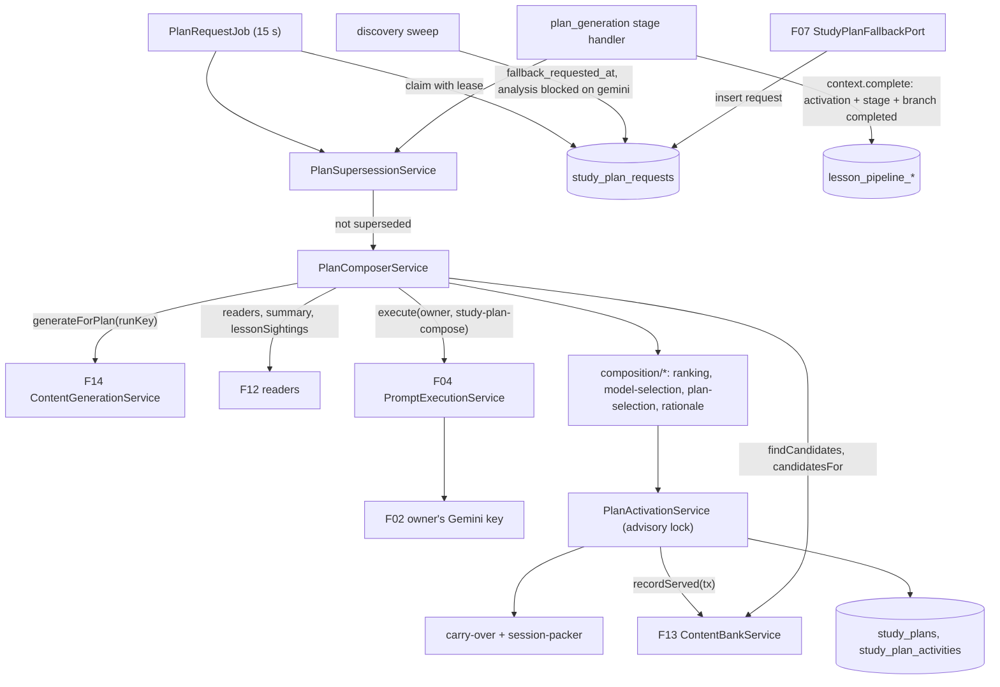
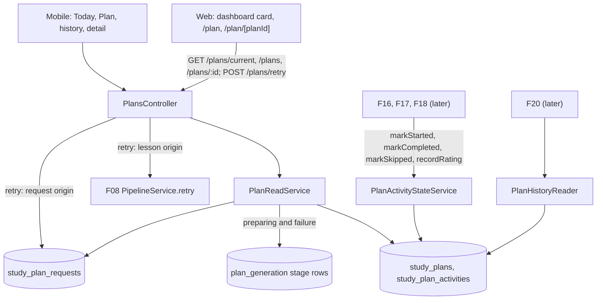
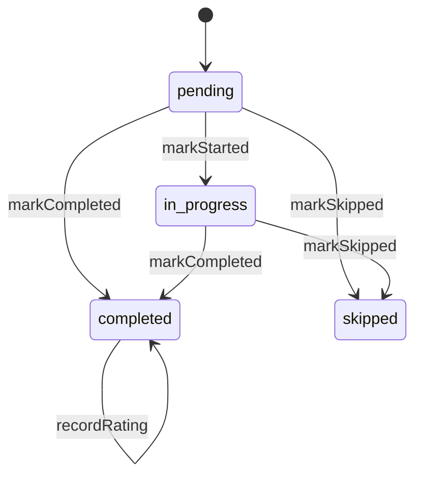

# Technical Specification: Study Plan Generation

## 1. Technical Overview

**What:** A per-participant plan composer and the screens that show its output. After each lesson, the composer builds a plan of 7 daily sessions of 2–4 activities, targeting 15–20 minutes per session. It runs in three places:
- the `plan_generation` pipeline stage, where every profiled branch already waits;
- a request job for a participant whose recording failed (F07's `StudyPlanFallbackPort`);
- the same job for a participant whose analysis is blocked on a missing Gemini key.

Composition takes five steps:
1. Call F14's `generateForPlan` once per plan.
2. Pick a candidate pool from F13's bank by metadata only.
3. Ask `study-plan-compose` v2, on the owner's own Gemini key, for an ordered selection with a one-sentence rationale per item.
4. Apply the deterministic guardrails in code: reject unknown ids and duplicates, replace off-target items, enforce the listening and reading minimums, add writing, speaking and pronunciation task slots, and cap review at 30%. When there is no usable key, or the model's output is unusable, the guardrails compose the plan alone.
5. Carry over up to 5 unfinished activities, pack everything into sessions, and activate the plan, all in one transaction serialized per user, which also archives the previous plan and records servings.

Activities then move through `pending → in_progress → completed | skipped` through an internal state contract that F16, F17 and F18 will call. Plans are read through four routes: the current plan with its `Preparing your plan…` and failure states, the history, one plan, and a retry. On the web they appear on a `Today's session` card on the dashboard and on a new `/plan` page. On mobile they fill the `Today` and `Plan` tabs that F03 left as placeholders.

**Why:** The plan is where the diagnosis becomes something to do. Three properties carry the weight:

- **The model proposes, code guarantees.** An LLM asked for "a C1 study plan" invents ids, repeats items, skips a skill and cannot add up minutes. So the model chooses and justifies from metadata it is given. Every structural promise (existing items only, quotas, session shape, the time estimates, the review cap, targeting of unmastered tags) is enforced in pure, tested code. The same code produces a whole plan with no model at all.
- **The loop never stalls.** A missing key, a quota error, invalid output, a failed recording or a blocked analysis all still end in a plan, each with a note that tells the user what it is and what it is not. Only an internal fault fails a build. The previous plan then stays active, and the user gets a retry.
- **Exactly one plan, from the newest lesson.** Several things can race for a user's plan: two lessons processed back to back, a fallback plan followed by a recovered recording, an interim plan followed by a key being saved. Precedence rules and a per-user lock settle every race the same way. An older lesson's plan is skipped before it spends the user's quota.

**Scope — Included (Core):**
- Plan composition with type quotas (at least 1 listening, 1 reading, 1 speaking or pronunciation and 1 writing activity, or an explicit note naming a missing bank type), 7 daily sessions of 2–4 activities targeting 15–20 minutes, and estimated minutes computed in code from item metadata
- The `study-plan-compose` prompt at version 2: compact summary, due review tags and candidate metadata in; an ordered selection out. Never full item bodies
- Deterministic guardrails over the model's selection, and deterministic composition when there is no usable Gemini key or the model's output is unusable
- Automatic generation once a participant's analysis and profile update complete: the `plan_generation` stage handler, plus the pipeline's terminal branch status
- The failed-recording fallback plan (F07's port), and the interim plan while analysis waits for a Gemini key (interview)
- Exactly one active plan per user, archived plans readable with their statistics, and serialization per user
- Progress per activity, per session and per plan, and the activity state contract F16, F17 and F18 call
- Plan completion history for F20
- Web: the dashboard's `Today's session` card, the `/plan` page and `/plan/[planId]`, and the `Plan` header pill. Mobile: the `Today` and `Plan` tabs, plan history and plan detail

**Scope — Included (Full Scope additions):**
- Carry-over: up to 5 unfinished activities whose target tags are still unmastered move into the new plan, placed in the earliest sessions and marked `Carried over`
- Per-activity rationale: the model's sentence where it passes validation, otherwise a template built from the ledger (`Chosen because third conditional appeared in 4 of your last 5 lessons.`)
- Review quota scheduling from the ledger: tags due for review rank first, and review activities are capped at 30%. While F12 is Core-only, `dueEntries` is empty, so only `error_review` items count as review (A12)

**Scope — Excluded:**
- The activity runners: objective activities (F16), writing (F17), speaking and pronunciation (F18), and skipping an activity with a reason (F16). F15 exposes the state contract they call, and a route registry its `Start session` action reads (A22)
- The dashboard's module-card grid and its section header. F15 builds the `Today's session` card in the `Lições Diárias` card's visual language, standalone (A21)
- Recording the difficulty rating against a generated item's prompt version (F16). F15 stores the rating on the plan activity for completion history
- F20's charts. F15 provides the history contract they read
- Generating writing tasks or read-aloud texts. Task slots carry only a kind and target tags. F17 and F18 write the task when it is opened (interview)
- A curator CLI. The pipeline stage and the request job are the entry points, and F14's `content:generate` already covers generation by hand
- Changing F07's rule that a `too_short` lesson requests no plan, or F08's rule that a failed or Azure-blocked transcription gets no fallback (A30)

**Interview decisions:**

| Decision | Choice |
|---|---|
| Scope | Core + Full Scope additions |
| Writing and speaking in a bank that has no such items | Task slots. A plan entry has a `kind` (`writing`, `speaking` = open response, `pronunciation` = read-aloud), target tags and fixed minutes, and no content item. F17 and F18 create the task when the activity is opened. This honours F13's "speaking and writing are F17/F18 tasks, not bank items" and F14's "F18 owns read-aloud texts" |
| Missing Gemini key with a linear pipeline | An interim plan. A sweep finds branches blocked at `lesson_analysis` on a Gemini credential and composes, once per lesson, a deterministic plan from the bank and the existing profile, with the PRD's missing-key note. The full pipeline's plan for the same lesson replaces it once the key is saved |
| The model's role | An ordered selection of bank items with one rationale each. Code validates it, applies quotas, adds the task slots and packs the sessions. Items placed by code get templated rationales |
| Which session `Today` shows | The first unfinished session, at most one per day. A session completed today (device time zone) stays on `Today` with its summary until the day turns. Working ahead happens in the Plan tab |
| Web surfaces | A `Today's session` card on the dashboard, a `/plan` page (days, notes, rationale, history) and a `Plan` pill between Dashboard and Profile |
| `Start session` before the runners exist | A route registry on both clients maps each `kind` to its runner route. It ships empty, and without a route for the activity the action is not rendered. F16, F17 and F18 register their routes |
| Default mix | 2 writing (15 min each), 2 pronunciation read-alouds (4 min) and 1 open-response speaking (5 min), or 3 speaking when no `phoneme:` tag is unmastered. Listening takes duration × 2 plus 3 min, reading takes words ÷ 180 plus 3 min, and grammar, vocabulary and error review take 6 min. About 3 activities per session |
| An older lesson than one that has, or will have, a plan | Skipped before spending anything. The stage or request completes as superseded, with no F14 run and no model call. Only a true race, where both passed the check, produces the PRD's "created and immediately archived" plan |

**Assumptions and decisions not answered by the PRD:**

| # | Assumption | Rationale |
|---|---|---|
| A1 | **Three origins, one precedence.** A plan has an origin: `lesson` (the full pipeline), `recording_failed` (F07's fallback) or `analysis_blocked` (the interim plan). Precedence is the tuple (lesson `started_at`, falling back to `opened_at`; origin rank), where `lesson` ranks 2 and the other two rank 1. A plan activates only when it outranks the active one | "Only the newest completed lesson produces the active plan", and "the plan produced by the full pipeline replaces the fallback" for the same lesson. One ordering covers both rules |
| A2 | **Supersession before spending (interview).** A build is superseded, and completes with no plan, no F14 run and no model call, when either: (a) the user already has a plan (active or archived) whose precedence is at least the build's; or (b) a newer lesson of this user has, or is certain to get, its own plan: its `lesson_analysis` completed, or a non-failed plan request exists for it. At activation, a plan that no longer outranks the active one is inserted `archived` with no carry-over and no servings (the PRD's "created and immediately archived") | Keeps a backfill of every branch waiting at `plan_generation` since F12, and a burst of lessons, from paying for plans nobody will see. It departs from the PRD's wording for the non-racing case and is recorded here for that reason |
| A3 | **Triggers.** `lesson` plans are built inside the `plan_generation` stage handler. `recording_failed` and `analysis_blocked` plans are built by `PlanRequestJob` from `study_plan_requests` rows. F07's port inserts the fallback request directly, and a 15 s discovery sweep also inserts requests for branches with `fallback_requested_at` and none, and for branches blocked at `lesson_analysis` whose stage row has `blocked_provider = 'gemini'` | The pipeline's stage is the right home for the pipeline path: retries, progress and F19's stepper come with it. A branch that failed at `recording`, or waits at `lesson_analysis`, cannot take a later stage row without breaking the pointer invariant. The sweep drains requests recorded before F15 shipped, as F07's spec asks |
| A4 | **The stage never blocks.** `plan_generation` has `provider: null`. Retry policy: 3 attempts, 60 s and 300 s apart. It commits its plan inside `context.complete`, so an active plan and a completed stage always go together. With no next stage, `complete` moves the branch pointer to the new terminal status `completed` | A missing key produces a deterministic plan instead of a blocked stage (PRD). Only an unclassified fault reaches the runner, which fails it as `internal_error` after the retries. The terminal status is the one F08, F11, F12 and F19 left open for the last stage |
| A5 | **F14 is called once per plan,** with `runKey` set to `lesson:<lessonId>` or `fallback:<lessonId>`, `maxItems` 12, and `onProgress` wired to the stage's `reportProgress` (or to the request row's progress). It is skipped when the Gemini key is unusable at the start (F14's own usability check), for `analysis_blocked` plans, and in general mode (no unmastered tags, where F14 would plan zero slots anyway) | F14's downstream notes. A retried stage resumes F14's run and never pays twice. Skipping it without a key avoids a run whose only output would be curated fallbacks that F15 ranks itself |
| A6 | **One model call per plan.** It is skipped without a usable key and in general mode (there are no weaknesses to reason about). Errors are classified with F14's `classifyGenerationError`: `CRED002`/`CRED003` → `gemini_key_missing`; an authentication failure → `gemini_key_rejected`; quota → `gemini_quota_exhausted`; anything else from the call (schema failure twice, timeout, 5xx, empty response) → `model_call_failed`. Every one of these composes deterministically | "At most … 1 plan-composition call per plan", and "a plan is always produced" |
| A7 | **The offer list is metadata only.** Eligible candidates are items at a CEFR level in `candidates.cefr_levels` whose `target_tags` intersect the user's unmastered tags. In general mode, level alone decides. The offer holds every item F14 produced for this run (`generated` or `fallback`, flagged `new for this plan`), then the best-ranked eligible items per type (6 listening, reading, vocabulary and grammar; 4 error review), up to 40 in all. Each candidate is shown to the model under a short alias (`c01`…`c40`) with type, level, topic, skills, target tags and estimated minutes. Never a title, body, question or source | The PRD lists the metadata and forbids bodies. Aliases cut invented ids to typos of a 3-character token and halve the tokens a list of UUIDs costs. An unknown alias is the same "id that does not exist" and is rejected the same way |
| A8 | **Validating the model's output.** Walk `selections` in order. A ref not in the offer is rejected as `unknown`, a repeat as `duplicate`, and an ineligible item as `off_target` (unreachable for offered items, kept as defence). Entries beyond `model.selections.max` are ignored. If more than half of the returned entries are rejected, the whole output is discarded and the plan is composed deterministically with reason `model_output_invalid`. Counts per reason are stored on the plan (`model_selection_stats`) and logged at `warn` with the prompt id and version | The PRD's rule and "the event logged against the prompt version" |
| A9 | **Task slots (interview).** Writing targets 1–2 unmastered tags from the grammar, vocabulary or discourse families. Pronunciation targets 1–3 unmastered `phoneme:` tags. Speaking targets 1–2 unmastered analysis-family tags, preferring discourse, then vocabulary. The two writing tasks take distinct tags. With no unmastered `phoneme:` tag, the two pronunciation slots become speaking. In general mode, task slots carry no tags | The families the PRD assigns to each skill: F17 targets "weak structures", and F18's read-aloud is "chosen to contain the user's failing phonemes" |
| A10 | **Estimated minutes** come from `rules/study-plan.yaml`: listening = ⌈duration × 2 ÷ 60⌉ + 3; reading = ⌈words ÷ 180⌉ + 3; vocabulary, grammar and error review = 6; writing = 15; speaking = 5; pronunciation = 4. A missing duration or word count uses 9 or 7. The 3 minutes of questions and the 2 listening passes are this spec's additions | The PRD fixes the sources (duration, 180 words per minute, fixed values) but a listening or reading item also has 5 questions to answer. Leaving them out would pack sessions far past 20 minutes of real work |
| A11 | **Packing** (pure, deterministic). Carry-over goes into the earliest session that fits. Task slots go on their configured days (writing 2 and 5, pronunciation 1 and 4, speaking 6; speaking 1, 4 and 6 when it replaces pronunciation), or the nearest day that fits. The quota-pinned listening and reading items go into the emptiest session that fits. Ranked bank items then go into the session that fits with no activity of the same kind, then the fewest minutes, then the lowest day, until every session reaches 15 minutes or the list runs out. "Fits" means fewer than 4 activities and at most 20 minutes after adding. A session still below 2 activities takes the next bank item that fits at up to 4 activities regardless of minutes, then a filler task (speaking and pronunciation alternating). Within a session, activities are ordered carry-over first, then listening, reading, grammar, vocabulary, error review, pronunciation, speaking and writing | "7 sessions of 2 to 4 activities targeting 15–20 minutes" holds whenever the pool allows. A tiny bank still yields 7 sessions of 2, because task slots never run out. Receptive work comes before productive work within a session |
| A12 | **Review** means an `error_review` item, or an activity whose primary tag is due in the ledger. Due tags rank first (tier 0), which is the Full scope's "scheduling from the ledger". After packing, while review activities exceed ⌊30% × total⌋, the lowest-priority review item that is not carried over is removed and replaced by the next non-review item that fits. Carried-over review items are removed last | The PRD's cap is a share of the final plan, which only the packer knows. In Core F12 no tag is due, so review is exactly the `error_review` items F14 generated from recurring weaknesses |
| A13 | **Carry-over** happens at activation, under the lock. It takes the replaced active plan's `pending` and `in_progress` activities whose target tags intersect the user's current unmastered tags, `in_progress` first, then by day and position, up to 5. Each becomes a new row in the new plan, with `carried_from_activity_id`, the same kind, item, tags and estimate, the state `pending` or `in_progress` (with its `started_at`), and the rationale `Carried over from your previous plan: <label> is still unmastered.`. A composed item that duplicates a carried item is dropped. Carried items are referenced directly, never through `findCandidates` | F13's downstream note. The archived plan keeps its own rows untouched, so its statistics stay readable. The link lets F16 resume an attempt started in the previous plan |
| A14 | **Rationale.** The model's sentence is kept when it is one line of 12–200 characters. Otherwise, and for every activity code placed, a template is used, keyed on the activity's primary tag (its highest-ranked unmastered tag) and that tag's source. The lesson counts come from a new additive F12 reader method, `ErrorLedgerReader.lessonSightings(userId, tags, lastLessons = 5)`. Templates are listed in section 5 | The PRD's example sentence needs "N of your last M lessons", which the ledger's occurrences already record per lesson. The model receives the same counts, so its sentences and the templates agree |
| A15 | **Notes** are `{ code, text }`, built on the server, in this order: `recording_failed`, `gemini_key_missing` / `gemini_quota_exhausted`, `general_material`, then one `missing_<type>` per unmet bank quota. F15's missing-key text replaces F14's `gemini_key_missing` note, and F14's quota note is kept when only generation ran out | The PRD gives the failed-recording and missing-key texts, and the failed-recording note "opens" the plan. Server-built text keeps both clients identical, as F12's notes do |
| A16 | **`Today` is picked on the client**, by a pure function mirrored in TypeScript and Dart. Its rules, in order: (1) the earliest session in progress (some activities done or started, not all); (2) the latest session completed on the device's local today; (3) the first session with every activity `pending`; (4) none, when the whole plan is done ("Plan complete") | The interview's rule. The server does not know the device's day, and a server component on the web does not either, so the choice lives where the time zone is |
| A17 | **Progress definitions.** An activity is done when it is `completed` or `skipped`. A session is `not_started` when all its activities are `pending`, `completed` when all are done (its `completedAt` is the latest done time), and `in_progress` otherwise. The plan's completion percentage is ⌊100 × completed ÷ total⌋, so a skip counts toward the session and not toward completion | "How much of my plan I have completed" is about completion. A skipped activity should still let a session end |
| A18 | **The state contract is internal.** F16–F18 call `PlanActivityStateService` inside their own transactions. A call made with an activity id that was carried over resolves forward to the newest carried copy. A state change on an activity whose plan is archived (and not carried forward) raises `PLAN004`. Ratings can be recorded on any completed activity. Completion is idempotent per `completionKey` (the attempt id) | F16's submission, F17's correction and F18's scoring each own their transaction, and F12's `ingestActivityOutcome` sets the precedent. Forward resolution lets a runner that opened an old id finish on the plan the user now has |
| A19 | **One active plan** is enforced twice: a partial unique index on `(user_id) WHERE status = 'active'`, and a transaction-scoped advisory lock per user around activation. The lock key is `hashtextextended('study-plan:' || user_id, 0)` | The PRD's "exactly one" and "serialized per user". Only activation needs the lock. F14's run and the model call are idempotent or bounded, and A2 keeps their cost down |
| A20 | **Servings** are recorded with `recordServed(userId, bankItemIds, tx)` for every bank item of an activated plan, carried items included, inside the activation transaction. A plan archived on arrival records none | F13's downstream note. Re-serving a carried item only refreshes its last-served date |
| A21 | **Web surfaces (interview).** `TodaySessionCard` sits under `ClassroomHero` and replaces the dashboard's placeholder heading and paragraph. It borrows the `Lições Diárias` card's composition (icon tile, title, description, action link), and its row in `design/README.md` flips to `implemented`. The module-grid section header stays `deferred`: a grid of one card is the approximation F05 already declined | Design fidelity without building regions owned by other features |
| A22 | **The `Start session` seam (interview).** `apps/web/src/lib/activity-routes.ts` and `apps/mobile/lib/features/plan/activity_routes.dart` map a `kind` to a route builder and ship empty. `Start session`, and a card's open link, render only when the target activity's kind has a route | Nothing disabled promising a runner that does not exist. The first feature with a runner turns the action on by registering its route |
| A23 | **Error codes:** `PLAN001` (404, plan not found or not the caller's), `PLAN002` (409, nothing to retry), `PLAN003` (404, activity not found or not the caller's) and `PLAN004` (409, activity no longer in the current plan). F15's routes surface `PLAN001` and `PLAN002`. The other two belong to the state contract, and F16's routes will surface them | One code per failure mode (root `AGENTS.md`). Defining them with the contract keeps F16 from inventing its own |
| A24 | **Tables are plural** (`study_plans`, `study_plan_activities`, `study_plan_requests`), with `ck_`/`ux_`/`ix_` names | The schema's majority convention (F12, F14) |
| A25 | **Rules file.** `apps/api/rules/study-plan.yaml` is versioned, and its fingerprint is pinned per version by a unit test. It is loaded at boot by `PlanRulesService`, which refuses to start on an invalid file, like `GenerationRulesService`. Every plan stores the version and fingerprint | Every number the interview settled can be tuned without code and stays traceable per plan |
| A26 | **Additive changes to finished features**, each recorded as a dated note in that feature's `progress.md`: F12 gains `ErrorLedgerReader.lessonSightings`; F13 gains `ContentBankService.candidatesFor(ids)` (metadata for known ids, with no served exclusion); F07's `StudyPlanFallbackPort.requestFallbackPlan` becomes async and inserts the request, and the finalizer awaits it; F08's `PipelineStateService.complete` moves the pointer to `completed` at the end of the order | Each is a new method or a widened behaviour at a seam that feature built for exactly this |
| A27 | **"General C1-range material"** means `cefr_levels: [C1, C2, B2]`, in that order of preference. General mode applies when the user has no unmastered tag (a first lesson whose recording failed). The unmastered-tag guardrail is skipped in that mode, and the plan carries `general_material` | The PRD: "the unmastered-tag guardrail has nothing to check against" |
| A28 | **`PlanRequestJob`**: an `@Interval` every 15 s, and `run(now)` is callable in tests. It claims up to 2 requests per tick, never two running for one user, with a 15-minute lease. Up to 3 attempts, 60 s and 300 s apart. Then `failed` with the reason `We could not build a new plan.` The owner's retry resets it to `pending` | `ProfileReconciliationJob`'s idiom, with F14's lease rule. The lease is above a worst-case F14 run |
| A29 | **No new environment variable, no new dependency** | Every number is in the rules file. Everything used is already in the stack |
| A30 | **The interim plan covers a Gemini-blocked analysis only.** An Azure-blocked transcription or pronunciation stage gets no interim plan | The interview answer was about analysis, and the PRD's clause names the Gemini key. F08 decided a blocked or failed transcription is recovered by a key or a retry |

**Traceability (PRD block → spec section):**

| PRD block | Where it lands |
|---|---|
| Consumes (F02 Gemini key) | A5, A6, §5 composer inputs, the BYOK integration tests |
| Consumes (F04 prompt execution) | §5 `study-plan-compose` v2, A6, A8, the prompt stamp on `study_plans` |
| Consumes (F07 recording outcome) | A3, §4 port change, `plan-fallback.spec.ts` |
| Consumes (F12 snapshot, summary, due records) | A7, A12, A14, §5 prompt variables |
| Consumes (F13 candidate metadata) | A7, A20, A26 |
| Consumes (F14 generated items) | A5, A7, §5 composer |
| Consumes (F21 tokens, primitives, page states) | §4 web and mobile components |
| Provides (plan, sessions, activity entries, rationale, state contract → F16–F18) | §5 routes and `PlanActivityStateService`, downstream notes |
| Provides (completion history → F20) | §5 `PlanHistoryReader`, `GET /plans` |
| Core Scope | §1 Included (Core), §5, §6 |
| Full Scope additions | A12, A13, A14 |
| Capabilities | §5 composition, rules file, algorithm |
| Experience | §4 web and mobile, A16, A21, A22 |
| Error Handling | §4 failure modes, A2, A6, A8 |
| F15 acceptance criteria | §7 acceptance table |
| Cross-feature integration criteria (F07→F15, F04, F02, F12→F15, F13/F14→F15, F15→F16, F15→F20, F21) | §7 cross-feature table |

## 2. Architecture Impact

**Affected components:**

| Area | Path |
|---|---|
| API — plans domain | `apps/api/src/plans/**` |
| API — plan triggers | `apps/api/src/plan-generation/**` |
| API — pipeline (terminal status) | `apps/api/src/pipeline/pipeline-state.service.ts`, `pipeline.constants.ts` |
| API — seams in finished features | `apps/api/src/recording/study-plan-fallback.port.ts`, `recording-finalizer.service.ts`, `apps/api/src/profile/error-ledger.reader.ts`, `apps/api/src/content/content-bank.service.ts` |
| API — boot, wiring, errors, OpenAPI | `apps/api/src/boot/verify-plan-prompt.ts`, `main.ts`, `app.module.ts`, `common/app-error.ts`, `openapi/components.ts`, `openapi/setup.ts` |
| Prompt and rules | `apps/api/prompts/study-plan-compose.yaml` (version 2), `apps/api/rules/study-plan.yaml` |
| Database | `apps/api/prisma/schema.prisma`, `apps/api/prisma/migrations/0015_study_plans/migration.sql` |
| Shared contracts | `packages/shared/src/schemas/plan.ts`, `schemas/pipeline.ts`, `errors/codes.ts`, `index.ts` |
| Web | `apps/web/src/app/(app)/plan/**`, `app/(app)/dashboard/page.tsx`, `components/plan/**`, `components/dashboard/today-session-card.tsx`, `components/app-header.tsx`, `components/ui/icons/**`, `lib/plans*.ts`, `lib/plan-today.ts`, `lib/activity-routes.ts` |
| Mobile | `apps/mobile/lib/features/plan/**`, `features/today/**`, `features/shell/shell_module.dart`, `features/lessons/models/pipeline_models.dart`, the API error-message table |
| Docs | `design/README.md`, `docs/api/openapi.json`, dated notes in the progress files of F07, F08, F12, F13, F14 and F19 |

**Building a plan:**



**Reading and updating a plan:**



**Activity state:**



## 3. Technical Decisions

| Decision | Chosen Approach | Alternative Considered | Trade-off |
|---|---|---|---|
| Division of labour with the model | The model returns a priority-ordered selection with rationales. Pure code enforces every structural rule and packs the sessions | The model returns 7 sessions and code repairs them (prompt v1's shape) | The model no longer chooses which day an item lands on. In exchange there is no arithmetic in the model, one packer serves both the model and the deterministic path, and "session time estimates are recomputed" means estimates are simply never taken from the model |
| Writing and speaking | Task slots with no content item, filled by F17/F18 at open time | New bank types, or F15 generating the tasks | F17 and F18 each need their own task generation when they are built. In exchange two finished features keep their contracts, and the plan stays one composition call |
| Where each origin runs | `lesson` in the pipeline stage. `recording_failed` and `analysis_blocked` in a request table polled by a job | One request table for all three, or a plan stage row on branches that never reached it | Two mechanisms feed one composer, and the read side derives "preparing" and "failure" from both. In exchange the pipeline path keeps F08's retries, progress and F19's stepper, and no branch pointer ever disagrees with its rows |
| Races for the active plan | Precedence (lesson time, origin rank), a supersession check before spending, and a per-user advisory lock with a partial unique index at activation | A per-user lock held for the whole build, or a queue per user | Two concurrent builds can both call F14 in a true race. Accepted: F14 runs are keyed, and A2 makes the race rare. A lock held for minutes would pin a connection per user and block the pipeline's workers |
| Carry-over | New rows in the new plan, linked to their origin, chosen at activation | Moving the old rows into the new plan | The archived plan keeps its statistics exactly as they were. F16 has to follow the link to resume an attempt, which is written down as its downstream note |
| Candidate references in the prompt | Short aliases mapped back in code | Raw UUIDs | The curator reading prompt telemetry sees aliases, not ids. Accepted, because each plan stores the model's selection stats, and fewer tokens and fewer corrupted ids matter more |
| Today's session | Chosen on the client by a pure function mirrored in both clients | Chosen on the server from a time-zone parameter | Two implementations of one rule, pinned by the same test table. The server never guesses a device's day |

## 4. Component Overview

**API — plans domain (`apps/api/src/plans/`, `PlansModule`; imports `GenerationModule`, `ProfileModule`, `TaxonomyModule` and `PipelineModule`. Prisma, Credentials, Prompts and Content are global):**

| File Path | New/Modified | Purpose | Key Responsibilities |
|---|---|---|---|
| `plans.module.ts` | New | Wiring | Provides everything below. Exports `PlanComposerService`, `PlanActivationService`, `PlanSupersessionService`, `PlanActivityStateService` and `PlanHistoryReader` |
| `plan.constants.ts` | New | Fixed values | `STUDY_PLAN_RULES_PATH`, `PLAN_GENERATION_RETRY_POLICY` (`{ attempts: 3, delaysMs: [60_000, 300_000] }`), `PLAN_REQUEST_*` (interval 15 s, batch 2, lease 15 min, attempts 3, delays), `PLAN_LOCK_NAMESPACE`, `ORIGIN_RANK`, the note codes and texts (§5), the rationale templates (§5), the failure messages |
| `plan-rules.ts` | New | Rules file | Strict Zod schema of `study-plan.yaml`, cross-field checks (min ≤ max, task days within 1..`sessions.count`, the task counts match their day lists, a share in 0–1, CEFR levels unique), camelCase mapping, `rulesFingerprint`, `loadPlanRulesFile` throwing `PlanRulesValidationError` with every issue. Follows `generation/rules/generation-rules.ts` |
| `plan-rules.service.ts` | New | Rules in force | `OnModuleInit` load, `current()`. An invalid file stops the boot, and the log line names the version and fingerprint |
| `composition/estimates.ts` | New | Pure | `estimateMinutes(kind, { durationSeconds, wordCount }, rules)` (A10) |
| `composition/tag-priority.ts` | New | Pure | Ranks the user's unmastered tags into tiers (due, recurring, other) across every non-retired family, `phoneme:` included, following F14's A8 order. Returns `{ tag, family, source, rank, sightings }` |
| `composition/candidate-ranking.ts` | New | Pure | `isEligible(candidate, ctx)` (A7, A27), `rankCandidates(candidates, ctx)` → ordered by the §5 key, `buildOffer(pool, generationItemIds, ctx, rules)` → aliased offer entries |
| `composition/model-selection.ts` | New | Pure | `validateSelection(output, offer, rules)` → accepted entries with the rationale kept or dropped, rejected counts per reason, and `discard: boolean` (A8) |
| `composition/plan-selection.ts` | New | Pure | `selectPlan(inputs, validated \| null, rules)` → a `ComposedSelection`: pinned quota items, the ranked bank list (the model's accepted order first, then the deterministic interleave), task slots with their tags (A9), review flags (A12), notes (A15) and focus tags |
| `composition/carry-over.ts` | New | Pure | `selectCarryOver(previousActivities, unmastered, rules)` (A13) |
| `composition/session-packer.ts` | New | Pure | `packSessions(carryOver, selection, rules)` → 7 sessions with positions and minutes, then the review cap pass (A11, A12). Deterministic for the same input |
| `composition/rationale.ts` | New | Pure | `templateRationale(activity, ctx)` and `acceptModelRationale(text, rules)` (A14, §5 templates) |
| `composition/summary-line.ts` | New | Pure | `focusTagsOf(activities, priority)` (up to 3 tags, by activity count then priority) and `summaryLine(sessions, activities, focus, general)` |
| `composition/precedence.ts` | New | Pure | `precedenceOf(lessonTime, origin)`, `compare(a, b)` (A1) |
| `compose-prompt-variables.ts` | New | Prompt input | Renders `profile_summary`, `focus_tags`, `review_tags`, `candidates` and `selection_range` (§5). Only for the user whose key executes the prompt |
| `plan-composer.service.ts` | New | Orchestration | `compose(request)` (§5): gathers the inputs (F12 readers, the compact summary, `lessonSightings`, the Gemini status), runs F14 (A5), builds the pool and offer, calls the prompt (A6), classifies errors, validates (A8) and selects. No writes except through F14 |
| `plan-supersession.service.ts` | New | A2 | `isSuperseded(userId, lessonId, origin, now)` → `null` or a reason (`plan_exists`, `newer_lesson`) |
| `plan-activation.service.ts` | New | The one writer of plans | `activate(tx, userId, composed)` (§5): advisory lock, idempotency on (user, lesson, origin), precedence against the active plan, carry-over, packing, archiving the old plan, inserting the new plan and its activities, `recordServed`. Returns `{ planId, outcome: 'activated' \| 'archived_on_arrival' \| 'existing' }` |
| `plan.repository.ts` | New | Persistence | Plan and activity inserts, the active plan `FOR UPDATE`, archiving, reading a plan with its activities, and the history aggregates |
| `plan-read.service.ts` | New | Route logic | `currentFor(userId, now)` (the plan, `preparing` and `failure`, §5), `historyFor(userId)`, `planFor(userId, planId)`. Maps rows to the shared views: labels, sessions, progress, ratings, summary line and notes. Throws `AppError.studyPlanNotFound` for an unknown or foreign id |
| `plan-retry.service.ts` | New | Retry | `retry(userId, now)`: finds the failed build `currentFor` reports. A `lesson` build goes through `PipelineService.retry(lessonId, userId)`. A request build is reset to `pending`. Nothing failed raises `AppError.planNothingToRetry` |
| `plan-activity-state.service.ts` | New | F16–F18 contract | `resolveForOwner`, `markStarted`, `markCompleted`, `markSkipped` and `recordRating` (§5, A17, A18). Rows are locked `FOR UPDATE`, and every method joins a transaction when one is passed |
| `plan-history.reader.ts` | New | F20 contract | `completionHistoryFor(userId)` and `completedActivities(userId, since)` (§5) |
| `plans.controller.ts` | New | HTTP surface | The four routes in §5 with the OpenAPI decorators, under tag `plans` |

**API — plan triggers (`apps/api/src/plan-generation/`, `PlanGenerationModule`; imports `PipelineModule` and `PlansModule`):**

| File Path | New/Modified | Purpose | Key Responsibilities |
|---|---|---|---|
| `plan-generation.module.ts` | New | Wiring | Provides the handler, the job and the request repository. Registers the handler at module init |
| `plan-generation-stage.handler.ts` | New | The `plan_generation` stage | `provider: null`, `PLAN_GENERATION_RETRY_POLICY`. Checks supersession, then an existing `lesson` plan for the lesson (both complete the stage with no write). Otherwise composes with `runKey: lesson:<lessonId>` and `onProgress` → `context.reportProgress`, then `context.complete(tx => activation.activate(tx, …))`. It logs the outcome, the composition mode and the counts, never a rationale or a tag list |
| `plan-request.repository.ts` | New | Requests | `insertIfAbsent(userId, lessonId, origin)` (`ON CONFLICT DO NOTHING`), `discoverFallbacks(limit)`, `discoverBlockedAnalyses(limit)`, `claim(now, limit)` (one conditional `UPDATE … RETURNING`: pending, due retrying, or running with an expired lease, and no other running request of the same user), `setProgress`, `complete(tx, planId)`, `supersede`, `scheduleRetry`, `fail`, `resetForRetry` |
| `plan-request.job.ts` | New | Fallback and interim builds | `@Interval` every 15 s; `run(now)`: discovery (A3), then up to 2 claimed requests. Each is checked for supersession (and, for `analysis_blocked`, whether the branch is still blocked at `lesson_analysis` on Gemini), composed with `runKey: fallback:<lessonId>` or deterministically, and activated and completed in one transaction. One failure never stops the tick |

**API — changes elsewhere:**

| File Path | New/Modified | Purpose | Key Responsibilities |
|---|---|---|---|
| `apps/api/src/pipeline/pipeline-state.service.ts` | Modified | Terminal status | In `complete`, when `nextStageAfter` returns null, move the pointer to `(stage, 'completed')` in the same transaction. `movePointer`'s status type gains `'completed'` |
| `apps/api/src/pipeline/pipeline.constants.ts` | Modified | Stage order comment | `plan_generation` is the last stage, and `completed` is the terminal branch status. The order itself is unchanged |
| `apps/api/src/recording/study-plan-fallback.port.ts` | Modified | F07's seam, implemented | `requestFallbackPlan(request): Promise<void>` inserts the `recording_failed` request idempotently, and catches and logs its own error (the sweep recovers a missed insert) |
| `apps/api/src/recording/recording-finalizer.service.ts` | Modified | Await the seam | `await this.fallbackPort.requestFallbackPlan(…)` before `markBranchFallbackRequested` |
| `apps/api/src/profile/error-ledger.reader.ts` | Modified (additive) | Rationale evidence | `lessonSightings(userId, tags, lastLessons = 5)` → `Map<tag, { lessons, of, inLatest }>` over the user's most recent lessons with an applied `lesson_analysis` source, from `error_ledger_occurrences.lesson_id` |
| `apps/api/src/content/content-bank.service.ts` | Modified (additive) | Known ids | `candidatesFor(ids)` → `ContentItemCandidate[]` for the ids that exist, with no served exclusion and no bodies |
| `apps/api/src/boot/verify-plan-prompt.ts` | New | Boot check | The prompt's declared variables must equal the set `compose-prompt-variables.ts` renders, and its schema must carry `selections[].ref` and `selections[].rationale` with 1–2 examples. Otherwise `PlanPromptMismatchError` lists every issue. Mirrors `verify-analysis-prompt.ts` |
| `apps/api/src/main.ts` | Modified | Boot order | Calls `verifyPlanPrompt` after `verifyGenerationPrompts` |
| `apps/api/src/app.module.ts` | Modified | Root | Imports `PlansModule` and `PlanGenerationModule` |
| `apps/api/src/common/app-error.ts` | Modified | Factories | `studyPlanNotFound()`, `planNothingToRetry()`, `planActivityNotFound()`, `planActivityNotInCurrentPlan()` |
| `apps/api/src/openapi/components.ts`, `openapi/setup.ts` | Modified | Document | `CurrentPlanView`, `StudyPlanView` and `PlanHistoryView`, generated from the shared Zod schemas as the other views are, and the `plans` tag |
| `apps/api/prompts/study-plan-compose.yaml` | Modified (version `"2"`) | The prompt | §5 |
| `apps/api/rules/study-plan.yaml` | New | Rules, version `"1"` | §5 |
| `.claude/rules/prompts.md` | Modified | Authoring rule | One bullet: `study-plan-compose` takes candidate aliases and metadata only, and a boot check pins its variables |

**Shared (`packages/shared/src/`):**

| File Path | New/Modified | Purpose | Key Responsibilities |
|---|---|---|---|
| `schemas/plan.ts` | New | Contracts | `planActivityKindSchema`, `planActivityStateSchema`, `studyPlanStatusSchema`, `studyPlanOriginSchema`, `difficultyRatingSchema`, `planNoteSchema`, `planTagSchema`, `planActivityViewSchema`, `planSessionViewSchema`, `planProgressSchema`, `studyPlanViewSchema`, `planPreparingSchema`, `planFailureSchema`, `currentPlanViewSchema`, `planHistoryItemSchema`, `planHistoryViewSchema`, and their types |
| `schemas/pipeline.ts` | Modified | Terminal status | `pipelineBranchStatusSchema` gains `completed` |
| `errors/codes.ts` | Modified | Codes | `PLAN001`–`PLAN004` with status and message (§5) |
| `index.ts` | Modified | Exports | The plan schemas |

**Web (`apps/web/src/`):**

| File Path | New/Modified | Purpose | Key Responsibilities |
|---|---|---|---|
| `app/(app)/plan/page.tsx` | New | Route | Server component. Reads `getCurrentPlan()` and `getPlanHistory()` and renders `PlanScreen`. Metadata title `Plan · English Quest` |
| `app/(app)/plan/[planId]/page.tsx` | New | Route | Reads `getPlan(planId)` and renders `PlanDetailScreen` (read-only). The active plan's id redirects to `/plan`. `PLAN001` renders the not-found error state |
| `app/(app)/plan/loading.tsx`, `error.tsx` | New | Page states | Skeleton shaped like the day list, and the error state with retry, as `lessons/` does |
| `app/(app)/dashboard/page.tsx` | Modified | Dashboard | Adds `getCurrentPlan()` and renders `TodaySessionCard` under `ClassroomHero`. Removes the placeholder `Dashboard` heading and paragraph |
| `components/dashboard/today-session-card.tsx` | New | Dashboard card | The `Lições Diárias` card's composition: book icon tile, `Today's session`, a one-line description, and the action link. States: preparing (with progress), failure (with `Retry`), no plan (empty: `Your study plan appears after your first lesson.` with `Open classroom`), the session's rows (icon, title, minutes, state badge), `Start session` when routable, `See the full plan`, completed today (the summary plus `Work ahead in Plan`), and plan complete. Polls with `AutoRefresh` while preparing |
| `components/plan/plan-screen.tsx` | New | `/plan` | Status banner, summary (summary line, completion `Meter`, `Carried over` count), notes, 7 `PlanDay`s, and the previous-plans list. Empty and error states |
| `components/plan/plan-detail-screen.tsx` | New | `/plan/[planId]` | The same summary and days, read-only, headed by origin, date and `Archived {relative}` |
| `components/plan/plan-day.tsx` | New | One day | A disclosure button (`aria-expanded`) reading `Day 3 · 17 min · 2 of 3 done`, and the activity list. `Today`'s day is expanded by default |
| `components/plan/plan-activity-card.tsx` | New | One activity | Kind icon, title, `N min`, `ActivityStateBadge`, a `Carried over` chip, a `Review` chip, and a `Why this activity?` disclosure revealing the rationale and the target tags as chips. The title links to `activityHref(activity)` when it is non-null |
| `components/plan/activity-kind-icon.tsx` | New | Icon map | Kind → icon, with the kind's name as its accessible label |
| `components/plan/activity-state-badge.tsx` | New | Badge map | `pending` → neutral `Pending`, `in_progress` → info `In progress`, `completed` → success `Completed`, `skipped` → warning `Skipped` |
| `components/plan/plan-status-banner.tsx` | New | Preparing and failure | `Preparing your plan…` with `4 of 12` when progress exists, and the failure message with a `Retry` button (`POST /plans/retry`, then `router.refresh()`) |
| `components/plan/plan-notes.tsx` | New | Notes | One line per note, the failed-recording note first |
| `components/plan/session-summary.tsx` | New | Session summary | `3 activities completed · 8 of 10 correct · 18 min` (each part omitted when null), plus the plan completion percentage |
| `components/plan/plan-history-list.tsx` | New | History | Rows with the lesson date, origin, `12 of 19 completed · 63%` and the rating counts, linking to `/plan/{id}`. The active plan is marked `Current` |
| `components/ui/icons/pencil-icon.tsx`, `text-icon.tsx`, `puzzle-icon.tsx` | New | Icons | Writing, vocabulary and grammar, in the existing `IconProps` style. Exported from `icons/index.ts` and shown in the design-system gallery |
| `components/app-header.tsx` | Modified | Navigation | Adds `{ href: '/plan', label: 'Plan', matchPrefix: true }` after Dashboard: Dashboard, Plan, Profile, Lessons, Settings, the mobile tab order |
| `lib/plans-server.ts` | New | Server reads | `getCurrentPlan()`, `getPlanHistory()` and `getPlan(id)` over the internal URL with `cache: 'no-store'`, as `lessons-server.ts` does |
| `lib/plans.ts` | New | Browser calls | `retryPlan()` |
| `lib/plan-today.ts` | New | A16 | `selectTodaySession(plan, now)` → `{ session, mode: 'in_progress' \| 'completed_today' \| 'next' \| 'plan_complete' }`, using local dates |
| `lib/activity-routes.ts` | New | A22 | `ACTIVITY_ROUTES: Partial<Record<PlanActivityKind, (activity) => string>>` (empty), and `activityHref(activity)` |

**Mobile (`apps/mobile/lib/`):**

| File Path | New/Modified | Purpose | Key Responsibilities |
|---|---|---|---|
| `features/plan/plan_models.dart` | New | Models | Hand-written mirrors of every schema in `schemas/plan.ts`, with tolerant enum parsing as in `lessons/models` |
| `features/plan/plans_api.dart` | New | API | `current()`, `history()`, `plan(id)`, `retry()` on the shared `Dio` |
| `features/plan/current_plan_controller.dart` | New | State | One lazily bound controller shared by Today and Plan: loading, error and ready states, a 10 s poll only while `preparing` is set, pull-to-refresh and retry |
| `features/plan/plan_today.dart` | New | A16 | `selectTodaySession`, the same rules and test table as the web |
| `features/plan/activity_routes.dart` | New | A22 | The empty kind → route map, and `activityRouteFor(activity)` |
| `features/plan/plan_page.dart` | Modified (replaces the placeholder) | Plan tab | Status banner, summary, notes, 7 expandable days, activity cards, and a `Previous plans` entry |
| `features/plan/plan_history_page.dart`, `plan_history_controller.dart` | New | History | `GET /plans` rows, opening the detail |
| `features/plan/plan_detail_page.dart`, `plan_detail_controller.dart` | New | Detail | A read-only plan |
| `features/plan/widgets/plan_activity_card.dart`, `activity_kind_icon.dart`, `activity_state_badge.dart`, `plan_status_banner.dart`, `plan_day_tile.dart`, `session_summary.dart`, `plan_notes.dart` | New | Widgets | Mirror the web components on `EqCard`, `EqBadge`, `EqChip`, `EqMeter`, `EqButton` and `EqPageState` |
| `features/today/today_page.dart` | Modified (replaces the placeholder) | Today tab | The mobile counterpart of `TodaySessionCard` (A16 states, `Start session` when routable, `See the full plan` switching to the Plan tab) |
| `features/shell/shell_module.dart` | Modified | Routes and binds | Binds `PlansApi` and the controllers lazily. Adds `/app/plan/history` and `/app/plan/:planId` |
| `features/shell/placeholder_destination_page.dart` | Deleted if unused | Cleanup | Today and Plan were its last users |
| `features/lessons/models/pipeline_models.dart` | Modified | Mirror | The branch status gains `completed` |

`ApiException` already carries the server's message and code, so no mapping table changes. The controllers switch on codes as `lesson_detail_controller.dart` does with `PIPE001`: `PLAN002` on retry refreshes quietly, because the failure was already retried elsewhere, and `PLAN001` renders the detail page's not-found state.

**Docs:**

| File Path | New/Modified | Purpose | Key Responsibilities |
|---|---|---|---|
| `design/README.md` | Modified | Design reference | Pill-navigation row: adds Plan. `Module card — Lições Diárias` → `implemented` as `TodaySessionCard`, standalone. The section-header row stays `deferred`, with a note that the grid waits for a second module |
| `docs/F07-lesson-recording/progress.md`, `docs/F08-speech-to-text-transcription/progress.md`, `docs/F12-learning-profile-and-error-ledger/progress.md`, `docs/F13-content-bank-and-curated-import/progress.md`, `docs/F14-ai-content-generation-with-difficulty-gate/progress.md`, `docs/F19-lesson-history-and-individual-results/progress.md` | Modified | Dated follow-up notes | F07: the port is implemented and awaited. F08: `complete` sets the terminal status. F12: `lessonSightings`, and the branch's terminal status. F13: `candidatesFor`, and `recordServed` is called. F14: the consumer is wired. F19: `completed` branches read `Ready`, and the stepper's last step now runs |
| `docs/api/openapi.json` | Regenerated | Snapshot | The four routes and three components |

**Database:**

| Migration File | Tables Affected | Operation | Notes |
|---|---|---|---|
| `apps/api/prisma/migrations/0015_study_plans/migration.sql` | `study_plans`, `study_plan_activities`, `study_plan_requests` | CREATE | `main` holds `0001`–`0014`. Take the next free number if another feature lands first |
| same | `lesson_pipeline_branches` | ALTER | Widens `ck_branches_status` (last defined in `0008`) with `completed` |

**Failure modes:**

| Scenario | Behaviour | Surfaced as |
|---|---|---|
| No usable Gemini key at the start | No F14 run and no model call. Deterministic plan, quotas filled from the bank ranked by tag match | Note `Built from existing material because your Gemini key is missing.`; `deterministic_reason: gemini_key_missing` |
| Key rejected by F14 or by the compose call | The vault marks it invalid. F14 keeps its items. Deterministic composition | The same note; `gemini_key_rejected` |
| Quota exhausted | F14 keeps what it generated. If the compose call fails too, the plan is deterministic | `Built from existing material because your Gemini quota ran out.`; or F14's quota note when only generation ran out |
| Compose call fails otherwise (schema twice, timeout, 5xx) | Deterministic composition | `model_call_failed`, logged with the prompt version; no user note |
| More than half of the model's selections invalid | Output discarded, deterministic composition | `model_output_invalid`, `model_selection_stats`, `warn` log with the prompt version |
| Some model selections invalid | Rejected and replaced from the bank | `model_selection_stats` |
| No eligible listening or reading item | Plan produced without that type | `No listening activity this week: the content bank has no unseen items at your level.` (and the reading equivalent) |
| Tiny bank | 7 sessions of 2 still, via filler task slots | Normal plan |
| First lesson with no profile, recording failed | General mode: C1-range material, no tag guardrail | Notes `recording_failed` and `general_material` |
| Lesson only too short | No branch, no request, no plan (F07) | Nothing |
| An older lesson reaches composition | Superseded before spending (A2) | Stage completed or request `superseded`; no plan |
| True race at activation | The older plan is inserted `archived` | Visible in history with 0 completed |
| Unclassified fault in the stage | Runner retries (60 s, 300 s), then `failed` / `internal_error`. The previous plan stays active | `failure` on `GET /plans/current`: `We could not build a new plan. Your previous plan is still available.` with `Retry` |
| Unclassified fault in a request | Retries, then `failed`. The previous plan stays active | The same `failure`, and the retry resets the request |
| State change on an activity whose plan was replaced | Follows carry-over forward; otherwise rejected | `PLAN004` (for F16–F18's routes) |
| The rules file is invalid, or the compose prompt drifts from the composer | The API refuses to start | `Invalid study plan rules:` / `Study plan prompt and composer disagree:` plus every issue |

## 5. API Contracts

All routes require a session (`SessionGuard`) and carry the cookie and bearer security schemes. Each returns only the caller's own data. Success bodies are `{ data: … }`.

### Endpoint: Read the caller's current plan

- **Method:** GET
- **Path:** `/plans/current`
- **Authentication:** session cookie or bearer token

**Request:** no parameters.

**Response (Success - 200): `CurrentPlanView`**

| Field | Type | Description |
|---|---|---|
| `data.serverTime` | `datetime` | The server's clock |
| `data.plan` | `StudyPlanView \| null` | The active plan, or null when the caller has none |
| `data.preparing` | `object \| null` | A build that will replace (or create) the active plan is in progress |
| `data.preparing.lessonId` | `uuid` | |
| `data.preparing.origin` | `'lesson' \| 'recording_failed' \| 'analysis_blocked'` | |
| `data.preparing.since` | `datetime` | When the build became visible: analysis completed, or the request was created |
| `data.preparing.progress` | `{ done, total } \| null` | F14's settled slots over planned slots, while generation runs |
| `data.failure` | `object \| null` | The newest build that outranks the active plan failed. Null while `preparing` is set |
| `data.failure.lessonId`, `.origin`, `.failedAt` | | |
| `data.failure.message` | `string` | `We could not build a new plan. Your previous plan is still available.`, or `We could not build a new plan.` when there is no active plan |
| `data.failure.retryable` | `boolean` | Always true in this version. Reserved for a future non-retryable state |

**How `preparing` and `failure` are derived.** A build is a candidate when it outranks the active plan by precedence (A1), or when there is no active plan. There are two kinds of build:
- A **pipeline build** is one of the caller's branches whose `lesson_analysis` stage is `completed`. Its `plan_generation` row is absent (the profile update is still running), `queued`, `running` or `retrying` (it is preparing), or `failed` (it failed). Its `since` is the analysis stage's `finishedAt`, and its progress comes from the stage row's `progress_done` and `progress_total`.
- A **request build** is a `study_plan_requests` row. It is preparing while `pending`, `running` or `retrying`, and failed when `failed`.

The newest candidate by precedence decides. If it is preparing, `preparing` is set. If it failed, `failure` is set. Superseded and completed builds are never candidates.

**`StudyPlanView`** (also the body of `GET /plans/:planId`):

| Field | Type | Description |
|---|---|---|
| `id` | `uuid` | |
| `status` | `'active' \| 'archived'` | |
| `origin` | `'lesson' \| 'recording_failed' \| 'analysis_blocked'` | |
| `lessonId` | `uuid` | The lesson that produced it |
| `lessonDate` | `datetime` | The lesson's `started_at`, falling back to `opened_at` |
| `createdAt`, `activatedAt`, `archivedAt` | `datetime`, `datetime \| null`, `datetime \| null` | `activatedAt` is null for a plan archived on arrival |
| `summaryLine` | `string` | `7 sessions · 19 activities · focused on third conditional, phrasal verb and /θ/` |
| `focusTags` | `Array<{ tag, label }>` | Up to 3 |
| `notes` | `Array<{ code, text }>` | Ordered as A15 |
| `progress` | `{ total, completed, skipped, inProgress, pending, completionPercent }` | A17 |
| `ratings` | `{ tooEasy, justRight, tooHard, notUseful }` | Counts over completed activities |
| `sessions[]` | `PlanSessionView[]` | Always 7, by `day` |
| `sessions[].day` | `integer` | 1–7 |
| `sessions[].estimatedMinutes` | `integer` | Sum of its activities |
| `sessions[].state` | `'not_started' \| 'in_progress' \| 'completed'` | A17 |
| `sessions[].completedAt` | `datetime \| null` | |
| `sessions[].summary` | `{ completed, skipped, correct \| null, questions \| null, timeSpentSeconds \| null }` | Sums from the state contract |
| `sessions[].activities[]` | `PlanActivityView[]` | By `position` |
| `activities[].id` | `uuid` | |
| `activities[].day`, `.position` | `integer` | |
| `activities[].kind` | `'listening' \| 'reading' \| 'vocabulary' \| 'grammar' \| 'error_review' \| 'writing' \| 'speaking' \| 'pronunciation'` | |
| `activities[].contentItemId` | `uuid \| null` | Null exactly for `writing`, `speaking` and `pronunciation` |
| `activities[].title` | `string` | The item's title as placed, or the task title (`Writing: Third conditional`, `Read aloud: /θ/, /ð/`, `Speaking: Hedging`; `Writing task` in general mode) |
| `activities[].estimatedMinutes` | `integer` | Computed in code (A10) |
| `activities[].targetTags` | `Array<{ tag, label }>` | 0–5 |
| `activities[].rationale` | `string` | One sentence |
| `activities[].isReview` | `boolean` | A12 |
| `activities[].carriedOver` | `boolean` | True when `carried_from_activity_id` is set |
| `activities[].state` | `'pending' \| 'in_progress' \| 'completed' \| 'skipped'` | |
| `activities[].startedAt`, `.completedAt`, `.skippedAt` | `datetime \| null` | |
| `activities[].skipReason` | `string \| null` | |
| `activities[].rating` | `'too_easy' \| 'just_right' \| 'too_hard' \| null` | |
| `activities[].notUseful` | `boolean` | |

**Response Example (a plan being replaced):**
```json
{
  "data": {
    "serverTime": "2026-10-02T09:14:03.000Z",
    "preparing": {
      "lessonId": "1c9e7a40-2d3b-4f5e-8a61-0b2c3d4e5f60",
      "origin": "lesson",
      "since": "2026-10-02T09:02:40.000Z",
      "progress": { "done": 4, "total": 12 }
    },
    "failure": null,
    "plan": {
      "id": "4f1c2b3a-5d6e-4f70-8a91-b2c3d4e5f607",
      "status": "active",
      "origin": "recording_failed",
      "lessonId": "0b2c3d4e-5f60-4a71-8b92-c3d4e5f60718",
      "lessonDate": "2026-09-28T19:02:11.000Z",
      "createdAt": "2026-09-28T20:10:04.000Z",
      "activatedAt": "2026-09-28T20:10:04.000Z",
      "archivedAt": null,
      "summaryLine": "7 sessions · 19 activities · focused on third conditional, phrasal verb and /θ/",
      "focusTags": [
        { "tag": "grammar:conditional-3", "label": "Third conditional" },
        { "tag": "vocab:phrasal-verb", "label": "Phrasal verb" },
        { "tag": "phoneme:/θ/", "label": "/θ/" }
      ],
      "notes": [
        { "code": "recording_failed", "text": "Built from your existing profile because this lesson's recording failed." }
      ],
      "progress": { "total": 19, "completed": 4, "skipped": 1, "inProgress": 1, "pending": 13, "completionPercent": 21 },
      "ratings": { "tooEasy": 0, "justRight": 3, "tooHard": 1, "notUseful": 0 },
      "sessions": [
        {
          "day": 1,
          "estimatedMinutes": 17,
          "state": "completed",
          "completedAt": "2026-09-29T07:41:12.000Z",
          "summary": { "completed": 3, "skipped": 0, "correct": 8, "questions": 10, "timeSpentSeconds": 1080 },
          "activities": [
            {
              "id": "7a8b9c0d-1e2f-4a3b-8c4d-5e6f7a8b9c0d",
              "day": 1,
              "position": 1,
              "kind": "listening",
              "contentItemId": "9c8b7a6f-5e4d-4c3b-2a19-08f7e6d5c4b3",
              "title": "The housing debate nobody wants to have",
              "estimatedMinutes": 9,
              "targetTags": [{ "tag": "vocab:phrasal-verb", "label": "Phrasal verb" }],
              "rationale": "Chosen because phrasal verb appeared in 3 of your last 5 lessons.",
              "isReview": false,
              "carriedOver": false,
              "state": "completed",
              "startedAt": "2026-09-29T07:23:50.000Z",
              "completedAt": "2026-09-29T07:31:02.000Z",
              "skippedAt": null,
              "skipReason": null,
              "rating": "just_right",
              "notUseful": false
            }
          ]
        }
      ]
    }
  }
}
```
(`sessions` and `activities` are truncated here. A real response carries 7 sessions of 2–4 activities.)

**Error Codes:**

| Code | HTTP Status | Description |
|---|---|---|
| `AUTH003` | 401 | No valid session |

### Endpoint: List the caller's plans

- **Method:** GET
- **Path:** `/plans`
- **Authentication:** session cookie or bearer token

**Request:** no parameters. The 100 newest plans by `createdAt`.

**Response (Success - 200): `PlanHistoryView`**

| Field | Type | Description |
|---|---|---|
| `data.plans[]` | `PlanHistoryItem[]` | Newest first. Active, archived and archived-on-arrival plans |
| `plans[].id`, `.status`, `.origin`, `.lessonId`, `.lessonDate`, `.createdAt`, `.activatedAt`, `.archivedAt` | | As in `StudyPlanView` |
| `plans[].summaryLine` | `string` | |
| `plans[].activityCount`, `.completedCount`, `.skippedCount` | `integer` | |
| `plans[].completionPercent` | `integer` | A17 |
| `plans[].ratings` | `{ tooEasy, justRight, tooHard, notUseful }` | |

**Response Example:**
```json
{
  "data": {
    "plans": [
      {
        "id": "4f1c2b3a-5d6e-4f70-8a91-b2c3d4e5f607",
        "status": "active",
        "origin": "lesson",
        "lessonId": "1c9e7a40-2d3b-4f5e-8a61-0b2c3d4e5f60",
        "lessonDate": "2026-10-01T19:02:11.000Z",
        "createdAt": "2026-10-01T20:21:40.000Z",
        "activatedAt": "2026-10-01T20:21:40.000Z",
        "archivedAt": null,
        "summaryLine": "7 sessions · 20 activities · focused on hedging, third conditional and /ð/",
        "activityCount": 20,
        "completedCount": 2,
        "skippedCount": 0,
        "completionPercent": 10,
        "ratings": { "tooEasy": 0, "justRight": 2, "tooHard": 0, "notUseful": 0 }
      },
      {
        "id": "2e3f4a5b-6c7d-4e8f-9a0b-1c2d3e4f5a6b",
        "status": "archived",
        "origin": "recording_failed",
        "lessonId": "0b2c3d4e-5f60-4a71-8b92-c3d4e5f60718",
        "lessonDate": "2026-09-28T19:02:11.000Z",
        "createdAt": "2026-09-28T20:10:04.000Z",
        "activatedAt": "2026-09-28T20:10:04.000Z",
        "archivedAt": "2026-10-01T20:21:40.000Z",
        "summaryLine": "7 sessions · 19 activities · focused on third conditional, phrasal verb and /θ/",
        "activityCount": 19,
        "completedCount": 12,
        "skippedCount": 1,
        "completionPercent": 63,
        "ratings": { "tooEasy": 2, "justRight": 8, "tooHard": 2, "notUseful": 1 }
      }
    ]
  }
}
```

**Error Codes:**

| Code | HTTP Status | Description |
|---|---|---|
| `AUTH003` | 401 | No valid session |

### Endpoint: Read one of the caller's plans

- **Method:** GET
- **Path:** `/plans/:planId`
- **Authentication:** session cookie or bearer token

**Request:**

| Field | Type | Required | Validation | Description |
|---|---|---|---|---|
| `planId` (path) | `uuid` | Yes | UUID | Any of the caller's plans, active or archived |

**Response (Success - 200):** `{ data: StudyPlanView }`, as above.

**Error Codes:**

| Code | HTTP Status | Description |
|---|---|---|
| `VAL001` | 400 | `planId` is not a UUID |
| `PLAN001` | 404 | No such plan for the caller. Another user's id is indistinguishable from an unknown one |
| `AUTH003` | 401 | No valid session |

### Endpoint: Retry the caller's failed plan build

- **Method:** POST
- **Path:** `/plans/retry`
- **Authentication:** session cookie or bearer token

**Request:** no body. Retries exactly the build `GET /plans/current` reports as `failure`. A `lesson` build is retried through the pipeline (`PipelineService.retry`, which re-queues the failed `plan_generation` stage with the next run). A request build is reset to `pending` with fresh attempts.

**Response (Success - 200):** `{ data: CurrentPlanView }`, now with `preparing` set and `failure` null.

**Error Codes:**

| Code | HTTP Status | Description |
|---|---|---|
| `PLAN002` | 409 | There is no failed plan build to retry |
| `AUTH003` | 401 | No valid session |

### Error codes (new)

| Code | HTTP Status | Message |
|---|---|---|
| `PLAN001` | 404 | `This study plan could not be found.` |
| `PLAN002` | 409 | `There is no failed plan to retry.` |
| `PLAN003` | 404 | `This activity could not be found.` |
| `PLAN004` | 409 | `This activity is no longer in your current plan.` |

### Endpoint: Read the caller's pipeline (modified)

`GET /lessons/:lessonId/pipeline` is unchanged in shape. `branch.status` can now be `completed` once `plan_generation` completes. The `plan_generation` stage reports `progress` while F14 runs, and never shows as blocked (`blockedProvider` is always null).

### Internal contracts

**`PlanComposerService.compose(request): Promise<ComposedPlan>`** (the stage handler, the request job)

| Field | Type | Description |
|---|---|---|
| `userId` | `uuid` | The owner: the only key used and the only ledger read |
| `lessonId` | `uuid` | |
| `origin` | `'lesson' \| 'recording_failed' \| 'analysis_blocked'` | `analysis_blocked` always composes deterministically |
| `now` | `Date` | |
| `onProgress` | `(done, total) => Promise<void>` | Passed through to F14 |

`ComposedPlan` carries: the origin and lesson; `composition` (`model` or `deterministic`) with `deterministicReason`; `generalMaterial`; the prompt stamp (`promptId`, `promptVersion`, `model`) when the model returned output; `generationRunId`; `modelSelectionStats`; the pinned, ranked and task entries (kind, content item id, title, tags, minutes, review flag, rationale and its source, placement); notes; focus-tag priority; and the rules version and fingerprint and taxonomy version.

**`PlanActivationService.activate(tx, userId, composed): Promise<{ planId, outcome }>`** runs in the caller's transaction (the stage's `complete`, or the job's own): lock, idempotency, precedence (A1, A2), carry-over (A13), packing (A11, A12), archive the old plan, insert the new plan, `recordServed` (A20).

**`PlanActivityStateService`** (F16, F17, F18)

| Method | Input | Result | Rules |
|---|---|---|---|
| `resolveForOwner(userId, activityId)` | | `{ activityId, lineage: uuid[], planId, planStatus, kind, contentItemId, targetTags, estimatedMinutes, state, day, position }`. `activityId` is the newest carried copy, and `lineage` lists every id in the chain, oldest first | `PLAN003` for an unknown or foreign id |
| `markStarted(userId, activityId, { at }, tx?)` | | The activity's state | `pending` → `in_progress`. No-op when already `in_progress`, `completed` or `skipped`. `PLAN004` when the resolved plan is archived |
| `markCompleted(userId, activityId, outcome, tx?)` | `{ completionKey: uuid, completedAt, scoreCorrect?, scoreTotal?, timeSpentSeconds? }` | `{ state, sessionCompleted: boolean, planCompletionPercent }` | `pending` or `in_progress` → `completed`, setting `started_at` to `completedAt` when it was never started. The same `completionKey` again is a no-op. Scores need both parts, with `scoreCorrect ≤ scoreTotal ≤ 50`. `PLAN004` when archived |
| `markSkipped(userId, activityId, { reason, at }, tx?)` | `reason`: 1–200 chars | The state | `pending` or `in_progress` → `skipped`. No ledger write (that is F16's rule) |
| `recordRating(userId, activityId, { rating, notUseful }, tx?)` | | | The activity must be `completed`. Overwrites the previous rating. Allowed on archived plans |

**`PlanHistoryReader`** (F20)

| Method | Result |
|---|---|
| `completionHistoryFor(userId)` | The `PlanHistoryItem[]` that `GET /plans` returns: one reader behind both |
| `completedActivities(userId, since)` | `[{ activityId, planId, kind, completedAt, rating, notUseful }]`, for activities per week and the rating distribution |

### The composition algorithm

1. **Inputs:**
   - `unmastered` (tiered by `tag-priority.ts`) and `due` from F12's readers;
   - the compact summary;
   - `lessonSightings` for the top 15 tags;
   - the Gemini status from the vault.
2. **General mode** when `unmastered` is empty (A27).
3. **Generation** (A5): `generateForPlan({ userId, runKey, maxItems: 12, onProgress })`. Its `generated` and `fallback` item ids are loaded with `candidatesFor`.
4. **Pool:** `findCandidates({ userId, types: [listening, reading, vocabulary, grammar, error_review], cefrLevels: rules.candidates.cefrLevels, limit: 500 })` plus the F14 items, de-duplicated, then filtered by `isEligible`.
5. **Ranking key** (ascending):
   1. a new F14 item for this plan first;
   2. the best tier among intersecting tags (due 0, recurring 1, other 2), then the best rank;
   3. more intersecting top-10 tags first;
   4. the CEFR preference index;
   5. `|difficulty − 4|`;
   6. F13's own order.

   In general mode, keys 2 and 3 are skipped.
6. **Offer and model** (A6, A7, A8): up to 40 aliased candidates. The accepted selections form the head of the ranked list in the model's order.
7. **Deterministic tail:** the remaining eligible items, interleaved by kind in the order reading, grammar, vocabulary, listening, error review, each kind in ranking order, with at most 3 bank activities sharing the same primary tag.
8. **Quotas:** the best listening and the best reading are pinned when the ranked head has none. A type with no eligible item adds its `missing_<type>` note.
9. **Tasks** (A9) and **notes** (A15).
10. **Activation** (A13, A11, A12, A20).

### Rationale templates

`<label>` is the taxonomy label with a lowercase first letter (phoneme labels unchanged). `<n>` and `<m>` come from `lessonSightings`.

| Situation | Sentence |
|---|---|
| Primary tag due | `Due for review: <label> is back on your schedule.` |
| Seen in n ≥ 2 of the last m lessons | `Chosen because <label> appeared in <n> of your last <m> lessons.` |
| Seen in the latest lesson only | `Chosen because <label> came up in your last lesson.` |
| Seen in one earlier lesson | `Chosen because <label> came up in one of your last <m> lessons.` |
| Only activity evidence | `Chosen because <label> is still on your error list.` |
| Carried over | `Carried over from your previous plan: <label> is still unmastered.` |
| Writing task | `Writing practice built around <label>, which appeared in <n> of your last <m> lessons.`, or `Writing practice built around <label>.` |
| Pronunciation task | `Read-aloud practice for <labels>, sounds you missed in recent lessons.` |
| Speaking task | `Unscripted speaking practice with <label> in mind.` |
| General mode | `General C1 practice while your profile builds up.` |

### Notes

| Code | Text | When |
|---|---|---|
| `recording_failed` | `Built from your existing profile because this lesson's recording failed.` | Origin `recording_failed` |
| `gemini_key_missing` | `Built from existing material because your Gemini key is missing.` | Deterministic for a missing or rejected key, and every `analysis_blocked` plan |
| `gemini_quota_exhausted` | `Built from existing material because your Gemini quota ran out.`, or F14's `Some activities use existing material because your Gemini quota ran out.` | Deterministic for quota, or only F14 abandoned on quota |
| `general_material` | `Built from general C1 material because your profile has no weaknesses recorded yet.` | General mode |
| `missing_listening`, `missing_reading` | `No listening activity this week: the content bank has no unseen items at your level.` (and `reading`) | No eligible item of that type |

### Prompt: `study-plan-compose`, version 2

| Variable | Content |
|---|---|
| `profile_summary` | F12's compact summary for this user (≤ 1,500 estimated tokens) |
| `focus_tags` | Up to 15 lines: `- grammar:conditional-3 (Third conditional): recurring, seen in 4 of the last 5 lessons` |
| `review_tags` | Due tags as lines, or `None due.` |
| `candidates` | One line per offer entry: `c07 \| reading \| C1 \| topic: urban housing \| skills: reading, grammar \| tags: grammar:conditional-3, discourse:hedging \| 7 min \| new for this plan` |
| `selection_range` | `between 8 and 18` |

**Response schema:**

| Field | Type | Rules |
|---|---|---|
| `selections` | `array` | 1–24 items, in priority order |
| `selections[].ref` | `string` | A candidate alias. Checked in code, not by a schema pattern |
| `selections[].rationale` | `string` | 1–240. Code keeps it only when it is one line of 12–200 characters |

The system text and constraints say:
- select only from the candidates, each at most once;
- due review tags come first, then recurring weaknesses;
- keep review activities at or below 30%;
- include a listening and a reading item when offered;
- the app adds writing and speaking tasks itself;
- each rationale is one plain sentence that names the weakness by its label, with no learner quotes, no scores and no promises.

Model `gemini-3.6-flash`, `temperature: 0.4`, `max_output_tokens: 2000`. One or two examples with invented aliases and tags.

### Rules file: `apps/api/rules/study-plan.yaml`

```yaml
# Study plan rules (F15). Read only when the API boots.
# Every plan stores the version it was composed under. Bump it with any change.
version: "1"

sessions:
  count: 7
  activities: { min: 2, max: 4 }
  minutes: { min: 15, max: 20 }

estimates:
  words_per_minute: 180
  question_minutes: 3
  listening_passes: 2
  fallback_minutes: { listening: 9, reading: 7 }
  fixed_minutes: { vocabulary: 6, grammar: 6, error_review: 6, writing: 15, speaking: 5, pronunciation: 4 }

quotas:
  minimum: { listening: 1, reading: 1 }
  review_max_share: 0.3

tasks:
  writing: { count: 2, days: [2, 5], tags: { min: 1, max: 2 } }
  pronunciation: { count: 2, days: [1, 4], tags: { min: 1, max: 3 } }
  speaking: { count: 1, days: [6], tags: { min: 1, max: 2 } }
  speaking_without_pronunciation: { count: 3, days: [1, 4, 6] }
  filler: [speaking, pronunciation]

carry_over:
  max: 5

candidates:
  cefr_levels: [C1, C2, B2]
  offered_per_type: { listening: 6, reading: 6, vocabulary: 6, grammar: 6, error_review: 4 }
  offered_max: 40
  max_per_primary_tag: 3

model:
  selections: { min: 8, max: 18 }
  invalid_share_to_discard: 0.5
  rationale_chars: { min: 12, max: 200 }

generation:
  max_items: 12
```

### Downstream notes (obligations this contract places on later features)

| Feature | Note |
|---|---|
| F16 | Register the objective kinds in both route registries, which turns `Start session` on. Resolve an activity with `resolveForOwner` and resume the attempt across its `lineage`. Call `markStarted` when the runner opens, `markCompleted` with the attempt id as `completionKey` inside the submission transaction (beside `ingestActivityOutcome`), `markSkipped` for a skip with a reason, and `recordRating` for the one-tap rating (store the prompt version on your own attempt as well). After the last activity of a session, return to `Today`, which renders the session summary. Surface `PLAN003` and `PLAN004` on your routes |
| F17 | Register `writing`. The task statement is yours to generate from the activity's `targetTags` (empty in general mode). Call the state contract as F16 does. `scoreCorrect` and `scoreTotal` do not apply to writing |
| F18 | Register `pronunciation` (read-aloud, `phoneme:` targets) and `speaking` (open response, analysis-family targets). The reference text and the prompt are yours. Call the state contract as F16 does |
| F20 | Read `PlanHistoryReader`, the same reader `GET /plans` uses, for the completion rate per plan, activities per week and the rating distribution |
| F12 Full | Once `dueEntries` returns records, due tags become tier 0 and review activities appear, capped at 30%, with no F15 change |
| Curator | Tune the mix and the estimates in `rules/study-plan.yaml` (bump its `version`), and the selection behaviour in the prompt (bump its `version`). Each plan stores both, with `model_selection_stats` |

## 6. Data Model

### Table: `study_plans`

| Column | Type | Nullable | Default | Description |
|---|---|---|---|---|
| `id` | `uuid` | No | `gen_random_uuid()` | Primary key |
| `user_id` | `uuid` | No | - | Owner; FK `users` ON DELETE CASCADE |
| `lesson_id` | `uuid` | No | - | The lesson that produced it; FK `lessons` ON DELETE CASCADE |
| `origin` | `varchar(24)` | No | - | `lesson`, `recording_failed`, `analysis_blocked` |
| `status` | `varchar(16)` | No | - | `active`, `archived` |
| `precedence_at` | `timestamptz` | No | - | The lesson's `started_at` (or `opened_at`), denormalised for A1 |
| `composition` | `varchar(16)` | No | - | `model`, `deterministic` |
| `deterministic_reason` | `varchar(32)` | Yes | - | `gemini_key_missing`, `gemini_key_rejected`, `gemini_quota_exhausted`, `model_call_failed`, `model_output_invalid`, `no_profile` |
| `general_material` | `boolean` | No | `false` | Composed with no unmastered tags |
| `notes` | `jsonb` | No | `'[]'` | `[{ code, text }]` |
| `focus_tags` | `text[]` | No | `'{}'` | Up to 3 |
| `prompt_id` | `varchar(64)` | Yes | - | Set when the model returned output |
| `prompt_version` | `varchar(16)` | Yes | - | |
| `model` | `varchar(64)` | Yes | - | |
| `model_selection_stats` | `jsonb` | Yes | - | `{ offered, returned, accepted, rejected: { unknown, duplicate, off_target } }` |
| `generation_run_id` | `uuid` | Yes | - | FK `content_generation_runs` ON DELETE SET NULL |
| `rules_version` | `varchar(32)` | No | - | |
| `rules_fingerprint` | `char(64)` | No | - | |
| `taxonomy_version` | `varchar(16)` | No | - | |
| `superseded_by_plan_id` | `uuid` | Yes | - | FK `study_plans` ON DELETE SET NULL |
| `created_at` | `timestamptz` | No | `now()` | |
| `activated_at` | `timestamptz` | Yes | - | Null for a plan archived on arrival |
| `archived_at` | `timestamptz` | Yes | - | Set exactly when `archived` |

### Table: `study_plan_activities`

| Column | Type | Nullable | Default | Description |
|---|---|---|---|---|
| `id` | `uuid` | No | `gen_random_uuid()` | Primary key |
| `plan_id` | `uuid` | No | - | FK `study_plans` ON DELETE CASCADE |
| `user_id` | `uuid` | No | - | Denormalised owner for the state contract's guard; FK `users` ON DELETE CASCADE |
| `day` | `smallint` | No | - | 1–7 |
| `position` | `smallint` | No | - | 1–4 within the day |
| `kind` | `varchar(16)` | No | - | The eight kinds |
| `content_item_id` | `uuid` | Yes | - | FK `content_item`. Set exactly for the five bank kinds |
| `title` | `varchar(200)` | No | - | Snapshot at placement |
| `target_tags` | `text[]` | No | `'{}'` | 0–5 |
| `is_review` | `boolean` | No | `false` | A12 |
| `estimated_minutes` | `smallint` | No | - | 1–60 |
| `rationale` | `varchar(240)` | No | - | |
| `rationale_source` | `varchar(16)` | No | - | `model`, `template` |
| `placement` | `varchar(16)` | No | - | `model`, `guardrail`, `carry_over`, `task` (for the curator: what code added) |
| `carried_from_activity_id` | `uuid` | Yes | - | FK `study_plan_activities` ON DELETE SET NULL |
| `state` | `varchar(16)` | No | `'pending'` | `pending`, `in_progress`, `completed`, `skipped` |
| `started_at` | `timestamptz` | Yes | - | |
| `completed_at` | `timestamptz` | Yes | - | Set exactly when `completed` |
| `skipped_at` | `timestamptz` | Yes | - | Set exactly when `skipped` |
| `skip_reason` | `varchar(200)` | Yes | - | Set exactly when `skipped` |
| `completion_key` | `uuid` | Yes | - | The attempt id that completed it |
| `score_correct` | `smallint` | Yes | - | |
| `score_total` | `smallint` | Yes | - | |
| `time_spent_seconds` | `integer` | Yes | - | |
| `difficulty_rating` | `varchar(12)` | Yes | - | `too_easy`, `just_right`, `too_hard` |
| `not_useful` | `boolean` | No | `false` | |
| `rated_at` | `timestamptz` | Yes | - | |
| `created_at`, `updated_at` | `timestamptz` | No | `now()` | |

### Table: `study_plan_requests`

| Column | Type | Nullable | Default | Description |
|---|---|---|---|---|
| `id` | `uuid` | No | `gen_random_uuid()` | Primary key |
| `user_id` | `uuid` | No | - | FK `users` ON DELETE CASCADE |
| `lesson_id` | `uuid` | No | - | FK `lessons` ON DELETE CASCADE |
| `origin` | `varchar(24)` | No | - | `recording_failed`, `analysis_blocked` |
| `status` | `varchar(16)` | No | `'pending'` | `pending`, `running`, `retrying`, `completed`, `superseded`, `failed` |
| `attempts` | `smallint` | No | `0` | 0–3 per run of retries |
| `claimed_at` | `timestamptz` | Yes | - | Lease start while `running` |
| `next_attempt_at` | `timestamptz` | Yes | - | Set exactly while `retrying` |
| `progress_done`, `progress_total` | `smallint` | Yes | - | F14's progress while it runs |
| `failure_reason` | `varchar(200)` | Yes | - | Set exactly when `failed` |
| `plan_id` | `uuid` | Yes | - | FK `study_plans` ON DELETE SET NULL. Set when `completed` |
| `created_at`, `updated_at` | `timestamptz` | No | `now()` | |
| `finished_at` | `timestamptz` | Yes | - | Set in `completed`, `superseded` and `failed` |

**Indexes:**

| Index Name | Columns | Type | Purpose |
|---|---|---|---|
| `ux_study_plans_user_active` | `(user_id)` WHERE `status = 'active'` | partial unique | Exactly one active plan (A19) |
| `ux_study_plans_user_lesson_origin` | `(user_id, lesson_id, origin)` | unique | One plan per lesson and origin, idempotent activation |
| `ix_study_plans_user_created` | `(user_id, created_at DESC)` | btree | History |
| `ux_plan_activities_plan_slot` | `(plan_id, day, position)` | unique | One activity per slot |
| `ux_plan_activities_plan_item` | `(plan_id, content_item_id)` WHERE `content_item_id IS NOT NULL` | partial unique | No item twice in one plan: the duplicate guardrail, in the database |
| `ux_plan_activities_carried_from` | `(carried_from_activity_id)` WHERE `carried_from_activity_id IS NOT NULL` | partial unique | One carried copy per activity. Forward resolution |
| `ix_plan_activities_user_completed` | `(user_id, completed_at DESC)` WHERE `state = 'completed'` | partial btree | F20's weekly counts |
| `ux_plan_requests_user_lesson_origin` | `(user_id, lesson_id, origin)` | unique | One request per lesson and origin |
| `ix_plan_requests_claim` | `(status, next_attempt_at)` | btree | Claiming |

**Constraints:**

| Constraint | Type | Definition | Purpose |
|---|---|---|---|
| `ck_study_plans_origin`, `_status`, `_composition` | CHECK | Enumerated values | |
| `ck_study_plans_reason` | CHECK | `(composition = 'deterministic') = (deterministic_reason IS NOT NULL)`, and the reason is one of the six | |
| `ck_study_plans_prompt` | CHECK | `composition <> 'model' OR prompt_id IS NOT NULL` | A model plan always carries its stamp |
| `ck_study_plans_archived` | CHECK | `(status = 'archived') = (archived_at IS NOT NULL)` | |
| `ck_study_plans_active` | CHECK | `status <> 'active' OR activated_at IS NOT NULL` | |
| `ck_study_plans_notes` | CHECK | `jsonb_typeof(notes) = 'array'` | |
| `ck_plan_activities_day`, `_position` | CHECK | `day BETWEEN 1 AND 7`, `position BETWEEN 1 AND 4` | The PRD's shape, in the database |
| `ck_plan_activities_kind`, `_state`, `_rationale_source`, `_placement` | CHECK | Enumerated values | |
| `ck_plan_activities_item` | CHECK | `(kind IN ('listening','reading','vocabulary','grammar','error_review')) = (content_item_id IS NOT NULL)` | Bank kinds reference an item; task kinds never do |
| `ck_plan_activities_minutes` | CHECK | `estimated_minutes BETWEEN 1 AND 60` | |
| `ck_plan_activities_tags` | CHECK | `cardinality(target_tags) <= 5` | |
| `ck_plan_activities_states` | CHECK | `(state = 'completed') = (completed_at IS NOT NULL)`, `(state = 'skipped') = (skipped_at IS NOT NULL AND skip_reason IS NOT NULL)`, `state = 'pending' OR started_at IS NOT NULL OR state = 'skipped'` | Timestamps agree with the state |
| `ck_plan_activities_score` | CHECK | `(score_correct IS NULL) = (score_total IS NULL) AND (score_total IS NULL OR score_correct BETWEEN 0 AND score_total)` | |
| `ck_plan_activities_rating` | CHECK | `difficulty_rating IS NULL OR difficulty_rating IN ('too_easy','just_right','too_hard')`, and `(difficulty_rating IS NULL AND NOT not_useful) OR state = 'completed'` | Ratings exist only on completed activities |
| `ck_plan_requests_origin`, `_status` | CHECK | Enumerated values | |
| `ck_plan_requests_failed` | CHECK | `(status = 'failed') = (failure_reason IS NOT NULL)` | |
| `ck_plan_requests_retrying` | CHECK | `(status = 'retrying') = (next_attempt_at IS NOT NULL)` | |
| `ck_plan_requests_finished` | CHECK | `(status IN ('completed','superseded','failed')) = (finished_at IS NOT NULL)` | |
| `ck_branches_status` (replaced) | CHECK | Adds `completed` to the seven statuses from `0008` | The terminal branch status |

**Migration** (opens with a comment saying why it exists, per `.claude/rules/prisma-migrations.md`):

```sql
-- F15 Study Plan Generation: one active plan per user, composed after each
-- lesson (or from the existing profile when the recording failed or the
-- analysis waits for a Gemini key), with every activity's state kept so that
-- progress, carry-over and completion history are queries. Requests hold the
-- builds that run outside the pipeline. The pipeline gains its terminal
-- branch status with its last stage.
ALTER TABLE lesson_pipeline_branches DROP CONSTRAINT ck_branches_status;
ALTER TABLE lesson_pipeline_branches ADD CONSTRAINT ck_branches_status CHECK (status IN
    ('verifying','queued','running','retrying','blocked_missing_key','failed','storage_unavailable','completed'));

CREATE TABLE study_plans (
    id                    UUID PRIMARY KEY DEFAULT gen_random_uuid(),
    user_id               UUID         NOT NULL REFERENCES users(id) ON DELETE CASCADE,
    lesson_id             UUID         NOT NULL REFERENCES lessons(id) ON DELETE CASCADE,
    origin                VARCHAR(24)  NOT NULL,
    status                VARCHAR(16)  NOT NULL,
    precedence_at         TIMESTAMPTZ  NOT NULL,
    composition           VARCHAR(16)  NOT NULL,
    deterministic_reason  VARCHAR(32),
    general_material      BOOLEAN      NOT NULL DEFAULT FALSE,
    notes                 JSONB        NOT NULL DEFAULT '[]',
    focus_tags            TEXT[]       NOT NULL DEFAULT '{}',
    prompt_id             VARCHAR(64),
    prompt_version        VARCHAR(16),
    model                 VARCHAR(64),
    model_selection_stats JSONB,
    generation_run_id     UUID REFERENCES content_generation_runs(id) ON DELETE SET NULL,
    rules_version         VARCHAR(32)  NOT NULL,
    rules_fingerprint     CHAR(64)     NOT NULL,
    taxonomy_version      VARCHAR(16)  NOT NULL,
    superseded_by_plan_id UUID REFERENCES study_plans(id) ON DELETE SET NULL,
    created_at            TIMESTAMPTZ  NOT NULL DEFAULT NOW(),
    activated_at          TIMESTAMPTZ,
    archived_at           TIMESTAMPTZ,
    CONSTRAINT ck_study_plans_origin CHECK (origin IN ('lesson','recording_failed','analysis_blocked')),
    CONSTRAINT ck_study_plans_status CHECK (status IN ('active','archived')),
    CONSTRAINT ck_study_plans_composition CHECK (composition IN ('model','deterministic')),
    CONSTRAINT ck_study_plans_reason CHECK ((composition = 'deterministic') = (deterministic_reason IS NOT NULL)
        AND (deterministic_reason IS NULL OR deterministic_reason IN ('gemini_key_missing','gemini_key_rejected',
            'gemini_quota_exhausted','model_call_failed','model_output_invalid','no_profile'))),
    CONSTRAINT ck_study_plans_prompt CHECK (composition <> 'model' OR prompt_id IS NOT NULL),
    CONSTRAINT ck_study_plans_archived CHECK ((status = 'archived') = (archived_at IS NOT NULL)),
    CONSTRAINT ck_study_plans_active CHECK (status <> 'active' OR activated_at IS NOT NULL),
    CONSTRAINT ck_study_plans_notes CHECK (jsonb_typeof(notes) = 'array')
);
CREATE UNIQUE INDEX ux_study_plans_user_active ON study_plans (user_id) WHERE status = 'active';
CREATE UNIQUE INDEX ux_study_plans_user_lesson_origin ON study_plans (user_id, lesson_id, origin);
CREATE INDEX ix_study_plans_user_created ON study_plans (user_id, created_at DESC);

CREATE TABLE study_plan_activities (
    id                       UUID PRIMARY KEY DEFAULT gen_random_uuid(),
    plan_id                  UUID         NOT NULL REFERENCES study_plans(id) ON DELETE CASCADE,
    user_id                  UUID         NOT NULL REFERENCES users(id) ON DELETE CASCADE,
    day                      SMALLINT     NOT NULL,
    position                 SMALLINT     NOT NULL,
    kind                     VARCHAR(16)  NOT NULL,
    content_item_id          UUID REFERENCES content_item(id),
    title                    VARCHAR(200) NOT NULL,
    target_tags              TEXT[]       NOT NULL DEFAULT '{}',
    is_review                BOOLEAN      NOT NULL DEFAULT FALSE,
    estimated_minutes        SMALLINT     NOT NULL,
    rationale                VARCHAR(240) NOT NULL,
    rationale_source         VARCHAR(16)  NOT NULL,
    placement                VARCHAR(16)  NOT NULL,
    carried_from_activity_id UUID REFERENCES study_plan_activities(id) ON DELETE SET NULL,
    state                    VARCHAR(16)  NOT NULL DEFAULT 'pending',
    started_at               TIMESTAMPTZ,
    completed_at             TIMESTAMPTZ,
    skipped_at               TIMESTAMPTZ,
    skip_reason              VARCHAR(200),
    completion_key           UUID,
    score_correct            SMALLINT,
    score_total              SMALLINT,
    time_spent_seconds       INTEGER,
    difficulty_rating        VARCHAR(12),
    not_useful               BOOLEAN      NOT NULL DEFAULT FALSE,
    rated_at                 TIMESTAMPTZ,
    created_at               TIMESTAMPTZ  NOT NULL DEFAULT NOW(),
    updated_at               TIMESTAMPTZ  NOT NULL DEFAULT NOW(),
    CONSTRAINT ck_plan_activities_day CHECK (day BETWEEN 1 AND 7),
    CONSTRAINT ck_plan_activities_position CHECK (position BETWEEN 1 AND 4),
    CONSTRAINT ck_plan_activities_kind CHECK (kind IN ('listening','reading','vocabulary','grammar','error_review',
        'writing','speaking','pronunciation')),
    CONSTRAINT ck_plan_activities_item CHECK (
        (kind IN ('listening','reading','vocabulary','grammar','error_review')) = (content_item_id IS NOT NULL)),
    CONSTRAINT ck_plan_activities_minutes CHECK (estimated_minutes BETWEEN 1 AND 60),
    CONSTRAINT ck_plan_activities_tags CHECK (cardinality(target_tags) <= 5),
    CONSTRAINT ck_plan_activities_rationale_source CHECK (rationale_source IN ('model','template')),
    CONSTRAINT ck_plan_activities_placement CHECK (placement IN ('model','guardrail','carry_over','task')),
    CONSTRAINT ck_plan_activities_state CHECK (state IN ('pending','in_progress','completed','skipped')),
    CONSTRAINT ck_plan_activities_states CHECK (
        (state = 'completed') = (completed_at IS NOT NULL)
        AND (state = 'skipped') = (skipped_at IS NOT NULL AND skip_reason IS NOT NULL)
        AND (state IN ('pending','skipped') OR started_at IS NOT NULL)),
    CONSTRAINT ck_plan_activities_score CHECK ((score_correct IS NULL) = (score_total IS NULL)
        AND (score_total IS NULL OR score_correct BETWEEN 0 AND score_total)),
    CONSTRAINT ck_plan_activities_rating CHECK (
        (difficulty_rating IS NULL OR difficulty_rating IN ('too_easy','just_right','too_hard'))
        AND ((difficulty_rating IS NULL AND NOT not_useful) OR state = 'completed'))
);
CREATE UNIQUE INDEX ux_plan_activities_plan_slot ON study_plan_activities (plan_id, day, position);
CREATE UNIQUE INDEX ux_plan_activities_plan_item ON study_plan_activities (plan_id, content_item_id)
    WHERE content_item_id IS NOT NULL;
CREATE UNIQUE INDEX ux_plan_activities_carried_from ON study_plan_activities (carried_from_activity_id)
    WHERE carried_from_activity_id IS NOT NULL;
CREATE INDEX ix_plan_activities_user_completed ON study_plan_activities (user_id, completed_at DESC)
    WHERE state = 'completed';

CREATE TABLE study_plan_requests (
    id              UUID PRIMARY KEY DEFAULT gen_random_uuid(),
    user_id         UUID         NOT NULL REFERENCES users(id) ON DELETE CASCADE,
    lesson_id       UUID         NOT NULL REFERENCES lessons(id) ON DELETE CASCADE,
    origin          VARCHAR(24)  NOT NULL,
    status          VARCHAR(16)  NOT NULL DEFAULT 'pending',
    attempts        SMALLINT     NOT NULL DEFAULT 0,
    claimed_at      TIMESTAMPTZ,
    next_attempt_at TIMESTAMPTZ,
    progress_done   SMALLINT,
    progress_total  SMALLINT,
    failure_reason  VARCHAR(200),
    plan_id         UUID REFERENCES study_plans(id) ON DELETE SET NULL,
    created_at      TIMESTAMPTZ  NOT NULL DEFAULT NOW(),
    updated_at      TIMESTAMPTZ  NOT NULL DEFAULT NOW(),
    finished_at     TIMESTAMPTZ,
    CONSTRAINT ck_plan_requests_origin CHECK (origin IN ('recording_failed','analysis_blocked')),
    CONSTRAINT ck_plan_requests_status CHECK (status IN ('pending','running','retrying','completed','superseded','failed')),
    CONSTRAINT ck_plan_requests_failed CHECK ((status = 'failed') = (failure_reason IS NOT NULL)),
    CONSTRAINT ck_plan_requests_retrying CHECK ((status = 'retrying') = (next_attempt_at IS NOT NULL)),
    CONSTRAINT ck_plan_requests_finished CHECK (
        (status IN ('completed','superseded','failed')) = (finished_at IS NOT NULL))
);
CREATE UNIQUE INDEX ux_plan_requests_user_lesson_origin ON study_plan_requests (user_id, lesson_id, origin);
CREATE INDEX ix_plan_requests_claim ON study_plan_requests (status, next_attempt_at);
```

**Prisma:**
- Models `StudyPlan`, `StudyPlanActivity` and `StudyPlanRequest` (`@@map` to the three tables), with `String[]` for the tag arrays and `Json` for `notes` and `modelSelectionStats`.
- Self-relations for `supersededBy` and `carriedFrom`.
- Back-relations on `User`, `Lesson`, `ContentItem` and `ContentGenerationRun`.
- `LessonPipelineBranch.status`'s doc comment gains `completed`.
- The partial indexes and CHECK constraints live only in the SQL, as in `0012`–`0014`.

## 7. Testing Strategy

**Test File Structure:**

| Test File | Test Type | Target | Coverage Goal |
|---|---|---|---|
| `apps/api/test/unit/plan-rules.spec.ts` | Unit | Rules parsing, invariants, fingerprint | 95% |
| `apps/api/test/unit/plan-estimates.spec.ts` | Unit | `estimates.ts` | 100% |
| `apps/api/test/unit/plan-tag-priority.spec.ts` | Unit | `tag-priority.ts` | 95% |
| `apps/api/test/unit/plan-candidate-ranking.spec.ts` | Unit | Eligibility, ranking, offer | 95% |
| `apps/api/test/unit/plan-model-selection.spec.ts` | Unit | Output validation | 100% |
| `apps/api/test/unit/plan-selection.spec.ts` | Unit | Quotas, tasks, notes, general mode | 95% |
| `apps/api/test/unit/plan-carry-over.spec.ts` | Unit | Carry-over selection | 100% |
| `apps/api/test/unit/session-packer.spec.ts` | Unit | Packing and the review cap | 95% |
| `apps/api/test/unit/plan-rationale.spec.ts` | Unit | Templates and model sentences | 100% |
| `apps/api/test/unit/plan-summary-line.spec.ts` | Unit | Focus tags and summary line | 100% |
| `apps/api/test/unit/plan-precedence.spec.ts` | Unit | Precedence | 100% |
| `apps/api/test/unit/compose-prompt-variables.spec.ts` | Unit | Prompt input | 95% |
| `apps/api/test/unit/plan-prompt.spec.ts` | Unit | Prompt v2 and its boot check | 90% |
| `apps/api/test/unit/lesson-status.spec.ts` | Unit (modified) | `completed` branches | — |
| `apps/api/test/integration/plan-generation-pipeline.spec.ts` | Integration | Stage handler end to end | 85% |
| `apps/api/test/integration/plan-deterministic.spec.ts` | Integration | Keyless and failing-model paths | 85% |
| `apps/api/test/integration/plan-requests.spec.ts` | Integration | Fallback and interim builds | 85% |
| `apps/api/test/integration/plan-activation.spec.ts` | Integration | Lock, precedence, carry-over, servings | 90% |
| `apps/api/test/integration/plan-routes.spec.ts` | Integration | Routes, privacy, retry | 90% |
| `apps/api/test/integration/plan-activity-state.spec.ts` | Integration | State contract and history reader | 90% |
| `apps/api/test/integration/pipeline-drain.spec.ts`, `analysis-pipeline.spec.ts`, `profile-pipeline.spec.ts`, `recording-finalization.spec.ts` | Integration (modified) | Expectations that assumed no `plan_generation` handler | — |
| `apps/api/test/unit/openapi.spec.ts` | Unit (existing) | Snapshot freshness | — |
| `apps/web/test/today-session-card.spec.tsx` | Component | Dashboard card | 90% |
| `apps/web/test/plan-screen.spec.tsx` | Component | `/plan` and detail | 90% |
| `apps/web/test/plan-today.spec.ts` | Unit | `selectTodaySession` | 100% |
| `apps/web/test/app-shell.spec.tsx` | Component (modified) | Plan pill | — |
| `apps/web/e2e/visual.spec.ts` | Visual (modified) | Dashboard baseline, new `/plan` baseline | — |
| `apps/mobile/test/features/plan/plan_models_test.dart` | Unit | JSON mapping | 95% |
| `apps/mobile/test/features/plan/plan_today_test.dart` | Unit | `selectTodaySession`, the web's table | 100% |
| `apps/mobile/test/features/plan/plan_page_test.dart` | Widget | Plan tab | 85% |
| `apps/mobile/test/features/plan/plan_history_page_test.dart` | Widget | History and detail | 85% |
| `apps/mobile/test/features/today/today_page_test.dart` | Widget | Today tab | 85% |

Gemini is faked at the SDK boundary (`helpers/fake-gemini.ts`), with a responder for `study-plan-compose` beside F14's `generationResponder`. The fake records the key per call, which is how the BYOK tests prove routing. F14 runs for real against that fake.

**`session-packer.spec.ts`:**

| Test Function | Description | Assertions |
|---|---|---|
| `packs_seven_sessions_of_two_to_four_activities` | Normal pool | 7 sessions, each 2–4 |
| `sessions_land_within_fifteen_to_twenty_minutes_when_the_pool_allows` | Normal pool | Every session within 15–20 |
| `places_carry_over_in_the_earliest_sessions` | 5 carried | Days 1–2 hold them, carried first in each |
| `places_tasks_on_their_configured_days` | Default rules | Writing on 2 and 5, pronunciation on 1 and 4, speaking on 6 |
| `a_tiny_bank_still_yields_two_activities_per_session_with_filler_tasks` | 2 bank items | 7 × ≥ 2, fillers alternate speaking and pronunciation |
| `review_never_exceeds_thirty_percent` | Many review items | ⌊0.3 × total⌋ or fewer |
| `orders_receptive_before_productive_within_a_session` | Mixed session | Listening/reading before writing |
| `is_deterministic_for_the_same_input` | Run twice | Identical output |

**`plan-selection.spec.ts`:**

| Test Function | Description | Assertions |
|---|---|---|
| `pins_a_listening_and_a_reading_when_the_model_chose_none` | Model picks grammar only | Both pinned with placement `guardrail` |
| `adds_a_missing_type_note_when_the_bank_has_no_eligible_listening` | No listening | `missing_listening` with the PRD text |
| `replaces_an_activity_whose_tags_do_not_intersect_the_unmastered_tags` | Off-target item | Absent, replaced from the bank |
| `writing_tasks_target_distinct_analysis_tags` | Default | 2 writing, distinct grammar/vocab/discourse tags |
| `pronunciation_tasks_target_phoneme_tags` | Phoneme tags present | 2 pronunciation with `phoneme:` tags |
| `speaking_replaces_pronunciation_when_no_phoneme_tag_is_unmastered` | No phoneme tags | 3 speaking |
| `general_mode_skips_the_tag_guardrail_and_prefers_c1` | Empty ledger | C1 first, then C2, B2; `general_material` note |
| `due_tags_rank_first_and_mark_review` | Due tags given | Their items first, `isReview` |
| `deterministic_mode_ranks_by_tag_match_and_interleaves_kinds` | No model | Order per §5 |

**`plan-model-selection.spec.ts`:**

| Test Function | Description | Assertions |
|---|---|---|
| `rejects_unknown_refs` | `c99` absent | Rejected `unknown` |
| `removes_duplicates` | `c03` twice | One kept |
| `discards_everything_when_more_than_half_is_invalid` | 5 of 8 invalid | `discard: true` |
| `keeps_a_valid_rationale_and_drops_an_overlong_one` | 250-char sentence | Template used for that entry |
| `ignores_entries_beyond_the_maximum` | 24 returned | 18 considered |

**`plan-carry-over.spec.ts`:** `carries_at_most_five`, `carries_only_unfinished_activities`, `drops_activities_whose_tags_are_now_mastered_or_retired`, `in_progress_comes_before_pending`, `task_slots_carry_like_bank_activities`.

**`plan-rationale.spec.ts`:** `uses_the_n_of_m_lessons_sentence`, `uses_the_last_lesson_sentence`, `uses_the_error_list_sentence_without_lesson_evidence`, `uses_the_due_sentence_for_a_due_tag`, `task_sentences_name_their_labels`, `general_mode_sentence`.

**`plan-generation-pipeline.spec.ts`:**

| Test Function | Description | Assertions |
|---|---|---|
| `a_plan_is_generated_once_analysis_and_profile_update_complete` | Full branch | Plan `active` for the owner, stage `completed`, branch `plan_generation` / `completed` |
| `calls_generation_once_with_the_lesson_run_key_and_reports_progress` | Spy on F14 | `runKey = lesson:<id>`, stage progress set while running |
| `the_composition_prompt_receives_only_metadata` | Inspect the fake's request | No body, questions, answers, source or title of any candidate |
| `the_prompt_receives_the_compact_summary_and_review_tags` | Inspect | Summary text and `review_tags` present |
| `every_bank_activity_references_an_existing_item_and_resolves_to_a_payload` | Plan read | `existingIds` covers all, `getPayload` succeeds with questions, explanations and a media key for listening |
| `every_activity_targets_an_unmastered_tag` | Plan read | Each non-general activity's tags ∩ `unmasteredTags` ≠ ∅ |
| `draws_on_both_generated_and_curated_candidates` | Seeded bank + F14 | Both provenances appear |
| `stores_the_prompt_id_and_version_on_the_plan` | Plan row | `study-plan-compose` / `2` |
| `uses_only_the_owners_gemini_key` | Two users | The fake saw only the owner's key for this plan and its F14 run |
| `a_retried_stage_does_not_pay_for_generation_twice` | Fail after F14, retry | No new generation `prompt_execution` rows |
| `one_participants_plan_never_waits_on_another` | Two branches, one slow | The fast one's plan activates first |

**`plan-deterministic.spec.ts`:** `a_missing_gemini_key_still_produces_a_deterministic_plan_with_the_note`, `a_rejected_key_composes_deterministically_and_marks_it_invalid`, `quota_exhausted_composes_deterministically_with_the_quota_note`, `unknown_ids_from_the_model_are_replaced_from_the_bank`, `more_than_half_invalid_discards_the_models_output_and_logs_the_prompt_version`, `schema_failure_twice_composes_deterministically`.

**`plan-requests.spec.ts`:**

| Test Function | Description | Assertions |
|---|---|---|
| `a_failed_recording_produces_a_plan_from_the_existing_profile_with_the_note` | F07 fallback | Plan `recording_failed`, first note is the PRD text |
| `a_failed_recording_leaves_the_other_participants_branch_and_plan_unaffected` | Two participants | The other's branch continues, and their plan is `lesson` |
| `a_first_lesson_without_a_profile_uses_general_c1_material` | Empty ledger | `general_material`, C1-range items |
| `a_lesson_that_was_only_too_short_produces_no_plan` | `too_short` | No request, no plan |
| `a_recovered_recording_replaces_the_fallback_with_the_pipeline_plan` | Retry recording, full pipeline | The `lesson` plan is active, the fallback archived, carry-over applied |
| `an_analysis_blocked_on_gemini_gets_an_interim_plan` | Blocked branch | Plan `analysis_blocked` with the missing-key note, no model or F14 call |
| `saving_the_key_replaces_the_interim_plan_with_the_full_plan` | Key saved, pipeline completes | `lesson` plan active, interim archived |
| `drains_fallback_requests_recorded_before_the_feature_shipped` | `fallback_requested_at` set, no request | Request created and completed |
| `a_request_that_keeps_failing_is_marked_failed_and_the_previous_plan_stays` | Fault injected | `failed`, old plan still active |

**`plan-activation.spec.ts`:**

| Test Function | Description | Assertions |
|---|---|---|
| `exactly_one_plan_is_active_per_user` | Concurrent activations | One active; a direct second `active` insert violates `ux_study_plans_user_active` |
| `archived_plans_remain_readable_with_their_statistics` | Replace a partly done plan | `GET /plans/:id` shows its counts unchanged |
| `carries_up_to_five_unfinished_still_unmastered_activities_marked_carried_over` | 7 unfinished | 5 carried, `carriedOver: true`, earliest sessions |
| `records_servings_for_every_bank_item_inside_activation` | After activation | One serving per item. A forced failure rolls servings back |
| `an_older_lesson_is_superseded_before_spending` | Newer lesson analysed | Stage completed, no plan, no F14 or model call |
| `a_true_race_inserts_the_older_plan_archived` | Newer plan activates first | Older inserted `archived`, `activatedAt` null |
| `generation_failing_leaves_the_previous_plan_active` | Stage fault after retries | Previous plan still `active`, `failure` reported |
| `activation_is_idempotent_per_lesson_and_origin` | Activate twice | One plan |

**`plan-routes.spec.ts`:**

| Test Function | Description | Assertions |
|---|---|---|
| `current_reports_preparing_with_progress_after_the_result_is_ready` | Stage running | `preparing.progress` from the stage row |
| `current_reports_a_failure_with_the_prd_message_and_retry_requeues_it` | Failed stage | `failure.message`, then `POST /plans/retry` → `preparing` set |
| `retry_without_a_failure_is_rejected` | Nothing failed | `PLAN002` |
| `history_lists_active_and_archived_plans_newest_first` | Three plans | Order, counts, percentages |
| `another_users_plan_is_not_found` | Foreign id | `PLAN001`, same as unknown |
| `no_response_carries_another_participants_plan_data` | Two users with plans | No foreign plan, activity, rationale or tag in any of the four responses |
| `a_user_with_no_lessons_gets_an_empty_current_view` | Fresh user | All three fields null |

**`plan-activity-state.spec.ts`:** `start_then_complete_updates_session_and_plan_progress`, `completion_is_idempotent_per_completion_key`, `skip_marks_skipped_without_writing_to_the_ledger`, `rating_requires_a_completed_activity`, `an_old_id_resolves_forward_to_its_carried_copy`, `a_state_change_on_a_replaced_plan_without_carry_over_is_rejected`, `history_reader_and_route_agree`, `completed_activities_since_returns_ratings_for_weekly_stats`.

**`lesson-status.spec.ts` (added):** `a_completed_branch_reads_ready`.

**`plan-today.spec.ts` / `plan_today_test.dart`** (one shared table): `an_in_progress_session_wins`, `a_session_completed_today_stays_until_the_day_turns`, `the_next_untouched_session_follows_a_gap_without_skipping`, `a_finished_plan_reports_plan_complete`, `today_uses_the_device_local_date`.

**`today-session-card.spec.tsx`:** `shows_preparing_your_plan_with_progress`, `shows_the_failure_message_with_retry`, `shows_the_empty_state_before_any_plan`, `lists_todays_activities_with_minutes_and_state`, `hides_start_session_when_no_route_is_registered`, `shows_start_session_when_a_route_is_registered`, `shows_the_session_summary_when_completed_today`.

**`plan-screen.spec.tsx`:** `shows_the_summary_line_and_completion`, `the_failed_recording_note_opens_the_plan`, `days_expand_and_show_per_day_completion`, `an_activity_reveals_its_rationale`, `carried_over_activities_carry_the_chip`, `lists_previous_plans_with_their_statistics`, `detail_is_read_only_for_an_archived_plan`.

**Mobile widget tests** mirror the web's: `today_page_test.dart` (preparing, failure with retry, empty, session list, summary, no Start session without a route), `plan_page_test.dart` (summary, notes, expandable days, rationale, carried chip), `plan_history_page_test.dart` (rows, detail read-only). `plan_models_test.dart` parses a full `CurrentPlanView` fixture, including unknown enum values.

**F15 acceptance criteria:**

| Criterion | Test |
|---|---|
| A plan is generated automatically once a participant's analysis and profile update complete | `plan-generation-pipeline::a_plan_is_generated_once_analysis_and_profile_update_complete` |
| The plan contains 7 daily sessions of 2 to 4 activities each, targeting 15–20 minutes per session | `session-packer::packs_seven_sessions_of_two_to_four_activities`, `::sessions_land_within_fifteen_to_twenty_minutes_when_the_pool_allows`, `::a_tiny_bank_still_yields_two_activities_per_session_with_filler_tasks` |
| Every plan contains at least one listening, one reading, one speaking or pronunciation and one writing activity, or an explicit note naming the missing type | `plan-selection::pins_a_listening_and_a_reading_when_the_model_chose_none`, `::adds_a_missing_type_note_when_the_bank_has_no_eligible_listening`, `::writing_tasks_target_distinct_analysis_tags`, `::speaking_replaces_pronunciation_when_no_phoneme_tag_is_unmastered` |
| Review activities never exceed 30% of the plan's activities | `session-packer::review_never_exceeds_thirty_percent` |
| The composition prompt receives only item metadata, never full item bodies | `plan-generation-pipeline::the_composition_prompt_receives_only_metadata`, `compose-prompt-variables` |
| Item ids returned by the model that do not exist are rejected and replaced from the bank | `plan-model-selection::rejects_unknown_refs`, `plan-deterministic::unknown_ids_from_the_model_are_replaced_from_the_bank` |
| An activity whose target tags do not intersect the user's unmastered tags is replaced | `plan-selection::replaces_an_activity_whose_tags_do_not_intersect_the_unmastered_tags`, `plan-generation-pipeline::every_activity_targets_an_unmastered_tag` |
| Session time estimates are recomputed in code from item metadata rather than taken from the model | `plan-estimates` (all), and the prompt's response schema has no minutes field (`plan-prompt`) |
| Up to 5 unfinished activities with still-unmastered tags carry into the next plan, marked `Carried over` | `plan-carry-over` (all), `plan-activation::carries_up_to_five_unfinished_still_unmastered_activities_marked_carried_over`, `plan-screen::carried_over_activities_carry_the_chip` |
| Exactly one plan is active per user, and archived plans remain readable with their statistics | `plan-activation::exactly_one_plan_is_active_per_user`, `::archived_plans_remain_readable_with_their_statistics` |
| A missing Gemini key still produces a deterministically composed plan with the explanatory note | `plan-deterministic::a_missing_gemini_key_still_produces_a_deterministic_plan_with_the_note`, `plan-requests::an_analysis_blocked_on_gemini_gets_an_interim_plan` |
| Plan generation failing leaves the previous plan active rather than clearing it | `plan-activation::generation_failing_leaves_the_previous_plan_active`, `plan-requests::a_request_that_keeps_failing_is_marked_failed_and_the_previous_plan_stays` |
| A participant whose lesson recording failed receives a new plan composed from their existing profile, carrying the failed-recording note, and a lesson that was only too short produces no plan | `plan-requests::a_failed_recording_produces_a_plan_from_the_existing_profile_with_the_note`, `::a_lesson_that_was_only_too_short_produces_no_plan` |

**Cross-feature integration criteria (F15's side):**

| Criterion | Test |
|---|---|
| A participant whose recording branch fails with an error in recording (F07) receives a plan from plan composition (F15) built from their existing profile, while the other participants' branches and plans are unaffected | `plan-requests::a_failed_recording_produces_a_plan_from_the_existing_profile_with_the_note`, `::a_failed_recording_leaves_the_other_participants_branch_and_plan_unaffected` |
| Prompt execution through the library (F04) stamps its prompt id and version onto … plan composition (F15) … | `plan-generation-pipeline::stores_the_prompt_id_and_version_on_the_plan` |
| Gemini and Azure credentials from the vault (F02) are the only credentials used by … F15 …, and each is used exclusively on its own owner's data | `plan-generation-pipeline::uses_only_the_owners_gemini_key` |
| The profile snapshot and due ledger records (F12) reach plan composition (F15) as the compact summary and review-tag list, and every activity placed in the plan targets a tag currently unmastered for that user | `plan-generation-pipeline::the_prompt_receives_the_compact_summary_and_review_tags`, `::every_activity_targets_an_unmastered_tag` |
| Generated items are persisted through the content bank's persistence contract (F13) with provenance `generated`, and are then retrievable as candidates by the plan composer (F15) | `plan-generation-pipeline::draws_on_both_generated_and_curated_candidates` |
| Candidate metadata from the bank (F13) and generated items (F14) are both drawn on by plan composition (F15), and every activity in the resulting plan references a content item id that exists | `::draws_on_both_generated_and_curated_candidates`, `::every_bank_activity_references_an_existing_item_and_resolves_to_a_payload` |
| Plan activity entries (F15) resolve to full item payloads from the bank (F13) when opened in the activity runner (F16) … | F15's half: `::every_bank_activity_references_an_existing_item_and_resolves_to_a_payload`. The runner half is F16's |
| Activity state updates through the plan contract (F15) from F16, F17 and F18 are reflected in the plan's completion percentage and in the dashboard's statistics (F20) | F15's half: `plan-activity-state::start_then_complete_updates_session_and_plan_progress`, `::history_reader_and_route_agree`. F16–F18 and F20 prove theirs |
| Profile snapshot and ledger records (F12) plus plan completion history (F15) render consistent values in the dashboard (F20) and in the profile screen … | F15's half: `plan-activity-state::history_reader_and_route_agree` (one reader behind both) |
| Every screen built by … F15 … composes from the tokens and primitives of the design system (F21), carries its loading, empty and error states …, and introduces no raw colour or spacing value | `no-raw-values.spec.ts`, `token-resolution.spec.ts` (over the new files), `today-session-card` and `plan-screen` state tests, `flutter analyze` with the Eq widgets, the visual baselines |
