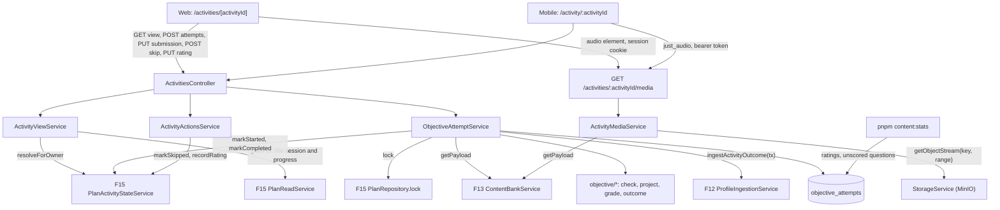
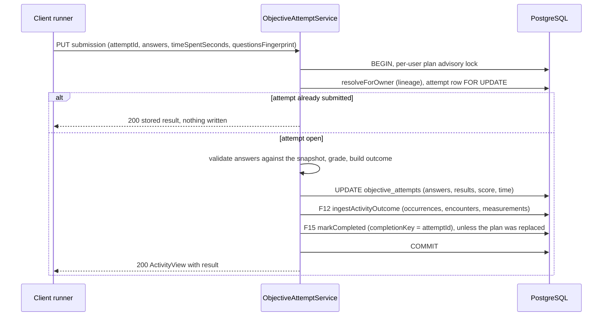
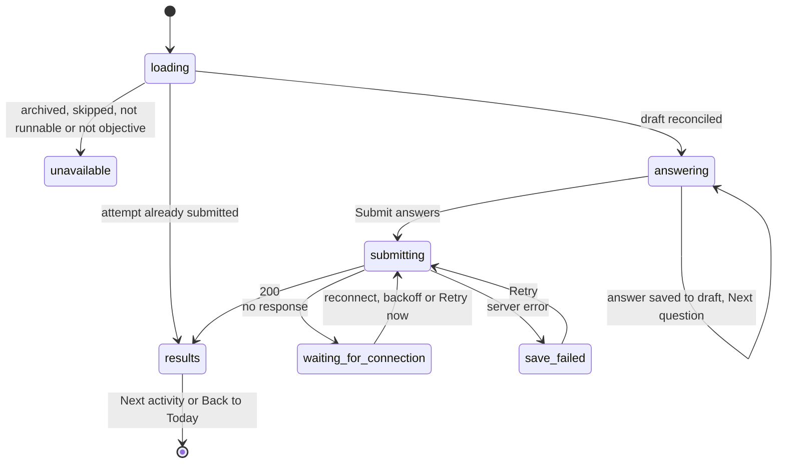

# Technical Specification: Objective Activity Execution

**Complexity:** complex. There are only six routes, but the feature crosses every layer: an API domain with a transactional submission path into F12, F13 and F15, a streaming media route, one new table, shared contracts, and a full-screen runner on each client with local drafts, retry on reconnect and an audio player (a new Flutter dependency).

## 1. Technical Overview

**What:** F16 is the runner for the five bank-backed activity kinds that F15 places in a plan: `grammar`, `vocabulary`, `listening`, `reading` and `error_review`. It has three parts.

- **An `activities` API domain** that resolves a plan activity through F15's state contract. It serves the item from F13's bank with answer keys, explanations, the listening transcript and the source withheld. It corrects a submission in code against a snapshot of the answer key taken when the attempt started. In one transaction serialized with F15's plan activation, it then:
  - writes the outcome into F12's profile (error occurrences, correct encounters, an activity-sourced measurement);
  - completes the plan activity (score, time spent, attempt id).

  The domain also offers two routes that work for every kind: skip with a reason, and the one-tap difficulty rating, which is stored on the plan activity and against the item's prompt version. A last route streams listening audio from MinIO with byte ranges.
- **A full-screen runner on web** (`/activities/[activityId]`) and **on mobile** (`/activity/:activityId`). It shows a session progress bar and asks one question at a time, forward-only. The reading text stays visible beside the questions, and the listening player hides the transcript until submission. Each answer is saved to a local draft, so the learner can resume on the same device. The submission waits and retries when the connection drops, and the results view shows the correct answer and the explanation for every question, followed by the rating prompt.
- **Registration** of the five kinds in F15's route registries on both clients. This turns on `Start session` (and a new `Resume session` label) and the activity links in the Plan tab.

No AI call happens anywhere in F16: correction is pure code.

**Why:** F15 produces a plan nobody can work through yet: its route registries are empty, so `Start session` never renders. F16 is the first runner, and it closes the loop "diagnosis → study → profile" for most of a plan's activities. The weight of the feature is in four guarantees rather than in the screens:

- **The answer key never reaches a client before submission.** F13 hands F16 the full payload "for F16 to project before any client sees it". Correction happens in the API, and nothing a client receives before submitting can reveal an answer: no key, no explanation, no listening transcript, no source link.
- **One attempt, graded once, evidence written once.** The attempt id is the idempotency key for all three writes: F16's own row, F12's source (`sourceKey`) and F15's completion (`completionKey`). A double tap, a retry after a dropped connection, and two devices submitting the same attempt all end in exactly one graded result and one set of ledger writes.
- **Work survives an interruption.** Every answer is persisted locally as it is given. A submission that cannot reach the server waits and retries instead of discarding anything, and a results view is never shown for an attempt the server did not store.
- **Grading is stable against the curator.** A re-import can change an item's questions in place (F13 updates by slug). The attempt therefore grades against the snapshot it started with, and the results of a finished attempt read the same forever.

**Scope — Included (Core Scope; the Auto-Accept Policy picked Core only):**
- Multiple-choice (4 options) and fill-in-the-blank questions, across the five bank kinds, rendered on both clients and corrected automatically in the API. There is no AI call at any point.
- Per-question feedback: after submission, every question shows correct or incorrect, the learner's answer, the correct answer where they differ, and the stored explanation. Incorrect questions are expanded by default and correct ones collapsed.
- The difficulty rating: three large buttons (`Too easy`, `Just right`, `Too hard`) and a `Not useful` link, dismissible and never blocking. It is stored on the plan activity (F15) and on the attempt against the item's prompt id and version.
- Error ingestion into the ledger through F12's outcome contract: one error occurrence per incorrect question per target tag, correct encounters (A13), and one activity-sourced measurement per mapped competency (A14).
- The Capabilities and Experience lines that sit in neither scope block and that Core needs to function:
  - the listening player with play, pause and seek, and the transcript hidden until submission;
  - the reading text visible and scrollable while answering;
  - exactly 5 questions per item;
  - the completion record (score, time spent, per-question answers);
  - skipping with a reason;
  - the full-screen session flow with its progress bar;
  - forward-only navigation;
  - per-question local saving, so an activity abandoned halfway resumes on the same device (A6).
- The PRD's Error Handling in full: audio that fails to load, a lost connection, a server-side submission failure, a corrupted answer key (unscored and flagged for the curator), and duplicate submissions.
- Route registration for the five kinds on both clients, and `Resume session` on Today when the next activity is `in_progress` (A27).
- Curator signals in `pnpm content:stats`: ratings per prompt version, and the questions that could not be corrected (A28).
- Integrated from earlier features' downstream notes:
  - F13's "strip `answer`/`explanation` and serve audio from `mediaObjectKey`";
  - F14's "a difficulty rating is stored against the payload's `promptVersion`";
  - F15's F16 note: register the kinds, resolve through the lineage, call `markStarted`, `markCompleted`, `markSkipped` and `recordRating`, return to Today after a session, and surface `PLAN003`/`PLAN004`;
  - F12's F16 note: call `ingestActivityOutcome` in the submission transaction, keyed by the attempt id.

**Scope — Deferred (Full Scope additions, not built by this spec):**
- **Sentence ordering and matching formats.** F13 already validates and stores both. In Core the runner shows such a question as unscored with `This question type isn't available yet.`, and the score is computed over the remaining questions (A2). The answer schema, the grader and the attempt row are shaped so that the Full scope adds the two formats with no migration (see "Downstream notes").
- **Cross-device resume.** Core keeps per-question progress in a local draft, so resume works on the same device only (A6). Resuming at the first unanswered question on the other client needs server-side per-question saving, which the Full scope adds as a route writing the attempt's existing `answers` column.
- **The listening replay limit** (at most 2 full replays before submission). Core's player has play, pause and seek with no cap. Hiding the transcript until submission is in Core.

**Scope — Excluded:**
- **The writing (F17) and speaking and pronunciation (F18) runners** and anything about their tasks. F16's skip and rating routes and its shell are kind-agnostic so that those runners can reuse them (see "What is F16's and what is shared"), but F16 specifies no F17 or F18 behaviour.
- **The mastery lifecycle.** F12 is Core-only: it records F16's correct encounters, and its Full scope turns them into streaks, `mastered` and due dates. F16's side of the criterion "A correct answer on a `practicing` tag advances its mastery streak" is sending the encounter.
- **F20's activity statistics and rating distribution.** F20 reads them through F15's `PlanHistoryReader`, which F16's writes feed.
- **Links from ledger examples to the activity they came from** (F12's A27, "activity examples render unlinked until F16–F18 provide a route"). The example view carries an `activityId` but not the kind, and the route registries take a full `PlanActivityView`, so a kind-agnostic link is best wired once F16–F18 have all registered their runners. It is recorded as a follow-up.
- **Background or offline synchronization.** `docs/context.md` rules out offline mobile use with later synchronization ("not planned for the project"). F16 retries a pending submission only while its runner is open, and again when the activity is reopened (A6). Nothing is fetched or synced in the background.
- **Retaking a completed activity, shuffling options, browsing content items, and any admin UI.** Section 7 of the PRD and F13 rule out browsing and admin screens, and the other two are rejected alternatives (A24).
- **Visual regression baselines for the runner.** The runner needs an authenticated, data-dependent page, and F22's follow-up (an auth-seeding pattern for Playwright) is still open.
- **A mockup.** No region of any mockup in `design/` belongs to F16 (checked against `design/README.md`), and there is no mockup for the runner or its results. Both clients compose from F21's primitives, and `design/README.md` gains no row.

**PRD traceability:**

| PRD block | Where it lands |
|---|---|
| Consumes (F12 taxonomy and outcome ingestion contract) | §5 "Profile outcome", A12–A14; `objective-outcome.ts`; the ledger integration tests |
| Consumes (F13 full item payload) | §5 `GET /activities/:activityId` projection, A3, A5; `ActivityMediaService` |
| Consumes (F15 activity entries and state contract) | §5 internal contracts, A4, A8–A10, A17, A18, A22; route registration |
| Consumes (F21 tokens, primitives, page states) | §4 web and mobile components; A20, A29 |
| Core Scope | Scope — Included |
| Full Scope additions | Scope — Deferred; §5 "Downstream notes" (F16 Full) |
| Capabilities | §5 grading, projection and outcome rules; §6 data model; A2–A19 |
| Experience | §2 "Runner flow"; §4 web and mobile components; A21–A24, A27 |
| Error Handling (5 cases) | §4 failure modes; A5, A6, A8, A15, A31 |
| F16 acceptance criteria | §7 acceptance mapping |
| Cross-Feature Integration criteria (F15→F16 payloads; F16→F12 within 5 s; F16→F15→F20 state; F21 composition) | §7 cross-feature mapping |

**Assumptions and decisions not answered by the PRD (Batch Mode, every row flagged for user review).** The rows most worth a second look are A2 (unsupported formats in Core), A6 (same-device resume), A9 (evidence kept when the plan was replaced), A13 (when a correct encounter is sent) and A14 (which competency an activity measures).

| # | Decision or assumption | Rationale | Auto-Accept row |
|---|---|---|---|
| A1 | **Core only.** Ordering and matching, cross-device resume and the replay limit are deferred. | The Batch Mode default. | Scope (Core vs Core+Full) |
| A2 | **Ordering and matching questions in Core are rendered as unscored** (`reason: format_unavailable`), with the prompt text and `This question type isn't available yet.` They are left out of the score and never write to the ledger. Only `multiple_choice` and `fill_blank` are in the Core format set (`CORE_QUESTION_FORMATS`). | F13 accepts all four formats, and the curated README invites curators to use them, so a curated item can carry them before F16 Full exists. F14 generates only the two Core formats (its A10). Rejecting such items would leave a plan with an unrunnable activity. Reusing the corrupted-key path would mislabel them as defects. This way the item runs, and the Full scope only widens the set. | Technical decisions with a clear recommendation |
| A3 | **Correction happens only in the API.** Before submission a client receives, per question, the prompt and the options (or the text around the blank and the blank's size). It never receives `answer` or `explanation`, a listening item's transcript (`body`), or the item's source. After submission it receives all of them. | F13's downstream note ("strip `answer`/`explanation`"), and the PRD's "no AI call at answer time" is satisfied by grading in code anyway. A client-side key would let anyone read the answers from the network tab. The source is withheld because a curated item's source URL usually leads to the original with its transcript. | Technical decisions with a clear recommendation |
| A4 | **The attempt starts on the first interaction, not when the runner opens.** `GET /activities/:activityId` has no side effects. The client calls `POST /activities/:activityId/attempts` when the learner confirms a first answer or presses Play for the first time. That call creates the attempt (a server-generated id) and moves the plan activity to `in_progress`. There is at most one open attempt per activity, across its carry-over lineage: a second call returns the existing one. If the call fails, the runner keeps going locally and creates the attempt before submitting. | The PRD's "audio fails to load … the activity remains `pending` … rather than being consumed". Opening the runner cannot consume anything, and a listening activity whose audio never loads never gets an attempt. A server id rules out collisions with another user's ids, and one open attempt per lineage honours F15's carry-over ("resume the attempt across its `lineage`"). | Partial PRD specifications |
| A5 | **The questions are snapshotted when the attempt is created.** The attempt row stores the item's questions, answer keys included, with a SHA-256 fingerprint of their canonical JSON. Every projection, submission check and result for that attempt reads the snapshot, never the live item. | F13 updates an item in place on re-import. Without a snapshot, a curator fixing a typo during an attempt would change which answer is correct, or what a finished attempt's results show. Five questions are a small row. | Technical decisions with a clear recommendation |
| A6 | **Resume is on the same device in Core.** Each answer is written to a local draft as it is given: `localStorage` on web, `shared_preferences` on mobile, under `eq.activity.draft.<activityId>`. A draft records the answers, the attempt id when known, the question fingerprint, the active time and a pending-submission flag. On open, a pure `reconcileDraft(view, draft)` (identical rule table on both clients, §5) restores it or discards it. A submission that could not be sent is retried when connectivity returns, while the runner is open, or on the next open. There is no background sync. | The PRD puts per-question saving in Capabilities, but "cross-device resume" in the Full additions. Local persistence delivers the first without the second. It also satisfies "answers already submitted are retained locally and synced when connectivity returns" without the offline synchronization `docs/context.md` rules out. | Partial PRD specifications |
| A7 | **Forward-only navigation is enforced by the client in Core.** `Next question` locks the answer. Earlier questions can be revisited read-only from the question dots, and the server accepts one complete submission. | With no per-question server writes (A6), the server cannot tell when an answer was given. The Full scope's per-question route will make the first write final on the server. | Partial PRD specifications |
| A8 | **Submission is idempotent**, as `PUT /activities/:activityId/attempts/:attemptId/submission`. The attempt row is locked `FOR UPDATE`. The first submission is graded and stored. Any repeat, from a double tap, a retry or another device, returns the stored result unchanged, with its request body ignored. The attempt id is also F12's `sourceKey` and F15's `completionKey`, so neither can double-write either. | The PRD's "deduplicated by activity attempt id". `PUT` fits a resource written once, and the mobile `RetryInterceptor` already retries idempotent methods on transport failure. | Technical decisions with a clear recommendation |
| A9 | **Evidence is kept even when the plan was replaced.** If the attempt's activity sits in an archived plan and was not carried forward, submission still grades, stores and ingests the outcome into the profile. It skips F15's `markCompleted`, which would raise `PLAN004`, and the results view says `This activity is no longer in your current plan. Your answers still count toward your profile.` Starting a new attempt on such an activity is refused with `PLAN004`. | The learner did the work, and the errors are real evidence. Rejecting the submission would discard it, and `PLAN004` never resolves on retry, which clashes with "Your answers could not be saved. Retry?". In Core no tag is ever mastered, so an unfinished activity is almost always carried, and the case is rare. | Description too vague |
| A10 | **Starting, submitting and skipping take F15's per-user plan lock** (`PlanRepository.lock`, the advisory lock activation holds) before resolving the activity. | Otherwise a submission and a plan activation can interleave. Activation can copy an `in_progress` activity forward while the submission completes the old row, leaving the carried copy `in_progress` for work that is already done. The lock serializes the two, and rating needs no lock, because completed activities are never carried. | Technical decisions with a clear recommendation |
| A11 | **Fill-in-the-blank matching** compares normalized strings: Unicode NFC; typographic apostrophes and quotes (`’ ‘ ” “`) mapped to ASCII; leading and trailing whitespace trimmed; inner runs of whitespace collapsed to one space; locale-independent lower case. An answer is correct when it equals any accepted variant after the same normalization. | The PRD requires case-insensitive matching tolerant of surrounding whitespace. Phone keyboards insert curly apostrophes by default, so `hadn’t` must match `hadn't`, and a double space is never a language error. | Partial PRD specifications |
| A12 | **Ledger occurrences.** Each incorrect scored question writes one `errorOccurrences` entry per item target tag, as F12's own note for F16 says. A fill-in-the-blank entry carries a quote, the prompt with the learner's text in the blank, and a correction, the prompt with the first accepted answer. A multiple-choice entry carries no quote. Unscored questions write nothing. | F12's examples are "concrete sentences the user actually produced". A typed blank is such a sentence. A picked comprehension option is not, and quoting it would put a sentence the learner never wrote in the ledger. | Partial PRD specifications |
| A13 | **Correct encounters are sent only for a fully correct attempt:** one entry per target tag when every scored question is correct, and none otherwise. | F12's contract allows one encounter per tag per source, so "per correct answer" cannot be expressed. F12 Full resets a streak on any new occurrence. An encounter written at the same instant as that attempt's occurrences would make the order ambiguous, so the mixed case sends occurrences only. A 4/5 attempt therefore counts as an error for streak purposes. | Partial PRD specifications |
| A14 | **Activity-sourced measurements** have the value round(100 × correct ÷ scored), sent for the competencies the kind trains: `grammar` → Grammar; `vocabulary` → Vocabulary; `listening` and `reading` → Comprehension; `error_review` → one per distinct competency of its target tags' families (`grammar` → Grammar, `vocab` → Vocabulary, `discourse` → Interaction; `phoneme` → none). F12 applies its fixed 0.15 weight. | F12's own example sends `{ competency: 'grammar', value: 60 }` for a grammar item. The PRD requires activity outcomes to "update the same competency scores". Discourse → Interaction follows F17's Coherence → Interaction mapping. Pronunciation comes only from Azure (F12), so a phoneme tag never produces a measurement from a text question. | Partial PRD specifications |
| A15 | **Unscorable questions.** A snapshot question is unscorable with `answer_key_invalid` when it fails `questionSchema` or `answerKeyIssues` (both exported by F13), and with `format_unavailable` when its format is outside the Core set. An item with no scorable question is not runnable: the view says so, `POST …/attempts` answers `ACT006`, and the runner offers only Skip. Each submission containing an `answer_key_invalid` question logs one `warn` line (item id and slug, question numbers, the issue text, never an answer). `content:stats` lists the affected items from the stored results (A28). | The PRD: "rendered as unscored …, the score computed over the remaining questions, and the item … flagged for the curator". Deriving the flag from attempt rows needs no second table, and the curator has no admin UI, so the CLI is where flags are read. | Partial PRD specifications |
| A16 | **Time spent** is active foreground time, measured by the client from the moment the runner renders the activity (web: `visibilitychange`; mobile: `AppLifecycleState`). It is carried in the draft across reopenings, sent with the submission, and clamped server-side to 0–3,600 seconds. | The PRD does not define "time spent". Wall-clock time from the attempt's start would count a night between two answers. The clamp keeps one bad client value from distorting F15's session summary. | Partial PRD specifications |
| A17 | **The rating is kind-agnostic.** `PUT /activities/:activityId/rating` takes `{ rating: too_easy \| just_right \| too_hard \| null, notUseful }`. The activity must be `completed` (F15's `recordRating`), and plans may be archived. The rating is written on the plan activity, and on the objective attempt, whose prompt id and version snapshot is the stored "against the item's prompt version". Rating again overwrites. Dismissing the prompt sends nothing. | F15 already stores the rating for F20 and plan history. Keeping the prompt stamp on F16's own row means a later re-import cannot rewrite what a rating referred to. A route shared across kinds is what the siblings can reuse. | Technical decisions with a clear recommendation |
| A18 | **Skip is kind-agnostic.** `POST /activities/:activityId/skip` takes `{ reason }` (1–200 characters after trimming) and calls F15's `markSkipped`. It closes the open objective attempt as `abandoned` and writes nothing to the ledger. The dialog offers four preset reasons (`Not relevant to me`, `Too difficult right now`, `Not enough time today`, `Something isn't working`) and `Other`, with a free-text field. The stored reason is the preset's text or the typed text. Skipping a completed activity is a no-op. | The PRD asks only for "a reason". Presets make a one-handed skip on a phone fast, and the free text keeps the rare real explanation. F15 already limits the reason to 1–200 characters. | Partial PRD specifications |
| A19 | **Audio is proxied, not presigned.** `GET /activities/:activityId/media` checks ownership, then streams the object from MinIO through `StorageService` with HTTP byte ranges (`206`). An unparseable or unsatisfiable `Range` header is ignored and the whole object returned. The web `<audio>` element authenticates with the session cookie (same site as the API). `just_audio` on mobile sends the bearer header. | The S3 endpoint (`http://minio:9000`) is a container hostname that neither a browser nor a phone can reach. A presigned URL would also bypass the ownership check. Byte ranges are what makes seek work in `<audio>` and ExoPlayer. | Technical decisions with a clear recommendation |
| A20 | **The audio players.** On web, an `AudioPlayer` UI primitive wraps a native `<audio>` element with token-styled controls (Play/Pause button, a native range input for seek, elapsed and total time) and an error state. On mobile, a new dependency, **`just_audio`**, sits behind `AudioPlaybackService` (an interface, so widget tests fake it), and an `EqAudioPlayer` widget mirrors the web primitive. Both are documented in the web gallery and covered by widget tests. | The mobile app has a recorder but no playback package. `just_audio` streams over HTTP with headers and supports seeking. F18 will need playback of recorded attempts, so the players live in the design system rather than inside F16's feature folders. | Feature requires new technology not present in the codebase |
| A21 | **The runner is full-screen.** On web, `app/activities/[activityId]` lives outside `(app)` in its own layout: session check, 1200px container (`max-w-300`), no `AppHeader`. On mobile, `/activity/:activityId` is a module at the app root, outside the `/app` shell and its bottom navigation, with the same session guard. The activity shell's top bar carries Close, the session progress bar and Skip. | The PRD: "opens the first activity full-screen". The classroom already lives outside `(app)` for its own container width. | Technical decisions with a clear recommendation |
| A22 | **Session navigation.** After the results, the primary action is `Next activity` when the first other unfinished activity of the session, in session order, has a registered route. Otherwise it is `Back to Today`, which also covers a finished session (F15's Today then shows the session summary). The runner never skips ahead past an unroutable activity. Close returns to the previous screen, or to Today when there is none. | F15's A22 ("never skip ahead to a later one just because it happens to be routable") and its F16 note ("after the last activity of a session, return to Today"). | Technical decisions with a clear recommendation |
| A23 | **Layouts.** On wide web screens (`lg` and up), a passage (reading text, or the `body` of an error-review, vocabulary or grammar item) sits in a sticky, independently scrolling left column beside the questions. On narrow web and mobile, the screen is split vertically: the passage pane is on top (about 45% of the height) and the question pane below, each scrolling on its own. A listening player is pinned above the questions. The item's source is shown under the passage or player after submission. | "The text remaining scrollable and visible while answering". On a phone, a split pane is the only layout that keeps both visible without scrolling one out of view. | Partial PRD specifications |
| A24 | **Options appear in stored order**, with no shuffle. The blank's input is sized to the longest accepted answer, clamped to 4–40 characters (the HTML `size` attribute on web, a character-width box on mobile). A completed activity cannot be retaken. | Order is the item author's decision. Shuffling would need an index mapping per attempt and brings no PRD requirement. The PRD asks for the input "sized to the expected answer". Retakes are not in the PRD and would create a second score for one plan activity. | Partial PRD specifications |
| A25 | **Six new error codes**, `ACT001`–`ACT006` (§5). F16's routes also surface F15's `PLAN003` and `PLAN004`, F13's `CONTENT001` and `VAL001`. Rating a non-completed activity keeps F15's existing `VAL001` ("Only a completed activity can be rated."). | One code per failure mode (root `AGENTS.md`). Siblings in this wave may add codes too: whichever lands second takes the next free numbers. | Technical decisions with a clear recommendation |
| A26 | **The attempt table is F16's own, `objective_attempts`.** It is not a generic attempt table for F17 and F18. | Writing has drafts, corrections and revisions, and speaking has up to 3 scored recordings. A shared table would be a union of three different records. What the siblings can reuse is listed below. Table names are plural (F15's A24). | Technical decisions with a clear recommendation |
| A27 | **`Resume session`.** Today's primary action (the web dashboard card and the mobile Today tab) reads `Resume session` when the session's next activity is `in_progress`, and `Start session` otherwise. On a device without a draft, resuming reopens the same open attempt at the first question (A6). | "Returning to a half-finished activity shows `Resume` rather than `Start`." The runner opens straight into the activity, so Today's action is where the word appears. | Partial PRD specifications |
| A28 | **Curator signals in `pnpm content:stats`**, two new sections over the last 90 days (F14's window): **Difficulty ratings by prompt version** (per `promptId@promptVersion`, and one `curated` row: rated count, `Too easy`/`Just right`/`Too hard` shares, `Not useful` count), and **Questions that could not be corrected** (per item slug: question numbers, reason, attempts affected, last seen). `format_unavailable` questions are counted separately as "questions waiting for F16 Full". | "The rating is stored against the item's prompt version, which is the signal that tunes the prompt library", and "the item is flagged for the curator". The curator's only surface is the CLI (F13, F14), and F14 already reports per prompt version there. | Partial PRD specifications |
| A29 | **`EqTextField`** is a new mobile widget that carries its own token-built decoration, mirroring the web `TextField`. F16 does not change `EqTheme`'s app-wide `inputDecorationTheme`. | The mobile-ui skill routes styling through `EqTheme`, but the login and settings fields use stock decorations today, and a global theme change would restyle screens outside F16's scope. A widget is the smaller, reversible step. The global theme is recorded as a follow-up. | Multiple conflicting patterns in the codebase |
| A30 | **No new environment variable, one new dependency (`just_audio`, mobile), migration `0016_objective_attempts`** (or the next free number if a sibling lands first). | Every number is a constant in `activity.constants.ts` or the clients' constants. | Technical decisions with a clear recommendation |
| A31 | **Submission failures fall into two classes.** A transport failure (no response) moves the runner to `waiting_for_connection`: `You're offline. Your answers are saved on this device and will be sent when you reconnect.` The runner retries on reconnect (web `online` event, mobile `ConnectivityService.hasLink`) and on a 5, 15, 30, then 60 second backoff while it is open, with a `Retry now` action. A server failure (5xx, or an unexpected 4xx) moves it to `save_failed`: `Your answers could not be saved. Retry?`, with manual retry. Either way the answers stay on screen, and results appear only after a `200`. `AUTH003` keeps the draft and goes through each client's existing session-expired flow. | The PRD's two error lines ("connection lost" and "submission fails server-side") describe different recoveries. Automatic retry fits the first, and a human decision fits the second. | Partial PRD specifications |

**What is F16's and what is shared with sibling runners (F17, F18):**

| Piece | Owner | Reuse |
|---|---|---|
| `POST /activities/:activityId/skip`, `PUT /activities/:activityId/rating` and `ActivityActionsService` | F16 | Kind-agnostic: they work for `writing`, `speaking` and `pronunciation` activities today, through F15's contract. Siblings can call them instead of adding their own |
| `ActivityView`'s `activity` and `session` blocks, returned by `GET /activities/:activityId` for every kind (`objective` is null for the task kinds) | F16 | Available to any runner that needs the session position. Whether F17 and F18 adopt it is their decision |
| Web `ActivityShell`, `SessionProgress`, `SkipActivityDialog`, `RatingPrompt`; mobile `ActivityShell`, `SessionProgress`, `SkipActivitySheet`, `RatingPrompt` | F16 | Kind-agnostic frames with no objective logic in them |
| Web `AudioPlayer` (UI primitive), mobile `EqAudioPlayer` and `AudioPlaybackService` (`just_audio`) | F16 | Expected to be reused by F18 for attempt playback |
| Mobile `EqTextField` | F16 | General-purpose design-system widget |
| `objective_attempts`, the grader, the projection, the outcome builder, the draft reconciliation | F16 only | Objective-specific. Not intended for reuse |
| The attempt id as F15's `completionKey` and F12's `sourceKey` | F15 and F12 conventions | Followed as F12 and F15 already specify for every runner |

## 2. Architecture Impact

**Affected components:**

| Area | Path |
|---|---|
| API: activities domain | `apps/api/src/activities/**` |
| API: seams in finished features | `apps/api/src/storage/storage.service.ts` (range streaming), `apps/api/src/content/content-stats.ts`, `apps/api/src/content/cli/stats.ts` |
| API: wiring, errors, OpenAPI | `apps/api/src/app.module.ts`, `common/app-error.ts`, `openapi/components.ts`, `openapi/setup.ts` |
| Database | `apps/api/prisma/schema.prisma`, `apps/api/prisma/migrations/0016_objective_attempts/migration.sql` |
| Shared contracts | `packages/shared/src/schemas/activity.ts`, `errors/codes.ts`, `index.ts` |
| Web | `apps/web/src/app/activities/**`, `components/activity/**`, `components/ui/audio-player.tsx`, `components/ui/icons/**`, `components/ui/index.ts`, `components/dashboard/today-session-card.tsx`, `lib/activities*.ts`, `lib/activity-draft.ts`, `lib/activity-navigation.ts`, `lib/use-active-time.ts`, `lib/activity-routes.ts`, the design-system gallery |
| Mobile | `apps/mobile/pubspec.yaml`, `lib/core/audio/audio_playback_service.dart`, `lib/design/widgets/eq_audio_player.dart`, `eq_text_field.dart`, `lib/features/activity/**`, `lib/features/plan/activity_routes.dart`, `lib/features/today/today_page.dart`, `lib/app_module.dart` |
| Docs | `docs/api/openapi.json`, dated notes in the progress files of F12, F13, F14 and F15 |

**Opening, answering and submitting:**



**The submission transaction:**



**The client runner:**



**Runner flow (from the PRD's Experience):**
1. `Start session` (or `Resume session`) on Today, or an activity's title in the Plan tab, opens the runner full-screen. The top bar shows Close, `Activity 2 of 3` with a segmented bar for the session, and Skip.
2. Reading, error review, and vocabulary or grammar items with a body show the passage beside (wide web) or above (phone) the questions. Listening shows the player pinned above the questions, with `The transcript appears after you submit.`
3. One question at a time, headed `Question 2 of 5`. A multiple-choice question shows four large option cards (a radio group). A fill-in-the-blank question shows the sentence with an inline input. `Next question` locks the answer and saves the draft. Question dots let the learner review earlier answers read-only. An unscored question shows its message and needs no answer. The last question's action is `Submit answers`.
4. Submitting shows `Saving your answers…`. On success, the results view appears:
   - `3 of 4 correct`, plus `1 question wasn't scored.` when any was;
   - each question with a check or a cross, the learner's answer, the correct answer where they differ, and the explanation, with incorrect questions expanded and correct ones collapsed;
   - for listening, the transcript;
   - the source, when the item has one.
5. The rating prompt follows the results: `How was this activity?`, then `Too easy`, `Just right` and `Too hard` as large buttons, `Not useful` as a text link, and `Not now` to dismiss it. The primary action (`Next activity` or `Back to Today`) is available whether or not the learner rates.
6. Reopening an activity restores the draft at the first unanswered question, with `Picking up where you left off.`. A completed activity opens on its results, and a skipped one on `You skipped this activity.` with the reason.

## 3. Technical Decisions

| Decision | Chosen Approach | Alternative Considered | Trade-off |
|---|---|---|---|
| Where correction runs | In the API, against a per-attempt snapshot, returning the result in the submission response | In the client, with keys shipped to it (instant feedback, offline correction) | A submission needs a round trip before results. Accepted: the key never leaks, ledger writes are trustworthy, and both clients grade identically because only one implementation exists |
| Per-question progress in Core | A local draft on each client, and one idempotent submission | A server write per answer (`PUT …/answers/:index`) | Resume works on the same device only, and forward-only is enforced by the client. Accepted: it respects the Core/Full split, and the Full scope adds the per-answer route on the same `answers` column with no migration |
| When an attempt exists | Created on the first interaction, with a server id and one open attempt per lineage | Created when the runner opens, or a client-generated id | One extra call on the first answer. Accepted: opening never consumes an activity (the audio-failure rule), and no id can collide with another user's |
| Grading stability | The questions are snapshotted into the attempt with a fingerprint | Grading against the live item, or versioning items in F13 | A few kilobytes per attempt, and drafts discarded when the fingerprint changes. Accepted: F13 stays untouched, and a result never changes after the fact |
| Plan replaced during an attempt | Grade and ingest, skip the plan update, tell the learner | Reject with `PLAN004` | The attempt counts in the profile but not in any plan's completion. Accepted: evidence is never thrown away, and a permanent error is never presented as retryable |
| Audio delivery | An API proxy stream with byte ranges, authenticated like every route | Presigned MinIO URLs | Audio bytes pass through the API process. Accepted: two users on a local stack, files of a few MB, and MinIO's container hostname is unreachable from clients anyway |
| Unsupported formats in Core | Rendered as unscored, the rest still graded | Refusing items that contain them | A curated item with an ordering question scores out of 4. Accepted: no plan activity is left unrunnable, and the Full scope only widens a constant set |
| Where the generic pieces live | Skip, rating, the view's context blocks, the shell and the audio players are kind-agnostic, in F16's domain and the design system | Each runner builds its own | F16 carries a little code with no objective purpose. Accepted: the siblings in this wave can reuse it instead of shipping three skip dialogs |

## 4. Component Overview

**API: activities domain (`apps/api/src/activities/`, `ActivitiesModule`; imports `PlansModule`, `ProfileModule` and `TaxonomyModule`. Prisma, Content and Storage are global):**

| File Path | New/Modified | Purpose | Key Responsibilities |
|---|---|---|---|
| `activities.module.ts` | New | Wiring | Provides the services below and the controller |
| `activity.constants.ts` | New | Fixed values | `OBJECTIVE_KINDS` (the five bank kinds), `CORE_QUESTION_FORMATS` (`multiple_choice`, `fill_blank`), `TIME_SPENT_MAX_SECONDS` (3,600), `SKIP_REASON_MAX_CHARS` (200), `FILL_ANSWER_MAX_CHARS` (100), `BLANK_LENGTH_RANGE` (4–40), `KIND_COMPETENCY`, `FAMILY_COMPETENCY` (A14), `MEDIA_CACHE_CONTROL` (`private, max-age=3600`), `SUBMISSION_TRANSACTION_TIMEOUT_MS` (F12's `PROFILE_TRANSACTION_TIMEOUT_MS`) |
| `objective/question-check.ts` | New | Pure (A2, A15) | `checkQuestion(raw, index)` → `{ scorable: true, question }` or `{ scorable: false, reason: 'format_unavailable' \| 'answer_key_invalid', prompt: string \| null, issues: string[] }`, using F13's `questionSchema` and `answerKeyIssues`. `checkAll(questions)` and `isRunnable(checks)` |
| `objective/question-projection.ts` | New | Pure (A3, A24) | `projectQuestion(check)` → the client view with no key and no explanation. `splitBlank(prompt)` → `{ before, after }` around the single blank marker. `blankLength(answers)`, clamped. `questionsFingerprint(questions)`: SHA-256 hex of canonical JSON (sorted keys) |
| `objective/answer-normalization.ts` | New | Pure (A11) | `normalizeAnswer(text)` and `matchesAccepted(text, accepted)` |
| `objective/grading.ts` | New | Pure | `answerIssues(checks, answers)` → VAL001 details when the answers do not cover exactly the scorable questions once each with matching formats and in-range values. `grade(checks, answers)` → `{ results[], scoreCorrect, scoreTotal, unscored[] }` |
| `objective/objective-outcome.ts` | New | Pure (A12–A14) | `buildActivityOutcome({ userId, activityId, attemptId, kind, targetTags, checks, answers, graded, occurredAt, familyOf })` → F12's `ActivityOutcomeInput`. `competenciesFor(kind, targetTags, familyOf)` |
| `objective/result-view.ts` | New | Pure | `resultView(checks, answers, graded, meta)` → `ObjectiveResult` (response text, correct answer, accepted answers, explanation per question) |
| `objective/session-context.ts` | New | Pure | `sessionBlock(planSession, currentId)` → `{ day, position, count, activities }` from F15's `PlanSessionView`, so every entry is a full `PlanActivityView` the route registries accept |
| `objective-attempt.repository.ts` | New | Persistence | Insert with snapshot, `openOrSubmittedIn(client, userId, lineage)`, `lockForSubmission(tx, attemptId, userId, lineage)` (`SELECT … FOR UPDATE`), `markSubmitted`, `abandonOpen(tx, userId, lineage, at)`, `setRating(tx, userId, lineage, rating)` |
| `objective-attempt.service.ts` | New | Start and submit | `start(userId, activityId, now)` and `submit(userId, activityId, attemptId, input, now)` (§5 internal contracts). Owns the one transaction per call. Logs attempt id, activity id, item slug, score and flagged question numbers, never an answer or a quote |
| `activity-actions.service.ts` | New | Kind-agnostic actions | `skip(userId, activityId, reason, now)` and `rate(userId, activityId, input, now)` (A17, A18) |
| `activity-view.service.ts` | New | Read model | `viewFor(userId, activityId, now)` → `ActivityView`: resolves through the lineage, reads the plan through F15's exported `PlanReadService.planFor` (the day's `PlanSessionView`, the plan status and its completion percentage) to build the session block, labels tags, picks the submitted or open attempt in the lineage, and projects questions from the attempt's snapshot, or from the live payload when there is no attempt yet |
| `activity-media.service.ts` | New | Audio (A19) | `open(userId, activityId, rangeHeader)` → `{ stream, status: 200 \| 206, headers }`. Resolves ownership, requires `listening` and a media key, and maps a missing object to `ACT004` and an unreachable store to `ACT005`, logging the item slug for the curator |
| `activities.controller.ts` | New | HTTP surface | The six routes in §5 with the OpenAPI decorators, under tag `activities`. Validates params and bodies with the shared Zod schemas. The media route streams with `StreamableFile` and sets `Accept-Ranges`, `Content-Range`, `Content-Length`, `Content-Type` and `Cache-Control` |

**API: changes elsewhere:**

| File Path | New/Modified | Purpose | Key Responsibilities |
|---|---|---|---|
| `apps/api/src/storage/storage.service.ts` | Modified (additive) | Range reads | `getObjectStream(key, range?)` → `{ body: Readable, contentLength, contentRange, contentType, totalBytes }`, or `null` for a missing key. Throws `StorageUnavailableError` when the store is unreachable. An invalid range is dropped and the whole object returned |
| `apps/api/src/content/content-stats.ts`, `content/cli/stats.ts` | Modified (additive) | Curator signals (A28) | `collectActivityStats(prisma, since)` and the two rendered sections, printed after F14's prompt-version section |
| `apps/api/src/app.module.ts` | Modified | Root | Imports `ActivitiesModule` |
| `apps/api/src/common/app-error.ts` | Modified | Factories | `activityNotObjective()`, `activityAttemptNotFound()`, `activitySkipped()`, `activityAudioNotFound()`, `activityAudioUnavailable()`, `activityNotRunnable()` |
| `apps/api/src/openapi/components.ts`, `openapi/setup.ts` | Modified | Document | `ActivityView`, `ActivityRatingView`, `ObjectiveSubmissionInput`, `ActivitySkipInput` and `ActivityRatingInput` from the shared schemas, the `activities` tag, and a binary audio response component |

**Shared (`packages/shared/src/`):**

| File Path | New/Modified | Purpose | Key Responsibilities |
|---|---|---|---|
| `schemas/activity.ts` | New | Contracts | `activityContextSchema`, `activitySessionSchema`, `unscoredReasonSchema`, `objectiveQuestionViewSchema` (a union on `format`: `multiple_choice`, `fill_blank`, `unscored`), `objectivePassageSchema`, `objectiveItemViewSchema`, `objectiveAttemptStatusSchema`, `objectiveAttemptViewSchema`, `objectiveResultQuestionSchema`, `objectiveResultSchema`, `objectiveViewSchema`, `activityViewSchema`, `objectiveAnswerSchema`, `objectiveSubmissionInputSchema`, `activitySkipInputSchema`, `activityRatingInputSchema`, `activityRatingViewSchema`, and their types. Reuses `planActivityViewSchema` (the session entries), `planActivityKindSchema`, `planActivityStateSchema`, `studyPlanStatusSchema`, `planTagSchema`, `difficultyRatingSchema` and `cefrLevelSchema` |
| `errors/codes.ts` | Modified | Codes | `ACT001`–`ACT006` with status and message (§5) |
| `index.ts` | Modified | Exports | The activity schemas |

**Web (`apps/web/src/`):**

| File Path | New/Modified | Purpose | Key Responsibilities |
|---|---|---|---|
| `app/activities/layout.tsx` | New | Full-screen frame (A21) | `getCurrentUser()` or redirect to `/login?expired=1`. `mx-auto max-w-300 p-lg`, no `AppHeader` |
| `app/activities/[activityId]/page.tsx` | New | Route | Server component: `getActivity(activityId)`. `PLAN003` or `VAL001` renders the not-found state, `objective: null` renders `ActivityUnavailable` (not available here), and anything else renders `ActivityShell` around `ObjectiveRunner`. Metadata title `Activity · English Quest` |
| `app/activities/[activityId]/loading.tsx`, `error.tsx` | New | Page states | A skeleton shaped like the top bar, passage and question card. The error state with retry, as `plan/` does |
| `components/activity/activity-shell.tsx` | New | Kind-agnostic frame | Top bar: Close (icon button, `aria-label="Close activity"`), the kind icon and title, `SessionProgress`, and Skip, which opens `SkipActivityDialog` (hidden when the activity is done or read-only). Children fill the body |
| `components/activity/session-progress.tsx` | New | Session position | One segment per session activity (done, current, pending), `role="progressbar"` with `aria-valuenow`/`aria-valuemax`, visible text `Activity 2 of 3` |
| `components/activity/skip-activity-dialog.tsx` | New | Skip (A18) | A native `<dialog>`, following `LedgerEntrySheet`'s pattern, or the `Dialog` UI primitive if a sibling in this wave (F17 plans one) has added it by then: the four presets as a radio group, `Other` with a `TextField`, `Skip activity` and `Keep going`. It calls `skipActivity`, then navigates per A22. An error keeps the dialog open with the message |
| `components/activity/rating-prompt.tsx` | New | Rating (A17) | `How was this activity?`, three large `Button`s (`aria-pressed` on the current rating), the `Not useful` link toggle, and `Not now`. Saves optimistically, and on failure shows `Your rating could not be saved.` with `Retry`, without blocking anything |
| `components/activity/objective-runner.tsx` | New | Runner | Lays out passage or listening pane and question pane (A23), and renders the current state from `useObjectiveRunner`: the question card, the submission status, the results, `ActivityUnavailable` |
| `components/activity/use-objective-runner.ts` | New | Runner state | The §2 state machine: draft reconciliation on mount, lazy attempt creation (A4), answer locking and draft writes, `useActiveTime`, submission with the A31 retry policy, the results, rating state, and the next step (A22) |
| `components/activity/passage-pane.tsx` | New | Passage | A heading (`Text`, or `Transcript` after a listening submission), the body in an independently scrolling `role="region"` with `tabIndex={0}`, and the source after submission |
| `components/activity/listening-pane.tsx` | New | Listening | `AudioPlayer` on `activityMediaUrl(id)`. `onFirstPlay` creates the attempt. On failure it shows `This audio could not be loaded.` with retry and hides the questions. It shows the transcript pane after submission |
| `components/activity/question-card.tsx`, `multiple-choice-question.tsx`, `fill-blank-question.tsx`, `unscored-question.tsx` | New | Questions | `Question 2 of 5`. Options are large cards around visually hidden native radios. The blank is an inline input (`size` from `blankLength`, `aria-label="Answer for question 2"`, `autocomplete`/`autocorrect`/`spellcheck` off). Unscored shows `This question could not be corrected.` or `This question type isn't available yet.`. Locked answers render read-only |
| `components/activity/question-dots.tsx` | New | Review navigation | One dot per question (answered, current, unanswered, unscored). Answered ones can be revisited read-only, and unanswered ones beyond the current one are disabled |
| `components/activity/submission-status.tsx` | New | A31 | `Saving your answers…`, the waiting message with `Retry now`, and the save-failed message with `Retry` |
| `components/activity/results-view.tsx`, `result-question.tsx` | New | Results | The score line, then one disclosure per question (`aria-expanded`), expanded when incorrect, with `CheckCircleIcon` or `CrossCircleIcon` and a text label (never colour alone). Then the listening transcript, the plan-replaced note (A9), `RatingPrompt`, and the primary action from `activity-navigation.ts` |
| `components/activity/activity-unavailable.tsx` | New | Terminal states | `This activity is no longer in your current plan.` (`Go to your plan`), `You skipped this activity.` with its reason, `This activity could not be corrected.` (Skip only), `This activity isn't available here.` Built on `EmptyState` |
| `components/ui/audio-player.tsx` | New (primitive) | A20 | A native `<audio preload="metadata">` with a Play/Pause `Button` (disabled until metadata loads), a native range input for seek, and `m:ss / m:ss`. `onFirstPlay`, `onError` and `onRetry` props. Token utilities only |
| `components/ui/icons/play-icon.tsx`, `pause-icon.tsx`, `cross-circle-icon.tsx` | New | Icons | In the existing `IconProps` style. Exported from `icons/index.ts` and `ui/index.ts` |
| `app/(dev)/design-system/sections/audio-player-section.tsx`, `page.tsx`, `sections/icon-section.tsx` | New / Modified | Gallery | `AudioPlayer`'s idle, playing and error states in both themes, and the three new icons |
| `components/dashboard/today-session-card.tsx` | Modified | A27 | The action reads `Resume session` when the next activity is `in_progress` |
| `lib/activities-server.ts` | New | Server read | `getActivity(id)` over the internal URL, `cache: 'no-store'`, returning `ServerRead<ActivityView>` as `plans-server.ts` does |
| `lib/activities.ts` | New | Browser calls | `startAttempt(id)`, `submitAttempt(id, attemptId, input)`, `skipActivity(id, reason)`, `rateActivity(id, input)`, `activityMediaUrl(id)` |
| `lib/activity-draft.ts` | New | A6 | `loadDraft(lineage)`, `saveDraft(draft)`, `clearDraft(lineage)`, each wrapped in try/catch (storage can be blocked), and the pure `reconcileDraft(view, draft)` (§5 table) |
| `lib/activity-navigation.ts` | New | A22 | The pure `nextStep(view)`: `{ kind: 'next', href }` or `{ kind: 'today' }` |
| `lib/use-active-time.ts` | New | A16 | A hook counting visible seconds, seeded from the draft |
| `lib/activity-routes.ts` | Modified | Registration | `listening`, `reading`, `vocabulary`, `grammar` and `error_review` map to `/activities/{id}` |

**Mobile (`apps/mobile/`):**

| File Path | New/Modified | Purpose | Key Responsibilities |
|---|---|---|---|
| `pubspec.yaml` | Modified | Dependency | `just_audio` (A20) |
| `lib/core/audio/audio_playback_service.dart` | New | Playback seam | The `AudioPlayback` interface (load a URI with headers, play, pause, seek, position and duration streams, error stream, dispose) and `JustAudioPlayback`. A fresh instance per page, so no singleton bind |
| `lib/design/widgets/eq_audio_player.dart` | New | Design widget | Mirrors the web `AudioPlayer`: Play/Pause `EqButton`, a slider themed from tokens, `m:ss / m:ss`, an error line, and `onFirstPlay`, `onError` and `onRetry` |
| `lib/design/widgets/eq_text_field.dart` | New | Design widget (A29) | Mirrors the web `TextField`: label, optional hint and error, 2px `outlineStrong` border, `EqRadius.md`, a focus shadow from `EqElevation.inputFocus`, and a compact inline variant for the blank |
| `lib/features/activity/activity_module.dart` | New | Route (A21) | `createModule(path: '/activity')` with `/:activityId` → `ActivityRunnerPage`, guarded like the shell |
| `lib/features/activity/activity_models.dart` | New | Models | Hand-written mirrors of every schema in `schemas/activity.ts`, with tolerant enum parsing as `plan_models.dart` does. Session entries parse into `plan_models.dart`'s existing `PlanActivityView` |
| `lib/features/activity/activities_api.dart` | New | API | `view(id)`, `start(id)`, `submit(id, attemptId, input)`, `skip(id, reason)`, `rate(id, input)` and `mediaUri(id)` on the shared `Dio` |
| `lib/features/activity/activity_draft_store.dart` | New | A6 | Reads and writes drafts in `shared_preferences` under `eq.activity.draft.<activityId>`, tolerating corrupt JSON by discarding it |
| `lib/features/activity/draft_reconciliation.dart` | New | A6 | `reconcileDraft`, the same rule table as the web |
| `lib/features/activity/activity_navigation.dart` | New | A22 | `nextStep`, the same rule as the web, using `activityRouteFor` |
| `lib/features/activity/active_time_tracker.dart` | New | A16 | Counts foreground seconds through `AppLifecycleState` |
| `lib/features/activity/objective_runner_controller.dart` | New | State | A `GetxController` with `Rx` view, current index, answers, submission phase, result and rating. The same state machine as the web hook, the A31 retry on `ConnectivityService.hasLink` and the backoff |
| `lib/features/activity/activity_runner_page.dart` | New | Screen | `Scaffold` and `SafeArea`: `ActivityShell` header, the body per kind (A23), and the primary action pinned in the thumb zone. Every state through `EqLoading`, `EqEmpty` and `EqError` |
| `lib/features/activity/widgets/activity_shell.dart`, `session_progress.dart`, `skip_activity_sheet.dart`, `rating_prompt.dart`, `passage_pane.dart`, `listening_pane.dart`, `question_card.dart`, `multiple_choice_question.dart`, `fill_blank_question.dart`, `unscored_question.dart`, `question_dots.dart`, `submission_status.dart`, `results_view.dart`, `result_question_tile.dart`, `activity_unavailable.dart` | New | Widgets | Mirror the web components on `EqCard`, `EqButton`, `EqBadge`, `EqChip`, `EqTextField` and `EqAudioPlayer`. The skip sheet follows `ledger_entry_sheet.dart`'s `showModalBottomSheet` pattern. Icons are outlined Material icons with a `Semantics` label, as F15's `activity_kind_icon.dart` does |
| `lib/features/plan/activity_routes.dart` | Modified | Registration | The five kinds map to `/activity/{id}` |
| `lib/features/today/today_page.dart` | Modified | A27 | `Resume session` when the next activity is `in_progress` |
| `lib/app_module.dart` | Modified | Root | `..module(activityModule)` |

**Docs:**

| File Path | New/Modified | Purpose | Key Responsibilities |
|---|---|---|---|
| `docs/api/openapi.json` | Regenerated | Snapshot | Six routes and the new components |
| `docs/F12-learning-profile-and-error-ledger/progress.md`, `docs/F13-content-bank-and-curated-import/progress.md`, `docs/F14-ai-content-generation-with-difficulty-gate/progress.md`, `docs/F15-study-plan-generation/progress.md` | Modified | Dated follow-up notes | F12: the first real activity caller, the encounter rule (A13), the measurement mapping (A14), and ledger links still open (A27 of F12). F13: payload projection, the media route and the new `content:stats` sections. F14: ratings stored against the prompt version and reported per version. F15: the kinds registered, the state contract called, the plan lock reused (A10), and `Resume session` on Today |

**Database:**

| Migration File | Tables Affected | Operation | Notes |
|---|---|---|---|
| `apps/api/prisma/migrations/0016_objective_attempts/migration.sql` | `objective_attempts` | CREATE | `main` holds `0001`–`0015`. Take the next free number if a sibling lands first |

**Failure modes:**

| Scenario | Behaviour | Surfaced as |
|---|---|---|
| Listening audio fails to load (network, missing object, store down) | No attempt is created (A4), so the activity stays `pending`. The questions are hidden behind the error | `This audio could not be loaded.` with `Try again`. The server logs the item slug for a missing object (`ACT004`) |
| Connection lost while answering | Answers keep going to the local draft, and the attempt is created later if it was not yet | Nothing until submission |
| Connection lost at submission | `waiting_for_connection`, with auto-retry on reconnect and backoff while the runner is open, and again on reopen | `You're offline. Your answers are saved on this device and will be sent when you reconnect.` with `Retry now` |
| Submission fails server-side | Answers stay on screen, no results | `Your answers could not be saved. Retry?` with `Retry` |
| Corrupted answer key | The question is unscored, the score is computed over the rest, a `warn` log is written and the item appears in `content:stats` | `This question could not be corrected.` |
| Every question unscorable | Not runnable, `POST …/attempts` → `ACT006` | `This activity could not be corrected.` with Skip only |
| Double tap, retry, or two devices submitting | One graded result and one set of writes. Repeats return it | The same results on every device |
| The plan was replaced and the activity not carried | Start → `PLAN004`. A submission of an attempt already open still grades and ingests (A9) | `This activity is no longer in your current plan.` (start), or the note on the results |
| Skipped on another device while answering here | The submission gets `ACT003`. The draft is discarded | `This activity was skipped.` with `Back to Today` |
| The item was re-imported between opening and the first answer | The attempt snapshots the new questions. The draft fingerprint no longer matches, so the draft is discarded | `This activity was updated, so your answers were cleared.` |
| Session expired | The draft is kept, and the client's existing session-expired flow runs | Login, then the runner resumes from the draft |
| Rating or skip fails | Rating: inline retry, non-blocking. Skip: the dialog stays open | The error message, with `Retry` |

## 5. API Contracts

All routes require a session (`SessionGuard`) and carry the cookie and bearer security schemes. Each returns only the caller's own data, resolving the activity through F15's `resolveForOwner`, so another user's activity id is indistinguishable from an unknown one (`PLAN003`). JSON success bodies are `{ data: … }`.

### Endpoint: Read an activity

- **Method:** GET
- **Path:** `/activities/:activityId`
- **Authentication:** session cookie or bearer token

**Request:**

| Field | Type | Required | Validation | Description |
|---|---|---|---|---|
| `activityId` (path) | `uuid` | Yes | UUID | Any id in the activity's carry-over lineage. The view is always of the newest copy |

**Response (Success - 200): `ActivityView`.** It has no side effects.

| Field | Type | Description |
|---|---|---|
| `data.serverTime` | `datetime` | For relative times on the client |
| `data.activity.id` | `uuid` | The resolved (newest) plan activity id |
| `data.activity.lineage` | `uuid[]` | Oldest first. The client looks up drafts under each |
| `data.activity.planId`, `.planStatus` | `uuid`, `'active' \| 'archived'` | The plan the resolved activity belongs to |
| `data.activity.readOnly` | `boolean` | True when `planStatus` is `archived`: no state change is possible |
| `data.activity.kind` | `PlanActivityKind` | The eight kinds. Only the five bank kinds have `objective` |
| `data.activity.title`, `.estimatedMinutes`, `.rationale` | `string`, `integer`, `string` | As placed by F15 |
| `data.activity.targetTags` | `Array<{ tag, label }>` | 0–5 |
| `data.activity.state` | `'pending' \| 'in_progress' \| 'completed' \| 'skipped'` | |
| `data.activity.startedAt`, `.completedAt`, `.skippedAt` | `datetime \| null` | |
| `data.activity.skipReason` | `string \| null` | |
| `data.activity.rating`, `.notUseful` | `DifficultyRating \| null`, `boolean` | |
| `data.activity.planCompletionPercent` | `integer` | F15's ⌊100 × completed ÷ total⌋ for that plan |
| `data.session.day`, `.position`, `.count` | `integer` | 1–7, 1–4, 2–4 |
| `data.session.activities[]` | `PlanActivityView[]` | The day's activities by position, exactly as F15's plan views carry them, so a client can pass an entry straight to its route registry |
| `data.objective` | `ObjectiveView \| null` | Null for `writing`, `speaking` and `pronunciation` |
| `objective.runnable` | `boolean` | False when no question is scorable (A15) |
| `objective.item.type`, `.title`, `.topic`, `.cefrLevel` | | From the payload |
| `objective.item.accent`, `.durationSeconds` | `string \| null`, `integer \| null` | Listening only |
| `objective.item.passage` | `{ kind: 'text' \| 'transcript', text } \| null` | `text` for a non-listening item's `body`. `transcript` for listening, only once submitted |
| `objective.item.hasAudio` | `boolean` | True for listening with a media key |
| `objective.item.source` | `{ name, url \| null } \| null` | Only once submitted (A3) |
| `objective.item.questionsFingerprint` | `string` (64 hex) | Of the attempt's snapshot, or of the live item when there is no attempt |
| `objective.item.questions[]` | `ObjectiveQuestionView[]` | Five entries, by `index` |
| `questions[]` (`multiple_choice`) | `{ index, format, prompt, options: string[4] }` | |
| `questions[]` (`fill_blank`) | `{ index, format, prompt, before, after, blankLength }` | `before` and `after` surround the blank. `blankLength` is 4–40 |
| `questions[]` (`unscored`) | `{ index, format, prompt: string \| null, reason: 'format_unavailable' \| 'answer_key_invalid' }` | No answer is expected |
| `objective.attempt` | `{ id, status: 'open' \| 'submitted', startedAt, submittedAt } \| null` | The submitted attempt in the lineage, otherwise the open one, otherwise null. An abandoned attempt is never returned |
| `objective.result` | `ObjectiveResult \| null` | Set exactly when the attempt is submitted |
| `result.scoreCorrect`, `.scoreTotal`, `.unscoredCount` | `integer` | `scoreTotal` counts scored questions only |
| `result.timeSpentSeconds`, `.submittedAt` | `integer \| null`, `datetime` | |
| `result.questions[]` | `Array<{ index, format, prompt, outcome: 'correct' \| 'incorrect' \| 'unscored', response, correctAnswer, acceptedAnswers, explanation, unscoredReason }>` | `response` is the chosen option's text or the typed text. `correctAnswer` is the correct option, or the first accepted variant. `acceptedAnswers` is `[]` except for fill-in-the-blank |

**Response Example (a reading activity with an open attempt):**
```json
{
  "data": {
    "serverTime": "2026-10-02T07:41:10.000Z",
    "activity": {
      "id": "7a8b9c0d-1e2f-4a3b-8c4d-5e6f7a8b9c0d",
      "lineage": ["7a8b9c0d-1e2f-4a3b-8c4d-5e6f7a8b9c0d"],
      "planId": "4f1c2b3a-5d6e-4f70-8a91-b2c3d4e5f607",
      "planStatus": "active",
      "readOnly": false,
      "kind": "reading",
      "title": "The housing debate nobody wants to have",
      "estimatedMinutes": 7,
      "targetTags": [{ "tag": "grammar:conditional-3", "label": "Third conditional" }],
      "rationale": "Chosen because third conditional appeared in 4 of your last 5 lessons.",
      "state": "in_progress",
      "startedAt": "2026-10-02T07:38:02.000Z",
      "completedAt": null,
      "skippedAt": null,
      "skipReason": null,
      "rating": null,
      "notUseful": false,
      "planCompletionPercent": 21
    },
    "session": {
      "day": 2,
      "position": 1,
      "count": 3,
      "activities": [
        { "id": "7a8b9c0d-1e2f-4a3b-8c4d-5e6f7a8b9c0d", "day": 2, "position": 1, "kind": "reading", "title": "The housing debate nobody wants to have", "state": "in_progress" },
        { "id": "2c3d4e5f-6a7b-4c8d-9e0f-1a2b3c4d5e6f", "day": 2, "position": 2, "kind": "grammar", "title": "Regrets and missed chances", "state": "pending" },
        { "id": "5e6f7a8b-9c0d-4e1f-8a2b-3c4d5e6f7a8b", "day": 2, "position": 3, "kind": "writing", "title": "Writing: Third conditional", "state": "pending" }
      ]
    },
    "objective": {
      "runnable": true,
      "item": {
        "type": "reading",
        "title": "The housing debate nobody wants to have",
        "topic": "urban housing",
        "cefrLevel": "C1",
        "accent": null,
        "durationSeconds": null,
        "passage": { "kind": "text", "text": "Had the council listened to its own tenants, the scheme would not have collapsed…" },
        "hasAudio": false,
        "source": null,
        "questionsFingerprint": "e04b03c731a33739d92208355f3b8cd6549c3bd025cd3ad848a46f29bde582ef",
        "questions": [
          { "index": 0, "format": "multiple_choice", "prompt": "What does the writer blame for the collapse?", "options": ["Rising interest rates", "The council's refusal to consult tenants", "A shortage of builders", "National housing policy"] },
          { "index": 1, "format": "fill_blank", "prompt": "If the council ___ the tenants, the scheme would have survived.", "before": "If the council ", "after": " the tenants, the scheme would have survived.", "blankLength": 15 },
          { "index": 2, "format": "multiple_choice", "prompt": "Which word best describes the writer's tone?", "options": ["Detached", "Exasperated", "Celebratory", "Nostalgic"] },
          { "index": 3, "format": "fill_blank", "prompt": "___ the tenants been heard, the vote would have gone differently.", "before": "", "after": " the tenants been heard, the vote would have gone differently.", "blankLength": 4 },
          { "index": 4, "format": "unscored", "prompt": "Put the writer's arguments in the order they are made.", "reason": "format_unavailable" }
        ]
      },
      "attempt": { "id": "a1b2c3d4-e5f6-4a7b-8c9d-0e1f2a3b4c5d", "status": "open", "startedAt": "2026-10-02T07:38:02.000Z", "submittedAt": null },
      "result": null
    }
  }
}
```
(Each `session.activities` entry is a full `PlanActivityView`, abridged here to six fields.)

**Error Codes:**

| Code | HTTP Status | Description |
|---|---|---|
| `VAL001` | 400 | `activityId` is not a UUID |
| `PLAN003` | 404 | No such activity for the caller |
| `CONTENT001` | 404 | The activity's content item no longer exists (never expected: items are never deleted) |
| `AUTH003` | 401 | No valid session |

### Endpoint: Start (or resume) the attempt

- **Method:** POST
- **Path:** `/activities/:activityId/attempts`
- **Authentication:** session cookie or bearer token

**Request:** no body. Called on the first interaction (A4). Idempotent:
- an open attempt anywhere in the lineage is returned as it is;
- a completed activity returns its submitted attempt and result;
- an activity whose plan was replaced, with no open attempt, is refused (`PLAN004`);
- otherwise, the item's questions are snapshotted into a new `open` attempt and F15's `markStarted` moves the plan activity to `in_progress`.

This runs under F15's per-user plan lock (A10).

**Response (Success - 200):** `{ data: ActivityView }` with `objective.attempt` set.

**Response Example (abridged to the changed fields):**
```json
{
  "data": {
    "activity": { "id": "2c3d4e5f-6a7b-4c8d-9e0f-1a2b3c4d5e6f", "state": "in_progress", "startedAt": "2026-10-02T07:52:40.000Z" },
    "objective": {
      "attempt": { "id": "b2c3d4e5-f6a7-4b8c-9d0e-1f2a3b4c5d6e", "status": "open", "startedAt": "2026-10-02T07:52:40.000Z", "submittedAt": null },
      "result": null
    }
  }
}
```

**Error Codes:**

| Code | HTTP Status | Description |
|---|---|---|
| `VAL001` | 400 | `activityId` is not a UUID |
| `PLAN003` | 404 | No such activity for the caller |
| `PLAN004` | 409 | The activity's plan was replaced, it was not carried forward, and no attempt is open |
| `ACT001` | 409 | The activity is a writing, speaking or pronunciation task |
| `ACT003` | 409 | The activity was skipped |
| `ACT006` | 409 | No question in the item can be corrected |
| `AUTH003` | 401 | No valid session |

### Endpoint: Submit an attempt

- **Method:** PUT
- **Path:** `/activities/:activityId/attempts/:attemptId/submission`
- **Authentication:** session cookie or bearer token

**Request:**

| Field | Type | Required | Validation | Description |
|---|---|---|---|---|
| `activityId` (path) | `uuid` | Yes | UUID | Any id in the lineage |
| `attemptId` (path) | `uuid` | Yes | UUID | An attempt of this caller within the activity's lineage |
| `questionsFingerprint` | `string` | Yes | 64 hex characters, equal to the attempt's snapshot | Guards against answers given to different questions |
| `timeSpentSeconds` | `integer` | Yes | ≥ 0. Values above 3,600 are clamped | Active time (A16) |
| `answers[]` | `array` | Yes | Exactly one entry per scorable question, no entry for an unscored one | |
| `answers[].index` | `integer` | Yes | 0–4 | |
| `answers[].format` | `'multiple_choice' \| 'fill_blank'` | Yes | Equals the question's format | |
| `answers[].optionIndex` | `integer` | For `multiple_choice` | 0–3 | Index into the question's `options` |
| `answers[].text` | `string` | For `fill_blank` | 1–100 characters after trimming | The typed answer |

**Request Example:**
```json
{
  "questionsFingerprint": "e04b03c731a33739d92208355f3b8cd6549c3bd025cd3ad848a46f29bde582ef",
  "timeSpentSeconds": 402,
  "answers": [
    { "index": 0, "format": "multiple_choice", "optionIndex": 1 },
    { "index": 1, "format": "fill_blank", "text": "would have heard" },
    { "index": 2, "format": "multiple_choice", "optionIndex": 1 },
    { "index": 3, "format": "fill_blank", "text": "Had  " }
  ]
}
```

**Behaviour:** see the §2 sequence. On the first submission, the answers are graded against the snapshot, and the attempt stores its answers, results, score and time. F12 receives the outcome (§5 "Profile outcome"). F15's `markCompleted` receives `{ completionKey: attemptId, completedAt, scoreCorrect, scoreTotal, timeSpentSeconds }` unless the plan was replaced (A9). A repeat returns the stored result and ignores its body (A8).

**Response (Success - 200):** `{ data: ActivityView }` with `objective.result` set and `activity.state` `completed`. When the plan was replaced (A9), `state` is unchanged and `readOnly` is true.

**Response Example (abridged to `objective.result`):**
```json
{
  "data": {
    "objective": {
      "attempt": { "id": "a1b2c3d4-e5f6-4a7b-8c9d-0e1f2a3b4c5d", "status": "submitted", "startedAt": "2026-10-02T07:38:02.000Z", "submittedAt": "2026-10-02T07:44:44.000Z" },
      "result": {
        "scoreCorrect": 3,
        "scoreTotal": 4,
        "unscoredCount": 1,
        "timeSpentSeconds": 402,
        "submittedAt": "2026-10-02T07:44:44.000Z",
        "questions": [
          { "index": 0, "format": "multiple_choice", "prompt": "What does the writer blame for the collapse?", "outcome": "correct", "response": "The council's refusal to consult tenants", "correctAnswer": "The council's refusal to consult tenants", "acceptedAnswers": [], "explanation": "The second paragraph pins the collapse on the council ignoring its tenants' objections.", "unscoredReason": null },
          { "index": 1, "format": "fill_blank", "prompt": "If the council ___ the tenants, the scheme would have survived.", "outcome": "incorrect", "response": "would have heard", "correctAnswer": "had listened to", "acceptedAnswers": ["had listened to", "had heard"], "explanation": "A third conditional puts the past perfect in the if-clause: 'had listened to', not 'would have'.", "unscoredReason": null },
          { "index": 2, "format": "multiple_choice", "prompt": "Which word best describes the writer's tone?", "outcome": "correct", "response": "Exasperated", "correctAnswer": "Exasperated", "acceptedAnswers": [], "explanation": "Phrases such as 'yet again' and 'for the third time' carry the writer's frustration.", "unscoredReason": null },
          { "index": 3, "format": "fill_blank", "prompt": "___ the tenants been heard, the vote would have gone differently.", "outcome": "correct", "response": "Had", "correctAnswer": "Had", "acceptedAnswers": ["Had"], "explanation": "Inverted third conditional: 'Had the tenants been heard' replaces 'If the tenants had been heard'.", "unscoredReason": null },
          { "index": 4, "format": "unscored", "prompt": "Put the writer's arguments in the order they are made.", "outcome": "unscored", "response": null, "correctAnswer": null, "acceptedAnswers": [], "explanation": null, "unscoredReason": "format_unavailable" }
        ]
      }
    }
  }
}
```

**Error Codes:**

| Code | HTTP Status | Description |
|---|---|---|
| `VAL001` | 400 | Bad path ids or body: a missing or duplicated scorable answer, an answer to an unscored question, a format mismatch, an out-of-range value, or a fingerprint that is not the attempt's |
| `PLAN003` | 404 | No such activity for the caller |
| `ACT001` | 409 | The activity is not an objective kind |
| `ACT002` | 404 | No such attempt for this caller within the activity's lineage |
| `ACT003` | 409 | The attempt was abandoned because the activity was skipped |
| `AUTH003` | 401 | No valid session |

### Endpoint: Skip an activity (any kind)

- **Method:** POST
- **Path:** `/activities/:activityId/skip`
- **Authentication:** session cookie or bearer token

**Request:**

| Field | Type | Required | Validation | Description |
|---|---|---|---|---|
| `reason` | `string` | Yes | 1–200 characters after trimming | A preset's text or the typed reason (A18) |

**Request Example:**
```json
{ "reason": "Too difficult right now" }
```

**Behaviour:** under the plan lock, F15's `markSkipped` runs, and any open objective attempt in the lineage becomes `abandoned`. Nothing is written to the ledger. Skipping an activity that is already completed or skipped is a no-op.

**Response (Success - 200):** `{ data: ActivityView }` with `activity.state` `skipped` and `skipReason` set.

**Error Codes:**

| Code | HTTP Status | Description |
|---|---|---|
| `VAL001` | 400 | The reason is empty or too long |
| `PLAN003` | 404 | No such activity for the caller |
| `PLAN004` | 409 | The activity's plan was replaced and it was not carried forward |
| `AUTH003` | 401 | No valid session |

### Endpoint: Rate a completed activity (any kind)

- **Method:** PUT
- **Path:** `/activities/:activityId/rating`
- **Authentication:** session cookie or bearer token

**Request:**

| Field | Type | Required | Validation | Description |
|---|---|---|---|---|
| `rating` | `'too_easy' \| 'just_right' \| 'too_hard' \| null` | Yes | enum or null | Null with `notUseful: true` records only the flag |
| `notUseful` | `boolean` | Yes | | |

**Request Example:**
```json
{ "rating": "just_right", "notUseful": false }
```

**Behaviour:** F15's `recordRating` writes the rating, and archived plans are allowed. When the activity is objective, the submitted attempt in the lineage gets the same rating, next to its prompt id and version snapshot (A17).

**Response (Success - 200): `ActivityRatingView`**

| Field | Type | Description |
|---|---|---|
| `data.rating` | `DifficultyRating \| null` | |
| `data.notUseful` | `boolean` | |
| `data.ratedAt` | `datetime` | |

**Response Example:**
```json
{ "data": { "rating": "just_right", "notUseful": false, "ratedAt": "2026-10-02T07:45:03.000Z" } }
```

**Error Codes:**

| Code | HTTP Status | Description |
|---|---|---|
| `VAL001` | 400 | An invalid body, or the activity is not completed (`Only a completed activity can be rated.`, F15's existing check) |
| `PLAN003` | 404 | No such activity for the caller |
| `AUTH003` | 401 | No valid session |

### Endpoint: Stream a listening activity's audio

- **Method:** GET
- **Path:** `/activities/:activityId/media`
- **Authentication:** session cookie (web `<audio>`) or bearer token (mobile)

**Request:**

| Field | Type | Required | Validation | Description |
|---|---|---|---|---|
| `activityId` (path) | `uuid` | Yes | UUID | A `listening` activity of the caller, in any state |
| `Range` (header) | `string` | No | `bytes=start-end`, a single range | Ignored when unparseable or unsatisfiable, and the whole object is returned |

**Response (Success - 200 or 206):** the audio bytes.

| Header | Value |
|---|---|
| `Content-Type` | F13's `mediaContentType` (`audio/mpeg`, `audio/mp4`, `audio/wav`, `audio/ogg`) |
| `Accept-Ranges` | `bytes` |
| `Content-Length` | The length of the returned bytes |
| `Content-Range` | `bytes 0-1048575/4404019` (206 only) |
| `Cache-Control` | `private, max-age=3600` |

**Error Codes:**

| Code | HTTP Status | Description |
|---|---|---|
| `VAL001` | 400 | `activityId` is not a UUID |
| `PLAN003` | 404 | No such activity for the caller |
| `ACT004` | 404 | The activity has no audio (not listening, no media key, or the object is missing from storage) |
| `ACT005` | 503 | The object store could not be reached |
| `AUTH003` | 401 | No valid session |

### Error codes (new)

| Code | Name | HTTP Status | Message |
|---|---|---|---|
| `ACT001` | `ACTIVITY_NOT_OBJECTIVE` | 409 | `This activity has no questions to answer.` |
| `ACT002` | `ACTIVITY_ATTEMPT_NOT_FOUND` | 404 | `This attempt could not be found.` |
| `ACT003` | `ACTIVITY_SKIPPED` | 409 | `This activity was skipped.` |
| `ACT004` | `ACTIVITY_AUDIO_NOT_FOUND` | 404 | `This audio could not be found.` |
| `ACT005` | `ACTIVITY_AUDIO_UNAVAILABLE` | 503 | `The audio could not be loaded right now.` |
| `ACT006` | `ACTIVITY_NOT_RUNNABLE` | 409 | `This activity could not be corrected.` |

The clients show the PRD's `This audio could not be loaded.` for `ACT004`, `ACT005` and any media element error alike.

### Internal contracts

**`ObjectiveAttemptService`**

| Method | Steps | Result |
|---|---|---|
| `start(userId, activityId, now)` | One transaction: `PlanRepository.lock(tx, userId)`, then `resolveForOwner`. The kind must be objective (`ACT001`). If the activity is `skipped` → `ACT003`. If it is `completed`, the view is returned as it is. An open attempt in the lineage is returned as it is, even on an archived plan, so an attempt already underway can still be submitted (A9). If the plan is archived → `PLAN004`. Otherwise `getPayload`, `checkAll`, `isRunnable` (`ACT006`), an insert with the snapshot, fingerprint, provenance and prompt stamp, and `markStarted(userId, id, { at: now }, tx)` | The attempt id, then `viewFor` |
| `submit(userId, activityId, attemptId, input, now)` | One transaction (timeout `SUBMISSION_TRANSACTION_TIMEOUT_MS`): the lock, `resolveForOwner`, then `lockForSubmission` (`ACT002`). If `submitted`, the stored result is returned. If `abandoned` → `ACT003`. Then the fingerprint check and `answerIssues` (`VAL001`), `grade`, `markSubmitted` (answers, results, score, clamped time, `submitted_at = now`), `ingestActivityOutcome(buildActivityOutcome(…), tx)`, and `markCompleted` when the plan is active and the activity not skipped. A `warn` log per flagged question | `viewFor` |
| `abandonOpen(tx, userId, lineage, at)` | Sets `status = 'abandoned'` on an open attempt in the lineage | — |

**`ActivityActionsService`**

| Method | Steps |
|---|---|
| `skip(userId, activityId, reason, now)` | A transaction: the lock, `markSkipped(userId, activityId, { reason, at: now }, tx)` (`PLAN004` when archived), `abandonOpen` |
| `rate(userId, activityId, { rating, notUseful }, now)` | A transaction: `recordRating(…, tx)`, then, for an objective kind, `setRating` on the submitted attempt in the lineage |

**Grading rules (`grading.ts`)**

| Format | The answer is correct when |
|---|---|
| `multiple_choice` | `options[optionIndex]` equals the snapshot's `answer` exactly (F13 guarantees that `answer` is one of the options) |
| `fill_blank` | `matchesAccepted(text, answer)` under A11's normalization |
| `ordering`, `matching` | Never graded in Core (`format_unavailable`) |

`scoreTotal` is the number of scorable questions (1–5) and `scoreCorrect` the number answered correctly.

**Profile outcome (`objective-outcome.ts` → F12's `ActivityOutcome`)**

| Field | Value |
|---|---|
| `userId` | The owner |
| `activityId` | The resolved plan activity id |
| `sourceKey` | The attempt id |
| `activityType` | The kind (`reading`, `listening`, …) |
| `occurredAt` | The submission time (server clock) |
| `measurements` | `competenciesFor(kind, targetTags)` (A14), each with `value = round(100 × scoreCorrect ÷ scoreTotal)` |
| `errorOccurrences` | For each incorrect question, one entry per target tag. `fill_blank` entries get `quote` (`before + text + after`, trimmed, ≤ 500 characters) and `correction` (`before + first accepted answer + after`). `multiple_choice` entries get neither (A12). At most 5 × 10 = 50, which is F12's cap |
| `correctEncounters` | One per target tag when `scoreCorrect = scoreTotal`, otherwise none (A13) |

**Draft reconciliation (`reconcileDraft(view, draft)`, the same table on both clients)**

| Server view | Local draft | Outcome |
|---|---|---|
| `result` present | any | Discard the draft and show the results |
| `activity.state` is `skipped`, or `readOnly` with no open attempt | any | Discard and show the terminal state |
| An open attempt `A` | none | Start at the first question with attempt `A` |
| An open attempt `A` | `attemptId = A`, same fingerprint | Restore at the first unanswered question |
| An open attempt `A` | `attemptId` null, same fingerprint | Restore and adopt `A` |
| An open attempt `A` | `attemptId = B ≠ A` | Discard |
| No attempt | `attemptId` null, same fingerprint | Restore. The attempt is created at the next interaction or before submitting |
| No attempt | `attemptId = B` | Discard (that attempt was abandoned) |
| Any | a different fingerprint | Discard, with `This activity was updated, so your answers were cleared.` |
| Restored with `pendingSubmission` | — | Resume submitting straight away (A31) |

The draft is cleared after a `200` submission, after a skip, and whenever it is discarded.

**Next step (`nextStep(view)`, both clients):** take the first activity of `session.activities`, in position order, other than the current one, whose state is `pending` or `in_progress`. If it exists and the route registry returns a route for it (`activityHref(entry)` on web, `activityRouteFor(entry)` on mobile, both unchanged F15 functions), the step is `Next activity` to that route. Otherwise it is `Back to Today` (web `/dashboard`, mobile `/app/today`).

### Downstream notes (obligations this feature places on later work)

| Feature | Note |
|---|---|
| F16 Full | **Ordering and matching:** add them to `CORE_QUESTION_FORMATS`, add their branches to `objectiveAnswerSchema` (`order: number[]`, `pairs: number[]`) and to the grader (exact permutation equality), and build the drag-handle (web) and press-and-drag (mobile) controls. No migration. **Cross-device resume:** add `PUT /activities/:activityId/attempts/:attemptId/answers/:index`, which writes one answer into the open attempt's `answers` column, first write final (server-side forward-only). The view then returns the saved answers, and drafts become only the offline queue. **Replay limit:** count full plays in the draft, and add a nullable `replays_used` column if it must hold across devices |
| F17, F18 | `POST /activities/:activityId/skip`, `PUT /activities/:activityId/rating`, the shells, `SessionProgress`, the skip and rating widgets, `AudioPlayer`/`EqAudioPlayer` and `AudioPlaybackService` are available to reuse (see §1). Registering a kind in the route registries turns on `Next activity` from an objective activity to theirs |
| F20 | Ratings and completions reach `PlanHistoryReader` through F15's contract with no F16 change. F16's `objective_attempts` is not a source F20 needs |
| F12 Full | F16 already sends correct encounters under A13's rule. The streak engine can consume them as they are |
| Ledger example links (F12's A27) | Once F16–F18 have registered their runners, give the ledger example and source views the activity's kind (from `profile_sources.label`, which carries F16's `activityType`), and link examples through the route registries |
| Curator | Read `content:stats` for ratings per prompt version and for questions that could not be corrected. Fix a question by editing `meta.json` and re-importing. Attempts already started keep their snapshot (A5) |

## 6. Data Model

### Table: `objective_attempts`

| Column | Type | Nullable | Default | Description |
|---|---|---|---|---|
| `id` | `uuid` | No | `gen_random_uuid()` | Primary key. The attempt id, which is also F15's `completion_key` and F12's `source_key` |
| `user_id` | `uuid` | No | - | Owner. FK `users` ON DELETE CASCADE |
| `plan_activity_id` | `uuid` | No | - | The plan activity the attempt was created against. FK `study_plan_activities` ON DELETE CASCADE |
| `content_item_id` | `uuid` | No | - | FK `content_item` |
| `kind` | `varchar(16)` | No | - | `listening`, `reading`, `vocabulary`, `grammar`, `error_review` |
| `status` | `varchar(16)` | No | `'open'` | `open`, `submitted`, `abandoned` |
| `provenance` | `varchar(16)` | No | - | The item's `curated` or `generated`, snapshotted |
| `prompt_id` | `varchar(64)` | Yes | - | Snapshot. Set for generated items |
| `prompt_version` | `varchar(16)` | Yes | - | Snapshot. What a rating is stored against |
| `questions` | `jsonb` | No | - | The item's questions with keys and explanations at creation (A5) |
| `questions_fingerprint` | `char(64)` | No | - | SHA-256 hex of the canonical `questions` JSON |
| `started_at` | `timestamptz` | No | `now()` | |
| `submitted_at` | `timestamptz` | Yes | - | Set exactly when `submitted` |
| `abandoned_at` | `timestamptz` | Yes | - | Set exactly when `abandoned` |
| `answers` | `jsonb` | Yes | - | `[{ index, format, optionIndex? , text? }]` for the scorable questions. Set at submission in Core (F16 Full writes it per answer) |
| `results` | `jsonb` | Yes | - | `[{ index, outcome, unscoredReason, issues }]` for all five questions |
| `score_correct` | `smallint` | Yes | - | |
| `score_total` | `smallint` | Yes | - | Scored questions |
| `unscored_count` | `smallint` | No | `0` | |
| `time_spent_seconds` | `integer` | Yes | - | Clamped 0–3,600 |
| `difficulty_rating` | `varchar(12)` | Yes | - | `too_easy`, `just_right`, `too_hard` |
| `not_useful` | `boolean` | No | `false` | |
| `rated_at` | `timestamptz` | Yes | - | |
| `created_at`, `updated_at` | `timestamptz` | No | `now()` | |

**Indexes:**

| Index Name | Columns | Type | Purpose |
|---|---|---|---|
| `ux_objective_attempts_open` | `(plan_activity_id)` WHERE `status = 'open'` | partial unique | At most one open attempt per plan activity row. Across a lineage, the plan lock and the service enforce it |
| `ux_objective_attempts_submitted` | `(plan_activity_id)` WHERE `status = 'submitted'` | partial unique | One graded attempt per plan activity row |
| `ix_objective_attempts_activity` | `(plan_activity_id, status)` | btree | Lineage lookups |
| `ix_objective_attempts_item_submitted` | `(content_item_id, submitted_at DESC)` WHERE `status = 'submitted'` | partial btree | `content:stats`: unscored questions per item |
| `ix_objective_attempts_prompt_rated` | `(prompt_id, prompt_version)` WHERE `rated_at IS NOT NULL` | partial btree | `content:stats`: ratings per prompt version |

**Constraints:**

| Constraint | Type | Definition | Purpose |
|---|---|---|---|
| `ck_objective_attempts_kind` | CHECK | `kind IN ('listening','reading','vocabulary','grammar','error_review')` | Bank kinds only |
| `ck_objective_attempts_status` | CHECK | `status IN ('open','submitted','abandoned')` | |
| `ck_objective_attempts_provenance` | CHECK | `provenance IN ('curated','generated') AND (provenance = 'curated' OR (prompt_id IS NOT NULL AND prompt_version IS NOT NULL))` | A generated item always carries its prompt stamp |
| `ck_objective_attempts_submitted` | CHECK | `(status = 'submitted') = (submitted_at IS NOT NULL AND answers IS NOT NULL AND results IS NOT NULL AND score_correct IS NOT NULL AND score_total IS NOT NULL)` | A graded attempt is complete |
| `ck_objective_attempts_abandoned` | CHECK | `(status = 'abandoned') = (abandoned_at IS NOT NULL)` | |
| `ck_objective_attempts_score` | CHECK | `score_total IS NULL OR (score_total BETWEEN 1 AND 5 AND score_correct BETWEEN 0 AND score_total)` | |
| `ck_objective_attempts_unscored` | CHECK | `unscored_count BETWEEN 0 AND 5` | |
| `ck_objective_attempts_time` | CHECK | `time_spent_seconds IS NULL OR time_spent_seconds BETWEEN 0 AND 3600` | A16 |
| `ck_objective_attempts_rating` | CHECK | `(difficulty_rating IS NULL OR difficulty_rating IN ('too_easy','just_right','too_hard')) AND ((difficulty_rating IS NULL AND NOT not_useful AND rated_at IS NULL) OR status = 'submitted')` | Ratings exist only on graded attempts |
| `ck_objective_attempts_json` | CHECK | `jsonb_typeof(questions) = 'array' AND (answers IS NULL OR jsonb_typeof(answers) = 'array') AND (results IS NULL OR jsonb_typeof(results) = 'array')` | |

**Migration** (opens with a comment saying why it exists, per `.claude/rules/prisma-migrations.md`):

```sql
-- F16 Objective Activity Execution: one row per attempt at a bank-backed
-- activity. The questions are snapshotted when the attempt starts, so a
-- re-import can never change what an attempt is graded against or what its
-- results show. The attempt id is the idempotency key the plan contract
-- (completion_key) and the profile (source_key) already use, and the prompt
-- stamp is what a difficulty rating is stored against.
CREATE TABLE objective_attempts (
    id                    UUID PRIMARY KEY DEFAULT gen_random_uuid(),
    user_id               UUID         NOT NULL REFERENCES users(id) ON DELETE CASCADE,
    plan_activity_id      UUID         NOT NULL REFERENCES study_plan_activities(id) ON DELETE CASCADE,
    content_item_id       UUID         NOT NULL REFERENCES content_item(id),
    kind                  VARCHAR(16)  NOT NULL,
    status                VARCHAR(16)  NOT NULL DEFAULT 'open',
    provenance            VARCHAR(16)  NOT NULL,
    prompt_id             VARCHAR(64),
    prompt_version        VARCHAR(16),
    questions             JSONB        NOT NULL,
    questions_fingerprint CHAR(64)     NOT NULL,
    started_at            TIMESTAMPTZ  NOT NULL DEFAULT NOW(),
    submitted_at          TIMESTAMPTZ,
    abandoned_at          TIMESTAMPTZ,
    answers               JSONB,
    results               JSONB,
    score_correct         SMALLINT,
    score_total           SMALLINT,
    unscored_count        SMALLINT     NOT NULL DEFAULT 0,
    time_spent_seconds    INTEGER,
    difficulty_rating     VARCHAR(12),
    not_useful            BOOLEAN      NOT NULL DEFAULT FALSE,
    rated_at              TIMESTAMPTZ,
    created_at            TIMESTAMPTZ  NOT NULL DEFAULT NOW(),
    updated_at            TIMESTAMPTZ  NOT NULL DEFAULT NOW(),
    CONSTRAINT ck_objective_attempts_kind CHECK (kind IN ('listening','reading','vocabulary','grammar','error_review')),
    CONSTRAINT ck_objective_attempts_status CHECK (status IN ('open','submitted','abandoned')),
    CONSTRAINT ck_objective_attempts_provenance CHECK (provenance IN ('curated','generated')
        AND (provenance = 'curated' OR (prompt_id IS NOT NULL AND prompt_version IS NOT NULL))),
    CONSTRAINT ck_objective_attempts_submitted CHECK ((status = 'submitted') = (submitted_at IS NOT NULL
        AND answers IS NOT NULL AND results IS NOT NULL AND score_correct IS NOT NULL AND score_total IS NOT NULL)),
    CONSTRAINT ck_objective_attempts_abandoned CHECK ((status = 'abandoned') = (abandoned_at IS NOT NULL)),
    CONSTRAINT ck_objective_attempts_score CHECK (score_total IS NULL
        OR (score_total BETWEEN 1 AND 5 AND score_correct BETWEEN 0 AND score_total)),
    CONSTRAINT ck_objective_attempts_unscored CHECK (unscored_count BETWEEN 0 AND 5),
    CONSTRAINT ck_objective_attempts_time CHECK (time_spent_seconds IS NULL OR time_spent_seconds BETWEEN 0 AND 3600),
    CONSTRAINT ck_objective_attempts_rating CHECK (
        (difficulty_rating IS NULL OR difficulty_rating IN ('too_easy','just_right','too_hard'))
        AND ((difficulty_rating IS NULL AND NOT not_useful AND rated_at IS NULL) OR status = 'submitted')),
    CONSTRAINT ck_objective_attempts_json CHECK (jsonb_typeof(questions) = 'array'
        AND (answers IS NULL OR jsonb_typeof(answers) = 'array')
        AND (results IS NULL OR jsonb_typeof(results) = 'array'))
);
CREATE UNIQUE INDEX ux_objective_attempts_open ON objective_attempts (plan_activity_id) WHERE status = 'open';
CREATE UNIQUE INDEX ux_objective_attempts_submitted ON objective_attempts (plan_activity_id) WHERE status = 'submitted';
CREATE INDEX ix_objective_attempts_activity ON objective_attempts (plan_activity_id, status);
CREATE INDEX ix_objective_attempts_item_submitted ON objective_attempts (content_item_id, submitted_at DESC)
    WHERE status = 'submitted';
CREATE INDEX ix_objective_attempts_prompt_rated ON objective_attempts (prompt_id, prompt_version)
    WHERE rated_at IS NOT NULL;
```

**Prisma:**
- Model `ObjectiveAttempt` (`@@map("objective_attempts")`), with `Json` for `questions`, `answers` and `results`.
- Back-relations on `User`, `StudyPlanActivity` and `ContentItem`.
- The partial indexes and the CHECK constraints live only in the SQL, as in `0012`–`0015`.

**Cross-database notes:** PostgreSQL only, like every migration in this repository. Enumerations are `varchar` with CHECK constraints, following the schema's convention.

## 7. Testing Strategy

**Test File Structure:**

| Test File | Test Type | Target | Coverage Goal |
|---|---|---|---|
| `apps/api/test/unit/objective-question-check.spec.ts` | Unit | `question-check.ts`, `question-projection.ts` | 100% |
| `apps/api/test/unit/answer-normalization.spec.ts` | Unit | `answer-normalization.ts` | 100% |
| `apps/api/test/unit/objective-grading.spec.ts` | Unit | `grading.ts`, `result-view.ts` | 100% |
| `apps/api/test/unit/objective-outcome.spec.ts` | Unit | `objective-outcome.ts` | 100% |
| `apps/api/test/unit/activity-session-context.spec.ts` | Unit | `session-context.ts` | 100% |
| `apps/api/test/unit/activity-contracts.spec.ts` | Unit | The shared activity schemas | 95% |
| `apps/api/test/unit/openapi.spec.ts` | Unit (existing) | Snapshot freshness | — |
| `apps/api/test/integration/helpers/activity-fixtures.ts` | Helper | Seeds a plan with objective and task activities, curated and generated items, and a listening object in MinIO | — |
| `apps/api/test/integration/activity-routes.spec.ts` | Integration | View, start, skip, rating, privacy | 90% |
| `apps/api/test/integration/objective-submission.spec.ts` | Integration | Grading end to end, F12 and F15 writes, idempotency, races | 90% |
| `apps/api/test/integration/activity-media.spec.ts` | Integration | Streaming with ranges against a MinIO container (`helpers/minio.ts`) | 90% |
| `apps/api/test/integration/content-stats.spec.ts` | Integration (modified) | The two new sections | — |
| `apps/web/test/activity-runner.spec.tsx` | Component | `ObjectiveRunner` with its hook | 90% |
| `apps/web/test/activity-shell.spec.tsx` | Component | Shell, session progress, skip dialog, rating prompt | 90% |
| `apps/web/test/activity-draft.spec.ts` | Unit | `reconcileDraft`, draft storage | 100% |
| `apps/web/test/activity-navigation.spec.ts` | Unit | `nextStep`, route registration | 100% |
| `apps/web/test/audio-player.spec.tsx` | Component | `AudioPlayer` | 90% |
| `apps/web/test/today-session-card.spec.tsx` | Component (modified) | `Resume session`, `Start session` now routable | — |
| `apps/mobile/test/features/activity/activity_models_test.dart` | Unit | JSON mapping | 95% |
| `apps/mobile/test/features/activity/draft_reconciliation_test.dart` | Unit | `reconcileDraft`, `nextStep` (the web's tables) | 100% |
| `apps/mobile/test/features/activity/objective_runner_controller_test.dart` | Unit | State machine, retry policy | 90% |
| `apps/mobile/test/features/activity/activity_runner_page_test.dart` | Widget | The runner on a 360×690 phone and at 1.3× text | 85% |
| `apps/mobile/test/features/activity/results_and_actions_test.dart` | Widget | Results, rating, skip sheet | 85% |
| `apps/mobile/test/design/eq_audio_player_test.dart`, `eq_text_field_test.dart` | Widget | The new design widgets | 90% |
| `apps/mobile/test/features/today/today_page_test.dart` | Widget (modified) | `Resume session` | — |

Gemini is never called by F16. The integration suites still boot the fake Gemini (`helpers/fake-gemini.ts`), so they can assert that it saw zero calls.

**`objective-question-check.spec.ts`:**

| Test Function | Description | Assertions |
|---|---|---|
| `multiple_choice_and_fill_blank_are_scorable` | Valid questions | `scorable: true` |
| `ordering_and_matching_are_unscored_until_the_full_scope` | Valid ordering and matching | `format_unavailable`, prompt kept |
| `an_answer_outside_the_options_is_an_invalid_key` | MC answer not among the options | `answer_key_invalid` with F13's issue text |
| `a_fill_blank_without_one_blank_is_an_invalid_key` | Two blank markers | `answer_key_invalid` |
| `an_item_with_no_scorable_question_is_not_runnable` | Five invalid | `isRunnable` false |
| `projection_never_carries_an_answer_or_explanation` | Every format | No `answer`, `explanation` or `accepted` key anywhere |
| `the_blank_is_split_and_sized_to_the_longest_accepted_answer` | Accepted `had`, `had listened to` | `before`/`after` correct, `blankLength` 15, clamped at 4 and 40 |
| `the_fingerprint_ignores_key_order_and_changes_with_content` | Reordered keys, edited prompt | Equal, then different |

**`answer-normalization.spec.ts`:** `matching_ignores_case`, `matching_ignores_leading_and_trailing_whitespace`, `inner_whitespace_runs_collapse`, `typographic_apostrophes_match_ascii`, `nfc_and_nfd_forms_match`, `any_accepted_variant_matches`, `a_different_word_does_not_match`.

**`objective-grading.spec.ts`:**

| Test Function | Description | Assertions |
|---|---|---|
| `grades_multiple_choice_by_option_index` | The right and a wrong index | `correct`, `incorrect` |
| `grades_fill_blank_with_normalization` | `Hadn’t`, `  had listened to ` | Both correct |
| `scores_over_scorable_questions_only` | One unscored | `3 / 4`, `unscoredCount` 1 |
| `rejects_a_missing_or_duplicate_answer` | Four answers, then a repeated index | Issues name the index |
| `rejects_an_answer_to_an_unscored_question` | Answer to index 4 | An issue |
| `rejects_a_format_mismatch_and_out_of_range_values` | `optionIndex` 4, text of 101 characters | Issues |
| `the_result_carries_the_response_the_correct_answer_and_the_explanation` | Mixed | Every scored entry has `response`, `correctAnswer` and `explanation`, and fill entries have `acceptedAnswers` |

**`objective-outcome.spec.ts`:**

| Test Function | Description | Assertions |
|---|---|---|
| `each_incorrect_answer_writes_one_occurrence_per_target_tag` | 2 wrong, 2 tags | 4 occurrences |
| `a_fill_blank_occurrence_quotes_the_learners_sentence_with_a_correction` | Wrong fill | `quote` and `correction` built from `before`/`after` |
| `a_multiple_choice_occurrence_carries_no_quote` | Wrong MC | No `quote` |
| `a_fully_correct_attempt_records_one_encounter_per_target_tag` | 5 of 5 | One encounter per tag |
| `a_partly_correct_attempt_records_no_encounter` | 4 of 5 | `correctEncounters` empty |
| `unscored_questions_write_nothing` | One unscored and correct others | No occurrence for it |
| `the_kind_decides_the_measured_competency` | Each kind | grammar → grammar, listening/reading → comprehension, … |
| `error_review_measures_each_family_once_and_never_pronunciation` | Grammar, discourse and phoneme tags | Grammar and Interaction, no Pronunciation |
| `the_measurement_is_the_rounded_percentage` | 3 of 4 | 75 |
| `the_attempt_id_is_the_source_key` | | `sourceKey = attemptId` |

**`activity-session-context.spec.ts`:** `takes_the_current_day_from_the_plan_view`, `reports_the_current_position_and_count`, `a_carried_copy_is_found_by_its_resolved_id`.

**`activity-contracts.spec.ts`:** `a_submission_requires_the_format_specific_field`, `a_rating_accepts_null_with_not_useful`, `a_skip_reason_is_trimmed_and_bounded`, `the_view_schema_parses_a_full_example`.

**`activity-routes.spec.ts`:**

| Test Function | Description | Assertions |
|---|---|---|
| `opening_a_plan_activity_resolves_the_full_item_without_its_keys` | GET a reading activity | Five questions, passage text, no `answer`/`explanation`, `source` null, no attempt, state still `pending` |
| `a_listening_view_withholds_the_transcript_until_submission` | GET before and after | `passage` null, then `transcript` |
| `the_first_interaction_starts_one_attempt_and_marks_the_activity_in_progress` | POST twice | One attempt, the same id, plan activity `in_progress` |
| `an_attempt_started_before_carry_over_resumes_on_the_carried_copy` | Replace the plan with the activity carried | POST on the new id returns the old open attempt |
| `starting_on_a_replaced_plan_is_rejected` | Archived, not carried | `PLAN004` |
| `starting_a_writing_task_is_rejected` | Kind `writing` | `ACT001` |
| `an_item_with_no_scorable_question_cannot_start` | Five corrupted keys | View `runnable: false`, POST `ACT006` |
| `skip_marks_skipped_abandons_the_attempt_and_writes_nothing_to_the_ledger` | Skip with an open attempt | `skipped`, reason stored, attempt `abandoned`, no ledger rows |
| `skip_and_rating_work_for_a_task_activity` | Writing activity | Skip succeeds; rating after completion through F15 succeeds |
| `rating_requires_a_completed_activity` | Pending activity | `VAL001` |
| `a_rating_is_stored_on_the_plan_activity_and_against_the_prompt_version` | Generated item | Plan activity rating and attempt rating, with the attempt's `prompt_version` equal to the item's |
| `another_users_activity_attempt_and_media_are_not_found` | Two users | `PLAN003` on every route, `ACT002` for a foreign attempt id |
| `no_activity_response_carries_another_participants_data` | Two users with plans | No foreign id, answer, rating or tag in any response shape |
| `every_route_requires_a_session` | No cookie | `AUTH003` |

**`objective-submission.spec.ts`:**

| Test Function | Description | Assertions |
|---|---|---|
| `completion_records_score_time_answers_and_the_prompt_version` | Submit a generated item | The attempt row has `answers`, `results`, score, time and `prompt_id`/`prompt_version`, and the plan activity has `completion_key`, score and time |
| `incorrect_answers_write_occurrences_under_the_item_tags_within_five_seconds` | Two wrong answers | Occurrence rows per tag exist when the response returns, and elapsed time is under 5 s |
| `an_objective_outcome_updates_scores_and_ledger_within_five_seconds` | Grammar item | The Grammar measurement at weight 0.15 and the ledger updated by the response |
| `a_fully_correct_attempt_records_a_correct_encounter_per_target_tag` | 5 of 5, on a tag already in the ledger as `new` from a lesson | `error_ledger_encounters` rows per tag, and the tag becomes `practicing` (F12's Core rule) |
| `a_repeated_submission_returns_the_stored_result_and_writes_nothing_twice` | Submit twice with different bodies | Identical results, one `profile_sources` row, unchanged occurrence counts |
| `concurrent_submissions_of_one_attempt_write_once` | Two parallel PUTs | One graded result, one source |
| `a_submission_for_a_replaced_plan_still_reaches_the_profile` | Activate a new plan without carrying the activity | 200, occurrences written, old plan activity unchanged, `readOnly` true |
| `a_submission_after_a_skip_elsewhere_is_rejected` | Skip, then submit | `ACT003`, no ledger rows |
| `a_reimported_item_does_not_change_an_open_attempts_grading` | Re-import with a new key between start and submit | Graded against the snapshot |
| `a_corrupted_key_is_unscored_and_the_score_uses_the_rest` | One invalid MC key | `unscoredCount` 1, the score out of 4, a `warn` log naming the slug and question 3 |
| `ordering_and_matching_questions_are_unscored_until_the_full_scope` | A curated item with an ordering question | `format_unavailable`, the score out of 4 |
| `a_completed_activity_is_reflected_in_plan_completion_and_history` | Complete, then rate | `GET /plans/current` completion rises, and `PlanHistoryReader.completedActivities` lists it with the rating |
| `no_ai_call_is_made_from_open_to_rating` | Open, start, submit, rate | Zero `prompt_execution` and `credential_usage` rows written, and the fake Gemini saw no call |
| `submission_serializes_with_plan_activation` | Activation and submission racing | No carried copy left `in_progress` for a completed attempt |

**`activity-media.spec.ts`:** `streams_the_whole_object_with_its_content_type`, `serves_a_byte_range_with_206_and_content_range`, `an_unsatisfiable_range_returns_the_whole_object`, `a_non_listening_activity_has_no_audio`, `a_missing_object_is_act004_and_logged_for_the_curator`, `an_unreachable_store_is_act005`.

**`content-stats.spec.ts` (added):** `reports_ratings_per_prompt_version_and_a_curated_row`, `lists_items_with_questions_that_could_not_be_corrected`, `counts_questions_waiting_for_the_full_scope_separately`.

**`activity-runner.spec.tsx`:**

| Test Function | Description | Assertions |
|---|---|---|
| `renders_one_question_at_a_time_with_its_position` | Reading view | `Question 1 of 5`, one question visible |
| `multiple_choice_options_are_a_radio_group_of_large_targets` | MC | `radiogroup` with 4 `radio`s |
| `fill_blank_renders_an_inline_input_sized_to_the_answer` | Fill | Input with `size` = `blankLength` and an accessible name |
| `next_locks_the_answer_and_answered_questions_are_read_only` | Answer, Next, revisit | The previous input is disabled |
| `the_first_confirmed_answer_starts_the_attempt` | Spy on `startAttempt` | Called once, not on render |
| `the_passage_stays_rendered_beside_every_question` | Reading, step through | Passage region present on each question |
| `the_listening_transcript_appears_only_after_submission` | Listening | No transcript before, a `Transcript` region after |
| `audio_that_fails_to_load_shows_the_message_and_starts_no_attempt` | Player `error` | `This audio could not be loaded.`, `startAttempt` not called |
| `unscored_questions_show_their_message_and_need_no_answer` | Both reasons | The two sentences, Submit enabled without them |
| `a_draft_restores_at_the_first_unanswered_question` | Draft with two answers | Opens on question 3 with `Picking up where you left off.` |
| `a_failed_submission_keeps_the_answers_and_offers_retry` | 500 | `Your answers could not be saved. Retry?`, no results, answers visible |
| `an_offline_submission_waits_and_sends_on_reconnect` | Network error, then the `online` event | The waiting message, then the results after one retry |
| `results_expand_incorrect_questions_and_collapse_correct_ones` | Mixed result | `aria-expanded` true only on incorrect |
| `results_show_the_answer_the_correct_answer_and_the_explanation` | Incorrect fill | All three texts |
| `the_next_action_follows_the_session_and_never_skips_ahead` | Next is writing without a route | `Back to Today` |

**`activity-shell.spec.tsx`:** `session_progress_reports_position_as_a_progressbar`, `skip_requires_a_reason_and_offers_presets_and_other`, `skip_navigates_to_the_next_step`, `the_rating_prompt_is_dismissible_and_never_blocks_the_next_action`, `a_rating_marks_the_chosen_button_pressed`, `not_useful_toggles_independently`, `a_failed_rating_offers_retry_without_blocking`.

**`activity-draft.spec.ts` / `draft_reconciliation_test.dart`** (one shared table, the §5 rows): `submitted_on_the_server_discards_the_draft`, `a_skipped_activity_discards_the_draft`, `a_matching_attempt_restores`, `a_draft_without_attempt_adopts_the_open_one`, `a_stale_attempt_id_discards`, `a_changed_fingerprint_discards_with_a_notice`, `a_pending_submission_resumes_sending`, plus (web only) `blocked_storage_never_throws`.

**`activity-navigation.spec.ts`:** `the_five_bank_kinds_are_registered_and_the_task_kinds_are_not`, `next_is_the_first_unfinished_other_activity`, `an_unroutable_next_activity_leads_back_to_today`, `a_finished_session_leads_back_to_today`.

**`audio-player.spec.tsx` / `eq_audio_player_test.dart`:** `play_is_disabled_until_metadata_loads`, `play_and_pause_toggle_with_an_accessible_name`, `seek_moves_the_position`, `the_first_play_fires_once`, `an_error_shows_the_message_with_retry`.

**`today-session-card.spec.tsx` / `today_page_test.dart` (added):** `shows_resume_session_when_the_next_activity_is_in_progress`, `shows_start_session_for_a_routable_objective_activity`.

**Mobile widget tests** mirror the web's runner, shell and results tests on `pumpOnSmallPhone` (360×690) and again at 1.3× text, asserting the key content and the primary action are present with no overflow. `activity_models_test.dart` parses the §5 examples, including unknown enum values. `objective_runner_controller_test.dart` drives the state machine with a scripted `Dio`, a fake `AudioPlayback`, and a fake `ConnectivityService`.

**F16 acceptance criteria:**

| Criterion | Test |
|---|---|
| Multiple choice, fill-in-the-blank, sentence ordering and matching all render and correct automatically | Core half: `objective-grading::grades_multiple_choice_by_option_index`, `::grades_fill_blank_with_normalization`, `activity-runner::multiple_choice_options_are_a_radio_group_of_large_targets`, `::fill_blank_renders_an_inline_input_sized_to_the_answer`. **Ordering and matching are deferred** (Full scope). Core proves they degrade safely: `objective-submission::ordering_and_matching_questions_are_unscored_until_the_full_scope` |
| No AI call is made at answer or correction time for any objective activity | `objective-submission::no_ai_call_is_made_from_open_to_rating` |
| A listening activity permits at most 2 full replays before submission and reveals the transcript only afterward | Transcript half: `activity-routes::a_listening_view_withholds_the_transcript_until_submission`, `activity-runner::the_listening_transcript_appears_only_after_submission`. **The replay limit is deferred** (Full scope) |
| A reading activity keeps the text visible and scrollable while the questions are answered | `activity-runner::the_passage_stays_rendered_beside_every_question`, and the mobile runner test at 360×690 |
| After submission every question shows correctness, the correct answer and the stored explanation | `objective-grading::the_result_carries_the_response_the_correct_answer_and_the_explanation`, `activity-runner::results_show_the_answer_the_correct_answer_and_the_explanation`, `::results_expand_incorrect_questions_and_collapse_correct_ones` |
| Fill-in-the-blank matching is case-insensitive and tolerates leading and trailing whitespace | `answer-normalization` (all) |
| Completion records score, time spent, per-question answers and the difficulty rating, with the prompt version for generated items | `objective-submission::completion_records_score_time_answers_and_the_prompt_version`, `activity-routes::a_rating_is_stored_on_the_plan_activity_and_against_the_prompt_version` |
| Incorrect answers write error occurrences to the ledger under the item's target tags within 5 seconds | `objective-submission::incorrect_answers_write_occurrences_under_the_item_tags_within_five_seconds`, `objective-outcome::each_incorrect_answer_writes_one_occurrence_per_target_tag` |
| A correct answer on a `practicing` tag advances its mastery streak | F16's half: `objective-submission::a_fully_correct_attempt_records_a_correct_encounter_per_target_tag`. The streak itself is F12's Full scope, which consumes these encounters |
| An activity abandoned halfway resumes at the first unanswered question on the other client | **Deferred** (cross-device resume, Full scope). Core's same-device resume: `activity-runner::a_draft_restores_at_the_first_unanswered_question`, and the mobile runner test's resume case |
| A failed submission keeps the answers on screen and never shows a results view for an unsaved attempt | `activity-runner::a_failed_submission_keeps_the_answers_and_offers_retry`, `::an_offline_submission_waits_and_sends_on_reconnect`, and the mobile controller and runner tests |
| A duplicate submission is deduplicated and does not double-write error occurrences | `objective-submission::a_repeated_submission_returns_the_stored_result_and_writes_nothing_twice`, `::concurrent_submissions_of_one_attempt_write_once` |

**Cross-feature integration criteria (F16's side):**

| Criterion | Test |
|---|---|
| Plan activity entries (F15) resolve to full item payloads from the bank (F13) when opened in the activity runner (F16), including questions, answers, explanations and the listening media object key | `activity-routes::opening_a_plan_activity_resolves_the_full_item_without_its_keys` (the questions before submission), `objective-submission::completion_records_score_time_answers_and_the_prompt_version` and `objective-grading::the_result_carries_…` (answers and explanations after submission), `activity-media::streams_the_whole_object_with_its_content_type` (the media key, served) |
| Activity outcomes recorded through the ingestion contract (F12) from objective activities (F16), writing (F17) and speaking (F18) all update the same competency scores and ledger records within 5 seconds | F16's part: `objective-submission::an_objective_outcome_updates_scores_and_ledger_within_five_seconds`, `::incorrect_answers_write_occurrences_under_the_item_tags_within_five_seconds` |
| Activity state updates through the plan contract (F15) from F16, F17 and F18 are reflected in the plan's completion percentage and in the dashboard's statistics (F20) | F16's part: `objective-submission::a_completed_activity_is_reflected_in_plan_completion_and_history` (the percentage and the reader F20 uses) |
| Every screen built by … F16 … composes from the tokens and primitives of the design system (F21), carries its loading, empty and error states from the shared page-state conventions, and introduces no raw colour or spacing value | `no-raw-values.spec.ts` and `token-resolution.spec.ts` over the new files, the runner's `loading.tsx`/`error.tsx` and `ActivityUnavailable` states, the `AudioPlayer` gallery entry, `flutter analyze`, and the `Eq*`-only mobile widgets |
