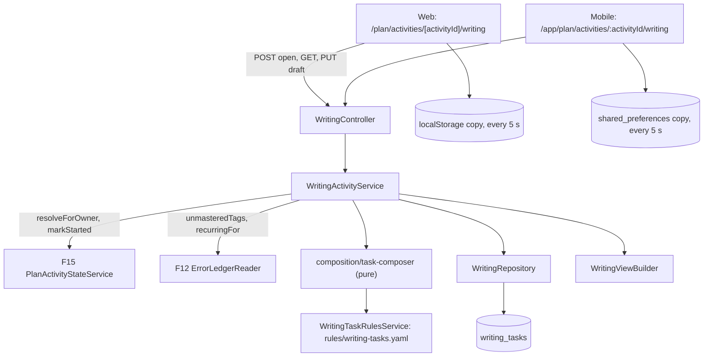
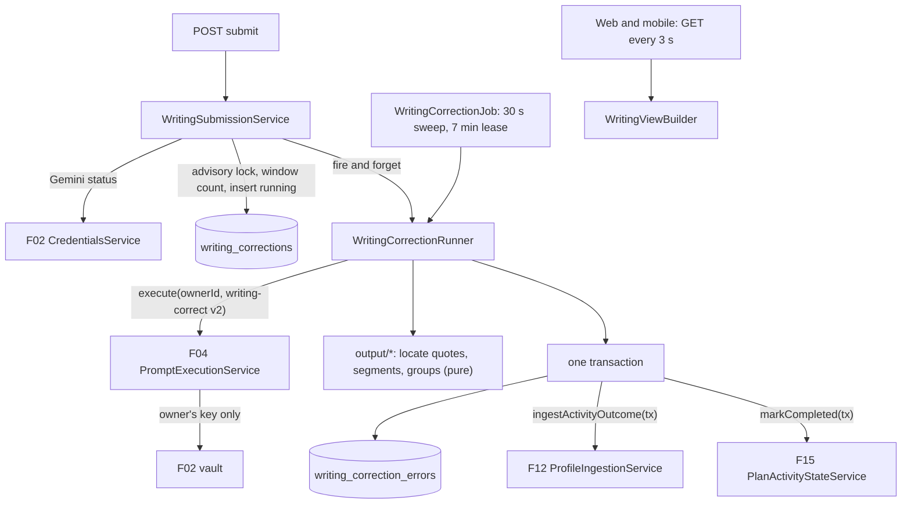
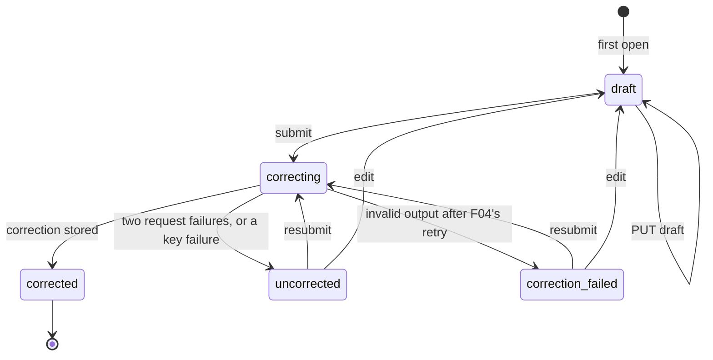

# Technical Specification: Writing Activity with AI Correction

## 1. Technical Overview

**Complexity:** complex. There are only four routes, but the feature adds three tables, a versioned rules file, a rewritten prompt, a background correction path on the owner's Gemini key, draft synchronisation across two clients with conflict detection, and one screen on each client.

**What:** The runner for the plan's `writing` activities, which are F15's task slots: a kind, 0–2 target tags and 15 estimated minutes, with no content item. The runner has five parts:

1. **Task composition.** The first time a writing activity is opened, the API composes its task statement from a versioned rules file, with no model call. The statement has three parts: a scenario (a situation, a genre and what to write), one requirement sentence per target tag that names the structure explicitly, and a closing line. Every combination is 80–150 words, and a boot check proves it. The target tags are the activity's own, checked again against the owner's ledger when the activity is opened. The task is stored with the rules version, so every device and every later visit sees the same task.
2. **Drafts.** Each task has one server-side draft with a revision counter. Clients save locally every 5 seconds and to the server every 30 seconds, and save again when the user leaves the screen. A save based on a stale revision is rejected and returns the newer server copy. The losing device surfaces it as `This draft was updated on another device.`
3. **Submission.** `Submit for correction` first saves the draft, then submits it by revision. The API checks the word count, the owner's Gemini key and the daily limit of 10 corrections. It then freezes the text and answers `correcting` straight away. The correction runs in the background through `PromptExecutionService.execute(ownerId, 'writing-correct', …)` at prompt version 2, and a failed request is retried once automatically. Both clients poll until it finishes.
4. **Outcome.** A successful correction stores the overall comment, the four 0–100 scores, the errors (each located verbatim in the learner's text), the revised version, and the prompt id and version. In the same transaction, it ingests the errors and three of the scores into F12 at activity weight 0.15, with Coherence recorded as Interaction. It also completes the plan activity through F15's state contract. A failed correction leaves the text saved, the plan activity `in_progress`, and a retry available.
5. **Screens.** The runner has a web page at `/plan/activities/[activityId]/writing` and a mobile page at `/app/plan/activities/:activityId/writing`, inside the Plan tab. The page has three views:
   - **Writing:** a task card, a full-height editor, a live word counter, a `Saved` indicator and the confirmation step.
   - **Checking:** `Checking your writing…`, with the text still visible.
   - **Result:** inline highlights with their details, a toggle to the revised version, four meters, and the error list grouped by tag with recurrence badges.

   Registering `writing` in both clients' activity route registries turns on F15's `Start session` for writing activities.

**Why:** The weight of the feature is in three properties:

- **The learner's text is never lost and never silently overwritten.** The local copy survives a closed tab or a dead battery. The server copy is what the other device resumes from. The revision number makes a stale write detectable, so a conflict is always shown to the user and never resolved on their behalf. Every failure path (missing key, limit reached, request failure, invalid output) leaves the text saved.
- **The user's Gemini quota is spent only on purpose.** The task costs no model call. A correction is one explicit, confirmed action. The automatic retry happens at most once per correction, and the daily limit caps an accidental loop at 10 requests.
- **A correction lands in the same profile as a lesson.** An error is ingested only when its quote is found verbatim in what the learner wrote and its tag comes from the taxonomy the schema allows. The scores move the same competencies as a lesson, at the activity weight. Writing therefore becomes evidence that F14, F15 and F20 read like any other.

**Scope — Included (full scope; the PRD has no Core/Full split for F17):**
- Task composition from `apps/api/rules/writing-tasks.yaml` (version 1). Every analysis-family tag in the taxonomy has its own requirement sentence, and there is a general requirement for owners with no unmastered analysis tag. The boot check proves that every scenario and tag combination falls within 80–150 words.
- Drafts: local autosave every 5 seconds and server autosave every 30 seconds, a flush when leaving and before submitting, resuming from the most recent server copy on either client, and conflict detection by revision.
- The live word counter and the 80-word submission minimum, enforced by the client and checked again by the server. A shared word-counting rule keeps TypeScript and Dart in agreement.
- The confirmation step, submission, the background correction with one automatic retry, the `uncorrected` and `correction_failed` states with the text preserved, and resubmission.
- `writing-correct` rewritten as version 2 to the PRD's output: an overall comment, Grammar, Vocabulary, Coherence and Task Achievement scored 0–100, errors with a verbatim quote, a taxonomy tag, a correction and an explanation, and a full revised text. A boot check pins the prompt's variables and its tag `enum` against the taxonomy.
- Output rules applied in code: verbatim quote location, a cap on the number of errors, de-duplication, highlight segments, revision segments, and grouping by tag with the ledger's recurrence.
- Ledger occurrences and profile measurements at weight 0.15 through F12's outcome ingestion contract, and plan completion through F15's state contract, in one transaction.
- The rolling daily limit of 10 correction requests per user, with the reset time.
- Retention: the submitted text, the correction and the revision stay readable from the plan and plan history, archived plans included.
- Web: the writing page and its components, plus two new primitives, `TextArea` and `Dialog`. Mobile: the writing page and its widgets. Both clients register `writing` in their activity route registries.

**Scope — Excluded:**
- The runners for objective, speaking and pronunciation activities (F16, F18). F17 only registers `writing`.
- A difficulty rating, skipping with a reason, and a "next activity" sequence after the result. The PRD gives these to F16's runner, not to writing. F15's `recordRating` and `markSkipped` already accept a writing activity, so they can be added later with no change to F17's data model (A21).
- Generating a task statement with a model. The PRD's nine prompts include no such prompt (A2).
- Linking a ledger example that came from a writing activity back to its result in F12's ledger sheet. F12's example view carries an `activityId` but not the activity's kind. Adding the kind is an F12 change that all three runners need, so it is a follow-up (§5 downstream notes).
- Changing F15's plan shape, its task slot titles or its composition. When F17 targets a different tag at open time, the plan's activity title is left as it is (A3).
- F20's charts. F20 reads F15's `PlanHistoryReader`, which picks up completed writing activities with no F17 change.

**Decisions not answered by the PRD, settled by the spec-writer Auto-Accept Policy (Batch Mode).** Every row names the policy row that produced it, so the user can review and override each one.

| # | Decision | Rationale | Policy row |
|---|---|---|---|
| A1 | **Full scope.** The PRD's F17 has neither a Core Scope nor a Full Scope block, so everything in F17's capabilities, experience and error handling is in scope | Skill rule: "PRD has no Core Scope / Full Scope blocks → assume full feature scope" | Scope (no split in the PRD) |
| A2 | **The task statement is composed deterministically from a versioned rules file.** The file holds scenarios (C1 genres: essay, formal letter, proposal, report, review, article), one requirement sentence per analysis-family tag, a general requirement and a closing line. The composer concatenates them, and no model call is made | F04 fixes the MVP at nine prompts, and none of them writes a task. The PRD keeps the draft usable "while the key is fixed", so drafting has to work without a key. A composed statement names the target structure verbatim, which is what "explicitly targets the user's weak structures" asks. It also spends no quota, and a boot check can prove the 80–150 range for every combination. A model-written task would have none of these properties | Technical decisions with a clear recommendation |
| A3 | **Target tags are checked again when the task is first opened.** The tags are the activity's own `targetTags` that are still unmastered analysis-family tags (grammar, vocabulary or discourse, never `phoneme:`), in the activity's order, at most 2. If none remain but the owner has other unmastered analysis tags, the composer uses the top-ranked one (F12's recurring order, then most recently seen). If the owner has no unmastered analysis tag, the task is general. The plan's activity title is not rewritten | This makes "the task statement targets at least one of the user's unmastered tags" hold when the task is written, not only when the plan was composed. A title that falls out of date in this rare case costs less than editing F15's plan | Partial PRD specifications |
| A4 | **One task per activity lineage, created on first open and reused afterwards.** A carried-over copy (F15, A13) reopens the same task and draft, because the task is looked up by every id in `resolveForOwner`'s lineage. Concurrent first opens are serialised by `SELECT … FOR UPDATE` on the resolved activity row, backed by a unique index. The first open calls F15's `markStarted` | This is F15's downstream note: follow the link to resume an attempt. A draft started last week must survive the plan that replaced it | Technical decisions with a clear recommendation |
| A5 | **Draft conflict detection is compare-and-set on a revision number.** The server holds one draft per task with a monotonic `draft_revision`, stamped with `draft_saved_at`. A save sends the `baseRevision` it started from. A stale base is rejected with `WRIT004` and the server copy, unless the incoming text is identical to the server's, in which case the save succeeds idempotently (this covers a retried request whose response was lost). The server copy is authoritative: it is always the last accepted write | This is the PRD's rule ("authoritative by last-write timestamp", "surfaced, never silently resolved"), made checkable. Comparing client clocks would let a device with a fast clock win silently | Partial PRD specifications |
| A6 | **Client reconciliation on open, focus and resume** follows one pure table, mirrored in TypeScript and Dart (§5): use the server copy, push local unsynced work, or show a conflict. While the conflict banner is shown, the editor is read-only and shows the server copy. `View your version` shows the local text with a `Copy` action. `Continue with the latest version` discards the local copy and unlocks the editor. The local copy is never discarded before the user acts | This is the PRD's "the option to view its local version before it is replaced". There is no "keep mine": the server copy is authoritative, and the user can copy their text back in | Partial PRD specifications |
| A7 | **Local copies** are stored in `localStorage` on the web and in `shared_preferences` on mobile (already a dependency). The key is `eq.writing.draft.<taskId>` and the value is `{ text, baseRevision, editedAt, pendingActiveSeconds }`. Every access is wrapped in try/catch. The copy is removed once a submission is accepted or the task is corrected. Keying by task id, not activity id, lets a carried-over activity find its local copy. After the first load, a failed server save keeps the editor working and shows `Saved on this device · not synced`. The first load still needs the network, and uses F03's `No connection` state | "Never lost to a closed tab, a dead battery". This is not the offline mode that `docs/context.md` rules out: nothing is cached for browsing, and only the unsent draft is kept | Partial PRD specifications |
| A8 | **Autosave cadence.** The client writes locally every 5 seconds while the text has changed since the last local write, and saves to the server every 30 seconds while it has changed since the last accepted server save. It also flushes both when the page is hidden or the app pauses (the web uses `fetch` with `keepalive`), and before a submission | These are the PRD's intervals. The flushes are what make the 30-second server interval safe when a tab is closed | Partial PRD specifications |
| A9 | **A submission is a flush followed by a submit by revision.** The body is `{ submissionId, baseRevision }`, and the server corrects its own draft at that revision. The client generates `submissionId`, and a repeated id returns the current state without creating a second correction request | The draft is always saved before anything can reject the submission, which satisfies both "the draft is saved for submission later" (limit) and "preserved untouched" (key): the rejected submission itself changes nothing. The id deduplicates a double tap or a retried request | Technical decisions with a clear recommendation |
| A10 | **The correction runs in the background.** The submit route returns `correcting` once the correction row is committed. The runner starts in-process straight away (F06's fire-and-forget boundary). A 30-second sweep reclaims any `running` correction whose 7-minute lease has expired, for example after an API restart (F15's lease idiom), and a status check inside the final transaction lets only one run store a result. Clients poll `GET` every 3 seconds | Correction takes about 30 seconds and can take minutes in the worst case: 2 requests × 2 schema attempts × 90 seconds. That is too long to hold an HTTP request open. The two existing background patterns conflict, so this combines the immediate start of the most frequent one with the lease of the most recent one | Multiple conflicting patterns in the codebase |
| A11 | **One automatic retry, 5 seconds after the first failure.** It covers timeouts, empty responses, provider and network errors, quota errors and other 4xx rejections. There is no automatic retry after a schema failure (F04 has already retried once, so the output is `invalid_output`) or after a key failure. A second request failure sets `uncorrected` | This is the PRD's split between "request fails or times out → retried once" and "schema validation twice → `correction_failed`" | Partial PRD specifications |
| A12 | **Writing status vocabulary.** A task is `draft`, `correcting`, `uncorrected`, `correction_failed` or `corrected`. `correction_failed` is the task's status, not a plan activity state: the plan activity stays `in_progress` and F15's four states are unchanged. Editing a failed text returns the task to `draft`, and a retry is a resubmission (a new correction request) | This keeps "the activity stays incomplete rather than consuming the attempt" true without widening F15's contract | Partial PRD specifications |
| A13 | **The raw response is also stored on the correction row** when the output is invalid. F04's telemetry row keeps its own copy, but that row has no link back to an activity | This is the PRD's "retained for the curator". F11 relied on the telemetry row alone, because a stage is keyed by lesson. A writing correction has no such key, so the telemetry row alone cannot be found again | Multiple conflicting patterns in the codebase |
| A14 | **The daily limit is 10 correction requests per user in a rolling 24-hour window.** Every accepted submission or resubmission counts, whatever its outcome. The automatic retry is part of the same request. A submission rejected before any model call (for the key, the length, a conflict or the limit itself) does not count. The reset time is the moment the oldest counted request leaves the window. Submissions are serialised per user by an advisory lock, so two devices cannot both take the tenth slot. **Review this one:** the alternative is a calendar day in the device's time zone | The server does not know the user's time zone, and a rolling window is identical on both clients. A request that failed still spent quota, and the PRD's reason for the limit is "an accidental loop" | Partial PRD specifications |
| A15 | **Profile mapping.** Grammar goes to `grammar`, Vocabulary to `vocabulary` and Coherence to `interaction`, and F12 applies the 0.15 weight from the source kind. Task Achievement is stored on the correction only. The acceptance criterion's "the four scores update the profile" is read as: three mapped scores update it, and the fourth is kept with the correction. **Review this one** | The PRD's mapping names three targets, and F12's downstream note says "Task Achievement is not a profile competency" | Partial PRD specifications |
| A16 | **No correct encounters are sent from writing.** `correctEncounters` is always empty | The PRD's correction output does not show whether a target structure was used correctly. Inferring correct use from the absence of an error would count a structure the learner simply avoided as mastered evidence | Technical decisions with a clear recommendation |
| A17 | **Errors are accepted only when located.** The code caps the list at 30, with no `maxItems` in the schema because of F11's live finding. Each quote is located in the submitted text (exact match first, then a word-token match that ignores case, curly apostrophes and spacing). The stored quote is the text's own span, so it is verbatim by construction. An unlocated quote is discarded (not highlighted and not ingested) and counted. An error is also discarded when its quote or correction exceeds 500 characters (F12's contract bound). Duplicates of the same span and tag are dropped. Errors are ordered by position in the text | This is F11's quote discipline applied to a text instead of utterances. A quote that is not the learner's own words must not reach the ledger | Technical decisions with a clear recommendation |
| A18 | **Recurrence badges.** Before ingestion, the runner snapshots each error tag's ledger occurrence count (`prior`). A tag group carries `{ count: prior + group size, label: '4th time' }` (F19's `ordinalTimes`) when `prior ≥ 1`, and no badge otherwise. The snapshot is stored, so the badge never changes afterwards | This is the PRD's "recurrence badges where the tag is already in the ledger", worded like F19's badge and stable like F19's `occurrencesThrough` | Partial PRD specifications |
| A19 | **Length bounds.** A submission needs at least 80 words (client and server) and at most 600 words (server; the client disables submission above it). A draft is at most 10,000 characters. Words are counted by one rule, in the shared package and its Dart mirror, pinned by one test table: a word is a run of letters or digits, which may contain an internal apostrophe or hyphen | The PRD gives the minimum only. A maximum bounds the prompt and the revised output (well above the 250 words the task asks for), and one rule stops the two clients from disagreeing about the 80th word | Partial PRD specifications |
| A20 | **Time spent.** Clients count the seconds the writing screen is visible and send them with each draft save as `activeSecondsDelta` (0–600). The task accumulates them, and at completion they become F15's `timeSpentSeconds` | F15's session summary adds up `timeSpentSeconds`, and a writing activity should not read as zero minutes. Counting on the client is the only honest measure across two devices and several days | Technical decisions with a clear recommendation |
| A21 | **Routes, and where F17 may converge with its siblings.** The API routes are `/activities/:activityId/writing`, with `/open`, `/draft` and `/submit`. The web route is `/plan/activities/[activityId]/writing`, and the mobile route is `/app/plan/activities/:activityId/writing` in the Plan module. **Assumed and not specified here:** F16 and F18 may define a generic activity route or a session runner with "next activity", a difficulty rating and a skip action. F17's routes nest beneath such a route with no change, and its result's `Back to today` can adopt a "next activity" action when one exists | F17 must not specify sibling behaviour. Nesting under `activities/:activityId` avoids a path collision whatever F16 chooses, and a runner inside the Plan tab keeps the bottom navigation and the `Plan` pill active, as lesson detail does in the Lessons tab | Technical decisions with a clear recommendation |
| A22 | **Error codes.** An unknown activity id, another user's activity, or an activity that is not `writing` all return F15's `PLAN003`. A write on an archived plan the activity was not carried out of returns `PLAN004`. The new codes are `WRIT001`–`WRIT007` (§5) | F15 defined `PLAN003` and `PLAN004` for the runners. One code per new failure mode, per the root `AGENTS.md` | Technical decisions with a clear recommendation |
| A23 | **Prompt version 2 shape.** `scores` is a keyed object with four required integer keys. `errors[]` has no `maxItems`, and its `tag` `enum` is exactly the taxonomy's analysis tags. The variables are `task_statement`, `target_structures`, `submission` and `taxonomy`. The model is `gemini-3.6-flash`, with `temperature: 0.3` and `max_output_tokens: 8192`. No profile summary and no other participant's data enter the prompt | A keyed object guarantees exactly one of each score, as in F11's version 2. The token budget follows F11's finding that thinking tokens count against output. The owner's own text and task are all the correction needs | Technical decisions with a clear recommendation |
| A24 | **Result segments are built on the server.** The server builds the highlight segments of the original, the revision segments (a whitespace-preserving word LCS that reuses F19's match key), each error's `correctionSegments` (F19's function) and the tag groups | This is F19's precedent (A15): web and mobile emphasise exactly the same words | Technical decisions with a clear recommendation |
| A25 | **New web primitives `TextArea` and `Dialog`, and no mockup.** The web has no textarea and no dialog primitive; two ad-hoc modals exist already. Both new primitives go into `components/ui`, with gallery sections. Mobile uses a `TextField` themed by `EqTheme` and bottom sheets (the `mobile-ui` guide). There is no mockup for this screen in `design/`, so it is composed from primitives, and `design/README.md` gets no row. If a Wave 12 sibling adds a `Dialog` first, F17 reuses it | "Extend a primitive before hand-rolling a one-off" (`apps/web/AGENTS.md`). Design fidelity cannot apply without a mockup, and composing from primitives is `mobile-ui` step 3 | No codebase patterns found |
| A26 | **No new dependency and no new environment variable.** Every number is a constant in the shared package or `writing.constants.ts`, or lives in the rules file | These are the PRD's fixed values and the rules file's content, not deployment settings (F12's reasoning) | Technical decisions with a clear recommendation |
| A27 | **Replaced plans.** A task whose activity's plan is archived and not carried forward is read-only: it can be opened and read, but a save or submit returns `PLAN004`. A correction that finishes after its plan was replaced still stores its result and reaches the profile, but it does not call `markCompleted`, which F15 would reject | The learning evidence is real, and the activity it belonged to can no longer change state | Partial PRD specifications |
| A28 | **Task card default.** The task card is expanded when the draft is empty and collapsed when resuming a draft that already has text. `Show task` and `Hide task` toggle it | This is the PRD's "collapsible once reading is done": a returning writer gets the full editor height | Partial PRD specifications |
| A29 | **Tables are plural** (`writing_tasks`, `writing_corrections`, `writing_correction_errors`) and use `ck_`, `ux_` and `ix_` names. The migration took the next free number, `0016`, on `main` as it stood when this spec was written; F18 merged into `main` first and also claimed `0016`, so this feature's migration was renumbered to `0017` when merging — exactly the contingency this row anticipated ("take the next free number if a Wave 12 sibling lands first") | This is the schema's majority convention (F12, F14, F15) | Multiple conflicting patterns in the codebase |

**Traceability (PRD block → spec section):**

| PRD block | Where it lands |
|---|---|
| Consumes (F02 Gemini key and validity) | A9, A14, §5 submission checks (`WRIT002`), the runner's key classification, the BYOK integration tests |
| Consumes (F04 prompt execution, prompt id and version) | A23, §5 prompt v2, the runner, the stamp columns on `writing_corrections` |
| Consumes (F12 taxonomy and outcome ingestion) | A3, A15–A18, §5 outcome mapping, the task rules boot check |
| Consumes (F15 activity entries and state contract) | A4, A12, A20, A27, §5 open and completion, the route registries |
| Consumes (F21 tokens, primitives, page states) | A25, §4 web and mobile components |
| Capabilities | §5 composition, drafts, submission, correction, limit; §6 |
| Experience | §4 screen states, web and mobile components, A6, A28 |
| Error Handling | §4 failure modes, A5, A10–A14 |
| F17 acceptance criteria | §7 acceptance table |
| Cross-Feature Integration criteria (F04 stamp, F02 keys, F12 ingestion, F15 state, F21 screens) | §7 cross-feature table |

## 2. Architecture Impact

**Affected components:**

| Area | Path |
|---|---|
| API: writing domain | `apps/api/src/writing/**` |
| API: boot, wiring, errors, OpenAPI | `apps/api/src/boot/verify-writing-prompt.ts`, `main.ts`, `app.module.ts`, `common/app-error.ts`, `openapi/components.ts`, `openapi/setup.ts` |
| API: finished features reused | `apps/api/src/analysis/correction-diff.ts` (one additive export), `analysis/recurrence-label.ts`, `plans/plan-activity-state.service.ts`, `profile/profile-ingestion.service.ts`, `profile/error-ledger.reader.ts`, `credentials/credentials.service.ts`, `prompts/prompt-execution.service.ts` |
| Prompt and rules | `apps/api/prompts/writing-correct.yaml` (version `"2"`), `apps/api/rules/writing-tasks.yaml` (new, version `"1"`) |
| Database | `apps/api/prisma/schema.prisma`, `apps/api/prisma/migrations/0017_writing_activities/migration.sql` |
| Shared contracts | `packages/shared/src/schemas/writing.ts`, `errors/codes.ts`, `index.ts` |
| Web | `apps/web/src/app/(app)/plan/activities/[activityId]/writing/**`, `components/writing/**`, `components/ui/text-area.tsx`, `components/ui/dialog.tsx`, `lib/writing*.ts`, `lib/activity-routes.ts`, the design-system gallery |
| Mobile | `apps/mobile/lib/features/writing/**`, `features/plan/activity_routes.dart`, `features/plan/plan_module.dart` |
| Docs | `docs/api/openapi.json`, dated notes in the progress files of F04, F12, F15 and F19, `.claude/rules/prompts.md` |

**Opening a task and saving drafts:**



**Submitting and correcting:**



**Task status:**



## 3. Technical Decisions

| Decision | Chosen Approach | Alternative Considered | Trade-off |
|---|---|---|---|
| Where the task statement comes from | Composed in code from a versioned rules file of scenarios and per-tag requirement sentences | A tenth prompt (`writing-task`) called on open, or tasks generated in F14's batch | The statements are less varied than a model's: 12 scenarios × the owner's tags. In exchange there is no quota and no key needed to start writing, a guaranteed 80–150 words, the structure named verbatim, and no change to F04's nine prompts or to F14 and F15 |
| Detecting a draft conflict | Compare-and-set on a server revision, with identical text treated as idempotent | Last-write-wins on client timestamps, or merging | A device that saves second must ask the user. That is exactly the PRD's "surfaced, never silently resolved", and it ignores clock skew |
| Running the correction | A background run started at once, a lease and a sweep, and clients polling | Holding the HTTP request open, or a BullMQ job | Clients poll every 3 seconds. In exchange no request lives for minutes, a restart loses nothing, and a correction needs no second queue beside the pipeline's |
| A correction's lifecycle | A writing task status beside F15's untouched activity states | Adding `correction_failed` to F15's activity states | The plan shows `In progress` for a failed correction. In exchange F15's contract, its CHECK constraints and both clients' state badges stay as they are |
| What the daily limit counts | Correction requests (rows) in a rolling 24 hours, serialised per user | Calendar-day successes only | A failed request uses up one of the 10. That is deliberate: it spent quota, and loops are what the limit is for |
| Error positions for highlights | Located in code against the submitted text, and the text's own span is stored | Asking the model for character offsets | Some model errors are discarded as unlocatable. Every highlight and every ledger quote is then the learner's own words, and a model's offset arithmetic is never trusted |

## 4. Component Overview

**API: writing domain (`apps/api/src/writing/`, `WritingModule`).** It imports `TaxonomyModule`, `ProfileModule` and `PlansModule`. Prisma, Credentials and Prompts are global.

| File Path | New/Modified | Purpose | Key Responsibilities |
|---|---|---|---|
| `writing.module.ts` | New | Wiring | Provides everything below and the controller. Exports nothing, because no other feature calls into writing |
| `writing.constants.ts` | New | Fixed values | `WRITING_TASK_RULES_PATH`, `WRITING_MAX_ERRORS` (30), `WRITING_CORRECTION_LEASE_MS` (7 min), `WRITING_SWEEP_INTERVAL_MS` (30 s), `WRITING_SWEEP_BATCH` (5), `WRITING_AUTO_RETRY_DELAY_MS` (5 s), `WRITING_LIMIT_LOCK_NAMESPACE` (`writing-limit:`), the score labels and order, and the failure messages (§5). The timing values are read through an injectable options provider so the integration suites can shorten them, as F15's fast retry policy does |
| `rules/writing-task-rules.ts` | New | Rules file | A strict Zod schema for `writing-tasks.yaml`, the cross-field checks (§5), `rulesFingerprint`, and `loadWritingTaskRulesFile`, which throws `WritingTaskRulesValidationError` listing every issue. Follows `plans/rules/plan-rules.ts` |
| `writing-task-rules.service.ts` | New | Rules in force | `OnModuleInit` loads the file and checks it against the taxonomy in force: every analysis tag has exactly one requirement and no requirement names another tag. It checks the word bounds of every combination. An invalid file stops the boot, and the log line names the version, the fingerprint and the scenario count |
| `composition/task-composer.ts` | New | Pure | `composeTask({ activityId, activityTags, unmasteredRanked, recentScenarioIds, rules, labelOf })` returns `{ heading, statement, statementWords, targetTags, scenarioId }` (§5 algorithm, A3) |
| `output/quote-locator.ts` | New | Pure | `locateQuote(text, quote, claimed)` returns `{ start, end }` or null: exact match first, then a word-token match (A17). It uses `countWords`'s token rule and F11's normalisation |
| `output/writing-output.ts` | New | Pure | `processCorrectionOutput({ raw, submittedText, analysisTags })` returns the accepted errors (quote taken from the text's own span, tag, correction, explanation, offsets, ordered by position) and `discardedErrorCount` (A17) |
| `output/highlight-segments.ts` | New | Pure | `highlightSegments(text, errors)` returns `[{ text, errorIndexes }]`, whose texts concatenate back to the text exactly. Overlapping errors share a segment |
| `output/revision-diff.ts` | New | Pure | `revisionSegments(original, revised)` returns `[{ text, changed }]`, whose texts concatenate back to the revised text exactly. It uses a word LCS with F19's `matchKey`, and whitespace and paragraph breaks are kept on unchanged segments (A24) |
| `output/error-groups.ts` | New | Pure | `groupErrors(errors, priorCounts, labelOf)` returns `[{ tag, tagLabel, errorIndexes, recurrence }]`, ordered by group size and then first position (A18) |
| `correction/correction-error.ts` | New | Pure | `classifyCorrectionError(error)` returns `{ kind: 'gemini_key' \| 'invalid_output' \| 'retryable', attemptOutcome, detail, rawResponse? }`. Follows F14's `classifyGenerationError` (A11) |
| `correction/correction-prompt-variables.ts` | New | Prompt input | Renders `task_statement`, `target_structures`, `submission` and `taxonomy` (§5), using only the task owner's own task and text |
| `correction/correction-outcome.ts` | New | Pure | `toActivityOutcome(correction, errors, resolvedActivityId)` builds F12's `ActivityOutcomeInput` (A15, A16) |
| `correction/writing-correction.runner.ts` | New | Background run | `runClaimed(correctionId)` and `claimAndRun(correctionId, now)`. It runs up to two requests with the retry delay, classifies failures, and settles success or failure in one transaction (§5). It catches and logs its own errors and never throws into a request |
| `correction/writing-correction.job.ts` | New | Recovery | `@Interval` every 30 seconds. `run(now)` claims up to 5 `running` corrections whose lease has expired and runs them. One failure never stops the tick |
| `writing-limit.ts` | New | Pure | `limitState(requestedAt[], now)` returns `{ max, used, resetsAt }` for the rolling window (A14) |
| `writing.repository.ts` | New | Persistence | Task lookup by lineage, with the resolved activity row locked `FOR UPDATE`. Task insert, compare-and-set draft update, correction insert, lease claim, window count, and error inserts. Every method takes a transaction client when one is passed |
| `writing-activity.service.ts` | New | Route logic | `open(userId, activityId, now)`, `read(userId, activityId, now)` and `saveDraft(userId, activityId, input, now)`. Resolves through F15, checks the kind and plan status, composes on first open, and calls `markStarted` |
| `writing-submission.service.ts` | New | Route logic | `submit(userId, activityId, input, now)`. Runs the checks in the order §5 gives, inserts the correction under the per-user advisory lock, moves the task to `correcting`, and starts the runner without awaiting it |
| `writing-view.builder.ts` | New | Read model | Maps a task, its latest and succeeded corrections, their errors, the Gemini status and the limit state to `WritingActivityView`. Segments and groups are computed at read time from the stored text, offsets and prior counts |
| `writing.controller.ts` | New | HTTP surface | The four routes in §5 with their OpenAPI decorators, under the `writing` tag. `@HttpCode(200)` on both POSTs |

**API: changes elsewhere:**

| File Path | New/Modified | Purpose | Key Responsibilities |
|---|---|---|---|
| `apps/api/prompts/writing-correct.yaml` | Modified (version `"2"`) | The prompt | §5. Supersedes F04's version 1 (1–5 scores, no tags) |
| `apps/api/rules/writing-tasks.yaml` | New (version `"1"`) | Task rules | §5: 12 scenarios, 36 requirements (one per analysis tag in taxonomy version 2), the general requirement and the closing line |
| `apps/api/src/boot/verify-writing-prompt.ts` | New | Boot check | Checks that the declared variables equal what `correction-prompt-variables.ts` renders, that the `errors[].tag` `enum` equals the taxonomy's analysis tags, that `scores` requires exactly the four keys, that `errors` has no `maxItems`, and that at least one example exists. Otherwise it throws `WritingPromptMismatchError` listing every issue. Mirrors `verify-analysis-prompt.ts` and `verify-plan-prompt.ts` |
| `apps/api/src/main.ts` | Modified | Boot order | Calls `verifyWritingPrompt` after `verifyPlanPrompt` |
| `apps/api/src/app.module.ts` | Modified | Root | Imports `WritingModule` |
| `apps/api/src/common/app-error.ts` | Modified | Factories | `writingTaskNotStarted()`, `writingGeminiKeyRequired()`, `writingDailyLimit(details)`, `writingDraftConflict(draft)`, `writingTooShort(words)`, `writingTooLong(words)`, `writingAlreadySubmitted()` |
| `apps/api/src/openapi/components.ts`, `openapi/setup.ts` | Modified | Document | `WritingActivityView`, `WritingDraftSaved`, `SaveWritingDraftInput`, `SubmitWritingInput`, `WritingLimitDetails` and `WritingDraftConflictDetails`, generated from the shared Zod schemas, plus the `writing` tag |
| `apps/api/src/analysis/correction-diff.ts` | Modified (additive) | Reuse | Exports `matchKey`, so `revision-diff.ts` compares words exactly as F19's correction segments do. `correctionSegments` is unchanged |

**Shared (`packages/shared/src/`):**

| File Path | New/Modified | Purpose | Key Responsibilities |
|---|---|---|---|
| `schemas/writing.ts` | New | Contracts | `writingTaskStatusSchema`, `writingScoreDimensionSchema`, `writingFailureCodeSchema`, `writingTaskViewSchema`, `writingDraftViewSchema`, `writingScoreViewSchema`, `writingErrorViewSchema`, `writingErrorGroupViewSchema`, `writingHighlightSegmentSchema`, `writingRevisionSegmentSchema`, `writingCorrectionViewSchema`, `writingFailureViewSchema`, `writingLimitViewSchema`, `writingActivityViewSchema`, `saveWritingDraftSchema`, `writingDraftSavedSchema`, `submitWritingSchema`, `writingLimitDetailsSchema` and `writingDraftConflictDetailsSchema`, with their types. The constants `WRITING_MIN_SUBMIT_WORDS` (80), `WRITING_EXPECTED_WORDS` (120–250), `WRITING_MAX_SUBMIT_WORDS` (600), `WRITING_DRAFT_MAX_CHARS` (10,000), `WRITING_TASK_WORDS` (80–150), `WRITING_DAILY_CORRECTION_LIMIT` (10), `WRITING_LIMIT_WINDOW_HOURS` (24), `WRITING_LOCAL_SAVE_INTERVAL_MS` (5,000), `WRITING_SERVER_SAVE_INTERVAL_MS` (30,000), `WRITING_POLL_INTERVAL_MS` (3,000) and `WRITING_ACTIVE_SECONDS_MAX_DELTA` (600). `countWords(text)` and `wordTokens(text)`, the one counting rule (A19). Reuses `planTagSchema`, `planActivityStateSchema`, `correctionSegmentSchema` and `errorRecurrenceSchema` |
| `errors/codes.ts` | Modified | Codes | `WRIT001`–`WRIT007` with status and message (§5) |
| `index.ts` | Modified | Exports | The writing schemas, constants and counter |

**Web (`apps/web/src/`):**

| File Path | New/Modified | Purpose | Key Responsibilities |
|---|---|---|---|
| `app/(app)/plan/activities/[activityId]/writing/page.tsx` | New | Route | A server component that renders `WritingScreen` with the id. Metadata title `Writing · English Quest`. It sits under the `Plan` pill's prefix |
| `components/writing/writing-screen.tsx` | New | Screen | Opens the activity on mount (`POST …/open`) and switches on the result: `LoadingState`, `ErrorState` (`PLAN003`: `This activity could not be found.`; `PLAN004`: `This activity is no longer in your current plan.`; each with a link to the plan), the editor (`draft`, `uncorrected`, `correction_failed`), `CheckingPanel` (`correcting`, polling), `WritingResult` (`corrected`), or the read-only editor (`readOnly`) |
| `components/writing/use-writing-activity.ts` | New | Hook | Open, poll `GET` every 3 seconds while `correcting`, submit (flush, then `POST …/submit` with a new `submissionId`), and map error codes to screen notices |
| `components/writing/use-writing-draft.ts` | New | Hook | Reconciles on open, focus and visibility (§5 table). Writes locally every 5 seconds and to the server every 30 seconds while the text has changed. Flushes on `visibilitychange` and `pagehide` (the server save with `keepalive`). Accumulates visible seconds, enters the conflict state on `WRIT004` and pauses autosave while in it. Exposes `saveState` (`saved`, `saving`, `local_only`, `conflict`) and `savedAt` |
| `components/writing/writing-task-card.tsx` | New | Task | The heading, the statement (with line breaks kept) and the target tags as `Chip`s. A `Show task` / `Hide task` disclosure (`aria-expanded`), with the default from A28 |
| `components/writing/writing-editor.tsx` | New | Editor | `TextArea` at full height, then a sticky footer holding `WordCounter`, `SaveIndicator` and the primary `Submit for correction`. The key and limit notices, the failure banner and `DraftConflictBanner` sit above it. Read-only while `correcting`, in conflict, or when `readOnly` |
| `components/writing/word-counter.tsx` | New | Counter | `42 of 80 words` in `on-surface-variant` below the threshold. `96 words` in `tertiary` with a check icon at or above it. `Aim for 120–250 words.` as a neutral hint above 250, and `Too long to correct: keep it under 600 words.` in `error` above 600. A visually hidden `aria-live="polite"` region announces only threshold crossings |
| `components/writing/save-indicator.tsx` | New | Indicator | `Saved {relative}` (the shared `formatRelativeTime`, refreshed every 15 seconds), `Saving…`, or `Saved on this device · not synced`. Subtle `label-md` in `on-surface-variant` |
| `components/writing/writing-notices.tsx` | New | Notices | Missing key: `Add your Gemini key to have your writing corrected.` with a `Go to settings` link to `/settings`, and submission disabled. Limit reached: `You have reached today's limit of 10 corrections.` with `Resets at {time}`, or `Resets tomorrow at {time}` when it falls on the next local day. Failures: the server's message with `Retry correction` |
| `components/writing/draft-conflict-banner.tsx` | New | Conflict | `This draft was updated on another device.` (or `This draft was submitted from another device.`), with `View your version` (a read-only panel of the local text and a `Copy` button) and `Continue with the latest version` (or `Dismiss`) |
| `components/writing/submit-dialog.tsx` | New | Confirmation | Uses `Dialog`. Title `Submit for correction?`. Body `Your text will be corrected with your Gemini key. Once submitted, it can’t be edited or undone.` Buttons `Cancel` and `Submit` (loading while flushing and submitting) |
| `components/writing/checking-panel.tsx` | New | Checking | `Checking your writing…` with a spinner (`LoadingState` inline) above the read-only text |
| `components/writing/writing-result.tsx` | New | Result | An `Overall` card with the comment. A two-button toggle (`Your text` / `Revised version`, `aria-pressed`). `HighlightedText` or `RevisedText`. `WritingScoreMeters`. `WritingErrorGroups`. Actions `Back to today` (primary) and `See the full plan` |
| `components/writing/highlighted-text.tsx` | New | Highlights | Renders the segments. A highlighted segment is a `button` with `aria-expanded`, styled `bg-badge-danger-bg text-badge-danger-fg` with an underline. Click, Enter or hover opens a popover (`role="dialog"`, labelled by the tag) listing each covering error's tag chip, correction (changed words emphasised) and explanation. Escape or clicking outside closes it |
| `components/writing/revised-text.tsx` | New | Revision | Renders the revision segments as continuous prose, with changed spans in `font-bold text-primary` and underlined, as `ErrorCard` does. A visually hidden legend explains the emphasis |
| `components/writing/writing-score-meters.tsx` | New | Scores | Four `Meter`s (Grammar, Vocabulary, Coherence, Task achievement), with no delta |
| `components/writing/writing-error-groups.tsx` | New | Errors | One section per tag: the tag `Chip` linking to `/profile?tag=`, a `Badge` for the recurrence label, and a count. Each error shows its quote in quotation marks, the correction with the changed spans emphasised, and the explanation. `EmptyState` with `No errors found in this text.` when there are none |
| `components/ui/text-area.tsx` | New | Primitive | A `Field`-based `textarea` with label, hint, error, `aria-describedby`, `readOnly` presentation, and a `fill` option that grows to the available height. Tokens only |
| `components/ui/dialog.tsx` | New | Primitive | A modal with `role="dialog"`, `aria-modal` and `aria-labelledby`. Focus moves into it on open and returns on close, Escape closes it, and the backdrop comes from token roles. Follows the behaviour of `LedgerEntrySheet` and `EndLessonDialog` without changing either |
| `components/ui/index.ts` | Modified | Barrel | Exports `TextArea` and `Dialog` |
| `app/(dev)/design-system/page.tsx`, `sections/text-area-section.tsx`, `sections/dialog-section.tsx` | Modified / New | Gallery | The two primitives in their states |
| `lib/writing.ts` | New | Browser calls | `openWriting(id)`, `getWriting(id)`, `saveWritingDraft(id, input, { keepalive? })` and `submitWriting(id, input)` over `apiFetch` |
| `lib/writing-draft-store.ts` | New | Local copy | `readLocalDraft(taskId)`, `writeLocalDraft(taskId, value)` and `clearLocalDraft(taskId)` over `localStorage`, each wrapped in try/catch (A7) |
| `lib/writing-draft-reconcile.ts` | New | Pure | `reconcileDraft(local, server)` returns `use_server`, `use_local`, `conflict` or `submitted_elsewhere` (§5 table). The Dart mirror has the same test table |
| `lib/activity-routes.ts` | Modified | Registry | Registers `writing: (activity) => /plan/activities/${activity.id}/writing`. This turns on `Start session` and the activity links for writing |

**Mobile (`apps/mobile/lib/`).** There is no mockup (`mobile-ui` step 3): the screen is composed from `Eq*` widgets and the web screen above.

| File Path | New/Modified | Purpose | Key Responsibilities |
|---|---|---|---|
| `features/writing/writing_models.dart` | New | Models | Hand-written mirrors of every schema in `schemas/writing.ts`, with tolerant enum parsing as in `plan_models.dart`, and the shared constants |
| `features/writing/word_count.dart` | New | Counter | `countWords`: the shared rule with a Unicode `RegExp`, tested with the TypeScript table |
| `features/writing/draft_reconcile.dart` | New | Pure | `reconcileDraft`, with the web's test table |
| `features/writing/writing_api.dart` | New | API | `open`, `get`, `saveDraft` (PUT, which `RetryInterceptor` may retry safely thanks to A5's idempotent case) and `submit` on the shared `Dio`. Errors become `ApiException`s carrying `code` and `details` |
| `features/writing/writing_draft_store.dart` | New | Local copy | The same key and JSON value as the web, on `SharedPreferences`, with read, write and clear wrapped against platform exceptions |
| `features/writing/writing_controller.dart` | New | State | A `GetxController`: loading, error and ready states, the task status, the text, `saveState`, `savedAt`, `conflict`, and notices. Timers for the 5-second local save, the 30-second server save and the 3-second poll while `correcting`. An `AppLifecycleListener` flushes on pause and reconciles on resume. It counts visible seconds and submits with a new `submissionId` |
| `features/writing/writing_page.dart` | New | Screen | `Scaffold` and `SafeArea` with an app bar (the activity title, and back, which pops when possible and otherwise goes to `/app/today`). The body switches on state like the web: `EqLoading`, `EqError` (the `ApiException` message, with `No connection` on first load), the editor, the checking view, the result, or read-only |
| `features/writing/widgets/writing_task_card.dart` | New | Task | `EqCard` with the heading, statement, tag `EqChip`s and the `Show task` / `Hide task` toggle (A28) |
| `features/writing/widgets/writing_editor.dart` | New | Editor | A multi-line `TextField` themed by `EqTheme` that expands to fill the space above a bottom bar. The bar holds `WordCounter`, `SaveIndicator` and the full-width `EqButton` `Submit for correction`, and stays above the keyboard (`viewInsets`), so the keyboard's toolbar never covers the counter |
| `features/writing/widgets/word_counter.dart`, `save_indicator.dart` | New | Counter, indicator | The web's copy and colour roles (`EqLightColors` / `EqDarkColors` `onSurfaceVariant`, then `tertiary`) and a `Semantics` live region on threshold crossings |
| `features/writing/widgets/writing_notices.dart`, `draft_conflict_banner.dart` | New | Notices | The web's copy. The key notice navigates to `/app/settings`, and `Copy` uses `Clipboard.setData` |
| `features/writing/widgets/submit_confirmation_sheet.dart` | New | Confirmation | A bottom sheet with the web dialog's copy and a full-width `Submit` over `Cancel` (web dialogs become bottom sheets under the `mobile-ui` guide) |
| `features/writing/widgets/checking_view.dart` | New | Checking | `Checking your writing…` with the read-only text |
| `features/writing/widgets/writing_result_view.dart`, `highlighted_text.dart`, `error_detail_sheet.dart`, `revised_text.dart`, `writing_error_groups.dart` | New | Result | `Text.rich` spans. A tap on a highlight (a `TapGestureRecognizer` with `Semantics`) opens a bottom sheet with the tag, correction and explanation. A two-option toggle built from `EqButton` variants. Four `EqMeter`s. Groups with `EqChip` and `EqBadge`. `EqEmpty` when there are no errors |
| `features/plan/activity_routes.dart` | Modified | Registry | Registers `writing: (activity) => '/app/plan/activities/${activity.id}/writing'` |
| `features/plan/plan_module.dart` | Modified | Route | Adds `/activities/:activityId/writing`, declared before `/:planId` |

**Docs:**

| File Path | New/Modified | Purpose | Key Responsibilities |
|---|---|---|---|
| `docs/api/openapi.json` | Regenerated | Snapshot | The four routes and their components |
| `docs/F04-prompt-library/progress.md` | Modified | Dated note | `writing-correct` is now version 2 and supersedes the version 1 shape F04 described. F17 persists the prompt id and version on `writing_corrections` |
| `docs/F12-learning-profile-and-error-ledger/progress.md` | Modified | Dated note | F17 is a caller of `ingestActivityOutcome`: activity type `writing`, three measurements, occurrences with quotes, and no encounters |
| `docs/F15-study-plan-generation/progress.md` | Modified | Dated note | `writing` is registered in both route registries, so `Start session` appears for writing activities. F17 calls `resolveForOwner`, `markStarted` and `markCompleted` (with a `timeSpentSeconds`) |
| `docs/F19-lesson-history-and-individual-results/progress.md` | Modified | Dated note | `matchKey` is exported from `correction-diff.ts` for F17's revision segments, and `ordinalTimes` is reused for writing badges |
| `.claude/rules/prompts.md` | Modified | Authoring rule | One bullet: `writing-correct` takes the task, target structures, the owner's text and the taxonomy listing, and a boot check pins its variables, its four score keys and its tag `enum` |

**Database:**

| Migration File | Tables Affected | Operation | Notes |
|---|---|---|---|
| `apps/api/prisma/migrations/0017_writing_activities/migration.sql` | `writing_tasks`, `writing_corrections`, `writing_correction_errors` | CREATE | `main` holds `0001`–`0015`. Take the next free number if a Wave 12 sibling lands first |

**Screen states (both clients):**

| Task state | What the screen shows | Primary action |
|---|---|---|
| Loading | Skeleton or `EqLoading` | — |
| First load failed | `ErrorState` / `EqError` naming the cause (`No connection`, `Server unavailable`, not found, no longer in plan) | `Retry` or `Back to plan` |
| `draft`, below 80 words | Task card, editor, `n of 80 words`, `Saved …` | `Submit for correction`, disabled |
| `draft`, 80 to 600 words | Counter in `tertiary` | `Submit for correction`, which opens the confirmation |
| Gemini key not usable | The PRD's key sentence with the settings link | Submit disabled |
| Limit reached | The PRD's limit sentence with the reset time | Submit disabled until the reset |
| Conflict | Banner, editor read-only with the server copy | `Continue with the latest version` |
| `correcting` | `Checking your writing…` with the text | — (polling) |
| `uncorrected` | `Correction failed. Your text is saved — retry when ready.`, or the key sentence | `Retry correction` |
| `correction_failed` | `The correction came back in an unexpected format. Your text is saved — retry when ready.` | `Retry correction` |
| `corrected` | Result | `Back to today` |
| `readOnly` | The task and the draft or the result, with no editing | `Back to plan` |

**Failure modes:**

| Scenario | Behaviour | Surfaced as |
|---|---|---|
| Gemini key missing or invalid at submission | Rejected before any write. The draft (already saved by the flush) is untouched, and nothing counts toward the limit | `WRIT002`: `Add your Gemini key to have your writing corrected.` with the settings link |
| Key rejected by Gemini during the run | F02 marks it `invalid`. No automatic retry. The task is `uncorrected` with `failure.code = gemini_key` | The same sentence and link, and `Retry correction` once the key is fixed |
| Timeout, empty response, 5xx, network or quota on the first request | Retried once after 5 seconds | Nothing: still `Checking your writing…` |
| The same on the second request | The task is `uncorrected`, the text is kept, and the plan activity stays `in_progress` | `Correction failed. Your text is saved — retry when ready.` |
| Output fails schema validation twice (F04's retry included) | The task is `correction_failed`, and the raw response is stored on the correction (and in F04's telemetry) | `The correction came back in an unexpected format. Your text is saved — retry when ready.` with `Retry correction` |
| Output valid but some quotes not found in the text | Those errors are discarded and counted, and the rest are stored | The result shows only located errors |
| API restarts mid-correction | The sweep reclaims the correction after its lease and runs it | Polling continues. The result arrives late |
| A live run and a sweep both finish | The final transaction checks `running` under `FOR UPDATE`, and only the first result is stored | Nothing |
| Eleventh request in 24 hours | Rejected before any write. The draft is saved (by the flush) | `WRIT003`: `You have reached today's limit of 10 corrections.` plus the reset time |
| Two devices save the same draft | The stale save is rejected with the server copy | `WRIT004`: the conflict banner |
| A retried save whose first attempt succeeded | The identical text is accepted idempotently | Nothing |
| A device holds unsynced local text after another device submitted | The local copy is kept until the user dismisses it | `This draft was submitted from another device.` with `View your version` |
| Below 80 or above 600 words on submit | Rejected | `WRIT005` / `WRIT006`. The client normally prevents both |
| Double tap on `Submit` | The same `submissionId` returns the current view | One correction |
| Plan replaced while writing | A carried copy continues the same task. A task that was not carried becomes read-only | `PLAN004` on a write, and the read-only screen |
| Plan replaced while correcting | The result is stored and ingested, and `markCompleted` is skipped | Result readable from plan history |
| `localStorage` or `SharedPreferences` unavailable | Server saves only | The indicator still confirms server saves |
| The rules file or the prompt drifts from the taxonomy or the builder | The API refuses to start | `Invalid writing task rules:` or `Writing prompt and correction builder disagree:` with every issue |

## 5. API Contracts

All routes require a session (`SessionGuard`) and carry the cookie and bearer security schemes. `:activityId` is a plan activity id owned by the caller. It is resolved forward through F15's carry-over lineage, and must be of kind `writing`. Every response carries only the caller's own data and no user id. Success bodies are `{ data: … }`.

### Endpoint: Open a writing activity

- **Method:** POST
- **Path:** `/activities/:activityId/writing/open`
- **Authentication:** session cookie or bearer token

**Request:** no body.

| Field | Type | Required | Validation | Description |
|---|---|---|---|---|
| `activityId` (path) | `uuid` | Yes | UUID | Any id in the activity's lineage |

On the first open of an active plan's activity, this composes and stores the task and calls F15's `markStarted`, both inside one transaction that holds the resolved activity row. Every later open (from any device, or from an older id in the lineage) returns the same task. On an archived plan it returns the existing task as `readOnly`, or `PLAN004` when no task was ever opened.

**Response (Success - 200): `WritingActivityView`**

| Field | Type | Description |
|---|---|---|
| `data.activityId` | `uuid` | The resolved (newest carried) activity id |
| `data.taskId` | `uuid` | The key for the client's local copy (A7) |
| `data.planId` | `uuid` | |
| `data.activityState` | `'pending' \| 'in_progress' \| 'completed' \| 'skipped'` | F15's state |
| `data.readOnly` | `boolean` | True when the plan is archived and this activity was not carried forward |
| `data.title` | `string` | F15's activity title, for example `Writing: Third conditional` |
| `data.task.heading` | `string` | The scenario's heading, for example `Letter to the editor` |
| `data.task.statement` | `string` | 80–150 words. Paragraphs are separated by `\n\n` |
| `data.task.targetTags` | `Array<{ tag, label }>` | 0–2. Empty for a general task |
| `data.status` | `'draft' \| 'correcting' \| 'uncorrected' \| 'correction_failed' \| 'corrected'` | A12 |
| `data.draft.text` | `string` | The current text. Frozen while `correcting` and once `corrected` |
| `data.draft.revision` | `integer` | 0 before the first save |
| `data.draft.savedAt` | `datetime \| null` | The last accepted server save |
| `data.submittedAt` | `datetime \| null` | The latest submission |
| `data.failure` | `{ code: 'request_failed' \| 'invalid_output' \| 'gemini_key', message } \| null` | Set exactly while `uncorrected` or `correction_failed` |
| `data.correction` | `WritingCorrectionView \| null` | Set exactly when `corrected` |
| `data.submission.geminiKeyUsable` | `boolean` | The Gemini credential is `valid` or `unverified` |
| `data.submission.dailyLimit` | `{ max: 10, used, resetsAt: datetime \| null }` | `resetsAt` is set when `used ≥ max` (A14) |
| `data.serverTime` | `datetime` | |

**`WritingCorrectionView`:**

| Field | Type | Description |
|---|---|---|
| `correctedAt` | `datetime` | |
| `overallComment` | `string` | |
| `scores` | `Array<{ dimension, label, score }>` | Always 4, in the order `grammar` (`Grammar`), `vocabulary` (`Vocabulary`), `coherence` (`Coherence`), `task_achievement` (`Task achievement`). `score` is an integer 0–100 |
| `text` | `Array<{ text, errorIndexes: integer[] }>` | The submitted text as highlight segments. Concatenated, the texts equal it exactly |
| `revision` | `Array<{ text, changed: boolean }>` | The revised text as segments. Concatenated, the texts equal it exactly |
| `errors[]` | `Array<{ index, quote, tag, tagLabel, correction, correctionSegments, explanation }>` | By position in the text. `quote` is the text's own span |
| `errorGroups[]` | `Array<{ tag, tagLabel, errorIndexes, recurrence: { count, label } \| null }>` | A18 |

**Response Example (a draft being resumed):**
```json
{
  "data": {
    "activityId": "7a8b9c0d-1e2f-4a3b-8c4d-5e6f7a8b9c0d",
    "taskId": "3c2b1a09-8f7e-4d6c-9b5a-4f3e2d1c0b9a",
    "planId": "4f1c2b3a-5d6e-4f70-8a91-b2c3d4e5f607",
    "activityState": "in_progress",
    "readOnly": false,
    "title": "Writing: Third conditional",
    "task": {
      "heading": "Letter to the editor",
      "statement": "Your city council has just announced that a riverside park, promised to residents ten years ago, will be replaced by a car park. A local newspaper has invited readers to respond. Write a letter to the editor giving your view of the decision and of how it was reached, and suggest what the council should do now.\n\nInclude at least two sentences that imagine how a past decision could have turned out differently, using the third conditional (If + had + past participle, would have + past participle). Write between 120 and 250 words; you need at least 80 words to submit.",
      "targetTags": [{ "tag": "grammar:conditional-3", "label": "Third conditional" }]
    },
    "status": "draft",
    "draft": {
      "text": "Dear Editor,\n\nI was dismayed to read that the riverside park will never be built…",
      "revision": 7,
      "savedAt": "2026-10-02T08:41:30.000Z"
    },
    "submittedAt": null,
    "failure": null,
    "correction": null,
    "submission": {
      "geminiKeyUsable": true,
      "dailyLimit": { "max": 10, "used": 3, "resetsAt": null }
    },
    "serverTime": "2026-10-02T08:42:03.000Z"
  }
}
```

**Response Example (`correction`, once `corrected`; the rest of the view as above):**
```json
{
  "correctedAt": "2026-10-02T08:55:12.000Z",
  "overallComment": "A clear, well-argued letter; the hypothetical past is attempted twice but the second attempt breaks down.",
  "scores": [
    { "dimension": "grammar", "label": "Grammar", "score": 68 },
    { "dimension": "vocabulary", "label": "Vocabulary", "score": 74 },
    { "dimension": "coherence", "label": "Coherence", "score": 79 },
    { "dimension": "task_achievement", "label": "Task achievement", "score": 82 }
  ],
  "text": [
    { "text": "Dear Editor,\n\nIf the council ", "errorIndexes": [] },
    { "text": "would have listened", "errorIndexes": [0] },
    { "text": " to residents, the park would have been finished years ago…", "errorIndexes": [] }
  ],
  "revision": [
    { "text": "Dear Editor,\n\nIf the council ", "changed": false },
    { "text": "had listened", "changed": true },
    { "text": " to residents, the park would have been finished years ago…", "changed": false }
  ],
  "errors": [
    {
      "index": 0,
      "quote": "would have listened",
      "tag": "grammar:conditional-3",
      "tagLabel": "Third conditional",
      "correction": "had listened",
      "correctionSegments": [{ "text": "had", "changed": true }, { "text": "listened", "changed": false }],
      "explanation": "The if-clause of a third conditional takes the past perfect, not 'would have'."
    }
  ],
  "errorGroups": [
    {
      "tag": "grammar:conditional-3",
      "tagLabel": "Third conditional",
      "errorIndexes": [0],
      "recurrence": { "count": 5, "label": "5th time" }
    }
  ]
}
```

**Error Codes:**

| Code | HTTP Status | Description |
|---|---|---|
| `VAL001` | 400 | `activityId` is not a UUID |
| `PLAN003` | 404 | No writing activity with this id for the caller. Another user's id, and an id of another kind, are indistinguishable from an unknown one |
| `PLAN004` | 409 | The plan was replaced, the activity was not carried forward, and it was never opened |
| `AUTH003` | 401 | No valid session |

### Endpoint: Read a writing activity

- **Method:** GET
- **Path:** `/activities/:activityId/writing`
- **Authentication:** session cookie or bearer token

**Request:** the `activityId` path parameter only. Read-only, with no state change. The clients poll this while `correcting`.

**Response (Success - 200):** `{ data: WritingActivityView }`, as above.

**Error Codes:**

| Code | HTTP Status | Description |
|---|---|---|
| `VAL001` | 400 | `activityId` is not a UUID |
| `PLAN003` | 404 | As above |
| `WRIT001` | 404 | The activity exists but has never been opened |
| `AUTH003` | 401 | No valid session |

### Endpoint: Save the draft

- **Method:** PUT
- **Path:** `/activities/:activityId/writing/draft`
- **Authentication:** session cookie or bearer token

**Request (`SaveWritingDraftInput`):**

| Field | Type | Required | Validation | Description |
|---|---|---|---|---|
| `text` | `string` | Yes | 0–10,000 characters | The whole draft |
| `baseRevision` | `integer` | Yes | ≥ 0 | The server revision this text was edited from |
| `activeSecondsDelta` | `integer` | No | 0–600, default 0 | Visible seconds since the last accepted save (A20) |

**Request Example:**
```json
{
  "text": "Dear Editor,\n\nI was dismayed to read that the riverside park will never be built…",
  "baseRevision": 7,
  "activeSecondsDelta": 28
}
```

A text equal to the server's at the same revision is a no-op that still adds the seconds. A save moves `uncorrected` and `correction_failed` back to `draft` (A12).

**Response (Success - 200): `WritingDraftSaved`**

| Field | Type | Description |
|---|---|---|
| `data.revision` | `integer` | The new revision, or the current one for a no-op or an idempotent stale save |
| `data.savedAt` | `datetime` | The server's time of the accepted write |
| `data.status` | `'draft'` | Always `draft` after an accepted save |

**Response Example:**
```json
{ "data": { "revision": 8, "savedAt": "2026-10-02T08:42:04.000Z", "status": "draft" } }
```

**Error Example (`WRIT004`):**
```json
{
  "error": {
    "code": "WRIT004",
    "message": "This draft was updated on another device.",
    "details": {
      "draft": {
        "text": "Dear Editor,\n\nThe council's decision to abandon the park…",
        "revision": 9,
        "savedAt": "2026-10-02T08:41:58.000Z"
      }
    }
  }
}
```

**Error Codes:**

| Code | HTTP Status | Description |
|---|---|---|
| `VAL001` | 400 | Body or path invalid (including text over 10,000 characters) |
| `PLAN003` | 404 | As above |
| `PLAN004` | 409 | The activity's plan was replaced and it was not carried forward |
| `WRIT001` | 404 | Never opened |
| `WRIT004` | 409 | `baseRevision` is behind the server and the text differs. `details.draft` carries the server copy |
| `WRIT007` | 409 | The task is `correcting` or `corrected` |
| `AUTH003` | 401 | No valid session |

### Endpoint: Submit for correction

- **Method:** POST
- **Path:** `/activities/:activityId/writing/submit`
- **Authentication:** session cookie or bearer token

**Request (`SubmitWritingInput`):**

| Field | Type | Required | Validation | Description |
|---|---|---|---|---|
| `submissionId` | `uuid` | Yes | UUID | Generated by the client per confirmed submission. The idempotency key |
| `baseRevision` | `integer` | Yes | ≥ 1 | The revision the client just saved and wants corrected |

**Request Example:**
```json
{ "submissionId": "b7e6d5c4-3b2a-4198-8f7e-6d5c4b3a2918", "baseRevision": 8 }
```

**Checks, in order:**
1. Resolve and check ownership and kind, returning `PLAN003`.
2. Find the task, returning `WRIT001` if none exists.
3. If a correction with this `submissionId` already exists for the task, return the current view (idempotent).
4. Check the plan is not archived, returning `PLAN004`.
5. Check the status is `draft`, `uncorrected` or `correction_failed`, returning `WRIT007` otherwise.
6. Check `baseRevision` equals the draft's revision, returning `WRIT004` otherwise.
7. Count the draft's words with `countWords`: fewer than 80 returns `WRIT005`, more than 600 returns `WRIT006`.
8. Check the Gemini credential is `valid` or `unverified`, returning `WRIT002` otherwise.
9. In one transaction:
   - take the per-user advisory lock (`hashtextextended('writing-limit:' || user_id, 0)`);
   - count the window, returning `WRIT003` at 10;
   - check the task's status and revision again, `FOR UPDATE`;
   - insert the correction as `running`, claimed now;
   - set the task to `correcting` with `submitted_at`.
10. After the commit, start the runner without awaiting it.

**Response (Success - 200):** `{ data: WritingActivityView }` with `status: "correcting"`.

**Error Example (`WRIT003`):**
```json
{
  "error": {
    "code": "WRIT003",
    "message": "You have reached today's limit of 10 corrections.",
    "details": { "limit": 10, "used": 10, "resetsAt": "2026-10-03T06:12:40.000Z" }
  }
}
```

**Error Codes:**

| Code | HTTP Status | Description |
|---|---|---|
| `VAL001` | 400 | Body or path invalid |
| `PLAN003` | 404 | As above |
| `PLAN004` | 409 | The activity's plan was replaced and it was not carried forward |
| `WRIT001` | 404 | Never opened |
| `WRIT002` | 409 | No usable Gemini key. Nothing is written and nothing counts |
| `WRIT003` | 429 | The rolling limit is reached. `details`: `{ limit, used, resetsAt }`. Nothing is written |
| `WRIT004` | 409 | `baseRevision` is stale. `details.draft` carries the server copy |
| `WRIT005` | 400 | Fewer than 80 words |
| `WRIT006` | 400 | More than 600 words |
| `WRIT007` | 409 | Already `correcting` or `corrected` with another `submissionId` |
| `AUTH003` | 401 | No valid session |

### Error codes (new)

| Code | Name | HTTP Status | Message |
|---|---|---|---|
| `WRIT001` | `WRITING_TASK_NOT_STARTED` | 404 | `This writing task has not been started.` |
| `WRIT002` | `WRITING_GEMINI_KEY_REQUIRED` | 409 | `Add your Gemini key to have your writing corrected.` |
| `WRIT003` | `WRITING_DAILY_LIMIT` | 429 | `You have reached today's limit of 10 corrections.` |
| `WRIT004` | `WRITING_DRAFT_CONFLICT` | 409 | `This draft was updated on another device.` |
| `WRIT005` | `WRITING_TOO_SHORT` | 400 | `Write at least 80 words before submitting.` |
| `WRIT006` | `WRITING_TOO_LONG` | 400 | `This text is too long to be corrected. Keep it under 600 words.` |
| `WRIT007` | `WRITING_ALREADY_SUBMITTED` | 409 | `This writing has already been submitted.` |

Every status is below 500, so `ApiException` on mobile keeps the code and details. It maps 5xx responses to `Server unavailable` without them. A correction's own failure is never an HTTP error: it is a task state that the view reports.

### Failure messages (server-built, in `failure.message`)

| `failure.code` | Task status | Message |
|---|---|---|
| `request_failed` | `uncorrected` | `Correction failed. Your text is saved — retry when ready.` |
| `gemini_key` | `uncorrected` | `Add your Gemini key to have your writing corrected.` |
| `invalid_output` | `correction_failed` | `The correction came back in an unexpected format. Your text is saved — retry when ready.` |

### Client draft reconciliation (web `lib/writing-draft-reconcile.ts`, mobile `draft_reconcile.dart`, one table)

This runs on open, and on window focus or app resume (after a fresh `GET`). `local` is the stored copy `{ text, baseRevision }`, and `server` is the view's status and draft.

| Local copy | Server | Result |
|---|---|---|
| none | any | `use_server` |
| any | `correcting` or `corrected`, text equal | `use_server`, and clear the local copy |
| any | `correcting` or `corrected`, text different | `submitted_elsewhere`: banner, and the local text stays viewable until dismissed |
| `baseRevision = revision`, text equal | draft-like | `use_server` |
| `baseRevision = revision`, text different | draft-like | `use_local`: unsynced work from this device, pushed at once |
| `baseRevision < revision`, text equal | draft-like | `use_server`, adopting the revision |
| `baseRevision < revision`, text different | draft-like | `conflict`: banner, and the editor read-only with the server copy |
| `baseRevision > revision` | draft-like | `use_local`, rebased on the server's revision (an anomaly, logged on the client) |

"Draft-like" means `draft`, `uncorrected` or `correction_failed`.

### Task composition (pure, `composition/task-composer.ts`)

1. **Candidate tags.**
   - `unmasteredAnalysis` is F12's `unmasteredTags(ownerId)` restricted to the families `grammar`, `vocab` and `discourse`. It is ranked by F12's `recurringFor` order first, then by `entriesFor` order (most recently seen first).
   - `targets` is the activity's `targetTags` that are in `unmasteredAnalysis`, in the activity's order, up to `tags_per_task.max` (2).
   - If `targets` is empty and `unmasteredAnalysis` is not, `targets` becomes the top-ranked tag alone.
   - If `unmasteredAnalysis` is empty, the task is general and `targets` is empty.
2. **Scenario.** From the scenarios not used by the owner's last `scenario_no_repeat_within` (4) tasks, take the entry at index `h(activityId) mod count`. `h` is the first 8 hex digits of the SHA-256 of the lineage's first activity id, so a retried open, a second device and a carried copy all pick the same scenario.
3. **Statement.** `scenario.text`, then a blank line, then the requirement sentence of each target in order (or `general_requirement`), then `closing`, joined by single spaces. Words are counted with `countWords`. The boot check guarantees 80–150, and a composition outside the range is an internal error, never stored.
4. **Store.** Store the heading, statement, word count, target tags, scenario id, rules version, fingerprint and taxonomy version on the task.

### Correction runner (`correction/writing-correction.runner.ts`)

1. **Claim.** The submit path inserts the correction already claimed. The sweep claims with one conditional `UPDATE … SET claimed_at = now WHERE status = 'running' AND claimed_at < now − lease RETURNING …`.
2. **Variables.** Rendered from the task and the correction's frozen `submitted_text`, never from the live draft.
3. **Requests.** `execute(task.userId, 'writing-correct', variables)`, up to 2 requests. After each one, the runner records `attempts` and appends the F04 outcome to `attempt_outcomes`. It then classifies the result (A11):
   - `gemini_key` fails the correction with no retry;
   - `invalid_output` fails it with `raw_response` from the error details;
   - `retryable` waits 5 seconds and tries again once, and after that fails the correction as `request_failed`.
4. **Processing** (pure): `processCorrectionOutput`. Then the prior ledger counts are read for the accepted errors' tags (`ErrorLedgerReader.entriesFor(ownerId, { tags, includeRetired: true })`).
5. **Success transaction:**
   - lock the correction `FOR UPDATE`, and stop with nothing written unless it is still `running`;
   - insert the errors;
   - mark the correction `succeeded` with the stamp, scores, comment, revised text, discarded count, prior counts, tokens and latency;
   - `ingestActivityOutcome(toActivityOutcome(…), tx)`, storing `rejected_tags`;
   - `resolveForOwner`, and if the plan is active, `markCompleted(ownerId, activityId, { completionKey: correction.id, completedAt: now, timeSpentSeconds: task.active_seconds }, tx)`;
   - set the task to `corrected` with `corrected_at`.
6. **Failure transaction:** the same lock and check. Mark the correction `failed` with its code, detail and raw response. Set the task to `uncorrected` or `correction_failed`, but only if the task is still `correcting`.

**Outcome sent to F12 (`correction-outcome.ts`):**

| Field | Value |
|---|---|
| `userId` | The task's owner |
| `activityId` | The resolved activity id at completion |
| `sourceKey` | The correction's id (also F15's `completionKey`) |
| `activityType` | `writing` |
| `occurredAt` | The completion time |
| `measurements` | `grammar` ← Grammar, `vocabulary` ← Vocabulary, `interaction` ← Coherence. The weight is F12's (0.15) |
| `errorOccurrences` | One per accepted error: `{ tag, quote, correction }` |
| `correctEncounters` | `[]` (A16) |

### Prompt: `writing-correct`, version 2

| Variable | Content |
|---|---|
| `task_statement` | The task's statement, verbatim |
| `target_structures` | One line per target: `- grammar:conditional-3 (Third conditional)`, or `None: this is a general writing task.` |
| `submission` | The frozen submitted text |
| `taxonomy` | One line per analysis tag: `tag — label: description`, the format F11's input builder renders |

**Response schema:**

| Field | Type | Rules |
|---|---|---|
| `overall_comment` | `string` | Required |
| `scores` | `object` | Required keys `grammar`, `vocabulary`, `coherence` and `task_achievement`. Each is an `integer`, 0–100 |
| `errors` | `array` | Required. **No `maxItems`**: F11's live finding is that Gemini rejects `maxItems` over an `enum` mixing `:` and `-`. The code caps the list at 30 |
| `errors[].quote` | `string` | Required |
| `errors[].tag` | `string` | Required. `enum` is exactly the taxonomy's analysis tags (36 in version 2), pinned by the boot check |
| `errors[].correction`, `errors[].explanation` | `string` | Required |
| `revised_text` | `string` | Required |

The system text, constraints and examples say:
- Score the submission against the task, in 0–100 bands anchored to CEFR. For example: 90+ is precise C1/C2 control, 70–89 is C1 with occasional slips, 50–69 is B2, and below 50 is below B2.
- Coherence covers organisation, paragraphing and cohesive devices. Task Achievement covers whether every part of the task is answered, whether the required structures are used, genre and register, and length.
- Every quote is the shortest contiguous span copied character for character from the submission, with no ellipsis, and one error per entry.
- Tags come only from the listing.
- The comment is one to three sentences in the second person, in plain English, and does not repeat the scores.
- The revised text keeps the learner's ideas, voice and paragraphs, and fixes the errors rather than rewriting the whole text.
- Everything is in English.

The model is `gemini-3.6-flash`, with `temperature: 0.3` and `max_output_tokens: 8192`. There are one or two examples, whose invented submissions and outputs validate against the schema. Version 1's examples and constraints are not kept.

### Rules file: `apps/api/rules/writing-tasks.yaml`

```yaml
# Writing task rules (F17). Read only when the API boots.
# Every task stores the version and fingerprint it was composed under, and
# test/unit/writing-task-rules.spec.ts pins the fingerprint per version: bump
# `version` with any change. `requirements` must name exactly the taxonomy's
# analysis tags; the boot check also proves every scenario × tag combination
# is 80–150 words.
version: "1"

statement_words: { min: 80, max: 150 }
tags_per_task: { max: 2 }
scenario_no_repeat_within: 4

closing: >-
  Write between 120 and 250 words; you need at least 80 words to submit.

general_requirement: >-
  Organise your text into at least three paragraphs and link your ideas with
  precise connectors rather than "and" or "but".

scenarios:
  - id: riverside-car-park
    heading: Letter to the editor
    text: >-
      Your city council has just announced that a riverside park, promised to
      residents ten years ago, will be replaced by a car park. A local
      newspaper has invited readers to respond. Write a letter to the editor
      giving your view of the decision and of how it was reached, and suggest
      what the council should do now.
  # … 12 in all, spread across the C1 genres: essay, formal letter,
  # proposal, report, review and article

requirements:
  grammar:conditional-3: >-
    Include at least two sentences that imagine how a past decision could
    have turned out differently, using the third conditional (If + had + past
    participle, would have + past participle).
  discourse:hedging: >-
    Soften at least three of your claims with hedging language, such as "it
    would seem that", "arguably" or "tends to".
  # … one entry for every analysis tag in the taxonomy in force
```

**Invariants** (checked at load and by the boot check):
- `version` is a quoted string.
- `statement_words.min ≤ max`, and `tags_per_task.max` is 1 or 2.
- Scenario ids are unique kebab-case, with at least `scenario_no_repeat_within + 1` scenarios.
- Headings are 1–80 characters.
- No text contains `{{`.
- The requirement keys equal the taxonomy's analysis tags.
- For every scenario: the scenario with the shortest requirement and the closing is at least `min`; the scenario with the `max` longest requirements and the closing is at most `max`; and the scenario with the general requirement and the closing is within range.

### Downstream notes (obligations and convergence points)

| Feature | Note |
|---|---|
| F16 | If F16 adds a generic `/activities/:activityId` route, a session runner with "next activity", a difficulty rating component or a skip action, the writing result can adopt them later. The rating is F15's `recordRating` on a `completed` writing activity, and skipping is `markSkipped`. F17 needs no data change for either. F17's API and client routes nest under `activities` and `plan/activities` so they never collide with F16's |
| F18 | The same route conventions are suggested (`/plan/activities/[activityId]/<runner>`). No shared code with F17 |
| F20 | Writing completions reach `PlanHistoryReader.completedActivities` with kind `writing` and a `timeSpentSeconds`. The three mapped scores reach `measurementHistory` as `activity` points. Nothing else is needed |
| F12 | A follow-up for whichever runner lands last: carry the activity kind on ledger examples and sources, so an activity example links to its runner (the writing result for `writing`) |
| Curator | Tune scenarios and requirement sentences in `rules/writing-tasks.yaml`, and scoring in `writing-correct.yaml` (bump each `version`). Every task stores its rules version and fingerprint, and every correction its prompt id and version. For invalid output, the correction row also holds the raw response |

## 6. Data Model

### Table: `writing_tasks`

| Column | Type | Nullable | Default | Description |
|---|---|---|---|---|
| `id` | `uuid` | No | `gen_random_uuid()` | Primary key, and the key of the client's local copy |
| `user_id` | `uuid` | No | - | Owner. FK `users`, ON DELETE CASCADE |
| `activity_id` | `uuid` | No | - | The activity it was first opened for (any id in the lineage finds it). FK `study_plan_activities`, ON DELETE CASCADE |
| `heading` | `varchar(80)` | No | - | The scenario heading |
| `statement` | `text` | No | - | 80–150 words |
| `statement_words` | `smallint` | No | - | The composed count |
| `target_tags` | `text[]` | No | `'{}'` | 0–2 analysis tags |
| `scenario_id` | `varchar(48)` | No | - | For the no-repeat window |
| `rules_version` | `varchar(32)` | No | - | |
| `rules_fingerprint` | `char(64)` | No | - | |
| `taxonomy_version` | `varchar(16)` | No | - | |
| `status` | `varchar(24)` | No | `'draft'` | A12 |
| `draft_text` | `text` | No | `''` | The server copy |
| `draft_revision` | `integer` | No | `0` | Monotonic, and bumped by every accepted change |
| `draft_saved_at` | `timestamptz` | Yes | - | The last accepted save. Null exactly at revision 0 |
| `active_seconds` | `integer` | No | `0` | A20 |
| `submitted_at` | `timestamptz` | Yes | - | The latest submission |
| `corrected_at` | `timestamptz` | Yes | - | Set exactly when `corrected` |
| `created_at`, `updated_at` | `timestamptz` | No | `now()` | |

### Table: `writing_corrections`

One row per correction request: a submission or a resubmission.

| Column | Type | Nullable | Default | Description |
|---|---|---|---|---|
| `id` | `uuid` | No | `gen_random_uuid()` | Primary key. F12's `sourceKey` and F15's `completionKey` |
| `task_id` | `uuid` | No | - | FK `writing_tasks`, ON DELETE CASCADE |
| `user_id` | `uuid` | No | - | Owner, for the window count. FK `users`, ON DELETE CASCADE |
| `submission_id` | `uuid` | No | - | The client's idempotency key |
| `draft_revision` | `integer` | No | - | The revision frozen |
| `submitted_text` | `text` | No | - | The frozen text |
| `word_count` | `smallint` | No | - | 80–600 |
| `status` | `varchar(16)` | No | `'running'` | `running`, `succeeded` or `failed` |
| `attempts` | `smallint` | No | `0` | 0–2 requests made |
| `attempt_outcomes` | `text[]` | No | `'{}'` | F04 outcomes per request, for the curator |
| `requested_at` | `timestamptz` | No | `now()` | What the limit window counts |
| `claimed_at` | `timestamptz` | Yes | - | Lease start |
| `finished_at` | `timestamptz` | Yes | - | Set exactly when not `running` |
| `failure_code` | `varchar(24)` | Yes | - | `request_failed`, `invalid_output` or `gemini_key`. Set exactly when `failed` |
| `failure_detail` | `varchar(500)` | Yes | - | The provider message or classification. Never key material |
| `raw_response` | `text` | Yes | - | Only for `invalid_output` |
| `prompt_id`, `prompt_version`, `model` | `varchar(64)`, `varchar(16)`, `varchar(64)` | Yes | - | Set on `succeeded` and on `invalid_output` |
| `input_tokens`, `output_tokens`, `latency_ms` | `integer` | Yes | - | Summed over both requests |
| `overall_comment` | `text` | Yes | - | Set when `succeeded` |
| `score_grammar`, `score_vocabulary`, `score_coherence`, `score_task_achievement` | `smallint` | Yes | - | 0–100. Set when `succeeded` |
| `revised_text` | `text` | Yes | - | Set when `succeeded` |
| `discarded_error_count` | `smallint` | Yes | - | Unlocated, overlong or duplicate errors |
| `ledger_prior_counts` | `jsonb` | Yes | - | `{ "<tag>": <prior occurrences> }` (A18) |
| `rejected_tags` | `text[]` | Yes | - | From F12's ingestion result |

### Table: `writing_correction_errors`

| Column | Type | Nullable | Default | Description |
|---|---|---|---|---|
| `id` | `uuid` | No | `gen_random_uuid()` | Primary key |
| `correction_id` | `uuid` | No | - | FK `writing_corrections`, ON DELETE CASCADE |
| `idx` | `smallint` | No | - | 0–29, by position in the text |
| `quote` | `varchar(500)` | No | - | The text's own span |
| `tag` | `varchar(64)` | No | - | An analysis tag |
| `correction` | `varchar(500)` | No | - | |
| `explanation` | `text` | No | - | |
| `start_offset`, `end_offset` | `integer` | No | - | UTF-16 offsets into `submitted_text`, the same unit in Node and Dart |

**Indexes:**

| Index Name | Columns | Type | Purpose |
|---|---|---|---|
| `ux_writing_tasks_activity` | `(activity_id)` | unique | One task per activity row. With the row lock, one per lineage (A4) |
| `ix_writing_tasks_user_created` | `(user_id, created_at DESC)` | btree | The owner's recent scenarios |
| `ux_writing_corrections_submission` | `(task_id, submission_id)` | unique | Submission idempotency |
| `ux_writing_corrections_task_running` | `(task_id)` WHERE `status = 'running'` | partial unique | At most one correction in flight per task |
| `ux_writing_corrections_task_succeeded` | `(task_id)` WHERE `status = 'succeeded'` | partial unique | A task is corrected once |
| `ix_writing_corrections_user_requested` | `(user_id, requested_at DESC)` | btree | The rolling window count |
| `ix_writing_corrections_running` | `(claimed_at)` WHERE `status = 'running'` | partial btree | The sweep |
| `ux_writing_errors_correction_idx` | `(correction_id, idx)` | unique | Order |

**Constraints:**

| Constraint | Type | Definition | Purpose |
|---|---|---|---|
| `ck_writing_tasks_status` | CHECK | `status IN ('draft','correcting','uncorrected','correction_failed','corrected')` | Vocabulary |
| `ck_writing_tasks_statement` | CHECK | `statement_words BETWEEN 80 AND 150` | The PRD's range, in the database |
| `ck_writing_tasks_tags` | CHECK | `cardinality(target_tags) <= 2` | |
| `ck_writing_tasks_draft` | CHECK | `char_length(draft_text) <= 10000 AND draft_revision >= 0 AND (draft_revision = 0) = (draft_saved_at IS NULL)` | |
| `ck_writing_tasks_active` | CHECK | `active_seconds >= 0` | |
| `ck_writing_tasks_submitted` | CHECK | `status = 'draft' OR submitted_at IS NOT NULL` | Every non-draft state was submitted |
| `ck_writing_tasks_corrected` | CHECK | `(status = 'corrected') = (corrected_at IS NOT NULL)` | |
| `ck_writing_corrections_status` | CHECK | `status IN ('running','succeeded','failed')` | |
| `ck_writing_corrections_words` | CHECK | `word_count BETWEEN 80 AND 600` | A19 |
| `ck_writing_corrections_attempts` | CHECK | `attempts BETWEEN 0 AND 2` | A11 |
| `ck_writing_corrections_finished` | CHECK | `(status = 'running') = (finished_at IS NULL)` | |
| `ck_writing_corrections_failure` | CHECK | `(status = 'failed') = (failure_code IS NOT NULL)`, and the code is one of the three | |
| `ck_writing_corrections_raw` | CHECK | `raw_response IS NULL OR failure_code = 'invalid_output'` | A13 |
| `ck_writing_corrections_scores` | CHECK | Each score `IS NULL OR BETWEEN 0 AND 100` | |
| `ck_writing_corrections_result` | CHECK | `status <> 'succeeded' OR (prompt_id, prompt_version, overall_comment, revised_text and the four scores are all NOT NULL)` | A correction always carries its stamp and full result |
| `ck_writing_errors_span` | CHECK | `idx BETWEEN 0 AND 29 AND start_offset >= 0 AND end_offset > start_offset` | |

**Migration** (opening with a comment that says why it exists, per `.claude/rules/prisma-migrations.md`):

```sql
-- F17 Writing Activity with AI Correction: the task composed when a plan's
-- writing activity is first opened; its one server-side draft, versioned so a
-- stale save from another device is detected instead of overwriting it; and
-- every correction request the owner made. The daily limit counts those
-- requests, and the curator reads their prompt stamp and, for invalid output,
-- the raw response.
CREATE TABLE writing_tasks (
    id                UUID PRIMARY KEY DEFAULT gen_random_uuid(),
    user_id           UUID         NOT NULL REFERENCES users(id) ON DELETE CASCADE,
    activity_id       UUID         NOT NULL REFERENCES study_plan_activities(id) ON DELETE CASCADE,
    heading           VARCHAR(80)  NOT NULL,
    statement         TEXT         NOT NULL,
    statement_words   SMALLINT     NOT NULL,
    target_tags       TEXT[]       NOT NULL DEFAULT '{}',
    scenario_id       VARCHAR(48)  NOT NULL,
    rules_version     VARCHAR(32)  NOT NULL,
    rules_fingerprint CHAR(64)     NOT NULL,
    taxonomy_version  VARCHAR(16)  NOT NULL,
    status            VARCHAR(24)  NOT NULL DEFAULT 'draft',
    draft_text        TEXT         NOT NULL DEFAULT '',
    draft_revision    INTEGER      NOT NULL DEFAULT 0,
    draft_saved_at    TIMESTAMPTZ,
    active_seconds    INTEGER      NOT NULL DEFAULT 0,
    submitted_at      TIMESTAMPTZ,
    corrected_at      TIMESTAMPTZ,
    created_at        TIMESTAMPTZ  NOT NULL DEFAULT NOW(),
    updated_at        TIMESTAMPTZ  NOT NULL DEFAULT NOW(),
    CONSTRAINT ck_writing_tasks_status CHECK (status IN
        ('draft','correcting','uncorrected','correction_failed','corrected')),
    CONSTRAINT ck_writing_tasks_statement CHECK (statement_words BETWEEN 80 AND 150),
    CONSTRAINT ck_writing_tasks_tags CHECK (cardinality(target_tags) <= 2),
    CONSTRAINT ck_writing_tasks_draft CHECK (char_length(draft_text) <= 10000 AND draft_revision >= 0
        AND (draft_revision = 0) = (draft_saved_at IS NULL)),
    CONSTRAINT ck_writing_tasks_active CHECK (active_seconds >= 0),
    CONSTRAINT ck_writing_tasks_submitted CHECK (status = 'draft' OR submitted_at IS NOT NULL),
    CONSTRAINT ck_writing_tasks_corrected CHECK ((status = 'corrected') = (corrected_at IS NOT NULL))
);
CREATE UNIQUE INDEX ux_writing_tasks_activity ON writing_tasks (activity_id);
CREATE INDEX ix_writing_tasks_user_created ON writing_tasks (user_id, created_at DESC);

CREATE TABLE writing_corrections (
    id                     UUID PRIMARY KEY DEFAULT gen_random_uuid(),
    task_id                UUID         NOT NULL REFERENCES writing_tasks(id) ON DELETE CASCADE,
    user_id                UUID         NOT NULL REFERENCES users(id) ON DELETE CASCADE,
    submission_id          UUID         NOT NULL,
    draft_revision         INTEGER      NOT NULL,
    submitted_text         TEXT         NOT NULL,
    word_count             SMALLINT     NOT NULL,
    status                 VARCHAR(16)  NOT NULL DEFAULT 'running',
    attempts               SMALLINT     NOT NULL DEFAULT 0,
    attempt_outcomes       TEXT[]       NOT NULL DEFAULT '{}',
    requested_at           TIMESTAMPTZ  NOT NULL DEFAULT NOW(),
    claimed_at             TIMESTAMPTZ,
    finished_at            TIMESTAMPTZ,
    failure_code           VARCHAR(24),
    failure_detail         VARCHAR(500),
    raw_response           TEXT,
    prompt_id              VARCHAR(64),
    prompt_version         VARCHAR(16),
    model                  VARCHAR(64),
    input_tokens           INTEGER,
    output_tokens          INTEGER,
    latency_ms             INTEGER,
    overall_comment        TEXT,
    score_grammar          SMALLINT,
    score_vocabulary       SMALLINT,
    score_coherence        SMALLINT,
    score_task_achievement SMALLINT,
    revised_text           TEXT,
    discarded_error_count  SMALLINT,
    ledger_prior_counts    JSONB,
    rejected_tags          TEXT[],
    CONSTRAINT ck_writing_corrections_status CHECK (status IN ('running','succeeded','failed')),
    CONSTRAINT ck_writing_corrections_words CHECK (word_count BETWEEN 80 AND 600),
    CONSTRAINT ck_writing_corrections_attempts CHECK (attempts BETWEEN 0 AND 2),
    CONSTRAINT ck_writing_corrections_finished CHECK ((status = 'running') = (finished_at IS NULL)),
    CONSTRAINT ck_writing_corrections_failure CHECK ((status = 'failed') = (failure_code IS NOT NULL)
        AND (failure_code IS NULL OR failure_code IN ('request_failed','invalid_output','gemini_key'))),
    CONSTRAINT ck_writing_corrections_raw CHECK (raw_response IS NULL OR failure_code = 'invalid_output'),
    CONSTRAINT ck_writing_corrections_scores CHECK (
        (score_grammar IS NULL OR score_grammar BETWEEN 0 AND 100)
        AND (score_vocabulary IS NULL OR score_vocabulary BETWEEN 0 AND 100)
        AND (score_coherence IS NULL OR score_coherence BETWEEN 0 AND 100)
        AND (score_task_achievement IS NULL OR score_task_achievement BETWEEN 0 AND 100)),
    CONSTRAINT ck_writing_corrections_result CHECK (status <> 'succeeded' OR (
        prompt_id IS NOT NULL AND prompt_version IS NOT NULL AND overall_comment IS NOT NULL
        AND revised_text IS NOT NULL AND score_grammar IS NOT NULL AND score_vocabulary IS NOT NULL
        AND score_coherence IS NOT NULL AND score_task_achievement IS NOT NULL))
);
CREATE UNIQUE INDEX ux_writing_corrections_submission ON writing_corrections (task_id, submission_id);
CREATE UNIQUE INDEX ux_writing_corrections_task_running ON writing_corrections (task_id) WHERE status = 'running';
CREATE UNIQUE INDEX ux_writing_corrections_task_succeeded ON writing_corrections (task_id) WHERE status = 'succeeded';
CREATE INDEX ix_writing_corrections_user_requested ON writing_corrections (user_id, requested_at DESC);
CREATE INDEX ix_writing_corrections_running ON writing_corrections (claimed_at) WHERE status = 'running';

CREATE TABLE writing_correction_errors (
    id            UUID PRIMARY KEY DEFAULT gen_random_uuid(),
    correction_id UUID         NOT NULL REFERENCES writing_corrections(id) ON DELETE CASCADE,
    idx           SMALLINT     NOT NULL,
    quote         VARCHAR(500) NOT NULL,
    tag           VARCHAR(64)  NOT NULL,
    correction    VARCHAR(500) NOT NULL,
    explanation   TEXT         NOT NULL,
    start_offset  INTEGER      NOT NULL,
    end_offset    INTEGER      NOT NULL,
    CONSTRAINT ck_writing_errors_span CHECK (idx BETWEEN 0 AND 29 AND start_offset >= 0 AND end_offset > start_offset)
);
CREATE UNIQUE INDEX ux_writing_errors_correction_idx ON writing_correction_errors (correction_id, idx);
```

**Prisma:**
- Models `WritingTask`, `WritingCorrection` and `WritingCorrectionError` (with `@@map` to the three tables), using `String[]` for the tag and outcome arrays and `Json` for `ledgerPriorCounts`.
- Back-relations on `User` and `StudyPlanActivity`.
- The partial indexes and the CHECK constraints live only in the SQL, as in `0012`–`0015`.

## 7. Testing Strategy

**Test File Structure:**

| Test File | Test Type | Target | Coverage Goal |
|---|---|---|---|
| `packages/shared/test/word-count.spec.ts` | Unit | `countWords` and `wordTokens` (the table Dart reuses) | 100% |
| `apps/api/test/unit/writing-task-rules.spec.ts` | Unit | Rules parsing, invariants, fingerprint, taxonomy coverage | 95% |
| `apps/api/test/unit/writing-task-composer.spec.ts` | Unit | `task-composer.ts` | 100% |
| `apps/api/test/unit/writing-quote-locator.spec.ts` | Unit | `quote-locator.ts` | 100% |
| `apps/api/test/unit/writing-output.spec.ts` | Unit | `writing-output.ts`, `highlight-segments.ts`, `error-groups.ts` | 95% |
| `apps/api/test/unit/writing-revision-diff.spec.ts` | Unit | `revision-diff.ts` | 100% |
| `apps/api/test/unit/writing-correction-error.spec.ts` | Unit | The classifier | 100% |
| `apps/api/test/unit/writing-correction-outcome.spec.ts` | Unit | Outcome mapping | 100% |
| `apps/api/test/unit/writing-limit.spec.ts` | Unit | Rolling window | 100% |
| `apps/api/test/unit/writing-prompt.spec.ts` | Unit | Prompt v2 and its boot check | 90% |
| `apps/api/test/unit/correction-diff.spec.ts` | Unit (existing) | Unchanged after the `matchKey` export | — |
| `apps/api/test/unit/openapi.spec.ts` | Unit (existing) | Snapshot freshness | — |
| `apps/api/test/integration/writing-routes.spec.ts` | Integration | Open, read, privacy, lineage, archived plans | 90% |
| `apps/api/test/integration/writing-drafts.spec.ts` | Integration | Saves, revisions, conflicts, locks, active seconds | 90% |
| `apps/api/test/integration/writing-correction.spec.ts` | Integration | Submission to result, ledger, profile, plan, BYOK | 90% |
| `apps/api/test/integration/writing-correction-failures.spec.ts` | Integration | Key, retries, invalid output, recovery | 90% |
| `apps/api/test/integration/writing-limit.spec.ts` | Integration | Daily limit | 95% |
| `apps/web/test/writing-draft-reconcile.spec.ts` | Unit | Reconciliation table | 100% |
| `apps/web/test/use-writing-draft.spec.tsx` | Hook | Cadence, flushes, conflicts, fallbacks | 90% |
| `apps/web/test/writing-screen.spec.tsx` | Component | Editor, notices, confirmation, checking, failures, conflict, read-only | 90% |
| `apps/web/test/writing-result.spec.tsx` | Component | Highlights, popover, toggle, meters, groups | 90% |
| `apps/web/test/ui-primitives.spec.tsx` | Component (modified) | `TextArea`, `Dialog` | — |
| `apps/web/test/today-session-card.spec.tsx` | Component (modified) | Writing is routable | — |
| `apps/web/test/no-raw-values.spec.ts`, `token-resolution.spec.ts` | Guard (existing) | The new files | — |
| `apps/mobile/test/features/writing/word_count_test.dart` | Unit | The shared table | 100% |
| `apps/mobile/test/features/writing/draft_reconcile_test.dart` | Unit | The web's table | 100% |
| `apps/mobile/test/features/writing/writing_models_test.dart` | Unit | JSON mapping, including unknown enum values | 95% |
| `apps/mobile/test/features/writing/writing_draft_store_test.dart` | Unit | Store and failure tolerance | 90% |
| `apps/mobile/test/features/writing/writing_controller_test.dart` | Unit | Timers, lifecycle, poll, conflict, submit | 90% |
| `apps/mobile/test/features/writing/writing_page_test.dart` | Widget | Editor states at 360×690 dp and at 1.3× text scale | 85% |
| `apps/mobile/test/features/writing/writing_result_view_test.dart` | Widget | Result | 85% |
| `apps/mobile/test/features/today/today_page_test.dart` | Widget (modified) | Writing is routable | — |

Gemini is faked at the SDK boundary (`helpers/fake-gemini.ts`), with a new `writing` call kind and a per-key `writingScripts` queue beside `analysisScripts`. By default it answers with a valid correction that quotes the submission. The fake records the key used for each call, which is how the BYOK tests prove routing. A new `helpers/writing-fixtures.ts` seeds a user with an active plan holding a writing activity with target tags, plus ledger entries for them, reusing the plan and ledger fixtures of F15's and F12's suites. The runner's timing comes from the injectable options provider (retry delay 0, short lease), and the sweep's interval is deleted so tests call `job.run(now)` directly, as F12's suites do.

**`word-count.spec.ts` / `word_count_test.dart`** (one table): `counts_space_separated_words`, `an_internal_apostrophe_or_hyphen_keeps_one_word` (`don't`, `don’t`, `well-known`), `punctuation_and_symbols_are_not_words` (`+`, `—`, `…`), `numbers_are_words`, `newlines_and_repeated_spaces_separate_words`, `an_empty_or_blank_text_has_zero_words`, `emoji_are_not_words`.

**`writing-task-rules.spec.ts`:**

| Test Function | Description | Assertions |
|---|---|---|
| `loads_the_committed_rules_file` | The real file | Version `1`, 12 scenarios, 36 requirements |
| `pins_the_fingerprint_of_version_1` | Fingerprint | Equals the pinned value |
| `rejects_a_requirement_for_a_tag_outside_the_taxonomy` | Extra key | Error naming the tag |
| `rejects_a_missing_requirement_for_an_analysis_tag` | Key removed | Error naming the tag |
| `rejects_a_scenario_whose_shortest_composition_is_under_80_words` | Short scenario | Error naming the scenario |
| `rejects_a_scenario_whose_longest_composition_is_over_150_words` | Long scenario | Error naming the scenario |
| `rejects_duplicate_scenario_ids_and_too_few_scenarios` | Invalid list | Both reported together |

**`writing-task-composer.spec.ts`:**

| Test Function | Description | Assertions |
|---|---|---|
| `targets_the_activitys_tags_that_are_still_unmastered` | Two activity tags, both unmastered | Both requirement sentences appear, in the activity's order |
| `drops_a_target_that_is_no_longer_unmastered` | One tag gone | Only the remaining tag |
| `substitutes_the_top_ranked_unmastered_tag_when_none_of_the_activitys_remain` | All gone, others unmastered | The recurring leader is targeted |
| `falls_back_to_the_general_requirement_with_no_unmastered_analysis_tag` | Ledger holds only `phoneme:` tags | General requirement, no tags |
| `never_targets_a_phoneme_tag` | `phoneme:` on the activity | Ignored |
| `every_tag_and_scenario_composes_within_80_to_150_words` | Committed file, all combinations | Every count within range |
| `does_not_repeat_a_scenario_within_the_window` | Four recent tasks | None of their scenarios |
| `is_deterministic_for_the_same_lineage` | Same inputs twice, or a carried id | Identical task |

**`writing-quote-locator.spec.ts`:** `finds_an_exact_quote`, `finds_a_quote_despite_curly_apostrophes_case_and_spacing`, `returns_the_texts_own_span_not_the_models_spelling`, `prefers_an_unclaimed_occurrence_of_a_repeated_quote`, `does_not_match_an_ellipsis_quote`, `does_not_match_a_paraphrase`.

**`writing-output.spec.ts`:**

| Test Function | Description | Assertions |
|---|---|---|
| `caps_errors_at_thirty_before_matching` | 40 returned | At most 30 considered |
| `discards_unlocated_quotes_and_counts_them` | 2 of 5 invented | 3 accepted, `discardedErrorCount` 2 |
| `discards_overlong_quotes_and_corrections` | 600-character correction | Discarded |
| `dedupes_the_same_span_and_tag` | Same error twice | One kept |
| `orders_errors_by_position_in_the_text` | Model order reversed | Ascending offsets, re-indexed |
| `highlight_segments_concatenate_to_the_text` | Several errors | The join equals `submittedText` |
| `overlapping_errors_share_a_segment` | Nested spans | The shared segment lists both indexes |
| `groups_by_tag_with_recurrence_from_the_prior_count` | Prior 3, two errors | `{ count: 5, label: '5th time' }` |
| `no_recurrence_badge_for_a_first_sighting` | Prior 0 | `recurrence: null` |

**`writing-revision-diff.spec.ts`:** `segments_concatenate_to_the_revised_text_exactly`, `marks_changed_words`, `keeps_paragraph_breaks_on_unchanged_segments`, `case_and_punctuation_only_differences_follow_the_correction_diff`, `an_identical_revision_has_no_changed_segment`.

**`writing-correction-error.spec.ts`:** `missing_or_unreadable_key_is_a_key_failure`, `authentication_failure_is_a_key_failure`, `schema_failure_twice_is_invalid_output_with_the_raw_response`, `timeout_is_retryable`, `empty_response_is_retryable`, `quota_is_retryable`, `provider_5xx_network_and_other_4xx_are_retryable`.

**`writing-correction-outcome.spec.ts`:** `maps_grammar_vocabulary_and_coherence_as_interaction`, `task_achievement_is_not_a_measurement`, `one_occurrence_per_error_with_quote_and_correction`, `sends_no_correct_encounters`, `the_outcome_passes_f12s_contract_schema`.

**`writing-limit.spec.ts` (unit):** `counts_requests_in_the_last_24_hours`, `resets_24_hours_after_the_oldest_counted_request`, `no_reset_time_below_the_limit`.

**`writing-prompt.spec.ts`:** `writing_correct_v2_loads_and_its_examples_validate`, `the_boot_check_passes_on_the_committed_prompt`, `the_boot_check_rejects_a_tag_enum_that_differs_from_the_taxonomy`, `the_boot_check_rejects_an_unexpected_or_missing_variable`, `the_boot_check_rejects_a_missing_score_key`, `the_boot_check_rejects_max_items_on_errors`.

**`writing-routes.spec.ts`:**

| Test Function | Description | Assertions |
|---|---|---|
| `open_composes_a_task_that_targets_an_unmastered_tag_and_marks_the_activity_started` | First open | `targetTags` ∩ unmastered ≠ ∅, statement 80–150 words, activity `in_progress` |
| `open_is_idempotent_across_two_devices` | Two concurrent opens | One task row, the same view |
| `a_carried_over_activity_reopens_the_same_task_and_draft` | Replace the plan with carry-over, open the new id | Same `taskId`, draft and revision |
| `an_archived_activity_that_was_not_carried_is_read_only` | Plan replaced, no carry | `readOnly: true`. PUT and submit return `PLAN004` |
| `an_archived_activity_never_opened_is_rejected` | Plan replaced | `PLAN004` |
| `get_before_open_is_writ001` | GET first | `WRIT001` |
| `a_non_writing_or_foreign_activity_is_plan003` | Grammar id, other user's id | `PLAN003` on all four routes |
| `no_writing_response_carries_another_users_data` | Two users with tasks | No foreign task, text, tag or score in any response |
| `the_view_reports_the_gemini_key_and_daily_limit` | Missing key, three requests | `geminiKeyUsable: false`, `used: 3` |

**`writing-drafts.spec.ts`:**

| Test Function | Description | Assertions |
|---|---|---|
| `a_save_increments_the_revision_and_stamps_the_time` | PUT | Revision +1, `savedAt` set |
| `a_draft_saved_by_one_client_is_what_the_other_opens` | Device A saves, device B opens | B sees A's text and revision |
| `a_stale_save_is_rejected_with_the_server_copy` | A and B both at revision 3; B saves, then A saves | A gets `WRIT004` with B's text and revision 4 |
| `a_retried_save_of_the_same_text_is_idempotent` | The same PUT twice, the second stale | Both succeed, one revision bump |
| `saves_are_rejected_while_correcting_and_after_correction` | PUT during `correcting` and after `corrected` | `WRIT007` |
| `editing_after_a_failed_correction_returns_the_task_to_draft` | `uncorrected`, then PUT | Status `draft`, `failure: null` |
| `active_seconds_accumulate_across_saves` | Deltas 20 and 30 | `active_seconds` 50 |
| `a_draft_over_10000_characters_is_val001` | Oversized | `VAL001` |

**`writing-correction.spec.ts`:**

| Test Function | Description | Assertions |
|---|---|---|
| `a_submission_is_corrected_with_all_five_parts` | Submit, run | Comment, 4 scores 0–100, errors with quote, tag, correction and explanation, revised text |
| `errors_are_located_verbatim_and_unlocated_ones_are_dropped` | One invented quote | Not stored, not ingested, counted |
| `errors_reach_the_ledger_and_scores_move_the_profile_at_0_15` | Grammar 70, then a writing grammar score of 90 | Grammar 73, Vocabulary and Interaction moved at 0.15, ledger occurrences with quotes, Task Achievement absent from the profile |
| `the_profile_reflects_the_correction_within_5_seconds` | Timed from `corrected` | `GET /profile` already shows the new scores and ledger counts |
| `completing_the_correction_completes_the_plan_activity_and_updates_completion` | Plan read | Activity `completed`, `completionKey` = correction id, `timeSpentSeconds` = active seconds, `completionPercent` up |
| `stores_the_prompt_id_and_version_on_the_correction` | Row | `writing-correct` / `2` |
| `uses_only_the_owners_gemini_key` | Two users | The fake saw only the owner's key for this correction |
| `two_users_correct_at_once_with_their_own_keys_and_limits` | Concurrent submissions | Each key used once, each user's own window |
| `a_repeated_submission_id_is_deduplicated` | Submit twice | One correction row, one ledger source |
| `submission_below_80_words_is_rejected` | 79 words | `WRIT005`, no row |
| `a_stale_base_revision_on_submit_is_a_conflict` | Stale base | `WRIT004` |
| `the_recurrence_badge_counts_prior_ledger_occurrences` | Tag with 3 prior | Group label `4th time` for one error |
| `a_correction_finishing_after_its_plan_was_replaced_still_reaches_the_profile` | Replace the plan mid-run, no carry | Result stored, ingested, `markCompleted` not called |

**`writing-correction-failures.spec.ts`:**

| Test Function | Description | Assertions |
|---|---|---|
| `a_missing_key_blocks_submission_and_leaves_the_draft_untouched` | No key | `WRIT002`, draft text and revision unchanged, no correction row, not counted |
| `a_request_failure_is_retried_once_automatically` | Timeout, then ok | `corrected`, `attempts` 2, outcomes `['timeout','ok']` |
| `two_request_failures_leave_the_text_saved_and_the_activity_in_progress` | 503 twice | `uncorrected`, the PRD message, draft intact, activity `in_progress` |
| `schema_failure_twice_marks_correction_failed_and_keeps_the_raw_response` | Invalid output (F04 retries once) | `correction_failed`, `raw_response` set, no automatic retry, retry offered |
| `a_key_rejected_during_correction_marks_it_invalid_and_asks_for_the_key` | 401 from the fake | Credential `invalid`, `failure.code = gemini_key`, no retry |
| `resubmitting_after_a_failure_corrects_the_text` | `uncorrected`, then submit again | `corrected`, two correction rows |
| `a_correction_abandoned_by_a_restart_is_resumed_by_the_sweep` | Row `running` with an expired lease | `job.run(now)` corrects it |
| `a_sweep_and_a_live_run_never_both_store_a_result` | Two runs finish | One succeeded row, one ledger source |

**`writing-limit.spec.ts` (integration):**

| Test Function | Description | Assertions |
|---|---|---|
| `the_eleventh_correction_in_24_hours_is_rejected_with_the_reset_time_and_the_draft_is_kept` | Ten requests, then an eleventh | `WRIT003`, `resetsAt` = oldest + 24 h, draft text and revision intact |
| `failed_corrections_count_toward_the_limit` | Ten failing requests | The eleventh is rejected |
| `rejected_submissions_do_not_count` | Key and length rejections | `used` unchanged |
| `concurrent_submissions_at_the_limit_admit_only_one` | Two devices at nine | One accepted, one `WRIT003` |
| `the_limit_is_per_user` | User A at ten | User B still submits |

**`writing-draft-reconcile.spec.ts` / `draft_reconcile_test.dart`** (one table): `no_local_copy_uses_the_server`, `same_revision_same_text_uses_the_server`, `same_revision_different_text_pushes_local_work`, `older_revision_same_text_adopts_the_server`, `older_revision_different_text_is_a_conflict`, `submitted_elsewhere_with_different_local_text_is_surfaced`, `submitted_elsewhere_with_equal_text_clears_the_local_copy`, `newer_local_revision_is_rebased_as_local_work`.

**`use-writing-draft.spec.tsx`** (fake timers): `saves_locally_every_5_seconds_while_changed`, `does_not_write_locally_when_nothing_changed`, `saves_to_the_server_every_30_seconds_while_changed`, `flushes_locally_and_to_the_server_when_the_page_is_hidden`, `a_conflict_response_enters_the_conflict_state_and_pauses_autosave`, `a_failed_server_save_reports_saved_on_this_device`, `works_when_local_storage_throws`, `reports_visible_seconds_with_each_save`, `reconciles_on_window_focus`.

**`writing-screen.spec.tsx`:**

| Test Function | Description | Assertions |
|---|---|---|
| `shows_the_task_and_collapses_it` | Draft with text | Collapsed by default, `Show task` expands it |
| `submit_is_disabled_below_80_words_and_the_counter_turns_green_at_80` | Type 79, then 80 words | `79 of 80 words` in `on-surface-variant` and button disabled, then `80 words` in `tertiary` and enabled |
| `shows_saved_with_a_relative_time` | After a save | `Saved just now` |
| `a_missing_key_shows_the_prd_message_with_a_settings_link` | `geminiKeyUsable: false` | Sentence, link to `/settings`, submit disabled |
| `the_limit_message_shows_the_reset_time` | `used: 10` | Sentence plus `Resets at …`, submit disabled |
| `confirmation_names_the_gemini_key_and_that_it_cannot_be_undone` | Click submit | Dialog copy, focus inside, Escape closes |
| `submitting_shows_checking_your_writing_with_the_text_visible` | Confirm | `Checking your writing…` and the text |
| `a_request_failure_shows_the_saved_text_and_retry` | `uncorrected` | The PRD sentence, `Retry correction` |
| `invalid_output_offers_a_retry` | `correction_failed` | Sentence and `Retry correction` |
| `a_conflict_shows_the_banner_and_the_local_version` | `WRIT004` on save | Banner, editor read-only, `View your version` shows the local text, `Continue with the latest version` unlocks |
| `an_archived_activity_is_read_only` | `readOnly: true` | No editor controls, `Back to plan` |
| `an_unknown_activity_shows_not_found` | `PLAN003` | `ErrorState` with the message |

**`writing-result.spec.tsx`:** `renders_inline_highlights_on_the_original`, `a_highlight_reveals_tag_correction_and_explanation_on_click_and_hover`, `a_highlight_popover_closes_on_escape`, `the_toggle_switches_to_the_revised_version_with_changes_emphasized`, `shows_four_score_meters_in_order`, `groups_errors_by_tag_with_recurrence_badges`, `a_tag_chip_links_to_the_ledger`, `shows_an_empty_state_when_there_are_no_errors`.

**`ui-primitives.spec.tsx` (added):** `text_area_is_labelled_and_reports_errors`, `text_area_read_only_presentation`, `dialog_is_labelled_moves_focus_in_and_closes_on_escape`, `dialog_returns_focus_on_close`.

**`today-session-card.spec.tsx` / `today_page_test.dart` (added):** `a_writing_activity_is_startable`.

**Mobile:**
- `writing_controller_test.dart` (with `fakeAsync`): `saves_locally_every_5_seconds`, `saves_to_the_server_every_30_seconds`, `flushes_on_pause`, `reconciles_on_resume`, `polls_every_3_seconds_while_correcting_and_stops_after`, `a_conflict_pauses_autosave`, `submit_flushes_then_submits_with_a_new_submission_id`.
- `writing_page_test.dart`: each at 360×690 dp and again at 1.3× text scale, with no overflow. The tests are `counter_and_submit_follow_the_threshold`, `the_counter_stays_above_the_keyboard` (simulated `viewInsets`), `missing_key_notice_opens_settings`, `limit_notice_shows_the_reset_time`, `confirmation_sheet_copy`, `checking_view`, `failure_banners_with_retry`, `conflict_banner_and_local_version`, `read_only`, `no_connection_on_first_load`.
- `writing_result_view_test.dart`: `tapping_a_highlight_opens_its_details`, `toggle_to_revised`, `four_meters`, `groups_with_recurrence`, `empty_errors`.
- `writing_models_test.dart`: parses the corrected-view fixture, including unknown enum values.
- `writing_draft_store_test.dart`: round trip, clear, and tolerance of platform exceptions.

**F17 acceptance criteria:**

| Criterion | Test |
|---|---|
| The task statement targets at least one of the user's unmastered tags | `writing-routes::open_composes_a_task_that_targets_an_unmastered_tag_and_marks_the_activity_started`, `writing-task-composer::targets_the_activitys_tags_that_are_still_unmastered`, `::substitutes_the_top_ranked_unmastered_tag_when_none_of_the_activitys_remain` |
| Submission is blocked below 80 words, with a live counter showing progress toward the threshold | `writing-screen::submit_is_disabled_below_80_words_and_the_counter_turns_green_at_80`, `writing_page_test::counter_and_submit_follow_the_threshold`, `writing-correction::submission_below_80_words_is_rejected` |
| Drafts autosave locally every 5 seconds and to the server every 30 seconds | `use-writing-draft::saves_locally_every_5_seconds_while_changed`, `::saves_to_the_server_every_30_seconds_while_changed`, `writing_controller_test::saves_locally_every_5_seconds`, `::saves_to_the_server_every_30_seconds` |
| A draft started on one client resumes on the other from the most recent server copy | `writing-drafts::a_draft_saved_by_one_client_is_what_the_other_opens`, the reconcile tables (`older_revision_same_text_adopts_the_server`) |
| Correction returns overall comment, four scores, tagged errors with quote, correction and explanation, and a revised version | `writing-correction::a_submission_is_corrected_with_all_five_parts`, `writing-prompt::writing_correct_v2_loads_and_its_examples_validate` |
| The result view shows inline error highlights on the original and a toggle to the revised version | `writing-result::renders_inline_highlights_on_the_original`, `::the_toggle_switches_to_the_revised_version_with_changes_emphasized`, `writing_result_view_test::tapping_a_highlight_opens_its_details`, `::toggle_to_revised` |
| Writing errors are written to the ledger and the four scores update the profile at weight 0.15 | `writing-correction::errors_reach_the_ledger_and_scores_move_the_profile_at_0_15` (three mapped scores and Task Achievement retained, A15), `writing-correction-outcome` (all) |
| The eleventh submission in one day is rejected with the limit message and the reset time, and the draft is preserved | `writing-limit::the_eleventh_correction_in_24_hours_is_rejected_with_the_reset_time_and_the_draft_is_kept`, `writing-screen::the_limit_message_shows_the_reset_time` |
| A missing Gemini key blocks submission with a link to settings and preserves the draft untouched | `writing-correction-failures::a_missing_key_blocks_submission_and_leaves_the_draft_untouched`, `writing-screen::a_missing_key_shows_the_prd_message_with_a_settings_link`, `writing_page_test::missing_key_notice_opens_settings` |
| A failed correction preserves the text and leaves the activity incomplete rather than consuming the attempt | `writing-correction-failures::two_request_failures_leave_the_text_saved_and_the_activity_in_progress`, `::schema_failure_twice_marks_correction_failed_and_keeps_the_raw_response`, `::resubmitting_after_a_failure_corrects_the_text` |
| A draft edited on two devices surfaces the conflict instead of silently discarding either version | `writing-drafts::a_stale_save_is_rejected_with_the_server_copy`, `writing-screen::a_conflict_shows_the_banner_and_the_local_version`, `writing_page_test::conflict_banner_and_local_version`, the reconcile tables (`older_revision_different_text_is_a_conflict`) |

**Cross-feature integration criteria (F17's side):**

| Criterion | Test |
|---|---|
| Prompt execution through the library (F04) stamps its prompt id and version onto … writing corrections (F17) | `writing-correction::stores_the_prompt_id_and_version_on_the_correction` |
| Gemini and Azure credentials from the vault (F02) are the only credentials used by … F17 …, and each is used exclusively on its own owner's data | `writing-correction::uses_only_the_owners_gemini_key`, `::two_users_correct_at_once_with_their_own_keys_and_limits` |
| Activity outcomes recorded through the ingestion contract (F12) from … writing (F17) … all update the same competency scores and ledger records within 5 seconds | `writing-correction::errors_reach_the_ledger_and_scores_move_the_profile_at_0_15`, `::the_profile_reflects_the_correction_within_5_seconds` |
| Activity state updates through the plan contract (F15) from F16, F17 and F18 are reflected in the plan's completion percentage and in the dashboard's statistics (F20) | F17's half: `writing-correction::completing_the_correction_completes_the_plan_activity_and_updates_completion`. F20 proves the dashboard half |
| Every screen built by … F17 … composes from the tokens and primitives of the design system (F21), carries its loading, empty and error states from the shared page-state conventions, and introduces no raw colour or spacing value | `no-raw-values.spec.ts` and `token-resolution.spec.ts` over the new files, `writing-screen::an_unknown_activity_shows_not_found`, `writing-result::shows_an_empty_state_when_there_are_no_errors`, `ui-primitives` (the new primitives), `writing_page_test::no_connection_on_first_load`, and `flutter analyze` with the `Eq*` widgets |
