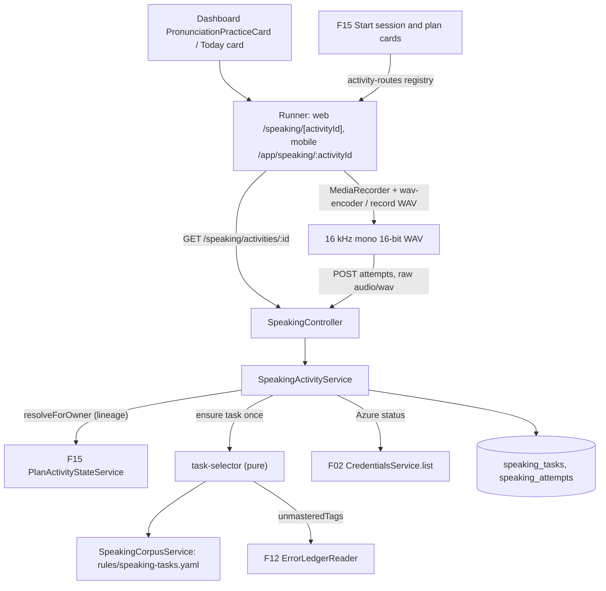
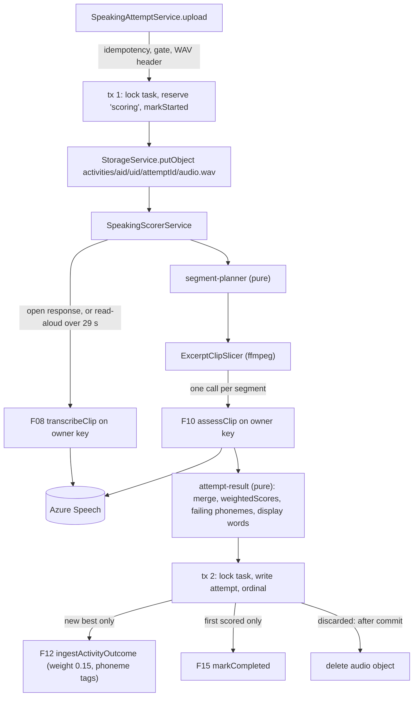
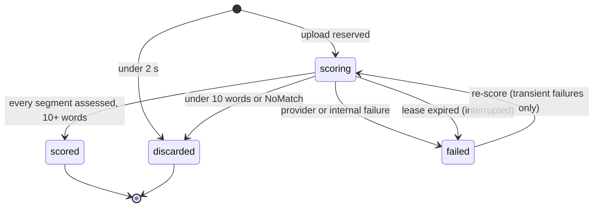

# Technical Specification: Speaking and Pronunciation Activities

## 1. Technical Overview

**What:** The runner for the two speaking kinds F15 places in every plan as task slots with no content item: `pronunciation` (read-aloud) and `speaking` (open response). Opening one does three things:
- **It materializes the activity's task once.** A read-aloud gets a 25–60 word passage from a versioned speaking corpus. The passage is chosen to drill the activity's `phoneme:` target tags, then the owner's other unmastered phonemes. An open response gets a prompt from the same corpus, chosen by its analysis-family target tags. The task is keyed on the root of the activity's carry-over lineage, so a carried activity keeps its text and its attempts.
- **It records.** The web captures through `MediaRecorder` and encodes 16 kHz mono 16-bit WAV in the browser. The mobile app uses F03's native recorder. Each client uploads the WAV as a raw `audio/wav` body. The API validates the header and stores the file in MinIO under `activities/{activityId}/{userId}/{attemptId}/audio.wav`.
- **It scores in the same request.** An open response is transcribed first with F08's `transcribeClip`, and its transcript becomes the reference. A read-aloud is assessed directly against its passage with F10's `assessClip`. Both run on the owner's own Azure key. A recording longer than the 30 s REST cap is transcribed and cut at word gaps into segments of at most 29 s, each assessed against its own slice of the reference and merged duration-weighted.

A scored attempt settles in one transaction under a per-task lock:
- The attempt row is written with its five scores, its word-level colouring with offsets into the recording, and its failing phonemes.
- When the attempt is the new best (at most 3 scored attempts), F12's `ingestActivityOutcome` is called. It sends one `pronunciation` measurement (weight 0.15, from the kind) and one `phoneme:` occurrence per failing phoneme. Target phonemes the attempt measured without failure go in as correct encounters. The source is keyed on the lineage root, so a better attempt replaces the earlier one.
- On the first scored attempt, F15's `markCompleted` moves the plan activity to `completed`.

Two outcomes spend no attempt. A recording with fewer than 10 recognized words is discarded, and its audio is deleted. A provider failure after a successful upload keeps the audio and marks the attempt `failed`, with a re-score action that never asks the user to record again.

Clients reach it through five caller-only routes: read the activity, upload an attempt, re-score an attempt, stream an attempt's audio, and rate the activity. On the web, the runner lives at `/speaking/[activityId]`, and the dashboard gains the mockup's `Treino de Pronúncia` module card as `PronunciationPracticeCard`. On mobile, the runner lives at `/app/speaking/:activityId`, and the Today tab gains the same card. Both clients register the two kinds in F15's route registries, which turns `Start session` on for them.

**Why:** Pronunciation is the one skill the learner cannot judge alone, and between lessons it is the one with no signal at all. Three properties carry the weight:
- **One capability, one ledger.** An activity clip goes through exactly the code path a lesson excerpt does: F10's `assessClip` on the owner's key, the same score set, the same `< 60` phoneme rule and the same `phoneme:` tags. So "progress between lessons counts" is a property of the data, not of a second scoring model. F18 adds only what a single short excerpt never needed: transcription as the reference for unscripted speech, and segmentation past the REST API's 30 s cap.
- **The expensive part is never lost.** A recording is kept until it is scored. A failed upload stays on the device with a retry that reuses the same client attempt id. A failed assessment stays in storage with a re-score. A stumble is discarded before upload. A silent clip is discarded after recognition, without counting. None of these outcomes costs the user an attempt or a re-recording.
- **The limit and the best score hold under races.** Two devices, a double tap and a crash mid-scoring can all hit the same activity. A per-task row lock, a partial unique index allowing one attempt in flight, and a unique `(task, ordinal)` index capped at 3 enforce "at most 3 scored attempts, one at a time" in the database. The profile only ever holds the best one.

**Scope — Included (the PRD has no Core/Full split for F18; the whole feature is in scope):**
- Both activity shapes: read-aloud (a 25–60 word reference text containing the owner's failing phonemes, assessed directly against it) and open response (a prompt answered in 30–90 s of unscripted speech, transcribed first, then assessed against its own transcript)
- The versioned speaking corpus (`apps/api/rules/speaking-tasks.yaml`): its loader, its boot validation and its coverage test. Deterministic task selection per owner, and task materialization once per carry-over lineage
- Recording: 16 kHz mono 16-bit WAV capped at 120 s. `MediaRecorder` plus in-browser WAV encoding on the web, F03's native recorder on mobile. A live waveform, an elapsed timer, local playback before submitting, and discarding without spending an attempt
- Upload to `activities/{activityId}/{userId}/{attemptId}/audio.wav` (A8), idempotent per client attempt id
- Scoring on the owner's own Azure key through F08's `transcribeClip` and F10's `assessClip`, with segmentation past the 30 s REST cap and the 10-recognized-word floor
- Up to 3 scored attempts per activity. The highest pronunciation score counts, and every attempt is retained and replayable
- Results: the reference text (read-aloud) or the transcript (open response) coloured per word in F19's green, amber and red bands; five score meters; failing phonemes with an example word and its score; tapping a red word plays that segment of the recording
- Profile and ledger: one activity-sourced `pronunciation` measurement at weight 0.15, and `phoneme:` occurrences and correct encounters, all through F12's ingestion contract in the scoring transaction
- Plan state through F15's contract: `in_progress` with the first upload, and `completed` with the first scored attempt
- Every PRD error case: a missing or rejected Azure key blocks the activity before recording, a denied microphone shows platform guidance with a retry, an upload failure keeps the recording locally, a clip with fewer than 10 words is discarded without counting, and an assessment failure is re-scorable
- The one-tap difficulty rating after a scored attempt, through F15's `recordRating` (A24)
- Web: the `/speaking/[activityId]` runner with its loading, empty and error states; the dashboard's `PronunciationPracticeCard` (the mockup's `Treino de Pronúncia` region, flipped to `implemented`); the play, stop and voice icons; the route registrations
- Mobile: the `/app/speaking/:activityId` runner, the microphone rationale shown before the first permission prompt, the Today tab's pronunciation card, `just_audio` playback, and the route registrations
- Integrated from earlier features' follow-ups:
  - F15's downstream note: register `pronunciation` and `speaking`, own the reference text and the prompt, and call the state contract;
  - F12's F18 note: one measurement with sub-scores, one occurrence per failing phoneme, and the best attempt through `sourceKey`/`revision`;
  - F10's and F08's notes: the single-clip capabilities, used with F18's own audit labels;
  - F03's recorder service, now given a screen;
  - the `Treino de Pronúncia` row that `design/README.md` defers to F18.

**Scope — Excluded:**
- Generating read-aloud texts or open-response prompts with Gemini. F18 consumes no Gemini key or prompt (PRD Consumes), so the texts come from a curated, versioned corpus (A2)
- Judging the content of an open response (grammar, vocabulary, discourse, task fit). The PRD scores pronunciation only. The activity's analysis-family target tags steer which prompt is chosen and nothing else (A15)
- Updating the Fluency competency from Azure's fluency score. F12 sources Fluency from the LLM analysis. Azure's fluency is shown on the attempt and stored, but not ingested (A14)
- Skipping a speaking activity with a reason. That is F16's capability for objective activities. A speaking activity skipped through another path is read-only here (A20)
- Persisting an unsent recording across an app restart or a closed tab. Offline use is excluded by PRD Section 7. The recording is kept in memory (web) or as a temp file (mobile) while the runner is open (A21)
- Deleting attempts or audio, and any retention policy (PRD Section 7). Discarded clips are the only audio deleted
- The dashboard's module grid and its `Módulos Essenciais` header, which stay `deferred` to F05. F18's card ships standalone below `TodaySessionCard`, as F15's did (A25)
- A curator CLI for the corpus. It is edited by hand and reviewed in the diff, and its coverage test guards it
- Lesson audio playback. F19's rule that the lesson detail has no playback control is untouched: F18 reuses F19's colour bands, not its component (A26)

**PRD traceability:**

| PRD block | Where it lands |
|---|---|
| Consumes (F02 Azure key and region with validity status) | §2 gating; A12, A13; §5 `block`; BYOK integration tests |
| Consumes (F08 single-clip transcription) | §2 scoring flow; A5, A6; `open_response_is_transcribed_first_and_assessed_against_its_transcript` |
| Consumes (F10 single-clip assessment) | §2 scoring flow; A5, A7; `read_aloud_is_scored_through_the_shared_clip_capability_with_the_same_score_set` |
| Consumes (F12 taxonomy and outcome ingestion contract) | A14, A16; §5 internal contracts; profile integration tests |
| Consumes (F15 activity entries and state contract) | A4, A9, A17, A18, A19, A20, A24; §5 routes and internal contracts; plan integration tests |
| Consumes (F21 tokens, primitives, page states) | §4 web and mobile components; scanner tests |
| Capabilities | §2 rules; A2–A20; §5 constants |
| Experience | §4 web and mobile runners; A21–A27 |
| Error Handling (5 cases) | §4 failure modes; A10, A12, A13, A21 |
| F18 acceptance criteria | §7 acceptance table |
| Cross-Feature Integration criteria (F02 BYOK, F12 within 5 s, F10→F18 same score set and ledger, F08→F18 transcript as reference, F15→F20 state, F21 screens) | §7 cross-feature table |

**Assumptions and decisions not answered by the PRD (Batch Mode, every row flagged for user review):**

| # | Decision or assumption | Rationale | Auto-Accept row |
|---|---|---|---|
| A1 | **Full scope.** The PRD gives F18 no Core/Full split. | Batch Mode rule for a feature with neither block. | Scope (Core vs Core+Full) |
| A2 | **Task content comes from a curated corpus, `apps/api/rules/speaking-tasks.yaml`, versioned in git.** It holds at least 30 read-aloud passages of 25–60 words, each declaring the `phoneme:` tags it drills with 2–6 example words from its own text, and at least 20 open-response prompts, each declaring 1–3 analysis-family target tags and an optional hint. Boot validation refuses to start on a malformed file. A unit test pins its coverage: every non-retired `phoneme:` tag is drilled by at least 2 passages, and every non-retired `discourse:` and `vocab:` tag is targeted by at least 1 prompt. | F18's Consumes block has no Gemini key and no prompt library, and its error handling names only the Azure key. The PRD says the text is "chosen to contain the user's failing phonemes": a choice, not a generation. F13 decided speaking tasks are not bank items, and F15 left the text to F18. A curated corpus costs nothing per plan, cannot fail at open time, and is reviewable in a diff. The alternative, a Gemini prompt, would add a key dependency the PRD does not give this feature. | Description too vague (the PRD says neither where the text comes from nor how phonemes are chosen) |
| A3 | **Passages are plain prose:** letters, apostrophes, spaces and `. , ; : ? ! " ' — ( )` only. No digits, hyphenated compounds, abbreviations or symbols, and 25–60 words by the same tokenizer the scorer uses. Written in an argumentative or narrative C1 register. | Azure normalizes digits and symbols in a reference text differently from how it returns words. Plain prose makes the display alignment (A11) exact for read-aloud. | Partial PRD specifications |
| A4 | **Task selection is deterministic** (`selection/task-selector.ts`, pure). **Read-aloud**, ranked by: (1) the number of the activity's `phoneme:` target tags the passage drills, descending; (2) the number of the owner's other unmastered `phoneme:` tags it drills, descending; (3) not used by this owner in the last 14 days before used; (4) least recently used; (5) corpus order. **Open response**, ranked by: (1) the intersection of the activity's target tags with the prompt's, descending; (2) not used by this owner in the last 14 days before used; (3) least recently used; (4) corpus order. An activity with no target tags (general mode or a filler task) skips key (1). `focus_tags`: the passage's drills that intersect the targets, else the owner's unmastered phonemes, else its first drills, capped at 3. For an open response, the matching targets. | "Chosen to contain the user's failing phonemes", read as a ranking the owner can predict. Rotation keeps a finite corpus from repeating the same passage. | Technical decisions with a clear recommendation |
| A5 | **Segmentation past the 30 s REST cap.** The recording's speech span is `[firstWordStart − 300 ms, lastWordEnd + 300 ms]`, clamped to the file. A span of at most 29,000 ms is one segment. A longer span is split greedily at the latest word boundary (the midpoint of the gap) that keeps each segment at or under 29,000 ms. Each word belongs to the segment holding its midpoint. Segments are cut with F10's `ExcerptClipSlicer` (ffmpeg, 16 kHz mono PCM). A read-aloud of at most 29 s skips transcription and is assessed whole, directly against its passage. A longer read-aloud is transcribed first so it can be cut. | F10's spec records the REST API's 30 s cap for pronunciation assessment. An open response runs 30–90 s by definition, and a slow 60-word read-aloud can pass 30 s. The rejected alternatives: the Speech SDK's continuous mode (F10 rejected the SDK as a large new dependency), and a 30 s recording cap for read-aloud (it would cut off a slow reader, and the PRD caps recordings at 120 s). | Partial PRD specifications |
| A6 | **Reference per segment.** For an open response, the segment's transcribed words, joined. For a long read-aloud, the passage tokens are aligned to the transcribed words (A11) and split at the boundaries of each segment's aligned tokens, as contiguous slices that cover every passage token exactly once. Unaligned tokens join the segment of the next aligned token, and trailing ones join the last segment. A segment whose slice is empty is not assessed and does not count in the weighting. | The PRD makes the open response's own transcript its reference, and gives the read-aloud its passage. Contiguous slices keep omissions visible as `Omission` in the segment where the words were due. | Partial PRD specifications |
| A7 | **Merging segments.** Word offsets are shifted by the segment's start into recording time. The five scores are duration-weighted means over the assessed segments, using F10's `weightedScores`, exported for reuse with no behaviour change. Prosody is weighted over the segments that report it. Every segment must succeed for the attempt to be scored: there is no partial attempt. | F10's lesson-level rule, applied within one recording. A single attempt is small enough that a partial score would mislead more than it helps. | Technical decisions with a clear recommendation |
| A8 | **Object key: `activities/{activityId}/{userId}/{attemptId}/audio.wav`.** `activityId` is the plan activity the recording was made on (the lineage-resolved id), and `attemptId` is the server's attempt id. | The PRD names `activities/{activityId}/{userId}/audio.wav` but also requires every attempt to be retained and replayable. One key per activity could hold only one recording. A per-attempt folder under the PRD's prefix, with the PRD's file name, keeps both. **This deviates from the literal key in the acceptance criterion**, and is recorded here for that reason. | Partial PRD specifications |
| A9 | **One task per carry-over lineage.** `speaking_tasks.root_activity_id` is the oldest id in F15's `resolveForOwner(...).lineage`. Attempts, their count and the profile source follow the root, so a carried activity keeps its text and its attempts. | F15's A13 and its downstream note: runners resume across the lineage. | Technical decisions with a clear recommendation |
| A10 | **Attempt lifecycle and counting.** States: `scoring`, `scored`, `discarded` and `failed`. Only `scored` attempts count toward the limit of 3, and each gets an `ordinal` from 1 to 3 when it is scored. A new upload, and a re-score, require fewer than 3 scored attempts and no attempt currently `scoring`. Both are checked under a `FOR UPDATE` lock on the task row, and backed by a partial unique index (one `scoring` per task) and a unique `(task_id, ordinal)` index with `ordinal` between 1 and 3. `discarded` (fewer than 10 recognized words, a clip under 2 s, or Azure's `NoMatch` on a whole-clip assessment) never counts, and its audio is deleted. `failed` never counts, keeps its audio, and is re-scorable when its failure is transient. | The PRD: at most 3 attempts, and neither a discarded clip nor a failed upload counts. Counting only scored attempts makes a re-score free, as "re-scored without re-recording" implies. The database constraints make the limit hold across devices. | Partial PRD specifications |
| A11 | **Display words.** The reference text (read-aloud) or the transcribed words (open response) are tokenized into display tokens. Each token is aligned to the assessed words by a longest-common-subsequence over F09's `normalizeToken` forms. A matched token takes the assessed word's accuracy, band, error types and recording offsets. An unmatched display token has no band (`Not assessed`). Assessed `Insertion` words are hidden on a read-aloud (they are not in the passage) and on an open response (they are alignment noise, as in F10). `Omission` words show as `poor` with no offsets. | The PRD re-renders "the reference text" with its punctuation and casing, and Azure returns lexical words. Alignment keeps the display faithful and each offset correct. | Technical decisions with a clear recommendation |
| A12 | **The Azure gate.** The activity view carries `block: 'azure_key_missing'` when the owner's Azure credential is `missing` or `invalid`. `valid` and `unverified` both count as usable, because the vault's `resolveDecrypted` accepts both. When `block` is set, neither client renders the record control. They show `Add your Azure Speech key to use speaking activities.` with a link to settings. The upload route re-checks the credential before storing anything and refuses with `CRED002`, which the clients map to the same sentence. | The PRD blocks the activity "before recording", for a missing or rejected key alike. The re-check keeps a key deleted mid-activity from producing an unscorable attempt. The recording stays on the device (A21). | Partial PRD specifications |
| A13 | **Provider failures at scoring time** are classified like F10's and never lose the audio. `CRED002`/`CRED003` → `azure_key_missing`. 401/403 → `azure_key_rejected`: the vault marks the key invalid, as it does for F08 and F10. 429 → `azure_quota`. 404 → `azure_region_unsupported`. 5xx, network or timeout after inline retries at 2 s and 8 s → `service_error`. 400/413/415/422 → `audio_rejected` (not re-scorable). Anything unclassified → `internal_error`. A `scoring` row older than 3 minutes (a crash mid-request) is converted to `failed`/`interrupted` before any new upload or re-score. The whole scoring pass has a 120 s budget, after which it stops with `service_error`. Every failure is re-scorable except `audio_rejected` and `audio_missing`. | "The recording is preserved server-side and the attempt can be re-scored without re-recording." The lease and the budget keep a stuck request from holding the one-in-flight slot. | Partial PRD specifications |
| A14 | **The profile outcome** (`scoring/speaking-outcome.ts`, pure), built from the best scored attempt: `activityId` and `sourceKey` = the lineage root; `revision` = the best attempt's id; `activityType` = the plan kind; `occurredAt` = its `scored_at`. It carries one measurement, `{ competency: 'pronunciation', value: pronunciation, accuracy, prosody }`. `errorOccurrences` has one entry per failing phoneme tag (a phoneme instance below F10's `PHONEME_FAILURE_THRESHOLD` of 60), with `instances` and up to 5 `exampleWords`. `correctEncounters` has one per `phoneme:` target tag of the activity that the attempt measured with no failing instance. An open response sends no encounters, because its targets are analysis-family tags F18 cannot judge. Phonemes of `Omission` words are excluded, since nothing was spoken. Azure's fluency and completeness are stored on the attempt, not ingested. | F12's F18 note, word for word. It also covers F16's precedent for correct encounters, and the mastery streak evidence F12 already records for its Full scope. | Technical decisions with a clear recommendation |
| A15 | **Open-response target tags steer the prompt only.** They are shown as "Try to work in: Hedging", and nothing about their use is scored or written to the ledger. | Judging discourse or vocabulary use needs an LLM, which the PRD does not give F18. | Description too vague |
| A16 | **Ingestion happens only when an attempt becomes the new best** (a strictly higher pronunciation score; the earlier ordinal wins a tie). A worse attempt writes nothing to the profile. Re-ingesting with a new revision replaces the source, so exactly one measurement per activity lineage exists at any time. | "The highest pronunciation score counts", with F12's replace-by-revision semantics. | Technical decisions with a clear recommendation |
| A17 | **Plan state.** The first upload calls `markStarted`, inside the reservation transaction. The first scored attempt calls `markCompleted` in the settling transaction, with `completionKey` = that attempt's id and `timeSpentSeconds` = the total recorded duration of every attempt so far, rounded up. Later attempts do not touch plan state. Opening the runner changes nothing. | The PRD keeps the activity `pending` while the microphone is denied, so opening alone must not start it. Completing on the first score reflects the work in the plan's percentage at once. `scoreCorrect`/`scoreTotal` do not apply to speaking. | Partial PRD specifications |
| A18 | **Archived and replaced plans.** When the resolved activity's plan is archived, the view is read-only: attempts are listed and replayable, and nothing can be recorded or re-scored (`block: 'plan_archived'`, `PLAN004` on writes). No task is materialized for an archived activity that never had one. | F15's `PLAN004` rule. The archived plan stays readable. | Technical decisions with a clear recommendation |
| A19 | **Reading materializes the task.** `GET /speaking/activities/:activityId` inserts the task on first read (`ON CONFLICT (root_activity_id) DO NOTHING`, then read it back). It never changes plan state and never calls a provider. | Both clients and a reload must see the same passage, and the first read is the only moment the text is needed. The insert is idempotent and invisible, so a prefetch is harmless. A separate "open" route would add a round trip with nothing to decide. | Technical decisions with a clear recommendation |
| A20 | **A skipped speaking activity is read-only** (`block: 'activity_skipped'`, `SPEAK009` on uploads). | F15's `markCompleted` leaves `skipped` untouched. Scoring a skipped activity would move the profile while the plan kept saying "skipped". | Technical decisions with a clear recommendation |
| A21 | **Local retention.** The unsent recording stays in memory as a `Blob` on the web, with a `beforeunload` warning while it exists. On mobile it stays as F03's temp file, with a confirm dialog on back navigation. A failed upload keeps it, together with its client attempt id, for `Retry`, which resends the same id. The recording is not persisted across a reload or an app restart. | "The recording is retained locally", within PRD Section 7's exclusion of offline sync. The same client attempt id makes a retry after a lost response return the stored attempt instead of a duplicate. | Partial PRD specifications |
| A22 | **Web capture.** `getUserMedia({ audio: { channelCount: 1 } })` feeds `MediaRecorder`, in the browser's native container (WebM/Opus in Chromium and Firefox, MP4/AAC in Safari), and an `AnalyserNode` drives the waveform. On stop, the blob is decoded with `AudioContext.decodeAudioData`, resampled to 16 kHz mono with an `OfflineAudioContext`, clamped to 16-bit PCM and wrapped in a canonical 44-byte WAV header (`lib/wav-encoder.ts`, pure). Recording stops by itself at 120 s. With no `MediaRecorder`, the runner shows `This browser cannot record audio.` | The PRD names `MediaRecorder` and a WAV upload. `MediaRecorder` cannot emit WAV natively, so the encoding happens in the browser and the server stores exactly the uploaded file. The rejected alternatives were a server-side transcode, which would store a file the client never sent, and an `AudioWorklet` PCM capture, which departs from the PRD's named API. | Feature requires new technology (browser media APIs, no new package) |
| A23 | **Mobile capture and playback.** F03's `AudioRecorderService` writes with `AudioEncoder.pcm16bits`, which the `record` package documents as raw PCM with no header. It is switched to `AudioEncoder.wav` (same 16 kHz, mono, 16-bit), confirmed against the package documentation in stage 6 before the change. It gains an amplitude stream (`onAmplitudeChanged`, 50 ms, dBFS mapped to 0–100) for the waveform. Playback uses the new dependency **`just_audio`**: a file source for the local review and for a downloaded attempt, and `ClippingAudioSource` for a word's segment. | The server's header check would reject headerless PCM. `just_audio` is the maintained Flutter player with sample-accurate clipping, which segment playback needs. The rejected alternative was `audioplayers`, which has no clipping source. | Feature requires new technology |
| A24 | **The difficulty rating** appears after the first scored attempt as the three one-tap buttons plus `Not useful`. It is non-blocking and dismissible. It goes through `PUT /speaking/activities/:activityId/rating` to F15's `recordRating`. **Convergence:** F16 defines the rating for objective activities in the same wave. If F16 has landed a shared rating component or route when F18 is implemented, F18 reuses them and drops its own. Otherwise F18 puts its component in `components/activity/` (web) and `features/activity/` (mobile) so F16 can reuse it. | `docs/context.md` rates "an activity" on completion, and the PRD's objective counts "completed activities" rated `Just right`. F15 stores the rating on the plan activity for F20. | Technical decisions with a clear recommendation |
| A25 | **The dashboard card.** `PronunciationPracticeCard` follows the `Treino de Pronúncia` mockup card's composition: a voice icon tile, the title `Pronunciation practice`, a one-line description, and an action link. It sits standalone under `TodaySessionCard`, where F15's card set the precedent. Its states: no plan (`Read-aloud and speaking practice appear in your study plan after your first lesson.`, no action); the Azure key not ready (the A12 sentence, `Open settings`); the next unfinished `pronunciation` or `speaking` activity of the plan, earliest day and position first (its title, its minutes, `Practice now`); and all of them done (`Every speaking activity in this plan is done.`, `See the full plan`). Mobile shows the same card on Today, under the session. The module-grid header row stays `deferred` to F05. | The design reference assigns this region to F18. A standalone card avoids deciding the grid's layout, which F05 owns. | Technical decisions with a clear recommendation |
| A26 | **Word colouring reuses F19's bands, not its component.** On the web, `BAND_CLASS` becomes an export of `components/lessons/transcript/word-colouring.tsx` beside the already-exported `BAND_LABEL` (an additive change). F18's `SpokenWords` renders each `poor` word with offsets as a button (`Play "think": 42 out of 100, needs work`) and every other word as text. On mobile, `WordColouring.styleFor` is already public and is reused the same way. | The same bands everywhere (F21), while F19's `lesson-detail-no-audio.spec.tsx` guarantee (no playback control in the lesson detail) stays untouched. The PRD makes the red words tappable. | Technical decisions with a clear recommendation |
| A27 | **Segment playback** plays `[startMs − 100, startMs + durationMs + 100]`, clamped to the recording. On the web, the attempt's WAV is fetched once with credentials, decoded, and played through an `AudioBufferSourceNode`. On mobile, it is downloaded once to a temp file and played through `ClippingAudioSource`. Each failing phoneme's example word is playable the same way. | Word boundaries from Azure are tight, and 100 ms of context makes the word audible. Decoding once lets repeated taps play instantly. | Partial PRD specifications |
| A28 | **Synchronous scoring.** The upload request stores, scores and settles, then answers with the attempt (201, or 200 for a replayed client attempt id). While any attempt is `scoring` (for example another device's), both clients poll `GET` every 2 s. | The PRD's "for a few seconds". The worst case (a 120 s open response in 5 segments) stays under the 120 s budget. A background job would add a queue and a polling protocol for a request that normally takes a few seconds. | Technical decisions with a clear recommendation |
| A29 | **Upload transport: a raw `audio/wav` body**, capped at 4 MiB (120 s × 32,000 B/s plus the header). It carries a required `X-Client-Attempt-Id: <uuid>` header and is read by a small capped reader (`audio/audio-body.ts`) that throws `SPEAK004` past the cap. Nest's JSON and urlencoded parsers ignore `audio/wav`, so nothing else touches the stream. No multer, and no presigned URL. | A single file with no fields needs no multipart. A presigned MinIO URL would expose the object store to both clients, including a phone on a tunnel. The reader's errors go through the normal `AppError` envelope. | Technical decisions with a clear recommendation |
| A30 | **WAV validation** (`audio/wav-header.ts`, pure). The body must be `RIFF`/`WAVE` with a `fmt ` chunk of PCM (format 1), 1 channel, 16,000 Hz and 16 bits, and a `data` chunk. Unknown chunks (`LIST`) are skipped. A `data` size of 0 or one past the end of the body means "the rest of the body", which covers a writer that never patched the size. The duration must be 1–121,000 ms (a 1 s tolerance over the 120 s cap for encoder rounding). A clip under 2,000 ms is stored as `discarded` without any Azure call. | The PRD's format, checked where the audio arrives. The tolerance covers real encoders without admitting a longer recording. | Partial PRD specifications |
| A31 | **Mobile microphone rationale.** Before the first recording on a device, a bottom sheet explains: `English Quest needs your microphone to record your answer. Recordings stay on your own server and are scored with your own Azure Speech key.` It offers `Continue`, which calls the recorder's permission request, and `Not now`. A `mic_rationale_shown` flag in `shared_preferences` keeps it from reappearing once permission has been granted. On denial, the runner shows `English Quest needs microphone access for speaking activities.` with Android or iOS settings guidance and `Try again`. The web shows the same sentence with browser site-settings guidance. `NotFoundError` shows `No microphone was found. Connect one and try again.` | "Requested on first use with an explanation of why it is needed", and "platform-specific guidance and a retry". No new permission package: F03 chose `record`'s own `hasPermission()`. | Partial PRD specifications |
| A32 | **Development-only WAV upload.** In `NODE_ENV === 'development'` only, the web runner also offers `Use a WAV file (development only)`, which sends a chosen file through the same upload path. Production never renders it. | The agent's embedded browser cannot grant a microphone (`apps/web/AGENTS.md`). This is the same precedent as the classroom's development-only no-media path, and it lets the runtime check reach the real API. | Technical decisions with a clear recommendation |
| A33 | **Tables are plural** (`speaking_tasks`, `speaking_attempts`), with `ck_`/`ux_`/`ix_` constraint names. Error codes use the `SPEAK` area (`SPEAK001`–`SPEAK009`). | The schema's majority convention (F12, F14, F15), and one code per failure mode (root `AGENTS.md`). | Multiple conflicting patterns (content_item is singular; the plural majority wins) |
| A34 | **No new environment variable.** Every number is a constant in `speaking.constants.ts` (F10's precedent). The PRD's limits reach the clients through the view's `limits`, so neither client hard-codes them. The one new dependency is `just_audio` (mobile). | Nothing here varies per deployment. | Technical decisions with a clear recommendation |
| A35 | **Convergence with siblings in Wave 12.** F16 and F17 are runners on the same F15 contract, built in parallel. Each edits the two route registries, in additive lines only. F18's routes live under `/speaking` (web) and `/app/speaking` (mobile), so they cannot collide with a generic `/activities` runner. After the last attempt, F18 offers `Back to today's session` (web `/dashboard`, mobile Today), which is F15's note to F16. F18 builds no skip control (A20) and no session-sequencing flow. If F16 introduces a shared session flow or skip control, adopting it in the speaking runner is a follow-up. | The orchestrator's instruction: build on F15's contract and name every point where siblings may converge. | Technical decisions with a clear recommendation |

## 2. Architecture Impact

**Affected components:**

| Area | Path |
|---|---|
| API — speaking domain | `apps/api/src/speaking/**` |
| API — corpus | `apps/api/rules/speaking-tasks.yaml` |
| API — reuse seams in finished features | `apps/api/src/pronunciation/pronunciation-aggregate.ts` (export `weightedScores`) |
| API — wiring, errors, OpenAPI | `apps/api/src/app.module.ts`, `common/app-error.ts`, `openapi/components.ts`, `openapi/setup.ts` |
| Database | `apps/api/prisma/schema.prisma`, `apps/api/prisma/migrations/0016_speaking_activities/migration.sql` (next free number at implementation time) |
| Shared contracts | `packages/shared/src/schemas/speaking.ts`, `errors/codes.ts`, `index.ts` |
| Web | `apps/web/src/app/(app)/speaking/**`, `components/speaking/**`, `components/activity/difficulty-rating.tsx`, `components/dashboard/pronunciation-practice-card.tsx`, `app/(app)/dashboard/page.tsx`, `components/lessons/transcript/word-colouring.tsx` (exports), `components/ui/icons/**`, `app/(dev)/design-system`, `lib/speaking*.ts`, `lib/wav-encoder.ts`, `lib/activity-routes.ts` |
| Mobile | `apps/mobile/lib/features/speaking/**`, `features/activity/difficulty_rating.dart`, `core/audio/audio_recorder_service.dart`, `features/plan/activity_routes.dart`, `features/shell/shell_module.dart`, `features/today/today_page.dart`, `pubspec.yaml` |
| Docs | `design/README.md`, `docs/api/openapi.json`, dated notes in the progress files of F03, F10, F12, F15 and F19 |

**Opening and recording:**



**Scoring one attempt:**



**Attempt states:**



## 3. Technical Decisions

| Decision | Chosen Approach | Alternative Considered | Trade-off |
|---|---|---|---|
| Where the texts come from | A curated corpus versioned in the repo, chosen deterministically per owner (A2, A4) | Generating texts per activity with a Gemini prompt | A finite pool of passages, and phoneme drills annotated by a person rather than verified by a lexicon. Accepted: F18 has no Gemini dependency in the PRD, opening can never fail on a missing key, and every text is reviewable in a diff |
| Clips longer than the 30 s REST cap | Transcribe, cut at word gaps into segments of at most 29 s, assess each against its slice, merge duration-weighted (A5–A7) | The Speech SDK's continuous pronunciation assessment; capping recordings at 30 s | One extra transcription call for a long read-aloud, and segment boundaries that Azure's prosody scoring sees as edges. Accepted: no new server dependency, the same client F10 uses, and no reader cut off mid-passage |
| Web WAV capture | `MediaRecorder` in the native container, decoded and resampled to 16 kHz in the browser, encoded as WAV (A22) | A server-side ffmpeg transcode; an `AudioWorklet` PCM tap | An extra decode step on the client after stop (well under a second for 120 s). Accepted: the server stores exactly the file the client sent, and the PRD's named API is kept |
| Upload transport | A raw `audio/wav` body with a client attempt id header, through the API (A29) | Multipart; a presigned MinIO URL | Audio passes through the API process, buffered at 4 MiB at most. Accepted: MinIO stays private and one code path serves both clients |
| When scoring runs | Synchronously inside the upload request (A28) | A queue job plus polling | A request lasting a few seconds, up to the 120 s budget. Accepted: the PRD's "few seconds", no queue, and the lease covers a crash |
| Retention of every attempt | A per-attempt folder under the PRD's prefix (A8) | Overwriting `audio.wav` on each attempt | The key deviates from the acceptance criterion's literal path. Accepted: the PRD also requires every attempt to be replayable |
| The best attempt in the profile | One source per lineage, replaced by revision when a new best arrives (A14, A16) | One source per attempt | Earlier scores leave the profile when a better one arrives. Accepted: "the highest pronunciation score counts", and the fold stays a pure function of the evidence (F12) |
| Enforcing the limit | A row lock plus two partial unique indexes and an ordinal CHECK (A10) | Service code only | Two extra indexes. Accepted: the limit holds across devices and double taps by construction |

## 4. Component Overview

**API — speaking domain (`apps/api/src/speaking/`, `SpeakingModule`; imports `SpeechModule`, `StorageModule`, `PlansModule`, `ProfileModule` and `TaxonomyModule`. Prisma and Credentials are global):**

| File Path | New/Modified | Purpose | Key Responsibilities |
|---|---|---|---|
| `speaking.module.ts` | New | Wiring | Provides everything below, plus `ExcerptClipSlicer` (stateless, with no dependencies, provided here so F10's module stays untouched). Also provides the `SPEAKING_WORK_ROOT` and `SPEAKING_RETRY_DELAYS_OVERRIDE` tokens as `undefined`, so tests can override them (F10's idiom) |
| `speaking.constants.ts` | New | Fixed values | The limits (3 scored attempts, 120,000 ms plus a 1,000 ms tolerance, a 2,000 ms minimum, 4 MiB, 10 words), `READ_ALOUD_WORDS` (25–60), `OPEN_RESPONSE_TARGET_SECONDS` (30–90), `SEGMENT_MAX_MS` (29,000), `SPEECH_SPAN_PADDING_MS` (300), retry delays (2,000 and 8,000 ms), `SCORING_BUDGET_MS` (120,000), `SCORING_LEASE_MS` (180,000), `RECENT_TASK_DAYS` (14), the usage labels `F18_read_aloud` and `F18_open_response`, `SPEAKING_TASKS_PATH`, `attemptAudioKey(activityId, userId, attemptId)`, and the failure and discard sentences (§5) |
| `corpus/speaking-corpus.ts` | New | Corpus file | Strict Zod schema of `speaking-tasks.yaml`: ids unique and slug-shaped; passages 25–60 words of the allowed characters (A3); every drill key a non-retired `phoneme:` tag with 2–6 example words present in the text; prompts 8–60 words with 1–3 non-retired analysis-family targets and an optional hint of up to 200 characters. Also `corpusFingerprint` (SHA-256 of the canonical JSON) and `loadSpeakingCorpus(path, taxonomy)`, which throws `SpeakingCorpusValidationError` listing every issue. It follows `plans/rules/plan-rules.ts` |
| `corpus/speaking-corpus.service.ts` | New | Corpus in force | `OnModuleInit` load after the taxonomy, and `current()`. An invalid file stops the boot, and the log line names the version and fingerprint |
| `audio/wav-header.ts` | New | Pure | `parseWavHeader(buffer)` → `{ sampleRate, channels, bitsPerSample, dataOffset, dataBytes, durationMs }` or a typed failure reason (A30) |
| `audio/audio-body.ts` | New | Body reader | `readAudioBody(req, maxBytes)`: checks `Content-Type: audio/wav`, rejects on `Content-Length` early, streams with a running cap, and returns a `Buffer`. Throws `AppError` (`VAL001`, `SPEAK004`) |
| `scoring/token-alignment.ts` | New | Pure | `tokenizeDisplay(text)` → display tokens with their normalized forms (F09's `normalizeToken`). `alignTokens(a, b)` → LCS pairs over normalized forms. Deterministic, with no fuzzy matching |
| `scoring/segment-planner.ts` | New | Pure | `planSegments({ durationMs, words, maxMs, paddingMs })` → segments `{ startMs, endMs, wordIndexes }` (A5). `sliceReference(referenceTokens, words, segments)` → contiguous reference slices per segment (A6) |
| `scoring/attempt-result.ts` | New | Pure | `mergeSegments(segmentResults)` → words in recording time and duration-weighted scores through F10's `weightedScores` (A7). `failingPhonemes(words, taxonomy)` → grouped by tag with instances, mean accuracy and the lowest instance as example, excluding `Omission` words (A14). `displayWords(shape, displayTokens, assessedWords)` (A11). `recognizedWordCount(shape, sttWords, assessedWords)` |
| `scoring/speaking-outcome.ts` | New | Pure | `buildSpeakingOutcome({ userId, rootActivityId, kind, targetTags, bestAttempt })` → F12's `ActivityOutcomeInput` (A14) |
| `scoring/attempt-policy.ts` | New | Pure | `blockFor(activity, azureStatus)` (A12, A18, A20). `canUpload(attempts, now)` and `canRescore(attempt, attempts, now)` → allowed, or the reason code (A10). `isStale(attempt, now)` (A13). `bestAttempt(attempts)` (A16). `isRescorable(failureCode)` |
| `scoring/speaking-scorer.service.ts` | New | The provider pass | `score({ userId, shape, referenceText, wavPath, durationMs })` → `ScoredResult \| DiscardedResult \| FailedResult`. Transcribes when needed (`transcribeClip`, with the shape's label), applies the 10-word floor, plans the segments, slices them into a per-attempt work directory, calls `assessClip` sequentially with inline retries, classifies errors (A13), enforces the budget, merges, and always deletes its work directory |
| `selection/task-selector.ts` | New | Pure | `selectReadAloud(corpus, { targetTags, unmasteredPhonemes, usage })` and `selectOpenResponse(corpus, { targetTags, usage })` → `{ entryId, focusTags }` (A4) |
| `speaking-task.repository.ts` | New | Persistence | `findByRoot`, `insertIfAbsent(tx?, row)` (`ON CONFLICT DO NOTHING`), `lockForUpdate(tx, taskId)` (`SELECT … FOR UPDATE`), and `usageFor(userId)` → last use per corpus entry |
| `speaking-attempt.repository.ts` | New | Persistence | `byClientId(userId, clientAttemptId)`, `forTask(taskId)`, `byIdForOwner(userId, attemptId)`, `insertScoring(tx, row)`, `markInterrupted(tx, taskId, now)`, `settle(tx, attemptId, result)`, `delete(tx, attemptId)` |
| `speaking-activity.service.ts` | New | Route logic | `viewFor(userId, activityId, now)`: resolves the activity (`PLAN003`, `SPEAK001` for a non-speaking kind), ensures the task unless archived (A18, A19), reads the Azure status, and maps rows to `SpeakingActivityView`. `rate(userId, activityId, input)`: resolves, then calls `recordRating` |
| `speaking-attempt.service.ts` | New | Upload and re-score | `upload(userId, activityId, clientAttemptId, body, now)`: replays the attempt for a known client id; otherwise gate → header → tx 1 (lock, stale → interrupted, `canUpload`, insert `scoring` with the key, `markStarted`) → `putObject` (on failure the row is deleted and `SPEAK008` returned) → `score` → tx 2 (lock, settle, ordinal, best → `ingestActivityOutcome`, first → `markCompleted`) → a discarded clip's object deleted after commit. `rescore(userId, attemptId, now)`: the same from tx 1 on, with the audio downloaded from storage (a missing object → `failed`/`audio_missing`). Logs the outcome, shape, segment count, latency and failure code, never a transcript or a score |
| `speaking-view.mapper.ts` | New | Views | Rows → `SpeakingActivityView` / `SpeakingAttemptView`. Tag labels come from the taxonomy. Discarded attempts are left out of the list, and each failure carries its sentence and `rescorable` |
| `speaking.controller.ts` | New | HTTP surface | The five routes in §5 under tag `speaking`, with `@ApiConsumes('audio/wav')` and a binary body schema for the upload, `@ApiProduces('audio/wav')` for the audio, a header parameter for `X-Client-Attempt-Id`, and one `@ApiResponse` per status and code |

**API — changes elsewhere:**

| File Path | New/Modified | Purpose | Key Responsibilities |
|---|---|---|---|
| `apps/api/src/pronunciation/pronunciation-aggregate.ts` | Modified (additive) | Reuse | `weightedScores` exported, with its parameter widened structurally to `ReadonlyArray<{ durationMs; scores }>`. `AssessedExcerptInput` already satisfies it, so F10's behaviour and tests are unchanged |
| `apps/api/src/app.module.ts` | Modified | Root | Imports `SpeakingModule` |
| `apps/api/src/common/app-error.ts` | Modified | Factories | `speakingActivityNotFound`, `speakingAttemptLimit`, `speakingAudioInvalid(reason)`, `speakingAudioTooLong`, `speakingAttemptNotFound`, `speakingNotRescorable(reason)`, `speakingScoringInFlight`, `speakingUploadFailed`, `speakingActivitySkipped` |
| `apps/api/src/openapi/components.ts`, `openapi/setup.ts` | Modified | Document | `SpeakingActivityView`, `SpeakingAttemptView`, `SpeakingRatingInput` and `SpeakingRatingView` from the shared schemas, and the `speaking` tag |
| `apps/api/rules/speaking-tasks.yaml` | New | Corpus, version `"1"` | §5 |

**Shared (`packages/shared/src/`):**

| File Path | New/Modified | Purpose | Key Responsibilities |
|---|---|---|---|
| `schemas/speaking.ts` | New | Contracts | `speakingShapeSchema`, `speakingAttemptStateSchema`, `speakingFailureCodeSchema`, `speakingBlockSchema`, `speakingWordSchema`, `speakingFailingPhonemeSchema`, `speakingAttemptResultSchema`, `speakingAttemptViewSchema`, `speakingTaskViewSchema`, `speakingLimitsSchema`, `speakingActivityViewSchema`, `speakingRatingInputSchema`, `speakingRatingViewSchema`, the `SPEAKING_CLIENT_ATTEMPT_HEADER` constant, and their types. Reuses `pronunciationScoresSchema`, `pronunciationWordBandSchema`, `planTagSchema`, `planActivityStateSchema`, `studyPlanStatusSchema` and `difficultyRatingSchema`. No user id anywhere in the shape |
| `errors/codes.ts` | Modified | Codes | `SPEAK001`–`SPEAK009` with status and message (§5) |
| `index.ts` | Modified | Exports | The speaking schemas |

**Web (`apps/web/src/`):**

| File Path | New/Modified | Purpose | Key Responsibilities |
|---|---|---|---|
| `app/(app)/speaking/[activityId]/page.tsx` | New | Route | Server component. Reads `getSpeakingActivity(activityId)` and renders `SpeakingRunner`. `PLAN003`/`SPEAK001` render the not-found error state. Metadata title `Speaking practice · English Quest` |
| `app/(app)/speaking/[activityId]/loading.tsx`, `error.tsx` | New | Page states | A skeleton shaped like the task card and the recorder, and the error state with retry, as `plan/` does |
| `components/speaking/speaking-runner.tsx` | New | The runner | Client state machine: `ready` → `recording` → `review` → `submitting` (`Scoring your pronunciation…`) → `result`, plus `upload_failed`, `blocked`, `mic_denied`, `no_microphone` and `unsupported`. Holds the unsent `Blob` and its client attempt id (A21), with a `beforeunload` guard while one exists. Polls `GET` every 2 s while any attempt is `scoring`. Shows `Back to today's session` |
| `components/speaking/task-card.tsx` | New | The task | Read-aloud: the passage in `text-headline-sm`, with `Sounds to watch` chips (`focusTags`). Open response: the prompt, the hint, `Try to work in:` chips, and `Aim for 30–90 seconds.` |
| `components/speaking/recorder-panel.tsx` | New | Recording | Record and stop `Button` (primary, then destructive while recording) with an accessible name. `RecordingWaveform`. An elapsed `m:ss / 2:00` timer. A polite live region for `Recording…` / `Recording stopped at the 2-minute limit.` The attempt counter (`Attempt 2 of 3`, or `All 3 attempts used. Your best score counts.`) |
| `components/speaking/recording-waveform.tsx` | New | Waveform | The last 48 level samples as bars in `bg-secondary`, `aria-hidden` |
| `components/speaking/review-panel.tsx` | New | Before submitting | `Play recording`/`Pause`, `Discard` (no request) and `Submit`. In `upload_failed`, the PRD sentence `Your recording could not be uploaded. Retry?` with `Retry` (same client id) and `Discard`. `CRED002` from the upload shows the A12 sentence with the settings link |
| `components/speaking/attempt-result.tsx` | New | Result | `SpokenWords` (A26), then five `Meter`s (prosody `Not measured` when null), then `Sounds to work on` rows (`/θ/ as in "think" — 46, "three"`, with a play button for the example segment). Shows the transcript heading for an open response |
| `components/speaking/spoken-words.tsx` | New | Word colouring | F19's `BAND_CLASS`/`BAND_LABEL`, `poor` words with offsets as buttons calling `playRange`, `Not assessed` tokens in `text-on-surface-variant`, and the band legend |
| `components/speaking/attempt-list.tsx` | New | Previous attempts | `Attempt 1 · 68 · Best`, a `Scoring…` row, `Not scored — <reason>` with `Re-score` when `rescorable` and attempts remain, each with a `Play` of the whole recording |
| `components/speaking/speaking-blocked.tsx` | New | Gates | `EmptyState` variants: the Azure key (A12, `Open settings`), the archived plan (`PLAN004` text), the skipped activity, the denied microphone and a missing device (A31), and an unsupported browser (A22) |
| `components/speaking/use-wav-recorder.ts` | New | Capture hook | `getUserMedia`, `MediaRecorder`, the level samples through `useAudioLevel`, the timer, auto-stop at `limits.maxRecordingSeconds`, and on stop `encodeWav(resample16k(decode(blob)))`. Maps `NotAllowedError`/`NotFoundError`. Releases tracks on unmount |
| `components/speaking/use-attempt-audio.ts` | New | Playback hook | `play()` for a local `Blob` or an attempt, and `playRange(startMs, durationMs)` with 100 ms padding (A27). Fetches an attempt's WAV once with credentials, decodes it, and stops a previous source before starting a new one |
| `components/activity/difficulty-rating.tsx` | New (or F16's, A24) | Rating | `Too easy`, `Just right`, `Too hard` and a `Not useful` link, dismissible, never blocking |
| `components/dashboard/pronunciation-practice-card.tsx` | New | Dashboard card | A25's states, composed like `TodaySessionCard`'s shell, with the voice icon tile on `bg-badge-danger-bg` and `Practice now` via `activityHref` |
| `app/(app)/dashboard/page.tsx` | Modified | Dashboard | Adds `getCredentials()` and renders `PronunciationPracticeCard` under `TodaySessionCard` |
| `components/lessons/transcript/word-colouring.tsx` | Modified (additive) | Band reuse | Exports `BAND_CLASS` (A26). No rendering change |
| `components/ui/icons/play-icon.tsx`, `stop-icon.tsx`, `voice-icon.tsx` | New | Icons | In the existing `IconProps` style, exported from `icons/index.ts` and `ui/index.ts`, and shown in the design-system gallery |
| `lib/speaking-server.ts` | New | Server read | `getSpeakingActivity(id)` → `ServerRead<SpeakingActivityView>`, as `plans-server.ts` does |
| `lib/speaking.ts` | New | Browser calls | `fetchSpeakingActivity`, `uploadAttempt(activityId, clientAttemptId, wav)` (`apiFetch` with `Content-Type: audio/wav` and the header), `rescoreAttempt`, `rateSpeakingActivity`, and `fetchAttemptAudio(attemptId)` → `ArrayBuffer` (raw `fetch` with credentials, and `ApiRequestError` on an error envelope) |
| `lib/wav-encoder.ts` | New | Pure | `encodeWav(samples: Float32Array, sampleRate)` → `Uint8Array` (clamped 16-bit little-endian PCM with a 44-byte header), and `resampleTo16kMono(buffer)` over `OfflineAudioContext` |
| `lib/activity-routes.ts` | Modified | Registry | `pronunciation` and `speaking` → `/speaking/${activity.id}` |

**Mobile (`apps/mobile/lib/`):**

| File Path | New/Modified | Purpose | Key Responsibilities |
|---|---|---|---|
| `core/audio/audio_recorder_service.dart` | Modified | Recorder | `AudioEncoder.wav` (A23), `amplitudeStream()` (50 ms, dBFS → 0–100), and `hasPermission()` exposed for the rationale flow. The output path is unchanged |
| `features/speaking/speaking_models.dart` | New | Models | Hand-written mirrors of every schema in `schemas/speaking.ts`, with tolerant enum parsing as in `plan_models.dart` |
| `features/speaking/speaking_api.dart` | New | API | `activity(id)`, `upload(id, clientAttemptId, filePath)` (bytes with `Options(contentType: 'audio/wav', headers: {…})`), `rescore(attemptId)`, `rate(id, input)`, `downloadAudio(attemptId)` → a temp file path (`ResponseType.bytes`) |
| `features/speaking/speaking_controller.dart` | New | State | `GetxController` mirroring the web runner's states, the pending recording path and client attempt id (A21), a 2 s poll while `scoring`, and a UUID v4 from `Random.secure()` |
| `features/speaking/attempt_audio_player.dart` | New | Playback | `just_audio` wrapper: `playFile(path)`, `playRange(path, startMs, durationMs)` via `ClippingAudioSource` (A27), and `stop()` |
| `features/speaking/speaking_page.dart` | New | Runner screen | Scaffold, `SafeArea`, scrollable content capped at 560: the task card, the recorder with the waveform and timer, the full-width record button in the thumb zone, review, the result, the attempts list, the rating and `Back to today's session`. A `PopScope` confirm while a recording is unsent |
| `features/speaking/widgets/task_card.dart`, `recording_waveform.dart`, `spoken_words.dart`, `attempt_result.dart`, `attempt_list.dart`, `speaking_blocked.dart`, `microphone_rationale_sheet.dart` | New | Widgets | Mirror the web components on `EqCard`, `EqButton`, `EqChip`, `EqMeter`, `EqBadge` and `EqPageState`. `spoken_words.dart` reuses `WordColouring.styleFor` (A26). The rationale sheet is A31 |
| `features/speaking/widgets/pronunciation_practice_card.dart` | New | Today card | A25's states. Reads the current plan already loaded by Today and the credential list |
| `features/activity/difficulty_rating.dart` | New (or F16's, A24) | Rating | Three buttons plus `Not useful` |
| `features/speaking/speaking_module.dart` | New | Routes | `/speaking/:activityId` |
| `features/shell/shell_module.dart` | Modified | Shell | Mounts `speakingModule`, so the runner opens inside the shell like a lesson detail |
| `features/plan/activity_routes.dart` | Modified | Registry | `pronunciation` and `speaking` → `/app/speaking/${activity.id}` |
| `features/today/today_page.dart` | Modified | Today | Renders `PronunciationPracticeCard` under the session card |
| `pubspec.yaml` | Modified | Dependency | `just_audio` (A23) |

**Docs:**

| File Path | New/Modified | Purpose | Key Responsibilities |
|---|---|---|---|
| `design/README.md` | Modified | Design reference | `Module card — "Treino de Pronúncia"` → `implemented` as `PronunciationPracticeCard`, standalone under `TodaySessionCard`, with English copy (the mockup's "sotaque natural" claim dropped, since nothing measures accent). The section-header row stays `deferred`, with a note that two standalone module cards now exist |
| `docs/F03-…/progress.md`, `docs/F10-…/progress.md`, `docs/F12-…/progress.md`, `docs/F15-…/progress.md`, `docs/F19-…/progress.md` | Modified | Dated follow-up notes | F03: the WAV encoder and the amplitude stream. F10: `weightedScores` exported, and the first caller of `assessClip` outside the pipeline. F12: an activity caller of `ingestActivityOutcome` with encounters. F15: `pronunciation`/`speaking` registered, and `markStarted`/`markCompleted` called. F19: `BAND_CLASS` exported |
| `docs/api/openapi.json` | Regenerated | Snapshot | The five routes and four components |

**Database:**

| Migration File | Tables Affected | Operation | Notes |
|---|---|---|---|
| `apps/api/prisma/migrations/0016_speaking_activities/migration.sql` | `speaking_tasks`, `speaking_attempts` | CREATE | `main` holds `0001`–`0015`. F16, F17 and F20 may land migrations in the same wave, so take the next free number at implementation time |

**Failure modes:**

| Scenario | Behaviour | Surfaced as |
|---|---|---|
| Azure key missing or invalid when the runner opens | No record control | `block: azure_key_missing`: `Add your Azure Speech key to use speaking activities.` + `Open settings` |
| Key deleted between opening and uploading | Refused before anything is stored; the recording stays local | `CRED002` → the same sentence; `Retry` after saving the key resends the same client id |
| Microphone denied (browser or OS) | Nothing uploaded; plan activity stays `pending` | `English Quest needs microphone access for speaking activities.` + platform guidance + `Try again` |
| No microphone device | As above | `No microphone was found. Connect one and try again.` |
| Upload fails (network, 5xx, storage) | Recording kept locally with its client id; not counted | `Your recording could not be uploaded. Retry?`; `SPEAK008` from a storage failure |
| Response lost after a successful upload | The retry returns the stored attempt | 200 with the same attempt, no second score |
| Fewer than 10 recognized words, `NoMatch`, or under 2 s | `discarded`, audio deleted, not counted, no profile write | `We could not hear enough speech in that recording.` |
| Azure rejects the key while scoring | `failed`/`azure_key_rejected`; the vault marks the key invalid; audio kept | `Your Azure Speech key was rejected. Update it in settings, then re-score this recording.` |
| Azure quota | `failed`/`azure_quota`, re-scorable | `Azure Speech quota exceeded. Re-score this recording later.` |
| Transient service error after 2 inline retries, or budget exceeded | `failed`/`service_error`, re-scorable | `Scoring failed. Your recording is saved — re-score when ready.` |
| Azure refuses the audio | `failed`/`audio_rejected`, not re-scorable | `Azure Speech could not process this recording.` |
| Crash mid-scoring | Lease expires after 3 min → `failed`/`interrupted`, re-scorable | `Scoring was interrupted. Your recording is saved — re-score when ready.` |
| Re-score finds the object missing | `failed`/`audio_missing`, not re-scorable | `This recording is no longer available.` |
| Fourth scored attempt, or a re-score past the limit | Refused before storing | `SPEAK002`: `You have used all 3 attempts for this activity.` |
| Upload while another attempt is scoring | Refused | `SPEAK007` |
| Not a 16 kHz mono 16-bit WAV / over 2 minutes | Refused | `SPEAK003` / `SPEAK004` |
| Activity's plan archived (not carried) | Read-only: list and replay | `block: plan_archived`; `PLAN004` on writes |
| Activity skipped | Read-only | `block: activity_skipped`; `SPEAK009` on uploads |
| Profile ingestion rejects an unknown phoneme symbol | F12 logs and drops the tag; the rest is ingested | Nothing to the user (F12's rule) |
| Corpus file invalid | The API refuses to start | `Invalid speaking corpus:` plus every issue |

**Implementation notes (from earlier runs):**
- Web copy in JSX uses the typographic apostrophe (`today’s`). The token scanners pair a literal `'` in visible text with the next one in the file (F15, Stage 6).
- The `tsx`-based `openapi:generate` script cannot resolve decorator metadata. Regenerate with `pnpm build` and then `node dist/openapi/generate.js`, as F12, F14 and F15 did.
- Integration suites use F08's `fake-speech.ts` and F10's `fake-pronunciation.ts` at the client boundary, so the vault, audit and invalidation paths run for real. They also start the MinIO container from `helpers/minio.ts`. Test WAVs are generated at run time (the pure encoder or ffmpeg `lavfi`), and no audio is committed.

## 5. API Contracts

All routes require a session (`SessionGuard`) and carry the cookie and bearer security schemes. Each returns only the caller's own data: an activity, task or attempt id belonging to another user is indistinguishable from an unknown one. Success bodies are `{ data: … }`, except the audio stream.

### Endpoint: Read a speaking activity

- **Method:** GET
- **Path:** `/speaking/activities/:activityId`
- **Authentication:** session cookie or bearer token

**Request:**

| Field | Type | Required | Validation | Description |
|---|---|---|---|---|
| `activityId` (path) | `uuid` | Yes | UUID | Any id in the activity's carry-over lineage, resolved forward |

The first read of an activity in an active plan materializes its task (A19). It never changes plan state and never calls Azure.

**Response (Success - 200): `SpeakingActivityView`**

| Field | Type | Description |
|---|---|---|
| `data.activityId` | `uuid` | The resolved (newest) activity id |
| `data.kind` | `'pronunciation' \| 'speaking'` | F15's kind |
| `data.title` | `string` | F15's title (`Read aloud: /θ/ as in "think"`) |
| `data.state` | `'pending' \| 'in_progress' \| 'completed' \| 'skipped'` | The plan activity's state |
| `data.planStatus` | `'active' \| 'archived'` | |
| `data.estimatedMinutes` | `integer` | F15's estimate |
| `data.targetTags` | `Array<{ tag, label }>` | F15's targets |
| `data.task` | `SpeakingTaskView \| null` | Null only for an archived activity that never had a task |
| `data.task.shape` | `'read_aloud' \| 'open_response'` | |
| `data.task.referenceText` | `string \| null` | The passage (read-aloud) |
| `data.task.prompt` | `string \| null` | The question (open response) |
| `data.task.hint` | `string \| null` | Open response only |
| `data.task.wordCount` | `integer \| null` | The passage's word count |
| `data.task.focusTags` | `Array<{ tag, label }>` | Up to 3 (A4) |
| `data.task.targetSeconds` | `{ min, max } \| null` | `{ 30, 90 }` for an open response |
| `data.block` | `'azure_key_missing' \| 'plan_archived' \| 'activity_skipped' \| null` | Why nothing can be recorded, most fundamental first: archived, skipped, key |
| `data.limits` | `{ maxAttempts, maxRecordingSeconds, minRecognizedWords }` | `3`, `120`, `10` |
| `data.attemptsUsed` | `integer` | Scored attempts, 0–3 |
| `data.attemptsRemaining` | `integer` | `maxAttempts − attemptsUsed` |
| `data.bestAttemptId` | `uuid \| null` | |
| `data.attempts` | `SpeakingAttemptView[]` | Oldest first. `scoring`, `scored` and `failed` attempts, never `discarded` |
| `data.rating` | `{ rating, notUseful } \| null` | Null until rated |

**`SpeakingAttemptView`** (also the body of the upload and re-score routes):

| Field | Type | Description |
|---|---|---|
| `id` | `uuid` | Server attempt id |
| `clientAttemptId` | `uuid` | The client's idempotency id |
| `ordinal` | `integer \| null` | 1–3 once scored |
| `state` | `'scoring' \| 'scored' \| 'discarded' \| 'failed'` | A `scoring` attempt past its lease is reported as `failed`/`interrupted` |
| `createdAt`, `scoredAt` | `datetime`, `datetime \| null` | |
| `durationMs` | `integer` | The recording's duration |
| `isBest` | `boolean` | |
| `failure` | `{ code, message, rescorable } \| null` | Set for `failed` and `discarded` |
| `result` | `SpeakingAttemptResult \| null` | Set for `scored` |
| `result.scores` | `{ pronunciation, accuracy, fluency, prosody \| null, completeness }` | F10's score set, 0–100 |
| `result.recognizedWordCount` | `integer` | ≥ 10 |
| `result.transcript` | `string \| null` | The open response's transcript |
| `result.words[]` | `{ text, band \| null, accuracy \| null, errorTypes, startMs \| null, durationMs \| null }` | Display tokens in order (A11). Offsets are in recording time |
| `result.failingPhonemes[]` | `{ tag, label, meanAccuracy, instances, exampleWord, exampleStartMs \| null, exampleDurationMs \| null }` | Ascending by mean accuracy, at most 10 |

**Response Example (a read-aloud with one scored attempt):**
```json
{
  "data": {
    "activityId": "7a8b9c0d-1e2f-4a3b-8c4d-5e6f7a8b9c0d",
    "kind": "pronunciation",
    "title": "Read aloud: /θ/ as in \"think\", /ð/ as in \"this\"",
    "state": "completed",
    "planStatus": "active",
    "estimatedMinutes": 4,
    "targetTags": [
      { "tag": "phoneme:/θ/", "label": "/θ/ as in \"think\"" },
      { "tag": "phoneme:/ð/", "label": "/ð/ as in \"this\"" }
    ],
    "task": {
      "shape": "read_aloud",
      "referenceText": "Nothing in the southern valley was thought through. Three weathered bridges gathered the traffic of the whole district, and although everyone knew the thin wooden beams would one day give way, nobody thought the repairs worth the trouble until the morning the northern bridge finally collapsed.",
      "prompt": null,
      "hint": null,
      "wordCount": 46,
      "focusTags": [
        { "tag": "phoneme:/θ/", "label": "/θ/ as in \"think\"" },
        { "tag": "phoneme:/ð/", "label": "/ð/ as in \"this\"" }
      ],
      "targetSeconds": null
    },
    "block": null,
    "limits": { "maxAttempts": 3, "maxRecordingSeconds": 120, "minRecognizedWords": 10 },
    "attemptsUsed": 1,
    "attemptsRemaining": 2,
    "bestAttemptId": "3c4d5e6f-7a8b-4c9d-8e0f-1a2b3c4d5e6f",
    "attempts": [
      {
        "id": "3c4d5e6f-7a8b-4c9d-8e0f-1a2b3c4d5e6f",
        "clientAttemptId": "0f1e2d3c-4b5a-4968-8776-655443322110",
        "ordinal": 1,
        "state": "scored",
        "createdAt": "2026-10-02T07:31:12.000Z",
        "scoredAt": "2026-10-02T07:31:16.000Z",
        "durationMs": 22480,
        "isBest": true,
        "failure": null,
        "result": {
          "scores": { "pronunciation": 71.6, "accuracy": 74.2, "fluency": 80.1, "prosody": 66.5, "completeness": 97.9 },
          "recognizedWordCount": 45,
          "transcript": null,
          "words": [
            { "text": "Nothing", "band": "poor", "accuracy": 48, "errorTypes": ["Mispronunciation"], "startMs": 640, "durationMs": 410 },
            { "text": "in", "band": "good", "accuracy": 96, "errorTypes": [], "startMs": 1050, "durationMs": 120 },
            { "text": "the", "band": "poor", "accuracy": 0, "errorTypes": ["Omission"], "startMs": null, "durationMs": null }
          ],
          "failingPhonemes": [
            { "tag": "phoneme:/θ/", "label": "/θ/ as in \"think\"", "meanAccuracy": 44, "instances": 5, "exampleWord": "nothing", "exampleStartMs": 640, "exampleDurationMs": 410 }
          ]
        }
      }
    ],
    "rating": null
  }
}
```
(`words` is truncated here. A real attempt lists every display token.)

**Error Codes:**

| Code | HTTP Status | Description |
|---|---|---|
| `VAL001` | 400 | `activityId` is not a UUID |
| `PLAN003` | 404 | No such activity for the caller (F15) |
| `SPEAK001` | 404 | The activity is not a `pronunciation` or `speaking` activity |
| `AUTH003` | 401 | No valid session |

### Endpoint: Upload and score an attempt

- **Method:** POST
- **Path:** `/speaking/activities/:activityId/attempts`
- **Authentication:** session cookie or bearer token

**Request:**

| Field | Type | Required | Validation | Description |
|---|---|---|---|---|
| `activityId` (path) | `uuid` | Yes | UUID | Resolved forward through the lineage |
| `X-Client-Attempt-Id` (header) | `uuid` | Yes | UUID v4 | Generated once per recording on the client, and resent unchanged on retry |
| `Content-Type` (header) | `string` | Yes | `audio/wav` | |
| body | `binary` | Yes | ≤ 4 MiB; RIFF/WAVE PCM, 1 channel, 16,000 Hz, 16-bit; 1–121,000 ms (A30) | The recording |

**Processing order:**
1. Resolve the activity (`PLAN003`, `SPEAK001`).
2. If this caller already has an attempt with this client id, return it (200) without reading the body further.
3. Check the plan and the activity (`PLAN004`, `SPEAK009`) and the Azure key (`CRED002`).
4. Read and validate the body (`SPEAK004`, `SPEAK003`). A clip under 2 s is stored as `discarded` with no object and no Azure call.
5. Transaction 1: lock the task, convert a stale `scoring` row (A13), check the limit (`SPEAK002`) and the in-flight slot (`SPEAK007`), insert `scoring` with its object key, and call `markStarted`.
6. Put the object. On failure, delete the row and return `SPEAK008`.
7. Score (§2).
8. Transaction 2: settle, assign the ordinal, ingest if this is the new best, and `markCompleted` on the first score.
9. Delete a discarded clip's object after commit.

**Request Example:**
```http
POST /speaking/activities/7a8b9c0d-1e2f-4a3b-8c4d-5e6f7a8b9c0d/attempts
Content-Type: audio/wav
X-Client-Attempt-Id: 0f1e2d3c-4b5a-4968-8776-655443322110

<binary WAV, 719,404 bytes>
```

**Response (Success - 201 created; 200 replayed): `SpeakingAttemptView`**, as above. A `discarded` attempt is a 201 as well: the upload succeeded, and the attempt did not count.

**Response Example (discarded):**
```json
{
  "data": {
    "id": "5e6f7a8b-9c0d-4e1f-8a2b-3c4d5e6f7a8b",
    "clientAttemptId": "1a2b3c4d-5e6f-4a7b-8c9d-0e1f2a3b4c5d",
    "ordinal": null,
    "state": "discarded",
    "createdAt": "2026-10-02T07:29:40.000Z",
    "scoredAt": null,
    "durationMs": 6120,
    "isBest": false,
    "failure": { "code": "not_enough_speech", "message": "We could not hear enough speech in that recording.", "rescorable": false },
    "result": null
  }
}
```

**Error Codes:**

| Code | HTTP Status | Description |
|---|---|---|
| `VAL001` | 400 | Missing or malformed `X-Client-Attempt-Id`, wrong `Content-Type`, or bad `activityId` |
| `PLAN003` | 404 | No such activity for the caller |
| `SPEAK001` | 404 | Not a speaking activity |
| `PLAN004` | 409 | The activity's plan was replaced and it was not carried |
| `SPEAK009` | 409 | The activity was skipped |
| `CRED002` | 409 | No usable Azure Speech key (missing or invalid). Nothing stored |
| `SPEAK003` | 400 | Not a 16 kHz mono 16-bit PCM WAV (`details.reason`: `not_riff`, `not_pcm`, `channels`, `sample_rate`, `bit_depth`, `no_data`) |
| `SPEAK004` | 413 | Longer than 2 minutes or larger than 4 MiB |
| `SPEAK002` | 409 | 3 attempts already scored |
| `SPEAK007` | 409 | Another attempt for this activity is still being scored |
| `SPEAK008` | 503 | The recording could not be stored. Not counted |
| `AUTH003` | 401 | No valid session |

### Endpoint: Re-score a failed attempt

- **Method:** POST
- **Path:** `/speaking/attempts/:attemptId/rescore`
- **Authentication:** session cookie or bearer token

**Request:** no body. The attempt must be `failed` with a re-scorable code (or `scoring` past its lease), its audio must exist, fewer than 3 attempts may be scored, nothing else may be scoring, and the plan must be active. It runs the same transactions as the upload from step 5, reading the audio back from storage.

**Response (Success - 200): `SpeakingAttemptView`**, now `scored`, `discarded` or `failed` again.

**Error Codes:**

| Code | HTTP Status | Description |
|---|---|---|
| `VAL001` | 400 | `attemptId` is not a UUID |
| `SPEAK005` | 404 | No such attempt for the caller |
| `SPEAK006` | 409 | Not re-scorable (`details.reason`: `not_failed`, `not_transient`, `audio_missing`) |
| `SPEAK002` | 409 | 3 attempts already scored |
| `SPEAK007` | 409 | Another attempt is scoring |
| `PLAN004` | 409 | Plan replaced |
| `CRED002` | 409 | Still no usable Azure key; the attempt is left unchanged |
| `AUTH003` | 401 | No valid session |

### Endpoint: Stream an attempt's audio

- **Method:** GET
- **Path:** `/speaking/attempts/:attemptId/audio`
- **Authentication:** session cookie or bearer token

**Response (Success - 200):** `Content-Type: audio/wav`, `Cache-Control: private, no-store`, with the stored bytes. Allowed on archived plans, for replay.

**Error Codes:**

| Code | HTTP Status | Description |
|---|---|---|
| `VAL001` | 400 | `attemptId` is not a UUID |
| `SPEAK005` | 404 | No such attempt for the caller, or a discarded attempt with no audio |
| `AUTH003` | 401 | No valid session |

### Endpoint: Rate a speaking activity

- **Method:** PUT
- **Path:** `/speaking/activities/:activityId/rating`
- **Authentication:** session cookie or bearer token

**Request:**

| Field | Type | Required | Validation | Description |
|---|---|---|---|---|
| `rating` | `'too_easy' \| 'just_right' \| 'too_hard' \| null` | Yes | enum or null | Null with `notUseful: true` flags without rating |
| `notUseful` | `boolean` | Yes | | |

**Request Example:**
```json
{ "rating": "just_right", "notUseful": false }
```

**Response (Success - 200): `SpeakingRatingView`**

```json
{ "data": { "rating": "just_right", "notUseful": false } }
```

**Error Codes:**

| Code | HTTP Status | Description |
|---|---|---|
| `VAL001` | 400 | Bad body, or the activity is not `completed` (F15's `recordRating` rule) |
| `PLAN003` | 404 | No such activity for the caller |
| `SPEAK001` | 404 | Not a speaking activity |
| `AUTH003` | 401 | No valid session |

### Error codes (new)

| Code | HTTP Status | Message |
|---|---|---|
| `SPEAK001` | 404 | `This speaking activity could not be found.` |
| `SPEAK002` | 409 | `You have used all 3 attempts for this activity.` |
| `SPEAK003` | 400 | `This recording is not a 16 kHz mono 16-bit WAV file.` |
| `SPEAK004` | 413 | `This recording is longer than 2 minutes.` |
| `SPEAK005` | 404 | `This recording could not be found.` |
| `SPEAK006` | 409 | `This recording cannot be re-scored.` |
| `SPEAK007` | 409 | `Another recording for this activity is still being scored.` |
| `SPEAK008` | 503 | `Your recording could not be uploaded. Retry?` |
| `SPEAK009` | 409 | `This activity was skipped, so it takes no new recordings.` |

### Attempt failure and discard sentences

| Code | Rescorable | Message |
|---|---|---|
| `not_enough_speech` (discard) | — | `We could not hear enough speech in that recording.` |
| `azure_key_missing` | Yes | `Add your Azure Speech key, then re-score this recording.` |
| `azure_key_rejected` | Yes | `Your Azure Speech key was rejected. Update it in settings, then re-score this recording.` |
| `azure_quota` | Yes | `Azure Speech quota exceeded. Re-score this recording later.` |
| `azure_region_unsupported` | Yes | `Pronunciation assessment is not available in your Azure Speech region.` |
| `service_error` | Yes | `Scoring failed. Your recording is saved — re-score when ready.` |
| `interrupted` | Yes | `Scoring was interrupted. Your recording is saved — re-score when ready.` |
| `internal_error` | Yes | `Something went wrong while scoring. Your recording is saved — re-score when ready.` |
| `audio_rejected` | No | `Azure Speech could not process this recording.` |
| `audio_missing` | No | `This recording is no longer available.` |

### Internal contracts

**Consumed:**

| Contract | Use |
|---|---|
| F15 `PlanActivityStateService.resolveForOwner(userId, activityId, tx?)` | Owner check, lineage root, kind, tags, state, plan status |
| F15 `markStarted(userId, activityId, { at }, tx)` | First upload (A17) |
| F15 `markCompleted(userId, activityId, { completionKey, completedAt, timeSpentSeconds }, tx)` | First scored attempt (A17) |
| F15 `recordRating(userId, activityId, { rating, notUseful })` | Rating route (A24) |
| F12 `ProfileIngestionService.ingestActivityOutcome(outcome, tx)` | New best attempt (A14, A16). Joins transaction 2, so the profile is updated before the response returns |
| F12 `ErrorLedgerReader.unmasteredTags(userId)` | Read-aloud selection, key (2) |
| F12 `ErrorTaxonomyService.has`, `familyOf`, `labelOf`, `tagsInFamily` | Corpus validation, labels |
| F08 `SpeechToTextService.transcribeClip(userId, path, 'F18_open_response' \| 'F18_read_aloud', 'audio/wav')` | Open response; read-aloud over 29 s |
| F10 `PronunciationAssessmentService.assessClip(userId, path, reference, label, 'audio/wav')` | Every segment |
| F10 `weightedScores` (exported), `PHONEME_FAILURE_THRESHOLD`, `wordBand` | Merge, failing phonemes, bands |
| F10 `ExcerptClipSlicer.slice(source, startMs, endMs, out)` | Segments |
| F02 `CredentialsService.list(userId)` | Azure status for the gate |
| F01 `StorageService.putObject`, `downloadToFile`, `getObject`, `deleteObject` | Audio |

**`SpeakingScorerService.score(input): Promise<ScoreOutcome>`**

| Input field | Type | Description |
|---|---|---|
| `userId` | `uuid` | The owner: the only key used |
| `shape` | `'read_aloud' \| 'open_response'` | |
| `referenceText` | `string \| null` | The passage (read-aloud) |
| `wavPath` | `string` | The recording in the attempt's work directory |
| `durationMs` | `integer` | From the header |

`ScoreOutcome` is one of: `{ kind: 'scored', scores, words, failingPhonemes, recognizedWordCount, transcript, segments, latencyMs, locale }`, `{ kind: 'discarded', code: 'not_enough_speech' }`, or `{ kind: 'failed', code, providerMessage }`.

### Speaking corpus: `apps/api/rules/speaking-tasks.yaml`

```yaml
# Speaking tasks (F18). Read only when the API boots; an invalid file stops it.
# Every task stores the version and fingerprint it was chosen under. Bump the
# version with any change. Passages: 25–60 words, letters and basic
# punctuation only — no digits, hyphenated compounds or abbreviations.
version: "1"

read_aloud:
  - id: ra-valley-bridges
    text: >-
      Nothing in the southern valley was thought through. Three weathered
      bridges gathered the traffic of the whole district, and although everyone
      knew the thin wooden beams would one day give way, nobody thought the
      repairs worth the trouble until the morning the northern bridge finally
      collapsed.
    drills:
      "phoneme:/θ/": [nothing, thought, three, thin]
      "phoneme:/ð/": [the, weathered, gathered, although]
  # … at least 30 passages; every non-retired phoneme tag drilled by at least 2

open_response:
  - id: or-office-return
    prompt: >-
      Your company wants everyone back in the office five days a week. What
      would you say to your manager, and how would you make your case without
      sounding confrontational?
    hint: Hedge your claims and give one concrete example.
    targets: ["discourse:hedging", "discourse:politeness"]
  # … at least 20 prompts; every non-retired discourse and vocab tag targeted at least once
```

### Downstream notes (obligations this contract places on later features)

| Feature | Note |
|---|---|
| F16 | Rating convergence (A24): either reuse `components/activity/difficulty-rating.tsx` and `features/activity/difficulty_rating.dart`, or, if yours landed first, F18 reuses yours. The route registries now carry `pronunciation` and `speaking`: add the bank kinds beside them |
| F20 | Speaking outcomes arrive as `activity` measurements of `pronunciation` (weight 0.15) and `phoneme:` occurrences with `activity_id` = the lineage root. They plot as activity sources with no F20 change. Completed speaking activities appear in `PlanHistoryReader.completedActivities` with their rating |
| F12 Full | Correct encounters for target phonemes are recorded from day one, so the mastery lifecycle has speaking evidence when it lands |
| Curator | Add passages or prompts in `rules/speaking-tasks.yaml` and bump its `version`. The coverage test names any phoneme or tag left without material. Each task stores the corpus version, fingerprint and entry id; each attempt stores its segments, locale and latency |

## 6. Data Model

### Table: `speaking_tasks`

| Column | Type | Nullable | Default | Description |
|---|---|---|---|---|
| `id` | `uuid` | No | `gen_random_uuid()` | Primary key |
| `user_id` | `uuid` | No | - | Owner; FK `users` ON DELETE CASCADE |
| `root_activity_id` | `uuid` | No | - | Oldest id in the carry-over lineage; FK `study_plan_activities` ON DELETE CASCADE |
| `shape` | `varchar(16)` | No | - | `read_aloud`, `open_response` |
| `corpus_entry_id` | `varchar(64)` | No | - | The corpus entry's id |
| `corpus_version` | `varchar(16)` | No | - | |
| `corpus_fingerprint` | `char(64)` | No | - | |
| `reference_text` | `text` | Yes | - | Set exactly for `read_aloud`; a snapshot of the passage |
| `prompt_text` | `text` | Yes | - | Set exactly for `open_response` |
| `hint` | `varchar(200)` | Yes | - | Open response only |
| `target_tags` | `text[]` | No | `'{}'` | Snapshot of F15's targets, 0–5 |
| `focus_tags` | `text[]` | No | `'{}'` | 0–3 (A4) |
| `created_at` | `timestamptz` | No | `now()` | |

### Table: `speaking_attempts`

| Column | Type | Nullable | Default | Description |
|---|---|---|---|---|
| `id` | `uuid` | No | `gen_random_uuid()` | Primary key, generated by the service before the object key is built |
| `task_id` | `uuid` | No | - | FK `speaking_tasks` ON DELETE CASCADE |
| `user_id` | `uuid` | No | - | Owner; FK `users` ON DELETE CASCADE |
| `activity_id` | `uuid` | No | - | The resolved plan activity at upload; FK `study_plan_activities` ON DELETE CASCADE |
| `client_attempt_id` | `uuid` | No | - | Idempotency key |
| `state` | `varchar(16)` | No | - | `scoring`, `scored`, `discarded`, `failed` |
| `ordinal` | `smallint` | Yes | - | 1–3, set exactly when `scored` |
| `audio_object_key` | `varchar(255)` | Yes | - | Null exactly when `discarded` |
| `audio_bytes` | `integer` | No | - | |
| `duration_ms` | `integer` | No | - | 1–121,000 |
| `scoring_started_at` | `timestamptz` | Yes | - | Lease start; set while `scoring` |
| `scored_at` | `timestamptz` | Yes | - | Set exactly when `scored` |
| `failure_code` | `varchar(32)` | Yes | - | Set exactly when `failed` or `discarded` |
| `failure_reason` | `varchar(200)` | Yes | - | As above |
| `rescore_count` | `smallint` | No | `0` | |
| `pronunciation`, `accuracy`, `fluency`, `completeness` | `real` | Yes | - | Set when `scored`, 0–100 |
| `prosody` | `real` | Yes | - | 0–100, or null where not reported |
| `recognized_word_count` | `smallint` | Yes | - | Set when `scored` |
| `transcript_text` | `text` | Yes | - | The transcript, when one was made |
| `words` | `jsonb` | Yes | - | Display tokens with accuracy, error types, recording offsets and phonemes (`[{ text, accuracy, errorTypes, startMs, durationMs, phonemes: [{ phoneme, accuracy, startMs, durationMs }] }]`) |
| `failing_phonemes` | `jsonb` | Yes | - | `[{ tag, phoneme, meanAccuracy, instances, exampleWords, exampleWord, exampleStartMs, exampleDurationMs }]` |
| `segments` | `jsonb` | Yes | - | For the curator: `[{ startMs, endMs, referenceText, scores, latencyMs }]` |
| `locale` | `varchar(16)` | Yes | - | |
| `latency_ms` | `integer` | Yes | - | Sum over provider calls |
| `created_at`, `updated_at` | `timestamptz` | No | `now()` | |

**Indexes:**

| Index Name | Columns | Type | Purpose |
|---|---|---|---|
| `ux_speaking_tasks_root_activity` | `(root_activity_id)` | unique | One task per lineage; idempotent materialization |
| `ix_speaking_tasks_user_entry` | `(user_id, corpus_entry_id, created_at DESC)` | btree | Recent use per entry (A4) |
| `ux_speaking_attempts_client` | `(user_id, client_attempt_id)` | unique | Idempotent upload |
| `ux_speaking_attempts_task_ordinal` | `(task_id, ordinal)` WHERE `ordinal IS NOT NULL` | partial unique | With the ordinal CHECK: at most 3 scored per task |
| `ux_speaking_attempts_one_scoring` | `(task_id)` WHERE `state = 'scoring'` | partial unique | One attempt in flight per task |
| `ix_speaking_attempts_task_created` | `(task_id, created_at)` | btree | The attempt list |

**Constraints:**

| Constraint | Type | Definition | Purpose |
|---|---|---|---|
| `ck_speaking_tasks_shape` | CHECK | `shape IN ('read_aloud','open_response')` | |
| `ck_speaking_tasks_text` | CHECK | `(shape = 'read_aloud') = (reference_text IS NOT NULL) AND (shape = 'open_response') = (prompt_text IS NOT NULL)` | One text per shape |
| `ck_speaking_tasks_hint` | CHECK | `hint IS NULL OR shape = 'open_response'` | |
| `ck_speaking_tasks_tags` | CHECK | `cardinality(target_tags) <= 5 AND cardinality(focus_tags) <= 3` | |
| `ck_speaking_attempts_state` | CHECK | Enumerated values | |
| `ck_speaking_attempts_duration` | CHECK | `duration_ms BETWEEN 1 AND 121000 AND audio_bytes > 44` | The PRD's cap with A30's tolerance |
| `ck_speaking_attempts_audio` | CHECK | `(state = 'discarded') = (audio_object_key IS NULL)` | Every kept attempt has its audio |
| `ck_speaking_attempts_scoring` | CHECK | `state <> 'scoring' OR scoring_started_at IS NOT NULL` | The lease needs a start |
| `ck_speaking_attempts_scored` | CHECK | `(state = 'scored') = (scored_at IS NOT NULL) AND (state = 'scored') = (ordinal IS NOT NULL) AND (state <> 'scored' OR every score but prosody, words, failing_phonemes and recognized_word_count are NOT NULL)` | A scored attempt is complete |
| `ck_speaking_attempts_ordinal` | CHECK | `ordinal IS NULL OR ordinal BETWEEN 1 AND 3` | The PRD's limit in the database |
| `ck_speaking_attempts_failure` | CHECK | `(state IN ('failed','discarded')) = (failure_code IS NOT NULL AND failure_reason IS NOT NULL)` | |
| `ck_speaking_attempts_scores` | CHECK | Each score NULL or 0–100 | |

**Migration** (opens with a comment saying why it exists, per `.claude/rules/prisma-migrations.md`):

```sql
-- F18 Speaking and Pronunciation Activities: a speaking plan activity gets one
-- task (a read-aloud passage or an open-response prompt, chosen once from the
-- versioned corpus and kept for the whole carry-over lineage), and every
-- recording its owner uploads becomes an attempt: its audio in MinIO, its
-- scores and its word and phoneme detail. At most three attempts are scored
-- per task and only one is scored at a time; the database enforces both.
CREATE TABLE speaking_tasks (
    id                 UUID PRIMARY KEY DEFAULT gen_random_uuid(),
    user_id            UUID         NOT NULL REFERENCES users(id) ON DELETE CASCADE,
    root_activity_id   UUID         NOT NULL REFERENCES study_plan_activities(id) ON DELETE CASCADE,
    shape              VARCHAR(16)  NOT NULL,
    corpus_entry_id    VARCHAR(64)  NOT NULL,
    corpus_version     VARCHAR(16)  NOT NULL,
    corpus_fingerprint CHAR(64)     NOT NULL,
    reference_text     TEXT,
    prompt_text        TEXT,
    hint               VARCHAR(200),
    target_tags        TEXT[]       NOT NULL DEFAULT '{}',
    focus_tags         TEXT[]       NOT NULL DEFAULT '{}',
    created_at         TIMESTAMPTZ  NOT NULL DEFAULT NOW(),
    CONSTRAINT ck_speaking_tasks_shape CHECK (shape IN ('read_aloud','open_response')),
    CONSTRAINT ck_speaking_tasks_text CHECK ((shape = 'read_aloud') = (reference_text IS NOT NULL)
        AND (shape = 'open_response') = (prompt_text IS NOT NULL)),
    CONSTRAINT ck_speaking_tasks_hint CHECK (hint IS NULL OR shape = 'open_response'),
    CONSTRAINT ck_speaking_tasks_tags CHECK (cardinality(target_tags) <= 5 AND cardinality(focus_tags) <= 3)
);
CREATE UNIQUE INDEX ux_speaking_tasks_root_activity ON speaking_tasks (root_activity_id);
CREATE INDEX ix_speaking_tasks_user_entry ON speaking_tasks (user_id, corpus_entry_id, created_at DESC);

CREATE TABLE speaking_attempts (
    id                    UUID PRIMARY KEY DEFAULT gen_random_uuid(),
    task_id               UUID         NOT NULL REFERENCES speaking_tasks(id) ON DELETE CASCADE,
    user_id               UUID         NOT NULL REFERENCES users(id) ON DELETE CASCADE,
    activity_id           UUID         NOT NULL REFERENCES study_plan_activities(id) ON DELETE CASCADE,
    client_attempt_id     UUID         NOT NULL,
    state                 VARCHAR(16)  NOT NULL,
    ordinal               SMALLINT,
    audio_object_key      VARCHAR(255),
    audio_bytes           INTEGER      NOT NULL,
    duration_ms           INTEGER      NOT NULL,
    scoring_started_at    TIMESTAMPTZ,
    scored_at             TIMESTAMPTZ,
    failure_code          VARCHAR(32),
    failure_reason        VARCHAR(200),
    rescore_count         SMALLINT     NOT NULL DEFAULT 0,
    pronunciation         REAL,
    accuracy              REAL,
    fluency               REAL,
    prosody               REAL,
    completeness          REAL,
    recognized_word_count SMALLINT,
    transcript_text       TEXT,
    words                 JSONB,
    failing_phonemes      JSONB,
    segments              JSONB,
    locale                VARCHAR(16),
    latency_ms            INTEGER,
    created_at            TIMESTAMPTZ  NOT NULL DEFAULT NOW(),
    updated_at            TIMESTAMPTZ  NOT NULL DEFAULT NOW(),
    CONSTRAINT ck_speaking_attempts_state CHECK (state IN ('scoring','scored','discarded','failed')),
    CONSTRAINT ck_speaking_attempts_duration CHECK (duration_ms BETWEEN 1 AND 121000 AND audio_bytes > 44),
    CONSTRAINT ck_speaking_attempts_audio CHECK ((state = 'discarded') = (audio_object_key IS NULL)),
    CONSTRAINT ck_speaking_attempts_scoring CHECK (state <> 'scoring' OR scoring_started_at IS NOT NULL),
    CONSTRAINT ck_speaking_attempts_scored CHECK (
        (state = 'scored') = (scored_at IS NOT NULL)
        AND (state = 'scored') = (ordinal IS NOT NULL)
        AND (state <> 'scored' OR (pronunciation IS NOT NULL AND accuracy IS NOT NULL AND fluency IS NOT NULL
            AND completeness IS NOT NULL AND words IS NOT NULL AND failing_phonemes IS NOT NULL
            AND recognized_word_count IS NOT NULL))),
    CONSTRAINT ck_speaking_attempts_ordinal CHECK (ordinal IS NULL OR ordinal BETWEEN 1 AND 3),
    CONSTRAINT ck_speaking_attempts_failure CHECK (
        (state IN ('failed','discarded')) = (failure_code IS NOT NULL AND failure_reason IS NOT NULL)),
    CONSTRAINT ck_speaking_attempts_scores CHECK (
        (pronunciation IS NULL OR pronunciation BETWEEN 0 AND 100)
        AND (accuracy IS NULL OR accuracy BETWEEN 0 AND 100)
        AND (fluency IS NULL OR fluency BETWEEN 0 AND 100)
        AND (prosody IS NULL OR prosody BETWEEN 0 AND 100)
        AND (completeness IS NULL OR completeness BETWEEN 0 AND 100))
);
CREATE UNIQUE INDEX ux_speaking_attempts_client ON speaking_attempts (user_id, client_attempt_id);
CREATE UNIQUE INDEX ux_speaking_attempts_task_ordinal ON speaking_attempts (task_id, ordinal)
    WHERE ordinal IS NOT NULL;
CREATE UNIQUE INDEX ux_speaking_attempts_one_scoring ON speaking_attempts (task_id)
    WHERE state = 'scoring';
CREATE INDEX ix_speaking_attempts_task_created ON speaking_attempts (task_id, created_at);
```

**Prisma:**
- Models `SpeakingTask` and `SpeakingAttempt` (`@@map` to the two tables), with `String[]` for the tag arrays and `Json` for `words`, `failingPhonemes` and `segments`.
- Named relations to `StudyPlanActivity`: `SpeakingTaskRoot` for the task, and `SpeakingAttemptActivity` for the attempt.
- Back-relations on `User` and `StudyPlanActivity`.
- The partial indexes and CHECK constraints live only in the SQL, as in `0012`–`0015`. `ux_speaking_tasks_root_activity` is declared `@unique` so `findUnique` by root works.

## 7. Testing Strategy

**Test File Structure:**

| Test File | Test Type | Target | Coverage Goal |
|---|---|---|---|
| `apps/api/test/unit/speaking-wav-header.spec.ts` | Unit | `wav-header.ts` | 100% |
| `apps/api/test/unit/speaking-audio-body.spec.ts` | Unit | `audio-body.ts` | 95% |
| `apps/api/test/unit/speaking-token-alignment.spec.ts` | Unit | `token-alignment.ts` | 100% |
| `apps/api/test/unit/speaking-segment-planner.spec.ts` | Unit | `segment-planner.ts` | 100% |
| `apps/api/test/unit/speaking-attempt-result.spec.ts` | Unit | `attempt-result.ts` | 95% |
| `apps/api/test/unit/speaking-outcome.spec.ts` | Unit | `speaking-outcome.ts` | 100% |
| `apps/api/test/unit/speaking-attempt-policy.spec.ts` | Unit | `attempt-policy.ts` | 100% |
| `apps/api/test/unit/speaking-task-selector.spec.ts` | Unit | `task-selector.ts` | 100% |
| `apps/api/test/unit/speaking-corpus.spec.ts` | Unit | Corpus schema, the committed file, coverage, fingerprint | 95% |
| `apps/api/test/unit/pronunciation-aggregate.spec.ts` | Unit (existing) | `weightedScores` export unchanged | — |
| `apps/api/test/integration/speaking-activity-routes.spec.ts` | Integration | Read, task materialization, gates, privacy, rating | 90% |
| `apps/api/test/integration/speaking-attempts.spec.ts` | Integration | Upload, scoring, storage, limit, profile, plan, BYOK | 90% |
| `apps/api/test/integration/speaking-rescore.spec.ts` | Integration | Failures, re-score, lease, audio route | 90% |
| `apps/api/test/unit/openapi.spec.ts` | Unit (existing) | Snapshot freshness | — |
| `apps/web/test/wav-encoder.spec.ts` | Unit | `encodeWav` | 100% |
| `apps/web/test/speaking-runner.spec.tsx` | Component | Runner states and results | 90% |
| `apps/web/test/pronunciation-practice-card.spec.tsx` | Component | Dashboard card | 90% |
| `apps/web/test/today-session-card.spec.tsx` | Component (extend) | `Start session` for a speaking first activity | — |
| `apps/web/test/no-raw-values.spec.ts`, `token-resolution.spec.ts`, `lesson-detail-no-audio.spec.tsx` | Existing guards | New files; F19's no-playback rule still holds | — |
| `apps/mobile/test/features/speaking/speaking_models_test.dart` | Unit | JSON mapping | 95% |
| `apps/mobile/test/features/speaking/speaking_controller_test.dart` | Unit | State machine with a fake recorder, player and API | 90% |
| `apps/mobile/test/features/speaking/speaking_page_test.dart` | Widget | Runner screen at 360×690 and at 1.3× text | 85% |
| `apps/mobile/test/features/speaking/pronunciation_practice_card_test.dart` | Widget | Today card | 85% |
| `apps/mobile/test/core/audio_recorder_service_test.dart` | Unit | WAV encoder config, amplitude mapping | 95% |

Azure is faked at the client boundary: F08's `fake-speech.ts` for fast transcription, and F10's `fake-pronunciation.ts` for assessment. Both record the key, region, reference text and clip duration of every call, which is how the BYOK, reference and segmentation tests prove their claims. MinIO is the real test container. The WAV fixtures are built at run time: speech-free 16 kHz sine clips of a chosen length through the pure encoder, since the fakes script the recognition.

**`speaking-wav-header.spec.ts`:** `parses_a_canonical_16khz_mono_pcm_header`, `skips_unknown_chunks_before_data`, `treats_a_zero_data_size_as_the_rest_of_the_body`, `rejects_stereo`, `rejects_44100_hz`, `rejects_8_bit`, `rejects_non_pcm_format`, `rejects_a_non_riff_body`, `computes_duration_from_data_bytes`.

**`speaking-segment-planner.spec.ts`:**

| Test Function | Description | Assertions |
|---|---|---|
| `a_clip_within_the_cap_is_one_segment` | 22 s of words | One segment covering the padded speech span |
| `a_long_clip_is_cut_at_word_gaps_under_the_cap` | 85 s, many gaps | Every segment ≤ 29,000 ms, cuts at gap midpoints, words assigned by midpoint |
| `trims_leading_and_trailing_silence` | 10 s of silence around 20 s of speech | One segment, span padded by 300 ms |
| `reference_slices_are_contiguous_and_cover_every_token_once` | 60-word passage, omissions at a cut | Concatenated slices equal the passage; omitted tokens join the next aligned token's segment |
| `a_segment_with_an_empty_slice_is_skipped` | Repeated line | Marked not assessed |

**`speaking-attempt-result.spec.ts`:**

| Test Function | Description | Assertions |
|---|---|---|
| `merges_segment_words_into_recording_time` | Two segments | Offsets shifted by each start |
| `scores_are_duration_weighted_like_f10` | 10 s at 90, 20 s at 60 | 70, equal to F10's `weightedScores` on the same input |
| `prosody_is_weighted_over_segments_that_report_it` | One null prosody | Mean of the others |
| `failing_phonemes_group_by_tag_below_sixty_excluding_omissions` | Mixed words | One entry per tag, instances, lowest example, `Omission` phonemes ignored |
| `display_words_keep_the_passages_punctuation_and_casing` | `Nothing, in the…` | `Nothing,` with the band of `nothing` |
| `insertions_are_hidden_and_omissions_show_as_poor_without_offsets` | Read-aloud | As stated |
| `an_unmatched_display_token_has_no_band` | `3` vs `three` | `band: null` |
| `recognized_words_count_non_omitted_words_on_a_direct_read_aloud` | 12 words, 3 omitted | 9 |

**`speaking-outcome.spec.ts`:** `one_pronunciation_measurement_with_accuracy_and_prosody`, `one_occurrence_per_failing_phoneme_with_instances_and_up_to_five_words`, `correct_encounters_for_target_phonemes_measured_without_failure`, `no_encounter_for_a_target_phoneme_not_measured`, `open_response_sends_no_encounters`, `keyed_on_the_lineage_root_with_the_best_attempt_as_revision`.

**`speaking-attempt-policy.spec.ts`:** `blocks_on_a_missing_or_invalid_azure_key_but_not_unverified`, `archived_comes_before_skipped_before_key`, `refuses_a_fourth_scored_attempt`, `refuses_while_another_attempt_is_scoring`, `a_stale_scoring_attempt_is_interrupted_and_frees_the_slot`, `best_attempt_is_the_highest_pronunciation_with_the_earlier_ordinal_winning_a_tie`, `transient_failures_are_rescorable_and_audio_failures_are_not`.

**`speaking-task-selector.spec.ts`:** `prefers_the_passage_drilling_most_target_phonemes`, `breaks_ties_with_the_owners_other_unmastered_phonemes`, `prefers_a_passage_unused_in_fourteen_days`, `falls_back_to_least_recently_used`, `general_mode_skips_the_target_key`, `open_response_ranks_by_target_intersection`, `focus_tags_are_capped_at_three`, `is_deterministic_for_the_same_input`.

**`speaking-corpus.spec.ts`:** `loads_the_committed_corpus_and_pins_its_fingerprint`, `every_passage_is_25_to_60_words_of_plain_prose`, `every_drill_word_appears_in_its_passage`, `every_phoneme_tag_is_drilled_by_at_least_two_passages`, `every_discourse_and_vocab_tag_is_targeted_by_a_prompt`, `rejects_an_unknown_tag_a_duplicate_id_and_a_digit_with_every_issue_listed`.

**`speaking-activity-routes.spec.ts`:**

| Test Function | Description | Assertions |
|---|---|---|
| `a_read_aloud_activity_presents_a_25_to_60_word_reference_text` | Pronunciation task slot with `phoneme:/θ/` | `task.shape` `read_aloud`, word count in range, a passage drilling `/θ/` |
| `an_open_response_activity_presents_a_prompt` | Speaking task slot | `task.prompt` set, `targetSeconds` 30–90 |
| `reading_twice_materializes_one_task` | Two concurrent GETs | One `speaking_tasks` row, same text |
| `a_carried_activity_keeps_its_task_and_attempts` | Carry-over chain | Same task through the old and new ids |
| `reading_does_not_change_plan_state` | Pending activity | Still `pending` |
| `a_missing_azure_key_blocks_the_activity_before_recording` | No key; then an invalid key | `block: azure_key_missing` both times |
| `an_archived_activity_is_read_only` | Replaced plan | `block: plan_archived`; no task created when none existed |
| `a_non_speaking_activity_is_not_found` | A listening activity | `SPEAK001` |
| `another_users_activity_is_not_found` | Foreign id | `PLAN003` |
| `rating_a_completed_activity_is_stored_on_the_plan` | After a score | Plan activity rating set; `GET /plans/current` ratings count it |
| `no_response_carries_another_participants_data` | Two users with tasks and attempts | No foreign task, attempt, transcript or score in any of the five responses |

**`speaking-attempts.spec.ts`:**

| Test Function | Description | Assertions |
|---|---|---|
| `stores_the_recording_under_the_activity_and_user_prefix` | Valid WAV | Object at `activities/{activityId}/{userId}/{attemptId}/audio.wav` with the exact bytes |
| `rejects_a_recording_that_is_not_16khz_mono_wav` | Stereo, 44.1 kHz, raw PCM | `SPEAK003`; nothing stored; no attempt row |
| `rejects_a_recording_longer_than_two_minutes` | 125 s | `SPEAK004`; nothing stored |
| `read_aloud_is_scored_through_the_shared_clip_capability_with_the_same_score_set` | 22 s clip | One `assessClip` call with the passage as reference and label `F18_read_aloud`; no transcription call; the five scores as the fake returned them |
| `open_response_is_transcribed_first_and_assessed_against_its_transcript` | 25 s clip | Transcription then assessment; the assessment's reference equals the transcript; `result.transcript` set |
| `a_clip_over_29_seconds_is_split_into_segments_under_the_rest_cap` | 70 s open response | 3 assessment calls, each clip ≤ 29,000 ms, merged weighted scores |
| `a_long_read_aloud_is_transcribed_and_split_against_its_passage` | 38 s read-aloud | Transcription, then 2 assessments whose references concatenate to the passage |
| `fewer_than_ten_words_discards_the_attempt_without_counting_or_scoring` | 8 recognized words | `discarded`, `not_enough_speech`; object deleted; `attemptsUsed` 0; no profile source |
| `no_match_discards_a_direct_read_aloud` | Fake `NoMatch` | `discarded` |
| `a_fourth_attempt_is_refused` | 3 scored | `SPEAK002`; nothing stored |
| `every_attempt_is_retained_and_replayable` | 3 scored | 3 objects; each streams through the audio route |
| `the_best_attempt_counts_toward_the_profile` | Scores 70, 64, 81 | One activity source; measurement value 81; revision = third attempt id |
| `a_worse_attempt_does_not_touch_the_profile` | 70 then 64 | Source unchanged |
| `a_scored_attempt_updates_the_profile_at_activity_weight_before_the_response_returns` | First attempt | On return: a `pronunciation` measurement with `source_kind` activity and weight 0.15, `score_after` per the fold; elapsed < 5 s |
| `phoneme_failures_reach_the_ledger_and_join_the_lesson_record` | Lesson `phoneme:/θ/` exists; activity fails `/θ/` | One ledger record, count 2, both sources |
| `a_target_phoneme_read_well_records_a_correct_encounter` | Target `/ð/` all ≥ 60 | One `error_ledger_encounters` row |
| `the_first_upload_starts_and_the_first_score_completes_the_plan_activity` | Pending activity | `in_progress` after a discarded upload; `completed` after the first score; `GET /plans/current` completion reflects it; `PlanHistoryReader.completedActivities` lists it |
| `a_replayed_client_attempt_id_returns_the_stored_attempt` | Same header twice | 200, same attempt, one assessment call |
| `a_concurrent_upload_is_refused_while_one_is_scoring` | Second upload during a slow fake | `SPEAK007` |
| `a_storage_failure_is_not_counted` | MinIO put fails | `SPEAK008`; no attempt row |
| `an_upload_without_a_usable_key_is_refused_before_anything_is_stored` | Key deleted | `CRED002`; no object; no row |
| `uses_only_the_owners_azure_key_and_audits_the_f18_labels` | Two users | The fakes saw only each owner's key and region; `credential_usage` rows labelled `F18_read_aloud` / `F18_open_response` per owner |

**`speaking-rescore.spec.ts`:**

| Test Function | Description | Assertions |
|---|---|---|
| `a_failed_assessment_is_rescored_without_re_recording` | 5xx three times, then ok | First: `failed`/`service_error`, audio kept, not counted. Re-score: `scored` from the same object; no new upload |
| `a_rejected_key_fails_the_attempt_and_invalidates_the_key` | 401 | `failed`/`azure_key_rejected`; credential `invalid`; view `block` set |
| `quota_fails_the_attempt_rescorably` | 429 | `failed`/`azure_quota`, `rescorable: true` |
| `refused_audio_is_not_rescorable` | 415 | `failed`/`audio_rejected`; re-score `SPEAK006` |
| `an_interrupted_attempt_is_rescorable_after_its_lease` | `scoring` row 4 min old | View reports `interrupted`; upload not blocked; re-score works |
| `a_rescore_past_the_limit_is_refused` | 3 scored, 1 failed | `SPEAK002` |
| `another_users_attempt_is_not_found_for_rescore_or_audio` | Foreign id | `SPEAK005` on both |
| `the_audio_route_streams_the_owners_wav` | Scored attempt | `audio/wav`, same bytes, `Cache-Control: private, no-store` |

**`wav-encoder.spec.ts`:** `writes_a_44_byte_pcm_header_for_16khz_mono`, `clamps_samples_to_16_bit`, `data_size_matches_sample_count`.

**`speaking-runner.spec.tsx`** (the recorder and player hooks are module-mocked, as the classroom tests fake LiveKit and media):

| Test Function | Description | Assertions |
|---|---|---|
| `shows_the_passage_in_large_type_with_a_record_button` | Read-aloud view | Passage, `Sounds to watch` chips, `Start recording` |
| `blocks_before_recording_without_an_azure_key` | `block: azure_key_missing` | No record control; the PRD sentence; settings link |
| `recording_shows_the_waveform_and_timer_and_the_button_becomes_stop` | Start | Timer `0:00 / 2:00`, `Stop recording` |
| `a_discarded_recording_never_reaches_the_api` | Record, stop, Discard | No upload call; counter unchanged |
| `submitting_shows_scoring_then_the_result` | Submit | `Scoring your pronunciation…`, then coloured words, five meters, failing phonemes |
| `tapping_a_red_word_plays_that_segment` | Result | `playRange` called with the word's offsets |
| `an_upload_failure_keeps_the_recording_and_retries_with_the_same_id` | Network error, then Retry | The PRD sentence; second call with the same client id |
| `a_discarded_attempt_shows_the_message_and_spends_nothing` | Discarded response | The PRD sentence; `Attempt 1 of 3` still |
| `the_counter_and_previous_attempts_are_always_visible` | Two scored | `Attempt 3 of 3`; both listed with scores and `Best` |
| `all_attempts_used_hides_the_record_control` | Three scored | `All 3 attempts used. Your best score counts.` |
| `a_failed_attempt_offers_rescore` | `failed`, rescorable | `Re-score` calls the route |
| `a_denied_microphone_shows_guidance_and_retry` | `NotAllowedError` | The PRD sentence; `Try again` |
| `open_response_shows_the_transcript_with_word_colouring` | Open response result | Transcript heading, coloured words |
| `the_rating_is_offered_after_a_score_and_is_dismissible` | First score | Three buttons; dismiss hides it |

**`pronunciation-practice-card.spec.tsx`:** `shows_the_next_unfinished_speaking_activity_with_practice_now`, `asks_for_the_azure_key_when_it_is_not_ready`, `shows_the_empty_state_without_a_plan`, `shows_all_done_when_every_speaking_activity_is_finished`.

**Mobile tests:** `speaking_controller_test.dart` covers the review, discard, submit, upload failure with a same-id retry, discarded, scored, re-score, permission denied, the rationale shown once, and the poll while scoring. `speaking_page_test.dart` pumps the read-aloud, open-response, blocked, review, result and limit states at 360×690 and at 1.3× text with no overflow, and checks that a red word's tap calls the player with its range. `pronunciation_practice_card_test.dart` mirrors the web card's four states. `audio_recorder_service_test.dart` asserts `AudioEncoder.wav` at 16 kHz mono and the dBFS mapping. `speaking_models_test.dart` parses a full `SpeakingActivityView` fixture, including unknown enum values.

**F18 acceptance criteria:**

| Criterion | Test |
|---|---|
| Read-aloud activities present a 25–60 word reference text and assess the recording against it | `speaking-activity-routes::a_read_aloud_activity_presents_a_25_to_60_word_reference_text`, `speaking-corpus::every_passage_is_25_to_60_words_of_plain_prose`, `speaking-attempts::read_aloud_is_scored_through_the_shared_clip_capability_with_the_same_score_set` |
| Open-response activities transcribe the recording first and then assess it against that transcript | `speaking-attempts::open_response_is_transcribed_first_and_assessed_against_its_transcript` |
| Recordings are 16 kHz mono WAV capped at 120 seconds and uploaded to `activities/{activityId}/{userId}/audio.wav` | `speaking-wav-header` (all), `wav-encoder` (all), `audio_recorder_service_test`, `speaking-attempts::stores_the_recording_under_the_activity_and_user_prefix` (per-attempt folder, A8), `::rejects_a_recording_that_is_not_16khz_mono_wav`, `::rejects_a_recording_longer_than_two_minutes` |
| The user can play back a recording before submitting it, and discarding it does not consume an attempt | `speaking-runner::a_discarded_recording_never_reaches_the_api`, `speaking_controller_test` (review and discard) |
| At most 3 attempts are allowed per activity, the highest pronunciation score counts, and all attempts are retained | `speaking-attempts::a_fourth_attempt_is_refused`, `::the_best_attempt_counts_toward_the_profile`, `::every_attempt_is_retained_and_replayable`, `speaking-attempt-policy::refuses_a_fourth_scored_attempt` |
| Results show word-level coloring, five score meters and the failing phonemes with example words | `speaking-runner::submitting_shows_scoring_then_the_result`, `::open_response_shows_the_transcript_with_word_colouring`, `speaking_page_test` (result), `speaking-attempt-result` (all) |
| Tapping a poorly scored word plays back that segment of the recording | `speaking-runner::tapping_a_red_word_plays_that_segment`, `speaking_page_test` (red word tap) |
| An attempt with fewer than 10 recognized words is discarded, does not count against the limit and writes no score | `speaking-attempts::fewer_than_ten_words_discards_the_attempt_without_counting_or_scoring`, `speaking-runner::a_discarded_attempt_shows_the_message_and_spends_nothing` |
| Pronunciation results update the profile at weight 0.15 and write `phoneme:` tags to the ledger | `speaking-attempts::a_scored_attempt_updates_the_profile_at_activity_weight_before_the_response_returns`, `::phoneme_failures_reach_the_ledger_and_join_the_lesson_record`, `speaking-outcome` (all) |
| A missing Azure key blocks the activity before recording rather than after | `speaking-activity-routes::a_missing_azure_key_blocks_the_activity_before_recording`, `speaking-runner::blocks_before_recording_without_an_azure_key`, `speaking_page_test` (blocked), `speaking-attempts::an_upload_without_a_usable_key_is_refused_before_anything_is_stored` |
| A failed assessment after a successful upload can be re-scored without re-recording | `speaking-rescore::a_failed_assessment_is_rescored_without_re_recording`, `speaking-runner::a_failed_attempt_offers_rescore` |

**Cross-feature integration criteria (F18's side):**

| Criterion | Test |
|---|---|
| Gemini and Azure credentials from the vault (F02) are the only credentials used by … F18, and each is used exclusively on its own owner's data | `speaking-attempts::uses_only_the_owners_azure_key_and_audits_the_f18_labels`, `speaking-rescore::a_rejected_key_fails_the_attempt_and_invalidates_the_key` |
| Activity outcomes recorded through the ingestion contract (F12) from … speaking (F18) all update the same competency scores and ledger records within 5 seconds | `speaking-attempts::a_scored_attempt_updates_the_profile_at_activity_weight_before_the_response_returns`, `::phoneme_failures_reach_the_ledger_and_join_the_lesson_record` |
| The pronunciation assessment capability provided by F10 returns the same score set for a speaking activity clip (F18) as it does for a lesson excerpt, and both write `phoneme:` tags to the same ledger | `speaking-attempts::read_aloud_is_scored_through_the_shared_clip_capability_with_the_same_score_set`, `::phoneme_failures_reach_the_ledger_and_join_the_lesson_record`, `speaking-attempt-result::scores_are_duration_weighted_like_f10` |
| The transcription capability provided by F08 transcribes an open-response recording (F18) and that transcript becomes the reference text for its assessment | `speaking-attempts::open_response_is_transcribed_first_and_assessed_against_its_transcript` |
| Activity state updates through the plan contract (F15) from … F18 are reflected in the plan's completion percentage and in the dashboard's statistics (F20) | F18's half: `speaking-attempts::the_first_upload_starts_and_the_first_score_completes_the_plan_activity` (plan completion and `PlanHistoryReader.completedActivities`, F20's source). F20 proves its rendering |
| Every screen built by … F18 … composes from the tokens and primitives of the design system (F21), carries its loading, empty and error states from the shared page-state conventions, and introduces no raw colour or spacing value | `no-raw-values.spec.ts` and `token-resolution.spec.ts` over the new files, the runner's `loading.tsx`/`error.tsx` and `speaking-blocked` states in `speaking-runner.spec.tsx`, the card state tests, `flutter analyze`, and `speaking_page_test` (Eq widgets, no overflow) |

**Runtime checks (Definition of Done):**
- With the stack running, apply `0016`, seed, and give a seeded user a plan with a pronunciation and a speaking task (the live pipeline, or F15's request job).
- Open `/speaking/{id}` in a browser. Use the development-only WAV upload (A32) with a 16 kHz clip. For a real score, slice 20 s of the user's own lesson track to WAV with ffmpeg, which F10's live check did. Then walk the result, the attempt list, re-score (after deleting and restoring the key), the rating and the dashboard card.
- The live Azure calls use the user's key (`TEST_AZURE_SPEECH_API_KEY` / `TEST_AZURE_SPEECH_REGION`, as F10 did) and spend seconds of quota. Without the key, this is recorded as a soft-fail.
- A real microphone capture in a browser, and on-device recording on Android, need the user. Record both as manual checks.
- Mobile: `flutter analyze`, `flutter test` and `flutter build apk --debug`.
- If the visual suite is run, update the dashboard baseline (F15 left that follow-up open). Otherwise, record it beside F15's.
