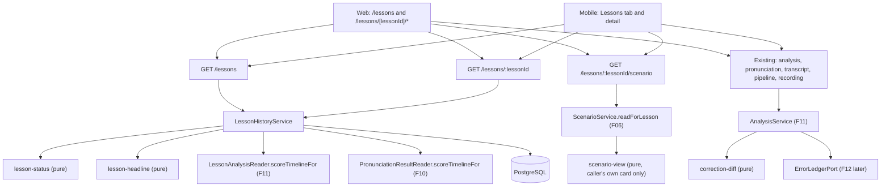

# Technical Specification: Lesson History and Individual Results

## 1. Technical Overview

**What:** F19 is the reading side of the post-lesson loop. It adds the two client surfaces every earlier pipeline feature deferred to it, and the API reads they need.

- **Lesson list**, on web and mobile: every lesson the caller took part in, newest first. Each row shows the date, duration, participants, vocabulary domain, the caller's own processing status and, once their result is ready, a one-line headline of their own change (`Grammar +4 · Pronunciation −2`). It is served by a new `GET /lessons` that derives the status from the caller's branch, because F07 decided the lesson-level status is derived, never stored.
- **Lesson detail**, on web and mobile, with four areas:
  - **Result:** the caller's six scores with deltas, strengths, errors by severity, scenario fit, recurring tags, topics and the pronunciation section.
  - **Scenario:** the shared situation plus the caller's own role card.
  - **Transcript:** the merged conversation with excerpt badges that expand to word-level colouring.
  - **Status:** the caller's full stepper with reasons and retry, plus a coarse stepper for every other participant.

  The areas are composed from the routes F07, F08, F10 and F11 already expose (`recording`, `pipeline`, `transcript`, `pronunciation`, `analysis`). F19 adds `GET /lessons/:lessonId` for the header and the other participants' coarse processing, and `GET /lessons/:lessonId/scenario` for a past lesson's scenario (F06's route only reads the open lesson).
- **Additive extensions** to routes that already exist, each scoped to the caller:
  - the analysis error view gains server-built correction segments (the changed span to emphasize) and a ledger recurrence count;
  - the pronunciation result gains its rounded overall score with a delta against the caller's previous assessed lesson;
  - the transcript's own-excerpt badge gains the assessed words with a colour band.
- **A new F12 seam**, `ErrorLedgerPort`, beside F06/F11's `ProfileTagsPort`. It returns nothing until F12 exists, so the recurrence badge appears once F12 replaces it.

**Why:** Five features (F07 to F11) each stopped at a caller-scoped route and wrote "F19 renders it". Until F19 exists, the pipeline produces results nobody can read, and the cycle "conversation → diagnosis → study" never closes for the learner. The feature's weight is in three places:
- **What a response refuses to carry.** Another participant's analysis, scores, errors, pronunciation data or role card never appears. Their processing is shown only as coarse states, following F08's transcript-speaker precedent.
- **A status vocabulary a person can act on.** Every `Blocked` row carries its fix and every `Failed` stage its retry.
- **Identical rendering on two clients.** Every derived sentence, delta, band and correction emphasis is computed once on the server, as F09 to F11 established.

**Scope — Included (the PRD gives F19 no Core/Full split, so the whole feature is in scope):**
- `GET /lessons` (keyset-paginated history with the derived status, flags, active stage, reason, headline and storage) and `GET /lessons/:lessonId` (the same summary plus the scenario step and every other participant's coarse stages).
- `GET /lessons/:lessonId/scenario`: a past lesson's shared situation plus only the caller's own role card.
- Additive extensions to the analysis, pronunciation and transcript views (see section 5), and `ErrorLedgerPort` in `apps/api/src/profile/`.
- Shared contracts for all of the above, plus stage, status and flag labels as shared constants, mirrored by hand-written Dart models.
- **Web:** `/lessons` and `/lessons/[lessonId]` with one sub-route per area. A `Lessons` destination in the header pill. A `Recent lessons` block on the dashboard, because F05 and F07 promise the lesson "appears immediately with a `Processing` status" there. Loading, empty and error states, and auto-refresh while something is still processing.
- **Mobile:** the `Lessons` tab (today a placeholder) becomes the list, and a pushed detail screen carries the same four areas as tabs. Also `EqMeter` and `EqChip`, which mirror the web primitives, and a `tabBarTheme` in `EqTheme`.
- Small primitive extensions on the web: `Meter` renders `—` for a `null` delta, and `NavPill` gains an accessible label, an always-visible mode and prefix matching. Both are reflected in the gallery and its visual baselines.

**Scope — Excluded:**
- **Any audio playback.** The PRD states "No audio playback of the lesson in the MVP; the transcript is the record", `docs/context.md` puts the synchronized player out of the MVP, and Section 7 excludes "any lesson replay". No route serves or signs a lesson audio object, and no client renders an audio control.
- **The ledger, the profile screen and the tag detail sheet.** F12 owns them. The recurrence badge reads F12 through `ErrorLedgerPort`, and the tag chip stays inert until F12's ledger detail exists (see Assumptions).
- **The `Plan generated` step's handler.** F12 appends `plan_generation` to the shared stage order (F12's A11) and F15 registers its handler. The stepper renders that order, so the step appears once F12 lands and reads `Queued` until F15.
- **Registering a `profile_update` handler.** F12 does that. Until then, the `Profile updated` step truthfully reads `Queued`.
- **Comparing participants, sharing or exporting a result, XP, streaks or badges.** Section 7 excludes them, and no export route exists.
- **Push notifications for a ready result.** Section 7, Mobile, excludes them.
- **Changing the pipeline itself.** Retry semantics, blocked resume and stage handlers are F08's. F19 only calls `POST …/pipeline/retry` and F07's `POST …/recording/retry`.

**PRD traceability:**

| PRD block | Where it lands |
|---|---|
| Consumes F06 (situation, own card) | `GET /lessons/:lessonId/scenario`; Scenario area; scenario step |
| Consumes F08 (utterances) | Transcript area, from F08's route; speaker labels and timestamps |
| Consumes F10 (aggregates, per-excerpt scores) | Pronunciation section; `overall` with delta; `assessedWords` on badges |
| Consumes F11 (analysis) | Result area; `correctionSegments`; `recurrence` |
| Consumes F21 (tokens, primitives, page states) | Component Overview (web and mobile); `EqMeter`, `EqChip`; page-state tests |
| Capabilities | Status derivation (section 2); API Contracts; Assumptions |
| Experience | Area composition table (section 2); web and mobile components; formatting assumptions |
| Error Handling (none in the PRD for F19) | Client error states and retry-error handling (section 2, "Client error handling") |
| Section 9, F19 | Testing Strategy, acceptance mapping |
| Section 9, Cross-Feature (F06/F08/F10/F11→F19, F06→F19/F20 domains, F21 screens) | Testing Strategy, cross-feature table |

**Assumptions and decisions not answered by the PRD.** Each is flagged for user review. The Policy column names the Auto-Accept row that produced it.

| # | Assumption (flagged) | Policy | Rationale |
|---|---|---|---|
| A1 | **Six primary statuses plus three flags.** A row has exactly one status: `processing`, `ready`, `blocked`, `failed`, `too_short` or `recording_failed`. It also has zero or more flags: `partial`, `no_scenario` and `ended_unexpectedly`. Statuses render as a `Badge`, flags as a `Chip` beside it, so all eight PRD labels (and F05's `ended_unexpectedly`) are visually distinct. | Description too vague | `Partial` and `No scenario` co-occur with every processing outcome: a no-scenario lesson can be ready, blocked or failed. Folding them into one chip would hide the actionable state ("Blocked — add your key") behind a descriptive one. F05's PRD Error Handling separately asks for `ended_unexpectedly` to be "flagged … in history". |
| A2 | **The status is the viewer's own**, derived by the precedence in section 2 from the lesson's recording status and the caller's branch. Other participants' progress never changes the caller's chip. | Clear recommendation | Results are per participant, and "one participant's missing key or failure never blocks another's". A lesson-wide status would show a ready learner as `Blocked` because of someone else's key, which contradicts the per-participant privacy and independence rules. |
| A3 | **`Ready` means the caller's `lesson_analysis` stage completed.** Later stages (`profile_update`, and `plan_generation`, which F12 appends and F15 handles) do not hold `Ready` back, but a later stage that fails or blocks turns the row to `Failed` or `Blocked` with its reason. | Clear recommendation | F11's Experience says the status "changes to `Ready`" when analysis completes. Without this rule the row would sit at `Processing` until F12 registers `profile_update`. |
| A4 | **`Partial` is F07's `recording_partial`**: at least one participant's recording launched while another failed or was interrupted. | Description too vague | This is the only lesson-level "partial" the PRD defines. The per-stage partials (`partial_assessment`, `sparse_pronunciation_sample`) already surface as F10's notes in the pronunciation section. |
| A5 | **`No scenario` is flagged when the lesson ended without a `ready` situation**: `no_scenario`, `failed`, `pending` or no row. A failed role card alone is not flagged. The scenario tab explains it instead. | Description too vague | This mirrors F11's scenario context `none`, so the flag and the analysis agree about whether a scenario was in play. |
| A6 | **The list holds lessons that started and ended** (`ended`, `ended_unexpectedly`) in which the caller has a participant row. `waiting`, `live` and `abandoned` lessons are excluded: the live one is the dashboard hero's, and an abandoned lesson never happened. A participant with no branch after finalization (possible only above the default cap) sees `failed` with a fixed sentence and no retry. They can still read the shared transcript and situation. | Description too vague | The PRD says "every lesson", and the lesson is expected to appear "immediately with a `Processing` status" once ended. |
| A7 | **Keyset pagination on `(started_at DESC, id DESC)`** with an opaque base64url cursor. `limit` defaults to 20, with a maximum of 50. `nextCursor` is `null` on the last page. The web shows `Load more` and mobile scrolls infinitely. | Partial PRD specification | This is the industry default for newest-first feeds, and it stays stable while new lessons are inserted. Page size is not in the PRD. |
| A8 | **Headline rule.** Take the six deltas (the five LLM competencies, then pronunciation) and drop `null` and `0`. Keep up to the two with the largest absolute value, breaking ties in that fixed order. Format them as `{Label} +N` / `{Label} −N` (U+2212) joined by ` · `. With no previous measurement at all: `Your first result`. With every delta `0`: `No change since your previous lesson`. The text is built by the server. | Partial PRD specification | The PRD gives one example (`Grammar +4 · Pronunciation −2`) but no rule. Building it on the server keeps web and mobile identical, like F10/F11's notes. |
| A9 | **Pronunciation delta** is the caller's rounded `pronunciation` score minus the rounded score of their most recent earlier lesson with an `assessed` result (`no_sample` is skipped). Each dimension compares with its own previous measurement, so pronunciation and the LLM scores may compare against different lessons. | Partial PRD specification | This is F11's `previousFor` rule applied to F10's data. Rounding before subtracting keeps the displayed numbers adding up. |
| A10 | **Other participants' processing is coarse**: each stage is `not_started`, `pending` (queued, running, retrying or blocked), `completed` (with start and finish times) or `unavailable` (failed). There is no reason, provider message, settings link, progress or retry. Blocked collapses into `pending`. | Clear recommendation | The PRD asks for every participant's branch but lists the reason and retry "when relevant". Only the owner can act on their own key or quota. F08's transcript already set the precedent: "another participant's reason for `pending` or `unavailable` is theirs". |
| A11 | **The scenario step** comes from F06: for the caller, the situation status and their own card status; for others, the situation status only. It has no duration and never a retry, because the scenario is immutable once the lesson starts (F06). | Description too vague | The PRD lists "scenario" as the first stage, but it is not a pipeline stage row. |
| A12 | **The stepper renders the shared stage order** (`pipelineStageSchema`), so the `plan_generation` stage F12 appends appears as `Plan generated` without changing F19, reading `Queued` until F15 registers its handler. Until F12 registers its handler, `Profile updated` reads `Queued`. | Clear recommendation | These are future integration points. Inventing a placeholder step now would show a state no data backs. |
| A13 | **Recurrence badge via `ErrorLedgerPort.occurrencesThrough(userId, lessonId, tags)`**, a new F12 seam in `apps/api/src/profile/`. Its production default returns an empty map. F12's implementation returns, per tag, the occurrences recorded from sources up to and including this lesson. The badge shows from 2 upward as a server-built ordinal (`2nd time`, `4th time`). **Until F12 lands, no badge renders, and the acceptance criterion is proven with a test-only fake.** | No codebase pattern found (this follows the `ProfileTagsPort` rule in `apps/api/AGENTS.md`) | The PRD makes the ledger the source of the count. Counting F11's error rows now would diverge from the ledger as soon as activities write to it. F12's spec adopts this contract (its section 5 and 6 notes) and adds the port if it lands first. |
| A14 | **The tag chip on an error card is not interactive** until F12 ships the ledger detail. Then it opens it: on web a link to `/profile?tag={tag}`, on mobile F12's detail sheet after resolving the entry through `GET /profile/ledger?tag=`. Whichever of F12 and F19 lands second wires it. | Description too vague | "A tag chip on each card opens that tag's ledger detail", but no ledger exists yet. A dead link is worse than a plain chip. |
| A15 | **Correction emphasis is server-built** as `correctionSegments`. It is a word-level LCS between the quote and the correction, compared case- and punctuation-insensitively. Correction tokens outside the LCS are `changed: true`. | Clear recommendation | F11's note left the emphasis to F19. One implementation, on the server, means web and Dart cannot disagree. |
| A16 | **Word colouring bands** use the word's accuracy rounded to an integer: `good` ≥ 80, `fair` 60–79, `poor` < 60 (`PHONEME_FAILURE_THRESHOLD`). The band is server-built. Colour is always paired with a non-colour cue (solid underline for `poor`, dotted for `fair`) and an accessible label carrying the score and error types. | Partial PRD specification | F18's "green / amber / red" names the bands but not the thresholds. 60 is F10's own failure threshold, and 80 is the conventional "good" floor for Azure scores. F21 forbids status by colour alone. |
| A17 | **Word-level detail rides on the transcript's own-excerpt badge** (`excerpt.assessedWords`) rather than on a new route. | Clear recommendation | The detail expands inside the transcript, and F10's rule that `excerpt.pronunciation` equals the section's object stays untouched. |
| A18 | **The pronunciation section also lists the assessed excerpts** (reference text, score badge, link into the transcript). | Description too vague | This makes the cross-feature criterion "excerpt badges … match the scores shown in the pronunciation section" visible and testable. Without it the section shows only aggregates. |
| A19 | **Client-side formatting, with identical rules on both clients** and tested with the same case table. Relative dates use the formatter shared with F12 (web `lib/relative-time.ts`, mobile `core/format/relative_time.dart`; F12's A29), created by whichever feature lands first: `Just now` under a minute, `N minutes ago` under an hour, `N hours ago` the same calendar day, `Yesterday`, `N days ago` (2–6), else `12 Mar` (same year) or `12 Mar 2025`, in the viewer's timezone against the view's `serverTime` when it carries one. Durations: `42 min`, `1 h 05 min`. Transcript clock: `mm:ss`, or `h:mm:ss` past an hour. Sizes: `12.4 MB` (1024-based, one decimal). Elapsed and stage durations: `1m 04s`. | Partial PRD specification | A relative date depends on the viewer's clock and timezone, which the server does not know. |
| A20 | **Refresh.** The web calls `router.refresh()` every 10 s while any visible lesson is `processing` or `blocked` (blocked resumes by itself within about 60 s of a key being saved). Mobile runs a 10 s timer while the screen is visible, plus pull-to-refresh. | Partial PRD specification | This keeps the PRD's "the user always knows which stage failed" true without push notifications (Section 7). |
| A21 | **Storage**: each row carries its lesson's `storageBytes` (F07's figure), and the list response carries `totalStorageBytes` across every listed lesson, shown once above the list. | Partial PRD specification | F07's PRD: "storage usage is reported on the lesson list". |
| A22 | **Web routing and navigation.** `/lessons` is the list. `/lessons/[lessonId]` is the Result area, with `/scenario`, `/transcript` and `/status` sub-routes. The header pill gains `Lessons`. With F12's `Profile` (same wave) the order is Dashboard, Profile, Lessons, Settings, mirroring the mobile tabs, and whichever feature lands second inserts its pill into that order. The tabs reuse `NavPill`. | Clear recommendation | Sub-routes give each area a deep link and make "open the transcript at this utterance" an ordinary anchor (`…/transcript#u-{utteranceId}`). F22 says "a later feature adds its destination to the same pill". |
| A23 | **A `Recent lessons` block on the web dashboard** shows the three newest rows and a `See all lessons` link. It is not in the dashboard mockup, and `design/README.md` gets a note naming the PRD clause that requires it. Mobile needs no equivalent: its `Lessons` tab is the destination, and lessons end on the web. | Clear recommendation | F05's Experience ("returns them to the dashboard, where the lesson appears immediately with a `Processing` status") and F07's ("appears at the top of the history list"). |
| A24 | **No mockup exists for lesson history or results** on either client (`design/README.md` covers no such screen). Both clients compose from the design-system primitives, and mobile follows `mobile-ui` case 3. **Generating a Stitch mockup before implementation is recommended.** | No codebase pattern found | This is the same situation F08 to F11 recorded ("`./design` has no lesson-detail mockup"). |
| A25 | **`Meter` accepts `delta: null`**, rendered as an em dash with the accessible text "no previous result". `EqMeter` mirrors it. | Clear recommendation | F11's Experience: "`+4`, `−2`, or `—` on a first lesson". The primitive has no way to say "no previous" today. |
| A26 | **List rows also show the situation's title** when one exists. | Description too vague | It makes a lesson findable ("find any session") beyond its date. It is null for lessons without a situation. |
| A27 | **No new dependency, environment variable, migration or error code.** An invalid cursor is `VAL001`. A lesson the caller did not take part in is `CLASS004`, which the clients render as "This lesson isn't available to you." with `Back to lessons`. | Clear recommendation | Existing indexes (`ix_lesson_participants_user_joined`, primary keys, `ux_branches_lesson_user`) bound every query at this scale (see section 6). |

## 2. Architecture Impact

**Affected components:**

| Area | Path |
|---|---|
| Shared contracts | `packages/shared/src/schemas/lessons.ts` (new), `pipeline.ts`, `scenario.ts`, `analysis.ts`, `pronunciation.ts`, `excerpt.ts`, `src/index.ts` |
| API: history | `apps/api/src/lessons/**` (new) |
| API: scenario | `apps/api/src/scenario/scenario-view.ts` (new), `lesson-scenario.controller.ts` (new), `scenario.service.ts`, `scenario.module.ts` |
| API: analysis, pronunciation, transcript | `apps/api/src/analysis/**`, `apps/api/src/pronunciation/**`, `apps/api/src/transcription/transcript.service.ts` |
| API: F12 seam | `apps/api/src/profile/error-ledger.port.ts` (new), `profile.module.ts` |
| API: wiring and docs | `apps/api/src/app.module.ts`, `apps/api/src/openapi/components.ts`, `setup.ts`, `docs/api/openapi.json` |
| Web | `apps/web/src/app/(app)/lessons/**` (new), `apps/web/src/components/lessons/**` (new), `components/dashboard/recent-lessons.tsx` (new), `components/app-header.tsx`, `components/ui/meter.tsx`, `components/ui/nav-pill.tsx`, `components/classroom/situation-card.tsx`, `lib/lessons.ts`, `lib/lessons-server.ts` (new), `app/(app)/dashboard/page.tsx`, `app/(dev)/design-system/sections/meter-section.tsx` |
| Mobile | `apps/mobile/lib/features/lessons/**`, `lib/features/shell/shell_module.dart`, `lib/design/widgets/eq_meter.dart` (new, or reused if F12 landed first), `eq_chip.dart` (same), `lib/design/eq_theme.dart` |
| Design reference | `design/README.md` (the header pill row, and a dashboard note for `Recent lessons`) |

**Reads, per area:**



**Area composition (identical on both clients):**

| Area | Routes read | Renders |
|---|---|---|
| Header (every tab) | `GET /lessons/:lessonId` | Date (absolute and relative), duration, participants, domain chip, status badge, flag chips, storage |
| Result (default) | `analysis`, `pronunciation`, `pipeline` | A status panel while analysis is not `ready`; six meters with deltas and justifications; notes; strengths; errors grouped Major → Moderate → Minor; scenario fit; recurring tags; topics; the pronunciation section (five meters, notes, worst phonemes, worst words, assessed excerpts) |
| Scenario | `GET /lessons/:lessonId/scenario` | The situation card (read-only) and the caller's role card, or `No scenario was in play for this lesson.` |
| Transcript | `transcript` | Speaker legend with coarse per-speaker status; merged utterances with `mm:ss` margin and speaker label; badges on the caller's excerpts that expand to word colouring, the selection reason and the five scores |
| Status | `pipeline`, `recording`, `GET /lessons/:lessonId` | The caller's stepper (the scenario step, then every stage with state, duration or elapsed time, `N of M excerpts`, reason, provider message, settings link, `Retry` with the last attempt time, and the captured duration of a partial recording); then one coarse stepper per other participant |

Links between areas: an error's `See in transcript`, a worst word and an assessed excerpt all open `…/transcript#u-{utteranceId}`, which scrolls to and highlights the line. A `Blocked` stage links to settings (web `/settings`, mobile `/app/settings`). The pending status panel links to the Status tab.

**Lesson status derivation (`lesson-status.ts`, pure). The first matching row wins:**

| # | Condition | Status | `activeStage` | `statusReason` |
|---|---|---|---|---|
| 1 | `lessons.recording_status = 'too_short'` | `too_short` | null | `Too short to analyze (minimum 3 minutes)` |
| 2 | `recording_status = 'recording_failed'` | `recording_failed` | null | `This lesson was not recorded, so it could not be analyzed.` |
| 3 | The caller has no branch and the recording is still finalizing (`idle`, `starting`, `recording`, `not_recording`, `finalizing`) | `processing` | `recording` | null |
| 4 | The caller has no branch and `recording_status = 'storage_unavailable'` | `failed` | `recording` | F08's `Storage was unavailable when this recording was verified.` |
| 5 | The caller has no branch (any other recording status) | `failed` | null | `You were not in this lesson after it started, so it has no result for you.` |
| 6 | Branch `status` is `failed` or `storage_unavailable` | `failed` | branch `stage` | branch `failure_reason`, or the storage sentence |
| 7 | Branch `status` is `blocked_missing_key` | `blocked` | branch `stage` | that stage row's `reason` (for example `Blocked — add your Gemini key to analyze this lesson.`) |
| 8 | The caller's `lesson_analysis` stage row is `completed` | `ready` | null | null |
| 9 | Anything else (verifying, queued, running, retrying) | `processing` | branch `stage` | null |

Flags, independent of the status: `partial` when `recording_status = 'recording_partial'`; `no_scenario` per A5; `ended_unexpectedly` when `lessons.status = 'ended_unexpectedly'`.

**Other participants' coarse stages (`lesson-status.ts`, pure):** every stage in `PIPELINE_STAGE_ORDER` is listed. The `recording` entry reads `completed` once the branch was launched or moved past recording, `unavailable` when it failed at recording, and `pending` otherwise. Later stages map their stage rows: `completed` → `completed` (with `startedAt` and `finishedAt`); `failed` → `unavailable`; `queued`, `running`, `retrying` or `blocked_missing_key` → `pending`; no row → `not_started`. With no branch after finalization, recording is `unavailable` and the rest `not_started`.

**Client error handling (the PRD has no Error Handling block for F19):**

| Situation | Web and mobile behaviour |
|---|---|
| List request fails (network, 5xx) | `ErrorState` / `EqError`: "We could not load your lessons." with `Try again`. On mobile, offline shows the `ApiException` message (F03's convention) |
| No lessons yet | `EmptyState`: "No lessons yet" / "A lesson appears here as soon as it ends." Web action: `Open classroom`. Mobile action: `Refresh` (the classroom is web-only) |
| Detail returns `CLASS004` | "This lesson isn't available to you." with `Back to lessons` |
| One area's request fails | Only that area shows its error state with `Try again`. The header and the other areas stay usable |
| Retry answers `PIPE001` (already retried, or no longer failed) | Refresh the view silently. The fresh stepper shows the real state |
| Retry answers `PIPE002` | Call F07's `POST /lessons/:lessonId/recording/retry` instead (the route named in `details.retryRoute`) |
| Recording retry answers `REC001` / `REC002` | Show the code's message inline under the step and refresh |

## 3. Technical Decisions

| Decision | Chosen Approach | Alternative Considered | Trade-off |
|---|---|---|---|
| Lesson status vocabulary | Six primary statuses plus three flags, per viewer (A1, A2) | (a) One chip among eight with a precedence. (b) A lesson-wide status across all branches | A row can carry two or three chips. Accepted because no flag can hide the actionable state, and one learner's missing key never changes another's row |
| How the detail is served | Compose the existing per-area routes; add only a summary route and a lesson-scoped scenario route | One aggregate `GET /lessons/:lessonId/result` returning everything | Up to five requests for a full detail, but each area loads, fails and refreshes on its own. Accepted because F07 to F11 each already own a caller-scoped route with its privacy tests, and an aggregate would duplicate every one of them |
| Other participants' processing | Coarse stages on `GET /lessons/:lessonId` (A10) | (a) Only the caller's stepper. (b) Full parity, with reason and retry for others | Others' blocked stages read as `pending`. Accepted because (a) contradicts "every participant's branch", and (b) exposes someone else's key state and lets a person spend another's quota |
| Scenario for a past lesson | New `GET /lessons/:lessonId/scenario` returning `LessonScenarioView` (no reroll fields), built by a pure `scenario-view` shared with F06's open-lesson view | Reuse `ScenarioView` with `canReroll: false` | A second, narrower schema. Accepted because reroll counters are meaningless after a lesson, and one pure builder keeps the "only the caller's own card" rule in one place |
| Correction emphasis | Server-built `correctionSegments` (A15) | A client-side diff in TypeScript and Dart | The analysis contract grows. Accepted because two diff implementations would drift, and the server already builds every other derived sentence |
| Word-level detail | `excerpt.assessedWords` on the transcript's own-excerpt badge (A17) | (a) `words` on the pronunciation route's excerpts. (b) A per-excerpt route | The transcript payload grows by at most 12 excerpts' words. Accepted because the detail expands in the transcript, so no join or extra request is needed, and F10's badge-equals-section object stays untouched |
| Recurrence count | `ErrorLedgerPort`, neutral until F12 (A13) | Count F11's `lesson_analysis_errors` rows now | No badge until F12 ships. Accepted because the PRD names the ledger as the source, and a count from lesson rows alone would disagree with the ledger once F16 to F18 write to it |
| Headline and deltas on the list | Load the caller's score timelines (score columns only) once per request and compute every delta with one pure function | Call the readers' `previousFor` per row | This reads every analysed lesson of the caller. Accepted because it is a constant number of queries, is correct across page boundaries, and the volume is small (two users, hundreds of lessons). A test pins it to the detail's deltas |
| Pagination | Keyset cursor (A7) | Offset and limit | Slightly more code. Accepted because a lesson ending while someone pages would shift an offset page |
| Web tabs | Sub-routes with `NavPill` (A22) | Client-state tabs on one page, or a new `Tabs` primitive | `NavPill` gains three small props. Accepted because deep links and anchors come free, and it extends a primitive rather than adding one |
| Mobile tabs | Material `TabBar` / `TabBarView` themed through a new `EqTheme.tabBarTheme` | A custom segmented control | Relies on `EqTheme` covering the widget. Accepted because `mobile-ui` allows a Material widget whose look comes entirely from `EqTheme` |
| Web data loading | Server components for first paint, plus a client `AutoRefresh` that calls `router.refresh()` while something is processing | Fully client-side fetching hooks | Retry buttons and `Load more` are small client islands. Accepted because this matches the dashboard's server reads, keeps the session cookie server-side, and refreshes without hand-written state |

## 4. Component Overview

**Shared (`packages/shared/src/`):**

| File Path | New/Modified | Purpose | Key Responsibilities |
|---|---|---|---|
| `schemas/lessons.ts` | New | History contract | `lessonHistoryStatusSchema` (six), `lessonHistoryFlagSchema` (three), `lessonParticipantSummarySchema`, `lessonSummarySchema`, `lessonListSchema`, `lessonListQuerySchema` (`cursor?`, `limit` coerced 1–50, default 20), `participantStageStateSchema`, `otherParticipantProcessingSchema`, `lessonDetailViewSchema`; `lessonHistoryStatusLabels` and `lessonHistoryFlagLabels` |
| `schemas/pipeline.ts` | Modified | Stage labels | `pipelineStageLabels: Record<PipelineStage, { title, active }>` (for example `transcription` → `Transcribed` / `Transcribing`), so no stage can be added without its label. Includes `plan_generation` → `Plan generated` if F12 has landed first; otherwise F12 adds it |
| `schemas/scenario.ts` | Modified | Past-lesson scenario | `lessonScenarioViewSchema` (`lessonId`, `status`, `situation`, `myRoleLabel`, `myCard`). There is no field for another card |
| `schemas/analysis.ts` | Modified | Error view extensions | `correctionSegmentSchema`, `errorRecurrenceSchema`; `analysisErrorViewSchema` gains `correctionSegments` and `recurrence` |
| `schemas/pronunciation.ts` | Modified | Overall score and words | `pronunciationOverallSchema` (`score`, `delta`), `pronunciationWordBandSchema`, `assessedWordSchema`; `lessonPronunciationResultSchema` gains `overall` |
| `schemas/excerpt.ts` | Modified | Badge words | `transcriptExcerptSchema` gains `assessedWords` (`assessedWord[] \| null`) |
| `index.ts` | Modified | Barrel | Re-exports |

**Backend: history (`apps/api/src/lessons/`):**

| File Path | New/Modified | Purpose | Key Responsibilities |
|---|---|---|---|
| `lessons.module.ts` | New | Wiring | Imports `PipelineModule` (access), `AnalysisModule` and `PronunciationModule` (readers). Provides the service and controller |
| `lessons.constants.ts` | New | Fixed values | Page size (20, maximum 50), the status-reason sentences for rows 1, 2 and 5, the headline fallback sentences, the listed lesson statuses |
| `lesson-status.ts` | New | Pure derivation | `deriveLessonStatus(lesson, branchWithStages \| null, scenarioStatus)` → `{ status, flags, activeStage, statusReason }` per the table in section 2; `coarseStages(branch, recordingStatus)` for others. No I/O |
| `lesson-headline.ts` | New | Pure deltas and text | `deltasByLesson(analysisTimeline, pronunciationTimeline)` → per lesson six `delta \| null`, matching `previousFor`; `headlineText(deltas)` per A8 |
| `lesson-cursor.ts` | New | Pure cursor | `encodeCursor({ startedAt, id })` / `decodeCursor(text)` → the value or null (invalid → `VAL001` in the service) |
| `lesson-history.service.ts` | New | Queries | `list(callerId, query)`: one page plus batched reads (caller's branches with stages, scenarios, participants with display names, audio bytes, both score timelines, total storage), with a constant number of queries per page. `detail(lessonId, callerId)`: the same summary plus the scenario step and others' coarse stages. Never reads another participant's card, analysis or pronunciation rows |
| `lessons.controller.ts` | New | HTTP surface | `GET /lessons` (`@Query` through `ZodValidationPipe`) and `GET /lessons/:lessonId`, with OpenAPI decorators |

**Backend: extensions:**

| File Path | New/Modified | Purpose | Key Responsibilities |
|---|---|---|---|
| `apps/api/src/scenario/scenario-view.ts` | New | Pure builder | Builds the situation and caller-card projection from the scenario row and the caller's own card row. Used by `buildView` and the lesson view |
| `apps/api/src/scenario/scenario.service.ts` | Modified | Lesson read | `readForLesson(lessonId, callerId)`: the participant check through `LessonAccessService`, then the pure builder. `buildView` reuses the builder |
| `apps/api/src/scenario/lesson-scenario.controller.ts` | New | HTTP surface | `GET /lessons/:lessonId/scenario`, tag `scenario` |
| `apps/api/src/scenario/scenario.module.ts` | Modified | Wiring | Imports `PipelineModule`; registers the new controller |
| `apps/api/src/analysis/correction-diff.ts` | New | Pure | `correctionSegments(quote, correction)` per A15. Adjacent tokens with the same flag merge into one segment |
| `apps/api/src/analysis/recurrence-label.ts` | New | Pure | `ordinalTimes(n)` → `2nd time`, `3rd time`, `11th time`, `21st time` |
| `apps/api/src/analysis/analysis.service.ts` | Modified | View | Adds `correctionSegments` to each error, and `recurrence` from `ErrorLedgerPort` (a count of at least 2 gives `{ count, label }`; otherwise null) |
| `apps/api/src/analysis/analysis-result.reader.ts` | Modified | Timeline | `scoreTimelineFor(userId)` → `[{ lessonId, startedAt, scores }]` for every analysed lesson of that user, score columns only |
| `apps/api/src/profile/error-ledger.port.ts` | New (already implemented if F12 landed first) | F12 seam | `occurrencesThrough(userId, lessonId, tags)` → `Map<tag, count>`; the production default returns an empty map |
| `apps/api/src/profile/profile.module.ts` | Modified | Wiring | Provides and exports `ErrorLedgerPort` |
| `apps/api/src/pronunciation/pronunciation.constants.ts` | Modified | Bands | `WORD_BAND_GOOD_MIN = 80`; `poor` reuses `PHONEME_FAILURE_THRESHOLD` |
| `apps/api/src/pronunciation/pronunciation-words.ts` | New | Pure | `wordBand(accuracy)`; `toAssessedWords(storedWords)` → `{ text, accuracy (rounded), errorTypes, band }[]` |
| `apps/api/src/pronunciation/pronunciation-result.reader.ts` | Modified | Previous and timeline | `previousAssessedFor(userId, beforeStartedAt)` and `scoreTimelineFor(userId)` (assessed results only) |
| `apps/api/src/pronunciation/pronunciation.service.ts` | Modified | View | `result.overall = { score: round(pronunciation), delta }` |
| `apps/api/src/transcription/transcript.service.ts` | Modified | Badge | Adds `assessedWords` to the caller's badges (null unless the excerpt is assessed). Other participants' utterances are unchanged |
| `apps/api/src/app.module.ts` | Modified | Root | Imports `LessonsModule` |
| `apps/api/src/openapi/components.ts`, `setup.ts` | Modified | Document | Registers `LessonList`, `LessonDetailView` and `LessonScenarioView`, and the `lessons` tag |

**Web (`apps/web/src/`):**

| File Path | New/Modified | Purpose | Key Responsibilities |
|---|---|---|---|
| `lib/lessons-server.ts` | New | Server reads | `getLessonList`, `getLessonDetail`, `getLessonScenario`, `getLessonAnalysis`, `getLessonPronunciation`, `getLessonTranscript`, `getLessonPipeline`, `getLessonRecording`. Each returns `{ ok, data } \| { ok: false, status, code }` so pages choose the right state |
| `lib/lessons.ts` | New | Browser calls | `fetchLessonPage(cursor)`, `retryPipelineStage(lessonId)`, `retryRecording(lessonId)` |
| `components/lessons/format.ts` | New | Formatters | Absolute date, duration, clock, elapsed and bytes, per A19. Relative dates come from the shared `lib/relative-time.ts` (new, or reused if F12 landed first) |
| `components/lessons/lesson-status-badge.tsx` | New | Status and flags | Maps the six statuses to `Badge` statuses (`processing` info, `ready` success, `blocked` warning, `failed` and `recording_failed` danger, `too_short` neutral) and the flags to `Chip` tones, with the shared labels |
| `components/lessons/lesson-row.tsx` | New | One row | A link to the detail, carrying the relative date, title, duration, participants, domain chip, status and flags, and then either the active stage (`Transcribing`), the reason (blocked or failed), or the headline (ready) |
| `components/lessons/lesson-list.tsx` | New | List (client) | The first page from props, `Load more` through the cursor, the total storage line, and the empty state |
| `components/lessons/auto-refresh.tsx` | New | Refresh (client) | `router.refresh()` every 10 s while `active` |
| `app/(app)/lessons/page.tsx`, `loading.tsx`, `error.tsx` | New | List route | Server read, skeleton, error with retry |
| `app/(app)/lessons/[lessonId]/layout.tsx` | New | Detail frame | Header from `GET /lessons/:lessonId`, the four-destination `NavPill` (`label="Lesson sections"`, always visible), `AutoRefresh`, and the `CLASS004` state |
| `app/(app)/lessons/[lessonId]/page.tsx` | New | Result area | Composes the result components |
| `app/(app)/lessons/[lessonId]/scenario/page.tsx`, `transcript/page.tsx`, `status/page.tsx`, `loading.tsx`, `error.tsx` | New | Other areas | One server read per area, plus the page states |
| `components/lessons/result/result-status-panel.tsx` | New | Analysis not ready | Pending (active stage and a link to Status), blocked (reason and settings link), failed (reason and `Retry`), unavailable (the summary's reason) |
| `components/lessons/result/score-meters.tsx` | New | Six meters | The five LLM meters with `delta` and justification, and Pronunciation from `overall`, or the `no_sample` sentence |
| `components/lessons/result/error-groups.tsx`, `error-card.tsx` | New | Errors | Major / Moderate / Minor groups, omitting empty ones. Each card has the quote in quotation marks, the correction with its `changed` segments emphasized, the explanation, the tag `Chip`, a recurrence `Badge` and `See in transcript` |
| `components/lessons/result/scenario-fit.tsx` | New | Fit | Role played, expected register and whether it matched, the comment, and used / not-used expression chips. Absent without a fit, with the "no scenario" line when the context is `none` |
| `components/lessons/result/strengths-topics.tsx` | New | Lists | Strengths, recurring tags (labels taken from the errors' `tagLabel`), topics, notes |
| `components/lessons/result/pronunciation-section.tsx` | New | F10 section | Five meters (`Not measured` for a null prosody), notes, worst phonemes, worst words linked to the transcript, and assessed excerpts with score badges |
| `components/lessons/scenario-area.tsx` | New | Scenario | `SituationCard` in read-only mode, `RoleCardPanel`, or the no-scenario state |
| `components/lessons/transcript/transcript-view.tsx`, `utterance-row.tsx`, `excerpt-detail.tsx`, `word-colouring.tsx` | New | Transcript | Speaker legend, rows with clock margin and label (`You` for the caller), the badge `button` with `aria-expanded`, the expanded detail (bands with underline cues and per-word `aria-label`, the reason, five scores), and anchor highlighting |
| `components/lessons/status/stepper.tsx`, `own-stepper.tsx`, `other-stepper.tsx`, `retry-action.tsx` | New | Status | The caller's full stepper (state, elapsed from `serverTime`, duration, `N of M excerpts`, reason, provider message in a details line, settings link, `Retry` with the last attempt, recording retry when `mine.branch.retryable`, captured duration when partial). Others' coarse steppers |
| `components/dashboard/recent-lessons.tsx` | New | Dashboard block | The three newest rows, `See all lessons`, and the same empty state |
| `app/(app)/dashboard/page.tsx` | Modified | Mount | Adds `Recent lessons` below the recommended-scenario card |
| `components/app-header.tsx` | Modified | Navigation | `Lessons` destination (prefix-matched) |
| `components/ui/nav-pill.tsx` | Modified | Primitive | Optional `label`, `alwaysVisible`, and per-destination `matchPrefix` |
| `components/ui/meter.tsx` | Modified | Primitive | `delta?: number \| null`, where null renders `—` with accessible text |
| `components/classroom/situation-card.tsx` | Modified | Read-only mode | The reroll props become optional, and the button is absent without them |
| `app/(dev)/design-system/sections/meter-section.tsx` | Modified | Gallery | Adds the "no previous result" example (its visual baselines are regenerated) |

**Mobile (`apps/mobile/lib/`):**

| File Path | New/Modified | Purpose | Key Responsibilities |
|---|---|---|---|
| `design/widgets/eq_meter.dart` | New (reused if F12 landed first) | Primitive mirror | Web `Meter`'s props: `value`, `state` (scored or warming up), `label`, `delta` (null → `—`), `Semantics` value |
| `design/widgets/eq_chip.dart` | New (reused if F12 landed first) | Primitive mirror | Web `Chip`'s tones and `count` |
| `design/eq_theme.dart` | Modified | Component theme | `tabBarTheme` (outlined indicator, token type, no Material tint) |
| `features/lessons/models/lesson_models.dart` | New | Dart mirror | List, summary, detail, statuses, flags, labels, coarse stages |
| `features/lessons/models/pipeline_models.dart`, `transcript_models.dart`, `pronunciation_models.dart`, `analysis_models.dart`, `scenario_models.dart`, `recording_models.dart` | New | Dart mirrors | The existing views plus F19's extensions. An unknown stage wire value parses to a fallback that renders the value humanized |
| `features/lessons/lessons_api.dart` | New | Transport | Every read and both retries through the shared `Dio` |
| `features/lessons/lesson_format.dart` | New | Formatters | The same rules and case table as the web's `format.ts`. Relative dates come from the shared `core/format/relative_time.dart` (new, or reused if F12 landed first) |
| `features/lessons/lessons_module.dart` | New | Routes | `/lessons/` (list) and `/lessons/:lessonId` (detail) |
| `features/lessons/lesson_list_controller.dart`, `lessons_page.dart` | New / Modified | List | The placeholder is replaced by rows, infinite scroll, pull-to-refresh, 10 s polling while needed, the total storage line, and `EqLoading` / `EqEmpty` / `EqError` |
| `features/lessons/lesson_detail_controller.dart`, `lesson_detail_page.dart` | New | Detail | Header plus `TabBar` (Result, Scenario, Transcript, Status), per-area load and error states, polling, and tab switching with scroll-to-utterance |
| `features/lessons/tabs/result_tab.dart`, `scenario_tab.dart`, `transcript_tab.dart`, `status_tab.dart` | New | Areas | The same content and order as the web areas |
| `features/lessons/widgets/lesson_row.dart`, `lesson_status_badge.dart`, `error_card.dart`, `situation_card.dart`, `role_card_panel.dart`, `utterance_tile.dart`, `word_colouring.dart`, `stage_stepper.dart` | New | Screen widgets | Composed from `Eq*` widgets only |
| `features/shell/shell_module.dart` | Modified | Mount | Replaces the `/lessons` route with `lessonsModule` |

**Database:** no migration (see section 6).

**Documentation:**

| File Path | New/Modified | Purpose | Key Responsibilities |
|---|---|---|---|
| `docs/api/openapi.json` | Regenerated | API document | The three new routes, their components, and the extended analysis, pronunciation and transcript components |
| `design/README.md` | Modified | Design reference | The header pill row names `Lessons`; the dashboard section gets a note for `Recent lessons` (PRD F05 and F07 Experience) |

## 5. API Contracts

Authentication follows F01's two transports through the global `SessionGuard`. Every `/lessons/:lessonId…` route answers `CLASS004` for a lesson the caller did not take part in and for an unknown id (F05's precedent), and `VAL001` for a malformed id.

---

### Endpoint: List the caller's lessons

- **Method:** GET
- **Path:** `/lessons`
- **Authentication:** Session cookie or bearer token

**Request (query):**

| Field | Type | Required | Validation | Description |
|---|---|---|---|---|
| `cursor` | `string` | No | base64url, at most 200 characters, decodes to `{ startedAt, id }` | The previous page's `nextCursor` |
| `limit` | `integer` | No | 1–50, default 20 | Page size |

**Request Example:** `GET /lessons?limit=20`

**Response (200):**

| Field | Type | Description |
|---|---|---|
| `data.lessons[]` | `array` | Newest first by `startedAt`, then `lessonId` |
| `…lessons[].lessonId` | `uuid` | The lesson |
| `…startedAt` / `…endedAt` | `datetime` | Lesson start and end |
| `…durationSeconds` | `integer \| null` | F05's duration |
| `…participants[]` | `array` | `userId`, `displayName`, `isMe`. Names only |
| `…scenarioTitle` | `string \| null` | The situation's title when `ready` |
| `…vocabularyDomain` | `string \| null` | The situation's domain when `ready` (F06's controlled vocabulary) |
| `…status` | `string` | `processing`, `ready`, `blocked`, `failed`, `too_short`, `recording_failed`: the caller's own |
| `…flags[]` | `string[]` | `partial`, `no_scenario`, `ended_unexpectedly` |
| `…activeStage` | `string \| null` | The caller's stage for `processing`, `blocked` and `failed` (see section 2) |
| `…statusReason` | `string \| null` | Server-built sentence for `blocked`, `failed`, `too_short` and `recording_failed` |
| `…headline` | `string \| null` | Only for `ready`, per A8 |
| `…storageBytes` | `integer` | Sum of every participant's verified audio (F07), with no individual breakdown |
| `data.nextCursor` | `string \| null` | Null on the last page |
| `data.totalStorageBytes` | `integer` | Across every lesson the caller would see in the list |

**Response Example:**
```json
{
  "data": {
    "lessons": [
      {
        "lessonId": "9f1c4d7e-3b2a-4f51-9d0c-7a6b5e4c3d21",
        "startedAt": "2026-09-24T14:10:03.000Z",
        "endedAt": "2026-09-24T15:02:41.000Z",
        "durationSeconds": 3158,
        "participants": [
          { "userId": "3f8b1a20-5c6d-4e7f-8a91-2b3c4d5e6f70", "displayName": "Miguel", "isMe": true },
          { "userId": "b21e9a44-7f30-4c18-9e55-1d2c3b4a5e6f", "displayName": "Ana", "isMe": false }
        ],
        "scenarioTitle": "The missed connection",
        "vocabularyDomain": "travel",
        "status": "ready",
        "flags": [],
        "activeStage": null,
        "statusReason": null,
        "headline": "Grammar +4 · Pronunciation −2",
        "storageBytes": 48213504
      },
      {
        "lessonId": "1a2b3c4d-5e6f-4a7b-8c9d-0e1f2a3b4c5d",
        "startedAt": "2026-09-21T19:02:11.000Z",
        "endedAt": "2026-09-21T19:40:55.000Z",
        "durationSeconds": 2324,
        "participants": [
          { "userId": "3f8b1a20-5c6d-4e7f-8a91-2b3c4d5e6f70", "displayName": "Miguel", "isMe": true },
          { "userId": "b21e9a44-7f30-4c18-9e55-1d2c3b4a5e6f", "displayName": "Ana", "isMe": false }
        ],
        "scenarioTitle": null,
        "vocabularyDomain": null,
        "status": "blocked",
        "flags": ["no_scenario"],
        "activeStage": "lesson_analysis",
        "statusReason": "Blocked — add your Gemini key to analyze this lesson.",
        "headline": null,
        "storageBytes": 35127296
      }
    ],
    "nextCursor": "eyJzIjoiMjAyNi0wOS0yMVQxOTowMjoxMS4wMDBaIiwiaSI6IjFhMmIzYzRkIn0",
    "totalStorageBytes": 412339200
  }
}
```

**Error Codes:**

| Code | HTTP Status | Description |
|---|---|---|
| `VAL001` | 400 | `limit` out of range, or a cursor that does not decode |
| `AUTH003` | 401 | No valid session |

---

### Endpoint: Read one lesson's summary and processing overview

- **Method:** GET
- **Path:** `/lessons/:lessonId`
- **Authentication:** Session cookie or bearer token

**Request:**

| Field | Type | Required | Validation | Description |
|---|---|---|---|---|
| `lessonId` | `uuid` | Yes | path param, valid UUID | The lesson |

**Response (200):** every field of one `lessons[]` entry above, plus:

| Field | Type | Description |
|---|---|---|
| `data.scenario.status` | `string` | F06's `pending`, `ready`, `failed` or `no_scenario`, or `none` when there is no row |
| `data.scenario.myCardStatus` | `string \| null` | The caller's own card: `pending`, `ready`, `failed`, or null without a card row. Never another participant's |
| `data.others[]` | `array` | Every other participant with a participant row, in join order |
| `…others[].userId` / `displayName` | `uuid` / `string` | Identity (names only) |
| `…others[].stages[]` | `array` | Every stage of the shared order: `stage`, `state` (`not_started`, `pending`, `completed`, `unavailable`), `startedAt` and `finishedAt` (set only for `completed`). No reason, provider, progress or retry field exists in the schema |

**Response Example (the `others` entry only):**
```json
{
  "data": {
    "lessonId": "9f1c4d7e-3b2a-4f51-9d0c-7a6b5e4c3d21",
    "status": "processing",
    "activeStage": "lesson_analysis",
    "scenario": { "status": "ready", "myCardStatus": "ready" },
    "others": [
      {
        "userId": "b21e9a44-7f30-4c18-9e55-1d2c3b4a5e6f",
        "displayName": "Ana",
        "stages": [
          { "stage": "recording", "state": "completed", "startedAt": "2026-09-24T14:10:03.000Z", "finishedAt": "2026-09-24T15:03:30.000Z" },
          { "stage": "transcription", "state": "completed", "startedAt": "2026-09-24T15:03:31.000Z", "finishedAt": "2026-09-24T15:06:12.000Z" },
          { "stage": "excerpt_selection", "state": "completed", "startedAt": "2026-09-24T15:06:12.000Z", "finishedAt": "2026-09-24T15:06:13.000Z" },
          { "stage": "pronunciation_assessment", "state": "pending", "startedAt": null, "finishedAt": null },
          { "stage": "lesson_analysis", "state": "not_started", "startedAt": null, "finishedAt": null },
          { "stage": "profile_update", "state": "not_started", "startedAt": null, "finishedAt": null }
        ]
      }
    ]
  }
}
```
(Summary fields omitted.)

**Error Codes:**

| Code | HTTP Status | Description |
|---|---|---|
| `CLASS004` | 403 | Not a participant, or unknown lesson |
| `VAL001` | 400 | `lessonId` is not a valid UUID |
| `AUTH003` | 401 | No valid session |

---

### Endpoint: Read a past lesson's scenario

- **Method:** GET
- **Path:** `/lessons/:lessonId/scenario`
- **Authentication:** Session cookie or bearer token

**Response (200):**

| Field | Type | Description |
|---|---|---|
| `data.lessonId` | `uuid` | The lesson |
| `data.status` | `string` | F06's status (`pending` on an ended lesson is rendered as "no scenario") |
| `data.situation` | `object \| null` | For `ready` only: `title`, `setting`, `premise`, `roles[]` (every label and relationship), `vocabularyDomain`, `discussionHooks[]` |
| `data.myRoleLabel` | `string \| null` | The caller's own assigned role |
| `data.myCard` | `object \| null` | The caller's own card only (`status`, `background`, `objective`, `constraint`, `register`, `targetExpressions`). There is no field that could hold another card |

**Response Example:**
```json
{
  "data": {
    "lessonId": "9f1c4d7e-3b2a-4f51-9d0c-7a6b5e4c3d21",
    "status": "ready",
    "situation": {
      "title": "The missed connection",
      "setting": "A rebooking desk at a busy European hub after a cancelled flight.",
      "premise": "Only one seat is left on the evening flight, and two travellers need it.",
      "roles": [
        { "label": "The Traveler", "relationship": "Needs the last seat to reach a job interview" },
        { "label": "Airline agent at the rebooking desk", "relationship": "Must apply the airline's priority rules" }
      ],
      "vocabularyDomain": "travel",
      "discussionHooks": ["Who deserves priority?", "What compensation is fair?", "What alternatives exist?"]
    },
    "myRoleLabel": "The Traveler",
    "myCard": {
      "status": "ready",
      "background": "You are flying to Lisbon for a final-round interview tomorrow morning.",
      "objective": "Get the last seat without revealing the interview is optional.",
      "constraint": "You already declined a voucher earlier today.",
      "register": "neutral",
      "targetExpressions": ["to be on the safe side", "with all due respect", "the bottom line is"]
    }
  }
}
```

**Error Codes:** `CLASS004` (403), `VAL001` (400), `AUTH003` (401), as above.

---

### Endpoint: Read the caller's lesson analysis (modified, additive)

Each `analysis.errors[]` entry gains two fields:

| Field | Type | Description |
|---|---|---|
| `correctionSegments[]` | `array` | `{ text, changed }` in order. Their texts joined with single spaces equal the correction with its whitespace normalized |
| `recurrence` | `object \| null` | `{ count, label }` when the caller's ledger holds at least 2 occurrences of this tag through this lesson (for example `{ "count": 4, "label": "4th time" }`). Null otherwise, and always null until F12 |

```json
{
  "quote": "if I would have known, I would have booked earlier",
  "correction": "if I had known, I would have booked earlier",
  "correctionSegments": [
    { "text": "if I", "changed": false },
    { "text": "had", "changed": true },
    { "text": "known, I would have booked earlier", "changed": false }
  ],
  "recurrence": { "count": 4, "label": "4th time" },
  "tag": "grammar:conditional-3",
  "tagLabel": "Third conditional"
}
```
(Other fields unchanged.)

---

### Endpoint: Read the caller's pronunciation (modified, additive)

`result` gains `overall: { score, delta }`. `score` is `round(scores.pronunciation)`. `delta` is `score` minus the rounded score of the caller's most recent earlier lesson with an `assessed` result, or `null` when there is none (A9).

```json
{ "overall": { "score": 78, "delta": -2 } }
```

---

### Endpoint: Read the merged lesson transcript (modified, additive)

The caller's own `utterances[].excerpt` gains `assessedWords`. It is null unless `pronunciation.status` is `assessed`. Otherwise it holds `[{ text, accuracy (integer 0–100), errorTypes[], band ("good" | "fair" | "poor") }]` in spoken order. Other participants' utterances still carry no `excerpt` key.

```json
{
  "excerpt": {
    "rank": 1,
    "reason": "Selected: recognition confidence 0.62, 14 words",
    "pronunciation": { "status": "assessed", "scores": { "pronunciation": 71.0, "accuracy": 74.5, "fluency": 70.2, "prosody": 66.8, "completeness": 100.0 } },
    "assessedWords": [
      { "text": "postponed", "accuracy": 54, "errorTypes": ["Mispronunciation"], "band": "poor" },
      { "text": "budget", "accuracy": 71, "errorTypes": [], "band": "fair" },
      { "text": "signed", "accuracy": 93, "errorTypes": [], "band": "good" }
    ]
  }
}
```
(Other excerpt fields unchanged.)

---

### Consumed unchanged

| Route | Owner | F19's use |
|---|---|---|
| `GET /lessons/:lessonId/pipeline` | F08 | The caller's stepper: `status`, `startedAt`, `finishedAt`, `serverTime` for elapsed time, `lastAttemptAt`, `nextAttemptAt`, `reason`, `providerMessage`, `blockedProvider` (the settings link), `retryable`, `progress` (`N of M excerpts`) |
| `POST /lessons/:lessonId/pipeline/retry` | F08 | `Retry` on a failed, retryable stage. Upstream results are reused and downstream stages re-run as the branch advances |
| `GET /lessons/:lessonId/recording` | F07 | `mine.recordingStatus`, `mine.capturedSeconds` (a partial recording's captured duration), `mine.branch.retryable` |
| `POST /lessons/:lessonId/recording/retry` | F07 | `Retry` on a failed recording step |

---

### Internal contracts

| Contract | Shape | Used by |
|---|---|---|
| `ErrorLedgerPort.occurrencesThrough(userId, lessonId, tags)` | → `Map<string, number>`, the tag's occurrences in that user's ledger from sources up to and including this lesson; absent means unknown. Default: an empty map | `AnalysisService` (F19). F12 implements it |
| `LessonAnalysisReader.scoreTimelineFor(userId)` | → `[{ lessonId, startedAt, scores{ grammar, vocabulary, fluency, interaction, comprehension } }]`, ascending by `startedAt` | `LessonHistoryService` |
| `PronunciationResultReader.scoreTimelineFor(userId)` | → `[{ lessonId, startedAt, pronunciation }]` for `assessed` results, ascending | `LessonHistoryService` |
| `PronunciationResultReader.previousAssessedFor(userId, beforeStartedAt)` | → `{ pronunciation } \| null` | `PronunciationService` (`overall.delta`) |
| `deltasByLesson(...)` | Pure. For each lesson, six deltas identical to the routes' own | The list headline; pinned by a test against the detail routes |
| `pipelineStageLabels` | `Record<PipelineStage, { title, active }>` in `packages/shared` | Web, and mirrored in Dart |

## 6. Data Model

**No schema change and no migration.** F19 reads tables earlier features created and adds no column: every derived value (status, flags, headline, deltas, bands, segments) is computed at read time. F07's decision that "any lesson-level pipeline status is derived by the reader (F19), not stored" rules out a stored status, which would drift the first time a stage moved without updating it.

**Read model:**

| Table | Columns read | Owner rule |
|---|---|---|
| `lessons` | `id`, `status`, `started_at`, `ended_at`, `duration_seconds`, `recording_status` | Any participant |
| `lesson_participants` (+ `users.display_name`) | `lesson_id`, `user_id`, `joined_at`, `audio_bytes` | Any participant (names and byte totals only) |
| `lesson_scenarios` | `status`, `title`, `setting`, `premise`, `roles`, `vocabulary_domain`, `discussion_hooks` | Any participant |
| `lesson_role_cards` | Every content column, **for the caller's own row only** (`status` only for the caller, never for another row) | Owner only |
| `lesson_pipeline_branches`, `lesson_pipeline_stages` | The caller's full rows; for others, only `stage`, `status`, `launched_at`, `started_at` and `finished_at` (never `reason`, `provider_message`, `blocked_provider` or `failure_reason`) | Full detail for the owner, coarse for others |
| `lesson_analyses`, `lesson_analysis_errors` | Score columns (timeline) and the view, caller only | Owner only |
| `lesson_pronunciation_results`, `lesson_excerpt_assessments` | `pronunciation` (timeline), the view and `words`, caller only | Owner only |

**Indexes used (all existing):**

| Index | Query |
|---|---|
| `ix_lesson_participants_user_joined` | The caller's lessons (the page scan starts here) |
| `lessons_pkey` | The join to lessons, and the keyset filter on `(started_at, id)` applied to the caller's lessons |
| `ux_branches_lesson_user`, `ux_stages_branch_stage` | The caller's branch and stages per page, and others' coarse stages on the detail |
| `ux_lesson_scenarios_lesson`, `ux_lesson_role_cards_lesson_user` | Scenario and the caller's own card |
| `ix_lesson_analyses_user_created`, `ux_pronunciation_results_lesson_user` | The caller's score timelines |

**Scale note:** a user's lesson count bounds the page scan. The PRD's two-person, one-lesson-at-a-time deployment produces hundreds of lessons, not thousands. If history grows past about 1,000 lessons per user, add `lessons (started_at DESC, id DESC)` in a new migration and cap the timeline read to the page's window plus one earlier measurement. This is recorded here so the decision is visible, not taken now.

**Notes for later features:**
- **F12:**
  - Implements `ErrorLedgerPort.occurrencesThrough` (this lesson's own occurrences included, sources ordered by lesson `started_at` and activity completion). F19's badge then appears with no F19 change. F12's spec adopts this contract.
  - The tag chip on the error card opens the ledger detail (A14). Whichever of F12 and F19 lands second wires it.
  - Registering the `profile_update` handler turns the `Profile updated` step from `Queued` to its real states.
  - Appends `plan_generation` (F12's A11). If F19 landed first, F12 adds its `pipelineStageLabels` entry (enforced by the `Record` type) and the Dart label.
  - Shares `EqMeter`, `EqChip`, the relative-time formatter and the header pill order with F19 (A19, A22, A25). Whichever lands first creates them.
  - _As built (2026-09-26): F19 landed first and created them — web `src/lib/relative-time.ts` (time zone as a parameter), mobile `lib/core/format/relative_time.dart` (optional `utcOffset`), `lib/design/widgets/eq_meter.dart` and `eq_chip.dart`. `EqMeter` takes `noPreviousResult: true` where the web passes `delta: null`. The Dart stage labels F12 extends for `plan_generation` are `PipelineStage._labels` in `apps/mobile/lib/features/lessons/models/pipeline_models.dart`; until then the mobile stepper shows an unknown stage humanized. The header pill is Dashboard, Lessons, Settings — `Profile` goes between Dashboard and Lessons._
- **F15:** Registers the `plan_generation` handler and the terminal branch status. The stepper and the lesson status then include the stage's real states: a blocked or failed plan stage shows the row as `Blocked` or `Failed` with its reason (A3).
- **F20:** The list's `vocabularyDomain` is exactly `lesson_scenarios.vocabulary_domain` for a `ready` situation and null otherwise, so F20's coverage counts must count the same rows.

## 7. Testing Strategy

**Test File Structure:**

| Test File | Test Type | Target | Coverage Goal |
|---|---|---|---|
| `apps/api/test/unit/lesson-status.spec.ts` | Unit | Status precedence, flags, coarse stages | 100% |
| `apps/api/test/unit/lesson-headline.spec.ts` | Unit | Delta timeline and headline text | 100% |
| `apps/api/test/unit/lesson-cursor.spec.ts` | Unit | Cursor round trip and rejection | 100% |
| `apps/api/test/unit/correction-diff.spec.ts` | Unit | Correction segments | 100% |
| `apps/api/test/unit/recurrence-label.spec.ts` | Unit | Ordinals | 100% |
| `apps/api/test/unit/pronunciation-words.spec.ts` | Unit | Bands and word projection | 100% |
| `apps/api/test/integration/lesson-history-routes.spec.ts` | Integration (Postgres, Redis, MinIO) | `GET /lessons`, `GET /lessons/:lessonId`, retry reuse | 90% |
| `apps/api/test/integration/lesson-scenario-route.spec.ts` | Integration | `GET /lessons/:lessonId/scenario` | 90% |
| `apps/api/test/integration/lesson-privacy.spec.ts` | Integration | Every lesson route, as each participant | 100% of `/lessons` GET paths |
| `analysis-routes.spec.ts`, `pronunciation-routes.spec.ts`, `transcript-routes.spec.ts` | Integration (extended) | Segments and recurrence; `overall`; `assessedWords` | — |
| `apps/api/test/unit/openapi.spec.ts` | Unit (existing guard) | Snapshot freshness | — |
| `apps/web/test/lesson-format.spec.ts` | Unit | Formatters | 100% |
| `apps/web/test/lesson-list.spec.tsx` | Component | List, rows, statuses, states, dashboard block | 90% |
| `apps/web/test/lesson-result.spec.tsx` | Component | Result area | 90% |
| `apps/web/test/lesson-scenario-area.spec.tsx` | Component | Scenario area | 90% |
| `apps/web/test/lesson-transcript.spec.tsx` | Component | Transcript area | 90% |
| `apps/web/test/lesson-status-area.spec.tsx` | Component | Steppers and retries | 90% |
| `apps/web/test/lesson-detail-no-audio.spec.tsx` | Component | No playback anywhere | — |
| `ui-primitives.spec.tsx`, `app-shell.spec.tsx` | Component (extended) | `Meter` null delta; `NavPill` props; `Lessons` destination | — |
| `no-raw-values.spec.ts`, `token-resolution.spec.ts`, `design-reference.spec.ts` | Guards (existing) | New files and the README note | — |
| `apps/mobile/test/design/eq_meter_test.dart`, `eq_chip_test.dart` | Widget | Mirrors | 100% |
| `apps/mobile/test/features/lessons/lesson_models_test.dart` | Unit | JSON parsing of every contract | 100% |
| `apps/mobile/test/features/lessons/lesson_format_test.dart` | Unit | Formatters (the web's case table) | 100% |
| `apps/mobile/test/features/lessons/lessons_page_test.dart` | Widget | List | 90% |
| `apps/mobile/test/features/lessons/lesson_detail_page_test.dart` | Widget | Four tabs, retry, no audio, layout | 90% |

**Harness:**
- **API.** Lessons are built by direct construction, the idiom `makeAnalysisReadyLesson` and `makeTranscribedLesson` established. A new `test/integration/helpers/history-fixtures.ts` provides `makeHistoryLesson({ participants, lessonStatus, recordingStatus, scenario, cards, branches })`. Each participant's branch is given a resting point (a stage and status, with stage rows and timestamps), plus optional transcript, excerpt, assessment, pronunciation and analysis rows. Every private field of participant B carries a unique marker string (card text, quotes, justifications, reason sentences, provider messages), so privacy tests can assert absence by searching the response body. `ErrorLedgerPort` is replaced with a scripted fake through `overrideProvider` (a test-only fake, per `apps/api/AGENTS.md`). The retry-reuse test runs the real F08 to F11 stages with `fake-speech`, `fake-pronunciation` and `fake-gemini`, which count calls per key.
- **Web.** Components are rendered with typed fixtures of every view (`test/fixtures/lessons.ts`). `apiFetch` is mocked for `Load more` and the retries, and `next/navigation` is mocked for `router.refresh`. Fake timers drive `AutoRefresh`.
- **Mobile.** The real `Dio` runs with a scripted `HttpClientAdapter` (the `credentials_test.dart` pattern), `SessionStore` is mocked, and every screen is pumped with `pumpOnSmallPhone` (360×690) and again at 1.3× text scale.

**`apps/api/test/unit/lesson-status.spec.ts`**

| Test Function | Description | Assertions |
|---|---|---|
| `too_short_and_recording_failed_win_over_everything` | Rows 1 and 2, including with a branch present | Status and fixed reason |
| `no_branch_while_finalizing_is_processing_at_recording` | Row 3 | `processing`, `recording` |
| `no_branch_after_finalization_fails_with_the_fixed_sentence` | Rows 4 and 5 | `failed`; storage sentence or the no-branch sentence |
| `a_failed_branch_is_failed_with_its_reason_at_any_stage` | Failed at transcription, and at `profile_update` after a completed analysis | `failed`; the branch reason; `activeStage` |
| `a_blocked_branch_carries_the_stage_reason` | Blocked at `lesson_analysis` | `blocked`; F11's Gemini sentence |
| `completed_analysis_is_ready_even_while_profile_update_waits` | `profile_update` / `queued` | `ready`; no `activeStage` |
| `anything_else_is_processing_at_the_pointer_stage` | Verifying, queued, running, retrying | `processing` at the branch stage |
| `flags_are_independent_of_the_status` | `recording_partial`, `no_scenario` (each non-ready scenario status and no row), `ended_unexpectedly`, all combined with `ready` and `blocked` | Exact flag sets; a failed card alone is not flagged |
| `others_stages_are_coarse_and_complete` | Every stage row status | Every stage listed in order; blocked → `pending`; failed → `unavailable`; times only on `completed` |

**`apps/api/test/unit/lesson-headline.spec.ts`**

| Test Function | Description | Assertions |
|---|---|---|
| `deltas_compare_with_the_previous_measurement_of_each_dimension` | Analysis missing on one lesson, pronunciation `no_sample` on another | Each dimension skips its own gaps; the first measurement is null |
| `headline_keeps_the_two_largest_changes` | +4, −2, +1, 0 … | `Grammar +4 · Pronunciation −2`, using U+2212 |
| `ties_break_in_the_fixed_competency_order` | Equal magnitudes | Order Grammar, Vocabulary, Fluency, Interaction, Comprehension, Pronunciation |
| `first_result_and_no_change_have_their_own_sentences` | All null; all zero | `Your first result`; `No change since your previous lesson` |
| `a_single_change_renders_alone` | One non-zero delta | No separator |

**`apps/api/test/unit/lesson-cursor.spec.ts`**

| Test Function | Description | Assertions |
|---|---|---|
| `round_trips_started_at_and_id` | | Decode(encode(x)) = x |
| `rejects_garbage_and_wrong_shapes` | Invalid base64, wrong JSON, bad uuid, bad date | `null` |

**`apps/api/test/unit/correction-diff.spec.ts`**

| Test Function | Description | Assertions |
|---|---|---|
| `emphasizes_the_substituted_word` | The PRD's third-conditional example | `had` changed; everything else unchanged |
| `ignores_case_and_punctuation_when_matching` | `I've went` → `I've gone` | Only `gone` changed |
| `marks_everything_when_nothing_is_shared` | Disjoint | One changed segment |
| `an_identical_correction_has_no_change` | Same text | One unchanged segment |
| `segments_join_back_to_the_correction` | Several cases | Joined text = normalized correction |

**`apps/api/test/unit/recurrence-label.spec.ts`**

| Test Function | Description | Assertions |
|---|---|---|
| `formats_ordinals` | 2, 3, 4, 11, 12, 13, 21, 22, 101 | `2nd time` … `21st time`, `22nd time`, `101st time` |

**`apps/api/test/unit/pronunciation-words.spec.ts`**

| Test Function | Description | Assertions |
|---|---|---|
| `bands_follow_the_rounded_accuracy` | 59.4, 59.6, 79.5, 80 | `poor`, `fair`, `good`, `good` |
| `projects_stored_words_without_phonemes_or_offsets` | A stored word | `{ text, accuracy, errorTypes, band }` only |

**`apps/api/test/integration/lesson-history-routes.spec.ts`**

| Test Function | Description | Assertions |
|---|---|---|
| `lists_every_lesson_newest_first_with_its_fields` | Five lessons (PRD criterion) | Order by `startedAt` descending; date, duration, participants, domain, status present |
| `excludes_open_and_abandoned_lessons` | `waiting`, `live`, `abandoned` | Absent |
| `pages_through_history_with_a_cursor` | 25 lessons, `limit=10` | 10, 10, 5; no duplicates or gaps; `nextCursor` null at the end; a lesson inserted mid-paging does not shift pages |
| `rejects_a_bad_cursor_and_limit` | | 400 `VAL001` |
| `derives_each_status_and_flag_end_to_end` | One lesson per status, plus the three flags | The table in section 2 |
| `a_processing_row_names_its_active_stage` | Branch at `pronunciation_assessment` / `running` | `activeStage` |
| `a_blocked_row_carries_its_fix_inline` | No Azure key | `blocked`; `Blocked — add your Azure Speech key to continue.` |
| `a_too_short_lesson_reads_its_reason` | (F07 Experience) | `Too short to analyze (minimum 3 minutes)` |
| `the_list_headline_matches_the_detail_deltas` | Three analysed lessons for A (PRD criterion) | For each, the headline is built from the same numbers as `GET …/analysis` deltas and `GET …/pronunciation` `overall.delta` |
| `the_list_domain_is_the_situations_domain` | Ready, failed and no-scenario situations (cross-feature F06→F20) | Equal to `lesson_scenarios.vocabulary_domain`, or null |
| `reports_storage_per_lesson_and_in_total` | Known byte sizes | `storageBytes`; `totalStorageBytes` |
| `detail_lists_every_other_participants_stages_coarsely` | B blocked at transcription | B's `transcription` is `pending`; no reason, provider or retry field present |
| `a_blocked_participant_does_not_change_the_others_status` | A ready, B blocked (cross-feature F02) | A's row `ready`; B's row `blocked` |
| `a_third_participant_sees_two_others` | `LESSON_MAX_PARTICIPANTS = 3` (N-participant rule) | Each caller gets two `others` and their own status |
| `a_directly_inserted_user_sees_their_own_history` | A user inserted by SQL (cross-feature F01) | Their lessons listed with their own status |
| `retry_reruns_the_failed_stage_and_downstream_reusing_upstream` | Analysis fails with invalid output, then `POST …/pipeline/retry` (PRD criterion) | Analysis run + 1 and completed; transcription, selection and pronunciation `run` unchanged; zero new speech and pronunciation calls; `profile_update` queued again |
| `one_lesson_detail_reads_consistently_across_routes` | A full lesson (cross-feature F06/F08/F10/F11→F19) | Summary, scenario, transcript, pronunciation and analysis agree on the lesson; every badge's scores deep-equal the pronunciation route's excerpt |
| `no_lesson_route_exposes_an_audio_object` | Every `/lessons` GET (PRD criterion) | No response contains an object key, `audio.ogg` or a presigned URL |
| `rejects_a_non_participant_and_requires_a_session` | | 403 `CLASS004`; 401 `AUTH003` |

**`apps/api/test/integration/lesson-scenario-route.spec.ts`**

| Test Function | Description | Assertions |
|---|---|---|
| `returns_the_full_situation_and_only_the_callers_card` | A's and B's cards carry markers (PRD criterion) | Every role label and relationship, the domain and the hooks; A's markers present; none of B's |
| `a_failed_card_keeps_the_situation_and_role_label` | Card `failed` | Situation and `myRoleLabel`; card status `failed` |
| `no_scenario_returns_no_situation` | `no_scenario`, `failed`, no row | `situation` null |
| `the_open_lesson_view_is_unchanged` | `GET /classroom/scenario` | F06's suite still passes with the extracted builder |
| `rejects_a_non_participant` | | 403 `CLASS004` |

**`apps/api/test/integration/lesson-privacy.spec.ts`**

| Test Function | Description | Assertions |
|---|---|---|
| `no_lesson_route_returns_another_participants_private_data` | Every GET path under `/lessons` listed in the OpenAPI document, called as A and then as B, for a lesson where both have cards, analyses, pronunciation, blocked reasons and provider messages (PRD criteria) | No response contains the other's markers: card text, quotes, justifications, scores, phonemes, words, reasons, provider messages |
| `the_list_carries_only_the_callers_headline` | | The headline equals A's own deltas; B's scores appear nowhere |
| `there_is_no_export_route` | The OpenAPI document | No path under `/lessons` other than the documented reads and the two retries |

**Extended suites:**

| Test Function | File | Assertions |
|---|---|---|
| `errors_carry_correction_segments` | `analysis-routes.spec.ts` | Present on every error; the changed words emphasized |
| `errors_carry_the_ledger_recurrence_count` | `analysis-routes.spec.ts` | With the fake port at 4: `{ 4, "4th time" }`; at 1 or absent: null; the default port: null (PRD criterion) |
| `overall_delta_compares_with_the_previous_assessed_lesson` | `pronunciation-routes.spec.ts` | Rounded score; the delta skips `no_sample`; null on the first |
| `own_excerpts_carry_assessed_words_with_bands` | `transcript-routes.spec.ts` | Words, rounded accuracy and bands for assessed excerpts; null for pending; no `excerpt` on B's lines (PRD criterion) |

**`apps/web/test/lesson-format.spec.ts`**

| Test Function | Description | Assertions |
|---|---|---|
| `relative_dates` | 30 s ago, 5 min ago, 3 h ago the same day, yesterday, 3 days, 7 days, last year | `Just now`, `5 minutes ago`, `3 hours ago`, `Yesterday`, `3 days ago`, `18 Sep`, `12 Mar 2025` (the case table shared with F12's `formats_each_band_against_server_time`) |
| `durations_clocks_elapsed_and_sizes` | | `42 min`, `1 h 05 min`, `04:07`, `1:02:03`, `1m 04s`, `12.4 MB` |

**`apps/web/test/lesson-list.spec.tsx`**

| Test Function | Description | Assertions |
|---|---|---|
| `renders_each_row_with_date_duration_participants_domain_and_status` | (PRD criterion) | Every field visible; `You, Ana` |
| `every_status_and_flag_renders_a_distinct_label` | Six statuses and three flags (PRD criterion) | Nine distinct accessible labels; statuses as badges, flags as chips |
| `processing_blocked_and_ready_rows_show_their_line` | | `Transcribing`; the blocked sentence; the headline |
| `load_more_appends_the_next_page` | | Calls with the cursor; the button is gone at the end |
| `auto_refresh_runs_only_while_something_is_pending` | Fake timers | `refresh` every 10 s with a processing row; never with only ready rows |
| `lesson_pages_render_loading_empty_and_error_states` | (cross-feature F21) | Skeleton; `No lessons yet` with `Open classroom`; error with `Try again` |
| `the_dashboard_shows_the_three_newest_lessons` | | Three rows; `See all lessons` |

**`apps/web/test/lesson-result.spec.tsx`**

| Test Function | Description | Assertions |
|---|---|---|
| `renders_six_meters_with_deltas_and_a_dash_on_the_first_lesson` | (PRD criterion) | Five competencies plus Pronunciation; `▲ +4`, `▼ −2`; `—` for null |
| `groups_errors_by_severity_with_quote_correction_explanation_and_tag` | (PRD criterion) | Major, then Moderate, then Minor; quote in quotation marks; the emphasized segment; explanation; tag label |
| `a_recurring_tag_shows_its_count_badge` | `recurrence` set (PRD criterion) | `4th time` next to the tag |
| `scenario_fit_lists_used_and_not_used_expressions` | (PRD criterion) | Two groups; register line |
| `recurring_tags_and_topics_render_with_labels` | | Labels from `tagLabel` |
| `pronunciation_and_transcript_render_while_analysis_is_blocked` | (F11 criterion, UI half) | Blocked panel with a settings link; the pronunciation section present |
| `the_status_panel_covers_pending_failed_and_unavailable` | | Active stage and Status link; `Retry`; the reason |
| `worst_words_and_errors_link_to_the_transcript` | | `href` ends with `/transcript#u-{utteranceId}` |

**`apps/web/test/lesson-scenario-area.spec.tsx`**

| Test Function | Description | Assertions |
|---|---|---|
| `scenario_area_shows_the_full_situation_and_only_my_card` | (PRD criterion) | Setting, premise, every role with its relationship, domain, hooks; `Only you can see this`; no reroll button |
| `no_scenario_reads_as_such` | | `No scenario was in play for this lesson.` |

**`apps/web/test/lesson-transcript.spec.tsx`**

| Test Function | Description | Assertions |
|---|---|---|
| `transcript_merges_speakers_in_order_with_timestamps_and_labels` | Two and three speakers (PRD criterion) | Order by `startMs`; `mm:ss` margin; `You` and names |
| `an_assessed_utterance_expands_to_word_colouring_and_reason` | (PRD criterion) | Badge score; `aria-expanded`; words with bands, underline classes and `aria-label`s; the reason sentence |
| `transcript_badges_match_the_pronunciation_section` | (cross-feature) | For every excerpt, the badge text equals the section's excerpt score |
| `the_anchor_highlights_its_utterance` | `#u-{id}` | Highlighted and scrolled into view |
| `speakers_without_a_transcript_are_named_coarsely` | `pending`, `unavailable` | One line each, with no reason |

**`apps/web/test/lesson-status-area.spec.tsx`**

| Test Function | Description | Assertions |
|---|---|---|
| `status_tab_shows_every_stage_per_participant` | (PRD criterion) | The caller's scenario step plus six stages with state and duration; each other participant's coarse stepper |
| `a_blocked_stage_links_to_settings` | (F08 and PRD criteria, UI half) | The sentence plus a `/settings` link; no `Retry` |
| `a_failed_stage_offers_retry_with_its_last_attempt` | | Reason, provider details line, `Last attempt 14:32`, `Retry` |
| `retry_calls_the_pipeline_retry_route` | (PRD criterion, UI half) | POST sent; the view refreshes; `PIPE001` refreshes silently |
| `a_failed_recording_retries_through_the_recording_route` | `mine.branch.retryable` | F07's route called; `REC001` message shown |
| `the_pronunciation_step_shows_its_progress` | `progress` 4 of 12 | `4 of 12 excerpts` |
| `others_show_no_reason_or_retry` | | No reason text or button in their stepper |
| `a_partial_recording_shows_its_captured_duration` | | `Captured 42 min of audio` |

**`apps/web/test/lesson-detail-no-audio.spec.tsx`**

| Test Function | Description | Assertions |
|---|---|---|
| `no_tab_renders_an_audio_control` | Every area rendered with full fixtures (PRD criterion) | No `audio` element; no control named like play or listen |

**Mobile:**

| Test Function | File | Assertions |
|---|---|---|
| `meter_renders_value_delta_and_dash` | `eq_meter_test.dart` | `▲ +4`, `▼ −2`, `—`, warming-up, semantics |
| `chip_renders_tone_and_count` | `eq_chip_test.dart` | Label and `×N` |
| `parses_every_view_including_extensions` | `lesson_models_test.dart` | List, detail, scenario, analysis (segments, recurrence), pronunciation (`overall`), transcript (`assessedWords`), pipeline, recording; an unknown stage falls back |
| `formats_like_the_web` | `lesson_format_test.dart` | The same case table as `lesson-format.spec.ts` |
| `lesson_rows_show_date_duration_participants_domain_and_status` | `lessons_page_test.dart` | PRD criterion |
| `every_status_and_flag_renders_a_distinct_label` | `lessons_page_test.dart` | Nine labels |
| `list_shows_loading_empty_and_error_states` | `lessons_page_test.dart` | `EqLoading`; `EqEmpty` with `Refresh`; `EqError` with the `ApiException` message |
| `list_fits_a_small_phone_and_large_text` | `lessons_page_test.dart` | No overflow at 360×690 and 1.3× |
| `detail_shows_the_four_tabs` | `lesson_detail_page_test.dart` | Result, Scenario, Transcript, Status |
| `result_tab_renders_scores_errors_fit_and_pronunciation` | `lesson_detail_page_test.dart` | Same content as the web result tests |
| `scenario_tab_shows_only_my_card` | `lesson_detail_page_test.dart` | PRD criterion |
| `transcript_badge_expands_and_matches_the_section` | `lesson_detail_page_test.dart` | Word bands, reason; badge equals the section score |
| `status_tab_retries_and_links_to_settings` | `lesson_detail_page_test.dart` | POST sent; navigates to `/app/settings` |
| `no_tab_renders_an_audio_control` | `lesson_detail_page_test.dart` | PRD criterion |
| `detail_fits_a_small_phone_and_large_text` | `lesson_detail_page_test.dart` | Every tab, no overflow |

**Acceptance criteria (PRD, F19) → tests:**

| Criterion | Test |
|---|---|
| The lesson list shows every lesson newest first with date, duration, participants, vocabulary domain and status | `lists_every_lesson_newest_first_with_its_fields`, `pages_through_history_with_a_cursor`, `renders_each_row_with_date_duration_participants_domain_and_status`, `lesson_rows_show_date_duration_participants_domain_and_status` |
| Statuses `Processing`, `Ready`, `Blocked`, `Failed`, `Too short`, `Recording failed`, `Partial` and `No scenario` are visually distinct | `derives_each_status_and_flag_end_to_end`, `every_status_and_flag_renders_a_distinct_label` (web and mobile) |
| A ready lesson shows the viewer's competency scores with the delta against their previous lesson | `renders_six_meters_with_deltas_and_a_dash_on_the_first_lesson`, `overall_delta_compares_with_the_previous_assessed_lesson`, `the_list_headline_matches_the_detail_deltas`, `meter_renders_value_delta_and_dash` |
| Errors are grouped by severity and each shows quote, correction, explanation and tag | `groups_errors_by_severity_with_quote_correction_explanation_and_tag`, `errors_carry_correction_segments`, `result_tab_renders_scores_errors_fit_and_pronunciation` |
| A tag already in the ledger displays a recurrence badge with its count | `errors_carry_the_ledger_recurrence_count`, `formats_ordinals`, `a_recurring_tag_shows_its_count_badge` (proven through the port's fake until F12, per A13) |
| The scenario area shows the full shared situation and the viewer's own role card only | `returns_the_full_situation_and_only_the_callers_card`, `scenario_area_shows_the_full_situation_and_only_my_card`, `scenario_tab_shows_only_my_card` |
| No other participant's role card is reachable from any view, endpoint or export | `no_lesson_route_returns_another_participants_private_data`, `there_is_no_export_route`, `returns_the_full_situation_and_only_the_callers_card` |
| The scenario-fit block lists target expressions split into used and not used | `scenario_fit_lists_used_and_not_used_expressions` (the partition itself is F11's `partitions_the_cards_expressions_into_used_and_not_used`) |
| The transcript merges all participants chronologically with timestamps and speaker labels | `transcript_merges_speakers_in_order_with_timestamps_and_labels` (the data is F08's `transcript-routes.spec.ts`) |
| Assessed utterances carry a score badge and expand to word-level detail and the selection reason | `own_excerpts_carry_assessed_words_with_bands`, `an_assessed_utterance_expands_to_word_colouring_and_reason`, `transcript_badge_expands_and_matches_the_section` |
| A participant cannot reach the other's analysis, scores or errors through any view or endpoint | `no_lesson_route_returns_another_participants_private_data`, `the_list_carries_only_the_callers_headline`, `detail_lists_every_other_participants_stages_coarsely` |
| The status tab shows every stage per participant with state, duration and, when relevant, reason and retry | `status_tab_shows_every_stage_per_participant`, `a_blocked_stage_links_to_settings`, `a_failed_stage_offers_retry_with_its_last_attempt`, `others_show_no_reason_or_retry`, `status_tab_retries_and_links_to_settings` |
| Retrying a failed stage re-runs it and its downstream stages while reusing upstream results | `retry_reruns_the_failed_stage_and_downstream_reusing_upstream`, `retry_calls_the_pipeline_retry_route`, `a_failed_recording_retries_through_the_recording_route` |
| No audio playback control appears anywhere in the lesson detail | `no_tab_renders_an_audio_control` (web and mobile), `no_lesson_route_exposes_an_audio_object` |

**Cross-feature integration (the parts F19 owns):**

| Criterion | Test | F19's half |
|---|---|---|
| Scenario (F06), transcript (F08), excerpt scores (F10) and analysis (F11) all render in the same lesson detail (F19), and the excerpt badges in the transcript match the scores shown in the pronunciation section | `one_lesson_detail_reads_consistently_across_routes`, `transcript_badges_match_the_pronunciation_section`, `transcript_badge_expands_and_matches_the_section` | The whole criterion |
| Vocabulary domains recorded on each situation (F06) drive the domain coverage view (F20), and the counts there match the domains shown on the lesson list (F19) | `the_list_domain_is_the_situations_domain` | The list side; F20 proves the counts |
| Every screen built by … F19 … composes from the tokens and primitives of the design system (F21), carries its loading, empty and error states from the shared page-state conventions, and introduces no raw colour or spacing value | `no-raw-values.spec.ts`, `token-resolution.spec.ts` (over the new files), `lesson_pages_render_loading_empty_and_error_states`, `list_shows_loading_empty_and_error_states`, `flutter analyze` | The whole criterion, for F19's screens |
| A user account inserted directly into the database can log in and use … history with no code or seed change (F01) | `a_directly_inserted_user_sees_their_own_history` | History |
| Deleting an Azure key blocks that user's transcription and pronunciation stages without affecting any other participant's branches (F02) | `a_blocked_participant_does_not_change_the_others_status` | What the list shows each participant |
| A user with no valid Azure key sees the stage as `Blocked` rather than `Failed`, with a link to settings (F08) | `a_blocked_stage_links_to_settings`, `a_blocked_row_carries_its_fix_inline` | The rendering (F08 proved the state) |
| A missing Gemini key blocks only the analysis stage; transcript and pronunciation results remain available (F11) | `pronunciation_and_transcript_render_while_analysis_is_blocked` | The rendering (F11 proved the data) |

**Live verification checklist (recorded in `progress.md`):** runs on the local stack with the dev servers started with polling, logged in as the seeded accounts. Scratch lessons are written straight into the dev Postgres by a throwaway script that is never committed, as F09 to F11 did: one each of ready (with a full scenario and every area), blocked at analysis, failed at pronunciation, too short, recording failed, partial and no scenario, with both seeded users as participants. Checks:
- `GET /lessons`, `GET /lessons/:id` and `GET /lessons/:id/scenario` as each user through the running API, with the privacy spot check (the other user's card and quotes absent).
- The web pages in the built-in browser pane (no WebRTC is needed): the list with every status, the dashboard block, each area of the ready lesson, the anchor links, the blocked settings link, and a real `Retry` on the failed stage that is watched as it re-runs. The pages are checked in light and dark themes and at 375 px width.
- `flutter analyze`, `flutter test` and `flutter build apk --debug`. The on-device review is left to the user, per `apps/mobile/AGENTS.md`.
- Afterwards every scratch lesson and its rows are deleted.
- Optional, with the user's go-ahead: a real two-window lesson in the user's Chrome, followed through to `Ready` in the list.
