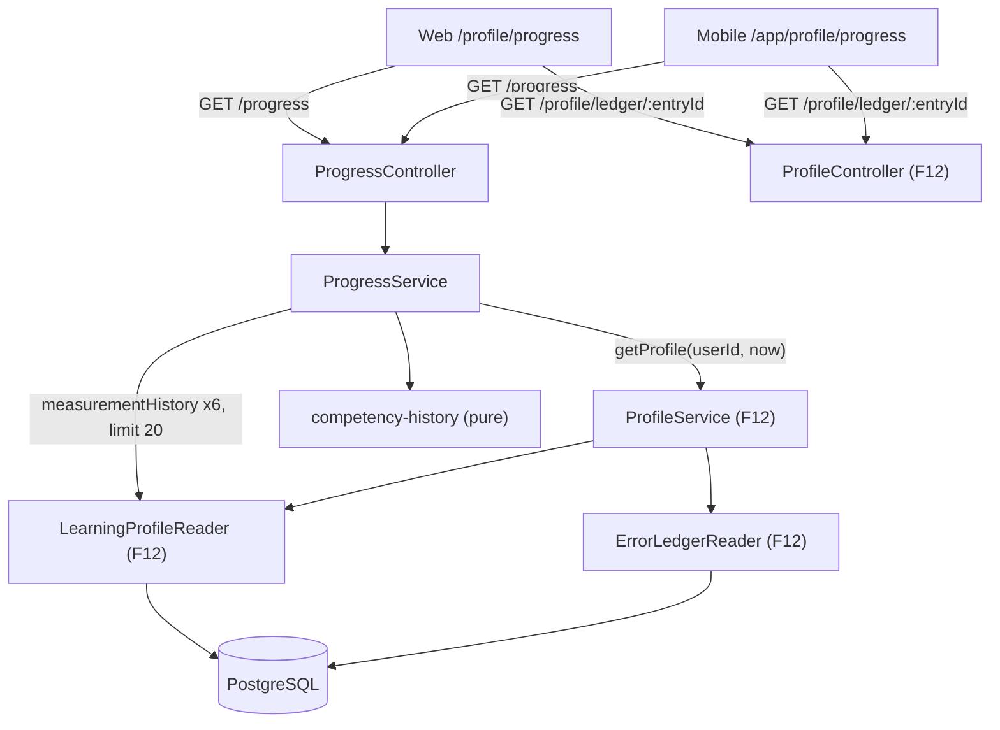
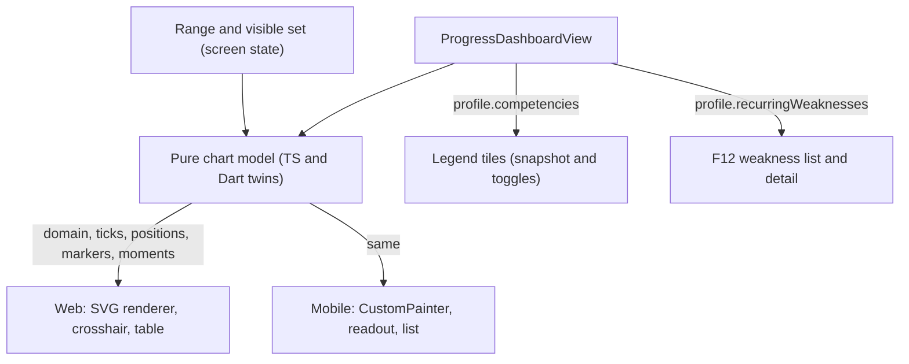

# Technical Specification: Progress and Evolution Dashboard

## 1. Technical Overview

**What:** F20 adds a **Progress** screen to both clients. It shows how the caller's six competency scores have changed over time, next to what keeps going wrong. It sits one level below the profile: `/profile/progress` on the web and `/app/profile/progress` on mobile, reached from a new entry card on the profile screen. The Core screen has three parts:
- **The competency chart.** One line per competency. Each point is the smoothed score after one measurement, up to the caller's last 20 measurements per competency. A range selector offers `All time`, `90 days` and `30 days`. Lesson points are filled circles and activity points are hollow diamonds. The web shows a hover and keyboard crosshair with a tooltip, and mobile shows a tap readout. Both clients offer a table view as the accessible alternative. With too little data, the chart area shows the PRD's explanatory empty state instead of a line.
- **The snapshot, built into the legend.** Six tiles show each competency's current score, its trend arrow, or `Warming up`. Each tile also toggles that competency's line, and the first tap isolates it.
- **Recurring weaknesses.** F12's ranked list, with occurrence counts, the 30-day trend arrow and the state chip. Each row opens F12's ledger detail.

One new caller-scoped route, `GET /progress`, serves the whole screen. It embeds the exact `LearningProfileView` that `GET /profile` returns, built by the same `ProfileService.getProfile`, and adds a `competencyHistory` block read through F12's `LearningProfileReader.measurementHistory`. The route adds no migration, no error code, no environment variable and no dependency. Both clients draw the chart without a charting library: the web renders SVG and mobile uses a `CustomPainter`. Both read one pure chart model, mirrored in TypeScript and Dart and pinned by identical case tables. The design-token layer gains six validated categorical chart colours, and both clients gain a segmented-control primitive for the range selector.

**Why:** F12 made the profile exact, and F20 makes its history visible. The PRD's Study Partner "wants evidence, not encouragement… a score trend that makes stagnation visible". The weight of the feature is in three properties rather than in the drawing:
- **One source, no divergence.** The dashboard and the profile screen must never disagree (a cross-feature criterion). F20 does not re-derive anything F12 computes. The snapshot, the weaknesses, the tag trends and the notes are F12's own view, embedded as is. The chart's last point per competency is the same stored number the snapshot rounds.
- **The same chart on two clients.** "All charts render on both clients with the same data and the same ranges". The server decides the data and the range boundaries. One pure model, mirrored in both languages and pinned by one case table, decides everything else: filtering, domains, ticks, moments and legend state. Only the pixels differ.
- **No precision the data doesn't have.** The chart has a fixed 0–100 scale. A warming-up competency is drawn as unconnected markers. With too little data, the chart area shows an explanatory empty state instead of a two-point line. Colour never carries meaning alone.

**Scope — Included (Core Scope; the Auto-Accept Policy picked Core only):**
- The competency trend chart: last 20 measurements per competency, the `All time` / `90 days` / `30 days` selector, lesson and activity points drawn differently, tooltip or readout with date, value and source, the legend that toggles and isolates lines, the table view, and the empty states (fewer than 3 measurements, empty range, every line hidden).
- The current profile snapshot, in the legend: six scores, `Warming up` below 3 measurements, and a trend arrow only from 3 measurements up.
- The recurring weaknesses list with trends: F12's ranking, 30-day trend arrow and state chip, each row opening F12's ledger detail.
- `GET /progress` and its shared contract, mirrored by hand-written Dart models.
- Both clients: the Progress screen, the entry card on the profile screen, and the loading, empty and error states. On the web, the `Profile` pill stays active on the progress page. On mobile, the Profile tab becomes a small module with the progress route pushed on top.
- Six categorical chart colour roles in `tokens.json` (light and dark), with their contrast pairs. The `SegmentedControl` / `EqSegmentedControl` primitive and its gallery section.
- The design reference: F20 owns the dashboard's two statistic cards, and this feature settles both of them (A16).
- Integrated from cross-cutting concerns and earlier features:
  - Per-participant privacy: every value comes from the caller's own profile, and no request parameter names a user.
  - Client parity: the same screen, data and ranges on both clients.
  - Design fidelity: no XP, streak, badge, level or comparison anywhere.
  - F21's tokens, primitives and page states.
  - F12's note to F20: read `measurementHistory` (`scoreAfter` and `sourceKind` per point) and `snapshotFor`, and reuse the tag trend exactly as F12 computes it.
  - F22's deferred statistic-card rows.

**Scope — Deferred (Full Scope additions, not built by this spec):**
- **Activity completion statistics:** activities completed per week over the last 8 weeks, and the plan completion rate per plan, read from F15's `PlanHistoryReader`.
- **The difficulty rating distribution:** the single stacked bar across `Too easy`, `Just right` and `Too hard`.
- **The phoneme trend list:** the 10 worst phonemes with mean score and trend, each linking to its ledger record.
- **The vocabulary domain coverage view:** the 15 domains with lesson counts and last use, dimming unused ones. It is read from `lesson_scenarios.vocabulary_domain`, counted the way F19's list shows it.

**Scope — Deferred (blocked on a dependency's Full Scope):**
- **Recent improvements** (mastered tags with the mastery date and the number of encounters). F12 was built Core-only. No tag can reach `mastered`, and `LearningProfileView` has no `recentImprovements` field (F12's A31: "no always-empty field, no always-empty region"). So F20 Core renders no Recent improvements region, and the weaknesses card spans the full width on the web. When F12's Full Scope adds the field, F20 adds the region beside the weaknesses on the web and stacked below them on mobile (A2).

**Scope — Excluded:**
- **Any comparison between participants** (Section 7, Social and comparison). The response and the screen carry only the caller's data.
- **XP, streaks, badges, levels or goals** (Section 7). This is why the `Nível de Domínio` statistic card is dropped (A16).
- **Charting Pronunciation's Accuracy and Prosody sub-scores.** The PRD charts the six competencies. The sub-scores stay on the profile screen.
- **Changing F12's scoring, trends or ranking.** F20 reads them.
- **The home dashboard.** F20 Core adds nothing to `/dashboard`. The conversation-time statistic card stays deferred (A16).
- **Push, export or sharing of progress** (Section 7).

**PRD traceability:**

| PRD block | Where it lands |
|---|---|
| Consumes F03 (mobile shell) | Mobile routing (the profile module and the pushed progress route), section 4 |
| Consumes F06 (vocabulary domain per lesson) | Deferred with domain coverage (Full Scope). No Core read |
| Consumes F12 (snapshot with measurement count and trend, recurring weaknesses, recent improvements; ledger records) | `profile` embedded in `GET /progress`; `competencyHistory` from `measurementHistory`; A2 for recent improvements |
| Consumes F15 (plan completion history) | Deferred with activity statistics (Full Scope). No Core read |
| Consumes F21 (tokens, primitives, page states) | Chart colour roles (section 6), `SegmentedControl`, page states (section 2) |
| Core Scope | Scope — Included |
| Full Scope additions | Scope — Deferred |
| Capabilities | Section 2 rules; A5–A12; section 5 |
| Experience | Section 2 UX notes (both clients); A3, A10–A12 |
| Error Handling (none in the PRD for F20) | Section 2, client states |
| Acceptance criteria for F20 | Testing Strategy, acceptance mapping |
| Cross-Feature Integration criteria (F12/F15→F20 consistency, F15→F20 statistics, F06→F20 domains, F21 screens) | Testing Strategy, cross-feature table |

**Assumptions and decisions not answered by the PRD (Batch Mode, every row flagged for user review):**

| # | Decision or assumption | Rationale | Auto-Accept row |
|---|---|---|---|
| A1 | **Core only.** Activity statistics, the rating distribution, the phoneme list and domain coverage are deferred (see Scope). | The Batch Mode default. | Scope (Core vs Core+Full) |
| A2 | **Recent improvements wait for F12's Full Scope.** The acceptance criterion "Recent improvements list mastered tags with the mastery date and the number of encounters required" is recorded as blocked. F20 renders no region for it, rather than a region that can never hold anything. | F12 was built Core-only: no tag is ever `mastered`, and its A31 rejected always-empty regions as misleading. The criterion sits in neither of F20's scope blocks, so the only honest Core behaviour is to wait for the data. | Scope (Core vs Core+Full), applied to F12's Core-only build |
| A3 | **Where Progress lives.** On the web it is `/profile/progress`. The `Profile` pill gains `matchPrefix` so it stays active there, and the page has a `Back to profile` link. On mobile it is `/app/profile/progress`, pushed from the Profile tab: the flat `/profile` route becomes a `profileModule`, and the shell already keeps a tab selected on its sub-paths. Both profile screens gain a `Progress over time` entry card, shown when the profile is not empty. There is **no sixth header pill** and **no sixth tab**. | F03 fixes five mobile destinations, and Material's navigation bar is designed for 3–5. On the web, an estimate of six pills at `label-lg` puts the header at about the full 848 px content width of the `max-w-4xl` layout. It would wrap between `md` and full width. Nesting under Profile gives both clients the same information architecture. It also puts the evolution view beside the current-state view the cross-feature criterion pairs it with. Alternatives: a sixth pill (header overflow) and the home dashboard (the PRD's F20 screen "opens on the competency chart", which the home's hero-first layout cannot do). | Technical decision with a clear recommendation (plus the client-parity rule) |
| A4 | **One route, one builder.** `GET /progress` returns `{ serverTime, profile, competencyHistory }`. `profile` is the exact `LearningProfileView` from `ProfileService.getProfile(userId, now)`, which `ProfileModule` now exports. The same `now` stamps both halves. A new `ProgressModule` owns the route, so the Full Scope can import F15's and F06's readers without growing F12's module. | "No divergence between the two views" holds by construction: the two views are one function's output. A single request gives both clients one loading state and one `serverTime`. | Technical decision with a clear recommendation |
| A5 | **Window semantics.** For each competency, the server returns its **most recent 20 measurements**, oldest first. A range keeps those whose `measuredAt` falls on or after the range's `since`, so `All time` shows all 20. When measurements are dense (many activities), the three ranges can show the same points. That is correct: the cap bounds readability, and the range bounds recency. | "Across the last 20 measurements, with a range selector": the count is the cap and the range is the time bound. The most recent ≤ 20 inside a window are always a subset of the most recent 20 overall, so one payload serves all three ranges exactly. Alternatives: uncapped windows (hundreds of points once F16–F18 write activity measurements), and down-sampling (hides real measurements). | Partial PRD specifications |
| A6 | **Range boundaries come from the server.** `since` is `now − 90 days` and `now − 30 days` (24-hour days on the server clock), and `null` for `All time`. Clients only compare `measuredAt ≥ since`. The default range is `All time`, and the selection is not persisted. | The server's clock and arithmetic are the only ones both clients share. Switching range needs no request. | Partial PRD specifications |
| A7 | **The plotted value is the smoothed score after the measurement** (`score_after`), rounded half up (F12's A5). The last point of each series therefore equals that competency's snapshot `score`. The raw measurement is not in the contract. | F12's A4 stores `score_after` "which the chart in F20 plots", and F12's downstream note says the same. Plotting raw values would show a line that disagrees with every other number in the product. | Technical decision with a clear recommendation |
| A8 | **Axes.** The y axis is fixed at 0–100, with hairline gridlines at 0, 25, 50, 75 and 100. The x axis is proportional to time. It runs from the range's `since` (for `All time`, from the earliest point in range) to `serverTime`, and is computed over all six series in range, so hiding a line never rescales it. A domain with a single instant centres its points. X ticks: 5 at a plot width of 480 logical px or more, 3 below, evenly spaced and labelled with the shared `formatShortDate` (`12 Mar`, or `12 Mar 2025` in an earlier year) in the viewer's timezone. | A fixed 0–100 scale matches the meters. A fitted scale would make a 2-point wobble look like a cliff ("never implies precision it does not have"). Fixed rules keep both clients' axes identical, and "adapted to width" only changes how many ticks show. | Partial PRD specifications |
| A9 | **When the chart is empty.** "Fewer than 3 measurements overall" is read as **no competency has 3 or more measurements**. The server sends it as `chartable: false`, and the chart area then shows `Not enough data yet — complete 3 lessons to see trends.` Once chartable, a warming-up competency (fewer than 3 measurements) is drawn as **unconnected markers with no line**. Two more empty states exist: the selected range has no points (`No measurements in the last 30 days.`, with a hint), and every line is hidden. | One lesson writes six measurements, one per competency, so the total count cannot be what the PRD's copy ("complete 3 lessons") means. Drawing no line for a warming-up series extends "rather than a misleading two-point line" to each competency. | Partial PRD specifications |
| A10 | **Source encoding.** A lesson point is a filled circle and an activity point is a hollow diamond. Both are at least 8 px, with a 2 px ring in the surface colour, and a source key (`Lesson`, `Activity`) sits under the plot. Points are grouped into **moments** by (`measuredAt`, `sourceKind`). Every competency from one lesson shares the lesson's start time, so a lesson is one moment. The tooltip or readout header reads `Lesson · 12 Mar` or `Activity · 14 Mar`. | The PRD asks for the two sources to be "visually distinguished" and gives the tooltip wording. Shape carries the difference without colour (F21's rule). | Partial PRD specifications |
| A11 | **The legend is the snapshot, and it toggles lines.** It is six tiles in F12's competency order. Each carries the series key (line and colour), the name, the score (or `Warming up`) and the trend (`▲ Improving`, `▼ Declining`, `▶ Steady`; none while warming up). Each tile is a toggle (`aria-pressed`). From the all-visible state, the first tap **isolates** that competency, and later taps add or remove lines. `Show all` appears while any line is hidden. | The PRD wants a legend that toggles lines "so a user chasing pronunciation can isolate it", and a snapshot block with the six scores. One block serves both, keeps the chart first, and puts the recurring weaknesses directly beneath it ("the most prominent part of the screen after the chart"). Tap-to-isolate turns the PRD's isolation case into one tap instead of five. | Partial PRD specifications |
| A12 | **Interaction and accessibility.** **Web:** a vertical crosshair snaps to the nearest moment under the pointer, and one tooltip lists every visible competency at that moment, value first. The plot is a single tab stop: ← and → step through moments, Home and End jump, Escape clears, and a polite live region repeats the tooltip. `Show as table` opens a table with one row per moment and one column per competency (`—` where not measured). **Mobile:** tap or horizontal drag on the plot selects the nearest moment, and the readout sits under the plot as a live region. `Show as list` gives the same rows. On both clients the plot's accessible name summarizes it (`Line chart of your competency scores, last 90 days, 14 measurements.`). | The data-visualization method this spec follows: the crosshair finds the X, one tooltip covers every series, the details are the same on keyboard focus, and a table view exists. It also covers F21's keyboard and screen-reader requirements, which a 120-point SVG with a focusable node per point would make a trap. | Technical decision with a clear recommendation |
| A13 | **No charting library on either client.** The web renders SVG at the container's measured width (`ResizeObserver`, falling back to 640 px, which is also the width in tests), with text styled by type-token classes so it never scales. Mobile uses a `CustomPainter` inside a `LayoutBuilder`. Both consume one pure chart model (`apps/web/src/lib/progress-chart.ts`, `apps/mobile/lib/features/progress/progress_chart_model.dart`), with the same functions and the same case table (F15's `plan-today` precedent). | The data is at most 120 points. The requirements that matter here (token-only colours with a CI guard, a table view and keyboard stepping, jsdom-testable output, identical axes on two clients) are where libraries fight back. Recharts needs size mocks in jsdom and brings its own tick and padding logic. `fl_chart` brings a third tick algorithm and limited semantics. Pinning both to the web's rules would cost more than drawing 2 px lines. None of the Full Scope charts (8 weekly bars, one stacked bar) needs a library either. | Feature requires new technology (resolved as none, with the alternatives recorded) |
| A14 | **Six chart colour roles in `tokens.json`**, `chart-1` … `chart-6`, mapped in F12's competency order (Grammar → 1 … Pronunciation → 6). Light: `#0058be`, `#ae3115`, `#006c49` (DESIGN.md's secondary, primary and tertiary), then `#b27100`, `#4a3aa7`, `#c2407a`. Dark: `#3987e5`, `#e0603a`, `#199e70`, `#c98500`, `#9085e9`, `#d55181`. Each role gets a `border` pair (3:1) against `surface-container-lowest`. `DESIGN.md` gains a short "Data visualization" note that records the order. | The existing roles cannot serve six series: `error` collides with `primary`, and the badge roles are reserved for status. Both sets were run through a categorical-palette validator while this spec was written. Every check passes on adjacent pairs in both themes: lightness band, chroma, CVD separation (worst ΔE 8.9 light and 8.4 dark), normal-vision separation, and 3:1 against both the card and page surfaces. No six-colour set can pass all pairs, which is why isolation, the tooltip and the table (A11, A12) are required rather than optional. A value missing from DESIGN.md needs a reason (`.claude/rules/design-tokens.md`), and this row is that reason. | No codebase patterns found (charts) |
| A15 | **A segmented-control primitive**, `SegmentedControl` on the web and `EqSegmentedControl` on mobile, for the range selector. It uses radio-group semantics (arrow keys move the selection on the web), the `NavPill`'s pill-in-container look, and a new section in the design-system gallery. | `NavPill` holds links, and a range selector is a choice within the page. The mobile-ui rule is "read the web component, add `Eq<Name>`, add a widget test", and F21 requires every primitive to be in the gallery. | Technical decision with a clear recommendation |
| A16 | **The statistic cards F22 deferred to F20.** `Nível de Domínio` is **dropped** under Section 7, Pedagogy ("Formal CEFR level certification or an official level placement test"), the clause already used for the three other level labels. `Tempo de Conversação` **stays deferred to F20**. Its statistic (lesson minutes against a weekly goal) is not one F20 Core computes, and the stat row is where the Full Scope's activity statistics naturally land, so the Full Scope decides it. The weekly-goal sub-line is not built either way, because it is a cadence target like the streak Section 7 excludes. F20 Core adds nothing to the home dashboard. | Building a conversation-time card now would add a lesson aggregate that no F20 capability or criterion names. A lone card would also be the "grid of one card" F05 declined. `design-reference.spec.ts` needs at least one deferred `Stat card` row, which this keeps. | Scope (Core vs Core+Full), plus the design-fidelity rule |
| A17 | **Recurring weaknesses reuse F12 unchanged.** The web uses `RecurringWeaknesses` and `LedgerEntrySheet`. Mobile reuses the weakness row, extracted from `profile_page.dart` into `features/profile/widgets/weakness_row.dart`, and `showLedgerEntrySheet`. The ranking, the 30-day trend and the chip come from F12's reader (its A19 and A20). | "Ranked by occurrence count with a 30-day trend arrow and a state chip" is exactly F12's list. A second implementation is how two views would diverge. | Technical decision with a clear recommendation |
| A18 | **Page composition and copy.** The heading is `Progress`, with the line `How your competencies have changed, and what keeps coming back.` Below it come F12's notes (the partial-update note), the chart card, then the recurring weaknesses card. An empty profile shows a page-level empty state (`No progress yet.` / `Your progress appears after your first analysed lesson.`, with `Open classroom` on the web only, as F12 does). An error reads `Your progress could not be loaded.` with a retry. The web's retry button keeps the shared primitive's `Try again`, and mobile's reads `Retry`, as F12 recorded. | The PRD gives the chart copy and the order (chart, then weaknesses). The rest mirrors F12's established copy so the two screens read as one product. | Partial PRD specifications |
| A19 | **No mockup exists** for the progress screen on either client (`design/README.md` covers none). Both clients compose from the primitives, and mobile follows `mobile-ui` case 3. **Generating a Stitch mockup before Stage 2 is recommended.** | F12, F15 and F19 recorded the same situation for their screens. | No codebase patterns found (design) |
| A20 | **No migration, no error code, no environment variable, no new dependency, no prompt change.** The route takes no parameter, so its only failure is `AUTH003`. | Everything F20 Core reads already exists behind F12's readers and indexes (section 6). | Technical decision with a clear recommendation |

## 2. Architecture Impact

**Affected components:**

| Area | Path |
|---|---|
| Design tokens | `packages/design-tokens/tokens.json` and its generated outputs (`generated/tokens.css`, `generated/tokens.ts`, `lib/english_quest_tokens.dart`); `design/english_quest_design_system/DESIGN.md` |
| Shared contracts | `packages/shared/src/schemas/progress.ts` (new), `packages/shared/src/index.ts` |
| API: progress | `apps/api/src/progress/**` (new) |
| API: wiring and docs | `apps/api/src/profile/profile.module.ts` (exports `ProfileService`), `apps/api/src/app.module.ts`, `apps/api/src/openapi/components.ts`, `apps/api/src/openapi/setup.ts`, `docs/api/openapi.json` |
| Web | `apps/web/src/app/(app)/profile/progress/**` (new), `apps/web/src/components/progress/**` (new), `apps/web/src/components/ui/segmented-control.tsx` (new), `apps/web/src/components/ui/index.ts`, `apps/web/src/components/profile/profile-screen.tsx`, `apps/web/src/components/app-header.tsx`, `apps/web/src/lib/progress*.ts` (new), `apps/web/src/app/(dev)/design-system/**` |
| Mobile | `apps/mobile/lib/features/progress/**` (new), `apps/mobile/lib/features/profile/**`, `apps/mobile/lib/features/shell/shell_module.dart`, `apps/mobile/lib/design/widgets/eq_segmented_control.dart` (new) |
| Design reference | `design/README.md` (the two statistic-card rows and the pill row) |

**Reads:**



**Client rendering (both clients):**



**Assembling the view (`ProgressService.getDashboard(userId, now)`):**
1. `profile = ProfileService.getProfile(userId, now)`, the same call `GET /profile` makes.
2. For each of the six competencies, in parallel: `LearningProfileReader.measurementHistory(userId, { competency, limit: 20 })`. This is newest-20 in fold order, returned oldest first, and uses `ix_profile_measurements_user_competency_time`.
3. `buildCompetencyHistory(pointsByCompetency, profile.competencies, now)` (pure):
   - produces six series in F12's order, each point `{ measuredAt, score: roundScore(scoreAfter), sourceKind, lessonId, activityId }`;
   - sets `chartable` to whether any competency's `measurementCount` is at least 3;
   - builds `ranges`: `all` → `null`, `90d` → `now − 90 × 24 h`, `30d` → `now − 30 × 24 h`.
4. Return `{ serverTime: now, profile, competencyHistory }`.

The two halves are read without a shared transaction. A source ingested between steps 1 and 2 could make the last point differ from the snapshot for one response, and the next load agrees again (section 3).

**The chart model (pure, mirrored in TS and Dart; A5–A13):**

| Function | Rule |
|---|---|
| `pointsInRange(series, boundary)` | Keeps points with `measuredAt ≥ since`; `null` keeps all |
| `chartDomain(seriesInRange, boundary, serverTime)` | `null` when no point is in range. Otherwise `{ from, to }`: `from` is `since`, or the earliest in-range point for `All time`, and `to` is `serverTime`. Computed over all six series whatever is visible |
| `xOf(at, domain, plot)` / `yOf(score, plot)` | Linear. `from == to` centres. y maps 0–100 top-down |
| `timeTicks(domain, plotWidth)` | 5 evenly spaced instants when `plotWidth ≥ 480`, else 3, including both ends |
| `yTicks` | `[0, 25, 50, 75, 100]` |
| `drawsLine(series, warmingUp)` | `!warmingUp && inRangePoints ≥ 2`. Otherwise markers only |
| `markerFor(sourceKind)` | `lesson` → `circle`, `activity` → `diamond` |
| `seriesRole(competency)` | `grammar` → `chart-1` … `pronunciation` → `chart-6` |
| `momentsOf(seriesInRange, visible)` | Groups points by (`measuredAt`, `sourceKind`), sorted by time then `lesson` before `activity`. Each moment lists `{ competency, score }` for the visible competencies in F12's order. `momentsOf(…, all)` feeds the table |
| `nearestMoment(moments, at)` | Minimum \|Δt\|. A tie goes to the earlier moment |
| `toggleCompetency(visible, competency)` | All visible → only `competency`. Otherwise it flips `competency` (the result may be empty) |
| `showAll()` | All six |
| `rangeLabel(range)` / `chartSummary(range, pointCount)` | `All time` · `90 days` · `30 days`; `Line chart of your competency scores, {all time \| last 90 days \| last 30 days}, {n} measurements.` |

**Marks (both clients, tokens only):** lines are 2 px in the series role. Circles are 8 px. Diamonds are 10 px across, drawn as a 2 px outline in the series role over a `surface-container-lowest` fill. Every marker has a 2 px `surface-container-lowest` ring. Gridlines are 1 px `outline-variant` hairlines. Axis text is `label-sm` in `on-surface-variant`. The crosshair is a 1 px `outline-strong` hairline. Tooltip text uses text tokens, never the series colour. A short line key beside each row carries the series identity.

**UX notes (both clients, no mockup; A18, A19):**
- **Header.** On the web, `Back to profile` (a link with the arrow icon) sits above the heading. On mobile, the app bar reads `Progress` with the back button.
- **Notes.** F12's `notes` render first, as an info card (web) or `EqCard` (mobile), exactly as the profile does.
- **The chart card.** It is headed `Competencies over time`, with the caption `Each point is your smoothed score after a lesson or an activity — up to your last 20 per competency.` It holds, in order:
  - the range selector (`Time range`: `All time` · `90 days` · `30 days`);
  - the plot;
  - the source key (circle `Lesson`, diamond `Activity`);
  - on mobile, the readout (`Tap the chart to see a measurement.` until something is selected);
  - the legend tiles: a 3 × 2 grid on the web, 2 × 3 on mobile, each at least 48 px tall on mobile;
  - the helper line (`Select a competency to show only its line.` on the web, `Tap…` on mobile) and `Show all` while any line is hidden;
  - the `Show as table` (web) or `Show as list` (mobile) disclosure.
- **Chart empty states** replace only the plot, and the legend still shows the snapshot:
  - not chartable: `Not enough data yet — complete 3 lessons to see trends.`
  - empty range: `No measurements in the last 30 days.` (or `90 days`) with `Choose a longer range to see earlier ones.`
  - all hidden: `Every line is hidden. Choose a competency below, or show all.`
- **Recurring weaknesses.** The `Recurring weaknesses` card holds F12's rows unchanged, with F12's empty copy. It spans the full width on the web in Core (A2).
- **Page states.**
  - Loading is a skeleton shaped like the chart card (a plot block and six tiles) and two weakness rows.
  - An empty profile shows the page-level `EmptyState` / `EqEmpty` (A18).
  - A failed load shows the error with retry. On the web, the server-side read fails soft (`ServerRead`) and the client fetches `GET /progress` again.
  - Mobile adds pull-to-refresh.
- **Entry card on the profile screen.** It sits under the heading when `!empty`. The web card has `ChartIcon`, the title `Progress over time`, the body `See how each competency has moved across your lessons and activities.` and a `See your progress` link. The mobile card is the whole tappable `EqCard` with a chevron and the same copy, and is announced as a button.

**Client error handling:** `GET /progress` fails only on network, server or session errors. The web uses `apiFetch`'s `ApiRequestError`, and `AUTH003` goes through the existing session-expired redirect. Mobile uses `ApiException`'s mapped message (`No connection`, `Server unavailable`, `Session expired`) in `EqError`, with the retry interceptor's three attempts before it. The ledger detail keeps F12's own loading and error states.

## 3. Technical Decisions

| Decision | Chosen Approach | Alternative Considered | Trade-off |
|---|---|---|---|
| Where the screen lives | Under Profile on both clients: `/profile/progress` and `/app/profile/progress` (A3) | A sixth header pill and a sixth tab; or sections on the home dashboard | One more tap from the header. Accepted because the header cannot fit a sixth pill, F03 fixes five tabs, and the home dashboard cannot open on the chart |
| API shape | One `GET /progress` embedding F12's `LearningProfileView` from the same builder (A4) | `GET /profile/history` beside `GET /profile`, with clients calling both | The profile payload travels on both routes. Accepted because "no divergence" then holds by construction, with one request, one `serverTime` and one page state |
| Range handling | The server sends the newest 20 per competency plus range boundaries, and clients filter (A5, A6) | `?range=` with a request per switch; or three pre-filtered arrays | Two tiny client functions to keep in step. Accepted because they are pinned by one case table, switching is instant, and the payload stays at most 120 points |
| Rendering | Hand-drawn SVG (web) and `CustomPainter` (mobile) over one mirrored pure model (A13) | Recharts on the web and `fl_chart` on mobile | Crosshair, hit-testing and semantics are ours to write. Accepted for token-only styling under the existing guards, identical axes, jsdom-testable output and no new dependency |
| Snapshot block | The legend tiles carry the scores, trends and `Warming up` (A11) | A separate row of six meters under the chart | Each tile does two jobs (reading and toggling). Accepted because it keeps the chart first and the weaknesses directly after it, and avoids a third six-item list on a phone |
| Y scale | Fixed 0–100 (A8) | Fitted to the data with padding | Small movements look small. Accepted because every other number in the product is on 0–100 and a fitted axis overstates noise |
| Chart colours | Six new `chart-*` roles, validated (A14) | Reuse `primary`, `secondary`, `tertiary`, `error` and the badge roles | Six more roles in `tokens.json`. Accepted because the status roles are reserved and `error` collides with `primary` |
| Consistency across the two reads | No shared transaction; the last point equals the snapshot in a quiescent state | A repeatable-read transaction around both halves | A concurrent ingestion can make one response disagree, and the next load agrees. Accepted because F12's readers use the client directly, and threading a transaction through them is a larger change to a finished feature than the race warrants |
| Statistic cards | Drop `Nível de Domínio`; keep `Tempo de Conversação` deferred to F20 Full (A16) | Build conversation time now from lesson durations | The dashboard mockup's stat row stays unbuilt a while longer. Accepted because no F20 Core capability names that statistic |

## 4. Component Overview

**Design tokens:**

| File Path | New/Modified | Purpose | Key Responsibilities |
|---|---|---|---|
| `packages/design-tokens/tokens.json` | Modified | Chart colour roles | `chart-1` … `chart-6` under `color.light` and `color.dark` (A14 values), and six `semanticPairs` `chart-N-on-surface-container-lowest` of kind `border`, min 3.0 |
| `packages/design-tokens/generated/tokens.css`, `generated/tokens.ts`, `lib/english_quest_tokens.dart` | Regenerated | Outputs | `--color-chart-N` (so `stroke-chart-N` and `fill-chart-N` resolve), the typed module, and `EqLightColors.chartN` / `EqDarkColors.chartN`. Never edited by hand (`pnpm tokens:build`) |
| `design/english_quest_design_system/DESIGN.md` | Modified | Design reference | A short "Data visualization" paragraph: the six categorical roles in order, three reused from the palette, shape rather than colour for data source, and status roles never used as series |

**Shared:**

| File Path | New/Modified | Purpose | Key Responsibilities |
|---|---|---|---|
| `packages/shared/src/schemas/progress.ts` | New | The progress contract | `progressRangeSchema` (`all`, `90d`, `30d`), `progressRangeBoundarySchema`, `measurementSourceKindSchema` (`lesson`, `activity`), `competencyHistoryPointSchema`, `competencyHistorySeriesSchema`, `competencyHistoryViewSchema`, `progressDashboardViewSchema` (embeds `learningProfileViewSchema`) |
| `packages/shared/src/index.ts` | Modified | Barrel | Re-exports |

**Backend (`apps/api/src/progress/`, `ProgressModule`; imports `ProfileModule`):**

| File Path | New/Modified | Purpose | Key Responsibilities |
|---|---|---|---|
| `progress.module.ts` | New | Wiring | Imports `ProfileModule` and provides the service and controller. The Full Scope adds `PlansModule` and the scenario reads here |
| `progress.constants.ts` | New | Fixed values | `PROGRESS_POINTS_PER_COMPETENCY = 20` and `PROGRESS_RANGE_DAYS = { '90d': 90, '30d': 30 }`. The chartable threshold reuses F12's `WARMING_UP_BELOW_MEASUREMENTS` |
| `competency-history.ts` | New | Pure assembly | `buildCompetencyHistory(pointsByCompetency, competencies, now)` → `CompetencyHistoryView`: six series in `PROFILE_COMPETENCIES` order, `roundScore` per point, `chartable`, `ranges`. No I/O |
| `progress.service.ts` | New | Route logic | `getDashboard(userId, now)` as section 2 describes |
| `progress.controller.ts` | New | HTTP surface | `GET /progress` with `@ApiTags('progress')`, cookie and bearer security, `@ApiOperation`, and `@ApiResponse` for 200 and 401 |
| `apps/api/src/profile/profile.module.ts` | Modified | Export | Adds `ProfileService` to the exports (additive; F12's routes unchanged) |
| `apps/api/src/app.module.ts` | Modified | Root | Imports `ProgressModule` |
| `apps/api/src/openapi/components.ts`, `setup.ts` | Modified | Document | Registers `ProgressDashboardView` and the `progress` tag (`"The caller's progress: competency history over time and recurring weaknesses"`) |

**Web (`apps/web/src/`):**

| File Path | New/Modified | Purpose | Key Responsibilities |
|---|---|---|---|
| `app/(app)/profile/progress/page.tsx` | New | Route | Server component. Reads through `getProgressView()` and renders `ProgressScreen`. Metadata title `Progress · English Quest` |
| `app/(app)/profile/progress/loading.tsx` | New | Route loading | The chart-card and weakness-row skeleton |
| `lib/progress-server.ts` | New | Server read | `getProgressView(): Promise<ServerRead<ProgressDashboardView>>`, using `plans-server.ts`'s `serverGet` idiom (`cache: 'no-store'`) |
| `lib/progress.ts` | New | Browser read | `fetchProgress()`, the retry path |
| `lib/progress-chart.ts` | New | Pure chart model | Every function in section 2's table. No React, no DOM |
| `components/progress/progress-screen.tsx` | New | Screen | States (loading, empty, error with retry, ready), `Back to profile`, heading, notes, `CompetencyChartCard`, and the recurring-weaknesses card with F12's `RecurringWeaknesses` and `LedgerEntrySheet` (focus returns to the row) |
| `components/progress/competency-chart-card.tsx` | New | Chart card | Owns the range and the visible set. Renders the range selector, the plot or the right empty state, the source key, the legend, `Show all`, and the table disclosure (`aria-expanded`) |
| `components/progress/competency-chart.tsx` | New | Plot | Measures its width. Draws gridlines, ticks, lines and markers from the model. Pointer crosshair and tooltip (positioned in percentages, never pixels in `style`). Single tab stop with ←/→/Home/End/Escape. Polite live region. `role="group"` with the summary as its accessible name |
| `components/progress/competency-legend.tsx` | New | Legend and snapshot | Six toggle buttons (`aria-pressed`), each with a series key (SVG line and colour), name, score or `Warming up`, and the trend arrow and word. Accessible name `Grammar: 68, improving` / `Pronunciation: warming up` |
| `components/progress/competency-table.tsx` | New | Table view | `<table>` captioned `Competency scores by measurement`. Columns `Date`, `Source` and the six competencies (`—` when not measured). A lesson row's date links to `/lessons/{lessonId}`. Every moment in the selected range |
| `components/progress/series-key.tsx` | New | Key glyphs | The line key and the circle and diamond markers as small SVGs in token classes, shared by legend, tooltip, source key and table |
| `components/ui/segmented-control.tsx` | New | Primitive | `options`, `value`, `onChange`, `label`. `role="radiogroup"` with `role="radio"` buttons, roving `tabIndex` and arrow keys, `NavPill`'s container and selected styles |
| `components/ui/index.ts` | Modified | Barrel | Exports `SegmentedControl` |
| `app/(dev)/design-system/sections/segmented-control-section.tsx`, `app/(dev)/design-system/page.tsx` | New / Modified | Gallery | The primitive in its states, in both themes |
| `components/profile/profile-screen.tsx` | Modified | Entry card | The `Progress over time` card under the heading when not empty |
| `components/app-header.tsx` | Modified | Navigation | `Profile` gains `matchPrefix: true`, and the comment names F20's sub-page |

**Mobile (`apps/mobile/lib/`):**

| File Path | New/Modified | Purpose | Key Responsibilities |
|---|---|---|---|
| `design/widgets/eq_segmented_control.dart` | New | Primitive | Mirrors `SegmentedControl`: the same prop names, 48 dp targets, `Semantics(inMutuallyExclusiveGroup, selected)`, and the press behaviour from the mobile-ui skill |
| `features/progress/progress_models.dart` | New | Contract mirror | `ProgressDashboardView`, `CompetencyHistoryView`, `CompetencyHistorySeries`, `CompetencyHistoryPoint`, `ProgressRangeBoundary` (`'90d'` ↔ `ProgressRange.days90`). Reuses `LearningProfileView.fromJson`. Ignores unknown keys |
| `features/progress/progress_chart_model.dart` | New | Pure chart model | The Dart twin of `progress-chart.ts`, with the same function names in camelCase |
| `features/progress/progress_controller.dart` | New | State | `GetxController` holding the view, the load error, the range and the visible set, plus `loadEntry` for the detail sheet. Built with `inject<Dio>()` in `initState`, as `ProfilePage` does |
| `features/progress/progress_page.dart` | New | Screen | `Scaffold`, `SafeArea`, a `RefreshIndicator` list capped at 560 dp. `EqLoading`, `EqEmpty` and `EqError`. Notes, the chart card and the weaknesses card |
| `features/progress/widgets/chart_palette.dart` | New | Colour roles | Resolves the six `chartN` roles and the chart's text and line roles for the current brightness, like `LessonPalette` |
| `features/progress/widgets/competency_chart.dart` | New | Plot | `LayoutBuilder`, `CustomPaint` with `CompetencyChartPainter` (the same marks as the web), and `GestureDetector` (tap and horizontal drag → nearest moment). Readout with `Semantics(liveRegion: true)`. The plot's `Semantics` label is the summary |
| `features/progress/widgets/competency_legend.dart` | New | Legend and snapshot | Six toggle tiles in a 2-column grid, with the same content and accessible labels as the web |
| `features/progress/widgets/moments_list.dart` | New | List view | One `EqCard` row per moment. A lesson row opens `/app/lessons/{lessonId}` |
| `features/profile/profile_module.dart` | New | Routing | `createModule(path: '/profile')` with `/` → `ProfilePage` and `/progress` → `ProgressPage` |
| `features/profile/widgets/weakness_row.dart` | New (extracted) | Shared row | F12's `_WeaknessRow`, made public unchanged, for both screens |
| `features/profile/profile_page.dart` | Modified | Entry card | The `Progress over time` card under the heading when not empty, and the extracted row |
| `features/shell/shell_module.dart` | Modified | Shell | Replaces the flat `/profile` route with `..module(profileModule)`. The tab's prefix match already keeps Profile selected |

**Documentation:**

| File Path | New/Modified | Purpose | Key Responsibilities |
|---|---|---|---|
| `design/README.md` | Modified | Design reference | `Stat card — "Nível de Domínio"` → `dropped` (Section 7, Pedagogy). `Stat card — "Tempo de Conversação"` stays `deferred` to F20, with A16's reason. The pill row notes that Profile is prefix-matched so its Progress page (F20) keeps it active |
| `docs/api/openapi.json` | Regenerated | API document | One operation, one component, one tag |

## 5. API Contracts

Authentication follows F01's two transports through the global `SessionGuard`. The route has no parameters. Every value is read for the session's user, and no response can carry another participant's data.

---

### Endpoint: Read the caller's progress dashboard

- **Method:** GET
- **Path:** `/progress`
- **Authentication:** Session cookie or bearer token

**Request:** none.

**Response (200):**

| Field | Type | Description |
|---|---|---|
| `data.serverTime` | `datetime` | The instant the view was built; `profile.serverTime` carries the same value |
| `data.profile` | `LearningProfileView` | Exactly `GET /profile`'s body, from the same builder: six competencies (score, delta, measurement count, `warmingUp`, trend, sub-scores), ranked recurring weaknesses, notes, `empty` |
| `data.competencyHistory.pointsPerCompetency` | `integer` | Always 20: the cap the caption states |
| `data.competencyHistory.chartable` | `boolean` | At least one competency has 3 or more measurements. False → the explanatory empty state |
| `data.competencyHistory.ranges[]` | `array` (3) | `{ range: 'all' \| '90d' \| '30d', since: datetime \| null }`, in that order |
| `data.competencyHistory.series[]` | `array` (6) | F12's competency order, always six, possibly with no points |
| `…series[].competency` | `string` | `grammar`, `vocabulary`, `fluency`, `interaction`, `comprehension`, `pronunciation` |
| `…series[].points[]` | `array` (≤ 20) | Oldest first: the competency's newest measurements |
| `…points[].measuredAt` | `datetime` | Lesson start (lessons) or activity completion (activities), F12's fold order |
| `…points[].score` | `integer` 0–100 | The smoothed score after this measurement, rounded half up |
| `…points[].sourceKind` | `string` | `lesson` or `activity` |
| `…points[].lessonId` | `uuid \| null` | Set for a lesson point: a lesson the caller took part in |
| `…points[].activityId` | `uuid \| null` | Set for an activity point: the caller's own activity |

**Response Example (five lessons and one activity in; four series omitted):**
```json
{
  "data": {
    "serverTime": "2026-09-28T10:00:00.000Z",
    "profile": {
      "serverTime": "2026-09-28T10:00:00.000Z",
      "updatedAt": "2026-09-25T18:31:04.000Z",
      "empty": false,
      "competencies": [
        { "competency": "grammar", "score": 68, "delta": 1, "measurementCount": 5, "warmingUp": false, "trend": "up", "lastMeasuredAt": "2026-09-25T18:30:00.000Z", "subScores": null },
        { "competency": "pronunciation", "score": 71, "delta": 2, "measurementCount": 2, "warmingUp": true, "trend": null, "lastMeasuredAt": "2026-09-24T18:00:00.000Z", "subScores": { "accuracy": 80, "prosody": 64 } }
      ],
      "recurringWeaknesses": [
        {
          "id": "2b7f0c1e-5d4a-4c3b-9a8e-1f2d3c4b5a60",
          "tag": "grammar:conditional-3",
          "label": "Third conditional",
          "family": "grammar",
          "occurrenceCount": 6,
          "recentOccurrenceCount": 4,
          "firstSeenAt": "2026-07-14T18:00:00.000Z",
          "lastSeenAt": "2026-09-24T18:00:00.000Z",
          "state": "practicing",
          "dueAt": null,
          "trend": "rising",
          "retired": false
        }
      ],
      "notes": []
    },
    "competencyHistory": {
      "pointsPerCompetency": 20,
      "chartable": true,
      "ranges": [
        { "range": "all", "since": null },
        { "range": "90d", "since": "2026-06-30T10:00:00.000Z" },
        { "range": "30d", "since": "2026-08-29T10:00:00.000Z" }
      ],
      "series": [
        {
          "competency": "grammar",
          "points": [
            { "measuredAt": "2026-07-14T18:00:00.000Z", "score": 60, "sourceKind": "lesson", "lessonId": "1a2b3c4d-5e6f-4a7b-8c9d-0e1f2a3b4c5d", "activityId": null },
            { "measuredAt": "2026-08-20T18:00:00.000Z", "score": 63, "sourceKind": "lesson", "lessonId": "5c6d7e8f-9a0b-4c1d-8e2f-3a4b5c6d7e8f", "activityId": null },
            { "measuredAt": "2026-09-10T18:00:00.000Z", "score": 66, "sourceKind": "lesson", "lessonId": "7d8e9f0a-1b2c-4d3e-9f4a-5b6c7d8e9f0a", "activityId": null },
            { "measuredAt": "2026-09-24T18:00:00.000Z", "score": 67, "sourceKind": "lesson", "lessonId": "9f1c4d7e-3b2a-4f51-9d0c-7a6b5e4c3d21", "activityId": null },
            { "measuredAt": "2026-09-25T18:30:00.000Z", "score": 68, "sourceKind": "activity", "lessonId": null, "activityId": "0f1e2d3c-4b5a-4968-8776-5a4b3c2d1e0f" }
          ]
        },
        {
          "competency": "pronunciation",
          "points": [
            { "measuredAt": "2026-09-10T18:00:00.000Z", "score": 69, "sourceKind": "lesson", "lessonId": "7d8e9f0a-1b2c-4d3e-9f4a-5b6c7d8e9f0a", "activityId": null },
            { "measuredAt": "2026-09-24T18:00:00.000Z", "score": 71, "sourceKind": "lesson", "lessonId": "9f1c4d7e-3b2a-4f51-9d0c-7a6b5e4c3d21", "activityId": null }
          ]
        }
      ]
    }
  }
}
```
Here Grammar's last point (68) is its snapshot score, and its activity point moved the score by 0.15 rather than 0.35. Pronunciation is warming up: it is drawn as two markers with no line, and its legend tile reads `Warming up`. In the `30 days` range, Grammar keeps its last three points and Pronunciation both of its points.

**Error Codes:**

| Code | HTTP Status | Description |
|---|---|---|
| `AUTH003` | 401 | No valid session |

---

### Endpoints reused unchanged (F12)

`GET /profile/ledger/:entryId` backs the weakness detail on both clients (`PROF001` for an unknown or foreign id). `GET /profile` is unchanged. Its body is what `data.profile` embeds.

---

### Internal contracts

| Contract | Shape | Used by |
|---|---|---|
| `ProgressService.getDashboard(userId, now = new Date())` | → `ProgressDashboardView` | `ProgressController`. The Full Scope extends it |
| `ProfileService.getProfile(userId, now)` (F12, now exported) | → `LearningProfileView` | `GET /profile` and `ProgressService`: one builder for both views |
| `LearningProfileReader.measurementHistory(userId, { competency, limit: 20 })` (F12, unchanged) | → `MeasurementPoint[]`, newest `limit`, oldest first | `ProgressService`, six calls |
| `buildCompetencyHistory(pointsByCompetency, competencies, now)` | Pure → `CompetencyHistoryView` | `ProgressService`, unit tests |
| Chart model (TS `lib/progress-chart.ts`, Dart `progress_chart_model.dart`) | Section 2's table | Both clients' renderers, legends and tables |

**Notes for later work:**
- **F20 Full Scope:**
  - Extends `ProgressDashboardView` additively with `activity` (weekly completions for 8 weeks, completion rate per plan and the rating distribution, from F15's `PlanHistoryReader`, the reader behind `GET /plans`), `phonemes` (the 10 worst `phoneme:` records with mean score and trend) and `domains` (the 15 domains with lesson counts and last use, counting `lesson_scenarios.vocabulary_domain` for a `ready` situation, as F19's list does).
  - Decides the `Tempo de Conversação` statistic card (A16).
  - Can reuse `SegmentedControl`, the chart roles and `series-key`.
- **F12 Full Scope:** adds `recentImprovements` to `LearningProfileView`. The progress page then gains the Recent improvements region beside the weaknesses on the web and stacked on mobile. It is a small additive change, recorded as an F20 follow-up (A2).
- **F16, F17, F18:** nothing to call. Their `ingestActivityOutcome` measurements appear as hollow diamonds on the next load. When activities get a page, the table and list can link activity rows as they link lessons.

## 6. Data Model

**No database change.** F20 Core reads only through F12's readers:

| Table | Read by | Index used |
|---|---|---|
| `profile_measurements` (with `profile_sources` for `lesson_id` and `activity_id`) | `measurementHistory`, six calls of `limit 20` per request | `ix_profile_measurements_user_competency_time` (`user_id, competency, measured_at, created_at`) |
| `profile_competencies`, `learning_profiles`, `profile_sources`, `error_ledger_entries`, `error_ledger_occurrences`, `lesson_pipeline_stages` | `ProfileService.getProfile` (F12, unchanged) | F12's indexes |

At this scale a request makes F12's snapshot queries plus six index range scans of at most 20 rows each. No new index is warranted.

**Token additions (`tokens.json`), validated as A14 records:**

| Role | Light | Dark | Series (F12 order) | Contrast pair |
|---|---|---|---|---|
| `chart-1` | `#0058be` (= `secondary`) | `#3987e5` | Grammar | `chart-1-on-surface-container-lowest`, `border`, ≥ 3.0 |
| `chart-2` | `#ae3115` (= `primary`) | `#e0603a` | Vocabulary | `chart-2-on-surface-container-lowest`, `border`, ≥ 3.0 |
| `chart-3` | `#006c49` (= `tertiary`) | `#199e70` | Fluency | `chart-3-on-surface-container-lowest`, `border`, ≥ 3.0 |
| `chart-4` | `#b27100` | `#c98500` | Interaction | `chart-4-on-surface-container-lowest`, `border`, ≥ 3.0 |
| `chart-5` | `#4a3aa7` | `#9085e9` | Comprehension | `chart-5-on-surface-container-lowest`, `border`, ≥ 3.0 |
| `chart-6` | `#c2407a` | `#d55181` | Pronunciation | `chart-6-on-surface-container-lowest`, `border`, ≥ 3.0 |

The existing token suite (`every_border_pair_meets_3_to_1_in_both_themes`, `generated_files_match_a_fresh_generation`) enforces the pairs and the outputs. If a value fails its measured contrast in the build, it is re-stepped along its own hue and re-validated for separation. The exemption registry stays empty.

**View contract (`packages/shared/src/schemas/progress.ts`), Zod v4:**

| Schema | Shape |
|---|---|
| `progressRangeSchema` | `z.enum(['all', '90d', '30d'])` |
| `progressRangeBoundarySchema` | `{ range, since: z.iso.datetime().nullable() }` |
| `measurementSourceKindSchema` | `z.enum(['lesson', 'activity'])` |
| `competencyHistoryPointSchema` | `{ measuredAt: z.iso.datetime(), score: int 0–100, sourceKind, lessonId: z.uuid().nullable(), activityId: z.uuid().nullable() }` |
| `competencyHistorySeriesSchema` | `{ competency: profileCompetencySchema, points: array ≤ 20 }` |
| `competencyHistoryViewSchema` | `{ pointsPerCompetency: int positive, chartable: boolean, ranges: array length 3, series: array length 6 }` |
| `progressDashboardViewSchema` | `{ serverTime: z.iso.datetime(), profile: learningProfileViewSchema, competencyHistory }` |

No field can carry another participant's data, and there is no user id anywhere in the shape (`.claude/rules/shared-contracts.md`).

## 7. Testing Strategy

**Test File Structure:**

| Test File | Test Type | Target | Coverage Goal |
|---|---|---|---|
| `apps/api/test/unit/competency-history.spec.ts` | Unit | `buildCompetencyHistory` | 100% |
| `apps/api/test/integration/progress-routes.spec.ts` | Integration (Postgres, Redis) | `GET /progress`: assembly, windowing, ranges, consistency with `GET /profile`, privacy | 90% |
| `apps/api/test/unit/openapi.spec.ts` | Unit (existing guard) | Snapshot freshness, every route documented | — |
| `packages/design-tokens/test/tokens.spec.ts` | Unit (existing guards) | The six chart pairs at 3:1 in both themes; outputs match a fresh build | — |
| `apps/web/test/progress-chart.spec.ts` | Unit | Pure chart model (the shared case table) | 100% |
| `apps/web/test/competency-chart.spec.tsx` | Component | Plot, markers, crosshair, keyboard, table | 90% |
| `apps/web/test/progress-screen.spec.tsx` | Component | Screen states, legend, ranges, weaknesses | 90% |
| `apps/web/test/ui-primitives.spec.tsx` | Component (extend) | `SegmentedControl` | 100% |
| `apps/web/test/app-shell.spec.tsx`, `profile-screen.spec.tsx` | Component (extend) | Pill prefix match; entry card | — |
| `apps/web/test/no-raw-values.spec.ts`, `token-resolution.spec.ts`, `design-reference.spec.ts` | Existing guards | Tokens only; README complete, dropped row cites its clause, a stat card still deferred | — |
| `apps/web/e2e/visual.spec.ts` | Visual (baselines regenerated) | The gallery gains the segmented-control block | — |
| `apps/mobile/test/features/progress/progress_chart_model_test.dart` | Unit | Dart twin of the model (the same case table) | 100% |
| `apps/mobile/test/features/progress/progress_models_test.dart` | Unit | JSON parsing | 100% |
| `apps/mobile/test/features/progress/progress_page_test.dart` | Widget | States, layout on a small phone and at 1.3× text, legend, ranges, readout, list, weakness sheet | 90% |
| `apps/mobile/test/design/eq_segmented_control_test.dart` | Widget | New primitive | 100% |
| `apps/mobile/test/features/profile_page_test.dart`, `navigation_test.dart` | Widget (extend) | Entry card; Profile tab stays selected | — |

**Harness:**
- API suites seed through F12's helpers: `seedUser`, `seedLesson`, `seedProfileSource` and `makeProfiledLesson` in `helpers/pipeline-fixtures.ts`, plus `ProfileIngestionService.ingestActivityOutcome` for activity points, since F16–F18 do not exist yet. Measurement times are set explicitly around a fixed `now`, passed to `getDashboard` in unit and service tests. The route tests assert against the response's own `serverTime`.
- Privacy is proven by asserting what the response does **not** contain (`apps/api/AGENTS.md`), with two users sharing one lesson.
- One fixture view, `progress-view.json`, is committed in each client's fixtures (`apps/web/test/fixtures/`, `apps/mobile/test/features/progress/`) with identical content. Both clients' tests assert the same visible point counts per range against it.
- Web tests fake `fetch` at `apiFetch` and stub `ResizeObserver` (absent in jsdom) so the plot renders at the 640 px fallback. Mobile tests fake HTTP with a scripted `HttpClientAdapter` on the real `Dio` and pump pages at 360×690 dp and at 1.3× text.

**`apps/api/test/unit/competency-history.spec.ts`**

| Test Function | Description | Assertions |
|---|---|---|
| `returns_six_series_in_profile_order_even_when_empty` | No points | Six series, F12 order, empty `points` |
| `rounds_score_after_half_up` | `scoreAfter` 67.5 and 67.49 | 68 and 67 |
| `keeps_origin_ids_per_source_kind` | A lesson and an activity point | `lessonId` xor `activityId` |
| `chartable_needs_one_competency_with_three_measurements` | Counts 2,2,2,2,2,2; then 3 on one | `false`, then `true` |
| `ranges_are_ninety_and_thirty_days_before_now` | Fixed `now` | `all` null; exact `since` instants; order `all`, `90d`, `30d` |

**`apps/api/test/integration/progress-routes.spec.ts`**

| Test Function | Description | Assertions |
|---|---|---|
| `returns_the_callers_profile_and_six_series` | Three profiled lessons | 200; `profile` has six competencies; six series |
| `the_embedded_profile_equals_get_profile` | Same user, same state (cross-feature F12→F20) | `data.profile` deep-equals `GET /profile`'s `data`, ignoring `serverTime` |
| `keeps_the_newest_twenty_points_per_competency_oldest_first` | 23 grammar measurements | 20 points; the 3 oldest absent; ascending `measuredAt` |
| `the_last_point_equals_the_snapshot_score` | Several lessons and an activity | For each non-empty series, the last `score` equals `profile.competencies[i].score` |
| `lesson_and_activity_points_carry_their_source_kind` | A lesson, then `ingestActivityOutcome` (PRD criterion) | `lesson` with `lessonId`; `activity` with `activityId` |
| `an_activity_outcome_appears_as_an_activity_point` | An outcome ingested through the contract (cross-feature F16–F18→F12→F20) | The next `GET /progress` has the activity point, moved at weight 0.15 |
| `range_boundaries_are_ninety_and_thirty_days_before_server_time` | (PRD criterion) | `since` = `serverTime − 90 d / 30 d` |
| `chartable_is_false_until_a_competency_has_three_measurements` | One and two lessons, then three (PRD criterion) | `false`, `false`, `true` |
| `warming_up_competencies_carry_no_trend` | Pronunciation with 2 measurements (PRD criterion) | `warmingUp: true`, `trend: null` |
| `recurring_weaknesses_are_the_profiles_ranked_list` | Qualifying and non-qualifying tags (PRD criterion) | Same ids, order, counts, trends and states as `GET /profile` |
| `a_new_user_gets_an_empty_dashboard` | No evidence | `profile.empty`; six empty series; `chartable: false`; 200 |
| `never_returns_another_participants_data` | A and B share lessons; both profiled | A's response contains none of B's scores, measurement times from B-only activities, tags, entry ids or activity ids; no series point carries B's value for a shared lesson |
| `requires_authentication` | No session | 401 `AUTH003` |

**`apps/web/test/progress-chart.spec.ts` and `apps/mobile/test/features/progress/progress_chart_model_test.dart` (the shared case table; identical names and cases)**

| Test Function | Description | Assertions |
|---|---|---|
| `points_in_range_keeps_measurements_on_or_after_since` | Points either side of `since` and exactly on it | On-or-after kept |
| `all_time_keeps_every_returned_point` | `since` null | Unchanged |
| `domain_runs_from_since_to_server_time` | `90d` | `{ from: since, to: serverTime }` |
| `all_time_domain_starts_at_the_earliest_point` | `all` | `from` = earliest in-range point over all six series |
| `domain_ignores_visibility` | Earliest point on a hidden series | Same domain |
| `no_point_in_range_gives_no_domain` | `30d` with only older points | `null` |
| `a_single_instant_domain_centres_its_points` | One moment | `xOf` = plot centre |
| `ticks_are_three_below_480_and_five_at_or_above` | Widths 479 and 480 | 3 and 5 instants, ends included |
| `warming_up_series_draw_markers_only` | Two points, warming up; two points, not | `drawsLine` false, then true |
| `markers_follow_the_source_kind` | | `circle`, `diamond` |
| `series_roles_follow_the_profile_order` | | `grammar` → `chart-1` … `pronunciation` → `chart-6` |
| `moments_group_by_time_and_source` | A lesson's six points and an activity's two | Two moments; the lesson lists six in order |
| `moments_list_only_visible_competencies` | Grammar hidden | Grammar absent from every moment |
| `nearest_moment_prefers_the_earlier_on_a_tie` | Equidistant | The earlier |
| `first_toggle_from_all_visible_isolates` | Tap Pronunciation | Only Pronunciation |
| `later_toggles_add_and_remove` | Then Grammar, then Grammar | Two, then one |
| `hiding_the_last_visible_leaves_none` | | Empty set |
| `show_all_restores_every_series` | | All six |
| `summary_names_the_range_and_count` | | `…, last 30 days, 7 measurements.` |

**`apps/web/test/competency-chart.spec.tsx`**

| Test Function | Description | Assertions |
|---|---|---|
| `plots_one_line_per_visible_non_warming_series` | Fixture | One path per such series, in its `stroke-chart-N` class |
| `warming_up_series_have_markers_but_no_line` | (PRD criterion) | Markers present; no path for Pronunciation |
| `lesson_and_activity_points_use_different_markers` | (PRD criterion) | Circles for lesson points, diamonds for activity points; the source key names both |
| `hover_shows_the_moment_with_source_date_and_values` | Pointer over a lesson moment (PRD Experience) | Tooltip `Lesson · 12 Mar` with a value row per visible competency |
| `arrow_keys_step_through_moments_and_announce_them` | Focus the plot; → → ← ; End; Escape | Crosshair moves; live region text updates; Escape clears |
| `the_table_lists_every_moment_with_its_source` | Open `Show as table` | Caption, one row per moment in range, `—` for unmeasured cells, lesson dates link to `/lessons/{id}` |
| `renders_tokens_only` | | No inline style with a colour or pixel length (the guard's rule, on the rendered DOM) |

**`apps/web/test/progress-screen.spec.tsx`**

| Test Function | Description | Assertions |
|---|---|---|
| `opens_on_the_chart_with_six_legend_tiles` | Ready view (PRD Experience) | Chart card first; six toggle buttons, all `aria-pressed="true"` |
| `legend_tiles_show_score_trend_or_warming_up` | (PRD criterion) | `68`, `▲ Improving`; `Warming up` and no arrow for Pronunciation |
| `first_toggle_isolates_and_show_all_restores` | (PRD Experience) | One line after the first click; `Show all` brings six back |
| `range_selector_changes_the_plotted_points` | `30 days` (PRD criterion) | Point count equals the fixture's 30-day count; radio checked |
| `fewer_than_three_measurements_shows_the_explanatory_empty_state` | `chartable: false` (PRD criterion) | Exact PRD copy; no plot; legend still shows the scores |
| `an_empty_range_shows_its_own_message` | `30 days` with no recent points | `No measurements in the last 30 days.` |
| `hiding_every_line_shows_the_hint` | | The all-hidden message and `Show all` |
| `renders_recurring_weaknesses_and_opens_the_detail` | (PRD criterion) | F12 rows with count, trend word and state badge, in the view's order; the dialog opens and focus returns |
| `renders_the_partial_update_note` | Note present | Note card before the chart |
| `an_empty_profile_shows_the_empty_state_with_open_classroom` | | Copy; link to `/classroom` |
| `a_failed_load_shows_the_error_with_retry` | Server read failed, then fetch succeeds | `Try again` loads the screen |
| `has_no_recent_improvements_region_in_core` | (A2) | No such heading |

**Other client tests:**
- `ui-primitives.spec.tsx` gains `segmented_control_is_a_radio_group_operable_by_arrow_keys`.
- `app-shell.spec.tsx` gains `the_profile_pill_stays_active_on_the_progress_page`.
- `profile-screen.spec.tsx` gains `links_to_the_progress_page` and `hides_the_progress_card_when_empty`.
- `eq_segmented_control_test.dart` covers `selects_on_tap_and_announces_the_selection` and `keeps_48dp_targets`.
- `progress_models_test.dart` covers `parses_the_progress_view`, `maps_range_keys` and `ignores_unknown_fields`.
- `progress_page_test.dart` covers:
  - `renders_the_chart_legend_and_weaknesses_on_a_small_phone`;
  - `survives_text_scaled_to_1_3`;
  - `legend_tiles_show_score_trend_or_warming_up`;
  - `first_tap_isolates_and_show_all_restores`;
  - `range_selector_changes_the_plotted_points` (the same count as the web on the shared fixture);
  - `tapping_the_plot_shows_the_nearest_moment` (readout `Lesson · 12 Mar`);
  - `fewer_than_three_measurements_shows_the_explanatory_empty_state`;
  - `the_list_view_lists_every_moment`;
  - `tapping_a_weakness_opens_its_sheet`;
  - `shows_the_empty_state_without_an_action`;
  - `shows_the_error_state_with_retry`.
- `profile_page_test.dart` gains `opens_progress_from_the_entry_card`, and `navigation_test.dart` gains `profile_tab_stays_selected_on_progress`.

**Acceptance criteria (PRD, F20) → tests:**

| Criterion | Test |
|---|---|
| A line chart plots each competency across the last 20 measurements with selectable all-time, 90-day and 30-day ranges | `keeps_the_newest_twenty_points_per_competency_oldest_first`, `range_boundaries_are_ninety_and_thirty_days_before_server_time`, `points_in_range_keeps_measurements_on_or_after_since`, `range_selector_changes_the_plotted_points` (web and mobile) |
| Lesson-sourced and activity-sourced measurements are visually distinguished on the chart | `lesson_and_activity_points_carry_their_source_kind`, `markers_follow_the_source_kind`, `lesson_and_activity_points_use_different_markers` |
| Competencies with fewer than 3 measurements display `Warming up` and are excluded from trend arrows | `warming_up_competencies_carry_no_trend`, `legend_tiles_show_score_trend_or_warming_up` (web and mobile), `warming_up_series_draw_markers_only` |
| With fewer than 3 measurements overall, the chart area shows the explanatory empty state instead of a line | `chartable_is_false_until_a_competency_has_three_measurements`, `fewer_than_three_measurements_shows_the_explanatory_empty_state` (web and mobile) |
| Recurring weaknesses are ranked by occurrence count with a 30-day trend arrow and a state chip | `recurring_weaknesses_are_the_profiles_ranked_list`, `renders_recurring_weaknesses_and_opens_the_detail`, `tapping_a_weakness_opens_its_sheet` |
| Recent improvements list mastered tags with the mastery date and the number of encounters required | **Blocked on F12's Full Scope (A2).** Core proves the region is absent rather than empty: `has_no_recent_improvements_region_in_core` |
| The 10 worst phonemes are listed with mean score and trend, each linking to its ledger record | **Deferred (Full Scope).** |
| Domain coverage lists all 15 vocabulary domains with lesson counts, dimming those never used | **Deferred (Full Scope).** |
| Activity statistics show completions per week for 8 weeks, plan completion rate and the difficulty rating distribution | **Deferred (Full Scope).** |
| Both clients render the same data and ranges | One server-built view (`the_embedded_profile_equals_get_profile`, `range_boundaries_are_ninety_and_thirty_days_before_server_time`); the shared model case table passing in both languages; `range_selector_changes_the_plotted_points` on both clients against the same fixture |

**Cross-feature integration (the parts F20 owns):**

| Criterion | Test | F20's part |
|---|---|---|
| Profile snapshot and ledger records (F12) plus plan completion history (F15) render consistent values in the dashboard (F20) and in the profile screen, with no divergence between the two views | `the_embedded_profile_equals_get_profile`, `the_last_point_equals_the_snapshot_score`, `recurring_weaknesses_are_the_profiles_ranked_list` | The F12 half, in full. The F15 half arrives with the Full Scope's activity statistics |
| Activity state updates through the plan contract (F15) from F16, F17 and F18 are reflected in the plan's completion percentage and in the dashboard's statistics (F20) | **Deferred (Full Scope).** Core shows activity *measurements* on the chart: `an_activity_outcome_appears_as_an_activity_point` | — |
| Vocabulary domains recorded on each situation (F06) drive the domain coverage view (F20), and the counts there match the domains shown on the lesson list (F19) | **Deferred (Full Scope).** | — |
| Every screen built by F03, F05, F06, F15, F16, F17, F18, F19 and F20 composes from the tokens and primitives of the design system (F21), carries its loading, empty and error states from the shared page-state conventions, and introduces no raw colour or spacing value | `no-raw-values.spec.ts`, `token-resolution.spec.ts`, `renders_tokens_only`, the page-state tests on both clients, `flutter analyze`, the token suite's chart pairs | The whole criterion for F20's screens |
| Activity outcomes recorded through the ingestion contract (F12) from F16, F17 and F18 all update the same competency scores and ledger records within 5 seconds | `an_activity_outcome_appears_as_an_activity_point` | Displaying them: F12 owns the contract, F16–F18 their calls |

**Live verification checklist (recorded in `progress.md`):** runs on the local stack against the seeded users, with throwaway scripts that are never committed.
- **Data:** if the development database lacks profiled lessons, seed profile sources for one user through F12's ingestion service (lesson sources for 4 lessons across 100 days, plus two `ingestActivityOutcome` calls), or use real lessons if they exist. Record which.
- **API:** `GET /progress` as each seeded user. Confirm the embedded profile matches `GET /profile`, the last point matches the snapshot, the range boundaries are right, and neither response carries the other user's data.
- **Web:** open `/profile/progress` in the preview pane in light and dark, at desktop and 360 px widths. Walk the range selector, isolate and `Show all`, the hover tooltip, keyboard stepping, the table view, the weakness dialog by keyboard, and the entry card from `/profile`. Confirm the `Profile` pill stays active.
- **Mobile:** `flutter analyze`, `flutter test` and `flutter build apk --debug`. The user reviews the screen on their own device.
- **Visual:** regenerate the gallery baselines for the segmented-control block in both themes (`--workers=1`), then restart the dev servers the `visual` service recreates.
- Delete every scratch source afterwards, and run `rebuild(userId)` so the snapshot matches the remaining evidence (F12's procedure).
