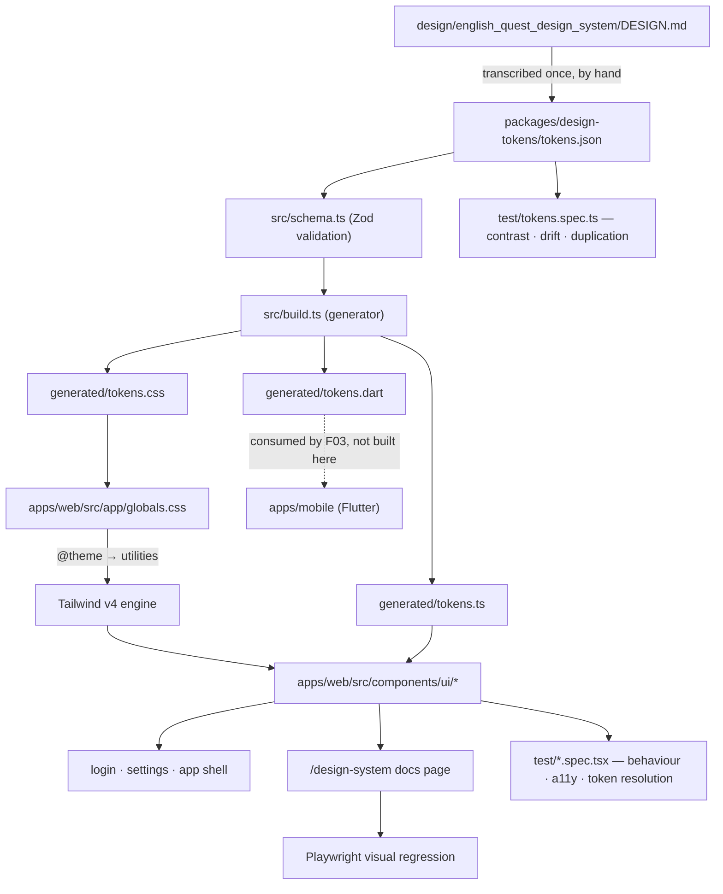

# Technical Specification: Design System

## 1. Technical Overview

**What:** A framework-neutral token source (`packages/design-tokens/tokens.json`) that generates three artifacts — a Tailwind v4 `@theme` stylesheet, a typed TypeScript module, and a Dart theme — plus a React component library in `apps/web/src/components/ui/` built exclusively on those tokens: eight primitives (Button, Card, Badge, Meter, Chip, Field, Stack, Grid), three page states (Loading, Empty, Error), a paired light/dark theme, a browsable documentation page, per-component visual regression coverage, and the migration of the login and settings screens off their ad-hoc CSS.

**Why:** The web client currently styles itself from a single 264-line `apps/web/src/app/globals.css` holding hand-written custom properties (`--bg`, `--surface`, `--accent`) and global classes (`.card`, `.field`, `.primary`, `.badge`, `.row`, `.credential-*`) invented per screen. Two screens already produced three different button treatments and a badge vocabulary that only the credentials screen understands. Nineteen features remain, nine of which consume this system, and a Flutter client (F03) must speak the same vocabulary. Without a generated token layer the two clients diverge by copying, and divergence by copying is invisible until a colour is wrong in one place only.

The second motivation is that the visual direction is already decided and captured in `design/english_quest_design_system`, including a palette, a 13-step type scale and an interaction physics. Encoding it once as data is cheaper than re-deriving it per screen, and it makes "does a component for this already exist" an answerable question.

**Scope — Included (Core + Full, per the PRD's Core Scope and Full Scope additions):**
- The token source, its schema, and the generator producing CSS, TypeScript and Dart
- The eight primitives with the variants, sizes and states the PRD's capabilities name
- The three page states as components
- Paired light and dark themes sharing one token contract
- The browsable component documentation page
- Per-component visual regression coverage in both themes
- Migration of the login and settings screens; deletion of the ad-hoc classes
- Contrast, token-resolution and accessibility enforcement as tests and lint rules

**Scope — Excluded:**
- The Flutter side of the contract. This feature *emits* `generated/tokens.dart`; F03 consumes it. Nothing in this feature builds or runs Flutter.
- Any HTTP endpoint. This feature adds no route to the API, so `docs/api/openapi.json` is unchanged and the project's OpenAPI directive does not apply here.
- Any database table or migration.
- Product screens beyond login and settings. The dashboard placeholder is restyled only insofar as the app shell it lives in is migrated.
- The vocabulary the reference screens carry but the product does not have: XP, levels, streaks, achievement badges, a paid tier, and third-party sign-in. The amber accent role those screens used for XP is retained and repurposed for warnings and the profile's warming-up state.

**Complexity:** complex.

---

## 2. Architecture Impact

**Affected components:**

- `packages/design-tokens/` — new workspace package; the token source, its Zod schema, the generator, the committed generated artifacts and the token test suite
- `apps/web/src/app/globals.css` — rewritten; becomes the Tailwind entry point that imports the generated token stylesheet and declares the dark variant and the press utilities
- `apps/web/src/components/ui/` — new; the primitives and page states
- `apps/web/src/app/layout.tsx` — modified; font wiring and the no-flash theme script
- `apps/web/src/app/(dev)/design-system/page.tsx` — new; the documentation page
- `apps/web/src/components/{login-form,credential-card,credential-form,credentials-panel}.tsx` — modified; migrated onto the primitives
- `apps/web/src/app/{login,(app)}/**` — modified; shell and pages migrated
- `apps/web/src/middleware.ts` — modified; the documentation page joins the public paths
- `apps/web/e2e/` — new; Playwright visual regression and its committed baselines
- `docker-compose.yml` — modified; a `visual` service running the official Playwright Linux image
- `eslint.config.mjs` — modified; `jsx-a11y` rules scoped to the web client



**Data flow in one sentence:** a value is written once in `tokens.json`, validated by a schema, generated into three artifacts, consumed as Tailwind utilities and typed constants by the web client and as a theme by the Flutter client — and every step between the source and the screen is asserted by a test.

---

## 3. Technical Decisions

| Decision | Chosen Approach | Alternative Considered | Trade-off |
|----------|----------------|----------------------|-----------|
| Styling mechanism | Tailwind v4 with a generated `@theme` block; tokens become utilities (`bg-primary`, `text-body-md`, `rounded-lg`, `shadow-card`) | CSS Modules consuming `var(--*)`; keeping a single global stylesheet | The reference screens are already Tailwind, so the visual language transfers nearly mechanically. We accept a new build dependency and the risk that arbitrary values (`bg-[#AE3115]`, `p-[13px]`) reintroduce raw values — which is why an arbitrary-value ban is a test, not a convention |
| Component library location | `apps/web/src/components/ui/` | A `packages/ui` workspace package | React has exactly one consumer here; the mobile client is Flutter and consumes the Dart theme, not the components. A separate package would add build, tsconfig and resolution overhead for a single consumer. We accept that the boundary between library and application is enforced by folder convention rather than by the package manager |
| Token generator | A hand-written generator in `packages/design-tokens/src/build.ts`, ~200 lines, run by `pnpm tokens:build` | Style Dictionary | Three output formats and one input file do not justify a dependency with its own configuration DSL and transform registry. We accept owning the generator, including its Dart formatting |
| Generated artifacts | Committed to `packages/design-tokens/generated/`, guarded by a drift test that regenerates and compares | Generated into a gitignored `dist/` at build time | Mirrors the established `docs/api/openapi.json` pattern in this repo: the artifact is reviewable in a diff, the Dart file is readable by F03 without running a Node build, and drift cannot land silently. We accept that a token change requires running the generator before committing |
| Dark theme mechanism | Semantic token values are redefined under `[data-theme="dark"]`; components carry **zero** `dark:` variants | `dark:` variants on each component | A component that names `bg-surface` is already correct in both themes. This is what makes the theme a value substitution rather than a parallel implementation, and it is what lets the Dart theme be generated from the same two value sets. We accept that a genuinely structural difference must be expressed as a token value, not as a rule |
| Elevation in dark mode | `--shadow-card` and `--shadow-button` resolve to `none` in dark; `--color-outline-strong` flips from `#18181B` to `#E4E1E6`; surfaces raise | Keeping the hard shadow with a lighter shadow colour | A black offset shadow is invisible on a dark surface, and adjacent dark surfaces measure **1.07:1** against each other — they cannot carry elevation alone. The 2px outline is already present on every card and button in the light theme, so the substitution changes values only. We accept that dark mode reads flatter by design |
| "No raw value" enforcement | A Vitest source-scan test over `apps/web/src/**/*.{ts,tsx,css}` rejecting hex literals, `px`/`rem` literals and Tailwind arbitrary-value brackets, with a named allowlist | `eslint-plugin-tailwindcss` | Matches the repo's habit of asserting contracts with a test (the OpenAPI drift guard). Works uniformly across TSX and CSS, where an ESLint rule sees only TSX, and does not depend on a plugin's Tailwind v4 support. We accept maintaining the regexes |
| Undefined-token detection | A test that extracts every token-shaped utility and every `var(--*)` reference from web source and asserts each resolves to a declared token | Trusting Tailwind to error | Tailwind silently emits nothing for an unknown utility, so `bg-surfce` produces a transparent element and no error. This is precisely the failure the PRD's error handling calls invisible. We accept that the extractor must know which utility prefixes are token-bearing |
| Visual regression environment | A `visual` service in Docker Compose using `mcr.microsoft.com/playwright`, targeting `http://web:3000` | Playwright on the Windows host | Playwright suffixes baselines with browser *and platform* because font rasterisation differs; a host-generated baseline breaks for anyone on another OS. The container also gets the fonts over HTTP from the web server, so no font installation is needed inside it. We accept a ~1.5GB image and one more compose service |
| Documentation page availability | Always routed at `/design-system`, public, no session required | Gated behind `NODE_ENV !== 'production'` | The product is local-only by decision — there is no deployed surface to leak it to. Gating it would force the visual suite to run against `next dev`, which is flaky for screenshots. We accept a route that exists in a production build that is never publicly served |
| Font delivery | `next/font/google` for Plus Jakarta Sans | Self-hosted woff2 in `public/` | Subsetting, preloading and the `font-display` policy come for free, and the served URL is same-origin, which keeps the visual container simple. We accept that a build needs network access the first time |
| Contrast criterion | Every declared semantic pair is measured; reading surfaces require 4.5:1, non-text borders require 3:1; an exemption registry exists but is **empty** | A blanket exemption for interactive fills | Measurement showed the frontmatter palette passes on fills: white on `#AE3115` is 6.46:1, on `#0058BE` is 6.69:1, on `#BA1A1A` is 6.46:1. Only `primary-container #FF6B4A` fails at 2.82:1, and it is restricted to decorative washes carrying `#18181B` text (6.29:1). We accept keeping the exemption mechanism for a case that does not exist yet, so that adding one is a visible act |

---

## 4. Component Overview

### Design tokens package

| File Path | New/Modified | Purpose | Key Responsibilities |
|-----------|--------------|---------|---------------------|
| `packages/design-tokens/package.json` | New | Workspace package manifest | Declares `tokens:build`, `typecheck` and `test`; exports the generated TypeScript module |
| `packages/design-tokens/tokens.json` | New | The single source of every styling value | Colour roles for both themes, the 13-step type scale, spacing, radii, shadows, motion, and the semantic-pair registry with its contrast requirements |
| `packages/design-tokens/src/schema.ts` | New | Zod schema for the token document | Validates shape and value formats; rejects a colour that is not `#rrggbb`, a type step missing its line height, or a semantic pair naming an undeclared role |
| `packages/design-tokens/src/build.ts` | New | The generator | Reads and validates `tokens.json`, emits the three artifacts, and writes nothing if validation fails |
| `packages/design-tokens/src/emit-css.ts` | New | CSS emitter | Produces the `@theme` block, the light `:root` values, the `[data-theme="dark"]` override block and the `prefers-color-scheme` default |
| `packages/design-tokens/src/emit-ts.ts` | New | TypeScript emitter | Produces typed constants plus the union types (`ButtonVariant`, `BadgeStatus`, `MeterState`, `SpacingToken`) the web components import |
| `packages/design-tokens/src/emit-dart.ts` | New | Dart emitter | Produces a `ThemeData` factory for both brightnesses plus a `const` colour and spacing class, formatted for `dart format` |
| `packages/design-tokens/src/contrast.ts` | New | WCAG relative-luminance maths | Computes contrast ratios; shared by the emitters and the test suite so the number in a failure message is the number the test used |
| `packages/design-tokens/src/index.ts` | New | Package entry | Re-exports the generated TypeScript module and the token types |
| `packages/design-tokens/generated/tokens.css` | New (generated, committed) | Tailwind theme + theme value blocks | Consumed by `apps/web/src/app/globals.css` |
| `packages/design-tokens/generated/tokens.ts` | New (generated, committed) | Typed token constants and unions | Consumed by web components for non-class usage (chart colours, meter geometry) |
| `packages/design-tokens/generated/tokens.dart` | New (generated, committed) | Flutter theme | Consumed by F03; not compiled in this feature |
| `packages/design-tokens/tsconfig.json`, `tsconfig.build.json`, `vitest.config.ts` | New | Build and test config | Mirrors `packages/shared`, including the `rootDir`/`outDir` split that keeps `test/` out of the build |

### Web — theme layer

| File Path | New/Modified | Purpose | Key Responsibilities |
|-----------|--------------|---------|---------------------|
| `apps/web/src/app/globals.css` | Modified (rewritten) | Tailwind entry point | Imports Tailwind and the generated token stylesheet; declares the `dark` custom variant, the `press-button`/`press-card` utilities and a minimal base layer. Every hand-written class currently in this file is deleted |
| `apps/web/postcss.config.mjs` | New | PostCSS wiring | Registers `@tailwindcss/postcss` |
| `apps/web/src/app/layout.tsx` | Modified | Root document | Loads Plus Jakarta Sans via `next/font/google`, renders the pre-paint theme script, sets `suppressHydrationWarning` on `<html>` |
| `apps/web/src/lib/theme.ts` | New | Theme resolution | The inline script source, the `localStorage` key, and the `resolveTheme` helper shared by the script and the toggle |
| `apps/web/src/components/ui/theme-toggle.tsx` | New | Theme override control | Cycles system → light → dark, persists the choice, stamps `data-theme`; announces the active theme to assistive technology |

### Web — primitives

| File Path | New/Modified | Purpose | Key Responsibilities |
|-----------|--------------|---------|---------------------|
| `apps/web/src/components/ui/button.tsx` | New | Button | 4 variants, 3 sizes, loading and disabled; type-level requirement of a text child or an `aria-label`; mechanical press via `press-button` |
| `apps/web/src/components/ui/card.tsx` | New | Card | 2px outline, hard offset shadow, `rounded-lg`; optional header/footer slots and an accent-wash tone; renders as `section` or `article` |
| `apps/web/src/components/ui/badge.tsx` | New | Badge | Five statuses, full pill, 2px outline; always renders its own text so status is never colour alone |
| `apps/web/src/components/ui/meter.tsx` | New | Meter | 0–100 value with `role="meter"`, optional signed delta, and a warming-up state that renders a hatched track and explicit copy instead of a number |
| `apps/web/src/components/ui/chip.tsx` | New | Chip | Pill for error tags, target expressions and vocabulary domains; optional count and optional removal affordance with an accessible name |
| `apps/web/src/components/ui/field.tsx` | New | Field | Label, control, hint and error; owns id generation and the `aria-describedby`/`aria-invalid` wiring |
| `apps/web/src/components/ui/stack.tsx` | New | Stack | Flex layout constrained to spacing tokens for direction, gap, alignment and wrapping |
| `apps/web/src/components/ui/grid.tsx` | New | Grid | Responsive grid constrained to the 12/8/4-column architecture and token gutters |
| `apps/web/src/components/ui/skeleton.tsx` | New | Skeleton | The shape unit the loading state composes from; token-driven, animation disabled under `prefers-reduced-motion` |
| `apps/web/src/components/ui/cn.ts` | New | Class composition helper | Joins conditional class strings without a dependency |
| `apps/web/src/components/ui/index.ts` | New | Barrel export | The single import surface for every consumer |

### Web — page states

| File Path | New/Modified | Purpose | Key Responsibilities |
|-----------|--------------|---------|---------------------|
| `apps/web/src/components/ui/loading-state.tsx` | New | Loading | Renders a skeleton shaped like the incoming content (`card-grid`, `list`, `text-block`, `meter`); exposes `role="status"` with a polite live region; never renders a spinner |
| `apps/web/src/components/ui/empty-state.tsx` | New | Empty | States what is missing and offers exactly one action — the prop is a single action object, not an array |
| `apps/web/src/components/ui/error-state.tsx` | New | Error | Plain-language failure text and a required retry callback; `role="alert"` |

### Web — documentation, migration and infrastructure

| File Path | New/Modified | Purpose | Key Responsibilities |
|-----------|--------------|---------|---------------------|
| `apps/web/src/app/(dev)/design-system/page.tsx` | New | Documentation page | Renders every component with every variant and state, each block carrying a stable `data-vr` id used by the visual suite |
| `apps/web/src/app/(dev)/design-system/sections/*.tsx` | New | Per-component showcase blocks | One file per primitive and page state, so adding a variant touches one file |
| `apps/web/src/middleware.ts` | Modified | Route gating | `/design-system` joins `PUBLIC_PATHS` |
| `apps/web/src/components/login-form.tsx` | Modified | Login migration | Composes Card, Field, Button and ErrorState; the lockout countdown keeps its current behaviour |
| `apps/web/src/components/credential-card.tsx` | Modified | Settings migration | Composes Card, Badge, Button, Stack; maps the F02 credential statuses onto badge statuses at the call site |
| `apps/web/src/components/credential-form.tsx` | Modified | Settings migration | Composes Field, Button and the error presentation |
| `apps/web/src/components/credentials-panel.tsx` | Modified | Settings migration | Uses Grid, LoadingState and ErrorState instead of bare paragraphs |
| `apps/web/src/app/(app)/layout.tsx` | Modified | App shell | Token-driven header with the 2px bottom rule, the theme toggle, and the responsive container |
| `apps/web/src/app/login/page.tsx`, `apps/web/src/app/(app)/{dashboard,settings}/page.tsx` | Modified | Page migration | Inline `style` attributes removed; typography and spacing come from tokens |
| `apps/web/playwright.config.ts` | New | Visual suite config | Chromium project, `baseURL` from `VISUAL_BASE_URL`, `snapshotPathTemplate`, disabled animations, hidden caret |
| `apps/web/e2e/visual.spec.ts` | New | Visual regression suite | One clipped screenshot per showcase block per theme |
| `apps/web/e2e/__screenshots__/**` | New (committed) | Baselines | 22 PNGs: 11 blocks × 2 themes, generated on Linux |
| `docker-compose.yml` | Modified | Visual service | `mcr.microsoft.com/playwright`, workspace mount, `depends_on: web` |
| `eslint.config.mjs` | Modified | Accessibility lint | `eslint-plugin-jsx-a11y` recommended rules scoped to `apps/web/src/**/*.tsx`, with `control-has-associated-label` promoted to error |
| `apps/web/vitest.config.ts` | Modified | Test discovery | `include` widened to `test/**/*.spec.{ts,tsx}` so the non-component guard tests run; `e2e/` excluded |

**Database:** none. This feature creates no table and no migration.

---

## 5. Contracts

This feature exposes no HTTP endpoint, so there is no OpenAPI change. Its contracts are the token document, the three generated artifacts, and the component APIs that nine downstream features will code against.

### Generation contract

| Input | Output | Guarantee |
|-------|--------|-----------|
| `tokens.json` | `generated/tokens.css` | Every colour role emitted twice — once in `:root`, once under `[data-theme="dark"]` — and every scale emitted once inside `@theme` |
| `tokens.json` | `generated/tokens.ts` | Every token reachable as a typed constant; every enumerated vocabulary (button variants, badge statuses, meter states, spacing steps) emitted as a union type |
| `tokens.json` | `generated/tokens.dart` | A `ThemeData` factory per brightness plus `const` colour and spacing classes, using the same role names as the CSS |
| Any of the three | The committed file | Regenerating produces a byte-identical file; the drift test fails otherwise |

**`generated/tokens.css` shape:**

```css
@theme {
  --color-primary: #ae3115;
  --color-on-primary: #ffffff;
  --color-surface: #fbf8fc;
  --color-outline-strong: #18181b;
  --text-body-md: 14px;
  --text-body-md--line-height: 22px;
  --text-body-md--font-weight: 400;
  --radius-lg: 1rem;
  --spacing-md: 1rem;
  --shadow-card: 4px 4px 0 var(--color-outline-strong);
  --duration-press: 120ms;
  --ease-snappy: cubic-bezier(0.2, 0, 0, 1);
}

:root[data-theme='dark'] {
  --color-primary: #ffb4a3;
  --color-on-primary: #5f1500;
  --color-surface: #141316;
  --color-outline-strong: #e4e1e6;
  --shadow-card: none;
}
```

The `@theme` block carries the light values, so Tailwind generates utilities from them; the dark block redefines only what changes. A third block applies the dark values under `@media (prefers-color-scheme: dark)` scoped to `:root:not([data-theme='light'])`, so the system preference is honoured before the script runs and an explicit light choice still wins.

**`generated/tokens.ts` shape:**

```ts
export const color = { primary: '#ae3115', onPrimary: '#ffffff' /* ... */ } as const;
export const darkColor = { primary: '#ffb4a3' /* ... */ } as const;
export const spacing = { xs: '0.25rem', sm: '0.5rem' /* ... */ } as const;
export type BadgeStatus = 'success' | 'warning' | 'info' | 'danger' | 'neutral';
export type ButtonVariant = 'primary' | 'secondary' | 'neutral' | 'destructive';
export type MeterState = 'scored' | 'warming-up';
```

### Component contracts

**Button**

| Prop | Type | Required | Default | Description |
|------|------|----------|---------|-------------|
| `variant` | `'primary' \| 'secondary' \| 'neutral' \| 'destructive'` | No | `'primary'` | Fill and outline treatment |
| `size` | `'sm' \| 'md' \| 'lg'` | No | `'md'` | Padding and type step |
| `loading` | `boolean` | No | `false` | Disables the control and swaps the label for its loading text while preserving width |
| `loadingLabel` | `string` | No | `'Working…'` | Announced in the live region while loading |
| `disabled` | `boolean` | No | `false` | Non-interactive; retains the 2px outline so it stays visible |
| `fullWidth` | `boolean` | No | `false` | Stretches to the container |
| `children` / `aria-label` | `ReactNode` / `string` | **One of the two** | — | Enforced by a discriminated union: an icon-only button without `aria-label` fails typecheck |

**Card**

| Prop | Type | Required | Default | Description |
|------|------|----------|---------|-------------|
| `tone` | `'neutral' \| 'primary' \| 'info' \| 'success'` | No | `'neutral'` | Background wash; outline and shadow are constant |
| `as` | `'section' \| 'article' \| 'div'` | No | `'section'` | Rendered element |
| `header` / `footer` | `ReactNode` | No | — | Slots separated by a token rule |
| `interactive` | `boolean` | No | `false` | Adds the `press-card` physics; requires the card to contain a focusable element |

**Badge**

| Prop | Type | Required | Description |
|------|------|----------|-------------|
| `status` | `BadgeStatus` | Yes | One of the five statuses |
| `children` | `string` | Yes | The label; a badge cannot render without text, which is how colour-alone status is prevented structurally |

**Meter**

| Prop | Type | Required | Description |
|------|------|----------|-------------|
| `value` | `number \| null` | Yes | 0–100; `null` is only valid with `state: 'warming-up'` |
| `state` | `MeterState` | No | `'scored'` by default; `'warming-up'` renders a hatched track, the copy "Warming up", and no number |
| `label` | `string` | Yes | The accessible name; also rendered visibly |
| `delta` | `number` | No | Signed change, rendered with an explicit `+`/`−` and an arrow, so direction is not carried by colour |

**Chip**

| Prop | Type | Required | Description |
|------|------|----------|-------------|
| `tone` | `'neutral' \| 'accent' \| 'success' \| 'warning' \| 'danger'` | No | Pill fill |
| `count` | `number` | No | Recurrence count appended in the pill |
| `onRemove` | `() => void` | No | Renders a removal control whose accessible name includes the chip label |

**Field**

| Prop | Type | Required | Description |
|------|------|----------|-------------|
| `label` | `string` | Yes | Bound to the control via a generated id |
| `hint` | `string` | No | Linked through `aria-describedby` |
| `error` | `string \| null` | No | Sets `aria-invalid`, joins `aria-describedby`, and renders in the error role |
| `children` | `(props: FieldControlProps) => ReactNode` | Yes | Render prop receiving `id`, `aria-describedby` and `aria-invalid`, so the wiring cannot be forgotten |

**Stack / Grid**

| Prop | Type | Description |
|------|------|-------------|
| `gap` | `SpacingToken` | Constrained to the generated spacing union — an arbitrary number fails typecheck |
| `direction` (Stack) | `'row' \| 'column'` | Flex direction, with a responsive variant |
| `columns` (Grid) | `1 \| 2 \| 3 \| 4 \| 6 \| 12` | Desktop column span, reflowing to 8 and 4 columns at the tablet and mobile breakpoints |

**Page states**

| Component | Prop | Type | Required | Description |
|-----------|------|------|----------|-------------|
| `LoadingState` | `variant` | `'card-grid' \| 'list' \| 'text-block' \| 'meter'` | Yes | The shape of the content that is coming |
| `LoadingState` | `label` | `string` | Yes | Announced politely; not rendered as a spinner |
| `EmptyState` | `title`, `description` | `string` | Yes | What is missing |
| `EmptyState` | `action` | `{ label: string; onClick: () => void }` | No | Exactly one action; the type forbids a list |
| `ErrorState` | `title`, `description` | `string` | Yes | Plain language, no error codes |
| `ErrorState` | `onRetry` | `() => void` | **Yes** | An error state without a retry is not representable |

---

## 6. Data Model

There is no database table. The data model of this feature is the token document.

### `tokens.json` structure

```json
{
  "$schema": "./tokens.schema.json",
  "meta": { "source": "design/english_quest_design_system/DESIGN.md", "fontFamily": "Plus Jakarta Sans" },
  "color": {
    "light": { "primary": "#ae3115", "on-primary": "#ffffff", "surface": "#fbf8fc" },
    "dark":  { "primary": "#ffb4a3", "on-primary": "#5f1500", "surface": "#141316" }
  },
  "type": {
    "body-md": { "size": "14px", "lineHeight": "22px", "weight": 400 }
  },
  "spacing": { "xs": "0.25rem", "sm": "0.5rem", "md": "1rem", "lg": "1.5rem", "xl": "2.5rem" },
  "radius": { "sm": "0.25rem", "DEFAULT": "0.5rem", "md": "0.75rem", "lg": "1rem", "xl": "1.5rem", "full": "9999px" },
  "shadow": {
    "light": { "card": "4px 4px 0 var(--color-outline-strong)", "button": "3px 3px 0 var(--color-outline-strong)" },
    "dark":  { "card": "none", "button": "none" }
  },
  "motion": { "duration-press": "120ms", "duration-base": "200ms", "ease-snappy": "cubic-bezier(0.2, 0, 0, 1)" },
  "semanticPairs": [
    { "name": "body-on-surface", "fg": "on-surface", "bg": "surface", "kind": "reading", "min": 4.5 },
    { "name": "outline-on-surface", "fg": "outline", "bg": "surface", "kind": "border", "min": 3.0 }
  ],
  "contrastExemptions": []
}
```

**Colour roles (light).** Taken from the `design/english_quest_design_system/DESIGN.md` frontmatter, which is authoritative wherever the file's prose disagrees with it, because the frontmatter is what the approved screens render.

| Role | Value | Role | Value |
|------|-------|------|-------|
| `surface` | `#fbf8fc` | `primary` | `#ae3115` |
| `surface-container-lowest` | `#ffffff` | `on-primary` | `#ffffff` |
| `surface-container` | `#f0edf1` | `primary-container` | `#ff6b4a` |
| `surface-container-highest` | `#e4e1e6` | `on-primary-container` | `#18181b` |
| `on-surface` | `#1b1b1e` | `secondary` | `#0058be` |
| `on-surface-variant` | `#59413c` | `on-secondary` | `#ffffff` |
| `outline` | `#8d716a` | `tertiary` | `#006c49` |
| `outline-variant` | `#e1bfb8` | `error` | `#ba1a1a` |
| `outline-strong` | `#18181b` | `on-error` | `#ffffff` |

`outline-strong` is the only role not present in the frontmatter. It is the structural black the prose specifies for every 2px stroke and every hard shadow, promoted to a role because it is exactly the value that must change in dark mode.

**Colour roles (dark), derived.** Every value below was measured before being written here.

| Role | Value | Role | Value |
|------|-------|------|-------|
| `surface` | `#141316` | `primary` | `#ffb4a3` |
| `surface-container-lowest` | `#1b1a1d` | `on-primary` | `#5f1500` |
| `surface-container` | `#211f23` | `secondary` | `#adc6ff` |
| `surface-container-highest` | `#2c2a2e` | `on-secondary` | `#002e69` |
| `on-surface` | `#e5e1e6` | `tertiary` | `#4edea3` |
| `on-surface-variant` | `#d8c2bc` | `error` | `#ffb4ab` |
| `outline` | `#a08d87` | `on-error` | `#690005` |
| `outline-strong` | `#e4e1e6` | | |

**Badge pairs.** Both themes, all meeting 4.5:1 as reading surfaces.

| Status | Light fg / bg | Ratio | Dark fg / bg | Ratio |
|--------|---------------|-------|--------------|-------|
| `success` | `#003b26` / `#00b07a` | 4.53:1 | `#6ffbbe` / `#00513a` | 7.25:1 |
| `warning` | `#92400e` / `#fef3c7` | 6.37:1 | `#fde68a` / `#553f04` | 8.03:1 |
| `info` | `#001a42` / `#d8e2ff` | 13.24:1 | `#d8e2ff` / `#003c8f` | 7.95:1 |
| `danger` | `#93000a` / `#ffdad6` | 7.24:1 | `#ffdad6` / `#93000a` | 7.24:1 |
| `neutral` | `#1b1b1e` / `#e4e1e6` | 13.27:1 | `#e5e1e6` / `#2c2a2e` | 10.99:1 |

The `neutral` status has no counterpart in the reference screens. It is added because F02 already has a fourth credential state — `missing` — which is an absence rather than a failure, and rendering an absence in the danger colour would misstate it.

**Type scale.** The 13 steps from the frontmatter, unchanged: `display`, `display-mobile`, `headline-lg`, `headline-lg-mobile`, `headline-md`, `headline-sm`, `title-lg`, `title-md`, `body-lg`, `body-md`, `body-sm`, `label-lg`, `label-md`, `label-sm`. Each carries its size, line height and weight, so `text-body-md` sets all three.

**Radius mapping.** The reference prose names Tailwind's *default* radius scale, which does not match this system's scale. The mapping is recorded here because reading the prose literally produces the wrong value:

| Prose says | Means | This system's token | Value |
|------------|-------|---------------------|-------|
| `rounded-2xl` (cards) | 16–20px | `rounded-lg` | `1rem` |
| `rounded-xl` (buttons, inputs) | 12px | `rounded-md` | `0.75rem` |
| `rounded-full` (chips, badges) | pill | `rounded-full` | `9999px` |

**Interaction physics.** Expressed as two Tailwind custom utilities so no component ever writes an arbitrary value:

| Utility | Rest | Hover | Active |
|---------|------|-------|--------|
| `press-button` | `shadow-button` (3px offset) | translate −1px/−1px, shadow 4px | translate 3px/3px, shadow `none` |
| `press-card` | `shadow-card` (4px offset) | translate −1px/−1px, shadow 5px | translate 4px/4px, shadow `none` |

Both transition over `--duration-press` with `--ease-snappy`, and both collapse to no transform under `prefers-reduced-motion: reduce`.

### Semantic pair registry

`semanticPairs` is the list the contrast test iterates. Each entry names a foreground role, a background role, a `kind` (`reading` → 4.5:1, `border` → 3:1) and its threshold. The test runs every pair against **both** themes. `contrastExemptions` is an array of `{ pair, ratio, reason }` and is currently empty; the schema requires a non-empty `reason` on any entry added to it, and the test reports exemptions in its output so they remain visible rather than silent.

---

## 7. Testing Strategy

| Test File | Test Type | Target | Coverage Goal |
|-----------|-----------|--------|---------------|
| `packages/design-tokens/test/tokens.spec.ts` | Unit | Schema, contrast, generation, drift | 100% of the token contract |
| `packages/design-tokens/test/emit.spec.ts` | Unit | The three emitters | 90% |
| `apps/web/test/no-raw-values.spec.ts` | Guard | Web source | Every source file scanned |
| `apps/web/test/token-resolution.spec.ts` | Guard | Web source | Every token-bearing utility and `var()` reference |
| `apps/web/test/ui-primitives.spec.tsx` | Component | The eight primitives | 90% |
| `apps/web/test/page-states.spec.tsx` | Component | Loading, Empty, Error | 90% |
| `apps/web/test/theme.spec.tsx` | Component | Theme resolution and toggle | 90% |
| `apps/web/test/login-form.spec.tsx` | Component (existing) | Login after migration | Behaviour unchanged |
| `apps/web/test/credential-card.spec.tsx` | Component (existing) | Settings after migration | Behaviour unchanged |
| `apps/web/e2e/visual.spec.ts` | Visual regression | Documentation page | 11 blocks × 2 themes |

### `packages/design-tokens/test/tokens.spec.ts`

| Test Function | Description | Assertions |
|---------------|-------------|------------|
| `tokens_json_satisfies_the_schema` | The source document validates | Zod parse succeeds; every colour matches `#rrggbb`; every type step has size, line height and weight |
| `light_and_dark_declare_the_same_colour_roles` | No role exists in one theme only | The two key sets are identical |
| `every_reading_pair_meets_4_5_to_1_in_both_themes` | The core contrast requirement | Every `kind: reading` pair passes in light and dark; failure message names the pair, the two hex values and the measured ratio |
| `every_border_pair_meets_3_to_1_in_both_themes` | Non-text contrast | Same, at the 3:1 threshold |
| `the_exemption_list_is_empty_and_any_entry_carries_a_reason` | The exemption is a visible decision | The array is empty; if non-empty, every entry has a `reason` of non-zero length and a recorded measured ratio |
| `no_declared_pair_is_silently_absent_from_the_registry` | Prevents a pair being dropped instead of fixed | Every `on-*` role is the foreground of at least one registered pair |
| `generated_files_match_a_fresh_generation` | Drift guard, mirroring the OpenAPI guard | Regenerating into memory reproduces each committed file byte for byte |
| `the_generator_contains_no_literal_token_values` | Values live in the source, not the code | Scanning `src/*.ts` finds no hex literal and no `rem`/`px` literal outside the allowlist |
| `dark_elevation_substitutes_outline_for_shadow` | The one structural difference | Dark `shadow.card` and `shadow.button` are `none`; dark `outline-strong` is lighter than dark `surface` by at least 3:1 |

### `packages/design-tokens/test/emit.spec.ts`

| Test Function | Description | Assertions |
|---------------|-------------|------------|
| `css_emits_every_colour_role_in_both_blocks` | CSS completeness | Each role appears in `@theme` and in `[data-theme='dark']` |
| `css_declares_the_system_preference_fallback` | Pre-script correctness | The `prefers-color-scheme: dark` block exists and is scoped to `:root:not([data-theme='light'])` |
| `ts_emits_a_union_for_every_enumerated_vocabulary` | Type safety downstream | `ButtonVariant`, `BadgeStatus`, `MeterState` and `SpacingToken` are present with the expected members |
| `dart_emits_a_theme_for_each_brightness` | Mobile contract | Both factories exist and reference the same role names as the CSS |
| `all_three_outputs_agree_on_every_value` | The parity guarantee | For each role, the value in CSS, TypeScript and Dart is the same string |

### `apps/web/test/no-raw-values.spec.ts`

| Test Function | Description | Assertions |
|---------------|-------------|------------|
| `no_hex_colour_appears_in_web_source` | Colour discipline | No `#rrggbb` or `#rgb` in `src/**/*.{ts,tsx,css}` outside the allowlist |
| `no_tailwind_arbitrary_value_appears_in_web_source` | The Tailwind-specific escape hatch | No `[...]` bracket syntax in a class attribute |
| `no_inline_style_attribute_carries_a_dimension_or_colour` | Catches the pattern the current pages use | No `style={{ ... }}` containing a colour or a length; the two existing occurrences must be gone |
| `the_allowlist_is_justified` | Keeps the escape hatch honest | Every allowlist entry carries a comment explaining it |

### `apps/web/test/token-resolution.spec.ts`

| Test Function | Description | Assertions |
|---------------|-------------|------------|
| `every_token_utility_in_source_resolves_to_a_declared_token` | The PRD's "undefined token fails the build" | Extracting `bg-`, `text-`, `border-`, `rounded-`, `shadow-`, `p-`, `m-`, `gap-` suffixes, every one is a declared token or a Tailwind built-in |
| `every_css_variable_reference_is_declared` | Same, for CSS | Every `var(--…)` in `globals.css` resolves to a generated declaration |
| `an_unknown_utility_is_detected` | Proves the guard can fail | A fixture string containing `bg-surfce` is reported, so the test is not vacuously passing |

### `apps/web/test/ui-primitives.spec.tsx`

| Test Function | Description | Assertions |
|---------------|-------------|------------|
| `button_renders_each_variant_and_size` | Variant coverage | All 12 combinations render with their token classes |
| `button_is_disabled_and_announces_while_loading` | Loading semantics | `disabled` is set; the loading label is in a live region; width does not collapse |
| `an_icon_only_button_without_a_label_fails_typecheck` | The a11y guarantee | A `@ts-expect-error` fixture; the suite fails if the error stops being raised |
| `badge_always_renders_text_alongside_its_colour` | Status is never colour alone | Each of the five statuses renders non-empty text content |
| `meter_exposes_its_value_to_assistive_technology` | Meter semantics | `role="meter"` with `aria-valuenow`, `aria-valuemin`, `aria-valuemax` and an accessible name |
| `meter_in_warming_up_renders_copy_instead_of_a_number` | The warming-up state | No numeric value rendered; the copy is present; `aria-valuenow` is absent |
| `meter_delta_states_its_direction_in_text` | Direction not by colour | A positive delta renders `+`, a negative one renders `−` |
| `field_wires_label_hint_and_error_to_the_control` | Form semantics | `htmlFor`/`id` match; `aria-describedby` contains both hint and error ids; `aria-invalid` is true only with an error |
| `chip_removal_control_has_an_accessible_name_including_the_label` | Icon-button trap | The accessible name contains the chip text |
| `stack_and_grid_only_accept_token_spacing` | Layout discipline | A `@ts-expect-error` fixture rejects `gap={13}` |
| `every_interactive_primitive_is_reachable_by_keyboard` | Keyboard operability | Tabbing reaches each control and Enter/Space activates it |
| `every_interactive_primitive_shows_a_token_focus_ring` | Visible focus | The focus-visible class is applied on keyboard focus and absent on mouse focus |

### `apps/web/test/page-states.spec.tsx`

| Test Function | Description | Assertions |
|---------------|-------------|------------|
| `loading_renders_a_skeleton_shaped_like_the_content` | Never a spinner | The expected number of skeleton blocks for each variant; no element with a spinner role or class |
| `loading_announces_politely` | Screen-reader behaviour | `role="status"`, `aria-live="polite"` |
| `empty_states_the_missing_thing_and_one_action` | Empty semantics | Title and description render; at most one button exists |
| `error_renders_plain_language_and_a_retry` | Error semantics | `role="alert"`; the retry button invokes the callback; no error code appears in the copy |
| `error_state_cannot_be_constructed_without_a_retry` | Type-level guarantee | A `@ts-expect-error` fixture omitting `onRetry` |

### `apps/web/test/theme.spec.tsx`

| Test Function | Description | Assertions |
|---------------|-------------|------------|
| `default_follows_the_system_preference` | No stored choice | With `prefers-color-scheme: dark` matched, the resolved theme is dark |
| `an_explicit_choice_overrides_the_system` | Override | Setting light while the system is dark stamps `data-theme="light"` |
| `the_choice_survives_a_reload` | Persistence | The value is read back from storage |
| `the_toggle_announces_the_active_theme` | A11y | The control has an accessible name reflecting the current state |

### `apps/web/e2e/visual.spec.ts`

| Test Function | Description | Assertions |
|---------------|-------------|------------|
| `every_showcase_block_matches_its_light_baseline` | Light theme regression | One clipped `toHaveScreenshot` per `data-vr` block with animations disabled |
| `every_showcase_block_matches_its_dark_baseline` | Dark theme regression | Same, with the theme preset through an init script before first paint |
| `the_documentation_page_lists_every_component` | Documentation completeness | The set of `data-vr` blocks equals the exported component list, so adding a component without documenting it fails |

### Acceptance criteria mapping

| PRD acceptance criterion | Covering test |
|--------------------------|---------------|
| Every value resolves to a token; no raw hex or magic pixel survives a lint pass | `no_hex_colour_appears_in_web_source`, `no_tailwind_arbitrary_value_appears_in_web_source`, `no_inline_style_attribute_carries_a_dimension_or_colour` |
| Every reading surface meets AA; exemptions are a named list | `every_reading_pair_meets_4_5_to_1_in_both_themes`, `the_exemption_list_is_empty_and_any_entry_carries_a_reason` |
| The eight primitives exist with their variants and states | `apps/web/test/ui-primitives.spec.tsx` in full |
| Loading, Empty and Error are components with the right content | `apps/web/test/page-states.spec.tsx` in full |
| Keyboard operability with a token focus ring | `every_interactive_primitive_is_reachable_by_keyboard`, `every_interactive_primitive_shows_a_token_focus_ring` |
| No status carried by colour alone | `badge_always_renders_text_alongside_its_colour`, `meter_delta_states_its_direction_in_text` |
| Both themes legible across the documentation page, elevation by outline in dark | `every_showcase_block_matches_its_dark_baseline`, `dark_elevation_substitutes_outline_for_shadow` |
| `tokens.json` generates all three outputs and one change moves all three | `all_three_outputs_agree_on_every_value`, `generated_files_match_a_fresh_generation` |
| No hex or spacing number appears in more than one place | `the_generator_contains_no_literal_token_values` |
| No XP, levels, streaks, badges, paid tier or third-party sign-in | Manual review at Stage 5 plus `the_documentation_page_lists_every_component` |
| The documentation page lists every component in both themes | `the_documentation_page_lists_every_component` |
| Login and settings render from the system; ad-hoc classes gone | `login-form.spec.tsx`, `credential-card.spec.tsx` passing unchanged, plus `no_hex_colour_appears_in_web_source` |
| An undefined token fails the build | `every_token_utility_in_source_resolves_to_a_declared_token`, `an_unknown_utility_is_detected` |

**Cross-feature integration.** PRD Section 9's Cross-Feature Integration list contains no criterion naming F21; its integration obligations are forward-looking (F03 consumes `generated/tokens.dart`, and nine features consume the component vocabulary). Those are asserted when those features land. What this feature can assert now is that the Dart artifact exists, parses as the expected shape, and agrees value-for-value with the CSS — covered by `dart_emits_a_theme_for_each_brightness` and `all_three_outputs_agree_on_every_value`.

---

## 8. Decisions and Assumptions

**Interview decisions:**
1. **Scope: Core + Full, complete**, including visual regression coverage.
2. **Tailwind v4** with a generated `@theme` block, rather than CSS Modules.
3. **Components live in `apps/web/src/components/ui/`**, not a separate workspace package.
4. **Plus Jakarta Sans via `next/font/google`**.
5. **Visual regression runs in the official Playwright Linux container**, targeting `http://web:3000`, so baselines are platform-stable.
6. **One clipped screenshot per component per theme** — 22 baselines — rather than two whole-page shots.

**Assumptions taken without asking, and why:**
- **Generated artifacts are committed** under `generated/` with a drift guard, because `dist/` is gitignored and because this repo already treats `docs/api/openapi.json` this way.
- **The generator is hand-written**, because three formats and one input do not justify Style Dictionary.
- **Enforcement is a Vitest source scan**, because this repo asserts contracts with tests and because an ESLint rule cannot see CSS.
- **A `neutral` badge status is added** beyond the reference screens, because F02's `missing` credential state is an absence, not a failure.
- **`outline-strong` is promoted to a colour role**, because it is the value that must change for dark-mode elevation.
- **The documentation page is public and always routed**, because the product is local-only and gating it would force the visual suite onto `next dev`.
- **Motion durations are consumed only through the `press-*` utilities**, because Tailwind v4's named-duration utility support is not something this spec should assume.
- **Nest/API is untouched.** No route changes, so no OpenAPI regeneration.

**PRD corrections this spec requires** (to be applied to `docs/prd.md` so the PRD and spec do not disagree):
1. The F21 capability stating that interactive fills measure 2.8:1–3.8:1 and are therefore exempt describes the **prose** palette (`#FF6B4A`, `#3B82F6`), not the frontmatter palette the user selected. Measured against the selected palette, white on `primary #AE3115` is **6.46:1**, on `secondary #0058BE` is **6.69:1** and on `error #BA1A1A` is **6.46:1** — all passing AA. The capability should say that the exemption registry exists and is currently empty, and that `primary-container #FF6B4A` is restricted to decorative washes carrying `#18181B` text at 6.29:1.
2. The corresponding acceptance criterion should read that the exemption list is empty and that any future entry carries a recorded reason and measured ratio.
3. `design/english_quest_design_system/DESIGN.md` should have its prose corrected to match its own frontmatter, as the PRD already commits to, including the radius-name mapping recorded in Section 6 above.
