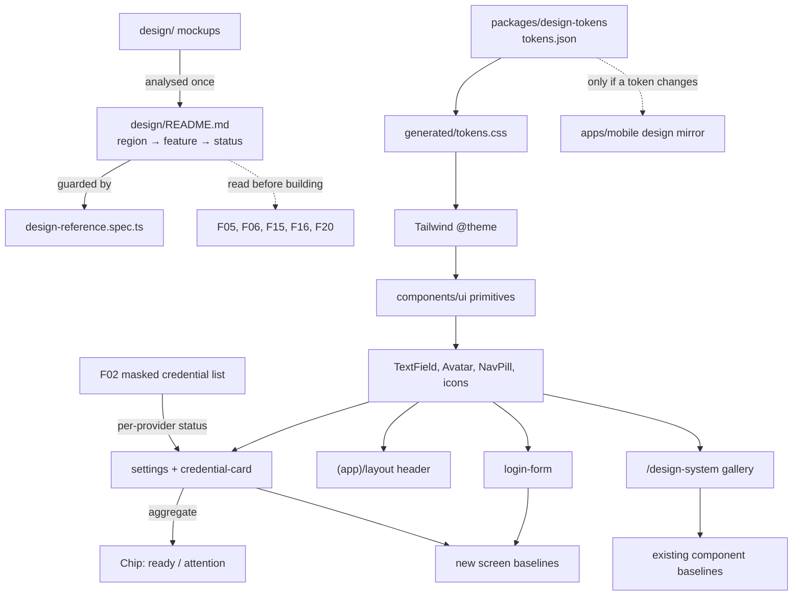

# F22. Design Reference and Visual Realignment

**Complexity:** medium

---

## 1. Technical Overview

**What:** Realign the three web surfaces that already carry real content — the login screen, the authenticated shell header, and the settings screen — to the mockups under `design/`, extending F21's component library where a realignment genuinely needs it. Alongside the screens, commit a design reference document that maps every region of every mockup to the feature that owns it, so the analysis behind each inclusion and each exclusion survives this feature instead of being redone per screen.

**Why:** The existing screens were built with loose reference to the mockups. Where the mockup was followed closely the result held up; where it was not, the screens drifted into a plainer shape than the design establishes. More importantly, nothing in the repository forces the next screen to consult its mockup first, so the drift is structural rather than incidental. The document half of this feature is what makes the fidelity durable; the screen half is what makes it visible now.

This feature also closes a real gap in coverage. Visual regression baselines today exist only for `/design-system`, the component gallery. The actual product screens — the ones this feature changes — have no visual protection at all, so a regression in login or settings is currently invisible to CI.

**Scope — Included:**
- Login screen: leading icons in both fields, an example address beside the email label, a working password reveal, and the mockup's fuller primary action
- Shell header: pill navigation with the active destination selected, and an initials avatar
- Settings screen: heading with its leading icon, the BYOK explanation promoted to a card, a status chip reflecting real aggregate credential validity, and per-provider cards carrying a provider icon, the masked key rendered as a field, region and last-checked
- A `TextField` composition and an icon set, both added to F21's component library and its documentation page
- The design reference document at `design/README.md`, plus an automated guard that keeps it complete
- Screen-level visual regression baselines for login and settings in both themes

**Scope — Excluded:**
- Dashboard content of any kind. The dashboard keeps its placeholder; its hero, module cards, recommended-scenario card and statistic cards belong to F05, F06, F15, F16 and F20 respectively, and mocking any of them now would constrain the feature that owns it.
- The settings help card's real content. It ships static and link-free; making it functional is the PRD's Full Scope addition for this feature.
- Realigning the Flutter screens. Mobile receives only what a changed token or a changed primitive vocabulary forces (see §6).
- Any redesign of the token layer, the primitives or the page-state conventions themselves. This feature composes what F21 established and extends it narrowly.

---

## 2. Architecture Impact

**Affected areas:**
- `apps/web/src/components/ui/` — new `TextField`, `Avatar`, `NavPill` and an `icons/` set; `Field` gains one optional slot
- `apps/web/src/components/` — `login-form`, `credential-card`, `credential-form` recomposed onto the new primitives
- `apps/web/src/app/(app)/` — shell layout and settings page
- `apps/web/src/app/(dev)/design-system/` — the new components appear in the gallery, which is what the existing visual baselines cover
- `apps/web/test/` and `apps/web/e2e/` — component tests, the design-reference guard, and new screen baselines
- `design/README.md` — new
- `apps/mobile/` — verification only; changes only if a token value moves
- `packages/design-tokens/` — expected untouched; any new token goes through `tokens.json` and regeneration

**Control flow in one sentence:** the mockups are analysed once into a committed document that a test keeps honest; the screens are recomposed onto primitives extended for exactly what those mockups need; and both the gallery and the screens are pinned by visual baselines so the fidelity this feature establishes cannot silently erode.

---

## 3. Technical Decisions

| Decision | Chosen Approach | Alternative Considered | Trade-off |
|----------|----------------|----------------------|-----------|
| Field composition | A new `TextField` composing `Field` + the control + adornments; `Field` keeps its render-prop contract and gains only an optional `labelAside` slot | Extending `Field` to render the control itself; per-caller adornment wrappers | `Field` exists to make the id/aria wiring impossible to forget, and having it render the control would dissolve that separation. A composition removes the `<input className={fieldControlClassName}>` duplication that login and the credential form currently repeat, and lets the reveal control ship with its aria state written once |
| Icons | Hand-written inline SVG components under `components/ui/icons/`, following the existing `Logo` pattern with `fill-*` / `stroke-*` token classes | Adding `lucide-react` | The `no-raw-values` and `token-resolution` guards already forbid raw colour and require declared tokens; inline SVG with token classes satisfies both by construction and themes for free. A library would bring `currentColor` and its own stroke conventions through the guards, for roughly eight icons. We accept writing the SVGs by hand |
| Header identity | Circular avatar rendering the user's initials, with the full display name as its accessible name | The mockup's generic person icon; keeping the name written beside it | On a two-person platform a generic icon is identical for both users, so it conveys nothing about who is signed in. Initials distinguish them with no new data and no profile-picture concept |
| BYOK status chip | Derived from the credential list the settings page already fetches: `Environment ready` when both providers are `valid`, `Keys need attention` otherwise, using the existing `Chip` tones | A decorative always-on chip; a chip naming the failing provider | The chip states the precondition the pipeline actually depends on, and surfaces a missing key on page load rather than at processing time. Naming the provider would duplicate the cards directly beneath it and read ambiguously when both fail |
| Design reference format | A markdown table at `design/README.md`, one row per mockup region, with an automated completeness guard | A section inside the design system's `DESIGN.md`; a bare list with no guard | `design/` is where someone looks when they open the mockups, and `README.md` is what an editor and a forge both surface without being told it exists. `DESIGN.md` documents the system — tokens and components — which is a different subject from a screen-to-feature map. The guard is what stops the document from decaying into a stale list |
| Mobile propagation | A verification gate, not assumed work: confirm no token value changed and no existing primitive's variant or status vocabulary changed; propagate only if one did | Mirroring `TextField` and the icons into Flutter now | `TextField` is a composition of existing primitives rather than new vocabulary, and the Flutter mirror has no `Field` twin to extend — its screens use Flutter's own input decoration. Mirroring it now would add code no mobile screen calls. We accept that the first mobile screen needing it builds it then |
| Visual coverage | Add screen-level baselines for login and settings in both themes, alongside the existing gallery baselines | Relying on the gallery baselines alone | The gallery proves a component renders; it cannot prove a screen composes those components correctly. A feature whose entire purpose is screen fidelity with no screen-level coverage would be unverifiable by CI. We accept four more baseline images and their maintenance |

---

## 4. Component Overview

### Web — component library

| File Path | New/Modified | Purpose | Key Responsibilities |
|-----------|--------------|---------|---------------------|
| `apps/web/src/components/ui/text-field.tsx` | New | Text input composition | Composes `Field` with the control and its adornments; owns the leading-icon slot, the optional trailing control, and the password reveal with its `aria-pressed` and label switching between showing and hiding |
| `apps/web/src/components/ui/field.tsx` | Modified | Label row slot | Gains an optional `labelAside` node rendered at the end of the label row; the render-prop contract and aria wiring are unchanged |
| `apps/web/src/components/ui/avatar.tsx` | New | Identity marker | Renders initials derived from a display name inside a token-styled circle, carrying the full name as its accessible name |
| `apps/web/src/components/ui/nav-pill.tsx` | New | Header navigation | Renders a list of destinations as a pill, marks the one matching the current path with `aria-current="page"`, and is driven by data so a later feature adds a destination rather than editing markup |
| `apps/web/src/components/ui/icons/index.ts` | New | Icon barrel | Re-exports the icon set |
| `apps/web/src/components/ui/icons/*.tsx` | New | Icon set | `MailIcon`, `LockIcon`, `EyeIcon`, `EyeOffIcon`, `TrashIcon`, `SettingsIcon`, `GeminiIcon`, `AzureSpeechIcon` — inline SVG, token classes only, each accepting a size and defaulting to `aria-hidden` so a caller supplies the accessible name |
| `apps/web/src/components/ui/index.ts` | Modified | Export surface | Adds `TextField`, `Avatar`, `NavPill` and the icon barrel |

### Web — screens

| File Path | New/Modified | Purpose | Key Responsibilities |
|-----------|--------------|---------|---------------------|
| `apps/web/src/components/login-form.tsx` | Modified | Login | Both fields become `TextField` with their leading icons; the email label carries the example address; the password field carries the reveal. Lockout, focus restoration and error copy are untouched |
| `apps/web/src/app/(app)/layout.tsx` | Modified | Shell header | Replaces the text links with `NavPill` carrying Dashboard and Settings, and the written name with `Avatar`; keeps `Logo` and `ThemeToggle` |
| `apps/web/src/app/(app)/settings/page.tsx` | Modified | Settings | Heading gains its leading icon; the BYOK paragraph becomes a `Card`; computes the aggregate credential state from the list it already fetches and renders the status `Chip` beside the heading; mounts the static help card |
| `apps/web/src/components/credential-card.tsx` | Modified | Provider card | Leads with the provider icon, renders the masked key through `TextField` in a read-only presentation, and replaces the text delete button with an icon-only control carrying its accessible name. No copy control is introduced |
| `apps/web/src/components/credential-form.tsx` | Modified | Key entry | Recomposed onto `TextField`; the key input keeps `type="password"`, paste enabled and autocorrect off, and gains no reveal — a stored key is never revealable, and this field is write-only by design |
| `apps/web/src/app/(app)/dashboard/page.tsx` | Unchanged | Placeholder | Named here explicitly: this feature must not touch it |

### Web — documentation and guards

| File Path | New/Modified | Purpose | Key Responsibilities |
|-----------|--------------|---------|---------------------|
| `apps/web/src/app/(dev)/design-system/sections/field-section.tsx` | Modified | Gallery | Showcases `TextField` variants alongside the existing `Field` |
| `apps/web/src/app/(dev)/design-system/sections/icon-section.tsx` | New | Gallery | Renders every icon at its supported sizes, in both themes |
| `apps/web/src/app/(dev)/design-system/page.tsx` | Modified | Gallery index | Registers the icon section so the existing completeness test sees it |

### Design reference

| File Path | New/Modified | Purpose | Key Responsibilities |
|-----------|--------------|---------|---------------------|
| `design/README.md` | New | Screen-to-feature map | One table per mockup, one row per region, each carrying its status and either the owning feature or the excluding clause |

### Mobile

| File Path | New/Modified | Purpose | Key Responsibilities |
|-----------|--------------|---------|---------------------|
| `apps/mobile/lib/design/widgets/*` | Conditional | Vocabulary parity | Touched only if a token value or an existing primitive's variant/status vocabulary changed; the expectation is no change, and the verification step proves it rather than assuming it |

---

## 5. Contracts

This feature adds no HTTP route, changes no request or response shape, and therefore requires no OpenAPI regeneration. Its contracts are component-level and documentary.

### `TextField`

| Prop | Type | Required | Notes |
|------|------|----------|-------|
| `label` | text | Yes | Forwarded to `Field` |
| `labelAside` | node | No | Rendered at the end of the label row — the example address on login |
| `leadingIcon` | node | No | Rendered inside the control's leading edge, `aria-hidden` |
| `revealable` | boolean | No | Only meaningful with `type="password"`; renders the reveal control |
| `hint` / `error` | text | No | Forwarded to `Field` unchanged |
| `readOnlyPresentation` | boolean | No | Renders the value as a non-editable field — the masked key on the credential card |

The reveal control is a `button` with `aria-pressed` reflecting the revealed state and an accessible name that switches between showing and hiding. It never appears when `revealable` is absent, which is what keeps it off the credential form.

### Icon components

Each icon accepts an optional size and an optional class, renders inline SVG with `fill-*` / `stroke-*` token utilities only, and is `aria-hidden` by default. An icon that carries meaning on its own — the delete control — receives its accessible name from the wrapping button, never from the icon.

### `design/README.md` row schema

| Column | Values | Notes |
|--------|--------|-------|
| Region | free text | A named area of the mockup, for example `header / streak chip` |
| Owner | `F##` or `—` | The feature that owns the region; `—` when dropped |
| Status | `implemented` \| `deferred` \| `dropped` | Exactly one per region |
| Reference | free text | For `deferred`, why it waits; for `dropped`, the Section 7 clause that excludes it |

### Consumed contracts (existing, unchanged)

| Source | Used for | Notes |
|--------|----------|-------|
| F02 masked credential list — per-provider `status` | The settings status chip and each card's badge | Already fetched server-side by the settings page; the chip is a derivation, not a new request |
| F21 tokens and primitives | Every realigned surface | Consumed through Tailwind utilities generated from `tokens.json` |

---

## 6. Data Model

No database table, no migration, and no persisted state. This feature stores nothing.

Two derived values are worth stating precisely because tests assert them.

### Aggregate credential state

| Condition | Chip tone | Chip label |
|-----------|-----------|------------|
| Both providers report `valid` | `success` | `Environment ready` |
| Any provider reports `missing`, `invalid` or `unverified` | `warning` | `Keys need attention` |

The state is computed from the list the settings page already holds. There is no third state: an empty or failed list is a load failure and renders the existing `ErrorState`, not a chip.

### Avatar initials

Derived from the user's display name: the first character of the first word, plus the first character of the last word when the name has more than one, uppercased, capped at two characters. A name that yields no character falls back to the first character of the email. The full display name is the accessible name in every case.

---

## 7. Testing Strategy

| Test File | Test Type | Target | Coverage Goal |
|-----------|-----------|--------|---------------|
| `apps/web/test/text-field.spec.tsx` | Component (new) | `TextField` and the reveal | 95% |
| `apps/web/test/app-shell.spec.tsx` | Component (new) | Header pill and avatar | 90% |
| `apps/web/test/settings-status.spec.tsx` | Component (new) | Aggregate chip derivation | 95% |
| `apps/web/test/design-reference.spec.ts` | Guard (new) | `design/README.md` completeness | 100% of documented regions |
| `apps/web/test/login-form.spec.tsx` | Component (existing, extended) | Login realignment | Existing behaviour preserved |
| `apps/web/test/credential-card.spec.tsx` | Component (existing, extended) | Card realignment | Existing behaviour preserved |
| `apps/web/e2e/visual.spec.ts` | Visual (existing, extended) | Screen baselines | Login and settings, both themes |
| `apps/web/test/no-raw-values.spec.ts` | Guard (existing) | Raw value absence | Must stay green across new files |
| `apps/web/test/token-resolution.spec.ts` | Guard (existing) | Token resolution | Must stay green across new utilities |

### `apps/web/test/text-field.spec.tsx`

| Test Function | Description | Assertions |
|---------------|-------------|------------|
| `renders_the_leading_icon_without_announcing_it` | Icon is decoration | The icon is present and `aria-hidden`; the accessible name comes from the label alone |
| `label_aside_renders_in_the_label_row` | Example address placement | The aside content is present and associated with the same field |
| `reveal_toggles_the_control_type_and_its_pressed_state` | The core behaviour | Activating the control switches the input between masked and visible and flips `aria-pressed` |
| `reveal_is_absent_unless_requested` | Write-only fields stay write-only | A field without `revealable` renders no reveal control |
| `read_only_presentation_is_not_editable` | Masked key display | The control is not editable and carries no reveal |
| `error_and_hint_wiring_survives_the_composition` | No a11y regression | `aria-describedby` and `aria-invalid` behave exactly as `Field` alone does |

### `apps/web/test/app-shell.spec.tsx`

| Test Function | Description | Assertions |
|---------------|-------------|------------|
| `the_pill_renders_exactly_the_existing_destinations` | No invented tabs | Dashboard and Settings, and nothing else |
| `the_active_destination_is_marked_for_assistive_tech` | Not colour alone | The destination matching the current path carries `aria-current="page"` |
| `the_avatar_shows_initials_and_announces_the_full_name` | Identity | Initials rendered; accessible name is the full display name |
| `the_header_carries_no_streak_or_points` | Acceptance criterion | No streak counter and no XP total anywhere in the header |

### `apps/web/test/settings-status.spec.tsx`

| Test Function | Description | Assertions |
|---------------|-------------|------------|
| `both_valid_reads_as_ready` | Success path | The chip renders `Environment ready` in its success tone |
| `a_missing_provider_reads_as_attention` | Cross-feature criterion | With either provider `missing`, the chip flips to `Keys need attention` |
| `an_invalid_or_unverified_provider_reads_as_attention` | Full mapping | `invalid` and `unverified` both produce the attention state |
| `the_chip_does_not_name_the_failing_provider` | No duplication | The chip text is the same regardless of which provider failed |

### `apps/web/test/design-reference.spec.ts`

| Test Function | Description | Assertions |
|---------------|-------------|------------|
| `every_mockup_directory_has_a_table` | Coverage | All four directories under `design/` that contain a `screen.png` appear in the document |
| `every_region_carries_exactly_one_status` | No ambiguity | Each row's status is one of the three permitted values |
| `dropped_regions_cite_an_exclusion` | Traceability | Every `dropped` row's reference is non-empty and names a Section 7 category |
| `deferred_regions_name_an_existing_feature` | Traceability | Every `deferred` row's owner matches a feature id present in the PRD |
| `the_deferred_dashboard_regions_are_all_present` | Acceptance criterion | Hero, module cards, recommended-scenario card, statistic cards and the `Scenarios & Practice` destination each appear as deferred |
| `the_guard_can_actually_fail` | Negative control | A malformed row is detected, matching the existing guards' convention |

### `apps/web/test/login-form.spec.tsx` (extended)

| Test Function | Description | Assertions |
|---------------|-------------|------------|
| `both_fields_render_their_leading_icon` | Realignment | Mail and lock icons present, neither announced |
| `the_password_can_be_revealed_and_hidden_again` | Acceptance criterion | Reveal round-trips the input type |
| `no_excluded_affordance_is_present` | Acceptance criterion | No third-party provider, account creation, password reset, season badge or marketing card |

### `apps/web/test/credential-card.spec.tsx` (extended)

| Test Function | Description | Assertions |
|---------------|-------------|------------|
| `the_card_leads_with_its_provider_icon` | Realignment | The icon matching the provider is rendered |
| `the_masked_key_renders_as_a_read_only_field` | Realignment | Presented as a field, not editable, no reveal |
| `the_delete_control_is_icon_only_with_an_accessible_name` | Acceptance criterion | Reachable by keyboard and announced by name |
| `no_copy_control_exists` | Acceptance criterion | Nothing offers to copy the masked value |

### `apps/web/e2e/visual.spec.ts` (extended)

| Test Function | Description | Assertions |
|---------------|-------------|------------|
| `the_login_screen_matches_its_light_baseline` | Screen fidelity | Full-page screenshot against a committed baseline |
| `the_login_screen_matches_its_dark_baseline` | Screen fidelity | As above, with the dark preference seeded into `localStorage` as the existing helper does |
| `the_settings_screen_matches_its_light_baseline` | Screen fidelity | Rendered against a deterministic credential fixture |
| `the_settings_screen_matches_its_dark_baseline` | Screen fidelity | As above |

### Acceptance criteria mapping

| PRD acceptance criterion | Covering test |
|--------------------------|---------------|
| Login fields render leading icons, example address, working reveal | `renders_the_leading_icon_without_announcing_it`, `label_aside_renders_in_the_label_row`, `the_password_can_be_revealed_and_hidden_again` |
| Login contains no excluded affordance | `no_excluded_affordance_is_present` |
| Header renders the pill with exactly Dashboard and Settings, active selected, avatar, theme toggle | `the_pill_renders_exactly_the_existing_destinations`, `the_active_destination_is_marked_for_assistive_tech`, `the_avatar_shows_initials_and_announces_the_full_name` |
| Header contains no streak or XP | `the_header_carries_no_streak_or_points` |
| Settings renders the BYOK card, provider icons, masked key as field, region, last checked | `the_card_leads_with_its_provider_icon`, `the_masked_key_renders_as_a_read_only_field`, settings baselines |
| Status chip reads ready or attention per provider validity | `both_valid_reads_as_ready`, `a_missing_provider_reads_as_attention`, `an_invalid_or_unverified_provider_reads_as_attention` |
| Delete is icon-only with an accessible name, keyboard and screen reader reachable | `the_delete_control_is_icon_only_with_an_accessible_name` |
| Settings contains no copy control, pattern guide or footer | `no_copy_control_exists`, settings baselines |
| Help card static with no link | Settings baselines; the deferral is recorded in `plan.md` |
| Design document exists, covers four mockups, one status per region | `every_mockup_directory_has_a_table`, `every_region_carries_exactly_one_status` |
| Dropped regions name a Section 7 clause | `dropped_regions_cite_an_exclusion` |
| Deferred regions name their owning feature, including the five dashboard regions | `deferred_regions_name_an_existing_feature`, `the_deferred_dashboard_regions_are_all_present` |
| No dashboard content implemented or mocked | `the_deferred_dashboard_regions_are_all_present`; the dashboard page is untouched in the diff |
| Primitive or token changes reflected in the mirror, gallery and baselines | Phase 4 verification; `the_documentation_page_lists_every_component` (existing) |
| Both clients keep the same vocabulary | Phase 4 verification against the Flutter mirror |

### Cross-feature integration

| PRD integration criterion | Covering test |
|---------------------------|---------------|
| Per-provider statuses from F02 drive the chip; deleting flips it to attention, restoring flips it back | `a_missing_provider_reads_as_attention`, `both_valid_reads_as_ready` |
| Realigned screens render from F21 tokens and primitives with no raw value | `no-raw-values.spec.ts`, `token-resolution.spec.ts` (existing guards, run against the new files) |

---

## 8. Decisions and Assumptions

**Decisions taken in the interview:**
1. Icons are hand-written inline SVG following the `Logo` precedent, rather than a new dependency.
2. `TextField` is a new composition; `Field` keeps its render-prop contract and gains only `labelAside`.
3. The avatar renders initials, not a generic person icon.
4. The status chip reads `Environment ready` / `Keys need attention` and does not name the failing provider.
5. The design reference lives at `design/README.md`.
6. Mobile receives a verification gate rather than assumed mirroring work.
7. Screen-level visual baselines are added for login and settings in both themes — proposed by this spec and accepted, since the feature is unverifiable by CI without them.

**Assumptions:**
- No new design token is required. Every colour, spacing and radius the mockups use maps onto an existing role. Should one prove necessary, it is added to `tokens.json` and regenerated rather than written into a component, which the existing drift guard and contrast check enforce.
- The settings page continues to fetch credentials server-side; the status chip is a pure derivation of data already present and introduces no request.
- The existing Playwright baseline workflow — a containerized web service, baselines committed under `e2e/__screenshots__` — extends to screen routes without configuration changes. Authentication for the settings route is the open question the implementation resolves first, since `/settings` sits behind the session guard.
- `apps/web/test/design-reference.spec.ts` reads a file outside its package, following the precedent set by `token-resolution.spec.ts`, which already reads generated artifacts from `packages/design-tokens`.

**Foundation note:** F04 (Prompt Library) is a Foundation feature and is not yet implemented, so the project is in a Partial Foundation state. Proceeding was confirmed: F04 is an API-side YAML prompt loader with no file overlap with this feature's web, design and documentation surfaces.

**PRD traceability:** Core Scope and Full Scope additions informed §1 Scope; Capabilities informed §3, §5 and §6; Experience informed §4 and the UX assertions in §7; the Consumes block informed §5's consumed contracts; Section 9's per-feature criteria and the two Cross-Feature Integration criteria informed §7's mapping tables.
