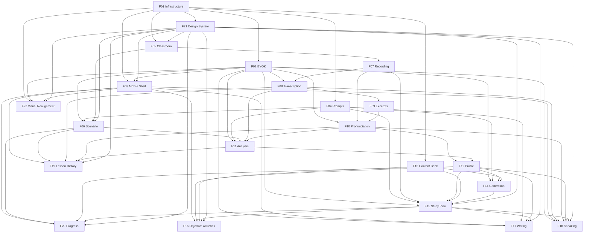

# English Quest

## 1. Executive Summary

English Quest is a private study platform built to take its users from their current level to CEFR **C1** in English — designed around a pair, but not bound to one: the participant limit is configuration and every stage of the processing pipeline forks per participant. Two learners meet in a live conversation lesson held in a Next.js web client over WebRTC. Every lesson opens with a generated scenario: a shared situation naming one role per participant and the relationships between them, plus a private role card for each participant that only its owner sees. The scenario pushes the conversation into a vocabulary domain neither learner would drift toward on their own, while deliberately leaving the outcome open so the exchange stays real rather than scripted.

Every lesson is recorded as one isolated audio track per participant, then processed into an individual diagnosis: an exact transcript with timestamps and speaker attribution, objective pronunciation scores measured on automatically selected excerpts, and a structured pedagogical analysis produced by an LLM that knows the scenario each participant was playing. Each participant receives their own result — nobody sees the other's analysis. Those results accumulate into a persistent **Learning Profile**: six competency scores smoothed across recent measurements, plus an error ledger that tracks every identified mistake by tag, counts how often it recurs, and schedules it for re-presentation until it is mastered.

The profile drives an **individual study plan** organized into short daily sessions that runs until the next lesson replaces it. Listening material comes from a curated bank of authentic audio imported from disk, because TTS-generated audio is too clean to train real listening comprehension. Reading, vocabulary, grammar and error-review material is generated on demand against the learner's actual weaknesses, then checked by a deterministic difficulty gate before it is ever shown — word count, sentence length, lexical rarity, required target structures and a banned-phrase list — so "C1 level" is enforced rather than requested. Both clients do everything except the live call: web and mobile (Flutter) each run all activity types, the lesson history, the profile and the progress dashboard. All AI and Speech consumption runs on **Bring Your Own Key** credentials — each participant's own Gemini and Azure Speech keys process only their own data, a boundary the scenario design respects by never passing one learner's profile through the other's key — and the whole system runs locally under Docker Compose with PostgreSQL, Redis, MinIO and LiveKit, with storage behind an S3-compatible abstraction for a later cloud migration. The product's purpose is not to be a complete English platform: it is to validate whether the loop of **conversation → diagnosis → personalized study → new conversation** measurably improves C1 preparation.

## 2. Problem and Opportunity

### The Problem

**Conversation practice produces no diagnosis, and drifts toward what you already know**
- Two learners practicing together can speak for an hour and leave with no record of what either of them got wrong.
- Self-assessment during a live conversation is unreliable: the speaker is occupied with producing language, not auditing it.
- Unstructured conversation between the same two people converges on comfortable topics and already-mastered vocabulary, so the practice stops stretching after the first few sessions.
- Mistakes that are not written down are not corrected; the same structure is mispronounced or misconjugated across dozens of sessions.
- Neither participant can tell, after three months, whether anything actually improved.

**Study material is generic when the learner's weaknesses are specific**
- Commercial platforms serve the same grammar drills to everyone at a given level, regardless of which structures the learner personally fails.
- A learner who consistently breaks third conditionals gets no more practice on conditionals than one who has mastered them.
- Curating targeted material by hand costs hours per cycle, which is exactly the effort that makes people stop doing it.
- Level labels like "C1" are marketing claims with no verifiable definition behind them, so material advertised as advanced frequently is not.

**Pronunciation is the least measurable skill and the most decisive at C1**
- Learners hear their own pronunciation through their own expectation of it, so self-correction plateaus early.
- Assessing an entire hour of speech through a paid speech API is expensive and mostly wasted on filler, agreement noises and fragments too short to score.
- Without phoneme-level data, "work on your pronunciation" is advice nobody can act on.

**AI language tools cost money per use and hold your data**
- Subscription platforms charge a flat monthly fee whether the loop is used twice or twenty times, which penalizes exactly the experimental usage a two-person MVP needs.
- Free tiers and personal quotas already available to each learner go unused because the platform bills centrally.
- Recording every conversation into a third-party product is a meaningful privacy cost for material this personal.

**Nothing remembers what you keep getting wrong**
- Notes taken in one session are not connected to the next; recurrence is invisible.
- Without a persistent record of error state, there is no way to distinguish a slip from a systematic gap, or to know when something has finally been learned.
- Sending the entire raw history to an LLM on every run is slow, expensive and degrades answer quality as context grows.

### The Opportunity

English Quest attacks each of these with a specific mechanism rather than a general promise.

**Against the missing diagnosis:** recording one isolated audio track per participant makes speaker attribution exact — no diarization guesswork — so every utterance is unambiguously owned. The pipeline turns each lesson into a per-participant result with competency scores, tagged errors quoted verbatim from what was said, and the correction alongside. The differentiator is that the diagnosis is automatic and individual: it happens after every lesson without either learner doing anything, and the analysis of one participant is never visible to the other.

**Against conversational drift:** every lesson carries a generated scenario. A shared situation establishes a setting, a tension and one role per participant with the relationships between them; each learner privately receives the elaboration of their own role — a background, one objective, one constraint, a register and a set of target expressions drawn from their own weaknesses. Because every role card derives from the same shared situation and its pre-assigned roles, the performances stay coherent without any learner seeing another's card. The differentiator is what is deliberately withheld: the situation never states the outcome and the card never supplies dialogue, so the conversation has a direction without having a script — and the analysis afterward knows exactly which domain and register were being attempted.

**Against generic material:** the study plan is composed from the error ledger, not from a syllabus. Generated readings are required to contain the specific structures the learner failed, distributed naturally through an authentic-feeling text. The differentiator is the **deterministic difficulty gate**: generated content is measured in code — word count, mean sentence length, type-token ratio, proportion of vocabulary outside the 3,000 most frequent English words, presence of required structures, absence of banned filler phrases — and regenerated once if it fails. Level stops being a label and becomes a measurement.

**Against unmeasurable pronunciation:** rule-based excerpt selection identifies the utterances actually worth scoring — long enough, dense enough, low-confidence enough to be informative — and sends only those to Azure Pronunciation Assessment, capped at twelve per participant per lesson. The result is phoneme-level data on a bounded budget: the learner gets a ranked list of the exact phonemes and words failing, not an adjective.

**Against per-use cost and data exposure:** every AI call runs on the learner's own API key, and each key touches only that learner's data — a boundary the scenario design preserves by generating the shared situation from no profile at all and each role card from its owner's profile with its owner's key. The platform pays for nothing, personal free tiers get used, and the entire stack runs locally under Docker with recordings stored in MinIO on the learner's own machine. Call volume is deliberately bounded: one analysis call per participant per lesson, one generation batch per plan, one plan-composition call.

**Against the missing memory:** the error ledger holds one record per error tag with occurrence count, first and last sighting, lifecycle state and a due date on a spaced schedule. The LLM never receives raw history — it receives a compact profile summary under 1,500 tokens plus the relevant recent data. Recurrence becomes visible, mastery becomes a state transition, and cost stays flat as history grows.

## 3. Target Audience

### Primary Users

**The Study Partner**
- A learner preparing for an advanced English certification, currently around B2 and targeting C1, studying with a small fixed group — two people today — rather than a rotating community.
- Can commit to a live conversation lesson at irregular intervals plus short study sessions during the day — commuting, breaks, before bed — so material has to work in 15–20 minute blocks on a phone.
- Wants evidence, not encouragement: specific errors quoted back with corrections, phoneme-level pronunciation data, and a score trend that makes stagnation visible instead of hiding it behind streaks and badges.
- Technically comfortable enough to supply their own Gemini and Azure Speech API keys and to run a local Docker stack, and specifically wants the cost of their own usage on their own account.

**The Curator**
- The same person wearing a second hat: the one who sources listening audio from external sites, writes the `meta.json` for each item, and runs the importer.
- Tunes the YAML prompt files when generated material comes out too easy, too formulaic or off-target, using the difficulty-rating signal collected from completed activities.
- Cares about traceability — which prompt version produced which item, and what the gate measured — because the entire point of the MVP is discovering what actually works.
- Works in the repository and on the filesystem, reviewing metadata in git diffs; expects no admin UI and does not want one.

### Behavioral Profile

Both profiles belong to a pair of motivated adults running an experiment on themselves. They will tolerate rough edges, manual steps and a local-only stack, but not silent failure: when something in the pipeline breaks, they need to see which stage failed and why, and be able to retry it. They value being told the truth about their level over being made to feel good about it, and they will abandon any part of the product that costs more effort than the insight it returns. Their usage is bursty and irregular rather than a daily streak, so the product must never punish a gap or lose pending work when the rhythm breaks.

## 4. Objectives

**Close the full loop end to end without manual intervention**
- At least 8 complete cycles (lesson → diagnosis → plan → activities → next lesson) completed within the first 8 weeks of use.
- At least 90% of recorded lessons produce an individual result for every participant with a valid key, with no manual step beyond ending the lesson.
- Zero cycles blocked by a pipeline stage that failed without a visible reason and a retry action.

**Diagnose each participant individually and objectively**
- Every completed lesson yields six competency scores and at least 5 tagged errors per participant with a verbatim quote and a correction.
- Individual results are available within 30 minutes of the lesson ending for at least 90% of lessons.
- Pronunciation data includes at least 8 assessed excerpts per participant per lesson, with a ranked list of the worst 5 phonemes.

**Push conversation beyond the vocabulary the pair already shares**
- 100% of lessons start with a shared situation and a private role card per participant with a valid key.
- No vocabulary domain repeats within any 5 consecutive lessons.
- At least 60% of the target expressions listed on a participant's role card appear in their own transcript for that lesson.

**Personalize study material to measured weaknesses**
- At least 80% of activities in each plan target at least one tag currently unmastered in that participant's error ledger.
- At least 70% of completed activities are rated "just right" rather than "too easy" or "too hard".
- At least 95% of generated items pass the difficulty gate within one regeneration.

**Keep AI consumption on the learner's own key and deliberately bounded**
- Zero platform-paid AI calls: 100% of Gemini and Azure usage is attributed to the key of the learner whose data is being processed.
- At most 1 LLM analysis call per participant per lesson, 1 generation batch per plan, and 1 plan-composition call per plan.
- At most 6 minutes of audio per participant per lesson sent to pronunciation assessment, against lessons of up to 120 minutes.

**Make evolution and persistent difficulty visible**
- After 5 lessons, each participant's profile shows a trend line per competency built on at least 5 measurements.
- After 5 lessons, at least 1 error tag has reached "mastered" state and at least 3 tags are identified as recurring weaknesses.
- 100% of activity outcomes — correct, incorrect, or pronunciation-scored — are written back into the profile within 5 seconds of completion.

## 5. User Stories

### F01. Local Infrastructure and Authentication
- As a developer, I want a single command to bring up the whole stack so that I can start working without configuring six services by hand
- As the system, I want to seed the configured user accounts on first run so that the platform has its users without any registration flow
- As a developer, I want to add a user directly to the database and have that account work end to end so that growing the group is not a code change
- As a user, I want to log in with my email and password so that I can reach my own data
- As a user, I want to stay logged in across sessions so that I do not re-authenticate every time I open the app
- As a developer, I want a health endpoint that reports every dependency so that I can tell which container is the problem

### F02. BYOK Credential Vault
- As a user, I want to save my Gemini and Azure Speech keys so that the platform can process my lessons on my own account
- As a user, I want my key validated the moment I save it so that I find out it is wrong now rather than after a lesson
- As a user, I want to see only a masked version of my saved key so that it is never exposed again after being stored
- As a user, I want to see which of my keys are valid so that I know whether my next lesson will actually be processed
- As a user, I want to replace or delete a key so that I can rotate credentials

### F03. Mobile Application Shell
- As a user, I want to log in on my phone so that I can study away from my computer
- As a user, I want a persistent bottom navigation so that I can move between today's session, my profile, my lessons and settings
- As a user, I want the app to tell me clearly when it cannot reach the server so that I do not mistake a connection problem for missing content
- As a user, I want the app to remember my session securely so that I do not type my password on a phone keyboard daily

### F04. Prompt Library
- As a curator, I want every prompt in a versioned YAML file so that I can review changes in a diff instead of hunting through code
- As a curator, I want the prompt id and version recorded on everything it produces so that I can tell which version generated a bad item
- As the system, I want model output validated against a declared schema so that malformed responses never reach the database
- As the system, I want one automatic retry with the validation errors appended so that a single bad response does not fail the run
- As a developer, I want malformed prompt files to fail at boot so that a typo is caught immediately rather than mid-pipeline

### F05. Live Classroom
- As a user, I want to open the classroom at any time without scheduling so that a lesson can happen whenever we are both free
- As a user, I want to see whether the others have joined so that I know if I am waiting or if the lesson has started
- As the system, I want the participant limit to be configuration rather than a constant so that admitting a third learner does not require reworking the pipeline
- As a user, I want to mute my microphone and turn off my camera so that I can control what I share
- As a user, I want to see my connection quality so that I understand why audio is breaking up
- As a user, I want to end the lesson explicitly so that processing starts when we are actually finished

### F06. Lesson Scenario and Role Cards
- As a user, I want every lesson to open with a situation to discuss so that we stop falling back on the same comfortable topics
- As a user, I want the situation to name every role and how they relate so that everyone is clearly in the same story
- As a user, I want my own private role card so that I have an objective to pursue that the others have to discover through conversation
- As the system, I want the situation to carry one role per participant so that the scenario works for a group of three as well as for a pair
- As a user, I want target expressions on my card so that the lesson pushes the vocabulary and structures I personally need
- As a user, I want the situation to set up a tension without stating how it ends so that the conversation stays real instead of becoming a script
- As a user, I want to reroll the situation before we start so that we are not stuck with a domain neither of us finds useful
- As a user, I want the scenario visible in a panel during the lesson so that I can glance at my role without leaving the call
- As the system, I want the shared situation generated without any profile data so that no participant's profile is ever processed with the other's key

### F07. Lesson Recording
- As the system, I want to record one isolated audio track per participant so that speaker attribution is exact and pronunciation is scored on clean audio
- As a user, I want a visible recording indicator so that I always know the lesson is being captured
- As the system, I want to verify that both audio objects exist and are non-empty before starting the pipeline so that processing never runs on a broken recording
- As a user, I want to be warned immediately if recording failed to start so that we can restart the lesson instead of losing it

### F08. Speech-to-Text Transcription
- As the system, I want to transcribe each participant's track with their own Azure key so that transcription cost falls on the person being transcribed
- As the system, I want to preserve start and end timestamps, word timings and recognition confidence so that later stages can select and align excerpts
- As a user, I want transcription to retry automatically when the service fails so that a transient error does not cost me a lesson
- As a user, I want to be told when my missing key is what is blocking my transcription so that I can fix it and resume

### F09. Excerpt Selection
- As the system, I want to select excerpts by deterministic rules over transcript metadata so that no extra LLM call is needed to decide what to assess
- As the system, I want to cap the number of excerpts per participant per lesson so that pronunciation cost stays bounded and predictable
- As the system, I want to prefer utterances with low recognition confidence and enough substance so that assessment is spent where it is informative
- As a curator, I want the selection rule version recorded on every excerpt so that I can compare results after tuning the thresholds

### F10. Pronunciation Assessment
- As a user, I want objective pronunciation, accuracy, fluency and prosody scores so that I can track a skill I cannot judge myself
- As a user, I want to know which phonemes and words I fail most so that I can practice something specific
- As the system, I want to assess only the selected excerpts so that an hour-long lesson costs minutes of assessment
- As the system, I want to produce an aggregate even when some excerpts fail so that a partial service error does not void the whole lesson

### F11. AI Lesson Analysis
- As a user, I want a structured analysis of my own performance so that I know exactly what to work on
- As a user, I want each identified error quoted verbatim with a correction and an explanation so that I can see what I actually said
- As a user, I want my errors tagged from a fixed taxonomy so that recurrence across lessons is countable
- As a user, I want to know whether I actually used the register and expressions my role card asked for so that the scenario has consequences
- As a user, I want my analysis to be mine alone so that nobody else sees my mistakes
- As the system, I want the transcript truncated to a token budget so that long lessons do not blow up cost or degrade output quality

### F12. Learning Profile and Error Ledger
- As a user, I want six competency scores that update after every lesson so that I have a single picture of where I stand
- As a user, I want my scores smoothed across recent measurements so that one tired lesson does not look like a collapse in ability
- As a user, I want every error I make tracked with how often it recurs so that systematic gaps separate themselves from slips
- As a user, I want an error to be marked mastered only after I get it right repeatedly on different days so that the state means something
- As the system, I want a compact profile summary for prompts so that the LLM never needs the raw history
- As a user, I want my recurring weaknesses and recent improvements listed explicitly so that I can see both sides of my progress

### F13. Content Bank and Curated Import
- As a curator, I want to import listening items from a folder of media plus a metadata file so that I can build the bank from authentic audio I found elsewhere
- As a curator, I want re-importing the same slug to update rather than duplicate so that fixing a typo in metadata is safe
- As a curator, I want per-item validation errors reported without aborting the whole import so that one bad file does not block twenty good ones
- As a curator, I want media uploaded to object storage with only the key kept in the database so that audio files never enter git
- As the system, I want to exclude items a user has already seen recently so that the same reading does not reappear two plans in a row

### F14. AI Content Generation with Difficulty Gate
- As a user, I want reading, vocabulary and grammar items built around my actual weaknesses so that study time targets what I fail
- As a user, I want generated text that does not read like generated text so that practice material feels like real English
- As the system, I want every generated item measured against numeric difficulty criteria before it is shown so that C1 is enforced rather than claimed
- As the system, I want one regeneration with the failed checks appended so that near-misses are recovered without a human
- As the system, I want to fall back to a curated bank item when generation fails twice so that the plan is never left with a hole
- As a curator, I want gate metrics stored on every generated item so that I can see why something passed or failed

### F15. Study Plan Generation
- As a user, I want a plan split into short daily sessions so that I can study in the gaps of my day
- As a user, I want every activity to have a reason attached so that I understand why it was chosen for me
- As a user, I want a mix that always includes listening, reading, speaking and writing so that no skill silently drops out
- As a user, I want errors that are due for review to reappear in my plan so that old mistakes are actually revisited
- As a user, I want unfinished activities that still matter to carry into my next plan so that a busy week does not erase them
- As a user, I want to see how much of my plan I have completed so that I know where I stand before the next lesson
- As a user, I want a new plan even when my lesson's recording failed so that a broken recording never leaves me with nothing to study

### F16. Objective Activity Execution
- As a user, I want to answer multiple choice and fill-in-the-blank questions so that practice is quick on a phone
- As a user, I want to listen to an audio item with a limited number of replays so that the exercise trains real comprehension
- As a user, I want to read the text and keep it visible while answering so that the exercise tests comprehension, not memory
- As a user, I want to see the correct answer with an explanation after I submit so that I learn from the mistake immediately
- As a user, I want to rate the difficulty in one tap so that the material adapts over time
- As a user, I want to resume an activity I left halfway on either device so that an interruption costs nothing

### F17. Writing Activity with AI Correction
- As a user, I want a writing task tied to my weak structures so that I practice producing what I get wrong
- As a user, I want my draft saved automatically so that I never lose text to a closed tab or a dead battery
- As a user, I want structured correction with each error quoted, tagged and explained so that the feedback is actionable
- As a user, I want to see a revised version of my text so that I can compare what I wrote to what it should have been
- As a user, I want my writing errors added to my ledger so that they show up in later review

### F18. Speaking and Pronunciation Activities
- As a user, I want to record myself reading a short text so that my pronunciation is scored against a known reference
- As a user, I want to answer a question out loud so that I practice unscripted speech between lessons
- As a user, I want word-level coloring of my recording so that I can see exactly where pronunciation broke down
- As a user, I want to retake a recording a few times so that a stumble does not become my score
- As a user, I want my pronunciation results to feed the same profile as my lessons so that progress between lessons counts

### F19. Lesson History and Individual Results
- As a user, I want a list of all past lessons with their processing status so that I can find any session and see whether it is ready
- As a user, I want my competency scores shown with the change since the previous lesson so that I see direction, not just position
- As a user, I want to see the scenario we played and the role card I was given so that I can reread my result in the context it came from
- As a user, I want the full transcript with timestamps and speaker attribution so that I can reread what was actually said
- As a user, I want the assessed excerpts marked in the transcript with their scores so that I can connect a score to a moment
- As a user, I want to see exactly which pipeline stage failed and retry it so that a broken lesson is recoverable

### F20. Progress and Evolution Dashboard
- As a user, I want a chart of each competency over time so that I can see whether I am actually improving
- As a user, I want my recurring weaknesses ranked with a trend so that I know what is stubborn
- As a user, I want to see which weaknesses I have recently overcome so that effort feels like it lands
- As a user, I want to see which vocabulary domains we have already covered so that I can tell whether our lessons are varied
- As a user, I want my activity completion statistics so that I can tell whether the plans are realistic for my routine

### F21. Design System
- As a user, I want every screen to use the same visual language so that a status badge means the same thing wherever I see it
- As a user, I want the interface to be legible and operable by keyboard and screen reader so that using it is not a fight
- As a user, I want loading, empty and error states everywhere so that a slow or failed screen tells me what happened instead of showing nothing
- As a developer, I want tokens for spacing, colour, type and radius so that a new screen composes from decisions already made rather than inventing new ones
- As a developer, I want a documented component library so that I can see what exists before writing a fourth kind of card
- As a developer, I want the same component vocabulary named identically on web and mobile so that the two clients cannot drift apart

### F22. Design Reference and Visual Realignment
- As a user, I want the login screen to guide me through its two fields so that signing in reads as deliberate rather than as a bare form
- As a user, I want to reveal the password I just typed so that I can fix a typo instead of retyping the whole thing blind
- As a user, I want the header to show me which screen I am on so that navigating does not depend on remembering
- As a user, I want to see at a glance whether my credentials are ready so that I learn a key is missing before a lesson fails, not after
- As a developer, I want a document mapping every mockup to the features that own its parts so that building a screen starts from a decision already made instead of a fresh interpretation
- As a developer, I want the parts of the mockups that contradict the product recorded with the reason they were dropped so that nobody reintroduces a streak counter six months from now

## 6. Functionalities

### F01. Local Infrastructure and Authentication

**Capabilities:**
- Single `docker compose up` brings up six services: Next.js web client (port 3000), NestJS API (3001), PostgreSQL 16 (5432), Redis 7 (6379), MinIO (9000 API / 9001 console) and LiveKit (7880 HTTP / 7881 TCP).
- All object storage access goes through an S3-compatible abstraction pointed at MinIO, using bucket `english-quest` with prefixes `lessons/`, `content/` and `activities/`. No provider-specific API is used outside the storage adapter, so the same code runs against S3 later.
- A `db:seed` command creates the user accounts declared in configuration — two by default — from environment-provided emails, display names and passwords. It is idempotent: re-running updates the display name and password hash without creating duplicates or touching existing user data.
- The data model imposes no cap on the number of users. An account added by extending the seed configuration, or inserted directly into the database, can log in immediately and use every per-user capability — credentials, profile, study plan, activities and history — without any code change, because nothing outside the classroom is aware of how many users exist.
- Passwords are hashed with bcrypt at cost factor 12. No registration endpoint and no password-reset flow exist; a signed-in user can change their own password in settings.
- Login by email and password issues a session as an HTTP-only, SameSite=Lax cookie carrying an opaque token with a 7-day expiry, sliding on each authenticated request. The session record lives server-side, so logout invalidates it immediately and the session of a deleted user stops working on the very next request.
- **The same token has a second transport, for clients that have no cookie jar.** A dedicated token route returns the opaque token in the response body and sets no cookie, and guarded routes accept it as `Authorization: Bearer`. The session model does not change — one opaque token, one server-side record, immediate revocation — only how a client carries it. The web client keeps using the cookie exclusively, so no response a browser receives ever contains the token and the HTTP-only guarantee holds for the surface it was chosen to protect. This is what makes the mobile client's secure-storage requirement (F03) implementable.
- Failed login attempts are rate-limited to 5 per email per 15 minutes, after which that email is locked for 15 minutes regardless of password correctness.
- A `GET /health` endpoint reports reachability and latency for PostgreSQL, Redis, MinIO and LiveKit individually, returning HTTP 503 if any dependency is down.
- All user-facing text in both clients is in English.
- Database migrations run automatically on API boot and are the only mechanism for schema change.

**Experience:**
The developer clones the repository, copies `.env.example` to `.env`, fills in the user emails and passwords plus the storage encryption secret, and runs `docker compose up`. All six containers come up, but the API and web containers start idle rather than launching their dev servers, so the developer can run only what a given task needs — `docker compose up api` brings the API container together with PostgreSQL, Redis and MinIO and leaves LiveKit down.

Starting the API dev server from inside its container makes it wait for PostgreSQL and Redis to report healthy, run pending migrations, then log a readiness line listing every dependency with its latency. Running the seed command prints the created or updated accounts.

Opening the web client at an unauthenticated route redirects to `/login`, a single centered card with email, password and a sign-in button — no "create account" or "forgot password" links, because neither exists. Submitting shows an inline spinner on the button. On success the user lands on the dashboard. On failure the form shows `Incorrect email or password.` beneath the fields, with the password cleared and focus returned to it. After the fifth failure the message becomes `Too many attempts. Try again in 15 minutes.` and the submit button is disabled with a live countdown.

An authenticated session that expires mid-use causes the next API call to return 401; the client clears local state and redirects to `/login` with a banner reading `Your session expired. Please sign in again.` rather than failing silently.

**Error Handling:**
- Dependency unavailable at boot: the API retries PostgreSQL and Redis connections for 60 seconds with 2-second intervals, then exits with a log line naming the unreachable service and the connection string host. It never starts in a half-working state.
- Seed run before migrations: the command detects missing tables and exits with `Database schema not initialized. Start the API once to run migrations, then re-run db:seed.`
- Invalid or missing session cookie signing secret: the API refuses to boot with `SESSION_SECRET is missing or shorter than 32 characters.` rather than generating an ephemeral secret that would invalidate all sessions on restart.
- Login attempted against a non-existent email: the response is identical in message and timing to a wrong password, so account existence cannot be probed.
- Session cookie present but the referenced user no longer exists: the session is destroyed and the request returns 401 with `Session no longer valid.`

### F02. BYOK Credential Vault

**Provides:**
- Decrypted Gemini API key with validity status, for server-side use only (used by F06, F11, F14, F15, F17)
- Decrypted Azure Speech key and region with validity status, for server-side use only (used by F08, F10, F18)
- Masked credential list per provider — status, last four characters, region and last-validated timestamp, never key material (used by F03)

**Capabilities:**
- Each user stores at most one Gemini API key and one Azure Speech key with its region (e.g. `brazilsouth`).
- Keys are encrypted at rest with AES-256-GCM using a master secret supplied by environment variable; the ciphertext, initialization vector and authentication tag are stored separately. The master secret is never persisted to the database.
- Decrypted key material never leaves the API process and is never included in any response, log line, error message or telemetry payload. Read endpoints return only: provider, masked form showing the last 4 characters, region (Azure only), validity status, and the timestamp of the last validation.
- Saving a key triggers immediate validation with a minimal, low-cost provider call under a 5-second timeout: a model-listing call for Gemini, a token/region issuance call for Azure Speech. The outcome is stored as `valid`, `invalid` or `unverified` (validation itself failed to complete).
- Keys are re-validated automatically once per day at 03:00 local time, and on demand from the settings screen.
- Deleting a key sets the user's status for that provider to `missing`, which immediately blocks the pipeline stages and activity types that depend on it, without affecting any other participant.
- Every use of a key is attributed in an audit record: user, provider, feature, timestamp and outcome — never the key itself.

**Experience:**
Settings shows two cards, one per provider, each with the provider name, current status badge (`Valid`, `Invalid`, `Not verified`, `Missing`), the masked key, and the last-validated time as relative text. A `Gemini` card in `Missing` state shows an explanatory line: `Without a Gemini key, your lessons will be transcribed and scored but not analyzed, and you will not get a role card.` The Azure card in `Missing` state reads: `Without an Azure Speech key, your lessons cannot be transcribed or scored.`

Adding a key opens a form with a masked input and, for Azure, a region select. Submitting disables the form and shows `Validating…` for up to 5 seconds. On success the card flips to `Valid` with a confirmation toast. On failure the form stays open with the provider's own error message surfaced verbatim beneath a plain-language line, for example: `Gemini rejected this key. API key not valid. Please pass a valid API key.` The key is not stored when validation returns an explicit rejection.

The screen exists on both clients, but they do not arrive together: the web screen ships with this feature, and the mobile one ships with F03, which is what creates the Flutter shell it lives in. On mobile the input uses a secure text field with paste enabled and autocorrect disabled. Once saved, the original value cannot be revealed anywhere in either client — replacing it is the only path.

**Error Handling:**
- Provider unreachable during validation: the key is stored with status `unverified` and the card reads `Could not reach Gemini to verify this key. It was saved and will be retried.` Daily re-validation picks it up.
- Key rejected by the provider: the key is discarded, never written to the database, and the rejection message is shown inline. Any previously stored valid key remains untouched.
- Master encryption secret changed or missing at boot: the API refuses to start with `Stored credentials cannot be decrypted with the current BYOK_MASTER_KEY.` rather than silently treating every key as invalid and blocking both users' pipelines.
- Decryption failure on a single record (corrupted ciphertext or failed authentication tag): that key's status is set to `invalid`, the user is notified in settings with `This stored key could not be read. Please enter it again.`, and dependent work is blocked rather than attempted.
- Key becomes invalid between validation and use (revoked upstream): the consuming stage fails with the provider's message, marks the credential `invalid`, and blocks that user's branch with a resumable state instead of retrying and burning quota.

### F03. Mobile Application Shell

**Consumes:**
- F02: masked credential list per provider — status, last four characters, region and last-validated timestamp
- F21: generated Dart theme and the component vocabulary — button variants, badge statuses, meter states — that the Flutter client mirrors

**Capabilities:**
- Flutter application targeting Android 8.0 (API 26) and above, and iOS 14 and above, in portrait orientation.
- Bottom navigation with five destinations: Today, Plan, Profile, Lessons and Settings. The live classroom does not appear — it is web-only.
- Session token stored in platform secure storage (Android Keystore / iOS Keychain), never in shared preferences. Session survives app restart and is cleared on logout or on any 401 response.
- HTTP client attaches the session automatically, retries idempotent requests on 5xx and network errors up to 3 times with exponential backoff (1s, 3s, 9s), and surfaces a single consolidated failure after the last attempt.
- Configurable API base URL, editable in settings, so the app can point at the developer machine's LAN address while the stack runs locally.
- Microphone permission request and an audio recorder producing 16 kHz mono 16-bit WAV, available to the speaking activities.
- No offline mode: when the device has no connectivity the app renders an explicit `No connection` state with a retry action, rather than an empty list or stale content presented as current.
- All interface text in English, matching the web client's terminology exactly.
- Carries the mobile credentials screen, mirroring the web settings screen from F02 — two provider cards with status, masked key and the add, replace, delete and re-validate actions. It is the shell's first real screen rather than empty scaffolding, which is what makes navigation, the API client and error states verifiable on a genuine use case.

**Experience:**
First launch shows the login screen with email and password fields and the API base URL accessible behind a small settings affordance, so a developer can point at the local stack before authenticating. After a successful login the app lands on Today.

Every screen follows the same three states: a skeleton placeholder while loading, content when loaded, and a centered message with a retry button on failure. Failure copy names the cause — `No connection`, `Server unavailable`, `Session expired` — rather than a generic error.

Pull-to-refresh is available on Today, Plan, Profile and Lessons. Navigating between tabs preserves scroll position and in-progress state within the session.

### F04. Prompt Library

**Provides:**
- Rendered prompt execution with structured, schema-validated model output, together with the prompt id and version used (used by F06, F11, F14, F15, F17)

**Capabilities:**
- Every prompt lives in its own versioned YAML file under `prompts/`, carrying: `id`, `version`, `model`, `temperature`, `max_output_tokens`, `response_schema` (JSON Schema for structured output), `system`, `user_template`, `variables` (with required flags), `examples` (few-shot style exemplars), `banned_phrases` and `constraints`.
- The MVP ships nine prompts: `scenario-situation`, `scenario-role-card`, `lesson-analysis`, `reading-generate`, `vocabulary-generate`, `grammar-generate`, `error-review-generate`, `writing-correct` and `study-plan-compose`.
- Prompt files are parsed and structurally validated at API boot. A malformed file, an unknown field, a missing required field or an invalid `response_schema` prevents startup with a message naming the file and the offending path — a typo is caught at boot, never mid-pipeline.
- Rendering substitutes declared variables into `user_template` and fails loudly if a required variable is absent or empty; undeclared variables in the template are a boot-time error.
- Execution calls Gemini with the caller-supplied API key, requesting structured output constrained by `response_schema`, and validates the response against that same schema on return.
- On schema validation failure, exactly one retry is issued with the validation errors appended to the user message as a correction instruction. A second failure raises a hard error to the caller with the raw response retained for inspection.
- Every execution records prompt id, prompt version, model, temperature, input and output token counts, latency and outcome; consumers persist prompt id and version on whatever they produce.
- Requests carry a 90-second timeout; timeouts count as failures and are retried once by the caller's job, not by the library.

**Experience:**
The prompt library has no user interface. Its surface is the repository: the curator edits a YAML file, bumps its `version`, restarts the API and sees the change reflected in the next generation. Because the version is stamped on every produced item, comparing the output of two prompt versions is a database query, and a regression can be traced to the exact file revision that caused it.

On boot the API logs one line per loaded prompt — `Loaded prompt reading-generate v3 (model gemini-2.5-pro, schema OK)` — so a stale or unloaded file is immediately visible.

### F05. Live Classroom

**Consumes:**
- F21: design tokens and the primitive components, plus the loading, empty and error page-state conventions the screen composes from

**Provides:**
- Live lesson session with room identity, participant identities, and lesson start and end events (used by F06, F07)

**Core Scope:**
- Joining the persistent room, publishing and subscribing audio and video, presence and waiting state, mute and camera controls, explicit lesson end.

**Full Scope additions:**
- Input and output device selection, connection quality indicator, automatic reconnection on network drop.

**Capabilities:**
- A single persistent room, `classroom-main`, always available — no scheduling and no calendar.
- Opening the classroom requests a LiveKit access token from the API, scoped to the room with publish and subscribe grants, identified by the user id and valid for 6 hours.
- The room accepts up to `LESSON_MAX_PARTICIPANTS` participants — a configuration value defaulting to 2 and supported up to 4 — and a connection attempt beyond the configured cap is rejected by the API before a token is issued. The cap is configuration rather than a constant: raising it admits another learner with no schema change and no pipeline change, since recording, transcription, excerpt selection, assessment, analysis and every downstream feature already fork per participant. Only the video layout is tuned for the default.
- Microphone is published on join; camera is published by default and can be toggled off. Video is live-only and is never recorded.
- A lesson is considered started the moment 2 participants are connected simultaneously, and this timestamp is what the recording and pipeline use. A participant who joins after that moment is recorded from their own join timestamp and gets an independent pipeline branch over their partial track, so a late arrival costs coverage rather than the whole result.
- Automatic reconnection is attempted for 30 seconds after a network drop, preserving the same lesson; beyond that, the participant is treated as having left.
- Maximum lesson duration is 120 minutes, after which the session ends automatically.
- Ending happens when either participant clicks `End lesson` and confirms, or when both have disconnected for more than 60 seconds.

**Experience:**
The web dashboard shows a single primary action, `Open classroom`. Clicking it requests microphone and camera permissions, shows a device preview with a working level meter, and connects. If nobody else is present, the screen shows a waiting state: `Waiting for {names} to join`, with the local preview and controls already live so the user can check their setup, and the scenario preparation area beside it.

When the second participant connects, the layout switches to two tiles — remote large, local small — and a header appears showing elapsed time, a recording indicator, and connection quality per participant as a three-bar icon. Above the default cap, remote participants render in a uniform grid with the local tile inset; the MVP tunes the layout for two and does nothing further for larger groups. The control bar holds microphone, camera, device settings, the scenario panel toggle and `End lesson`.

Muting shows a persistent badge on the local tile and a matching badge on that participant's tile for everyone else, so nobody talks into a muted microphone unknowingly. Turning off the camera replaces the tile with the participant's initials.

On network degradation the quality icon drops and a subtle banner reads `Your connection is unstable.` On a full drop, a blocking overlay reads `Reconnecting…` with a 30-second countdown; recovery dismisses it and restores the session.

Clicking `End lesson` opens a confirmation dialog naming the consequence: `End the lesson for everyone? Processing will start and results will be ready in about 30 minutes.` Confirming disconnects every participant and returns them to the dashboard, where the lesson appears immediately with a `Processing` status.

**Error Handling:**
- Microphone permission denied: connection is not attempted; the screen shows `English Quest needs microphone access to run a lesson.` with browser-specific instructions and a retry button. Camera denial is non-blocking and starts the lesson audio-only.
- LiveKit unreachable when requesting a token: `The classroom is unavailable right now.` with the underlying reason (`LiveKit server not reachable`) shown in a details line, plus a retry action. No partial session is created.
- A participant attempts to join beyond the configured cap: the API refuses token issuance and the client shows `This classroom is full ({cap} participants).`
- Every participant drops simultaneously mid-lesson: the session is closed after 60 seconds, the lesson is finalized with the audio captured up to that moment, and it is flagged `ended_unexpectedly` in history rather than discarded.
- Token expires during a lesson longer than 6 hours: not reachable in practice given the 120-minute cap, but the client refreshes the token at the 5-hour mark to guarantee no mid-lesson disconnection.

### F06. Lesson Scenario and Role Cards

**Consumes:**
- F02: decrypted Gemini API key with validity status
- F04: rendered prompt execution with structured, schema-validated model output and the prompt id and version used
- F05: live lesson session with room identity, participant identities, and lesson start and end events
- F21: design tokens and the primitive components, plus the loading, empty and error page-state conventions the screen composes from

**Provides:**
- Shared lesson situation: setting, premise, the list of role labels with the relationships between them, vocabulary domain and discussion hooks (used by F11, F19, F20)
- Private role card per participant: role background, private objective, constraint, register and target expressions (used by F11, F19)

**Core Scope:**
- Shared situation generation with one named role per participant and the relationships between them, a private role card per participant, and display in the waiting area and during the lesson.

**Full Scope additions:**
- Weakness-targeted expressions on the role card drawn from the profile, situation reroll, and vocabulary domain rotation.

**Capabilities:**
- Every lesson carries a scenario, generated in the waiting area before the lesson starts. This is preparation inside the room, not scheduling: nothing is booked and nothing happens ahead of time.
- The scenario is two artifacts with deliberately different visibility.
- **Shared situation** — visible to every participant. Contains: a setting in 1–2 sentences; a premise carrying a tension the conversation has to work through; **one role label per participant** together with the relationships between them (for example `Traveler` ↔ `Airline agent at the rebooking desk`); a vocabulary domain; and 3–5 open discussion hooks. The role count follows the lesson's participant count rather than being fixed at two, so the same prompt serves a pair and a group of three. Generated once per lesson by whoever opened the room, with that person's own Gemini key, from **no profile data of any participant** — which is what keeps the BYOK boundary intact for a shared artifact.
- **Private role card** — visible only to its owner, never to any other participant and never in any shared view. Contains: a background of 2–3 sentences; exactly one private objective the others must discover through conversation; one constraint that complicates it; a register to adopt; and 6–10 target expressions or structures to attempt. Generated by that participant's own key, taking the shared situation verbatim, that participant's assigned role label, the other roles' **labels only**, and — when a profile already exists — that participant's own recurring weakness tags, so the target expressions push what they personally need.
- **Coherence by construction:** every role card elaborates a role that was already named and related in the shared situation, so the performances cannot drift into unrelated fictions. The role card prompt is forbidden from inventing a different setting, changing another participant's role, or contradicting the premise.
- **Deliberate open-endedness:** the situation states a premise and a tension but never a resolution; the role card gives an objective but never dialogue lines or sample sentences to read aloud. Both prompts explicitly forbid prescribing the conversation's outcome, so the scenario gives direction without becoming a script.
- Role assignment is randomized when the situation is generated and shown on the shared view, so neither participant always plays the same side.
- Vocabulary domains rotate from a list of 15 — travel, workplace negotiation, healthcare, housing, technology ethics, education, food and hospitality, media and news, environment, personal finance, culture and the arts, law and rights, sport, relationships, science — with no domain repeated within a participant's last 5 lessons, so the rule holds even when the group composition changes.
- Generation cost scales with the group: 1 call for the situation plus 1 per participant for the cards, so a lesson costs 1 + N calls and the reroll ceiling bounds the worst case at 4 × (1 + N).
- The participant who opened the room may reroll the situation up to 3 times before the lesson starts; rerolling regenerates every role card. After the lesson starts the scenario is immutable, so the analysis assesses against exactly what the participants saw.
- First lesson, with no profile yet: role cards are generated from the situation alone and target general C1-range expressions.
- During the lesson a collapsible panel shows the shared situation at all times and the viewer's own role card, so neither participant has to leave the call to remember their objective.

**Experience:**
In the waiting area, beside the local video preview, the scenario area shows `Preparing today's scenario…` while the situation is generated — typically under 15 seconds. It then renders as a card: the setting and premise as prose, the roles as chips with the relationships between them stated on one line (`Traveler ↔ Airline agent at the rebooking desk`), the vocabulary domain as a label, and the discussion hooks as a short bulleted list. A `New situation` button sits below with the remaining rerolls shown (`2 rerolls left`).

Directly beneath, the viewer's own role card appears in a visually distinct panel marked `Only you can see this`. It reads as a briefing: who you are, what you want, what stands in your way, how you should sound, and the expressions to try — the last rendered as chips so they are glanceable mid-conversation rather than a paragraph to read.

When another participant joins, they see the same shared situation immediately and their own card generated with their own key while they set up. No card is ever rendered, returned or exported to anyone but its owner.

Once the lesson starts, the scenario collapses into a side panel toggled from the control bar. Opening it overlays the situation and the viewer's card without interrupting audio or video; the expression chips dim as they are used is not attempted in the MVP — they simply remain visible for reference.

**Error Handling:**
- The participant who opened the room has no valid Gemini key: another participant is offered to generate the situation with theirs — `{name} has no Gemini key. Generate today's situation with yours?` If nobody has a valid key, the lesson may start with no scenario, is flagged `no_scenario`, and the analysis is told explicitly that no scenario was in play rather than being left to infer one.
- Situation generation fails or returns output failing schema validation twice: the waiting area shows `We could not build a situation for today.` with `Try again`, and the lesson can still be started without one rather than being blocked.
- A role card fails while the shared situation succeeded: that participant sees the situation and their assigned role label with `Your role card could not be generated. You can still play this role.` The lesson proceeds and the analysis receives the situation without a card for that participant.
- Reroll limit reached: `New situation` is disabled with `You have used all 3 rerolls for this lesson.`, bounding generation cost against an accidental loop.
- Reroll requested after the lesson has already started: rejected server-side, since the analysis must assess against exactly what was shown while the conversation happened.

### F07. Lesson Recording

**Consumes:**
- F05: live lesson session with room identity, participant identities, and lesson start and end events

**Provides:**
- Per-participant lesson audio object key, lesson id, participant ids, lesson duration, and start and end timestamps (used by F08, F10)
- Per-participant recording outcome: a branch that ended without usable audio because of an error, with its failure reason (used by F15)

**Capabilities:**
- When the lesson starts, the API starts one LiveKit track egress per published audio track, writing directly to MinIO at `lessons/{lessonId}/{userId}/audio.ogg`. Video tracks are not recorded.
- One track per participant guarantees exact speaker attribution with no diarization, and gives pronunciation assessment audio uncontaminated by the other voices. This is what makes the pipeline indifferent to participant count: N participants produce N tracks and N independent branches.
- A lesson record holds: id, room, started_at, ended_at, duration_seconds, participant ids, per-participant object key and byte size, recording status and pipeline status.
- Minimum processable duration is 3 minutes. Shorter lessons are stored with status `too_short` and no pipeline is enqueued.
- On lesson end, egress is stopped, then every participant's object is verified to exist and exceed 10 KB before the pipeline is enqueued — one independent job branch per participant.
- If one participant's track is missing or empty, the other participants' branches still proceed. Each branch is independent from selection through study plan.
- A participant whose recording is unusable because of an error — egress never started for their track, their object is missing or empty, or they captured less than 3 minutes of audio — has their branch set to `failed` with a reason, and a fallback study plan is requested for them (F15), so a broken recording never leaves anyone without study activities. A lesson that is simply shorter than 3 minutes is not an error and requests no plan.
- Recordings are retained indefinitely in the MVP; storage usage is reported on the lesson list.

**Experience:**
A red recording indicator with the word `Recording` appears in the classroom header within 3 seconds of the lesson starting, visible to every participant for the entire session. If egress fails to start, the indicator turns to an amber `Not recording` badge and a dismissible banner reads `This lesson is not being recorded. End and restart to try again.` — surfaced immediately, because a lesson discovered to be unrecorded an hour later is a lesson lost.

After the lesson ends, the user is returned to the dashboard where the lesson appears at the top of the history list with status `Processing` and a stage indicator. If the recording is under 3 minutes, the status instead reads `Too short to analyze (minimum 3 minutes)` and no processing is attempted.

**Error Handling:**
- Egress fails to start for one or more tracks: the lesson continues live and the `Not recording` state is shown immediately to every participant. At finalization, only the affected participant's branch fails, with reason `Recording failed to start.`, while the other participants' branches proceed. The lesson is finalized with status `recording_failed` and no pipeline only when no participant has usable audio.
- Egress stops unexpectedly mid-lesson: the partial object is kept and the lesson is marked `recording_partial` with the captured duration shown; the pipeline runs on the partial audio if it exceeds 3 minutes.
- Object missing or under 10 KB at verification: that participant's branch is set to `failed` with reason `Recording is empty or missing.` and a retry action that re-verifies storage; the other participants' branches proceed normally.
- MinIO unreachable at lesson end: verification retries for 2 minutes, then the lesson is marked `storage_unavailable` with a manual retry that re-runs verification and enqueues the pipeline if the objects are found.
- Lesson exceeds the 120-minute cap: egress is stopped and the session closed automatically, the lesson is finalized normally, and every participant sees `Lesson ended automatically after 2 hours.`

### F08. Speech-to-Text Transcription

**Consumes:**
- F02: decrypted Azure Speech key and region with validity status
- F07: per-participant lesson audio object key, lesson id, participant ids, lesson duration, and start and end timestamps

**Provides:**
- Per-participant utterances with start and end timestamps, text, recognition confidence and per-word timings (used by F09, F11, F19)
- Speech-to-text transcription capability for a single short audio clip, returning text and per-word timings (used by F18)

**Capabilities:**
- Each participant's track is transcribed using that participant's own Azure Speech key and region. Recognition language is `en-US`, configurable per deployment.
- Output is stored as ordered utterances: lesson id, user id, index, start_ms, end_ms, text, recognition confidence, and an array of words each with text, start_ms, duration_ms and, where the provider reports it, confidence. Azure fast transcription reports recognition confidence per utterance rather than per word, so lesson transcripts carry it on the utterance and leave word confidence empty.
- Speaker attribution requires no diarization: one track belongs to exactly one participant by construction.
- All participants' utterance streams are merged by timestamp into a single chronological lesson transcript for display, while remaining individually owned for analysis.
- Processing runs asynchronously on a Redis-backed queue with a per-lesson, per-participant job. Retries occur 3 times with exponential backoff at 30 seconds, 2 minutes and 8 minutes.
- A branch whose user has no valid Azure key is not attempted: it enters state `blocked_missing_key` and resumes automatically when a valid key is saved.
- Expected throughput target: a 60-minute track transcribed within 10 minutes.

**Experience:**
The lesson's processing view shows `Transcribing` as the active stage with a progress indication and the elapsed time for the stage. When the stage completes, the transcript becomes readable in the lesson detail even though later stages are still running — the user does not wait for the full pipeline to read what was said.

If the user has no valid Azure key, the stage renders as blocked rather than failed: `Blocked — add your Azure Speech key to continue.` with a direct link to settings. Saving a valid key resumes the branch within 60 seconds without any further action, and the stage indicator moves on. The other participants' branches are unaffected and may already be finished.

**Error Handling:**
- Azure Speech returns an authentication error: the credential is marked `invalid`, the branch moves to `blocked_missing_key`, and the user sees the provider message plus `Your Azure Speech key was rejected. Update it in settings to resume.` No retry is attempted, to avoid burning a rate limit on a bad key.
- Azure Speech returns a throttling or quota error: the job retries on the standard backoff; after the third failure the branch is marked `failed` with reason `Azure Speech quota exceeded.` and a manual retry action.
- Audio object cannot be read from storage: the job fails immediately with `Recording could not be read from storage.` and offers retry; no partial transcript is written.
- Transcription returns zero utterances for a track longer than 3 minutes: the branch is marked `failed` with reason `No speech detected in this recording.` rather than proceeding into an empty analysis.
- Job crashes mid-write: utterances are written in a single transaction per participant, so a partial transcript is never persisted and the retry starts clean.

### F09. Excerpt Selection

**Consumes:**
- F08: per-participant utterances with start and end timestamps, text, recognition confidence and per-word timings

**Provides:**
- Selected excerpts with source utterance id, start and end timestamps, reference text and selection rule version (used by F10)

**Capabilities:**
- Selection is fully deterministic over transcript metadata — no LLM call, no additional cost, reproducible for the same input and rule version.
- Eligibility filters: utterance duration between 3 and 30 seconds; at least 8 words; at most 40% of tokens classified as filler or backchannel (`uh`, `um`, `yeah`, `right`, `okay`, `hmm` and equivalents); recognition confidence of at least 0.40, which below that indicates unusable audio rather than poor pronunciation — measured as no more than 25% of words below 0.40 where word confidence exists, and on the utterance's own confidence otherwise.
- Ranking among eligible utterances, in order: lowest recognition confidence first (mean word confidence where it exists, otherwise the utterance's own), then highest count of words matching the participant's currently unmastered pronunciation tags, then longest duration.
- Cap of 12 excerpts per participant per lesson, with a minimum spacing rule that no more than 3 excerpts may come from the same contiguous 5-minute window, so the sample spans the lesson rather than clustering in one passage.
- If fewer than 4 eligible utterances exist, all eligible ones are selected. Whenever fewer than 4 excerpts are selected — including when the spacing rule caps a short lesson — the lesson is flagged `sparse_pronunciation_sample` so the aggregate is displayed with lower confidence.
- Every threshold is configuration, and every excerpt records the `selection_rule_version` in force when it was chosen, so results before and after tuning remain comparable.
- Total selected audio per participant per lesson is bounded at 6 minutes by construction (12 × 30 seconds).

**Experience:**
This stage is invisible in normal use and completes in under 2 seconds. The processing view shows `Selecting excerpts` briefly between transcription and pronunciation assessment. Its output becomes visible later: in the lesson transcript, selected utterances are marked with a small badge, and hovering or tapping reveals why the excerpt was chosen — for example `Selected: recognition confidence 0.62, 14 words`.

### F10. Pronunciation Assessment

**Consumes:**
- F02: decrypted Azure Speech key and region with validity status
- F07: per-participant lesson audio object key
- F09: selected excerpts with source utterance id, start and end timestamps, reference text and selection rule version

**Provides:**
- Per-lesson pronunciation aggregates per participant — pronunciation, accuracy, fluency, prosody and completeness scores, worst phonemes and worst words — together with per-excerpt scores, their time ranges and reference text (used by F11, F12, F19)
- Pronunciation assessment capability for a single audio clip against a reference text, returning the same score set plus word-level and phoneme-level detail (used by F18)

**Capabilities:**
- For each selected excerpt, the participant's audio track is sliced to the excerpt's time range and submitted to Azure Speech Pronunciation Assessment using that participant's own key, with the excerpt's transcribed text as the reference text, phoneme-level granularity and prosody assessment enabled.
- Stored per excerpt: pronunciation, accuracy, fluency, prosody and completeness scores (0–100); per-word scores with error type (`Mispronunciation`, `Omission`, `Insertion`, `UnexpectedBreak`, `MissingBreak`, `Monotone`); per-phoneme scores.
- Per-lesson aggregates per participant are computed as duration-weighted means across successful excerpts, plus the 5 lowest-scoring phonemes and the 10 lowest-scoring words, each with occurrence counts and an example excerpt reference.
- Cost is bounded by construction: at most 12 excerpts of at most 30 seconds per participant per lesson, so at most 6 minutes of assessed audio regardless of lesson length.
- Partial success is acceptable: if at least 60% of a participant's excerpts succeed, the aggregate is computed from those and flagged `partial_assessment` with the count. Below 60%, the stage is marked failed.
- Phoneme-level failures (below 60) are recorded as pronunciation tags (for example `phoneme:/θ/`) on the lesson's result, which the error ledger (F12) ingests so they participate in the same recurrence and mastery tracking as grammar errors.
- Audio slicing runs locally with ffmpeg; sliced clips are temporary and deleted after assessment.

**Experience:**
The processing view shows `Assessing pronunciation` with a counter — `4 of 12 excerpts` — so a long-running stage reads as progress rather than a hang. On completion, the lesson result gains a pronunciation section: five scores displayed as labeled meters, a ranked list of failing phonemes each with an example word and the score, and a list of the worst words, each linking to its position in the transcript.

When the lesson was flagged `sparse_pronunciation_sample`, the section carries an explanatory note: `Based on only 3 excerpts — this score is less reliable than usual.` When flagged `partial_assessment`, the note reads `Based on 8 of 12 excerpts; some could not be assessed.`

**Error Handling:**
- Azure key rejected: the branch moves to `blocked_missing_key` with the provider's message, matching transcription's behavior. No retries against a rejected key.
- Individual excerpt fails (network, service error, unusable audio): that excerpt is retried twice, then marked failed and excluded. The stage continues with the remaining excerpts rather than aborting.
- Fewer than 60% of excerpts succeed: the stage is marked `failed` with reason `Too few excerpts could be assessed (5 of 12).` and offers a retry that reprocesses only the failed excerpts.
- ffmpeg slicing fails or produces a zero-length clip: that excerpt is dropped with a logged reason, and the stage proceeds; if slicing fails for every excerpt, the stage fails with `Audio could not be processed for assessment.`
- Azure quota exhausted mid-stage: remaining excerpts are abandoned rather than retried, the aggregate is computed from completed excerpts if the 60% threshold is met, and the user sees `Azure Speech quota was exhausted during assessment.`

### F11. AI Lesson Analysis

**Consumes:**
- F02: decrypted Gemini API key with validity status
- F04: rendered prompt execution with structured, schema-validated model output and the prompt id and version used
- F06: shared lesson situation (setting, premise, role labels and the relationships between them, vocabulary domain) and the participant's own private role card (role background, private objective, constraint, register, target expressions)
- F08: per-participant utterances with start and end timestamps, text and recognition confidence
- F10: per-lesson pronunciation aggregates — pronunciation, accuracy, fluency, prosody and completeness scores, worst phonemes and worst words

**Capabilities:**
- One analysis per participant per lesson, executed with that participant's own Gemini key via the `lesson-analysis` prompt. The analyses are independent jobs and one can succeed while another is blocked.
- Input to the prompt: the participant's own utterances in full, the other participants' utterances as conversational context, the participant's pronunciation aggregates and worst phonemes, the shared situation, the participant's **own** role card, the fixed error taxonomy, and — when a profile already exists from earlier lessons — its compact summary of recurring weakness tags, so the analysis can mark an error as a recurrence rather than a first sighting.
- No other participant's role card is ever included in an analysis, preserving the same privacy boundary that governs results.
- Scenario-aware assessment: because the model knows the vocabulary domain, the assigned role and the register that was asked for, it evaluates whether domain vocabulary was used appropriately and whether register matched the role, rather than judging the speech in a vacuum.
- Transcript input is capped at 12,000 tokens. When exceeded, the oldest utterances are dropped first and the prompt is told explicitly that the opening of the lesson was omitted, so the model does not treat a truncated start as a conversational gap. The participant's own utterances are preserved ahead of the others' context, so a larger group trims the surrounding conversation before it trims the speech being assessed.
- Structured output: competency scores 0–100 for Grammar, Vocabulary, Fluency, Interaction and Comprehension, each with a one-sentence justification; 3 to 5 strengths; an error list where each entry has the verbatim quote, a tag drawn from the fixed taxonomy, the correction, a plain explanation and a severity of `minor`, `moderate` or `major`; the tags flagged as recurring; a scenario-fit block reporting register appropriateness and which of the card's target expressions were and were not attempted; and 3 to 6 topics to practice.
- Errors must be tagged from the taxonomy — free-text tags are rejected by schema validation and trigger the library's single retry — because untagged errors cannot be counted, tracked or reviewed.
- When the lesson is flagged `no_scenario`, the prompt states that no scenario was in play and the scenario-fit block is omitted, so the model never invents a scenario to score against.
- A participant's analysis is visible only to that participant. The shared transcript and shared situation are visible to both; the analysis, scores, error list and role card are not.
- Each analysis stores the prompt id and version, model, token usage and latency.

**Experience:**
The processing view shows `Analyzing` as the final AI stage. On completion the lesson result becomes available, and the lesson's status in history changes to `Ready`.

The result opens with the five competency scores as horizontal meters, each with its change against the previous lesson (`+4`, `−2`, or `—` on a first lesson) and the model's one-line justification beneath. Below that, strengths appear as a short list, then errors grouped by severity — major first — each rendered as a card showing the quote in quotation marks, the correction beneath it with the changed portion emphasized, the explanation, and the tag as a chip. Tags already present in the ledger carry a recurrence badge reading `4th time`.

A scenario-fit block follows: the role that was played, a line on whether the register matched, and the card's target expressions rendered as two groups — used and not used — which turns the role card from a suggestion before the lesson into feedback after it.

The screen closes with topics to practice, which is also the bridge to the study plan generated from the same data.

If the user has no valid Gemini key, the stage renders as blocked with `Blocked — add your Gemini key to analyze this lesson.` and a link to settings. Transcript and pronunciation results remain fully available in the meantime, so a missing key costs the analysis, not the lesson.

**Error Handling:**
- Gemini key missing or rejected: the branch enters `blocked_missing_key`, the credential is marked invalid on explicit rejection, and the stage resumes automatically once a valid key is saved.
- Model returns output failing schema validation twice: the stage is marked `failed` with reason `The analysis came back in an unexpected format.`, the raw response is retained for the curator, and a manual retry is offered.
- Gemini quota or rate limit exceeded: the job retries with backoff at 1, 5 and 15 minutes; after the third failure the stage fails with `Gemini quota exceeded.` and a manual retry.
- Analysis returns zero errors for a lesson longer than 10 minutes: the result is stored but flagged for the curator, since an empty error list at B2–C1 almost always indicates a prompt regression rather than a flawless lesson.
- Request exceeds the 90-second timeout: counted as a failure and retried on the standard backoff; three timeouts fail the stage with `The analysis request timed out.`

### F12. Learning Profile and Error Ledger

**Consumes:**
- F10: per-lesson pronunciation aggregates — pronunciation, accuracy, fluency, prosody and completeness scores, worst phonemes and worst words
- F11: per-participant lesson analysis — competency scores, strengths, tagged errors, recurring tags, scenario fit and topics to practice

**Provides:**
- Profile snapshot: six competency scores with measurement count and trend, recurring weaknesses, recent improvements, and a compact summary text for prompts (used by F14, F15, F20)
- Error ledger: tagged error records with occurrence counts, lifecycle state, due date and example quotes (used by F14, F15, F20)
- Error taxonomy and the outcome ingestion contract for recording new error occurrences and activity-sourced measurements (used by F16, F17, F18)

**Core Scope:**
- Six competency scores with weighted smoothing, the error ledger with occurrence counts, the fixed taxonomy, the compact profile summary, and ingestion from both lessons and activities.

**Full Scope additions:**
- Mastery lifecycle with multi-day confirmation, the spaced re-presentation schedule, and recent-improvements detection.

**Capabilities:**
- Six competency scores on a 0–100 scale: Grammar, Vocabulary, Fluency, Interaction and Comprehension from LLM analysis under a fixed rubric; Pronunciation from Azure aggregates, with Accuracy and Prosody retained as sub-scores.
- Scores are an exponentially weighted moving average, not an overwrite. Lesson measurements carry weight 0.35; activity-sourced measurements carry weight 0.15, since a single exercise is weaker evidence than an hour of conversation. A bad day moves the profile, it does not reset it.
- Before 3 measurements exist for a competency, the score is displayed with a `Warming up` marker and is excluded from trend calculations.
- A fixed error taxonomy of approximately 40 tags spans grammar (`grammar:conditional-3`, `grammar:present-perfect`, `grammar:article-definite`…), vocabulary (`vocab:phrasal-verb`, `vocab:collocation`, `vocab:register`…), discourse (`discourse:connector`, `discourse:turn-taking`…) and pronunciation (`phoneme:/θ/`, `stress:word-level`…). It is the shared vocabulary every other feature writes against, and it is versioned in the repository.
- The error ledger holds one record per tag per user: occurrence count, first_seen, last_seen, sources (lesson ids and activity ids), up to 5 example quotes, lifecycle state and due date.
- Lifecycle: `new` → `practicing` → `mastered`. A tag becomes `mastered` after 3 consecutive correct encounters spread across at least 2 distinct days — same-day repetition does not count as evidence of retention. Any new occurrence returns it to `practicing` and resets the streak.
- Spaced re-presentation intervals after each correct encounter: 1, 3, 7, 16 and 35 days. A tag in `practicing` becomes due when its interval elapses.
- Recurring weaknesses are tags with at least 3 occurrences in the last 30 days that are not mastered, ranked by occurrence count then recency. Recent improvements are tags that reached `mastered` in the last 30 days, plus competencies that gained at least 5 points across their last 3 measurements.
- The compact profile summary rendered for prompts is capped at 1,500 tokens: six scores, up to 10 recurring weakness tags with counts, up to 5 recent improvements and up to 6 example quotes. Raw history is never sent to a model.
- Ingestion is idempotent per source: re-running a lesson's profile update does not double-count its errors.

**Experience:**
The profile screen leads with the six competencies as meters showing the current value, the change since the previous measurement, and a `Warming up` marker where fewer than 3 measurements exist. Pronunciation expands to reveal Accuracy and Prosody.

Below, `Recurring weaknesses` lists tags as rows: the tag's human-readable name (`Third conditional`, not `grammar:conditional-3`), occurrence count, last seen as relative time, a state chip, and a trend arrow. Tapping a row opens a detail sheet with every example quote collected, each linking to the lesson or activity it came from — so an abstract tag resolves to concrete sentences the user actually produced.

`Recent improvements` sits alongside, listing mastered tags with the date mastery was reached and the number of encounters it took.

Both clients render the same screen. Profile updates land within 5 seconds of an activity completing, so finishing an exercise and opening the profile shows the effect immediately.

**Error Handling:**
- An analysis arrives with tags outside the taxonomy: unknown tags are rejected and logged for the curator, known tags are ingested, and the update proceeds rather than failing wholesale.
- Duplicate ingestion of the same lesson or activity: detected by source id and skipped, leaving counts unchanged, so a pipeline retry never inflates the ledger.
- Pronunciation aggregate present but the LLM analysis is blocked: the pronunciation dimension updates and the other five competencies are left untouched, with the profile showing a partial-update note rather than stalling.
- Concurrent updates from a lesson and an activity finishing at the same moment: updates are serialized per user in a transaction so the moving average is never computed from a stale read.
- Taxonomy version changes with tags removed: existing ledger records for removed tags are retained as read-only history and excluded from weakness ranking, rather than deleted along with the evidence behind them.

### F13. Content Bank and Curated Import

**Provides:**
- Content item candidate metadata — id, type, CEFR level, topic, accent, skills, difficulty, target tags and duration (used by F15)
- Full content item payload — body or transcript, questions, answers, explanations and media object key (used by F16)
- Content item persistence keyed by slug, with provenance, target tags and prompt id and version (used by F14)

**Core Scope:**
- The content item schema, the listening importer with per-item validation and idempotency, media upload to object storage, and the query API.

**Full Scope additions:**
- Recently-seen exclusion, curated reading import, and content usage statistics.

**Capabilities:**
- A single content item table backs every activity type, with: id, slug, type (`listening`, `reading`, `vocabulary`, `grammar`, `error_review`), provenance (`curated` or `generated`), cefr_level, title, topic, accent, duration_seconds, skills, difficulty (1–5), source, body or transcript, questions, answers, explanations, target_tags, media object key, prompt id and version (generated items only), gate metrics (generated items only), and created_at.
- The `content:import` CLI reads `assignment-content/<type>/<slug>/`, expecting a media file where applicable plus a `meta.json` matching the item JSON Schema. The listening folder is the MVP's primary target; the same importer accepts curated reading items, which have no media file.
- Import is idempotent by slug: re-running updates metadata in place and re-uploads media only when the file checksum changed. Nothing is ever duplicated, so fixing a metadata typo is a safe, repeatable operation.
- Validation is per item: a malformed `meta.json` reports the failing JSON Schema path and is skipped, while the rest of the batch continues. The run ends with a summary — imported, updated, skipped, failed — and a non-zero exit code if anything failed.
- Media is uploaded to MinIO under `content/{type}/{slug}/{filename}` and only the object key is stored in the database. Audio files are never committed to git; the importer is the bridge between the curator's filesystem and object storage.
- The query API filters by type, CEFR level, skills, target tags and provenance, and excludes items the requesting user has been served within the last 30 days, so the same reading does not reappear in consecutive plans.
- MVP target for the initial corpus: at least 20 listening items spanning at least 3 accents and difficulty levels 3 to 5.

**Experience:**
The curator creates `assignment-content/listening/bbc-climate-debate/` containing `audio.mp3` and `meta.json`, then runs `npm run content:import`. Output streams per item: `✓ bbc-climate-debate (imported, 4.2 MB uploaded)`, `↻ ted-urban-design (updated, media unchanged)`, `✗ npr-housing (meta.json: /questions/2/answer must be one of /questions/2/options)`. The final line summarizes the batch.

Because `meta.json` is versioned in git and the audio is not, a metadata correction shows up as a readable diff in review — which matters when the metadata was drafted with an external AI tool and needs checking.

Content items have no browsing interface in either client; they are surfaced to users only as activities inside a study plan.

**Error Handling:**
- `meta.json` fails schema validation: the item is skipped with the exact failing path reported, the batch continues, and the process exits non-zero so a scripted import cannot silently half-succeed.
- Media file missing for a type that requires one: the item is skipped with `audio file not found in folder`, and no partial database row is written.
- MinIO unreachable during upload: the import aborts before writing any database rows for that item, leaving the bank consistent — never a row pointing at an object that was never uploaded.
- Slug collision across different types: rejected with `slug already used by a listening item`, since the slug is the idempotency key and silently overwriting a different type's item would destroy content.
- Answer key inconsistent with options (correct answer not among the choices): rejected at validation, because this specific defect produces an activity that can never be answered correctly and is invisible until a user hits it.

### F14. AI Content Generation with Difficulty Gate

**Consumes:**
- F02: decrypted Gemini API key with validity status
- F04: rendered prompt execution with structured, schema-validated model output and the prompt id and version used
- F12: profile snapshot — recurring weaknesses and compact summary — and error ledger records due for review
- F13: content item persistence keyed by slug, with provenance, target tags and prompt id and version

**Provides:**
- Generated content items — reading, vocabulary, grammar and error review — persisted in the bank with target tags, gate metrics and prompt id and version (used by F15)

**Core Scope:**
- Generation of reading, vocabulary and grammar items against target tags, the deterministic difficulty gate, single regeneration, fallback to a curated item, and persistence into the bank.

**Full Scope additions:**
- Error-review item generation, genre no-repeat window, and style exemplar rotation.

**Capabilities:**
- Generates four item types against the user's unmastered tags: `reading`, `vocabulary`, `grammar` and `error_review`. Listening is never generated — authentic audio is the entire point of that skill.
- Generation is batched once per study plan, capped at 12 items per run, using the user's own Gemini key.
- Difficulty is expressed as verifiable constraints in the prompt rather than the label "C1". For readings: 450–700 words; mean sentence length 18–26 words; at least 12% of tokens outside the 3,000 most frequent English words; at least 3 occurrences of each required target structure distributed across the text rather than clustered; at least 2 idiomatic or figurative expressions; abstract or argumentative register rather than descriptive.
- Anti-formulaic constraints: a genre is drawn per generation from a rotating list of 10 (opinion column, book review, interview excerpt, letter to the editor, popular-science explainer, obituary, product teardown, travel dispatch, conference talk transcript, historical vignette), with no genre repeated within the user's last 5 generated readings; the text must take a position or present a tension rather than survey a topic neutrally; the listicle shape is forbidden; concrete specifics are required; and a banned-phrase list rejects the recognizable filler of generated prose.
- Two to three short authentic style exemplars live in each YAML prompt as few-shot demonstrations of register, not of content.
- A deterministic gate runs in code with no additional AI call: word count in range; mean sentence length in range; type-token ratio at least 0.45; out-of-frequency-list ratio at least 12%; required target structure occurrences at least 3; zero banned phrases; exactly 5 questions, each with exactly one correct answer, and every answer traceable to a span of the text.
- A failing item is regenerated exactly once, with the specific failed checks appended to the prompt as correction instructions. A second failure discards the item, logs the failure with the prompt version and the measured values, and the plan falls back to a curated bank item of the same type — the plan is never left with a hole.
- Every generated item is persisted into the content bank with provenance `generated`, its target tags, its gate metrics and the prompt id and version, making it reusable in later plans and for the other participant when their ledger matches.
- The top-5,000 English lemma frequency list is versioned in the repository as the gate's reference data.

**Experience:**
Generation is invisible to the user; it happens while the study plan is being prepared, and the plan surfaces `Preparing your plan…` with a progress count during it. Generated items appear in the plan indistinguishable in shape from curated ones — the same activity runner, the same question format.

For the curator, generation is fully traceable. Each generated item carries its prompt version and its measured gate values, so a batch of readings that came out too easy can be diagnosed — `out_of_frequency_ratio: 12.3%, barely at threshold` — and the YAML constraint tightened. Combined with the per-activity difficulty ratings collected from users, this is the loop that tunes the prompts.

**Error Handling:**
- Gemini key missing or rejected: generation is skipped entirely and the plan is composed from curated bank items only, with a note on the plan reading `Some activities use existing material because your Gemini key is missing.` The plan is still produced.
- Item fails the gate twice: it is discarded, the failure is logged with prompt version and measured metrics, and a curated fallback of the same type is substituted. If no curated fallback exists for that type, the slot is dropped and the plan is composed with one activity fewer.
- Generation returns fewer items than requested: the plan proceeds with what was produced, and missing slots are filled from the bank.
- Gemini quota exhausted mid-batch: remaining generations are abandoned rather than retried, already-generated items are kept and persisted, and the plan falls back to the bank for the rest.
- Frequency list file missing or unreadable at boot: the API refuses to start with `Frequency list not found — the difficulty gate cannot run.`, because silently skipping the gate would ship unverified content while appearing to work.

### F15. Study Plan Generation

**Consumes:**
- F02: decrypted Gemini API key with validity status
- F04: rendered prompt execution with structured, schema-validated model output and the prompt id and version used
- F07: per-participant recording outcome — a branch that ended without usable audio because of an error, with its failure reason
- F12: profile snapshot — competency scores, recurring weaknesses and compact summary — and error ledger records due for review
- F13: content item candidate metadata — id, type, CEFR level, topic, accent, skills, difficulty, target tags and duration
- F14: generated content items with target tags and prompt id and version
- F21: design tokens and the primitive components, plus the loading, empty and error page-state conventions the screen composes from

**Provides:**
- Study plan with daily sessions, ordered activity entries referencing content item ids, target tags, estimated minutes and per-activity rationale, together with the activity state update contract (used by F16, F17, F18)
- Plan completion history — activities completed per plan, completion rate and difficulty ratings (used by F20)

**Core Scope:**
- Plan composition with type quotas and daily sessions, deterministic guardrails over the model's selection, and progress tracking.

**Full Scope additions:**
- Carry-over of relevant unfinished activities, per-activity rationale, and review quota scheduling from the ledger.

**Capabilities:**
- A plan is generated automatically for a participant once their lesson analysis and profile update complete. Generation for one participant does not wait on the other.
- A participant whose lesson recording failed (F07) still gets a new plan. It is composed from their existing profile with no new diagnosis, or, on a first lesson with no profile yet, from the bank's general C1-range material, since the unmastered-tag guardrail has nothing to check against. It replaces the active plan with the normal carry-over. If a later retry recovers that recording, the plan produced by the full pipeline replaces the fallback, as any newer lesson's plan would. A lesson that was only too short to analyze produces no plan.
- Structure: 7 daily sessions, each targeting 15–20 minutes and containing 2 to 4 activities. Estimated minutes per activity are computed from item metadata (listening duration, reading word count at 180 words per minute, fixed estimates for the rest), not from the model.
- Type quotas per plan: at least 1 listening, at least 1 reading, at least 1 speaking or pronunciation, at least 1 writing; remaining slots filled with grammar and vocabulary. Review activities drawn from tags due in the ledger occupy up to 30% of the plan's activities.
- Selection uses the `study-plan-compose` prompt with the user's own Gemini key. The model receives the compact profile summary, the list of due review tags, and a candidate list of bank items as metadata only — id, type, level, topic, skills, target tags, duration — never full bodies, so the call stays small. It returns an ordered plan with a one-sentence rationale per activity.
- Deterministic guardrails are applied in code over the model's output: item ids that do not exist are rejected, duplicates are removed, quotas are enforced and filled from the bank if the model under-delivered, session time estimates are recomputed, and any activity whose target tags do not intersect the user's unmastered tags is replaced. The model proposes; code guarantees.
- The plan has no end date. It stays active until the next lesson produces a replacement, which matches a two-person schedule with no fixed cadence.
- Carry-over on replacement: unfinished activities from the previous plan whose target tags are still unmastered are carried into the new plan, up to a maximum of 5, placed in the earliest sessions. Everything else is archived with the old plan and remains readable.
- Exactly one plan is active per user at a time. Previous plans are readable in history with their completion statistics.
- Progress is tracked per activity (`pending`, `in_progress`, `completed`, `skipped`), per session and per plan, with an overall completion percentage.

**Experience:**
After a lesson result becomes ready, the dashboard and the mobile Today screen show `Preparing your plan…` with a progress indicator, replaced within a few minutes by the new plan and a summary line: `7 sessions · 21 activities · focused on third conditionals, phrasal verbs and /θ/`.

Today shows only the current day's session as a short ordered list of cards — type icon, title, estimated minutes, and a state chip — with a single primary action, `Start session`. The Plan tab shows all 7 days as an expandable list with per-day completion, so the user can look ahead or work ahead without being pushed to.

Each activity card can be expanded to reveal its rationale: `Chosen because third conditionals appeared in 4 of your last 5 lessons.` This is the answer to "why am I doing this", and it is why the plan reads as a diagnosis rather than a worksheet.

Completing a session shows a brief summary — activities completed, correct answers, time spent — and, if it was the day's last session, the current plan completion percentage.

When a new plan replaces the old one, carried-over activities are marked with a `Carried over` chip so the user recognizes the unfinished work rather than seeing it as new.

A plan composed after a failed recording opens with the note `Built from your existing profile because this lesson's recording failed.`, so the user knows it carries no new diagnosis rather than mistaking it for one.

**Error Handling:**
- Gemini key missing: the plan is composed by the deterministic guardrails alone — quotas filled from the bank ranked by tag match — and shown with `Built from existing material because your Gemini key is missing.` A plan is always produced; the loop never stalls on a missing key.
- Model returns unknown or duplicate item ids: rejected and replaced from the bank; if more than half the selections are invalid, the model's output is discarded entirely and the plan is composed deterministically, with the event logged against the prompt version.
- Insufficient bank content to satisfy a quota: the plan is produced with fewer activities of that type and carries an explicit note — `No listening activity this week: the content bank has no unseen items at your level.` — rather than silently dropping the skill.
- Plan generation fails entirely: the previous plan remains active rather than being cleared, the user sees `We could not build a new plan. Your previous plan is still available.` with a retry, so the user is never left with nothing to do.
- Two lessons processed in quick succession: plan generation is serialized per user, and only the newest completed lesson produces the active plan; the intermediate plan is created and immediately archived rather than racing.

### F16. Objective Activity Execution

**Consumes:**
- F12: error taxonomy and the outcome ingestion contract for recording new error occurrences and activity-sourced measurements
- F13: full content item payload — body or transcript, questions, answers, explanations and media object key
- F15: study plan activity entries referencing content item ids, target tags and estimated minutes, together with the activity state update contract
- F21: design tokens and the primitive components, plus the loading, empty and error page-state conventions the screen composes from

**Core Scope:**
- Multiple choice and fill-in-the-blank formats, automatic correction, per-question feedback, the difficulty rating, and error ingestion into the ledger.

**Full Scope additions:**
- Sentence ordering and matching formats, cross-device resume, and the listening replay limit.

**Capabilities:**
- Covers grammar, vocabulary, listening, reading and error-review activities across four question formats: multiple choice with 4 options, fill-in-the-blank, sentence ordering and matching.
- Correction is fully automatic in code against the stored answer key. No AI call happens at answer time — cost is spent producing the item, never consuming it.
- Listening activities present an audio player with play, pause and seek, limited to 2 full replays before answers are submitted. The transcript is hidden until submission and revealed with the results, so the exercise trains comprehension rather than reading.
- Reading activities show the text first, then the questions, with the text remaining scrollable and visible while answering — the exercise tests comprehension, not short-term memory.
- Each item carries exactly 5 questions. After submission, every question shows correct or incorrect, the correct answer, and the explanation stored with the item.
- On completion, the activity records: score as correct over total, time spent, per-question answers, and a one-tap difficulty rating of `Too easy`, `Just right` or `Too hard`, with an optional `Not useful` flag. For generated items the rating is stored against the item's prompt version, which is the signal that tunes the prompt library.
- Incorrect answers write error occurrences into the ledger using the item's target tags; correct answers on a `practicing` tag count toward its mastery streak.
- Progress is saved per question as it is answered, so an activity abandoned halfway resumes at the same question on either client.
- Activities can be skipped with a reason, which marks them `skipped` in the plan without writing error occurrences.

**Experience:**
Starting a session opens the first activity full-screen with a progress bar showing position within the session. Question navigation is forward-only within an attempt; answered questions can be reviewed but not changed, which keeps the score meaningful.

Multiple choice presents options as large tap targets. Fill-in-the-blank renders the sentence with an inline input sized to the expected answer, and matching is case-insensitive and tolerant of surrounding whitespace. Sentence ordering uses drag handles on web and press-and-drag on mobile.

Submitting reveals the results view: each question with a check or cross, the user's answer, the correct answer where they differ, and the explanation. Incorrect questions are expanded by default; correct ones are collapsed.

The rating prompt appears immediately after the results as three large buttons — `Too easy`, `Just right`, `Too hard` — with a text link for `Not useful`. It can be dismissed; it is never blocking.

Returning to a half-finished activity shows `Resume` rather than `Start`, and reopens at the first unanswered question with previous answers preserved.

**Error Handling:**
- Listening audio fails to load from storage: the activity shows `This audio could not be loaded.` with a retry, and the activity remains `pending` in the plan rather than being consumed as a failed attempt.
- Connection lost during an activity: answers already submitted are retained locally and synced when connectivity returns; the results view waits rather than discarding the attempt.
- Submission fails server-side: the answers stay on screen with `Your answers could not be saved. Retry?` — the user is never shown a results screen for an attempt that was not persisted.
- Item has a corrupted answer key reaching the runner despite import validation: the question is rendered as unscored with `This question could not be corrected.`, the activity score is computed over the remaining questions, and the item is flagged for the curator.
- Duplicate submission from a double tap or a retry: deduplicated by activity attempt id, so the ledger never receives the same error occurrence twice.

### F17. Writing Activity with AI Correction

**Consumes:**
- F02: decrypted Gemini API key with validity status
- F04: rendered prompt execution with structured, schema-validated model output and the prompt id and version used
- F12: error taxonomy and the outcome ingestion contract for recording new error occurrences and activity-sourced measurements
- F15: study plan activity entries referencing content item ids, target tags and estimated minutes, together with the activity state update contract
- F21: design tokens and the primitive components, plus the loading, empty and error page-state conventions the screen composes from

**Capabilities:**
- The task statement is 80–150 words and explicitly targets the user's weak structures — for example requiring a hypothetical past scenario when `grammar:conditional-3` is unmastered.
- Expected response length is 120–250 words; submission requires at least 80 words, enforced client-side with a live counter.
- Drafts autosave to local storage every 5 seconds and to the server every 30 seconds, and resume on either client from the most recent server copy. A draft is never lost to a closed tab, a dead battery or a switched device.
- On submission the `writing-correct` prompt returns structured output: an overall comment; scores 0–100 for Grammar, Vocabulary, Coherence and Task Achievement; an error list where each entry has the verbatim quote, a taxonomy tag, the correction and an explanation; and a full revised version of the text.
- Errors write into the ledger under their tags. The four scores feed the profile as activity-sourced measurements at weight 0.15, mapping Grammar and Vocabulary onto their competencies and Coherence onto Interaction.
- Rate limit of 10 writing submissions per user per day, protecting the user's own Gemini quota from an accidental loop.
- Submitted text, correction and revision are retained and readable from the activity history.

**Experience:**
The writing screen shows the task at the top, collapsible once reading is done, above a full-height text area with a live word counter that turns from grey to green at 80 words. A subtle `Saved` indicator with a relative timestamp confirms autosave without demanding attention.

`Submit for correction` opens a confirmation noting that submission uses the user's Gemini key and cannot be undone. Correction typically returns within 30 seconds, during which the screen shows `Checking your writing…` with the text still visible.

The result renders the original text with inline highlights on each error — tap or hover reveals a popover with the tag, correction and explanation. A toggle switches to the revised version with changes emphasized, so the user can read their own text and the corrected one as continuous prose rather than as a diff. Below, the four scores appear as meters, followed by the error list grouped by tag with recurrence badges where the tag is already in the ledger.

On a phone the same flow works with the text area expanding to fill the screen and the keyboard's toolbar kept clear of the word counter. Writing on mobile is uncomfortable by nature, but nothing about it is blocked or degraded.

**Error Handling:**
- Gemini key missing or rejected: submission is prevented with `Add your Gemini key to have your writing corrected.` and a link to settings. The draft is preserved untouched, so no work is lost while the key is fixed.
- Correction request fails or times out: the submission is retried once automatically; on a second failure the text is preserved as a submitted-but-uncorrected draft with `Correction failed. Your text is saved — retry when ready.` The activity stays incomplete rather than consuming the attempt.
- Model output fails schema validation twice: the activity is marked `correction_failed`, the raw response is retained for the curator, and the user is offered a retry.
- Two devices editing the same draft: the server copy is authoritative by last-write timestamp, and the losing device shows `This draft was updated on another device.` with the option to view its local version before it is replaced — a conflict is surfaced, never silently resolved.
- Daily submission limit reached: `You have reached today's limit of 10 corrections.` with the reset time, and the draft is saved for submission later.

### F18. Speaking and Pronunciation Activities

**Consumes:**
- F02: decrypted Azure Speech key and region with validity status
- F08: speech-to-text transcription capability for a single short audio clip, returning text and per-word timings
- F10: pronunciation assessment capability for a single audio clip against a reference text, returning pronunciation, accuracy, fluency, prosody and completeness scores plus word-level and phoneme-level detail
- F12: error taxonomy and the outcome ingestion contract for recording new error occurrences and activity-sourced measurements
- F15: study plan activity entries referencing content item ids, target tags and estimated minutes, together with the activity state update contract
- F21: design tokens and the primitive components, plus the loading, empty and error page-state conventions the screen composes from

**Capabilities:**
- Two activity shapes. **Read-aloud**: a reference text of 25–60 words, chosen to contain the user's failing phonemes, assessed directly against that text. **Open response**: a prompt or question answered in 30–90 seconds of unscripted speech, transcribed first and then assessed against its own transcript.
- Recording is 16 kHz mono 16-bit WAV, capped at 120 seconds, captured in the browser via MediaRecorder on web and via the native recorder on mobile, and uploaded to `activities/{activityId}/{userId}/audio.wav`.
- Assessment reuses the same pronunciation capability as the lesson pipeline, on the user's own Azure key, returning pronunciation, accuracy, fluency, prosody and completeness plus word-level and phoneme-level detail.
- Up to 3 attempts per activity; the highest pronunciation score counts, and every attempt is retained so the user can compare them.
- Results feed the profile's pronunciation dimensions as activity-sourced measurements at weight 0.15. Phoneme-level failures write into the ledger under their `phoneme:` tags, joining the same recurrence and mastery tracking as the lesson pipeline produces.
- A minimum of 10 recognized words is required for an attempt to be scored; below that the attempt is discarded as unusable rather than recorded as a low score.
- Audio is retained for the life of the activity so the user can replay their own attempts.

**Experience:**
Read-aloud shows the reference text in large type with a record button beneath. Pressing record shows a live waveform and an elapsed timer; the button becomes stop. After stopping, the user can play their recording back before submitting — a stumble can be discarded without spending an attempt.

Submitting shows `Scoring your pronunciation…` for a few seconds, then the result: the reference text re-rendered with each word colored by its score — green for good, amber for fair, red for poor — above the five score meters. Below, the failing phonemes are listed with an example word from the recording and the score, and tapping a red word plays back that segment of the recording, so the user hears exactly what was scored.

Open response shows the prompt, records the same way, and displays the transcript of what was actually said with the same word-level coloring — which additionally reveals where the user's own speech was unintelligible to recognition.

The attempt counter is always visible — `Attempt 2 of 3` — and previous attempts are listed with their scores so improvement within a sitting is visible. On mobile, the microphone permission is requested on first use with an explanation of why it is needed.

**Error Handling:**
- Azure key missing or rejected: the activity is blocked before recording with `Add your Azure Speech key to use speaking activities.` and a link to settings, so the user does not record only to have it fail.
- Microphone permission denied: `English Quest needs microphone access for speaking activities.` with platform-specific guidance and a retry; the activity remains pending.
- Upload fails: the recording is retained locally and `Your recording could not be uploaded. Retry?` is shown; the attempt is not counted against the limit of 3.
- Fewer than 10 words recognized (silence, wrong microphone, noise): the attempt is discarded with `We could not hear enough speech in that recording.`, it does not count against the attempt limit, and no score is written to the profile.
- Assessment service fails after a successful upload: the recording is preserved server-side and the attempt can be re-scored without re-recording, since the audio is the expensive part to reproduce.

### F19. Lesson History and Individual Results

**Consumes:**
- F06: shared lesson situation (setting, premise, role labels and the relationships between them, vocabulary domain, discussion hooks) and the viewer's own private role card
- F08: per-participant utterances with start and end timestamps, text and recognition confidence
- F10: per-lesson pronunciation aggregates — pronunciation, accuracy, fluency, prosody and completeness scores, worst phonemes and worst words — together with per-excerpt scores, their time ranges and reference text
- F11: per-participant lesson analysis — competency scores, strengths, tagged errors, recurring tags, scenario fit and topics to practice
- F21: design tokens and the primitive components, plus the loading, empty and error page-state conventions the screen composes from

**Capabilities:**
- The lesson list shows every lesson newest first with date, duration, participants, vocabulary domain, overall processing status and, when ready, a one-line summary of the viewer's own result.
- Lesson statuses surfaced distinctly: `Processing`, `Ready`, `Blocked`, `Failed`, `Too short`, `Recording failed`, `Partial`, `No scenario`.
- The lesson detail has four areas: the viewer's individual result, the scenario, the shared transcript, and the processing status of every participant's branch.
- The individual result shows the five LLM competency scores plus pronunciation, each with the delta against the viewer's previous lesson; strengths; errors grouped by severity with quote, correction, explanation and tag, carrying a recurrence badge when the tag is already in the ledger; the scenario-fit block with target expressions used and not used; recurring tags; and topics to practice.
- The scenario area shows the shared situation in full — setting, premise, every role label with the relationships between them, vocabulary domain and discussion hooks — plus the viewer's own role card. No other participant's role card is ever shown.
- The transcript is all participants' utterances merged chronologically with timestamps and speaker labels. Utterances selected as excerpts carry a badge with their pronunciation score, and expanding one shows the word-level detail and the reason it was selected.
- Privacy boundary: the transcript and the shared situation are visible to every participant; the analysis, competency scores, error list, pronunciation aggregates and role card are visible only to their owner. There is no view, endpoint or export that returns another participant's analysis or role card.
- The processing status area shows all stages — scenario, recorded, transcribed, excerpts selected, pronunciation assessed, analyzed, profile updated, plan generated — per participant, each with state, duration, and for blocked or failed stages the reason and a retry action.
- Retrying a stage re-runs it and every downstream stage; upstream results are reused rather than recomputed, so a failed analysis never re-pays for transcription.
- No audio playback of the lesson in the MVP; the transcript is the record.

**Experience:**
The lesson list renders as rows, each with the date as a relative label (`Yesterday`, `3 days ago`), duration, the vocabulary domain as a small chip, a status chip and — when ready — the viewer's headline change: `Grammar +4 · Pronunciation −2`. Rows in `Processing` show which stage is active; rows in `Blocked` show the reason inline, so the fix is obvious without opening anything.

Opening a lesson lands on the result. Scores sit at the top as meters with their deltas; errors follow as cards ordered by severity, each with the quote in quotation marks above the correction with the changed span emphasized. A tag chip on each card opens that tag's ledger detail. The scenario-fit block sits beneath, showing the expressions the role card asked for split into used and not used.

The scenario tab reproduces exactly what was on screen before the lesson — situation and the viewer's own card — so a result can be reread in the context that produced it.

The transcript sits behind another tab and reads as a conversation, alternating speakers with timestamps in the margin. Assessed utterances have a small score badge; tapping expands the word-level coloring inline, connecting a number in the pronunciation section to the exact moment it came from.

The status tab presents the pipeline as a vertical stepper per participant. A blocked stage reads `Blocked — add your Azure Speech key` with a link to settings; a failed stage reads its reason with a `Retry` button and the time of the last attempt. The user always knows which stage failed, why, and what to do.

Both clients render the same four areas with the same information.

### F20. Progress and Evolution Dashboard

**Consumes:**
- F06: shared lesson situation — vocabulary domain per lesson
- F12: profile snapshot — competency scores with measurement count and trend, recurring weaknesses and recent improvements — and error ledger records with occurrence counts and lifecycle state
- F15: plan completion history — activities completed per plan, completion rate and difficulty ratings
- F21: design tokens and the primitive components, plus the loading, empty and error page-state conventions the screen composes from

**Core Scope:**
- The competency trend chart, the current profile snapshot, and the recurring weaknesses list with trends.

**Full Scope additions:**
- Activity completion statistics, the difficulty rating distribution, the phoneme trend list, and the vocabulary domain coverage view.

**Capabilities:**
- A line chart per competency across the last 20 measurements, with a range selector for all time, 90 days and 30 days. Measurements are plotted with lesson and activity sources visually distinguished, since they carry different weights.
- The snapshot block repeats the six current scores with their `Warming up` state where fewer than 3 measurements exist, so the dashboard never implies precision it does not have.
- Recurring weaknesses are ranked by occurrence count with a trend arrow computed over the last 30 days against the previous 30, and a state chip. Recent improvements list mastered tags with the date and the number of encounters required.
- Pronunciation detail lists the 10 worst phonemes with their mean score and trend, each linking to the ledger record and its example quotes.
- Vocabulary domain coverage lists the 15 domains with how many lessons covered each and when it was last used, making a neglected domain visible before it becomes a gap.
- Activity statistics show activities completed per week over the last 8 weeks, plan completion rate per plan, and the distribution of difficulty ratings across `Too easy`, `Just right` and `Too hard` — the number that tells the curator whether generated content is landing at the right level.
- All charts render on both clients with the same data and the same ranges, adapted to width.

**Experience:**
The dashboard opens on the competency chart with all six series and a legend that toggles individual lines, so a user chasing pronunciation can isolate it. Hovering a point on web, or tapping it on mobile, shows the date, value and source — `Lesson · 12 Mar` or `Activity · 14 Mar`.

Beneath it, `Recurring weaknesses` and `Recent improvements` sit side by side on web and stack on mobile. A stubborn tag shows a flat or rising arrow with its count, and this is deliberately the most prominent part of the screen after the chart: the product's value is making persistent difficulty impossible to ignore.

Domain coverage renders as a compact grid of 15 labels, each with its lesson count, dimmed when never used — a glanceable answer to whether the pair keeps landing in the same two or three subjects.

The rating distribution is rendered as a single stacked bar with its three segments labeled by percentage — the honest summary of whether the material is calibrated, read at a glance by the same person who tunes the prompts.

With fewer than 3 measurements the chart area shows `Not enough data yet — complete 3 lessons to see trends.` rather than a misleading two-point line.

### F21. Design System

**Provides:**
- Design tokens covering spacing, colour, typography, radius, elevation and motion, as the single source of styling values (used by F03, F05, F06, F15, F16, F17, F18, F19, F20, F22)
- Component library with the primitives every screen composes from, plus the loading, empty and error page-state conventions (used by F03, F05, F06, F15, F16, F17, F18, F19, F20, F22)

**Core Scope:**
- Tokens, the primitive components, the three page states, and migration of the screens that already exist.

**Full Scope additions:**
- Browsable component documentation, visual regression coverage, and the paired light and dark themes.

**Capabilities:**
- **One framework-neutral token source**, `packages/design-tokens/tokens.json`, from which a build step generates three artefacts: CSS custom properties for the web client, a typed TypeScript module for type-safe access in web code, and a Dart theme for the Flutter client. A value is written once and reaches both clients by generation, never by copying — which is what makes the parity the product requires structural rather than a matter of discipline.
- Token values come from `design/english_quest_design_system`, taking the palette the reference screens actually render: primary `#AE3115`, surface `#FBF8FC`, Plus Jakarta Sans, the 13-step type scale, the 5-step spacing scale and the 6 radii. Where that file's prose disagrees with its own frontmatter, the frontmatter wins, because it is what the approved screens use; the prose is corrected to match rather than left contradicting itself.
- The visual identity is a 2px solid `#18181B` outline paired with a hard offset shadow rather than a blur, and generous radii — `rounded-2xl` on cards, full pills on status chips. Interactive elements press mechanically: on active they translate by the shadow offset and the shadow snaps to nothing.
- No component may use a raw hex value or a hard-coded pixel spacing.
- **Contrast is required where text is read, measured rather than assumed.** Every reading surface — body copy, labels, transcripts, error messages, badge text — meets WCAG AA at 4.5:1, and every non-text border meets 3:1, asserted by a test over the token values in both themes. The palette the approved screens use passes on filled controls once measured: white on primary `#AE3115` is 6.46:1, on secondary `#0058BE` is 6.69:1 and on error `#BA1A1A` is 6.46:1. Only `primary-container #FF6B4A` fails, at 2.82:1 against white, so it is restricted to decorative washes and carries `#18181B` text at 6.29:1 wherever text sits on it. An exemption registry exists in the token test and is **empty**; any entry added to it must carry a written reason and its measured ratio, so an exemption is a visible decision rather than an oversight.
- Primitive components: **Button** (4 variants, 3 sizes, loading and disabled states), **Card**, **Badge** (one per status vocabulary the product uses), **Meter** (a 0-100 score with optional delta and a warming-up state), **Chip** (error tags, target expressions, vocabulary domains), **Field** (label, input, hint, error), and **Stack** and **Grid** layout primitives.
- Page states as components rather than conventions: **Loading** renders a skeleton shaped like the content that is coming, never a bare spinner; **Empty** states what is missing and the single action that fixes it; **Error** says what failed in plain language and offers a retry.
- Every interactive component is reachable and operable by keyboard, carries a visible focus ring drawn from tokens, and exposes the ARIA role its behaviour implies. Status is never carried by colour alone — every badge and meter pairs colour with text or shape.
- Light and dark themes share one token contract. Light is the designed default and the reference screens define it. **Dark is derived, and it needs one structural substitution rather than a value swap**: a hard black offset shadow is invisible against a dark surface, so in dark mode elevation is carried by a 2px light outline and a raised surface token instead. Every other token is a value change. **Light is what an untouched install shows, regardless of OS preference** — the app never silently follows a visitor's system setting into dark. Dark and an explicit "follow the system" mode are both available from the theme toggle and persist once chosen.
- A component documentation page, served by the web client in development, rendering every component with its variants and states side by side in both themes. It is the answer to "does something for this already exist", which is the question that otherwise goes unasked.
- The two screens that already exist — login and settings — are migrated onto the system, and the ad-hoc CSS classes they introduced are deleted.
- Component names, variants and status vocabulary are the contract F03 mirrors in Flutter: the same four button variants, the same badge statuses, the same meter states. Flutter reimplements the rendering and consumes the generated Dart theme; it never reimplements the vocabulary and never copies a value by hand.

- The reference screens carry vocabulary the product does not have — XP, levels, streaks, achievement badges, a "Pro" tier and Google sign-in — none of which exist in this PRD, and several of which Section 7 excludes outright. The visual language is adopted; that vocabulary is not. The amber accent role it used for XP is kept and repurposed for warnings and the profile's warming-up state, which the product does have.

**Experience:**
A developer building a new screen imports primitives and composes them. The screen inherits spacing, colour, focus behaviour and the three page states without deciding any of them. Reaching for a raw hex value or a magic pixel number is a lint failure, not a matter of taste.

The documentation page renders each component with every variant and state, live, in both themes. It exists so that what already exists is discoverable.

For the user the result is that a status badge, a score meter and an empty state look and behave identically on the settings screen, in a lesson result and on the progress dashboard — and that the mobile app, when it arrives, speaks the same language rather than a dialect of it.

**Error Handling:**
- A token referenced but never defined: the build fails rather than falling back to a browser default, because a missing token is invisible until somebody notices the spacing looks wrong.
- A colour pair below its contrast threshold: the token test fails naming the pair and the measured ratio, so it cannot merge.
- An interactive component used without an accessible name: the lint rule fails the build, since an icon-only button with no label is unusable and nothing about it looks broken.

### F22. Design Reference and Visual Realignment

**Consumes:**
- F02: masked credential list per provider — validity status per provider, which the settings status chip aggregates into a single readiness state
- F21: the token layer, the primitive components and the page-state conventions the realigned screens compose from, and which this feature may extend

**Core Scope:**
- Realignment of the three surfaces that already carry real content — login, the authenticated shell header, and settings
- The design reference document mapping every mockup to its owning features and recording what was dropped and why

**Full Scope additions:**
- The settings help card made functional: real links to the Google AI Studio and Azure Portal pages where each key is issued, replacing the static card shipped in Core Scope

**Capabilities:**
- The reference mockups are the four directories under `design/`: `english_quest_sign_in`, `english_quest_settings`, `english_quest_dashboard` and `english_quest_logo`. Each carries a rendered `screen.png` and its `code.html`.
- **Login** gains, from the sign-in mockup: a leading icon inside each of the two fields, an example-address hint aligned to the right of the email label, a reveal control on the password field, and the mockup's larger full-width primary action. The screen is additive only — every element the mockup shows that this product excludes is already absent from the implementation.
- Five sign-in mockup elements are dropped with a recorded reason: the `QUEST SEASON 3` badge and the `+XP` vocabulary (Section 7 excludes streaks and badges), the Google block with its divider and the account-creation link (Section 7 excludes social login and public registration), the password-reset link (Section 7 excludes reset by email), and the `Daily Conversational Roleplay` value card (a marketing panel with no audience on a two-person private platform).
- **Header** gains the mockup's pill navigation with the active destination visibly selected, and the circular avatar treatment. It carries exactly the destinations that exist — today Dashboard and Settings — and the existing theme toggle. The streak and XP chips are dropped under the same Section 7 exclusion. A later feature adds its destination to the same pill rather than redesigning the header.
- **Settings** gains the mockup's heading treatment with its leading icon, the BYOK explanation promoted from a paragraph to a distinguished card, and per-provider cards carrying a provider icon, the masked key rendered as a field rather than loose text, the region chip, and the last-checked line. Actions become `Replace key`, `Re-check` and a compact icon-only delete carrying an accessible name.
- The settings status chip reflects a real aggregate rather than decoration: it reads ready only when both providers hold a key whose status is `valid`, and an attention state whenever either is `missing`, `invalid` or `unverified` — the same condition that determines whether the processing pipeline can run at all.
- Three settings mockup elements are dropped: the copy control on the masked key (the value is masked and Section 6's F02 forbids revealing the original, so the control promises what it cannot deliver), the `Visual Pattern Guide` block showing a screenshot of an earlier iteration, and the Privacy Policy / Terms of Service / Support Desk footer, none of which exist for a private two-person deployment.
- The help card ships as a static card in Core Scope, carrying no link, so the layout it balances is correct from the start and only its content changes later.
- The design reference document is committed under `design/` and carries one entry per mockup with three columns: the mockup region, the feature that owns it, and its status — one of `implemented`, `deferred to F<ID>`, or `dropped` with the Section 7 clause that excludes it. Every region of every mockup appears exactly once, so a region with no entry is a gap in the document rather than an undocumented decision.
- Regions recorded as deferred, with their owning feature: the dashboard hero banner and its primary action (F05), the module cards (F05, F15, F16), the recommended-scenario card (F06), the three statistic cards (F20), and the `Scenarios & Practice` navigation destination (F06). A mock of any of these now would constrain the feature that owns it, which is why they are deferred rather than approximated.
- This feature may extend F21's token layer and primitives where a realignment needs it. Any such change propagates to the Flutter mirror within this same feature, so the two clients never carry different vocabularies for the same component. The visual regression baselines and the component documentation page are regenerated as part of the change.

**Experience:**
Signing in, the two fields now read as a designed pair rather than two stacked inputs: each carries its own leading icon, the email label shows an example address so the expected format is visible before typing, and the password field offers a reveal control for correcting a typo without clearing the field. The primary action spans the card at the mockup's weight. Nothing that the product does not support appears — there is no third-party provider, no account creation, no reset link — so the screen offers exactly the one path that works.

Inside the application the header carries a pill holding the destinations that exist, with the current one visibly selected, so the answer to "where am I" is on screen rather than inferred from the page heading. The user's identity sits at the right as a circular avatar beside the theme toggle.

On settings the BYOK explanation is a card rather than a run of prose, which is what makes it read as a standing condition of the product instead of an introductory paragraph to be skimmed once. Beside the heading a status chip states whether the environment is ready: both keys valid reads as ready, and anything else reads as needing attention, which surfaces a missing or expired key at the moment the screen is opened rather than at the moment a lesson fails to process. Each provider card leads with its own icon, shows the masked key in a field so it reads as a stored value rather than as decoration, and offers replace, re-check and delete — the last as a compact icon carrying its accessible name, so it is reachable by screen reader and does not compete with the two actions used more often.

For a developer the second half of this feature is the part that lasts. Before building a screen, the mockup that covers it is already annotated: which regions are implemented, which belong to a feature not yet built, and which were dropped along with the Section 7 clause that excludes them. The analysis that decided a streak counter contradicts "wants evidence, not encouragement" is written down once, so the next person reading the dashboard mockup does not have to rediscover it — or worse, implement it.

## 7. Out of Scope

**Lesson experience**
- Video recording of lessons and any lesson replay.
- A lesson player with transcript synchronized to audio playback — wanted later, not built now.
- Screen sharing, in-lesson chat, whiteboard, or shared documents.
- Simultaneous lessons or multiple classrooms: there is one room and one lesson at a time, whatever the participant cap is set to.
- Observer mode, a teacher role, and per-participant permissions.
- Video layouts optimized beyond a uniform grid for groups larger than the default of 2.
- Scheduling, calendar integration, or lesson reminders.

**Scenarios**
- Writing or editing a scenario by hand; scenarios are generated, rerolled or absent.
- A library of saved scenarios, scenario sharing, or replaying a past scenario in a new lesson.
- Role-play with the AI as one of the participants.
- Real-time coaching, live hints or in-call correction while the lesson is happening.
- Automatic detection of whether the conversation actually followed the scenario; only the post-lesson analysis comments on scenario fit.

**Accounts and access**
- Public registration, invitations, email verification and password reset by email.
- More than the 2 seeded users, multi-tenancy, teams, or an admin role.
- Social login, two-factor authentication, and single sign-on.

**Mobile**
- Offline use with local caching and later synchronization — explicitly not planned for this project.
- Push notifications for study reminders or result-ready alerts — wanted later, not built now.
- Tablet-optimized layouts, home screen widgets, and landscape orientation.

**Social and comparison**
- Any view comparing participants' progress against each other — explicitly not planned for this project.
- Leaderboards, streaks, badges, and sharing results outside the platform.
- Visibility of one participant's analysis, scores, errors or role card to the other.

**Content**
- AI-generated listening audio via text-to-speech, in any form.
- A content administration interface in either client; content is managed by the importer and the repository.
- Licensing, rights management or attribution workflows beyond a free-text `source` field on each item.
- Content sharing or import from third-party catalogs and APIs.

**AI and providers**
- Any LLM provider other than Gemini, and any speech provider other than Azure Speech.
- Platform-paid keys, pooled credits, or any usage not attributed to the learner's own credentials.
- Fine-tuning, embeddings-based retrieval, streaming responses, and live voice conversation with the AI.
- Automatic prompt optimization; prompts are tuned by hand from the rating and gate signals.

**Infrastructure and operations**
- Cloud hosting, CI/CD pipelines, horizontal scaling, and load balancing.
- Backups, disaster recovery, and data retention or deletion policies.
- A monitoring, alerting or log aggregation stack beyond container logs and the health endpoint.
- Data export, account deletion, and GDPR-style subject access flows.

**Design and visual alignment**
- Building the dashboard, the statistic cards, the module cards or the recommended-scenario card from the mockups ahead of the features that own their data — each is built by its owning feature (F05, F06, F15, F16, F20) after reviewing the design reference, because a mock placed now would constrain the implementation that follows it.
- A second visual language, a per-screen theme, or any styling decision made outside the token layer.
- Redesigning the token layer, the primitive components or the page-state conventions themselves; realignment composes what F21 established and extends it only where a screen genuinely needs it.

**Pedagogy**
- Formal CEFR level certification or an official level placement test.
- Full mock examination simulation for a specific certification, with timing and scoring bands.
- Curriculum sequencing independent of measured weaknesses.
- Support for any target language other than English.

## 8. Dependency Graph

| # | Feature | Priority | Dependencies |
|---|---------|----------|--------------|
| F01 | Local Infrastructure and Authentication | 1 | None |
| F21 | Design System | 1 | F01 |
| F02 | BYOK Credential Vault | 1 | F01 |
| F03 | Mobile Application Shell | 1 | F01, F02, F21 |
| F04 | Prompt Library | 1 | F01 |
| F05 | Live Classroom | 1 | F01, F21 |
| F06 | Lesson Scenario and Role Cards | 1 | F02, F04, F05, F21 |
| F07 | Lesson Recording | 1 | F05 |
| F08 | Speech-to-Text Transcription | 1 | F02, F07 |
| F09 | Excerpt Selection | 1 | F08 |
| F10 | Pronunciation Assessment | 1 | F02, F07, F09 |
| F11 | AI Lesson Analysis | 1 | F02, F04, F06, F08, F10 |
| F12 | Learning Profile and Error Ledger | 1 | F10, F11 |
| F13 | Content Bank and Curated Import | 1 | F01 |
| F14 | AI Content Generation with Difficulty Gate | 1 | F02, F04, F12, F13 |
| F15 | Study Plan Generation | 1 | F02, F04, F07, F12, F13, F14, F21 |
| F16 | Objective Activity Execution | 1 | F03, F12, F13, F15, F21 |
| F17 | Writing Activity with AI Correction | 2 | F02, F03, F04, F12, F15, F21 |
| F18 | Speaking and Pronunciation Activities | 2 | F02, F03, F08, F10, F12, F15, F21 |
| F19 | Lesson History and Individual Results | 1 | F03, F06, F08, F10, F11, F21 |
| F20 | Progress and Evolution Dashboard | 2 | F03, F06, F12, F15, F21 |
| F22 | Design Reference and Visual Realignment | 2 | F01, F02, F03, F21 |

### Foundation Features
These features set up shared project infrastructure. In a greenfield project they must be implemented sequentially before or alongside any feature that depends on them:
- **F01 Local Infrastructure and Authentication** — scaffolds the Docker Compose stack, the Next.js and NestJS applications, database migrations, the S3-compatible storage adapter, and the session and authentication middleware every later feature assumes.
- **F21 Design System** - establishes the token layer, the primitive components and the page-state conventions every screen composes from, plus the component vocabulary the Flutter client mirrors. Its ID sits at the end of the sequence because F01 and F02 were already implemented when it was added; its position in this table is topological, not by ID.
- **F03 Mobile Application Shell** — scaffolds the Flutter project, navigation, secure session storage, the authenticated API client and the audio recorder that every mobile-facing feature builds on.
- **F04 Prompt Library** — establishes the YAML prompt format, the boot-time loader and validator, and the structured-output execution and retry path that every AI-consuming feature calls instead of the model directly.

### Execution Waves
Features within the same wave can be built in parallel. A wave starts only after every feature in earlier waves is complete.

**Note:** Foundation features (see "Foundation Features" above) cannot run in parallel in a greenfield project even if they appear together in a wave — they share scaffolding files and must be implemented sequentially until the base is in place.

- **Wave 1**: F01
- **Wave 2**: F02, F04, F13, F21
- **Wave 3**: F03, F05
- **Wave 4**: F06, F07, F22
- **Wave 5**: F08
- **Wave 6**: F09
- **Wave 7**: F10
- **Wave 8**: F11
- **Wave 9**: F12, F19
- **Wave 10**: F14
- **Wave 11**: F15
- **Wave 12**: F16, F17, F18, F20

### Priority levels
- **1** = Essential — product does not work without it
- **2** = Important — significant value addition
- **3** = Desirable — incremental improvement

## 9. Acceptance Criteria

### F01. Local Infrastructure and Authentication
- [ ] `docker compose up` starts all six services, with the API and web containers idle rather than running a dev server
- [ ] Starting the API dev server reports ready only after PostgreSQL, Redis, MinIO and LiveKit are reachable
- [ ] `GET /health` returns per-dependency status and latency, and returns HTTP 503 when any dependency is stopped
- [ ] `db:seed` creates the users declared in configuration — two by default — and running it a second time updates them without creating duplicates
- [ ] A user account inserted directly into the database can log in and use credentials, profile, study plan, activities and history with no code or seed change
- [ ] Login with correct credentials sets an HTTP-only session cookie and redirects to the dashboard
- [ ] Login with a wrong password and login with a non-existent email return the same message and comparable response times
- [ ] The sixth consecutive failed login for one email within 15 minutes is rejected with the lockout message even when the password is correct
- [ ] An expired session causes the next API call to return 401 and the client to redirect to login with the expiry banner
- [ ] The API refuses to boot when `SESSION_SECRET` is missing or shorter than 32 characters
- [ ] No registration or password-reset endpoint exists in the API surface

### F02. BYOK Credential Vault
- [ ] Saving a valid Gemini key stores it and shows status `Valid` with the last-validated timestamp
- [ ] Saving an invalid key does not persist it and shows the provider's rejection message inline
- [ ] No API response, log line or error message anywhere contains a decrypted key; read endpoints return only the last 4 characters
- [ ] Stored keys are unreadable in the database without the master secret, and the ciphertext, IV and auth tag are stored separately
- [ ] A provider timeout during validation stores the key with status `Not verified` and it is retried by the daily job
- [ ] Deleting an Azure key blocks that user's transcription and pronunciation stages without affecting any other participant's branches
- [ ] The API refuses to boot when the master key cannot decrypt existing stored credentials

### F03. Mobile Application Shell
- [ ] The app builds and runs on Android 8.0
- [ ] The app builds and runs on iOS 14 — configured from the start (deployment target, microphone usage description), but verifiable only on Mac hardware, which the project does not currently have
- [ ] Login persists across app restarts, with the session stored in Keystore or Keychain and absent from shared preferences
- [ ] A 401 from any request clears the session and returns to the login screen
- [ ] With the device offline, every screen shows an explicit `No connection` state with a retry action and never stale content presented as current
- [ ] The API base URL is editable in settings and takes effect without reinstalling the app
- [ ] The live classroom is absent from navigation on mobile
- [ ] Idempotent requests retry 3 times with 1s, 3s and 9s backoff before surfacing a single failure

### F04. Prompt Library
- [ ] All nine MVP prompts load at boot with one log line each naming id, version, model and schema status
- [ ] A malformed YAML file, a missing required field or an invalid `response_schema` prevents API startup with the file and path named
- [ ] Rendering fails loudly when a required variable is absent or empty
- [ ] Model output violating `response_schema` triggers exactly one retry with the validation errors appended
- [ ] A second schema violation raises a hard error to the caller and retains the raw response
- [ ] Every execution records prompt id, version, model, token counts, latency and outcome
- [ ] Every artifact produced by a prompt stores that prompt's id and version

### F05. Live Classroom
- [ ] Opening the classroom requests a token and connects with audio and video published
- [ ] With only one participant present, the screen shows the waiting state with a working local preview and level meter
- [ ] The lesson start timestamp is recorded at the moment the second participant connects
- [ ] A join attempt beyond the configured cap is rejected before a token is issued, with the classroom-full message naming the cap
- [ ] Raising `LESSON_MAX_PARTICIPANTS` to 3 admits a third participant with no schema change and no pipeline change, and that participant receives their own recording track, transcript branch, pronunciation scores, analysis, profile update and study plan
- [ ] A participant joining after the lesson started is recorded from their own join timestamp and gets an independent pipeline branch
- [ ] Muting shows a badge on the muted participant's tile for both users
- [ ] A simulated 10-second network drop shows the reconnecting overlay and restores the same session
- [ ] A network drop longer than 30 seconds treats the participant as having left
- [ ] `End lesson` shows a confirmation naming the consequence, and confirming disconnects every participant
- [ ] Denying microphone permission blocks connection with actionable guidance; denying camera starts the lesson audio-only
- [ ] A lesson reaching 120 minutes ends automatically and is finalized normally

### F06. Lesson Scenario and Role Cards
- [ ] Opening the classroom generates a shared situation containing a setting, a premise, one role label per participant with the relationships between them, a vocabulary domain and 3–5 discussion hooks
- [ ] With 3 participants, the situation names 3 related roles and each participant receives exactly one card, with no change to the prompt file
- [ ] The situation generation request contains no profile data from any participant
- [ ] Each participant receives a private role card with a background, exactly one private objective, one constraint, a register and 6–10 target expressions
- [ ] Each role card is generated with its own owner's Gemini key
- [ ] A role card is never rendered, returned by any endpoint, or exported to anyone but its owner
- [ ] The role card prompt receives the other roles' labels only, and never another participant's card
- [ ] Every role card references the same setting, premise and role relationships as the shared situation, with no contradicting details
- [ ] Neither the situation nor any role card contains dialogue lines, sample sentences to read aloud, or a stated outcome for the conversation
- [ ] Role assignment differs across consecutive lessons rather than always assigning the same side
- [ ] No vocabulary domain repeats within a participant's last 5 lessons
- [ ] Rerolling regenerates the situation and every role card, and is blocked after 3 uses with the limit message
- [ ] A reroll requested after the lesson has started is rejected server-side
- [ ] With no profile yet, role cards are still generated and target general C1-range expressions
- [ ] Once a profile exists, a card's target expressions include at least one of that participant's recurring weakness tags
- [ ] During the lesson, the panel shows the shared situation and only the viewer's own card
- [ ] With no participant holding a valid Gemini key, the lesson can still start and is flagged `no_scenario`

### F07. Lesson Recording
- [ ] Starting a lesson produces exactly one audio object per participant at `lessons/{lessonId}/{userId}/audio.ogg`
- [ ] No video object is created for any lesson
- [ ] The recording indicator appears within 3 seconds of the lesson starting and stays visible to every participant
- [ ] Egress failing to start shows the `Not recording` state immediately; only the affected participant's branch fails with `Recording failed to start.`, and the lesson is finalized with status `recording_failed` when no participant has usable audio
- [ ] A lesson under 3 minutes is stored with status `too_short` and enqueues no pipeline job
- [ ] Every participant's object is verified to exist and exceed 10 KB before the pipeline is enqueued
- [ ] One participant's missing track marks only that branch failed while the other branches proceed to completion
- [ ] MinIO being unreachable at lesson end retries verification for 2 minutes and then offers a manual retry
- [ ] A participant whose recording fails because of an error has a fallback study plan requested for them only, and a lesson under 3 minutes requests none

### F08. Speech-to-Text Transcription
- [ ] Each participant's track is transcribed with that participant's own Azure key and region
- [ ] Utterances are stored with start and end timestamps, text, recognition confidence and per-word timings
- [ ] Every utterance is attributed to exactly one participant with no diarization step involved
- [ ] The merged chronological transcript orders all participants' utterances correctly by timestamp
- [ ] A user with no valid Azure key sees the stage as `Blocked` rather than `Failed`, with a link to settings
- [ ] Saving a valid key resumes the blocked branch within 60 seconds without further user action
- [ ] A transient service error retries 3 times at 30s, 2m and 8m before failing the stage
- [ ] An authentication error marks the credential invalid and does not retry
- [ ] A track with no recognized speech fails the stage with `No speech detected` instead of producing an empty analysis
- [ ] A 60-minute track completes transcription within 10 minutes

### F09. Excerpt Selection
- [ ] Selection requires no LLM call and produces identical output for the same input and rule version
- [ ] Utterances shorter than 3 seconds, longer than 30 seconds, or with fewer than 8 words are never selected
- [ ] Utterances with more than 40% filler tokens are excluded
- [ ] No more than 12 excerpts are selected per participant per lesson
- [ ] No more than 3 selected excerpts fall within the same contiguous 5-minute window
- [ ] Among eligible utterances, lower recognition confidence is selected before higher
- [ ] A lesson yielding fewer than 4 eligible utterances is flagged `sparse_pronunciation_sample`
- [ ] Every excerpt stores its `selection_rule_version`

### F10. Pronunciation Assessment
- [ ] Each selected excerpt is assessed against its own transcribed text as the reference
- [ ] Pronunciation, accuracy, fluency, prosody and completeness are stored per excerpt, with word-level and phoneme-level detail
- [ ] Lesson aggregates are duration-weighted means and include the 5 worst phonemes and 10 worst words
- [ ] Total audio submitted per participant per lesson never exceeds 6 minutes regardless of lesson length
- [ ] A single failing excerpt is retried twice, then excluded, and the stage continues
- [ ] With 8 of 12 excerpts succeeding, the aggregate is computed and flagged `partial_assessment` with the count shown
- [ ] With fewer than 60% of excerpts succeeding, the stage fails and offers a retry of only the failed excerpts
- [ ] Phoneme failures are written to the ledger as `phoneme:` tags
- [ ] Temporary sliced audio clips are deleted after assessment

### F11. AI Lesson Analysis
- [ ] One analysis is produced per participant per lesson using that participant's own Gemini key
- [ ] Output contains five competency scores with justifications, 3 to 5 strengths, tagged errors, a scenario-fit block and 3 to 6 topics to practice
- [ ] Every error entry contains a verbatim quote, a taxonomy tag, a correction, an explanation and a severity
- [ ] An error tag outside the taxonomy fails schema validation and triggers the library retry
- [ ] The analysis input contains the shared situation and the participant's own role card, and never another participant's card
- [ ] The scenario-fit block reports register appropriateness and lists which target expressions were and were not attempted
- [ ] A lesson flagged `no_scenario` produces an analysis with the scenario-fit block omitted and no invented scenario
- [ ] Transcript input is capped at 12,000 tokens, dropping the oldest utterances first and telling the model it was truncated
- [ ] A participant cannot access the other participant's analysis through any view, endpoint or export
- [ ] A missing Gemini key blocks only the analysis stage; transcript and pronunciation results remain available
- [ ] Two consecutive schema failures mark the stage failed with the raw response retained and a retry offered
- [ ] One participant's analysis failing does not prevent the other's from completing

### F12. Learning Profile and Error Ledger
- [ ] Six competency scores are maintained, with pronunciation sourced from Azure and the other five from LLM analysis
- [ ] A new lesson measurement moves a score by a weighted average at 0.35, never overwriting it
- [ ] An activity-sourced measurement moves a score at weight 0.15
- [ ] A competency with fewer than 3 measurements displays `Warming up` and is excluded from trends
- [ ] Each error tag has one ledger record per user with occurrence count, first and last seen, sources and up to 5 example quotes
- [ ] A tag reaches `mastered` only after 3 consecutive correct encounters across at least 2 distinct days
- [ ] A new occurrence returns a mastered tag to `practicing` and resets its streak
- [ ] Due dates follow the 1, 3, 7, 16 and 35 day intervals
- [ ] Recurring weaknesses list exactly the unmastered tags with at least 3 occurrences in the last 30 days
- [ ] The compact profile summary rendered for prompts never exceeds 1,500 tokens
- [ ] Re-running a lesson's profile update does not change any occurrence count
- [ ] Unknown tags in an analysis are rejected and logged while known tags are still ingested

### F13. Content Bank and Curated Import
- [ ] `content:import` imports a listening item from a folder containing a media file and a valid `meta.json`
- [ ] Re-running the import for the same slug updates the item and creates no duplicate
- [ ] Media is re-uploaded only when its checksum changed
- [ ] An item with an invalid `meta.json` is skipped with the failing JSON Schema path reported, and the remaining items still import
- [ ] A run containing any failure exits with a non-zero code and prints the imported, updated, skipped and failed counts
- [ ] Media lives in MinIO under `content/{type}/{slug}/{filename}` and the database stores only the object key
- [ ] An item whose correct answer is not among its options is rejected at validation
- [ ] A slug already used by another type is rejected rather than overwriting
- [ ] MinIO being unreachable aborts that item before any database row is written
- [ ] The query API excludes items served to the requesting user within the last 30 days

### F14. AI Content Generation with Difficulty Gate
- [ ] Generation produces reading, vocabulary, grammar and error-review items, and never listening items
- [ ] A generation run is capped at 12 items and happens once per study plan
- [ ] Generated readings that pass the gate are 450–700 words with mean sentence length between 18 and 26 words
- [ ] A generated reading with fewer than 12% of tokens outside the top-3,000 frequency list fails the gate
- [ ] A generated item containing a banned phrase fails the gate
- [ ] A generated item with fewer than 3 occurrences of its required target structure fails the gate
- [ ] A generated item with other than exactly 5 questions, or a question without exactly one correct answer, fails the gate
- [ ] A failing item is regenerated exactly once with the failed checks appended to the prompt
- [ ] An item failing twice is discarded and replaced by a curated bank item of the same type
- [ ] No genre repeats within a user's last 5 generated readings
- [ ] Every generated item is persisted with provenance `generated`, its target tags, its gate metrics and the prompt id and version
- [ ] The API refuses to boot when the frequency list file is missing

### F15. Study Plan Generation
- [ ] A plan is generated automatically once a participant's analysis and profile update complete
- [ ] The plan contains 7 daily sessions of 2 to 4 activities each, targeting 15–20 minutes per session
- [ ] Every plan contains at least one listening, one reading, one speaking or pronunciation and one writing activity, or an explicit note naming the missing type
- [ ] Review activities never exceed 30% of the plan's activities
- [ ] The composition prompt receives only item metadata, never full item bodies
- [ ] Item ids returned by the model that do not exist are rejected and replaced from the bank
- [ ] An activity whose target tags do not intersect the user's unmastered tags is replaced
- [ ] Session time estimates are recomputed in code from item metadata rather than taken from the model
- [ ] Up to 5 unfinished activities with still-unmastered tags carry into the next plan, marked `Carried over`
- [ ] Exactly one plan is active per user, and archived plans remain readable with their statistics
- [ ] A missing Gemini key still produces a deterministically composed plan with the explanatory note
- [ ] Plan generation failing leaves the previous plan active rather than clearing it
- [ ] A participant whose lesson recording failed receives a new plan composed from their existing profile, carrying the failed-recording note, and a lesson that was only too short produces no plan

### F16. Objective Activity Execution
- [ ] Multiple choice, fill-in-the-blank, sentence ordering and matching all render and correct automatically
- [ ] No AI call is made at answer or correction time for any objective activity
- [ ] A listening activity permits at most 2 full replays before submission and reveals the transcript only afterward
- [ ] A reading activity keeps the text visible and scrollable while the questions are answered
- [ ] After submission every question shows correctness, the correct answer and the stored explanation
- [ ] Fill-in-the-blank matching is case-insensitive and tolerates leading and trailing whitespace
- [ ] Completion records score, time spent, per-question answers and the difficulty rating, with the prompt version for generated items
- [ ] Incorrect answers write error occurrences to the ledger under the item's target tags within 5 seconds
- [ ] A correct answer on a `practicing` tag advances its mastery streak
- [ ] An activity abandoned halfway resumes at the first unanswered question on the other client
- [ ] A failed submission keeps the answers on screen and never shows a results view for an unsaved attempt
- [ ] A duplicate submission is deduplicated and does not double-write error occurrences

### F17. Writing Activity with AI Correction
- [ ] The task statement targets at least one of the user's unmastered tags
- [ ] Submission is blocked below 80 words, with a live counter showing progress toward the threshold
- [ ] Drafts autosave locally every 5 seconds and to the server every 30 seconds
- [ ] A draft started on one client resumes on the other from the most recent server copy
- [ ] Correction returns overall comment, four scores, tagged errors with quote, correction and explanation, and a revised version
- [ ] The result view shows inline error highlights on the original and a toggle to the revised version
- [ ] Writing errors are written to the ledger and the four scores update the profile at weight 0.15
- [ ] The eleventh submission in one day is rejected with the limit message and the reset time, and the draft is preserved
- [ ] A missing Gemini key blocks submission with a link to settings and preserves the draft untouched
- [ ] A failed correction preserves the text and leaves the activity incomplete rather than consuming the attempt
- [ ] A draft edited on two devices surfaces the conflict instead of silently discarding either version

### F18. Speaking and Pronunciation Activities
- [ ] Read-aloud activities present a 25–60 word reference text and assess the recording against it
- [ ] Open-response activities transcribe the recording first and then assess it against that transcript
- [ ] Recordings are 16 kHz mono WAV capped at 120 seconds and uploaded to `activities/{activityId}/{userId}/audio.wav`
- [ ] The user can play back a recording before submitting it, and discarding it does not consume an attempt
- [ ] At most 3 attempts are allowed per activity, the highest pronunciation score counts, and all attempts are retained
- [ ] Results show word-level coloring, five score meters and the failing phonemes with example words
- [ ] Tapping a poorly scored word plays back that segment of the recording
- [ ] An attempt with fewer than 10 recognized words is discarded, does not count against the limit and writes no score
- [ ] Pronunciation results update the profile at weight 0.15 and write `phoneme:` tags to the ledger
- [ ] A missing Azure key blocks the activity before recording rather than after
- [ ] A failed assessment after a successful upload can be re-scored without re-recording

### F19. Lesson History and Individual Results
- [ ] The lesson list shows every lesson newest first with date, duration, participants, vocabulary domain and status
- [ ] Statuses `Processing`, `Ready`, `Blocked`, `Failed`, `Too short`, `Recording failed`, `Partial` and `No scenario` are visually distinct
- [ ] A ready lesson shows the viewer's competency scores with the delta against their previous lesson
- [ ] Errors are grouped by severity and each shows quote, correction, explanation and tag
- [ ] A tag already in the ledger displays a recurrence badge with its count
- [ ] The scenario area shows the full shared situation and the viewer's own role card only
- [ ] No other participant's role card is reachable from any view, endpoint or export
- [ ] The scenario-fit block lists target expressions split into used and not used
- [ ] The transcript merges all participants chronologically with timestamps and speaker labels
- [ ] Assessed utterances carry a score badge and expand to word-level detail and the selection reason
- [ ] A participant cannot reach the other's analysis, scores or errors through any view or endpoint
- [ ] The status tab shows every stage per participant with state, duration and, when relevant, reason and retry
- [ ] Retrying a failed stage re-runs it and its downstream stages while reusing upstream results
- [ ] No audio playback control appears anywhere in the lesson detail

### F20. Progress and Evolution Dashboard
- [ ] A line chart plots each competency across the last 20 measurements with selectable all-time, 90-day and 30-day ranges
- [ ] Lesson-sourced and activity-sourced measurements are visually distinguished on the chart
- [ ] Competencies with fewer than 3 measurements display `Warming up` and are excluded from trend arrows
- [ ] With fewer than 3 measurements overall, the chart area shows the explanatory empty state instead of a line
- [ ] Recurring weaknesses are ranked by occurrence count with a 30-day trend arrow and a state chip
- [ ] Recent improvements list mastered tags with the mastery date and the number of encounters required
- [ ] The 10 worst phonemes are listed with mean score and trend, each linking to its ledger record
- [ ] Domain coverage lists all 15 vocabulary domains with lesson counts, dimming those never used
- [ ] Activity statistics show completions per week for 8 weeks, plan completion rate and the difficulty rating distribution
- [ ] Both clients render the same data and ranges

### F21. Design System
- [ ] Every spacing, colour, radius and type value in the web client resolves to a token; no raw hex or magic pixel value survives a lint pass
- [ ] Every reading surface meets WCAG AA at 4.5:1 and every non-text border 3:1, in both themes, asserted by a test reporting the measured ratio on failure; the exemption registry is empty, and any entry added to it carries a written reason and its measured ratio
- [ ] Button, Card, Badge, Meter, Chip, Field, Stack and Grid all exist with the variants and states listed in the capabilities
- [ ] Loading, Empty and Error are components, and each renders the content shape, the missing thing, or the failure and its retry respectively
- [ ] Every interactive component is operable by keyboard alone, with a visible focus ring drawn from tokens
- [ ] No status is carried by colour alone; every badge and meter pairs its colour with text or shape
- [ ] Light and dark themes render every component legibly across the full documentation page, with elevation carried by outline rather than shadow in dark mode
- [ ] `tokens.json` generates CSS custom properties, a typed TypeScript module and a Dart theme, and changing one value there changes all three outputs
- [ ] No hex value or spacing number appears in more than one place across the token outputs
- [ ] No screen or component carries XP, levels, streaks, achievement badges, a paid tier or third-party sign-in
- [ ] The documentation page lists every component with each variant and state, in both themes
- [ ] The login and settings screens render entirely from the system, and the ad-hoc classes they introduced no longer exist
- [ ] A component referencing an undefined token fails the build rather than falling back to a browser default

### F22. Design Reference and Visual Realignment
- [ ] The login email and password fields each render a leading icon, the email label carries an example address, and the password field has a working reveal control that toggles the value between masked and visible
- [ ] The login screen contains no third-party sign-in provider, no account-creation link, no password-reset link, no season or XP badge, and no marketing value card
- [ ] The header renders a pill navigation containing exactly Dashboard and Settings, with the destination matching the current route visibly selected, plus the circular avatar and the theme toggle
- [ ] The header contains no streak counter and no XP total
- [ ] The settings screen renders the BYOK explanation as a distinguished card, and each provider card shows a provider icon, the masked key in a field, the region where applicable, and the last-checked time
- [ ] The settings status chip reads ready when both providers are `valid`, and reads as needing attention when any provider is `missing`, `invalid` or `unverified`
- [ ] The settings delete action is an icon-only control carrying an accessible name, and is reachable and announced by keyboard and screen reader
- [ ] The settings screen contains no copy control on the masked key, no visual pattern guide block, and no Privacy Policy, Terms of Service or Support Desk footer
- [ ] The help card renders with static content and exposes no link, and the accompanying plan records making it functional as outstanding work
- [ ] The design reference document exists under `design/`, covers all four mockups, and every region of every mockup carries exactly one status of `implemented`, `deferred to F<ID>` or `dropped`
- [ ] Every region recorded as `dropped` names the Section 7 clause that excludes it
- [ ] Every region recorded as `deferred` names the feature that owns it, and the dashboard hero, module cards, recommended-scenario card, statistic cards and `Scenarios & Practice` destination are all present as deferred entries
- [ ] No dashboard content, statistic card or scenario card is implemented or mocked by this feature; the dashboard continues to render its placeholder
- [ ] Any primitive or token changed by this feature is reflected in the Flutter mirror, the component documentation page and the regenerated visual regression baselines within the same change
- [ ] Both clients continue to name the same component with the same variant and status vocabulary after the realignment

### Cross-Feature Integration
- [ ] A lesson session opened in the classroom (F05) is the session the scenario (F06) attaches to, and the scenario's participants match the session's participant identities
- [ ] The shared situation generated through the prompt library (F06, F04) contains one role label per participant, those labels are what the role card prompt then receives, and each card's setting and premise match the situation it came from
- [ ] A lesson started in the classroom (F05) produces a lesson record whose start timestamp and participant identities match what recording (F07) uses to name and attribute its audio objects
- [ ] The per-participant audio object keys written by recording (F07) are read by transcription (F08) and each track is transcribed with that same participant's Azure key from the vault (F02)
- [ ] The same audio object keys from recording (F07) are used by pronunciation assessment (F10) to slice excerpt audio, and each slice's time range matches the excerpt's timestamps
- [ ] A participant whose recording branch fails with an error in recording (F07) receives a plan from plan composition (F15) built from their existing profile, while the other participants' branches and plans are unaffected
- [ ] Utterances produced by transcription (F08) with their confidence values and word timings are the exact input excerpt selection (F09) filters and ranks over
- [ ] Excerpts selected by F09, with their reference text and time ranges, are the exact set submitted by pronunciation assessment (F10), with no excerpt added or dropped between the stages
- [ ] Transcript utterances (F08), pronunciation aggregates (F10) and the scenario with the participant's own role card (F06) all appear in the analysis input (F11), and the analysis quotes errors verbatim from those utterances
- [ ] The scenario-fit block in the analysis (F11) refers only to target expressions that appear on that participant's own role card (F06)
- [ ] Prompt execution through the library (F04) stamps its prompt id and version onto the scenario artifacts (F06), the analysis (F11), generated items (F14), plan composition (F15) and writing corrections (F17)
- [ ] Gemini and Azure credentials from the vault (F02) are the only credentials used by F06, F08, F10, F11, F14, F15, F17 and F18, and each is used exclusively on its own owner's data
- [ ] The masked credential list from the vault (F02) renders on the mobile credentials screen (F03) with the same statuses the web screen shows, and no key material reaches the device
- [ ] Pronunciation aggregates (F10) update the profile's pronunciation dimension and LLM scores (F11) update the other five (F12), with each source respecting its own weight
- [ ] Tagged errors from the analysis (F11) appear in the ledger (F12) with their quotes, and recurrence counts increment across consecutive lessons carrying the same tag
- [ ] The profile snapshot and due ledger records (F12) determine the target tags of generated content (F14), and every generated item's target tags intersect the user's unmastered tags
- [ ] The profile snapshot and due ledger records (F12) reach plan composition (F15) as the compact summary and review-tag list, and every activity placed in the plan targets a tag currently unmastered for that user
- [ ] Generated items are persisted through the content bank's persistence contract (F13) with provenance `generated`, and are then retrievable as candidates by the plan composer (F15)
- [ ] Candidate metadata from the bank (F13) and generated items (F14) are both drawn on by plan composition (F15), and every activity in the resulting plan references a content item id that exists
- [ ] Plan activity entries (F15) resolve to full item payloads from the bank (F13) when opened in the activity runner (F16), including questions, answers, explanations and the listening media object key
- [ ] Activity outcomes recorded through the ingestion contract (F12) from objective activities (F16), writing (F17) and speaking (F18) all update the same competency scores and ledger records within 5 seconds
- [ ] The pronunciation assessment capability provided by F10 returns the same score set for a speaking activity clip (F18) as it does for a lesson excerpt, and both write `phoneme:` tags to the same ledger
- [ ] The transcription capability provided by F08 transcribes an open-response recording (F18) and that transcript becomes the reference text for its assessment
- [ ] Activity state updates through the plan contract (F15) from F16, F17 and F18 are reflected in the plan's completion percentage and in the dashboard's statistics (F20)
- [ ] Scenario (F06), transcript (F08), excerpt scores (F10) and analysis (F11) all render in the same lesson detail (F19), and the excerpt badges in the transcript match the scores shown in the pronunciation section
- [ ] Vocabulary domains recorded on each situation (F06) drive the domain coverage view (F20), and the counts there match the domains shown on the lesson list (F19)
- [ ] Profile snapshot and ledger records (F12) plus plan completion history (F15) render consistent values in the dashboard (F20) and in the profile screen, with no divergence between the two views
- [ ] Every screen built by F03, F05, F06, F15, F16, F17, F18, F19 and F20 composes from the tokens and primitives of the design system (F21), carries its loading, empty and error states from the shared page-state conventions, and introduces no raw colour or spacing value
- [ ] The per-provider validity statuses from the vault (F02) are what drive the realigned settings status chip (F22): deleting either key flips the chip to its attention state, and restoring a valid key for both flips it back to ready
- [ ] The realigned screens (F22) render entirely from the token layer and primitives of the design system (F21), with no raw colour or spacing value introduced, asserted by the same guard F21 established
